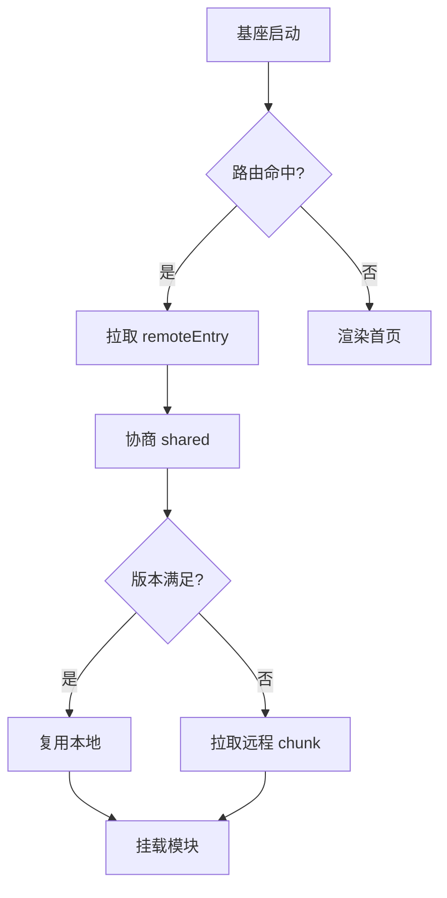
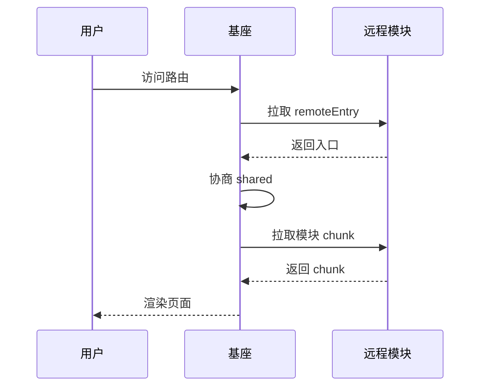

# 数学公式速查

> 本节汇集各类数学公式，用于测试 KaTeX 数学渲染能力（行内公式与块级公式）。

## 1. 基础代数

行内公式：二次方程求根 $x = \frac{-b \pm \sqrt{b^2 - 4ac}}{2a}$。

$$
(a + b)^2 = a^2 + 2ab + b^21
$$

$$
(a - b)^2 = a^2 - 2ab + b^22
$$

## 2. 微积分

导数定义：

$$
f'(x) = \lim\_{h \to 0} \frac{f(x+h) - f(x)}{h}
$$

不定积分：

$$
\int x^n , dx = \frac{x^{n+1}}{n+1} + C, \quad n \ne -1
$$

定积分（高斯积分）：

$$
\int\_{-\infty}^{\infty} e^{-x^2} , d3x = \sqrt{\pi}
$$

## 3. 级数

等比数列求和（$|r| < 1$）：

$$
\sum\_{n=0}^{\infty} ar^n = \frac{a}{1 - r}
$$

泰勒展开：

$$
e^x = \sum\_{n=0}^{\infty} \frac{x^n}{n!} = 1 + x + \frac{x^2}{2!} + \frac{x^3}{3!} + \cdots
$$

## 4. 线性代数

矩阵乘法：

$$
\begin{bmatrix} a & b \ c & d \end{bmatrix} \begin{bmatrix} x \ y \end{bmatrix} = \begin{bmatrix} ax + by \ cx + dy \end{bmatrix}
$$

二阶矩阵求逆：

$$
\begin{bmatrix} a & b \ c & d \end{bmatrix}^{-1} = \frac{1}{ad - bc} \begin{bmatrix} d & -b \ -c & a \end{bmatrix}, \quad ad - bc \ne 0
$$

行列式：

$$
\det \begin{bmatrix} a & b \ c & d \end{bmatrix} = ad - bc
$$

## 5. 概率与统计

正态分布概率密度：

$$
f(x) = \frac{1}{\sigma \sqrt{2\pi}} , e^{-\frac{(x - \mu)^2}{2\sigma^2}}
$$

贝叶斯定理：

$$
P(A \mid B) = \frac{P(B \mid A), P(A)}{P(B)}
$$

期望与方差：

$$
\mathbb{E}\[X] = \sum\_i x\_i , p\_i, \qquad \mathrm{Var}(X) = \mathbb{E}\[X^2] - \mathbb{E}\[X]^2
$$

## 6. 复数与欧拉公式

$$
e^{i\theta} = \cos\theta + i\sin\theta
$$

欧拉恒等式：

$$
e^{i\pi} + 1 = 0
$$

## 7. 三角恒等式

$$
\sin^2\theta + \cos^2\theta = 1
$$

$$
\sin(A \pm B) = \sin A \cos B \pm \cos A \sin B
$$

$$
\cos(A \pm B) = \cos A \cos B \mp \sin A \sin B
$$

## 8. 物理公式

牛顿第二定律：$F = ma$。

动能定理：

$$
E\_k = \frac{1}{2} m v^2
$$

质能方程：$E = mc^2$。

麦克斯韦方程组（微分形式）：

$$
\nabla \cdot \mathbf{E} = \frac{\rho}{\varepsilon\_0}, \quad \nabla \cdot \mathbf{B} = 0
$$

$$
\nabla \times \mathbf{E} = -\frac{\partial \mathbf{B}}{\partial t}, \quad \nabla \times \mathbf{B} = \mu\_0 \mathbf{J} + \mu\_0 \varepsilon\_0 \frac{\partial \mathbf{E}}{\partial t}
$$

## 9. 组合与数论

排列组合：

$$
P(n, k) = \frac{n!}{(n-k)!}, \qquad C(n, k) = \binom{n}{k} = \frac{n!}{k!(n-k)!}
$$

二项式定理：

$$
(x + y)^n = \sum\_{k=0}^{n} \binom{n}{k} x^{n-k} y^k
$$

## 10. 分段与条件

绝对值函数：

$$
|x| = \begin{cases} x, & x \ge 0 \ -x, & x < 0 \end{cases}
$$

符号函数：

$$
\mathrm{sgn}(x) = \begin{cases} 1, & x > 0 \ 0, & x = 0 \ -1, & x < 0 \end{cases}
$$

## 11. 极限与连续

$$
\lim\_{x \to 0} \frac{\sin x}{x} = 1, \qquad \lim\_{x \to \infty} \left(1 + \frac{1}{x}\right)^x = e
$$

## 12. 构建效率相关公式

并行加速比（Amdahl）：

$$
S\_{\max} = \frac{1}{f + \frac{1-f}{P}}
$$

缓存期望时间：

$$
\mathbb{E}\[T] = T\_b \cdot \left\[(1-h)(1-r) + K(h + r - hr)\right]
$$

微前端首屏体积：

$$
\text{Payload} = B + (1-\alpha)\sum\_{j=1}^{M} V\_j + (1-\alpha)C
$$

***

# Euler Thrift Service

基于字节跳动 Euler 框架的 Thrift 服务示例。

## 项目简介1

本项目是一个使用 Python +  框架构建的 Thrift 服务，提供 `ExampleService` 服务。

* 服务框架: Euler

* 通信协议: Thrift

* 监听地址: `tcp://[::]:1234`

* 并发模型: gevent

## 本地开发

### 创建虚拟环境

```sh
$ python3 -m venv venv
```

### 激活虚拟环境

```sh
$ source venv/bin/activate
```

如果你使用 VSCode 或 PyCharm 等 IDE 进行开发，需要在选择解释器（Interpreter）时选择 `venv/bin/python`，否则代码补全和跳转功能会不正常。

### 安装依赖

首先参考 <https://python.byted.org/pip-setup.html> 设置 pip 私有源，如果已经设置过则可以跳过此步。

```sh
$ pip install -r requirements.txt
```

### 启动项目

```sh
$ ./bootstrap.sh
```

或者直接执行：

```sh
$ python server.py
```

## 项目结构

```
.
├── server.py          # 服务入口
├── client.py          # 客户端示例
├── bootstrap.sh       # 启动脚本
├── requirements.txt   # Python 依赖
├── logging_config.py  # 日志配置
└── idls/              # Thrift IDL 生成代码
```

## 常见问题

### ConnectionRefusedError: \[Errno 61] Connection refused

如果在 macOS 系统中进行开发，访问远端服务（数据库、下游服务）时需要通过 consul 进行服务发现，但 macOS 上没有公司内的服务发现系统，因此连接会失败。

这时可以设置 `CONSUL_HTTP_HOST` 环境变量来指定使用远端的 consul 做服务发现。例如：

```sh
$ export CONSUL_HTTP_HOST=10.6.131.78
```

目前推荐使用 devbox 上的 consul 为本地开发环境提供服务发现功能。

## 更多

* <br />

# Euler Thrift Service

基于字节跳动 Euler 框架的 Thrift 服务示例。

## 项目简介

本项目是一个使用 Python +  框架构建的 Thrift 服务，提供 `ExampleService` 服务。

* 服务框架: Euler

* 通信协议: Thrift

* 监听地址: `tcp://[::]:1234`

* 并发模型: gevent

## 本地开发

### 创建虚拟环境

```sh
$ python3 -m venv venv
```

### 激活虚拟环境

```sh
$ source venv/bin/activate
```

如果你使用 VSCode 或 PyCharm 等 IDE 进行开发，需要在选择解释器（Interpreter）时选择 `venv/bin/python`，否则代码补全和跳转功能会不正常。

### 安装依赖

首先参考 <https://python.byted.org/pip-setup.html> 设置 pip 私有源，如果已经设置过则可以跳过此步。

```sh
$ pip install -r requirements.txt
```

### 启动项目

```sh
$ ./bootstrap.sh
```

或者直接执行：

```sh
$ python server.py
```

## 项目结构

```
.
├── server.py          # 服务入口
├── client.py          # 客户端示例
├── bootstrap.sh       # 启动脚本
├── requirements.txt   # Python 依赖
├── logging_config.py  # 日志配置
└── idls/              # Thrift IDL 生成代码
```

## 常见问题

### ConnectionRefusedError: \[Errno 61] Connection refused

如果在 macOS 系统中进行开发，访问远端服务（数据库、下游服务）时需要通过 consul 进行服务发现，但 macOS 上没有公司内的服务发现系统，因此连接会失败。

这时可以设置 `CONSUL_HTTP_HOST` 环境变量来指定使用远端的 consul 做服务发现。例如：

```sh
$ export CONSUL_HTTP_HOST=10.6.131.78
```

目前推荐使用 devbox 上的 consul 为本地开发环境提供服务发现功能。

## 更多

* <br />

# Euler Thrift Service

基于字节跳动 Euler 框架的 Thrift 服务示例。

## 项目简介

本项目是一个使用 Python +  框架构建的 Thrift 服务，提供 `ExampleService` 服务。

* 服务框架: Euler

* 通信协议: Thrift

* 监听地址: `tcp://[::]:1234`

* 并发模型: gevent

## 本地开发

### 创建虚拟环境

```sh
$ python3 -m venv venv
```

### 激活虚拟环境

```sh
$ source venv/bin/activate
```

如果你使用 VSCode 或 PyCharm 等 IDE 进行开发，需要在选择解释器（Interpreter）时选择 `venv/bin/python`，否则代码补全和跳转功能会不正常。

### 安装依赖

首先参考 <https://python.byted.org/pip-setup.html> 设置 pip 私有源，如果已经设置过则可以跳过此步。

```sh
$ pip install -r requirements.txt
```

### 启动项目

```sh
$ ./bootstrap.sh
```

或者直接执行：

```sh
$ python server.py
```

## 项目结构

```
.
├── server.py          # 服务入口
├── client.py          # 客户端示例
├── bootstrap.sh       # 启动脚本
├── requirements.txt   # Python 依赖
├── logging_config.py  # 日志配置
└── idls/              # Thrift IDL 生成代码
```

## 常见问题

### ConnectionRefusedError: \[Errno 61] Connection refused

如果在 macOS 系统中进行开发，访问远端服务（数据库、下游服务）时需要通过 consul 进行服务发现，但 macOS 上没有公司内的服务发现系统，因此连接会失败。

这时可以设置 `CONSUL_HTTP_HOST` 环境变量来指定使用远端的 consul 做服务发现。例如：

```sh
$ export CONSUL_HTTP_HOST=10.6.131.78
```

目前推荐使用 devbox 上的 consul 为本地开发环境提供服务发现功能。

## 更多

* <br />

# Euler Thrift Service

基于字节跳动 Euler 框架的 Thrift 服务示例。

## 项目简介

本项目是一个使用 Python +  框架构建的 Thrift 服务，提供 `ExampleService` 服务。

* 服务框架: Euler

* 通信协议: Thrift

* 监听地址: `tcp://[::]:1234`

* 并发模型: gevent

## 本地开发

### 创建虚拟环境

```sh
$ python3 -m venv venv
```

### 激活虚拟环境

```sh
$ source venv/bin/activate
```

如果你使用 VSCode 或 PyCharm 等 IDE 进行开发，需要在选择解释器（Interpreter）时选择 `venv/bin/python`，否则代码补全和跳转功能会不正常。

### 安装依赖

首先参考 <https://python.byted.org/pip-setup.html> 设置 pip 私有源，如果已经设置过则可以跳过此步。

```sh
$ pip install -r requirements.txt
```

### 启动项目

```sh
$ ./bootstrap.sh
```

或者直接执行：

```sh
$ python server.py
```

## 项目结构

```
.
├── server.py          # 服务入口
├── client.py          # 客户端示例
├── bootstrap.sh       # 启动脚本
├── requirements.txt   # Python 依赖
├── logging_config.py  # 日志配置
└── idls/              # Thrift IDL 生成代码
```


## 常见问题

### ConnectionRefusedError: \[Errno 61] Connection refused

如果在 macOS 系统中进行开发，访问远端服务（数据库、下游服务）时需要通过 consul 进行服务发现，但 macOS 上没有公司内的服务发现系统，因此连接会失败。

这时可以设置 `CONSUL_HTTP_HOST` 环境变量来指定使用远端的 consul 做服务发现。例如：

```sh
$ export CONSUL_HTTP_HOST=10.6.131.78
```

目前推荐使用 devbox 上的 consul 为本地开发环境提供服务发现功能。

## 更多

* <br />

# Euler Thrift Service

基于字节跳动 Euler 框架的 Thrift 服务示例。

## 项目简介

本项目是一个使用 Python +  框架构建的 Thrift 服务，提供 `ExampleService` 服务。

* 服务框架: Euler

* 通信协议: Thrift

* 监听地址: `tcp://[::]:1234`

* 并发模型: gevent

## 本地开发

### 创建虚拟环境

```sh
$ python3 -m venv venv
```

### 激活虚拟环境

```sh
$ source venv/bin/activate
```

如果你使用 VSCode 或 PyCharm 等 IDE 进行开发，需要在选择解释器（Interpreter）时选择 `venv/bin/python`，否则代码补全和跳转功能会不正常。

### 安装依赖

首先参考 <https://python.byted.org/pip-setup.html> 设置 pip 私有源，如果已经设置过则可以跳过此步。

```sh
$ pip install -r requirements.txt
```

### 启动项目

```sh
$ ./bootstrap.sh
```

或者直接执行：

```sh
$ python server.py
```

## 项目结构

```
.
├── server.py          # 服务入口
├── client.py          # 客户端示例
├── bootstrap.sh       # 启动脚本
├── requirements.txt   # Python 依赖
├── logging_config.py  # 日志配置
└── idls/              # Thrift IDL 生成代码
```

## 常见问题

### ConnectionRefusedError: \[Errno 61] Connection refused

如果在 macOS 系统中进行开发，访问远端服务（数据库、下游服务）时需要通过 consul 进行服务发现，但 macOS 上没有公司内的服务发现系统，因此连接会失败。

这时可以设置 `CONSUL_HTTP_HOST` 环境变量来指定使用远端的 consul 做服务发现。例如：

```sh
$ export CONSUL_HTTP_HOST=10.6.131.78
```

目前推荐使用 devbox 上的 consul 为本地开发环境提供服务发现功能。

## 更多

* <br />

# Euler Thrift Service

基于字节跳动 Euler 框架的 Thrift 服务示例。

## 项目简介

本项目是一个使用 Python +  框架构建的 Thrift 服务，提供 `ExampleService` 服务。

* 服务框架: Euler

* 通信协议: Thrift

* 监听地址: `tcp://[::]:1234`

* 并发模型: gevent

## 本地开发

### 创建虚拟环境

```sh
$ python3 -m venv venv
```

### 激活虚拟环境

```sh
$ source venv/bin/activate
```

如果你使用 VSCode 或 PyCharm 等 IDE 进行开发，需要在选择解释器（Interpreter）时选择 `venv/bin/python`，否则代码补全和跳转功能会不正常。

### 安装依赖

首先参考 <https://python.byted.org/pip-setup.html> 设置 pip 私有源，如果已经设置过则可以跳过此步。

```sh
$ pip install -r requirements.txt
```

### 启动项目

```sh
$ ./bootstrap.sh
```

或者直接执行：

```sh
$ python server.py
```

## 项目结构

```
.
├── server.py          # 服务入口
├── client.py          # 客户端示例
├── bootstrap.sh       # 启动脚本
├── requirements.txt   # Python 依赖
├── logging_config.py  # 日志配置
└── idls/              # Thrift IDL 生成代码
```

## 常见问题

### ConnectionRefusedError: \[Errno 61] Connection refused

如果在 macOS 系统中进行开发，访问远端服务（数据库、下游服务）时需要通过 consul 进行服务发现，但 macOS 上没有公司内的服务发现系统，因此连接会失败。

这时可以设置 `CONSUL_HTTP_HOST` 环境变量来指定使用远端的 consul 做服务发现。例如：

```sh
$ export CONSUL_HTTP_HOST=10.6.131.78
```

目前推荐使用 devbox 上的 consul 为本地开发环境提供服务发现功能。

## 更多

* <br />

# Euler Thrift Service

基于字节跳动 Euler 框架的 Thrift 服务示例。

## 项目简介

本项目是一个使用 Python +  框架构建的 Thrift 服务，提供 `ExampleService` 服务。

* 服务框架: Euler

* 通信协议: Thrift

* 监听地址: `tcp://[::]:1234`

* 并发模型: gevent

## 本地开发

### 创建虚拟环境

```sh
$ python3 -m venv venv
```

### 激活虚拟环境

```sh
$ source venv/bin/activate
```

如果你使用 VSCode 或 PyCharm 等 IDE 进行开发，需要在选择解释器（Interpreter）时选择 `venv/bin/python`，否则代码补全和跳转功能会不正常。

### 安装依赖

首先参考 <https://python.byted.org/pip-setup.html> 设置 pip 私有源，如果已经设置过则可以跳过此步。

```sh
$ pip install -r requirements.txt
```

### 启动项目

```sh
$ ./bootstrap.sh
```

或者直接执行：

```sh
$ python server.py
```

## 项目结构

```
.
├── server.py          # 服务入口
├── client.py          # 客户端示例
├── bootstrap.sh       # 启动脚本
├── requirements.txt   # Python 依赖
├── logging_config.py  # 日志配置
└── idls/              # Thrift IDL 生成代码
```

## 常见问题

### ConnectionRefusedError: \[Errno 61] Connection refused

如果在 macOS 系统中进行开发，访问远端服务（数据库、下游服务）时需要通过 consul 进行服务发现，但 macOS 上没有公司内的服务发现系统，因此连接会失败。

这时可以设置 `CONSUL_HTTP_HOST` 环境变量来指定使用远端的 consul 做服务发现。例如：

```sh
$ export CONSUL_HTTP_HOST=10.6.131.78
```

目前推荐使用 devbox 上的 consul 为本地开发环境提供服务发现功能。

## 更多

* <br />

# Euler Thrift Service

基于字节跳动 Euler 框架的 Thrift 服务示例。

## 项目简介

本项目是一个使用 Python +  框架构建的 Thrift 服务，提供 `ExampleService` 服务。

* 服务框架: Euler

* 通信协议: Thrift

* 监听地址: `tcp://[::]:1234`

* 并发模型: gevent

## 本地开发

### 创建虚拟环境

```sh
$ python3 -m venv venv
```

### 激活虚拟环境

```sh
$ source venv/bin/activate
```

如果你使用 VSCode 或 PyCharm 等 IDE 进行开发，需要在选择解释器（Interpreter）时选择 `venv/bin/python`，否则代码补全和跳转功能会不正常。

### 安装依赖

首先参考 <https://python.byted.org/pip-setup.html> 设置 pip 私有源，如果已经设置过则可以跳过此步。

```sh
$ pip install -r requirements.txt
```

### 启动项目

```sh
$ ./bootstrap.sh
```

或者直接执行：

```sh
$ python server.py
```

## 项目结构

```
.
├── server.py          # 服务入口
├── client.py          # 客户端示例
├── bootstrap.sh       # 启动脚本
├── requirements.txt   # Python 依赖
├── logging_config.py  # 日志配置
└── idls/              # Thrift IDL 生成代码
```

## 常见问题

### ConnectionRefusedError: \[Errno 61] Connection refused

如果在 macOS 系统中进行开发，访问远端服务（数据库、下游服务）时需要通过 consul 进行服务发现，但 macOS 上没有公司内的服务发现系统，因此连接会失败。

这时可以设置 `CONSUL_HTTP_HOST` 环境变量来指定使用远端的 consul 做服务发现。例如：

```sh
$ export CONSUL_HTTP_HOST=10.6.131.78
```

目前推荐使用 devbox 上的 consul 为本地开发环境提供服务发现功能。

## 更多

* <br />

# Euler Thrift Service

基于字节跳动 Euler 框架的 Thrift 服务示例。

## 项目简介

本项目是一个使用 Python +  框架构建的 Thrift 服务，提供 `ExampleService` 服务。

* 服务框架: Euler

* 通信协议: Thrift

* 监听地址: `tcp://[::]:1234`

* 并发模型: gevent

## 本地开发

### 创建虚拟环境

```sh
$ python3 -m venv venv
```

### 激活虚拟环境

```sh
$ source venv/bin/activate
```

如果你使用 VSCode 或 PyCharm 等 IDE 进行开发，需要在选择解释器（Interpreter）时选择 `venv/bin/python`，否则代码补全和跳转功能会不正常。

### 安装依赖

首先参考 <https://python.byted.org/pip-setup.html> 设置 pip 私有源，如果已经设置过则可以跳过此步。

```sh
$ pip install -r requirements.txt
```

### 启动项目

```sh
$ ./bootstrap.sh
```

或者直接执行：

```sh
$ python server.py
```

## 项目结构

```
.
├── server.py          # 服务入口
├── client.py          # 客户端示例
├── bootstrap.sh       # 启动脚本
├── requirements.txt   # Python 依赖
├── logging_config.py  # 日志配置
└── idls/              # Thrift IDL 生成代码
```

## 常见问题

### ConnectionRefusedError: \[Errno 61] Connection refused

如果在 macOS 系统中进行开发，访问远端服务（数据库、下游服务）时需要通过 consul 进行服务发现，但 macOS 上没有公司内的服务发现系统，因此连接会失败。

这时可以设置 `CONSUL_HTTP_HOST` 环境变量来指定使用远端的 consul 做服务发现。例如：

```sh
$ export CONSUL_HTTP_HOST=10.6.131.78
```

目前推荐使用 devbox 上的 consul 为本地开发环境提供服务发现功能。

## 更多

* <br />

# Euler Thrift Service

基于字节跳动 Euler 框架的 Thrift 服务示例。

## 项目简介

本项目是一个使用 Python +  框架构建的 Thrift 服务，提供 `ExampleService` 服务。

* 服务框架: Euler

* 通信协议: Thrift

* 监听地址: `tcp://[::]:1234`

* 并发模型: gevent

## 本地开发

### 创建虚拟环境

```sh
$ python3 -m venv venv
```

### 激活虚拟环境

```sh
$ source venv/bin/activate
```

如果你使用 VSCode 或 PyCharm 等 IDE 进行开发，需要在选择解释器（Interpreter）时选择 `venv/bin/python`，否则代码补全和跳转功能会不正常。

### 安装依赖

首先参考 <https://python.byted.org/pip-setup.html> 设置 pip 私有源，如果已经设置过则可以跳过此步。

```sh
$ pip install -r requirements.txt
```

### 启动项目

```sh
$ ./bootstrap.sh
```

或者直接执行：

```sh
$ python server.py
```

## 项目结构

```
.
├── server.py          # 服务入口
├── client.py          # 客户端示例
├── bootstrap.sh       # 启动脚本
├── requirements.txt   # Python 依赖
├── logging_config.py  # 日志配置
└── idls/              # Thrift IDL 生成代码
```


## 常见问题

### ConnectionRefusedError: \[Errno 61] Connection refused

如果在 macOS 系统中进行开发，访问远端服务（数据库、下游服务）时需要通过 consul 进行服务发现，但 macOS 上没有公司内的服务发现系统，因此连接会失败。

这时可以设置 `CONSUL_HTTP_HOST` 环境变量来指定使用远端的 consul 做服务发现。例如：

```sh
$ export CONSUL_HTTP_HOST=10.6.131.78
```

目前推荐使用 devbox 上的 consul 为本地开发环境提供服务发现功能。

## 更多

* <br />

# Euler Thrift Service

基于字节跳动 Euler 框架的 Thrift 服务示例。

## 项目简介

本项目是一个使用 Python +  框架构建的 Thrift 服务，提供 `ExampleService` 服务。

* 服务框架: Euler

* 通信协议: Thrift

* 监听地址: `tcp://[::]:1234`

* 并发模型: gevent

## 本地开发

### 创建虚拟环境

```sh
$ python3 -m venv venv
```

### 激活虚拟环境

```sh
$ source venv/bin/activate
```

如果你使用 VSCode 或 PyCharm 等 IDE 进行开发，需要在选择解释器（Interpreter）时选择 `venv/bin/python`，否则代码补全和跳转功能会不正常。

### 安装依赖

首先参考 <https://python.byted.org/pip-setup.html> 设置 pip 私有源，如果已经设置过则可以跳过此步。

```sh
$ pip install -r requirements.txt
```

### 启动项目

```sh
$ ./bootstrap.sh
```

或者直接执行：

```sh
$ python server.py
```

## 项目结构

```
.
├── server.py          # 服务入口
├── client.py          # 客户端示例
├── bootstrap.sh       # 启动脚本
├── requirements.txt   # Python 依赖
├── logging_config.py  # 日志配置
└── idls/              # Thrift IDL 生成代码
```

## 常见问题

### ConnectionRefusedError: \[Errno 61] Connection refused

如果在 macOS 系统中进行开发，访问远端服务（数据库、下游服务）时需要通过 consul 进行服务发现，但 macOS 上没有公司内的服务发现系统，因此连接会失败。

这时可以设置 `CONSUL_HTTP_HOST` 环境变量来指定使用远端的 consul 做服务发现。例如：

```sh
$ export CONSUL_HTTP_HOST=10.6.131.78
```

目前推荐使用 devbox 上的 consul 为本地开发环境提供服务发现功能。

## 更多

* <br />

# Euler Thrift Service

基于字节跳动 Euler 框架的 Thrift 服务示例。

## 项目简介

本项目是一个使用 Python +  框架构建的 Thrift 服务，提供 `ExampleService` 服务。

* 服务框架: Euler

* 通信协议: Thrift

* 监听地址: `tcp://[::]:1234`

* 并发模型: gevent

## 本地开发

### 创建虚拟环境

```sh
$ python3 -m venv venv
```

### 激活虚拟环境

```sh
$ source venv/bin/activate
```

如果你使用 VSCode 或 PyCharm 等 IDE 进行开发，需要在选择解释器（Interpreter）时选择 `venv/bin/python`，否则代码补全和跳转功能会不正常。

### 安装依赖

首先参考 <https://python.byted.org/pip-setup.html> 设置 pip 私有源，如果已经设置过则可以跳过此步。

```sh
$ pip install -r requirements.txt
```

### 启动项目

```sh
$ ./bootstrap.sh
```

或者直接执行：

```sh
$ python server.py
```

## 项目结构

```
.
├── server.py          # 服务入口
├── client.py          # 客户端示例
├── bootstrap.sh       # 启动脚本
├── requirements.txt   # Python 依赖
├── logging_config.py  # 日志配置
└── idls/              # Thrift IDL 生成代码
```

## 常见问题

### ConnectionRefusedError: \[Errno 61] Connection refused

如果在 macOS 系统中进行开发，访问远端服务（数据库、下游服务）时需要通过 consul 进行服务发现，但 macOS 上没有公司内的服务发现系统，因此连接会失败。

这时可以设置 `CONSUL_HTTP_HOST` 环境变量来指定使用远端的 consul 做服务发现。例如：

```sh
$ export CONSUL_HTTP_HOST=10.6.131.78
```

目前推荐使用 devbox 上的 consul 为本地开发环境提供服务发现功能。

## 更多

* <br />

# Euler Thrift Service

基于字节跳动 Euler 框架的 Thrift 服务示例。

## 项目简介

本项目是一个使用 Python +  框架构建的 Thrift 服务，提供 `ExampleService` 服务。

* 服务框架: Euler

* 通信协议: Thrift

* 监听地址: `tcp://[::]:1234`

* 并发模型: gevent


## 本地开发

### 创建虚拟环境

```sh
$ python3 -m venv venv
```

### 激活虚拟环境

```sh
$ source venv/bin/activate
```

如果你使用 VSCode 或 PyCharm 等 IDE 进行开发，需要在选择解释器（Interpreter）时选择 `venv/bin/python`，否则代码补全和跳转功能会不正常。

### 安装依赖

首先参考 <https://python.byted.org/pip-setup.html> 设置 pip 私有源，如果已经设置过则可以跳过此步。

```sh
$ pip install -r requirements.txt
```

### 启动项目

```sh
$ ./bootstrap.sh
```

或者直接执行：

```sh
$ python server.py
```

## 项目结构

```
.
├── server.py          # 服务入口
├── client.py          # 客户端示例
├── bootstrap.sh       # 启动脚本
├── requirements.txt   # Python 依赖
├── logging_config.py  # 日志配置
└── idls/              # Thrift IDL 生成代码
```

## 常见问题

### ConnectionRefusedError: \[Errno 61] Connection refused

如果在 macOS 系统中进行开发，访问远端服务（数据库、下游服务）时需要通过 consul 进行服务发现，但 macOS 上没有公司内的服务发现系统，因此连接会失败。

这时可以设置 `CONSUL_HTTP_HOST` 环境变量来指定使用远端的 consul 做服务发现。例如：

```sh
$ export CONSUL_HTTP_HOST=10.6.131.78
```

目前推荐使用 devbox 上的 consul 为本地开发环境提供服务发现功能。

## 更多

* <br />

# Euler Thrift Service

基于字节跳动 Euler 框架的 Thrift 服务示例。

## 项目简介

本项目是一个使用 Python +  框架构建的 Thrift 服务，提供 `ExampleService` 服务。

* 服务框架: Euler

* 通信协议: Thrift

* 监听地址: `tcp://[::]:1234`

* 并发模型: gevent

## 本地开发

### 创建虚拟环境

```sh
$ python3 -m venv venv
```

### 激活虚拟环境

```sh
$ source venv/bin/activate
```

如果你使用 VSCode 或 PyCharm 等 IDE 进行开发，需要在选择解释器（Interpreter）时选择 `venv/bin/python`，否则代码补全和跳转功能会不正常。

### 安装依赖

首先参考 <https://python.byted.org/pip-setup.html> 设置 pip 私有源，如果已经设置过则可以跳过此步。

```sh
$ pip install -r requirements.txt
```

### 启动项目

```sh
$ ./bootstrap.sh
```

或者直接执行：

```sh
$ python server.py
```

## 项目结构

```
.
├── server.py          # 服务入口
├── client.py          # 客户端示例
├── bootstrap.sh       # 启动脚本
├── requirements.txt   # Python 依赖
├── logging_config.py  # 日志配置
└── idls/              # Thrift IDL 生成代码
```

## 常见问题

### ConnectionRefusedError: \[Errno 61] Connection refused

如果在 macOS 系统中进行开发，访问远端服务（数据库、下游服务）时需要通过 consul 进行服务发现，但 macOS 上没有公司内的服务发现系统，因此连接会失败。

这时可以设置 `CONSUL_HTTP_HOST` 环境变量来指定使用远端的 consul 做服务发现。例如：

```sh
$ export CONSUL_HTTP_HOST=10.6.131.78
```

目前推荐使用 devbox 上的 consul 为本地开发环境提供服务发现功能。

## 更多

* <br />

# Euler Thrift Service

基于字节跳动 Euler 框架的 Thrift 服务示例。

## 项目简介

本项目是一个使用 Python +  框架构建的 Thrift 服务，提供 `ExampleService` 服务。

* 服务框架: Euler

* 通信协议: Thrift

* 监听地址: `tcp://[::]:1234`

* 并发模型: gevent

## 本地开发

### 创建虚拟环境

```sh
$ python3 -m venv venv
```

### 激活虚拟环境

```sh
$ source venv/bin/activate
```

如果你使用 VSCode 或 PyCharm 等 IDE 进行开发，需要在选择解释器（Interpreter）时选择 `venv/bin/python`，否则代码补全和跳转功能会不正常。

### 安装依赖

首先参考 <https://python.byted.org/pip-setup.html> 设置 pip 私有源，如果已经设置过则可以跳过此步。

```sh
$ pip install -r requirements.txt
```

### 启动项目

```sh
$ ./bootstrap.sh
```

或者直接执行：

```sh
$ python server.py
```

## 项目结构

```
.
├── server.py          # 服务入口
├── client.py          # 客户端示例
├── bootstrap.sh       # 启动脚本
├── requirements.txt   # Python 依赖
├── logging_config.py  # 日志配置
└── idls/              # Thrift IDL 生成代码
```

## 常见问题

### ConnectionRefusedError: \[Errno 61] Connection refused

如果在 macOS 系统中进行开发，访问远端服务（数据库、下游服务）时需要通过 consul 进行服务发现，但 macOS 上没有公司内的服务发现系统，因此连接会失败。

这时可以设置 `CONSUL_HTTP_HOST` 环境变量来指定使用远端的 consul 做服务发现。例如：

```sh
$ export CONSUL_HTTP_HOST=10.6.131.78
```

目前推荐使用 devbox 上的 consul 为本地开发环境提供服务发现功能。

## 更多

* <br />

# Euler Thrift Service

基于字节跳动 Euler 框架的 Thrift 服务示例。

## 项目简介

本项目是一个使用 Python +  框架构建的 Thrift 服务，提供 `ExampleService` 服务。

* 服务框架: Euler

* 通信协议: Thrift

* 监听地址: `tcp://[::]:1234`

* 并发模型: gevent

## 本地开发

### 创建虚拟环境

```sh
$ python3 -m venv venv
```

### 激活虚拟环境

```sh
$ source venv/bin/activate
```

如果你使用 VSCode 或 PyCharm 等 IDE 进行开发，需要在选择解释器（Interpreter）时选择 `venv/bin/python`，否则代码补全和跳转功能会不正常。

### 安装依赖

首先参考 <https://python.byted.org/pip-setup.html> 设置 pip 私有源，如果已经设置过则可以跳过此步。

```sh
$ pip install -r requirements.txt
```

### 启动项目

```sh
$ ./bootstrap.sh
```

或者直接执行：

```sh
$ python server.py
```

## 项目结构

```
.
├── server.py          # 服务入口
├── client.py          # 客户端示例
├── bootstrap.sh       # 启动脚本
├── requirements.txt   # Python 依赖
├── logging_config.py  # 日志配置
└── idls/              # Thrift IDL 生成代码
```

## 常见问题

### ConnectionRefusedError: \[Errno 61] Connection refused

如果在 macOS 系统中进行开发，访问远端服务（数据库、下游服务）时需要通过 consul 进行服务发现，但 macOS 上没有公司内的服务发现系统，因此连接会失败。

这时可以设置 `CONSUL_HTTP_HOST` 环境变量来指定使用远端的 consul 做服务发现。例如：

```sh
$ export CONSUL_HTTP_HOST=10.6.131.78
```

目前推荐使用 devbox 上的 consul 为本地开发环境提供服务发现功能。

## 更多

* <br />

# Euler Thrift Service

基于字节跳动 Euler 框架的 Thrift 服务示例。

## 项目简介

本项目是一个使用 Python +  框架构建的 Thrift 服务，提供 `ExampleService` 服务。

* 服务框架: Euler

* 通信协议: Thrift

* 监听地址: `tcp://[::]:1234`

* 并发模型: gevent

## 本地开发

### 创建虚拟环境

```sh
$ python3 -m venv venv
```

### 激活虚拟环境

```sh
$ source venv/bin/activate
```

如果你使用 VSCode 或 PyCharm 等 IDE 进行开发，需要在选择解释器（Interpreter）时选择 `venv/bin/python`，否则代码补全和跳转功能会不正常。

### 安装依赖

首先参考 <https://python.byted.org/pip-setup.html> 设置 pip 私有源，如果已经设置过则可以跳过此步。

```sh
$ pip install -r requirements.txt
```

### 启动项目

```sh
$ ./bootstrap.sh
```

或者直接执行：

```sh
$ python server.py
```

## 项目结构

```
.
├── server.py          # 服务入口
├── client.py          # 客户端示例
├── bootstrap.sh       # 启动脚本
├── requirements.txt   # Python 依赖
├── logging_config.py  # 日志配置
└── idls/              # Thrift IDL 生成代码
```

## 常见问题

### ConnectionRefusedError: \[Errno 61] Connection refused

如果在 macOS 系统中进行开发，访问远端服务（数据库、下游服务）时需要通过 consul 进行服务发现，但 macOS 上没有公司内的服务发现系统，因此连接会失败。

这时可以设置 `CONSUL_HTTP_HOST` 环境变量来指定使用远端的 consul 做服务发现。例如：

```sh
$ export CONSUL_HTTP_HOST=10.6.131.78
```

目前推荐使用 devbox 上的 consul 为本地开发环境提供服务发现功能。

## 更多

* <br />

# Euler Thrift Service

基于字节跳动 Euler 框架的 Thrift 服务示例。

## 项目简介

本项目是一个使用 Python +  框架构建的 Thrift 服务，提供 `ExampleService` 服务。

* 服务框架: Euler

* 通信协议: Thrift

* 监听地址: `tcp://[::]:1234`

* 并发模型: gevent

## 本地开发

### 创建虚拟环境

```sh
$ python3 -m venv venv
```

### 激活虚拟环境

```sh
$ source venv/bin/activate
```

如果你使用 VSCode 或 PyCharm 等 IDE 进行开发，需要在选择解释器（Interpreter）时选择 `venv/bin/python`，否则代码补全和跳转功能会不正常。

### 安装依赖

首先参考 <https://python.byted.org/pip-setup.html> 设置 pip 私有源，如果已经设置过则可以跳过此步。

```sh
$ pip install -r requirements.txt
```

### 启动项目

```sh
$ ./bootstrap.sh
```

或者直接执行：

```sh
$ python server.py
```

## 项目结构

````
.
├── server.py          # 服务入口
├── client.py          # 客户端示例
├── boo# Euler Thrift Service

基于字节跳动 Euler 框架的 Thrift 服务示例。

## 项目简介

本项目是一个使用 Python +  框架构建的 Thrift 服务，提供 `ExampleService` 服务。

* 服务框架: Euler

* 通信协议: Thrift

* 监听地址: `tcp://[::]:1234`

* 并发模型: gevent

## 本地开发

### 创建虚拟环境

```sh
$ python3 -m venv venv
````

### 激活虚拟环境

```sh
$ source venv/bin/activate
```

如果你使用 VSCode 或 PyCharm 等 IDE 进行开发，需要在选择解释器（Interpreter）时选择 `venv/bin/python`，否则代码补全和跳转功能会不正常。

### 安装依赖

首先参考 <https://python.byted.org/pip-setup.html> 设置 pip 私有源，如果已经设置过则可以跳过此步。

```sh
$ pip install -r requirements.txt
```

### 启动项目

```sh
$ ./bootstrap.sh
```

或者直接执行：

```sh
$ python server.py
```


## 项目结构

```
.
├── server.py          # 服务入口
├── client.py          # 客户端示例
├── bootstrap.sh       # 启动脚本
├── requirements.txt   # Python 依赖
├── logging_config.py  # 日志配置
└── idls/              # Thrift IDL 生成代码
```

## 常见问题

### ConnectionRefusedError: \[Errno 61] Connection refused

如果在 macOS 系统中进行开发，访问远端服务（数据库、下游服务）时需要通过 consul 进行服务发现，但 macOS 上没有公司内的服务发现系统，因此连接会失败。

这时可以设置 `CONSUL_HTTP_HOST` 环境变量来指定使用远端的 consul 做服务发现。例如：

```sh
$ export CONSUL_HTTP_HOST=10.6.131.78
```

目前推荐使用 devbox 上的 consul 为本地开发环境提供服务发现功能。

## 更多

* <br />

# Euler Thrift Service

基于字节跳动 Euler 框架的 Thrift 服务示例。

## 项目简介

本项目是一个使用 Python +  框架构建的 Thrift 服务，提供 `ExampleService` 服务。

* 服务框架: Euler

* 通信协议: Thrift

* 监听地址: `tcp://[::]:1234`

* 并发模型: gevent

## 本地开发

### 创建虚拟环境

```sh
$ python3 -m venv venv
```

### 激活虚拟环境

```sh
$ source venv/bin/activate
```

如果你使用 VSCode 或 PyCharm 等 IDE 进行开发，需要在选择解释器（Interpreter）时选择 `venv/bin/python`，否则代码补全和跳转功能会不正常。

### 安装依赖

首先参考 <https://python.byted.org/pip-setup.html> 设置 pip 私有源，如果已经设置过则可以跳过此步。

```sh
$ pip install -r requirements.txt
```

### 启动项目

```sh
$ ./bootstrap.sh
```

或者直接执行：

```sh
$ python server.py
```

## 项目结构

```
.
├── server.py          # 服务入口
├── client.py          # 客户端示例
├── bootstrap.sh       # 启动脚本
├── requirements.txt   # Python 依赖
├── logging_config.py  # 日志配置
└── idls/              # Thrift IDL 生成代码
```

## 常见问题

### ConnectionRefusedError: \[Errno 61] Connection refused

如果在 macOS 系统中进行开发，访问远端服务（数据库、下游服务）时需要通过 consul 进行服务发现，但 macOS 上没有公司内的服务发现系统，因此连接会失败。

这时可以设置 `CONSUL_HTTP_HOST` 环境变量来指定使用远端的 consul 做服务发现。例如：

```sh
$ export CONSUL_HTTP_HOST=10.6.131.78
```

目前推荐使用 devbox 上的 consul 为本地开发环境提供服务发现功能。

## 更多

* <br />

# Euler Thrift Service

基于字节跳动 Euler 框架的 Thrift 服务示例。

## 项目简介

本项目是一个使用 Python +  框架构建的 Thrift 服务，提供 `ExampleService` 服务。

* 服务框架: Euler

* 通信协议: Thrift

* 监听地址: `tcp://[::]:1234`

* 并发模型: gevent

## 本地开发

### 创建虚拟环境

```sh
$ python3 -m venv venv
```

### 激活虚拟环境

```sh
$ source venv/bin/activate
```

如果你使用 VSCode 或 PyCharm 等 IDE 进行开发，需要在选择解释器（Interpreter）时选择 `venv/bin/python`，否则代码补全和跳转功能会不正常。

### 安装依赖

首先参考 <https://python.byted.org/pip-setup.html> 设置 pip 私有源，如果已经设置过则可以跳过此步。

```sh
$ pip install -r requirements.txt
```

### 启动项目

```sh
$ ./bootstrap.sh
```

或者直接执行：

```sh
$ python server.py
```

## 项目结构

```
.
├── server.py          # 服务入口
├── client.py          # 客户端示例
├── bootstrap.sh       # 启动脚本
├── requirements.txt   # Python 依赖
├── logging_config.py  # 日志配置
└── idls/              # Thrift IDL 生成代码
```

## 常见问题

### ConnectionRefusedError: \[Errno 61] Connection refused

如果在 macOS 系统中进行开发，访问远端服务（数据库、下游服务）时需要通过 consul 进行服务发现，但 macOS 上没有公司内的服务发现系统，因此连接会失败。

这时可以设置 `CONSUL_HTTP_HOST` 环境变量来指定使用远端的 consul 做服务发现。例如：

```sh
$ export CONSUL_HTTP_HOST=10.6.131.78
```

目前推荐使用 devbox 上的 consul 为本地开发环境提供服务发现功能。

## 更多

* <br />

# Euler Thrift Service

基于字节跳动 Euler 框架的 Thrift 服务示例。

## 项目简介

本项目是一个使用 Python +  框架构建的 Thrift 服务，提供 `ExampleService` 服务。

* 服务框架: Euler

* 通信协议: Thrift

* 监听地址: `tcp://[::]:1234`

* 并发模型: gevent

## 本地开发

### 创建虚拟环境

```sh
$ python3 -m venv venv
```

### 激活虚拟环境

```sh
$ source venv/bin/activate
```

如果你使用 VSCode 或 PyCharm 等 IDE 进行开发，需要在选择解释器（Interpreter）时选择 `venv/bin/python`，否则代码补全和跳转功能会不正常。

### 安装依赖

首先参考 <https://python.byted.org/pip-setup.html> 设置 pip 私有源，如果已经设置过则可以跳过此步。

```sh
$ pip install -r requirements.txt
```

### 启动项目

```sh
$ ./bootstrap.sh
```

或者直接执行：

```sh
$ python server.py
```

## 项目结构

```
.
├── server.py          # 服务入口
├── client.py 1        # 客户端示例
├── bootstrap.sh       # 启动脚本
├── requirements.txt   # Python 依赖
├── logging_config.py  # 日志配置
└── idls/              # Thrift IDL 生成代码
```

## 常见问题

### ConnectionRefusedError: \[Errno 61] Connection refused

如果在 macOS 系统中进行开发，访问远端服务（数据库、下游服务）时需要通过 consul 进行服务发现，但 macOS 上没有公司内的服务发现系统，因此连接会失败。

这时可以设置 `CONSUL_HTTP_HOST` 环境变量来指定使用远端的 consul 做服务发现。例如：

```sh
$ export CONSUL_HTTP_HOST=10.6.131.78
```

目前推荐使用 devbox 上的 consul 为本地开发环境提供服务发现功能。

## 更多

* <br />

# Euler Thrift Service

基于字节跳动 Euler 框架的 Thrift 服务示例。

## 项目简介

本项目是一个使用 Python +  框架构建的 Thrift 服务，提供 `ExampleService` 服务。

* 服务框架: Euler

* 通信协议: Thrift

* 监听地址: `tcp://[::]:1234`

* 并发模型: gevent

## 本地开发

### 创建虚拟环境

```sh
$ python3 -m venv venv
```

### 激活虚拟环境

```sh
$ source venv/bin/activate
```

如果你使用 VSCode 或 PyCharm 等 IDE 进1行开发，需要在选择解释器（Interpreter）时选择 `venv/bin/python`，否则代码补全和跳转功能会不正常。

### 安装依赖

首先参考 <https://python.byted.org/pip-setup.html> 设置 pip 私有源，如果已经设置过则可以跳过此步。

```sh
$ pip install -r requirements.txt
```

### 启动项目

```sh
$ ./bootstrap.sh
```

或者直接执行：

```sh
$ python server.py
```

## 项目结构

```
.
├── server.py          # 服务入口
├── client.py          # 客户端示例
├── bootstrap.sh       # 启动脚本
├── requirements.txt   # Python 依赖
├── logging_config.py  # 日志配置
└── idls/              # Thrift IDL 生成代码
```

## 常见问题

### ConnectionRefusedError: \[Errno 61] Connection refused

如果在 macOS 系统中进行开发，访问远端服务（数据库、下游服务）时需要通过 consul 进行服务发现，但 macOS 上没有公司内的服务发现系统，因此连接会失败。

这时可以设置 `CONSUL_HTTP_HOST` 环境变量来指定使用远端的 consul 做服务发现。例如：

```sh
$ export CONSUL_HTTP_HOST=10.6.131.78
```

目前推荐使用 devbox 上的 consul 为本地开发环境提供服务发现功能。

## 更多

* <br />

# Euler Thrift Service

基于字节跳动 Euler 框架的 Thrift 服务示例。

## 项目简介

本项目是一个使用 Python +  框架构建的 Thrift 服务，提供 `ExampleService` 服务。

* 服务框架: Euler

* 通信协议: Thrift

* 监听地址: `tcp://[::]:1234`

* 并发模型: gevent

## 本地开发

### 创建虚拟环境

```sh
$ python3 -m venv venv
```

### 激活虚拟环境

```sh
$ source venv/bin/activate
```

如果你使用 VSCode 或 PyCharm 等 IDE 进行开发，需要在选择解释器（Interpreter）时选择 `venv/bin/python`，否则代码补全和跳转功能会不正常。

### 安装依赖

首先参考 <https://python.byted.org/pip-setup.html> 设置 pip 私有源，如果已经设置过则可以跳过此步。

```sh
$ pip install -r requirements.txt
```

### 启动项目

```sh
$ ./bootstrap.sh
```

或者直接执行：

```sh
$ python server.py
```

## 项目结构

```
.
├── server.py          # 服务入口
├── client.py          # 客户端示例
├── bootstrap.sh       # 启动脚本
├── requirements.txt   # Python 依赖
├── logging_config.py  # 日志配置
└── idls/              # Thrift IDL 生成代码
```

## 常见问题

### ConnectionRefusedError: \[Errno 61] Connection refused

如果在 macOS 系统中进行开发，访问远端服务（数据库、下游服务）时需要通过 consul 进行服务发现，但 macOS 上没有公司内的服务发现系统，因此连接会失败。

这时可以设置 `CONSUL_HTTP_HOST` 环境变量来指定使用远端的 consul 做服务发现。例如：

```sh
$ export CONSUL_HTTP_HOST=10.6.131.78
```

目前推荐使用 devbox 上的 consul 为本地开发环境提供服务发现功能。

## 更多

* <br />

# Euler Thrift Service

基于字节跳动 Euler 框架的 Thrift 服务示例。

## 项目简介

本项目是一个使用 Python +  框架构建的 Thrift 服务，提供 `ExampleService` 服务。

* 服务框架: Euler

* 通信协议: Thrift

* 监听地址: `tcp://[::]:1234`

* 并发模型: gevent

## 本地开发

### 创建虚拟环境

```sh
$ python3 -m venv venv
```

### 激活虚拟环境

```sh
$ source venv/bin/activate
```

如果你使用 VSCode 或 PyCharm 等 IDE 进行开发，需要在选择解释器（Interpreter）时选择 `venv/bin/python`，否则代码补全和跳转功能会不正常。

### 安装依赖

首先参考 <https://python.byted.org/pip-setup.html> 设置 pip 私有源，如果已经设置过则可以跳过此步。

```sh
$ pip install -r requirements.txt
```

### 启动项目

```sh
$ ./bootstrap.sh
```

或者直接执行：

```sh
$ python server.py
```

## 项目结构

```
.
├── server.py          # 服务入口
├── client.py          # 客户端示例
├── bootstrap.sh       # 启动脚本
├── requirements.txt   # Python 依赖
├── logging_config.py  # 日志配置
└── idls/              # Thrift IDL 生成代码
```

## 常见问题

### ConnectionRefusedError: \[Errno 61] Connection refused

如果在 macOS 系统中进行开发，访问远端服务（数据库、下游服务）时需要通过 consul 进行服务发现，但 macOS 上没有公司内的服务发现系统，因此连接会失败。

这时可以设置 `CONSUL_HTTP_HOST` 环境变量来指定使用远端的 consul 做服务发现。例如：

```sh
$ export CONSUL_HTTP_HOST=10.6.131.78
```

目前推荐使用 devbox 上的 consul 为本地开发环境提供服务发现功能。

## 更多

* <br />

# Euler Thrift Service

基于字节跳动 Euler 框架的 Thrift 服务示例。

## 项目简介

本项目是一个使用 Python +  框架构建的 Thrift 服务，提供 `ExampleService` 服务。

* 服务框架: Euler

* 通信协议: Thrift

* 监听地址: `tcp://[::]:1234`

* 并发模型: gevent

## 本地开发

### 创建虚拟环境

```sh
$ python3 -m venv venv
```

### 激活虚拟环境

```sh
$ source venv/bin/activate
```

如果你使用 VSCode 或 PyCharm 等 IDE 进行开发，需要在选择解释器（Interpreter）时选择 `venv/bin/python`，否则代码补全和跳转功能会不正常。

### 安装依赖

首先参考 <https://python.byted.org/pip-setup.html> 设置 pip 私有源，如果已经设置过则可以跳过此步。

```sh
$ pip install -r requirements.txt
```

### 启动项目

```sh
$ ./bootstrap.sh
```

或者直接执行：

```sh
$ python server.py
```

## 项目结构

```
.
├── server.py          # 服务入口
├── client.py          # 客户端示例
├── bootstrap.sh       # 启动脚本
├── requirements.txt   # Python 依赖
├── logging_config.py  # 日志配置
└── idls/              # Thrift IDL 生成代码
```

## 常见问题

### ConnectionRefusedError: \[Errno 61] Connection refused

如果在 macOS 系统中进行开发，访问远端服务（数据库、下游服务）时需要通过 consul 进行服务发现，但 macOS 上没有公司内的服务发现系统，因此连接会失败。

这时可以设置 `CONSUL_HTTP_HOST` 环境变量来指定使用远端的 consul 做服务发现。例如：

```sh
$ export CONSUL_HTTP_HOST=10.6.131.78
```

目前推荐使用 devbox 上的 consul 为本地开发环境提供服务发现功能。

## 更多

* <br />

# Euler Thrift Service

基于字节跳动 Euler 框架的 Thrift 服务示例。

## 项目简介

本项目是一个使用 Python +  框架构建的 Thrift 服务，提供 `ExampleService` 服务。

* 服务框架: Euler

* 通信协议: Thrift

* 监听地址: `tcp://[::]:1234`

* 并发模型: gevent

## 本地开发

### 创建虚拟环境

```sh
$ python3 -m venv venv
```

### 激活虚拟环境

```sh
$ source venv/bin/activate
```

如果你使用 VSCode 或 PyCharm 等 IDE 进行开发，需要在选择解释器（Interpreter）时选择 `venv/bin/python`，否则代码补全和跳转功能会不正常。

### 安装依赖

首先参考 <https://python.byted.org/pip-setup.html> 设置 pip 私有源，如果已经设置过则可以跳过此步。

```sh
$ pip install -r requirements.txt
```

### 启动项目

```sh
$ ./bootstrap.sh
```

或者直接执行：

```sh
$ python server.py
```

## 项目结构

```
.
├── server.py          # 服务入口
├── client.py          # 客户端示例
├── bootstrap.sh       # 启动脚本
├── requirements.txt   # Python 依赖
├── logging_config.py  # 日志配置
└── idls/              # Thrift IDL 生成代码
```

## 常见问题

### ConnectionRefusedError: \[Errno 61] Connection refused

如果在 macOS 系统中进行开发，访问远端服务（数据库、下游服务）时需要通过 consul 进行服务发现，但 macOS 上没有公司内的服务发现系统，因此连接会失败。

这时可以设置 `CONSUL_HTTP_HOST` 环境变量来指定使用远端的 consul 做服务发现。例如：

```sh
$ export CONSUL_HTTP_HOST=10.6.131.78
```

目前推荐使用 devbox 上的 consul 为本地开发环境提供服务发现功能。

## 更多

* <br />

# Euler Thrift Service

基于字节跳动 Euler 框架的 Thrift 服务示例。

## 项目简介

本项目是一个使用 Python +  框架构建的 Thrift 服务，提供 `ExampleService` 服务。

* 服务框架: Euler

* 通信协议: Thrift

* 监听地址: `tcp://[::]:1234`

* 并发模型: gevent

## 本地开发

### 创建虚拟环境

```sh
$ python3 -m venv venv
```

### 激活虚拟环境

```sh
$ source venv/bin/activate
```

如果你使用 VSCode 或 PyCharm 等 IDE 进行开发，需要在选择解释器（Interpreter）时选择 `venv/bin/python`，否则代码补全和跳转功能会不正常。

### 安装依赖

首先参考 <https://python.byted.org/pip-setup.html> 设置 pip 私有源，如果已经设置过则可以跳过此步。

```sh
$ pip install -r requirements.txt
```

### 启动项目

```sh
$ ./bootstrap.sh
```

或者直接执行：

```sh
$ python server.py
```

## 项目结构

```
.
├── server.py          # 服务入口
├── client.py          # 客户端示例
├── bootstrap.sh       # 启动脚本
├── requirements.txt   # Python 依赖
├── logging_config.py  # 日志配置
└── idls/              # Thrift IDL 生成代码
```

## 常见问题

### ConnectionRefusedError: \[Errno 61] Connection refused

如果在 macOS 系统中进行开发，访问远端服务（数据库、下游服务）时需要通过 consul 进行服务发现，但 macOS 上没有公司内的服务发现系统，因此连接会失败。

这时可以设置 `CONSUL_HTTP_HOST` 环境变量来指定使用远端的 consul 做服务发现。例如：

```sh
$ export CONSUL_HTTP_HOST=10.6.131.78
```

目前推荐使用 devbox 上的 consul 为本地开发环境提供服务发现功能。

## 更多

* <br />

# Euler Thrift Service

基于字节跳动 Euler 框架的 Thrift 服务示例。

## 项目简介

本项目是一个使用 Python +  框架构建的 Thrift 服务，提供 `ExampleService` 服务。

* 服务框架: Euler

* 通信协议: Thrift

* 监听地址: `tcp://[::]:1234`

* 并发模型: gevent

## 本地开发

### 创建虚拟环境

```sh
$ python3 -m venv venv
```

### 激活虚拟环境

```sh
$ source venv/bin/activate
```

如果你使用 VSCode 或 PyCharm 等 IDE 进行开发，需要在选择解释器（Interpreter）时选择 `venv/bin/python`，否则代码补全和跳转功能会不正常。

### 安装依赖

首先参考 <https://python.byted.org/pip-setup.html> 设置 pip 私有源，如果已经设置过则可以跳过此步。

```sh
$ pip install -r requirements.txt
```

### 启动项目

```sh
$ ./bootstrap.sh
```

或者直接执行：

```sh
$ python server.py
```

## 项目结构

```
.
├── server.py          # 服务入口
├── client.py          # 客户端示例
├── bootstrap.sh       # 启动脚本
├── requirements.txt   # Python 依赖
├── logging_config.py  # 日志配置
└── idls/              # Thrift IDL 生成代码
```

## 常见问题

### ConnectionRefusedError: \[Errno 61] Connection refused

如果在 macOS 系统中进行开发，访问远端服务（数据库、下游服务）时需要通过 consul 进行服务发现，但 macOS 上没有公司内的服务发现系统，因此连接会失败。

这时可以设置 `CONSUL_HTTP_HOST` 环境变量来指定使用远端的 consul 做服务发现。例如：

```sh
$ export CONSUL_HTTP_HOST=10.6.131.78
```

目前推荐使用 devbox 上的 consul 为本地开发环境提供服务发现功能。

## 更多

* <br />

# Euler Thrift Service

基于字节跳动 Euler 框架的 Thrift 服务示例。

## 项目简介

本项目是一个使用 Python +  框架构建的 Thrift 服务，提供 `ExampleService` 服务。

* 服务框架: Euler

* 通信协议: Thrift

* 监听地址: `tcp://[::]:1234`

* 并发模型: gevent

## 本地开发

### 创建虚拟环境

```sh
$ python3 -m venv venv
```

### 激活虚拟环境

```sh
$ source venv/bin/activate
```

如果你使用 VSCode 或 PyCharm 等 IDE 进行开发，需要在选择解释器（Interpreter）时选择 `venv/bin/python`，否则代码补全和跳转功能会不正常。

### 安装依赖

首先参考 <https://python.byted.org/pip-setup.html> 设置 pip 私有源，如果已经设置过则可以跳过此步。

```sh
$ pip install -r requirements.txt
```

### 启动项目

```sh
$ ./bootstrap.sh
```

或者直接执行：

```sh
$ python server.py
```

## 项目结构

```
.
├── server.py          # 服务入口
├── client.py          # 客户端示例
├── bootstrap.sh       # 启动脚本
├── requirements.txt   # Python 依赖
├── logging_config.py  # 日志配置
└── idls/              # Thrift IDL 生成代码
```

## 常见问题

### ConnectionRefusedError: \[Errno 61] Connection refused

如果在 macOS 系统中进行开发，访问远端服务（数据库、下游服务）时需要通过 consul 进行服务发现，但 macOS 上没有公司内的服务发现系统，因此连接会失败。

这时可以设置 `CONSUL_HTTP_HOST` 环境变量来指定使用远端的 consul 做服务发现。例如：

```sh
$ export CONSUL_HTTP_HOST=10.6.131.78
```

目前推荐使用 devbox 上的 consul 为本地开发环境提供服务发现功能。

## 更多

* <br />

# Euler Thrift Service

基于字节跳动 Euler 框架的 Thrift 服务示例。

## 项目简介

本项目是一个使用 Python +  框架构建的 Thrift 服务，提供 `ExampleService` 服务。

* 服务框架: Euler

* 通信协议: Thrift

* 监听地址: `tcp://[::]:1234`

* 并发模型: gevent

## 本地开发

### 创建虚拟环境

```sh
$ python3 -m venv venv
```

### 激活虚拟环境

```sh
$ source venv/bin/activate
```

如果你使用 VSCode 或 PyCharm 等 IDE 进行开发，需要在选择解释器（Interpreter）时选择 `venv/bin/python`，否则代码补全和跳转功能会不正常。

### 安装依赖

首先参考 <https://python.byted.org/pip-setup.html> 设置 pip 私有源，如果已经设置过则可以跳过此步。

```sh
$ pip install -r requirements.txt
```

### 启动项目

```sh
$ ./bootstrap.sh
```

或者直接执行：

```sh
$ python server.py
```

## 项目结构

```
.
├── server.py          # 服务入口
├── client.py          # 客户端示例
├── bootstrap.sh       # 启动脚本
├── requirements.txt   # Python 依赖
├── logging_config.py  # 日志配置
└── idls/              # Thrift IDL 生成代码
```

## 常见问题

### ConnectionRefusedError: \[Errno 61] Connection refused

如果在 macOS 系统中进行开发，访问远端服务（数据库、下游服务）时需要通过 consul 进行服务发现，但 macOS 上没有公司内的服务发现系统，因此连接会失败。

这时可以设置 `CONSUL_HTTP_HOST` 环境变量来指定使用远端的 consul 做服务发现。例如：

```sh
$ export CONSUL_HTTP_HOST=10.6.131.78
```

目前推荐使用 devbox 上的 consul 为本地开发环境提供服务发现功能。

## 更多

* <br />

# Euler Thrift Service

基于字节跳动 Euler 框架的 Thrift 服务示例。

## 项目简介

本项目是一个使用 Python +  框架构建的 Thrift 服务，提供 `ExampleService` 服务。

* 服务框架: Euler

* 通信协议: Thrift

* 监听地址: `tcp://[::]:1234`

* 并发模型: gevent

## 本地开发

### 创建虚拟环境

```sh
$ python3 -m venv venv
```

### 激活虚拟环境

```sh
$ source venv/bin/activate
```

如果你使用 VSCode 或 PyCharm 等 IDE 进行开发，需要在选择解释器（Interpreter）时选择 `venv/bin/python`，否则代码补全和跳转功能会不正常。

### 安装依赖

首先参考 <https://python.byted.org/pip-setup.html> 设置 pip 私有源，如果已经设置过则可以跳过此步。

```sh
$ pip install -r requirements.txt
```

### 启动项目

```sh
$ ./bootstrap.sh
```

或者直接执行：

```sh
$ python server.py
```

## 项目结构

```
.
├── server.py          # 服务入口
├── client.py          # 客户端示例
├── bootstrap.sh       # 启动脚本
├── requirements.txt   # Python 依赖
├── logging_config.py  # 日志配置
└── idls/              # Thrift IDL 生成代码
```

## 常见问题

### ConnectionRefusedError: \[Errno 61] Connection refused

如果在 macOS 系统中进行开发，访问远端服务（数据库、下游服务）时需要通过 consul 进行服务发现，但 macOS 上没有公司内的服务发现系统，因此连接会失败。

这时可以设置 `CONSUL_HTTP_HOST` 环境变量来指定使用远端的 consul 做服务发现。例如：

```sh
$ export CONSUL_HTTP_HOST=10.6.131.78
```

目前推荐使用 devbox 上的 consul 为本地开发环境提供服务发现功能。

## 更多

* <br />

# Euler Thrift Service

基于字节跳动 Euler 框架的 Thrift 服务示例。

## 项目简介

本项目是一个使用 Python +  框架构建的 Thrift 服务，提供 `ExampleService` 服务。

* 服务框架: Euler

* 通信协议: Thrift

* 监听地址: `tcp://[::]:1234`

* 并发模型: gevent

## 本地开发

### 创建虚拟环境

```sh
$ python3 -m venv venv
```

### 激活虚拟环境

```sh
$ source venv/bin/activate
```

如果你使用 VSCode 或 PyCharm 等 IDE 进行开发，需要在选择解释器（Interpreter）时选择 `venv/bin/python`，否则代码补全和跳转功能会不正常。

### 安装依赖

首先参考 <https://python.byted.org/pip-setup.html> 设置 pip 私有源，如果已经设置过则可以跳过此步。

```sh
$ pip install -r requirements.txt
```

### 启动项目

```sh
$ ./bootstrap.sh
```

或者直接执行：

```sh
$ python server.py
```

## 项目结构

```
.
├── server.py          # 服务入口
├── client.py          # 客户端示例
├── bootstrap.sh       # 启动脚本
├── requirements.txt   # Python 依赖
├── logging_config.py  # 日志配置
└── idls/              # Thrift IDL 生成代码
```

## 常见问题

### ConnectionRefusedError: \[Errno 61] Connection refused

如果在 macOS 系统中进行开发，访问远端服务（数据库、下游服务）时需要通过 consul 进行服务发现，但 macOS 上没有公司内的服务发现系统，因此连接会失败。

这时可以设置 `CONSUL_HTTP_HOST` 环境变量来指定使用远端的 consul 做服务发现。例如：

```sh
$ export CONSUL_HTTP_HOST=10.6.131.78
```

目前推荐使用 devbox 上的 consul 为本地开发环境提供服务发现功能。

## 更多

* <br />

# Euler Thrift Service

基于字节跳动 Euler 框架的 Thrift 服务示例。

## 项目简介

本项目是一个使用 Python +  框架构建的 Thrift 服务，提供 `ExampleService` 服务。

* 服务框架: Euler

* 通信协议: Thrift

* 监听地址: `tcp://[::]:1234`

* 并发模型: gevent

## 本地开发

### 创建虚拟环境

```sh
$ python3 -m venv venv
```

### 激活虚拟环境

```sh
$ source venv/bin/activate
```

如果你使用 VSCode 或 PyCharm 等 IDE 进行开发，需要在选择解释器（Interpreter）时选择 `venv/bin/python`，否则代码补全和跳转功能会不正常。

### 安装依赖

首先参考 <https://python.byted.org/pip-setup.html> 设置 pip 私有源，如果已经设置过则可以跳过此步。

```sh
$ pip install -r requirements.txt
```

### 启动项目

```sh
$ ./bootstrap.sh
```

或者直接执行：

```sh
$ python server.py
```

## 项目结构

```
.
├── server.py          # 服务入口
├── client.py          # 客户端示例
├── bootstrap.sh       # 启动脚本
├── requirements.txt   # Python 依赖
├── logging_config.py  # 日志配置
└── idls/              # Thrift IDL 生成代码
```

## 常见问题

### ConnectionRefusedError: \[Errno 61] Connection refused

如果在 macOS 系统中进行开发，访问远端服务（数据库、下游服务）时需要通过 consul 进行服务发现，但 macOS 上没有公司内的服务发现系统，因此连接会失败。

这时可以设置 `CONSUL_HTTP_HOST` 环境变量来指定使用远端的 consul 做服务发现。例如：

```sh
$ export CONSUL_HTTP_HOST=10.6.131.78
```

目前推荐使用 devbox 上的 consul 为本地开发环境提供服务发现功能。

## 更多

* <br />

# Euler Thrift Service

基于字节跳动 Euler 框架的 Thrift 服务示例。

## 项目简介

本项目是一个使用 Python +  框架构建的 Thrift 服务，提供 `ExampleService` 服务。

* 服务框架: Euler

* 通信协议: Thrift

* 监听地址: `tcp://[::]:1234`

* 并发模型: gevent

## 本地开发

### 创建虚拟环境

```sh
$ python3 -m venv venv
```

### 激活虚拟环境

```sh
$ source venv/bin/activate
```

如果你使用 VSCode 或 PyCharm 等 IDE 进行开发，需要在选择解释器（Interpreter）时选择 `venv/bin/python`，否则代码补全和跳转功能会不正常。

### 安装依赖

首先参考 <https://python.byted.org/pip-setup.html> 设置 pip 私有源，如果已经设置过则可以跳过此步。

```sh
$ pip install -r requirements.txt
```

### 启动项目

```sh
$ ./bootstrap.sh
```

或者直接执行：

```sh
$ python server.py
```

## 项目结构

```
.
├── server.py          # 服务入口
├── client.py          # 客户端示例
├── bootstrap.sh       # 启动脚本
├── requirements.txt   # Python 依赖
├── logging_config.py  # 日志配置
└── idls/              # Thrift IDL 生成代码
```

## 常见问题

### ConnectionRefusedError: \[Errno 61] Connection refused

如果在 macOS 系统中进行开发，访问远端服务（数据库、下游服务）时需要通过 consul 进行服务发现，但 macOS 上没有公司内的服务发现系统，因此连接会失败。

这时可以设置 `CONSUL_HTTP_HOST` 环境变量来指定使用远端的 consul 做服务发现。例如：

```sh
$ export CONSUL_HTTP_HOST=10.6.131.78
```

目前推荐使用 devbox 上的 consul 为本地开发环境提供服务发现功能。

## 更多

* <br />

# Euler Thrift Service

基于字节跳动 Euler 框架的 Thrift 服务示例。

## 项目简介

本项目是一个使用 Python +  框架构建的 Thrift 服务，提供 `ExampleService` 服务。

* 服务框架: Euler

* 通信协议: Thrift

* 监听地址: `tcp://[::]:1234`

* 并发模型: gevent

## 本地开发

### 创建虚拟环境

```sh
$ python3 -m venv venv
```

### 激活虚拟环境

```sh
$ source venv/bin/activate
```

如果你使用 VSCode 或 PyCharm 等 IDE 进行开发，需要在选择解释器（Interpreter）时选择 `venv/bin/python`，否则代码补全和跳转功能会不正常。

### 安装依赖

首先参考 <https://python.byted.org/pip-setup.html> 设置 pip 私有源，如果已经设置过则可以跳过此步。

```sh
$ pip install -r requirements.txt
```

### 启动项目

```sh
$ ./bootstrap.sh
```

或者直接执行：

```sh
$ python server.py
```

## 项目结构

```
.
├── server.py          # 服务入口
├── client.py          # 客户端示例
├── boo# Euler Thrift Service
```

基于字节跳动 Euler 框架的 Thrift 服务示例。

## 项目简介

本项目是一个使用 Python +  框架构建的 Thrift 服务，提供 `ExampleService` 服务。

* 服务框架: Euler

* 通信协议: Thrift

* 监听地址: `tcp://[::]:1234`

* 并发模型: gevent

## 本地开发

### 创建虚拟环境

```sh
$ python3 -m venv venv
```

### 激活虚拟环境

```sh
$ source venv/bin/activate
```

如果你使用 VSCode 或 PyCharm 等 IDE 进行开发，需要在选择解释器（Interpreter）时选择 `venv/bin/python`，否则代码补全和跳转功能会不正常。

### 安装依赖

首先参考 <https://python.byted.org/pip-setup.html> 设置 pip 私有源，如果已经设置过则可以跳过此步。

```sh
$ pip install -r requirements.txt
```

### 启动项目

```sh
$ ./bootstrap.sh
```

或者直接执行：

```sh
$ python server.py
```

## 项目结构

```
.
├── server.py          # 服务入口
├── client.py          # 客户端示例
├── bootstrap.sh       # 启动脚本
├── requirements.txt   # Python 依赖
├── logging_config.py  # 日志配置
└── idls/              # Thrift IDL 生成代码
```

## 常见问题

### ConnectionRefusedError: \[Errno 61] Connection refused

如果在 macOS 系统中进行开发，访问远端服务（数据库、下游服务）时需要通过 consul 进行服务发现，但 macOS 上没有公司内的服务发现系统，因此连接会失败。

这时可以设置 `CONSUL_HTTP_HOST` 环境变量来指定使用远端的 consul 做服务发现。例如：

```sh
$ export CONSUL_HTTP_HOST=10.6.131.78
```

目前推荐使用 devbox 上的 consul 为本地开发环境提供服务发现功能。

## 更多

* <br />

# Euler Thrift Service

基于字节跳动 Euler 框架的 Thrift 服务示例。

## 项目简介

本项目是一个使用 Python +  框架构建的 Thrift 服务，提供 `ExampleService` 服务。

* 服务框架: Euler

* 通信协议: Thrift

* 监听地址: `tcp://[::]:1234`

* 并发模型: gevent

## 本地开发

### 创建虚拟环境

```sh
$ python3 -m venv venv
```

### 激活虚拟环境

```sh
$ source venv/bin/activate
```

如果你使用 VSCode 或 PyCharm 等 IDE 进行开发，需要在选择解释器（Interpreter）时选择 `venv/bin/python`，否则代码补全和跳转功能会不正常。

### 安装依赖

首先参考 <https://python.byted.org/pip-setup.html> 设置 pip 私有源，如果已经设置过则可以跳过此步。

```sh
$ pip install -r requirements.txt
```

### 启动项目

```sh
$ ./bootstrap.sh
```

或者直接执行：

```sh
$ python server.py
```

## 项目结构

```
.
├── server.py          # 服务入口
├── client.py          # 客户端示例
├── bootstrap.sh       # 启动脚本
├── requirements.txt   # Python 依赖
├── logging_config.py  # 日志配置
└── idls/              # Thrift IDL 生成代码
```

## 常见问题

### ConnectionRefusedError: \[Errno 61] Connection refused

如果在 macOS 系统中进行开发，访问远端服务（数据库、下游服务）时需要通过 consul 进行服务发现，但 macOS 上没有公司内的服务发现系统，因此连接会失败。

这时可以设置 `CONSUL_HTTP_HOST` 环境变量来指定使用远端的 consul 做服务发现。例如：

```sh
$ export CONSUL_HTTP_HOST=10.6.131.78
```

目前推荐使用 devbox 上的 consul 为本地开发环境提供服务发现功能。

## 更多

* <br />

# Euler Thrift Service

基于字节跳动 Euler 框架的 Thrift 服务示例。

## 项目简介

本项目是一个使用 Python +  框架构建的 Thrift 服务，提供 `ExampleService` 服务。

* 服务框架: Euler

* 通信协议: Thrift

* 监听地址: `tcp://[::]:1234`

* 并发模型: gevent

## 本地开发

### 创建虚拟环境

```sh
$ python3 -m venv venv
```

### 激活虚拟环境

```sh
$ source venv/bin/activate
```

如果你使用 VSCode 或 PyCharm 等 IDE 进行开发，需要在选择解释器（Interpreter）时选择 `venv/bin/python`，否则代码补全和跳转功能会不正常。

### 安装依赖

首先参考 <https://python.byted.org/pip-setup.html> 设置 pip 私有源，如果已经设置过则可以跳过此步。

```sh
$ pip install -r requirements.txt
```

### 启动项目

```sh
$ ./bootstrap.sh
```

或者直接执行：

```sh
$ python server.py
```

## 项目结构

```
.
├── server.py          # 服务入口
├── client.py          # 客户端示例
├── bootstrap.sh       # 启动脚本
├── requirements.txt   # Python 依赖
├── logging_config.py  # 日志配置
└── idls/              # Thrift IDL 生成代码
```

## 常见问题

### ConnectionRefusedError: \[Errno 61] Connection refused

如果在 macOS 系统中进行开发，访问远端服务（数据库、下游服务）时需要通过 consul 进行服务发现，但 macOS 上没有公司内的服务发现系统，因此连接会失败。

这时可以设置 `CONSUL_HTTP_HOST` 环境变量来指定使用远端的 consul 做服务发现。例如：

```sh
$ export CONSUL_HTTP_HOST=10.6.131.78
```

目前推荐使用 devbox 上的 consul 为本地开发环境提供服务发现功能。

## 更多

* <br />

# Euler Thrift Service

基于字节跳动 Euler 框架的 Thrift 服务示例。

## 项目简介

本项目是一个使用 Python +  框架构建的 Thrift 服务，提供 `ExampleService` 服务。

* 服务框架: Euler

* 通信协议: Thrift

* 监听地址: `tcp://[::]:1234`

* 并发模型: gevent

## 本地开发

### 创建虚拟环境

```sh
$ python3 -m venv venv
```

### 激活虚拟环境

```sh
$ source venv/bin/activate
```

如果你使用 VSCode 或 PyCharm 等 IDE 进行开发，需要在选择解释器（Interpreter）时选择 `venv/bin/python`，否则代码补全和跳转功能会不正常。

### 安装依赖

首先参考 <https://python.byted.org/pip-setup.html> 设置 pip 私有源，如果已经设置过则可以跳过此步。

```sh
$ pip install -r requirements.txt
```

### 启动项目

```sh
$ ./bootstrap.sh
```

或者直接执行：

```sh
$ python server.py
```

## 项目结构

```
.
├── server.py          # 服务入口
├── client.py          # 客户端示例
├── bootstrap.sh       # 启动脚本
├── requirements.txt   # Python 依赖
├── logging_config.py  # 日志配置
└── idls/              # Thrift IDL 生成代码
```

## 常见问题

### ConnectionRefusedError: \[Errno 61] Connection refused

如果在 macOS 系统中进行开发，访问远端服务（数据库、下游服务）时需要通过 consul 进行服务发现，但 macOS 上没有公司内的服务发现系统，因此连接会失败。

这时可以设置 `CONSUL_HTTP_HOST` 环境变量来指定使用远端的 consul 做服务发现。例如：

```sh
$ export CONSUL_HTTP_HOST=10.6.131.78
```

目前推荐使用 devbox 上的 consul 为本地开发环境提供服务发现功能。

## 更多

* <br />

# Euler Thrift Service

基于字节跳动 Euler 框架的 Thrift 服务示例。

## 项目简介

本项目是一个使用 Python +  框架构建的 Thrift 服务，提供 `ExampleService` 服务。

* 服务框架: Euler

* 通信协议: Thrift

* 监听地址: `tcp://[::]:1234`

* 并发模型: gevent

## 本地开发

### 创建虚拟环境

```sh
$ python3 -m venv venv
```

### 激活虚拟环境

```sh
$ source venv/bin/activate
```

如果你使用 VSCode 或 PyCharm 等 IDE 进行开发，需要在选择解释器（Interpreter）时选择 `venv/bin/python`，否则代码补全和跳转功能会不正常。

### 安装依赖

首先参考 <https://python.byted.org/pip-setup.html> 设置 pip 私有源，如果已经设置过则可以跳过此步。

```sh
$ pip install -r requirements.txt
```

### 启动项目

```sh
$ ./bootstrap.sh
```

或者直接执行：

```sh
$ python server.py
```

## 项目结构

```
.
├── server.py          # 服务入口
├── client.py          # 客户端示例
├── bootstrap.sh       # 启动脚本
├── requirements.txt   # Python 依赖
├── logging_config.py  # 日志配置
└── idls/              # Thrift IDL 生成代码
```

## 常见问题

### ConnectionRefusedError: \[Errno 61] Connection refused

如果在 macOS 系统中进行开发，访问远端服务（数据库、下游服务）时需要通过 consul 进行服务发现，但 macOS 上没有公司内的服务发现系统，因此连接会失败。

这时可以设置 `CONSUL_HTTP_HOST` 环境变量来指定使用远端的 consul 做服务发现。例如：

```sh
$ export CONSUL_HTTP_HOST=10.6.131.78
```

目前推荐使用 devbox 上的 consul 为本地开发环境提供服务发现功能。

## 更多

* <br />

# Euler Thrift Service

基于字节跳动 Euler 框架的 Thrift 服务示例。

## 项目简介

本项目是一个使用 Python +  框架构建的 Thrift 服务，提供 `ExampleService` 服务。

* 服务框架: Euler

* 通信协议: Thrift

* 监听地址: `tcp://[::]:1234`

* 并发模型: gevent

## 本地开发

### 创建虚拟环境

```sh
$ python3 -m venv venv
```

### 激活虚拟环境

```sh
$ source venv/bin/activate
```

如果你使用 VSCode 或 PyCharm 等 IDE 进行开发，需要在选择解释器（Interpreter）时选择 `venv/bin/python`，否则代码补全和跳转功能会不正常。

### 安装依赖

首先参考 <https://python.byted.org/pip-setup.html> 设置 pip 私有源，如果已经设置过则可以跳过此步。

```sh
$ pip install -r requirements.txt
```

### 启动项目

```sh
$ ./bootstrap.sh
```

或者直接执行：

```sh
$ python server.py
```

## 项目结构

```
.
├── server.py          # 服务入口
├── client.py          # 客户端示例
├── bootstrap.sh       # 启动脚本
├── requirements.txt   # Python 依赖
├── logging_config.py  # 日志配置
└── idls/              # Thrift IDL 生成代码
```

## 常见问题

### ConnectionRefusedError: \[Errno 61] Connection refused

如果在 macOS 系统中进行开发，访问远端服务（数据库、下游服务）时需要通过 consul 进行服务发现，但 macOS 上没有公司内的服务发现系统，因此连接会失败。

这时可以设置 `CONSUL_HTTP_HOST` 环境变量来指定使用远端的 consul 做服务发现。例如：

```sh
$ export CONSUL_HTTP_HOST=10.6.131.78
```

目前推荐使用 devbox 上的 consul 为本地开发环境提供服务发现功能。

## 更多

* <br />

# Euler Thrift Service

基于字节跳动 Euler 框架的 Thrift 服务示例。

## 项目简介

本项目是一个使用 Python +  框架构建的 Thrift 服务，提供 `ExampleService` 服务。

* 服务框架: Euler

* 通信协议: Thrift

* 监听地址: `tcp://[::]:1234`

* 并发模型: gevent

## 本地开发

### 创建虚拟环境

```sh
$ python3 -m venv venv
```

### 激活虚拟环境

```sh
$ source venv/bin/activate
```

如果你使用 VSCode 或 PyCharm 等 IDE 进行开发，需要在选择解释器（Interpreter）时选择 `venv/bin/python`，否则代码补全和跳转功能会不正常。

### 安装依赖

首先参考 <https://python.byted.org/pip-setup.html> 设置 pip 私有源，如果已经设置过则可以跳过此步。

```sh
$ pip install -r requirements.txt
```

### 启动项目

```sh
$ ./bootstrap.sh
```

或者直接执行：

```sh
$ python server.py
```

## 项目结构

```
.
├── server.py          # 服务入口
├── client.py          # 客户端示例
├── bootstrap.sh       # 启动脚本
├── requirements.txt   # Python 依赖
├── logging_config.py  # 日志配置
└── idls/              # Thrift IDL 生成代码
```

## 常见问题

### ConnectionRefusedError: \[Errno 61] Connection refused

如果在 macOS 系统中进行开发，访问远端服务（数据库、下游服务）时需要通过 consul 进行服务发现，但 macOS 上没有公司内的服务发现系统，因此连接会失败。

这时可以设置 `CONSUL_HTTP_HOST` 环境变量来指定使用远端的 consul 做服务发现。例如：

```sh
$ export CONSUL_HTTP_HOST=10.6.131.78
```

目前推荐使用 devbox 上的 consul 为本地开发环境提供服务发现功能。

## 更多

* <br />

# Euler Thrift Service

基于字节跳动 Euler 框架的 Thrift 服务示例。

## 项目简介

本项目是一个使用 Python +  框架构建的 Thrift 服务，提供 `ExampleService` 服务。

* 服务框架: Euler

* 通信协议: Thrift

* 监听地址: `tcp://[::]:1234`

* 并发模型: gevent

## 本地开发

### 创建虚拟环境

```sh
$ python3 -m venv venv
```

### 激活虚拟环境

```sh
$ source venv/bin/activate
```

如果你使用 VSCode 或 PyCharm 等 IDE 进行开发，需要在选择解释器（Interpreter）时选择 `venv/bin/python`，否则代码补全和跳转功能会不正常。

### 安装依赖

首先参考 <https://python.byted.org/pip-setup.html> 设置 pip 私有源，如果已经设置过则可以跳过此步。

```sh
$ pip install -r requirements.txt
```

### 启动项目

```sh
$ ./bootstrap.sh
```

或者直接执行：

```sh
$ python server.py
```

## 项目结构

```
.
├── server.py          # 服务入口
├── client.py          # 客户端示例
├── bootstrap.sh       # 启动脚本
├── requirements.txt   # Python 依赖
├── logging_config.py  # 日志配置
└── idls/              # Thrift IDL 生成代码
```

## 常见问题

### ConnectionRefusedError: \[Errno 61] Connection refused

如果在 macOS 系统中进行开发，访问远端服务（数据库、下游服务）时需要通过 consul 进行服务发现，但 macOS 上没有公司内的服务发现系统，因此连接会失败。

这时可以设置 `CONSUL_HTTP_HOST` 环境变量来指定使用远端的 consul 做服务发现。例如：

```sh
$ export CONSUL_HTTP_HOST=10.6.131.78
```

目前推荐使用 devbox 上的 consul 为本地开发环境提供服务发现功能。

## 更多

* <br />

# Euler Thrift Service

基于字节跳动 Euler 框架的 Thrift 服务示例。

## 项目简介

本项目是一个使用 Python +  框架构建的 Thrift 服务，提供 `ExampleService` 服务。

* 服务框架: Euler

* 通信协议: Thrift

* 监听地址: `tcp://[::]:1234`

* 并发模型: gevent

## 本地开发

### 创建虚拟环境

```sh
$ python3 -m venv venv
```

### 激活虚拟环境

```sh
$ source venv/bin/activate
```

如果你使用 VSCode 或 PyCharm 等 IDE 进行开发，需要在选择解释器（Interpreter）时选择 `venv/bin/python`，否则代码补全和跳转功能会不正常。

### 安装依赖

首先参考 <https://python.byted.org/pip-setup.html> 设置 pip 私有源，如果已经设置过则可以跳过此步。

```sh
$ pip install -r requirements.txt
```

### 启动项目

```sh
$ ./bootstrap.sh
```

或者直接执行：

```sh
$ python server.py
```

## 项目结构

```
.
├── server.py          # 服务入口
├── client.py          # 客户端示例
├── bootstrap.sh       # 启动脚本
├── requirements.txt   # Python 依赖
├── logging_config.py  # 日志配置
└── idls/              # Thrift IDL 生成代码
```

## 常见问题

### ConnectionRefusedError: \[Errno 61] Connection refused

如果在 macOS 系统中进行开发，访问远端服务（数据库、下游服务）时需要通过 consul 进行服务发现，但 macOS 上没有公司内的服务发现系统，因此连接会失败。

这时可以设置 `CONSUL_HTTP_HOST` 环境变量来指定使用远端的 consul 做服务发现。例如：

```sh
$ export CONSUL_HTTP_HOST=10.6.131.78
```

目前推荐使用 devbox 上的 consul 为本地开发环境提供服务发现功能。

## 更多

* <br />

# Euler Thrift Service

基于字节跳动 Euler 框架的 Thrift 服务示例。

## 项目简介

本项目是一个使用 Python +  框架构建的 Thrift 服务，提供 `ExampleService` 服务。

* 服务框架: Euler

* 通信协议: Thrift

* 监听地址: `tcp://[::]:1234`

* 并发模型: gevent

## 本地开发

### 创建虚拟环境

```sh
$ python3 -m venv venv
```

### 激活虚拟环境

```sh
$ source venv/bin/activate
```

如果你使用 VSCode 或 PyCharm 等 IDE 进行开发，需要在选择解释器（Interpreter）时选择 `venv/bin/python`，否则代码补全和跳转功能会不正常。

### 安装依赖

首先参考 <https://python.byted.org/pip-setup.html> 设置 pip 私有源，如果已经设置过则可以跳过此步。

```sh
$ pip install -r requirements.txt
```

### 启动项目

```sh
$ ./bootstrap.sh
```

或者直接执行：

```sh
$ python server.py
```

## 项目结构

```
.
├── server.py          # 服务入口
├── client.py          # 客户端示例
├── bootstrap.sh       # 启动脚本
├── requirements.txt   # Python 依赖
├── logging_config.py  # 日志配置
└── idls/              # Thrift IDL 生成代码
```

## 常见问题

### ConnectionRefusedError: \[Errno 61] Connection refused

如果在 macOS 系统中进行开发，访问远端服务（数据库、下游服务）时需要通过 consul 进行服务发现，但 macOS 上没有公司内的服务发现系统，因此连接会失败。

这时可以设置 `CONSUL_HTTP_HOST` 环境变量来指定使用远端的 consul 做服务发现。例如：

```sh
$ export CONSUL_HTTP_HOST=10.6.131.78
```

目前推荐使用 devbox 上的 consul 为本地开发环境提供服务发现功能。

## 更多

* <br />

# Euler Thrift Service

基于字节跳动 Euler 框架的 Thrift 服务示例。

## 项目简介

本项目是一个使用 Python +  框架构建的 Thrift 服务，提供 `ExampleService` 服务。

* 服务框架: Euler

* 通信协议: Thrift

* 监听地址: `tcp://[::]:1234`

* 并发模型: gevent

## 本地开发

### 创建虚拟环境

```sh
$ python3 -m venv venv
```

### 激活虚拟环境

```sh
$ source venv/bin/activate
```

如果你使用 VSCode 或 PyCharm 等 IDE 进行开发，需要在选择解释器（Interpreter）时选择 `venv/bin/python`，否则代码补全和跳转功能会不正常。

### 安装依赖

首先参考 <https://python.byted.org/pip-setup.html> 设置 pip 私有源，如果已经设置过则可以跳过此步。

```sh
$ pip install -r requirements.txt
```

### 启动项目

```sh
$ ./bootstrap.sh
```

或者直接执行：

```sh
$ python server.py
```

## 项目结构

```
.
├── server.py          # 服务入口
├── client.py          # 客户端示例
├── bootstrap.sh       # 启动脚本
├── requirements.txt   # Python 依赖
├── logging_config.py  # 日志配置
└── idls/              # Thrift IDL 生成代码
```

## 常见问题

### ConnectionRefusedError: \[Errno 61] Connection refused

如果在 macOS 系统中进行开发，访问远端服务（数据库、下游服务）时需要通过 consul 进行服务发现，但 macOS 上没有公司内的服务发现系统，因此连接会失败。

这时可以设置 `CONSUL_HTTP_HOST` 环境变量来指定使用远端的 consul 做服务发现。例如：

```sh
$ export CONSUL_HTTP_HOST=10.6.131.78
```

目前推荐使用 devbox 上的 consul 为本地开发环境提供服务发现功能。

## 更多

* <br />

# Euler Thrift Service

基于字节跳动 Euler 框架的 Thrift 服务示例。

## 项目简介

本项目是一个使用 Python +  框架构建的 Thrift 服务，提供 `ExampleService` 服务。

* 服务框架: Euler

* 通信协议: Thrift

* 监听地址: `tcp://[::]:1234`

* 并发模型: gevent

## 本地开发

### 创建虚拟环境

```sh
$ python3 -m venv venv
```

### 激活虚拟环境

```sh
$ source venv/bin/activate
```

如果你使用 VSCode 或 PyCharm 等 IDE 进行开发，需要在选择解释器（Interpreter）时选择 `venv/bin/python`，否则代码补全和跳转功能会不正常。

### 安装依赖

首先参考 <https://python.byted.org/pip-setup.html> 设置 pip 私有源，如果已经设置过则可以跳过此步。

```sh
$ pip install -r requirements.txt
```

### 启动项目

```sh
$ ./bootstrap.sh
```

或者直接执行：

```sh
$ python server.py
```

## 项目结构

```
.
├── server.py          # 服务入口
├── client.py          # 客户端示例
├── bootstrap.sh       # 启动脚本
├── requirements.txt   # Python 依赖
├── logging_config.py  # 日志配置
└── idls/              # Thrift IDL 生成代码
```

## 常见问题

### ConnectionRefusedError: \[Errno 61] Connection refused

如果在 macOS 系统中进行开发，访问远端服务（数据库、下游服务）时需要通过 consul 进行服务发现，但 macOS 上没有公司内的服务发现系统，因此连接会失败。

这时可以设置 `CONSUL_HTTP_HOST` 环境变量来指定使用远端的 consul 做服务发现。例如：

```sh
$ export CONSUL_HTTP_HOST=10.6.131.78
```

目前推荐使用 devbox 上的 consul 为本地开发环境提供服务发现功能。

## 更多

* <br />

# Euler Thrift Service

基于字节跳动 Euler 框架的 Thrift 服务示例。

## 项目简介

本项目是一个使用 Python +  框架构建的 Thrift 服务，提供 `ExampleService` 服务。

* 服务框架: Euler

* 通信协议: Thrift

* 监听地址: `tcp://[::]:1234`

* 并发模型: gevent

## 本地开发

### 创建虚拟环境

```sh
$ python3 -m venv venv
```

### 激活虚拟环境

```sh
$ source venv/bin/activate
```

如果你使用 VSCode 或 PyCharm 等 IDE 进行开发，需要在选择解释器（Interpreter）时选择 `venv/bin/python`，否则代码补全和跳转功能会不正常。

### 安装依赖

首先参考 <https://python.byted.org/pip-setup.html> 设置 pip 私有源，如果已经设置过则可以跳过此步。

```sh
$ pip install -r requirements.txt
```

### 启动项目

```sh
$ ./bootstrap.sh
```

或者直接执行：

```sh
$ python server.py
```

## 项目结构

```
.
├── server.py          # 服务入口
├── client.py          # 客户端示例
├── bootstrap.sh       # 启动脚本
├── requirements.txt   # Python 依赖
├── logging_config.py  # 日志配置
└── idls/              # Thrift IDL 生成代码
```

## 常见问题

### ConnectionRefusedError: \[Errno 61] Connection refused

如果在 macOS 系统中进行开发，访问远端服务（数据库、下游服务）时需要通过 consul 进行服务发现，但 macOS 上没有公司内的服务发现系统，因此连接会失败。

这时可以设置 `CONSUL_HTTP_HOST` 环境变量来指定使用远端的 consul 做服务发现。例如：

```sh
$ export CONSUL_HTTP_HOST=10.6.131.78
```

目前推荐使用 devbox 上的 consul 为本地开发环境提供服务发现功能。

## 更多

* <br />

# Euler Thrift Service

基于字节跳动 Euler 框架的 Thrift 服务示例。

## 项目简介

本项目是一个使用 Python +  框架构建的 Thrift 服务，提供 `ExampleService` 服务。

* 服务框架: Euler

* 通信协议: Thrift

* 监听地址: `tcp://[::]:1234`

* 并发模型: gevent

## 本地开发

### 创建虚拟环境

```sh
$ python3 -m venv venv
```

### 激活虚拟环境

```sh
$ source venv/bin/activate
```

如果你使用 VSCode 或 PyCharm 等 IDE 进行开发，需要在选择解释器（Interpreter）时选择 `venv/bin/python`，否则代码补全和跳转功能会不正常。

### 安装依赖

首先参考 <https://python.byted.org/pip-setup.html> 设置 pip 私有源，如果已经设置过则可以跳过此步。

```sh
$ pip install -r requirements.txt
```

### 启动项目

```sh
$ ./bootstrap.sh
```

或者直接执行：

```sh
$ python server.py
```

## 项目结构

```
.
├── server.py          # 服务入口
├── client.py          # 客户端示例
├── bootstrap.sh       # 启动脚本
├── requirements.txt   # Python 依赖
├── logging_config.py  # 日志配置
└── idls/              # Thrift IDL 生成代码
```

## 常见问题

### ConnectionRefusedError: \[Errno 61] Connection refused

如果在 macOS 系统中进行开发，访问远端服务（数据库、下游服务）时需要通过 consul 进行服务发现，但 macOS 上没有公司内的服务发现系统，因此连接会失败。

这时可以设置 `CONSUL_HTTP_HOST` 环境变量来指定使用远端的 consul 做服务发现。例如：

```sh
$ export CONSUL_HTTP_HOST=10.6.131.78
```

目前推荐使用 devbox 上的 consul 为本地开发环境提供服务发现功能。

## 更多

* <br />

# Euler Thrift Service

基于字节跳动 Euler 框架的 Thrift 服务示例。

## 项目简介

本项目是一个使用 Python +  框架构建的 Thrift 服务，提供 `ExampleService` 服务。

* 服务框架: Euler

* 通信协议: Thrift

* 监听地址: `tcp://[::]:1234`

* 并发模型: gevent

## 本地开发

### 创建虚拟环境

```sh
$ python3 -m venv venv
```

### 激活虚拟环境

```sh
$ source venv/bin/activate
```

如果你使用 VSCode 或 PyCharm 等 IDE 进行开发，需要在选择解释器（Interpreter）时选择 `venv/bin/python`，否则代码补全和跳转功能会不正常。

### 安装依赖

首先参考 <https://python.byted.org/pip-setup.html> 设置 pip 私有源，如果已经设置过则可以跳过此步。

```sh
$ pip install -r requirements.txt
```

### 启动项目

```sh
$ ./bootstrap.sh
```

或者直接执行：

```sh
$ python server.py
```

## 项目结构

```
.
├── server.py          # 服务入口
├── client.py          # 客户端示例
├── bootstrap.sh       # 启动脚本
├── requirements.txt   # Python 依赖
├── logging_config.py  # 日志配置
└── idls/              # Thrift IDL 生成代码
```

## 常见问题

### ConnectionRefusedError: \[Errno 61] Connection refused

如果在 macOS 系统中进行开发，访问远端服务（数据库、下游服务）时需要通过 consul 进行服务发现，但 macOS 上没有公司内的服务发现系统，因此连接会失败。

这时可以设置 `CONSUL_HTTP_HOST` 环境变量来指定使用远端的 consul 做服务发现。例如：

```sh
$ export CONSUL_HTTP_HOST=10.6.131.78
```

目前推荐使用 devbox 上的 consul 为本地开发环境提供服务发现功能。

## 更多

* <br />

# Euler Thrift Service

基于字节跳动 Euler 框架的 Thrift 服务示例。

## 项目简介

本项目是一个使用 Python +  框架构建的 Thrift 服务，提供 `ExampleService` 服务。

* 服务框架: Euler

* 通信协议: Thrift

* 监听地址: `tcp://[::]:1234`

* 并发模型: gevent

## 本地开发

### 创建虚拟环境

```sh
$ python3 -m venv venv
```

### 激活虚拟环境

```sh
$ source venv/bin/activate
```

如果你使用 VSCode 或 PyCharm 等 IDE 进行开发，需要在选择解释器（Interpreter）时选择 `venv/bin/python`，否则代码补全和跳转功能会不正常。

### 安装依赖

首先参考 <https://python.byted.org/pip-setup.html> 设置 pip 私有源，如果已经设置过则可以跳过此步。

```sh
$ pip install -r requirements.txt
```

### 启动项目

```sh
$ ./bootstrap.sh
```

或者直接执行：

```sh
$ python server.py
```

## 项目结构

```
.
├── server.py          # 服务入口
├── client.py          # 客户端示例
├── bootstrap.sh       # 启动脚本
├── requirements.txt   # Python 依赖
├── logging_config.py  # 日志配置
└── idls/              # Thrift IDL 生成代码
```

## 常见问题

### ConnectionRefusedError: \[Errno 61] Connection refused

如果在 macOS 系统中进行开发，访问远端服务（数据库、下游服务）时需要通过 consul 进行服务发现，但 macOS 上没有公司内的服务发现系统，因此连接会失败。

这时可以设置 `CONSUL_HTTP_HOST` 环境变量来指定使用远端的 consul 做服务发现。例如：

```sh
$ export CONSUL_HTTP_HOST=10.6.131.78
```

目前推荐使用 devbox 上的 consul 为本地开发环境提供服务发现功能。

## 更多

* <br />

# Euler Thrift Service

基于字节跳动 Euler 框架的 Thrift 服务示例。

## 项目简介

本项目是一个使用 Python +  框架构建的 Thrift 服务，提供 `ExampleService` 服务。

* 服务框架: Euler

* 通信协议: Thrift

* 监听地址: `tcp://[::]:1234`

* 并发模型: gevent

## 本地开发

### 创建虚拟环境

```sh
$ python3 -m venv venv
```

### 激活虚拟环境

```sh
$ source venv/bin/activate
```

如果你使用 VSCode 或 PyCharm 等 IDE 进行开发，需要在选择解释器（Interpreter）时选择 `venv/bin/python`，否则代码补全和跳转功能会不正常。

### 安装依赖

首先参考 <https://python.byted.org/pip-setup.html> 设置 pip 私有源，如果已经设置过则可以跳过此步。

```sh
$ pip install -r requirements.txt
```

### 启动项目

```sh
$ ./bootstrap.sh
```

或者直接执行：

```sh
$ python server.py
```

## 项目结构

```
.
├── server.py          # 服务入口
├── client.py          # 客户端示例
├── bootstrap.sh       # 启动脚本
├── requirements.txt   # Python 依赖
├── logging_config.py  # 日志配置
└── idls/              # Thrift IDL 生成代码
```

## 常见问题

### ConnectionRefusedError: \[Errno 61] Connection refused

如果在 macOS 系统中进行开发，访问远端服务（数据库、下游服务）时需要通过 consul 进行服务发现，但 macOS 上没有公司内的服务发现系统，因此连接会失败。

这时可以设置 `CONSUL_HTTP_HOST` 环境变量来指定使用远端的 consul 做服务发现。例如：

```sh
$ export CONSUL_HTTP_HOST=10.6.131.78
```

目前推荐使用 devbox 上的 consul 为本地开发环境提供服务发现功能。

## 更多

* <br />

# Euler Thrift Service

基于字节跳动 Euler 框架的 Thrift 服务示例。

## 项目简介

本项目是一个使用 Python +  框架构建的 Thrift 服务，提供 `ExampleService` 服务。

* 服务框架: Euler

* 通信协议: Thrift

* 监听地址: `tcp://[::]:1234`

* 并发模型: gevent

## 本地开发

### 创建虚拟环境

```sh
$ python3 -m venv venv
```

### 激活虚拟环境

```sh
$ source venv/bin/activate
```

如果你使用 VSCode 或 PyCharm 等 IDE 进行开发，需要在选择解释器（Interpreter）时选择 `venv/bin/python`，否则代码补全和跳转功能会不正常。

### 安装依赖

首先参考 <https://python.byted.org/pip-setup.html> 设置 pip 私有源，如果已经设置过则可以跳过此步。

```sh
$ pip install -r requirements.txt
```

### 启动项目

```sh
$ ./bootstrap.sh
```

或者直接执行：

```sh
$ python server.py
```

## 项目结构

```
.
├── server.py          # 服务入口
├── client.py          # 客户端示例
├── boo# Euler Thrift Service
```

基于字节跳动 Euler 框架的 Thrift 服务示例。

## 项目简介

本项目是一个使用 Python +  框架构建的 Thrift 服务，提供 `ExampleService` 服务。

* 服务框架: Euler

* 通信协议: Thrift

* 监听地址: `tcp://[::]:1234`

* 并发模型: gevent

## 本地开发

### 创建虚拟环境

```sh
$ python3 -m venv venv
```

### 激活虚拟环境

```sh
$ source venv/bin/activate
```

如果你使用 VSCode 或 PyCharm 等 IDE 进行开发，需要在选择解释器（Interpreter）时选择 `venv/bin/python`，否则代码补全和跳转功能会不正常。

### 安装依赖

首先参考 <https://python.byted.org/pip-setup.html> 设置 pip 私有源，如果已经设置过则可以跳过此步。

```sh
$ pip install -r requirements.txt
```

### 启动项目

```sh
$ ./bootstrap.sh
```

或者直接执行：

```sh
$ python server.py
```

## 项目结构

```
.
├── server.py          # 服务入口
├── client.py          # 客户端示例
├── bootstrap.sh       # 启动脚本
├── requirements.txt   # Python 依赖
├── logging_config.py  # 日志配置
└── idls/              # Thrift IDL 生成代码
```

## 常见问题

### ConnectionRefusedError: \[Errno 61] Connection refused

如果在 macOS 系统中进行开发，访问远端服务（数据库、下游服务）时需要通过 consul 进行服务发现，但 macOS 上没有公司内的服务发现系统，因此连接会失败。

这时可以设置 `CONSUL_HTTP_HOST` 环境变量来指定使用远端的 consul 做服务发现。例如：

```sh
$ export CONSUL_HTTP_HOST=10.6.131.78
```

目前推荐使用 devbox 上的 consul 为本地开发环境提供服务发现功能。

## 更多

* <br />

# Euler Thrift Service

基于字节跳动 Euler 框架的 Thrift 服务示例。

## 项目简介

本项目是一个使用 Python +  框架构建的 Thrift 服务，提供 `ExampleService` 服务。

* 服务框架: Euler

* 通信协议: Thrift

* 监听地址: `tcp://[::]:1234`

* 并发模型: gevent

## 本地开发

### 创建虚拟环境

```sh
$ python3 -m venv venv
```

### 激活虚拟环境

```sh
$ source venv/bin/activate
```

如果你使用 VSCode 或 PyCharm 等 IDE 进行开发，需要在选择解释器（Interpreter）时选择 `venv/bin/python`，否则代码补全和跳转功能会不正常。

### 安装依赖

首先参考 <https://python.byted.org/pip-setup.html> 设置 pip 私有源，如果已经设置过则可以跳过此步。

```sh
$ pip install -r requirements.txt
```

### 启动项目

```sh
$ ./bootstrap.sh
```

或者直接执行：

```sh
$ python server.py
```

## 项目结构

```
.
├── server.py          # 服务入口
├── client.py          # 客户端示例
├── bootstrap.sh       # 启动脚本
├── requirements.txt   # Python 依赖
├── logging_config.py  # 日志配置
└── idls/              # Thrift IDL 生成代码
```

## 常见问题

### ConnectionRefusedError: \[Errno 61] Connection refused

如果在 macOS 系统中进行开发，访问远端服务（数据库、下游服务）时需要通过 consul 进行服务发现，但 macOS 上没有公司内的服务发现系统，因此连接会失败。

这时可以设置 `CONSUL_HTTP_HOST` 环境变量来指定使用远端的 consul 做服务发现。例如：

```sh
$ export CONSUL_HTTP_HOST=10.6.131.78
```

目前推荐使用 devbox 上的 consul 为本地开发环境提供服务发现功能。

## 更多

* <br />

# Euler Thrift Service

基于字节跳动 Euler 框架的 Thrift 服务示例。

## 项目简介

本项目是一个使用 Python +  框架构建的 Thrift 服务，提供 `ExampleService` 服务。

* 服务框架: Euler

* 通信协议: Thrift

* 监听地址: `tcp://[::]:1234`

* 并发模型: gevent

## 本地开发

### 创建虚拟环境

```sh
$ python3 -m venv venv
```

### 激活虚拟环境

```sh
$ source venv/bin/activate
```

如果你使用 VSCode 或 PyCharm 等 IDE 进行开发，需要在选择解释器（Interpreter）时选择 `venv/bin/python`，否则代码补全和跳转功能会不正常。

### 安装依赖

首先参考 <https://python.byted.org/pip-setup.html> 设置 pip 私有源，如果已经设置过则可以跳过此步。

```sh
$ pip install -r requirements.txt
```

### 启动项目

```sh
$ ./bootstrap.sh
```

或者直接执行：

```sh
$ python server.py
```

## 项目结构

```
.
├── server.py          # 服务入口
├── client.py          # 客户端示例
├── bootstrap.sh       # 启动脚本
├── requirements.txt   # Python 依赖
├── logging_config.py  # 日志配置
└── idls/              # Thrift IDL 生成代码
```

## 常见问题

### ConnectionRefusedError: \[Errno 61] Connection refused

如果在 macOS 系统中进行开发，访问远端服务（数据库、下游服务）时需要通过 consul 进行服务发现，但 macOS 上没有公司内的服务发现系统，因此连接会失败。

这时可以设置 `CONSUL_HTTP_HOST` 环境变量来指定使用远端的 consul 做服务发现。例如：

```sh
$ export CONSUL_HTTP_HOST=10.6.131.78
```

目前推荐使用 devbox 上的 consul 为本地开发环境提供服务发现功能。

## 更多

* <br />

# Euler Thrift Service

基于字节跳动 Euler 框架的 Thrift 服务示例。

## 项目简介

本项目是一个使用 Python +  框架构建的 Thrift 服务，提供 `ExampleService` 服务。

* 服务框架: Euler

* 通信协议: Thrift

* 监听地址: `tcp://[::]:1234`

* 并发模型: gevent

## 本地开发

### 创建虚拟环境

```sh
$ python3 -m venv venv
```

### 激活虚拟环境

```sh
$ source venv/bin/activate
```

如果你使用 VSCode 或 PyCharm 等 IDE 进行开发，需要在选择解释器（Interpreter）时选择 `venv/bin/python`，否则代码补全和跳转功能会不正常。

### 安装依赖

首先参考 <https://python.byted.org/pip-setup.html> 设置 pip 私有源，如果已经设置过则可以跳过此步。

```sh
$ pip install -r requirements.txt
```

### 启动项目

```sh
$ ./bootstrap.sh
```

或者直接执行：

```sh
$ python server.py
```

## 项目结构

```
.
├── server.py          # 服务入口
├── client.py          # 客户端示例
├── bootstrap.sh       # 启动脚本
├── requirements.txt   # Python 依赖
├── logging_config.py  # 日志配置
└── idls/              # Thrift IDL 生成代码
```

## 常见问题

### ConnectionRefusedError: \[Errno 61] Connection refused

如果在 macOS 系统中进行开发，访问远端服务（数据库、下游服务）时需要通过 consul 进行服务发现，但 macOS 上没有公司内的服务发现系统，因此连接会失败。

这时可以设置 `CONSUL_HTTP_HOST` 环境变量来指定使用远端的 consul 做服务发现。例如：

```sh
$ export CONSUL_HTTP_HOST=10.6.131.78
```

目前推荐使用 devbox 上的 consul 为本地开发环境提供服务发现功能。

## 更多

* <br />

# Euler Thrift Service

基于字节跳动 Euler 框架的 Thrift 服务示例。

## 项目简介

本项目是一个使用 Python +  框架构建的 Thrift 服务，提供 `ExampleService` 服务。

* 服务框架: Euler

* 通信协议: Thrift

* 监听地址: `tcp://[::]:1234`

* 并发模型: gevent

## 本地开发

### 创建虚拟环境

```sh
$ python3 -m venv venv
```

### 激活虚拟环境

```sh
$ source venv/bin/activate
```

如果你使用 VSCode 或 PyCharm 等 IDE 进行开发，需要在选择解释器（Interpreter）时选择 `venv/bin/python`，否则代码补全和跳转功能会不正常。

### 安装依赖

首先参考 <https://python.byted.org/pip-setup.html> 设置 pip 私有源，如果已经设置过则可以跳过此步。

```sh
$ pip install -r requirements.txt
```

### 启动项目

```sh
$ ./bootstrap.sh
```

或者直接执行：

```sh
$ python server.py
```

## 项目结构

```
.
├── server.py          # 服务入口
├── client.py          # 客户端示例
├── bootstrap.sh       # 启动脚本
├── requirements.txt   # Python 依赖
├── logging_config.py  # 日志配置
└── idls/              # Thrift IDL 生成代码
```

## 常见问题

### ConnectionRefusedError: \[Errno 61] Connection refused

如果在 macOS 系统中进行开发，访问远端服务（数据库、下游服务）时需要通过 consul 进行服务发现，但 macOS 上没有公司内的服务发现系统，因此连接会失败。

这时可以设置 `CONSUL_HTTP_HOST` 环境变量来指定使用远端的 consul 做服务发现。例如：

```sh
$ export CONSUL_HTTP_HOST=10.6.131.78
```

目前推荐使用 devbox 上的 consul 为本地开发环境提供服务发现功能。

## 更多

* <br />

# Euler Thrift Service

基于字节跳动 Euler 框架的 Thrift 服务示例。

## 项目简介

本项目是一个使用 Python +  框架构建的 Thrift 服务，提供 `ExampleService` 服务。

* 服务框架: Euler

* 通信协议: Thrift

* 监听地址: `tcp://[::]:1234`

* 并发模型: gevent

## 本地开发

### 创建虚拟环境

```sh
$ python3 -m venv venv
```

### 激活虚拟环境

```sh
$ source venv/bin/activate
```

如果你使用 VSCode 或 PyCharm 等 IDE 进行开发，需要在选择解释器（Interpreter）时选择 `venv/bin/python`，否则代码补全和跳转功能会不正常。

### 安装依赖

首先参考 <https://python.byted.org/pip-setup.html> 设置 pip 私有源，如果已经设置过则可以跳过此步。

```sh
$ pip install -r requirements.txt
```

### 启动项目

```sh
$ ./bootstrap.sh
```

或者直接执行：

```sh
$ python server.py
```

## 项目结构

```
.
├── server.py          # 服务入口
├── client.py          # 客户端示例
├── bootstrap.sh       # 启动脚本
├── requirements.txt   # Python 依赖
├── logging_config.py  # 日志配置
└── idls/              # Thrift IDL 生成代码
```

## 常见问题

### ConnectionRefusedError: \[Errno 61] Connection refused

如果在 macOS 系统中进行开发，访问远端服务（数据库、下游服务）时需要通过 consul 进行服务发现，但 macOS 上没有公司内的服务发现系统，因此连接会失败。

这时可以设置 `CONSUL_HTTP_HOST` 环境变量来指定使用远端的 consul 做服务发现。例如：

```sh
$ export CONSUL_HTTP_HOST=10.6.131.78
```

目前推荐使用 devbox 上的 consul 为本地开发环境提供服务发现功能。

## 更多

* <br />

# Euler Thrift Service

基于字节跳动 Euler 框架的 Thrift 服务示例。

## 项目简介

本项目是一个使用 Python +  框架构建的 Thrift 服务，提供 `ExampleService` 服务。

* 服务框架: Euler

* 通信协议: Thrift

* 监听地址: `tcp://[::]:1234`

* 并发模型: gevent

## 本地开发

### 创建虚拟环境

```sh
$ python3 -m venv venv
```

### 激活虚拟环境

```sh
$ source venv/bin/activate
```

如果你使用 VSCode 或 PyCharm 等 IDE 进行开发，需要在选择解释器（Interpreter）时选择 `venv/bin/python`，否则代码补全和跳转功能会不正常。

### 安装依赖

首先参考 <https://python.byted.org/pip-setup.html> 设置 pip 私有源，如果已经设置过则可以跳过此步。

```sh
$ pip install -r requirements.txt
```

### 启动项目

```sh
$ ./bootstrap.sh
```

或者直接执行：

```sh
$ python server.py
```

## 项目结构

```
.
├── server.py          # 服务入口
├── client.py          # 客户端示例
├── bootstrap.sh       # 启动脚本
├── requirements.txt   # Python 依赖
├── logging_config.py  # 日志配置
└── idls/              # Thrift IDL 生成代码
```

## 常见问题

### ConnectionRefusedError: \[Errno 61] Connection refused

如果在 macOS 系统中进行开发，访问远端服务（数据库、下游服务）时需要通过 consul 进行服务发现，但 macOS 上没有公司内的服务发现系统，因此连接会失败。

这时可以设置 `CONSUL_HTTP_HOST` 环境变量来指定使用远端的 consul 做服务发现。例如：

```sh
$ export CONSUL_HTTP_HOST=10.6.131.78
```

目前推荐使用 devbox 上的 consul 为本地开发环境提供服务发现功能。

## 更多

* <br />

# Euler Thrift Service

基于字节跳动 Euler 框架的 Thrift 服务示例。

## 项目简介

本项目是一个使用 Python +  框架构建的 Thrift 服务，提供 `ExampleService` 服务。

* 服务框架: Euler

* 通信协议: Thrift

* 监听地址: `tcp://[::]:1234`

* 并发模型: gevent

## 本地开发

### 创建虚拟环境

```sh
$ python3 -m venv venv
```

### 激活虚拟环境

```sh
$ source venv/bin/activate
```

如果你使用 VSCode 或 PyCharm 等 IDE 进行开发，需要在选择解释器（Interpreter）时选择 `venv/bin/python`，否则代码补全和跳转功能会不正常。

### 安装依赖

首先参考 <https://python.byted.org/pip-setup.html> 设置 pip 私有源，如果已经设置过则可以跳过此步。

```sh
$ pip install -r requirements.txt
```

### 启动项目

```sh
$ ./bootstrap.sh
```

或者直接执行：

```sh
$ python server.py
```

## 项目结构

```
.
├── server.py          # 服务入口
├── client.py          # 客户端示例
├── bootstrap.sh       # 启动脚本
├── requirements.txt   # Python 依赖
├── logging_config.py  # 日志配置
└── idls/              # Thrift IDL 生成代码
```

## 常见问题

### ConnectionRefusedError: \[Errno 61] Connection refused

如果在 macOS 系统中进行开发，访问远端服务（数据库、下游服务）时需要通过 consul 进行服务发现，但 macOS 上没有公司内的服务发现系统，因此连接会失败。

这时可以设置 `CONSUL_HTTP_HOST` 环境变量来指定使用远端的 consul 做服务发现。例如：

```sh
$ export CONSUL_HTTP_HOST=10.6.131.78
```

目前推荐使用 devbox 上的 consul 为本地开发环境提供服务发现功能。

## 更多

* <br />

# Euler Thrift Service

基于字节跳动 Euler 框架的 Thrift 服务示例。

## 项目简介

本项目是一个使用 Python +  框架构建的 Thrift 服务，提供 `ExampleService` 服务。

* 服务框架: Euler

* 通信协议: Thrift

* 监听地址: `tcp://[::]:1234`

* 并发模型: gevent

## 本地开发

### 创建虚拟环境

```sh
$ python3 -m venv venv
```

### 激活虚拟环境

```sh
$ source venv/bin/activate
```

如果你使用 VSCode 或 PyCharm 等 IDE 进行开发，需要在选择解释器（Interpreter）时选择 `venv/bin/python`，否则代码补全和跳转功能会不正常。

### 安装依赖

首先参考 <https://python.byted.org/pip-setup.html> 设置 pip 私有源，如果已经设置过则可以跳过此步。

```sh
$ pip install -r requirements.txt
```

### 启动项目

```sh
$ ./bootstrap.sh
```

或者直接执行：

```sh
$ python server.py
```

## 项目结构

```
.
├── server.py          # 服务入口
├── client.py          # 客户端示例
├── bootstrap.sh       # 启动脚本
├── requirements.txt   # Python 依赖
├── logging_config.py  # 日志配置
└── idls/              # Thrift IDL 生成代码
```

## 常见问题

### ConnectionRefusedError: \[Errno 61] Connection refused

如果在 macOS 系统中进行开发，访问远端服务（数据库、下游服务）时需要通过 consul 进行服务发现，但 macOS 上没有公司内的服务发现系统，因此连接会失败。

这时可以设置 `CONSUL_HTTP_HOST` 环境变量来指定使用远端的 consul 做服务发现。例如：

```sh
$ export CONSUL_HTTP_HOST=10.6.131.78
```

目前推荐使用 devbox 上的 consul 为本地开发环境提供服务发现功能。

## 更多

* <br />

# Euler Thrift Service

基于字节跳动 Euler 框架的 Thrift 服务示例。

## 项目简介

本项目是一个使用 Python +  框架构建的 Thrift 服务，提供 `ExampleService` 服务。

* 服务框架: Euler

* 通信协议: Thrift

* 监听地址: `tcp://[::]:1234`

* 并发模型: gevent

## 本地开发

### 创建虚拟环境

```sh
$ python3 -m venv venv
```

### 激活虚拟环境

```sh
$ source venv/bin/activate
```

如果你使用 VSCode 或 PyCharm 等 IDE 进行开发，需要在选择解释器（Interpreter）时选择 `venv/bin/python`，否则代码补全和跳转功能会不正常。

### 安装依赖

首先参考 <https://python.byted.org/pip-setup.html> 设置 pip 私有源，如果已经设置过则可以跳过此步。

```sh
$ pip install -r requirements.txt
```

### 启动项目

```sh
$ ./bootstrap.sh
```

或者直接执行：

```sh
$ python server.py
```

## 项目结构

```
.
├── server.py          # 服务入口
├── client.py          # 客户端示例
├── bootstrap.sh       # 启动脚本
├── requirements.txt   # Python 依赖
├── logging_config.py  # 日志配置
└── idls/              # Thrift IDL 生成代码
```

## 常见问题

### ConnectionRefusedError: \[Errno 61] Connection refused

如果在 macOS 系统中进行开发，访问远端服务（数据库、下游服务）时需要通过 consul 进行服务发现，但 macOS 上没有公司内的服务发现系统，因此连接会失败。

这时可以设置 `CONSUL_HTTP_HOST` 环境变量来指定使用远端的 consul 做服务发现。例如：

```sh
$ export CONSUL_HTTP_HOST=10.6.131.78
```

目前推荐使用 devbox 上的 consul 为本地开发环境提供服务发现功能。

## 更多

* <br />

# Euler Thrift Service

基于字节跳动 Euler 框架的 Thrift 服务示例。

## 项目简介

本项目是一个使用 Python +  框架构建的 Thrift 服务，提供 `ExampleService` 服务。

* 服务框架: Euler

* 通信协议: Thrift

* 监听地址: `tcp://[::]:1234`

* 并发模型: gevent

## 本地开发

### 创建虚拟环境

```sh
$ python3 -m venv venv
```

### 激活虚拟环境

```sh
$ source venv/bin/activate
```

如果你使用 VSCode 或 PyCharm 等 IDE 进行开发，需要在选择解释器（Interpreter）时选择 `venv/bin/python`，否则代码补全和跳转功能会不正常。

### 安装依赖

首先参考 <https://python.byted.org/pip-setup.html> 设置 pip 私有源，如果已经设置过则可以跳过此步。

```sh
$ pip install -r requirements.txt
```

### 启动项目

```sh
$ ./bootstrap.sh
```

或者直接执行：

```sh
$ python server.py
```

## 项目结构

```
.
├── server.py          # 服务入口
├── client.py          # 客户端示例
├── bootstrap.sh       # 启动脚本
├── requirements.txt   # Python 依赖
├── logging_config.py  # 日志配置
└── idls/              # Thrift IDL 生成代码
```

## 常见问题

### ConnectionRefusedError: \[Errno 61] Connection refused

如果在 macOS 系统中进行开发，访问远端服务（数据库、下游服务）时需要通过 consul 进行服务发现，但 macOS 上没有公司内的服务发现系统，因此连接会失败。

这时可以设置 `CONSUL_HTTP_HOST` 环境变量来指定使用远端的 consul 做服务发现。例如：

```sh
$ export CONSUL_HTTP_HOST=10.6.131.78
```

目前推荐使用 devbox 上的 consul 为本地开发环境提供服务发现功能。

## 更多

* <br />

# Euler Thrift Service

基于字节跳动 Euler 框架的 Thrift 服务示例。

## 项目简介

本项目是一个使用 Python +  框架构建的 Thrift 服务，提供 `ExampleService` 服务。

* 服务框架: Euler

* 通信协议: Thrift

* 监听地址: `tcp://[::]:1234`

* 并发模型: gevent

## 本地开发

### 创建虚拟环境

```sh
$ python3 -m venv venv
```

### 激活虚拟环境

```sh
$ source venv/bin/activate
```

如果你使用 VSCode 或 PyCharm 等 IDE 进行开发，需要在选择解释器（Interpreter）时选择 `venv/bin/python`，否则代码补全和跳转功能会不正常。

### 安装依赖

首先参考 <https://python.byted.org/pip-setup.html> 设置 pip 私有源，如果已经设置过则可以跳过此步。

```sh
$ pip install -r requirements.txt
```

### 启动项目

```sh
$ ./bootstrap.sh
```

或者直接执行：

```sh
$ python server.py
```

## 项目结构

```
.
├── server.py          # 服务入口
├── client.py          # 客户端示例
├── bootstrap.sh       # 启动脚本
├── requirements.txt   # Python 依赖
├── logging_config.py  # 日志配置
└── idls/              # Thrift IDL 生成代码
```

## 常见问题

### ConnectionRefusedError: \[Errno 61] Connection refused

如果在 macOS 系统中进行开发，访问远端服务（数据库、下游服务）时需要通过 consul 进行服务发现，但 macOS 上没有公司内的服务发现系统，因此连接会失败。

这时可以设置 `CONSUL_HTTP_HOST` 环境变量来指定使用远端的 consul 做服务发现。例如：

```sh
$ export CONSUL_HTTP_HOST=10.6.131.78
```

目前推荐使用 devbox 上的 consul 为本地开发环境提供服务发现功能。

## 更多

* <br />

# Euler Thrift Service

基于字节跳动 Euler 框架的 Thrift 服务示例。

## 项目简介

本项目是一个使用 Python +  框架构建的 Thrift 服务，提供 `ExampleService` 服务。

* 服务框架: Euler

* 通信协议: Thrift

* 监听地址: `tcp://[::]:1234`

* 并发模型: gevent

## 本地开发

### 创建虚拟环境

```sh
$ python3 -m venv venv
```

### 激活虚拟环境

```sh
$ source venv/bin/activate
```

如果你使用 VSCode 或 PyCharm 等 IDE 进行开发，需要在选择解释器（Interpreter）时选择 `venv/bin/python`，否则代码补全和跳转功能会不正常。

### 安装依赖

首先参考 <https://python.byted.org/pip-setup.html> 设置 pip 私有源，如果已经设置过则可以跳过此步。

```sh
$ pip install -r requirements.txt
```

### 启动项目

```sh
$ ./bootstrap.sh
```

或者直接执行：

```sh
$ python server.py
```

## 项目结构

```
.
├── server.py          # 服务入口
├── client.py          # 客户端示例
├── bootstrap.sh       # 启动脚本
├── requirements.txt   # Python 依赖
├── logging_config.py  # 日志配置
└── idls/              # Thrift IDL 生成代码
```

## 常见问题

### ConnectionRefusedError: \[Errno 61] Connection refused

如果在 macOS 系统中进行开发，访问远端服务（数据库、下游服务）时需要通过 consul 进行服务发现，但 macOS 上没有公司内的服务发现系统，因此连接会失败。

这时可以设置 `CONSUL_HTTP_HOST` 环境变量来指定使用远端的 consul 做服务发现。例如：

```sh
$ export CONSUL_HTTP_HOST=10.6.131.78
```

目前推荐使用 devbox 上的 consul 为本地开发环境提供服务发现功能。

## 更多

* <br />

# Euler Thrift Service

基于字节跳动 Euler 框架的 Thrift 服务示例。

## 项目简介

本项目是一个使用 Python +  框架构建的 Thrift 服务，提供 `ExampleService` 服务。

* 服务框架: Euler

* 通信协议: Thrift

* 监听地址: `tcp://[::]:1234`

* 并发模型: gevent

## 本地开发

### 创建虚拟环境

```sh
$ python3 -m venv venv
```

### 激活虚拟环境

```sh
$ source venv/bin/activate
```

如果你使用 VSCode 或 PyCharm 等 IDE 进行开发，需要在选择解释器（Interpreter）时选择 `venv/bin/python`，否则代码补全和跳转功能会不正常。

### 安装依赖

首先参考 <https://python.byted.org/pip-setup.html> 设置 pip 私有源，如果已经设置过则可以跳过此步。

```sh
$ pip install -r requirements.txt
```

### 启动项目

```sh
$ ./bootstrap.sh
```

或者直接执行：

```sh
$ python server.py
```

## 项目结构

```
.
├── server.py          # 服务入口
├── client.py          # 客户端示例
├── bootstrap.sh       # 启动脚本
├── requirements.txt   # Python 依赖
├── logging_config.py  # 日志配置
└── idls/              # Thrift IDL 生成代码
```

## 常见问题

### ConnectionRefusedError: \[Errno 61] Connection refused

如果在 macOS 系统中进行开发，访问远端服务（数据库、下游服务）时需要通过 consul 进行服务发现，但 macOS 上没有公司内的服务发现系统，因此连接会失败。

这时可以设置 `CONSUL_HTTP_HOST` 环境变量来指定使用远端的 consul 做服务发现。例如：

```sh
$ export CONSUL_HTTP_HOST=10.6.131.78
```

目前推荐使用 devbox 上的 consul 为本地开发环境提供服务发现功能。

## 更多

* <br />

# Euler Thrift Service

基于字节跳动 Euler 框架的 Thrift 服务示例。

## 项目简介

本项目是一个使用 Python +  框架构建的 Thrift 服务，提供 `ExampleService` 服务。

* 服务框架: Euler

* 通信协议: Thrift

* 监听地址: `tcp://[::]:1234`

* 并发模型: gevent

## 本地开发

### 创建虚拟环境

```sh
$ python3 -m venv venv
```

### 激活虚拟环境

```sh
$ source venv/bin/activate
```

如果你使用 VSCode 或 PyCharm 等 IDE 进行开发，需要在选择解释器（Interpreter）时选择 `venv/bin/python`，否则代码补全和跳转功能会不正常。

### 安装依赖

首先参考 <https://python.byted.org/pip-setup.html> 设置 pip 私有源，如果已经设置过则可以跳过此步。

```sh
$ pip install -r requirements.txt
```

### 启动项目

```sh
$ ./bootstrap.sh
```

或者直接执行：

```sh
$ python server.py
```

## 项目结构

```
.
├── server.py          # 服务入口
├── client.py          # 客户端示例
├── bootstrap.sh       # 启动脚本
├── requirements.txt   # Python 依赖
├── logging_config.py  # 日志配置
└── idls/              # Thrift IDL 生成代码
```

## 常见问题

### ConnectionRefusedError: \[Errno 61] Connection refused

如果在 macOS 系统中进行开发，访问远端服务（数据库、下游服务）时需要通过 consul 进行服务发现，但 macOS 上没有公司内的服务发现系统，因此连接会失败。

这时可以设置 `CONSUL_HTTP_HOST` 环境变量来指定使用远端的 consul 做服务发现。例如：

```sh
$ export CONSUL_HTTP_HOST=10.6.131.78
```

目前推荐使用 devbox 上的 consul 为本地开发环境提供服务发现功能。

## 更多

* <br />

# Euler Thrift Service

基于字节跳动 Euler 框架的 Thrift 服务示例。

## 项目简介

本项目是一个使用 Python +  框架构建的 Thrift 服务，提供 `ExampleService` 服务。

* 服务框架: Euler

* 通信协议: Thrift

* 监听地址: `tcp://[::]:1234`

* 并发模型: gevent

## 本地开发

### 创建虚拟环境

```sh
$ python3 -m venv venv
```

### 激活虚拟环境

```sh
$ source venv/bin/activate
```

如果你使用 VSCode 或 PyCharm 等 IDE 进行开发，需要在选择解释器（Interpreter）时选择 `venv/bin/python`，否则代码补全和跳转功能会不正常。

### 安装依赖

首先参考 <https://python.byted.org/pip-setup.html> 设置 pip 私有源，如果已经设置过则可以跳过此步。

```sh
$ pip install -r requirements.txt
```

### 启动项目

```sh
$ ./bootstrap.sh
```

或者直接执行：

```sh
$ python server.py
```

## 项目结构

```
.
├── server.py          # 服务入口
├── client.py          # 客户端示例
├── bootstrap.sh       # 启动脚本
├── requirements.txt   # Python 依赖
├── logging_config.py  # 日志配置
└── idls/              # Thrift IDL 生成代码
```

## 常见问题

### ConnectionRefusedError: \[Errno 61] Connection refused

如果在 macOS 系统中进行开发，访问远端服务（数据库、下游服务）时需要通过 consul 进行服务发现，但 macOS 上没有公司内的服务发现系统，因此连接会失败。

这时可以设置 `CONSUL_HTTP_HOST` 环境变量来指定使用远端的 consul 做服务发现。例如：

```sh
$ export CONSUL_HTTP_HOST=10.6.131.78
```

目前推荐使用 devbox 上的 consul 为本地开发环境提供服务发现功能。

## 更多

* <br />

# Euler Thrift Service

基于字节跳动 Euler 框架的 Thrift 服务示例。

## 项目简介

本项目是一个使用 Python +  框架构建的 Thrift 服务，提供 `ExampleService` 服务。

* 服务框架: Euler

* 通信协议: Thrift

* 监听地址: `tcp://[::]:1234`

* 并发模型: gevent

## 本地开发

### 创建虚拟环境

```sh
$ python3 -m venv venv
```

### 激活虚拟环境

```sh
$ source venv/bin/activate
```

如果你使用 VSCode 或 PyCharm 等 IDE 进行开发，需要在选择解释器（Interpreter）时选择 `venv/bin/python`，否则代码补全和跳转功能会不正常。

### 安装依赖

首先参考 <https://python.byted.org/pip-setup.html> 设置 pip 私有源，如果已经设置过则可以跳过此步。

```sh
$ pip install -r requirements.txt
```

### 启动项目

```sh
$ ./bootstrap.sh
```

或者直接执行：

```sh
$ python server.py
```

## 项目结构

```
.
├── server.py          # 服务入口
├── client.py          # 客户端示例
├── bootstrap.sh       # 启动脚本
├── requirements.txt   # Python 依赖
├── logging_config.py  # 日志配置
└── idls/              # Thrift IDL 生成代码
```

## 常见问题

### ConnectionRefusedError: \[Errno 61] Connection refused

如果在 macOS 系统中进行开发，访问远端服务（数据库、下游服务）时需要通过 consul 进行服务发现，但 macOS 上没有公司内的服务发现系统，因此连接会失败。

这时可以设置 `CONSUL_HTTP_HOST` 环境变量来指定使用远端的 consul 做服务发现。例如：

```sh
$ export CONSUL_HTTP_HOST=10.6.131.78
```

目前推荐使用 devbox 上的 consul 为本地开发环境提供服务发现功能。

## 更多

* <br />

# Euler Thrift Service

基于字节跳动 Euler 框架的 Thrift 服务示例。

## 项目简介

本项目是一个使用 Python +  框架构建的 Thrift 服务，提供 `ExampleService` 服务。

* 服务框架: Euler

* 通信协议: Thrift

* 监听地址: `tcp://[::]:1234`

* 并发模型: gevent

## 本地开发

### 创建虚拟环境

```sh
$ python3 -m venv venv
```

### 激活虚拟环境

```sh
$ source venv/bin/activate
```

如果你使用 VSCode 或 PyCharm 等 IDE 进行开发，需要在选择解释器（Interpreter）时选择 `venv/bin/python`，否则代码补全和跳转功能会不正常。

### 安装依赖

首先参考 <https://python.byted.org/pip-setup.html> 设置 pip 私有源，如果已经设置过则可以跳过此步。

```sh
$ pip install -r requirements.txt
```

### 启动项目

```sh
$ ./bootstrap.sh
```

或者直接执行：

```sh
$ python server.py
```

## 项目结构

```
.
├── server.py          # 服务入口
├── client.py          # 客户端示例
├── boo# Euler Thrift Service
```

基于字节跳动 Euler 框架的 Thrift 服务示例。

## 项目简介

本项目是一个使用 Python +  框架构建的 Thrift 服务，提供 `ExampleService` 服务。

* 服务框架: Euler

* 通信协议: Thrift

* 监听地址: `tcp://[::]:1234`

* 并发模型: gevent

## 本地开发

### 创建虚拟环境

```sh
$ python3 -m venv venv
```

### 激活虚拟环境

```sh
$ source venv/bin/activate
```

如果你使用 VSCode 或 PyCharm 等 IDE 进行开发，需要在选择解释器（Interpreter）时选择 `venv/bin/python`，否则代码补全和跳转功能会不正常。

### 安装依赖

首先参考 <https://python.byted.org/pip-setup.html> 设置 pip 私有源，如果已经设置过则可以跳过此步。

```sh
$ pip install -r requirements.txt
```

### 启动项目

```sh
$ ./bootstrap.sh
```

或者直接执行：

```sh
$ python server.py
```

## 项目结构

```
.
├── server.py          # 服务入口
├── client.py          # 客户端示例
├── bootstrap.sh       # 启动脚本
├── requirements.txt   # Python 依赖
├── logging_config.py  # 日志配置
└── idls/              # Thrift IDL 生成代码
```

## 常见问题

### ConnectionRefusedError: \[Errno 61] Connection refused

如果在 macOS 系统中进行开发，访问远端服务（数据库、下游服务）时需要通过 consul 进行服务发现，但 macOS 上没有公司内的服务发现系统，因此连接会失败。

这时可以设置 `CONSUL_HTTP_HOST` 环境变量来指定使用远端的 consul 做服务发现。例如：

```sh
$ export CONSUL_HTTP_HOST=10.6.131.78
```

目前推荐使用 devbox 上的 consul 为本地开发环境提供服务发现功能。

## 更多

* <br />

# Euler Thrift Service

基于字节跳动 Euler 框架的 Thrift 服务示例。

## 项目简介

本项目是一个使用 Python +  框架构建的 Thrift 服务，提供 `ExampleService` 服务。

* 服务框架: Euler

* 通信协议: Thrift

* 监听地址: `tcp://[::]:1234`

* 并发模型: gevent

## 本地开发

### 创建虚拟环境

```sh
$ python3 -m venv venv
```

### 激活虚拟环境

```sh
$ source venv/bin/activate
```

如果你使用 VSCode 或 PyCharm 等 IDE 进行开发，需要在选择解释器（Interpreter）时选择 `venv/bin/python`，否则代码补全和跳转功能会不正常。

### 安装依赖

首先参考 <https://python.byted.org/pip-setup.html> 设置 pip 私有源，如果已经设置过则可以跳过此步。

```sh
$ pip install -r requirements.txt
```

### 启动项目

```sh
$ ./bootstrap.sh
```

或者直接执行：

```sh
$ python server.py
```

## 项目结构

```
.
├── server.py          # 服务入口
├── client.py          # 客户端示例
├── bootstrap.sh       # 启动脚本
├── requirements.txt   # Python 依赖
├── logging_config.py  # 日志配置
└── idls/              # Thrift IDL 生成代码
```

## 常见问题

### ConnectionRefusedError: \[Errno 61] Connection refused

如果在 macOS 系统中进行开发，访问远端服务（数据库、下游服务）时需要通过 consul 进行服务发现，但 macOS 上没有公司内的服务发现系统，因此连接会失败。

这时可以设置 `CONSUL_HTTP_HOST` 环境变量来指定使用远端的 consul 做服务发现。例如：

```sh
$ export CONSUL_HTTP_HOST=10.6.131.78
```

目前推荐使用 devbox 上的 consul 为本地开发环境提供服务发现功能。

## 更多

* <br />

# Euler Thrift Service

基于字节跳动 Euler 框架的 Thrift 服务示例。

## 项目简介

本项目是一个使用 Python +  框架构建的 Thrift 服务，提供 `ExampleService` 服务。

* 服务框架: Euler

* 通信协议: Thrift

* 监听地址: `tcp://[::]:1234`

* 并发模型: gevent

## 本地开发

### 创建虚拟环境

```sh
$ python3 -m venv venv
```

### 激活虚拟环境

```sh
$ source venv/bin/activate
```

如果你使用 VSCode 或 PyCharm 等 IDE 进行开发，需要在选择解释器（Interpreter）时选择 `venv/bin/python`，否则代码补全和跳转功能会不正常。

### 安装依赖

首先参考 <https://python.byted.org/pip-setup.html> 设置 pip 私有源，如果已经设置过则可以跳过此步。

```sh
$ pip install -r requirements.txt
```

### 启动项目

```sh
$ ./bootstrap.sh
```

或者直接执行：

```sh
$ python server.py
```

## 项目结构

```
.
├── server.py          # 服务入口
├── client.py          # 客户端示例
├── bootstrap.sh       # 启动脚本
├── requirements.txt   # Python 依赖
├── logging_config.py  # 日志配置
└── idls/              # Thrift IDL 生成代码
```

## 常见问题

### ConnectionRefusedError: \[Errno 61] Connection refused

如果在 macOS 系统中进行开发，访问远端服务（数据库、下游服务）时需要通过 consul 进行服务发现，但 macOS 上没有公司内的服务发现系统，因此连接会失败。

这时可以设置 `CONSUL_HTTP_HOST` 环境变量来指定使用远端的 consul 做服务发现。例如：

```sh
$ export CONSUL_HTTP_HOST=10.6.131.78
```

目前推荐使用 devbox 上的 consul 为本地开发环境提供服务发现功能。

## 更多

* <br />

# Euler Thrift Service

基于字节跳动 Euler 框架的 Thrift 服务示例。

## 项目简介

本项目是一个使用 Python +  框架构建的 Thrift 服务，提供 `ExampleService` 服务。

* 服务框架: Euler

* 通信协议: Thrift

* 监听地址: `tcp://[::]:1234`

* 并发模型: gevent

## 本地开发

### 创建虚拟环境

```sh
$ python3 -m venv venv
```

### 激活虚拟环境

```sh
$ source venv/bin/activate
```

如果你使用 VSCode 或 PyCharm 等 IDE 进行开发，需要在选择解释器（Interpreter）时选择 `venv/bin/python`，否则代码补全和跳转功能会不正常。

### 安装依赖

首先参考 <https://python.byted.org/pip-setup.html> 设置 pip 私有源，如果已经设置过则可以跳过此步。

```sh
$ pip install -r requirements.txt
```

### 启动项目

```sh
$ ./bootstrap.sh
```

或者直接执行：

```sh
$ python server.py
```

## 项目结构

```
.
├── server.py          # 服务入口
├── client.py          # 客户端示例
├── bootstrap.sh       # 启动脚本
├── requirements.txt   # Python 依赖
├── logging_config.py  # 日志配置
└── idls/              # Thrift IDL 生成代码
```

## 常见问题

### ConnectionRefusedError: \[Errno 61] Connection refused

如果在 macOS 系统中进行开发，访问远端服务（数据库、下游服务）时需要通过 consul 进行服务发现，但 macOS 上没有公司内的服务发现系统，因此连接会失败。

这时可以设置 `CONSUL_HTTP_HOST` 环境变量来指定使用远端的 consul 做服务发现。例如：

```sh
$ export CONSUL_HTTP_HOST=10.6.131.78
```

目前推荐使用 devbox 上的 consul 为本地开发环境提供服务发现功能。

## 更多

* <br />

# Euler Thrift Service

基于字节跳动 Euler 框架的 Thrift 服务示例。

## 项目简介

本项目是一个使用 Python +  框架构建的 Thrift 服务，提供 `ExampleService` 服务。

* 服务框架: Euler

* 通信协议: Thrift

* 监听地址: `tcp://[::]:1234`

* 并发模型: gevent

## 本地开发

### 创建虚拟环境

```sh
$ python3 -m venv venv
```

### 激活虚拟环境

```sh
$ source venv/bin/activate
```

如果你使用 VSCode 或 PyCharm 等 IDE 进行开发，需要在选择解释器（Interpreter）时选择 `venv/bin/python`，否则代码补全和跳转功能会不正常。

### 安装依赖

首先参考 <https://python.byted.org/pip-setup.html> 设置 pip 私有源，如果已经设置过则可以跳过此步。

```sh
$ pip install -r requirements.txt
```

### 启动项目

```sh
$ ./bootstrap.sh
```

或者直接执行：

```sh
$ python server.py
```

## 项目结构

```
.
├── server.py          # 服务入口
├── client.py          # 客户端示例
├── bootstrap.sh       # 启动脚本
├── requirements.txt   # Python 依赖
├── logging_config.py  # 日志配置
└── idls/              # Thrift IDL 生成代码
```

## 常见问题

### ConnectionRefusedError: \[Errno 61] Connection refused

如果在 macOS 系统中进行开发，访问远端服务（数据库、下游服务）时需要通过 consul 进行服务发现，但 macOS 上没有公司内的服务发现系统，因此连接会失败。

这时可以设置 `CONSUL_HTTP_HOST` 环境变量来指定使用远端的 consul 做服务发现。例如：

```sh
$ export CONSUL_HTTP_HOST=10.6.131.78
```

目前推荐使用 devbox 上的 consul 为本地开发环境提供服务发现功能。

## 更多

* <br />

# Euler Thrift Service

基于字节跳动 Euler 框架的 Thrift 服务示例。

## 项目简介

本项目是一个使用 Python +  框架构建的 Thrift 服务，提供 `ExampleService` 服务。

* 服务框架: Euler

* 通信协议: Thrift

* 监听地址: `tcp://[::]:1234`

* 并发模型: gevent

## 本地开发

### 创建虚拟环境

```sh
$ python3 -m venv venv
```

### 激活虚拟环境

```sh
$ source venv/bin/activate
```

如果你使用 VSCode 或 PyCharm 等 IDE 进行开发，需要在选择解释器（Interpreter）时选择 `venv/bin/python`，否则代码补全和跳转功能会不正常。

### 安装依赖

首先参考 <https://python.byted.org/pip-setup.html> 设置 pip 私有源，如果已经设置过则可以跳过此步。

```sh
$ pip install -r requirements.txt
```

### 启动项目

```sh
$ ./bootstrap.sh
```

或者直接执行：

```sh
$ python server.py
```

## 项目结构

```
.
├── server.py          # 服务入口
├── client.py          # 客户端示例
├── bootstrap.sh       # 启动脚本
├── requirements.txt   # Python 依赖
├── logging_config.py  # 日志配置
└── idls/              # Thrift IDL 生成代码
```

## 常见问题

### ConnectionRefusedError: \[Errno 61] Connection refused

如果在 macOS 系统中进行开发，访问远端服务（数据库、下游服务）时需要通过 consul 进行服务发现，但 macOS 上没有公司内的服务发现系统，因此连接会失败。

这时可以设置 `CONSUL_HTTP_HOST` 环境变量来指定使用远端的 consul 做服务发现。例如：

```sh
$ export CONSUL_HTTP_HOST=10.6.131.78
```

目前推荐使用 devbox 上的 consul 为本地开发环境提供服务发现功能。

## 更多

* <br />

# Euler Thrift Service

基于字节跳动 Euler 框架的 Thrift 服务示例。

## 项目简介

本项目是一个使用 Python +  框架构建的 Thrift 服务，提供 `ExampleService` 服务。

* 服务框架: Euler

* 通信协议: Thrift

* 监听地址: `tcp://[::]:1234`

* 并发模型: gevent

## 本地开发

### 创建虚拟环境

```sh
$ python3 -m venv venv
```

### 激活虚拟环境

```sh
$ source venv/bin/activate
```

如果你使用 VSCode 或 PyCharm 等 IDE 进行开发，需要在选择解释器（Interpreter）时选择 `venv/bin/python`，否则代码补全和跳转功能会不正常。

### 安装依赖

首先参考 <https://python.byted.org/pip-setup.html> 设置 pip 私有源，如果已经设置过则可以跳过此步。

```sh
$ pip install -r requirements.txt
```

### 启动项目

```sh
$ ./bootstrap.sh
```

或者直接执行：

```sh
$ python server.py
```

## 项目结构

```
.
├── server.py          # 服务入口
├── client.py          # 客户端示例
├── bootstrap.sh       # 启动脚本
├── requirements.txt   # Python 依赖
├── logging_config.py  # 日志配置
└── idls/              # Thrift IDL 生成代码
```

## 常见问题

### ConnectionRefusedError: \[Errno 61] Connection refused

如果在 macOS 系统中进行开发，访问远端服务（数据库、下游服务）时需要通过 consul 进行服务发现，但 macOS 上没有公司内的服务发现系统，因此连接会失败。

这时可以设置 `CONSUL_HTTP_HOST` 环境变量来指定使用远端的 consul 做服务发现。例如：

```sh
$ export CONSUL_HTTP_HOST=10.6.131.78
```

目前推荐使用 devbox 上的 consul 为本地开发环境提供服务发现功能。

## 更多

* <br />

# Euler Thrift Service

基于字节跳动 Euler 框架的 Thrift 服务示例。

## 项目简介

本项目是一个使用 Python +  框架构建的 Thrift 服务，提供 `ExampleService` 服务。

* 服务框架: Euler

* 通信协议: Thrift

* 监听地址: `tcp://[::]:1234`

* 并发模型: gevent

## 本地开发

### 创建虚拟环境

```sh
$ python3 -m venv venv
```

### 激活虚拟环境

```sh
$ source venv/bin/activate
```

如果你使用 VSCode 或 PyCharm 等 IDE 进行开发，需要在选择解释器（Interpreter）时选择 `venv/bin/python`，否则代码补全和跳转功能会不正常。

### 安装依赖

首先参考 <https://python.byted.org/pip-setup.html> 设置 pip 私有源，如果已经设置过则可以跳过此步。

```sh
$ pip install -r requirements.txt
```

### 启动项目

```sh
$ ./bootstrap.sh
```

或者直接执行：

```sh
$ python server.py
```

## 项目结构

```
.
├── server.py          # 服务入口
├── client.py          # 客户端示例
├── bootstrap.sh       # 启动脚本
├── requirements.txt   # Python 依赖
├── logging_config.py  # 日志配置
└── idls/              # Thrift IDL 生成代码
```

## 常见问题

### ConnectionRefusedError: \[Errno 61] Connection refused

如果在 macOS 系统中进行开发，访问远端服务（数据库、下游服务）时需要通过 consul 进行服务发现，但 macOS 上没有公司内的服务发现系统，因此连接会失败。

这时可以设置 `CONSUL_HTTP_HOST` 环境变量来指定使用远端的 consul 做服务发现。例如：

```sh
$ export CONSUL_HTTP_HOST=10.6.131.78
```

目前推荐使用 devbox 上的 consul 为本地开发环境提供服务发现功能。

## 更多

* <br />

# Euler Thrift Service

基于字节跳动 Euler 框架的 Thrift 服务示例。

## 项目简介

本项目是一个使用 Python +  框架构建的 Thrift 服务，提供 `ExampleService` 服务。

* 服务框架: Euler

* 通信协议: Thrift

* 监听地址: `tcp://[::]:1234`

* 并发模型: gevent

## 本地开发

### 创建虚拟环境

```sh
$ python3 -m venv venv
```

### 激活虚拟环境

```sh
$ source venv/bin/activate
```

如果你使用 VSCode 或 PyCharm 等 IDE 进行开发，需要在选择解释器（Interpreter）时选择 `venv/bin/python`，否则代码补全和跳转功能会不正常。

### 安装依赖

首先参考 <https://python.byted.org/pip-setup.html> 设置 pip 私有源，如果已经设置过则可以跳过此步。

```sh
$ pip install -r requirements.txt
```

### 启动项目

```sh
$ ./bootstrap.sh
```

或者直接执行：

```sh
$ python server.py
```

## 项目结构

```
.
├── server.py          # 服务入口
├── client.py          # 客户端示例
├── bootstrap.sh       # 启动脚本
├── requirements.txt   # Python 依赖
├── logging_config.py  # 日志配置
└── idls/              # Thrift IDL 生成代码
```

## 常见问题

### ConnectionRefusedError: \[Errno 61] Connection refused

如果在 macOS 系统中进行开发，访问远端服务（数据库、下游服务）时需要通过 consul 进行服务发现，但 macOS 上没有公司内的服务发现系统，因此连接会失败。

这时可以设置 `CONSUL_HTTP_HOST` 环境变量来指定使用远端的 consul 做服务发现。例如：

```sh
$ export CONSUL_HTTP_HOST=10.6.131.78
```

目前推荐使用 devbox 上的 consul 为本地开发环境提供服务发现功能。

## 更多

* <br />

# Euler Thrift Service

基于字节跳动 Euler 框架的 Thrift 服务示例。

## 项目简介

本项目是一个使用 Python +  框架构建的 Thrift 服务，提供 `ExampleService` 服务。

* 服务框架: Euler

* 通信协议: Thrift

* 监听地址: `tcp://[::]:1234`

* 并发模型: gevent

## 本地开发

### 创建虚拟环境

```sh
$ python3 -m venv venv
```

### 激活虚拟环境

```sh
$ source venv/bin/activate
```

如果你使用 VSCode 或 PyCharm 等 IDE 进行开发，需要在选择解释器（Interpreter）时选择 `venv/bin/python`，否则代码补全和跳转功能会不正常。

### 安装依赖

首先参考 <https://python.byted.org/pip-setup.html> 设置 pip 私有源，如果已经设置过则可以跳过此步。

```sh
$ pip install -r requirements.txt
```

### 启动项目

```sh
$ ./bootstrap.sh
```

或者直接执行：

```sh
$ python server.py
```

## 项目结构

```
.
├── server.py          # 服务入口
├── client.py          # 客户端示例
├── bootstrap.sh       # 启动脚本
├── requirements.txt   # Python 依赖
├── logging_config.py  # 日志配置
└── idls/              # Thrift IDL 生成代码
```

## 常见问题

### ConnectionRefusedError: \[Errno 61] Connection refused

如果在 macOS 系统中进行开发，访问远端服务（数据库、下游服务）时需要通过 consul 进行服务发现，但 macOS 上没有公司内的服务发现系统，因此连接会失败。

这时可以设置 `CONSUL_HTTP_HOST` 环境变量来指定使用远端的 consul 做服务发现。例如：

```sh
$ export CONSUL_HTTP_HOST=10.6.131.78
```

目前推荐使用 devbox 上的 consul 为本地开发环境提供服务发现功能。

## 更多

* <br />

# Euler Thrift Service

基于字节跳动 Euler 框架的 Thrift 服务示例。

## 项目简介

本项目是一个使用 Python +  框架构建的 Thrift 服务，提供 `ExampleService` 服务。

* 服务框架: Euler

* 通信协议: Thrift

* 监听地址: `tcp://[::]:1234`

* 并发模型: gevent

## 本地开发

### 创建虚拟环境

```sh
$ python3 -m venv venv
```

### 激活虚拟环境

```sh
$ source venv/bin/activate
```

如果你使用 VSCode 或 PyCharm 等 IDE 进行开发，需要在选择解释器（Interpreter）时选择 `venv/bin/python`，否则代码补全和跳转功能会不正常。

### 安装依赖

首先参考 <https://python.byted.org/pip-setup.html> 设置 pip 私有源，如果已经设置过则可以跳过此步。

```sh
$ pip install -r requirements.txt
```

### 启动项目

```sh
$ ./bootstrap.sh
```

或者直接执行：

```sh
$ python server.py
```

## 项目结构

```
.
├── server.py          # 服务入口
├── client.py          # 客户端示例
├── bootstrap.sh       # 启动脚本
├── requirements.txt   # Python 依赖
├── logging_config.py  # 日志配置
└── idls/              # Thrift IDL 生成代码
```

## 常见问题

### ConnectionRefusedError: \[Errno 61] Connection refused

如果在 macOS 系统中进行开发，访问远端服务（数据库、下游服务）时需要通过 consul 进行服务发现，但 macOS 上没有公司内的服务发现系统，因此连接会失败。

这时可以设置 `CONSUL_HTTP_HOST` 环境变量来指定使用远端的 consul 做服务发现。例如：

```sh
$ export CONSUL_HTTP_HOST=10.6.131.78
```

目前推荐使用 devbox 上的 consul 为本地开发环境提供服务发现功能。

## 更多

* <br />

# Euler Thrift Service

基于字节跳动 Euler 框架的 Thrift 服务示例。

## 项目简介

本项目是一个使用 Python +  框架构建的 Thrift 服务，提供 `ExampleService` 服务。

* 服务框架: Euler

* 通信协议: Thrift

* 监听地址: `tcp://[::]:1234`

* 并发模型: gevent

## 本地开发

### 创建虚拟环境

```sh
$ python3 -m venv venv
```

### 激活虚拟环境

```sh
$ source venv/bin/activate
```

如果你使用 VSCode 或 PyCharm 等 IDE 进行开发，需要在选择解释器（Interpreter）时选择 `venv/bin/python`，否则代码补全和跳转功能会不正常。

### 安装依赖

首先参考 <https://python.byted.org/pip-setup.html> 设置 pip 私有源，如果已经设置过则可以跳过此步。

```sh
$ pip install -r requirements.txt
```

### 启动项目

```sh
$ ./bootstrap.sh
```

或者直接执行：

```sh
$ python server.py
```

## 项目结构

```
.
├── server.py          # 服务入口
├── client.py          # 客户端示例
├── bootstrap.sh       # 启动脚本
├── requirements.txt   # Python 依赖
├── logging_config.py  # 日志配置
└── idls/              # Thrift IDL 生成代码
```

## 常见问题

### ConnectionRefusedError: \[Errno 61] Connection refused

如果在 macOS 系统中进行开发，访问远端服务（数据库、下游服务）时需要通过 consul 进行服务发现，但 macOS 上没有公司内的服务发现系统，因此连接会失败。

这时可以设置 `CONSUL_HTTP_HOST` 环境变量来指定使用远端的 consul 做服务发现。例如：

```sh
$ export CONSUL_HTTP_HOST=10.6.131.78
```

目前推荐使用 devbox 上的 consul 为本地开发环境提供服务发现功能。

## 更多

* <br />

# Euler Thrift Service

基于字节跳动 Euler 框架的 Thrift 服务示例。

## 项目简介

本项目是一个使用 Python +  框架构建的 Thrift 服务，提供 `ExampleService` 服务。

* 服务框架: Euler

* 通信协议: Thrift

* 监听地址: `tcp://[::]:1234`

* 并发模型: gevent

## 本地开发

### 创建虚拟环境

```sh
$ python3 -m venv venv
```

### 激活虚拟环境

```sh
$ source venv/bin/activate
```

如果你使用 VSCode 或 PyCharm 等 IDE 进行开发，需要在选择解释器（Interpreter）时选择 `venv/bin/python`，否则代码补全和跳转功能会不正常。

### 安装依赖

首先参考 <https://python.byted.org/pip-setup.html> 设置 pip 私有源，如果已经设置过则可以跳过此步。

```sh
$ pip install -r requirements.txt
```

### 启动项目

```sh
$ ./bootstrap.sh
```

或者直接执行：

```sh
$ python server.py
```

## 项目结构

```
.
├── server.py          # 服务入口
├── client.py          # 客户端示例
├── bootstrap.sh       # 启动脚本
├── requirements.txt   # Python 依赖
├── logging_config.py  # 日志配置
└── idls/              # Thrift IDL 生成代码
```

## 常见问题

### ConnectionRefusedError: \[Errno 61] Connection refused

如果在 macOS 系统中进行开发，访问远端服务（数据库、下游服务）时需要通过 consul 进行服务发现，但 macOS 上没有公司内的服务发现系统，因此连接会失败。

这时可以设置 `CONSUL_HTTP_HOST` 环境变量来指定使用远端的 consul 做服务发现。例如：

```sh
$ export CONSUL_HTTP_HOST=10.6.131.78
```

目前推荐使用 devbox 上的 consul 为本地开发环境提供服务发现功能。

## 更多

* <br />

# Euler Thrift Service

基于字节跳动 Euler 框架的 Thrift 服务示例。

## 项目简介

本项目是一个使用 Python +  框架构建的 Thrift 服务，提供 `ExampleService` 服务。

* 服务框架: Euler

* 通信协议: Thrift

* 监听地址: `tcp://[::]:1234`

* 并发模型: gevent

## 本地开发

### 创建虚拟环境

```sh
$ python3 -m venv venv
```

### 激活虚拟环境

```sh
$ source venv/bin/activate
```

如果你使用 VSCode 或 PyCharm 等 IDE 进行开发，需要在选择解释器（Interpreter）时选择 `venv/bin/python`，否则代码补全和跳转功能会不正常。

### 安装依赖

首先参考 <https://python.byted.org/pip-setup.html> 设置 pip 私有源，如果已经设置过则可以跳过此步。

```sh
$ pip install -r requirements.txt
```

### 启动项目

```sh
$ ./bootstrap.sh
```

或者直接执行：

```sh
$ python server.py
```

## 项目结构

```
.
├── server.py          # 服务入口
├── client.py          # 客户端示例
├── bootstrap.sh       # 启动脚本
├── requirements.txt   # Python 依赖
├── logging_config.py  # 日志配置
└── idls/              # Thrift IDL 生成代码
```

## 常见问题

### ConnectionRefusedError: \[Errno 61] Connection refused

如果在 macOS 系统中进行开发，访问远端服务（数据库、下游服务）时需要通过 consul 进行服务发现，但 macOS 上没有公司内的服务发现系统，因此连接会失败。

这时可以设置 `CONSUL_HTTP_HOST` 环境变量来指定使用远端的 consul 做服务发现。例如：

```sh
$ export CONSUL_HTTP_HOST=10.6.131.78
```

目前推荐使用 devbox 上的 consul 为本地开发环境提供服务发现功能。

## 更多

* <br />

# Euler Thrift Service

基于字节跳动 Euler 框架的 Thrift 服务示例。

## 项目简介

本项目是一个使用 Python +  框架构建的 Thrift 服务，提供 `ExampleService` 服务。

* 服务框架: Euler

* 通信协议: Thrift

* 监听地址: `tcp://[::]:1234`

* 并发模型: gevent

## 本地开发

### 创建虚拟环境

```sh
$ python3 -m venv venv
```

### 激活虚拟环境

```sh
$ source venv/bin/activate
```

如果你使用 VSCode 或 PyCharm 等 IDE 进行开发，需要在选择解释器（Interpreter）时选择 `venv/bin/python`，否则代码补全和跳转功能会不正常。

### 安装依赖

首先参考 <https://python.byted.org/pip-setup.html> 设置 pip 私有源，如果已经设置过则可以跳过此步。

```sh
$ pip install -r requirements.txt
```

### 启动项目

```sh
$ ./bootstrap.sh
```

或者直接执行：

```sh
$ python server.py
```

## 项目结构

```
.
├── server.py          # 服务入口
├── client.py          # 客户端示例
├── bootstrap.sh       # 启动脚本
├── requirements.txt   # Python 依赖
├── logging_config.py  # 日志配置
└── idls/              # Thrift IDL 生成代码
```

## 常见问题

### ConnectionRefusedError: \[Errno 61] Connection refused

如果在 macOS 系统中进行开发，访问远端服务（数据库、下游服务）时需要通过 consul 进行服务发现，但 macOS 上没有公司内的服务发现系统，因此连接会失败。

这时可以设置 `CONSUL_HTTP_HOST` 环境变量来指定使用远端的 consul 做服务发现。例如：

```sh
$ export CONSUL_HTTP_HOST=10.6.131.78
```

目前推荐使用 devbox 上的 consul 为本地开发环境提供服务发现功能。

## 更多

* <br />

# Euler Thrift Service

基于字节跳动 Euler 框架的 Thrift 服务示例。

## 项目简介

本项目是一个使用 Python +  框架构建的 Thrift 服务，提供 `ExampleService` 服务。

* 服务框架: Euler

* 通信协议: Thrift

* 监听地址: `tcp://[::]:1234`

* 并发模型: gevent

## 本地开发

### 创建虚拟环境

```sh
$ python3 -m venv venv
```

### 激活虚拟环境

```sh
$ source venv/bin/activate
```

如果你使用 VSCode 或 PyCharm 等 IDE 进行开发，需要在选择解释器（Interpreter）时选择 `venv/bin/python`，否则代码补全和跳转功能会不正常。

### 安装依赖

首先参考 <https://python.byted.org/pip-setup.html> 设置 pip 私有源，如果已经设置过则可以跳过此步。

```sh
$ pip install -r requirements.txt
```

### 启动项目

```sh
$ ./bootstrap.sh
```

或者直接执行：

```sh
$ python server.py
```

## 项目结构

```
.
├── server.py          # 服务入口
├── client.py          # 客户端示例
├── bootstrap.sh       # 启动脚本
├── requirements.txt   # Python 依赖
├── logging_config.py  # 日志配置
└── idls/              # Thrift IDL 生成代码
```

## 常见问题

### ConnectionRefusedError: \[Errno 61] Connection refused

如果在 macOS 系统中进行开发，访问远端服务（数据库、下游服务）时需要通过 consul 进行服务发现，但 macOS 上没有公司内的服务发现系统，因此连接会失败。

这时可以设置 `CONSUL_HTTP_HOST` 环境变量来指定使用远端的 consul 做服务发现。例如：

```sh
$ export CONSUL_HTTP_HOST=10.6.131.78
```

目前推荐使用 devbox 上的 consul 为本地开发环境提供服务发现功能。

## 更多

* <br />

# Euler Thrift Service

基于字节跳动 Euler 框架的 Thrift 服务示例。

## 项目简介

本项目是一个使用 Python +  框架构建的 Thrift 服务，提供 `ExampleService` 服务。

* 服务框架: Euler

* 通信协议: Thrift

* 监听地址: `tcp://[::]:1234`

* 并发模型: gevent

## 本地开发

### 创建虚拟环境

```sh
$ python3 -m venv venv
```

### 激活虚拟环境

```sh
$ source venv/bin/activate
```

如果你使用 VSCode 或 PyCharm 等 IDE 进行开发，需要在选择解释器（Interpreter）时选择 `venv/bin/python`，否则代码补全和跳转功能会不正常。

### 安装依赖

首先参考 <https://python.byted.org/pip-setup.html> 设置 pip 私有源，如果已经设置过则可以跳过此步。

```sh
$ pip install -r requirements.txt
```

### 启动项目

```sh
$ ./bootstrap.sh
```

或者直接执行：

```sh
$ python server.py
```

## 项目结构

```
.
├── server.py          # 服务入口
├── client.py          # 客户端示例
├── bootstrap.sh       # 启动脚本
├── requirements.txt   # Python 依赖
├── logging_config.py  # 日志配置
└── idls/              # Thrift IDL 生成代码
```

## 常见问题

### ConnectionRefusedError: \[Errno 61] Connection refused

如果在 macOS 系统中进行开发，访问远端服务（数据库、下游服务）时需要通过 consul 进行服务发现，但 macOS 上没有公司内的服务发现系统，因此连接会失败。

这时可以设置 `CONSUL_HTTP_HOST` 环境变量来指定使用远端的 consul 做服务发现。例如：

```sh
$ export CONSUL_HTTP_HOST=10.6.131.78
```

目前推荐使用 devbox 上的 consul 为本地开发环境提供服务发现功能。

## 更多

* <br />

# Euler Thrift Service

基于字节跳动 Euler 框架的 Thrift 服务示例。

## 项目简介

本项目是一个使用 Python +  框架构建的 Thrift 服务，提供 `ExampleService` 服务。

* 服务框架: Euler

* 通信协议: Thrift

* 监听地址: `tcp://[::]:1234`

* 并发模型: gevent

## 本地开发

### 创建虚拟环境

```sh
$ python3 -m venv venv
```

### 激活虚拟环境

```sh
$ source venv/bin/activate
```

如果你使用 VSCode 或 PyCharm 等 IDE 进行开发，需要在选择解释器（Interpreter）时选择 `venv/bin/python`，否则代码补全和跳转功能会不正常。

### 安装依赖

首先参考 <https://python.byted.org/pip-setup.html> 设置 pip 私有源，如果已经设置过则可以跳过此步。

```sh
$ pip install -r requirements.txt
```

### 启动项目

```sh
$ ./bootstrap.sh
```

或者直接执行：

```sh
$ python server.py
```

## 项目结构

```
.
├── server.py          # 服务入口
├── client.py          # 客户端示例
├── boo# Euler Thrift Service
```


基于字节跳动 Euler 框架的 Thrift 服务示例。

## 项目简介

本项目是一个使用 Python +  框架构建的 Thrift 服务，提供 `ExampleService` 服务。

* 服务框架: Euler

* 通信协议: Thrift

* 监听地址: `tcp://[::]:1234`

* 并发模型: gevent

## 本地开发

### 创建虚拟环境

```sh
$ python3 -m venv venv
````

### 激活虚拟环境

```sh
$ source venv/bin/activate
```

如果你使用 VSCode 或 PyCharm 等 IDE 进行开发，需要在选择解释器（Interpreter）时选择 `venv/bin/python`，否则代码补全和跳转功能会不正常。

### 安装依赖

首先参考 <https://python.byted.org/pip-setup.html> 设置 pip 私有源，如果已经设置过则可以跳过此步。

```sh
$ pip install -r requirements.txt
```

### 启动项目

```sh
$ ./bootstrap.sh
```

或者直接执行：

```sh
$ python server.py
```

## 项目结构

```
.
├── server.py          # 服务入口
├── client.py          # 客户端示例
├── bootstrap.sh       # 启动脚本
├── requirements.txt   # Python 依赖
├── logging_config.py  # 日志配置
└── idls/              # Thrift IDL 生成代码
```

## 常见问题

### ConnectionRefusedError: \[Errno 61] Connection refused

如果在 macOS 系统中进行开发，访问远端服务（数据库、下游服务）时需要通过 consul 进行服务发现，但 macOS 上没有公司内的服务发现系统，因此连接会失败。

这时可以设置 `CONSUL_HTTP_HOST` 环境变量来指定使用远端的 consul 做服务发现。例如：

```sh
$ export CONSUL_HTTP_HOST=10.6.131.78
```

目前推荐使用 devbox 上的 consul 为本地开发环境提供服务发现功能。

## 更多

* <br />

# Euler Thrift Service

基于字节跳动 Euler 框架的 Thrift 服务示例。

## 项目简介

本项目是一个使用 Python +  框架构建的 Thrift 服务，提供 `ExampleService` 服务。

* 服务框架: Euler

* 通信协议: Thrift

* 监听地址: `tcp://[::]:1234`

* 并发模型: gevent

## 本地开发

### 创建虚拟环境

```sh
$ python3 -m venv venv
```

### 激活虚拟环境

```sh
$ source venv/bin/activate
```

如果你使用 VSCode 或 PyCharm 等 IDE 进行开发，需要在选择解释器（Interpreter）时选择 `venv/bin/python`，否则代码补全和跳转功能会不正常。

### 安装依赖

首先参考 <https://python.byted.org/pip-setup.html> 设置 pip 私有源，如果已经设置过则可以跳过此步。

```sh
$ pip install -r requirements.txt
```

### 启动项目

```sh
$ ./bootstrap.sh
```

或者直接执行：

```sh
$ python server.py
```

## 项目结构

```
.
├── server.py          # 服务入口
├── client.py          # 客户端示例
├── bootstrap.sh       # 启动脚本
├── requirements.txt   # Python 依赖
├── logging_config.py  # 日志配置
└── idls/              # Thrift IDL 生成代码
```

## 常见问题

### ConnectionRefusedError: \[Errno 61] Connection refused

如果在 macOS 系统中进行开发，访问远端服务（数据库、下游服务）时需要通过 consul 进行服务发现，但 macOS 上没有公司内的服务发现系统，因此连接会失败。

这时可以设置 `CONSUL_HTTP_HOST` 环境变量来指定使用远端的 consul 做服务发现。例如：

```sh
$ export CONSUL_HTTP_HOST=10.6.131.78
```

目前推荐使用 devbox 上的 consul 为本地开发环境提供服务发现功能。

## 更多

* <br />

# Euler Thrift Service

基于字节跳动 Euler 框架的 Thrift 服务示例。

## 项目简介

本项目是一个使用 Python +  框架构建的 Thrift 服务，提供 `ExampleService` 服务。

* 服务框架: Euler

* 通信协议: Thrift

* 监听地址: `tcp://[::]:1234`

* 并发模型: gevent

## 本地开发

### 创建虚拟环境

```sh
$ python3 -m venv venv
```

### 激活虚拟环境

```sh
$ source venv/bin/activate
```

如果你使用 VSCode 或 PyCharm 等 IDE 进行开发，需要在选择解释器（Interpreter）时选择 `venv/bin/python`，否则代码补全和跳转功能会不正常。

### 安装依赖

首先参考 <https://python.byted.org/pip-setup.html> 设置 pip 私有源，如果已经设置过则可以跳过此步。

```sh
$ pip install -r requirements.txt
```

### 启动项目

```sh
$ ./bootstrap.sh
```

或者直接执行：

```sh
$ python server.py
```

## 项目结构

```
.
├── server.py          # 服务入口
├── client.py          # 客户端示例
├── bootstrap.sh       # 启动脚本
├── requirements.txt   # Python 依赖
├── logging_config.py  # 日志配置
└── idls/              # Thrift IDL 生成代码
```

## 常见问题

### ConnectionRefusedError: \[Errno 61] Connection refused

如果在 macOS 系统中进行开发，访问远端服务（数据库、下游服务）时需要通过 consul 进行服务发现，但 macOS 上没有公司内的服务发现系统，因此连接会失败。

这时可以设置 `CONSUL_HTTP_HOST` 环境变量来指定使用远端的 consul 做服务发现。例如：

```sh
$ export CONSUL_HTTP_HOST=10.6.131.78
```

目前推荐使用 devbox 上的 consul 为本地开发环境提供服务发现功能。

## 更多

* <br />

# Euler Thrift Service

基于字节跳动 Euler 框架的 Thrift 服务示例。

## 项目简介

本项目是一个使用 Python +  框架构建的 Thrift 服务，提供 `ExampleService` 服务。

* 服务框架: Euler

* 通信协议: Thrift

* 监听地址: `tcp://[::]:1234`

* 并发模型: gevent

## 本地开发

### 创建虚拟环境

```sh
$ python3 -m venv venv
```

### 激活虚拟环境

```sh
$ source venv/bin/activate
```

如果你使用 VSCode 或 PyCharm 等 IDE 进行开发，需要在选择解释器（Interpreter）时选择 `venv/bin/python`，否则代码补全和跳转功能会不正常。

### 安装依赖

首先参考 <https://python.byted.org/pip-setup.html> 设置 pip 私有源，如果已经设置过则可以跳过此步。

```sh
$ pip install -r requirements.txt
```

### 启动项目

```sh
$ ./bootstrap.sh
```

或者直接执行：

```sh
$ python server.py
```

## 项目结构

```
.
├── server.py          # 服务入口
├── client.py          # 客户端示例
├── bootstrap.sh       # 启动脚本
├── requirements.txt   # Python 依赖
├── logging_config.py  # 日志配置
└── idls/              # Thrift IDL 生成代码
```

## 常见问题

### ConnectionRefusedError: \[Errno 61] Connection refused

如果在 macOS 系统中进行开发，访问远端服务（数据库、下游服务）时需要通过 consul 进行服务发现，但 macOS 上没有公司内的服务发现系统，因此连接会失败。

这时可以设置 `CONSUL_HTTP_HOST` 环境变量来指定使用远端的 consul 做服务发现。例如：

```sh
$ export CONSUL_HTTP_HOST=10.6.131.78
```

目前推荐使用 devbox 上的 consul 为本地开发环境提供服务发现功能。

## 更多

* <br />

# Euler Thrift Service

基于字节跳动 Euler 框架的 Thrift 服务示例。

## 项目简介

本项目是一个使用 Python +  框架构建的 Thrift 服务，提供 `ExampleService` 服务。

* 服务框架: Euler

* 通信协议: Thrift

* 监听地址: `tcp://[::]:1234`

* 并发模型: gevent

## 本地开发

### 创建虚拟环境

```sh
$ python3 -m venv venv
```

### 激活虚拟环境

```sh
$ source venv/bin/activate
```

如果你使用 VSCode 或 PyCharm 等 IDE 进行开发，需要在选择解释器（Interpreter）时选择 `venv/bin/python`，否则代码补全和跳转功能会不正常。

### 安装依赖

首先参考 <https://python.byted.org/pip-setup.html> 设置 pip 私有源，如果已经设置过则可以跳过此步。

```sh
$ pip install -r requirements.txt
```

### 启动项目

```sh
$ ./bootstrap.sh
```

或者直接执行：

```sh
$ python server.py
```

## 项目结构

```
.
├── server.py          # 服务入口
├── client.py          # 客户端示例
├── bootstrap.sh       # 启动脚本
├── requirements.txt   # Python 依赖
├── logging_config.py  # 日志配置
└── idls/              # Thrift IDL 生成代码
```

## 常见问题

### ConnectionRefusedError: \[Errno 61] Connection refused

如果在 macOS 系统中进行开发，访问远端服务（数据库、下游服务）时需要通过 consul 进行服务发现，但 macOS 上没有公司内的服务发现系统，因此连接会失败。

这时可以设置 `CONSUL_HTTP_HOST` 环境变量来指定使用远端的 consul 做服务发现。例如：

```sh
$ export CONSUL_HTTP_HOST=10.6.131.78
```

目前推荐使用 devbox 上的 consul 为本地开发环境提供服务发现功能。

## 更多

* <br />

# Euler Thrift Service

基于字节跳动 Euler 框架的 Thrift 服务示例。

## 项目简介

本项目是一个使用 Python +  框架构建的 Thrift 服务，提供 `ExampleService` 服务。

* 服务框架: Euler

* 通信协议: Thrift

* 监听地址: `tcp://[::]:1234`

* 并发模型: gevent

## 本地开发

### 创建虚拟环境

```sh
$ python3 -m venv venv
```

### 激活虚拟环境

```sh
$ source venv/bin/activate
```

如果你使用 VSCode 或 PyCharm 等 IDE 进行开发，需要在选择解释器（Interpreter）时选择 `venv/bin/python`，否则代码补全和跳转功能会不正常。

### 安装依赖

首先参考 <https://python.byted.org/pip-setup.html> 设置 pip 私有源，如果已经设置过则可以跳过此步。

```sh
$ pip install -r requirements.txt
```

### 启动项目

```sh
$ ./bootstrap.sh
```

或者直接执行：

```sh
$ python server.py
```

## 项目结构

```
.
├── server.py          # 服务入口
├── client.py          # 客户端示例
├── bootstrap.sh       # 启动脚本
├── requirements.txt   # Python 依赖
├── logging_config.py  # 日志配置
└── idls/              # Thrift IDL 生成代码
```

## 常见问题

### ConnectionRefusedError: \[Errno 61] Connection refused

如果在 macOS 系统中进行开发，访问远端服务（数据库、下游服务）时需要通过 consul 进行服务发现，但 macOS 上没有公司内的服务发现系统，因此连接会失败。

这时可以设置 `CONSUL_HTTP_HOST` 环境变量来指定使用远端的 consul 做服务发现。例如：

```sh
$ export CONSUL_HTTP_HOST=10.6.131.78
```

目前推荐使用 devbox 上的 consul 为本地开发环境提供服务发现功能。

## 更多

* <br />

# Euler Thrift Service

基于字节跳动 Euler 框架的 Thrift 服务示例。

## 项目简介

本项目是一个使用 Python +  框架构建的 Thrift 服务，提供 `ExampleService` 服务。

* 服务框架: Euler

* 通信协议: Thrift

* 监听地址: `tcp://[::]:1234`

* 并发模型: gevent

## 本地开发

### 创建虚拟环境

```sh
$ python3 -m venv venv
```

### 激活虚拟环境

```sh
$ source venv/bin/activate
```

如果你使用 VSCode 或 PyCharm 等 IDE 进行开发，需要在选择解释器（Interpreter）时选择 `venv/bin/python`，否则代码补全和跳转功能会不正常。

### 安装依赖

首先参考 <https://python.byted.org/pip-setup.html> 设置 pip 私有源，如果已经设置过则可以跳过此步。

```sh
$ pip install -r requirements.txt
```

### 启动项目

```sh
$ ./bootstrap.sh
```

或者直接执行：

```sh
$ python server.py
```

## 项目结构

```
.
├── server.py          # 服务入口
├── client.py          # 客户端示例
├── bootstrap.sh       # 启动脚本
├── requirements.txt   # Python 依赖
├── logging_config.py  # 日志配置
└── idls/              # Thrift IDL 生成代码
```

## 常见问题

### ConnectionRefusedError: \[Errno 61] Connection refused

如果在 macOS 系统中进行开发，访问远端服务（数据库、下游服务）时需要通过 consul 进行服务发现，但 macOS 上没有公司内的服务发现系统，因此连接会失败。

这时可以设置 `CONSUL_HTTP_HOST` 环境变量来指定使用远端的 consul 做服务发现。例如：

```sh
$ export CONSUL_HTTP_HOST=10.6.131.78
```

目前推荐使用 devbox 上的 consul 为本地开发环境提供服务发现功能。

## 更多

* <br />

# Euler Thrift Service

基于字节跳动 Euler 框架的 Thrift 服务示例。

## 项目简介

本项目是一个使用 Python +  框架构建的 Thrift 服务，提供 `ExampleService` 服务。

* 服务框架: Euler

* 通信协议: Thrift

* 监听地址: `tcp://[::]:1234`

* 并发模型: gevent

## 本地开发

### 创建虚拟环境

```sh
$ python3 -m venv venv
```

### 激活虚拟环境

```sh
$ source venv/bin/activate
```

如果你使用 VSCode 或 PyCharm 等 IDE 进行开发，需要在选择解释器（Interpreter）时选择 `venv/bin/python`，否则代码补全和跳转功能会不正常。

### 安装依赖

首先参考 <https://python.byted.org/pip-setup.html> 设置 pip 私有源，如果已经设置过则可以跳过此步。

```sh
$ pip install -r requirements.txt
```

### 启动项目

```sh
$ ./bootstrap.sh
```

或者直接执行：

```sh
$ python server.py
```

## 项目结构

```
.
├── server.py          # 服务入口
├── client.py          # 客户端示例
├── bootstrap.sh       # 启动脚本
├── requirements.txt   # Python 依赖
├── logging_config.py  # 日志配置
└── idls/              # Thrift IDL 生成代码
```

## 常见问题

### ConnectionRefusedError: \[Errno 61] Connection refused

如果在 macOS 系统中进行开发，访问远端服务（数据库、下游服务）时需要通过 consul 进行服务发现，但 macOS 上没有公司内的服务发现系统，因此连接会失败。

这时可以设置 `CONSUL_HTTP_HOST` 环境变量来指定使用远端的 consul 做服务发现。例如：

```sh
$ export CONSUL_HTTP_HOST=10.6.131.78
```

目前推荐使用 devbox 上的 consul 为本地开发环境提供服务发现功能。

## 更多

* <br />

# Euler Thrift Service

基于字节跳动 Euler 框架的 Thrift 服务示例。

## 项目简介

本项目是一个使用 Python +  框架构建的 Thrift 服务，提供 `ExampleService` 服务。

* 服务框架: Euler

* 通信协议: Thrift

* 监听地址: `tcp://[::]:1234`

* 并发模型: gevent

## 本地开发

### 创建虚拟环境

```sh
$ python3 -m venv venv
```

### 激活虚拟环境

```sh
$ source venv/bin/activate
```

如果你使用 VSCode 或 PyCharm 等 IDE 进行开发，需要在选择解释器（Interpreter）时选择 `venv/bin/python`，否则代码补全和跳转功能会不正常。

### 安装依赖

首先参考 <https://python.byted.org/pip-setup.html> 设置 pip 私有源，如果已经设置过则可以跳过此步。

```sh
$ pip install -r requirements.txt
```

### 启动项目

```sh
$ ./bootstrap.sh
```

或者直接执行：

```sh
$ python server.py
```

## 项目结构

```
.
├── server.py          # 服务入口
├── client.py          # 客户端示例
├── bootstrap.sh       # 启动脚本
├── requirements.txt   # Python 依赖
├── logging_config.py  # 日志配置
└── idls/              # Thrift IDL 生成代码
```

## 常见问题

### ConnectionRefusedError: \[Errno 61] Connection refused

如果在 macOS 系统中进行开发，访问远端服务（数据库、下游服务）时需要通过 consul 进行服务发现，但 macOS 上没有公司内的服务发现系统，因此连接会失败。

这时可以设置 `CONSUL_HTTP_HOST` 环境变量来指定使用远端的 consul 做服务发现。例如：

```sh
$ export CONSUL_HTTP_HOST=10.6.131.78
```

目前推荐使用 devbox 上的 consul 为本地开发环境提供服务发现功能。

## 更多

* <br />

# Euler Thrift Service

基于字节跳动 Euler 框架的 Thrift 服务示例。

## 项目简介

本项目是一个使用 Python +  框架构建的 Thrift 服务，提供 `ExampleService` 服务。

* 服务框架: Euler

* 通信协议: Thrift

* 监听地址: `tcp://[::]:1234`

* 并发模型: gevent

## 本地开发

### 创建虚拟环境

```sh
$ python3 -m venv venv
```

### 激活虚拟环境

```sh
$ source venv/bin/activate
```

如果你使用 VSCode 或 PyCharm 等 IDE 进行开发，需要在选择解释器（Interpreter）时选择 `venv/bin/python`，否则代码补全和跳转功能会不正常。

### 安装依赖

首先参考 <https://python.byted.org/pip-setup.html> 设置 pip 私有源，如果已经设置过则可以跳过此步。

```sh
$ pip install -r requirements.txt
```

### 启动项目

```sh
$ ./bootstrap.sh
```

或者直接执行：

```sh
$ python server.py
```

## 项目结构

```
.
├── server.py          # 服务入口
├── client.py          # 客户端示例
├── bootstrap.sh       # 启动脚本
├── requirements.txt   # Python 依赖
├── logging_config.py  # 日志配置
└── idls/              # Thrift IDL 生成代码
```

## 常见问题

### ConnectionRefusedError: \[Errno 61] Connection refused

如果在 macOS 系统中进行开发，访问远端服务（数据库、下游服务）时需要通过 consul 进行服务发现，但 macOS 上没有公司内的服务发现系统，因此连接会失败。

这时可以设置 `CONSUL_HTTP_HOST` 环境变量来指定使用远端的 consul 做服务发现。例如：

```sh
$ export CONSUL_HTTP_HOST=10.6.131.78
```

目前推荐使用 devbox 上的 consul 为本地开发环境提供服务发现功能。

## 更多

* <br />

# Euler Thrift Service

基于字节跳动 Euler 框架的 Thrift 服务示例。

## 项目简介

本项目是一个使用 Python +  框架构建的 Thrift 服务，提供 `ExampleService` 服务。

* 服务框架: Euler

* 通信协议: Thrift

* 监听地址: `tcp://[::]:1234`

* 并发模型: gevent

## 本地开发

### 创建虚拟环境

```sh
$ python3 -m venv venv
```

### 激活虚拟环境

```sh
$ source venv/bin/activate
```

如果你使用 VSCode 或 PyCharm 等 IDE 进行开发，需要在选择解释器（Interpreter）时选择 `venv/bin/python`，否则代码补全和跳转功能会不正常。

### 安装依赖

首先参考 <https://python.byted.org/pip-setup.html> 设置 pip 私有源，如果已经设置过则可以跳过此步。

```sh
$ pip install -r requirements.txt
```

### 启动项目

```sh
$ ./bootstrap.sh
```

或者直接执行：

```sh
$ python server.py
```

## 项目结构

```
.
├── server.py          # 服务入口
├── client.py          # 客户端示例
├── bootstrap.sh       # 启动脚本
├── requirements.txt   # Python 依赖
├── logging_config.py  # 日志配置
└── idls/              # Thrift IDL 生成代码
```

## 常见问题

### ConnectionRefusedError: \[Errno 61] Connection refused

如果在 macOS 系统中进行开发，访问远端服务（数据库、下游服务）时需要通过 consul 进行服务发现，但 macOS 上没有公司内的服务发现系统，因此连接会失败。

这时可以设置 `CONSUL_HTTP_HOST` 环境变量来指定使用远端的 consul 做服务发现。例如：

```sh
$ export CONSUL_HTTP_HOST=10.6.131.78
```

目前推荐使用 devbox 上的 consul 为本地开发环境提供服务发现功能。

## 更多

* <br />

# Euler Thrift Service

基于字节跳动 Euler 框架的 Thrift 服务示例。

## 项目简介

本项目是一个使用 Python +  框架构建的 Thrift 服务，提供 `ExampleService` 服务。

* 服务框架: Euler

* 通信协议: Thrift

* 监听地址: `tcp://[::]:1234`

* 并发模型: gevent

## 本地开发

### 创建虚拟环境

```sh
$ python3 -m venv venv
```

### 激活虚拟环境

```sh
$ source venv/bin/activate
```

如果你使用 VSCode 或 PyCharm 等 IDE 进行开发，需要在选择解释器（Interpreter）时选择 `venv/bin/python`，否则代码补全和跳转功能会不正常。

### 安装依赖

首先参考 <https://python.byted.org/pip-setup.html> 设置 pip 私有源，如果已经设置过则可以跳过此步。

```sh
$ pip install -r requirements.txt
```

### 启动项目

```sh
$ ./bootstrap.sh
```

或者直接执行：

```sh
$ python server.py
```

## 项目结构

```
.
├── server.py          # 服务入口
├── client.py          # 客户端示例
├── bootstrap.sh       # 启动脚本
├── requirements.txt   # Python 依赖
├── logging_config.py  # 日志配置
└── idls/              # Thrift IDL 生成代码
```

## 常见问题

### ConnectionRefusedError: \[Errno 61] Connection refused

如果在 macOS 系统中进行开发，访问远端服务（数据库、下游服务）时需要通过 consul 进行服务发现，但 macOS 上没有公司内的服务发现系统，因此连接会失败。

这时可以设置 `CONSUL_HTTP_HOST` 环境变量来指定使用远端的 consul 做服务发现。例如：

```sh
$ export CONSUL_HTTP_HOST=10.6.131.78
```

目前推荐使用 devbox 上的 consul 为本地开发环境提供服务发现功能。

## 更多

* <br />

# Euler Thrift Service

基于字节跳动 Euler 框架的 Thrift 服务示例。

## 项目简介

本项目是一个使用 Python +  框架构建的 Thrift 服务，提供 `ExampleService` 服务。

* 服务框架: Euler

* 通信协议: Thrift

* 监听地址: `tcp://[::]:1234`

* 并发模型: gevent

## 本地开发

### 创建虚拟环境

```sh
$ python3 -m venv venv
```

### 激活虚拟环境

```sh
$ source venv/bin/activate
```

如果你使用 VSCode 或 PyCharm 等 IDE 进行开发，需要在选择解释器（Interpreter）时选择 `venv/bin/python`，否则代码补全和跳转功能会不正常。

### 安装依赖

首先参考 <https://python.byted.org/pip-setup.html> 设置 pip 私有源，如果已经设置过则可以跳过此步。

```sh
$ pip install -r requirements.txt
```

### 启动项目

```sh
$ ./bootstrap.sh
```

或者直接执行：

```sh
$ python server.py
```

## 项目结构

```
.
├── server.py          # 服务入口
├── client.py          # 客户端示例
├── bootstrap.sh       # 启动脚本
├── requirements.txt   # Python 依赖
├── logging_config.py  # 日志配置
└── idls/              # Thrift IDL 生成代码
```

## 常见问题

### ConnectionRefusedError: \[Errno 61] Connection refused

如果在 macOS 系统中进行开发，访问远端服务（数据库、下游服务）时需要通过 consul 进行服务发现，但 macOS 上没有公司内的服务发现系统，因此连接会失败。

这时可以设置 `CONSUL_HTTP_HOST` 环境变量来指定使用远端的 consul 做服务发现。例如：

```sh
$ export CONSUL_HTTP_HOST=10.6.131.78
```

目前推荐使用 devbox 上的 consul 为本地开发环境提供服务发现功能。

## 更多

* <br />

# Euler Thrift Service

基于字节跳动 Euler 框架的 Thrift 服务示例。

## 项目简介

本项目是一个使用 Python +  框架构建的 Thrift 服务，提供 `ExampleService` 服务。

* 服务框架: Euler

* 通信协议: Thrift

* 监听地址: `tcp://[::]:1234`

* 并发模型: gevent

## 本地开发

### 创建虚拟环境

```sh
$ python3 -m venv venv
```

### 激活虚拟环境

```sh
$ source venv/bin/activate
```

如果你使用 VSCode 或 PyCharm 等 IDE 进行开发，需要在选择解释器（Interpreter）时选择 `venv/bin/python`，否则代码补全和跳转功能会不正常。

### 安装依赖

首先参考 <https://python.byted.org/pip-setup.html> 设置 pip 私有源，如果已经设置过则可以跳过此步。

```sh
$ pip install -r requirements.txt
```

### 启动项目

```sh
$ ./bootstrap.sh
```

或者直接执行：

```sh
$ python server.py
```

## 项目结构

```
.
├── server.py          # 服务入口
├── client.py          # 客户端示例
├── bootstrap.sh       # 启动脚本
├── requirements.txt   # Python 依赖
├── logging_config.py  # 日志配置
└── idls/              # Thrift IDL 生成代码
```

## 常见问题

### ConnectionRefusedError: \[Errno 61] Connection refused

如果在 macOS 系统中进行开发，访问远端服务（数据库、下游服务）时需要通过 consul 进行服务发现，但 macOS 上没有公司内的服务发现系统，因此连接会失败。

这时可以设置 `CONSUL_HTTP_HOST` 环境变量来指定使用远端的 consul 做服务发现。例如：

```sh
$ export CONSUL_HTTP_HOST=10.6.131.78
```

目前推荐使用 devbox 上的 consul 为本地开发环境提供服务发现功能。

## 更多

* <br />

# Euler Thrift Service

基于字节跳动 Euler 框架的 Thrift 服务示例。

## 项目简介

本项目是一个使用 Python +  框架构建的 Thrift 服务，提供 `ExampleService` 服务。

* 服务框架: Euler

* 通信协议: Thrift

* 监听地址: `tcp://[::]:1234`

* 并发模型: gevent

## 本地开发

### 创建虚拟环境

```sh
$ python3 -m venv venv
```

### 激活虚拟环境

```sh
$ source venv/bin/activate
```

如果你使用 VSCode 或 PyCharm 等 IDE 进行开发，需要在选择解释器（Interpreter）时选择 `venv/bin/python`，否则代码补全和跳转功能会不正常。

### 安装依赖

首先参考 <https://python.byted.org/pip-setup.html> 设置 pip 私有源，如果已经设置过则可以跳过此步。

```sh
$ pip install -r requirements.txt
```

### 启动项目

```sh
$ ./bootstrap.sh
```

或者直接执行：

```sh
$ python server.py
```

## 项目结构

```
.
├── server.py          # 服务入口
├── client.py          # 客户端示例
├── bootstrap.sh       # 启动脚本
├── requirements.txt   # Python 依赖
├── logging_config.py  # 日志配置
└── idls/              # Thrift IDL 生成代码
```

## 常见问题

### ConnectionRefusedError: \[Errno 61] Connection refused

如果在 macOS 系统中进行开发，访问远端服务（数据库、下游服务）时需要通过 consul 进行服务发现，但 macOS 上没有公司内的服务发现系统，因此连接会失败。

这时可以设置 `CONSUL_HTTP_HOST` 环境变量来指定使用远端的 consul 做服务发现。例如：

```sh
$ export CONSUL_HTTP_HOST=10.6.131.78
```

目前推荐使用 devbox 上的 consul 为本地开发环境提供服务发现功能。

## 更多

* <br />

# Euler Thrift Service

基于字节跳动 Euler 框架的 Thrift 服务示例。

## 项目简介

本项目是一个使用 Python +  框架构建的 Thrift 服务，提供 `ExampleService` 服务。

* 服务框架: Euler

* 通信协议: Thrift

* 监听地址: `tcp://[::]:1234`

* 并发模型: gevent

## 本地开发

### 创建虚拟环境

```sh
$ python3 -m venv venv
```

### 激活虚拟环境

```sh
$ source venv/bin/activate
```

如果你使用 VSCode 或 PyCharm 等 IDE 进行开发，需要在选择解释器（Interpreter）时选择 `venv/bin/python`，否则代码补全和跳转功能会不正常。

### 安装依赖

首先参考 <https://python.byted.org/pip-setup.html> 设置 pip 私有源，如果已经设置过则可以跳过此步。

```sh
$ pip install -r requirements.txt
```

### 启动项目

```sh
$ ./bootstrap.sh
```

或者直接执行：

```sh
$ python server.py
```

## 项目结构

```
.
├── server.py          # 服务入口
├── client.py          # 客户端示例
├── bootstrap.sh       # 启动脚本
├── requirements.txt   # Python 依赖
├── logging_config.py  # 日志配置
└── idls/              # Thrift IDL 生成代码
```

## 常见问题

### ConnectionRefusedError: \[Errno 61] Connection refused

如果在 macOS 系统中进行开发，访问远端服务（数据库、下游服务）时需要通过 consul 进行服务发现，但 macOS 上没有公司内的服务发现系统，因此连接会失败。

这时可以设置 `CONSUL_HTTP_HOST` 环境变量来指定使用远端的 consul 做服务发现。例如：

```sh
$ export CONSUL_HTTP_HOST=10.6.131.78
```

目前推荐使用 devbox 上的 consul 为本地开发环境提供服务发现功能。

## 更多

* <br />

# Euler Thrift Service

基于字节跳动 Euler 框架的 Thrift 服务示例。

## 项目简介

本项目是一个使用 Python +  框架构建的 Thrift 服务，提供 `ExampleService` 服务。

* 服务框架: Euler

* 通信协议: Thrift

* 监听地址: `tcp://[::]:1234`

* 并发模型: gevent

## 本地开发

### 创建虚拟环境

```sh
$ python3 -m venv venv
```

### 激活虚拟环境

```sh
$ source venv/bin/activate
```

如果你使用 VSCode 或 PyCharm 等 IDE 进行开发，需要在选择解释器（Interpreter）时选择 `venv/bin/python`，否则代码补全和跳转功能会不正常。

### 安装依赖

首先参考 <https://python.byted.org/pip-setup.html> 设置 pip 私有源，如果已经设置过则可以跳过此步。

```sh
$ pip install -r requirements.txt
```

### 启动项目

```sh
$ ./bootstrap.sh
```

或者直接执行：

```sh
$ python server.py
```

## 项目结构

```
.
├── server.py          # 服务入口
├── client.py          # 客户端示例
├── bootstrap.sh       # 启动脚本
├── requirements.txt   # Python 依赖
├── logging_config.py  # 日志配置
└── idls/              # Thrift IDL 生成代码
```

## 常见问题

### ConnectionRefusedError: \[Errno 61] Connection refused

如果在 macOS 系统中进行开发，访问远端服务（数据库、下游服务）时需要通过 consul 进行服务发现，但 macOS 上没有公司内的服务发现系统，因此连接会失败。

这时可以设置 `CONSUL_HTTP_HOST` 环境变量来指定使用远端的 consul 做服务发现。例如：

```sh
$ export CONSUL_HTTP_HOST=10.6.131.78
```

目前推荐使用 devbox 上的 consul 为本地开发环境提供服务发现功能。

## 更多

* <br />

# Euler Thrift Service

基于字节跳动 Euler 框架的 Thrift 服务示例。

## 项目简介

本项目是一个使用 Python +  框架构建的 Thrift 服务，提供 `ExampleService` 服务。

* 服务框架: Euler

* 通信协议: Thrift

* 监听地址: `tcp://[::]:1234`

* 并发模型: gevent

## 本地开发

### 创建虚拟环境

```sh
$ python3 -m venv venv
```

### 激活虚拟环境

```sh
$ source venv/bin/activate
```

如果你使用 VSCode 或 PyCharm 等 IDE 进行开发，需要在选择解释器（Interpreter）时选择 `venv/bin/python`，否则代码补全和跳转功能会不正常。

### 安装依赖

首先参考 <https://python.byted.org/pip-setup.html> 设置 pip 私有源，如果已经设置过则可以跳过此步。

```sh
$ pip install -r requirements.txt
```

### 启动项目

```sh
$ ./bootstrap.sh
```

或者直接执行：

```sh
$ python server.py
```

## 项目结构

```
.
├── server.py          # 服务入口
├── client.py          # 客户端示例
├── boo# Euler Thrift Service
```


基于字节跳动 Euler 框架的 Thrift 服务示例。

## 项目简介

本项目是一个使用 Python +  框架构建的 Thrift 服务，提供 `ExampleService` 服务。

* 服务框架: Euler

* 通信协议: Thrift

* 监听地址: `tcp://[::]:1234`

* 并发模型: gevent

## 本地开发

### 创建虚拟环境

```sh
$ python3 -m venv venv
```

### 激活虚拟环境

```sh
$ source venv/bin/activate
```

如果你使用 VSCode 或 PyCharm 等 IDE 进行开发，需要在选择解释器（Interpreter）时选择 `venv/bin/python`，否则代码补全和跳转功能会不正常。

### 安装依赖

首先参考 <https://python.byted.org/pip-setup.html> 设置 pip 私有源，如果已经设置过则可以跳过此步。

```sh
$ pip install -r requirements.txt
```

### 启动项目

```sh
$ ./bootstrap.sh
```

或者直接执行：

```sh
$ python server.py
```

## 项目结构

```
.
├── server.py          # 服务入口
├── client.py          # 客户端示例
├── bootstrap.sh       # 启动脚本
├── requirements.txt   # Python 依赖
├── logging_config.py  # 日志配置
└── idls/              # Thrift IDL 生成代码
```

## 常见问题

### ConnectionRefusedError: \[Errno 61] Connection refused

如果在 macOS 系统中进行开发，访问远端服务（数据库、下游服务）时需要通过 consul 进行服务发现，但 macOS 上没有公司内的服务发现系统，因此连接会失败。

这时可以设置 `CONSUL_HTTP_HOST` 环境变量来指定使用远端的 consul 做服务发现。例如：

```sh
$ export CONSUL_HTTP_HOST=10.6.131.78
```

目前推荐使用 devbox 上的 consul 为本地开发环境提供服务发现功能。

## 更多

* <br />

# Euler Thrift Service

基于字节跳动 Euler 框架的 Thrift 服务示例。

## 项目简介

本项目是一个使用 Python +  框架构建的 Thrift 服务，提供 `ExampleService` 服务。

* 服务框架: Euler

* 通信协议: Thrift

* 监听地址: `tcp://[::]:1234`

* 并发模型: gevent

## 本地开发

### 创建虚拟环境

```sh
$ python3 -m venv venv
```

### 激活虚拟环境

```sh
$ source venv/bin/activate
```

如果你使用 VSCode 或 PyCharm 等 IDE 进行开发，需要在选择解释器（Interpreter）时选择 `venv/bin/python`，否则代码补全和跳转功能会不正常。

### 安装依赖

首先参考 <https://python.byted.org/pip-setup.html> 设置 pip 私有源，如果已经设置过则可以跳过此步。

```sh
$ pip install -r requirements.txt
```

### 启动项目

```sh
$ ./bootstrap.sh
```

或者直接执行：

```sh
$ python server.py
```

## 项目结构

```
.
├── server.py          # 服务入口
├── client.py          # 客户端示例
├── bootstrap.sh       # 启动脚本
├── requirements.txt   # Python 依赖
├── logging_config.py  # 日志配置
└── idls/              # Thrift IDL 生成代码
```

## 常见问题

### ConnectionRefusedError: \[Errno 61] Connection refused

如果在 macOS 系统中进行开发，访问远端服务（数据库、下游服务）时需要通过 consul 进行服务发现，但 macOS 上没有公司内的服务发现系统，因此连接会失败。

这时可以设置 `CONSUL_HTTP_HOST` 环境变量来指定使用远端的 consul 做服务发现。例如：

```sh
$ export CONSUL_HTTP_HOST=10.6.131.78
```

目前推荐使用 devbox 上的 consul 为本地开发环境提供服务发现功能。

## 更多

* <br />

# Euler Thrift Service

基于字节跳动 Euler 框架的 Thrift 服务示例。

## 项目简介

本项目是一个使用 Python +  框架构建的 Thrift 服务，提供 `ExampleService` 服务。

* 服务框架: Euler

* 通信协议: Thrift

* 监听地址: `tcp://[::]:1234`

* 并发模型: gevent

## 本地开发

### 创建虚拟环境

```sh
$ python3 -m venv venv
```

### 激活虚拟环境

```sh
$ source venv/bin/activate
```

如果你使用 VSCode 或 PyCharm 等 IDE 进行开发，需要在选择解释器（Interpreter）时选择 `venv/bin/python`，否则代码补全和跳转功能会不正常。

### 安装依赖

首先参考 <https://python.byted.org/pip-setup.html> 设置 pip 私有源，如果已经设置过则可以跳过此步。

```sh
$ pip install -r requirements.txt
```

### 启动项目

```sh
$ ./bootstrap.sh
```

或者直接执行：

```sh
$ python server.py
```

## 项目结构

```
.
├── server.py          # 服务入口
├── client.py          # 客户端示例
├── bootstrap.sh       # 启动脚本
├── requirements.txt   # Python 依赖
├── logging_config.py  # 日志配置
└── idls/              # Thrift IDL 生成代码
```

## 常见问题

### ConnectionRefusedError: \[Errno 61] Connection refused

如果在 macOS 系统中进行开发，访问远端服务（数据库、下游服务）时需要通过 consul 进行服务发现，但 macOS 上没有公司内的服务发现系统，因此连接会失败。

这时可以设置 `CONSUL_HTTP_HOST` 环境变量来指定使用远端的 consul 做服务发现。例如：

```sh
$ export CONSUL_HTTP_HOST=10.6.131.78
```

目前推荐使用 devbox 上的 consul 为本地开发环境提供服务发现功能。

## 更多

* <br />

# Euler Thrift Service

基于字节跳动 Euler 框架的 Thrift 服务示例。

## 项目简介

本项目是一个使用 Python +  框架构建的 Thrift 服务，提供 `ExampleService` 服务。

* 服务框架: Euler

* 通信协议: Thrift

* 监听地址: `tcp://[::]:1234`

* 并发模型: gevent

## 本地开发

### 创建虚拟环境

```sh
$ python3 -m venv venv
```

### 激活虚拟环境

```sh
$ source venv/bin/activate
```

如果你使用 VSCode 或 PyCharm 等 IDE 进行开发，需要在选择解释器（Interpreter）时选择 `venv/bin/python`，否则代码补全和跳转功能会不正常。

### 安装依赖

首先参考 <https://python.byted.org/pip-setup.html> 设置 pip 私有源，如果已经设置过则可以跳过此步。

```sh
$ pip install -r requirements.txt
```

### 启动项目

```sh
$ ./bootstrap.sh
```

或者直接执行：

```sh
$ python server.py
```

## 项目结构

```
.
├── server.py          # 服务入口
├── client.py          # 客户端示例
├── bootstrap.sh       # 启动脚本
├── requirements.txt   # Python 依赖
├── logging_config.py  # 日志配置
└── idls/              # Thrift IDL 生成代码
```

## 常见问题

### ConnectionRefusedError: \[Errno 61] Connection refused

如果在 macOS 系统中进行开发，访问远端服务（数据库、下游服务）时需要通过 consul 进行服务发现，但 macOS 上没有公司内的服务发现系统，因此连接会失败。

这时可以设置 `CONSUL_HTTP_HOST` 环境变量来指定使用远端的 consul 做服务发现。例如：

```sh
$ export CONSUL_HTTP_HOST=10.6.131.78
```

目前推荐使用 devbox 上的 consul 为本地开发环境提供服务发现功能。

## 更多

* <br />

# Euler Thrift Service

基于字节跳动 Euler 框架的 Thrift 服务示例。

## 项目简介

本项目是一个使用 Python +  框架构建的 Thrift 服务，提供 `ExampleService` 服务。

* 服务框架: Euler

* 通信协议: Thrift

* 监听地址: `tcp://[::]:1234`

* 并发模型: gevent

## 本地开发

### 创建虚拟环境

```sh
$ python3 -m venv venv
```

### 激活虚拟环境

```sh
$ source venv/bin/activate
```

如果你使用 VSCode 或 PyCharm 等 IDE 进行开发，需要在选择解释器（Interpreter）时选择 `venv/bin/python`，否则代码补全和跳转功能会不正常。

### 安装依赖

首先参考 <https://python.byted.org/pip-setup.html> 设置 pip 私有源，如果已经设置过则可以跳过此步。

```sh
$ pip install -r requirements.txt
```

### 启动项目

```sh
$ ./bootstrap.sh
```

或者直接执行：

```sh
$ python server.py
```

## 项目结构

```
.
├── server.py          # 服务入口
├── client.py          # 客户端示例
├── bootstrap.sh       # 启动脚本
├── requirements.txt   # Python 依赖
├── logging_config.py  # 日志配置
└── idls/              # Thrift IDL 生成代码
```

## 常见问题

### ConnectionRefusedError: \[Errno 61] Connection refused

如果在 macOS 系统中进行开发，访问远端服务（数据库、下游服务）时需要通过 consul 进行服务发现，但 macOS 上没有公司内的服务发现系统，因此连接会失败。

这时可以设置 `CONSUL_HTTP_HOST` 环境变量来指定使用远端的 consul 做服务发现。例如：

```sh
$ export CONSUL_HTTP_HOST=10.6.131.78
```

目前推荐使用 devbox 上的 consul 为本地开发环境提供服务发现功能。

## 更多

* <br />

# Euler Thrift Service

基于字节跳动 Euler 框架的 Thrift 服务示例。

## 项目简介

本项目是一个使用 Python +  框架构建的 Thrift 服务，提供 `ExampleService` 服务。

* 服务框架: Euler

* 通信协议: Thrift

* 监听地址: `tcp://[::]:1234`

* 并发模型: gevent

## 本地开发

### 创建虚拟环境

```sh
$ python3 -m venv venv
```

### 激活虚拟环境

```sh
$ source venv/bin/activate
```

如果你使用 VSCode 或 PyCharm 等 IDE 进行开发，需要在选择解释器（Interpreter）时选择 `venv/bin/python`，否则代码补全和跳转功能会不正常。

### 安装依赖

首先参考 <https://python.byted.org/pip-setup.html> 设置 pip 私有源，如果已经设置过则可以跳过此步。

```sh
$ pip install -r requirements.txt
```

### 启动项目

```sh
$ ./bootstrap.sh
```

或者直接执行：

```sh
$ python server.py
```

## 项目结构

```
.
├── server.py          # 服务入口
├── client.py          # 客户端示例
├── bootstrap.sh       # 启动脚本
├── requirements.txt   # Python 依赖
├── logging_config.py  # 日志配置
└── idls/              # Thrift IDL 生成代码
```

## 常见问题

### ConnectionRefusedError: \[Errno 61] Connection refused

如果在 macOS 系统中进行开发，访问远端服务（数据库、下游服务）时需要通过 consul 进行服务发现，但 macOS 上没有公司内的服务发现系统，因此连接会失败。

这时可以设置 `CONSUL_HTTP_HOST` 环境变量来指定使用远端的 consul 做服务发现。例如：

```sh
$ export CONSUL_HTTP_HOST=10.6.131.78
```

目前推荐使用 devbox 上的 consul 为本地开发环境提供服务发现功能。

## 更多

* <br />

# Euler Thrift Service

基于字节跳动 Euler 框架的 Thrift 服务示例。

## 项目简介

本项目是一个使用 Python +  框架构建的 Thrift 服务，提供 `ExampleService` 服务。

* 服务框架: Euler


* 通信协议: Thrift

* 监听地址: `tcp://[::]:1234`

* 并发模型: gevent

## 本地开发

### 创建虚拟环境

```sh
$ python3 -m venv venv
```

### 激活虚拟环境

```sh
$ source venv/bin/activate
```

如果你使用 VSCode 或 PyCharm 等 IDE 进行开发，需要在选择解释器（Interpreter）时选择 `venv/bin/python`，否则代码补全和跳转功能会不正常。

### 安装依赖

首先参考 <https://python.byted.org/pip-setup.html> 设置 pip 私有源，如果已经设置过则可以跳过此步。

```sh
$ pip install -r requirements.txt
```

### 启动项目

```sh
$ ./bootstrap.sh
```

或者直接执行：

```sh
$ python server.py
```

## 项目结构

```
.
├── server.py          # 服务入口
├── client.py          # 客户端示例
├── bootstrap.sh       # 启动脚本
├── requirements.txt   # Python 依赖
├── logging_config.py  # 日志配置
└── idls/              # Thrift IDL 生成代码
```

## 常见问题

### ConnectionRefusedError: \[Errno 61] Connection refused

如果在 macOS 系统中进行开发，访问远端服务（数据库、下游服务）时需要通过 consul 进行服务发现，但 macOS 上没有公司内的服务发现系统，因此连接会失败。

这时可以设置 `CONSUL_HTTP_HOST` 环境变量来指定使用远端的 consul 做服务发现。例如：

```sh
$ export CONSUL_HTTP_HOST=10.6.131.78
```

目前推荐使用 devbox 上的 consul 为本地开发环境提供服务发现功能。

## 更多

* <br />

# Euler Thrift Service

基于字节跳动 Euler 框架的 Thrift 服务示例。

## 项目简介

本项目是一个使用 Python +  框架构建的 Thrift 服务，提供 `ExampleService` 服务。

* 服务框架: Euler

* 通信协议: Thrift

* 监听地址: `tcp://[::]:1234`

* 并发模型: gevent

## 本地开发

### 创建虚拟环境

```sh
$ python3 -m venv venv
```

### 激活虚拟环境

```sh
$ source venv/bin/activate
```

如果你使用 VSCode 或 PyCharm 等 IDE 进行开发，需要在选择解释器（Interpreter）时选择 `venv/bin/python`，否则代码补全和跳转功能会不正常。

### 安装依赖

首先参考 <https://python.byted.org/pip-setup.html> 设置 pip 私有源，如果已经设置过则可以跳过此步。

```sh
$ pip install -r requirements.txt
```

### 启动项目

```sh
$ ./bootstrap.sh
```

或者直接执行：

```sh
$ python server.py
```

## 项目结构

```
.
├── server.py          # 服务入口
├── client.py          # 客户端示例
├── bootstrap.sh       # 启动脚本
├── requirements.txt   # Python 依赖
├── logging_config.py  # 日志配置
└── idls/              # Thrift IDL 生成代码
```

## 常见问题

### ConnectionRefusedError: \[Errno 61] Connection refused

如果在 macOS 系统中进行开发，访问远端服务（数据库、下游服务）时需要通过 consul 进行服务发现，但 macOS 上没有公司内的服务发现系统，因此连接会失败。

这时可以设置 `CONSUL_HTTP_HOST` 环境变量来指定使用远端的 consul 做服务发现。例如：

```sh
$ export CONSUL_HTTP_HOST=10.6.131.78
```

目前推荐使用 devbox 上的 consul 为本地开发环境提供服务发现功能。

## 更多

* <br />

# Euler Thrift Service

基于字节跳动 Euler 框架的 Thrift 服务示例。

## 项目简介

本项目是一个使用 Python +  框架构建的 Thrift 服务，提供 `ExampleService` 服务。

* 服务框架: Euler

* 通信协议: Thrift

* 监听地址: `tcp://[::]:1234`

* 并发模型: gevent

## 本地开发

### 创建虚拟环境

```sh
$ python3 -m venv venv
```

### 激活虚拟环境

```sh
$ source venv/bin/activate
```

如果你使用 VSCode 或 PyCharm 等 IDE 进行开发，需要在选择解释器（Interpreter）时选择 `venv/bin/python`，否则代码补全和跳转功能会不正常。

### 安装依赖

首先参考 <https://python.byted.org/pip-setup.html> 设置 pip 私有源，如果已经设置过则可以跳过此步。

```sh
$ pip install -r requirements.txt
```

### 启动项目

```sh
$ ./bootstrap.sh
```

或者直接执行：

```sh
$ python server.py
```

## 项目结构

```
.
├── server.py          # 服务入口
├── client.py          # 客户端示例
├── bootstrap.sh       # 启动脚本
├── requirements.txt   # Python 依赖
├── logging_config.py  # 日志配置
└── idls/              # Thrift IDL 生成代码
```

## 常见问题

### ConnectionRefusedError: \[Errno 61] Connection refused

如果在 macOS 系统中进行开发，访问远端服务（数据库、下游服务）时需要通过 consul 进行服务发现，但 macOS 上没有公司内的服务发现系统，因此连接会失败。

这时可以设置 `CONSUL_HTTP_HOST` 环境变量来指定使用远端的 consul 做服务发现。例如：

```sh
$ export CONSUL_HTTP_HOST=10.6.131.78
```

目前推荐使用 devbox 上的 consul 为本地开发环境提供服务发现功能。

## 更多

* <br />

# Euler Thrift Service

基于字节跳动 Euler 框架的 Thrift 服务示例。

## 项目简介

本项目是一个使用 Python +  框架构建的 Thrift 服务，提供 `ExampleService` 服务。

* 服务框架: Euler

* 通信协议: Thrift

* 监听地址: `tcp://[::]:1234`

* 并发模型: gevent

## 本地开发

### 创建虚拟环境

```sh
$ python3 -m venv venv
```

### 激活虚拟环境

```sh
$ source venv/bin/activate
```

如果你使用 VSCode 或 PyCharm 等 IDE 进行开发，需要在选择解释器（Interpreter）时选择 `venv/bin/python`，否则代码补全和跳转功能会不正常。

### 安装依赖

首先参考 <https://python.byted.org/pip-setup.html> 设置 pip 私有源，如果已经设置过则可以跳过此步。

```sh
$ pip install -r requirements.txt
```

### 启动项目

```sh
$ ./bootstrap.sh
```

或者直接执行：

```sh
$ python server.py
```

## 项目结构

```
.
├── server.py          # 服务入口
├── client.py          # 客户端示例
├── bootstrap.sh       # 启动脚本
├── requirements.txt   # Python 依赖
├── logging_config.py  # 日志配置
└── idls/              # Thrift IDL 生成代码
```

## 常见问题

### ConnectionRefusedError: \[Errno 61] Connection refused

如果在 macOS 系统中进行开发，访问远端服务（数据库、下游服务）时需要通过 consul 进行服务发现，但 macOS 上没有公司内的服务发现系统，因此连接会失败。

这时可以设置 `CONSUL_HTTP_HOST` 环境变量来指定使用远端的 consul 做服务发现。例如：

```sh
$ export CONSUL_HTTP_HOST=10.6.131.78
```

目前推荐使用 devbox 上的 consul 为本地开发环境提供服务发现功能。

## 更多

* <br />

# Euler Thrift Service

基于字节跳动 Euler 框架的 Thrift 服务示例。

## 项目简介

本项目是一个使用 Python +  框架构建的 Thrift 服务，提供 `ExampleService` 服务。

* 服务框架: Euler

* 通信协议: Thrift

* 监听地址: `tcp://[::]:1234`

* 并发模型: gevent

## 本地开发

### 创建虚拟环境

```sh
$ python3 -m venv venv
```

### 激活虚拟环境

```sh
$ source venv/bin/activate
```

如果你使用 VSCode 或 PyCharm 等 IDE 进行开发，需要在选择解释器（Interpreter）时选择 `venv/bin/python`，否则代码补全和跳转功能会不正常。

### 安装依赖

首先参考 <https://python.byted.org/pip-setup.html> 设置 pip 私有源，如果已经设置过则可以跳过此步。

```sh
$ pip install -r requirements.txt
```

### 启动项目

```sh
$ ./bootstrap.sh
```

或者直接执行：

```sh
$ python server.py
```

## 项目结构

```
.
├── server.py          # 服务入口
├── client.py          # 客户端示例
├── bootstrap.sh       # 启动脚本
├── requirements.txt   # Python 依赖
├── logging_config.py  # 日志配置
└── idls/              # Thrift IDL 生成代码
```

## 常见问题

### ConnectionRefusedError: \[Errno 61] Connection refused

如果在 macOS 系统中进行开发，访问远端服务（数据库、下游服务）时需要通过 consul 进行服务发现，但 macOS 上没有公司内的服务发现系统，因此连接会失败。

这时可以设置 `CONSUL_HTTP_HOST` 环境变量来指定使用远端的 consul 做服务发现。例如：

```sh
$ export CONSUL_HTTP_HOST=10.6.131.78
```

目前推荐使用 devbox 上的 consul 为本地开发环境提供服务发现功能。

## 更多

* <br />

# Euler Thrift Service

基于字节跳动 Euler 框架的 Thrift 服务示例。

## 项目简介

本项目是一个使用 Python +  框架构建的 Thrift 服务，提供 `ExampleService` 服务。

* 服务框架: Euler

* 通信协议: Thrift

* 监听地址: `tcp://[::]:1234`

* 并发模型: gevent

## 本地开发

### 创建虚拟环境

```sh
$ python3 -m venv venv
```

### 激活虚拟环境

```sh
$ source venv/bin/activate
```

如果你使用 VSCode 或 PyCharm 等 IDE 进行开发，需要在选择解释器（Interpreter）时选择 `venv/bin/python`，否则代码补全和跳转功能会不正常。

### 安装依赖

首先参考 <https://python.byted.org/pip-setup.html> 设置 pip 私有源，如果已经设置过则可以跳过此步。

```sh
$ pip install -r requirements.txt
```

### 启动项目

```sh
$ ./bootstrap.sh
```

或者直接执行：

```sh
$ python server.py
```

## 项目结构

```
.
├── server.py          # 服务入口
├── client.py          # 客户端示例
├── bootstrap.sh       # 启动脚本
├── requirements.txt   # Python 依赖
├── logging_config.py  # 日志配置
└── idls/              # Thrift IDL 生成代码
```

## 常见问题

### ConnectionRefusedError: \[Errno 61] Connection refused

如果在 macOS 系统中进行开发，访问远端服务（数据库、下游服务）时需要通过 consul 进行服务发现，但 macOS 上没有公司内的服务发现系统，因此连接会失败。

这时可以设置 `CONSUL_HTTP_HOST` 环境变量来指定使用远端的 consul 做服务发现。例如：

```sh
$ export CONSUL_HTTP_HOST=10.6.131.78
```

目前推荐使用 devbox 上的 consul 为本地开发环境提供服务发现功能。

## 更多

* <br />

# Euler Thrift Service

基于字节跳动 Euler 框架的 Thrift 服务示例。

## 项目简介

本项目是一个使用 Python +  框架构建的 Thrift 服务，提供 `ExampleService` 服务。

* 服务框架: Euler

* 通信协议: Thrift

* 监听地址: `tcp://[::]:1234`

* 并发模型: gevent

## 本地开发

### 创建虚拟环境

```sh
$ python3 -m venv venv
```

### 激活虚拟环境

```sh
$ source venv/bin/activate
```

如果你使用 VSCode 或 PyCharm 等 IDE 进行开发，需要在选择解释器（Interpreter）时选择 `venv/bin/python`，否则代码补全和跳转功能会不正常。

### 安装依赖

首先参考 <https://python.byted.org/pip-setup.html> 设置 pip 私有源，如果已经设置过则可以跳过此步。

```sh
$ pip install -r requirements.txt
```

### 启动项目

```sh
$ ./bootstrap.sh
```

或者直接执行：

```sh
$ python server.py
```

## 项目结构

```
.
├── server.py          # 服务入口
├── client.py          # 客户端示例
├── bootstrap.sh       # 启动脚本
├── requirements.txt   # Python 依赖
├── logging_config.py  # 日志配置
└── idls/              # Thrift IDL 生成代码
```

## 常见问题

### ConnectionRefusedError: \[Errno 61] Connection refused

如果在 macOS 系统中进行开发，访问远端服务（数据库、下游服务）时需要通过 consul 进行服务发现，但 macOS 上没有公司内的服务发现系统，因此连接会失败。

这时可以设置 `CONSUL_HTTP_HOST` 环境变量来指定使用远端的 consul 做服务发现。例如：

```sh
$ export CONSUL_HTTP_HOST=10.6.131.78
```

目前推荐使用 devbox 上的 consul 为本地开发环境提供服务发现功能。

## 更多

* <br />

# Euler Thrift Service

基于字节跳动 Euler 框架的 Thrift 服务示例。

## 项目简介

本项目是一个使用 Python +  框架构建的 Thrift 服务，提供 `ExampleService` 服务。

* 服务框架: Euler

* 通信协议: Thrift

* 监听地址: `tcp://[::]:1234`

* 并发模型: gevent

## 本地开发

### 创建虚拟环境

```sh
$ python3 -m venv venv
```

### 激活虚拟环境

```sh
$ source venv/bin/activate
```

如果你使用 VSCode 或 PyCharm 等 IDE 进行开发，需要在选择解释器（Interpreter）时选择 `venv/bin/python`，否则代码补全和跳转功能会不正常。

### 安装依赖

首先参考 <https://python.byted.org/pip-setup.html> 设置 pip 私有源，如果已经设置过则可以跳过此步。

```sh
$ pip install -r requirements.txt
```

### 启动项目

```sh
$ ./bootstrap.sh
```

或者直接执行：

```sh
$ python server.py
```

## 项目结构

```
.
├── server.py          # 服务入口
├── client.py          # 客户端示例
├── bootstrap.sh       # 启动脚本
├── requirements.txt   # Python 依赖
├── logging_config.py  # 日志配置
└── idls/              # Thrift IDL 生成代码
```

## 常见问题

### ConnectionRefusedError: \[Errno 61] Connection refused

如果在 macOS 系统中进行开发，访问远端服务（数据库、下游服务）时需要通过 consul 进行服务发现，但 macOS 上没有公司内的服务发现系统，因此连接会失败。

这时可以设置 `CONSUL_HTTP_HOST` 环境变量来指定使用远端的 consul 做服务发现。例如：

```sh
$ export CONSUL_HTTP_HOST=10.6.131.78
```

目前推荐使用 devbox 上的 consul 为本地开发环境提供服务发现功能。

## 更多

* <br />

# Euler Thrift Service

基于字节跳动 Euler 框架的 Thrift 服务示例。

## 项目简介

本项目是一个使用 Python +  框架构建的 Thrift 服务，提供 `ExampleService` 服务。

* 服务框架: Euler

* 通信协议: Thrift

* 监听地址: `tcp://[::]:1234`

* 并发模型: gevent

## 本地开发

### 创建虚拟环境

```sh
$ python3 -m venv venv
```

### 激活虚拟环境

```sh
$ source venv/bin/activate
```

如果你使用 VSCode 或 PyCharm 等 IDE 进行开发，需要在选择解释器（Interpreter）时选择 `venv/bin/python`，否则代码补全和跳转功能会不正常。

### 安装依赖

首先参考 <https://python.byted.org/pip-setup.html> 设置 pip 私有源，如果已经设置过则可以跳过此步。

```sh
$ pip install -r requirements.txt
```

### 启动项目

```sh
$ ./bootstrap.sh
```

或者直接执行：

```sh
$ python server.py
```

## 项目结构

```
.
├── server.py          # 服务入口
├── client.py          # 客户端示例
├── bootstrap.sh       # 启动脚本
├── requirements.txt   # Python 依赖
├── logging_config.py  # 日志配置
└── idls/              # Thrift IDL 生成代码
```

## 常见问题

### ConnectionRefusedError: \[Errno 61] Connection refused

如果在 macOS 系统中进行开发，访问远端服务（数据库、下游服务）时需要通过 consul 进行服务发现，但 macOS 上没有公司内的服务发现系统，因此连接会失败。

这时可以设置 `CONSUL_HTTP_HOST` 环境变量来指定使用远端的 consul 做服务发现。例如：

```sh
$ export CONSUL_HTTP_HOST=10.6.131.78
```

目前推荐使用 devbox 上的 consul 为本地开发环境提供服务发现功能。

## 更多

* <br />

# Euler Thrift Service

基于字节跳动 Euler 框架的 Thrift 服务示例。

## 项目简介

本项目是一个使用 Python +  框架构建的 Thrift 服务，提供 `ExampleService` 服务。

* 服务框架: Euler

* 通信协议: Thrift

* 监听地址: `tcp://[::]:1234`

* 并发模型: gevent

## 本地开发

### 创建虚拟环境

```sh
$ python3 -m venv venv
```

### 激活虚拟环境

```sh
$ source venv/bin/activate
```

如果你使用 VSCode 或 PyCharm 等 IDE 进行开发，需要在选择解释器（Interpreter）时选择 `venv/bin/python`，否则代码补全和跳转功能会不正常。

### 安装依赖

首先参考 <https://python.byted.org/pip-setup.html> 设置 pip 私有源，如果已经设置过则可以跳过此步。

```sh
$ pip install -r requirements.txt
```

### 启动项目

```sh
$ ./bootstrap.sh
```

或者直接执行：

```sh
$ python server.py
```

## 项目结构

```
.
├── server.py          # 服务入口
├── client.py          # 客户端示例
├── bootstrap.sh       # 启动脚本
├── requirements.txt   # Python 依赖
├── logging_config.py  # 日志配置
└── idls/              # Thrift IDL 生成代码
```

## 常见问题

### ConnectionRefusedError: \[Errno 61] Connection refused

如果在 macOS 系统中进行开发，访问远端服务（数据库、下游服务）时需要通过 consul 进行服务发现，但 macOS 上没有公司内的服务发现系统，因此连接会失败。

这时可以设置 `CONSUL_HTTP_HOST` 环境变量来指定使用远端的 consul 做服务发现。例如：

```sh
$ export CONSUL_HTTP_HOST=10.6.131.78
```

目前推荐使用 devbox 上的 consul 为本地开发环境提供服务发现功能。

## 更多

* <br />

# Euler Thrift Service

基于字节跳动 Euler 框架的 Thrift 服务示例。

## 项目简介

本项目是一个使用 Python +  框架构建的 Thrift 服务，提供 `ExampleService` 服务。

* 服务框架: Euler

* 通信协议: Thrift

* 监听地址: `tcp://[::]:1234`

* 并发模型: gevent

## 本地开发

### 创建虚拟环境

```sh
$ python3 -m venv venv
```

### 激活虚拟环境

```sh
$ source venv/bin/activate
```

如果你使用 VSCode 或 PyCharm 等 IDE 进行开发，需要在选择解释器（Interpreter）时选择 `venv/bin/python`，否则代码补全和跳转功能会不正常。

### 安装依赖

首先参考 <https://python.byted.org/pip-setup.html> 设置 pip 私有源，如果已经设置过则可以跳过此步。

```sh
$ pip install -r requirements.txt
```

### 启动项目

```sh
$ ./bootstrap.sh
```

或者直接执行：

```sh
$ python server.py
```

## 项目结构

```
.
├── server.py          # 服务入口
├── client.py          # 客户端示例
├── bootstrap.sh       # 启动脚本
├── requirements.txt   # Python 依赖
├── logging_config.py  # 日志配置
└── idls/              # Thrift IDL 生成代码
```

## 常见问题

### ConnectionRefusedError: \[Errno 61] Connection refused

如果在 macOS 系统中进行开发，访问远端服务（数据库、下游服务）时需要通过 consul 进行服务发现，但 macOS 上没有公司内的服务发现系统，因此连接会失败。

这时可以设置 `CONSUL_HTTP_HOST` 环境变量来指定使用远端的 consul 做服务发现。例如：

```sh
$ export CONSUL_HTTP_HOST=10.6.131.78
```

目前推荐使用 devbox 上的 consul 为本地开发环境提供服务发现功能。

## 更多

* <br />

# Euler Thrift Service

基于字节跳动 Euler 框架的 Thrift 服务示例。

## 项目简介

本项目是一个使用 Python +  框架构建的 Thrift 服务，提供 `ExampleService` 服务。

* 服务框架: Euler

* 通信协议: Thrift

* 监听地址: `tcp://[::]:1234`

* 并发模型: gevent

## 本地开发

### 创建虚拟环境

```sh
$ python3 -m venv venv
```

### 激活虚拟环境

```sh
$ source venv/bin/activate
```

如果你使用 VSCode 或 PyCharm 等 IDE 进行开发，需要在选择解释器（Interpreter）时选择 `venv/bin/python`，否则代码补全和跳转功能会不正常。

### 安装依赖

首先参考 <https://python.byted.org/pip-setup.html> 设置 pip 私有源，如果已经设置过则可以跳过此步。

```sh
$ pip install -r requirements.txt
```

### 启动项目

```sh
$ ./bootstrap.sh
```

或者直接执行：

```sh
$ python server.py
```

## 项目结构

````
.
├── server.py          # 服务入口
├── client.py          # 客户端示例
├── boo# Euler Thrift Service

基于字节跳动 Euler 框架的 Thrift 服务示例。

## 项目简介

本项目是一个使用 Python +  框架构建的 Thrift 服务，提供 `ExampleService` 服务。

* 服务框架: Euler

* 通信协议: Thrift

* 监听地址: `tcp://[::]:1234`

* 并发模型: gevent

## 本地开发

### 创建虚拟环境

```sh
$ python3 -m venv venv
````

### 激活虚拟环境

```sh
$ source venv/bin/activate
```

如果你使用 VSCode 或 PyCharm 等 IDE 进行开发，需要在选择解释器（Interpreter）时选择 `venv/bin/python`，否则代码补全和跳转功能会不正常。

### 安装依赖

首先参考 <https://python.byted.org/pip-setup.html> 设置 pip 私有源，如果已经设置过则可以跳过此步。

```sh
$ pip install -r requirements.txt
```

### 启动项目

```sh
$ ./bootstrap.sh
```

或者直接执行：

```sh
$ python server.py
```

## 项目结构

```
.
├── server.py          # 服务入口
├── client.py          # 客户端示例
├── bootstrap.sh       # 启动脚本
├── requirements.txt   # Python 依赖
├── logging_config.py  # 日志配置
└── idls/              # Thrift IDL 生成代码
```

## 常见问题

### ConnectionRefusedError: \[Errno 61] Connection refused

如果在 macOS 系统中进行开发，访问远端服务（数据库、下游服务）时需要通过 consul 进行服务发现，但 macOS 上没有公司内的服务发现系统，因此连接会失败。

这时可以设置 `CONSUL_HTTP_HOST` 环境变量来指定使用远端的 consul 做服务发现。例如：

```sh
$ export CONSUL_HTTP_HOST=10.6.131.78
```

目前推荐使用 devbox 上的 consul 为本地开发环境提供服务发现功能。

## 更多

* <br />

# Euler Thrift Service

基于字节跳动 Euler 框架的 Thrift 服务示例。

## 项目简介

本项目是一个使用 Python +  框架构建的 Thrift 服务，提供 `ExampleService` 服务。

* 服务框架: Euler

* 通信协议: Thrift

* 监听地址: `tcp://[::]:1234`

* 并发模型: gevent

## 本地开发

### 创建虚拟环境

```sh
$ python3 -m venv venv
```

### 激活虚拟环境

```sh
$ source venv/bin/activate
```

如果你使用 VSCode 或 PyCharm 等 IDE 进行开发，需要在选择解释器（Interpreter）时选择 `venv/bin/python`，否则代码补全和跳转功能会不正常。

### 安装依赖

首先参考 <https://python.byted.org/pip-setup.html> 设置 pip 私有源，如果已经设置过则可以跳过此步。

```sh
$ pip install -r requirements.txt
```

### 启动项目

```sh
$ ./bootstrap.sh
```

或者直接执行：

```sh
$ python server.py
```

## 项目结构

```
.
├── server.py          # 服务入口
├── client.py          # 客户端示例
├── bootstrap.sh       # 启动脚本
├── requirements.txt   # Python 依赖
├── logging_config.py  # 日志配置
└── idls/              # Thrift IDL 生成代码
```

## 常见问题

### ConnectionRefusedError: \[Errno 61] Connection refused

如果在 macOS 系统中进行开发，访问远端服务（数据库、下游服务）时需要通过 consul 进行服务发现，但 macOS 上没有公司内的服务发现系统，因此连接会失败。

这时可以设置 `CONSUL_HTTP_HOST` 环境变量来指定使用远端的 consul 做服务发现。例如：

```sh
$ export CONSUL_HTTP_HOST=10.6.131.78
```

目前推荐使用 devbox 上的 consul 为本地开发环境提供服务发现功能。

## 更多

* <br />

# Euler Thrift Service

基于字节跳动 Euler 框架的 Thrift 服务示例。

## 项目简介

本项目是一个使用 Python +  框架构建的 Thrift 服务，提供 `ExampleService` 服务。

* 服务框架: Euler

* 通信协议: Thrift

* 监听地址: `tcp://[::]:1234`

* 并发模型: gevent

## 本地开发

### 创建虚拟环境

```sh
$ python3 -m venv venv
```

### 激活虚拟环境

```sh
$ source venv/bin/activate
```

如果你使用 VSCode 或 PyCharm 等 IDE 进行开发，需要在选择解释器（Interpreter）时选择 `venv/bin/python`，否则代码补全和跳转功能会不正常。

### 安装依赖

首先参考 <https://python.byted.org/pip-setup.html> 设置 pip 私有源，如果已经设置过则可以跳过此步。

```sh
$ pip install -r requirements.txt
```

### 启动项目

```sh
$ ./bootstrap.sh
```

或者直接执行：

```sh
$ python server.py
```

## 项目结构

```
.
├── server.py          # 服务入口
├── client.py          # 客户端示例
├── bootstrap.sh       # 启动脚本
├── requirements.txt   # Python 依赖
├── logging_config.py  # 日志配置
└── idls/              # Thrift IDL 生成代码
```

## 常见问题

### ConnectionRefusedError: \[Errno 61] Connection refused

如果在 macOS 系统中进行开发，访问远端服务（数据库、下游服务）时需要通过 consul 进行服务发现，但 macOS 上没有公司内的服务发现系统，因此连接会失败。

这时可以设置 `CONSUL_HTTP_HOST` 环境变量来指定使用远端的 consul 做服务发现。例如：

```sh
$ export CONSUL_HTTP_HOST=10.6.131.78
```

目前推荐使用 devbox 上的 consul 为本地开发环境提供服务发现功能。

## 更多

* <br />

# Euler Thrift Service

基于字节跳动 Euler 框架的 Thrift 服务示例。

## 项目简介

本项目是一个使用 Python +  框架构建的 Thrift 服务，提供 `ExampleService` 服务。

* 服务框架: Euler

* 通信协议: Thrift

* 监听地址: `tcp://[::]:1234`

* 并发模型: gevent

## 本地开发

### 创建虚拟环境

```sh
$ python3 -m venv venv
```

### 激活虚拟环境

```sh
$ source venv/bin/activate
```

如果你使用 VSCode 或 PyCharm 等 IDE 进行开发，需要在选择解释器（Interpreter）时选择 `venv/bin/python`，否则代码补全和跳转功能会不正常。

### 安装依赖

首先参考 <https://python.byted.org/pip-setup.html> 设置 pip 私有源，如果已经设置过则可以跳过此步。

```sh
$ pip install -r requirements.txt
```

### 启动项目

```sh
$ ./bootstrap.sh
```

或者直接执行：

```sh
$ python server.py
```

## 项目结构

```
.
├── server.py          # 服务入口
├── client.py          # 客户端示例
├── bootstrap.sh       # 启动脚本
├── requirements.txt   # Python 依赖
├── logging_config.py  # 日志配置
└── idls/              # Thrift IDL 生成代码
```

## 常见问题

### ConnectionRefusedError: \[Errno 61] Connection refused

如果在 macOS 系统中进行开发，访问远端服务（数据库、下游服务）时需要通过 consul 进行服务发现，但 macOS 上没有公司内的服务发现系统，因此连接会失败。

这时可以设置 `CONSUL_HTTP_HOST` 环境变量来指定使用远端的 consul 做服务发现。例如：

```sh
$ export CONSUL_HTTP_HOST=10.6.131.78
```

目前推荐使用 devbox 上的 consul 为本地开发环境提供服务发现功能。

## 更多

* <br />

# Euler Thrift Service

基于字节跳动 Euler 框架的 Thrift 服务示例。

## 项目简介

本项目是一个使用 Python +  框架构建的 Thrift 服务，提供 `ExampleService` 服务。

* 服务框架: Euler

* 通信协议: Thrift

* 监听地址: `tcp://[::]:1234`

* 并发模型: gevent

## 本地开发

### 创建虚拟环境

```sh
$ python3 -m venv venv
```

### 激活虚拟环境

```sh
$ source venv/bin/activate
```

如果你使用 VSCode 或 PyCharm 等 IDE 进行开发，需要在选择解释器（Interpreter）时选择 `venv/bin/python`，否则代码补全和跳转功能会不正常。

### 安装依赖

首先参考 <https://python.byted.org/pip-setup.html> 设置 pip 私有源，如果已经设置过则可以跳过此步。

```sh
$ pip install -r requirements.txt
```

### 启动项目

```sh
$ ./bootstrap.sh
```

或者直接执行：

```sh
$ python server.py
```

## 项目结构

```
.
├── server.py          # 服务入口
├── client.py          # 客户端示例
├── bootstrap.sh       # 启动脚本
├── requirements.txt   # Python 依赖
├── logging_config.py  # 日志配置
└── idls/              # Thrift IDL 生成代码
```

## 常见问题

### ConnectionRefusedError: \[Errno 61] Connection refused

如果在 macOS 系统中进行开发，访问远端服务（数据库、下游服务）时需要通过 consul 进行服务发现，但 macOS 上没有公司内的服务发现系统，因此连接会失败。

这时可以设置 `CONSUL_HTTP_HOST` 环境变量来指定使用远端的 consul 做服务发现。例如：

```sh
$ export CONSUL_HTTP_HOST=10.6.131.78
```

目前推荐使用 devbox 上的 consul 为本地开发环境提供服务发现功能。

## 更多

* <br />

# Euler Thrift Service

基于字节跳动 Euler 框架的 Thrift 服务示例。

## 项目简介

本项目是一个使用 Python +  框架构建的 Thrift 服务，提供 `ExampleService` 服务。

* 服务框架: Euler

* 通信协议: Thrift

* 监听地址: `tcp://[::]:1234`

* 并发模型: gevent

## 本地开发

### 创建虚拟环境

```sh
$ python3 -m venv venv
```

### 激活虚拟环境

```sh
$ source venv/bin/activate
```

如果你使用 VSCode 或 PyCharm 等 IDE 进行开发，需要在选择解释器（Interpreter）时选择 `venv/bin/python`，否则代码补全和跳转功能会不正常。

### 安装依赖

首先参考 <https://python.byted.org/pip-setup.html> 设置 pip 私有源，如果已经设置过则可以跳过此步。

```sh
$ pip install -r requirements.txt
```

### 启动项目

```sh
$ ./bootstrap.sh
```

或者直接执行：

```sh
$ python server.py
```

## 项目结构

```
.
├── server.py          # 服务入口
├── client.py          # 客户端示例
├── bootstrap.sh       # 启动脚本
├── requirements.txt   # Python 依赖
├── logging_config.py  # 日志配置
└── idls/              # Thrift IDL 生成代码
```

## 常见问题

### ConnectionRefusedError: \[Errno 61] Connection refused

如果在 macOS 系统中进行开发，访问远端服务（数据库、下游服务）时需要通过 consul 进行服务发现，但 macOS 上没有公司内的服务发现系统，因此连接会失败。

这时可以设置 `CONSUL_HTTP_HOST` 环境变量来指定使用远端的 consul 做服务发现。例如：

```sh
$ export CONSUL_HTTP_HOST=10.6.131.78
```

目前推荐使用 devbox 上的 consul 为本地开发环境提供服务发现功能。

## 更多

* <br />

# Euler Thrift Service

基于字节跳动 Euler 框架的 Thrift 服务示例。

## 项目简介

本项目是一个使用 Python +  框架构建的 Thrift 服务，提供 `ExampleService` 服务。

* 服务框架: Euler

* 通信协议: Thrift

* 监听地址: `tcp://[::]:1234`

* 并发模型: gevent

## 本地开发

### 创建虚拟环境

```sh
$ python3 -m venv venv
```

### 激活虚拟环境

```sh
$ source venv/bin/activate
```

如果你使用 VSCode 或 PyCharm 等 IDE 进行开发，需要在选择解释器（Interpreter）时选择 `venv/bin/python`，否则代码补全和跳转功能会不正常。

### 安装依赖

首先参考 <https://python.byted.org/pip-setup.html> 设置 pip 私有源，如果已经设置过则可以跳过此步。

```sh
$ pip install -r requirements.txt
```

### 启动项目

```sh
$ ./bootstrap.sh
```

或者直接执行：

```sh
$ python server.py
```

## 项目结构

```
.
├── server.py          # 服务入口
├── client.py          # 客户端示例
├── bootstrap.sh       # 启动脚本
├── requirements.txt   # Python 依赖
├── logging_config.py  # 日志配置
└── idls/              # Thrift IDL 生成代码
```

## 常见问题

### ConnectionRefusedError: \[Errno 61] Connection refused

如果在 macOS 系统中进行开发，访问远端服务（数据库、下游服务）时需要通过 consul 进行服务发现，但 macOS 上没有公司内的服务发现系统，因此连接会失败。

这时可以设置 `CONSUL_HTTP_HOST` 环境变量来指定使用远端的 consul 做服务发现。例如：

```sh
$ export CONSUL_HTTP_HOST=10.6.131.78
```

目前推荐使用 devbox 上的 consul 为本地开发环境提供服务发现功能。

## 更多

* <br />

# Euler Thrift Service

基于字节跳动 Euler 框架的 Thrift 服务示例。

## 项目简介

本项目是一个使用 Python +  框架构建的 Thrift 服务，提供 `ExampleService` 服务。

* 服务框架: Euler

* 通信协议: Thrift

* 监听地址: `tcp://[::]:1234`

* 并发模型: gevent

## 本地开发

### 创建虚拟环境

```sh
$ python3 -m venv venv
```

### 激活虚拟环境

```sh
$ source venv/bin/activate
```

如果你使用 VSCode 或 PyCharm 等 IDE 进行开发，需要在选择解释器（Interpreter）时选择 `venv/bin/python`，否则代码补全和跳转功能会不正常。

### 安装依赖

首先参考 <https://python.byted.org/pip-setup.html> 设置 pip 私有源，如果已经设置过则可以跳过此步。

```sh
$ pip install -r requirements.txt
```

### 启动项目

```sh
$ ./bootstrap.sh
```

或者直接执行：

```sh
$ python server.py
```

## 项目结构

```
.
├── server.py          # 服务入口
├── client.py          # 客户端示例
├── bootstrap.sh       # 启动脚本
├── requirements.txt   # Python 依赖
├── logging_config.py  # 日志配置
└── idls/              # Thrift IDL 生成代码
```

## 常见问题

### ConnectionRefusedError: \[Errno 61] Connection refused

如果在 macOS 系统中进行开发，访问远端服务（数据库、下游服务）时需要通过 consul 进行服务发现，但 macOS 上没有公司内的服务发现系统，因此连接会失败。

这时可以设置 `CONSUL_HTTP_HOST` 环境变量来指定使用远端的 consul 做服务发现。例如：

```sh
$ export CONSUL_HTTP_HOST=10.6.131.78
```

目前推荐使用 devbox 上的 consul 为本地开发环境提供服务发现功能。

## 更多

* <br />

# Euler Thrift Service

基于字节跳动 Euler 框架的 Thrift 服务示例。

## 项目简介

本项目是一个使用 Python +  框架构建的 Thrift 服务，提供 `ExampleService` 服务。

* 服务框架: Euler

* 通信协议: Thrift

* 监听地址: `tcp://[::]:1234`

* 并发模型: gevent

## 本地开发

### 创建虚拟环境

```sh
$ python3 -m venv venv
```

### 激活虚拟环境

```sh
$ source venv/bin/activate
```

如果你使用 VSCode 或 PyCharm 等 IDE 进行开发，需要在选择解释器（Interpreter）时选择 `venv/bin/python`，否则代码补全和跳转功能会不正常。

### 安装依赖

首先参考 <https://python.byted.org/pip-setup.html> 设置 pip 私有源，如果已经设置过则可以跳过此步。

```sh
$ pip install -r requirements.txt
```

### 启动项目

```sh
$ ./bootstrap.sh
```

或者直接执行：

```sh
$ python server.py
```

## 项目结构

```
.
├── server.py          # 服务入口
├── client.py          # 客户端示例
├── bootstrap.sh       # 启动脚本
├── requirements.txt   # Python 依赖
├── logging_config.py  # 日志配置
└── idls/              # Thrift IDL 生成代码
```

## 常见问题

### ConnectionRefusedError: \[Errno 61] Connection refused

如果在 macOS 系统中进行开发，访问远端服务（数据库、下游服务）时需要通过 consul 进行服务发现，但 macOS 上没有公司内的服务发现系统，因此连接会失败。

这时可以设置 `CONSUL_HTTP_HOST` 环境变量来指定使用远端的 consul 做服务发现。例如：

```sh
$ export CONSUL_HTTP_HOST=10.6.131.78
```

目前推荐使用 devbox 上的 consul 为本地开发环境提供服务发现功能。

## 更多

* <br />

# Euler Thrift Service

基于字节跳动 Euler 框架的 Thrift 服务示例。

## 项目简介

本项目是一个使用 Python +  框架构建的 Thrift 服务，提供 `ExampleService` 服务。

* 服务框架: Euler

* 通信协议: Thrift

* 监听地址: `tcp://[::]:1234`

* 并发模型: gevent

## 本地开发

### 创建虚拟环境

```sh
$ python3 -m venv venv
```

### 激活虚拟环境

```sh
$ source venv/bin/activate
```

如果你使用 VSCode 或 PyCharm 等 IDE 进行开发，需要在选择解释器（Interpreter）时选择 `venv/bin/python`，否则代码补全和跳转功能会不正常。

### 安装依赖

首先参考 <https://python.byted.org/pip-setup.html> 设置 pip 私有源，如果已经设置过则可以跳过此步。

```sh
$ pip install -r requirements.txt
```

### 启动项目

```sh
$ ./bootstrap.sh
```

或者直接执行：

```sh
$ python server.py
```

## 项目结构

```
.
├── server.py          # 服务入口
├── client.py          # 客户端示例
├── bootstrap.sh       # 启动脚本
├── requirements.txt   # Python 依赖
├── logging_config.py  # 日志配置
└── idls/              # Thrift IDL 生成代码
```

## 常见问题

### ConnectionRefusedError: \[Errno 61] Connection refused

如果在 macOS 系统中进行开发，访问远端服务（数据库、下游服务）时需要通过 consul 进行服务发现，但 macOS 上没有公司内的服务发现系统，因此连接会失败。

这时可以设置 `CONSUL_HTTP_HOST` 环境变量来指定使用远端的 consul 做服务发现。例如：

```sh
$ export CONSUL_HTTP_HOST=10.6.131.78
```

目前推荐使用 devbox 上的 consul 为本地开发环境提供服务发现功能。

## 更多

* <br />

# Euler Thrift Service

基于字节跳动 Euler 框架的 Thrift 服务示例。

## 项目简介

本项目是一个使用 Python +  框架构建的 Thrift 服务，提供 `ExampleService` 服务。

* 服务框架: Euler

* 通信协议: Thrift

* 监听地址: `tcp://[::]:1234`

* 并发模型: gevent

## 本地开发

### 创建虚拟环境

```sh
$ python3 -m venv venv
```

### 激活虚拟环境

```sh
$ source venv/bin/activate
```

如果你使用 VSCode 或 PyCharm 等 IDE 进行开发，需要在选择解释器（Interpreter）时选择 `venv/bin/python`，否则代码补全和跳转功能会不正常。

### 安装依赖

首先参考 <https://python.byted.org/pip-setup.html> 设置 pip 私有源，如果已经设置过则可以跳过此步。

```sh
$ pip install -r requirements.txt
```

### 启动项目

```sh
$ ./bootstrap.sh
```

或者直接执行：

```sh
$ python server.py
```

## 项目结构

```
.
├── server.py          # 服务入口
├── client.py          # 客户端示例
├── bootstrap.sh       # 启动脚本
├── requirements.txt   # Python 依赖
├── logging_config.py  # 日志配置
└── idls/              # Thrift IDL 生成代码
```

## 常见问题

### ConnectionRefusedError: \[Errno 61] Connection refused

如果在 macOS 系统中进行开发，访问远端服务（数据库、下游服务）时需要通过 consul 进行服务发现，但 macOS 上没有公司内的服务发现系统，因此连接会失败。

这时可以设置 `CONSUL_HTTP_HOST` 环境变量来指定使用远端的 consul 做服务发现。例如：

```sh
$ export CONSUL_HTTP_HOST=10.6.131.78
```

目前推荐使用 devbox 上的 consul 为本地开发环境提供服务发现功能。

## 更多

* <br />

# Euler Thrift Service

基于字节跳动 Euler 框架的 Thrift 服务示例。

## 项目简介

本项目是一个使用 Python +  框架构建的 Thrift 服务，提供 `ExampleService` 服务。

* 服务框架: Euler

* 通信协议: Thrift

* 监听地址: `tcp://[::]:1234`

* 并发模型: gevent

## 本地开发

### 创建虚拟环境

```sh
$ python3 -m venv venv
```

### 激活虚拟环境

```sh
$ source venv/bin/activate
```

如果你使用 VSCode 或 PyCharm 等 IDE 进行开发，需要在选择解释器（Interpreter）时选择 `venv/bin/python`，否则代码补全和跳转功能会不正常。

### 安装依赖

首先参考 <https://python.byted.org/pip-setup.html> 设置 pip 私有源，如果已经设置过则可以跳过此步。

```sh
$ pip install -r requirements.txt
```

### 启动项目

```sh
$ ./bootstrap.sh
```

或者直接执行：

```sh
$ python server.py
```

## 项目结构

```
.
├── server.py          # 服务入口
├── client.py          # 客户端示例
├── bootstrap.sh       # 启动脚本
├── requirements.txt   # Python 依赖
├── logging_config.py  # 日志配置
└── idls/              # Thrift IDL 生成代码
```

## 常见问题

### ConnectionRefusedError: \[Errno 61] Connection refused

如果在 macOS 系统中进行开发，访问远端服务（数据库、下游服务）时需要通过 consul 进行服务发现，但 macOS 上没有公司内的服务发现系统，因此连接会失败。

这时可以设置 `CONSUL_HTTP_HOST` 环境变量来指定使用远端的 consul 做服务发现。例如：

```sh
$ export CONSUL_HTTP_HOST=10.6.131.78
```

目前推荐使用 devbox 上的 consul 为本地开发环境提供服务发现功能。

## 更多

* <br />

# Euler Thrift Service

基于字节跳动 Euler 框架的 Thrift 服务示例。

## 项目简介

本项目是一个使用 Python +  框架构建的 Thrift 服务，提供 `ExampleService` 服务。

* 服务框架: Euler

* 通信协议: Thrift

* 监听地址: `tcp://[::]:1234`

* 并发模型: gevent

## 本地开发

### 创建虚拟环境

```sh
$ python3 -m venv venv
```

### 激活虚拟环境

```sh
$ source venv/bin/activate
```

如果你使用 VSCode 或 PyCharm 等 IDE 进行开发，需要在选择解释器（Interpreter）时选择 `venv/bin/python`，否则代码补全和跳转功能会不正常。

### 安装依赖

首先参考 <https://python.byted.org/pip-setup.html> 设置 pip 私有源，如果已经设置过则可以跳过此步。

```sh
$ pip install -r requirements.txt
```

### 启动项目

```sh
$ ./bootstrap.sh
```

或者直接执行：

```sh
$ python server.py
```

## 项目结构

```
.
├── server.py          # 服务入口
├── client.py          # 客户端示例
├── bootstrap.sh       # 启动脚本
├── requirements.txt   # Python 依赖
├── logging_config.py  # 日志配置
└── idls/              # Thrift IDL 生成代码
```

## 常见问题

### ConnectionRefusedError: \[Errno 61] Connection refused

如果在 macOS 系统中进行开发，访问远端服务（数据库、下游服务）时需要通过 consul 进行服务发现，但 macOS 上没有公司内的服务发现系统，因此连接会失败。

这时可以设置 `CONSUL_HTTP_HOST` 环境变量来指定使用远端的 consul 做服务发现。例如：

```sh
$ export CONSUL_HTTP_HOST=10.6.131.78
```

目前推荐使用 devbox 上的 consul 为本地开发环境提供服务发现功能。

## 更多

* <br />

# Euler Thrift Service

基于字节跳动 Euler 框架的 Thrift 服务示例。

## 项目简介

本项目是一个使用 Python +  框架构建的 Thrift 服务，提供 `ExampleService` 服务。

* 服务框架: Euler

* 通信协议: Thrift

* 监听地址: `tcp://[::]:1234`

* 并发模型: gevent

## 本地开发

### 创建虚拟环境

```sh
$ python3 -m venv venv
```

### 激活虚拟环境

```sh
$ source venv/bin/activate
```

如果你使用 VSCode 或 PyCharm 等 IDE 进行开发，需要在选择解释器（Interpreter）时选择 `venv/bin/python`，否则代码补全和跳转功能会不正常。

### 安装依赖

首先参考 <https://python.byted.org/pip-setup.html> 设置 pip 私有源，如果已经设置过则可以跳过此步。

```sh
$ pip install -r requirements.txt
```

### 启动项目

```sh
$ ./bootstrap.sh
```

或者直接执行：

```sh
$ python server.py
```

## 项目结构

```
.
├── server.py          # 服务入口
├── client.py          # 客户端示例
├── bootstrap.sh       # 启动脚本
├── requirements.txt   # Python 依赖
├── logging_config.py  # 日志配置
└── idls/              # Thrift IDL 生成代码
```

## 常见问题

### ConnectionRefusedError: \[Errno 61] Connection refused

如果在 macOS 系统中进行开发，访问远端服务（数据库、下游服务）时需要通过 consul 进行服务发现，但 macOS 上没有公司内的服务发现系统，因此连接会失败。

这时可以设置 `CONSUL_HTTP_HOST` 环境变量来指定使用远端的 consul 做服务发现。例如：

```sh
$ export CONSUL_HTTP_HOST=10.6.131.78
```

目前推荐使用 devbox 上的 consul 为本地开发环境提供服务发现功能。

## 更多

* <br />

# Euler Thrift Service

基于字节跳动 Euler 框架的 Thrift 服务示例。

## 项目简介

本项目是一个使用 Python +  框架构建的 Thrift 服务，提供 `ExampleService` 服务。

* 服务框架: Euler

* 通信协议: Thrift

* 监听地址: `tcp://[::]:1234`

* 并发模型: gevent

## 本地开发

### 创建虚拟环境

```sh
$ python3 -m venv venv
```

### 激活虚拟环境

```sh
$ source venv/bin/activate
```

如果你使用 VSCode 或 PyCharm 等 IDE 进行开发，需要在选择解释器（Interpreter）时选择 `venv/bin/python`，否则代码补全和跳转功能会不正常。

### 安装依赖

首先参考 <https://python.byted.org/pip-setup.html> 设置 pip 私有源，如果已经设置过则可以跳过此步。

```sh
$ pip install -r requirements.txt
```

### 启动项目

```sh
$ ./bootstrap.sh
```

或者直接执行：

```sh
$ python server.py
```

## 项目结构

```
.
├── server.py          # 服务入口
├── client.py          # 客户端示例
├── bootstrap.sh       # 启动脚本
├── requirements.txt   # Python 依赖
├── logging_config.py  # 日志配置
└── idls/              # Thrift IDL 生成代码
```

## 常见问题

### ConnectionRefusedError: \[Errno 61] Connection refused

如果在 macOS 系统中进行开发，访问远端服务（数据库、下游服务）时需要通过 consul 进行服务发现，但 macOS 上没有公司内的服务发现系统，因此连接会失败。

这时可以设置 `CONSUL_HTTP_HOST` 环境变量来指定使用远端的 consul 做服务发现。例如：

```sh
$ export CONSUL_HTTP_HOST=10.6.131.78
```

目前推荐使用 devbox 上的 consul 为本地开发环境提供服务发现功能。

## 更多

* <br />

# Euler Thrift Service

基于字节跳动 Euler 框架的 Thrift 服务示例。

## 项目简介

本项目是一个使用 Python +  框架构建的 Thrift 服务，提供 `ExampleService` 服务。

* 服务框架: Euler

* 通信协议: Thrift

* 监听地址: `tcp://[::]:1234`

* 并发模型: gevent

## 本地开发

### 创建虚拟环境

```sh
$ python3 -m venv venv
```

### 激活虚拟环境

```sh
$ source venv/bin/activate
```

如果你使用 VSCode 或 PyCharm 等 IDE 进行开发，需要在选择解释器（Interpreter）时选择 `venv/bin/python`，否则代码补全和跳转功能会不正常。

### 安装依赖

首先参考 <https://python.byted.org/pip-setup.html> 设置 pip 私有源，如果已经设置过则可以跳过此步。

```sh
$ pip install -r requirements.txt
```

### 启动项目

```sh
$ ./bootstrap.sh
```

或者直接执行：

```sh
$ python server.py
```

## 项目结构

```
.
├── server.py          # 服务入口
├── client.py          # 客户端示例
├── bootstrap.sh       # 启动脚本
├── requirements.txt   # Python 依赖
├── logging_config.py  # 日志配置
└── idls/              # Thrift IDL 生成代码
```

## 常见问题

### ConnectionRefusedError: \[Errno 61] Connection refused

如果在 macOS 系统中进行开发，访问远端服务（数据库、下游服务）时需要通过 consul 进行服务发现，但 macOS 上没有公司内的服务发现系统，因此连接会失败。

这时可以设置 `CONSUL_HTTP_HOST` 环境变量来指定使用远端的 consul 做服务发现。例如：

```sh
$ export CONSUL_HTTP_HOST=10.6.131.78
```

目前推荐使用 devbox 上的 consul 为本地开发环境提供服务发现功能。

## 更多

* <br />

# Euler Thrift Service

基于字节跳动 Euler 框架的 Thrift 服务示例。

## 项目简介

本项目是一个使用 Python +  框架构建的 Thrift 服务，提供 `ExampleService` 服务。

* 服务框架: Euler

* 通信协议: Thrift

* 监听地址: `tcp://[::]:1234`

* 并发模型: gevent

## 本地开发

### 创建虚拟环境

```sh
$ python3 -m venv venv
```

### 激活虚拟环境

```sh
$ source venv/bin/activate
```

如果你使用 VSCode 或 PyCharm 等 IDE 进行开发，需要在选择解释器（Interpreter）时选择 `venv/bin/python`，否则代码补全和跳转功能会不正常。

### 安装依赖

首先参考 <https://python.byted.org/pip-setup.html> 设置 pip 私有源，如果已经设置过则可以跳过此步。

```sh
$ pip install -r requirements.txt
```

### 启动项目

```sh
$ ./bootstrap.sh
```

或者直接执行：

```sh
$ python server.py
```

## 项目结构

```
.
├── server.py          # 服务入口
├── client.py          # 客户端示例
├── bootstrap.sh       # 启动脚本
├── requirements.txt   # Python 依赖
├── logging_config.py  # 日志配置
└── idls/              # Thrift IDL 生成代码
```

## 常见问题

### ConnectionRefusedError: \[Errno 61] Connection refused

如果在 macOS 系统中进行开发，访问远端服务（数据库、下游服务）时需要通过 consul 进行服务发现，但 macOS 上没有公司内的服务发现系统，因此连接会失败。

这时可以设置 `CONSUL_HTTP_HOST` 环境变量来指定使用远端的 consul 做服务发现。例如：

```sh
$ export CONSUL_HTTP_HOST=10.6.131.78
```

目前推荐使用 devbox 上的 consul 为本地开发环境提供服务发现功能。

## 更多

* <br />

# Euler Thrift Service

基于字节跳动 Euler 框架的 Thrift 服务示例。

## 项目简介

本项目是一个使用 Python +  框架构建的 Thrift 服务，提供 `ExampleService` 服务。

* 服务框架: Euler

* 通信协议: Thrift

* 监听地址: `tcp://[::]:1234`

* 并发模型: gevent

## 本地开发

### 创建虚拟环境

```sh
$ python3 -m venv venv
```

### 激活虚拟环境

```sh
$ source venv/bin/activate
```

如果你使用 VSCode 或 PyCharm 等 IDE 进行开发，需要在选择解释器（Interpreter）时选择 `venv/bin/python`，否则代码补全和跳转功能会不正常。

### 安装依赖

首先参考 <https://python.byted.org/pip-setup.html> 设置 pip 私有源，如果已经设置过则可以跳过此步。

```sh
$ pip install -r requirements.txt
```

### 启动项目

```sh
$ ./bootstrap.sh
```

或者直接执行：

```sh
$ python server.py
```

## 项目结构

```
.
├── server.py          # 服务入口
├── client.py          # 客户端示例
├── boo# Euler Thrift Service
```

基于字节跳动 Euler 框架的 Thrift 服务示例。

## 项目简介

本项目是一个使用 Python +  框架构建的 Thrift 服务，提供 `ExampleService` 服务。

* 服务框架: Euler

* 通信协议: Thrift

* 监听地址: `tcp://[::]:1234`

* 并发模型: gevent

## 本地开发

### 创建虚拟环境

```sh
$ python3 -m venv venv
```

### 激活虚拟环境

```sh
$ source venv/bin/activate
```

如果你使用 VSCode 或 PyCharm 等 IDE 进行开发，需要在选择解释器（Interpreter）时选择 `venv/bin/python`，否则代码补全和跳转功能会不正常。

### 安装依赖

首先参考 <https://python.byted.org/pip-setup.html> 设置 pip 私有源，如果已经设置过则可以跳过此步。

```sh
$ pip install -r requirements.txt
```

### 启动项目

```sh
$ ./bootstrap.sh
```

或者直接执行：

```sh
$ python server.py
```

## 项目结构

```
.
├── server.py          # 服务入口
├── client.py          # 客户端示例
├── bootstrap.sh       # 启动脚本
├── requirements.txt   # Python 依赖
├── logging_config.py  # 日志配置
└── idls/              # Thrift IDL 生成代码
```

## 常见问题

### ConnectionRefusedError: \[Errno 61] Connection refused

如果在 macOS 系统中进行开发，访问远端服务（数据库、下游服务）时需要通过 consul 进行服务发现，但 macOS 上没有公司内的服务发现系统，因此连接会失败。

这时可以设置 `CONSUL_HTTP_HOST` 环境变量来指定使用远端的 consul 做服务发现。例如：

```sh
$ export CONSUL_HTTP_HOST=10.6.131.78
```

目前推荐使用 devbox 上的 consul 为本地开发环境提供服务发现功能。

## 更多

* <br />

# Euler Thrift Service

基于字节跳动 Euler 框架的 Thrift 服务示例。

## 项目简介

本项目是一个使用 Python +  框架构建的 Thrift 服务，提供 `ExampleService` 服务。

* 服务框架: Euler

* 通信协议: Thrift

* 监听地址: `tcp://[::]:1234`

* 并发模型: gevent

## 本地开发

### 创建虚拟环境

```sh
$ python3 -m venv venv
```

### 激活虚拟环境

```sh
$ source venv/bin/activate
```

如果你使用 VSCode 或 PyCharm 等 IDE 进行开发，需要在选择解释器（Interpreter）时选择 `venv/bin/python`，否则代码补全和跳转功能会不正常。

### 安装依赖

首先参考 <https://python.byted.org/pip-setup.html> 设置 pip 私有源，如果已经设置过则可以跳过此步。

```sh
$ pip install -r requirements.txt
```

### 启动项目

```sh
$ ./bootstrap.sh
```

或者直接执行：

```sh
$ python server.py
```

## 项目结构

```
.
├── server.py          # 服务入口
├── client.py          # 客户端示例
├── bootstrap.sh       # 启动脚本
├── requirements.txt   # Python 依赖
├── logging_config.py  # 日志配置
└── idls/              # Thrift IDL 生成代码
```

## 常见问题

### ConnectionRefusedError: \[Errno 61] Connection refused

如果在 macOS 系统中进行开发，访问远端服务（数据库、下游服务）时需要通过 consul 进行服务发现，但 macOS 上没有公司内的服务发现系统，因此连接会失败。

这时可以设置 `CONSUL_HTTP_HOST` 环境变量来指定使用远端的 consul 做服务发现。例如：

```sh
$ export CONSUL_HTTP_HOST=10.6.131.78
```

目前推荐使用 devbox 上的 consul 为本地开发环境提供服务发现功能。

## 更多

* <br />

# Euler Thrift Service

基于字节跳动 Euler 框架的 Thrift 服务示例。

## 项目简介

本项目是一个使用 Python +  框架构建的 Thrift 服务，提供 `ExampleService` 服务。

* 服务框架: Euler

* 通信协议: Thrift

* 监听地址: `tcp://[::]:1234`

* 并发模型: gevent

## 本地开发

### 创建虚拟环境

```sh
$ python3 -m venv venv
```

### 激活虚拟环境

```sh
$ source venv/bin/activate
```

如果你使用 VSCode 或 PyCharm 等 IDE 进行开发，需要在选择解释器（Interpreter）时选择 `venv/bin/python`，否则代码补全和跳转功能会不正常。

### 安装依赖

首先参考 <https://python.byted.org/pip-setup.html> 设置 pip 私有源，如果已经设置过则可以跳过此步。

```sh
$ pip install -r requirements.txt
```

### 启动项目

```sh
$ ./bootstrap.sh
```

或者直接执行：

```sh
$ python server.py
```

## 项目结构

```
.
├── server.py          # 服务入口
├── client.py          # 客户端示例
├── bootstrap.sh       # 启动脚本
├── requirements.txt   # Python 依赖
├── logging_config.py  # 日志配置
└── idls/              # Thrift IDL 生成代码
```

## 常见问题

### ConnectionRefusedError: \[Errno 61] Connection refused

如果在 macOS 系统中进行开发，访问远端服务（数据库、下游服务）时需要通过 consul 进行服务发现，但 macOS 上没有公司内的服务发现系统，因此连接会失败。

这时可以设置 `CONSUL_HTTP_HOST` 环境变量来指定使用远端的 consul 做服务发现。例如：

```sh
$ export CONSUL_HTTP_HOST=10.6.131.78
```

目前推荐使用 devbox 上的 consul 为本地开发环境提供服务发现功能。

## 更多

* <br />

# Euler Thrift Service

基于字节跳动 Euler 框架的 Thrift 服务示例。

## 项目简介

本项目是一个使用 Python +  框架构建的 Thrift 服务，提供 `ExampleService` 服务。

* 服务框架: Euler

* 通信协议: Thrift

* 监听地址: `tcp://[::]:1234`

* 并发模型: gevent

## 本地开发

### 创建虚拟环境

```sh
$ python3 -m venv venv
```

### 激活虚拟环境

```sh
$ source venv/bin/activate
```

如果你使用 VSCode 或 PyCharm 等 IDE 进行开发，需要在选择解释器（Interpreter）时选择 `venv/bin/python`，否则代码补全和跳转功能会不正常。

### 安装依赖

首先参考 <https://python.byted.org/pip-setup.html> 设置 pip 私有源，如果已经设置过则可以跳过此步。

```sh
$ pip install -r requirements.txt
```

### 启动项目

```sh
$ ./bootstrap.sh
```

或者直接执行：

```sh
$ python server.py
```

## 项目结构

```
.
├── server.py          # 服务入口
├── client.py          # 客户端示例
├── bootstrap.sh       # 启动脚本
├── requirements.txt   # Python 依赖
├── logging_config.py  # 日志配置
└── idls/              # Thrift IDL 生成代码
```

## 常见问题

### ConnectionRefusedError: \[Errno 61] Connection refused

如果在 macOS 系统中进行开发，访问远端服务（数据库、下游服务）时需要通过 consul 进行服务发现，但 macOS 上没有公司内的服务发现系统，因此连接会失败。

这时可以设置 `CONSUL_HTTP_HOST` 环境变量来指定使用远端的 consul 做服务发现。例如：

```sh
$ export CONSUL_HTTP_HOST=10.6.131.78
```

目前推荐使用 devbox 上的 consul 为本地开发环境提供服务发现功能。

## 更多

* <br />

# Euler Thrift Service

基于字节跳动 Euler 框架的 Thrift 服务示例。

## 项目简介

本项目是一个使用 Python +  框架构建的 Thrift 服务，提供 `ExampleService` 服务。

* 服务框架: Euler

* 通信协议: Thrift

* 监听地址: `tcp://[::]:1234`

* 并发模型: gevent

## 本地开发

### 创建虚拟环境

```sh
$ python3 -m venv venv
```

### 激活虚拟环境

```sh
$ source venv/bin/activate
```

如果你使用 VSCode 或 PyCharm 等 IDE 进行开发，需要在选择解释器（Interpreter）时选择 `venv/bin/python`，否则代码补全和跳转功能会不正常。

### 安装依赖

首先参考 <https://python.byted.org/pip-setup.html> 设置 pip 私有源，如果已经设置过则可以跳过此步。

```sh
$ pip install -r requirements.txt
```

### 启动项目

```sh
$ ./bootstrap.sh
```

或者直接执行：

```sh
$ python server.py
```

## 项目结构

```
.
├── server.py          # 服务入口
├── client.py          # 客户端示例
├── bootstrap.sh       # 启动脚本
├── requirements.txt   # Python 依赖
├── logging_config.py  # 日志配置
└── idls/              # Thrift IDL 生成代码
```

## 常见问题

### ConnectionRefusedError: \[Errno 61] Connection refused

如果在 macOS 系统中进行开发，访问远端服务（数据库、下游服务）时需要通过 consul 进行服务发现，但 macOS 上没有公司内的服务发现系统，因此连接会失败。

这时可以设置 `CONSUL_HTTP_HOST` 环境变量来指定使用远端的 consul 做服务发现。例如：

```sh
$ export CONSUL_HTTP_HOST=10.6.131.78
```

目前推荐使用 devbox 上的 consul 为本地开发环境提供服务发现功能。

## 更多

* <br />

# Euler Thrift Service

基于字节跳动 Euler 框架的 Thrift 服务示例。

## 项目简介

本项目是一个使用 Python +  框架构建的 Thrift 服务，提供 `ExampleService` 服务。

* 服务框架: Euler

* 通信协议: Thrift

* 监听地址: `tcp://[::]:1234`

* 并发模型: gevent

## 本地开发

### 创建虚拟环境

```sh
$ python3 -m venv venv
```

### 激活虚拟环境

```sh
$ source venv/bin/activate
```

如果你使用 VSCode 或 PyCharm 等 IDE 进行开发，需要在选择解释器（Interpreter）时选择 `venv/bin/python`，否则代码补全和跳转功能会不正常。

### 安装依赖

首先参考 <https://python.byted.org/pip-setup.html> 设置 pip 私有源，如果已经设置过则可以跳过此步。

```sh
$ pip install -r requirements.txt
```

### 启动项目

```sh
$ ./bootstrap.sh
```

或者直接执行：

```sh
$ python server.py
```

## 项目结构

```
.
├── server.py          # 服务入口
├── client.py          # 客户端示例
├── bootstrap.sh       # 启动脚本
├── requirements.txt   # Python 依赖
├── logging_config.py  # 日志配置
└── idls/              # Thrift IDL 生成代码
```

## 常见问题

### ConnectionRefusedError: \[Errno 61] Connection refused

如果在 macOS 系统中进行开发，访问远端服务（数据库、下游服务）时需要通过 consul 进行服务发现，但 macOS 上没有公司内的服务发现系统，因此连接会失败。

这时可以设置 `CONSUL_HTTP_HOST` 环境变量来指定使用远端的 consul 做服务发现。例如：

```sh
$ export CONSUL_HTTP_HOST=10.6.131.78
```

目前推荐使用 devbox 上的 consul 为本地开发环境提供服务发现功能。

## 更多

* <br />

# Euler Thrift Service

基于字节跳动 Euler 框架的 Thrift 服务示例。

## 项目简介

本项目是一个使用 Python +  框架构建的 Thrift 服务，提供 `ExampleService` 服务。

* 服务框架: Euler

* 通信协议: Thrift

* 监听地址: `tcp://[::]:1234`

* 并发模型: gevent

## 本地开发

### 创建虚拟环境

```sh
$ python3 -m venv venv
```

### 激活虚拟环境

```sh
$ source venv/bin/activate
```

如果你使用 VSCode 或 PyCharm 等 IDE 进行开发，需要在选择解释器（Interpreter）时选择 `venv/bin/python`，否则代码补全和跳转功能会不正常。

### 安装依赖

首先参考 <https://python.byted.org/pip-setup.html> 设置 pip 私有源，如果已经设置过则可以跳过此步。

```sh
$ pip install -r requirements.txt
```

### 启动项目

```sh
$ ./bootstrap.sh
```

或者直接执行：

```sh
$ python server.py
```

## 项目结构

```
.
├── server.py          # 服务入口
├── client.py          # 客户端示例
├── bootstrap.sh       # 启动脚本
├── requirements.txt   # Python 依赖
├── logging_config.py  # 日志配置
└── idls/              # Thrift IDL 生成代码
```

## 常见问题

### ConnectionRefusedError: \[Errno 61] Connection refused

如果在 macOS 系统中进行开发，访问远端服务（数据库、下游服务）时需要通过 consul 进行服务发现，但 macOS 上没有公司内的服务发现系统，因此连接会失败。

这时可以设置 `CONSUL_HTTP_HOST` 环境变量来指定使用远端的 consul 做服务发现。例如：

```sh
$ export CONSUL_HTTP_HOST=10.6.131.78
```

目前推荐使用 devbox 上的 consul 为本地开发环境提供服务发现功能。

## 更多

* <br />

# Euler Thrift Service

基于字节跳动 Euler 框架的 Thrift 服务示例。

## 项目简介

本项目是一个使用 Python +  框架构建的 Thrift 服务，提供 `ExampleService` 服务。

* 服务框架: Euler

* 通信协议: Thrift

* 监听地址: `tcp://[::]:1234`

* 并发模型: gevent

## 本地开发

### 创建虚拟环境

```sh
$ python3 -m venv venv
```

### 激活虚拟环境

```sh
$ source venv/bin/activate
```

如果你使用 VSCode 或 PyCharm 等 IDE 进行开发，需要在选择解释器（Interpreter）时选择 `venv/bin/python`，否则代码补全和跳转功能会不正常。

### 安装依赖

首先参考 <https://python.byted.org/pip-setup.html> 设置 pip 私有源，如果已经设置过则可以跳过此步。

```sh
$ pip install -r requirements.txt
```

### 启动项目

```sh
$ ./bootstrap.sh
```

或者直接执行：

```sh
$ python server.py
```

## 项目结构

```
.
├── server.py          # 服务入口
├── client.py          # 客户端示例
├── bootstrap.sh       # 启动脚本
├── requirements.txt   # Python 依赖
├── logging_config.py  # 日志配置
└── idls/              # Thrift IDL 生成代码
```

## 常见问题

### ConnectionRefusedError: \[Errno 61] Connection refused

如果在 macOS 系统中进行开发，访问远端服务（数据库、下游服务）时需要通过 consul 进行服务发现，但 macOS 上没有公司内的服务发现系统，因此连接会失败。

这时可以设置 `CONSUL_HTTP_HOST` 环境变量来指定使用远端的 consul 做服务发现。例如：

```sh
$ export CONSUL_HTTP_HOST=10.6.131.78
```

目前推荐使用 devbox 上的 consul 为本地开发环境提供服务发现功能。

## 更多

* <br />

# Euler Thrift Service

基于字节跳动 Euler 框架的 Thrift 服务示例。

## 项目简介

本项目是一个使用 Python +  框架构建的 Thrift 服务，提供 `ExampleService` 服务。

* 服务框架: Euler

* 通信协议: Thrift

* 监听地址: `tcp://[::]:1234`

* 并发模型: gevent

## 本地开发

### 创建虚拟环境

```sh
$ python3 -m venv venv
```

### 激活虚拟环境

```sh
$ source venv/bin/activate
```

如果你使用 VSCode 或 PyCharm 等 IDE 进行开发，需要在选择解释器（Interpreter）时选择 `venv/bin/python`，否则代码补全和跳转功能会不正常。

### 安装依赖

首先参考 <https://python.byted.org/pip-setup.html> 设置 pip 私有源，如果已经设置过则可以跳过此步。

```sh
$ pip install -r requirements.txt
```

### 启动项目

```sh
$ ./bootstrap.sh
```

或者直接执行：

```sh
$ python server.py
```

## 项目结构

```
.
├── server.py          # 服务入口
├── client.py          # 客户端示例
├── bootstrap.sh       # 启动脚本
├── requirements.txt   # Python 依赖
├── logging_config.py  # 日志配置
└── idls/              # Thrift IDL 生成代码
```

## 常见问题

### ConnectionRefusedError: \[Errno 61] Connection refused

如果在 macOS 系统中进行开发，访问远端服务（数据库、下游服务）时需要通过 consul 进行服务发现，但 macOS 上没有公司内的服务发现系统，因此连接会失败。

这时可以设置 `CONSUL_HTTP_HOST` 环境变量来指定使用远端的 consul 做服务发现。例如：

```sh
$ export CONSUL_HTTP_HOST=10.6.131.78
```

目前推荐使用 devbox 上的 consul 为本地开发环境提供服务发现功能。

## 更多

* <br />

# Euler Thrift Service

基于字节跳动 Euler 框架的 Thrift 服务示例。

## 项目简介

本项目是一个使用 Python +  框架构建的 Thrift 服务，提供 `ExampleService` 服务。

* 服务框架: Euler

* 通信协议: Thrift

* 监听地址: `tcp://[::]:1234`

* 并发模型: gevent

## 本地开发

### 创建虚拟环境

```sh
$ python3 -m venv venv
```

### 激活虚拟环境

```sh
$ source venv/bin/activate
```

如果你使用 VSCode 或 PyCharm 等 IDE 进行开发，需要在选择解释器（Interpreter）时选择 `venv/bin/python`，否则代码补全和跳转功能会不正常。

### 安装依赖

首先参考 <https://python.byted.org/pip-setup.html> 设置 pip 私有源，如果已经设置过则可以跳过此步。

```sh
$ pip install -r requirements.txt
```

### 启动项目

```sh
$ ./bootstrap.sh
```

或者直接执行：

```sh
$ python server.py
```

## 项目结构

```
.
├── server.py          # 服务入口
├── client.py          # 客户端示例
├── bootstrap.sh       # 启动脚本
├── requirements.txt   # Python 依赖
├── logging_config.py  # 日志配置
└── idls/              # Thrift IDL 生成代码
```

## 常见问题

### ConnectionRefusedError: \[Errno 61] Connection refused

如果在 macOS 系统中进行开发，访问远端服务（数据库、下游服务）时需要通过 consul 进行服务发现，但 macOS 上没有公司内的服务发现系统，因此连接会失败。

这时可以设置 `CONSUL_HTTP_HOST` 环境变量来指定使用远端的 consul 做服务发现。例如：

```sh
$ export CONSUL_HTTP_HOST=10.6.131.78
```

目前推荐使用 devbox 上的 consul 为本地开发环境提供服务发现功能。

## 更多

* <br />

# Euler Thrift Service

基于字节跳动 Euler 框架的 Thrift 服务示例。

## 项目简介

本项目是一个使用 Python +  框架构建的 Thrift 服务，提供 `ExampleService` 服务。

* 服务框架: Euler

* 通信协议: Thrift

* 监听地址: `tcp://[::]:1234`

* 并发模型: gevent

## 本地开发

### 创建虚拟环境

```sh
$ python3 -m venv venv
```

### 激活虚拟环境

```sh
$ source venv/bin/activate
```

如果你使用 VSCode 或 PyCharm 等 IDE 进行开发，需要在选择解释器（Interpreter）时选择 `venv/bin/python`，否则代码补全和跳转功能会不正常。

### 安装依赖

首先参考 <https://python.byted.org/pip-setup.html> 设置 pip 私有源，如果已经设置过则可以跳过此步。

```sh
$ pip install -r requirements.txt
```

### 启动项目

```sh
$ ./bootstrap.sh
```

或者直接执行：

```sh
$ python server.py
```

## 项目结构

```
.
├── server.py          # 服务入口
├── client.py          # 客户端示例
├── bootstrap.sh       # 启动脚本
├── requirements.txt   # Python 依赖
├── logging_config.py  # 日志配置
└── idls/              # Thrift IDL 生成代码
```

## 常见问题

### ConnectionRefusedError: \[Errno 61] Connection refused

如果在 macOS 系统中进行开发，访问远端服务（数据库、下游服务）时需要通过 consul 进行服务发现，但 macOS 上没有公司内的服务发现系统，因此连接会失败。

这时可以设置 `CONSUL_HTTP_HOST` 环境变量来指定使用远端的 consul 做服务发现。例如：

```sh
$ export CONSUL_HTTP_HOST=10.6.131.78
```

目前推荐使用 devbox 上的 consul 为本地开发环境提供服务发现功能。

## 更多

* <br />

# Euler Thrift Service

基于字节跳动 Euler 框架的 Thrift 服务示例。

## 项目简介

本项目是一个使用 Python +  框架构建的 Thrift 服务，提供 `ExampleService` 服务。

* 服务框架: Euler

* 通信协议: Thrift

* 监听地址: `tcp://[::]:1234`

* 并发模型: gevent

## 本地开发

### 创建虚拟环境

```sh
$ python3 -m venv venv
```

### 激活虚拟环境

```sh
$ source venv/bin/activate
```

如果你使用 VSCode 或 PyCharm 等 IDE 进行开发，需要在选择解释器（Interpreter）时选择 `venv/bin/python`，否则代码补全和跳转功能会不正常。

### 安装依赖

首先参考 <https://python.byted.org/pip-setup.html> 设置 pip 私有源，如果已经设置过则可以跳过此步。

```sh
$ pip install -r requirements.txt
```

### 启动项目

```sh
$ ./bootstrap.sh
```

或者直接执行：

```sh
$ python server.py
```

## 项目结构

```
.
├── server.py          # 服务入口
├── client.py          # 客户端示例
├── bootstrap.sh       # 启动脚本
├── requirements.txt   # Python 依赖
├── logging_config.py  # 日志配置
└── idls/              # Thrift IDL 生成代码
```

## 常见问题

### ConnectionRefusedError: \[Errno 61] Connection refused

如果在 macOS 系统中进行开发，访问远端服务（数据库、下游服务）时需要通过 consul 进行服务发现，但 macOS 上没有公司内的服务发现系统，因此连接会失败。

这时可以设置 `CONSUL_HTTP_HOST` 环境变量来指定使用远端的 consul 做服务发现。例如：

```sh
$ export CONSUL_HTTP_HOST=10.6.131.78
```

目前推荐使用 devbox 上的 consul 为本地开发环境提供服务发现功能。

## 更多

* <br />

# Euler Thrift Service

基于字节跳动 Euler 框架的 Thrift 服务示例。

## 项目简介

本项目是一个使用 Python +  框架构建的 Thrift 服务，提供 `ExampleService` 服务。

* 服务框架: Euler

* 通信协议: Thrift

* 监听地址: `tcp://[::]:1234`

* 并发模型: gevent

## 本地开发

### 创建虚拟环境

```sh
$ python3 -m venv venv
```

### 激活虚拟环境

```sh
$ source venv/bin/activate
```

如果你使用 VSCode 或 PyCharm 等 IDE 进行开发，需要在选择解释器（Interpreter）时选择 `venv/bin/python`，否则代码补全和跳转功能会不正常。

### 安装依赖

首先参考 <https://python.byted.org/pip-setup.html> 设置 pip 私有源，如果已经设置过则可以跳过此步。

```sh
$ pip install -r requirements.txt
```

### 启动项目

```sh
$ ./bootstrap.sh
```

或者直接执行：

```sh
$ python server.py
```

## 项目结构

```
.
├── server.py          # 服务入口
├── client.py          # 客户端示例
├── bootstrap.sh       # 启动脚本
├── requirements.txt   # Python 依赖
├── logging_config.py  # 日志配置
└── idls/              # Thrift IDL 生成代码
```

## 常见问题

### ConnectionRefusedError: \[Errno 61] Connection refused

如果在 macOS 系统中进行开发，访问远端服务（数据库、下游服务）时需要通过 consul 进行服务发现，但 macOS 上没有公司内的服务发现系统，因此连接会失败。

这时可以设置 `CONSUL_HTTP_HOST` 环境变量来指定使用远端的 consul 做服务发现。例如：

```sh
$ export CONSUL_HTTP_HOST=10.6.131.78
```

目前推荐使用 devbox 上的 consul 为本地开发环境提供服务发现功能。

## 更多

* <br />

# Euler Thrift Service

基于字节跳动 Euler 框架的 Thrift 服务示例。

## 项目简介

本项目是一个使用 Python +  框架构建的 Thrift 服务，提供 `ExampleService` 服务。

* 服务框架: Euler

* 通信协议: Thrift

* 监听地址: `tcp://[::]:1234`

* 并发模型: gevent

## 本地开发

### 创建虚拟环境

```sh
$ python3 -m venv venv
```

### 激活虚拟环境

```sh
$ source venv/bin/activate
```

如果你使用 VSCode 或 PyCharm 等 IDE 进行开发，需要在选择解释器（Interpreter）时选择 `venv/bin/python`，否则代码补全和跳转功能会不正常。

### 安装依赖

首先参考 <https://python.byted.org/pip-setup.html> 设置 pip 私有源，如果已经设置过则可以跳过此步。

```sh
$ pip install -r requirements.txt
```

### 启动项目

```sh
$ ./bootstrap.sh
```

或者直接执行：

```sh
$ python server.py
```

## 项目结构

```
.
├── server.py          # 服务入口
├── client.py          # 客户端示例
├── bootstrap.sh       # 启动脚本
├── requirements.txt   # Python 依赖
├── logging_config.py  # 日志配置
└── idls/              # Thrift IDL 生成代码
```

## 常见问题

### ConnectionRefusedError: \[Errno 61] Connection refused

如果在 macOS 系统中进行开发，访问远端服务（数据库、下游服务）时需要通过 consul 进行服务发现，但 macOS 上没有公司内的服务发现系统，因此连接会失败。

这时可以设置 `CONSUL_HTTP_HOST` 环境变量来指定使用远端的 consul 做服务发现。例如：

```sh
$ export CONSUL_HTTP_HOST=10.6.131.78
```

目前推荐使用 devbox 上的 consul 为本地开发环境提供服务发现功能。

## 更多

* <br />

# Euler Thrift Service

基于字节跳动 Euler 框架的 Thrift 服务示例。

## 项目简介

本项目是一个使用 Python +  框架构建的 Thrift 服务，提供 `ExampleService` 服务。

* 服务框架: Euler

* 通信协议: Thrift

* 监听地址: `tcp://[::]:1234`

* 并发模型: gevent

## 本地开发

### 创建虚拟环境

```sh
$ python3 -m venv venv
```

### 激活虚拟环境

```sh
$ source venv/bin/activate
```

如果你使用 VSCode 或 PyCharm 等 IDE 进行开发，需要在选择解释器（Interpreter）时选择 `venv/bin/python`，否则代码补全和跳转功能会不正常。

### 安装依赖

首先参考 <https://python.byted.org/pip-setup.html> 设置 pip 私有源，如果已经设置过则可以跳过此步。

```sh
$ pip install -r requirements.txt
```

### 启动项目

```sh
$ ./bootstrap.sh
```

或者直接执行：

```sh
$ python server.py
```

## 项目结构

```
.
├── server.py          # 服务入口
├── client.py          # 客户端示例
├── bootstrap.sh       # 启动脚本
├── requirements.txt   # Python 依赖
├── logging_config.py  # 日志配置
└── idls/              # Thrift IDL 生成代码
```

## 常见问题

### ConnectionRefusedError: \[Errno 61] Connection refused

如果在 macOS 系统中进行开发，访问远端服务（数据库、下游服务）时需要通过 consul 进行服务发现，但 macOS 上没有公司内的服务发现系统，因此连接会失败。

这时可以设置 `CONSUL_HTTP_HOST` 环境变量来指定使用远端的 consul 做服务发现。例如：

```sh
$ export CONSUL_HTTP_HOST=10.6.131.78
```

目前推荐使用 devbox 上的 consul 为本地开发环境提供服务发现功能。

## 更多

* <br />

# Euler Thrift Service

基于字节跳动 Euler 框架的 Thrift 服务示例。

## 项目简介

本项目是一个使用 Python +  框架构建的 Thrift 服务，提供 `ExampleService` 服务。

* 服务框架: Euler

* 通信协议: Thrift

* 监听地址: `tcp://[::]:1234`

* 并发模型: gevent

## 本地开发

### 创建虚拟环境

```sh
$ python3 -m venv venv
```

### 激活虚拟环境

```sh
$ source venv/bin/activate
```

如果你使用 VSCode 或 PyCharm 等 IDE 进行开发，需要在选择解释器（Interpreter）时选择 `venv/bin/python`，否则代码补全和跳转功能会不正常。

### 安装依赖

首先参考 <https://python.byted.org/pip-setup.html> 设置 pip 私有源，如果已经设置过则可以跳过此步。

```sh
$ pip install -r requirements.txt
```

### 启动项目

```sh
$ ./bootstrap.sh
```

或者直接执行：

```sh
$ python server.py
```

## 项目结构

```
.
├── server.py          # 服务入口
├── client.py          # 客户端示例
├── bootstrap.sh       # 启动脚本
├── requirements.txt   # Python 依赖
├── logging_config.py  # 日志配置
└── idls/              # Thrift IDL 生成代码
```

## 常见问题

### ConnectionRefusedError: \[Errno 61] Connection refused

如果在 macOS 系统中进行开发，访问远端服务（数据库、下游服务）时需要通过 consul 进行服务发现，但 macOS 上没有公司内的服务发现系统，因此连接会失败。

这时可以设置 `CONSUL_HTTP_HOST` 环境变量来指定使用远端的 consul 做服务发现。例如：

```sh
$ export CONSUL_HTTP_HOST=10.6.131.78
```

目前推荐使用 devbox 上的 consul 为本地开发环境提供服务发现功能。

## 更多

* <br />

# Euler Thrift Service

基于字节跳动 Euler 框架的 Thrift 服务示例。

## 项目简介

本项目是一个使用 Python +  框架构建的 Thrift 服务，提供 `ExampleService` 服务。

* 服务框架: Euler

* 通信协议: Thrift

* 监听地址: `tcp://[::]:1234`

* 并发模型: gevent

## 本地开发

### 创建虚拟环境

```sh
$ python3 -m venv venv
```

### 激活虚拟环境

```sh
$ source venv/bin/activate
```

如果你使用 VSCode 或 PyCharm 等 IDE 进行开发，需要在选择解释器（Interpreter）时选择 `venv/bin/python`，否则代码补全和跳转功能会不正常。

### 安装依赖

首先参考 <https://python.byted.org/pip-setup.html> 设置 pip 私有源，如果已经设置过则可以跳过此步。

```sh
$ pip install -r requirements.txt
```

### 启动项目

```sh
$ ./bootstrap.sh
```

或者直接执行：

```sh
$ python server.py
```

## 项目结构

```
.
├── server.py          # 服务入口
├── client.py          # 客户端示例
├── bootstrap.sh       # 启动脚本
├── requirements.txt   # Python 依赖
├── logging_config.py  # 日志配置
└── idls/              # Thrift IDL 生成代码
```

## 常见问题

### ConnectionRefusedError: \[Errno 61] Connection refused

如果在 macOS 系统中进行开发，访问远端服务（数据库、下游服务）时需要通过 consul 进行服务发现，但 macOS 上没有公司内的服务发现系统，因此连接会失败。

这时可以设置 `CONSUL_HTTP_HOST` 环境变量来指定使用远端的 consul 做服务发现。例如：

```sh
$ export CONSUL_HTTP_HOST=10.6.131.78
```

目前推荐使用 devbox 上的 consul 为本地开发环境提供服务发现功能。

## 更多

* <br />

# Euler Thrift Service

基于字节跳动 Euler 框架的 Thrift 服务示例。

## 项目简介

本项目是一个使用 Python +  框架构建的 Thrift 服务，提供 `ExampleService` 服务。

* 服务框架: Euler

* 通信协议: Thrift

* 监听地址: `tcp://[::]:1234`

* 并发模型: gevent

## 本地开发

### 创建虚拟环境

```sh
$ python3 -m venv venv
```

### 激活虚拟环境

```sh
$ source venv/bin/activate
```

如果你使用 VSCode 或 PyCharm 等 IDE 进行开发，需要在选择解释器（Interpreter）时选择 `venv/bin/python`，否则代码补全和跳转功能会不正常。

### 安装依赖

首先参考 <https://python.byted.org/pip-setup.html> 设置 pip 私有源，如果已经设置过则可以跳过此步。

```sh
$ pip install -r requirements.txt
```

### 启动项目

```sh
$ ./bootstrap.sh
```

或者直接执行：

```sh
$ python server.py
```

## 项目结构

```
.
├── server.py          # 服务入口
├── client.py          # 客户端示例
├── boo# Euler Thrift Service
```


基于字节跳动 Euler 框架的 Thrift 服务示例。

## 项目简介

本项目是一个使用 Python +  框架构建的 Thrift 服务，提供 `ExampleService` 服务。

* 服务框架: Euler

* 通信协议: Thrift

* 监听地址: `tcp://[::]:1234`

* 并发模型: gevent

## 本地开发

### 创建虚拟环境

```sh
$ python3 -m venv venv
````

### 激活虚拟环境

```sh
$ source venv/bin/activate
```

如果你使用 VSCode 或 PyCharm 等 IDE 进行开发，需要在选择解释器（Interpreter）时选择 `venv/bin/python`，否则代码补全和跳转功能会不正常。

### 安装依赖

首先参考 <https://python.byted.org/pip-setup.html> 设置 pip 私有源，如果已经设置过则可以跳过此步。

```sh
$ pip install -r requirements.txt
```

### 启动项目

```sh
$ ./bootstrap.sh
```

或者直接执行：

```sh
$ python server.py
```

## 项目结构

```
.
├── server.py          # 服务入口
├── client.py          # 客户端示例
├── bootstrap.sh       # 启动脚本
├── requirements.txt   # Python 依赖
├── logging_config.py  # 日志配置
└── idls/              # Thrift IDL 生成代码
```

## 常见问题

### ConnectionRefusedError: \[Errno 61] Connection refused

如果在 macOS 系统中进行开发，访问远端服务（数据库、下游服务）时需要通过 consul 进行服务发现，但 macOS 上没有公司内的服务发现系统，因此连接会失败。

这时可以设置 `CONSUL_HTTP_HOST` 环境变量来指定使用远端的 consul 做服务发现。例如：

```sh
$ export CONSUL_HTTP_HOST=10.6.131.78
```

目前推荐使用 devbox 上的 consul 为本地开发环境提供服务发现功能。

## 更多

* <br />

# Euler Thrift Service

基于字节跳动 Euler 框架的 Thrift 服务示例。

## 项目简介

本项目是一个使用 Python +  框架构建的 Thrift 服务，提供 `ExampleService` 服务。

* 服务框架: Euler

* 通信协议: Thrift

* 监听地址: `tcp://[::]:1234`

* 并发模型: gevent

## 本地开发

### 创建虚拟环境

```sh
$ python3 -m venv venv
```

### 激活虚拟环境

```sh
$ source venv/bin/activate
```

如果你使用 VSCode 或 PyCharm 等 IDE 进行开发，需要在选择解释器（Interpreter）时选择 `venv/bin/python`，否则代码补全和跳转功能会不正常。

### 安装依赖

首先参考 <https://python.byted.org/pip-setup.html> 设置 pip 私有源，如果已经设置过则可以跳过此步。

```sh
$ pip install -r requirements.txt
```

### 启动项目

```sh
$ ./bootstrap.sh
```

或者直接执行：

```sh
$ python server.py
```

## 项目结构

```
.
├── server.py          # 服务入口
├── client.py          # 客户端示例
├── bootstrap.sh       # 启动脚本
├── requirements.txt   # Python 依赖
├── logging_config.py  # 日志配置
└── idls/              # Thrift IDL 生成代码
```

## 常见问题

### ConnectionRefusedError: \[Errno 61] Connection refused

如果在 macOS 系统中进行开发，访问远端服务（数据库、下游服务）时需要通过 consul 进行服务发现，但 macOS 上没有公司内的服务发现系统，因此连接会失败。

这时可以设置 `CONSUL_HTTP_HOST` 环境变量来指定使用远端的 consul 做服务发现。例如：

```sh
$ export CONSUL_HTTP_HOST=10.6.131.78
```

目前推荐使用 devbox 上的 consul 为本地开发环境提供服务发现功能。

## 更多

* <br />

# Euler Thrift Service

基于字节跳动 Euler 框架的 Thrift 服务示例。

## 项目简介

本项目是一个使用 Python +  框架构建的 Thrift 服务，提供 `ExampleService` 服务。

* 服务框架: Euler

* 通信协议: Thrift

* 监听地址: `tcp://[::]:1234`

* 并发模型: gevent

## 本地开发

### 创建虚拟环境

```sh
$ python3 -m venv venv
```

### 激活虚拟环境

```sh
$ source venv/bin/activate
```

如果你使用 VSCode 或 PyCharm 等 IDE 进行开发，需要在选择解释器（Interpreter）时选择 `venv/bin/python`，否则代码补全和跳转功能会不正常。

### 安装依赖

首先参考 <https://python.byted.org/pip-setup.html> 设置 pip 私有源，如果已经设置过则可以跳过此步。

```sh
$ pip install -r requirements.txt
```

### 启动项目

```sh
$ ./bootstrap.sh
```

或者直接执行：

```sh
$ python server.py
```

## 项目结构

```
.
├── server.py          # 服务入口
├── client.py          # 客户端示例
├── bootstrap.sh       # 启动脚本
├── requirements.txt   # Python 依赖
├── logging_config.py  # 日志配置
└── idls/              # Thrift IDL 生成代码
```

## 常见问题

### ConnectionRefusedError: \[Errno 61] Connection refused

如果在 macOS 系统中进行开发，访问远端服务（数据库、下游服务）时需要通过 consul 进行服务发现，但 macOS 上没有公司内的服务发现系统，因此连接会失败。

这时可以设置 `CONSUL_HTTP_HOST` 环境变量来指定使用远端的 consul 做服务发现。例如：

```sh
$ export CONSUL_HTTP_HOST=10.6.131.78
```

目前推荐使用 devbox 上的 consul 为本地开发环境提供服务发现功能。

## 更多

* <br />

# Euler Thrift Service

基于字节跳动 Euler 框架的 Thrift 服务示例。

## 项目简介

本项目是一个使用 Python +  框架构建的 Thrift 服务，提供 `ExampleService` 服务。

* 服务框架: Euler

* 通信协议: Thrift

* 监听地址: `tcp://[::]:1234`

* 并发模型: gevent

## 本地开发

### 创建虚拟环境

```sh
$ python3 -m venv venv
```

### 激活虚拟环境

```sh
$ source venv/bin/activate
```

如果你使用 VSCode 或 PyCharm 等 IDE 进行开发，需要在选择解释器（Interpreter）时选择 `venv/bin/python`，否则代码补全和跳转功能会不正常。

### 安装依赖

首先参考 <https://python.byted.org/pip-setup.html> 设置 pip 私有源，如果已经设置过则可以跳过此步。

```sh
$ pip install -r requirements.txt
```

### 启动项目

```sh
$ ./bootstrap.sh
```

或者直接执行：

```sh
$ python server.py
```

## 项目结构

```
.
├── server.py          # 服务入口
├── client.py          # 客户端示例
├── bootstrap.sh       # 启动脚本
├── requirements.txt   # Python 依赖
├── logging_config.py  # 日志配置
└── idls/              # Thrift IDL 生成代码
```

## 常见问题

### ConnectionRefusedError: \[Errno 61] Connection refused

如果在 macOS 系统中进行开发，访问远端服务（数据库、下游服务）时需要通过 consul 进行服务发现，但 macOS 上没有公司内的服务发现系统，因此连接会失败。

这时可以设置 `CONSUL_HTTP_HOST` 环境变量来指定使用远端的 consul 做服务发现。例如：

```sh
$ export CONSUL_HTTP_HOST=10.6.131.78
```

目前推荐使用 devbox 上的 consul 为本地开发环境提供服务发现功能。

## 更多

* <br />

# Euler Thrift Service

基于字节跳动 Euler 框架的 Thrift 服务示例。

## 项目简介

本项目是一个使用 Python +  框架构建的 Thrift 服务，提供 `ExampleService` 服务。

* 服务框架: Euler

* 通信协议: Thrift

* 监听地址: `tcp://[::]:1234`

* 并发模型: gevent

## 本地开发

### 创建虚拟环境

```sh
$ python3 -m venv venv
```

### 激活虚拟环境

```sh
$ source venv/bin/activate
```

如果你使用 VSCode 或 PyCharm 等 IDE 进行开发，需要在选择解释器（Interpreter）时选择 `venv/bin/python`，否则代码补全和跳转功能会不正常。

### 安装依赖

首先参考 <https://python.byted.org/pip-setup.html> 设置 pip 私有源，如果已经设置过则可以跳过此步。

```sh
$ pip install -r requirements.txt
```

### 启动项目

```sh
$ ./bootstrap.sh
```

或者直接执行：

```sh
$ python server.py
```

## 项目结构

```
.
├── server.py          # 服务入口
├── client.py          # 客户端示例
├── bootstrap.sh       # 启动脚本
├── requirements.txt   # Python 依赖
├── logging_config.py  # 日志配置
└── idls/              # Thrift IDL 生成代码
```

## 常见问题

### ConnectionRefusedError: \[Errno 61] Connection refused

如果在 macOS 系统中进行开发，访问远端服务（数据库、下游服务）时需要通过 consul 进行服务发现，但 macOS 上没有公司内的服务发现系统，因此连接会失败。

这时可以设置 `CONSUL_HTTP_HOST` 环境变量来指定使用远端的 consul 做服务发现。例如：

```sh
$ export CONSUL_HTTP_HOST=10.6.131.78
```

目前推荐使用 devbox 上的 consul 为本地开发环境提供服务发现功能。

## 更多

* <br />

# Euler Thrift Service

基于字节跳动 Euler 框架的 Thrift 服务示例。

## 项目简介

本项目是一个使用 Python +  框架构建的 Thrift 服务，提供 `ExampleService` 服务。

* 服务框架: Euler

* 通信协议: Thrift

* 监听地址: `tcp://[::]:1234`

* 并发模型: gevent

## 本地开发

### 创建虚拟环境

```sh
$ python3 -m venv venv
```

### 激活虚拟环境

```sh
$ source venv/bin/activate
```

如果你使用 VSCode 或 PyCharm 等 IDE 进行开发，需要在选择解释器（Interpreter）时选择 `venv/bin/python`，否则代码补全和跳转功能会不正常。

### 安装依赖

首先参考 <https://python.byted.org/pip-setup.html> 设置 pip 私有源，如果已经设置过则可以跳过此步。

```sh
$ pip install -r requirements.txt
```

### 启动项目

```sh
$ ./bootstrap.sh
```

或者直接执行：

```sh
$ python server.py
```

## 项目结构

```
.
├── server.py          # 服务入口
├── client.py          # 客户端示例
├── bootstrap.sh       # 启动脚本
├── requirements.txt   # Python 依赖
├── logging_config.py  # 日志配置
└── idls/              # Thrift IDL 生成代码
```

## 常见问题

### ConnectionRefusedError: \[Errno 61] Connection refused

如果在 macOS 系统中进行开发，访问远端服务（数据库、下游服务）时需要通过 consul 进行服务发现，但 macOS 上没有公司内的服务发现系统，因此连接会失败。

这时可以设置 `CONSUL_HTTP_HOST` 环境变量来指定使用远端的 consul 做服务发现。例如：

```sh
$ export CONSUL_HTTP_HOST=10.6.131.78
```

目前推荐使用 devbox 上的 consul 为本地开发环境提供服务发现功能。

## 更多

* <br />

# Euler Thrift Service

基于字节跳动 Euler 框架的 Thrift 服务示例。

## 项目简介

本项目是一个使用 Python +  框架构建的 Thrift 服务，提供 `ExampleService` 服务。

* 服务框架: Euler

* 通信协议: Thrift

* 监听地址: `tcp://[::]:1234`

* 并发模型: gevent

## 本地开发

### 创建虚拟环境

```sh
$ python3 -m venv venv
```

### 激活虚拟环境

```sh
$ source venv/bin/activate
```

如果你使用 VSCode 或 PyCharm 等 IDE 进行开发，需要在选择解释器（Interpreter）时选择 `venv/bin/python`，否则代码补全和跳转功能会不正常。

### 安装依赖

首先参考 <https://python.byted.org/pip-setup.html> 设置 pip 私有源，如果已经设置过则可以跳过此步。

```sh
$ pip install -r requirements.txt
```

### 启动项目

```sh
$ ./bootstrap.sh
```

或者直接执行：

```sh
$ python server.py
```

## 项目结构

```
.
├── server.py          # 服务入口
├── client.py          # 客户端示例
├── bootstrap.sh       # 启动脚本
├── requirements.txt   # Python 依赖
├── logging_config.py  # 日志配置
└── idls/              # Thrift IDL 生成代码
```

## 常见问题

### ConnectionRefusedError: \[Errno 61] Connection refused

如果在 macOS 系统中进行开发，访问远端服务（数据库、下游服务）时需要通过 consul 进行服务发现，但 macOS 上没有公司内的服务发现系统，因此连接会失败。

这时可以设置 `CONSUL_HTTP_HOST` 环境变量来指定使用远端的 consul 做服务发现。例如：

```sh
$ export CONSUL_HTTP_HOST=10.6.131.78
```

目前推荐使用 devbox 上的 consul 为本地开发环境提供服务发现功能。

## 更多

* <br />

# Euler Thrift Service

基于字节跳动 Euler 框架的 Thrift 服务示例。

## 项目简介

本项目是一个使用 Python +  框架构建的 Thrift 服务，提供 `ExampleService` 服务。

* 服务框架: Euler

* 通信协议: Thrift

* 监听地址: `tcp://[::]:1234`

* 并发模型: gevent

## 本地开发

### 创建虚拟环境

```sh
$ python3 -m venv venv
```

### 激活虚拟环境

```sh
$ source venv/bin/activate
```

如果你使用 VSCode 或 PyCharm 等 IDE 进行开发，需要在选择解释器（Interpreter）时选择 `venv/bin/python`，否则代码补全和跳转功能会不正常。

### 安装依赖

首先参考 <https://python.byted.org/pip-setup.html> 设置 pip 私有源，如果已经设置过则可以跳过此步。

```sh
$ pip install -r requirements.txt
```

### 启动项目

```sh
$ ./bootstrap.sh
```

或者直接执行：

```sh
$ python server.py
```

## 项目结构

```
.
├── server.py          # 服务入口
├── client.py          # 客户端示例
├── bootstrap.sh       # 启动脚本
├── requirements.txt   # Python 依赖
├── logging_config.py  # 日志配置
└── idls/              # Thrift IDL 生成代码
```

## 常见问题

### ConnectionRefusedError: \[Errno 61] Connection refused

如果在 macOS 系统中进行开发，访问远端服务（数据库、下游服务）时需要通过 consul 进行服务发现，但 macOS 上没有公司内的服务发现系统，因此连接会失败。

这时可以设置 `CONSUL_HTTP_HOST` 环境变量来指定使用远端的 consul 做服务发现。例如：

```sh
$ export CONSUL_HTTP_HOST=10.6.131.78
```

目前推荐使用 devbox 上的 consul 为本地开发环境提供服务发现功能。

## 更多

* <br />

# Euler Thrift Service

基于字节跳动 Euler 框架的 Thrift 服务示例。

## 项目简介

本项目是一个使用 Python +  框架构建的 Thrift 服务，提供 `ExampleService` 服务。

* 服务框架: Euler

* 通信协议: Thrift

* 监听地址: `tcp://[::]:1234`

* 并发模型: gevent

## 本地开发

### 创建虚拟环境

```sh
$ python3 -m venv venv
```

### 激活虚拟环境

```sh
$ source venv/bin/activate
```

如果你使用 VSCode 或 PyCharm 等 IDE 进行开发，需要在选择解释器（Interpreter）时选择 `venv/bin/python`，否则代码补全和跳转功能会不正常。

### 安装依赖

首先参考 <https://python.byted.org/pip-setup.html> 设置 pip 私有源，如果已经设置过则可以跳过此步。

```sh
$ pip install -r requirements.txt
```

### 启动项目

```sh
$ ./bootstrap.sh
```

或者直接执行：

```sh
$ python server.py
```

## 项目结构

```
.
├── server.py          # 服务入口
├── client.py          # 客户端示例
├── bootstrap.sh       # 启动脚本
├── requirements.txt   # Python 依赖
├── logging_config.py  # 日志配置
└── idls/              # Thrift IDL 生成代码
```

## 常见问题

### ConnectionRefusedError: \[Errno 61] Connection refused

如果在 macOS 系统中进行开发，访问远端服务（数据库、下游服务）时需要通过 consul 进行服务发现，但 macOS 上没有公司内的服务发现系统，因此连接会失败。

这时可以设置 `CONSUL_HTTP_HOST` 环境变量来指定使用远端的 consul 做服务发现。例如：

```sh
$ export CONSUL_HTTP_HOST=10.6.131.78
```

目前推荐使用 devbox 上的 consul 为本地开发环境提供服务发现功能。

## 更多

* <br />

# Euler Thrift Service

基于字节跳动 Euler 框架的 Thrift 服务示例。

## 项目简介

本项目是一个使用 Python +  框架构建的 Thrift 服务，提供 `ExampleService` 服务。

* 服务框架: Euler

* 通信协议: Thrift

* 监听地址: `tcp://[::]:1234`

* 并发模型: gevent

## 本地开发

### 创建虚拟环境

```sh
$ python3 -m venv venv
```

### 激活虚拟环境

```sh
$ source venv/bin/activate
```

如果你使用 VSCode 或 PyCharm 等 IDE 进行开发，需要在选择解释器（Interpreter）时选择 `venv/bin/python`，否则代码补全和跳转功能会不正常。

### 安装依赖

首先参考 <https://python.byted.org/pip-setup.html> 设置 pip 私有源，如果已经设置过则可以跳过此步。

```sh
$ pip install -r requirements.txt
```

### 启动项目

```sh
$ ./bootstrap.sh
```

或者直接执行：

```sh
$ python server.py
```

## 项目结构

```
.
├── server.py          # 服务入口
├── client.py          # 客户端示例
├── bootstrap.sh       # 启动脚本
├── requirements.txt   # Python 依赖
├── logging_config.py  # 日志配置
└── idls/              # Thrift IDL 生成代码
```

## 常见问题

### ConnectionRefusedError: \[Errno 61] Connection refused

如果在 macOS 系统中进行开发，访问远端服务（数据库、下游服务）时需要通过 consul 进行服务发现，但 macOS 上没有公司内的服务发现系统，因此连接会失败。

这时可以设置 `CONSUL_HTTP_HOST` 环境变量来指定使用远端的 consul 做服务发现。例如：

```sh
$ export CONSUL_HTTP_HOST=10.6.131.78
```

目前推荐使用 devbox 上的 consul 为本地开发环境提供服务发现功能。

## 更多

* <br />

# Euler Thrift Service

基于字节跳动 Euler 框架的 Thrift 服务示例。

## 项目简介

本项目是一个使用 Python +  框架构建的 Thrift 服务，提供 `ExampleService` 服务。

* 服务框架: Euler

* 通信协议: Thrift

* 监听地址: `tcp://[::]:1234`

* 并发模型: gevent

## 本地开发

### 创建虚拟环境

```sh
$ python3 -m venv venv
```

### 激活虚拟环境

```sh
$ source venv/bin/activate
```

如果你使用 VSCode 或 PyCharm 等 IDE 进行开发，需要在选择解释器（Interpreter）时选择 `venv/bin/python`，否则代码补全和跳转功能会不正常。

### 安装依赖

首先参考 <https://python.byted.org/pip-setup.html> 设置 pip 私有源，如果已经设置过则可以跳过此步。

```sh
$ pip install -r requirements.txt
```

### 启动项目

```sh
$ ./bootstrap.sh
```

或者直接执行：

```sh
$ python server.py
```

## 项目结构

```
.
├── server.py          # 服务入口
├── client.py          # 客户端示例
├── bootstrap.sh       # 启动脚本
├── requirements.txt   # Python 依赖
├── logging_config.py  # 日志配置
└── idls/              # Thrift IDL 生成代码
```

## 常见问题

### ConnectionRefusedError: \[Errno 61] Connection refused

如果在 macOS 系统中进行开发，访问远端服务（数据库、下游服务）时需要通过 consul 进行服务发现，但 macOS 上没有公司内的服务发现系统，因此连接会失败。

这时可以设置 `CONSUL_HTTP_HOST` 环境变量来指定使用远端的 consul 做服务发现。例如：

```sh
$ export CONSUL_HTTP_HOST=10.6.131.78
```

目前推荐使用 devbox 上的 consul 为本地开发环境提供服务发现功能。

## 更多

* <br />

# Euler Thrift Service

基于字节跳动 Euler 框架的 Thrift 服务示例。

## 项目简介

本项目是一个使用 Python +  框架构建的 Thrift 服务，提供 `ExampleService` 服务。

* 服务框架: Euler

* 通信协议: Thrift

* 监听地址: `tcp://[::]:1234`

* 并发模型: gevent

## 本地开发

### 创建虚拟环境

```sh
$ python3 -m venv venv
```

### 激活虚拟环境

```sh
$ source venv/bin/activate
```

如果你使用 VSCode 或 PyCharm 等 IDE 进行开发，需要在选择解释器（Interpreter）时选择 `venv/bin/python`，否则代码补全和跳转功能会不正常。

### 安装依赖

首先参考 <https://python.byted.org/pip-setup.html> 设置 pip 私有源，如果已经设置过则可以跳过此步。

```sh
$ pip install -r requirements.txt
```

### 启动项目

```sh
$ ./bootstrap.sh
```

或者直接执行：

```sh
$ python server.py
```

## 项目结构

```
.
├── server.py          # 服务入口
├── client.py          # 客户端示例
├── bootstrap.sh       # 启动脚本
├── requirements.txt   # Python 依赖
├── logging_config.py  # 日志配置
└── idls/              # Thrift IDL 生成代码
```

## 常见问题

### ConnectionRefusedError: \[Errno 61] Connection refused

如果在 macOS 系统中进行开发，访问远端服务（数据库、下游服务）时需要通过 consul 进行服务发现，但 macOS 上没有公司内的服务发现系统，因此连接会失败。

这时可以设置 `CONSUL_HTTP_HOST` 环境变量来指定使用远端的 consul 做服务发现。例如：

```sh
$ export CONSUL_HTTP_HOST=10.6.131.78
```

目前推荐使用 devbox 上的 consul 为本地开发环境提供服务发现功能。

## 更多

* <br />

# Euler Thrift Service

基于字节跳动 Euler 框架的 Thrift 服务示例。

## 项目简介

本项目是一个使用 Python +  框架构建的 Thrift 服务，提供 `ExampleService` 服务。

* 服务框架: Euler

* 通信协议: Thrift

* 监听地址: `tcp://[::]:1234`

* 并发模型: gevent

## 本地开发

### 创建虚拟环境

```sh
$ python3 -m venv venv
```

### 激活虚拟环境

```sh
$ source venv/bin/activate
```

如果你使用 VSCode 或 PyCharm 等 IDE 进行开发，需要在选择解释器（Interpreter）时选择 `venv/bin/python`，否则代码补全和跳转功能会不正常。

### 安装依赖

首先参考 <https://python.byted.org/pip-setup.html> 设置 pip 私有源，如果已经设置过则可以跳过此步。

```sh
$ pip install -r requirements.txt
```

### 启动项目

```sh
$ ./bootstrap.sh
```

或者直接执行：

```sh
$ python server.py
```

## 项目结构

```
.
├── server.py          # 服务入口
├── client.py          # 客户端示例
├── bootstrap.sh       # 启动脚本
├── requirements.txt   # Python 依赖
├── logging_config.py  # 日志配置
└── idls/              # Thrift IDL 生成代码
```

## 常见问题

### ConnectionRefusedError: \[Errno 61] Connection refused

如果在 macOS 系统中进行开发，访问远端服务（数据库、下游服务）时需要通过 consul 进行服务发现，但 macOS 上没有公司内的服务发现系统，因此连接会失败。

这时可以设置 `CONSUL_HTTP_HOST` 环境变量来指定使用远端的 consul 做服务发现。例如：

```sh
$ export CONSUL_HTTP_HOST=10.6.131.78
```

目前推荐使用 devbox 上的 consul 为本地开发环境提供服务发现功能。

## 更多

* <br />

# Euler Thrift Service

基于字节跳动 Euler 框架的 Thrift 服务示例。

## 项目简介

本项目是一个使用 Python +  框架构建的 Thrift 服务，提供 `ExampleService` 服务。

* 服务框架: Euler

* 通信协议: Thrift

* 监听地址: `tcp://[::]:1234`

* 并发模型: gevent

## 本地开发

### 创建虚拟环境

```sh
$ python3 -m venv venv
```

### 激活虚拟环境

```sh
$ source venv/bin/activate
```

如果你使用 VSCode 或 PyCharm 等 IDE 进行开发，需要在选择解释器（Interpreter）时选择 `venv/bin/python`，否则代码补全和跳转功能会不正常。

### 安装依赖

首先参考 <https://python.byted.org/pip-setup.html> 设置 pip 私有源，如果已经设置过则可以跳过此步。

```sh
$ pip install -r requirements.txt
```

### 启动项目

```sh
$ ./bootstrap.sh
```

或者直接执行：

```sh
$ python server.py
```

## 项目结构

```
.
├── server.py          # 服务入口
├── client.py          # 客户端示例
├── bootstrap.sh       # 启动脚本
├── requirements.txt   # Python 依赖
├── logging_config.py  # 日志配置
└── idls/              # Thrift IDL 生成代码
```

## 常见问题

### ConnectionRefusedError: \[Errno 61] Connection refused

如果在 macOS 系统中进行开发，访问远端服务（数据库、下游服务）时需要通过 consul 进行服务发现，但 macOS 上没有公司内的服务发现系统，因此连接会失败。

这时可以设置 `CONSUL_HTTP_HOST` 环境变量来指定使用远端的 consul 做服务发现。例如：

```sh
$ export CONSUL_HTTP_HOST=10.6.131.78
```

目前推荐使用 devbox 上的 consul 为本地开发环境提供服务发现功能。

## 更多

* <br />

# Euler Thrift Service

基于字节跳动 Euler 框架的 Thrift 服务示例。

## 项目简介

本项目是一个使用 Python +  框架构建的 Thrift 服务，提供 `ExampleService` 服务。

* 服务框架: Euler

* 通信协议: Thrift

* 监听地址: `tcp://[::]:1234`

* 并发模型: gevent

## 本地开发

### 创建虚拟环境

```sh
$ python3 -m venv venv
```

### 激活虚拟环境

```sh
$ source venv/bin/activate
```

如果你使用 VSCode 或 PyCharm 等 IDE 进行开发，需要在选择解释器（Interpreter）时选择 `venv/bin/python`，否则代码补全和跳转功能会不正常。

### 安装依赖

首先参考 <https://python.byted.org/pip-setup.html> 设置 pip 私有源，如果已经设置过则可以跳过此步。

```sh
$ pip install -r requirements.txt
```

### 启动项目

```sh
$ ./bootstrap.sh
```

或者直接执行：

```sh
$ python server.py
```

## 项目结构

```
.
├── server.py          # 服务入口
├── client.py          # 客户端示例
├── bootstrap.sh       # 启动脚本
├── requirements.txt   # Python 依赖
├── logging_config.py  # 日志配置
└── idls/              # Thrift IDL 生成代码
```

## 常见问题

### ConnectionRefusedError: \[Errno 61] Connection refused

如果在 macOS 系统中进行开发，访问远端服务（数据库、下游服务）时需要通过 consul 进行服务发现，但 macOS 上没有公司内的服务发现系统，因此连接会失败。

这时可以设置 `CONSUL_HTTP_HOST` 环境变量来指定使用远端的 consul 做服务发现。例如：

```sh
$ export CONSUL_HTTP_HOST=10.6.131.78
```

目前推荐使用 devbox 上的 consul 为本地开发环境提供服务发现功能。

## 更多

* <br />

# Euler Thrift Service

基于字节跳动 Euler 框架的 Thrift 服务示例。

## 项目简介

本项目是一个使用 Python +  框架构建的 Thrift 服务，提供 `ExampleService` 服务。

* 服务框架: Euler

* 通信协议: Thrift

* 监听地址: `tcp://[::]:1234`

* 并发模型: gevent

## 本地开发

### 创建虚拟环境

```sh
$ python3 -m venv venv
```

### 激活虚拟环境

```sh
$ source venv/bin/activate
```

如果你使用 VSCode 或 PyCharm 等 IDE 进行开发，需要在选择解释器（Interpreter）时选择 `venv/bin/python`，否则代码补全和跳转功能会不正常。

### 安装依赖

首先参考 <https://python.byted.org/pip-setup.html> 设置 pip 私有源，如果已经设置过则可以跳过此步。

```sh
$ pip install -r requirements.txt
```

### 启动项目

```sh
$ ./bootstrap.sh
```

或者直接执行：

```sh
$ python server.py
```

## 项目结构

```
.
├── server.py          # 服务入口
├── client.py          # 客户端示例
├── bootstrap.sh       # 启动脚本
├── requirements.txt   # Python 依赖
├── logging_config.py  # 日志配置
└── idls/              # Thrift IDL 生成代码
```

## 常见问题

### ConnectionRefusedError: \[Errno 61] Connection refused

如果在 macOS 系统中进行开发，访问远端服务（数据库、下游服务）时需要通过 consul 进行服务发现，但 macOS 上没有公司内的服务发现系统，因此连接会失败。

这时可以设置 `CONSUL_HTTP_HOST` 环境变量来指定使用远端的 consul 做服务发现。例如：

```sh
$ export CONSUL_HTTP_HOST=10.6.131.78
```

目前推荐使用 devbox 上的 consul 为本地开发环境提供服务发现功能。

## 更多

* <br />

# Euler Thrift Service

基于字节跳动 Euler 框架的 Thrift 服务示例。

## 项目简介

本项目是一个使用 Python +  框架构建的 Thrift 服务，提供 `ExampleService` 服务。

* 服务框架: Euler

* 通信协议: Thrift

* 监听地址: `tcp://[::]:1234`

* 并发模型: gevent

## 本地开发

### 创建虚拟环境

```sh
$ python3 -m venv venv
```

### 激活虚拟环境

```sh
$ source venv/bin/activate
```

如果你使用 VSCode 或 PyCharm 等 IDE 进行开发，需要在选择解释器（Interpreter）时选择 `venv/bin/python`，否则代码补全和跳转功能会不正常。

### 安装依赖

首先参考 <https://python.byted.org/pip-setup.html> 设置 pip 私有源，如果已经设置过则可以跳过此步。

```sh
$ pip install -r requirements.txt
```

### 启动项目

```sh
$ ./bootstrap.sh
```

或者直接执行：

```sh
$ python server.py
```

## 项目结构

```
.
├── server.py          # 服务入口
├── client.py          # 客户端示例
├── bootstrap.sh       # 启动脚本
├── requirements.txt   # Python 依赖
├── logging_config.py  # 日志配置
└── idls/              # Thrift IDL 生成代码
```

## 常见问题

### ConnectionRefusedError: \[Errno 61] Connection refused

如果在 macOS 系统中进行开发，访问远端服务（数据库、下游服务）时需要通过 consul 进行服务发现，但 macOS 上没有公司内的服务发现系统，因此连接会失败。

这时可以设置 `CONSUL_HTTP_HOST` 环境变量来指定使用远端的 consul 做服务发现。例如：

```sh
$ export CONSUL_HTTP_HOST=10.6.131.78
```

目前推荐使用 devbox 上的 consul 为本地开发环境提供服务发现功能。

## 更多

* <br />

# Euler Thrift Service

基于字节跳动 Euler 框架的 Thrift 服务示例。

## 项目简介

本项目是一个使用 Python +  框架构建的 Thrift 服务，提供 `ExampleService` 服务。

* 服务框架: Euler

* 通信协议: Thrift

* 监听地址: `tcp://[::]:1234`

* 并发模型: gevent

## 本地开发

### 创建虚拟环境

```sh
$ python3 -m venv venv
```

### 激活虚拟环境

```sh
$ source venv/bin/activate
```

如果你使用 VSCode 或 PyCharm 等 IDE 进行开发，需要在选择解释器（Interpreter）时选择 `venv/bin/python`，否则代码补全和跳转功能会不正常。

### 安装依赖

首先参考 <https://python.byted.org/pip-setup.html> 设置 pip 私有源，如果已经设置过则可以跳过此步。

```sh
$ pip install -r requirements.txt
```

### 启动项目

```sh
$ ./bootstrap.sh
```

或者直接执行：

```sh
$ python server.py
```

## 项目结构

```
.
├── server.py          # 服务入口
├── client.py          # 客户端示例
├── boo# Euler Thrift Service
```

基于字节跳动 Euler 框架的 Thrift 服务示例。

## 项目简介

本项目是一个使用 Python +  框架构建的 Thrift 服务，提供 `ExampleService` 服务。

* 服务框架: Euler

* 通信协议: Thrift

* 监听地址: `tcp://[::]:1234`

* 并发模型: gevent

## 本地开发

### 创建虚拟环境

```sh
$ python3 -m venv venv
```

### 激活虚拟环境

```sh
$ source venv/bin/activate
```

如果你使用 VSCode 或 PyCharm 等 IDE 进行开发，需要在选择解释器（Interpreter）时选择 `venv/bin/python`，否则代码补全和跳转功能会不正常。

### 安装依赖

首先参考 <https://python.byted.org/pip-setup.html> 设置 pip 私有源，如果已经设置过则可以跳过此步。

```sh
$ pip install -r requirements.txt
```

### 启动项目

```sh
$ ./bootstrap.sh
```

或者直接执行：

```sh
$ python server.py
```

## 项目结构

```
.
├── server.py          # 服务入口
├── client.py          # 客户端示例
├── bootstrap.sh       # 启动脚本
├── requirements.txt   # Python 依赖
├── logging_config.py  # 日志配置
└── idls/              # Thrift IDL 生成代码
```

## 常见问题

### ConnectionRefusedError: \[Errno 61] Connection refused

如果在 macOS 系统中进行开发，访问远端服务（数据库、下游服务）时需要通过 consul 进行服务发现，但 macOS 上没有公司内的服务发现系统，因此连接会失败。

这时可以设置 `CONSUL_HTTP_HOST` 环境变量来指定使用远端的 consul 做服务发现。例如：

```sh
$ export CONSUL_HTTP_HOST=10.6.131.78
```

目前推荐使用 devbox 上的 consul 为本地开发环境提供服务发现功能。

## 更多

* <br />

# Euler Thrift Service

基于字节跳动 Euler 框架的 Thrift 服务示例。

## 项目简介

本项目是一个使用 Python +  框架构建的 Thrift 服务，提供 `ExampleService` 服务。

* 服务框架: Euler

* 通信协议: Thrift

* 监听地址: `tcp://[::]:1234`

* 并发模型: gevent

## 本地开发

### 创建虚拟环境

```sh
$ python3 -m venv venv
```

### 激活虚拟环境

```sh
$ source venv/bin/activate
```

如果你使用 VSCode 或 PyCharm 等 IDE 进行开发，需要在选择解释器（Interpreter）时选择 `venv/bin/python`，否则代码补全和跳转功能会不正常。

### 安装依赖

首先参考 <https://python.byted.org/pip-setup.html> 设置 pip 私有源，如果已经设置过则可以跳过此步。

```sh
$ pip install -r requirements.txt
```

### 启动项目

```sh
$ ./bootstrap.sh
```

或者直接执行：

```sh
$ python server.py
```

## 项目结构

```
.
├── server.py          # 服务入口
├── client.py          # 客户端示例
├── bootstrap.sh       # 启动脚本
├── requirements.txt   # Python 依赖
├── logging_config.py  # 日志配置
└── idls/              # Thrift IDL 生成代码
```

## 常见问题

### ConnectionRefusedError: \[Errno 61] Connection refused

如果在 macOS 系统中进行开发，访问远端服务（数据库、下游服务）时需要通过 consul 进行服务发现，但 macOS 上没有公司内的服务发现系统，因此连接会失败。

这时可以设置 `CONSUL_HTTP_HOST` 环境变量来指定使用远端的 consul 做服务发现。例如：

```sh
$ export CONSUL_HTTP_HOST=10.6.131.78
```

目前推荐使用 devbox 上的 consul 为本地开发环境提供服务发现功能。

## 更多

* <br />

# Euler Thrift Service

基于字节跳动 Euler 框架的 Thrift 服务示例。

## 项目简介

本项目是一个使用 Python +  框架构建的 Thrift 服务，提供 `ExampleService` 服务。

* 服务框架: Euler

* 通信协议: Thrift

* 监听地址: `tcp://[::]:1234`

* 并发模型: gevent

## 本地开发

### 创建虚拟环境

```sh
$ python3 -m venv venv
```

### 激活虚拟环境

```sh
$ source venv/bin/activate
```

如果你使用 VSCode 或 PyCharm 等 IDE 进行开发，需要在选择解释器（Interpreter）时选择 `venv/bin/python`，否则代码补全和跳转功能会不正常。

### 安装依赖

首先参考 <https://python.byted.org/pip-setup.html> 设置 pip 私有源，如果已经设置过则可以跳过此步。

```sh
$ pip install -r requirements.txt
```

### 启动项目

```sh
$ ./bootstrap.sh
```

或者直接执行：

```sh
$ python server.py
```

## 项目结构

```
.
├── server.py          # 服务入口
├── client.py          # 客户端示例
├── bootstrap.sh       # 启动脚本
├── requirements.txt   # Python 依赖
├── logging_config.py  # 日志配置
└── idls/              # Thrift IDL 生成代码
```

## 常见问题

### ConnectionRefusedError: \[Errno 61] Connection refused

如果在 macOS 系统中进行开发，访问远端服务（数据库、下游服务）时需要通过 consul 进行服务发现，但 macOS 上没有公司内的服务发现系统，因此连接会失败。

这时可以设置 `CONSUL_HTTP_HOST` 环境变量来指定使用远端的 consul 做服务发现。例如：

```sh
$ export CONSUL_HTTP_HOST=10.6.131.78
```

目前推荐使用 devbox 上的 consul 为本地开发环境提供服务发现功能。

## 更多

* <br />

# Euler Thrift Service

基于字节跳动 Euler 框架的 Thrift 服务示例。

## 项目简介

本项目是一个使用 Python +  框架构建的 Thrift 服务，提供 `ExampleService` 服务。

* 服务框架: Euler

* 通信协议: Thrift

* 监听地址: `tcp://[::]:1234`

* 并发模型: gevent

## 本地开发

### 创建虚拟环境

```sh
$ python3 -m venv venv
```

### 激活虚拟环境

```sh
$ source venv/bin/activate
```

如果你使用 VSCode 或 PyCharm 等 IDE 进行开发，需要在选择解释器（Interpreter）时选择 `venv/bin/python`，否则代码补全和跳转功能会不正常。

### 安装依赖

首先参考 <https://python.byted.org/pip-setup.html> 设置 pip 私有源，如果已经设置过则可以跳过此步。

```sh
$ pip install -r requirements.txt
```

### 启动项目

```sh
$ ./bootstrap.sh
```

或者直接执行：

```sh
$ python server.py
```

## 项目结构

```
.
├── server.py          # 服务入口
├── client.py          # 客户端示例
├── bootstrap.sh       # 启动脚本
├── requirements.txt   # Python 依赖
├── logging_config.py  # 日志配置
└── idls/              # Thrift IDL 生成代码
```

## 常见问题

### ConnectionRefusedError: \[Errno 61] Connection refused

如果在 macOS 系统中进行开发，访问远端服务（数据库、下游服务）时需要通过 consul 进行服务发现，但 macOS 上没有公司内的服务发现系统，因此连接会失败。

这时可以设置 `CONSUL_HTTP_HOST` 环境变量来指定使用远端的 consul 做服务发现。例如：

```sh
$ export CONSUL_HTTP_HOST=10.6.131.78
```

目前推荐使用 devbox 上的 consul 为本地开发环境提供服务发现功能。

## 更多

* <br />

# Euler Thrift Service

基于字节跳动 Euler 框架的 Thrift 服务示例。

## 项目简介

本项目是一个使用 Python +  框架构建的 Thrift 服务，提供 `ExampleService` 服务。

* 服务框架: Euler

* 通信协议: Thrift

* 监听地址: `tcp://[::]:1234`

* 并发模型: gevent

## 本地开发

### 创建虚拟环境

```sh
$ python3 -m venv venv
```

### 激活虚拟环境

```sh
$ source venv/bin/activate
```

如果你使用 VSCode 或 PyCharm 等 IDE 进行开发，需要在选择解释器（Interpreter）时选择 `venv/bin/python`，否则代码补全和跳转功能会不正常。

### 安装依赖

首先参考 <https://python.byted.org/pip-setup.html> 设置 pip 私有源，如果已经设置过则可以跳过此步。

```sh
$ pip install -r requirements.txt
```

### 启动项目

```sh
$ ./bootstrap.sh
```

或者直接执行：

```sh
$ python server.py
```

## 项目结构

```
.
├── server.py          # 服务入口
├── client.py          # 客户端示例
├── bootstrap.sh       # 启动脚本
├── requirements.txt   # Python 依赖
├── logging_config.py  # 日志配置
└── idls/              # Thrift IDL 生成代码
```

## 常见问题

### ConnectionRefusedError: \[Errno 61] Connection refused

如果在 macOS 系统中进行开发，访问远端服务（数据库、下游服务）时需要通过 consul 进行服务发现，但 macOS 上没有公司内的服务发现系统，因此连接会失败。

这时可以设置 `CONSUL_HTTP_HOST` 环境变量来指定使用远端的 consul 做服务发现。例如：

```sh
$ export CONSUL_HTTP_HOST=10.6.131.78
```

目前推荐使用 devbox 上的 consul 为本地开发环境提供服务发现功能。

## 更多

* <br />

# Euler Thrift Service

基于字节跳动 Euler 框架的 Thrift 服务示例。

## 项目简介

本项目是一个使用 Python +  框架构建的 Thrift 服务，提供 `ExampleService` 服务。

* 服务框架: Euler

* 通信协议: Thrift

* 监听地址: `tcp://[::]:1234`

* 并发模型: gevent

## 本地开发

### 创建虚拟环境

```sh
$ python3 -m venv venv
```

### 激活虚拟环境

```sh
$ source venv/bin/activate
```

如果你使用 VSCode 或 PyCharm 等 IDE 进行开发，需要在选择解释器（Interpreter）时选择 `venv/bin/python`，否则代码补全和跳转功能会不正常。

### 安装依赖

首先参考 <https://python.byted.org/pip-setup.html> 设置 pip 私有源，如果已经设置过则可以跳过此步。

```sh
$ pip install -r requirements.txt
```

### 启动项目

```sh
$ ./bootstrap.sh
```

或者直接执行：

```sh
$ python server.py
```

## 项目结构

```
.
├── server.py          # 服务入口
├── client.py          # 客户端示例
├── bootstrap.sh       # 启动脚本
├── requirements.txt   # Python 依赖
├── logging_config.py  # 日志配置
└── idls/              # Thrift IDL 生成代码
```

## 常见问题

### ConnectionRefusedError: \[Errno 61] Connection refused

如果在 macOS 系统中进行开发，访问远端服务（数据库、下游服务）时需要通过 consul 进行服务发现，但 macOS 上没有公司内的服务发现系统，因此连接会失败。

这时可以设置 `CONSUL_HTTP_HOST` 环境变量来指定使用远端的 consul 做服务发现。例如：

```sh
$ export CONSUL_HTTP_HOST=10.6.131.78
```

目前推荐使用 devbox 上的 consul 为本地开发环境提供服务发现功能。

## 更多

* <br />

# Euler Thrift Service

基于字节跳动 Euler 框架的 Thrift 服务示例。

## 项目简介

本项目是一个使用 Python +  框架构建的 Thrift 服务，提供 `ExampleService` 服务。

* 服务框架: Euler

* 通信协议: Thrift

* 监听地址: `tcp://[::]:1234`

* 并发模型: gevent

## 本地开发

### 创建虚拟环境

```sh
$ python3 -m venv venv
```

### 激活虚拟环境

```sh
$ source venv/bin/activate
```

如果你使用 VSCode 或 PyCharm 等 IDE 进行开发，需要在选择解释器（Interpreter）时选择 `venv/bin/python`，否则代码补全和跳转功能会不正常。

### 安装依赖

首先参考 <https://python.byted.org/pip-setup.html> 设置 pip 私有源，如果已经设置过则可以跳过此步。

```sh
$ pip install -r requirements.txt
```

### 启动项目

```sh
$ ./bootstrap.sh
```

或者直接执行：

```sh
$ python server.py
```

## 项目结构

```
.
├── server.py          # 服务入口
├── client.py          # 客户端示例
├── bootstrap.sh       # 启动脚本
├── requirements.txt   # Python 依赖
├── logging_config.py  # 日志配置
└── idls/              # Thrift IDL 生成代码
```

## 常见问题

### ConnectionRefusedError: \[Errno 61] Connection refused

如果在 macOS 系统中进行开发，访问远端服务（数据库、下游服务）时需要通过 consul 进行服务发现，但 macOS 上没有公司内的服务发现系统，因此连接会失败。

这时可以设置 `CONSUL_HTTP_HOST` 环境变量来指定使用远端的 consul 做服务发现。例如：

```sh
$ export CONSUL_HTTP_HOST=10.6.131.78
```

目前推荐使用 devbox 上的 consul 为本地开发环境提供服务发现功能。

## 更多

* <br />

# Euler Thrift Service

基于字节跳动 Euler 框架的 Thrift 服务示例。

## 项目简介

本项目是一个使用 Python +  框架构建的 Thrift 服务，提供 `ExampleService` 服务。

* 服务框架: Euler

* 通信协议: Thrift

* 监听地址: `tcp://[::]:1234`

* 并发模型: gevent

## 本地开发

### 创建虚拟环境

```sh
$ python3 -m venv venv
```

### 激活虚拟环境

```sh
$ source venv/bin/activate
```

如果你使用 VSCode 或 PyCharm 等 IDE 进行开发，需要在选择解释器（Interpreter）时选择 `venv/bin/python`，否则代码补全和跳转功能会不正常。

### 安装依赖

首先参考 <https://python.byted.org/pip-setup.html> 设置 pip 私有源，如果已经设置过则可以跳过此步。

```sh
$ pip install -r requirements.txt
```

### 启动项目

```sh
$ ./bootstrap.sh
```

或者直接执行：

```sh
$ python server.py
```

## 项目结构

```
.
├── server.py          # 服务入口
├── client.py          # 客户端示例
├── bootstrap.sh       # 启动脚本
├── requirements.txt   # Python 依赖
├── logging_config.py  # 日志配置
└── idls/              # Thrift IDL 生成代码
```

## 常见问题

### ConnectionRefusedError: \[Errno 61] Connection refused

如果在 macOS 系统中进行开发，访问远端服务（数据库、下游服务）时需要通过 consul 进行服务发现，但 macOS 上没有公司内的服务发现系统，因此连接会失败。

这时可以设置 `CONSUL_HTTP_HOST` 环境变量来指定使用远端的 consul 做服务发现。例如：

```sh
$ export CONSUL_HTTP_HOST=10.6.131.78
```

目前推荐使用 devbox 上的 consul 为本地开发环境提供服务发现功能。

## 更多

* <br />

# Euler Thrift Service

基于字节跳动 Euler 框架的 Thrift 服务示例。

## 项目简介

本项目是一个使用 Python +  框架构建的 Thrift 服务，提供 `ExampleService` 服务。

* 服务框架: Euler

* 通信协议: Thrift

* 监听地址: `tcp://[::]:1234`

* 并发模型: gevent

## 本地开发

### 创建虚拟环境

```sh
$ python3 -m venv venv
```

### 激活虚拟环境

```sh
$ source venv/bin/activate
```

如果你使用 VSCode 或 PyCharm 等 IDE 进行开发，需要在选择解释器（Interpreter）时选择 `venv/bin/python`，否则代码补全和跳转功能会不正常。

### 安装依赖

首先参考 <https://python.byted.org/pip-setup.html> 设置 pip 私有源，如果已经设置过则可以跳过此步。

```sh
$ pip install -r requirements.txt
```

### 启动项目

```sh
$ ./bootstrap.sh
```

或者直接执行：

```sh
$ python server.py
```

## 项目结构

```
.
├── server.py          # 服务入口
├── client.py          # 客户端示例
├── bootstrap.sh       # 启动脚本
├── requirements.txt   # Python 依赖
├── logging_config.py  # 日志配置
└── idls/              # Thrift IDL 生成代码
```

## 常见问题

### ConnectionRefusedError: \[Errno 61] Connection refused

如果在 macOS 系统中进行开发，访问远端服务（数据库、下游服务）时需要通过 consul 进行服务发现，但 macOS 上没有公司内的服务发现系统，因此连接会失败。

这时可以设置 `CONSUL_HTTP_HOST` 环境变量来指定使用远端的 consul 做服务发现。例如：

```sh
$ export CONSUL_HTTP_HOST=10.6.131.78
```

目前推荐使用 devbox 上的 consul 为本地开发环境提供服务发现功能。

## 更多

* <br />

# Euler Thrift Service

基于字节跳动 Euler 框架的 Thrift 服务示例。

## 项目简介

本项目是一个使用 Python +  框架构建的 Thrift 服务，提供 `ExampleService` 服务。

* 服务框架: Euler

* 通信协议: Thrift

* 监听地址: `tcp://[::]:1234`

* 并发模型: gevent

## 本地开发

### 创建虚拟环境

```sh
$ python3 -m venv venv
```

### 激活虚拟环境

```sh
$ source venv/bin/activate
```

如果你使用 VSCode 或 PyCharm 等 IDE 进行开发，需要在选择解释器（Interpreter）时选择 `venv/bin/python`，否则代码补全和跳转功能会不正常。

### 安装依赖

首先参考 <https://python.byted.org/pip-setup.html> 设置 pip 私有源，如果已经设置过则可以跳过此步。

```sh
$ pip install -r requirements.txt
```

### 启动项目

```sh
$ ./bootstrap.sh
```

或者直接执行：

```sh
$ python server.py
```

## 项目结构

```
.
├── server.py          # 服务入口
├── client.py          # 客户端示例
├── bootstrap.sh       # 启动脚本
├── requirements.txt   # Python 依赖
├── logging_config.py  # 日志配置
└── idls/              # Thrift IDL 生成代码
```

## 常见问题

### ConnectionRefusedError: \[Errno 61] Connection refused

如果在 macOS 系统中进行开发，访问远端服务（数据库、下游服务）时需要通过 consul 进行服务发现，但 macOS 上没有公司内的服务发现系统，因此连接会失败。

这时可以设置 `CONSUL_HTTP_HOST` 环境变量来指定使用远端的 consul 做服务发现。例如：

```sh
$ export CONSUL_HTTP_HOST=10.6.131.78
```

目前推荐使用 devbox 上的 consul 为本地开发环境提供服务发现功能。

## 更多

* <br />

# Euler Thrift Service

基于字节跳动 Euler 框架的 Thrift 服务示例。

## 项目简介

本项目是一个使用 Python +  框架构建的 Thrift 服务，提供 `ExampleService` 服务。

* 服务框架: Euler

* 通信协议: Thrift

* 监听地址: `tcp://[::]:1234`

* 并发模型: gevent

## 本地开发

### 创建虚拟环境

```sh
$ python3 -m venv venv
```

### 激活虚拟环境

```sh
$ source venv/bin/activate
```

如果你使用 VSCode 或 PyCharm 等 IDE 进行开发，需要在选择解释器（Interpreter）时选择 `venv/bin/python`，否则代码补全和跳转功能会不正常。

### 安装依赖

首先参考 <https://python.byted.org/pip-setup.html> 设置 pip 私有源，如果已经设置过则可以跳过此步。

```sh
$ pip install -r requirements.txt
```

### 启动项目

```sh
$ ./bootstrap.sh
```

或者直接执行：

```sh
$ python server.py
```

## 项目结构

```
.
├── server.py          # 服务入口
├── client.py          # 客户端示例
├── bootstrap.sh       # 启动脚本
├── requirements.txt   # Python 依赖
├── logging_config.py  # 日志配置
└── idls/              # Thrift IDL 生成代码
```

## 常见问题

### ConnectionRefusedError: \[Errno 61] Connection refused

如果在 macOS 系统中进行开发，访问远端服务（数据库、下游服务）时需要通过 consul 进行服务发现，但 macOS 上没有公司内的服务发现系统，因此连接会失败。

这时可以设置 `CONSUL_HTTP_HOST` 环境变量来指定使用远端的 consul 做服务发现。例如：

```sh
$ export CONSUL_HTTP_HOST=10.6.131.78
```

目前推荐使用 devbox 上的 consul 为本地开发环境提供服务发现功能。

## 更多

* <br />

# Euler Thrift Service

基于字节跳动 Euler 框架的 Thrift 服务示例。

## 项目简介

本项目是一个使用 Python +  框架构建的 Thrift 服务，提供 `ExampleService` 服务。

* 服务框架: Euler

* 通信协议: Thrift

* 监听地址: `tcp://[::]:1234`

* 并发模型: gevent

## 本地开发

### 创建虚拟环境

```sh
$ python3 -m venv venv
```

### 激活虚拟环境

```sh
$ source venv/bin/activate
```

如果你使用 VSCode 或 PyCharm 等 IDE 进行开发，需要在选择解释器（Interpreter）时选择 `venv/bin/python`，否则代码补全和跳转功能会不正常。

### 安装依赖

首先参考 <https://python.byted.org/pip-setup.html> 设置 pip 私有源，如果已经设置过则可以跳过此步。

```sh
$ pip install -r requirements.txt
```

### 启动项目

```sh
$ ./bootstrap.sh
```

或者直接执行：

```sh
$ python server.py
```

## 项目结构

```
.
├── server.py          # 服务入口
├── client.py          # 客户端示例
├── bootstrap.sh       # 启动脚本
├── requirements.txt   # Python 依赖
├── logging_config.py  # 日志配置
└── idls/              # Thrift IDL 生成代码
```

## 常见问题

### ConnectionRefusedError: \[Errno 61] Connection refused

如果在 macOS 系统中进行开发，访问远端服务（数据库、下游服务）时需要通过 consul 进行服务发现，但 macOS 上没有公司内的服务发现系统，因此连接会失败。

这时可以设置 `CONSUL_HTTP_HOST` 环境变量来指定使用远端的 consul 做服务发现。例如：

```sh
$ export CONSUL_HTTP_HOST=10.6.131.78
```

目前推荐使用 devbox 上的 consul 为本地开发环境提供服务发现功能。

## 更多

* <br />

# Euler Thrift Service

基于字节跳动 Euler 框架的 Thrift 服务示例。

## 项目简介

本项目是一个使用 Python +  框架构建的 Thrift 服务，提供 `ExampleService` 服务。

* 服务框架: Euler

* 通信协议: Thrift

* 监听地址: `tcp://[::]:1234`

* 并发模型: gevent

## 本地开发

### 创建虚拟环境

```sh
$ python3 -m venv venv
```

### 激活虚拟环境

```sh
$ source venv/bin/activate
```

如果你使用 VSCode 或 PyCharm 等 IDE 进行开发，需要在选择解释器（Interpreter）时选择 `venv/bin/python`，否则代码补全和跳转功能会不正常。

### 安装依赖

首先参考 <https://python.byted.org/pip-setup.html> 设置 pip 私有源，如果已经设置过则可以跳过此步。

```sh
$ pip install -r requirements.txt
```

### 启动项目

```sh
$ ./bootstrap.sh
```

或者直接执行：

```sh
$ python server.py
```

## 项目结构

```
.
├── server.py          # 服务入口
├── client.py          # 客户端示例
├── bootstrap.sh       # 启动脚本
├── requirements.txt   # Python 依赖
├── logging_config.py  # 日志配置
└── idls/              # Thrift IDL 生成代码
```

## 常见问题

### ConnectionRefusedError: \[Errno 61] Connection refused

如果在 macOS 系统中进行开发，访问远端服务（数据库、下游服务）时需要通过 consul 进行服务发现，但 macOS 上没有公司内的服务发现系统，因此连接会失败。

这时可以设置 `CONSUL_HTTP_HOST` 环境变量来指定使用远端的 consul 做服务发现。例如：

```sh
$ export CONSUL_HTTP_HOST=10.6.131.78
```

目前推荐使用 devbox 上的 consul 为本地开发环境提供服务发现功能。

## 更多

* <br />

# Euler Thrift Service

基于字节跳动 Euler 框架的 Thrift 服务示例。

## 项目简介

本项目是一个使用 Python +  框架构建的 Thrift 服务，提供 `ExampleService` 服务。

* 服务框架: Euler

* 通信协议: Thrift

* 监听地址: `tcp://[::]:1234`

* 并发模型: gevent

## 本地开发

### 创建虚拟环境

```sh
$ python3 -m venv venv
```

### 激活虚拟环境

```sh
$ source venv/bin/activate
```

如果你使用 VSCode 或 PyCharm 等 IDE 进行开发，需要在选择解释器（Interpreter）时选择 `venv/bin/python`，否则代码补全和跳转功能会不正常。

### 安装依赖

首先参考 <https://python.byted.org/pip-setup.html> 设置 pip 私有源，如果已经设置过则可以跳过此步。

```sh
$ pip install -r requirements.txt
```

### 启动项目

```sh
$ ./bootstrap.sh
```

或者直接执行：

```sh
$ python server.py
```

## 项目结构

```
.
├── server.py          # 服务入口
├── client.py          # 客户端示例
├── bootstrap.sh       # 启动脚本
├── requirements.txt   # Python 依赖
├── logging_config.py  # 日志配置
└── idls/              # Thrift IDL 生成代码
```

## 常见问题

### ConnectionRefusedError: \[Errno 61] Connection refused

如果在 macOS 系统中进行开发，访问远端服务（数据库、下游服务）时需要通过 consul 进行服务发现，但 macOS 上没有公司内的服务发现系统，因此连接会失败。

这时可以设置 `CONSUL_HTTP_HOST` 环境变量来指定使用远端的 consul 做服务发现。例如：

```sh
$ export CONSUL_HTTP_HOST=10.6.131.78
```

目前推荐使用 devbox 上的 consul 为本地开发环境提供服务发现功能。

## 更多

* <br />

# Euler Thrift Service

基于字节跳动 Euler 框架的 Thrift 服务示例。

## 项目简介

本项目是一个使用 Python +  框架构建的 Thrift 服务，提供 `ExampleService` 服务。

* 服务框架: Euler

* 通信协议: Thrift

* 监听地址: `tcp://[::]:1234`

* 并发模型: gevent

## 本地开发

### 创建虚拟环境

```sh
$ python3 -m venv venv
```

### 激活虚拟环境

```sh
$ source venv/bin/activate
```

如果你使用 VSCode 或 PyCharm 等 IDE 进行开发，需要在选择解释器（Interpreter）时选择 `venv/bin/python`，否则代码补全和跳转功能会不正常。

### 安装依赖

首先参考 <https://python.byted.org/pip-setup.html> 设置 pip 私有源，如果已经设置过则可以跳过此步。

```sh
$ pip install -r requirements.txt
```

### 启动项目

```sh
$ ./bootstrap.sh
```

或者直接执行：

```sh
$ python server.py
```

## 项目结构

```
.
├── server.py          # 服务入口
├── client.py          # 客户端示例
├── bootstrap.sh       # 启动脚本
├── requirements.txt   # Python 依赖
├── logging_config.py  # 日志配置
└── idls/              # Thrift IDL 生成代码
```

## 常见问题

### ConnectionRefusedError: \[Errno 61] Connection refused

如果在 macOS 系统中进行开发，访问远端服务（数据库、下游服务）时需要通过 consul 进行服务发现，但 macOS 上没有公司内的服务发现系统，因此连接会失败。

这时可以设置 `CONSUL_HTTP_HOST` 环境变量来指定使用远端的 consul 做服务发现。例如：

```sh
$ export CONSUL_HTTP_HOST=10.6.131.78
```

目前推荐使用 devbox 上的 consul 为本地开发环境提供服务发现功能。

## 更多

* <br />

# Euler Thrift Service

基于字节跳动 Euler 框架的 Thrift 服务示例。

## 项目简介

本项目是一个使用 Python +  框架构建的 Thrift 服务，提供 `ExampleService` 服务。

* 服务框架: Euler

* 通信协议: Thrift

* 监听地址: `tcp://[::]:1234`

* 并发模型: gevent

## 本地开发

### 创建虚拟环境

```sh
$ python3 -m venv venv
```

### 激活虚拟环境

```sh
$ source venv/bin/activate
```

如果你使用 VSCode 或 PyCharm 等 IDE 进行开发，需要在选择解释器（Interpreter）时选择 `venv/bin/python`，否则代码补全和跳转功能会不正常。

### 安装依赖

首先参考 <https://python.byted.org/pip-setup.html> 设置 pip 私有源，如果已经设置过则可以跳过此步。

```sh
$ pip install -r requirements.txt
```

### 启动项目

```sh
$ ./bootstrap.sh
```

或者直接执行：

```sh
$ python server.py
```

## 项目结构

```
.
├── server.py          # 服务入口
├── client.py          # 客户端示例
├── bootstrap.sh       # 启动脚本
├── requirements.txt   # Python 依赖
├── logging_config.py  # 日志配置
└── idls/              # Thrift IDL 生成代码
```

## 常见问题

### ConnectionRefusedError: \[Errno 61] Connection refused

如果在 macOS 系统中进行开发，访问远端服务（数据库、下游服务）时需要通过 consul 进行服务发现，但 macOS 上没有公司内的服务发现系统，因此连接会失败。

这时可以设置 `CONSUL_HTTP_HOST` 环境变量来指定使用远端的 consul 做服务发现。例如：

```sh
$ export CONSUL_HTTP_HOST=10.6.131.78
```

目前推荐使用 devbox 上的 consul 为本地开发环境提供服务发现功能。

## 更多

* <br />

# Euler Thrift Service

基于字节跳动 Euler 框架的 Thrift 服务示例。

## 项目简介

本项目是一个使用 Python +  框架构建的 Thrift 服务，提供 `ExampleService` 服务。

* 服务框架: Euler

* 通信协议: Thrift

* 监听地址: `tcp://[::]:1234`

* 并发模型: gevent

## 本地开发

### 创建虚拟环境

```sh
$ python3 -m venv venv
```

### 激活虚拟环境

```sh
$ source venv/bin/activate
```

如果你使用 VSCode 或 PyCharm 等 IDE 进行开发，需要在选择解释器（Interpreter）时选择 `venv/bin/python`，否则代码补全和跳转功能会不正常。

### 安装依赖

首先参考 <https://python.byted.org/pip-setup.html> 设置 pip 私有源，如果已经设置过则可以跳过此步。

```sh
$ pip install -r requirements.txt
```

### 启动项目

```sh
$ ./bootstrap.sh
```

或者直接执行：

```sh
$ python server.py
```

## 项目结构

```
.
├── server.py          # 服务入口
├── client.py          # 客户端示例
├── bootstrap.sh       # 启动脚本
├── requirements.txt   # Python 依赖
├── logging_config.py  # 日志配置
└── idls/              # Thrift IDL 生成代码
```

## 常见问题

### ConnectionRefusedError: \[Errno 61] Connection refused

如果在 macOS 系统中进行开发，访问远端服务（数据库、下游服务）时需要通过 consul 进行服务发现，但 macOS 上没有公司内的服务发现系统，因此连接会失败。

这时可以设置 `CONSUL_HTTP_HOST` 环境变量来指定使用远端的 consul 做服务发现。例如：

```sh
$ export CONSUL_HTTP_HOST=10.6.131.78
```

目前推荐使用 devbox 上的 consul 为本地开发环境提供服务发现功能。

## 更多

* <br />

# Euler Thrift Service

基于字节跳动 Euler 框架的 Thrift 服务示例。

## 项目简介

本项目是一个使用 Python +  框架构建的 Thrift 服务，提供 `ExampleService` 服务。

* 服务框架: Euler

* 通信协议: Thrift

* 监听地址: `tcp://[::]:1234`

* 并发模型: gevent

## 本地开发

### 创建虚拟环境

```sh
$ python3 -m venv venv
```

### 激活虚拟环境

```sh
$ source venv/bin/activate
```

如果你使用 VSCode 或 PyCharm 等 IDE 进行开发，需要在选择解释器（Interpreter）时选择 `venv/bin/python`，否则代码补全和跳转功能会不正常。

### 安装依赖

首先参考 <https://python.byted.org/pip-setup.html> 设置 pip 私有源，如果已经设置过则可以跳过此步。

```sh
$ pip install -r requirements.txt
```

### 启动项目

```sh
$ ./bootstrap.sh
```

或者直接执行：

```sh
$ python server.py
```

## 项目结构

```
.
├── server.py          # 服务入口
├── client.py          # 客户端示例
├── boo# Euler Thrift Service
```


基于字节跳动 Euler 框架的 Thrift 服务示例。

## 项目简介

本项目是一个使用 Python +  框架构建的 Thrift 服务，提供 `ExampleService` 服务。

* 服务框架: Euler

* 通信协议: Thrift

* 监听地址: `tcp://[::]:1234`

* 并发模型: gevent

## 本地开发

### 创建虚拟环境

```sh
$ python3 -m venv venv
````

### 激活虚拟环境

```sh
$ source venv/bin/activate
```

如果你使用 VSCode 或 PyCharm 等 IDE 进行开发，需要在选择解释器（Interpreter）时选择 `venv/bin/python`，否则代码补全和跳转功能会不正常。

### 安装依赖

首先参考 <https://python.byted.org/pip-setup.html> 设置 pip 私有源，如果已经设置过则可以跳过此步。

```sh
$ pip install -r requirements.txt
```

### 启动项目

```sh
$ ./bootstrap.sh
```

或者直接执行：

```sh
$ python server.py
```

## 项目结构

```
.
├── server.py          # 服务入口
├── client.py          # 客户端示例
├── bootstrap.sh       # 启动脚本
├── requirements.txt   # Python 依赖
├── logging_config.py  # 日志配置
└── idls/              # Thrift IDL 生成代码
```

## 常见问题

### ConnectionRefusedError: \[Errno 61] Connection refused

如果在 macOS 系统中进行开发，访问远端服务（数据库、下游服务）时需要通过 consul 进行服务发现，但 macOS 上没有公司内的服务发现系统，因此连接会失败。

这时可以设置 `CONSUL_HTTP_HOST` 环境变量来指定使用远端的 consul 做服务发现。例如：

```sh
$ export CONSUL_HTTP_HOST=10.6.131.78
```

目前推荐使用 devbox 上的 consul 为本地开发环境提供服务发现功能。

## 更多

* <br />

# Euler Thrift Service

基于字节跳动 Euler 框架的 Thrift 服务示例。

## 项目简介

本项目是一个使用 Python +  框架构建的 Thrift 服务，提供 `ExampleService` 服务。

* 服务框架: Euler

* 通信协议: Thrift

* 监听地址: `tcp://[::]:1234`

* 并发模型: gevent

## 本地开发

### 创建虚拟环境

```sh
$ python3 -m venv venv
```

### 激活虚拟环境

```sh
$ source venv/bin/activate
```

如果你使用 VSCode 或 PyCharm 等 IDE 进行开发，需要在选择解释器（Interpreter）时选择 `venv/bin/python`，否则代码补全和跳转功能会不正常。

### 安装依赖

首先参考 <https://python.byted.org/pip-setup.html> 设置 pip 私有源，如果已经设置过则可以跳过此步。

```sh
$ pip install -r requirements.txt
```

### 启动项目

```sh
$ ./bootstrap.sh
```

或者直接执行：

```sh
$ python server.py
```

## 项目结构

```
.
├── server.py          # 服务入口
├── client.py          # 客户端示例
├── bootstrap.sh       # 启动脚本
├── requirements.txt   # Python 依赖
├── logging_config.py  # 日志配置
└── idls/              # Thrift IDL 生成代码
```

## 常见问题

### ConnectionRefusedError: \[Errno 61] Connection refused

如果在 macOS 系统中进行开发，访问远端服务（数据库、下游服务）时需要通过 consul 进行服务发现，但 macOS 上没有公司内的服务发现系统，因此连接会失败。

这时可以设置 `CONSUL_HTTP_HOST` 环境变量来指定使用远端的 consul 做服务发现。例如：

```sh
$ export CONSUL_HTTP_HOST=10.6.131.78
```

目前推荐使用 devbox 上的 consul 为本地开发环境提供服务发现功能。

## 更多

* <br />

# Euler Thrift Service

基于字节跳动 Euler 框架的 Thrift 服务示例。

## 项目简介

本项目是一个使用 Python +  框架构建的 Thrift 服务，提供 `ExampleService` 服务。

* 服务框架: Euler

* 通信协议: Thrift

* 监听地址: `tcp://[::]:1234`

* 并发模型: gevent

## 本地开发

### 创建虚拟环境

```sh
$ python3 -m venv venv
```

### 激活虚拟环境

```sh
$ source venv/bin/activate
```

如果你使用 VSCode 或 PyCharm 等 IDE 进行开发，需要在选择解释器（Interpreter）时选择 `venv/bin/python`，否则代码补全和跳转功能会不正常。

### 安装依赖

首先参考 <https://python.byted.org/pip-setup.html> 设置 pip 私有源，如果已经设置过则可以跳过此步。

```sh
$ pip install -r requirements.txt
```

### 启动项目

```sh
$ ./bootstrap.sh
```

或者直接执行：

```sh
$ python server.py
```

## 项目结构

```
.
├── server.py          # 服务入口
├── client.py          # 客户端示例
├── bootstrap.sh       # 启动脚本
├── requirements.txt   # Python 依赖
├── logging_config.py  # 日志配置
└── idls/              # Thrift IDL 生成代码
```

## 常见问题

### ConnectionRefusedError: \[Errno 61] Connection refused

如果在 macOS 系统中进行开发，访问远端服务（数据库、下游服务）时需要通过 consul 进行服务发现，但 macOS 上没有公司内的服务发现系统，因此连接会失败。

这时可以设置 `CONSUL_HTTP_HOST` 环境变量来指定使用远端的 consul 做服务发现。例如：

```sh
$ export CONSUL_HTTP_HOST=10.6.131.78
```

目前推荐使用 devbox 上的 consul 为本地开发环境提供服务发现功能。

## 更多

* <br />

# Euler Thrift Service

基于字节跳动 Euler 框架的 Thrift 服务示例。

## 项目简介

本项目是一个使用 Python +  框架构建的 Thrift 服务，提供 `ExampleService` 服务。

* 服务框架: Euler

* 通信协议: Thrift

* 监听地址: `tcp://[::]:1234`

* 并发模型: gevent

## 本地开发

### 创建虚拟环境

```sh
$ python3 -m venv venv
```

### 激活虚拟环境

```sh
$ source venv/bin/activate
```

如果你使用 VSCode 或 PyCharm 等 IDE 进行开发，需要在选择解释器（Interpreter）时选择 `venv/bin/python`，否则代码补全和跳转功能会不正常。

### 安装依赖

首先参考 <https://python.byted.org/pip-setup.html> 设置 pip 私有源，如果已经设置过则可以跳过此步。

```sh
$ pip install -r requirements.txt
```

### 启动项目

```sh
$ ./bootstrap.sh
```

或者直接执行：

```sh
$ python server.py
```

## 项目结构

```
.
├── server.py          # 服务入口
├── client.py          # 客户端示例
├── bootstrap.sh       # 启动脚本
├── requirements.txt   # Python 依赖
├── logging_config.py  # 日志配置
└── idls/              # Thrift IDL 生成代码
```

## 常见问题

### ConnectionRefusedError: \[Errno 61] Connection refused

如果在 macOS 系统中进行开发，访问远端服务（数据库、下游服务）时需要通过 consul 进行服务发现，但 macOS 上没有公司内的服务发现系统，因此连接会失败。

这时可以设置 `CONSUL_HTTP_HOST` 环境变量来指定使用远端的 consul 做服务发现。例如：

```sh
$ export CONSUL_HTTP_HOST=10.6.131.78
```

目前推荐使用 devbox 上的 consul 为本地开发环境提供服务发现功能。

## 更多

* <br />

# Euler Thrift Service

基于字节跳动 Euler 框架的 Thrift 服务示例。

## 项目简介

本项目是一个使用 Python +  框架构建的 Thrift 服务，提供 `ExampleService` 服务。

* 服务框架: Euler

* 通信协议: Thrift

* 监听地址: `tcp://[::]:1234`

* 并发模型: gevent

## 本地开发

### 创建虚拟环境

```sh
$ python3 -m venv venv
```

### 激活虚拟环境

```sh
$ source venv/bin/activate
```

如果你使用 VSCode 或 PyCharm 等 IDE 进行开发，需要在选择解释器（Interpreter）时选择 `venv/bin/python`，否则代码补全和跳转功能会不正常。

### 安装依赖

首先参考 <https://python.byted.org/pip-setup.html> 设置 pip 私有源，如果已经设置过则可以跳过此步。

```sh
$ pip install -r requirements.txt
```

### 启动项目

```sh
$ ./bootstrap.sh
```

或者直接执行：

```sh
$ python server.py
```

## 项目结构

```
.
├── server.py          # 服务入口
├── client.py          # 客户端示例
├── bootstrap.sh       # 启动脚本
├── requirements.txt   # Python 依赖
├── logging_config.py  # 日志配置
└── idls/              # Thrift IDL 生成代码
```

## 常见问题

### ConnectionRefusedError: \[Errno 61] Connection refused

如果在 macOS 系统中进行开发，访问远端服务（数据库、下游服务）时需要通过 consul 进行服务发现，但 macOS 上没有公司内的服务发现系统，因此连接会失败。

这时可以设置 `CONSUL_HTTP_HOST` 环境变量来指定使用远端的 consul 做服务发现。例如：

```sh
$ export CONSUL_HTTP_HOST=10.6.131.78
```

目前推荐使用 devbox 上的 consul 为本地开发环境提供服务发现功能。

## 更多

* <br />

# Euler Thrift Service

基于字节跳动 Euler 框架的 Thrift 服务示例。

## 项目简介

本项目是一个使用 Python +  框架构建的 Thrift 服务，提供 `ExampleService` 服务。

* 服务框架: Euler

* 通信协议: Thrift

* 监听地址: `tcp://[::]:1234`

* 并发模型: gevent

## 本地开发

### 创建虚拟环境

```sh
$ python3 -m venv venv
```

### 激活虚拟环境

```sh
$ source venv/bin/activate
```

如果你使用 VSCode 或 PyCharm 等 IDE 进行开发，需要在选择解释器（Interpreter）时选择 `venv/bin/python`，否则代码补全和跳转功能会不正常。

### 安装依赖

首先参考 <https://python.byted.org/pip-setup.html> 设置 pip 私有源，如果已经设置过则可以跳过此步。

```sh
$ pip install -r requirements.txt
```

### 启动项目

```sh
$ ./bootstrap.sh
```

或者直接执行：

```sh
$ python server.py
```

## 项目结构

```
.
├── server.py          # 服务入口
├── client.py          # 客户端示例
├── bootstrap.sh       # 启动脚本
├── requirements.txt   # Python 依赖
├── logging_config.py  # 日志配置
└── idls/              # Thrift IDL 生成代码
```

## 常见问题

### ConnectionRefusedError: \[Errno 61] Connection refused

如果在 macOS 系统中进行开发，访问远端服务（数据库、下游服务）时需要通过 consul 进行服务发现，但 macOS 上没有公司内的服务发现系统，因此连接会失败。

这时可以设置 `CONSUL_HTTP_HOST` 环境变量来指定使用远端的 consul 做服务发现。例如：

```sh
$ export CONSUL_HTTP_HOST=10.6.131.78
```

目前推荐使用 devbox 上的 consul 为本地开发环境提供服务发现功能。

## 更多

* <br />

# Euler Thrift Service

基于字节跳动 Euler 框架的 Thrift 服务示例。

## 项目简介

本项目是一个使用 Python +  框架构建的 Thrift 服务，提供 `ExampleService` 服务。

* 服务框架: Euler

* 通信协议: Thrift

* 监听地址: `tcp://[::]:1234`

* 并发模型: gevent

## 本地开发

### 创建虚拟环境

```sh
$ python3 -m venv venv
```

### 激活虚拟环境

```sh
$ source venv/bin/activate
```

如果你使用 VSCode 或 PyCharm 等 IDE 进行开发，需要在选择解释器（Interpreter）时选择 `venv/bin/python`，否则代码补全和跳转功能会不正常。

### 安装依赖

首先参考 <https://python.byted.org/pip-setup.html> 设置 pip 私有源，如果已经设置过则可以跳过此步。

```sh
$ pip install -r requirements.txt
```

### 启动项目

```sh
$ ./bootstrap.sh
```

或者直接执行：

```sh
$ python server.py
```

## 项目结构

```
.
├── server.py          # 服务入口
├── client.py          # 客户端示例
├── bootstrap.sh       # 启动脚本
├── requirements.txt   # Python 依赖
├── logging_config.py  # 日志配置
└── idls/              # Thrift IDL 生成代码
```

## 常见问题

### ConnectionRefusedError: \[Errno 61] Connection refused

如果在 macOS 系统中进行开发，访问远端服务（数据库、下游服务）时需要通过 consul 进行服务发现，但 macOS 上没有公司内的服务发现系统，因此连接会失败。

这时可以设置 `CONSUL_HTTP_HOST` 环境变量来指定使用远端的 consul 做服务发现。例如：

```sh
$ export CONSUL_HTTP_HOST=10.6.131.78
```

目前推荐使用 devbox 上的 consul 为本地开发环境提供服务发现功能。

## 更多

* <br />

# Euler Thrift Service

基于字节跳动 Euler 框架的 Thrift 服务示例。

## 项目简介

本项目是一个使用 Python +  框架构建的 Thrift 服务，提供 `ExampleService` 服务。

* 服务框架: Euler

* 通信协议: Thrift

* 监听地址: `tcp://[::]:1234`

* 并发模型: gevent

## 本地开发

### 创建虚拟环境

```sh
$ python3 -m venv venv
```

### 激活虚拟环境

```sh
$ source venv/bin/activate
```

如果你使用 VSCode 或 PyCharm 等 IDE 进行开发，需要在选择解释器（Interpreter）时选择 `venv/bin/python`，否则代码补全和跳转功能会不正常。

### 安装依赖

首先参考 <https://python.byted.org/pip-setup.html> 设置 pip 私有源，如果已经设置过则可以跳过此步。

```sh
$ pip install -r requirements.txt
```

### 启动项目

```sh
$ ./bootstrap.sh
```

或者直接执行：

```sh
$ python server.py
```

## 项目结构

```
.
├── server.py          # 服务入口
├── client.py          # 客户端示例
├── bootstrap.sh       # 启动脚本
├── requirements.txt   # Python 依赖
├── logging_config.py  # 日志配置
└── idls/              # Thrift IDL 生成代码
```

## 常见问题

### ConnectionRefusedError: \[Errno 61] Connection refused

如果在 macOS 系统中进行开发，访问远端服务（数据库、下游服务）时需要通过 consul 进行服务发现，但 macOS 上没有公司内的服务发现系统，因此连接会失败。

这时可以设置 `CONSUL_HTTP_HOST` 环境变量来指定使用远端的 consul 做服务发现。例如：

```sh
$ export CONSUL_HTTP_HOST=10.6.131.78
```

目前推荐使用 devbox 上的 consul 为本地开发环境提供服务发现功能。

## 更多

* <br />

# Euler Thrift Service

基于字节跳动 Euler 框架的 Thrift 服务示例。

## 项目简介

本项目是一个使用 Python +  框架构建的 Thrift 服务，提供 `ExampleService` 服务。

* 服务框架: Euler

* 通信协议: Thrift

* 监听地址: `tcp://[::]:1234`

* 并发模型: gevent

## 本地开发

### 创建虚拟环境

```sh
$ python3 -m venv venv
```

### 激活虚拟环境

```sh
$ source venv/bin/activate
```

如果你使用 VSCode 或 PyCharm 等 IDE 进行开发，需要在选择解释器（Interpreter）时选择 `venv/bin/python`，否则代码补全和跳转功能会不正常。

### 安装依赖

首先参考 <https://python.byted.org/pip-setup.html> 设置 pip 私有源，如果已经设置过则可以跳过此步。

```sh
$ pip install -r requirements.txt
```

### 启动项目

```sh
$ ./bootstrap.sh
```

或者直接执行：

```sh
$ python server.py
```

## 项目结构

```
.
├── server.py          # 服务入口
├── client.py          # 客户端示例
├── bootstrap.sh       # 启动脚本
├── requirements.txt   # Python 依赖
├── logging_config.py  # 日志配置
└── idls/              # Thrift IDL 生成代码
```

## 常见问题

### ConnectionRefusedError: \[Errno 61] Connection refused

如果在 macOS 系统中进行开发，访问远端服务（数据库、下游服务）时需要通过 consul 进行服务发现，但 macOS 上没有公司内的服务发现系统，因此连接会失败。

这时可以设置 `CONSUL_HTTP_HOST` 环境变量来指定使用远端的 consul 做服务发现。例如：

```sh
$ export CONSUL_HTTP_HOST=10.6.131.78
```

目前推荐使用 devbox 上的 consul 为本地开发环境提供服务发现功能。

## 更多

* <br />

# Euler Thrift Service

基于字节跳动 Euler 框架的 Thrift 服务示例。

## 项目简介

本项目是一个使用 Python +  框架构建的 Thrift 服务，提供 `ExampleService` 服务。

* 服务框架: Euler

* 通信协议: Thrift

* 监听地址: `tcp://[::]:1234`

* 并发模型: gevent

## 本地开发

### 创建虚拟环境

```sh
$ python3 -m venv venv
```

### 激活虚拟环境

```sh
$ source venv/bin/activate
```

如果你使用 VSCode 或 PyCharm 等 IDE 进行开发，需要在选择解释器（Interpreter）时选择 `venv/bin/python`，否则代码补全和跳转功能会不正常。

### 安装依赖

首先参考 <https://python.byted.org/pip-setup.html> 设置 pip 私有源，如果已经设置过则可以跳过此步。

```sh
$ pip install -r requirements.txt
```

### 启动项目

```sh
$ ./bootstrap.sh
```

或者直接执行：

```sh
$ python server.py
```

## 项目结构

```
.
├── server.py          # 服务入口
├── client.py          # 客户端示例
├── bootstrap.sh       # 启动脚本
├── requirements.txt   # Python 依赖
├── logging_config.py  # 日志配置
└── idls/              # Thrift IDL 生成代码
```

## 常见问题

### ConnectionRefusedError: \[Errno 61] Connection refused

如果在 macOS 系统中进行开发，访问远端服务（数据库、下游服务）时需要通过 consul 进行服务发现，但 macOS 上没有公司内的服务发现系统，因此连接会失败。

这时可以设置 `CONSUL_HTTP_HOST` 环境变量来指定使用远端的 consul 做服务发现。例如：

```sh
$ export CONSUL_HTTP_HOST=10.6.131.78
```

目前推荐使用 devbox 上的 consul 为本地开发环境提供服务发现功能。

## 更多

* <br />

# Euler Thrift Service

基于字节跳动 Euler 框架的 Thrift 服务示例。

## 项目简介

本项目是一个使用 Python +  框架构建的 Thrift 服务，提供 `ExampleService` 服务。

* 服务框架: Euler

* 通信协议: Thrift

* 监听地址: `tcp://[::]:1234`

* 并发模型: gevent

## 本地开发

### 创建虚拟环境

```sh
$ python3 -m venv venv
```

### 激活虚拟环境

```sh
$ source venv/bin/activate
```

如果你使用 VSCode 或 PyCharm 等 IDE 进行开发，需要在选择解释器（Interpreter）时选择 `venv/bin/python`，否则代码补全和跳转功能会不正常。

### 安装依赖

首先参考 <https://python.byted.org/pip-setup.html> 设置 pip 私有源，如果已经设置过则可以跳过此步。

```sh
$ pip install -r requirements.txt
```

### 启动项目

```sh
$ ./bootstrap.sh
```

或者直接执行：

```sh
$ python server.py
```

## 项目结构

```
.
├── server.py          # 服务入口
├── client.py          # 客户端示例
├── bootstrap.sh       # 启动脚本
├── requirements.txt   # Python 依赖
├── logging_config.py  # 日志配置
└── idls/              # Thrift IDL 生成代码
```

## 常见问题

### ConnectionRefusedError: \[Errno 61] Connection refused

如果在 macOS 系统中进行开发，访问远端服务（数据库、下游服务）时需要通过 consul 进行服务发现，但 macOS 上没有公司内的服务发现系统，因此连接会失败。

这时可以设置 `CONSUL_HTTP_HOST` 环境变量来指定使用远端的 consul 做服务发现。例如：

```sh
$ export CONSUL_HTTP_HOST=10.6.131.78
```

目前推荐使用 devbox 上的 consul 为本地开发环境提供服务发现功能。

## 更多

* <br />

# Euler Thrift Service

基于字节跳动 Euler 框架的 Thrift 服务示例。

## 项目简介

本项目是一个使用 Python +  框架构建的 Thrift 服务，提供 `ExampleService` 服务。

* 服务框架: Euler

* 通信协议: Thrift

* 监听地址: `tcp://[::]:1234`

* 并发模型: gevent

## 本地开发

### 创建虚拟环境

```sh
$ python3 -m venv venv
```

### 激活虚拟环境

```sh
$ source venv/bin/activate
```

如果你使用 VSCode 或 PyCharm 等 IDE 进行开发，需要在选择解释器（Interpreter）时选择 `venv/bin/python`，否则代码补全和跳转功能会不正常。

### 安装依赖

首先参考 <https://python.byted.org/pip-setup.html> 设置 pip 私有源，如果已经设置过则可以跳过此步。

```sh
$ pip install -r requirements.txt
```

### 启动项目

```sh
$ ./bootstrap.sh
```

或者直接执行：

```sh
$ python server.py
```

## 项目结构

```
.
├── server.py          # 服务入口
├── client.py          # 客户端示例
├── bootstrap.sh       # 启动脚本
├── requirements.txt   # Python 依赖
├── logging_config.py  # 日志配置
└── idls/              # Thrift IDL 生成代码
```

## 常见问题

### ConnectionRefusedError: \[Errno 61] Connection refused

如果在 macOS 系统中进行开发，访问远端服务（数据库、下游服务）时需要通过 consul 进行服务发现，但 macOS 上没有公司内的服务发现系统，因此连接会失败。

这时可以设置 `CONSUL_HTTP_HOST` 环境变量来指定使用远端的 consul 做服务发现。例如：

```sh
$ export CONSUL_HTTP_HOST=10.6.131.78
```

目前推荐使用 devbox 上的 consul 为本地开发环境提供服务发现功能。

## 更多

* <br />

# Euler Thrift Service

基于字节跳动 Euler 框架的 Thrift 服务示例。

## 项目简介

本项目是一个使用 Python +  框架构建的 Thrift 服务，提供 `ExampleService` 服务。

* 服务框架: Euler

* 通信协议: Thrift

* 监听地址: `tcp://[::]:1234`

* 并发模型: gevent

## 本地开发

### 创建虚拟环境

```sh
$ python3 -m venv venv
```

### 激活虚拟环境

```sh
$ source venv/bin/activate
```

如果你使用 VSCode 或 PyCharm 等 IDE 进行开发，需要在选择解释器（Interpreter）时选择 `venv/bin/python`，否则代码补全和跳转功能会不正常。

### 安装依赖

首先参考 <https://python.byted.org/pip-setup.html> 设置 pip 私有源，如果已经设置过则可以跳过此步。

```sh
$ pip install -r requirements.txt
```

### 启动项目

```sh
$ ./bootstrap.sh
```

或者直接执行：

```sh
$ python server.py
```

## 项目结构

```
.
├── server.py          # 服务入口
├── client.py          # 客户端示例
├── bootstrap.sh       # 启动脚本
├── requirements.txt   # Python 依赖
├── logging_config.py  # 日志配置
└── idls/              # Thrift IDL 生成代码
```

## 常见问题

### ConnectionRefusedError: \[Errno 61] Connection refused

如果在 macOS 系统中进行开发，访问远端服务（数据库、下游服务）时需要通过 consul 进行服务发现，但 macOS 上没有公司内的服务发现系统，因此连接会失败。

这时可以设置 `CONSUL_HTTP_HOST` 环境变量来指定使用远端的 consul 做服务发现。例如：

```sh
$ export CONSUL_HTTP_HOST=10.6.131.78
```

目前推荐使用 devbox 上的 consul 为本地开发环境提供服务发现功能。

## 更多

* <br />

# Euler Thrift Service

基于字节跳动 Euler 框架的 Thrift 服务示例。

## 项目简介

本项目是一个使用 Python +  框架构建的 Thrift 服务，提供 `ExampleService` 服务。

* 服务框架: Euler

* 通信协议: Thrift

* 监听地址: `tcp://[::]:1234`

* 并发模型: gevent

## 本地开发

### 创建虚拟环境

```sh
$ python3 -m venv venv
```

### 激活虚拟环境

```sh
$ source venv/bin/activate
```

如果你使用 VSCode 或 PyCharm 等 IDE 进行开发，需要在选择解释器（Interpreter）时选择 `venv/bin/python`，否则代码补全和跳转功能会不正常。

### 安装依赖

首先参考 <https://python.byted.org/pip-setup.html> 设置 pip 私有源，如果已经设置过则可以跳过此步。

```sh
$ pip install -r requirements.txt
```

### 启动项目

```sh
$ ./bootstrap.sh
```

或者直接执行：

```sh
$ python server.py
```

## 项目结构

```
.
├── server.py          # 服务入口
├── client.py          # 客户端示例
├── bootstrap.sh       # 启动脚本
├── requirements.txt   # Python 依赖
├── logging_config.py  # 日志配置
└── idls/              # Thrift IDL 生成代码
```

## 常见问题

### ConnectionRefusedError: \[Errno 61] Connection refused

如果在 macOS 系统中进行开发，访问远端服务（数据库、下游服务）时需要通过 consul 进行服务发现，但 macOS 上没有公司内的服务发现系统，因此连接会失败。

这时可以设置 `CONSUL_HTTP_HOST` 环境变量来指定使用远端的 consul 做服务发现。例如：

```sh
$ export CONSUL_HTTP_HOST=10.6.131.78
```

目前推荐使用 devbox 上的 consul 为本地开发环境提供服务发现功能。

## 更多

* <br />

# Euler Thrift Service

基于字节跳动 Euler 框架的 Thrift 服务示例。

## 项目简介

本项目是一个使用 Python +  框架构建的 Thrift 服务，提供 `ExampleService` 服务。

* 服务框架: Euler

* 通信协议: Thrift

* 监听地址: `tcp://[::]:1234`

* 并发模型: gevent

## 本地开发

### 创建虚拟环境

```sh
$ python3 -m venv venv
```

### 激活虚拟环境

```sh
$ source venv/bin/activate
```

如果你使用 VSCode 或 PyCharm 等 IDE 进行开发，需要在选择解释器（Interpreter）时选择 `venv/bin/python`，否则代码补全和跳转功能会不正常。

### 安装依赖

首先参考 <https://python.byted.org/pip-setup.html> 设置 pip 私有源，如果已经设置过则可以跳过此步。

```sh
$ pip install -r requirements.txt
```

### 启动项目

```sh
$ ./bootstrap.sh
```

或者直接执行：

```sh
$ python server.py
```

## 项目结构

```
.
├── server.py          # 服务入口
├── client.py          # 客户端示例
├── bootstrap.sh       # 启动脚本
├── requirements.txt   # Python 依赖
├── logging_config.py  # 日志配置
└── idls/              # Thrift IDL 生成代码
```

## 常见问题

### ConnectionRefusedError: \[Errno 61] Connection refused

如果在 macOS 系统中进行开发，访问远端服务（数据库、下游服务）时需要通过 consul 进行服务发现，但 macOS 上没有公司内的服务发现系统，因此连接会失败。

这时可以设置 `CONSUL_HTTP_HOST` 环境变量来指定使用远端的 consul 做服务发现。例如：

```sh
$ export CONSUL_HTTP_HOST=10.6.131.78
```

目前推荐使用 devbox 上的 consul 为本地开发环境提供服务发现功能。

## 更多

* <br />

# Euler Thrift Service

基于字节跳动 Euler 框架的 Thrift 服务示例。

## 项目简介

本项目是一个使用 Python +  框架构建的 Thrift 服务，提供 `ExampleService` 服务。

* 服务框架: Euler

* 通信协议: Thrift

* 监听地址: `tcp://[::]:1234`

* 并发模型: gevent

## 本地开发

### 创建虚拟环境

```sh
$ python3 -m venv venv
```

### 激活虚拟环境

```sh
$ source venv/bin/activate
```

如果你使用 VSCode 或 PyCharm 等 IDE 进行开发，需要在选择解释器（Interpreter）时选择 `venv/bin/python`，否则代码补全和跳转功能会不正常。

### 安装依赖

首先参考 <https://python.byted.org/pip-setup.html> 设置 pip 私有源，如果已经设置过则可以跳过此步。

```sh
$ pip install -r requirements.txt
```

### 启动项目

```sh
$ ./bootstrap.sh
```

或者直接执行：

```sh
$ python server.py
```

## 项目结构

```
.
├── server.py          # 服务入口
├── client.py          # 客户端示例
├── bootstrap.sh       # 启动脚本
├── requirements.txt   # Python 依赖
├── logging_config.py  # 日志配置
└── idls/              # Thrift IDL 生成代码
```

## 常见问题

### ConnectionRefusedError: \[Errno 61] Connection refused

如果在 macOS 系统中进行开发，访问远端服务（数据库、下游服务）时需要通过 consul 进行服务发现，但 macOS 上没有公司内的服务发现系统，因此连接会失败。

这时可以设置 `CONSUL_HTTP_HOST` 环境变量来指定使用远端的 consul 做服务发现。例如：

```sh
$ export CONSUL_HTTP_HOST=10.6.131.78
```

目前推荐使用 devbox 上的 consul 为本地开发环境提供服务发现功能。

## 更多

* <br />

# Euler Thrift Service

基于字节跳动 Euler 框架的 Thrift 服务示例。

## 项目简介

本项目是一个使用 Python +  框架构建的 Thrift 服务，提供 `ExampleService` 服务。

* 服务框架: Euler

* 通信协议: Thrift

* 监听地址: `tcp://[::]:1234`

* 并发模型: gevent

## 本地开发

### 创建虚拟环境

```sh
$ python3 -m venv venv
```

### 激活虚拟环境

```sh
$ source venv/bin/activate
```

如果你使用 VSCode 或 PyCharm 等 IDE 进行开发，需要在选择解释器（Interpreter）时选择 `venv/bin/python`，否则代码补全和跳转功能会不正常。

### 安装依赖

首先参考 <https://python.byted.org/pip-setup.html> 设置 pip 私有源，如果已经设置过则可以跳过此步。

```sh
$ pip install -r requirements.txt
```

### 启动项目

```sh
$ ./bootstrap.sh
```

或者直接执行：

```sh
$ python server.py
```

## 项目结构

```
.
├── server.py          # 服务入口
├── client.py          # 客户端示例
├── bootstrap.sh       # 启动脚本
├── requirements.txt   # Python 依赖
├── logging_config.py  # 日志配置
└── idls/              # Thrift IDL 生成代码
```

## 常见问题

### ConnectionRefusedError: \[Errno 61] Connection refused

如果在 macOS 系统中进行开发，访问远端服务（数据库、下游服务）时需要通过 consul 进行服务发现，但 macOS 上没有公司内的服务发现系统，因此连接会失败。

这时可以设置 `CONSUL_HTTP_HOST` 环境变量来指定使用远端的 consul 做服务发现。例如：

```sh
$ export CONSUL_HTTP_HOST=10.6.131.78
```

目前推荐使用 devbox 上的 consul 为本地开发环境提供服务发现功能。

## 更多

* <br />

# Euler Thrift Service

基于字节跳动 Euler 框架的 Thrift 服务示例。

## 项目简介

本项目是一个使用 Python +  框架构建的 Thrift 服务，提供 `ExampleService` 服务。

* 服务框架: Euler

* 通信协议: Thrift

* 监听地址: `tcp://[::]:1234`

* 并发模型: gevent

## 本地开发

### 创建虚拟环境

```sh
$ python3 -m venv venv
```

### 激活虚拟环境

```sh
$ source venv/bin/activate
```

如果你使用 VSCode 或 PyCharm 等 IDE 进行开发，需要在选择解释器（Interpreter）时选择 `venv/bin/python`，否则代码补全和跳转功能会不正常。

### 安装依赖

首先参考 <https://python.byted.org/pip-setup.html> 设置 pip 私有源，如果已经设置过则可以跳过此步。

```sh
$ pip install -r requirements.txt
```

### 启动项目

```sh
$ ./bootstrap.sh
```

或者直接执行：

```sh
$ python server.py
```

## 项目结构

```
.
├── server.py          # 服务入口
├── client.py          # 客户端示例
├── boo# Euler Thrift Service
```


基于字节跳动 Euler 框架的 Thrift 服务示例。

## 项目简介

本项目是一个使用 Python +  框架构建的 Thrift 服务，提供 `ExampleService` 服务。

* 服务框架: Euler

* 通信协议: Thrift

* 监听地址: `tcp://[::]:1234`

* 并发模型: gevent

## 本地开发

### 创建虚拟环境

```sh
$ python3 -m venv venv
```

### 激活虚拟环境

```sh
$ source venv/bin/activate
```

如果你使用 VSCode 或 PyCharm 等 IDE 进行开发，需要在选择解释器（Interpreter）时选择 `venv/bin/python`，否则代码补全和跳转功能会不正常。

### 安装依赖

首先参考 <https://python.byted.org/pip-setup.html> 设置 pip 私有源，如果已经设置过则可以跳过此步。

```sh
$ pip install -r requirements.txt
```

### 启动项目

```sh
$ ./bootstrap.sh
```

或者直接执行：

```sh
$ python server.py
```

## 项目结构

```
.
├── server.py          # 服务入口
├── client.py          # 客户端示例
├── bootstrap.sh       # 启动脚本
├── requirements.txt   # Python 依赖
├── logging_config.py  # 日志配置
└── idls/              # Thrift IDL 生成代码
```

## 常见问题

### ConnectionRefusedError: \[Errno 61] Connection refused

如果在 macOS 系统中进行开发，访问远端服务（数据库、下游服务）时需要通过 consul 进行服务发现，但 macOS 上没有公司内的服务发现系统，因此连接会失败。

这时可以设置 `CONSUL_HTTP_HOST` 环境变量来指定使用远端的 consul 做服务发现。例如：

```sh
$ export CONSUL_HTTP_HOST=10.6.131.78
```

目前推荐使用 devbox 上的 consul 为本地开发环境提供服务发现功能。

## 更多

* <br />

# Euler Thrift Service

基于字节跳动 Euler 框架的 Thrift 服务示例。

## 项目简介

本项目是一个使用 Python +  框架构建的 Thrift 服务，提供 `ExampleService` 服务。

* 服务框架: Euler

* 通信协议: Thrift

* 监听地址: `tcp://[::]:1234`

* 并发模型: gevent

## 本地开发

### 创建虚拟环境

```sh
$ python3 -m venv venv
```

### 激活虚拟环境

```sh
$ source venv/bin/activate
```

如果你使用 VSCode 或 PyCharm 等 IDE 进行开发，需要在选择解释器（Interpreter）时选择 `venv/bin/python`，否则代码补全和跳转功能会不正常。

### 安装依赖

首先参考 <https://python.byted.org/pip-setup.html> 设置 pip 私有源，如果已经设置过则可以跳过此步。

```sh
$ pip install -r requirements.txt
```

### 启动项目

```sh
$ ./bootstrap.sh
```

或者直接执行：

```sh
$ python server.py
```

## 项目结构

```
.
├── server.py          # 服务入口
├── client.py          # 客户端示例
├── bootstrap.sh       # 启动脚本
├── requirements.txt   # Python 依赖
├── logging_config.py  # 日志配置
└── idls/              # Thrift IDL 生成代码
```

## 常见问题

### ConnectionRefusedError: \[Errno 61] Connection refused

如果在 macOS 系统中进行开发，访问远端服务（数据库、下游服务）时需要通过 consul 进行服务发现，但 macOS 上没有公司内的服务发现系统，因此连接会失败。

这时可以设置 `CONSUL_HTTP_HOST` 环境变量来指定使用远端的 consul 做服务发现。例如：

```sh
$ export CONSUL_HTTP_HOST=10.6.131.78
```

目前推荐使用 devbox 上的 consul 为本地开发环境提供服务发现功能。

## 更多

* <br />

# Euler Thrift Service

基于字节跳动 Euler 框架的 Thrift 服务示例。

## 项目简介

本项目是一个使用 Python +  框架构建的 Thrift 服务，提供 `ExampleService` 服务。

* 服务框架: Euler

* 通信协议: Thrift

* 监听地址: `tcp://[::]:1234`

* 并发模型: gevent

## 本地开发

### 创建虚拟环境

```sh
$ python3 -m venv venv
```

### 激活虚拟环境

```sh
$ source venv/bin/activate
```

如果你使用 VSCode 或 PyCharm 等 IDE 进行开发，需要在选择解释器（Interpreter）时选择 `venv/bin/python`，否则代码补全和跳转功能会不正常。

### 安装依赖

首先参考 <https://python.byted.org/pip-setup.html> 设置 pip 私有源，如果已经设置过则可以跳过此步。

```sh
$ pip install -r requirements.txt
```

### 启动项目

```sh
$ ./bootstrap.sh
```

或者直接执行：

```sh
$ python server.py
```

## 项目结构

```
.
├── server.py          # 服务入口
├── client.py          # 客户端示例
├── bootstrap.sh       # 启动脚本
├── requirements.txt   # Python 依赖
├── logging_config.py  # 日志配置
└── idls/              # Thrift IDL 生成代码
```

## 常见问题

### ConnectionRefusedError: \[Errno 61] Connection refused

如果在 macOS 系统中进行开发，访问远端服务（数据库、下游服务）时需要通过 consul 进行服务发现，但 macOS 上没有公司内的服务发现系统，因此连接会失败。

这时可以设置 `CONSUL_HTTP_HOST` 环境变量来指定使用远端的 consul 做服务发现。例如：

```sh
$ export CONSUL_HTTP_HOST=10.6.131.78
```

目前推荐使用 devbox 上的 consul 为本地开发环境提供服务发现功能。

## 更多

* <br />

# Euler Thrift Service

基于字节跳动 Euler 框架的 Thrift 服务示例。

## 项目简介

本项目是一个使用 Python +  框架构建的 Thrift 服务，提供 `ExampleService` 服务。

* 服务框架: Euler

* 通信协议: Thrift

* 监听地址: `tcp://[::]:1234`

* 并发模型: gevent

## 本地开发

### 创建虚拟环境

```sh
$ python3 -m venv venv
```

### 激活虚拟环境

```sh
$ source venv/bin/activate
```

如果你使用 VSCode 或 PyCharm 等 IDE 进行开发，需要在选择解释器（Interpreter）时选择 `venv/bin/python`，否则代码补全和跳转功能会不正常。

### 安装依赖

首先参考 <https://python.byted.org/pip-setup.html> 设置 pip 私有源，如果已经设置过则可以跳过此步。

```sh
$ pip install -r requirements.txt
```

### 启动项目

```sh
$ ./bootstrap.sh
```

或者直接执行：

```sh
$ python server.py
```

## 项目结构

```
.
├── server.py          # 服务入口
├── client.py          # 客户端示例
├── bootstrap.sh       # 启动脚本
├── requirements.txt   # Python 依赖
├── logging_config.py  # 日志配置
└── idls/              # Thrift IDL 生成代码
```

## 常见问题

### ConnectionRefusedError: \[Errno 61] Connection refused

如果在 macOS 系统中进行开发，访问远端服务（数据库、下游服务）时需要通过 consul 进行服务发现，但 macOS 上没有公司内的服务发现系统，因此连接会失败。

这时可以设置 `CONSUL_HTTP_HOST` 环境变量来指定使用远端的 consul 做服务发现。例如：

```sh
$ export CONSUL_HTTP_HOST=10.6.131.78
```

目前推荐使用 devbox 上的 consul 为本地开发环境提供服务发现功能。

## 更多

* <br />

# Euler Thrift Service

基于字节跳动 Euler 框架的 Thrift 服务示例。

## 项目简介

本项目是一个使用 Python +  框架构建的 Thrift 服务，提供 `ExampleService` 服务。

* 服务框架: Euler

* 通信协议: Thrift

* 监听地址: `tcp://[::]:1234`

* 并发模型: gevent

## 本地开发

### 创建虚拟环境

```sh
$ python3 -m venv venv
```

### 激活虚拟环境

```sh
$ source venv/bin/activate
```

如果你使用 VSCode 或 PyCharm 等 IDE 进行开发，需要在选择解释器（Interpreter）时选择 `venv/bin/python`，否则代码补全和跳转功能会不正常。

### 安装依赖

首先参考 <https://python.byted.org/pip-setup.html> 设置 pip 私有源，如果已经设置过则可以跳过此步。

```sh
$ pip install -r requirements.txt
```

### 启动项目

```sh
$ ./bootstrap.sh
```

或者直接执行：

```sh
$ python server.py
```

## 项目结构

```
.
├── server.py          # 服务入口
├── client.py          # 客户端示例
├── bootstrap.sh       # 启动脚本
├── requirements.txt   # Python 依赖
├── logging_config.py  # 日志配置
└── idls/              # Thrift IDL 生成代码
```

## 常见问题

### ConnectionRefusedError: \[Errno 61] Connection refused

如果在 macOS 系统中进行开发，访问远端服务（数据库、下游服务）时需要通过 consul 进行服务发现，但 macOS 上没有公司内的服务发现系统，因此连接会失败。

这时可以设置 `CONSUL_HTTP_HOST` 环境变量来指定使用远端的 consul 做服务发现。例如：

```sh
$ export CONSUL_HTTP_HOST=10.6.131.78
```

目前推荐使用 devbox 上的 consul 为本地开发环境提供服务发现功能。

## 更多

* <br />

# Euler Thrift Service

基于字节跳动 Euler 框架的 Thrift 服务示例。

## 项目简介

本项目是一个使用 Python +  框架构建的 Thrift 服务，提供 `ExampleService` 服务。

* 服务框架: Euler

* 通信协议: Thrift

* 监听地址: `tcp://[::]:1234`

* 并发模型: gevent

## 本地开发

### 创建虚拟环境

```sh
$ python3 -m venv venv
```

### 激活虚拟环境

```sh
$ source venv/bin/activate
```

如果你使用 VSCode 或 PyCharm 等 IDE 进行开发，需要在选择解释器（Interpreter）时选择 `venv/bin/python`，否则代码补全和跳转功能会不正常。

### 安装依赖

首先参考 <https://python.byted.org/pip-setup.html> 设置 pip 私有源，如果已经设置过则可以跳过此步。

```sh
$ pip install -r requirements.txt
```

### 启动项目

```sh
$ ./bootstrap.sh
```

或者直接执行：

```sh
$ python server.py
```

## 项目结构

```
.
├── server.py          # 服务入口
├── client.py          # 客户端示例
├── bootstrap.sh       # 启动脚本
├── requirements.txt   # Python 依赖
├── logging_config.py  # 日志配置
└── idls/              # Thrift IDL 生成代码
```

## 常见问题

### ConnectionRefusedError: \[Errno 61] Connection refused

如果在 macOS 系统中进行开发，访问远端服务（数据库、下游服务）时需要通过 consul 进行服务发现，但 macOS 上没有公司内的服务发现系统，因此连接会失败。

这时可以设置 `CONSUL_HTTP_HOST` 环境变量来指定使用远端的 consul 做服务发现。例如：

```sh
$ export CONSUL_HTTP_HOST=10.6.131.78
```

目前推荐使用 devbox 上的 consul 为本地开发环境提供服务发现功能。

## 更多

* <br />

# Euler Thrift Service

基于字节跳动 Euler 框架的 Thrift 服务示例。

## 项目简介

本项目是一个使用 Python +  框架构建的 Thrift 服务，提供 `ExampleService` 服务。

* 服务框架: Euler

* 通信协议: Thrift

* 监听地址: `tcp://[::]:1234`

* 并发模型: gevent

## 本地开发

### 创建虚拟环境

```sh
$ python3 -m venv venv
```

### 激活虚拟环境

```sh
$ source venv/bin/activate
```

如果你使用 VSCode 或 PyCharm 等 IDE 进行开发，需要在选择解释器（Interpreter）时选择 `venv/bin/python`，否则代码补全和跳转功能会不正常。

### 安装依赖

首先参考 <https://python.byted.org/pip-setup.html> 设置 pip 私有源，如果已经设置过则可以跳过此步。

```sh
$ pip install -r requirements.txt
```

### 启动项目

```sh
$ ./bootstrap.sh
```

或者直接执行：

```sh
$ python server.py
```


## 项目结构

```
.
├── server.py          # 服务入口
├── client.py          # 客户端示例
├── bootstrap.sh       # 启动脚本
├── requirements.txt   # Python 依赖
├── logging_config.py  # 日志配置
└── idls/              # Thrift IDL 生成代码
```

## 常见问题

### ConnectionRefusedError: \[Errno 61] Connection refused

如果在 macOS 系统中进行开发，访问远端服务（数据库、下游服务）时需要通过 consul 进行服务发现，但 macOS 上没有公司内的服务发现系统，因此连接会失败。

这时可以设置 `CONSUL_HTTP_HOST` 环境变量来指定使用远端的 consul 做服务发现。例如：

```sh
$ export CONSUL_HTTP_HOST=10.6.131.78
```

目前推荐使用 devbox 上的 consul 为本地开发环境提供服务发现功能。

## 更多

* <br />

# Euler Thrift Service

基于字节跳动 Euler 框架的 Thrift 服务示例。

## 项目简介

本项目是一个使用 Python +  框架构建的 Thrift 服务，提供 `ExampleService` 服务。

* 服务框架: Euler

* 通信协议: Thrift

* 监听地址: `tcp://[::]:1234`

* 并发模型: gevent

## 本地开发

### 创建虚拟环境

```sh
$ python3 -m venv venv
```

### 激活虚拟环境

```sh
$ source venv/bin/activate
```

如果你使用 VSCode 或 PyCharm 等 IDE 进行开发，需要在选择解释器（Interpreter）时选择 `venv/bin/python`，否则代码补全和跳转功能会不正常。

### 安装依赖

首先参考 <https://python.byted.org/pip-setup.html> 设置 pip 私有源，如果已经设置过则可以跳过此步。

```sh
$ pip install -r requirements.txt
```

### 启动项目

```sh
$ ./bootstrap.sh
```

或者直接执行：

```sh
$ python server.py
```

## 项目结构

```
.
├── server.py          # 服务入口
├── client.py          # 客户端示例
├── bootstrap.sh       # 启动脚本
├── requirements.txt   # Python 依赖
├── logging_config.py  # 日志配置
└── idls/              # Thrift IDL 生成代码
```

## 常见问题

### ConnectionRefusedError: \[Errno 61] Connection refused

如果在 macOS 系统中进行开发，访问远端服务（数据库、下游服务）时需要通过 consul 进行服务发现，但 macOS 上没有公司内的服务发现系统，因此连接会失败。

这时可以设置 `CONSUL_HTTP_HOST` 环境变量来指定使用远端的 consul 做服务发现。例如：

```sh
$ export CONSUL_HTTP_HOST=10.6.131.78
```

目前推荐使用 devbox 上的 consul 为本地开发环境提供服务发现功能。

## 更多

* <br />

# Euler Thrift Service

基于字节跳动 Euler 框架的 Thrift 服务示例。

## 项目简介

本项目是一个使用 Python +  框架构建的 Thrift 服务，提供 `ExampleService` 服务。

* 服务框架: Euler

* 通信协议: Thrift

* 监听地址: `tcp://[::]:1234`

* 并发模型: gevent

## 本地开发

### 创建虚拟环境

```sh
$ python3 -m venv venv
```

### 激活虚拟环境

```sh
$ source venv/bin/activate
```

如果你使用 VSCode 或 PyCharm 等 IDE 进行开发，需要在选择解释器（Interpreter）时选择 `venv/bin/python`，否则代码补全和跳转功能会不正常。

### 安装依赖

首先参考 <https://python.byted.org/pip-setup.html> 设置 pip 私有源，如果已经设置过则可以跳过此步。

```sh
$ pip install -r requirements.txt
```

### 启动项目

```sh
$ ./bootstrap.sh
```

或者直接执行：

```sh
$ python server.py
```

## 项目结构

```
.
├── server.py          # 服务入口
├── client.py          # 客户端示例
├── bootstrap.sh       # 启动脚本
├── requirements.txt   # Python 依赖
├── logging_config.py  # 日志配置
└── idls/              # Thrift IDL 生成代码
```

## 常见问题

### ConnectionRefusedError: \[Errno 61] Connection refused

如果在 macOS 系统中进行开发，访问远端服务（数据库、下游服务）时需要通过 consul 进行服务发现，但 macOS 上没有公司内的服务发现系统，因此连接会失败。

这时可以设置 `CONSUL_HTTP_HOST` 环境变量来指定使用远端的 consul 做服务发现。例如：

```sh
$ export CONSUL_HTTP_HOST=10.6.131.78
```

目前推荐使用 devbox 上的 consul 为本地开发环境提供服务发现功能。

## 更多

* <br />

# Euler Thrift Service

基于字节跳动 Euler 框架的 Thrift 服务示例。

## 项目简介

本项目是一个使用 Python +  框架构建的 Thrift 服务，提供 `ExampleService` 服务。

* 服务框架: Euler

* 通信协议: Thrift

* 监听地址: `tcp://[::]:1234`

* 并发模型: gevent

## 本地开发

### 创建虚拟环境

```sh
$ python3 -m venv venv
```

### 激活虚拟环境

```sh
$ source venv/bin/activate
```

如果你使用 VSCode 或 PyCharm 等 IDE 进行开发，需要在选择解释器（Interpreter）时选择 `venv/bin/python`，否则代码补全和跳转功能会不正常。

### 安装依赖

首先参考 <https://python.byted.org/pip-setup.html> 设置 pip 私有源，如果已经设置过则可以跳过此步。

```sh
$ pip install -r requirements.txt
```

### 启动项目

```sh
$ ./bootstrap.sh
```

或者直接执行：

```sh
$ python server.py
```

## 项目结构

```
.
├── server.py          # 服务入口
├── client.py          # 客户端示例
├── bootstrap.sh       # 启动脚本
├── requirements.txt   # Python 依赖
├── logging_config.py  # 日志配置
└── idls/              # Thrift IDL 生成代码
```

## 常见问题

### ConnectionRefusedError: \[Errno 61] Connection refused

如果在 macOS 系统中进行开发，访问远端服务（数据库、下游服务）时需要通过 consul 进行服务发现，但 macOS 上没有公司内的服务发现系统，因此连接会失败。

这时可以设置 `CONSUL_HTTP_HOST` 环境变量来指定使用远端的 consul 做服务发现。例如：

```sh
$ export CONSUL_HTTP_HOST=10.6.131.78
```

目前推荐使用 devbox 上的 consul 为本地开发环境提供服务发现功能。

## 更多

* <br />

# Euler Thrift Service

基于字节跳动 Euler 框架的 Thrift 服务示例。

## 项目简介

本项目是一个使用 Python +  框架构建的 Thrift 服务，提供 `ExampleService` 服务。

* 服务框架: Euler

* 通信协议: Thrift

* 监听地址: `tcp://[::]:1234`

* 并发模型: gevent

## 本地开发

### 创建虚拟环境

```sh
$ python3 -m venv venv
```

### 激活虚拟环境

```sh
$ source venv/bin/activate
```

如果你使用 VSCode 或 PyCharm 等 IDE 进行开发，需要在选择解释器（Interpreter）时选择 `venv/bin/python`，否则代码补全和跳转功能会不正常。

### 安装依赖

首先参考 <https://python.byted.org/pip-setup.html> 设置 pip 私有源，如果已经设置过则可以跳过此步。

```sh
$ pip install -r requirements.txt
```

### 启动项目

```sh
$ ./bootstrap.sh
```

或者直接执行：

```sh
$ python server.py
```

## 项目结构

```
.
├── server.py          # 服务入口
├── client.py          # 客户端示例
├── bootstrap.sh       # 启动脚本
├── requirements.txt   # Python 依赖
├── logging_config.py  # 日志配置
└── idls/              # Thrift IDL 生成代码
```

## 常见问题

### ConnectionRefusedError: \[Errno 61] Connection refused

如果在 macOS 系统中进行开发，访问远端服务（数据库、下游服务）时需要通过 consul 进行服务发现，但 macOS 上没有公司内的服务发现系统，因此连接会失败。

这时可以设置 `CONSUL_HTTP_HOST` 环境变量来指定使用远端的 consul 做服务发现。例如：

```sh
$ export CONSUL_HTTP_HOST=10.6.131.78
```

目前推荐使用 devbox 上的 consul 为本地开发环境提供服务发现功能。

## 更多

* <br />

# Euler Thrift Service

基于字节跳动 Euler 框架的 Thrift 服务示例。

## 项目简介

本项目是一个使用 Python +  框架构建的 Thrift 服务，提供 `ExampleService` 服务。

* 服务框架: Euler

* 通信协议: Thrift

* 监听地址: `tcp://[::]:1234`

* 并发模型: gevent

## 本地开发

### 创建虚拟环境

```sh
$ python3 -m venv venv
```

### 激活虚拟环境

```sh
$ source venv/bin/activate
```

如果你使用 VSCode 或 PyCharm 等 IDE 进行开发，需要在选择解释器（Interpreter）时选择 `venv/bin/python`，否则代码补全和跳转功能会不正常。

### 安装依赖

首先参考 <https://python.byted.org/pip-setup.html> 设置 pip 私有源，如果已经设置过则可以跳过此步。

```sh
$ pip install -r requirements.txt
```

### 启动项目

```sh
$ ./bootstrap.sh
```

或者直接执行：

```sh
$ python server.py
```

## 项目结构

```
.
├── server.py          # 服务入口
├── client.py          # 客户端示例
├── bootstrap.sh       # 启动脚本
├── requirements.txt   # Python 依赖
├── logging_config.py  # 日志配置
└── idls/              # Thrift IDL 生成代码
```

## 常见问题

### ConnectionRefusedError: \[Errno 61] Connection refused

如果在 macOS 系统中进行开发，访问远端服务（数据库、下游服务）时需要通过 consul 进行服务发现，但 macOS 上没有公司内的服务发现系统，因此连接会失败。

这时可以设置 `CONSUL_HTTP_HOST` 环境变量来指定使用远端的 consul 做服务发现。例如：

```sh
$ export CONSUL_HTTP_HOST=10.6.131.78
```

目前推荐使用 devbox 上的 consul 为本地开发环境提供服务发现功能。

## 更多

* <br />

# Euler Thrift Service

基于字节跳动 Euler 框架的 Thrift 服务示例。

## 项目简介

本项目是一个使用 Python +  框架构建的 Thrift 服务，提供 `ExampleService` 服务。

* 服务框架: Euler

* 通信协议: Thrift

* 监听地址: `tcp://[::]:1234`

* 并发模型: gevent

## 本地开发

### 创建虚拟环境

```sh
$ python3 -m venv venv
```

### 激活虚拟环境

```sh
$ source venv/bin/activate
```

如果你使用 VSCode 或 PyCharm 等 IDE 进行开发，需要在选择解释器（Interpreter）时选择 `venv/bin/python`，否则代码补全和跳转功能会不正常。

### 安装依赖

首先参考 <https://python.byted.org/pip-setup.html> 设置 pip 私有源，如果已经设置过则可以跳过此步。

```sh
$ pip install -r requirements.txt
```

### 启动项目

```sh
$ ./bootstrap.sh
```

或者直接执行：

```sh
$ python server.py
```

## 项目结构

```
.
├── server.py          # 服务入口
├── client.py          # 客户端示例
├── bootstrap.sh       # 启动脚本
├── requirements.txt   # Python 依赖
├── logging_config.py  # 日志配置
└── idls/              # Thrift IDL 生成代码
```

## 常见问题

### ConnectionRefusedError: \[Errno 61] Connection refused

如果在 macOS 系统中进行开发，访问远端服务（数据库、下游服务）时需要通过 consul 进行服务发现，但 macOS 上没有公司内的服务发现系统，因此连接会失败。

这时可以设置 `CONSUL_HTTP_HOST` 环境变量来指定使用远端的 consul 做服务发现。例如：

```sh
$ export CONSUL_HTTP_HOST=10.6.131.78
```

目前推荐使用 devbox 上的 consul 为本地开发环境提供服务发现功能。

## 更多

* <br />

# Euler Thrift Service

基于字节跳动 Euler 框架的 Thrift 服务示例。

## 项目简介

本项目是一个使用 Python +  框架构建的 Thrift 服务，提供 `ExampleService` 服务。

* 服务框架: Euler

* 通信协议: Thrift

* 监听地址: `tcp://[::]:1234`

* 并发模型: gevent

## 本地开发

### 创建虚拟环境

```sh
$ python3 -m venv venv
```

### 激活虚拟环境

```sh
$ source venv/bin/activate
```

如果你使用 VSCode 或 PyCharm 等 IDE 进行开发，需要在选择解释器（Interpreter）时选择 `venv/bin/python`，否则代码补全和跳转功能会不正常。

### 安装依赖

首先参考 <https://python.byted.org/pip-setup.html> 设置 pip 私有源，如果已经设置过则可以跳过此步。

```sh
$ pip install -r requirements.txt
```

### 启动项目

```sh
$ ./bootstrap.sh
```

或者直接执行：

```sh
$ python server.py
```

## 项目结构

```
.
├── server.py          # 服务入口
├── client.py          # 客户端示例
├── bootstrap.sh       # 启动脚本
├── requirements.txt   # Python 依赖
├── logging_config.py  # 日志配置
└── idls/              # Thrift IDL 生成代码
```

## 常见问题

### ConnectionRefusedError: \[Errno 61] Connection refused

如果在 macOS 系统中进行开发，访问远端服务（数据库、下游服务）时需要通过 consul 进行服务发现，但 macOS 上没有公司内的服务发现系统，因此连接会失败。

这时可以设置 `CONSUL_HTTP_HOST` 环境变量来指定使用远端的 consul 做服务发现。例如：

```sh
$ export CONSUL_HTTP_HOST=10.6.131.78
```

目前推荐使用 devbox 上的 consul 为本地开发环境提供服务发现功能。

## 更多

* <br />

# Euler Thrift Service

基于字节跳动 Euler 框架的 Thrift 服务示例。

## 项目简介

本项目是一个使用 Python +  框架构建的 Thrift 服务，提供 `ExampleService` 服务。

* 服务框架: Euler

* 通信协议: Thrift

* 监听地址: `tcp://[::]:1234`

* 并发模型: gevent

## 本地开发

### 创建虚拟环境

```sh
$ python3 -m venv venv
```

### 激活虚拟环境

```sh
$ source venv/bin/activate
```

如果你使用 VSCode 或 PyCharm 等 IDE 进行开发，需要在选择解释器（Interpreter）时选择 `venv/bin/python`，否则代码补全和跳转功能会不正常。

### 安装依赖

首先参考 <https://python.byted.org/pip-setup.html> 设置 pip 私有源，如果已经设置过则可以跳过此步。

```sh
$ pip install -r requirements.txt
```

### 启动项目

```sh
$ ./bootstrap.sh
```

或者直接执行：

```sh
$ python server.py
```

## 项目结构

```
.
├── server.py          # 服务入口
├── client.py          # 客户端示例
├── bootstrap.sh       # 启动脚本
├── requirements.txt   # Python 依赖
├── logging_config.py  # 日志配置
└── idls/              # Thrift IDL 生成代码
```

## 常见问题

### ConnectionRefusedError: \[Errno 61] Connection refused

如果在 macOS 系统中进行开发，访问远端服务（数据库、下游服务）时需要通过 consul 进行服务发现，但 macOS 上没有公司内的服务发现系统，因此连接会失败。

这时可以设置 `CONSUL_HTTP_HOST` 环境变量来指定使用远端的 consul 做服务发现。例如：

```sh
$ export CONSUL_HTTP_HOST=10.6.131.78
```

目前推荐使用 devbox 上的 consul 为本地开发环境提供服务发现功能。

## 更多

* <br />

# Euler Thrift Service

基于字节跳动 Euler 框架的 Thrift 服务示例。

## 项目简介

本项目是一个使用 Python +  框架构建的 Thrift 服务，提供 `ExampleService` 服务。

* 服务框架: Euler

* 通信协议: Thrift

* 监听地址: `tcp://[::]:1234`

* 并发模型: gevent

## 本地开发

### 创建虚拟环境

```sh
$ python3 -m venv venv
```

### 激活虚拟环境

```sh
$ source venv/bin/activate
```

如果你使用 VSCode 或 PyCharm 等 IDE 进行开发，需要在选择解释器（Interpreter）时选择 `venv/bin/python`，否则代码补全和跳转功能会不正常。

### 安装依赖

首先参考 <https://python.byted.org/pip-setup.html> 设置 pip 私有源，如果已经设置过则可以跳过此步。

```sh
$ pip install -r requirements.txt
```

### 启动项目

```sh
$ ./bootstrap.sh
```

或者直接执行：

```sh
$ python server.py
```

## 项目结构

```
.
├── server.py          # 服务入口
├── client.py          # 客户端示例
├── bootstrap.sh       # 启动脚本
├── requirements.txt   # Python 依赖
├── logging_config.py  # 日志配置
└── idls/              # Thrift IDL 生成代码
```

## 常见问题

### ConnectionRefusedError: \[Errno 61] Connection refused

如果在 macOS 系统中进行开发，访问远端服务（数据库、下游服务）时需要通过 consul 进行服务发现，但 macOS 上没有公司内的服务发现系统，因此连接会失败。

这时可以设置 `CONSUL_HTTP_HOST` 环境变量来指定使用远端的 consul 做服务发现。例如：

```sh
$ export CONSUL_HTTP_HOST=10.6.131.78
```

目前推荐使用 devbox 上的 consul 为本地开发环境提供服务发现功能。

## 更多

* <br />

# Euler Thrift Service

基于字节跳动 Euler 框架的 Thrift 服务示例。

## 项目简介

本项目是一个使用 Python +  框架构建的 Thrift 服务，提供 `ExampleService` 服务。

* 服务框架: Euler

* 通信协议: Thrift

* 监听地址: `tcp://[::]:1234`

* 并发模型: gevent

## 本地开发

### 创建虚拟环境

```sh
$ python3 -m venv venv
```

### 激活虚拟环境

```sh
$ source venv/bin/activate
```

如果你使用 VSCode 或 PyCharm 等 IDE 进行开发，需要在选择解释器（Interpreter）时选择 `venv/bin/python`，否则代码补全和跳转功能会不正常。

### 安装依赖

首先参考 <https://python.byted.org/pip-setup.html> 设置 pip 私有源，如果已经设置过则可以跳过此步。

```sh
$ pip install -r requirements.txt
```

### 启动项目

```sh
$ ./bootstrap.sh
```

或者直接执行：

```sh
$ python server.py
```

## 项目结构

```
.
├── server.py          # 服务入口
├── client.py          # 客户端示例
├── bootstrap.sh       # 启动脚本
├── requirements.txt   # Python 依赖
├── logging_config.py  # 日志配置
└── idls/              # Thrift IDL 生成代码
```

## 常见问题

### ConnectionRefusedError: \[Errno 61] Connection refused

如果在 macOS 系统中进行开发，访问远端服务（数据库、下游服务）时需要通过 consul 进行服务发现，但 macOS 上没有公司内的服务发现系统，因此连接会失败。

这时可以设置 `CONSUL_HTTP_HOST` 环境变量来指定使用远端的 consul 做服务发现。例如：

```sh
$ export CONSUL_HTTP_HOST=10.6.131.78
```

目前推荐使用 devbox 上的 consul 为本地开发环境提供服务发现功能。

## 更多

* <br />

# Euler Thrift Service

基于字节跳动 Euler 框架的 Thrift 服务示例。

## 项目简介

本项目是一个使用 Python +  框架构建的 Thrift 服务，提供 `ExampleService` 服务。

* 服务框架: Euler

* 通信协议: Thrift

* 监听地址: `tcp://[::]:1234`

* 并发模型: gevent

## 本地开发

### 创建虚拟环境

```sh
$ python3 -m venv venv
```

### 激活虚拟环境

```sh
$ source venv/bin/activate
```

如果你使用 VSCode 或 PyCharm 等 IDE 进行开发，需要在选择解释器（Interpreter）时选择 `venv/bin/python`，否则代码补全和跳转功能会不正常。

### 安装依赖

首先参考 <https://python.byted.org/pip-setup.html> 设置 pip 私有源，如果已经设置过则可以跳过此步。

```sh
$ pip install -r requirements.txt
```

### 启动项目

```sh
$ ./bootstrap.sh
```

或者直接执行：

```sh
$ python server.py
```

## 项目结构

````
.
├── server.py          # 服务入口
├── client.py          # 客户端示例
├── boo# Euler Thrift Service

基于字节跳动 Euler 框架的 Thrift 服务示例。

## 项目简介

本项目是一个使用 Python +  框架构建的 Thrift 服务，提供 `ExampleService` 服务。

* 服务框架: Euler

* 通信协议: Thrift

* 监听地址: `tcp://[::]:1234`

* 并发模型: gevent

## 本地开发

### 创建虚拟环境

```sh
$ python3 -m venv venv
````

### 激活虚拟环境

```sh
$ source venv/bin/activate
```

如果你使用 VSCode 或 PyCharm 等 IDE 进行开发，需要在选择解释器（Interpreter）时选择 `venv/bin/python`，否则代码补全和跳转功能会不正常。

### 安装依赖

首先参考 <https://python.byted.org/pip-setup.html> 设置 pip 私有源，如果已经设置过则可以跳过此步。

```sh
$ pip install -r requirements.txt
```

### 启动项目

```sh
$ ./bootstrap.sh
```

或者直接执行：

```sh
$ python server.py
```

## 项目结构

```
.
├── server.py          # 服务入口
├── client.py          # 客户端示例
├── bootstrap.sh       # 启动脚本
├── requirements.txt   # Python 依赖
├── logging_config.py  # 日志配置
└── idls/              # Thrift IDL 生成代码
```

## 常见问题

### ConnectionRefusedError: \[Errno 61] Connection refused

如果在 macOS 系统中进行开发，访问远端服务（数据库、下游服务）时需要通过 consul 进行服务发现，但 macOS 上没有公司内的服务发现系统，因此连接会失败。

这时可以设置 `CONSUL_HTTP_HOST` 环境变量来指定使用远端的 consul 做服务发现。例如：

```sh
$ export CONSUL_HTTP_HOST=10.6.131.78
```

目前推荐使用 devbox 上的 consul 为本地开发环境提供服务发现功能。

## 更多

* <br />

# Euler Thrift Service

基于字节跳动 Euler 框架的 Thrift 服务示例。

## 项目简介

本项目是一个使用 Python +  框架构建的 Thrift 服务，提供 `ExampleService` 服务。

* 服务框架: Euler

* 通信协议: Thrift

* 监听地址: `tcp://[::]:1234`

* 并发模型: gevent

## 本地开发

### 创建虚拟环境

```sh
$ python3 -m venv venv
```

### 激活虚拟环境

```sh
$ source venv/bin/activate
```

如果你使用 VSCode 或 PyCharm 等 IDE 进行开发，需要在选择解释器（Interpreter）时选择 `venv/bin/python`，否则代码补全和跳转功能会不正常。

### 安装依赖

首先参考 <https://python.byted.org/pip-setup.html> 设置 pip 私有源，如果已经设置过则可以跳过此步。

```sh
$ pip install -r requirements.txt
```

### 启动项目

```sh
$ ./bootstrap.sh
```

或者直接执行：

```sh
$ python server.py
```

## 项目结构

```
.
├── server.py          # 服务入口
├── client.py          # 客户端示例
├── bootstrap.sh       # 启动脚本
├── requirements.txt   # Python 依赖
├── logging_config.py  # 日志配置
└── idls/              # Thrift IDL 生成代码
```

## 常见问题

### ConnectionRefusedError: \[Errno 61] Connection refused

如果在 macOS 系统中进行开发，访问远端服务（数据库、下游服务）时需要通过 consul 进行服务发现，但 macOS 上没有公司内的服务发现系统，因此连接会失败。

这时可以设置 `CONSUL_HTTP_HOST` 环境变量来指定使用远端的 consul 做服务发现。例如：

```sh
$ export CONSUL_HTTP_HOST=10.6.131.78
```

目前推荐使用 devbox 上的 consul 为本地开发环境提供服务发现功能。

## 更多

* <br />

# Euler Thrift Service

基于字节跳动 Euler 框架的 Thrift 服务示例。

## 项目简介

本项目是一个使用 Python +  框架构建的 Thrift 服务，提供 `ExampleService` 服务。

* 服务框架: Euler

* 通信协议: Thrift

* 监听地址: `tcp://[::]:1234`

* 并发模型: gevent

## 本地开发

### 创建虚拟环境

```sh
$ python3 -m venv venv
```

### 激活虚拟环境

```sh
$ source venv/bin/activate
```

如果你使用 VSCode 或 PyCharm 等 IDE 进行开发，需要在选择解释器（Interpreter）时选择 `venv/bin/python`，否则代码补全和跳转功能会不正常。

### 安装依赖

首先参考 <https://python.byted.org/pip-setup.html> 设置 pip 私有源，如果已经设置过则可以跳过此步。

```sh
$ pip install -r requirements.txt
```

### 启动项目

```sh
$ ./bootstrap.sh
```

或者直接执行：

```sh
$ python server.py
```

## 项目结构

```
.
├── server.py          # 服务入口
├── client.py          # 客户端示例
├── bootstrap.sh       # 启动脚本
├── requirements.txt   # Python 依赖
├── logging_config.py  # 日志配置
└── idls/              # Thrift IDL 生成代码
```

## 常见问题

### ConnectionRefusedError: \[Errno 61] Connection refused

如果在 macOS 系统中进行开发，访问远端服务（数据库、下游服务）时需要通过 consul 进行服务发现，但 macOS 上没有公司内的服务发现系统，因此连接会失败。

这时可以设置 `CONSUL_HTTP_HOST` 环境变量来指定使用远端的 consul 做服务发现。例如：

```sh
$ export CONSUL_HTTP_HOST=10.6.131.78
```

目前推荐使用 devbox 上的 consul 为本地开发环境提供服务发现功能。

## 更多

* <br />

# Euler Thrift Service

基于字节跳动 Euler 框架的 Thrift 服务示例。

## 项目简介

本项目是一个使用 Python +  框架构建的 Thrift 服务，提供 `ExampleService` 服务。

* 服务框架: Euler

* 通信协议: Thrift

* 监听地址: `tcp://[::]:1234`

* 并发模型: gevent

## 本地开发

### 创建虚拟环境

```sh
$ python3 -m venv venv
```

### 激活虚拟环境

```sh
$ source venv/bin/activate
```

如果你使用 VSCode 或 PyCharm 等 IDE 进行开发，需要在选择解释器（Interpreter）时选择 `venv/bin/python`，否则代码补全和跳转功能会不正常。

### 安装依赖

首先参考 <https://python.byted.org/pip-setup.html> 设置 pip 私有源，如果已经设置过则可以跳过此步。

```sh
$ pip install -r requirements.txt
```

### 启动项目

```sh
$ ./bootstrap.sh
```

或者直接执行：

```sh
$ python server.py
```

## 项目结构

```
.
├── server.py          # 服务入口
├── client.py          # 客户端示例
├── bootstrap.sh       # 启动脚本
├── requirements.txt   # Python 依赖
├── logging_config.py  # 日志配置
└── idls/              # Thrift IDL 生成代码
```

## 常见问题

### ConnectionRefusedError: \[Errno 61] Connection refused

如果在 macOS 系统中进行开发，访问远端服务（数据库、下游服务）时需要通过 consul 进行服务发现，但 macOS 上没有公司内的服务发现系统，因此连接会失败。

这时可以设置 `CONSUL_HTTP_HOST` 环境变量来指定使用远端的 consul 做服务发现。例如：

```sh
$ export CONSUL_HTTP_HOST=10.6.131.78
```

目前推荐使用 devbox 上的 consul 为本地开发环境提供服务发现功能。

## 更多

* <br />

# Euler Thrift Service

基于字节跳动 Euler 框架的 Thrift 服务示例。

## 项目简介

本项目是一个使用 Python +  框架构建的 Thrift 服务，提供 `ExampleService` 服务。

* 服务框架: Euler

* 通信协议: Thrift

* 监听地址: `tcp://[::]:1234`

* 并发模型: gevent

## 本地开发

### 创建虚拟环境

```sh
$ python3 -m venv venv
```

### 激活虚拟环境

```sh
$ source venv/bin/activate
```

如果你使用 VSCode 或 PyCharm 等 IDE 进行开发，需要在选择解释器（Interpreter）时选择 `venv/bin/python`，否则代码补全和跳转功能会不正常。

### 安装依赖

首先参考 <https://python.byted.org/pip-setup.html> 设置 pip 私有源，如果已经设置过则可以跳过此步。

```sh
$ pip install -r requirements.txt
```

### 启动项目

```sh
$ ./bootstrap.sh
```

或者直接执行：

```sh
$ python server.py
```

## 项目结构

```
.
├── server.py          # 服务入口
├── client.py          # 客户端示例
├── bootstrap.sh       # 启动脚本
├── requirements.txt   # Python 依赖
├── logging_config.py  # 日志配置
└── idls/              # Thrift IDL 生成代码
```

## 常见问题

### ConnectionRefusedError: \[Errno 61] Connection refused

如果在 macOS 系统中进行开发，访问远端服务（数据库、下游服务）时需要通过 consul 进行服务发现，但 macOS 上没有公司内的服务发现系统，因此连接会失败。

这时可以设置 `CONSUL_HTTP_HOST` 环境变量来指定使用远端的 consul 做服务发现。例如：

```sh
$ export CONSUL_HTTP_HOST=10.6.131.78
```

目前推荐使用 devbox 上的 consul 为本地开发环境提供服务发现功能。

## 更多

* <br />

# Euler Thrift Service

基于字节跳动 Euler 框架的 Thrift 服务示例。

## 项目简介

本项目是一个使用 Python +  框架构建的 Thrift 服务，提供 `ExampleService` 服务。

* 服务框架: Euler

* 通信协议: Thrift

* 监听地址: `tcp://[::]:1234`

* 并发模型: gevent

## 本地开发

### 创建虚拟环境

```sh
$ python3 -m venv venv
```

### 激活虚拟环境

```sh
$ source venv/bin/activate
```

如果你使用 VSCode 或 PyCharm 等 IDE 进行开发，需要在选择解释器（Interpreter）时选择 `venv/bin/python`，否则代码补全和跳转功能会不正常。

### 安装依赖

首先参考 <https://python.byted.org/pip-setup.html> 设置 pip 私有源，如果已经设置过则可以跳过此步。

```sh
$ pip install -r requirements.txt
```

### 启动项目

```sh
$ ./bootstrap.sh
```

或者直接执行：

```sh
$ python server.py
```

## 项目结构

```
.
├── server.py          # 服务入口
├── client.py          # 客户端示例
├── bootstrap.sh       # 启动脚本
├── requirements.txt   # Python 依赖
├── logging_config.py  # 日志配置
└── idls/              # Thrift IDL 生成代码
```

## 常见问题

### ConnectionRefusedError: \[Errno 61] Connection refused

如果在 macOS 系统中进行开发，访问远端服务（数据库、下游服务）时需要通过 consul 进行服务发现，但 macOS 上没有公司内的服务发现系统，因此连接会失败。

这时可以设置 `CONSUL_HTTP_HOST` 环境变量来指定使用远端的 consul 做服务发现。例如：

```sh
$ export CONSUL_HTTP_HOST=10.6.131.78
```

目前推荐使用 devbox 上的 consul 为本地开发环境提供服务发现功能。

## 更多

* <br />

# Euler Thrift Service

基于字节跳动 Euler 框架的 Thrift 服务示例。

## 项目简介

本项目是一个使用 Python +  框架构建的 Thrift 服务，提供 `ExampleService` 服务。

* 服务框架: Euler

* 通信协议: Thrift

* 监听地址: `tcp://[::]:1234`

* 并发模型: gevent

## 本地开发

### 创建虚拟环境

```sh
$ python3 -m venv venv
```

### 激活虚拟环境

```sh
$ source venv/bin/activate
```

如果你使用 VSCode 或 PyCharm 等 IDE 进行开发，需要在选择解释器（Interpreter）时选择 `venv/bin/python`，否则代码补全和跳转功能会不正常。

### 安装依赖

首先参考 <https://python.byted.org/pip-setup.html> 设置 pip 私有源，如果已经设置过则可以跳过此步。

```sh
$ pip install -r requirements.txt
```

### 启动项目

```sh
$ ./bootstrap.sh
```

或者直接执行：

```sh
$ python server.py
```

## 项目结构

```
.
├── server.py          # 服务入口
├── client.py          # 客户端示例
├── bootstrap.sh       # 启动脚本
├── requirements.txt   # Python 依赖
├── logging_config.py  # 日志配置
└── idls/              # Thrift IDL 生成代码
```

## 常见问题

### ConnectionRefusedError: \[Errno 61] Connection refused

如果在 macOS 系统中进行开发，访问远端服务（数据库、下游服务）时需要通过 consul 进行服务发现，但 macOS 上没有公司内的服务发现系统，因此连接会失败。

这时可以设置 `CONSUL_HTTP_HOST` 环境变量来指定使用远端的 consul 做服务发现。例如：

```sh
$ export CONSUL_HTTP_HOST=10.6.131.78
```

目前推荐使用 devbox 上的 consul 为本地开发环境提供服务发现功能。

## 更多

* <br />

# Euler Thrift Service

基于字节跳动 Euler 框架的 Thrift 服务示例。

## 项目简介

本项目是一个使用 Python +  框架构建的 Thrift 服务，提供 `ExampleService` 服务。

* 服务框架: Euler

* 通信协议: Thrift

* 监听地址: `tcp://[::]:1234`

* 并发模型: gevent

## 本地开发

### 创建虚拟环境

```sh
$ python3 -m venv venv
```

### 激活虚拟环境

```sh
$ source venv/bin/activate
```

如果你使用 VSCode 或 PyCharm 等 IDE 进行开发，需要在选择解释器（Interpreter）时选择 `venv/bin/python`，否则代码补全和跳转功能会不正常。

### 安装依赖

首先参考 <https://python.byted.org/pip-setup.html> 设置 pip 私有源，如果已经设置过则可以跳过此步。

```sh
$ pip install -r requirements.txt
```

### 启动项目

```sh
$ ./bootstrap.sh
```

或者直接执行：

```sh
$ python server.py
```

## 项目结构

```
.
├── server.py          # 服务入口
├── client.py          # 客户端示例
├── bootstrap.sh       # 启动脚本
├── requirements.txt   # Python 依赖
├── logging_config.py  # 日志配置
└── idls/              # Thrift IDL 生成代码
```

## 常见问题

### ConnectionRefusedError: \[Errno 61] Connection refused

如果在 macOS 系统中进行开发，访问远端服务（数据库、下游服务）时需要通过 consul 进行服务发现，但 macOS 上没有公司内的服务发现系统，因此连接会失败。

这时可以设置 `CONSUL_HTTP_HOST` 环境变量来指定使用远端的 consul 做服务发现。例如：

```sh
$ export CONSUL_HTTP_HOST=10.6.131.78
```

目前推荐使用 devbox 上的 consul 为本地开发环境提供服务发现功能。

## 更多

* <br />

# Euler Thrift Service

基于字节跳动 Euler 框架的 Thrift 服务示例。

## 项目简介

本项目是一个使用 Python +  框架构建的 Thrift 服务，提供 `ExampleService` 服务。

* 服务框架: Euler

* 通信协议: Thrift

* 监听地址: `tcp://[::]:1234`

* 并发模型: gevent

## 本地开发

### 创建虚拟环境

```sh
$ python3 -m venv venv
```

### 激活虚拟环境

```sh
$ source venv/bin/activate
```

如果你使用 VSCode 或 PyCharm 等 IDE 进行开发，需要在选择解释器（Interpreter）时选择 `venv/bin/python`，否则代码补全和跳转功能会不正常。

### 安装依赖

首先参考 <https://python.byted.org/pip-setup.html> 设置 pip 私有源，如果已经设置过则可以跳过此步。

```sh
$ pip install -r requirements.txt
```

### 启动项目

```sh
$ ./bootstrap.sh
```

或者直接执行：

```sh
$ python server.py
```

## 项目结构

```
.
├── server.py          # 服务入口
├── client.py          # 客户端示例
├── bootstrap.sh       # 启动脚本
├── requirements.txt   # Python 依赖
├── logging_config.py  # 日志配置
└── idls/              # Thrift IDL 生成代码
```

## 常见问题

### ConnectionRefusedError: \[Errno 61] Connection refused

如果在 macOS 系统中进行开发，访问远端服务（数据库、下游服务）时需要通过 consul 进行服务发现，但 macOS 上没有公司内的服务发现系统，因此连接会失败。

这时可以设置 `CONSUL_HTTP_HOST` 环境变量来指定使用远端的 consul 做服务发现。例如：

```sh
$ export CONSUL_HTTP_HOST=10.6.131.78
```

目前推荐使用 devbox 上的 consul 为本地开发环境提供服务发现功能。

## 更多

* <br />

# Euler Thrift Service

基于字节跳动 Euler 框架的 Thrift 服务示例。

## 项目简介

本项目是一个使用 Python +  框架构建的 Thrift 服务，提供 `ExampleService` 服务。

* 服务框架: Euler

* 通信协议: Thrift

* 监听地址: `tcp://[::]:1234`

* 并发模型: gevent

## 本地开发

### 创建虚拟环境

```sh
$ python3 -m venv venv
```

### 激活虚拟环境

```sh
$ source venv/bin/activate
```

如果你使用 VSCode 或 PyCharm 等 IDE 进行开发，需要在选择解释器（Interpreter）时选择 `venv/bin/python`，否则代码补全和跳转功能会不正常。

### 安装依赖

首先参考 <https://python.byted.org/pip-setup.html> 设置 pip 私有源，如果已经设置过则可以跳过此步。

```sh
$ pip install -r requirements.txt
```

### 启动项目

```sh
$ ./bootstrap.sh
```

或者直接执行：

```sh
$ python server.py
```

## 项目结构

```
.
├── server.py          # 服务入口
├── client.py          # 客户端示例
├── bootstrap.sh       # 启动脚本
├── requirements.txt   # Python 依赖
├── logging_config.py  # 日志配置
└── idls/              # Thrift IDL 生成代码
```

## 常见问题

### ConnectionRefusedError: \[Errno 61] Connection refused

如果在 macOS 系统中进行开发，访问远端服务（数据库、下游服务）时需要通过 consul 进行服务发现，但 macOS 上没有公司内的服务发现系统，因此连接会失败。

这时可以设置 `CONSUL_HTTP_HOST` 环境变量来指定使用远端的 consul 做服务发现。例如：

```sh
$ export CONSUL_HTTP_HOST=10.6.131.78
```

目前推荐使用 devbox 上的 consul 为本地开发环境提供服务发现功能。

## 更多

* <br />

# Euler Thrift Service

基于字节跳动 Euler 框架的 Thrift 服务示例。

## 项目简介

本项目是一个使用 Python +  框架构建的 Thrift 服务，提供 `ExampleService` 服务。

* 服务框架: Euler

* 通信协议: Thrift

* 监听地址: `tcp://[::]:1234`

* 并发模型: gevent

## 本地开发

### 创建虚拟环境

```sh
$ python3 -m venv venv
```

### 激活虚拟环境

```sh
$ source venv/bin/activate
```

如果你使用 VSCode 或 PyCharm 等 IDE 进行开发，需要在选择解释器（Interpreter）时选择 `venv/bin/python`，否则代码补全和跳转功能会不正常。

### 安装依赖

首先参考 <https://python.byted.org/pip-setup.html> 设置 pip 私有源，如果已经设置过则可以跳过此步。

```sh
$ pip install -r requirements.txt
```

### 启动项目

```sh
$ ./bootstrap.sh
```

或者直接执行：

```sh
$ python server.py
```

## 项目结构

```
.
├── server.py          # 服务入口
├── client.py          # 客户端示例
├── bootstrap.sh       # 启动脚本
├── requirements.txt   # Python 依赖
├── logging_config.py  # 日志配置
└── idls/              # Thrift IDL 生成代码
```

## 常见问题

### ConnectionRefusedError: \[Errno 61] Connection refused

如果在 macOS 系统中进行开发，访问远端服务（数据库、下游服务）时需要通过 consul 进行服务发现，但 macOS 上没有公司内的服务发现系统，因此连接会失败。

这时可以设置 `CONSUL_HTTP_HOST` 环境变量来指定使用远端的 consul 做服务发现。例如：

```sh
$ export CONSUL_HTTP_HOST=10.6.131.78
```

目前推荐使用 devbox 上的 consul 为本地开发环境提供服务发现功能。

## 更多

* <br />

# Euler Thrift Service

基于字节跳动 Euler 框架的 Thrift 服务示例。

## 项目简介

本项目是一个使用 Python +  框架构建的 Thrift 服务，提供 `ExampleService` 服务。

* 服务框架: Euler

* 通信协议: Thrift

* 监听地址: `tcp://[::]:1234`

* 并发模型: gevent

## 本地开发

### 创建虚拟环境

```sh
$ python3 -m venv venv
```

### 激活虚拟环境

```sh
$ source venv/bin/activate
```

如果你使用 VSCode 或 PyCharm 等 IDE 进行开发，需要在选择解释器（Interpreter）时选择 `venv/bin/python`，否则代码补全和跳转功能会不正常。

### 安装依赖

首先参考 <https://python.byted.org/pip-setup.html> 设置 pip 私有源，如果已经设置过则可以跳过此步。

```sh
$ pip install -r requirements.txt
```

### 启动项目

```sh
$ ./bootstrap.sh
```

或者直接执行：

```sh
$ python server.py
```

## 项目结构

```
.
├── server.py          # 服务入口
├── client.py          # 客户端示例
├── bootstrap.sh       # 启动脚本
├── requirements.txt   # Python 依赖
├── logging_config.py  # 日志配置
└── idls/              # Thrift IDL 生成代码
```

## 常见问题

### ConnectionRefusedError: \[Errno 61] Connection refused

如果在 macOS 系统中进行开发，访问远端服务（数据库、下游服务）时需要通过 consul 进行服务发现，但 macOS 上没有公司内的服务发现系统，因此连接会失败。

这时可以设置 `CONSUL_HTTP_HOST` 环境变量来指定使用远端的 consul 做服务发现。例如：

```sh
$ export CONSUL_HTTP_HOST=10.6.131.78
```

目前推荐使用 devbox 上的 consul 为本地开发环境提供服务发现功能。

## 更多

* <br />

# Euler Thrift Service

基于字节跳动 Euler 框架的 Thrift 服务示例。

## 项目简介

本项目是一个使用 Python +  框架构建的 Thrift 服务，提供 `ExampleService` 服务。

* 服务框架: Euler

* 通信协议: Thrift

* 监听地址: `tcp://[::]:1234`

* 并发模型: gevent

## 本地开发

### 创建虚拟环境

```sh
$ python3 -m venv venv
```

### 激活虚拟环境

```sh
$ source venv/bin/activate
```

如果你使用 VSCode 或 PyCharm 等 IDE 进行开发，需要在选择解释器（Interpreter）时选择 `venv/bin/python`，否则代码补全和跳转功能会不正常。

### 安装依赖

首先参考 <https://python.byted.org/pip-setup.html> 设置 pip 私有源，如果已经设置过则可以跳过此步。

```sh
$ pip install -r requirements.txt
```

### 启动项目

```sh
$ ./bootstrap.sh
```

或者直接执行：

```sh
$ python server.py
```

## 项目结构

```
.
├── server.py          # 服务入口
├── client.py          # 客户端示例
├── bootstrap.sh       # 启动脚本
├── requirements.txt   # Python 依赖
├── logging_config.py  # 日志配置
└── idls/              # Thrift IDL 生成代码
```

## 常见问题

### ConnectionRefusedError: \[Errno 61] Connection refused

如果在 macOS 系统中进行开发，访问远端服务（数据库、下游服务）时需要通过 consul 进行服务发现，但 macOS 上没有公司内的服务发现系统，因此连接会失败。

这时可以设置 `CONSUL_HTTP_HOST` 环境变量来指定使用远端的 consul 做服务发现。例如：

```sh
$ export CONSUL_HTTP_HOST=10.6.131.78
```

目前推荐使用 devbox 上的 consul 为本地开发环境提供服务发现功能。

## 更多

* <br />

# Euler Thrift Service

基于字节跳动 Euler 框架的 Thrift 服务示例。

## 项目简介

本项目是一个使用 Python +  框架构建的 Thrift 服务，提供 `ExampleService` 服务。

* 服务框架: Euler

* 通信协议: Thrift

* 监听地址: `tcp://[::]:1234`

* 并发模型: gevent

## 本地开发

### 创建虚拟环境

```sh
$ python3 -m venv venv
```

### 激活虚拟环境

```sh
$ source venv/bin/activate
```

如果你使用 VSCode 或 PyCharm 等 IDE 进行开发，需要在选择解释器（Interpreter）时选择 `venv/bin/python`，否则代码补全和跳转功能会不正常。

### 安装依赖

首先参考 <https://python.byted.org/pip-setup.html> 设置 pip 私有源，如果已经设置过则可以跳过此步。

```sh
$ pip install -r requirements.txt
```

### 启动项目

```sh
$ ./bootstrap.sh
```

或者直接执行：

```sh
$ python server.py
```

## 项目结构

```
.
├── server.py          # 服务入口
├── client.py          # 客户端示例
├── bootstrap.sh       # 启动脚本
├── requirements.txt   # Python 依赖
├── logging_config.py  # 日志配置
└── idls/              # Thrift IDL 生成代码
```

## 常见问题

### ConnectionRefusedError: \[Errno 61] Connection refused

如果在 macOS 系统中进行开发，访问远端服务（数据库、下游服务）时需要通过 consul 进行服务发现，但 macOS 上没有公司内的服务发现系统，因此连接会失败。

这时可以设置 `CONSUL_HTTP_HOST` 环境变量来指定使用远端的 consul 做服务发现。例如：

```sh
$ export CONSUL_HTTP_HOST=10.6.131.78
```

目前推荐使用 devbox 上的 consul 为本地开发环境提供服务发现功能。

## 更多

* <br />

# Euler Thrift Service

基于字节跳动 Euler 框架的 Thrift 服务示例。

## 项目简介

本项目是一个使用 Python +  框架构建的 Thrift 服务，提供 `ExampleService` 服务。

* 服务框架: Euler

* 通信协议: Thrift

* 监听地址: `tcp://[::]:1234`

* 并发模型: gevent

## 本地开发

### 创建虚拟环境

```sh
$ python3 -m venv venv
```

### 激活虚拟环境

```sh
$ source venv/bin/activate
```

如果你使用 VSCode 或 PyCharm 等 IDE 进行开发，需要在选择解释器（Interpreter）时选择 `venv/bin/python`，否则代码补全和跳转功能会不正常。

### 安装依赖

首先参考 <https://python.byted.org/pip-setup.html> 设置 pip 私有源，如果已经设置过则可以跳过此步。

```sh
$ pip install -r requirements.txt
```

### 启动项目

```sh
$ ./bootstrap.sh
```

或者直接执行：

```sh
$ python server.py
```

## 项目结构

```
.
├── server.py          # 服务入口
├── client.py          # 客户端示例
├── bootstrap.sh       # 启动脚本
├── requirements.txt   # Python 依赖
├── logging_config.py  # 日志配置
└── idls/              # Thrift IDL 生成代码
```

## 常见问题

### ConnectionRefusedError: \[Errno 61] Connection refused

如果在 macOS 系统中进行开发，访问远端服务（数据库、下游服务）时需要通过 consul 进行服务发现，但 macOS 上没有公司内的服务发现系统，因此连接会失败。

这时可以设置 `CONSUL_HTTP_HOST` 环境变量来指定使用远端的 consul 做服务发现。例如：

```sh
$ export CONSUL_HTTP_HOST=10.6.131.78
```

目前推荐使用 devbox 上的 consul 为本地开发环境提供服务发现功能。

## 更多

* <br />

# Euler Thrift Service

基于字节跳动 Euler 框架的 Thrift 服务示例。

## 项目简介

本项目是一个使用 Python +  框架构建的 Thrift 服务，提供 `ExampleService` 服务。

* 服务框架: Euler

* 通信协议: Thrift

* 监听地址: `tcp://[::]:1234`

* 并发模型: gevent

## 本地开发

### 创建虚拟环境

```sh
$ python3 -m venv venv
```

### 激活虚拟环境

```sh
$ source venv/bin/activate
```

如果你使用 VSCode 或 PyCharm 等 IDE 进行开发，需要在选择解释器（Interpreter）时选择 `venv/bin/python`，否则代码补全和跳转功能会不正常。

### 安装依赖

首先参考 <https://python.byted.org/pip-setup.html> 设置 pip 私有源，如果已经设置过则可以跳过此步。

```sh
$ pip install -r requirements.txt
```

### 启动项目

```sh
$ ./bootstrap.sh
```

或者直接执行：

```sh
$ python server.py
```

## 项目结构

```
.
├── server.py          # 服务入口
├── client.py          # 客户端示例
├── bootstrap.sh       # 启动脚本
├── requirements.txt   # Python 依赖
├── logging_config.py  # 日志配置
└── idls/              # Thrift IDL 生成代码
```

## 常见问题

### ConnectionRefusedError: \[Errno 61] Connection refused

如果在 macOS 系统中进行开发，访问远端服务（数据库、下游服务）时需要通过 consul 进行服务发现，但 macOS 上没有公司内的服务发现系统，因此连接会失败。

这时可以设置 `CONSUL_HTTP_HOST` 环境变量来指定使用远端的 consul 做服务发现。例如：

```sh
$ export CONSUL_HTTP_HOST=10.6.131.78
```

目前推荐使用 devbox 上的 consul 为本地开发环境提供服务发现功能。

## 更多

* <br />

# Euler Thrift Service

基于字节跳动 Euler 框架的 Thrift 服务示例。

## 项目简介

本项目是一个使用 Python +  框架构建的 Thrift 服务，提供 `ExampleService` 服务。

* 服务框架: Euler

* 通信协议: Thrift

* 监听地址: `tcp://[::]:1234`

* 并发模型: gevent

## 本地开发

### 创建虚拟环境

```sh
$ python3 -m venv venv
```

### 激活虚拟环境

```sh
$ source venv/bin/activate
```

如果你使用 VSCode 或 PyCharm 等 IDE 进行开发，需要在选择解释器（Interpreter）时选择 `venv/bin/python`，否则代码补全和跳转功能会不正常。

### 安装依赖

首先参考 <https://python.byted.org/pip-setup.html> 设置 pip 私有源，如果已经设置过则可以跳过此步。

```sh
$ pip install -r requirements.txt
```

### 启动项目

```sh
$ ./bootstrap.sh
```

或者直接执行：

```sh
$ python server.py
```

## 项目结构

```
.
├── server.py          # 服务入口
├── client.py          # 客户端示例
├── bootstrap.sh       # 启动脚本
├── requirements.txt   # Python 依赖
├── logging_config.py  # 日志配置
└── idls/              # Thrift IDL 生成代码
```

## 常见问题

### ConnectionRefusedError: \[Errno 61] Connection refused

如果在 macOS 系统中进行开发，访问远端服务（数据库、下游服务）时需要通过 consul 进行服务发现，但 macOS 上没有公司内的服务发现系统，因此连接会失败。

这时可以设置 `CONSUL_HTTP_HOST` 环境变量来指定使用远端的 consul 做服务发现。例如：

```sh
$ export CONSUL_HTTP_HOST=10.6.131.78
```

目前推荐使用 devbox 上的 consul 为本地开发环境提供服务发现功能。

## 更多

* <br />

# Euler Thrift Service

基于字节跳动 Euler 框架的 Thrift 服务示例。

## 项目简介

本项目是一个使用 Python +  框架构建的 Thrift 服务，提供 `ExampleService` 服务。

* 服务框架: Euler

* 通信协议: Thrift

* 监听地址: `tcp://[::]:1234`

* 并发模型: gevent

## 本地开发

### 创建虚拟环境

```sh
$ python3 -m venv venv
```

### 激活虚拟环境

```sh
$ source venv/bin/activate
```

如果你使用 VSCode 或 PyCharm 等 IDE 进行开发，需要在选择解释器（Interpreter）时选择 `venv/bin/python`，否则代码补全和跳转功能会不正常。

### 安装依赖

首先参考 <https://python.byted.org/pip-setup.html> 设置 pip 私有源，如果已经设置过则可以跳过此步。

```sh
$ pip install -r requirements.txt
```

### 启动项目

```sh
$ ./bootstrap.sh
```

或者直接执行：

```sh
$ python server.py
```

## 项目结构

```
.
├── server.py          # 服务入口
├── client.py          # 客户端示例
├── boo# Euler Thrift Service
```

基于字节跳动 Euler 框架的 Thrift 服务示例。

## 项目简介

本项目是一个使用 Python +  框架构建的 Thrift 服务，提供 `ExampleService` 服务。

* 服务框架: Euler

* 通信协议: Thrift

* 监听地址: `tcp://[::]:1234`

* 并发模型: gevent

## 本地开发

### 创建虚拟环境

```sh
$ python3 -m venv venv
```

### 激活虚拟环境

```sh
$ source venv/bin/activate
```

如果你使用 VSCode 或 PyCharm 等 IDE 进行开发，需要在选择解释器（Interpreter）时选择 `venv/bin/python`，否则代码补全和跳转功能会不正常。

### 安装依赖

首先参考 <https://python.byted.org/pip-setup.html> 设置 pip 私有源，如果已经设置过则可以跳过此步。

```sh
$ pip install -r requirements.txt
```

### 启动项目

```sh
$ ./bootstrap.sh
```

或者直接执行：

```sh
$ python server.py
```

## 项目结构

```
.
├── server.py          # 服务入口
├── client.py          # 客户端示例
├── bootstrap.sh       # 启动脚本
├── requirements.txt   # Python 依赖
├── logging_config.py  # 日志配置
└── idls/              # Thrift IDL 生成代码
```

## 常见问题

### ConnectionRefusedError: \[Errno 61] Connection refused

如果在 macOS 系统中进行开发，访问远端服务（数据库、下游服务）时需要通过 consul 进行服务发现，但 macOS 上没有公司内的服务发现系统，因此连接会失败。

这时可以设置 `CONSUL_HTTP_HOST` 环境变量来指定使用远端的 consul 做服务发现。例如：

```sh
$ export CONSUL_HTTP_HOST=10.6.131.78
```

目前推荐使用 devbox 上的 consul 为本地开发环境提供服务发现功能。

## 更多

* <br />

# Euler Thrift Service

基于字节跳动 Euler 框架的 Thrift 服务示例。

## 项目简介

本项目是一个使用 Python +  框架构建的 Thrift 服务，提供 `ExampleService` 服务。

* 服务框架: Euler

* 通信协议: Thrift

* 监听地址: `tcp://[::]:1234`

* 并发模型: gevent

## 本地开发

### 创建虚拟环境

```sh
$ python3 -m venv venv
```

### 激活虚拟环境

```sh
$ source venv/bin/activate
```

如果你使用 VSCode 或 PyCharm 等 IDE 进行开发，需要在选择解释器（Interpreter）时选择 `venv/bin/python`，否则代码补全和跳转功能会不正常。

### 安装依赖

首先参考 <https://python.byted.org/pip-setup.html> 设置 pip 私有源，如果已经设置过则可以跳过此步。

```sh
$ pip install -r requirements.txt
```

### 启动项目

```sh
$ ./bootstrap.sh
```

或者直接执行：

```sh
$ python server.py
```

## 项目结构

```
.
├── server.py          # 服务入口
├── client.py          # 客户端示例
├── bootstrap.sh       # 启动脚本
├── requirements.txt   # Python 依赖
├── logging_config.py  # 日志配置
└── idls/              # Thrift IDL 生成代码
```

## 常见问题

### ConnectionRefusedError: \[Errno 61] Connection refused

如果在 macOS 系统中进行开发，访问远端服务（数据库、下游服务）时需要通过 consul 进行服务发现，但 macOS 上没有公司内的服务发现系统，因此连接会失败。

这时可以设置 `CONSUL_HTTP_HOST` 环境变量来指定使用远端的 consul 做服务发现。例如：

```sh
$ export CONSUL_HTTP_HOST=10.6.131.78
```

目前推荐使用 devbox 上的 consul 为本地开发环境提供服务发现功能。

## 更多

* <br />

# Euler Thrift Service

基于字节跳动 Euler 框架的 Thrift 服务示例。

## 项目简介

本项目是一个使用 Python +  框架构建的 Thrift 服务，提供 `ExampleService` 服务。

* 服务框架: Euler

* 通信协议: Thrift

* 监听地址: `tcp://[::]:1234`

* 并发模型: gevent

## 本地开发

### 创建虚拟环境

```sh
$ python3 -m venv venv
```

### 激活虚拟环境

```sh
$ source venv/bin/activate
```

如果你使用 VSCode 或 PyCharm 等 IDE 进行开发，需要在选择解释器（Interpreter）时选择 `venv/bin/python`，否则代码补全和跳转功能会不正常。

### 安装依赖

首先参考 <https://python.byted.org/pip-setup.html> 设置 pip 私有源，如果已经设置过则可以跳过此步。

```sh
$ pip install -r requirements.txt
```

### 启动项目

```sh
$ ./bootstrap.sh
```

或者直接执行：

```sh
$ python server.py
```

## 项目结构

```
.
├── server.py          # 服务入口
├── client.py          # 客户端示例
├── bootstrap.sh       # 启动脚本
├── requirements.txt   # Python 依赖
├── logging_config.py  # 日志配置
└── idls/              # Thrift IDL 生成代码
```

## 常见问题

### ConnectionRefusedError: \[Errno 61] Connection refused

如果在 macOS 系统中进行开发，访问远端服务（数据库、下游服务）时需要通过 consul 进行服务发现，但 macOS 上没有公司内的服务发现系统，因此连接会失败。

这时可以设置 `CONSUL_HTTP_HOST` 环境变量来指定使用远端的 consul 做服务发现。例如：

```sh
$ export CONSUL_HTTP_HOST=10.6.131.78
```

目前推荐使用 devbox 上的 consul 为本地开发环境提供服务发现功能。

## 更多

* <br />

# Euler Thrift Service

基于字节跳动 Euler 框架的 Thrift 服务示例。

## 项目简介

本项目是一个使用 Python +  框架构建的 Thrift 服务，提供 `ExampleService` 服务。

* 服务框架: Euler

* 通信协议: Thrift

* 监听地址: `tcp://[::]:1234`

* 并发模型: gevent

## 本地开发

### 创建虚拟环境

```sh
$ python3 -m venv venv
```

### 激活虚拟环境

```sh
$ source venv/bin/activate
```

如果你使用 VSCode 或 PyCharm 等 IDE 进行开发，需要在选择解释器（Interpreter）时选择 `venv/bin/python`，否则代码补全和跳转功能会不正常。

### 安装依赖

首先参考 <https://python.byted.org/pip-setup.html> 设置 pip 私有源，如果已经设置过则可以跳过此步。

```sh
$ pip install -r requirements.txt
```

### 启动项目

```sh
$ ./bootstrap.sh
```

或者直接执行：

```sh
$ python server.py
```

## 项目结构

```
.
├── server.py          # 服务入口
├── client.py          # 客户端示例
├── bootstrap.sh       # 启动脚本
├── requirements.txt   # Python 依赖
├── logging_config.py  # 日志配置
└── idls/              # Thrift IDL 生成代码
```

## 常见问题

### ConnectionRefusedError: \[Errno 61] Connection refused

如果在 macOS 系统中进行开发，访问远端服务（数据库、下游服务）时需要通过 consul 进行服务发现，但 macOS 上没有公司内的服务发现系统，因此连接会失败。

这时可以设置 `CONSUL_HTTP_HOST` 环境变量来指定使用远端的 consul 做服务发现。例如：

```sh
$ export CONSUL_HTTP_HOST=10.6.131.78
```

目前推荐使用 devbox 上的 consul 为本地开发环境提供服务发现功能。

## 更多

* <br />

# Euler Thrift Service

基于字节跳动 Euler 框架的 Thrift 服务示例。

## 项目简介

本项目是一个使用 Python +  框架构建的 Thrift 服务，提供 `ExampleService` 服务。

* 服务框架: Euler

* 通信协议: Thrift

* 监听地址: `tcp://[::]:1234`

* 并发模型: gevent

## 本地开发

### 创建虚拟环境

```sh
$ python3 -m venv venv
```

### 激活虚拟环境

```sh
$ source venv/bin/activate
```

如果你使用 VSCode 或 PyCharm 等 IDE 进行开发，需要在选择解释器（Interpreter）时选择 `venv/bin/python`，否则代码补全和跳转功能会不正常。

### 安装依赖

首先参考 <https://python.byted.org/pip-setup.html> 设置 pip 私有源，如果已经设置过则可以跳过此步。

```sh
$ pip install -r requirements.txt
```

### 启动项目

```sh
$ ./bootstrap.sh
```

或者直接执行：

```sh
$ python server.py
```

## 项目结构

```
.
├── server.py          # 服务入口
├── client.py          # 客户端示例
├── bootstrap.sh       # 启动脚本
├── requirements.txt   # Python 依赖
├── logging_config.py  # 日志配置
└── idls/              # Thrift IDL 生成代码
```

## 常见问题

### ConnectionRefusedError: \[Errno 61] Connection refused

如果在 macOS 系统中进行开发，访问远端服务（数据库、下游服务）时需要通过 consul 进行服务发现，但 macOS 上没有公司内的服务发现系统，因此连接会失败。

这时可以设置 `CONSUL_HTTP_HOST` 环境变量来指定使用远端的 consul 做服务发现。例如：

```sh
$ export CONSUL_HTTP_HOST=10.6.131.78
```

目前推荐使用 devbox 上的 consul 为本地开发环境提供服务发现功能。

## 更多

* <br />

# Euler Thrift Service

基于字节跳动 Euler 框架的 Thrift 服务示例。

## 项目简介

本项目是一个使用 Python +  框架构建的 Thrift 服务，提供 `ExampleService` 服务。

* 服务框架: Euler

* 通信协议: Thrift

* 监听地址: `tcp://[::]:1234`

* 并发模型: gevent

## 本地开发

### 创建虚拟环境

```sh
$ python3 -m venv venv
```

### 激活虚拟环境

```sh
$ source venv/bin/activate
```

如果你使用 VSCode 或 PyCharm 等 IDE 进行开发，需要在选择解释器（Interpreter）时选择 `venv/bin/python`，否则代码补全和跳转功能会不正常。

### 安装依赖

首先参考 <https://python.byted.org/pip-setup.html> 设置 pip 私有源，如果已经设置过则可以跳过此步。

```sh
$ pip install -r requirements.txt
```

### 启动项目

```sh
$ ./bootstrap.sh
```

或者直接执行：

```sh
$ python server.py
```

## 项目结构

```
.
├── server.py          # 服务入口
├── client.py          # 客户端示例
├── bootstrap.sh       # 启动脚本
├── requirements.txt   # Python 依赖
├── logging_config.py  # 日志配置
└── idls/              # Thrift IDL 生成代码
```

## 常见问题

### ConnectionRefusedError: \[Errno 61] Connection refused

如果在 macOS 系统中进行开发，访问远端服务（数据库、下游服务）时需要通过 consul 进行服务发现，但 macOS 上没有公司内的服务发现系统，因此连接会失败。

这时可以设置 `CONSUL_HTTP_HOST` 环境变量来指定使用远端的 consul 做服务发现。例如：

```sh
$ export CONSUL_HTTP_HOST=10.6.131.78
```

目前推荐使用 devbox 上的 consul 为本地开发环境提供服务发现功能。

## 更多

* <br />

# Euler Thrift Service

基于字节跳动 Euler 框架的 Thrift 服务示例。

## 项目简介

本项目是一个使用 Python +  框架构建的 Thrift 服务，提供 `ExampleService` 服务。

* 服务框架: Euler

* 通信协议: Thrift

* 监听地址: `tcp://[::]:1234`

* 并发模型: gevent

## 本地开发

### 创建虚拟环境

```sh
$ python3 -m venv venv
```

### 激活虚拟环境

```sh
$ source venv/bin/activate
```

如果你使用 VSCode 或 PyCharm 等 IDE 进行开发，需要在选择解释器（Interpreter）时选择 `venv/bin/python`，否则代码补全和跳转功能会不正常。

### 安装依赖

首先参考 <https://python.byted.org/pip-setup.html> 设置 pip 私有源，如果已经设置过则可以跳过此步。

```sh
$ pip install -r requirements.txt
```

### 启动项目

```sh
$ ./bootstrap.sh
```

或者直接执行：

```sh
$ python server.py
```

## 项目结构

```
.
├── server.py          # 服务入口
├── client.py          # 客户端示例
├── bootstrap.sh       # 启动脚本
├── requirements.txt   # Python 依赖
├── logging_config.py  # 日志配置
└── idls/              # Thrift IDL 生成代码
```

## 常见问题

### ConnectionRefusedError: \[Errno 61] Connection refused

如果在 macOS 系统中进行开发，访问远端服务（数据库、下游服务）时需要通过 consul 进行服务发现，但 macOS 上没有公司内的服务发现系统，因此连接会失败。

这时可以设置 `CONSUL_HTTP_HOST` 环境变量来指定使用远端的 consul 做服务发现。例如：

```sh
$ export CONSUL_HTTP_HOST=10.6.131.78
```

目前推荐使用 devbox 上的 consul 为本地开发环境提供服务发现功能。

## 更多

* <br />

# Euler Thrift Service

基于字节跳动 Euler 框架的 Thrift 服务示例。

## 项目简介

本项目是一个使用 Python +  框架构建的 Thrift 服务，提供 `ExampleService` 服务。

* 服务框架: Euler

* 通信协议: Thrift

* 监听地址: `tcp://[::]:1234`

* 并发模型: gevent

## 本地开发

### 创建虚拟环境

```sh
$ python3 -m venv venv
```

### 激活虚拟环境

```sh
$ source venv/bin/activate
```

如果你使用 VSCode 或 PyCharm 等 IDE 进行开发，需要在选择解释器（Interpreter）时选择 `venv/bin/python`，否则代码补全和跳转功能会不正常。

### 安装依赖

首先参考 <https://python.byted.org/pip-setup.html> 设置 pip 私有源，如果已经设置过则可以跳过此步。

```sh
$ pip install -r requirements.txt
```

### 启动项目

```sh
$ ./bootstrap.sh
```

或者直接执行：

```sh
$ python server.py
```

## 项目结构

```
.
├── server.py          # 服务入口
├── client.py          # 客户端示例
├── bootstrap.sh       # 启动脚本
├── requirements.txt   # Python 依赖
├── logging_config.py  # 日志配置
└── idls/              # Thrift IDL 生成代码
```

## 常见问题

### ConnectionRefusedError: \[Errno 61] Connection refused

如果在 macOS 系统中进行开发，访问远端服务（数据库、下游服务）时需要通过 consul 进行服务发现，但 macOS 上没有公司内的服务发现系统，因此连接会失败。

这时可以设置 `CONSUL_HTTP_HOST` 环境变量来指定使用远端的 consul 做服务发现。例如：

```sh
$ export CONSUL_HTTP_HOST=10.6.131.78
```

目前推荐使用 devbox 上的 consul 为本地开发环境提供服务发现功能。

## 更多

* <br />

# Euler Thrift Service

基于字节跳动 Euler 框架的 Thrift 服务示例。

## 项目简介

本项目是一个使用 Python +  框架构建的 Thrift 服务，提供 `ExampleService` 服务。

* 服务框架: Euler

* 通信协议: Thrift

* 监听地址: `tcp://[::]:1234`

* 并发模型: gevent

## 本地开发

### 创建虚拟环境

```sh
$ python3 -m venv venv
```

### 激活虚拟环境

```sh
$ source venv/bin/activate
```

如果你使用 VSCode 或 PyCharm 等 IDE 进行开发，需要在选择解释器（Interpreter）时选择 `venv/bin/python`，否则代码补全和跳转功能会不正常。

### 安装依赖

首先参考 <https://python.byted.org/pip-setup.html> 设置 pip 私有源，如果已经设置过则可以跳过此步。

```sh
$ pip install -r requirements.txt
```

### 启动项目

```sh
$ ./bootstrap.sh
```

或者直接执行：

```sh
$ python server.py
```

## 项目结构

```
.
├── server.py          # 服务入口
├── client.py          # 客户端示例
├── bootstrap.sh       # 启动脚本
├── requirements.txt   # Python 依赖
├── logging_config.py  # 日志配置
└── idls/              # Thrift IDL 生成代码
```

## 常见问题

### ConnectionRefusedError: \[Errno 61] Connection refused

如果在 macOS 系统中进行开发，访问远端服务（数据库、下游服务）时需要通过 consul 进行服务发现，但 macOS 上没有公司内的服务发现系统，因此连接会失败。

这时可以设置 `CONSUL_HTTP_HOST` 环境变量来指定使用远端的 consul 做服务发现。例如：

```sh
$ export CONSUL_HTTP_HOST=10.6.131.78
```

目前推荐使用 devbox 上的 consul 为本地开发环境提供服务发现功能。

## 更多

* <br />

# Euler Thrift Service

基于字节跳动 Euler 框架的 Thrift 服务示例。

## 项目简介

本项目是一个使用 Python +  框架构建的 Thrift 服务，提供 `ExampleService` 服务。

* 服务框架: Euler

* 通信协议: Thrift

* 监听地址: `tcp://[::]:1234`

* 并发模型: gevent

## 本地开发

### 创建虚拟环境

```sh
$ python3 -m venv venv
```

### 激活虚拟环境

```sh
$ source venv/bin/activate
```

如果你使用 VSCode 或 PyCharm 等 IDE 进行开发，需要在选择解释器（Interpreter）时选择 `venv/bin/python`，否则代码补全和跳转功能会不正常。

### 安装依赖

首先参考 <https://python.byted.org/pip-setup.html> 设置 pip 私有源，如果已经设置过则可以跳过此步。

```sh
$ pip install -r requirements.txt
```

### 启动项目

```sh
$ ./bootstrap.sh
```

或者直接执行：

```sh
$ python server.py
```

## 项目结构

```
.
├── server.py          # 服务入口
├── client.py          # 客户端示例
├── bootstrap.sh       # 启动脚本
├── requirements.txt   # Python 依赖
├── logging_config.py  # 日志配置
└── idls/              # Thrift IDL 生成代码
```

## 常见问题

### ConnectionRefusedError: \[Errno 61] Connection refused

如果在 macOS 系统中进行开发，访问远端服务（数据库、下游服务）时需要通过 consul 进行服务发现，但 macOS 上没有公司内的服务发现系统，因此连接会失败。

这时可以设置 `CONSUL_HTTP_HOST` 环境变量来指定使用远端的 consul 做服务发现。例如：

```sh
$ export CONSUL_HTTP_HOST=10.6.131.78
```

目前推荐使用 devbox 上的 consul 为本地开发环境提供服务发现功能。

## 更多

* <br />

# Euler Thrift Service

基于字节跳动 Euler 框架的 Thrift 服务示例。

## 项目简介

本项目是一个使用 Python +  框架构建的 Thrift 服务，提供 `ExampleService` 服务。

* 服务框架: Euler

* 通信协议: Thrift

* 监听地址: `tcp://[::]:1234`

* 并发模型: gevent

## 本地开发

### 创建虚拟环境

```sh
$ python3 -m venv venv
```

### 激活虚拟环境

```sh
$ source venv/bin/activate
```

如果你使用 VSCode 或 PyCharm 等 IDE 进行开发，需要在选择解释器（Interpreter）时选择 `venv/bin/python`，否则代码补全和跳转功能会不正常。

### 安装依赖

首先参考 <https://python.byted.org/pip-setup.html> 设置 pip 私有源，如果已经设置过则可以跳过此步。

```sh
$ pip install -r requirements.txt
```

### 启动项目

```sh
$ ./bootstrap.sh
```

或者直接执行：

```sh
$ python server.py
```

## 项目结构

```
.
├── server.py          # 服务入口
├── client.py          # 客户端示例
├── bootstrap.sh       # 启动脚本
├── requirements.txt   # Python 依赖
├── logging_config.py  # 日志配置
└── idls/              # Thrift IDL 生成代码
```

## 常见问题

### ConnectionRefusedError: \[Errno 61] Connection refused

如果在 macOS 系统中进行开发，访问远端服务（数据库、下游服务）时需要通过 consul 进行服务发现，但 macOS 上没有公司内的服务发现系统，因此连接会失败。

这时可以设置 `CONSUL_HTTP_HOST` 环境变量来指定使用远端的 consul 做服务发现。例如：

```sh
$ export CONSUL_HTTP_HOST=10.6.131.78
```

目前推荐使用 devbox 上的 consul 为本地开发环境提供服务发现功能。

## 更多

* <br />

# Euler Thrift Service

基于字节跳动 Euler 框架的 Thrift 服务示例。

## 项目简介

本项目是一个使用 Python +  框架构建的 Thrift 服务，提供 `ExampleService` 服务。

* 服务框架: Euler

* 通信协议: Thrift

* 监听地址: `tcp://[::]:1234`

* 并发模型: gevent

## 本地开发

### 创建虚拟环境

```sh
$ python3 -m venv venv
```

### 激活虚拟环境

```sh
$ source venv/bin/activate
```

如果你使用 VSCode 或 PyCharm 等 IDE 进行开发，需要在选择解释器（Interpreter）时选择 `venv/bin/python`，否则代码补全和跳转功能会不正常。

### 安装依赖

首先参考 <https://python.byted.org/pip-setup.html> 设置 pip 私有源，如果已经设置过则可以跳过此步。

```sh
$ pip install -r requirements.txt
```

### 启动项目

```sh
$ ./bootstrap.sh
```

或者直接执行：

```sh
$ python server.py
```

## 项目结构

```
.
├── server.py          # 服务入口
├── client.py          # 客户端示例
├── bootstrap.sh       # 启动脚本
├── requirements.txt   # Python 依赖
├── logging_config.py  # 日志配置
└── idls/              # Thrift IDL 生成代码
```

## 常见问题

### ConnectionRefusedError: \[Errno 61] Connection refused

如果在 macOS 系统中进行开发，访问远端服务（数据库、下游服务）时需要通过 consul 进行服务发现，但 macOS 上没有公司内的服务发现系统，因此连接会失败。

这时可以设置 `CONSUL_HTTP_HOST` 环境变量来指定使用远端的 consul 做服务发现。例如：

```sh
$ export CONSUL_HTTP_HOST=10.6.131.78
```

目前推荐使用 devbox 上的 consul 为本地开发环境提供服务发现功能。

## 更多

* <br />

# Euler Thrift Service

基于字节跳动 Euler 框架的 Thrift 服务示例。

## 项目简介

本项目是一个使用 Python +  框架构建的 Thrift 服务，提供 `ExampleService` 服务。

* 服务框架: Euler

* 通信协议: Thrift

* 监听地址: `tcp://[::]:1234`

* 并发模型: gevent

## 本地开发

### 创建虚拟环境

```sh
$ python3 -m venv venv
```

### 激活虚拟环境

```sh
$ source venv/bin/activate
```

如果你使用 VSCode 或 PyCharm 等 IDE 进行开发，需要在选择解释器（Interpreter）时选择 `venv/bin/python`，否则代码补全和跳转功能会不正常。

### 安装依赖

首先参考 <https://python.byted.org/pip-setup.html> 设置 pip 私有源，如果已经设置过则可以跳过此步。

```sh
$ pip install -r requirements.txt
```

### 启动项目

```sh
$ ./bootstrap.sh
```

或者直接执行：

```sh
$ python server.py
```

## 项目结构

```
.
├── server.py          # 服务入口
├── client.py          # 客户端示例
├── bootstrap.sh       # 启动脚本
├── requirements.txt   # Python 依赖
├── logging_config.py  # 日志配置
└── idls/              # Thrift IDL 生成代码
```

## 常见问题

### ConnectionRefusedError: \[Errno 61] Connection refused

如果在 macOS 系统中进行开发，访问远端服务（数据库、下游服务）时需要通过 consul 进行服务发现，但 macOS 上没有公司内的服务发现系统，因此连接会失败。

这时可以设置 `CONSUL_HTTP_HOST` 环境变量来指定使用远端的 consul 做服务发现。例如：

```sh
$ export CONSUL_HTTP_HOST=10.6.131.78
```

目前推荐使用 devbox 上的 consul 为本地开发环境提供服务发现功能。

## 更多

* <br />

# Euler Thrift Service

基于字节跳动 Euler 框架的 Thrift 服务示例。

## 项目简介

本项目是一个使用 Python +  框架构建的 Thrift 服务，提供 `ExampleService` 服务。

* 服务框架: Euler

* 通信协议: Thrift

* 监听地址: `tcp://[::]:1234`

* 并发模型: gevent

## 本地开发

### 创建虚拟环境

```sh
$ python3 -m venv venv
```

### 激活虚拟环境

```sh
$ source venv/bin/activate
```

如果你使用 VSCode 或 PyCharm 等 IDE 进行开发，需要在选择解释器（Interpreter）时选择 `venv/bin/python`，否则代码补全和跳转功能会不正常。

### 安装依赖

首先参考 <https://python.byted.org/pip-setup.html> 设置 pip 私有源，如果已经设置过则可以跳过此步。

```sh
$ pip install -r requirements.txt
```

### 启动项目

```sh
$ ./bootstrap.sh
```

或者直接执行：

```sh
$ python server.py
```

## 项目结构

```
.
├── server.py          # 服务入口
├── client.py          # 客户端示例
├── bootstrap.sh       # 启动脚本
├── requirements.txt   # Python 依赖
├── logging_config.py  # 日志配置
└── idls/              # Thrift IDL 生成代码
```

## 常见问题

### ConnectionRefusedError: \[Errno 61] Connection refused

如果在 macOS 系统中进行开发，访问远端服务（数据库、下游服务）时需要通过 consul 进行服务发现，但 macOS 上没有公司内的服务发现系统，因此连接会失败。

这时可以设置 `CONSUL_HTTP_HOST` 环境变量来指定使用远端的 consul 做服务发现。例如：

```sh
$ export CONSUL_HTTP_HOST=10.6.131.78
```

目前推荐使用 devbox 上的 consul 为本地开发环境提供服务发现功能。

## 更多

* <br />

# Euler Thrift Service

基于字节跳动 Euler 框架的 Thrift 服务示例。

## 项目简介

本项目是一个使用 Python +  框架构建的 Thrift 服务，提供 `ExampleService` 服务。

* 服务框架: Euler

* 通信协议: Thrift

* 监听地址: `tcp://[::]:1234`

* 并发模型: gevent

## 本地开发

### 创建虚拟环境

```sh
$ python3 -m venv venv
```

### 激活虚拟环境

```sh
$ source venv/bin/activate
```

如果你使用 VSCode 或 PyCharm 等 IDE 进行开发，需要在选择解释器（Interpreter）时选择 `venv/bin/python`，否则代码补全和跳转功能会不正常。

### 安装依赖

首先参考 <https://python.byted.org/pip-setup.html> 设置 pip 私有源，如果已经设置过则可以跳过此步。

```sh
$ pip install -r requirements.txt
```

### 启动项目

```sh
$ ./bootstrap.sh
```

或者直接执行：

```sh
$ python server.py
```

## 项目结构

```
.
├── server.py          # 服务入口
├── client.py          # 客户端示例
├── bootstrap.sh       # 启动脚本
├── requirements.txt   # Python 依赖
├── logging_config.py  # 日志配置
└── idls/              # Thrift IDL 生成代码
```

## 常见问题

### ConnectionRefusedError: \[Errno 61] Connection refused

如果在 macOS 系统中进行开发，访问远端服务（数据库、下游服务）时需要通过 consul 进行服务发现，但 macOS 上没有公司内的服务发现系统，因此连接会失败。

这时可以设置 `CONSUL_HTTP_HOST` 环境变量来指定使用远端的 consul 做服务发现。例如：

```sh
$ export CONSUL_HTTP_HOST=10.6.131.78
```

目前推荐使用 devbox 上的 consul 为本地开发环境提供服务发现功能。

## 更多

* <br />

# Euler Thrift Service

基于字节跳动 Euler 框架的 Thrift 服务示例。

## 项目简介

本项目是一个使用 Python +  框架构建的 Thrift 服务，提供 `ExampleService` 服务。

* 服务框架: Euler

* 通信协议: Thrift

* 监听地址: `tcp://[::]:1234`

* 并发模型: gevent

## 本地开发

### 创建虚拟环境

```sh
$ python3 -m venv venv
```

### 激活虚拟环境

```sh
$ source venv/bin/activate
```

如果你使用 VSCode 或 PyCharm 等 IDE 进行开发，需要在选择解释器（Interpreter）时选择 `venv/bin/python`，否则代码补全和跳转功能会不正常。

### 安装依赖

首先参考 <https://python.byted.org/pip-setup.html> 设置 pip 私有源，如果已经设置过则可以跳过此步。

```sh
$ pip install -r requirements.txt
```

### 启动项目

```sh
$ ./bootstrap.sh
```

或者直接执行：

```sh
$ python server.py
```

## 项目结构

```
.
├── server.py          # 服务入口
├── client.py          # 客户端示例
├── bootstrap.sh       # 启动脚本
├── requirements.txt   # Python 依赖
├── logging_config.py  # 日志配置
└── idls/              # Thrift IDL 生成代码
```

## 常见问题

### ConnectionRefusedError: \[Errno 61] Connection refused

如果在 macOS 系统中进行开发，访问远端服务（数据库、下游服务）时需要通过 consul 进行服务发现，但 macOS 上没有公司内的服务发现系统，因此连接会失败。

这时可以设置 `CONSUL_HTTP_HOST` 环境变量来指定使用远端的 consul 做服务发现。例如：

```sh
$ export CONSUL_HTTP_HOST=10.6.131.78
```

目前推荐使用 devbox 上的 consul 为本地开发环境提供服务发现功能。

## 更多

* <br />

# Euler Thrift Service

基于字节跳动 Euler 框架的 Thrift 服务示例。

## 项目简介

本项目是一个使用 Python +  框架构建的 Thrift 服务，提供 `ExampleService` 服务。

* 服务框架: Euler

* 通信协议: Thrift

* 监听地址: `tcp://[::]:1234`

* 并发模型: gevent

## 本地开发

### 创建虚拟环境

```sh
$ python3 -m venv venv
```

### 激活虚拟环境

```sh
$ source venv/bin/activate
```

如果你使用 VSCode 或 PyCharm 等 IDE 进行开发，需要在选择解释器（Interpreter）时选择 `venv/bin/python`，否则代码补全和跳转功能会不正常。

### 安装依赖

首先参考 <https://python.byted.org/pip-setup.html> 设置 pip 私有源，如果已经设置过则可以跳过此步。

```sh
$ pip install -r requirements.txt
```

### 启动项目

```sh
$ ./bootstrap.sh
```

或者直接执行：

```sh
$ python server.py
```

## 项目结构

```
.
├── server.py          # 服务入口
├── client.py          # 客户端示例
├── bootstrap.sh       # 启动脚本
├── requirements.txt   # Python 依赖
├── logging_config.py  # 日志配置
└── idls/              # Thrift IDL 生成代码
```

## 常见问题

### ConnectionRefusedError: \[Errno 61] Connection refused

如果在 macOS 系统中进行开发，访问远端服务（数据库、下游服务）时需要通过 consul 进行服务发现，但 macOS 上没有公司内的服务发现系统，因此连接会失败。

这时可以设置 `CONSUL_HTTP_HOST` 环境变量来指定使用远端的 consul 做服务发现。例如：

```sh
$ export CONSUL_HTTP_HOST=10.6.131.78
```

目前推荐使用 devbox 上的 consul 为本地开发环境提供服务发现功能。

## 更多

* <br />

# Euler Thrift Service

基于字节跳动 Euler 框架的 Thrift 服务示例。

## 项目简介

本项目是一个使用 Python +  框架构建的 Thrift 服务，提供 `ExampleService` 服务。

* 服务框架: Euler

* 通信协议: Thrift

* 监听地址: `tcp://[::]:1234`

* 并发模型: gevent

## 本地开发

### 创建虚拟环境

```sh
$ python3 -m venv venv
```

### 激活虚拟环境

```sh
$ source venv/bin/activate
```

如果你使用 VSCode 或 PyCharm 等 IDE 进行开发，需要在选择解释器（Interpreter）时选择 `venv/bin/python`，否则代码补全和跳转功能会不正常。

### 安装依赖

首先参考 <https://python.byted.org/pip-setup.html> 设置 pip 私有源，如果已经设置过则可以跳过此步。

```sh
$ pip install -r requirements.txt
```

### 启动项目

```sh
$ ./bootstrap.sh
```

或者直接执行：

```sh
$ python server.py
```

## 项目结构

```
.
├── server.py          # 服务入口
├── client.py          # 客户端示例
├── boo# Euler Thrift Service
```


基于字节跳动 Euler 框架的 Thrift 服务示例。

## 项目简介

本项目是一个使用 Python +  框架构建的 Thrift 服务，提供 `ExampleService` 服务。

* 服务框架: Euler

* 通信协议: Thrift

* 监听地址: `tcp://[::]:1234`

* 并发模型: gevent

## 本地开发

### 创建虚拟环境

```sh
$ python3 -m venv venv
````

### 激活虚拟环境

```sh
$ source venv/bin/activate
```

如果你使用 VSCode 或 PyCharm 等 IDE 进行开发，需要在选择解释器（Interpreter）时选择 `venv/bin/python`，否则代码补全和跳转功能会不正常。

### 安装依赖

首先参考 <https://python.byted.org/pip-setup.html> 设置 pip 私有源，如果已经设置过则可以跳过此步。

```sh
$ pip install -r requirements.txt
```

### 启动项目

```sh
$ ./bootstrap.sh
```

或者直接执行：

```sh
$ python server.py
```

## 项目结构

```
.
├── server.py          # 服务入口
├── client.py          # 客户端示例
├── bootstrap.sh       # 启动脚本
├── requirements.txt   # Python 依赖
├── logging_config.py  # 日志配置
└── idls/              # Thrift IDL 生成代码
```

## 常见问题

### ConnectionRefusedError: \[Errno 61] Connection refused

如果在 macOS 系统中进行开发，访问远端服务（数据库、下游服务）时需要通过 consul 进行服务发现，但 macOS 上没有公司内的服务发现系统，因此连接会失败。

这时可以设置 `CONSUL_HTTP_HOST` 环境变量来指定使用远端的 consul 做服务发现。例如：

```sh
$ export CONSUL_HTTP_HOST=10.6.131.78
```

目前推荐使用 devbox 上的 consul 为本地开发环境提供服务发现功能。

## 更多

* <br />

# Euler Thrift Service

基于字节跳动 Euler 框架的 Thrift 服务示例。

## 项目简介

本项目是一个使用 Python +  框架构建的 Thrift 服务，提供 `ExampleService` 服务。

* 服务框架: Euler

* 通信协议: Thrift

* 监听地址: `tcp://[::]:1234`

* 并发模型: gevent

## 本地开发

### 创建虚拟环境

```sh
$ python3 -m venv venv
```

### 激活虚拟环境

```sh
$ source venv/bin/activate
```

如果你使用 VSCode 或 PyCharm 等 IDE 进行开发，需要在选择解释器（Interpreter）时选择 `venv/bin/python`，否则代码补全和跳转功能会不正常。

### 安装依赖

首先参考 <https://python.byted.org/pip-setup.html> 设置 pip 私有源，如果已经设置过则可以跳过此步。

```sh
$ pip install -r requirements.txt
```

### 启动项目

```sh
$ ./bootstrap.sh
```

或者直接执行：

```sh
$ python server.py
```

## 项目结构

```
.
├── server.py          # 服务入口
├── client.py          # 客户端示例
├── bootstrap.sh       # 启动脚本
├── requirements.txt   # Python 依赖
├── logging_config.py  # 日志配置
└── idls/              # Thrift IDL 生成代码
```

## 常见问题

### ConnectionRefusedError: \[Errno 61] Connection refused

如果在 macOS 系统中进行开发，访问远端服务（数据库、下游服务）时需要通过 consul 进行服务发现，但 macOS 上没有公司内的服务发现系统，因此连接会失败。

这时可以设置 `CONSUL_HTTP_HOST` 环境变量来指定使用远端的 consul 做服务发现。例如：

```sh
$ export CONSUL_HTTP_HOST=10.6.131.78
```

目前推荐使用 devbox 上的 consul 为本地开发环境提供服务发现功能。

## 更多

* <br />

# Euler Thrift Service

基于字节跳动 Euler 框架的 Thrift 服务示例。

## 项目简介

本项目是一个使用 Python +  框架构建的 Thrift 服务，提供 `ExampleService` 服务。

* 服务框架: Euler

* 通信协议: Thrift

* 监听地址: `tcp://[::]:1234`

* 并发模型: gevent

## 本地开发

### 创建虚拟环境

```sh
$ python3 -m venv venv
```

### 激活虚拟环境

```sh
$ source venv/bin/activate
```

如果你使用 VSCode 或 PyCharm 等 IDE 进行开发，需要在选择解释器（Interpreter）时选择 `venv/bin/python`，否则代码补全和跳转功能会不正常。

### 安装依赖

首先参考 <https://python.byted.org/pip-setup.html> 设置 pip 私有源，如果已经设置过则可以跳过此步。

```sh
$ pip install -r requirements.txt
```

### 启动项目

```sh
$ ./bootstrap.sh
```

或者直接执行：

```sh
$ python server.py
```

## 项目结构

```
.
├── server.py          # 服务入口
├── client.py          # 客户端示例
├── bootstrap.sh       # 启动脚本
├── requirements.txt   # Python 依赖
├── logging_config.py  # 日志配置
└── idls/              # Thrift IDL 生成代码
```

## 常见问题

### ConnectionRefusedError: \[Errno 61] Connection refused

如果在 macOS 系统中进行开发，访问远端服务（数据库、下游服务）时需要通过 consul 进行服务发现，但 macOS 上没有公司内的服务发现系统，因此连接会失败。

这时可以设置 `CONSUL_HTTP_HOST` 环境变量来指定使用远端的 consul 做服务发现。例如：

```sh
$ export CONSUL_HTTP_HOST=10.6.131.78
```

目前推荐使用 devbox 上的 consul 为本地开发环境提供服务发现功能。

## 更多

* <br />

# Euler Thrift Service

基于字节跳动 Euler 框架的 Thrift 服务示例。

## 项目简介

本项目是一个使用 Python +  框架构建的 Thrift 服务，提供 `ExampleService` 服务。

* 服务框架: Euler

* 通信协议: Thrift

* 监听地址: `tcp://[::]:1234`

* 并发模型: gevent

## 本地开发

### 创建虚拟环境

```sh
$ python3 -m venv venv
```

### 激活虚拟环境

```sh
$ source venv/bin/activate
```

如果你使用 VSCode 或 PyCharm 等 IDE 进行开发，需要在选择解释器（Interpreter）时选择 `venv/bin/python`，否则代码补全和跳转功能会不正常。

### 安装依赖

首先参考 <https://python.byted.org/pip-setup.html> 设置 pip 私有源，如果已经设置过则可以跳过此步。

```sh
$ pip install -r requirements.txt
```

### 启动项目

```sh
$ ./bootstrap.sh
```

或者直接执行：

```sh
$ python server.py
```

## 项目结构

```
.
├── server.py          # 服务入口
├── client.py          # 客户端示例
├── bootstrap.sh       # 启动脚本
├── requirements.txt   # Python 依赖
├── logging_config.py  # 日志配置
└── idls/              # Thrift IDL 生成代码
```

## 常见问题

### ConnectionRefusedError: \[Errno 61] Connection refused

如果在 macOS 系统中进行开发，访问远端服务（数据库、下游服务）时需要通过 consul 进行服务发现，但 macOS 上没有公司内的服务发现系统，因此连接会失败。

这时可以设置 `CONSUL_HTTP_HOST` 环境变量来指定使用远端的 consul 做服务发现。例如：

```sh
$ export CONSUL_HTTP_HOST=10.6.131.78
```

目前推荐使用 devbox 上的 consul 为本地开发环境提供服务发现功能。

## 更多

* <br />

# Euler Thrift Service

基于字节跳动 Euler 框架的 Thrift 服务示例。

## 项目简介

本项目是一个使用 Python +  框架构建的 Thrift 服务，提供 `ExampleService` 服务。

* 服务框架: Euler

* 通信协议: Thrift

* 监听地址: `tcp://[::]:1234`

* 并发模型: gevent

## 本地开发

### 创建虚拟环境

```sh
$ python3 -m venv venv
```

### 激活虚拟环境

```sh
$ source venv/bin/activate
```

如果你使用 VSCode 或 PyCharm 等 IDE 进行开发，需要在选择解释器（Interpreter）时选择 `venv/bin/python`，否则代码补全和跳转功能会不正常。

### 安装依赖

首先参考 <https://python.byted.org/pip-setup.html> 设置 pip 私有源，如果已经设置过则可以跳过此步。

```sh
$ pip install -r requirements.txt
```

### 启动项目

```sh
$ ./bootstrap.sh
```

或者直接执行：

```sh
$ python server.py
```

## 项目结构

```
.
├── server.py          # 服务入口
├── client.py          # 客户端示例
├── bootstrap.sh       # 启动脚本
├── requirements.txt   # Python 依赖
├── logging_config.py  # 日志配置
└── idls/              # Thrift IDL 生成代码
```

## 常见问题

### ConnectionRefusedError: \[Errno 61] Connection refused

如果在 macOS 系统中进行开发，访问远端服务（数据库、下游服务）时需要通过 consul 进行服务发现，但 macOS 上没有公司内的服务发现系统，因此连接会失败。

这时可以设置 `CONSUL_HTTP_HOST` 环境变量来指定使用远端的 consul 做服务发现。例如：

```sh
$ export CONSUL_HTTP_HOST=10.6.131.78
```

目前推荐使用 devbox 上的 consul 为本地开发环境提供服务发现功能。

## 更多

* <br />

# Euler Thrift Service

基于字节跳动 Euler 框架的 Thrift 服务示例。

## 项目简介

本项目是一个使用 Python +  框架构建的 Thrift 服务，提供 `ExampleService` 服务。

* 服务框架: Euler

* 通信协议: Thrift

* 监听地址: `tcp://[::]:1234`

* 并发模型: gevent

## 本地开发

### 创建虚拟环境

```sh
$ python3 -m venv venv
```

### 激活虚拟环境

```sh
$ source venv/bin/activate
```

如果你使用 VSCode 或 PyCharm 等 IDE 进行开发，需要在选择解释器（Interpreter）时选择 `venv/bin/python`，否则代码补全和跳转功能会不正常。

### 安装依赖

首先参考 <https://python.byted.org/pip-setup.html> 设置 pip 私有源，如果已经设置过则可以跳过此步。

```sh
$ pip install -r requirements.txt
```

### 启动项目

```sh
$ ./bootstrap.sh
```

或者直接执行：

```sh
$ python server.py
```

## 项目结构

```
.
├── server.py          # 服务入口
├── client.py          # 客户端示例
├── bootstrap.sh       # 启动脚本
├── requirements.txt   # Python 依赖
├── logging_config.py  # 日志配置
└── idls/              # Thrift IDL 生成代码
```

## 常见问题

### ConnectionRefusedError: \[Errno 61] Connection refused

如果在 macOS 系统中进行开发，访问远端服务（数据库、下游服务）时需要通过 consul 进行服务发现，但 macOS 上没有公司内的服务发现系统，因此连接会失败。

这时可以设置 `CONSUL_HTTP_HOST` 环境变量来指定使用远端的 consul 做服务发现。例如：

```sh
$ export CONSUL_HTTP_HOST=10.6.131.78
```

目前推荐使用 devbox 上的 consul 为本地开发环境提供服务发现功能。

## 更多

* <br />

# Euler Thrift Service

基于字节跳动 Euler 框架的 Thrift 服务示例。

## 项目简介

本项目是一个使用 Python +  框架构建的 Thrift 服务，提供 `ExampleService` 服务。

* 服务框架: Euler

* 通信协议: Thrift

* 监听地址: `tcp://[::]:1234`

* 并发模型: gevent

## 本地开发

### 创建虚拟环境

```sh
$ python3 -m venv venv
```

### 激活虚拟环境

```sh
$ source venv/bin/activate
```

如果你使用 VSCode 或 PyCharm 等 IDE 进行开发，需要在选择解释器（Interpreter）时选择 `venv/bin/python`，否则代码补全和跳转功能会不正常。

### 安装依赖

首先参考 <https://python.byted.org/pip-setup.html> 设置 pip 私有源，如果已经设置过则可以跳过此步。

```sh
$ pip install -r requirements.txt
```

### 启动项目

```sh
$ ./bootstrap.sh
```

或者直接执行：

```sh
$ python server.py
```

## 项目结构

```
.
├── server.py          # 服务入口
├── client.py          # 客户端示例
├── bootstrap.sh       # 启动脚本
├── requirements.txt   # Python 依赖
├── logging_config.py  # 日志配置
└── idls/              # Thrift IDL 生成代码
```

## 常见问题

### ConnectionRefusedError: \[Errno 61] Connection refused

如果在 macOS 系统中进行开发，访问远端服务（数据库、下游服务）时需要通过 consul 进行服务发现，但 macOS 上没有公司内的服务发现系统，因此连接会失败。

这时可以设置 `CONSUL_HTTP_HOST` 环境变量来指定使用远端的 consul 做服务发现。例如：

```sh
$ export CONSUL_HTTP_HOST=10.6.131.78
```

目前推荐使用 devbox 上的 consul 为本地开发环境提供服务发现功能。

## 更多

* <br />

# Euler Thrift Service

基于字节跳动 Euler 框架的 Thrift 服务示例。

## 项目简介

本项目是一个使用 Python +  框架构建的 Thrift 服务，提供 `ExampleService` 服务。

* 服务框架: Euler

* 通信协议: Thrift

* 监听地址: `tcp://[::]:1234`

* 并发模型: gevent

## 本地开发

### 创建虚拟环境

```sh
$ python3 -m venv venv
```

### 激活虚拟环境

```sh
$ source venv/bin/activate
```

如果你使用 VSCode 或 PyCharm 等 IDE 进行开发，需要在选择解释器（Interpreter）时选择 `venv/bin/python`，否则代码补全和跳转功能会不正常。

### 安装依赖

首先参考 <https://python.byted.org/pip-setup.html> 设置 pip 私有源，如果已经设置过则可以跳过此步。

```sh
$ pip install -r requirements.txt
```

### 启动项目

```sh
$ ./bootstrap.sh
```

或者直接执行：

```sh
$ python server.py
```

## 项目结构

```
.
├── server.py          # 服务入口
├── client.py          # 客户端示例
├── bootstrap.sh       # 启动脚本
├── requirements.txt   # Python 依赖
├── logging_config.py  # 日志配置
└── idls/              # Thrift IDL 生成代码
```

## 常见问题

### ConnectionRefusedError: \[Errno 61] Connection refused

如果在 macOS 系统中进行开发，访问远端服务（数据库、下游服务）时需要通过 consul 进行服务发现，但 macOS 上没有公司内的服务发现系统，因此连接会失败。

这时可以设置 `CONSUL_HTTP_HOST` 环境变量来指定使用远端的 consul 做服务发现。例如：

```sh
$ export CONSUL_HTTP_HOST=10.6.131.78
```

目前推荐使用 devbox 上的 consul 为本地开发环境提供服务发现功能。

## 更多

* <br />

# Euler Thrift Service

基于字节跳动 Euler 框架的 Thrift 服务示例。

## 项目简介

本项目是一个使用 Python +  框架构建的 Thrift 服务，提供 `ExampleService` 服务。

* 服务框架: Euler

* 通信协议: Thrift

* 监听地址: `tcp://[::]:1234`

* 并发模型: gevent

## 本地开发

### 创建虚拟环境

```sh
$ python3 -m venv venv
```

### 激活虚拟环境

```sh
$ source venv/bin/activate
```

如果你使用 VSCode 或 PyCharm 等 IDE 进行开发，需要在选择解释器（Interpreter）时选择 `venv/bin/python`，否则代码补全和跳转功能会不正常。

### 安装依赖

首先参考 <https://python.byted.org/pip-setup.html> 设置 pip 私有源，如果已经设置过则可以跳过此步。

```sh
$ pip install -r requirements.txt
```

### 启动项目

```sh
$ ./bootstrap.sh
```

或者直接执行：

```sh
$ python server.py
```

## 项目结构

```
.
├── server.py          # 服务入口
├── client.py          # 客户端示例
├── bootstrap.sh       # 启动脚本
├── requirements.txt   # Python 依赖
├── logging_config.py  # 日志配置
└── idls/              # Thrift IDL 生成代码
```

## 常见问题

### ConnectionRefusedError: \[Errno 61] Connection refused

如果在 macOS 系统中进行开发，访问远端服务（数据库、下游服务）时需要通过 consul 进行服务发现，但 macOS 上没有公司内的服务发现系统，因此连接会失败。

这时可以设置 `CONSUL_HTTP_HOST` 环境变量来指定使用远端的 consul 做服务发现。例如：

```sh
$ export CONSUL_HTTP_HOST=10.6.131.78
```

目前推荐使用 devbox 上的 consul 为本地开发环境提供服务发现功能。

## 更多

* <br />

# Euler Thrift Service

基于字节跳动 Euler 框架的 Thrift 服务示例。

## 项目简介

本项目是一个使用 Python +  框架构建的 Thrift 服务，提供 `ExampleService` 服务。

* 服务框架: Euler

* 通信协议: Thrift

* 监听地址: `tcp://[::]:1234`

* 并发模型: gevent

## 本地开发

### 创建虚拟环境

```sh
$ python3 -m venv venv
```

### 激活虚拟环境

```sh
$ source venv/bin/activate
```

如果你使用 VSCode 或 PyCharm 等 IDE 进行开发，需要在选择解释器（Interpreter）时选择 `venv/bin/python`，否则代码补全和跳转功能会不正常。

### 安装依赖

首先参考 <https://python.byted.org/pip-setup.html> 设置 pip 私有源，如果已经设置过则可以跳过此步。

```sh
$ pip install -r requirements.txt
```

### 启动项目

```sh
$ ./bootstrap.sh
```

或者直接执行：

```sh
$ python server.py
```

## 项目结构

```
.
├── server.py          # 服务入口
├── client.py          # 客户端示例
├── bootstrap.sh       # 启动脚本
├── requirements.txt   # Python 依赖
├── logging_config.py  # 日志配置
└── idls/              # Thrift IDL 生成代码
```

## 常见问题

### ConnectionRefusedError: \[Errno 61] Connection refused

如果在 macOS 系统中进行开发，访问远端服务（数据库、下游服务）时需要通过 consul 进行服务发现，但 macOS 上没有公司内的服务发现系统，因此连接会失败。

这时可以设置 `CONSUL_HTTP_HOST` 环境变量来指定使用远端的 consul 做服务发现。例如：

```sh
$ export CONSUL_HTTP_HOST=10.6.131.78
```

目前推荐使用 devbox 上的 consul 为本地开发环境提供服务发现功能。

## 更多

* <br />

# Euler Thrift Service

基于字节跳动 Euler 框架的 Thrift 服务示例。

## 项目简介

本项目是一个使用 Python +  框架构建的 Thrift 服务，提供 `ExampleService` 服务。

* 服务框架: Euler

* 通信协议: Thrift

* 监听地址: `tcp://[::]:1234`

* 并发模型: gevent

## 本地开发

### 创建虚拟环境

```sh
$ python3 -m venv venv
```

### 激活虚拟环境

```sh
$ source venv/bin/activate
```

如果你使用 VSCode 或 PyCharm 等 IDE 进行开发，需要在选择解释器（Interpreter）时选择 `venv/bin/python`，否则代码补全和跳转功能会不正常。

### 安装依赖

首先参考 <https://python.byted.org/pip-setup.html> 设置 pip 私有源，如果已经设置过则可以跳过此步。

```sh
$ pip install -r requirements.txt
```

### 启动项目

```sh
$ ./bootstrap.sh
```

或者直接执行：

```sh
$ python server.py
```

## 项目结构

```
.
├── server.py          # 服务入口
├── client.py          # 客户端示例
├── bootstrap.sh       # 启动脚本
├── requirements.txt   # Python 依赖
├── logging_config.py  # 日志配置
└── idls/              # Thrift IDL 生成代码
```

## 常见问题

### ConnectionRefusedError: \[Errno 61] Connection refused

如果在 macOS 系统中进行开发，访问远端服务（数据库、下游服务）时需要通过 consul 进行服务发现，但 macOS 上没有公司内的服务发现系统，因此连接会失败。

这时可以设置 `CONSUL_HTTP_HOST` 环境变量来指定使用远端的 consul 做服务发现。例如：

```sh
$ export CONSUL_HTTP_HOST=10.6.131.78
```

目前推荐使用 devbox 上的 consul 为本地开发环境提供服务发现功能。

## 更多

* <br />

# Euler Thrift Service

基于字节跳动 Euler 框架的 Thrift 服务示例。

## 项目简介

本项目是一个使用 Python +  框架构建的 Thrift 服务，提供 `ExampleService` 服务。

* 服务框架: Euler

* 通信协议: Thrift

* 监听地址: `tcp://[::]:1234`

* 并发模型: gevent

## 本地开发

### 创建虚拟环境

```sh
$ python3 -m venv venv
```

### 激活虚拟环境

```sh
$ source venv/bin/activate
```

如果你使用 VSCode 或 PyCharm 等 IDE 进行开发，需要在选择解释器（Interpreter）时选择 `venv/bin/python`，否则代码补全和跳转功能会不正常。

### 安装依赖

首先参考 <https://python.byted.org/pip-setup.html> 设置 pip 私有源，如果已经设置过则可以跳过此步。

```sh
$ pip install -r requirements.txt
```

### 启动项目

```sh
$ ./bootstrap.sh
```

或者直接执行：

```sh
$ python server.py
```

## 项目结构

```
.
├── server.py          # 服务入口
├── client.py          # 客户端示例
├── bootstrap.sh       # 启动脚本
├── requirements.txt   # Python 依赖
├── logging_config.py  # 日志配置
└── idls/              # Thrift IDL 生成代码
```

## 常见问题

### ConnectionRefusedError: \[Errno 61] Connection refused

如果在 macOS 系统中进行开发，访问远端服务（数据库、下游服务）时需要通过 consul 进行服务发现，但 macOS 上没有公司内的服务发现系统，因此连接会失败。

这时可以设置 `CONSUL_HTTP_HOST` 环境变量来指定使用远端的 consul 做服务发现。例如：

```sh
$ export CONSUL_HTTP_HOST=10.6.131.78
```

目前推荐使用 devbox 上的 consul 为本地开发环境提供服务发现功能。

## 更多

* <br />

# Euler Thrift Service

基于字节跳动 Euler 框架的 Thrift 服务示例。

## 项目简介

本项目是一个使用 Python +  框架构建的 Thrift 服务，提供 `ExampleService` 服务。

* 服务框架: Euler

* 通信协议: Thrift

* 监听地址: `tcp://[::]:1234`

* 并发模型: gevent

## 本地开发

### 创建虚拟环境

```sh
$ python3 -m venv venv
```

### 激活虚拟环境

```sh
$ source venv/bin/activate
```

如果你使用 VSCode 或 PyCharm 等 IDE 进行开发，需要在选择解释器（Interpreter）时选择 `venv/bin/python`，否则代码补全和跳转功能会不正常。

### 安装依赖

首先参考 <https://python.byted.org/pip-setup.html> 设置 pip 私有源，如果已经设置过则可以跳过此步。

```sh
$ pip install -r requirements.txt
```

### 启动项目

```sh
$ ./bootstrap.sh
```

或者直接执行：

```sh
$ python server.py
```

## 项目结构

```
.
├── server.py          # 服务入口
├── client.py          # 客户端示例
├── bootstrap.sh       # 启动脚本
├── requirements.txt   # Python 依赖
├── logging_config.py  # 日志配置
└── idls/              # Thrift IDL 生成代码
```

## 常见问题

### ConnectionRefusedError: \[Errno 61] Connection refused

如果在 macOS 系统中进行开发，访问远端服务（数据库、下游服务）时需要通过 consul 进行服务发现，但 macOS 上没有公司内的服务发现系统，因此连接会失败。

这时可以设置 `CONSUL_HTTP_HOST` 环境变量来指定使用远端的 consul 做服务发现。例如：

```sh
$ export CONSUL_HTTP_HOST=10.6.131.78
```

目前推荐使用 devbox 上的 consul 为本地开发环境提供服务发现功能。

## 更多

* <br />

# Euler Thrift Service

基于字节跳动 Euler 框架的 Thrift 服务示例。

## 项目简介

本项目是一个使用 Python +  框架构建的 Thrift 服务，提供 `ExampleService` 服务。

* 服务框架: Euler

* 通信协议: Thrift

* 监听地址: `tcp://[::]:1234`

* 并发模型: gevent

## 本地开发

### 创建虚拟环境

```sh
$ python3 -m venv venv
```

### 激活虚拟环境

```sh
$ source venv/bin/activate
```

如果你使用 VSCode 或 PyCharm 等 IDE 进行开发，需要在选择解释器（Interpreter）时选择 `venv/bin/python`，否则代码补全和跳转功能会不正常。

### 安装依赖

首先参考 <https://python.byted.org/pip-setup.html> 设置 pip 私有源，如果已经设置过则可以跳过此步。

```sh
$ pip install -r requirements.txt
```

### 启动项目

```sh
$ ./bootstrap.sh
```

或者直接执行：

```sh
$ python server.py
```

## 项目结构

```
.
├── server.py          # 服务入口
├── client.py          # 客户端示例
├── bootstrap.sh       # 启动脚本
├── requirements.txt   # Python 依赖
├── logging_config.py  # 日志配置
└── idls/              # Thrift IDL 生成代码
```

## 常见问题

### ConnectionRefusedError: \[Errno 61] Connection refused

如果在 macOS 系统中进行开发，访问远端服务（数据库、下游服务）时需要通过 consul 进行服务发现，但 macOS 上没有公司内的服务发现系统，因此连接会失败。

这时可以设置 `CONSUL_HTTP_HOST` 环境变量来指定使用远端的 consul 做服务发现。例如：

```sh
$ export CONSUL_HTTP_HOST=10.6.131.78
```

目前推荐使用 devbox 上的 consul 为本地开发环境提供服务发现功能。

## 更多

* <br />

# Euler Thrift Service

基于字节跳动 Euler 框架的 Thrift 服务示例。

## 项目简介

本项目是一个使用 Python +  框架构建的 Thrift 服务，提供 `ExampleService` 服务。

* 服务框架: Euler

* 通信协议: Thrift

* 监听地址: `tcp://[::]:1234`

* 并发模型: gevent

## 本地开发

### 创建虚拟环境

```sh
$ python3 -m venv venv
```

### 激活虚拟环境

```sh
$ source venv/bin/activate
```

如果你使用 VSCode 或 PyCharm 等 IDE 进行开发，需要在选择解释器（Interpreter）时选择 `venv/bin/python`，否则代码补全和跳转功能会不正常。

### 安装依赖

首先参考 <https://python.byted.org/pip-setup.html> 设置 pip 私有源，如果已经设置过则可以跳过此步。

```sh
$ pip install -r requirements.txt
```

### 启动项目

```sh
$ ./bootstrap.sh
```

或者直接执行：

```sh
$ python server.py
```

## 项目结构

```
.
├── server.py          # 服务入口
├── client.py          # 客户端示例
├── bootstrap.sh       # 启动脚本
├── requirements.txt   # Python 依赖
├── logging_config.py  # 日志配置
└── idls/              # Thrift IDL 生成代码
```

## 常见问题

### ConnectionRefusedError: \[Errno 61] Connection refused

如果在 macOS 系统中进行开发，访问远端服务（数据库、下游服务）时需要通过 consul 进行服务发现，但 macOS 上没有公司内的服务发现系统，因此连接会失败。

这时可以设置 `CONSUL_HTTP_HOST` 环境变量来指定使用远端的 consul 做服务发现。例如：

```sh
$ export CONSUL_HTTP_HOST=10.6.131.78
```

目前推荐使用 devbox 上的 consul 为本地开发环境提供服务发现功能。

## 更多

* <br />

# Euler Thrift Service

基于字节跳动 Euler 框架的 Thrift 服务示例。

## 项目简介

本项目是一个使用 Python +  框架构建的 Thrift 服务，提供 `ExampleService` 服务。

* 服务框架: Euler

* 通信协议: Thrift

* 监听地址: `tcp://[::]:1234`

* 并发模型: gevent

## 本地开发

### 创建虚拟环境

```sh
$ python3 -m venv venv
```

### 激活虚拟环境

```sh
$ source venv/bin/activate
```

如果你使用 VSCode 或 PyCharm 等 IDE 进行开发，需要在选择解释器（Interpreter）时选择 `venv/bin/python`，否则代码补全和跳转功能会不正常。

### 安装依赖

首先参考 <https://python.byted.org/pip-setup.html> 设置 pip 私有源，如果已经设置过则可以跳过此步。

```sh
$ pip install -r requirements.txt
```

### 启动项目

```sh
$ ./bootstrap.sh
```

或者直接执行：

```sh
$ python server.py
```

## 项目结构

```
.
├── server.py          # 服务入口
├── client.py          # 客户端示例
├── bootstrap.sh       # 启动脚本
├── requirements.txt   # Python 依赖
├── logging_config.py  # 日志配置
└── idls/              # Thrift IDL 生成代码
```

## 常见问题

### ConnectionRefusedError: \[Errno 61] Connection refused

如果在 macOS 系统中进行开发，访问远端服务（数据库、下游服务）时需要通过 consul 进行服务发现，但 macOS 上没有公司内的服务发现系统，因此连接会失败。

这时可以设置 `CONSUL_HTTP_HOST` 环境变量来指定使用远端的 consul 做服务发现。例如：

```sh
$ export CONSUL_HTTP_HOST=10.6.131.78
```

目前推荐使用 devbox 上的 consul 为本地开发环境提供服务发现功能。

## 更多

* <br />

# Euler Thrift Service

基于字节跳动 Euler 框架的 Thrift 服务示例。

## 项目简介

本项目是一个使用 Python +  框架构建的 Thrift 服务，提供 `ExampleService` 服务。

* 服务框架: Euler

* 通信协议: Thrift

* 监听地址: `tcp://[::]:1234`

* 并发模型: gevent

## 本地开发

### 创建虚拟环境

```sh
$ python3 -m venv venv
```

### 激活虚拟环境

```sh
$ source venv/bin/activate
```

如果你使用 VSCode 或 PyCharm 等 IDE 进行开发，需要在选择解释器（Interpreter）时选择 `venv/bin/python`，否则代码补全和跳转功能会不正常。

### 安装依赖

首先参考 <https://python.byted.org/pip-setup.html> 设置 pip 私有源，如果已经设置过则可以跳过此步。

```sh
$ pip install -r requirements.txt
```

### 启动项目

```sh
$ ./bootstrap.sh
```

或者直接执行：

```sh
$ python server.py
```

## 项目结构

```
.
├── server.py          # 服务入口
├── client.py          # 客户端示例
├── bootstrap.sh       # 启动脚本
├── requirements.txt   # Python 依赖
├── logging_config.py  # 日志配置
└── idls/              # Thrift IDL 生成代码
```

## 常见问题

### ConnectionRefusedError: \[Errno 61] Connection refused

如果在 macOS 系统中进行开发，访问远端服务（数据库、下游服务）时需要通过 consul 进行服务发现，但 macOS 上没有公司内的服务发现系统，因此连接会失败。

这时可以设置 `CONSUL_HTTP_HOST` 环境变量来指定使用远端的 consul 做服务发现。例如：

```sh
$ export CONSUL_HTTP_HOST=10.6.131.78
```

目前推荐使用 devbox 上的 consul 为本地开发环境提供服务发现功能。

## 更多

* <br />

# Euler Thrift Service

基于字节跳动 Euler 框架的 Thrift 服务示例。

## 项目简介

本项目是一个使用 Python +  框架构建的 Thrift 服务，提供 `ExampleService` 服务。

* 服务框架: Euler

* 通信协议: Thrift

* 监听地址: `tcp://[::]:1234`

* 并发模型: gevent

## 本地开发

### 创建虚拟环境

```sh
$ python3 -m venv venv
```

### 激活虚拟环境

```sh
$ source venv/bin/activate
```

如果你使用 VSCode 或 PyCharm 等 IDE 进行开发，需要在选择解释器（Interpreter）时选择 `venv/bin/python`，否则代码补全和跳转功能会不正常。

### 安装依赖

首先参考 <https://python.byted.org/pip-setup.html> 设置 pip 私有源，如果已经设置过则可以跳过此步。

```sh
$ pip install -r requirements.txt
```

### 启动项目

```sh
$ ./bootstrap.sh
```

或者直接执行：

```sh
$ python server.py
```

## 项目结构

```
.
├── server.py          # 服务入口
├── client.py          # 客户端示例
├── boo# Euler Thrift Service
```


基于字节跳动 Euler 框架的 Thrift 服务示例。

## 项目简介

本项目是一个使用 Python +  框架构建的 Thrift 服务，提供 `ExampleService` 服务。

* 服务框架: Euler

* 通信协议: Thrift

* 监听地址: `tcp://[::]:1234`

* 并发模型: gevent

## 本地开发

### 创建虚拟环境

```sh
$ python3 -m venv venv
```

### 激活虚拟环境

```sh
$ source venv/bin/activate
```

如果你使用 VSCode 或 PyCharm 等 IDE 进行开发，需要在选择解释器（Interpreter）时选择 `venv/bin/python`，否则代码补全和跳转功能会不正常。

### 安装依赖

首先参考 <https://python.byted.org/pip-setup.html> 设置 pip 私有源，如果已经设置过则可以跳过此步。

```sh
$ pip install -r requirements.txt
```

### 启动项目

```sh
$ ./bootstrap.sh
```

或者直接执行：

```sh
$ python server.py
```

## 项目结构

```
.
├── server.py          # 服务入口
├── client.py          # 客户端示例
├── bootstrap.sh       # 启动脚本
├── requirements.txt   # Python 依赖
├── logging_config.py  # 日志配置
└── idls/              # Thrift IDL 生成代码
```

## 常见问题

### ConnectionRefusedError: \[Errno 61] Connection refused

如果在 macOS 系统中进行开发，访问远端服务（数据库、下游服务）时需要通过 consul 进行服务发现，但 macOS 上没有公司内的服务发现系统，因此连接会失败。

这时可以设置 `CONSUL_HTTP_HOST` 环境变量来指定使用远端的 consul 做服务发现。例如：

```sh
$ export CONSUL_HTTP_HOST=10.6.131.78
```

目前推荐使用 devbox 上的 consul 为本地开发环境提供服务发现功能。

## 更多

* <br />

# Euler Thrift Service

基于字节跳动 Euler 框架的 Thrift 服务示例。

## 项目简介

本项目是一个使用 Python +  框架构建的 Thrift 服务，提供 `ExampleService` 服务。

* 服务框架: Euler

* 通信协议: Thrift

* 监听地址: `tcp://[::]:1234`

* 并发模型: gevent

## 本地开发

### 创建虚拟环境

```sh
$ python3 -m venv venv
```

### 激活虚拟环境

```sh
$ source venv/bin/activate
```

如果你使用 VSCode 或 PyCharm 等 IDE 进行开发，需要在选择解释器（Interpreter）时选择 `venv/bin/python`，否则代码补全和跳转功能会不正常。

### 安装依赖

首先参考 <https://python.byted.org/pip-setup.html> 设置 pip 私有源，如果已经设置过则可以跳过此步。

```sh
$ pip install -r requirements.txt
```

### 启动项目

```sh
$ ./bootstrap.sh
```

或者直接执行：

```sh
$ python server.py
```

## 项目结构

```
.
├── server.py          # 服务入口
├── client.py          # 客户端示例
├── bootstrap.sh       # 启动脚本
├── requirements.txt   # Python 依赖
├── logging_config.py  # 日志配置
└── idls/              # Thrift IDL 生成代码
```

## 常见问题

### ConnectionRefusedError: \[Errno 61] Connection refused

如果在 macOS 系统中进行开发，访问远端服务（数据库、下游服务）时需要通过 consul 进行服务发现，但 macOS 上没有公司内的服务发现系统，因此连接会失败。

这时可以设置 `CONSUL_HTTP_HOST` 环境变量来指定使用远端的 consul 做服务发现。例如：

```sh
$ export CONSUL_HTTP_HOST=10.6.131.78
```

目前推荐使用 devbox 上的 consul 为本地开发环境提供服务发现功能。

## 更多

* <br />

# Euler Thrift Service

基于字节跳动 Euler 框架的 Thrift 服务示例。

## 项目简介

本项目是一个使用 Python +  框架构建的 Thrift 服务，提供 `ExampleService` 服务。

* 服务框架: Euler

* 通信协议: Thrift

* 监听地址: `tcp://[::]:1234`

* 并发模型: gevent

## 本地开发

### 创建虚拟环境

```sh
$ python3 -m venv venv
```

### 激活虚拟环境

```sh
$ source venv/bin/activate
```

如果你使用 VSCode 或 PyCharm 等 IDE 进行开发，需要在选择解释器（Interpreter）时选择 `venv/bin/python`，否则代码补全和跳转功能会不正常。

### 安装依赖

首先参考 <https://python.byted.org/pip-setup.html> 设置 pip 私有源，如果已经设置过则可以跳过此步。

```sh
$ pip install -r requirements.txt
```

### 启动项目

```sh
$ ./bootstrap.sh
```

或者直接执行：

```sh
$ python server.py
```

## 项目结构

```
.
├── server.py          # 服务入口
├── client.py          # 客户端示例
├── bootstrap.sh       # 启动脚本
├── requirements.txt   # Python 依赖
├── logging_config.py  # 日志配置
└── idls/              # Thrift IDL 生成代码
```

## 常见问题

### ConnectionRefusedError: \[Errno 61] Connection refused

如果在 macOS 系统中进行开发，访问远端服务（数据库、下游服务）时需要通过 consul 进行服务发现，但 macOS 上没有公司内的服务发现系统，因此连接会失败。

这时可以设置 `CONSUL_HTTP_HOST` 环境变量来指定使用远端的 consul 做服务发现。例如：

```sh
$ export CONSUL_HTTP_HOST=10.6.131.78
```

目前推荐使用 devbox 上的 consul 为本地开发环境提供服务发现功能。

## 更多

* <br />

# Euler Thrift Service

基于字节跳动 Euler 框架的 Thrift 服务示例。

## 项目简介

本项目是一个使用 Python +  框架构建的 Thrift 服务，提供 `ExampleService` 服务。

* 服务框架: Euler

* 通信协议: Thrift

* 监听地址: `tcp://[::]:1234`

* 并发模型: gevent

## 本地开发

### 创建虚拟环境

```sh
$ python3 -m venv venv
```

### 激活虚拟环境

```sh
$ source venv/bin/activate
```

如果你使用 VSCode 或 PyCharm 等 IDE 进行开发，需要在选择解释器（Interpreter）时选择 `venv/bin/python`，否则代码补全和跳转功能会不正常。

### 安装依赖

首先参考 <https://python.byted.org/pip-setup.html> 设置 pip 私有源，如果已经设置过则可以跳过此步。

```sh
$ pip install -r requirements.txt
```

### 启动项目

```sh
$ ./bootstrap.sh
```

或者直接执行：

```sh
$ python server.py
```

## 项目结构

```
.
├── server.py          # 服务入口
├── client.py          # 客户端示例
├── bootstrap.sh       # 启动脚本
├── requirements.txt   # Python 依赖
├── logging_config.py  # 日志配置
└── idls/              # Thrift IDL 生成代码
```

## 常见问题

### ConnectionRefusedError: \[Errno 61] Connection refused

如果在 macOS 系统中进行开发，访问远端服务（数据库、下游服务）时需要通过 consul 进行服务发现，但 macOS 上没有公司内的服务发现系统，因此连接会失败。

这时可以设置 `CONSUL_HTTP_HOST` 环境变量来指定使用远端的 consul 做服务发现。例如：

```sh
$ export CONSUL_HTTP_HOST=10.6.131.78
```

目前推荐使用 devbox 上的 consul 为本地开发环境提供服务发现功能。

## 更多

* <br />

# Euler Thrift Service

基于字节跳动 Euler 框架的 Thrift 服务示例。

## 项目简介

本项目是一个使用 Python +  框架构建的 Thrift 服务，提供 `ExampleService` 服务。

* 服务框架: Euler

* 通信协议: Thrift

* 监听地址: `tcp://[::]:1234`

* 并发模型: gevent

## 本地开发

### 创建虚拟环境

```sh
$ python3 -m venv venv
```

### 激活虚拟环境

```sh
$ source venv/bin/activate
```

如果你使用 VSCode 或 PyCharm 等 IDE 进行开发，需要在选择解释器（Interpreter）时选择 `venv/bin/python`，否则代码补全和跳转功能会不正常。

### 安装依赖

首先参考 <https://python.byted.org/pip-setup.html> 设置 pip 私有源，如果已经设置过则可以跳过此步。

```sh
$ pip install -r requirements.txt
```

### 启动项目

```sh
$ ./bootstrap.sh
```

或者直接执行：

```sh
$ python server.py
```

## 项目结构

```
.
├── server.py          # 服务入口
├── client.py          # 客户端示例
├── bootstrap.sh       # 启动脚本
├── requirements.txt   # Python 依赖
├── logging_config.py  # 日志配置
└── idls/              # Thrift IDL 生成代码
```

## 常见问题

### ConnectionRefusedError: \[Errno 61] Connection refused

如果在 macOS 系统中进行开发，访问远端服务（数据库、下游服务）时需要通过 consul 进行服务发现，但 macOS 上没有公司内的服务发现系统，因此连接会失败。

这时可以设置 `CONSUL_HTTP_HOST` 环境变量来指定使用远端的 consul 做服务发现。例如：

```sh
$ export CONSUL_HTTP_HOST=10.6.131.78
```

目前推荐使用 devbox 上的 consul 为本地开发环境提供服务发现功能。

## 更多

* <br />

# Euler Thrift Service

基于字节跳动 Euler 框架的 Thrift 服务示例。

## 项目简介

本项目是一个使用 Python +  框架构建的 Thrift 服务，提供 `ExampleService` 服务。

* 服务框架: Euler

* 通信协议: Thrift

* 监听地址: `tcp://[::]:1234`

* 并发模型: gevent

## 本地开发

### 创建虚拟环境

```sh
$ python3 -m venv venv
```

### 激活虚拟环境

```sh
$ source venv/bin/activate
```

如果你使用 VSCode 或 PyCharm 等 IDE 进行开发，需要在选择解释器（Interpreter）时选择 `venv/bin/python`，否则代码补全和跳转功能会不正常。

### 安装依赖

首先参考 <https://python.byted.org/pip-setup.html> 设置 pip 私有源，如果已经设置过则可以跳过此步。

```sh
$ pip install -r requirements.txt
```

### 启动项目

```sh
$ ./bootstrap.sh
```

或者直接执行：

```sh
$ python server.py
```

## 项目结构

```
.
├── server.py          # 服务入口
├── client.py          # 客户端示例
├── bootstrap.sh       # 启动脚本
├── requirements.txt   # Python 依赖
├── logging_config.py  # 日志配置
└── idls/              # Thrift IDL 生成代码
```

## 常见问题

### ConnectionRefusedError: \[Errno 61] Connection refused

如果在 macOS 系统中进行开发，访问远端服务（数据库、下游服务）时需要通过 consul 进行服务发现，但 macOS 上没有公司内的服务发现系统，因此连接会失败。

这时可以设置 `CONSUL_HTTP_HOST` 环境变量来指定使用远端的 consul 做服务发现。例如：

```sh
$ export CONSUL_HTTP_HOST=10.6.131.78
```

目前推荐使用 devbox 上的 consul 为本地开发环境提供服务发现功能。

## 更多

* <br />

# Euler Thrift Service

基于字节跳动 Euler 框架的 Thrift 服务示例。

## 项目简介

本项目是一个使用 Python +  框架构建的 Thrift 服务，提供 `ExampleService` 服务。

* 服务框架: Euler


* 通信协议: Thrift

* 监听地址: `tcp://[::]:1234`

* 并发模型: gevent

## 本地开发

### 创建虚拟环境

```sh
$ python3 -m venv venv
```

### 激活虚拟环境

```sh
$ source venv/bin/activate
```

如果你使用 VSCode 或 PyCharm 等 IDE 进行开发，需要在选择解释器（Interpreter）时选择 `venv/bin/python`，否则代码补全和跳转功能会不正常。

### 安装依赖

首先参考 <https://python.byted.org/pip-setup.html> 设置 pip 私有源，如果已经设置过则可以跳过此步。

```sh
$ pip install -r requirements.txt
```

### 启动项目

```sh
$ ./bootstrap.sh
```

或者直接执行：

```sh
$ python server.py
```

## 项目结构

```
.
├── server.py          # 服务入口
├── client.py          # 客户端示例
├── bootstrap.sh       # 启动脚本
├── requirements.txt   # Python 依赖
├── logging_config.py  # 日志配置
└── idls/              # Thrift IDL 生成代码
```

## 常见问题

### ConnectionRefusedError: \[Errno 61] Connection refused

如果在 macOS 系统中进行开发，访问远端服务（数据库、下游服务）时需要通过 consul 进行服务发现，但 macOS 上没有公司内的服务发现系统，因此连接会失败。

这时可以设置 `CONSUL_HTTP_HOST` 环境变量来指定使用远端的 consul 做服务发现。例如：

```sh
$ export CONSUL_HTTP_HOST=10.6.131.78
```

目前推荐使用 devbox 上的 consul 为本地开发环境提供服务发现功能。

## 更多

* <br />

# Euler Thrift Service

基于字节跳动 Euler 框架的 Thrift 服务示例。

## 项目简介

本项目是一个使用 Python +  框架构建的 Thrift 服务，提供 `ExampleService` 服务。

* 服务框架: Euler

* 通信协议: Thrift

* 监听地址: `tcp://[::]:1234`

* 并发模型: gevent

## 本地开发

### 创建虚拟环境

```sh
$ python3 -m venv venv
```

### 激活虚拟环境

```sh
$ source venv/bin/activate
```

如果你使用 VSCode 或 PyCharm 等 IDE 进行开发，需要在选择解释器（Interpreter）时选择 `venv/bin/python`，否则代码补全和跳转功能会不正常。

### 安装依赖

首先参考 <https://python.byted.org/pip-setup.html> 设置 pip 私有源，如果已经设置过则可以跳过此步。

```sh
$ pip install -r requirements.txt
```

### 启动项目

```sh
$ ./bootstrap.sh
```

或者直接执行：

```sh
$ python server.py
```

## 项目结构

```
.
├── server.py          # 服务入口
├── client.py          # 客户端示例
├── bootstrap.sh       # 启动脚本
├── requirements.txt   # Python 依赖
├── logging_config.py  # 日志配置
└── idls/              # Thrift IDL 生成代码
```

## 常见问题

### ConnectionRefusedError: \[Errno 61] Connection refused

如果在 macOS 系统中进行开发，访问远端服务（数据库、下游服务）时需要通过 consul 进行服务发现，但 macOS 上没有公司内的服务发现系统，因此连接会失败。

这时可以设置 `CONSUL_HTTP_HOST` 环境变量来指定使用远端的 consul 做服务发现。例如：

```sh
$ export CONSUL_HTTP_HOST=10.6.131.78
```

目前推荐使用 devbox 上的 consul 为本地开发环境提供服务发现功能。

## 更多

* <br />

# Euler Thrift Service

基于字节跳动 Euler 框架的 Thrift 服务示例。

## 项目简介

本项目是一个使用 Python +  框架构建的 Thrift 服务，提供 `ExampleService` 服务。

* 服务框架: Euler

* 通信协议: Thrift

* 监听地址: `tcp://[::]:1234`

* 并发模型: gevent

## 本地开发

### 创建虚拟环境

```sh
$ python3 -m venv venv
```

### 激活虚拟环境

```sh
$ source venv/bin/activate
```

如果你使用 VSCode 或 PyCharm 等 IDE 进行开发，需要在选择解释器（Interpreter）时选择 `venv/bin/python`，否则代码补全和跳转功能会不正常。

### 安装依赖

首先参考 <https://python.byted.org/pip-setup.html> 设置 pip 私有源，如果已经设置过则可以跳过此步。

```sh
$ pip install -r requirements.txt
```

### 启动项目

```sh
$ ./bootstrap.sh
```

或者直接执行：

```sh
$ python server.py
```

## 项目结构

```
.
├── server.py          # 服务入口
├── client.py          # 客户端示例
├── bootstrap.sh       # 启动脚本
├── requirements.txt   # Python 依赖
├── logging_config.py  # 日志配置
└── idls/              # Thrift IDL 生成代码
```

## 常见问题

### ConnectionRefusedError: \[Errno 61] Connection refused

如果在 macOS 系统中进行开发，访问远端服务（数据库、下游服务）时需要通过 consul 进行服务发现，但 macOS 上没有公司内的服务发现系统，因此连接会失败。

这时可以设置 `CONSUL_HTTP_HOST` 环境变量来指定使用远端的 consul 做服务发现。例如：

```sh
$ export CONSUL_HTTP_HOST=10.6.131.78
```

目前推荐使用 devbox 上的 consul 为本地开发环境提供服务发现功能。

## 更多

* <br />

# Euler Thrift Service

基于字节跳动 Euler 框架的 Thrift 服务示例。

## 项目简介

本项目是一个使用 Python +  框架构建的 Thrift 服务，提供 `ExampleService` 服务。

* 服务框架: Euler

* 通信协议: Thrift

* 监听地址: `tcp://[::]:1234`

* 并发模型: gevent

## 本地开发

### 创建虚拟环境

```sh
$ python3 -m venv venv
```

### 激活虚拟环境

```sh
$ source venv/bin/activate
```

如果你使用 VSCode 或 PyCharm 等 IDE 进行开发，需要在选择解释器（Interpreter）时选择 `venv/bin/python`，否则代码补全和跳转功能会不正常。

### 安装依赖

首先参考 <https://python.byted.org/pip-setup.html> 设置 pip 私有源，如果已经设置过则可以跳过此步。

```sh
$ pip install -r requirements.txt
```

### 启动项目

```sh
$ ./bootstrap.sh
```

或者直接执行：

```sh
$ python server.py
```

## 项目结构

```
.
├── server.py          # 服务入口
├── client.py          # 客户端示例
├── bootstrap.sh       # 启动脚本
├── requirements.txt   # Python 依赖
├── logging_config.py  # 日志配置
└── idls/              # Thrift IDL 生成代码
```

## 常见问题

### ConnectionRefusedError: \[Errno 61] Connection refused

如果在 macOS 系统中进行开发，访问远端服务（数据库、下游服务）时需要通过 consul 进行服务发现，但 macOS 上没有公司内的服务发现系统，因此连接会失败。

这时可以设置 `CONSUL_HTTP_HOST` 环境变量来指定使用远端的 consul 做服务发现。例如：

```sh
$ export CONSUL_HTTP_HOST=10.6.131.78
```

目前推荐使用 devbox 上的 consul 为本地开发环境提供服务发现功能。

## 更多

* <br />

# Euler Thrift Service

基于字节跳动 Euler 框架的 Thrift 服务示例。

## 项目简介

本项目是一个使用 Python +  框架构建的 Thrift 服务，提供 `ExampleService` 服务。

* 服务框架: Euler

* 通信协议: Thrift

* 监听地址: `tcp://[::]:1234`

* 并发模型: gevent

## 本地开发

### 创建虚拟环境

```sh
$ python3 -m venv venv
```

### 激活虚拟环境

```sh
$ source venv/bin/activate
```

如果你使用 VSCode 或 PyCharm 等 IDE 进行开发，需要在选择解释器（Interpreter）时选择 `venv/bin/python`，否则代码补全和跳转功能会不正常。

### 安装依赖

首先参考 <https://python.byted.org/pip-setup.html> 设置 pip 私有源，如果已经设置过则可以跳过此步。

```sh
$ pip install -r requirements.txt
```

### 启动项目

```sh
$ ./bootstrap.sh
```

或者直接执行：

```sh
$ python server.py
```

## 项目结构

```
.
├── server.py          # 服务入口
├── client.py          # 客户端示例
├── bootstrap.sh       # 启动脚本
├── requirements.txt   # Python 依赖
├── logging_config.py  # 日志配置
└── idls/              # Thrift IDL 生成代码
```

## 常见问题

### ConnectionRefusedError: \[Errno 61] Connection refused

如果在 macOS 系统中进行开发，访问远端服务（数据库、下游服务）时需要通过 consul 进行服务发现，但 macOS 上没有公司内的服务发现系统，因此连接会失败。

这时可以设置 `CONSUL_HTTP_HOST` 环境变量来指定使用远端的 consul 做服务发现。例如：

```sh
$ export CONSUL_HTTP_HOST=10.6.131.78
```

目前推荐使用 devbox 上的 consul 为本地开发环境提供服务发现功能。

## 更多

* <br />

# Euler Thrift Service

基于字节跳动 Euler 框架的 Thrift 服务示例。

## 项目简介

本项目是一个使用 Python +  框架构建的 Thrift 服务，提供 `ExampleService` 服务。

* 服务框架: Euler

* 通信协议: Thrift

* 监听地址: `tcp://[::]:1234`

* 并发模型: gevent

## 本地开发

### 创建虚拟环境

```sh
$ python3 -m venv venv
```

### 激活虚拟环境

```sh
$ source venv/bin/activate
```

如果你使用 VSCode 或 PyCharm 等 IDE 进行开发，需要在选择解释器（Interpreter）时选择 `venv/bin/python`，否则代码补全和跳转功能会不正常。

### 安装依赖

首先参考 <https://python.byted.org/pip-setup.html> 设置 pip 私有源，如果已经设置过则可以跳过此步。

```sh
$ pip install -r requirements.txt
```

### 启动项目

```sh
$ ./bootstrap.sh
```

或者直接执行：

```sh
$ python server.py
```

## 项目结构

```
.
├── server.py          # 服务入口
├── client.py          # 客户端示例
├── bootstrap.sh       # 启动脚本
├── requirements.txt   # Python 依赖
├── logging_config.py  # 日志配置
└── idls/              # Thrift IDL 生成代码
```

## 常见问题

### ConnectionRefusedError: \[Errno 61] Connection refused

如果在 macOS 系统中进行开发，访问远端服务（数据库、下游服务）时需要通过 consul 进行服务发现，但 macOS 上没有公司内的服务发现系统，因此连接会失败。

这时可以设置 `CONSUL_HTTP_HOST` 环境变量来指定使用远端的 consul 做服务发现。例如：

```sh
$ export CONSUL_HTTP_HOST=10.6.131.78
```

目前推荐使用 devbox 上的 consul 为本地开发环境提供服务发现功能。

## 更多

* <br />

# Euler Thrift Service

基于字节跳动 Euler 框架的 Thrift 服务示例。

## 项目简介

本项目是一个使用 Python +  框架构建的 Thrift 服务，提供 `ExampleService` 服务。

* 服务框架: Euler

* 通信协议: Thrift

* 监听地址: `tcp://[::]:1234`

* 并发模型: gevent

## 本地开发

### 创建虚拟环境

```sh
$ python3 -m venv venv
```

### 激活虚拟环境

```sh
$ source venv/bin/activate
```

如果你使用 VSCode 或 PyCharm 等 IDE 进行开发，需要在选择解释器（Interpreter）时选择 `venv/bin/python`，否则代码补全和跳转功能会不正常。

### 安装依赖

首先参考 <https://python.byted.org/pip-setup.html> 设置 pip 私有源，如果已经设置过则可以跳过此步。

```sh
$ pip install -r requirements.txt
```

### 启动项目

```sh
$ ./bootstrap.sh
```

或者直接执行：

```sh
$ python server.py
```

## 项目结构

```
.
├── server.py          # 服务入口
├── client.py          # 客户端示例
├── bootstrap.sh       # 启动脚本
├── requirements.txt   # Python 依赖
├── logging_config.py  # 日志配置
└── idls/              # Thrift IDL 生成代码
```

## 常见问题

### ConnectionRefusedError: \[Errno 61] Connection refused

如果在 macOS 系统中进行开发，访问远端服务（数据库、下游服务）时需要通过 consul 进行服务发现，但 macOS 上没有公司内的服务发现系统，因此连接会失败。

这时可以设置 `CONSUL_HTTP_HOST` 环境变量来指定使用远端的 consul 做服务发现。例如：

```sh
$ export CONSUL_HTTP_HOST=10.6.131.78
```

目前推荐使用 devbox 上的 consul 为本地开发环境提供服务发现功能。

## 更多

* <br />

# Euler Thrift Service

基于字节跳动 Euler 框架的 Thrift 服务示例。

## 项目简介

本项目是一个使用 Python +  框架构建的 Thrift 服务，提供 `ExampleService` 服务。

* 服务框架: Euler

* 通信协议: Thrift

* 监听地址: `tcp://[::]:1234`

* 并发模型: gevent

## 本地开发

### 创建虚拟环境

```sh
$ python3 -m venv venv
```

### 激活虚拟环境

```sh
$ source venv/bin/activate
```

如果你使用 VSCode 或 PyCharm 等 IDE 进行开发，需要在选择解释器（Interpreter）时选择 `venv/bin/python`，否则代码补全和跳转功能会不正常。

### 安装依赖

首先参考 <https://python.byted.org/pip-setup.html> 设置 pip 私有源，如果已经设置过则可以跳过此步。

```sh
$ pip install -r requirements.txt
```

### 启动项目

```sh
$ ./bootstrap.sh
```

或者直接执行：

```sh
$ python server.py
```

## 项目结构

```
.
├── server.py          # 服务入口
├── client.py          # 客户端示例
├── bootstrap.sh       # 启动脚本
├── requirements.txt   # Python 依赖
├── logging_config.py  # 日志配置
└── idls/              # Thrift IDL 生成代码
```

## 常见问题

### ConnectionRefusedError: \[Errno 61] Connection refused

如果在 macOS 系统中进行开发，访问远端服务（数据库、下游服务）时需要通过 consul 进行服务发现，但 macOS 上没有公司内的服务发现系统，因此连接会失败。

这时可以设置 `CONSUL_HTTP_HOST` 环境变量来指定使用远端的 consul 做服务发现。例如：

```sh
$ export CONSUL_HTTP_HOST=10.6.131.78
```

目前推荐使用 devbox 上的 consul 为本地开发环境提供服务发现功能。

## 更多

* <br />

# Euler Thrift Service

基于字节跳动 Euler 框架的 Thrift 服务示例。

## 项目简介

本项目是一个使用 Python +  框架构建的 Thrift 服务，提供 `ExampleService` 服务。

* 服务框架: Euler

* 通信协议: Thrift

* 监听地址: `tcp://[::]:1234`

* 并发模型: gevent

## 本地开发

### 创建虚拟环境

```sh
$ python3 -m venv venv
```

### 激活虚拟环境

```sh
$ source venv/bin/activate
```

如果你使用 VSCode 或 PyCharm 等 IDE 进行开发，需要在选择解释器（Interpreter）时选择 `venv/bin/python`，否则代码补全和跳转功能会不正常。

### 安装依赖

首先参考 <https://python.byted.org/pip-setup.html> 设置 pip 私有源，如果已经设置过则可以跳过此步。

```sh
$ pip install -r requirements.txt
```

### 启动项目

```sh
$ ./bootstrap.sh
```

或者直接执行：

```sh
$ python server.py
```

## 项目结构

```
.
├── server.py          # 服务入口
├── client.py          # 客户端示例
├── bootstrap.sh       # 启动脚本
├── requirements.txt   # Python 依赖
├── logging_config.py  # 日志配置
└── idls/              # Thrift IDL 生成代码
```

## 常见问题

### ConnectionRefusedError: \[Errno 61] Connection refused

如果在 macOS 系统中进行开发，访问远端服务（数据库、下游服务）时需要通过 consul 进行服务发现，但 macOS 上没有公司内的服务发现系统，因此连接会失败。

这时可以设置 `CONSUL_HTTP_HOST` 环境变量来指定使用远端的 consul 做服务发现。例如：

```sh
$ export CONSUL_HTTP_HOST=10.6.131.78
```

目前推荐使用 devbox 上的 consul 为本地开发环境提供服务发现功能。

## 更多

* <br />

# Euler Thrift Service

基于字节跳动 Euler 框架的 Thrift 服务示例。

## 项目简介

本项目是一个使用 Python +  框架构建的 Thrift 服务，提供 `ExampleService` 服务。

* 服务框架: Euler

* 通信协议: Thrift

* 监听地址: `tcp://[::]:1234`

* 并发模型: gevent

## 本地开发

### 创建虚拟环境

```sh
$ python3 -m venv venv
```

### 激活虚拟环境

```sh
$ source venv/bin/activate
```

如果你使用 VSCode 或 PyCharm 等 IDE 进行开发，需要在选择解释器（Interpreter）时选择 `venv/bin/python`，否则代码补全和跳转功能会不正常。

### 安装依赖

首先参考 <https://python.byted.org/pip-setup.html> 设置 pip 私有源，如果已经设置过则可以跳过此步。

```sh
$ pip install -r requirements.txt
```

### 启动项目

```sh
$ ./bootstrap.sh
```

或者直接执行：

```sh
$ python server.py
```

## 项目结构

```
.
├── server.py          # 服务入口
├── client.py          # 客户端示例
├── bootstrap.sh       # 启动脚本
├── requirements.txt   # Python 依赖
├── logging_config.py  # 日志配置
└── idls/              # Thrift IDL 生成代码
```

## 常见问题

### ConnectionRefusedError: \[Errno 61] Connection refused

如果在 macOS 系统中进行开发，访问远端服务（数据库、下游服务）时需要通过 consul 进行服务发现，但 macOS 上没有公司内的服务发现系统，因此连接会失败。

这时可以设置 `CONSUL_HTTP_HOST` 环境变量来指定使用远端的 consul 做服务发现。例如：

```sh
$ export CONSUL_HTTP_HOST=10.6.131.78
```

目前推荐使用 devbox 上的 consul 为本地开发环境提供服务发现功能。

## 更多

* <br />

# Euler Thrift Service

基于字节跳动 Euler 框架的 Thrift 服务示例。

## 项目简介

本项目是一个使用 Python +  框架构建的 Thrift 服务，提供 `ExampleService` 服务。

* 服务框架: Euler

* 通信协议: Thrift

* 监听地址: `tcp://[::]:1234`

* 并发模型: gevent

## 本地开发

### 创建虚拟环境

```sh
$ python3 -m venv venv
```

### 激活虚拟环境

```sh
$ source venv/bin/activate
```

如果你使用 VSCode 或 PyCharm 等 IDE 进行开发，需要在选择解释器（Interpreter）时选择 `venv/bin/python`，否则代码补全和跳转功能会不正常。

### 安装依赖

首先参考 <https://python.byted.org/pip-setup.html> 设置 pip 私有源，如果已经设置过则可以跳过此步。

```sh
$ pip install -r requirements.txt
```

### 启动项目

```sh
$ ./bootstrap.sh
```

或者直接执行：

```sh
$ python server.py
```

## 项目结构

```
.
├── server.py          # 服务入口
├── client.py          # 客户端示例
├── bootstrap.sh       # 启动脚本
├── requirements.txt   # Python 依赖
├── logging_config.py  # 日志配置
└── idls/              # Thrift IDL 生成代码
```

## 常见问题

### ConnectionRefusedError: \[Errno 61] Connection refused

如果在 macOS 系统中进行开发，访问远端服务（数据库、下游服务）时需要通过 consul 进行服务发现，但 macOS 上没有公司内的服务发现系统，因此连接会失败。

这时可以设置 `CONSUL_HTTP_HOST` 环境变量来指定使用远端的 consul 做服务发现。例如：

```sh
$ export CONSUL_HTTP_HOST=10.6.131.78
```

目前推荐使用 devbox 上的 consul 为本地开发环境提供服务发现功能。

## 更多

* <br />

# Euler Thrift Service

基于字节跳动 Euler 框架的 Thrift 服务示例。

## 项目简介

本项目是一个使用 Python +  框架构建的 Thrift 服务，提供 `ExampleService` 服务。

* 服务框架: Euler

* 通信协议: Thrift

* 监听地址: `tcp://[::]:1234`

* 并发模型: gevent

## 本地开发

### 创建虚拟环境

```sh
$ python3 -m venv venv
```

### 激活虚拟环境

```sh
$ source venv/bin/activate
```

如果你使用 VSCode 或 PyCharm 等 IDE 进行开发，需要在选择解释器（Interpreter）时选择 `venv/bin/python`，否则代码补全和跳转功能会不正常。

### 安装依赖

首先参考 <https://python.byted.org/pip-setup.html> 设置 pip 私有源，如果已经设置过则可以跳过此步。

```sh
$ pip install -r requirements.txt
```

### 启动项目

```sh
$ ./bootstrap.sh
```

或者直接执行：

```sh
$ python server.py
```

## 项目结构

````
.
├── server.py          # 服务入口
├── client.py          # 客户端示例
├── boo# Euler Thrift Service

基于字节跳动 Euler 框架的 Thrift 服务示例。

## 项目简介

本项目是一个使用 Python +  框架构建的 Thrift 服务，提供 `ExampleService` 服务。

* 服务框架: Euler

* 通信协议: Thrift

* 监听地址: `tcp://[::]:1234`

* 并发模型: gevent

## 本地开发

### 创建虚拟环境

```sh
$ python3 -m venv venv
````

### 激活虚拟环境

```sh
$ source venv/bin/activate
```

如果你使用 VSCode 或 PyCharm 等 IDE 进行开发，需要在选择解释器（Interpreter）时选择 `venv/bin/python`，否则代码补全和跳转功能会不正常。

### 安装依赖

首先参考 <https://python.byted.org/pip-setup.html> 设置 pip 私有源，如果已经设置过则可以跳过此步。

```sh
$ pip install -r requirements.txt
```

### 启动项目

```sh
$ ./bootstrap.sh
```

或者直接执行：

```sh
$ python server.py
```

## 项目结构

```
.
├── server.py          # 服务入口
├── client.py          # 客户端示例
├── bootstrap.sh       # 启动脚本
├── requirements.txt   # Python 依赖
├── logging_config.py  # 日志配置
└── idls/              # Thrift IDL 生成代码
```

## 常见问题

### ConnectionRefusedError: \[Errno 61] Connection refused

如果在 macOS 系统中进行开发，访问远端服务（数据库、下游服务）时需要通过 consul 进行服务发现，但 macOS 上没有公司内的服务发现系统，因此连接会失败。

这时可以设置 `CONSUL_HTTP_HOST` 环境变量来指定使用远端的 consul 做服务发现。例如：

```sh
$ export CONSUL_HTTP_HOST=10.6.131.78
```

目前推荐使用 devbox 上的 consul 为本地开发环境提供服务发现功能。

## 更多

* <br />

# Euler Thrift Service

基于字节跳动 Euler 框架的 Thrift 服务示例。

## 项目简介

本项目是一个使用 Python +  框架构建的 Thrift 服务，提供 `ExampleService` 服务。

* 服务框架: Euler

* 通信协议: Thrift

* 监听地址: `tcp://[::]:1234`

* 并发模型: gevent

## 本地开发

### 创建虚拟环境

```sh
$ python3 -m venv venv
```

### 激活虚拟环境

```sh
$ source venv/bin/activate
```

如果你使用 VSCode 或 PyCharm 等 IDE 进行开发，需要在选择解释器（Interpreter）时选择 `venv/bin/python`，否则代码补全和跳转功能会不正常。

### 安装依赖

首先参考 <https://python.byted.org/pip-setup.html> 设置 pip 私有源，如果已经设置过则可以跳过此步。

```sh
$ pip install -r requirements.txt
```

### 启动项目

```sh
$ ./bootstrap.sh
```

或者直接执行：

```sh
$ python server.py
```

## 项目结构

```
.
├── server.py          # 服务入口
├── client.py          # 客户端示例
├── bootstrap.sh       # 启动脚本
├── requirements.txt   # Python 依赖
├── logging_config.py  # 日志配置
└── idls/              # Thrift IDL 生成代码
```

## 常见问题

### ConnectionRefusedError: \[Errno 61] Connection refused

如果在 macOS 系统中进行开发，访问远端服务（数据库、下游服务）时需要通过 consul 进行服务发现，但 macOS 上没有公司内的服务发现系统，因此连接会失败。

这时可以设置 `CONSUL_HTTP_HOST` 环境变量来指定使用远端的 consul 做服务发现。例如：

```sh
$ export CONSUL_HTTP_HOST=10.6.131.78
```

目前推荐使用 devbox 上的 consul 为本地开发环境提供服务发现功能。

## 更多

* <br />

# Euler Thrift Service

基于字节跳动 Euler 框架的 Thrift 服务示例。

## 项目简介

本项目是一个使用 Python +  框架构建的 Thrift 服务，提供 `ExampleService` 服务。

* 服务框架: Euler

* 通信协议: Thrift

* 监听地址: `tcp://[::]:1234`

* 并发模型: gevent

## 本地开发

### 创建虚拟环境

```sh
$ python3 -m venv venv
```

### 激活虚拟环境

```sh
$ source venv/bin/activate
```

如果你使用 VSCode 或 PyCharm 等 IDE 进行开发，需要在选择解释器（Interpreter）时选择 `venv/bin/python`，否则代码补全和跳转功能会不正常。

### 安装依赖

首先参考 <https://python.byted.org/pip-setup.html> 设置 pip 私有源，如果已经设置过则可以跳过此步。

```sh
$ pip install -r requirements.txt
```

### 启动项目

```sh
$ ./bootstrap.sh
```

或者直接执行：

```sh
$ python server.py
```

## 项目结构

```
.
├── server.py          # 服务入口
├── client.py          # 客户端示例
├── bootstrap.sh       # 启动脚本
├── requirements.txt   # Python 依赖
├── logging_config.py  # 日志配置
└── idls/              # Thrift IDL 生成代码
```

## 常见问题

### ConnectionRefusedError: \[Errno 61] Connection refused

如果在 macOS 系统中进行开发，访问远端服务（数据库、下游服务）时需要通过 consul 进行服务发现，但 macOS 上没有公司内的服务发现系统，因此连接会失败。

这时可以设置 `CONSUL_HTTP_HOST` 环境变量来指定使用远端的 consul 做服务发现。例如：

```sh
$ export CONSUL_HTTP_HOST=10.6.131.78
```

目前推荐使用 devbox 上的 consul 为本地开发环境提供服务发现功能。

## 更多

* <br />

# Euler Thrift Service

基于字节跳动 Euler 框架的 Thrift 服务示例。

## 项目简介

本项目是一个使用 Python +  框架构建的 Thrift 服务，提供 `ExampleService` 服务。

* 服务框架: Euler

* 通信协议: Thrift

* 监听地址: `tcp://[::]:1234`

* 并发模型: gevent

## 本地开发

### 创建虚拟环境

```sh
$ python3 -m venv venv
```

### 激活虚拟环境

```sh
$ source venv/bin/activate
```

如果你使用 VSCode 或 PyCharm 等 IDE 进行开发，需要在选择解释器（Interpreter）时选择 `venv/bin/python`，否则代码补全和跳转功能会不正常。

### 安装依赖

首先参考 <https://python.byted.org/pip-setup.html> 设置 pip 私有源，如果已经设置过则可以跳过此步。

```sh
$ pip install -r requirements.txt
```

### 启动项目

```sh
$ ./bootstrap.sh
```

或者直接执行：

```sh
$ python server.py
```

## 项目结构

```
.
├── server.py          # 服务入口
├── client.py          # 客户端示例
├── bootstrap.sh       # 启动脚本
├── requirements.txt   # Python 依赖
├── logging_config.py  # 日志配置
└── idls/              # Thrift IDL 生成代码
```

## 常见问题

### ConnectionRefusedError: \[Errno 61] Connection refused

如果在 macOS 系统中进行开发，访问远端服务（数据库、下游服务）时需要通过 consul 进行服务发现，但 macOS 上没有公司内的服务发现系统，因此连接会失败。

这时可以设置 `CONSUL_HTTP_HOST` 环境变量来指定使用远端的 consul 做服务发现。例如：

```sh
$ export CONSUL_HTTP_HOST=10.6.131.78
```

目前推荐使用 devbox 上的 consul 为本地开发环境提供服务发现功能。

## 更多

* <br />

# Euler Thrift Service

基于字节跳动 Euler 框架的 Thrift 服务示例。

## 项目简介

本项目是一个使用 Python +  框架构建的 Thrift 服务，提供 `ExampleService` 服务。

* 服务框架: Euler

* 通信协议: Thrift

* 监听地址: `tcp://[::]:1234`

* 并发模型: gevent

## 本地开发

### 创建虚拟环境

```sh
$ python3 -m venv venv
```

### 激活虚拟环境

```sh
$ source venv/bin/activate
```

如果你使用 VSCode 或 PyCharm 等 IDE 进行开发，需要在选择解释器（Interpreter）时选择 `venv/bin/python`，否则代码补全和跳转功能会不正常。

### 安装依赖

首先参考 <https://python.byted.org/pip-setup.html> 设置 pip 私有源，如果已经设置过则可以跳过此步。

```sh
$ pip install -r requirements.txt
```

### 启动项目

```sh
$ ./bootstrap.sh
```

或者直接执行：

```sh
$ python server.py
```

## 项目结构

```
.
├── server.py          # 服务入口
├── client.py          # 客户端示例
├── bootstrap.sh       # 启动脚本
├── requirements.txt   # Python 依赖
├── logging_config.py  # 日志配置
└── idls/              # Thrift IDL 生成代码
```

## 常见问题

### ConnectionRefusedError: \[Errno 61] Connection refused

如果在 macOS 系统中进行开发，访问远端服务（数据库、下游服务）时需要通过 consul 进行服务发现，但 macOS 上没有公司内的服务发现系统，因此连接会失败。

这时可以设置 `CONSUL_HTTP_HOST` 环境变量来指定使用远端的 consul 做服务发现。例如：

```sh
$ export CONSUL_HTTP_HOST=10.6.131.78
```

目前推荐使用 devbox 上的 consul 为本地开发环境提供服务发现功能。

## 更多

* <br />

# Euler Thrift Service

基于字节跳动 Euler 框架的 Thrift 服务示例。

## 项目简介

本项目是一个使用 Python +  框架构建的 Thrift 服务，提供 `ExampleService` 服务。

* 服务框架: Euler

* 通信协议: Thrift

* 监听地址: `tcp://[::]:1234`

* 并发模型: gevent

## 本地开发

### 创建虚拟环境

```sh
$ python3 -m venv venv
```

### 激活虚拟环境

```sh
$ source venv/bin/activate
```

如果你使用 VSCode 或 PyCharm 等 IDE 进行开发，需要在选择解释器（Interpreter）时选择 `venv/bin/python`，否则代码补全和跳转功能会不正常。

### 安装依赖

首先参考 <https://python.byted.org/pip-setup.html> 设置 pip 私有源，如果已经设置过则可以跳过此步。

```sh
$ pip install -r requirements.txt
```

### 启动项目

```sh
$ ./bootstrap.sh
```

或者直接执行：

```sh
$ python server.py
```

## 项目结构

```
.
├── server.py          # 服务入口
├── client.py          # 客户端示例
├── bootstrap.sh       # 启动脚本
├── requirements.txt   # Python 依赖
├── logging_config.py  # 日志配置
└── idls/              # Thrift IDL 生成代码
```

## 常见问题

### ConnectionRefusedError: \[Errno 61] Connection refused

如果在 macOS 系统中进行开发，访问远端服务（数据库、下游服务）时需要通过 consul 进行服务发现，但 macOS 上没有公司内的服务发现系统，因此连接会失败。

这时可以设置 `CONSUL_HTTP_HOST` 环境变量来指定使用远端的 consul 做服务发现。例如：

```sh
$ export CONSUL_HTTP_HOST=10.6.131.78
```

目前推荐使用 devbox 上的 consul 为本地开发环境提供服务发现功能。

## 更多

* <br />

# Euler Thrift Service

基于字节跳动 Euler 框架的 Thrift 服务示例。

## 项目简介

本项目是一个使用 Python +  框架构建的 Thrift 服务，提供 `ExampleService` 服务。

* 服务框架: Euler

* 通信协议: Thrift

* 监听地址: `tcp://[::]:1234`

* 并发模型: gevent

## 本地开发

### 创建虚拟环境

```sh
$ python3 -m venv venv
```

### 激活虚拟环境

```sh
$ source venv/bin/activate
```

如果你使用 VSCode 或 PyCharm 等 IDE 进行开发，需要在选择解释器（Interpreter）时选择 `venv/bin/python`，否则代码补全和跳转功能会不正常。

### 安装依赖

首先参考 <https://python.byted.org/pip-setup.html> 设置 pip 私有源，如果已经设置过则可以跳过此步。

```sh
$ pip install -r requirements.txt
```

### 启动项目

```sh
$ ./bootstrap.sh
```

或者直接执行：

```sh
$ python server.py
```

## 项目结构

```
.
├── server.py          # 服务入口
├── client.py          # 客户端示例
├── bootstrap.sh       # 启动脚本
├── requirements.txt   # Python 依赖
├── logging_config.py  # 日志配置
└── idls/              # Thrift IDL 生成代码
```

## 常见问题

### ConnectionRefusedError: \[Errno 61] Connection refused

如果在 macOS 系统中进行开发，访问远端服务（数据库、下游服务）时需要通过 consul 进行服务发现，但 macOS 上没有公司内的服务发现系统，因此连接会失败。

这时可以设置 `CONSUL_HTTP_HOST` 环境变量来指定使用远端的 consul 做服务发现。例如：

```sh
$ export CONSUL_HTTP_HOST=10.6.131.78
```

目前推荐使用 devbox 上的 consul 为本地开发环境提供服务发现功能。

## 更多

* <br />

# Euler Thrift Service

基于字节跳动 Euler 框架的 Thrift 服务示例。

## 项目简介

本项目是一个使用 Python +  框架构建的 Thrift 服务，提供 `ExampleService` 服务。

* 服务框架: Euler

* 通信协议: Thrift

* 监听地址: `tcp://[::]:1234`

* 并发模型: gevent

## 本地开发

### 创建虚拟环境

```sh
$ python3 -m venv venv
```

### 激活虚拟环境

```sh
$ source venv/bin/activate
```

如果你使用 VSCode 或 PyCharm 等 IDE 进行开发，需要在选择解释器（Interpreter）时选择 `venv/bin/python`，否则代码补全和跳转功能会不正常。

### 安装依赖

首先参考 <https://python.byted.org/pip-setup.html> 设置 pip 私有源，如果已经设置过则可以跳过此步。

```sh
$ pip install -r requirements.txt
```

### 启动项目

```sh
$ ./bootstrap.sh
```

或者直接执行：

```sh
$ python server.py
```

## 项目结构

```
.
├── server.py          # 服务入口
├── client.py          # 客户端示例
├── bootstrap.sh       # 启动脚本
├── requirements.txt   # Python 依赖
├── logging_config.py  # 日志配置
└── idls/              # Thrift IDL 生成代码
```

## 常见问题

### ConnectionRefusedError: \[Errno 61] Connection refused

如果在 macOS 系统中进行开发，访问远端服务（数据库、下游服务）时需要通过 consul 进行服务发现，但 macOS 上没有公司内的服务发现系统，因此连接会失败。

这时可以设置 `CONSUL_HTTP_HOST` 环境变量来指定使用远端的 consul 做服务发现。例如：

```sh
$ export CONSUL_HTTP_HOST=10.6.131.78
```

目前推荐使用 devbox 上的 consul 为本地开发环境提供服务发现功能。

## 更多

* <br />

# Euler Thrift Service

基于字节跳动 Euler 框架的 Thrift 服务示例。

## 项目简介

本项目是一个使用 Python +  框架构建的 Thrift 服务，提供 `ExampleService` 服务。

* 服务框架: Euler

* 通信协议: Thrift

* 监听地址: `tcp://[::]:1234`

* 并发模型: gevent

## 本地开发

### 创建虚拟环境

```sh
$ python3 -m venv venv
```

### 激活虚拟环境

```sh
$ source venv/bin/activate
```

如果你使用 VSCode 或 PyCharm 等 IDE 进行开发，需要在选择解释器（Interpreter）时选择 `venv/bin/python`，否则代码补全和跳转功能会不正常。

### 安装依赖

首先参考 <https://python.byted.org/pip-setup.html> 设置 pip 私有源，如果已经设置过则可以跳过此步。

```sh
$ pip install -r requirements.txt
```

### 启动项目

```sh
$ ./bootstrap.sh
```

或者直接执行：

```sh
$ python server.py
```

## 项目结构

```
.
├── server.py          # 服务入口
├── client.py          # 客户端示例
├── bootstrap.sh       # 启动脚本
├── requirements.txt   # Python 依赖
├── logging_config.py  # 日志配置
└── idls/              # Thrift IDL 生成代码
```

## 常见问题

### ConnectionRefusedError: \[Errno 61] Connection refused

如果在 macOS 系统中进行开发，访问远端服务（数据库、下游服务）时需要通过 consul 进行服务发现，但 macOS 上没有公司内的服务发现系统，因此连接会失败。

这时可以设置 `CONSUL_HTTP_HOST` 环境变量来指定使用远端的 consul 做服务发现。例如：

```sh
$ export CONSUL_HTTP_HOST=10.6.131.78
```

目前推荐使用 devbox 上的 consul 为本地开发环境提供服务发现功能。

## 更多

* <br />

# Euler Thrift Service

基于字节跳动 Euler 框架的 Thrift 服务示例。

## 项目简介

本项目是一个使用 Python +  框架构建的 Thrift 服务，提供 `ExampleService` 服务。

* 服务框架: Euler

* 通信协议: Thrift

* 监听地址: `tcp://[::]:1234`

* 并发模型: gevent

## 本地开发

### 创建虚拟环境

```sh
$ python3 -m venv venv
```

### 激活虚拟环境

```sh
$ source venv/bin/activate
```

如果你使用 VSCode 或 PyCharm 等 IDE 进行开发，需要在选择解释器（Interpreter）时选择 `venv/bin/python`，否则代码补全和跳转功能会不正常。

### 安装依赖

首先参考 <https://python.byted.org/pip-setup.html> 设置 pip 私有源，如果已经设置过则可以跳过此步。

```sh
$ pip install -r requirements.txt
```

### 启动项目

```sh
$ ./bootstrap.sh
```

或者直接执行：

```sh
$ python server.py
```

## 项目结构

```
.
├── server.py          # 服务入口
├── client.py          # 客户端示例
├── bootstrap.sh       # 启动脚本
├── requirements.txt   # Python 依赖
├── logging_config.py  # 日志配置
└── idls/              # Thrift IDL 生成代码
```

## 常见问题

### ConnectionRefusedError: \[Errno 61] Connection refused

如果在 macOS 系统中进行开发，访问远端服务（数据库、下游服务）时需要通过 consul 进行服务发现，但 macOS 上没有公司内的服务发现系统，因此连接会失败。

这时可以设置 `CONSUL_HTTP_HOST` 环境变量来指定使用远端的 consul 做服务发现。例如：

```sh
$ export CONSUL_HTTP_HOST=10.6.131.78
```

目前推荐使用 devbox 上的 consul 为本地开发环境提供服务发现功能。

## 更多

* <br />

# Euler Thrift Service

基于字节跳动 Euler 框架的 Thrift 服务示例。

## 项目简介

本项目是一个使用 Python +  框架构建的 Thrift 服务，提供 `ExampleService` 服务。

* 服务框架: Euler

* 通信协议: Thrift

* 监听地址: `tcp://[::]:1234`

* 并发模型: gevent

## 本地开发

### 创建虚拟环境

```sh
$ python3 -m venv venv
```

### 激活虚拟环境

```sh
$ source venv/bin/activate
```

如果你使用 VSCode 或 PyCharm 等 IDE 进行开发，需要在选择解释器（Interpreter）时选择 `venv/bin/python`，否则代码补全和跳转功能会不正常。

### 安装依赖

首先参考 <https://python.byted.org/pip-setup.html> 设置 pip 私有源，如果已经设置过则可以跳过此步。

```sh
$ pip install -r requirements.txt
```

### 启动项目

```sh
$ ./bootstrap.sh
```

或者直接执行：

```sh
$ python server.py
```

## 项目结构

```
.
├── server.py          # 服务入口
├── client.py          # 客户端示例
├── bootstrap.sh       # 启动脚本
├── requirements.txt   # Python 依赖
├── logging_config.py  # 日志配置
└── idls/              # Thrift IDL 生成代码
```

## 常见问题

### ConnectionRefusedError: \[Errno 61] Connection refused

如果在 macOS 系统中进行开发，访问远端服务（数据库、下游服务）时需要通过 consul 进行服务发现，但 macOS 上没有公司内的服务发现系统，因此连接会失败。

这时可以设置 `CONSUL_HTTP_HOST` 环境变量来指定使用远端的 consul 做服务发现。例如：

```sh
$ export CONSUL_HTTP_HOST=10.6.131.78
```

目前推荐使用 devbox 上的 consul 为本地开发环境提供服务发现功能。

## 更多

* <br />

# Euler Thrift Service

基于字节跳动 Euler 框架的 Thrift 服务示例。

## 项目简介

本项目是一个使用 Python +  框架构建的 Thrift 服务，提供 `ExampleService` 服务。

* 服务框架: Euler

* 通信协议: Thrift

* 监听地址: `tcp://[::]:1234`

* 并发模型: gevent

## 本地开发

### 创建虚拟环境

```sh
$ python3 -m venv venv
```

### 激活虚拟环境

```sh
$ source venv/bin/activate
```

如果你使用 VSCode 或 PyCharm 等 IDE 进行开发，需要在选择解释器（Interpreter）时选择 `venv/bin/python`，否则代码补全和跳转功能会不正常。

### 安装依赖

首先参考 <https://python.byted.org/pip-setup.html> 设置 pip 私有源，如果已经设置过则可以跳过此步。

```sh
$ pip install -r requirements.txt
```

### 启动项目

```sh
$ ./bootstrap.sh
```

或者直接执行：

```sh
$ python server.py
```

## 项目结构

```
.
├── server.py          # 服务入口
├── client.py          # 客户端示例
├── bootstrap.sh       # 启动脚本
├── requirements.txt   # Python 依赖
├── logging_config.py  # 日志配置
└── idls/              # Thrift IDL 生成代码
```

## 常见问题

### ConnectionRefusedError: \[Errno 61] Connection refused

如果在 macOS 系统中进行开发，访问远端服务（数据库、下游服务）时需要通过 consul 进行服务发现，但 macOS 上没有公司内的服务发现系统，因此连接会失败。

这时可以设置 `CONSUL_HTTP_HOST` 环境变量来指定使用远端的 consul 做服务发现。例如：

```sh
$ export CONSUL_HTTP_HOST=10.6.131.78
```

目前推荐使用 devbox 上的 consul 为本地开发环境提供服务发现功能。

## 更多

* <br />

# Euler Thrift Service

基于字节跳动 Euler 框架的 Thrift 服务示例。

## 项目简介

本项目是一个使用 Python +  框架构建的 Thrift 服务，提供 `ExampleService` 服务。

* 服务框架: Euler

* 通信协议: Thrift

* 监听地址: `tcp://[::]:1234`

* 并发模型: gevent

## 本地开发

### 创建虚拟环境

```sh
$ python3 -m venv venv
```

### 激活虚拟环境

```sh
$ source venv/bin/activate
```

如果你使用 VSCode 或 PyCharm 等 IDE 进行开发，需要在选择解释器（Interpreter）时选择 `venv/bin/python`，否则代码补全和跳转功能会不正常。

### 安装依赖

首先参考 <https://python.byted.org/pip-setup.html> 设置 pip 私有源，如果已经设置过则可以跳过此步。

```sh
$ pip install -r requirements.txt
```

### 启动项目

```sh
$ ./bootstrap.sh
```

或者直接执行：

```sh
$ python server.py
```

## 项目结构

```
.
├── server.py          # 服务入口
├── client.py          # 客户端示例
├── bootstrap.sh       # 启动脚本
├── requirements.txt   # Python 依赖
├── logging_config.py  # 日志配置
└── idls/              # Thrift IDL 生成代码
```

## 常见问题

### ConnectionRefusedError: \[Errno 61] Connection refused

如果在 macOS 系统中进行开发，访问远端服务（数据库、下游服务）时需要通过 consul 进行服务发现，但 macOS 上没有公司内的服务发现系统，因此连接会失败。

这时可以设置 `CONSUL_HTTP_HOST` 环境变量来指定使用远端的 consul 做服务发现。例如：

```sh
$ export CONSUL_HTTP_HOST=10.6.131.78
```

目前推荐使用 devbox 上的 consul 为本地开发环境提供服务发现功能。

## 更多

* <br />

# Euler Thrift Service

基于字节跳动 Euler 框架的 Thrift 服务示例。

## 项目简介

本项目是一个使用 Python +  框架构建的 Thrift 服务，提供 `ExampleService` 服务。

* 服务框架: Euler

* 通信协议: Thrift

* 监听地址: `tcp://[::]:1234`

* 并发模型: gevent

## 本地开发

### 创建虚拟环境

```sh
$ python3 -m venv venv
```

### 激活虚拟环境

```sh
$ source venv/bin/activate
```

如果你使用 VSCode 或 PyCharm 等 IDE 进行开发，需要在选择解释器（Interpreter）时选择 `venv/bin/python`，否则代码补全和跳转功能会不正常。

### 安装依赖

首先参考 <https://python.byted.org/pip-setup.html> 设置 pip 私有源，如果已经设置过则可以跳过此步。

```sh
$ pip install -r requirements.txt
```

### 启动项目

```sh
$ ./bootstrap.sh
```

或者直接执行：

```sh
$ python server.py
```

## 项目结构

```
.
├── server.py          # 服务入口
├── client.py          # 客户端示例
├── bootstrap.sh       # 启动脚本
├── requirements.txt   # Python 依赖
├── logging_config.py  # 日志配置
└── idls/              # Thrift IDL 生成代码
```

## 常见问题

### ConnectionRefusedError: \[Errno 61] Connection refused

如果在 macOS 系统中进行开发，访问远端服务（数据库、下游服务）时需要通过 consul 进行服务发现，但 macOS 上没有公司内的服务发现系统，因此连接会失败。

这时可以设置 `CONSUL_HTTP_HOST` 环境变量来指定使用远端的 consul 做服务发现。例如：

```sh
$ export CONSUL_HTTP_HOST=10.6.131.78
```

目前推荐使用 devbox 上的 consul 为本地开发环境提供服务发现功能。

## 更多

* <br />

# Euler Thrift Service

基于字节跳动 Euler 框架的 Thrift 服务示例。

## 项目简介

本项目是一个使用 Python +  框架构建的 Thrift 服务，提供 `ExampleService` 服务。

* 服务框架: Euler

* 通信协议: Thrift

* 监听地址: `tcp://[::]:1234`

* 并发模型: gevent

## 本地开发

### 创建虚拟环境

```sh
$ python3 -m venv venv
```

### 激活虚拟环境

```sh
$ source venv/bin/activate
```

如果你使用 VSCode 或 PyCharm 等 IDE 进行开发，需要在选择解释器（Interpreter）时选择 `venv/bin/python`，否则代码补全和跳转功能会不正常。

### 安装依赖

首先参考 <https://python.byted.org/pip-setup.html> 设置 pip 私有源，如果已经设置过则可以跳过此步。

```sh
$ pip install -r requirements.txt
```

### 启动项目

```sh
$ ./bootstrap.sh
```

或者直接执行：

```sh
$ python server.py
```

## 项目结构

```
.
├── server.py          # 服务入口
├── client.py          # 客户端示例
├── bootstrap.sh       # 启动脚本
├── requirements.txt   # Python 依赖
├── logging_config.py  # 日志配置
└── idls/              # Thrift IDL 生成代码
```

## 常见问题

### ConnectionRefusedError: \[Errno 61] Connection refused

如果在 macOS 系统中进行开发，访问远端服务（数据库、下游服务）时需要通过 consul 进行服务发现，但 macOS 上没有公司内的服务发现系统，因此连接会失败。

这时可以设置 `CONSUL_HTTP_HOST` 环境变量来指定使用远端的 consul 做服务发现。例如：

```sh
$ export CONSUL_HTTP_HOST=10.6.131.78
```

目前推荐使用 devbox 上的 consul 为本地开发环境提供服务发现功能。

## 更多

* <br />

# Euler Thrift Service

基于字节跳动 Euler 框架的 Thrift 服务示例。

## 项目简介

本项目是一个使用 Python +  框架构建的 Thrift 服务，提供 `ExampleService` 服务。

* 服务框架: Euler

* 通信协议: Thrift

* 监听地址: `tcp://[::]:1234`

* 并发模型: gevent

## 本地开发

### 创建虚拟环境

```sh
$ python3 -m venv venv
```

### 激活虚拟环境

```sh
$ source venv/bin/activate
```

如果你使用 VSCode 或 PyCharm 等 IDE 进行开发，需要在选择解释器（Interpreter）时选择 `venv/bin/python`，否则代码补全和跳转功能会不正常。

### 安装依赖

首先参考 <https://python.byted.org/pip-setup.html> 设置 pip 私有源，如果已经设置过则可以跳过此步。

```sh
$ pip install -r requirements.txt
```

### 启动项目

```sh
$ ./bootstrap.sh
```

或者直接执行：

```sh
$ python server.py
```

## 项目结构

```
.
├── server.py          # 服务入口
├── client.py          # 客户端示例
├── bootstrap.sh       # 启动脚本
├── requirements.txt   # Python 依赖
├── logging_config.py  # 日志配置
└── idls/              # Thrift IDL 生成代码
```

## 常见问题

### ConnectionRefusedError: \[Errno 61] Connection refused

如果在 macOS 系统中进行开发，访问远端服务（数据库、下游服务）时需要通过 consul 进行服务发现，但 macOS 上没有公司内的服务发现系统，因此连接会失败。

这时可以设置 `CONSUL_HTTP_HOST` 环境变量来指定使用远端的 consul 做服务发现。例如：

```sh
$ export CONSUL_HTTP_HOST=10.6.131.78
```

目前推荐使用 devbox 上的 consul 为本地开发环境提供服务发现功能。

## 更多

* <br />

# Euler Thrift Service

基于字节跳动 Euler 框架的 Thrift 服务示例。

## 项目简介

本项目是一个使用 Python +  框架构建的 Thrift 服务，提供 `ExampleService` 服务。

* 服务框架: Euler

* 通信协议: Thrift

* 监听地址: `tcp://[::]:1234`

* 并发模型: gevent

## 本地开发

### 创建虚拟环境

```sh
$ python3 -m venv venv
```

### 激活虚拟环境

```sh
$ source venv/bin/activate
```

如果你使用 VSCode 或 PyCharm 等 IDE 进行开发，需要在选择解释器（Interpreter）时选择 `venv/bin/python`，否则代码补全和跳转功能会不正常。

### 安装依赖

首先参考 <https://python.byted.org/pip-setup.html> 设置 pip 私有源，如果已经设置过则可以跳过此步。

```sh
$ pip install -r requirements.txt
```

### 启动项目

```sh
$ ./bootstrap.sh
```

或者直接执行：

```sh
$ python server.py
```

## 项目结构

```
.
├── server.py          # 服务入口
├── client.py          # 客户端示例
├── bootstrap.sh       # 启动脚本
├── requirements.txt   # Python 依赖
├── logging_config.py  # 日志配置
└── idls/              # Thrift IDL 生成代码
```

## 常见问题

### ConnectionRefusedError: \[Errno 61] Connection refused

如果在 macOS 系统中进行开发，访问远端服务（数据库、下游服务）时需要通过 consul 进行服务发现，但 macOS 上没有公司内的服务发现系统，因此连接会失败。

这时可以设置 `CONSUL_HTTP_HOST` 环境变量来指定使用远端的 consul 做服务发现。例如：

```sh
$ export CONSUL_HTTP_HOST=10.6.131.78
```

目前推荐使用 devbox 上的 consul 为本地开发环境提供服务发现功能。

## 更多

* <br />

# Euler Thrift Service

基于字节跳动 Euler 框架的 Thrift 服务示例。

## 项目简介

本项目是一个使用 Python +  框架构建的 Thrift 服务，提供 `ExampleService` 服务。

* 服务框架: Euler

* 通信协议: Thrift

* 监听地址: `tcp://[::]:1234`

* 并发模型: gevent

## 本地开发

### 创建虚拟环境

```sh
$ python3 -m venv venv
```

### 激活虚拟环境

```sh
$ source venv/bin/activate
```

如果你使用 VSCode 或 PyCharm 等 IDE 进行开发，需要在选择解释器（Interpreter）时选择 `venv/bin/python`，否则代码补全和跳转功能会不正常。

### 安装依赖

首先参考 <https://python.byted.org/pip-setup.html> 设置 pip 私有源，如果已经设置过则可以跳过此步。

```sh
$ pip install -r requirements.txt
```

### 启动项目

```sh
$ ./bootstrap.sh
```

或者直接执行：

```sh
$ python server.py
```

## 项目结构

```
.
├── server.py          # 服务入口
├── client.py          # 客户端示例
├── boo# Euler Thrift Service
```

基于字节跳动 Euler 框架的 Thrift 服务示例。

## 项目简介

本项目是一个使用 Python +  框架构建的 Thrift 服务，提供 `ExampleService` 服务。

* 服务框架: Euler

* 通信协议: Thrift

* 监听地址: `tcp://[::]:1234`

* 并发模型: gevent

## 本地开发

### 创建虚拟环境

```sh
$ python3 -m venv venv
```

### 激活虚拟环境

```sh
$ source venv/bin/activate
```

如果你使用 VSCode 或 PyCharm 等 IDE 进行开发，需要在选择解释器（Interpreter）时选择 `venv/bin/python`，否则代码补全和跳转功能会不正常。

### 安装依赖

首先参考 <https://python.byted.org/pip-setup.html> 设置 pip 私有源，如果已经设置过则可以跳过此步。

```sh
$ pip install -r requirements.txt
```

### 启动项目

```sh
$ ./bootstrap.sh
```

或者直接执行：

```sh
$ python server.py
```

## 项目结构

```
.
├── server.py          # 服务入口
├── client.py          # 客户端示例
├── bootstrap.sh       # 启动脚本
├── requirements.txt   # Python 依赖
├── logging_config.py  # 日志配置
└── idls/              # Thrift IDL 生成代码
```

## 常见问题

### ConnectionRefusedError: \[Errno 61] Connection refused

如果在 macOS 系统中进行开发，访问远端服务（数据库、下游服务）时需要通过 consul 进行服务发现，但 macOS 上没有公司内的服务发现系统，因此连接会失败。

这时可以设置 `CONSUL_HTTP_HOST` 环境变量来指定使用远端的 consul 做服务发现。例如：

```sh
$ export CONSUL_HTTP_HOST=10.6.131.78
```

目前推荐使用 devbox 上的 consul 为本地开发环境提供服务发现功能。

## 更多

* <br />

# Euler Thrift Service

基于字节跳动 Euler 框架的 Thrift 服务示例。

## 项目简介

本项目是一个使用 Python +  框架构建的 Thrift 服务，提供 `ExampleService` 服务。

* 服务框架: Euler

* 通信协议: Thrift

* 监听地址: `tcp://[::]:1234`

* 并发模型: gevent

## 本地开发

### 创建虚拟环境

```sh
$ python3 -m venv venv
```

### 激活虚拟环境

```sh
$ source venv/bin/activate
```

如果你使用 VSCode 或 PyCharm 等 IDE 进行开发，需要在选择解释器（Interpreter）时选择 `venv/bin/python`，否则代码补全和跳转功能会不正常。

### 安装依赖

首先参考 <https://python.byted.org/pip-setup.html> 设置 pip 私有源，如果已经设置过则可以跳过此步。

```sh
$ pip install -r requirements.txt
```

### 启动项目

```sh
$ ./bootstrap.sh
```

或者直接执行：

```sh
$ python server.py
```

## 项目结构

```
.
├── server.py          # 服务入口
├── client.py          # 客户端示例
├── bootstrap.sh       # 启动脚本
├── requirements.txt   # Python 依赖
├── logging_config.py  # 日志配置
└── idls/              # Thrift IDL 生成代码
```

## 常见问题

### ConnectionRefusedError: \[Errno 61] Connection refused

如果在 macOS 系统中进行开发，访问远端服务（数据库、下游服务）时需要通过 consul 进行服务发现，但 macOS 上没有公司内的服务发现系统，因此连接会失败。

这时可以设置 `CONSUL_HTTP_HOST` 环境变量来指定使用远端的 consul 做服务发现。例如：

```sh
$ export CONSUL_HTTP_HOST=10.6.131.78
```

目前推荐使用 devbox 上的 consul 为本地开发环境提供服务发现功能。

## 更多

* <br />

# Euler Thrift Service

基于字节跳动 Euler 框架的 Thrift 服务示例。

## 项目简介

本项目是一个使用 Python +  框架构建的 Thrift 服务，提供 `ExampleService` 服务。

* 服务框架: Euler

* 通信协议: Thrift

* 监听地址: `tcp://[::]:1234`

* 并发模型: gevent

## 本地开发

### 创建虚拟环境

```sh
$ python3 -m venv venv
```

### 激活虚拟环境

```sh
$ source venv/bin/activate
```

如果你使用 VSCode 或 PyCharm 等 IDE 进行开发，需要在选择解释器（Interpreter）时选择 `venv/bin/python`，否则代码补全和跳转功能会不正常。

### 安装依赖

首先参考 <https://python.byted.org/pip-setup.html> 设置 pip 私有源，如果已经设置过则可以跳过此步。

```sh
$ pip install -r requirements.txt
```

### 启动项目

```sh
$ ./bootstrap.sh
```

或者直接执行：

```sh
$ python server.py
```

## 项目结构

```
.
├── server.py          # 服务入口
├── client.py          # 客户端示例
├── bootstrap.sh       # 启动脚本
├── requirements.txt   # Python 依赖
├── logging_config.py  # 日志配置
└── idls/              # Thrift IDL 生成代码
```

## 常见问题

### ConnectionRefusedError: \[Errno 61] Connection refused

如果在 macOS 系统中进行开发，访问远端服务（数据库、下游服务）时需要通过 consul 进行服务发现，但 macOS 上没有公司内的服务发现系统，因此连接会失败。

这时可以设置 `CONSUL_HTTP_HOST` 环境变量来指定使用远端的 consul 做服务发现。例如：

```sh
$ export CONSUL_HTTP_HOST=10.6.131.78
```

目前推荐使用 devbox 上的 consul 为本地开发环境提供服务发现功能。

## 更多

* <br />

# Euler Thrift Service

基于字节跳动 Euler 框架的 Thrift 服务示例。

## 项目简介

本项目是一个使用 Python +  框架构建的 Thrift 服务，提供 `ExampleService` 服务。

* 服务框架: Euler

* 通信协议: Thrift

* 监听地址: `tcp://[::]:1234`

* 并发模型: gevent

## 本地开发

### 创建虚拟环境

```sh
$ python3 -m venv venv
```

### 激活虚拟环境

```sh
$ source venv/bin/activate
```

如果你使用 VSCode 或 PyCharm 等 IDE 进行开发，需要在选择解释器（Interpreter）时选择 `venv/bin/python`，否则代码补全和跳转功能会不正常。

### 安装依赖

首先参考 <https://python.byted.org/pip-setup.html> 设置 pip 私有源，如果已经设置过则可以跳过此步。

```sh
$ pip install -r requirements.txt
```

### 启动项目

```sh
$ ./bootstrap.sh
```

或者直接执行：

```sh
$ python server.py
```

## 项目结构

```
.
├── server.py          # 服务入口
├── client.py          # 客户端示例
├── bootstrap.sh       # 启动脚本
├── requirements.txt   # Python 依赖
├── logging_config.py  # 日志配置
└── idls/              # Thrift IDL 生成代码
```

## 常见问题

### ConnectionRefusedError: \[Errno 61] Connection refused

如果在 macOS 系统中进行开发，访问远端服务（数据库、下游服务）时需要通过 consul 进行服务发现，但 macOS 上没有公司内的服务发现系统，因此连接会失败。

这时可以设置 `CONSUL_HTTP_HOST` 环境变量来指定使用远端的 consul 做服务发现。例如：

```sh
$ export CONSUL_HTTP_HOST=10.6.131.78
```

目前推荐使用 devbox 上的 consul 为本地开发环境提供服务发现功能。

## 更多

* <br />

# Euler Thrift Service

基于字节跳动 Euler 框架的 Thrift 服务示例。

## 项目简介

本项目是一个使用 Python +  框架构建的 Thrift 服务，提供 `ExampleService` 服务。

* 服务框架: Euler

* 通信协议: Thrift

* 监听地址: `tcp://[::]:1234`

* 并发模型: gevent

## 本地开发

### 创建虚拟环境

```sh
$ python3 -m venv venv
```

### 激活虚拟环境

```sh
$ source venv/bin/activate
```

如果你使用 VSCode 或 PyCharm 等 IDE 进行开发，需要在选择解释器（Interpreter）时选择 `venv/bin/python`，否则代码补全和跳转功能会不正常。

### 安装依赖

首先参考 <https://python.byted.org/pip-setup.html> 设置 pip 私有源，如果已经设置过则可以跳过此步。

```sh
$ pip install -r requirements.txt
```

### 启动项目

```sh
$ ./bootstrap.sh
```

或者直接执行：

```sh
$ python server.py
```

## 项目结构

```
.
├── server.py          # 服务入口
├── client.py          # 客户端示例
├── bootstrap.sh       # 启动脚本
├── requirements.txt   # Python 依赖
├── logging_config.py  # 日志配置
└── idls/              # Thrift IDL 生成代码
```

## 常见问题

### ConnectionRefusedError: \[Errno 61] Connection refused

如果在 macOS 系统中进行开发，访问远端服务（数据库、下游服务）时需要通过 consul 进行服务发现，但 macOS 上没有公司内的服务发现系统，因此连接会失败。

这时可以设置 `CONSUL_HTTP_HOST` 环境变量来指定使用远端的 consul 做服务发现。例如：

```sh
$ export CONSUL_HTTP_HOST=10.6.131.78
```

目前推荐使用 devbox 上的 consul 为本地开发环境提供服务发现功能。

## 更多

* <br />

# Euler Thrift Service

基于字节跳动 Euler 框架的 Thrift 服务示例。

## 项目简介

本项目是一个使用 Python +  框架构建的 Thrift 服务，提供 `ExampleService` 服务。

* 服务框架: Euler

* 通信协议: Thrift

* 监听地址: `tcp://[::]:1234`

* 并发模型: gevent

## 本地开发

### 创建虚拟环境

```sh
$ python3 -m venv venv
```

### 激活虚拟环境

```sh
$ source venv/bin/activate
```

如果你使用 VSCode 或 PyCharm 等 IDE 进行开发，需要在选择解释器（Interpreter）时选择 `venv/bin/python`，否则代码补全和跳转功能会不正常。

### 安装依赖

首先参考 <https://python.byted.org/pip-setup.html> 设置 pip 私有源，如果已经设置过则可以跳过此步。

```sh
$ pip install -r requirements.txt
```

### 启动项目

```sh
$ ./bootstrap.sh
```

或者直接执行：

```sh
$ python server.py
```

## 项目结构

```
.
├── server.py          # 服务入口
├── client.py          # 客户端示例
├── bootstrap.sh       # 启动脚本
├── requirements.txt   # Python 依赖
├── logging_config.py  # 日志配置
└── idls/              # Thrift IDL 生成代码
```

## 常见问题

### ConnectionRefusedError: \[Errno 61] Connection refused

如果在 macOS 系统中进行开发，访问远端服务（数据库、下游服务）时需要通过 consul 进行服务发现，但 macOS 上没有公司内的服务发现系统，因此连接会失败。

这时可以设置 `CONSUL_HTTP_HOST` 环境变量来指定使用远端的 consul 做服务发现。例如：

```sh
$ export CONSUL_HTTP_HOST=10.6.131.78
```

目前推荐使用 devbox 上的 consul 为本地开发环境提供服务发现功能。

## 更多

* <br />

# Euler Thrift Service

基于字节跳动 Euler 框架的 Thrift 服务示例。

## 项目简介

本项目是一个使用 Python +  框架构建的 Thrift 服务，提供 `ExampleService` 服务。

* 服务框架: Euler

* 通信协议: Thrift

* 监听地址: `tcp://[::]:1234`

* 并发模型: gevent

## 本地开发

### 创建虚拟环境

```sh
$ python3 -m venv venv
```

### 激活虚拟环境

```sh
$ source venv/bin/activate
```

如果你使用 VSCode 或 PyCharm 等 IDE 进行开发，需要在选择解释器（Interpreter）时选择 `venv/bin/python`，否则代码补全和跳转功能会不正常。

### 安装依赖

首先参考 <https://python.byted.org/pip-setup.html> 设置 pip 私有源，如果已经设置过则可以跳过此步。

```sh
$ pip install -r requirements.txt
```

### 启动项目

```sh
$ ./bootstrap.sh
```

或者直接执行：

```sh
$ python server.py
```

## 项目结构

```
.
├── server.py          # 服务入口
├── client.py          # 客户端示例
├── bootstrap.sh       # 启动脚本
├── requirements.txt   # Python 依赖
├── logging_config.py  # 日志配置
└── idls/              # Thrift IDL 生成代码
```

## 常见问题

### ConnectionRefusedError: \[Errno 61] Connection refused

如果在 macOS 系统中进行开发，访问远端服务（数据库、下游服务）时需要通过 consul 进行服务发现，但 macOS 上没有公司内的服务发现系统，因此连接会失败。

这时可以设置 `CONSUL_HTTP_HOST` 环境变量来指定使用远端的 consul 做服务发现。例如：

```sh
$ export CONSUL_HTTP_HOST=10.6.131.78
```

目前推荐使用 devbox 上的 consul 为本地开发环境提供服务发现功能。

## 更多

* <br />

# Euler Thrift Service

基于字节跳动 Euler 框架的 Thrift 服务示例。

## 项目简介

本项目是一个使用 Python +  框架构建的 Thrift 服务，提供 `ExampleService` 服务。

* 服务框架: Euler

* 通信协议: Thrift

* 监听地址: `tcp://[::]:1234`

* 并发模型: gevent

## 本地开发

### 创建虚拟环境

```sh
$ python3 -m venv venv
```

### 激活虚拟环境

```sh
$ source venv/bin/activate
```

如果你使用 VSCode 或 PyCharm 等 IDE 进行开发，需要在选择解释器（Interpreter）时选择 `venv/bin/python`，否则代码补全和跳转功能会不正常。

### 安装依赖

首先参考 <https://python.byted.org/pip-setup.html> 设置 pip 私有源，如果已经设置过则可以跳过此步。

```sh
$ pip install -r requirements.txt
```

### 启动项目

```sh
$ ./bootstrap.sh
```

或者直接执行：

```sh
$ python server.py
```

## 项目结构

```
.
├── server.py          # 服务入口
├── client.py          # 客户端示例
├── bootstrap.sh       # 启动脚本
├── requirements.txt   # Python 依赖
├── logging_config.py  # 日志配置
└── idls/              # Thrift IDL 生成代码
```

## 常见问题

### ConnectionRefusedError: \[Errno 61] Connection refused

如果在 macOS 系统中进行开发，访问远端服务（数据库、下游服务）时需要通过 consul 进行服务发现，但 macOS 上没有公司内的服务发现系统，因此连接会失败。

这时可以设置 `CONSUL_HTTP_HOST` 环境变量来指定使用远端的 consul 做服务发现。例如：

```sh
$ export CONSUL_HTTP_HOST=10.6.131.78
```

目前推荐使用 devbox 上的 consul 为本地开发环境提供服务发现功能。

## 更多

* <br />

# Euler Thrift Service

基于字节跳动 Euler 框架的 Thrift 服务示例。

## 项目简介

本项目是一个使用 Python +  框架构建的 Thrift 服务，提供 `ExampleService` 服务。

* 服务框架: Euler

* 通信协议: Thrift

* 监听地址: `tcp://[::]:1234`

* 并发模型: gevent

## 本地开发

### 创建虚拟环境

```sh
$ python3 -m venv venv
```

### 激活虚拟环境

```sh
$ source venv/bin/activate
```

如果你使用 VSCode 或 PyCharm 等 IDE 进行开发，需要在选择解释器（Interpreter）时选择 `venv/bin/python`，否则代码补全和跳转功能会不正常。

### 安装依赖

首先参考 <https://python.byted.org/pip-setup.html> 设置 pip 私有源，如果已经设置过则可以跳过此步。

```sh
$ pip install -r requirements.txt
```

### 启动项目

```sh
$ ./bootstrap.sh
```

或者直接执行：

```sh
$ python server.py
```

## 项目结构

```
.
├── server.py          # 服务入口
├── client.py          # 客户端示例
├── bootstrap.sh       # 启动脚本
├── requirements.txt   # Python 依赖
├── logging_config.py  # 日志配置
└── idls/              # Thrift IDL 生成代码
```

## 常见问题

### ConnectionRefusedError: \[Errno 61] Connection refused

如果在 macOS 系统中进行开发，访问远端服务（数据库、下游服务）时需要通过 consul 进行服务发现，但 macOS 上没有公司内的服务发现系统，因此连接会失败。

这时可以设置 `CONSUL_HTTP_HOST` 环境变量来指定使用远端的 consul 做服务发现。例如：

```sh
$ export CONSUL_HTTP_HOST=10.6.131.78
```

目前推荐使用 devbox 上的 consul 为本地开发环境提供服务发现功能。

## 更多

* <br />

# Euler Thrift Service

基于字节跳动 Euler 框架的 Thrift 服务示例。

## 项目简介

本项目是一个使用 Python +  框架构建的 Thrift 服务，提供 `ExampleService` 服务。

* 服务框架: Euler

* 通信协议: Thrift

* 监听地址: `tcp://[::]:1234`

* 并发模型: gevent

## 本地开发

### 创建虚拟环境

```sh
$ python3 -m venv venv
```

### 激活虚拟环境

```sh
$ source venv/bin/activate
```

如果你使用 VSCode 或 PyCharm 等 IDE 进行开发，需要在选择解释器（Interpreter）时选择 `venv/bin/python`，否则代码补全和跳转功能会不正常。

### 安装依赖

首先参考 <https://python.byted.org/pip-setup.html> 设置 pip 私有源，如果已经设置过则可以跳过此步。

```sh
$ pip install -r requirements.txt
```

### 启动项目

```sh
$ ./bootstrap.sh
```

或者直接执行：

```sh
$ python server.py
```

## 项目结构

```
.
├── server.py          # 服务入口
├── client.py          # 客户端示例
├── bootstrap.sh       # 启动脚本
├── requirements.txt   # Python 依赖
├── logging_config.py  # 日志配置
└── idls/              # Thrift IDL 生成代码
```

## 常见问题

### ConnectionRefusedError: \[Errno 61] Connection refused

如果在 macOS 系统中进行开发，访问远端服务（数据库、下游服务）时需要通过 consul 进行服务发现，但 macOS 上没有公司内的服务发现系统，因此连接会失败。

这时可以设置 `CONSUL_HTTP_HOST` 环境变量来指定使用远端的 consul 做服务发现。例如：

```sh
$ export CONSUL_HTTP_HOST=10.6.131.78
```

目前推荐使用 devbox 上的 consul 为本地开发环境提供服务发现功能。

## 更多

* <br />

# Euler Thrift Service

基于字节跳动 Euler 框架的 Thrift 服务示例。

## 项目简介

本项目是一个使用 Python +  框架构建的 Thrift 服务，提供 `ExampleService` 服务。

* 服务框架: Euler

* 通信协议: Thrift

* 监听地址: `tcp://[::]:1234`

* 并发模型: gevent

## 本地开发

### 创建虚拟环境

```sh
$ python3 -m venv venv
```

### 激活虚拟环境

```sh
$ source venv/bin/activate
```

如果你使用 VSCode 或 PyCharm 等 IDE 进行开发，需要在选择解释器（Interpreter）时选择 `venv/bin/python`，否则代码补全和跳转功能会不正常。

### 安装依赖

首先参考 <https://python.byted.org/pip-setup.html> 设置 pip 私有源，如果已经设置过则可以跳过此步。

```sh
$ pip install -r requirements.txt
```

### 启动项目

```sh
$ ./bootstrap.sh
```

或者直接执行：

```sh
$ python server.py
```

## 项目结构

```
.
├── server.py          # 服务入口
├── client.py          # 客户端示例
├── bootstrap.sh       # 启动脚本
├── requirements.txt   # Python 依赖
├── logging_config.py  # 日志配置
└── idls/              # Thrift IDL 生成代码
```

## 常见问题

### ConnectionRefusedError: \[Errno 61] Connection refused

如果在 macOS 系统中进行开发，访问远端服务（数据库、下游服务）时需要通过 consul 进行服务发现，但 macOS 上没有公司内的服务发现系统，因此连接会失败。

这时可以设置 `CONSUL_HTTP_HOST` 环境变量来指定使用远端的 consul 做服务发现。例如：

```sh
$ export CONSUL_HTTP_HOST=10.6.131.78
```

目前推荐使用 devbox 上的 consul 为本地开发环境提供服务发现功能。

## 更多

* <br />

# Euler Thrift Service

基于字节跳动 Euler 框架的 Thrift 服务示例。

## 项目简介

本项目是一个使用 Python +  框架构建的 Thrift 服务，提供 `ExampleService` 服务。

* 服务框架: Euler

* 通信协议: Thrift

* 监听地址: `tcp://[::]:1234`

* 并发模型: gevent

## 本地开发

### 创建虚拟环境

```sh
$ python3 -m venv venv
```

### 激活虚拟环境

```sh
$ source venv/bin/activate
```

如果你使用 VSCode 或 PyCharm 等 IDE 进行开发，需要在选择解释器（Interpreter）时选择 `venv/bin/python`，否则代码补全和跳转功能会不正常。

### 安装依赖

首先参考 <https://python.byted.org/pip-setup.html> 设置 pip 私有源，如果已经设置过则可以跳过此步。

```sh
$ pip install -r requirements.txt
```

### 启动项目

```sh
$ ./bootstrap.sh
```

或者直接执行：

```sh
$ python server.py
```

## 项目结构

```
.
├── server.py          # 服务入口
├── client.py          # 客户端示例
├── bootstrap.sh       # 启动脚本
├── requirements.txt   # Python 依赖
├── logging_config.py  # 日志配置
└── idls/              # Thrift IDL 生成代码
```

## 常见问题

### ConnectionRefusedError: \[Errno 61] Connection refused

如果在 macOS 系统中进行开发，访问远端服务（数据库、下游服务）时需要通过 consul 进行服务发现，但 macOS 上没有公司内的服务发现系统，因此连接会失败。

这时可以设置 `CONSUL_HTTP_HOST` 环境变量来指定使用远端的 consul 做服务发现。例如：

```sh
$ export CONSUL_HTTP_HOST=10.6.131.78
```

目前推荐使用 devbox 上的 consul 为本地开发环境提供服务发现功能。

## 更多

* <br />

# Euler Thrift Service

基于字节跳动 Euler 框架的 Thrift 服务示例。

## 项目简介

本项目是一个使用 Python +  框架构建的 Thrift 服务，提供 `ExampleService` 服务。

* 服务框架: Euler

* 通信协议: Thrift

* 监听地址: `tcp://[::]:1234`

* 并发模型: gevent

## 本地开发

### 创建虚拟环境

```sh
$ python3 -m venv venv
```

### 激活虚拟环境

```sh
$ source venv/bin/activate
```

如果你使用 VSCode 或 PyCharm 等 IDE 进行开发，需要在选择解释器（Interpreter）时选择 `venv/bin/python`，否则代码补全和跳转功能会不正常。

### 安装依赖

首先参考 <https://python.byted.org/pip-setup.html> 设置 pip 私有源，如果已经设置过则可以跳过此步。

```sh
$ pip install -r requirements.txt
```

### 启动项目

```sh
$ ./bootstrap.sh
```

或者直接执行：

```sh
$ python server.py
```

## 项目结构

```
.
├── server.py          # 服务入口
├── client.py          # 客户端示例
├── bootstrap.sh       # 启动脚本
├── requirements.txt   # Python 依赖
├── logging_config.py  # 日志配置
└── idls/              # Thrift IDL 生成代码
```

## 常见问题

### ConnectionRefusedError: \[Errno 61] Connection refused

如果在 macOS 系统中进行开发，访问远端服务（数据库、下游服务）时需要通过 consul 进行服务发现，但 macOS 上没有公司内的服务发现系统，因此连接会失败。

这时可以设置 `CONSUL_HTTP_HOST` 环境变量来指定使用远端的 consul 做服务发现。例如：

```sh
$ export CONSUL_HTTP_HOST=10.6.131.78
```

目前推荐使用 devbox 上的 consul 为本地开发环境提供服务发现功能。

## 更多

* <br />

# Euler Thrift Service

基于字节跳动 Euler 框架的 Thrift 服务示例。

## 项目简介

本项目是一个使用 Python +  框架构建的 Thrift 服务，提供 `ExampleService` 服务。

* 服务框架: Euler

* 通信协议: Thrift

* 监听地址: `tcp://[::]:1234`

* 并发模型: gevent

## 本地开发

### 创建虚拟环境

```sh
$ python3 -m venv venv
```

### 激活虚拟环境

```sh
$ source venv/bin/activate
```

如果你使用 VSCode 或 PyCharm 等 IDE 进行开发，需要在选择解释器（Interpreter）时选择 `venv/bin/python`，否则代码补全和跳转功能会不正常。

### 安装依赖

首先参考 <https://python.byted.org/pip-setup.html> 设置 pip 私有源，如果已经设置过则可以跳过此步。

```sh
$ pip install -r requirements.txt
```

### 启动项目

```sh
$ ./bootstrap.sh
```

或者直接执行：

```sh
$ python server.py
```

## 项目结构

```
.
├── server.py          # 服务入口
├── client.py          # 客户端示例
├── bootstrap.sh       # 启动脚本
├── requirements.txt   # Python 依赖
├── logging_config.py  # 日志配置
└── idls/              # Thrift IDL 生成代码
```

## 常见问题

### ConnectionRefusedError: \[Errno 61] Connection refused

如果在 macOS 系统中进行开发，访问远端服务（数据库、下游服务）时需要通过 consul 进行服务发现，但 macOS 上没有公司内的服务发现系统，因此连接会失败。

这时可以设置 `CONSUL_HTTP_HOST` 环境变量来指定使用远端的 consul 做服务发现。例如：

```sh
$ export CONSUL_HTTP_HOST=10.6.131.78
```

目前推荐使用 devbox 上的 consul 为本地开发环境提供服务发现功能。

## 更多

* <br />

# Euler Thrift Service

基于字节跳动 Euler 框架的 Thrift 服务示例。

## 项目简介

本项目是一个使用 Python +  框架构建的 Thrift 服务，提供 `ExampleService` 服务。

* 服务框架: Euler

* 通信协议: Thrift

* 监听地址: `tcp://[::]:1234`

* 并发模型: gevent

## 本地开发

### 创建虚拟环境

```sh
$ python3 -m venv venv
```

### 激活虚拟环境

```sh
$ source venv/bin/activate
```

如果你使用 VSCode 或 PyCharm 等 IDE 进行开发，需要在选择解释器（Interpreter）时选择 `venv/bin/python`，否则代码补全和跳转功能会不正常。

### 安装依赖

首先参考 <https://python.byted.org/pip-setup.html> 设置 pip 私有源，如果已经设置过则可以跳过此步。

```sh
$ pip install -r requirements.txt
```

### 启动项目

```sh
$ ./bootstrap.sh
```

或者直接执行：

```sh
$ python server.py
```

## 项目结构

```
.
├── server.py          # 服务入口
├── client.py          # 客户端示例
├── bootstrap.sh       # 启动脚本
├── requirements.txt   # Python 依赖
├── logging_config.py  # 日志配置
└── idls/              # Thrift IDL 生成代码
```

## 常见问题

### ConnectionRefusedError: \[Errno 61] Connection refused

如果在 macOS 系统中进行开发，访问远端服务（数据库、下游服务）时需要通过 consul 进行服务发现，但 macOS 上没有公司内的服务发现系统，因此连接会失败。

这时可以设置 `CONSUL_HTTP_HOST` 环境变量来指定使用远端的 consul 做服务发现。例如：

```sh
$ export CONSUL_HTTP_HOST=10.6.131.78
```

目前推荐使用 devbox 上的 consul 为本地开发环境提供服务发现功能。

## 更多

* <br />

# Euler Thrift Service

基于字节跳动 Euler 框架的 Thrift 服务示例。

## 项目简介

本项目是一个使用 Python +  框架构建的 Thrift 服务，提供 `ExampleService` 服务。

* 服务框架: Euler

* 通信协议: Thrift

* 监听地址: `tcp://[::]:1234`

* 并发模型: gevent

## 本地开发

### 创建虚拟环境

```sh
$ python3 -m venv venv
```

### 激活虚拟环境

```sh
$ source venv/bin/activate
```

如果你使用 VSCode 或 PyCharm 等 IDE 进行开发，需要在选择解释器（Interpreter）时选择 `venv/bin/python`，否则代码补全和跳转功能会不正常。

### 安装依赖

首先参考 <https://python.byted.org/pip-setup.html> 设置 pip 私有源，如果已经设置过则可以跳过此步。

```sh
$ pip install -r requirements.txt
```

### 启动项目

```sh
$ ./bootstrap.sh
```

或者直接执行：

```sh
$ python server.py
```

## 项目结构

```
.
├── server.py          # 服务入口
├── client.py          # 客户端示例
├── bootstrap.sh       # 启动脚本
├── requirements.txt   # Python 依赖
├── logging_config.py  # 日志配置
└── idls/              # Thrift IDL 生成代码
```

## 常见问题

### ConnectionRefusedError: \[Errno 61] Connection refused

如果在 macOS 系统中进行开发，访问远端服务（数据库、下游服务）时需要通过 consul 进行服务发现，但 macOS 上没有公司内的服务发现系统，因此连接会失败。

这时可以设置 `CONSUL_HTTP_HOST` 环境变量来指定使用远端的 consul 做服务发现。例如：

```sh
$ export CONSUL_HTTP_HOST=10.6.131.78
```

目前推荐使用 devbox 上的 consul 为本地开发环境提供服务发现功能。

## 更多

* <br />

# Euler Thrift Service

基于字节跳动 Euler 框架的 Thrift 服务示例。

## 项目简介

本项目是一个使用 Python +  框架构建的 Thrift 服务，提供 `ExampleService` 服务。

* 服务框架: Euler

* 通信协议: Thrift

* 监听地址: `tcp://[::]:1234`

* 并发模型: gevent

## 本地开发

### 创建虚拟环境

```sh
$ python3 -m venv venv
```

### 激活虚拟环境

```sh
$ source venv/bin/activate
```

如果你使用 VSCode 或 PyCharm 等 IDE 进行开发，需要在选择解释器（Interpreter）时选择 `venv/bin/python`，否则代码补全和跳转功能会不正常。

### 安装依赖

首先参考 <https://python.byted.org/pip-setup.html> 设置 pip 私有源，如果已经设置过则可以跳过此步。

```sh
$ pip install -r requirements.txt
```

### 启动项目

```sh
$ ./bootstrap.sh
```

或者直接执行：

```sh
$ python server.py
```

## 项目结构

```
.
├── server.py          # 服务入口
├── client.py          # 客户端示例
├── bootstrap.sh       # 启动脚本
├── requirements.txt   # Python 依赖
├── logging_config.py  # 日志配置
└── idls/              # Thrift IDL 生成代码
```

## 常见问题

### ConnectionRefusedError: \[Errno 61] Connection refused

如果在 macOS 系统中进行开发，访问远端服务（数据库、下游服务）时需要通过 consul 进行服务发现，但 macOS 上没有公司内的服务发现系统，因此连接会失败。

这时可以设置 `CONSUL_HTTP_HOST` 环境变量来指定使用远端的 consul 做服务发现。例如：

```sh
$ export CONSUL_HTTP_HOST=10.6.131.78
```

目前推荐使用 devbox 上的 consul 为本地开发环境提供服务发现功能。

## 更多

* <br />

# Euler Thrift Service

基于字节跳动 Euler 框架的 Thrift 服务示例。

## 项目简介

本项目是一个使用 Python +  框架构建的 Thrift 服务，提供 `ExampleService` 服务。

* 服务框架: Euler

* 通信协议: Thrift

* 监听地址: `tcp://[::]:1234`

* 并发模型: gevent

## 本地开发

### 创建虚拟环境

```sh
$ python3 -m venv venv
```

### 激活虚拟环境

```sh
$ source venv/bin/activate
```

如果你使用 VSCode 或 PyCharm 等 IDE 进行开发，需要在选择解释器（Interpreter）时选择 `venv/bin/python`，否则代码补全和跳转功能会不正常。

### 安装依赖

首先参考 <https://python.byted.org/pip-setup.html> 设置 pip 私有源，如果已经设置过则可以跳过此步。

```sh
$ pip install -r requirements.txt
```

### 启动项目

```sh
$ ./bootstrap.sh
```

或者直接执行：

```sh
$ python server.py
```

## 项目结构

```
.
├── server.py          # 服务入口
├── client.py          # 客户端示例
├── boo# Euler Thrift Service
```


基于字节跳动 Euler 框架的 Thrift 服务示例。

## 项目简介

本项目是一个使用 Python +  框架构建的 Thrift 服务，提供 `ExampleService` 服务。

* 服务框架: Euler

* 通信协议: Thrift

* 监听地址: `tcp://[::]:1234`

* 并发模型: gevent

## 本地开发

### 创建虚拟环境

```sh
$ python3 -m venv venv
````

### 激活虚拟环境

```sh
$ source venv/bin/activate
```

如果你使用 VSCode 或 PyCharm 等 IDE 进行开发，需要在选择解释器（Interpreter）时选择 `venv/bin/python`，否则代码补全和跳转功能会不正常。

### 安装依赖

首先参考 <https://python.byted.org/pip-setup.html> 设置 pip 私有源，如果已经设置过则可以跳过此步。

```sh
$ pip install -r requirements.txt
```

### 启动项目

```sh
$ ./bootstrap.sh
```

或者直接执行：

```sh
$ python server.py
```

## 项目结构

```
.
├── server.py          # 服务入口
├── client.py          # 客户端示例
├── bootstrap.sh       # 启动脚本
├── requirements.txt   # Python 依赖
├── logging_config.py  # 日志配置
└── idls/              # Thrift IDL 生成代码
```

## 常见问题

### ConnectionRefusedError: \[Errno 61] Connection refused

如果在 macOS 系统中进行开发，访问远端服务（数据库、下游服务）时需要通过 consul 进行服务发现，但 macOS 上没有公司内的服务发现系统，因此连接会失败。

这时可以设置 `CONSUL_HTTP_HOST` 环境变量来指定使用远端的 consul 做服务发现。例如：

```sh
$ export CONSUL_HTTP_HOST=10.6.131.78
```

目前推荐使用 devbox 上的 consul 为本地开发环境提供服务发现功能。

## 更多

* <br />

# Euler Thrift Service

基于字节跳动 Euler 框架的 Thrift 服务示例。

## 项目简介

本项目是一个使用 Python +  框架构建的 Thrift 服务，提供 `ExampleService` 服务。

* 服务框架: Euler

* 通信协议: Thrift

* 监听地址: `tcp://[::]:1234`

* 并发模型: gevent

## 本地开发

### 创建虚拟环境

```sh
$ python3 -m venv venv
```

### 激活虚拟环境

```sh
$ source venv/bin/activate
```

如果你使用 VSCode 或 PyCharm 等 IDE 进行开发，需要在选择解释器（Interpreter）时选择 `venv/bin/python`，否则代码补全和跳转功能会不正常。

### 安装依赖

首先参考 <https://python.byted.org/pip-setup.html> 设置 pip 私有源，如果已经设置过则可以跳过此步。

```sh
$ pip install -r requirements.txt
```

### 启动项目

```sh
$ ./bootstrap.sh
```

或者直接执行：

```sh
$ python server.py
```

## 项目结构

```
.
├── server.py          # 服务入口
├── client.py          # 客户端示例
├── bootstrap.sh       # 启动脚本
├── requirements.txt   # Python 依赖
├── logging_config.py  # 日志配置
└── idls/              # Thrift IDL 生成代码
```

## 常见问题

### ConnectionRefusedError: \[Errno 61] Connection refused

如果在 macOS 系统中进行开发，访问远端服务（数据库、下游服务）时需要通过 consul 进行服务发现，但 macOS 上没有公司内的服务发现系统，因此连接会失败。

这时可以设置 `CONSUL_HTTP_HOST` 环境变量来指定使用远端的 consul 做服务发现。例如：

```sh
$ export CONSUL_HTTP_HOST=10.6.131.78
```

目前推荐使用 devbox 上的 consul 为本地开发环境提供服务发现功能。

## 更多

* <br />

# Euler Thrift Service

基于字节跳动 Euler 框架的 Thrift 服务示例。

## 项目简介

本项目是一个使用 Python +  框架构建的 Thrift 服务，提供 `ExampleService` 服务。

* 服务框架: Euler

* 通信协议: Thrift

* 监听地址: `tcp://[::]:1234`

* 并发模型: gevent

## 本地开发

### 创建虚拟环境

```sh
$ python3 -m venv venv
```

### 激活虚拟环境

```sh
$ source venv/bin/activate
```

如果你使用 VSCode 或 PyCharm 等 IDE 进行开发，需要在选择解释器（Interpreter）时选择 `venv/bin/python`，否则代码补全和跳转功能会不正常。

### 安装依赖

首先参考 <https://python.byted.org/pip-setup.html> 设置 pip 私有源，如果已经设置过则可以跳过此步。

```sh
$ pip install -r requirements.txt
```

### 启动项目

```sh
$ ./bootstrap.sh
```

或者直接执行：

```sh
$ python server.py
```

## 项目结构

```
.
├── server.py          # 服务入口
├── client.py          # 客户端示例
├── bootstrap.sh       # 启动脚本
├── requirements.txt   # Python 依赖
├── logging_config.py  # 日志配置
└── idls/              # Thrift IDL 生成代码
```

## 常见问题

### ConnectionRefusedError: \[Errno 61] Connection refused

如果在 macOS 系统中进行开发，访问远端服务（数据库、下游服务）时需要通过 consul 进行服务发现，但 macOS 上没有公司内的服务发现系统，因此连接会失败。

这时可以设置 `CONSUL_HTTP_HOST` 环境变量来指定使用远端的 consul 做服务发现。例如：

```sh
$ export CONSUL_HTTP_HOST=10.6.131.78
```

目前推荐使用 devbox 上的 consul 为本地开发环境提供服务发现功能。

## 更多

* <br />

# Euler Thrift Service

基于字节跳动 Euler 框架的 Thrift 服务示例。

## 项目简介

本项目是一个使用 Python +  框架构建的 Thrift 服务，提供 `ExampleService` 服务。

* 服务框架: Euler

* 通信协议: Thrift

* 监听地址: `tcp://[::]:1234`

* 并发模型: gevent

## 本地开发

### 创建虚拟环境

```sh
$ python3 -m venv venv
```

### 激活虚拟环境

```sh
$ source venv/bin/activate
```

如果你使用 VSCode 或 PyCharm 等 IDE 进行开发，需要在选择解释器（Interpreter）时选择 `venv/bin/python`，否则代码补全和跳转功能会不正常。

### 安装依赖

首先参考 <https://python.byted.org/pip-setup.html> 设置 pip 私有源，如果已经设置过则可以跳过此步。

```sh
$ pip install -r requirements.txt
```

### 启动项目

```sh
$ ./bootstrap.sh
```

或者直接执行：

```sh
$ python server.py
```

## 项目结构

```
.
├── server.py          # 服务入口
├── client.py          # 客户端示例
├── bootstrap.sh       # 启动脚本
├── requirements.txt   # Python 依赖
├── logging_config.py  # 日志配置
└── idls/              # Thrift IDL 生成代码
```

## 常见问题

### ConnectionRefusedError: \[Errno 61] Connection refused

如果在 macOS 系统中进行开发，访问远端服务（数据库、下游服务）时需要通过 consul 进行服务发现，但 macOS 上没有公司内的服务发现系统，因此连接会失败。

这时可以设置 `CONSUL_HTTP_HOST` 环境变量来指定使用远端的 consul 做服务发现。例如：

```sh
$ export CONSUL_HTTP_HOST=10.6.131.78
```

目前推荐使用 devbox 上的 consul 为本地开发环境提供服务发现功能。

## 更多

* <br />

# Euler Thrift Service

基于字节跳动 Euler 框架的 Thrift 服务示例。

## 项目简介

本项目是一个使用 Python +  框架构建的 Thrift 服务，提供 `ExampleService` 服务。

* 服务框架: Euler

* 通信协议: Thrift

* 监听地址: `tcp://[::]:1234`

* 并发模型: gevent

## 本地开发

### 创建虚拟环境

```sh
$ python3 -m venv venv
```

### 激活虚拟环境

```sh
$ source venv/bin/activate
```

如果你使用 VSCode 或 PyCharm 等 IDE 进行开发，需要在选择解释器（Interpreter）时选择 `venv/bin/python`，否则代码补全和跳转功能会不正常。

### 安装依赖

首先参考 <https://python.byted.org/pip-setup.html> 设置 pip 私有源，如果已经设置过则可以跳过此步。

```sh
$ pip install -r requirements.txt
```

### 启动项目

```sh
$ ./bootstrap.sh
```

或者直接执行：

```sh
$ python server.py
```

## 项目结构

```
.
├── server.py          # 服务入口
├── client.py          # 客户端示例
├── bootstrap.sh       # 启动脚本
├── requirements.txt   # Python 依赖
├── logging_config.py  # 日志配置
└── idls/              # Thrift IDL 生成代码
```

## 常见问题

### ConnectionRefusedError: \[Errno 61] Connection refused

如果在 macOS 系统中进行开发，访问远端服务（数据库、下游服务）时需要通过 consul 进行服务发现，但 macOS 上没有公司内的服务发现系统，因此连接会失败。

这时可以设置 `CONSUL_HTTP_HOST` 环境变量来指定使用远端的 consul 做服务发现。例如：

```sh
$ export CONSUL_HTTP_HOST=10.6.131.78
```

目前推荐使用 devbox 上的 consul 为本地开发环境提供服务发现功能。

## 更多

* <br />

# Euler Thrift Service

基于字节跳动 Euler 框架的 Thrift 服务示例。

## 项目简介

本项目是一个使用 Python +  框架构建的 Thrift 服务，提供 `ExampleService` 服务。

* 服务框架: Euler

* 通信协议: Thrift

* 监听地址: `tcp://[::]:1234`

* 并发模型: gevent

## 本地开发

### 创建虚拟环境

```sh
$ python3 -m venv venv
```

### 激活虚拟环境

```sh
$ source venv/bin/activate
```

如果你使用 VSCode 或 PyCharm 等 IDE 进行开发，需要在选择解释器（Interpreter）时选择 `venv/bin/python`，否则代码补全和跳转功能会不正常。

### 安装依赖

首先参考 <https://python.byted.org/pip-setup.html> 设置 pip 私有源，如果已经设置过则可以跳过此步。

```sh
$ pip install -r requirements.txt
```

### 启动项目

```sh
$ ./bootstrap.sh
```

或者直接执行：

```sh
$ python server.py
```

## 项目结构

```
.
├── server.py          # 服务入口
├── client.py          # 客户端示例
├── bootstrap.sh       # 启动脚本
├── requirements.txt   # Python 依赖
├── logging_config.py  # 日志配置
└── idls/              # Thrift IDL 生成代码
```

## 常见问题

### ConnectionRefusedError: \[Errno 61] Connection refused

如果在 macOS 系统中进行开发，访问远端服务（数据库、下游服务）时需要通过 consul 进行服务发现，但 macOS 上没有公司内的服务发现系统，因此连接会失败。

这时可以设置 `CONSUL_HTTP_HOST` 环境变量来指定使用远端的 consul 做服务发现。例如：

```sh
$ export CONSUL_HTTP_HOST=10.6.131.78
```

目前推荐使用 devbox 上的 consul 为本地开发环境提供服务发现功能。

## 更多

* <br />

# Euler Thrift Service

基于字节跳动 Euler 框架的 Thrift 服务示例。

## 项目简介

本项目是一个使用 Python +  框架构建的 Thrift 服务，提供 `ExampleService` 服务。

* 服务框架: Euler

* 通信协议: Thrift

* 监听地址: `tcp://[::]:1234`

* 并发模型: gevent

## 本地开发

### 创建虚拟环境

```sh
$ python3 -m venv venv
```

### 激活虚拟环境

```sh
$ source venv/bin/activate
```

如果你使用 VSCode 或 PyCharm 等 IDE 进行开发，需要在选择解释器（Interpreter）时选择 `venv/bin/python`，否则代码补全和跳转功能会不正常。

### 安装依赖

首先参考 <https://python.byted.org/pip-setup.html> 设置 pip 私有源，如果已经设置过则可以跳过此步。

```sh
$ pip install -r requirements.txt
```

### 启动项目

```sh
$ ./bootstrap.sh
```

或者直接执行：

```sh
$ python server.py
```

## 项目结构

```
.
├── server.py          # 服务入口
├── client.py          # 客户端示例
├── bootstrap.sh       # 启动脚本
├── requirements.txt   # Python 依赖
├── logging_config.py  # 日志配置
└── idls/              # Thrift IDL 生成代码
```

## 常见问题

### ConnectionRefusedError: \[Errno 61] Connection refused

如果在 macOS 系统中进行开发，访问远端服务（数据库、下游服务）时需要通过 consul 进行服务发现，但 macOS 上没有公司内的服务发现系统，因此连接会失败。

这时可以设置 `CONSUL_HTTP_HOST` 环境变量来指定使用远端的 consul 做服务发现。例如：

```sh
$ export CONSUL_HTTP_HOST=10.6.131.78
```

目前推荐使用 devbox 上的 consul 为本地开发环境提供服务发现功能。

## 更多

* <br />

# Euler Thrift Service

基于字节跳动 Euler 框架的 Thrift 服务示例。

## 项目简介

本项目是一个使用 Python +  框架构建的 Thrift 服务，提供 `ExampleService` 服务。

* 服务框架: Euler

* 通信协议: Thrift

* 监听地址: `tcp://[::]:1234`

* 并发模型: gevent

## 本地开发

### 创建虚拟环境

```sh
$ python3 -m venv venv
```

### 激活虚拟环境

```sh
$ source venv/bin/activate
```

如果你使用 VSCode 或 PyCharm 等 IDE 进行开发，需要在选择解释器（Interpreter）时选择 `venv/bin/python`，否则代码补全和跳转功能会不正常。

### 安装依赖

首先参考 <https://python.byted.org/pip-setup.html> 设置 pip 私有源，如果已经设置过则可以跳过此步。

```sh
$ pip install -r requirements.txt
```

### 启动项目

```sh
$ ./bootstrap.sh
```

或者直接执行：

```sh
$ python server.py
```

## 项目结构

```
.
├── server.py          # 服务入口
├── client.py          # 客户端示例
├── bootstrap.sh       # 启动脚本
├── requirements.txt   # Python 依赖
├── logging_config.py  # 日志配置
└── idls/              # Thrift IDL 生成代码
```

## 常见问题

### ConnectionRefusedError: \[Errno 61] Connection refused

如果在 macOS 系统中进行开发，访问远端服务（数据库、下游服务）时需要通过 consul 进行服务发现，但 macOS 上没有公司内的服务发现系统，因此连接会失败。

这时可以设置 `CONSUL_HTTP_HOST` 环境变量来指定使用远端的 consul 做服务发现。例如：

```sh
$ export CONSUL_HTTP_HOST=10.6.131.78
```

目前推荐使用 devbox 上的 consul 为本地开发环境提供服务发现功能。

## 更多

* <br />

# Euler Thrift Service

基于字节跳动 Euler 框架的 Thrift 服务示例。

## 项目简介

本项目是一个使用 Python +  框架构建的 Thrift 服务，提供 `ExampleService` 服务。

* 服务框架: Euler

* 通信协议: Thrift

* 监听地址: `tcp://[::]:1234`

* 并发模型: gevent

## 本地开发

### 创建虚拟环境

```sh
$ python3 -m venv venv
```

### 激活虚拟环境

```sh
$ source venv/bin/activate
```

如果你使用 VSCode 或 PyCharm 等 IDE 进行开发，需要在选择解释器（Interpreter）时选择 `venv/bin/python`，否则代码补全和跳转功能会不正常。

### 安装依赖

首先参考 <https://python.byted.org/pip-setup.html> 设置 pip 私有源，如果已经设置过则可以跳过此步。

```sh
$ pip install -r requirements.txt
```

### 启动项目

```sh
$ ./bootstrap.sh
```

或者直接执行：

```sh
$ python server.py
```

## 项目结构

```
.
├── server.py          # 服务入口
├── client.py          # 客户端示例
├── bootstrap.sh       # 启动脚本
├── requirements.txt   # Python 依赖
├── logging_config.py  # 日志配置
└── idls/              # Thrift IDL 生成代码
```

## 常见问题

### ConnectionRefusedError: \[Errno 61] Connection refused

如果在 macOS 系统中进行开发，访问远端服务（数据库、下游服务）时需要通过 consul 进行服务发现，但 macOS 上没有公司内的服务发现系统，因此连接会失败。

这时可以设置 `CONSUL_HTTP_HOST` 环境变量来指定使用远端的 consul 做服务发现。例如：

```sh
$ export CONSUL_HTTP_HOST=10.6.131.78
```

目前推荐使用 devbox 上的 consul 为本地开发环境提供服务发现功能。

## 更多

* <br />

# Euler Thrift Service

基于字节跳动 Euler 框架的 Thrift 服务示例。

## 项目简介

本项目是一个使用 Python +  框架构建的 Thrift 服务，提供 `ExampleService` 服务。

* 服务框架: Euler

* 通信协议: Thrift

* 监听地址: `tcp://[::]:1234`

* 并发模型: gevent

## 本地开发

### 创建虚拟环境

```sh
$ python3 -m venv venv
```

### 激活虚拟环境

```sh
$ source venv/bin/activate
```

如果你使用 VSCode 或 PyCharm 等 IDE 进行开发，需要在选择解释器（Interpreter）时选择 `venv/bin/python`，否则代码补全和跳转功能会不正常。

### 安装依赖

首先参考 <https://python.byted.org/pip-setup.html> 设置 pip 私有源，如果已经设置过则可以跳过此步。

```sh
$ pip install -r requirements.txt
```

### 启动项目

```sh
$ ./bootstrap.sh
```

或者直接执行：

```sh
$ python server.py
```

## 项目结构

```
.
├── server.py          # 服务入口
├── client.py          # 客户端示例
├── bootstrap.sh       # 启动脚本
├── requirements.txt   # Python 依赖
├── logging_config.py  # 日志配置
└── idls/              # Thrift IDL 生成代码
```

## 常见问题

### ConnectionRefusedError: \[Errno 61] Connection refused

如果在 macOS 系统中进行开发，访问远端服务（数据库、下游服务）时需要通过 consul 进行服务发现，但 macOS 上没有公司内的服务发现系统，因此连接会失败。

这时可以设置 `CONSUL_HTTP_HOST` 环境变量来指定使用远端的 consul 做服务发现。例如：

```sh
$ export CONSUL_HTTP_HOST=10.6.131.78
```

目前推荐使用 devbox 上的 consul 为本地开发环境提供服务发现功能。

## 更多

* <br />

# Euler Thrift Service

基于字节跳动 Euler 框架的 Thrift 服务示例。

## 项目简介

本项目是一个使用 Python +  框架构建的 Thrift 服务，提供 `ExampleService` 服务。

* 服务框架: Euler

* 通信协议: Thrift

* 监听地址: `tcp://[::]:1234`

* 并发模型: gevent

## 本地开发

### 创建虚拟环境

```sh
$ python3 -m venv venv
```

### 激活虚拟环境

```sh
$ source venv/bin/activate
```

如果你使用 VSCode 或 PyCharm 等 IDE 进行开发，需要在选择解释器（Interpreter）时选择 `venv/bin/python`，否则代码补全和跳转功能会不正常。

### 安装依赖

首先参考 <https://python.byted.org/pip-setup.html> 设置 pip 私有源，如果已经设置过则可以跳过此步。

```sh
$ pip install -r requirements.txt
```

### 启动项目

```sh
$ ./bootstrap.sh
```

或者直接执行：

```sh
$ python server.py
```

## 项目结构

```
.
├── server.py          # 服务入口
├── client.py          # 客户端示例
├── bootstrap.sh       # 启动脚本
├── requirements.txt   # Python 依赖
├── logging_config.py  # 日志配置
└── idls/              # Thrift IDL 生成代码
```

## 常见问题

### ConnectionRefusedError: \[Errno 61] Connection refused

如果在 macOS 系统中进行开发，访问远端服务（数据库、下游服务）时需要通过 consul 进行服务发现，但 macOS 上没有公司内的服务发现系统，因此连接会失败。

这时可以设置 `CONSUL_HTTP_HOST` 环境变量来指定使用远端的 consul 做服务发现。例如：

```sh
$ export CONSUL_HTTP_HOST=10.6.131.78
```

目前推荐使用 devbox 上的 consul 为本地开发环境提供服务发现功能。

## 更多

* <br />

# Euler Thrift Service

基于字节跳动 Euler 框架的 Thrift 服务示例。

## 项目简介

本项目是一个使用 Python +  框架构建的 Thrift 服务，提供 `ExampleService` 服务。

* 服务框架: Euler

* 通信协议: Thrift

* 监听地址: `tcp://[::]:1234`

* 并发模型: gevent

## 本地开发

### 创建虚拟环境

```sh
$ python3 -m venv venv
```

### 激活虚拟环境

```sh
$ source venv/bin/activate
```

如果你使用 VSCode 或 PyCharm 等 IDE 进行开发，需要在选择解释器（Interpreter）时选择 `venv/bin/python`，否则代码补全和跳转功能会不正常。

### 安装依赖

首先参考 <https://python.byted.org/pip-setup.html> 设置 pip 私有源，如果已经设置过则可以跳过此步。

```sh
$ pip install -r requirements.txt
```

### 启动项目

```sh
$ ./bootstrap.sh
```

或者直接执行：

```sh
$ python server.py
```

## 项目结构

```
.
├── server.py          # 服务入口
├── client.py          # 客户端示例
├── bootstrap.sh       # 启动脚本
├── requirements.txt   # Python 依赖
├── logging_config.py  # 日志配置
└── idls/              # Thrift IDL 生成代码
```

## 常见问题

### ConnectionRefusedError: \[Errno 61] Connection refused

如果在 macOS 系统中进行开发，访问远端服务（数据库、下游服务）时需要通过 consul 进行服务发现，但 macOS 上没有公司内的服务发现系统，因此连接会失败。

这时可以设置 `CONSUL_HTTP_HOST` 环境变量来指定使用远端的 consul 做服务发现。例如：

```sh
$ export CONSUL_HTTP_HOST=10.6.131.78
```

目前推荐使用 devbox 上的 consul 为本地开发环境提供服务发现功能。

## 更多

* <br />

# Euler Thrift Service

基于字节跳动 Euler 框架的 Thrift 服务示例。

## 项目简介

本项目是一个使用 Python +  框架构建的 Thrift 服务，提供 `ExampleService` 服务。

* 服务框架: Euler

* 通信协议: Thrift

* 监听地址: `tcp://[::]:1234`

* 并发模型: gevent

## 本地开发

### 创建虚拟环境

```sh
$ python3 -m venv venv
```

### 激活虚拟环境

```sh
$ source venv/bin/activate
```

如果你使用 VSCode 或 PyCharm 等 IDE 进行开发，需要在选择解释器（Interpreter）时选择 `venv/bin/python`，否则代码补全和跳转功能会不正常。

### 安装依赖

首先参考 <https://python.byted.org/pip-setup.html> 设置 pip 私有源，如果已经设置过则可以跳过此步。

```sh
$ pip install -r requirements.txt
```

### 启动项目

```sh
$ ./bootstrap.sh
```

或者直接执行：

```sh
$ python server.py
```

## 项目结构

```
.
├── server.py          # 服务入口
├── client.py          # 客户端示例
├── bootstrap.sh       # 启动脚本
├── requirements.txt   # Python 依赖
├── logging_config.py  # 日志配置
└── idls/              # Thrift IDL 生成代码
```

## 常见问题

### ConnectionRefusedError: \[Errno 61] Connection refused

如果在 macOS 系统中进行开发，访问远端服务（数据库、下游服务）时需要通过 consul 进行服务发现，但 macOS 上没有公司内的服务发现系统，因此连接会失败。

这时可以设置 `CONSUL_HTTP_HOST` 环境变量来指定使用远端的 consul 做服务发现。例如：

```sh
$ export CONSUL_HTTP_HOST=10.6.131.78
```

目前推荐使用 devbox 上的 consul 为本地开发环境提供服务发现功能。

## 更多

* <br />

# Euler Thrift Service

基于字节跳动 Euler 框架的 Thrift 服务示例。

## 项目简介

本项目是一个使用 Python +  框架构建的 Thrift 服务，提供 `ExampleService` 服务。

* 服务框架: Euler

* 通信协议: Thrift

* 监听地址: `tcp://[::]:1234`

* 并发模型: gevent

## 本地开发

### 创建虚拟环境

```sh
$ python3 -m venv venv
```

### 激活虚拟环境

```sh
$ source venv/bin/activate
```

如果你使用 VSCode 或 PyCharm 等 IDE 进行开发，需要在选择解释器（Interpreter）时选择 `venv/bin/python`，否则代码补全和跳转功能会不正常。

### 安装依赖

首先参考 <https://python.byted.org/pip-setup.html> 设置 pip 私有源，如果已经设置过则可以跳过此步。

```sh
$ pip install -r requirements.txt
```

### 启动项目

```sh
$ ./bootstrap.sh
```

或者直接执行：

```sh
$ python server.py
```

## 项目结构

```
.
├── server.py          # 服务入口
├── client.py          # 客户端示例
├── bootstrap.sh       # 启动脚本
├── requirements.txt   # Python 依赖
├── logging_config.py  # 日志配置
└── idls/              # Thrift IDL 生成代码
```

## 常见问题

### ConnectionRefusedError: \[Errno 61] Connection refused

如果在 macOS 系统中进行开发，访问远端服务（数据库、下游服务）时需要通过 consul 进行服务发现，但 macOS 上没有公司内的服务发现系统，因此连接会失败。

这时可以设置 `CONSUL_HTTP_HOST` 环境变量来指定使用远端的 consul 做服务发现。例如：

```sh
$ export CONSUL_HTTP_HOST=10.6.131.78
```

目前推荐使用 devbox 上的 consul 为本地开发环境提供服务发现功能。

## 更多

* <br />

# Euler Thrift Service

基于字节跳动 Euler 框架的 Thrift 服务示例。

## 项目简介

本项目是一个使用 Python +  框架构建的 Thrift 服务，提供 `ExampleService` 服务。

* 服务框架: Euler

* 通信协议: Thrift

* 监听地址: `tcp://[::]:1234`

* 并发模型: gevent

## 本地开发

### 创建虚拟环境

```sh
$ python3 -m venv venv
```

### 激活虚拟环境

```sh
$ source venv/bin/activate
```

如果你使用 VSCode 或 PyCharm 等 IDE 进行开发，需要在选择解释器（Interpreter）时选择 `venv/bin/python`，否则代码补全和跳转功能会不正常。

### 安装依赖

首先参考 <https://python.byted.org/pip-setup.html> 设置 pip 私有源，如果已经设置过则可以跳过此步。

```sh
$ pip install -r requirements.txt
```

### 启动项目

```sh
$ ./bootstrap.sh
```

或者直接执行：

```sh
$ python server.py
```

## 项目结构

```
.
├── server.py          # 服务入口
├── client.py          # 客户端示例
├── bootstrap.sh       # 启动脚本
├── requirements.txt   # Python 依赖
├── logging_config.py  # 日志配置
└── idls/              # Thrift IDL 生成代码
```

## 常见问题

### ConnectionRefusedError: \[Errno 61] Connection refused

如果在 macOS 系统中进行开发，访问远端服务（数据库、下游服务）时需要通过 consul 进行服务发现，但 macOS 上没有公司内的服务发现系统，因此连接会失败。

这时可以设置 `CONSUL_HTTP_HOST` 环境变量来指定使用远端的 consul 做服务发现。例如：

```sh
$ export CONSUL_HTTP_HOST=10.6.131.78
```

目前推荐使用 devbox 上的 consul 为本地开发环境提供服务发现功能。

## 更多

* <br />

# Euler Thrift Service

基于字节跳动 Euler 框架的 Thrift 服务示例。

## 项目简介

本项目是一个使用 Python +  框架构建的 Thrift 服务，提供 `ExampleService` 服务。

* 服务框架: Euler

* 通信协议: Thrift

* 监听地址: `tcp://[::]:1234`

* 并发模型: gevent

## 本地开发

### 创建虚拟环境

```sh
$ python3 -m venv venv
```

### 激活虚拟环境

```sh
$ source venv/bin/activate
```

如果你使用 VSCode 或 PyCharm 等 IDE 进行开发，需要在选择解释器（Interpreter）时选择 `venv/bin/python`，否则代码补全和跳转功能会不正常。

### 安装依赖

首先参考 <https://python.byted.org/pip-setup.html> 设置 pip 私有源，如果已经设置过则可以跳过此步。

```sh
$ pip install -r requirements.txt
```

### 启动项目

```sh
$ ./bootstrap.sh
```

或者直接执行：

```sh
$ python server.py
```

## 项目结构

```
.
├── server.py          # 服务入口
├── client.py          # 客户端示例
├── bootstrap.sh       # 启动脚本
├── requirements.txt   # Python 依赖
├── logging_config.py  # 日志配置
└── idls/              # Thrift IDL 生成代码
```

## 常见问题

### ConnectionRefusedError: \[Errno 61] Connection refused

如果在 macOS 系统中进行开发，访问远端服务（数据库、下游服务）时需要通过 consul 进行服务发现，但 macOS 上没有公司内的服务发现系统，因此连接会失败。

这时可以设置 `CONSUL_HTTP_HOST` 环境变量来指定使用远端的 consul 做服务发现。例如：

```sh
$ export CONSUL_HTTP_HOST=10.6.131.78
```

目前推荐使用 devbox 上的 consul 为本地开发环境提供服务发现功能。

## 更多

* <br />

# Euler Thrift Service

基于字节跳动 Euler 框架的 Thrift 服务示例。

## 项目简介

本项目是一个使用 Python +  框架构建的 Thrift 服务，提供 `ExampleService` 服务。

* 服务框架: Euler

* 通信协议: Thrift

* 监听地址: `tcp://[::]:1234`

* 并发模型: gevent

## 本地开发

### 创建虚拟环境

```sh
$ python3 -m venv venv
```

### 激活虚拟环境

```sh
$ source venv/bin/activate
```

如果你使用 VSCode 或 PyCharm 等 IDE 进行开发，需要在选择解释器（Interpreter）时选择 `venv/bin/python`，否则代码补全和跳转功能会不正常。

### 安装依赖

首先参考 <https://python.byted.org/pip-setup.html> 设置 pip 私有源，如果已经设置过则可以跳过此步。

```sh
$ pip install -r requirements.txt
```

### 启动项目

```sh
$ ./bootstrap.sh
```

或者直接执行：

```sh
$ python server.py
```

## 项目结构

```
.
├── server.py          # 服务入口
├── client.py          # 客户端示例
├── bootstrap.sh       # 启动脚本
├── requirements.txt   # Python 依赖
├── logging_config.py  # 日志配置
└── idls/              # Thrift IDL 生成代码
```

## 常见问题

### ConnectionRefusedError: \[Errno 61] Connection refused

如果在 macOS 系统中进行开发，访问远端服务（数据库、下游服务）时需要通过 consul 进行服务发现，但 macOS 上没有公司内的服务发现系统，因此连接会失败。

这时可以设置 `CONSUL_HTTP_HOST` 环境变量来指定使用远端的 consul 做服务发现。例如：

```sh
$ export CONSUL_HTTP_HOST=10.6.131.78
```

目前推荐使用 devbox 上的 consul 为本地开发环境提供服务发现功能。

## 更多

* <br />

# Euler Thrift Service

基于字节跳动 Euler 框架的 Thrift 服务示例。

## 项目简介

本项目是一个使用 Python +  框架构建的 Thrift 服务，提供 `ExampleService` 服务。

* 服务框架: Euler

* 通信协议: Thrift

* 监听地址: `tcp://[::]:1234`

* 并发模型: gevent

## 本地开发

### 创建虚拟环境

```sh
$ python3 -m venv venv
```

### 激活虚拟环境

```sh
$ source venv/bin/activate
```

如果你使用 VSCode 或 PyCharm 等 IDE 进行开发，需要在选择解释器（Interpreter）时选择 `venv/bin/python`，否则代码补全和跳转功能会不正常。

### 安装依赖

首先参考 <https://python.byted.org/pip-setup.html> 设置 pip 私有源，如果已经设置过则可以跳过此步。

```sh
$ pip install -r requirements.txt
```

### 启动项目

```sh
$ ./bootstrap.sh
```

或者直接执行：

```sh
$ python server.py
```

## 项目结构

```
.
├── server.py          # 服务入口
├── client.py          # 客户端示例
├── boo# Euler Thrift Service
```


基于字节跳动 Euler 框架的 Thrift 服务示例。

## 项目简介

本项目是一个使用 Python +  框架构建的 Thrift 服务，提供 `ExampleService` 服务。

* 服务框架: Euler

* 通信协议: Thrift

* 监听地址: `tcp://[::]:1234`

* 并发模型: gevent

## 本地开发

### 创建虚拟环境

```sh
$ python3 -m venv venv
```

### 激活虚拟环境

```sh
$ source venv/bin/activate
```

如果你使用 VSCode 或 PyCharm 等 IDE 进行开发，需要在选择解释器（Interpreter）时选择 `venv/bin/python`，否则代码补全和跳转功能会不正常。

### 安装依赖

首先参考 <https://python.byted.org/pip-setup.html> 设置 pip 私有源，如果已经设置过则可以跳过此步。

```sh
$ pip install -r requirements.txt
```

### 启动项目

```sh
$ ./bootstrap.sh
```

或者直接执行：

```sh
$ python server.py
```

## 项目结构

```
.
├── server.py          # 服务入口
├── client.py          # 客户端示例
├── bootstrap.sh       # 启动脚本
├── requirements.txt   # Python 依赖
├── logging_config.py  # 日志配置
└── idls/              # Thrift IDL 生成代码
```

## 常见问题

### ConnectionRefusedError: \[Errno 61] Connection refused

如果在 macOS 系统中进行开发，访问远端服务（数据库、下游服务）时需要通过 consul 进行服务发现，但 macOS 上没有公司内的服务发现系统，因此连接会失败。

这时可以设置 `CONSUL_HTTP_HOST` 环境变量来指定使用远端的 consul 做服务发现。例如：

```sh
$ export CONSUL_HTTP_HOST=10.6.131.78
```

目前推荐使用 devbox 上的 consul 为本地开发环境提供服务发现功能。

## 更多

* <br />

# Euler Thrift Service

基于字节跳动 Euler 框架的 Thrift 服务示例。

## 项目简介

本项目是一个使用 Python +  框架构建的 Thrift 服务，提供 `ExampleService` 服务。

* 服务框架: Euler

* 通信协议: Thrift

* 监听地址: `tcp://[::]:1234`

* 并发模型: gevent

## 本地开发

### 创建虚拟环境

```sh
$ python3 -m venv venv
```

### 激活虚拟环境

```sh
$ source venv/bin/activate
```

如果你使用 VSCode 或 PyCharm 等 IDE 进行开发，需要在选择解释器（Interpreter）时选择 `venv/bin/python`，否则代码补全和跳转功能会不正常。

### 安装依赖

首先参考 <https://python.byted.org/pip-setup.html> 设置 pip 私有源，如果已经设置过则可以跳过此步。

```sh
$ pip install -r requirements.txt
```

### 启动项目

```sh
$ ./bootstrap.sh
```

或者直接执行：

```sh
$ python server.py
```

## 项目结构

```
.
├── server.py          # 服务入口
├── client.py          # 客户端示例
├── bootstrap.sh       # 启动脚本
├── requirements.txt   # Python 依赖
├── logging_config.py  # 日志配置
└── idls/              # Thrift IDL 生成代码
```

## 常见问题

### ConnectionRefusedError: \[Errno 61] Connection refused

如果在 macOS 系统中进行开发，访问远端服务（数据库、下游服务）时需要通过 consul 进行服务发现，但 macOS 上没有公司内的服务发现系统，因此连接会失败。

这时可以设置 `CONSUL_HTTP_HOST` 环境变量来指定使用远端的 consul 做服务发现。例如：

```sh
$ export CONSUL_HTTP_HOST=10.6.131.78
```

目前推荐使用 devbox 上的 consul 为本地开发环境提供服务发现功能。

## 更多

* <br />

# Euler Thrift Service

基于字节跳动 Euler 框架的 Thrift 服务示例。

## 项目简介

本项目是一个使用 Python +  框架构建的 Thrift 服务，提供 `ExampleService` 服务。

* 服务框架: Euler

* 通信协议: Thrift

* 监听地址: `tcp://[::]:1234`

* 并发模型: gevent

## 本地开发

### 创建虚拟环境

```sh
$ python3 -m venv venv
```

### 激活虚拟环境

```sh
$ source venv/bin/activate
```

如果你使用 VSCode 或 PyCharm 等 IDE 进行开发，需要在选择解释器（Interpreter）时选择 `venv/bin/python`，否则代码补全和跳转功能会不正常。

### 安装依赖

首先参考 <https://python.byted.org/pip-setup.html> 设置 pip 私有源，如果已经设置过则可以跳过此步。

```sh
$ pip install -r requirements.txt
```

### 启动项目

```sh
$ ./bootstrap.sh
```

或者直接执行：

```sh
$ python server.py
```

## 项目结构

```
.
├── server.py          # 服务入口
├── client.py          # 客户端示例
├── bootstrap.sh       # 启动脚本
├── requirements.txt   # Python 依赖
├── logging_config.py  # 日志配置
└── idls/              # Thrift IDL 生成代码
```

## 常见问题

### ConnectionRefusedError: \[Errno 61] Connection refused

如果在 macOS 系统中进行开发，访问远端服务（数据库、下游服务）时需要通过 consul 进行服务发现，但 macOS 上没有公司内的服务发现系统，因此连接会失败。

这时可以设置 `CONSUL_HTTP_HOST` 环境变量来指定使用远端的 consul 做服务发现。例如：

```sh
$ export CONSUL_HTTP_HOST=10.6.131.78
```

目前推荐使用 devbox 上的 consul 为本地开发环境提供服务发现功能。

## 更多

* <br />

# Euler Thrift Service

基于字节跳动 Euler 框架的 Thrift 服务示例。

## 项目简介

本项目是一个使用 Python +  框架构建的 Thrift 服务，提供 `ExampleService` 服务。

* 服务框架: Euler

* 通信协议: Thrift

* 监听地址: `tcp://[::]:1234`

* 并发模型: gevent

## 本地开发

### 创建虚拟环境

```sh
$ python3 -m venv venv
```

### 激活虚拟环境

```sh
$ source venv/bin/activate
```

如果你使用 VSCode 或 PyCharm 等 IDE 进行开发，需要在选择解释器（Interpreter）时选择 `venv/bin/python`，否则代码补全和跳转功能会不正常。

### 安装依赖

首先参考 <https://python.byted.org/pip-setup.html> 设置 pip 私有源，如果已经设置过则可以跳过此步。

```sh
$ pip install -r requirements.txt
```

### 启动项目

```sh
$ ./bootstrap.sh
```

或者直接执行：

```sh
$ python server.py
```

## 项目结构

```
.
├── server.py          # 服务入口
├── client.py          # 客户端示例
├── bootstrap.sh       # 启动脚本
├── requirements.txt   # Python 依赖
├── logging_config.py  # 日志配置
└── idls/              # Thrift IDL 生成代码
```

## 常见问题

### ConnectionRefusedError: \[Errno 61] Connection refused

如果在 macOS 系统中进行开发，访问远端服务（数据库、下游服务）时需要通过 consul 进行服务发现，但 macOS 上没有公司内的服务发现系统，因此连接会失败。

这时可以设置 `CONSUL_HTTP_HOST` 环境变量来指定使用远端的 consul 做服务发现。例如：

```sh
$ export CONSUL_HTTP_HOST=10.6.131.78
```

目前推荐使用 devbox 上的 consul 为本地开发环境提供服务发现功能。

## 更多

* <br />

# Euler Thrift Service

基于字节跳动 Euler 框架的 Thrift 服务示例。

## 项目简介

本项目是一个使用 Python +  框架构建的 Thrift 服务，提供 `ExampleService` 服务。

* 服务框架: Euler

* 通信协议: Thrift

* 监听地址: `tcp://[::]:1234`

* 并发模型: gevent

## 本地开发

### 创建虚拟环境

```sh
$ python3 -m venv venv
```

### 激活虚拟环境

```sh
$ source venv/bin/activate
```

如果你使用 VSCode 或 PyCharm 等 IDE 进行开发，需要在选择解释器（Interpreter）时选择 `venv/bin/python`，否则代码补全和跳转功能会不正常。

### 安装依赖

首先参考 <https://python.byted.org/pip-setup.html> 设置 pip 私有源，如果已经设置过则可以跳过此步。

```sh
$ pip install -r requirements.txt
```

### 启动项目

```sh
$ ./bootstrap.sh
```

或者直接执行：

```sh
$ python server.py
```

## 项目结构

```
.
├── server.py          # 服务入口
├── client.py          # 客户端示例
├── bootstrap.sh       # 启动脚本
├── requirements.txt   # Python 依赖
├── logging_config.py  # 日志配置
└── idls/              # Thrift IDL 生成代码
```

## 常见问题

### ConnectionRefusedError: \[Errno 61] Connection refused

如果在 macOS 系统中进行开发，访问远端服务（数据库、下游服务）时需要通过 consul 进行服务发现，但 macOS 上没有公司内的服务发现系统，因此连接会失败。

这时可以设置 `CONSUL_HTTP_HOST` 环境变量来指定使用远端的 consul 做服务发现。例如：

```sh
$ export CONSUL_HTTP_HOST=10.6.131.78
```

目前推荐使用 devbox 上的 consul 为本地开发环境提供服务发现功能。

## 更多

* <br />

# Euler Thrift Service

基于字节跳动 Euler 框架的 Thrift 服务示例。

## 项目简介

本项目是一个使用 Python +  框架构建的 Thrift 服务，提供 `ExampleService` 服务。

* 服务框架: Euler

* 通信协议: Thrift

* 监听地址: `tcp://[::]:1234`

* 并发模型: gevent

## 本地开发

### 创建虚拟环境

```sh
$ python3 -m venv venv
```

### 激活虚拟环境

```sh
$ source venv/bin/activate
```

如果你使用 VSCode 或 PyCharm 等 IDE 进行开发，需要在选择解释器（Interpreter）时选择 `venv/bin/python`，否则代码补全和跳转功能会不正常。

### 安装依赖

首先参考 <https://python.byted.org/pip-setup.html> 设置 pip 私有源，如果已经设置过则可以跳过此步。

```sh
$ pip install -r requirements.txt
```

### 启动项目

```sh
$ ./bootstrap.sh
```

或者直接执行：

```sh
$ python server.py
```

## 项目结构

```
.
├── server.py          # 服务入口
├── client.py          # 客户端示例
├── bootstrap.sh       # 启动脚本
├── requirements.txt   # Python 依赖
├── logging_config.py  # 日志配置
└── idls/              # Thrift IDL 生成代码
```

## 常见问题1

### ConnectionRefusedError: \[Errno 61] Connection refused

如果在 macOS 系统中进行开发，访问远端服务（数据库、下游服务）时需要通过 consul 进行服务发现，但 macOS 上没有公司内的服务发现系统，因此连接会失败。

这时可以设置 `CONSUL_HTTP_HOST` 环境变量来指定使用远端的 consul 做服务发现。例如：

```sh
$ export CONSUL_HTTP_HOST=10.6.131.78
```

目前推荐使用 devbox 上的 consul 为本地开发环境提供服务发现功能。

## 更多

* <br />

# Euler Thrift Service

基于字节跳动 Euler 框架的 Thrift 服务示例。

## 项目简介

本项目是一个使用 Python +  框架构建的 Thrift 服务，提供 `ExampleService` 服务。

* 服务框架: Euler

* 通信协议: Thrift

* 监听地址: `tcp://[::]:1234`

* 并发模型: gevent

## 本地开发

### 创建虚拟环境

```sh
$ python3 -m venv venv
```

### 激活虚拟环境

```sh
$ source venv/bin/activate
```

如果你使用 VSCode 或 PyCharm 等 IDE 进行开发，需要在选择解释器（Interpreter）时选择 `venv/bin/python`，否则代码补全和跳转功能会不正常。

### 安装依赖

首先参考 <https://python.byted.org/pip-setup.html> 设置 pip 私有源，如果已经设置过则可以跳过此步。

```sh
$ pip install -r requirements.txt
```

### 启动项目

```sh
$ ./bootstrap.sh
```

或者直接执行：

```sh
$ python server.py
```

## 项目结构

```
.
├── server.py          # 服务入口
├── client.py          # 客户端示例
├── bootstrap.sh       # 启动脚本
├── requirements.txt   # Python 依赖
├── logging_config.py  # 日志配置
└── idls/              # Thrift IDL 生成代码
```

## 常见问题

### ConnectionRefusedError: \[Errno 61] Connection refused

如果在 macOS 系统中进行开发，访问远端服务（数据库、下游服务）时需要通过 consul 进行服务发现，但 macOS 上没有公司内的服务发现系统，因此连接会失败。

这时可以设置 `CONSUL_HTTP_HOST` 环境变量来指定使用远端的 consul 做服务发现。例如：

```sh
$ export CONSUL_HTTP_HOST=10.6.131.78
```

目前推荐使用 devbox 上的 consul 为本地开发环境提供服务发现功能。

## 更多

* <br />

# Euler Thrift Service

基于字节跳动 Euler 框架的 Thrift 服务示例。

## 项目简介

本项目是一个使用 Python +  框架构建的 Thrift 服务，提供 `ExampleService` 服务。

* 服务框架: Euler

* 通信协议: Thrift

* 监听地址: `tcp://[::]:1234`

* 并发模型: gevent

## 本地开发

### 创建虚拟环境

```sh
$ python3 -m venv venv
```

### 激活虚拟环境

```sh
$ source venv/bin/activate
```

如果你使用 VSCode 或 PyCharm 等 IDE 进行开发，需要在选择解释器（Interpreter）时选择 `venv/bin/python`，否则代码补全和跳转功能会不正常。

### 安装依赖

首先参考 <https://python.byted.org/pip-setup.html> 设置 pip 私有源，如果已经设置过则可以跳过此步。

```sh
$ pip install -r requirements.txt
```

### 启动项目

```sh
$ ./bootstrap.sh
```

或者直接执行：


```sh
$ python server.py
```

## 项目结构

```
.
├── server.py          # 服务入口
├── client.py          # 客户端示例
├── bootstrap.sh       # 启动脚本
├── requirements.txt   # Python 依赖
├── logging_config.py  # 日志配置
└── idls/              # Thrift IDL 生成代码
```

## 常见问题

### ConnectionRefusedError: \[Errno 61] Connection refused

如果在 macOS 系统中进行开发，访问远端服务（数据库、下游服务）时需要通过 consul 进行服务发现，但 macOS 上没有公司内的服务发现系统，因此连接会失败。

这时可以设置 `CONSUL_HTTP_HOST` 环境变量来指定使用远端的 consul 做服务发现。例如：

```sh
$ export CONSUL_HTTP_HOST=10.6.131.78
```

目前推荐使用 devbox 上的 consul 为本地开发环境提供服务发现功能。

## 更多

* <br />

# Euler Thrift Service

基于字节跳动 Euler 框架的 Thrift 服务示例。

## 项目简介

本项目是一个使用 Python +  框架构建的 Thrift 服务，提供 `ExampleService` 服务。

* 服务框架: Euler

* 通信协议: Thrift

* 监听地址: `tcp://[::]:1234`

* 并发模型: gevent

## 本地开发

### 创建虚拟环境

```sh
$ python3 -m venv venv
```

### 激活虚拟环境

```sh
$ source venv/bin/activate
```

如果你使用 VSCode 或 PyCharm 等 IDE 进行开发，需要在选择解释器（Interpreter）时选择 `venv/bin/python`，否则代码补全和跳转功能会不正常。

### 安装依赖

首先参考 <https://python.byted.org/pip-setup.html> 设置 pip 私有源，如果已经设置过则可以跳过此步。

```sh
$ pip install -r requirements.txt
```

### 启动项目

```sh
$ ./bootstrap.sh
```

或者直接执行：

```sh
$ python server.py
```

## 项目结构

```
.
├── server.py          # 服务入口
├── client.py          # 客户端示例
├── bootstrap.sh       # 启动脚本
├── requirements.txt   # Python 依赖
├── logging_config.py  # 日志配置
└── idls/              # Thrift IDL 生成代码
```

## 常见问题

### ConnectionRefusedError: \[Errno 61] Connection refused

如果在 macOS 系统中进行开发，访问远端服务（数据库、下游服务）时需要通过 consul 进行服务发现，但 macOS 上没有公司内的服务发现系统，因此连接会失败。

这时可以设置 `CONSUL_HTTP_HOST` 环境变量来指定使用远端的 consul 做服务发现。例如：

```sh
$ export CONSUL_HTTP_HOST=10.6.131.78
```

目前推荐使用 devbox 上的 consul 为本地开发环境提供服务发现功能。

## 更多

* <br />

# Euler Thrift Service

基于字节跳动 Euler 框架的 Thrift 服务示例。

## 项目简介

本项目是一个使用 Python +  框架构建的 Thrift 服务，提供 `ExampleService` 服务。

* 服务框架: Euler

* 通信协议: Thrift

* 监听地址: `tcp://[::]:1234`

* 并发模型: gevent

## 本地开发

### 创建虚拟环境

```sh
$ python3 -m venv venv
```

### 激活虚拟环境

```sh
$ source venv/bin/activate
```

如果你使用 VSCode 或 PyCharm 等 IDE 进行开发，需要在选择解释器（Interpreter）时选择 `venv/bin/python`，否则代码补全和跳转功能会不正常。

### 安装依赖

首先参考 <https://python.byted.org/pip-setup.html> 设置 pip 私有源，如果已经设置过则可以跳过此步。

```sh
$ pip install -r requirements.txt
```

### 启动项目

```sh
$ ./bootstrap.sh
```

或者直接执行：

```sh
$ python server.py
```

## 项目结构

```
.
├── server.py          # 服务入口
├── client.py          # 客户端示例
├── bootstrap.sh       # 启动脚本
├── requirements.txt   # Python 依赖
├── logging_config.py  # 日志配置
└── idls/              # Thrift IDL 生成代码
```

## 常见问题

### ConnectionRefusedError: \[Errno 61] Connection refused

如果在 macOS 系统中进行开发，访问远端服务（数据库、下游服务）时需要通过 consul 进行服务发现，但 macOS 上没有公司内的服务发现系统，因此连接会失败。

这时可以设置 `CONSUL_HTTP_HOST` 环境变量来指定使用远端的 consul 做服务发现。例如：

```sh
$ export CONSUL_HTTP_HOST=10.6.131.78
```

目前推荐使用 devbox 上的 consul 为本地开发环境提供服务发现功能。

## 更多

* <br />

# Euler Thrift Service

基于字节跳动 Euler 框架的 Thrift 服务示例。

## 项目简介

本项目是一个使用 Python +  框架构建的 Thrift 服务，提供 `ExampleService` 服务。

* 服务框架: Euler

* 通信协议: Thrift

* 监听地址: `tcp://[::]:1234`

* 并发模型: gevent

## 本地开发

### 创建虚拟环境

```sh
$ python3 -m venv venv
```

### 激活虚拟环境

```sh
$ source venv/bin/activate
```

如果你使用 VSCode 或 PyCharm 等 IDE 进行开发，需要在选择解释器（Interpreter）时选择 `venv/bin/python`，否则代码补全和跳转功能会不正常。

### 安装依赖

首先参考 <https://python.byted.org/pip-setup.html> 设置 pip 私有源，如果已经设置过则可以跳过此步。

```sh
$ pip install -r requirements.txt
```

### 启动项目

```sh
$ ./bootstrap.sh
```

或者直接执行：

```sh
$ python server.py
```

## 项目结构

```
.
├── server.py          # 服务入口
├── client.py          # 客户端示例
├── bootstrap.sh       # 启动脚本
├── requirements.txt   # Python 依赖
├── logging_config.py  # 日志配置
└── idls/              # Thrift IDL 生成代码
```

## 常见问题

### ConnectionRefusedError: \[Errno 61] Connection refused

如果在 macOS 系统中进行开发，访问远端服务（数据库、下游服务）时需要通过 consul 进行服务发现，但 macOS 上没有公司内的服务发现系统，因此连接会失败。

这时可以设置 `CONSUL_HTTP_HOST` 环境变量来指定使用远端的 consul 做服务发现。例如：

```sh
$ export CONSUL_HTTP_HOST=10.6.131.78
```

目前推荐使用 devbox 上的 consul 为本地开发环境提供服务发现功能。

## 更多

* <br />

# Euler Thrift Service

基于字节跳动 Euler 框架的 Thrift 服务示例。

## 项目简介

本项目是一个使用 Python +  框架构建的 Thrift 服务，提供 `ExampleService` 服务。

* 服务框架: Euler

* 通信协议: Thrift

* 监听地址: `tcp://[::]:1234`

* 并发模型: gevent

## 本地开发

### 创建虚拟环境

```sh
$ python3 -m venv venv
```

### 激活虚拟环境

```sh
$ source venv/bin/activate
```

如果你使用 VSCode 或 PyCharm 等 IDE 进行开发，需要在选择解释器（Interpreter）时选择 `venv/bin/python`，否则代码补全和跳转功能会不正常。

### 安装依赖

首先参考 <https://python.byted.org/pip-setup.html> 设置 pip 私有源，如果已经设置过则可以跳过此步。

```sh
$ pip install -r requirements.txt
```

### 启动项目

```sh
$ ./bootstrap.sh
```

或者直接执行：

```sh
$ python server.py
```

## 项目结构

```
.
├── server.py          # 服务入口
├── client.py          # 客户端示例
├── bootstrap.sh       # 启动脚本
├── requirements.txt   # Python 依赖
├── logging_config.py  # 日志配置
└── idls/              # Thrift IDL 生成代码
```

## 常见问题

### ConnectionRefusedError: \[Errno 61] Connection refused

如果在 macOS 系统中进行开发，访问远端服务（数据库、下游服务）时需要通过 consul 进行服务发现，但 macOS 上没有公司内的服务发现系统，因此连接会失败。

这时可以设置 `CONSUL_HTTP_HOST` 环境变量来指定使用远端的 consul 做服务发现。例如：

```sh
$ export CONSUL_HTTP_HOST=10.6.131.78
```

目前推荐使用 devbox 上的 consul 为本地开发环境提供服务发现功能。

## 更多

* <br />

# Euler Thrift Service

基于字节跳动 Euler 框架的 Thrift 服务示例。

## 项目简介

本项目是一个使用 Python +  框架构建的 Thrift 服务，提供 `ExampleService` 服务。

* 服务框架: Euler

* 通信协议: Thrift

* 监听地址: `tcp://[::]:1234`

* 并发模型: gevent

## 本地开发

### 创建虚拟环境

```sh
$ python3 -m venv venv
```

### 激活虚拟环境

```sh
$ source venv/bin/activate
```

如果你使用 VSCode 或 PyCharm 等 IDE 进行开发，需要在选择解释器（Interpreter）时选择 `venv/bin/python`，否则代码补全和跳转功能会不正常。

### 安装依赖

首先参考 <https://python.byted.org/pip-setup.html> 设置 pip 私有源，如果已经设置过则可以跳过此步。

```sh
$ pip install -r requirements.txt
```

### 启动项目

```sh
$ ./bootstrap.sh
```

或者直接执行：

```sh
$ python server.py
```

## 项目结构

```
.
├── server.py          # 服务入口
├── client.py          # 客户端示例
├── bootstrap.sh       # 启动脚本
├── requirements.txt   # Python 依赖
├── logging_config.py  # 日志配置
└── idls/              # Thrift IDL 生成代码
```

## 常见问题

### ConnectionRefusedError: \[Errno 61] Connection refused

如果在 macOS 系统中进行开发，访问远端服务（数据库、下游服务）时需要通过 consul 进行服务发现，但 macOS 上没有公司内的服务发现系统，因此连接会失败。

这时可以设置 `CONSUL_HTTP_HOST` 环境变量来指定使用远端的 consul 做服务发现。例如：

```sh
$ export CONSUL_HTTP_HOST=10.6.131.78
```

目前推荐使用 devbox 上的 consul 为本地开发环境提供服务发现功能。

## 更多

* <br />

# Euler Thrift Service

基于字节跳动 Euler 框架的 Thrift 服务示例。

## 项目简介

本项目是一个使用 Python +  框架构建的 Thrift 服务，提供 `ExampleService` 服务。

* 服务框架: Euler

* 通信协议: Thrift

* 监听地址: `tcp://[::]:1234`

* 并发模型: gevent

## 本地开发

### 创建虚拟环境

```sh
$ python3 -m venv venv
```

### 激活虚拟环境

```sh
$ source venv/bin/activate
```

如果你使用 VSCode 或 PyCharm 等 IDE 进行开发，需要在选择解释器（Interpreter）时选择 `venv/bin/python`，否则代码补全和跳转功能会不正常。

### 安装依赖

首先参考 <https://python.byted.org/pip-setup.html> 设置 pip 私有源，如果已经设置过则可以跳过此步。

```sh
$ pip install -r requirements.txt
```

### 启动项目

```sh
$ ./bootstrap.sh
```

或者直接执行：

```sh
$ python server.py
```

## 项目结构

```
.
├── server.py          # 服务入口
├── client.py          # 客户端示例
├── bootstrap.sh       # 启动脚本
├── requirements.txt   # Python 依赖
├── logging_config.py  # 日志配置
└── idls/              # Thrift IDL 生成代码
```

## 常见问题

### ConnectionRefusedError: \[Errno 61] Connection refused

如果在 macOS 系统中进行开发，访问远端服务（数据库、下游服务）时需要通过 consul 进行服务发现，但 macOS 上没有公司内的服务发现系统，因此连接会失败。

这时可以设置 `CONSUL_HTTP_HOST` 环境变量来指定使用远端的 consul 做服务发现。例如：

```sh
$ export CONSUL_HTTP_HOST=10.6.131.78
```

目前推荐使用 devbox 上的 consul 为本地开发环境提供服务发现功能。

## 更多

* <br />

# Euler Thrift Service

基于字节跳动 Euler 框架的 Thrift 服务示例。

## 项目简介

本项目是一个使用 Python +  框架构建的 Thrift 服务，提供 `ExampleService` 服务。

* 服务框架: Euler

* 通信协议: Thrift

* 监听地址: `tcp://[::]:1234`

* 并发模型: gevent

## 本地开发

### 创建虚拟环境

```sh
$ python3 -m venv venv
```

### 激活虚拟环境

```sh
$ source venv/bin/activate
```

如果你使用 VSCode 或 PyCharm 等 IDE 进行开发，需要在选择解释器（Interpreter）时选择 `venv/bin/python`，否则代码补全和跳转功能会不正常。

### 安装依赖

首先参考 <https://python.byted.org/pip-setup.html> 设置 pip 私有源，如果已经设置过则可以跳过此步。

```sh
$ pip install -r requirements.txt
```

### 启动项目

```sh
$ ./bootstrap.sh
```

或者直接执行：

```sh
$ python server.py
```

## 项目结构

```
.
├── server.py          # 服务入口
├── client.py          # 客户端示例
├── bootstrap.sh       # 启动脚本
├── requirements.txt   # Python 依赖
├── logging_config.py  # 日志配置
└── idls/              # Thrift IDL 生成代码
```

## 常见问题

### ConnectionRefusedError: \[Errno 61] Connection refused

如果在 macOS 系统中进行开发，访问远端服务（数据库、下游服务）时需要通过 consul 进行服务发现，但 macOS 上没有公司内的服务发现系统，因此连接会失败。

这时可以设置 `CONSUL_HTTP_HOST` 环境变量来指定使用远端的 consul 做服务发现。例如：

```sh
$ export CONSUL_HTTP_HOST=10.6.131.78
```

目前推荐使用 devbox 上的 consul 为本地开发环境提供服务发现功能。

## 更多

* <br />

# Euler Thrift Service

基于字节跳动 Euler 框架的 Thrift 服务示例。

## 项目简介

本项目是一个使用 Python +  框架构建的 Thrift 服务，提供 `ExampleService` 服务。

* 服务框架: Euler

* 通信协议: Thrift

* 监听地址: `tcp://[::]:1234`

* 并发模型: gevent

## 本地开发

### 创建虚拟环境

```sh
$ python3 -m venv venv
```

### 激活虚拟环境

```sh
$ source venv/bin/activate
```

如果你使用 VSCode 或 PyCharm 等 IDE 进行开发，需要在选择解释器（Interpreter）时选择 `venv/bin/python`，否则代码补全和跳转功能会不正常。

### 安装依赖

首先参考 <https://python.byted.org/pip-setup.html> 设置 pip 私有源，如果已经设置过则可以跳过此步。

```sh
$ pip install -r requirements.txt
```

### 启动项目

```sh
$ ./bootstrap.sh
```

或者直接执行：

```sh
$ python server.py
```

## 项目结构

```
.
├── server.py          # 服务入口
├── client.py          # 客户端示例
├── bootstrap.sh       # 启动脚本
├── requirements.txt   # Python 依赖
├── logging_config.py  # 日志配置
└── idls/              # Thrift IDL 生成代码
```

## 常见问题

### ConnectionRefusedError: \[Errno 61] Connection refused

如果在 macOS 系统中进行开发，访问远端服务（数据库、下游服务）时需要通过 consul 进行服务发现，但 macOS 上没有公司内的服务发现系统，因此连接会失败。

这时可以设置 `CONSUL_HTTP_HOST` 环境变量来指定使用远端的 consul 做服务发现。例如：

```sh
$ export CONSUL_HTTP_HOST=10.6.131.78
```

目前推荐使用 devbox 上的 consul 为本地开发环境提供服务发现功能。

## 更多

* <br />

# Euler Thrift Service

基于字节跳动 Euler 框架的 Thrift 服务示例。

## 项目简介

本项目是一个使用 Python +  框架构建的 Thrift 服务，提供 `ExampleService` 服务。

* 服务框架: Euler

* 通信协议: Thrift

* 监听地址: `tcp://[::]:1234`

* 并发模型: gevent

## 本地开发

### 创建虚拟环境

```sh
$ python3 -m venv venv
```

### 激活虚拟环境

```sh
$ source venv/bin/activate
```

如果你使用 VSCode 或 PyCharm 等 IDE 进行开发，需要在选择解释器（Interpreter）时选择 `venv/bin/python`，否则代码补全和跳转功能会不正常。

### 安装依赖

首先参考 <https://python.byted.org/pip-setup.html> 设置 pip 私有源，如果已经设置过则可以跳过此步。

```sh
$ pip install -r requirements.txt
```

### 启动项目

```sh
$ ./bootstrap.sh
```

或者直接执行：

```sh
$ python server.py
```

## 项目结构

```
.
├── server.py          # 服务入口
├── client.py          # 客户端示例
├── bootstrap.sh       # 启动脚本
├── requirements.txt   # Python 依赖
├── logging_config.py  # 日志配置
└── idls/              # Thrift IDL 生成代码
```

## 常见问题

### ConnectionRefusedError: \[Errno 61] Connection refused

如果在 macOS 系统中进行开发，访问远端服务（数据库、下游服务）时需要通过 consul 进行服务发现，但 macOS 上没有公司内的服务发现系统，因此连接会失败。

这时可以设置 `CONSUL_HTTP_HOST` 环境变量来指定使用远端的 consul 做服务发现。例如：

```sh
$ export CONSUL_HTTP_HOST=10.6.131.78
```

目前推荐使用 devbox 上的 consul 为本地开发环境提供服务发现功能。

## 更多

* <br />

# Euler Thrift Service

基于字节跳动 Euler 框架的 Thrift 服务示例。

## 项目简介

本项目是一个使用 Python +  框架构建的 Thrift 服务，提供 `ExampleService` 服务。

* 服务框架: Euler

* 通信协议: Thrift

* 监听地址: `tcp://[::]:1234`

* 并发模型: gevent

## 本地开发

### 创建虚拟环境

```sh
$ python3 -m venv venv
```

### 激活虚拟环境

```sh
$ source venv/bin/activate
```

如果你使用 VSCode 或 PyCharm 等 IDE 进行开发，需要在选择解释器（Interpreter）时选择 `venv/bin/python`，否则代码补全和跳转功能会不正常。

### 安装依赖

首先参考 <https://python.byted.org/pip-setup.html> 设置 pip 私有源，如果已经设置过则可以跳过此步。

```sh
$ pip install -r requirements.txt
```

### 启动项目

```sh
$ ./bootstrap.sh
```

或者直接执行：

```sh
$ python server.py
```

## 项目结构

````
.
├── server.py          # 服务入口
├── client.py          # 客户端示例
├── boo# Euler Thrift Service

基于字节跳动 Euler 框架的 Thrift 服务示例。

## 项目简介

本项目是一个使用 Python +  框架构建的 Thrift 服务，提供 `ExampleService` 服务。

* 服务框架: Euler

* 通信协议: Thrift

* 监听地址: `tcp://[::]:1234`

* 并发模型: gevent

## 本地开发

### 创建虚拟环境

```sh
$ python3 -m venv venv
````

### 激活虚拟环境

```sh
$ source venv/bin/activate
```

如果你使用 VSCode 或 PyCharm 等 IDE 进行开发，需要在选择解释器（Interpreter）时选择 `venv/bin/python`，否则代码补全和跳转功能会不正常。

### 安装依赖

首先参考 <https://python.byted.org/pip-setup.html> 设置 pip 私有源，如果已经设置过则可以跳过此步。

```sh
$ pip install -r requirements.txt
```

### 启动项目

```sh
$ ./bootstrap.sh
```

或者直接执行：

```sh
$ python server.py
```

## 项目结构

```
.
├── server.py          # 服务入口
├── client.py          # 客户端示例
├── bootstrap.sh       # 启动脚本
├── requirements.txt   # Python 依赖
├── logging_config.py  # 日志配置
└── idls/              # Thrift IDL 生成代码
```

## 常见问题

### ConnectionRefusedError: \[Errno 61] Connection refused

如果在 macOS 系统中进行开发，访问远端服务（数据库、下游服务）时需要通过 consul 进行服务发现，但 macOS 上没有公司内的服务发现系统，因此连接会失败。

这时可以设置 `CONSUL_HTTP_HOST` 环境变量来指定使用远端的 consul 做服务发现。例如：

```sh
$ export CONSUL_HTTP_HOST=10.6.131.78
```

目前推荐使用 devbox 上的 consul 为本地开发环境提供服务发现功能。

## 更多

* <br />

# Euler Thrift Service

基于字节跳动 Euler 框架的 Thrift 服务示例。

## 项目简介

本项目是一个使用 Python +  框架构建的 Thrift 服务，提供 `ExampleService` 服务。

* 服务框架: Euler

* 通信协议: Thrift

* 监听地址: `tcp://[::]:1234`

* 并发模型: gevent

## 本地开发

### 创建虚拟环境

```sh
$ python3 -m venv venv
```

### 激活虚拟环境

```sh
$ source venv/bin/activate
```

如果你使用 VSCode 或 PyCharm 等 IDE 进行开发，需要在选择解释器（Interpreter）时选择 `venv/bin/python`，否则代码补全和跳转功能会不正常。

### 安装依赖

首先参考 <https://python.byted.org/pip-setup.html> 设置 pip 私有源，如果已经设置过则可以跳过此步。

```sh
$ pip install -r requirements.txt
```

### 启动项目

```sh
$ ./bootstrap.sh
```

或者直接执行：

```sh
$ python server.py
```

## 项目结构

```
.
├── server.py          # 服务入口
├── client.py          # 客户端示例
├── bootstrap.sh       # 启动脚本
├── requirements.txt   # Python 依赖
├── logging_config.py  # 日志配置
└── idls/              # Thrift IDL 生成代码
```

## 常见问题

### ConnectionRefusedError: \[Errno 61] Connection refused

如果在 macOS 系统中进行开发，访问远端服务（数据库、下游服务）时需要通过 consul 进行服务发现，但 macOS 上没有公司内的服务发现系统，因此连接会失败。

这时可以设置 `CONSUL_HTTP_HOST` 环境变量来指定使用远端的 consul 做服务发现。例如：

```sh
$ export CONSUL_HTTP_HOST=10.6.131.78
```

目前推荐使用 devbox 上的 consul 为本地开发环境提供服务发现功能。

## 更多

* <br />

# Euler Thrift Service

基于字节跳动 Euler 框架的 Thrift 服务示例。

## 项目简介

本项目是一个使用 Python +  框架构建的 Thrift 服务，提供 `ExampleService` 服务。

* 服务框架: Euler

* 通信协议: Thrift

* 监听地址: `tcp://[::]:1234`

* 并发模型: gevent

## 本地开发

### 创建虚拟环境

```sh
$ python3 -m venv venv
```

### 激活虚拟环境

```sh
$ source venv/bin/activate
```

如果你使用 VSCode 或 PyCharm 等 IDE 进行开发，需要在选择解释器（Interpreter）时选择 `venv/bin/python`，否则代码补全和跳转功能会不正常。

### 安装依赖

首先参考 <https://python.byted.org/pip-setup.html> 设置 pip 私有源，如果已经设置过则可以跳过此步。

```sh
$ pip install -r requirements.txt
```

### 启动项目

```sh
$ ./bootstrap.sh
```

或者直接执行：

```sh
$ python server.py
```

## 项目结构

```
.
├── server.py          # 服务入口
├── client.py          # 客户端示例
├── bootstrap.sh       # 启动脚本
├── requirements.txt   # Python 依赖
├── logging_config.py  # 日志配置
└── idls/              # Thrift IDL 生成代码
```

## 常见问题

### ConnectionRefusedError: \[Errno 61] Connection refused

如果在 macOS 系统中进行开发，访问远端服务（数据库、下游服务）时需要通过 consul 进行服务发现，但 macOS 上没有公司内的服务发现系统，因此连接会失败。

这时可以设置 `CONSUL_HTTP_HOST` 环境变量来指定使用远端的 consul 做服务发现。例如：

```sh
$ export CONSUL_HTTP_HOST=10.6.131.78
```

目前推荐使用 devbox 上的 consul 为本地开发环境提供服务发现功能。

## 更多

* <br />

# Euler Thrift Service

基于字节跳动 Euler 框架的 Thrift 服务示例。

## 项目简介

本项目是一个使用 Python +  框架构建的 Thrift 服务，提供 `ExampleService` 服务。

* 服务框架: Euler

* 通信协议: Thrift

* 监听地址: `tcp://[::]:1234`

* 并发模型: gevent

## 本地开发

### 创建虚拟环境

```sh
$ python3 -m venv venv
```

### 激活虚拟环境

```sh
$ source venv/bin/activate
```

如果你使用 VSCode 或 PyCharm 等 IDE 进行开发，需要在选择解释器（Interpreter）时选择 `venv/bin/python`，否则代码补全和跳转功能会不正常。

### 安装依赖

首先参考 <https://python.byted.org/pip-setup.html> 设置 pip 私有源，如果已经设置过则可以跳过此步。

```sh
$ pip install -r requirements.txt
```

### 启动项目

```sh
$ ./bootstrap.sh
```

或者直接执行：

```sh
$ python server.py
```

## 项目结构

```
.
├── server.py          # 服务入口
├── client.py          # 客户端示例
├── bootstrap.sh       # 启动脚本
├── requirements.txt   # Python 依赖
├── logging_config.py  # 日志配置
└── idls/              # Thrift IDL 生成代码
```

## 常见问题

### ConnectionRefusedError: \[Errno 61] Connection refused

如果在 macOS 系统中进行开发，访问远端服务（数据库、下游服务）时需要通过 consul 进行服务发现，但 macOS 上没有公司内的服务发现系统，因此连接会失败。

这时可以设置 `CONSUL_HTTP_HOST` 环境变量来指定使用远端的 consul 做服务发现。例如：

```sh
$ export CONSUL_HTTP_HOST=10.6.131.78
```

目前推荐使用 devbox 上的 consul 为本地开发环境提供服务发现功能。

## 更多

* <br />

# Euler Thrift Service

基于字节跳动 Euler 框架的 Thrift 服务示例。

## 项目简介

本项目是一个使用 Python +  框架构建的 Thrift 服务，提供 `ExampleService` 服务。

* 服务框架: Euler

* 通信协议: Thrift

* 监听地址: `tcp://[::]:1234`

* 并发模型: gevent

## 本地开发

### 创建虚拟环境

```sh
$ python3 -m venv venv
```

### 激活虚拟环境

```sh
$ source venv/bin/activate
```

如果你使用 VSCode 或 PyCharm 等 IDE 进行开发，需要在选择解释器（Interpreter）时选择 `venv/bin/python`，否则代码补全和跳转功能会不正常。

### 安装依赖

首先参考 <https://python.byted.org/pip-setup.html> 设置 pip 私有源，如果已经设置过则可以跳过此步。

```sh
$ pip install -r requirements.txt
```

### 启动项目

```sh
$ ./bootstrap.sh
```

或者直接执行：

```sh
$ python server.py
```

## 项目结构

```
.
├── server.py          # 服务入口
├── client.py          # 客户端示例
├── bootstrap.sh       # 启动脚本
├── requirements.txt   # Python 依赖
├── logging_config.py  # 日志配置
└── idls/              # Thrift IDL 生成代码
```

## 常见问题

### ConnectionRefusedError: \[Errno 61] Connection refused

如果在 macOS 系统中进行开发，访问远端服务（数据库、下游服务）时需要通过 consul 进行服务发现，但 macOS 上没有公司内的服务发现系统，因此连接会失败。

这时可以设置 `CONSUL_HTTP_HOST` 环境变量来指定使用远端的 consul 做服务发现。例如：

```sh
$ export CONSUL_HTTP_HOST=10.6.131.78
```

目前推荐使用 devbox 上的 consul 为本地开发环境提供服务发现功能。

## 更多

* <br />

# Euler Thrift Service

基于字节跳动 Euler 框架的 Thrift 服务示例。

## 项目简介

本项目是一个使用 Python +  框架构建的 Thrift 服务，提供 `ExampleService` 服务。

* 服务框架: Euler

* 通信协议: Thrift

* 监听地址: `tcp://[::]:1234`

* 并发模型: gevent

## 本地开发

### 创建虚拟环境

```sh
$ python3 -m venv venv
```

### 激活虚拟环境

```sh
$ source venv/bin/activate
```

如果你使用 VSCode 或 PyCharm 等 IDE 进行开发，需要在选择解释器（Interpreter）时选择 `venv/bin/python`，否则代码补全和跳转功能会不正常。

### 安装依赖

首先参考 <https://python.byted.org/pip-setup.html> 设置 pip 私有源，如果已经设置过则可以跳过此步。

```sh
$ pip install -r requirements.txt
```

### 启动项目

```sh
$ ./bootstrap.sh
```

或者直接执行：

```sh
$ python server.py
```

## 项目结构

```
.
├── server.py          # 服务入口
├── client.py          # 客户端示例
├── bootstrap.sh       # 启动脚本
├── requirements.txt   # Python 依赖
├── logging_config.py  # 日志配置
└── idls/              # Thrift IDL 生成代码
```

## 常见问题

### ConnectionRefusedError: \[Errno 61] Connection refused

如果在 macOS 系统中进行开发，访问远端服务（数据库、下游服务）时需要通过 consul 进行服务发现，但 macOS 上没有公司内的服务发现系统，因此连接会失败。

这时可以设置 `CONSUL_HTTP_HOST` 环境变量来指定使用远端的 consul 做服务发现。例如：

```sh
$ export CONSUL_HTTP_HOST=10.6.131.78
```

目前推荐使用 devbox 上的 consul 为本地开发环境提供服务发现功能。

## 更多

* <br />

# Euler Thrift Service

基于字节跳动 Euler 框架的 Thrift 服务示例。

## 项目简介

本项目是一个使用 Python +  框架构建的 Thrift 服务，提供 `ExampleService` 服务。

* 服务框架: Euler

* 通信协议: Thrift

* 监听地址: `tcp://[::]:1234`

* 并发模型: gevent

## 本地开发

### 创建虚拟环境

```sh
$ python3 -m venv venv
```

### 激活虚拟环境

```sh
$ source venv/bin/activate
```

如果你使用 VSCode 或 PyCharm 等 IDE 进行开发，需要在选择解释器（Interpreter）时选择 `venv/bin/python`，否则代码补全和跳转功能会不正常。

### 安装依赖

首先参考 <https://python.byted.org/pip-setup.html> 设置 pip 私有源，如果已经设置过则可以跳过此步。

```sh
$ pip install -r requirements.txt
```

### 启动项目

```sh
$ ./bootstrap.sh
```

或者直接执行：

```sh
$ python server.py
```

## 项目结构

```
.
├── server.py          # 服务入口
├── client.py          # 客户端示例
├── bootstrap.sh       # 启动脚本
├── requirements.txt   # Python 依赖
├── logging_config.py  # 日志配置
└── idls/              # Thrift IDL 生成代码
```

## 常见问题

### ConnectionRefusedError: \[Errno 61] Connection refused

如果在 macOS 系统中进行开发，访问远端服务（数据库、下游服务）时需要通过 consul 进行服务发现，但 macOS 上没有公司内的服务发现系统，因此连接会失败。

这时可以设置 `CONSUL_HTTP_HOST` 环境变量来指定使用远端的 consul 做服务发现。例如：

```sh
$ export CONSUL_HTTP_HOST=10.6.131.78
```

目前推荐使用 devbox 上的 consul 为本地开发环境提供服务发现功能。

## 更多

* <br />

# Euler Thrift Service

基于字节跳动 Euler 框架的 Thrift 服务示例。

## 项目简介

本项目是一个使用 Python +  框架构建的 Thrift 服务，提供 `ExampleService` 服务。

* 服务框架: Euler

* 通信协议: Thrift

* 监听地址: `tcp://[::]:1234`

* 并发模型: gevent

## 本地开发

### 创建虚拟环境

```sh
$ python3 -m venv venv
```

### 激活虚拟环境

```sh
$ source venv/bin/activate
```

如果你使用 VSCode 或 PyCharm 等 IDE 进行开发，需要在选择解释器（Interpreter）时选择 `venv/bin/python`，否则代码补全和跳转功能会不正常。

### 安装依赖

首先参考 <https://python.byted.org/pip-setup.html> 设置 pip 私有源，如果已经设置过则可以跳过此步。

```sh
$ pip install -r requirements.txt
```

### 启动项目

```sh
$ ./bootstrap.sh
```

或者直接执行：

```sh
$ python server.py
```

## 项目结构

```
.
├── server.py          # 服务入口
├── client.py          # 客户端示例
├── bootstrap.sh       # 启动脚本
├── requirements.txt   # Python 依赖
├── logging_config.py  # 日志配置
└── idls/              # Thrift IDL 生成代码
```

## 常见问题

### ConnectionRefusedError: \[Errno 61] Connection refused

如果在 macOS 系统中进行开发，访问远端服务（数据库、下游服务）时需要通过 consul 进行服务发现，但 macOS 上没有公司内的服务发现系统，因此连接会失败。

这时可以设置 `CONSUL_HTTP_HOST` 环境变量来指定使用远端的 consul 做服务发现。例如：

```sh
$ export CONSUL_HTTP_HOST=10.6.131.78
```

目前推荐使用 devbox 上的 consul 为本地开发环境提供服务发现功能。

## 更多

* <br />

# Euler Thrift Service

基于字节跳动 Euler 框架的 Thrift 服务示例。

## 项目简介

本项目是一个使用 Python +  框架构建的 Thrift 服务，提供 `ExampleService` 服务。

* 服务框架: Euler

* 通信协议: Thrift

* 监听地址: `tcp://[::]:1234`

* 并发模型: gevent

## 本地开发

### 创建虚拟环境

```sh
$ python3 -m venv venv
```

### 激活虚拟环境

```sh
$ source venv/bin/activate
```

如果你使用 VSCode 或 PyCharm 等 IDE 进行开发，需要在选择解释器（Interpreter）时选择 `venv/bin/python`，否则代码补全和跳转功能会不正常。

### 安装依赖

首先参考 <https://python.byted.org/pip-setup.html> 设置 pip 私有源，如果已经设置过则可以跳过此步。

```sh
$ pip install -r requirements.txt
```

### 启动项目

```sh
$ ./bootstrap.sh
```

或者直接执行：

```sh
$ python server.py
```

## 项目结构

```
.
├── server.py          # 服务入口
├── client.py          # 客户端示例
├── bootstrap.sh       # 启动脚本
├── requirements.txt   # Python 依赖
├── logging_config.py  # 日志配置
└── idls/              # Thrift IDL 生成代码
```

## 常见问题

### ConnectionRefusedError: \[Errno 61] Connection refused

如果在 macOS 系统中进行开发，访问远端服务（数据库、下游服务）时需要通过 consul 进行服务发现，但 macOS 上没有公司内的服务发现系统，因此连接会失败。

这时可以设置 `CONSUL_HTTP_HOST` 环境变量来指定使用远端的 consul 做服务发现。例如：

```sh
$ export CONSUL_HTTP_HOST=10.6.131.78
```

目前推荐使用 devbox 上的 consul 为本地开发环境提供服务发现功能。

## 更多

* <br />

# Euler Thrift Service

基于字节跳动 Euler 框架的 Thrift 服务示例。

## 项目简介

本项目是一个使用 Python +  框架构建的 Thrift 服务，提供 `ExampleService` 服务。

* 服务框架: Euler

* 通信协议: Thrift

* 监听地址: `tcp://[::]:1234`

* 并发模型: gevent

## 本地开发

### 创建虚拟环境

```sh
$ python3 -m venv venv
```

### 激活虚拟环境

```sh
$ source venv/bin/activate
```

如果你使用 VSCode 或 PyCharm 等 IDE 进行开发，需要在选择解释器（Interpreter）时选择 `venv/bin/python`，否则代码补全和跳转功能会不正常。

### 安装依赖

首先参考 <https://python.byted.org/pip-setup.html> 设置 pip 私有源，如果已经设置过则可以跳过此步。

```sh
$ pip install -r requirements.txt
```

### 启动项目

```sh
$ ./bootstrap.sh
```

或者直接执行：

```sh
$ python server.py
```

## 项目结构

```
.
├── server.py          # 服务入口
├── client.py          # 客户端示例
├── bootstrap.sh       # 启动脚本
├── requirements.txt   # Python 依赖
├── logging_config.py  # 日志配置
└── idls/              # Thrift IDL 生成代码
```

## 常见问题

### ConnectionRefusedError: \[Errno 61] Connection refused

如果在 macOS 系统中进行开发，访问远端服务（数据库、下游服务）时需要通过 consul 进行服务发现，但 macOS 上没有公司内的服务发现系统，因此连接会失败。

这时可以设置 `CONSUL_HTTP_HOST` 环境变量来指定使用远端的 consul 做服务发现。例如：

```sh
$ export CONSUL_HTTP_HOST=10.6.131.78
```

目前推荐使用 devbox 上的 consul 为本地开发环境提供服务发现功能。

## 更多

* <br />

# Euler Thrift Service

基于字节跳动 Euler 框架的 Thrift 服务示例。

## 项目简介

本项目是一个使用 Python +  框架构建的 Thrift 服务，提供 `ExampleService` 服务。

* 服务框架: Euler

* 通信协议: Thrift

* 监听地址: `tcp://[::]:1234`

* 并发模型: gevent

## 本地开发

### 创建虚拟环境

```sh
$ python3 -m venv venv
```

### 激活虚拟环境

```sh
$ source venv/bin/activate
```

如果你使用 VSCode 或 PyCharm 等 IDE 进行开发，需要在选择解释器（Interpreter）时选择 `venv/bin/python`，否则代码补全和跳转功能会不正常。

### 安装依赖

首先参考 <https://python.byted.org/pip-setup.html> 设置 pip 私有源，如果已经设置过则可以跳过此步。

```sh
$ pip install -r requirements.txt
```

### 启动项目

```sh
$ ./bootstrap.sh
```

或者直接执行：

```sh
$ python server.py
```

## 项目结构

```
.
├── server.py          # 服务入口
├── client.py          # 客户端示例
├── bootstrap.sh       # 启动脚本
├── requirements.txt   # Python 依赖
├── logging_config.py  # 日志配置
└── idls/              # Thrift IDL 生成代码
```

## 常见问题

### ConnectionRefusedError: \[Errno 61] Connection refused

如果在 macOS 系统中进行开发，访问远端服务（数据库、下游服务）时需要通过 consul 进行服务发现，但 macOS 上没有公司内的服务发现系统，因此连接会失败。

这时可以设置 `CONSUL_HTTP_HOST` 环境变量来指定使用远端的 consul 做服务发现。例如：

```sh
$ export CONSUL_HTTP_HOST=10.6.131.78
```

目前推荐使用 devbox 上的 consul 为本地开发环境提供服务发现功能。

## 更多

* <br />

# Euler Thrift Service

基于字节跳动 Euler 框架的 Thrift 服务示例。

## 项目简介

本项目是一个使用 Python +  框架构建的 Thrift 服务，提供 `ExampleService` 服务。

* 服务框架: Euler

* 通信协议: Thrift

* 监听地址: `tcp://[::]:1234`

* 并发模型: gevent

## 本地开发

### 创建虚拟环境

```sh
$ python3 -m venv venv
```

### 激活虚拟环境

```sh
$ source venv/bin/activate
```

如果你使用 VSCode 或 PyCharm 等 IDE 进行开发，需要在选择解释器（Interpreter）时选择 `venv/bin/python`，否则代码补全和跳转功能会不正常。

### 安装依赖

首先参考 <https://python.byted.org/pip-setup.html> 设置 pip 私有源，如果已经设置过则可以跳过此步。

```sh
$ pip install -r requirements.txt
```

### 启动项目

```sh
$ ./bootstrap.sh
```

或者直接执行：

```sh
$ python server.py
```

## 项目结构

```
.
├── server.py          # 服务入口
├── client.py          # 客户端示例
├── bootstrap.sh       # 启动脚本
├── requirements.txt   # Python 依赖
├── logging_config.py  # 日志配置
└── idls/              # Thrift IDL 生成代码
```

## 常见问题

### ConnectionRefusedError: \[Errno 61] Connection refused

如果在 macOS 系统中进行开发，访问远端服务（数据库、下游服务）时需要通过 consul 进行服务发现，但 macOS 上没有公司内的服务发现系统，因此连接会失败。

这时可以设置 `CONSUL_HTTP_HOST` 环境变量来指定使用远端的 consul 做服务发现。例如：

```sh
$ export CONSUL_HTTP_HOST=10.6.131.78
```

目前推荐使用 devbox 上的 consul 为本地开发环境提供服务发现功能。

## 更多

* <br />

# Euler Thrift Service

基于字节跳动 Euler 框架的 Thrift 服务示例。

## 项目简介

本项目是一个使用 Python +  框架构建的 Thrift 服务，提供 `ExampleService` 服务。

* 服务框架: Euler

* 通信协议: Thrift

* 监听地址: `tcp://[::]:1234`

* 并发模型: gevent

## 本地开发

### 创建虚拟环境

```sh
$ python3 -m venv venv
```

### 激活虚拟环境

```sh
$ source venv/bin/activate
```

如果你使用 VSCode 或 PyCharm 等 IDE 进行开发，需要在选择解释器（Interpreter）时选择 `venv/bin/python`，否则代码补全和跳转功能会不正常。

### 安装依赖

首先参考 <https://python.byted.org/pip-setup.html> 设置 pip 私有源，如果已经设置过则可以跳过此步。

```sh
$ pip install -r requirements.txt
```

### 启动项目

```sh
$ ./bootstrap.sh
```

或者直接执行：

```sh
$ python server.py
```

## 项目结构

```
.
├── server.py          # 服务入口
├── client.py          # 客户端示例
├── bootstrap.sh       # 启动脚本
├── requirements.txt   # Python 依赖
├── logging_config.py  # 日志配置
└── idls/              # Thrift IDL 生成代码
```

## 常见问题

### ConnectionRefusedError: \[Errno 61] Connection refused

如果在 macOS 系统中进行开发，访问远端服务（数据库、下游服务）时需要通过 consul 进行服务发现，但 macOS 上没有公司内的服务发现系统，因此连接会失败。

这时可以设置 `CONSUL_HTTP_HOST` 环境变量来指定使用远端的 consul 做服务发现。例如：

```sh
$ export CONSUL_HTTP_HOST=10.6.131.78
```

目前推荐使用 devbox 上的 consul 为本地开发环境提供服务发现功能。

## 更多

* <br />

# Euler Thrift Service

基于字节跳动 Euler 框架的 Thrift 服务示例。

## 项目简介

本项目是一个使用 Python +  框架构建的 Thrift 服务，提供 `ExampleService` 服务。

* 服务框架: Euler

* 通信协议: Thrift

* 监听地址: `tcp://[::]:1234`

* 并发模型: gevent

## 本地开发

### 创建虚拟环境

```sh
$ python3 -m venv venv
```

### 激活虚拟环境

```sh
$ source venv/bin/activate
```

如果你使用 VSCode 或 PyCharm 等 IDE 进行开发，需要在选择解释器（Interpreter）时选择 `venv/bin/python`，否则代码补全和跳转功能会不正常。

### 安装依赖

首先参考 <https://python.byted.org/pip-setup.html> 设置 pip 私有源，如果已经设置过则可以跳过此步。

```sh
$ pip install -r requirements.txt
```

### 启动项目

```sh
$ ./bootstrap.sh
```

或者直接执行：

```sh
$ python server.py
```

## 项目结构

```
.
├── server.py          # 服务入口
├── client.py          # 客户端示例
├── bootstrap.sh       # 启动脚本
├── requirements.txt   # Python 依赖
├── logging_config.py  # 日志配置
└── idls/              # Thrift IDL 生成代码
```

## 常见问题

### ConnectionRefusedError: \[Errno 61] Connection refused

如果在 macOS 系统中进行开发，访问远端服务（数据库、下游服务）时需要通过 consul 进行服务发现，但 macOS 上没有公司内的服务发现系统，因此连接会失败。

这时可以设置 `CONSUL_HTTP_HOST` 环境变量来指定使用远端的 consul 做服务发现。例如：

```sh
$ export CONSUL_HTTP_HOST=10.6.131.78
```

目前推荐使用 devbox 上的 consul 为本地开发环境提供服务发现功能。

## 更多

* <br />

# Euler Thrift Service

基于字节跳动 Euler 框架的 Thrift 服务示例。

## 项目简介

本项目是一个使用 Python +  框架构建的 Thrift 服务，提供 `ExampleService` 服务。

* 服务框架: Euler

* 通信协议: Thrift

* 监听地址: `tcp://[::]:1234`

* 并发模型: gevent

## 本地开发

### 创建虚拟环境

```sh
$ python3 -m venv venv
```

### 激活虚拟环境

```sh
$ source venv/bin/activate
```

如果你使用 VSCode 或 PyCharm 等 IDE 进行开发，需要在选择解释器（Interpreter）时选择 `venv/bin/python`，否则代码补全和跳转功能会不正常。

### 安装依赖

首先参考 <https://python.byted.org/pip-setup.html> 设置 pip 私有源，如果已经设置过则可以跳过此步。

```sh
$ pip install -r requirements.txt
```

### 启动项目

```sh
$ ./bootstrap.sh
```

或者直接执行：

```sh
$ python server.py
```

## 项目结构

```
.
├── server.py          # 服务入口
├── client.py          # 客户端示例
├── bootstrap.sh       # 启动脚本
├── requirements.txt   # Python 依赖
├── logging_config.py  # 日志配置
└── idls/              # Thrift IDL 生成代码
```

## 常见问题

### ConnectionRefusedError: \[Errno 61] Connection refused

如果在 macOS 系统中进行开发，访问远端服务（数据库、下游服务）时需要通过 consul 进行服务发现，但 macOS 上没有公司内的服务发现系统，因此连接会失败。

这时可以设置 `CONSUL_HTTP_HOST` 环境变量来指定使用远端的 consul 做服务发现。例如：

```sh
$ export CONSUL_HTTP_HOST=10.6.131.78
```

目前推荐使用 devbox 上的 consul 为本地开发环境提供服务发现功能。

## 更多

* <br />

# Euler Thrift Service

基于字节跳动 Euler 框架的 Thrift 服务示例。

## 项目简介

本项目是一个使用 Python +  框架构建的 Thrift 服务，提供 `ExampleService` 服务。

* 服务框架: Euler

* 通信协议: Thrift

* 监听地址: `tcp://[::]:1234`

* 并发模型: gevent

## 本地开发

### 创建虚拟环境

```sh
$ python3 -m venv venv
```

### 激活虚拟环境

```sh
$ source venv/bin/activate
```

如果你使用 VSCode 或 PyCharm 等 IDE 进行开发，需要在选择解释器（Interpreter）时选择 `venv/bin/python`，否则代码补全和跳转功能会不正常。

### 安装依赖

首先参考 <https://python.byted.org/pip-setup.html> 设置 pip 私有源，如果已经设置过则可以跳过此步。

```sh
$ pip install -r requirements.txt
```

### 启动项目

```sh
$ ./bootstrap.sh
```

或者直接执行：

```sh
$ python server.py
```

## 项目结构

```
.
├── server.py          # 服务入口
├── client.py          # 客户端示例
├── bootstrap.sh       # 启动脚本
├── requirements.txt   # Python 依赖
├── logging_config.py  # 日志配置
└── idls/              # Thrift IDL 生成代码
```

## 常见问题

### ConnectionRefusedError: \[Errno 61] Connection refused

如果在 macOS 系统中进行开发，访问远端服务（数据库、下游服务）时需要通过 consul 进行服务发现，但 macOS 上没有公司内的服务发现系统，因此连接会失败。

这时可以设置 `CONSUL_HTTP_HOST` 环境变量来指定使用远端的 consul 做服务发现。例如：

```sh
$ export CONSUL_HTTP_HOST=10.6.131.78
```

目前推荐使用 devbox 上的 consul 为本地开发环境提供服务发现功能。

## 更多

* <br />

# Euler Thrift Service

基于字节跳动 Euler 框架的 Thrift 服务示例。

## 项目简介

本项目是一个使用 Python +  框架构建的 Thrift 服务，提供 `ExampleService` 服务。

* 服务框架: Euler

* 通信协议: Thrift

* 监听地址: `tcp://[::]:1234`

* 并发模型: gevent

## 本地开发

### 创建虚拟环境

```sh
$ python3 -m venv venv
```

### 激活虚拟环境

```sh
$ source venv/bin/activate
```

如果你使用 VSCode 或 PyCharm 等 IDE 进行开发，需要在选择解释器（Interpreter）时选择 `venv/bin/python`，否则代码补全和跳转功能会不正常。

### 安装依赖

首先参考 <https://python.byted.org/pip-setup.html> 设置 pip 私有源，如果已经设置过则可以跳过此步。

```sh
$ pip install -r requirements.txt
```

### 启动项目

```sh
$ ./bootstrap.sh
```

或者直接执行：

```sh
$ python server.py
```

## 项目结构

```
.
├── server.py          # 服务入口
├── client.py          # 客户端示例
├── bootstrap.sh       # 启动脚本
├── requirements.txt   # Python 依赖
├── logging_config.py  # 日志配置
└── idls/              # Thrift IDL 生成代码
```

## 常见问题

### ConnectionRefusedError: \[Errno 61] Connection refused

如果在 macOS 系统中进行开发，访问远端服务（数据库、下游服务）时需要通过 consul 进行服务发现，但 macOS 上没有公司内的服务发现系统，因此连接会失败。

这时可以设置 `CONSUL_HTTP_HOST` 环境变量来指定使用远端的 consul 做服务发现。例如：

```sh
$ export CONSUL_HTTP_HOST=10.6.131.78
```

目前推荐使用 devbox 上的 consul 为本地开发环境提供服务发现功能。

## 更多

* <br />

# Euler Thrift Service

基于字节跳动 Euler 框架的 Thrift 服务示例。

## 项目简介

本项目是一个使用 Python +  框架构建的 Thrift 服务，提供 `ExampleService` 服务。

* 服务框架: Euler

* 通信协议: Thrift

* 监听地址: `tcp://[::]:1234`

* 并发模型: gevent

## 本地开发

### 创建虚拟环境

```sh
$ python3 -m venv venv
```

### 激活虚拟环境

```sh
$ source venv/bin/activate
```

如果你使用 VSCode 或 PyCharm 等 IDE 进行开发，需要在选择解释器（Interpreter）时选择 `venv/bin/python`，否则代码补全和跳转功能会不正常。

### 安装依赖

首先参考 <https://python.byted.org/pip-setup.html> 设置 pip 私有源，如果已经设置过则可以跳过此步。

```sh
$ pip install -r requirements.txt
```

### 启动项目

```sh
$ ./bootstrap.sh
```

或者直接执行：

```sh
$ python server.py
```

## 项目结构

```
.
├── server.py          # 服务入口
├── client.py          # 客户端示例
├── boo# Euler Thrift Service
```


基于字节跳动 Euler 框架的 Thrift 服务示例。

## 项目简介

本项目是一个使用 Python +  框架构建的 Thrift 服务，提供 `ExampleService` 服务。

* 服务框架: Euler

* 通信协议: Thrift

* 监听地址: `tcp://[::]:1234`

* 并发模型: gevent

## 本地开发

### 创建虚拟环境

```sh
$ python3 -m venv venv
```

### 激活虚拟环境

```sh
$ source venv/bin/activate
```

如果你使用 VSCode 或 PyCharm 等 IDE 进行开发，需要在选择解释器（Interpreter）时选择 `venv/bin/python`，否则代码补全和跳转功能会不正常。

### 安装依赖

首先参考 <https://python.byted.org/pip-setup.html> 设置 pip 私有源，如果已经设置过则可以跳过此步。

```sh
$ pip install -r requirements.txt
```

### 启动项目

```sh
$ ./bootstrap.sh
```

或者直接执行：

```sh
$ python server.py
```

## 项目结构

```
.
├── server.py          # 服务入口
├── client.py          # 客户端示例
├── bootstrap.sh       # 启动脚本
├── requirements.txt   # Python 依赖
├── logging_config.py  # 日志配置
└── idls/              # Thrift IDL 生成代码
```

## 常见问题

### ConnectionRefusedError: \[Errno 61] Connection refused

如果在 macOS 系统中进行开发，访问远端服务（数据库、下游服务）时需要通过 consul 进行服务发现，但 macOS 上没有公司内的服务发现系统，因此连接会失败。

这时可以设置 `CONSUL_HTTP_HOST` 环境变量来指定使用远端的 consul 做服务发现。例如：

```sh
$ export CONSUL_HTTP_HOST=10.6.131.78
```

目前推荐使用 devbox 上的 consul 为本地开发环境提供服务发现功能。

## 更多

* <br />

# Euler Thrift Service

基于字节跳动 Euler 框架的 Thrift 服务示例。

## 项目简介

本项目是一个使用 Python +  框架构建的 Thrift 服务，提供 `ExampleService` 服务。

* 服务框架: Euler

* 通信协议: Thrift

* 监听地址: `tcp://[::]:1234`

* 并发模型: gevent

## 本地开发

### 创建虚拟环境

```sh
$ python3 -m venv venv
```

### 激活虚拟环境

```sh
$ source venv/bin/activate
```

如果你使用 VSCode 或 PyCharm 等 IDE 进行开发，需要在选择解释器（Interpreter）时选择 `venv/bin/python`，否则代码补全和跳转功能会不正常。

### 安装依赖

首先参考 <https://python.byted.org/pip-setup.html> 设置 pip 私有源，如果已经设置过则可以跳过此步。

```sh
$ pip install -r requirements.txt
```

### 启动项目

```sh
$ ./bootstrap.sh
```

或者直接执行：

```sh
$ python server.py
```

## 项目结构

```
.
├── server.py          # 服务入口
├── client.py          # 客户端示例
├── bootstrap.sh       # 启动脚本
├── requirements.txt   # Python 依赖
├── logging_config.py  # 日志配置
└── idls/              # Thrift IDL 生成代码
```

## 常见问题

### ConnectionRefusedError: \[Errno 61] Connection refused

如果在 macOS 系统中进行开发，访问远端服务（数据库、下游服务）时需要通过 consul 进行服务发现，但 macOS 上没有公司内的服务发现系统，因此连接会失败。

这时可以设置 `CONSUL_HTTP_HOST` 环境变量来指定使用远端的 consul 做服务发现。例如：

```sh
$ export CONSUL_HTTP_HOST=10.6.131.78
```

目前推荐使用 devbox 上的 consul 为本地开发环境提供服务发现功能。

## 更多

* <br />

# Euler Thrift Service

基于字节跳动 Euler 框架的 Thrift 服务示例。

## 项目简介

本项目是一个使用 Python +  框架构建的 Thrift 服务，提供 `ExampleService` 服务。

* 服务框架: Euler

* 通信协议: Thrift

* 监听地址: `tcp://[::]:1234`

* 并发模型: gevent

## 本地开发

### 创建虚拟环境

```sh
$ python3 -m venv venv
```

### 激活虚拟环境

```sh
$ source venv/bin/activate
```

如果你使用 VSCode 或 PyCharm 等 IDE 进行开发，需要在选择解释器（Interpreter）时选择 `venv/bin/python`，否则代码补全和跳转功能会不正常。

### 安装依赖

首先参考 <https://python.byted.org/pip-setup.html> 设置 pip 私有源，如果已经设置过则可以跳过此步。

```sh
$ pip install -r requirements.txt
```

### 启动项目

```sh
$ ./bootstrap.sh
```

或者直接执行：

```sh
$ python server.py
```

## 项目结构

```
.
├── server.py          # 服务入口
├── client.py          # 客户端示例
├── bootstrap.sh       # 启动脚本
├── requirements.txt   # Python 依赖
├── logging_config.py  # 日志配置
└── idls/              # Thrift IDL 生成代码
```

## 常见问题

### ConnectionRefusedError: \[Errno 61] Connection refused

如果在 macOS 系统中进行开发，访问远端服务（数据库、下游服务）时需要通过 consul 进行服务发现，但 macOS 上没有公司内的服务发现系统，因此连接会失败。

这时可以设置 `CONSUL_HTTP_HOST` 环境变量来指定使用远端的 consul 做服务发现。例如：

```sh
$ export CONSUL_HTTP_HOST=10.6.131.78
```

目前推荐使用 devbox 上的 consul 为本地开发环境提供服务发现功能。

## 更多

* <br />

# Euler Thrift Service

基于字节跳动 Euler 框架的 Thrift 服务示例。

## 项目简介

本项目是一个使用 Python +  框架构建的 Thrift 服务，提供 `ExampleService` 服务。

* 服务框架: Euler

* 通信协议: Thrift

* 监听地址: `tcp://[::]:1234`

* 并发模型: gevent

## 本地开发

### 创建虚拟环境

```sh
$ python3 -m venv venv
```

### 激活虚拟环境

```sh
$ source venv/bin/activate
```

如果你使用 VSCode 或 PyCharm 等 IDE 进行开发，需要在选择解释器（Interpreter）时选择 `venv/bin/python`，否则代码补全和跳转功能会不正常。

### 安装依赖

首先参考 <https://python.byted.org/pip-setup.html> 设置 pip 私有源，如果已经设置过则可以跳过此步。

```sh
$ pip install -r requirements.txt
```

### 启动项目

```sh
$ ./bootstrap.sh
```

或者直接执行：

```sh
$ python server.py
```

## 项目结构

```
.
├── server.py          # 服务入口
├── client.py          # 客户端示例
├── bootstrap.sh       # 启动脚本
├── requirements.txt   # Python 依赖
├── logging_config.py  # 日志配置
└── idls/              # Thrift IDL 生成代码
```

## 常见问题

### ConnectionRefusedError: \[Errno 61] Connection refused

如果在 macOS 系统中进行开发，访问远端服务（数据库、下游服务）时需要通过 consul 进行服务发现，但 macOS 上没有公司内的服务发现系统，因此连接会失败。

这时可以设置 `CONSUL_HTTP_HOST` 环境变量来指定使用远端的 consul 做服务发现。例如：

```sh
$ export CONSUL_HTTP_HOST=10.6.131.78
```

目前推荐使用 devbox 上的 consul 为本地开发环境提供服务发现功能。

## 更多

* <br />

# Euler Thrift Service

基于字节跳动 Euler 框架的 Thrift 服务示例。

## 项目简介

本项目是一个使用 Python +  框架构建的 Thrift 服务，提供 `ExampleService` 服务。

* 服务框架: Euler

* 通信协议: Thrift

* 监听地址: `tcp://[::]:1234`

* 并发模型: gevent

## 本地开发

### 创建虚拟环境

```sh
$ python3 -m venv venv
```

### 激活虚拟环境

```sh
$ source venv/bin/activate
```

如果你使用 VSCode 或 PyCharm 等 IDE 进行开发，需要在选择解释器（Interpreter）时选择 `venv/bin/python`，否则代码补全和跳转功能会不正常。

### 安装依赖

首先参考 <https://python.byted.org/pip-setup.html> 设置 pip 私有源，如果已经设置过则可以跳过此步。

```sh
$ pip install -r requirements.txt
```

### 启动项目

```sh
$ ./bootstrap.sh
```

或者直接执行：

```sh
$ python server.py
```

## 项目结构

```
.
├── server.py          # 服务入口
├── client.py          # 客户端示例
├── bootstrap.sh       # 启动脚本
├── requirements.txt   # Python 依赖
├── logging_config.py  # 日志配置
└── idls/              # Thrift IDL 生成代码
```

## 常见问题

### ConnectionRefusedError: \[Errno 61] Connection refused

如果在 macOS 系统中进行开发，访问远端服务（数据库、下游服务）时需要通过 consul 进行服务发现，但 macOS 上没有公司内的服务发现系统，因此连接会失败。

这时可以设置 `CONSUL_HTTP_HOST` 环境变量来指定使用远端的 consul 做服务发现。例如：

```sh
$ export CONSUL_HTTP_HOST=10.6.131.78
```

目前推荐使用 devbox 上的 consul 为本地开发环境提供服务发现功能。

## 更多

* <br />

# Euler Thrift Service

基于字节跳动 Euler 框架的 Thrift 服务示例。

## 项目简介

本项目是一个使用 Python +  框架构建的 Thrift 服务，提供 `ExampleService` 服务。

* 服务框架: Euler

* 通信协议: Thrift

* 监听地址: `tcp://[::]:1234`

* 并发模型: gevent

## 本地开发

### 创建虚拟环境

```sh
$ python3 -m venv venv
```

### 激活虚拟环境

```sh
$ source venv/bin/activate
```

如果你使用 VSCode 或 PyCharm 等 IDE 进行开发，需要在选择解释器（Interpreter）时选择 `venv/bin/python`，否则代码补全和跳转功能会不正常。

### 安装依赖

首先参考 <https://python.byted.org/pip-setup.html> 设置 pip 私有源，如果已经设置过则可以跳过此步。

```sh
$ pip install -r requirements.txt
```

### 启动项目

```sh
$ ./bootstrap.sh
```

或者直接执行：

```sh
$ python server.py
```

## 项目结构

```
.
├── server.py          # 服务入口
├── client.py          # 客户端示例
├── bootstrap.sh       # 启动脚本
├── requirements.txt   # Python 依赖
├── logging_config.py  # 日志配置
└── idls/              # Thrift IDL 生成代码
```

## 常见问题

### ConnectionRefusedError: \[Errno 61] Connection refused

如果在 macOS 系统中进行开发，访问远端服务（数据库、下游服务）时需要通过 consul 进行服务发现，但 macOS 上没有公司内的服务发现系统，因此连接会失败。

这时可以设置 `CONSUL_HTTP_HOST` 环境变量来指定使用远端的 consul 做服务发现。例如：

```sh
$ export CONSUL_HTTP_HOST=10.6.131.78
```

目前推荐使用 devbox 上的 consul 为本地开发环境提供服务发现功能。

## 更多

* <br />

# Euler Thrift Service

基于字节跳动 Euler 框架的 Thrift 服务示例。

## 项目简介

本项目是一个使用 Python +  框架构建的 Thrift 服务，提供 `ExampleService` 服务。

* 服务框架: Euler


* 通信协议: Thrift

* 监听地址: `tcp://[::]:1234`

* 并发模型: gevent

## 本地开发

### 创建虚拟环境

```sh
$ python3 -m venv venv
```

### 激活虚拟环境

```sh
$ source venv/bin/activate
```

如果你使用 VSCode 或 PyCharm 等 IDE 进行开发，需要在选择解释器（Interpreter）时选择 `venv/bin/python`，否则代码补全和跳转功能会不正常。

### 安装依赖

首先参考 <https://python.byted.org/pip-setup.html> 设置 pip 私有源，如果已经设置过则可以跳过此步。

```sh
$ pip install -r requirements.txt
```

### 启动项目

```sh
$ ./bootstrap.sh
```

或者直接执行：

```sh
$ python server.py
```

## 项目结构

```
.
├── server.py          # 服务入口
├── client.py          # 客户端示例
├── bootstrap.sh       # 启动脚本
├── requirements.txt   # Python 依赖
├── logging_config.py  # 日志配置
└── idls/              # Thrift IDL 生成代码
```

## 常见问题

### ConnectionRefusedError: \[Errno 61] Connection refused

如果在 macOS 系统中进行开发，访问远端服务（数据库、下游服务）时需要通过 consul 进行服务发现，但 macOS 上没有公司内的服务发现系统，因此连接会失败。

这时可以设置 `CONSUL_HTTP_HOST` 环境变量来指定使用远端的 consul 做服务发现。例如：

```sh
$ export CONSUL_HTTP_HOST=10.6.131.78
```

目前推荐使用 devbox 上的 consul 为本地开发环境提供服务发现功能。

## 更多

* <br />

# Euler Thrift Service

基于字节跳动 Euler 框架的 Thrift 服务示例。

## 项目简介

本项目是一个使用 Python +  框架构建的 Thrift 服务，提供 `ExampleService` 服务。

* 服务框架: Euler

* 通信协议: Thrift

* 监听地址: `tcp://[::]:1234`

* 并发模型: gevent

## 本地开发

### 创建虚拟环境

```sh
$ python3 -m venv venv
```

### 激活虚拟环境

```sh
$ source venv/bin/activate
```

如果你使用 VSCode 或 PyCharm 等 IDE 进行开发，需要在选择解释器（Interpreter）时选择 `venv/bin/python`，否则代码补全和跳转功能会不正常。

### 安装依赖

首先参考 <https://python.byted.org/pip-setup.html> 设置 pip 私有源，如果已经设置过则可以跳过此步。

```sh
$ pip install -r requirements.txt
```

### 启动项目

```sh
$ ./bootstrap.sh
```

或者直接执行：

```sh
$ python server.py
```

## 项目结构

```
.
├── server.py          # 服务入口
├── client.py          # 客户端示例
├── bootstrap.sh       # 启动脚本
├── requirements.txt   # Python 依赖
├── logging_config.py  # 日志配置
└── idls/              # Thrift IDL 生成代码
```

## 常见问题

### ConnectionRefusedError: \[Errno 61] Connection refused

如果在 macOS 系统中进行开发，访问远端服务（数据库、下游服务）时需要通过 consul 进行服务发现，但 macOS 上没有公司内的服务发现系统，因此连接会失败。

这时可以设置 `CONSUL_HTTP_HOST` 环境变量来指定使用远端的 consul 做服务发现。例如：

```sh
$ export CONSUL_HTTP_HOST=10.6.131.78
```

目前推荐使用 devbox 上的 consul 为本地开发环境提供服务发现功能。

## 更多

* <br />

# Euler Thrift Service

基于字节跳动 Euler 框架的 Thrift 服务示例。

## 项目简介

本项目是一个使用 Python +  框架构建的 Thrift 服务，提供 `ExampleService` 服务。

* 服务框架: Euler

* 通信协议: Thrift

* 监听地址: `tcp://[::]:1234`

* 并发模型: gevent

## 本地开发

### 创建虚拟环境

```sh
$ python3 -m venv venv
```

### 激活虚拟环境

```sh
$ source venv/bin/activate
```

如果你使用 VSCode 或 PyCharm 等 IDE 进行开发，需要在选择解释器（Interpreter）时选择 `venv/bin/python`，否则代码补全和跳转功能会不正常。

### 安装依赖

首先参考 <https://python.byted.org/pip-setup.html> 设置 pip 私有源，如果已经设置过则可以跳过此步。

```sh
$ pip install -r requirements.txt
```

### 启动项目

```sh
$ ./bootstrap.sh
```

或者直接执行：

```sh
$ python server.py
```

## 项目结构

```
.
├── server.py          # 服务入口
├── client.py          # 客户端示例
├── bootstrap.sh       # 启动脚本
├── requirements.txt   # Python 依赖
├── logging_config.py  # 日志配置
└── idls/              # Thrift IDL 生成代码
```

## 常见问题

### ConnectionRefusedError: \[Errno 61] Connection refused

如果在 macOS 系统中进行开发，访问远端服务（数据库、下游服务）时需要通过 consul 进行服务发现，但 macOS 上没有公司内的服务发现系统，因此连接会失败。

这时可以设置 `CONSUL_HTTP_HOST` 环境变量来指定使用远端的 consul 做服务发现。例如：

```sh
$ export CONSUL_HTTP_HOST=10.6.131.78
```

目前推荐使用 devbox 上的 consul 为本地开发环境提供服务发现功能。

## 更多

* <br />

# Euler Thrift Service

基于字节跳动 Euler 框架的 Thrift 服务示例。

## 项目简介

本项目是一个使用 Python +  框架构建的 Thrift 服务，提供 `ExampleService` 服务。

* 服务框架: Euler

* 通信协议: Thrift

* 监听地址: `tcp://[::]:1234`

* 并发模型: gevent

## 本地开发

### 创建虚拟环境

```sh
$ python3 -m venv venv
```

### 激活虚拟环境

```sh
$ source venv/bin/activate
```

如果你使用 VSCode 或 PyCharm 等 IDE 进行开发，需要在选择解释器（Interpreter）时选择 `venv/bin/python`，否则代码补全和跳转功能会不正常。

### 安装依赖

首先参考 <https://python.byted.org/pip-setup.html> 设置 pip 私有源，如果已经设置过则可以跳过此步。

```sh
$ pip install -r requirements.txt
```

### 启动项目

```sh
$ ./bootstrap.sh
```

或者直接执行：

```sh
$ python server.py
```

## 项目结构

```
.
├── server.py          # 服务入口
├── client.py          # 客户端示例
├── bootstrap.sh       # 启动脚本
├── requirements.txt   # Python 依赖
├── logging_config.py  # 日志配置
└── idls/              # Thrift IDL 生成代码
```

## 常见问题

### ConnectionRefusedError: \[Errno 61] Connection refused

如果在 macOS 系统中进行开发，访问远端服务（数据库、下游服务）时需要通过 consul 进行服务发现，但 macOS 上没有公司内的服务发现系统，因此连接会失败。

这时可以设置 `CONSUL_HTTP_HOST` 环境变量来指定使用远端的 consul 做服务发现。例如：

```sh
$ export CONSUL_HTTP_HOST=10.6.131.78
```

目前推荐使用 devbox 上的 consul 为本地开发环境提供服务发现功能。

## 更多

* <br />

# Euler Thrift Service

基于字节跳动 Euler 框架的 Thrift 服务示例。

## 项目简介

本项目是一个使用 Python +  框架构建的 Thrift 服务，提供 `ExampleService` 服务。

* 服务框架: Euler

* 通信协议: Thrift

* 监听地址: `tcp://[::]:1234`

* 并发模型: gevent

## 本地开发

### 创建虚拟环境

```sh
$ python3 -m venv venv
```

### 激活虚拟环境

```sh
$ source venv/bin/activate
```

如果你使用 VSCode 或 PyCharm 等 IDE 进行开发，需要在选择解释器（Interpreter）时选择 `venv/bin/python`，否则代码补全和跳转功能会不正常。

### 安装依赖

首先参考 <https://python.byted.org/pip-setup.html> 设置 pip 私有源，如果已经设置过则可以跳过此步。

```sh
$ pip install -r requirements.txt
```

### 启动项目

```sh
$ ./bootstrap.sh
```

或者直接执行：

```sh
$ python server.py
```

## 项目结构

```
.
├── server.py          # 服务入口
├── client.py          # 客户端示例
├── bootstrap.sh       # 启动脚本
├── requirements.txt   # Python 依赖
├── logging_config.py  # 日志配置
└── idls/              # Thrift IDL 生成代码
```

## 常见问题

### ConnectionRefusedError: \[Errno 61] Connection refused

如果在 macOS 系统中进行开发，访问远端服务（数据库、下游服务）时需要通过 consul 进行服务发现，但 macOS 上没有公司内的服务发现系统，因此连接会失败。

这时可以设置 `CONSUL_HTTP_HOST` 环境变量来指定使用远端的 consul 做服务发现。例如：

```sh
$ export CONSUL_HTTP_HOST=10.6.131.78
```

目前推荐使用 devbox 上的 consul 为本地开发环境提供服务发现功能。

## 更多

* <br />

# Euler Thrift Service

基于字节跳动 Euler 框架的 Thrift 服务示例。

## 项目简介

本项目是一个使用 Python +  框架构建的 Thrift 服务，提供 `ExampleService` 服务。

* 服务框架: Euler

* 通信协议: Thrift

* 监听地址: `tcp://[::]:1234`

* 并发模型: gevent

## 本地开发

### 创建虚拟环境

```sh
$ python3 -m venv venv
```

### 激活虚拟环境

```sh
$ source venv/bin/activate
```

如果你使用 VSCode 或 PyCharm 等 IDE 进行开发，需要在选择解释器（Interpreter）时选择 `venv/bin/python`，否则代码补全和跳转功能会不正常。

### 安装依赖

首先参考 <https://python.byted.org/pip-setup.html> 设置 pip 私有源，如果已经设置过则可以跳过此步。

```sh
$ pip install -r requirements.txt
```

### 启动项目

```sh
$ ./bootstrap.sh
```

或者直接执行：

```sh
$ python server.py
```

## 项目结构

```
.
├── server.py          # 服务入口
├── client.py          # 客户端示例
├── bootstrap.sh       # 启动脚本
├── requirements.txt   # Python 依赖
├── logging_config.py  # 日志配置
└── idls/              # Thrift IDL 生成代码
```

## 常见问题

### ConnectionRefusedError: \[Errno 61] Connection refused

如果在 macOS 系统中进行开发，访问远端服务（数据库、下游服务）时需要通过 consul 进行服务发现，但 macOS 上没有公司内的服务发现系统，因此连接会失败。

这时可以设置 `CONSUL_HTTP_HOST` 环境变量来指定使用远端的 consul 做服务发现。例如：

```sh
$ export CONSUL_HTTP_HOST=10.6.131.78
```

目前推荐使用 devbox 上的 consul 为本地开发环境提供服务发现功能。

## 更多

* <br />

# Euler Thrift Service

基于字节跳动 Euler 框架的 Thrift 服务示例。

## 项目简介

本项目是一个使用 Python +  框架构建的 Thrift 服务，提供 `ExampleService` 服务。

* 服务框架: Euler

* 通信协议: Thrift

* 监听地址: `tcp://[::]:1234`

* 并发模型: gevent

## 本地开发

### 创建虚拟环境

```sh
$ python3 -m venv venv
```

### 激活虚拟环境

```sh
$ source venv/bin/activate
```

如果你使用 VSCode 或 PyCharm 等 IDE 进行开发，需要在选择解释器（Interpreter）时选择 `venv/bin/python`，否则代码补全和跳转功能会不正常。

### 安装依赖

首先参考 <https://python.byted.org/pip-setup.html> 设置 pip 私有源，如果已经设置过则可以跳过此步。

```sh
$ pip install -r requirements.txt
```

### 启动项目

```sh
$ ./bootstrap.sh
```

或者直接执行：

```sh
$ python server.py
```

## 项目结构

```
.
├── server.py          # 服务入口
├── client.py          # 客户端示例
├── bootstrap.sh       # 启动脚本
├── requirements.txt   # Python 依赖
├── logging_config.py  # 日志配置
└── idls/              # Thrift IDL 生成代码
```

## 常见问题

### ConnectionRefusedError: \[Errno 61] Connection refused

如果在 macOS 系统中进行开发，访问远端服务（数据库、下游服务）时需要通过 consul 进行服务发现，但 macOS 上没有公司内的服务发现系统，因此连接会失败。

这时可以设置 `CONSUL_HTTP_HOST` 环境变量来指定使用远端的 consul 做服务发现。例如：

```sh
$ export CONSUL_HTTP_HOST=10.6.131.78
```

目前推荐使用 devbox 上的 consul 为本地开发环境提供服务发现功能。

## 更多

* <br />

# Euler Thrift Service

基于字节跳动 Euler 框架的 Thrift 服务示例。

## 项目简介

本项目是一个使用 Python +  框架构建的 Thrift 服务，提供 `ExampleService` 服务。

* 服务框架: Euler

* 通信协议: Thrift

* 监听地址: `tcp://[::]:1234`

* 并发模型: gevent

## 本地开发

### 创建虚拟环境

```sh
$ python3 -m venv venv
```

### 激活虚拟环境

```sh
$ source venv/bin/activate
```

如果你使用 VSCode 或 PyCharm 等 IDE 进行开发，需要在选择解释器（Interpreter）时选择 `venv/bin/python`，否则代码补全和跳转功能会不正常。

### 安装依赖

首先参考 <https://python.byted.org/pip-setup.html> 设置 pip 私有源，如果已经设置过则可以跳过此步。

```sh
$ pip install -r requirements.txt
```

### 启动项目

```sh
$ ./bootstrap.sh
```

或者直接执行：

```sh
$ python server.py
```

## 项目结构

```
.
├── server.py          # 服务入口
├── client.py          # 客户端示例
├── bootstrap.sh       # 启动脚本
├── requirements.txt   # Python 依赖
├── logging_config.py  # 日志配置
└── idls/              # Thrift IDL 生成代码
```

## 常见问题

### ConnectionRefusedError: \[Errno 61] Connection refused

如果在 macOS 系统中进行开发，访问远端服务（数据库、下游服务）时需要通过 consul 进行服务发现，但 macOS 上没有公司内的服务发现系统，因此连接会失败。

这时可以设置 `CONSUL_HTTP_HOST` 环境变量来指定使用远端的 consul 做服务发现。例如：

```sh
$ export CONSUL_HTTP_HOST=10.6.131.78
```

目前推荐使用 devbox 上的 consul 为本地开发环境提供服务发现功能。

## 更多

* <br />

# Euler Thrift Service

基于字节跳动 Euler 框架的 Thrift 服务示例。

## 项目简介

本项目是一个使用 Python +  框架构建的 Thrift 服务，提供 `ExampleService` 服务。

* 服务框架: Euler

* 通信协议: Thrift

* 监听地址: `tcp://[::]:1234`

* 并发模型: gevent

## 本地开发

### 创建虚拟环境

```sh
$ python3 -m venv venv
```

### 激活虚拟环境

```sh
$ source venv/bin/activate
```

如果你使用 VSCode 或 PyCharm 等 IDE 进行开发，需要在选择解释器（Interpreter）时选择 `venv/bin/python`，否则代码补全和跳转功能会不正常。

### 安装依赖

首先参考 <https://python.byted.org/pip-setup.html> 设置 pip 私有源，如果已经设置过则可以跳过此步。

```sh
$ pip install -r requirements.txt
```

### 启动项目

```sh
$ ./bootstrap.sh
```

或者直接执行：

```sh
$ python server.py
```

## 项目结构

```
.
├── server.py          # 服务入口
├── client.py          # 客户端示例
├── bootstrap.sh       # 启动脚本
├── requirements.txt   # Python 依赖
├── logging_config.py  # 日志配置
└── idls/              # Thrift IDL 生成代码
```

## 常见问题

### ConnectionRefusedError: \[Errno 61] Connection refused

如果在 macOS 系统中进行开发，访问远端服务（数据库、下游服务）时需要通过 consul 进行服务发现，但 macOS 上没有公司内的服务发现系统，因此连接会失败。

这时可以设置 `CONSUL_HTTP_HOST` 环境变量来指定使用远端的 consul 做服务发现。例如：

```sh
$ export CONSUL_HTTP_HOST=10.6.131.78
```

目前推荐使用 devbox 上的 consul 为本地开发环境提供服务发现功能。

## 更多

* <br />

# Euler Thrift Service

基于字节跳动 Euler 框架的 Thrift 服务示例。

## 项目简介

本项目是一个使用 Python +  框架构建的 Thrift 服务，提供 `ExampleService` 服务。

* 服务框架: Euler

* 通信协议: Thrift

* 监听地址: `tcp://[::]:1234`

* 并发模型: gevent

## 本地开发

### 创建虚拟环境

```sh
$ python3 -m venv venv
```

### 激活虚拟环境

```sh
$ source venv/bin/activate
```

如果你使用 VSCode 或 PyCharm 等 IDE 进行开发，需要在选择解释器（Interpreter）时选择 `venv/bin/python`，否则代码补全和跳转功能会不正常。

### 安装依赖

首先参考 <https://python.byted.org/pip-setup.html> 设置 pip 私有源，如果已经设置过则可以跳过此步。

```sh
$ pip install -r requirements.txt
```

### 启动项目

```sh
$ ./bootstrap.sh
```

或者直接执行：

```sh
$ python server.py
```

## 项目结构

```
.
├── server.py          # 服务入口
├── client.py          # 客户端示例
├── bootstrap.sh       # 启动脚本
├── requirements.txt   # Python 依赖
├── logging_config.py  # 日志配置
└── idls/              # Thrift IDL 生成代码
```

## 常见问题

### ConnectionRefusedError: \[Errno 61] Connection refused

如果在 macOS 系统中进行开发，访问远端服务（数据库、下游服务）时需要通过 consul 进行服务发现，但 macOS 上没有公司内的服务发现系统，因此连接会失败。

这时可以设置 `CONSUL_HTTP_HOST` 环境变量来指定使用远端的 consul 做服务发现。例如：

```sh
$ export CONSUL_HTTP_HOST=10.6.131.78
```

目前推荐使用 devbox 上的 consul 为本地开发环境提供服务发现功能。

## 更多

* <br />

# Euler Thrift Service

基于字节跳动 Euler 框架的 Thrift 服务示例。

## 项目简介

本项目是一个使用 Python +  框架构建的 Thrift 服务，提供 `ExampleService` 服务。

* 服务框架: Euler

* 通信协议: Thrift

* 监听地址: `tcp://[::]:1234`

* 并发模型: gevent

## 本地开发

### 创建虚拟环境

```sh
$ python3 -m venv venv
```

### 激活虚拟环境

```sh
$ source venv/bin/activate
```

如果你使用 VSCode 或 PyCharm 等 IDE 进行开发，需要在选择解释器（Interpreter）时选择 `venv/bin/python`，否则代码补全和跳转功能会不正常。

### 安装依赖

首先参考 <https://python.byted.org/pip-setup.html> 设置 pip 私有源，如果已经设置过则可以跳过此步。

```sh
$ pip install -r requirements.txt
```

### 启动项目

```sh
$ ./bootstrap.sh
```

或者直接执行：

```sh
$ python server.py
```

## 项目结构

```
.
├── server.py          # 服务入口
├── client.py          # 客户端示例
├── bootstrap.sh       # 启动脚本
├── requirements.txt   # Python 依赖
├── logging_config.py  # 日志配置
└── idls/              # Thrift IDL 生成代码
```

## 常见问题

### ConnectionRefusedError: \[Errno 61] Connection refused

如果在 macOS 系统中进行开发，访问远端服务（数据库、下游服务）时需要通过 consul 进行服务发现，但 macOS 上没有公司内的服务发现系统，因此连接会失败。

这时可以设置 `CONSUL_HTTP_HOST` 环境变量来指定使用远端的 consul 做服务发现。例如：

```sh
$ export CONSUL_HTTP_HOST=10.6.131.78
```

目前推荐使用 devbox 上的 consul 为本地开发环境提供服务发现功能。

## 更多

* <br />

# Euler Thrift Service

基于字节跳动 Euler 框架的 Thrift 服务示例。

## 项目简介

本项目是一个使用 Python +  框架构建的 Thrift 服务，提供 `ExampleService` 服务。

* 服务框架: Euler

* 通信协议: Thrift

* 监听地址: `tcp://[::]:1234`

* 并发模型: gevent

## 本地开发

### 创建虚拟环境

```sh
$ python3 -m venv venv
```

### 激活虚拟环境

```sh
$ source venv/bin/activate
```

如果你使用 VSCode 或 PyCharm 等 IDE 进行开发，需要在选择解释器（Interpreter）时选择 `venv/bin/python`，否则代码补全和跳转功能会不正常。

### 安装依赖

首先参考 <https://python.byted.org/pip-setup.html> 设置 pip 私有源，如果已经设置过则可以跳过此步。

```sh
$ pip install -r requirements.txt
```

### 启动项目

```sh
$ ./bootstrap.sh
```

或者直接执行：

```sh
$ python server.py
```

## 项目结构

````
.
├── server.py          # 服务入口
├── client.py          # 客户端示例
├── boo# Euler Thrift Service

基于字节跳动 Euler 框架的 Thrift 服务示例。

## 项目简介

本项目是一个使用 Python +  框架构建的 Thrift 服务，提供 `ExampleService` 服务。

* 服务框架: Euler

* 通信协议: Thrift

* 监听地址: `tcp://[::]:1234`

* 并发模型: gevent

## 本地开发

### 创建虚拟环境

```sh
$ python3 -m venv venv
````

### 激活虚拟环境

```sh
$ source venv/bin/activate
```

如果你使用 VSCode 或 PyCharm 等 IDE 进行开发，需要在选择解释器（Interpreter）时选择 `venv/bin/python`，否则代码补全和跳转功能会不正常。

### 安装依赖

首先参考 <https://python.byted.org/pip-setup.html> 设置 pip 私有源，如果已经设置过则可以跳过此步。

```sh
$ pip install -r requirements.txt
```

### 启动项目

```sh
$ ./bootstrap.sh
```

或者直接执行：

```sh
$ python server.py
```

## 项目结构

```
.
├── server.py          # 服务入口
├── client.py          # 客户端示例
├── bootstrap.sh       # 启动脚本
├── requirements.txt   # Python 依赖
├── logging_config.py  # 日志配置
└── idls/              # Thrift IDL 生成代码
```

## 常见问题

### ConnectionRefusedError: \[Errno 61] Connection refused

如果在 macOS 系统中进行开发，访问远端服务（数据库、下游服务）时需要通过 consul 进行服务发现，但 macOS 上没有公司内的服务发现系统，因此连接会失败。

这时可以设置 `CONSUL_HTTP_HOST` 环境变量来指定使用远端的 consul 做服务发现。例如：

```sh
$ export CONSUL_HTTP_HOST=10.6.131.78
```

目前推荐使用 devbox 上的 consul 为本地开发环境提供服务发现功能。

## 更多

* <br />

# Euler Thrift Service

基于字节跳动 Euler 框架的 Thrift 服务示例。

## 项目简介

本项目是一个使用 Python +  框架构建的 Thrift 服务，提供 `ExampleService` 服务。

* 服务框架: Euler

* 通信协议: Thrift

* 监听地址: `tcp://[::]:1234`

* 并发模型: gevent

## 本地开发

### 创建虚拟环境

```sh
$ python3 -m venv venv
```

### 激活虚拟环境

```sh
$ source venv/bin/activate
```

如果你使用 VSCode 或 PyCharm 等 IDE 进行开发，需要在选择解释器（Interpreter）时选择 `venv/bin/python`，否则代码补全和跳转功能会不正常。

### 安装依赖

首先参考 <https://python.byted.org/pip-setup.html> 设置 pip 私有源，如果已经设置过则可以跳过此步。

```sh
$ pip install -r requirements.txt
```

### 启动项目

```sh
$ ./bootstrap.sh
```

或者直接执行：

```sh
$ python server.py
```

## 项目结构

```
.
├── server.py          # 服务入口
├── client.py          # 客户端示例
├── bootstrap.sh       # 启动脚本
├── requirements.txt   # Python 依赖
├── logging_config.py  # 日志配置
└── idls/              # Thrift IDL 生成代码
```

## 常见问题

### ConnectionRefusedError: \[Errno 61] Connection refused

如果在 macOS 系统中进行开发，访问远端服务（数据库、下游服务）时需要通过 consul 进行服务发现，但 macOS 上没有公司内的服务发现系统，因此连接会失败。

这时可以设置 `CONSUL_HTTP_HOST` 环境变量来指定使用远端的 consul 做服务发现。例如：

```sh
$ export CONSUL_HTTP_HOST=10.6.131.78
```

目前推荐使用 devbox 上的 consul 为本地开发环境提供服务发现功能。

## 更多

* <br />

# Euler Thrift Service

基于字节跳动 Euler 框架的 Thrift 服务示例。

## 项目简介

本项目是一个使用 Python +  框架构建的 Thrift 服务，提供 `ExampleService` 服务。

* 服务框架: Euler

* 通信协议: Thrift

* 监听地址: `tcp://[::]:1234`

* 并发模型: gevent

## 本地开发

### 创建虚拟环境

```sh
$ python3 -m venv venv
```

### 激活虚拟环境

```sh
$ source venv/bin/activate
```

如果你使用 VSCode 或 PyCharm 等 IDE 进行开发，需要在选择解释器（Interpreter）时选择 `venv/bin/python`，否则代码补全和跳转功能会不正常。

### 安装依赖

首先参考 <https://python.byted.org/pip-setup.html> 设置 pip 私有源，如果已经设置过则可以跳过此步。

```sh
$ pip install -r requirements.txt
```

### 启动项目

```sh
$ ./bootstrap.sh
```

或者直接执行：

```sh
$ python server.py
```

## 项目结构

```
.
├── server.py          # 服务入口
├── client.py          # 客户端示例
├── bootstrap.sh       # 启动脚本
├── requirements.txt   # Python 依赖
├── logging_config.py  # 日志配置
└── idls/              # Thrift IDL 生成代码
```

## 常见问题

### ConnectionRefusedError: \[Errno 61] Connection refused

如果在 macOS 系统中进行开发，访问远端服务（数据库、下游服务）时需要通过 consul 进行服务发现，但 macOS 上没有公司内的服务发现系统，因此连接会失败。

这时可以设置 `CONSUL_HTTP_HOST` 环境变量来指定使用远端的 consul 做服务发现。例如：

```sh
$ export CONSUL_HTTP_HOST=10.6.131.78
```

目前推荐使用 devbox 上的 consul 为本地开发环境提供服务发现功能。

## 更多

* <br />

# Euler Thrift Service

基于字节跳动 Euler 框架的 Thrift 服务示例。

## 项目简介

本项目是一个使用 Python +  框架构建的 Thrift 服务，提供 `ExampleService` 服务。

* 服务框架: Euler

* 通信协议: Thrift

* 监听地址: `tcp://[::]:1234`

* 并发模型: gevent

## 本地开发

### 创建虚拟环境

```sh
$ python3 -m venv venv
```

### 激活虚拟环境

```sh
$ source venv/bin/activate
```

如果你使用 VSCode 或 PyCharm 等 IDE 进行开发，需要在选择解释器（Interpreter）时选择 `venv/bin/python`，否则代码补全和跳转功能会不正常。

### 安装依赖

首先参考 <https://python.byted.org/pip-setup.html> 设置 pip 私有源，如果已经设置过则可以跳过此步。

```sh
$ pip install -r requirements.txt
```

### 启动项目

```sh
$ ./bootstrap.sh
```

或者直接执行：

```sh
$ python server.py
```

## 项目结构

```
.
├── server.py          # 服务入口
├── client.py          # 客户端示例
├── bootstrap.sh       # 启动脚本
├── requirements.txt   # Python 依赖
├── logging_config.py  # 日志配置
└── idls/              # Thrift IDL 生成代码
```

## 常见问题

### ConnectionRefusedError: \[Errno 61] Connection refused

如果在 macOS 系统中进行开发，访问远端服务（数据库、下游服务）时需要通过 consul 进行服务发现，但 macOS 上没有公司内的服务发现系统，因此连接会失败。

这时可以设置 `CONSUL_HTTP_HOST` 环境变量来指定使用远端的 consul 做服务发现。例如：

```sh
$ export CONSUL_HTTP_HOST=10.6.131.78
```

目前推荐使用 devbox 上的 consul 为本地开发环境提供服务发现功能。

## 更多

* <br />

# Euler Thrift Service

基于字节跳动 Euler 框架的 Thrift 服务示例。

## 项目简介

本项目是一个使用 Python +  框架构建的 Thrift 服务，提供 `ExampleService` 服务。

* 服务框架: Euler

* 通信协议: Thrift

* 监听地址: `tcp://[::]:1234`

* 并发模型: gevent

## 本地开发

### 创建虚拟环境

```sh
$ python3 -m venv venv
```

### 激活虚拟环境

```sh
$ source venv/bin/activate
```

如果你使用 VSCode 或 PyCharm 等 IDE 进行开发，需要在选择解释器（Interpreter）时选择 `venv/bin/python`，否则代码补全和跳转功能会不正常。

### 安装依赖

首先参考 <https://python.byted.org/pip-setup.html> 设置 pip 私有源，如果已经设置过则可以跳过此步。

```sh
$ pip install -r requirements.txt
```

### 启动项目

```sh
$ ./bootstrap.sh
```

或者直接执行：

```sh
$ python server.py
```

## 项目结构

```
.
├── server.py          # 服务入口
├── client.py          # 客户端示例
├── bootstrap.sh       # 启动脚本
├── requirements.txt   # Python 依赖
├── logging_config.py  # 日志配置
└── idls/              # Thrift IDL 生成代码
```

## 常见问题

### ConnectionRefusedError: \[Errno 61] Connection refused

如果在 macOS 系统中进行开发，访问远端服务（数据库、下游服务）时需要通过 consul 进行服务发现，但 macOS 上没有公司内的服务发现系统，因此连接会失败。

这时可以设置 `CONSUL_HTTP_HOST` 环境变量来指定使用远端的 consul 做服务发现。例如：

```sh
$ export CONSUL_HTTP_HOST=10.6.131.78
```

目前推荐使用 devbox 上的 consul 为本地开发环境提供服务发现功能。

## 更多

* <br />

# Euler Thrift Service

基于字节跳动 Euler 框架的 Thrift 服务示例。

## 项目简介

本项目是一个使用 Python +  框架构建的 Thrift 服务，提供 `ExampleService` 服务。

* 服务框架: Euler

* 通信协议: Thrift

* 监听地址: `tcp://[::]:1234`

* 并发模型: gevent

## 本地开发

### 创建虚拟环境

```sh
$ python3 -m venv venv
```

### 激活虚拟环境

```sh
$ source venv/bin/activate
```

如果你使用 VSCode 或 PyCharm 等 IDE 进行开发，需要在选择解释器（Interpreter）时选择 `venv/bin/python`，否则代码补全和跳转功能会不正常。

### 安装依赖

首先参考 <https://python.byted.org/pip-setup.html> 设置 pip 私有源，如果已经设置过则可以跳过此步。

```sh
$ pip install -r requirements.txt
```

### 启动项目

```sh
$ ./bootstrap.sh
```

或者直接执行：

```sh
$ python server.py
```

## 项目结构

```
.
├── server.py          # 服务入口
├── client.py          # 客户端示例
├── bootstrap.sh       # 启动脚本
├── requirements.txt   # Python 依赖
├── logging_config.py  # 日志配置
└── idls/              # Thrift IDL 生成代码
```

## 常见问题

### ConnectionRefusedError: \[Errno 61] Connection refused

如果在 macOS 系统中进行开发，访问远端服务（数据库、下游服务）时需要通过 consul 进行服务发现，但 macOS 上没有公司内的服务发现系统，因此连接会失败。

这时可以设置 `CONSUL_HTTP_HOST` 环境变量来指定使用远端的 consul 做服务发现。例如：

```sh
$ export CONSUL_HTTP_HOST=10.6.131.78
```

目前推荐使用 devbox 上的 consul 为本地开发环境提供服务发现功能。

## 更多

* <br />

# Euler Thrift Service

基于字节跳动 Euler 框架的 Thrift 服务示例。

## 项目简介

本项目是一个使用 Python +  框架构建的 Thrift 服务，提供 `ExampleService` 服务。

* 服务框架: Euler

* 通信协议: Thrift

* 监听地址: `tcp://[::]:1234`

* 并发模型: gevent

## 本地开发

### 创建虚拟环境

```sh
$ python3 -m venv venv
```

### 激活虚拟环境

```sh
$ source venv/bin/activate
```

如果你使用 VSCode 或 PyCharm 等 IDE 进行开发，需要在选择解释器（Interpreter）时选择 `venv/bin/python`，否则代码补全和跳转功能会不正常。

### 安装依赖

首先参考 <https://python.byted.org/pip-setup.html> 设置 pip 私有源，如果已经设置过则可以跳过此步。

```sh
$ pip install -r requirements.txt
```

### 启动项目

```sh
$ ./bootstrap.sh
```

或者直接执行：

```sh
$ python server.py
```

## 项目结构

```
.
├── server.py          # 服务入口
├── client.py          # 客户端示例
├── bootstrap.sh       # 启动脚本
├── requirements.txt   # Python 依赖
├── logging_config.py  # 日志配置
└── idls/              # Thrift IDL 生成代码
```

## 常见问题

### ConnectionRefusedError: \[Errno 61] Connection refused

如果在 macOS 系统中进行开发，访问远端服务（数据库、下游服务）时需要通过 consul 进行服务发现，但 macOS 上没有公司内的服务发现系统，因此连接会失败。

这时可以设置 `CONSUL_HTTP_HOST` 环境变量来指定使用远端的 consul 做服务发现。例如：

```sh
$ export CONSUL_HTTP_HOST=10.6.131.78
```

目前推荐使用 devbox 上的 consul 为本地开发环境提供服务发现功能。

## 更多

* <br />

# Euler Thrift Service

基于字节跳动 Euler 框架的 Thrift 服务示例。

## 项目简介

本项目是一个使用 Python +  框架构建的 Thrift 服务，提供 `ExampleService` 服务。

* 服务框架: Euler

* 通信协议: Thrift

* 监听地址: `tcp://[::]:1234`

* 并发模型: gevent

## 本地开发

### 创建虚拟环境

```sh
$ python3 -m venv venv
```

### 激活虚拟环境

```sh
$ source venv/bin/activate
```

如果你使用 VSCode 或 PyCharm 等 IDE 进行开发，需要在选择解释器（Interpreter）时选择 `venv/bin/python`，否则代码补全和跳转功能会不正常。

### 安装依赖

首先参考 <https://python.byted.org/pip-setup.html> 设置 pip 私有源，如果已经设置过则可以跳过此步。

```sh
$ pip install -r requirements.txt
```

### 启动项目

```sh
$ ./bootstrap.sh
```

或者直接执行：

```sh
$ python server.py
```

## 项目结构

```
.
├── server.py          # 服务入口
├── client.py          # 客户端示例
├── bootstrap.sh       # 启动脚本
├── requirements.txt   # Python 依赖
├── logging_config.py  # 日志配置
└── idls/              # Thrift IDL 生成代码
```

## 常见问题

### ConnectionRefusedError: \[Errno 61] Connection refused

如果在 macOS 系统中进行开发，访问远端服务（数据库、下游服务）时需要通过 consul 进行服务发现，但 macOS 上没有公司内的服务发现系统，因此连接会失败。

这时可以设置 `CONSUL_HTTP_HOST` 环境变量来指定使用远端的 consul 做服务发现。例如：

```sh
$ export CONSUL_HTTP_HOST=10.6.131.78
```

目前推荐使用 devbox 上的 consul 为本地开发环境提供服务发现功能。

## 更多

* <br />

# Euler Thrift Service

基于字节跳动 Euler 框架的 Thrift 服务示例。

## 项目简介

本项目是一个使用 Python +  框架构建的 Thrift 服务，提供 `ExampleService` 服务。

* 服务框架: Euler

* 通信协议: Thrift

* 监听地址: `tcp://[::]:1234`

* 并发模型: gevent

## 本地开发

### 创建虚拟环境

```sh
$ python3 -m venv venv
```

### 激活虚拟环境

```sh
$ source venv/bin/activate
```

如果你使用 VSCode 或 PyCharm 等 IDE 进行开发，需要在选择解释器（Interpreter）时选择 `venv/bin/python`，否则代码补全和跳转功能会不正常。

### 安装依赖

首先参考 <https://python.byted.org/pip-setup.html> 设置 pip 私有源，如果已经设置过则可以跳过此步。

```sh
$ pip install -r requirements.txt
```

### 启动项目

```sh
$ ./bootstrap.sh
```

或者直接执行：

```sh
$ python server.py
```

## 项目结构

```
.
├── server.py          # 服务入口
├── client.py          # 客户端示例
├── bootstrap.sh       # 启动脚本
├── requirements.txt   # Python 依赖
├── logging_config.py  # 日志配置
└── idls/              # Thrift IDL 生成代码
```

## 常见问题

### ConnectionRefusedError: \[Errno 61] Connection refused

如果在 macOS 系统中进行开发，访问远端服务（数据库、下游服务）时需要通过 consul 进行服务发现，但 macOS 上没有公司内的服务发现系统，因此连接会失败。

这时可以设置 `CONSUL_HTTP_HOST` 环境变量来指定使用远端的 consul 做服务发现。例如：

```sh
$ export CONSUL_HTTP_HOST=10.6.131.78
```

目前推荐使用 devbox 上的 consul 为本地开发环境提供服务发现功能。

## 更多

* <br />

# Euler Thrift Service

基于字节跳动 Euler 框架的 Thrift 服务示例。

## 项目简介

本项目是一个使用 Python +  框架构建的 Thrift 服务，提供 `ExampleService` 服务。

* 服务框架: Euler

* 通信协议: Thrift

* 监听地址: `tcp://[::]:1234`

* 并发模型: gevent

## 本地开发

### 创建虚拟环境

```sh
$ python3 -m venv venv
```

### 激活虚拟环境

```sh
$ source venv/bin/activate
```

如果你使用 VSCode 或 PyCharm 等 IDE 进行开发，需要在选择解释器（Interpreter）时选择 `venv/bin/python`，否则代码补全和跳转功能会不正常。

### 安装依赖

首先参考 <https://python.byted.org/pip-setup.html> 设置 pip 私有源，如果已经设置过则可以跳过此步。

```sh
$ pip install -r requirements.txt
```

### 启动项目

```sh
$ ./bootstrap.sh
```

或者直接执行：

```sh
$ python server.py
```

## 项目结构

```
.
├── server.py          # 服务入口
├── client.py          # 客户端示例
├── bootstrap.sh       # 启动脚本
├── requirements.txt   # Python 依赖
├── logging_config.py  # 日志配置
└── idls/              # Thrift IDL 生成代码
```

## 常见问题

### ConnectionRefusedError: \[Errno 61] Connection refused

如果在 macOS 系统中进行开发，访问远端服务（数据库、下游服务）时需要通过 consul 进行服务发现，但 macOS 上没有公司内的服务发现系统，因此连接会失败。

这时可以设置 `CONSUL_HTTP_HOST` 环境变量来指定使用远端的 consul 做服务发现。例如：

```sh
$ export CONSUL_HTTP_HOST=10.6.131.78
```

目前推荐使用 devbox 上的 consul 为本地开发环境提供服务发现功能。

## 更多

* <br />

# Euler Thrift Service

基于字节跳动 Euler 框架的 Thrift 服务示例。

## 项目简介

本项目是一个使用 Python +  框架构建的 Thrift 服务，提供 `ExampleService` 服务。

* 服务框架: Euler

* 通信协议: Thrift

* 监听地址: `tcp://[::]:1234`

* 并发模型: gevent

## 本地开发

### 创建虚拟环境

```sh
$ python3 -m venv venv
```

### 激活虚拟环境

```sh
$ source venv/bin/activate
```

如果你使用 VSCode 或 PyCharm 等 IDE 进行开发，需要在选择解释器（Interpreter）时选择 `venv/bin/python`，否则代码补全和跳转功能会不正常。

### 安装依赖

首先参考 <https://python.byted.org/pip-setup.html> 设置 pip 私有源，如果已经设置过则可以跳过此步。

```sh
$ pip install -r requirements.txt
```

### 启动项目

```sh
$ ./bootstrap.sh
```

或者直接执行：

```sh
$ python server.py
```

## 项目结构

```
.
├── server.py          # 服务入口
├── client.py          # 客户端示例
├── bootstrap.sh       # 启动脚本
├── requirements.txt   # Python 依赖
├── logging_config.py  # 日志配置
└── idls/              # Thrift IDL 生成代码
```

## 常见问题

### ConnectionRefusedError: \[Errno 61] Connection refused

如果在 macOS 系统中进行开发，访问远端服务（数据库、下游服务）时需要通过 consul 进行服务发现，但 macOS 上没有公司内的服务发现系统，因此连接会失败。

这时可以设置 `CONSUL_HTTP_HOST` 环境变量来指定使用远端的 consul 做服务发现。例如：

```sh
$ export CONSUL_HTTP_HOST=10.6.131.78
```

目前推荐使用 devbox 上的 consul 为本地开发环境提供服务发现功能。

## 更多

* <br />

# Euler Thrift Service

基于字节跳动 Euler 框架的 Thrift 服务示例。

## 项目简介

本项目是一个使用 Python +  框架构建的 Thrift 服务，提供 `ExampleService` 服务。

* 服务框架: Euler

* 通信协议: Thrift

* 监听地址: `tcp://[::]:1234`

* 并发模型: gevent

## 本地开发

### 创建虚拟环境

```sh
$ python3 -m venv venv
```

### 激活虚拟环境

```sh
$ source venv/bin/activate
```

如果你使用 VSCode 或 PyCharm 等 IDE 进行开发，需要在选择解释器（Interpreter）时选择 `venv/bin/python`，否则代码补全和跳转功能会不正常。

### 安装依赖

首先参考 <https://python.byted.org/pip-setup.html> 设置 pip 私有源，如果已经设置过则可以跳过此步。

```sh
$ pip install -r requirements.txt
```

### 启动项目

```sh
$ ./bootstrap.sh
```

或者直接执行：

```sh
$ python server.py
```

## 项目结构

```
.
├── server.py          # 服务入口
├── client.py          # 客户端示例
├── bootstrap.sh       # 启动脚本
├── requirements.txt   # Python 依赖
├── logging_config.py  # 日志配置
└── idls/              # Thrift IDL 生成代码
```

## 常见问题

### ConnectionRefusedError: \[Errno 61] Connection refused

如果在 macOS 系统中进行开发，访问远端服务（数据库、下游服务）时需要通过 consul 进行服务发现，但 macOS 上没有公司内的服务发现系统，因此连接会失败。

这时可以设置 `CONSUL_HTTP_HOST` 环境变量来指定使用远端的 consul 做服务发现。例如：

```sh
$ export CONSUL_HTTP_HOST=10.6.131.78
```

目前推荐使用 devbox 上的 consul 为本地开发环境提供服务发现功能。

## 更多

* <br />

# Euler Thrift Service

基于字节跳动 Euler 框架的 Thrift 服务示例。

## 项目简介

本项目是一个使用 Python +  框架构建的 Thrift 服务，提供 `ExampleService` 服务。

* 服务框架: Euler

* 通信协议: Thrift

* 监听地址: `tcp://[::]:1234`

* 并发模型: gevent

## 本地开发

### 创建虚拟环境

```sh
$ python3 -m venv venv
```

### 激活虚拟环境

```sh
$ source venv/bin/activate
```

如果你使用 VSCode 或 PyCharm 等 IDE 进行开发，需要在选择解释器（Interpreter）时选择 `venv/bin/python`，否则代码补全和跳转功能会不正常。

### 安装依赖

首先参考 <https://python.byted.org/pip-setup.html> 设置 pip 私有源，如果已经设置过则可以跳过此步。

```sh
$ pip install -r requirements.txt
```

### 启动项目

```sh
$ ./bootstrap.sh
```

或者直接执行：

```sh
$ python server.py
```

## 项目结构

```
.
├── server.py          # 服务入口
├── client.py          # 客户端示例
├── bootstrap.sh       # 启动脚本
├── requirements.txt   # Python 依赖
├── logging_config.py  # 日志配置
└── idls/              # Thrift IDL 生成代码
```

## 常见问题

### ConnectionRefusedError: \[Errno 61] Connection refused

如果在 macOS 系统中进行开发，访问远端服务（数据库、下游服务）时需要通过 consul 进行服务发现，但 macOS 上没有公司内的服务发现系统，因此连接会失败。

这时可以设置 `CONSUL_HTTP_HOST` 环境变量来指定使用远端的 consul 做服务发现。例如：

```sh
$ export CONSUL_HTTP_HOST=10.6.131.78
```

目前推荐使用 devbox 上的 consul 为本地开发环境提供服务发现功能。

## 更多

* <br />

# Euler Thrift Service

基于字节跳动 Euler 框架的 Thrift 服务示例。

## 项目简介

本项目是一个使用 Python +  框架构建的 Thrift 服务，提供 `ExampleService` 服务。

* 服务框架: Euler

* 通信协议: Thrift

* 监听地址: `tcp://[::]:1234`

* 并发模型: gevent

## 本地开发

### 创建虚拟环境

```sh
$ python3 -m venv venv
```

### 激活虚拟环境

```sh
$ source venv/bin/activate
```

如果你使用 VSCode 或 PyCharm 等 IDE 进行开发，需要在选择解释器（Interpreter）时选择 `venv/bin/python`，否则代码补全和跳转功能会不正常。

### 安装依赖

首先参考 <https://python.byted.org/pip-setup.html> 设置 pip 私有源，如果已经设置过则可以跳过此步。

```sh
$ pip install -r requirements.txt
```

### 启动项目

```sh
$ ./bootstrap.sh
```

或者直接执行：

```sh
$ python server.py
```

## 项目结构

```
.
├── server.py          # 服务入口
├── client.py          # 客户端示例
├── bootstrap.sh       # 启动脚本
├── requirements.txt   # Python 依赖
├── logging_config.py  # 日志配置
└── idls/              # Thrift IDL 生成代码
```

## 常见问题

### ConnectionRefusedError: \[Errno 61] Connection refused

如果在 macOS 系统中进行开发，访问远端服务（数据库、下游服务）时需要通过 consul 进行服务发现，但 macOS 上没有公司内的服务发现系统，因此连接会失败。

这时可以设置 `CONSUL_HTTP_HOST` 环境变量来指定使用远端的 consul 做服务发现。例如：

```sh
$ export CONSUL_HTTP_HOST=10.6.131.78
```

目前推荐使用 devbox 上的 consul 为本地开发环境提供服务发现功能。

## 更多

* <br />

# Euler Thrift Service

基于字节跳动 Euler 框架的 Thrift 服务示例。

## 项目简介

本项目是一个使用 Python +  框架构建的 Thrift 服务，提供 `ExampleService` 服务。

* 服务框架: Euler

* 通信协议: Thrift

* 监听地址: `tcp://[::]:1234`

* 并发模型: gevent

## 本地开发

### 创建虚拟环境

```sh
$ python3 -m venv venv
```

### 激活虚拟环境

```sh
$ source venv/bin/activate
```

如果你使用 VSCode 或 PyCharm 等 IDE 进行开发，需要在选择解释器（Interpreter）时选择 `venv/bin/python`，否则代码补全和跳转功能会不正常。

### 安装依赖

首先参考 <https://python.byted.org/pip-setup.html> 设置 pip 私有源，如果已经设置过则可以跳过此步。

```sh
$ pip install -r requirements.txt
```

### 启动项目

```sh
$ ./bootstrap.sh
```

或者直接执行：

```sh
$ python server.py
```

## 项目结构

```
.
├── server.py          # 服务入口
├── client.py          # 客户端示例
├── bootstrap.sh       # 启动脚本
├── requirements.txt   # Python 依赖
├── logging_config.py  # 日志配置
└── idls/              # Thrift IDL 生成代码
```

## 常见问题

### ConnectionRefusedError: \[Errno 61] Connection refused

如果在 macOS 系统中进行开发，访问远端服务（数据库、下游服务）时需要通过 consul 进行服务发现，但 macOS 上没有公司内的服务发现系统，因此连接会失败。

这时可以设置 `CONSUL_HTTP_HOST` 环境变量来指定使用远端的 consul 做服务发现。例如：

```sh
$ export CONSUL_HTTP_HOST=10.6.131.78
```

目前推荐使用 devbox 上的 consul 为本地开发环境提供服务发现功能。

## 更多

* <br />

# Euler Thrift Service

基于字节跳动 Euler 框架的 Thrift 服务示例。

## 项目简介

本项目是一个使用 Python +  框架构建的 Thrift 服务，提供 `ExampleService` 服务。

* 服务框架: Euler

* 通信协议: Thrift

* 监听地址: `tcp://[::]:1234`

* 并发模型: gevent

## 本地开发

### 创建虚拟环境

```sh
$ python3 -m venv venv
```

### 激活虚拟环境

```sh
$ source venv/bin/activate
```

如果你使用 VSCode 或 PyCharm 等 IDE 进行开发，需要在选择解释器（Interpreter）时选择 `venv/bin/python`，否则代码补全和跳转功能会不正常。

### 安装依赖

首先参考 <https://python.byted.org/pip-setup.html> 设置 pip 私有源，如果已经设置过则可以跳过此步。

```sh
$ pip install -r requirements.txt
```

### 启动项目

```sh
$ ./bootstrap.sh
```

或者直接执行：

```sh
$ python server.py
```

## 项目结构

```
.
├── server.py          # 服务入口
├── client.py          # 客户端示例
├── bootstrap.sh       # 启动脚本
├── requirements.txt   # Python 依赖
├── logging_config.py  # 日志配置
└── idls/              # Thrift IDL 生成代码
```

## 常见问题

### ConnectionRefusedError: \[Errno 61] Connection refused

如果在 macOS 系统中进行开发，访问远端服务（数据库、下游服务）时需要通过 consul 进行服务发现，但 macOS 上没有公司内的服务发现系统，因此连接会失败。

这时可以设置 `CONSUL_HTTP_HOST` 环境变量来指定使用远端的 consul 做服务发现。例如：

```sh
$ export CONSUL_HTTP_HOST=10.6.131.78
```

目前推荐使用 devbox 上的 consul 为本地开发环境提供服务发现功能。

## 更多

* <br />

# Euler Thrift Service

基于字节跳动 Euler 框架的 Thrift 服务示例。

## 项目简介

本项目是一个使用 Python +  框架构建的 Thrift 服务，提供 `ExampleService` 服务。

* 服务框架: Euler

* 通信协议: Thrift

* 监听地址: `tcp://[::]:1234`

* 并发模型: gevent

## 本地开发

### 创建虚拟环境

```sh
$ python3 -m venv venv
```

### 激活虚拟环境

```sh
$ source venv/bin/activate
```

如果你使用 VSCode 或 PyCharm 等 IDE 进行开发，需要在选择解释器（Interpreter）时选择 `venv/bin/python`，否则代码补全和跳转功能会不正常。

### 安装依赖

首先参考 <https://python.byted.org/pip-setup.html> 设置 pip 私有源，如果已经设置过则可以跳过此步。

```sh
$ pip install -r requirements.txt
```

### 启动项目

```sh
$ ./bootstrap.sh
```

或者直接执行：

```sh
$ python server.py
```

## 项目结构

```
.
├── server.py          # 服务入口
├── client.py          # 客户端示例
├── bootstrap.sh       # 启动脚本
├── requirements.txt   # Python 依赖
├── logging_config.py  # 日志配置
└── idls/              # Thrift IDL 生成代码
```

## 常见问题

### ConnectionRefusedError: \[Errno 61] Connection refused

如果在 macOS 系统中进行开发，访问远端服务（数据库、下游服务）时需要通过 consul 进行服务发现，但 macOS 上没有公司内的服务发现系统，因此连接会失败。

这时可以设置 `CONSUL_HTTP_HOST` 环境变量来指定使用远端的 consul 做服务发现。例如：

```sh
$ export CONSUL_HTTP_HOST=10.6.131.78
```

目前推荐使用 devbox 上的 consul 为本地开发环境提供服务发现功能。

## 更多

* <br />

# Euler Thrift Service

基于字节跳动 Euler 框架的 Thrift 服务示例。

## 项目简介

本项目是一个使用 Python +  框架构建的 Thrift 服务，提供 `ExampleService` 服务。

* 服务框架: Euler

* 通信协议: Thrift

* 监听地址: `tcp://[::]:1234`

* 并发模型: gevent

## 本地开发

### 创建虚拟环境

```sh
$ python3 -m venv venv
```

### 激活虚拟环境

```sh
$ source venv/bin/activate
```

如果你使用 VSCode 或 PyCharm 等 IDE 进行开发，需要在选择解释器（Interpreter）时选择 `venv/bin/python`，否则代码补全和跳转功能会不正常。

### 安装依赖

首先参考 <https://python.byted.org/pip-setup.html> 设置 pip 私有源，如果已经设置过则可以跳过此步。

```sh
$ pip install -r requirements.txt
```

### 启动项目

```sh
$ ./bootstrap.sh
```

或者直接执行：

```sh
$ python server.py
```

## 项目结构

```
.
├── server.py          # 服务入口
├── client.py          # 客户端示例
├── boo# Euler Thrift Service
```


基于字节跳动 Euler 框架的 Thrift 服务示例。

## 项目简介

本项目是一个使用 Python +  框架构建的 Thrift 服务，提供 `ExampleService` 服务。

* 服务框架: Euler

* 通信协议: Thrift

* 监听地址: `tcp://[::]:1234`

* 并发模型: gevent

## 本地开发

### 创建虚拟环境

```sh
$ python3 -m venv venv
```

### 激活虚拟环境

```sh
$ source venv/bin/activate
```

如果你使用 VSCode 或 PyCharm 等 IDE 进行开发，需要在选择解释器（Interpreter）时选择 `venv/bin/python`，否则代码补全和跳转功能会不正常。

### 安装依赖

首先参考 <https://python.byted.org/pip-setup.html> 设置 pip 私有源，如果已经设置过则可以跳过此步。

```sh
$ pip install -r requirements.txt
```

### 启动项目

```sh
$ ./bootstrap.sh
```

或者直接执行：

```sh
$ python server.py
```

## 项目结构

```
.
├── server.py          # 服务入口
├── client.py          # 客户端示例
├── bootstrap.sh       # 启动脚本
├── requirements.txt   # Python 依赖
├── logging_config.py  # 日志配置
└── idls/              # Thrift IDL 生成代码
```

## 常见问题

### ConnectionRefusedError: \[Errno 61] Connection refused

如果在 macOS 系统中进行开发，访问远端服务（数据库、下游服务）时需要通过 consul 进行服务发现，但 macOS 上没有公司内的服务发现系统，因此连接会失败。

这时可以设置 `CONSUL_HTTP_HOST` 环境变量来指定使用远端的 consul 做服务发现。例如：

```sh
$ export CONSUL_HTTP_HOST=10.6.131.78
```

目前推荐使用 devbox 上的 consul 为本地开发环境提供服务发现功能。

## 更多

* <br />

# Euler Thrift Service

基于字节跳动 Euler 框架的 Thrift 服务示例。

## 项目简介

本项目是一个使用 Python +  框架构建的 Thrift 服务，提供 `ExampleService` 服务。

* 服务框架: Euler

* 通信协议: Thrift

* 监听地址: `tcp://[::]:1234`

* 并发模型: gevent

## 本地开发

### 创建虚拟环境

```sh
$ python3 -m venv venv
```

### 激活虚拟环境

```sh
$ source venv/bin/activate
```

如果你使用 VSCode 或 PyCharm 等 IDE 进行开发，需要在选择解释器（Interpreter）时选择 `venv/bin/python`，否则代码补全和跳转功能会不正常。

### 安装依赖

首先参考 <https://python.byted.org/pip-setup.html> 设置 pip 私有源，如果已经设置过则可以跳过此步。

```sh
$ pip install -r requirements.txt
```

### 启动项目

```sh
$ ./bootstrap.sh
```

或者直接执行：

```sh
$ python server.py
```

## 项目结构

```
.
├── server.py          # 服务入口
├── client.py          # 客户端示例
├── bootstrap.sh       # 启动脚本
├── requirements.txt   # Python 依赖
├── logging_config.py  # 日志配置
└── idls/              # Thrift IDL 生成代码
```

## 常见问题

### ConnectionRefusedError: \[Errno 61] Connection refused

如果在 macOS 系统中进行开发，访问远端服务（数据库、下游服务）时需要通过 consul 进行服务发现，但 macOS 上没有公司内的服务发现系统，因此连接会失败。

这时可以设置 `CONSUL_HTTP_HOST` 环境变量来指定使用远端的 consul 做服务发现。例如：

```sh
$ export CONSUL_HTTP_HOST=10.6.131.78
```

目前推荐使用 devbox 上的 consul 为本地开发环境提供服务发现功能。

## 更多

* <br />

# Euler Thrift Service

基于字节跳动 Euler 框架的 Thrift 服务示例。

## 项目简介

本项目是一个使用 Python +  框架构建的 Thrift 服务，提供 `ExampleService` 服务。

* 服务框架: Euler

* 通信协议: Thrift

* 监听地址: `tcp://[::]:1234`

* 并发模型: gevent

## 本地开发

### 创建虚拟环境

```sh
$ python3 -m venv venv
```

### 激活虚拟环境

```sh
$ source venv/bin/activate
```

如果你使用 VSCode 或 PyCharm 等 IDE 进行开发，需要在选择解释器（Interpreter）时选择 `venv/bin/python`，否则代码补全和跳转功能会不正常。

### 安装依赖

首先参考 <https://python.byted.org/pip-setup.html> 设置 pip 私有源，如果已经设置过则可以跳过此步。

```sh
$ pip install -r requirements.txt
```

### 启动项目

```sh
$ ./bootstrap.sh
```

或者直接执行：

```sh
$ python server.py
```

## 项目结构

```
.
├── server.py          # 服务入口
├── client.py          # 客户端示例
├── bootstrap.sh       # 启动脚本
├── requirements.txt   # Python 依赖
├── logging_config.py  # 日志配置
└── idls/              # Thrift IDL 生成代码
```

## 常见问题

### ConnectionRefusedError: \[Errno 61] Connection refused

如果在 macOS 系统中进行开发，访问远端服务（数据库、下游服务）时需要通过 consul 进行服务发现，但 macOS 上没有公司内的服务发现系统，因此连接会失败。

这时可以设置 `CONSUL_HTTP_HOST` 环境变量来指定使用远端的 consul 做服务发现。例如：

```sh
$ export CONSUL_HTTP_HOST=10.6.131.78
```

目前推荐使用 devbox 上的 consul 为本地开发环境提供服务发现功能。

## 更多

* <br />

# Euler Thrift Service

基于字节跳动 Euler 框架的 Thrift 服务示例。

## 项目简介

本项目是一个使用 Python +  框架构建的 Thrift 服务，提供 `ExampleService` 服务。

* 服务框架: Euler

* 通信协议: Thrift

* 监听地址: `tcp://[::]:1234`

* 并发模型: gevent

## 本地开发

### 创建虚拟环境

```sh
$ python3 -m venv venv
```

### 激活虚拟环境

```sh
$ source venv/bin/activate
```

如果你使用 VSCode 或 PyCharm 等 IDE 进行开发，需要在选择解释器（Interpreter）时选择 `venv/bin/python`，否则代码补全和跳转功能会不正常。

### 安装依赖

首先参考 <https://python.byted.org/pip-setup.html> 设置 pip 私有源，如果已经设置过则可以跳过此步。

```sh
$ pip install -r requirements.txt
```

### 启动项目

```sh
$ ./bootstrap.sh
```

或者直接执行：

```sh
$ python server.py
```

## 项目结构

```
.
├── server.py          # 服务入口
├── client.py          # 客户端示例
├── bootstrap.sh       # 启动脚本
├── requirements.txt   # Python 依赖
├── logging_config.py  # 日志配置
└── idls/              # Thrift IDL 生成代码
```

## 常见问题

### ConnectionRefusedError: \[Errno 61] Connection refused

如果在 macOS 系统中进行开发，访问远端服务（数据库、下游服务）时需要通过 consul 进行服务发现，但 macOS 上没有公司内的服务发现系统，因此连接会失败。

这时可以设置 `CONSUL_HTTP_HOST` 环境变量来指定使用远端的 consul 做服务发现。例如：

```sh
$ export CONSUL_HTTP_HOST=10.6.131.78
```

目前推荐使用 devbox 上的 consul 为本地开发环境提供服务发现功能。

## 更多

* <br />

# Euler Thrift Service

基于字节跳动 Euler 框架的 Thrift 服务示例。

## 项目简介

本项目是一个使用 Python +  框架构建的 Thrift 服务，提供 `ExampleService` 服务。

* 服务框架: Euler

* 通信协议: Thrift

* 监听地址: `tcp://[::]:1234`

* 并发模型: gevent

## 本地开发

### 创建虚拟环境

```sh
$ python3 -m venv venv
```

### 激活虚拟环境

```sh
$ source venv/bin/activate
```

如果你使用 VSCode 或 PyCharm 等 IDE 进行开发，需要在选择解释器（Interpreter）时选择 `venv/bin/python`，否则代码补全和跳转功能会不正常。

### 安装依赖

首先参考 <https://python.byted.org/pip-setup.html> 设置 pip 私有源，如果已经设置过则可以跳过此步。

```sh
$ pip install -r requirements.txt
```

### 启动项目

```sh
$ ./bootstrap.sh
```

或者直接执行：

```sh
$ python server.py
```

## 项目结构

```
.
├── server.py          # 服务入口
├── client.py          # 客户端示例
├── bootstrap.sh       # 启动脚本
├── requirements.txt   # Python 依赖
├── logging_config.py  # 日志配置
└── idls/              # Thrift IDL 生成代码
```

## 常见问题

### ConnectionRefusedError: \[Errno 61] Connection refused

如果在 macOS 系统中进行开发，访问远端服务（数据库、下游服务）时需要通过 consul 进行服务发现，但 macOS 上没有公司内的服务发现系统，因此连接会失败。

这时可以设置 `CONSUL_HTTP_HOST` 环境变量来指定使用远端的 consul 做服务发现。例如：

```sh
$ export CONSUL_HTTP_HOST=10.6.131.78
```

目前推荐使用 devbox 上的 consul 为本地开发环境提供服务发现功能。

## 更多

* <br />

# Euler Thrift Service

基于字节跳动 Euler 框架的 Thrift 服务示例。

## 项目简介

本项目是一个使用 Python +  框架构建的 Thrift 服务，提供 `ExampleService` 服务。

* 服务框架: Euler

* 通信协议: Thrift

* 监听地址: `tcp://[::]:1234`

* 并发模型: gevent

## 本地开发

### 创建虚拟环境

```sh
$ python3 -m venv venv
```

### 激活虚拟环境

```sh
$ source venv/bin/activate
```

如果你使用 VSCode 或 PyCharm 等 IDE 进行开发，需要在选择解释器（Interpreter）时选择 `venv/bin/python`，否则代码补全和跳转功能会不正常。

### 安装依赖

首先参考 <https://python.byted.org/pip-setup.html> 设置 pip 私有源，如果已经设置过则可以跳过此步。

```sh
$ pip install -r requirements.txt
```

### 启动项目

```sh
$ ./bootstrap.sh
```

或者直接执行：

```sh
$ python server.py
```

## 项目结构

```
.
├── server.py          # 服务入口
├── client.py          # 客户端示例
├── bootstrap.sh       # 启动脚本
├── requirements.txt   # Python 依赖
├── logging_config.py  # 日志配置
└── idls/              # Thrift IDL 生成代码
```

## 常见问题

### ConnectionRefusedError: \[Errno 61] Connection refused

如果在 macOS 系统中进行开发，访问远端服务（数据库、下游服务）时需要通过 consul 进行服务发现，但 macOS 上没有公司内的服务发现系统，因此连接会失败。

这时可以设置 `CONSUL_HTTP_HOST` 环境变量来指定使用远端的 consul 做服务发现。例如：

```sh
$ export CONSUL_HTTP_HOST=10.6.131.78
```

目前推荐使用 devbox 上的 consul 为本地开发环境提供服务发现功能。

## 更多

* <br />

# Euler Thrift Service

基于字节跳动 Euler 框架的 Thrift 服务示例。

## 项目简介

本项目是一个使用 Python +  框架构建的 Thrift 服务，提供 `ExampleService` 服务。

* 服务框架: Euler


* 通信协议: Thrift

* 监听地址: `tcp://[::]:1234`

* 并发模型: gevent

## 本地开发

### 创建虚拟环境

```sh
$ python3 -m venv venv
```

### 激活虚拟环境

```sh
$ source venv/bin/activate
```

如果你使用 VSCode 或 PyCharm 等 IDE 进行开发，需要在选择解释器（Interpreter）时选择 `venv/bin/python`，否则代码补全和跳转功能会不正常。

### 安装依赖

首先参考 <https://python.byted.org/pip-setup.html> 设置 pip 私有源，如果已经设置过则可以跳过此步。

```sh
$ pip install -r requirements.txt
```

### 启动项目

```sh
$ ./bootstrap.sh
```

或者直接执行：

```sh
$ python server.py
```

## 项目结构

```
.
├── server.py          # 服务入口
├── client.py          # 客户端示例
├── bootstrap.sh       # 启动脚本
├── requirements.txt   # Python 依赖
├── logging_config.py  # 日志配置
└── idls/              # Thrift IDL 生成代码
```

## 常见问题

### ConnectionRefusedError: \[Errno 61] Connection refused

如果在 macOS 系统中进行开发，访问远端服务（数据库、下游服务）时需要通过 consul 进行服务发现，但 macOS 上没有公司内的服务发现系统，因此连接会失败。

这时可以设置 `CONSUL_HTTP_HOST` 环境变量来指定使用远端的 consul 做服务发现。例如：

```sh
$ export CONSUL_HTTP_HOST=10.6.131.78
```

目前推荐使用 devbox 上的 consul 为本地开发环境提供服务发现功能。

## 更多

* <br />

# Euler Thrift Service

基于字节跳动 Euler 框架的 Thrift 服务示例。

## 项目简介

本项目是一个使用 Python +  框架构建的 Thrift 服务，提供 `ExampleService` 服务。

* 服务框架: Euler

* 通信协议: Thrift

* 监听地址: `tcp://[::]:1234`

* 并发模型: gevent

## 本地开发

### 创建虚拟环境

```sh
$ python3 -m venv venv
```

### 激活虚拟环境

```sh
$ source venv/bin/activate
```

如果你使用 VSCode 或 PyCharm 等 IDE 进行开发，需要在选择解释器（Interpreter）时选择 `venv/bin/python`，否则代码补全和跳转功能会不正常。

### 安装依赖

首先参考 <https://python.byted.org/pip-setup.html> 设置 pip 私有源，如果已经设置过则可以跳过此步。

```sh
$ pip install -r requirements.txt
```

### 启动项目

```sh
$ ./bootstrap.sh
```

或者直接执行：

```sh
$ python server.py
```

## 项目结构

```
.
├── server.py          # 服务入口
├── client.py          # 客户端示例
├── bootstrap.sh       # 启动脚本
├── requirements.txt   # Python 依赖
├── logging_config.py  # 日志配置
└── idls/              # Thrift IDL 生成代码
```

## 常见问题

### ConnectionRefusedError: \[Errno 61] Connection refused

如果在 macOS 系统中进行开发，访问远端服务（数据库、下游服务）时需要通过 consul 进行服务发现，但 macOS 上没有公司内的服务发现系统，因此连接会失败。

这时可以设置 `CONSUL_HTTP_HOST` 环境变量来指定使用远端的 consul 做服务发现。例如：

```sh
$ export CONSUL_HTTP_HOST=10.6.131.78
```

目前推荐使用 devbox 上的 consul 为本地开发环境提供服务发现功能。

## 更多

* <br />

# Euler Thrift Service

基于字节跳动 Euler 框架的 Thrift 服务示例。

## 项目简介

本项目是一个使用 Python +  框架构建的 Thrift 服务，提供 `ExampleService` 服务。

* 服务框架: Euler

* 通信协议: Thrift

* 监听地址: `tcp://[::]:1234`

* 并发模型: gevent

## 本地开发

### 创建虚拟环境

```sh
$ python3 -m venv venv
```

### 激活虚拟环境

```sh
$ source venv/bin/activate
```

如果你使用 VSCode 或 PyCharm 等 IDE 进行开发，需要在选择解释器（Interpreter）时选择 `venv/bin/python`，否则代码补全和跳转功能会不正常。

### 安装依赖

首先参考 <https://python.byted.org/pip-setup.html> 设置 pip 私有源，如果已经设置过则可以跳过此步。

```sh
$ pip install -r requirements.txt
```

### 启动项目

```sh
$ ./bootstrap.sh
```

或者直接执行：

```sh
$ python server.py
```

## 项目结构

```
.
├── server.py          # 服务入口
├── client.py          # 客户端示例
├── bootstrap.sh       # 启动脚本
├── requirements.txt   # Python 依赖
├── logging_config.py  # 日志配置
└── idls/              # Thrift IDL 生成代码
```

## 常见问题

### ConnectionRefusedError: \[Errno 61] Connection refused

如果在 macOS 系统中进行开发，访问远端服务（数据库、下游服务）时需要通过 consul 进行服务发现，但 macOS 上没有公司内的服务发现系统，因此连接会失败。

这时可以设置 `CONSUL_HTTP_HOST` 环境变量来指定使用远端的 consul 做服务发现。例如：

```sh
$ export CONSUL_HTTP_HOST=10.6.131.78
```

目前推荐使用 devbox 上的 consul 为本地开发环境提供服务发现功能。

## 更多

* <br />

# Euler Thrift Service

基于字节跳动 Euler 框架的 Thrift 服务示例。

## 项目简介

本项目是一个使用 Python +  框架构建的 Thrift 服务，提供 `ExampleService` 服务。

* 服务框架: Euler

* 通信协议: Thrift

* 监听地址: `tcp://[::]:1234`

* 并发模型: gevent

## 本地开发

### 创建虚拟环境

```sh
$ python3 -m venv venv
```

### 激活虚拟环境

```sh
$ source venv/bin/activate
```

如果你使用 VSCode 或 PyCharm 等 IDE 进行开发，需要在选择解释器（Interpreter）时选择 `venv/bin/python`，否则代码补全和跳转功能会不正常。

### 安装依赖

首先参考 <https://python.byted.org/pip-setup.html> 设置 pip 私有源，如果已经设置过则可以跳过此步。

```sh
$ pip install -r requirements.txt
```

### 启动项目

```sh
$ ./bootstrap.sh
```

或者直接执行：

```sh
$ python server.py
```

## 项目结构

```
.
├── server.py          # 服务入口
├── client.py          # 客户端示例
├── bootstrap.sh       # 启动脚本
├── requirements.txt   # Python 依赖
├── logging_config.py  # 日志配置
└── idls/              # Thrift IDL 生成代码
```

## 常见问题

### ConnectionRefusedError: \[Errno 61] Connection refused

如果在 macOS 系统中进行开发，访问远端服务（数据库、下游服务）时需要通过 consul 进行服务发现，但 macOS 上没有公司内的服务发现系统，因此连接会失败。

这时可以设置 `CONSUL_HTTP_HOST` 环境变量来指定使用远端的 consul 做服务发现。例如：

```sh
$ export CONSUL_HTTP_HOST=10.6.131.78
```

目前推荐使用 devbox 上的 consul 为本地开发环境提供服务发现功能。

## 更多

* <br />

# Euler Thrift Service

基于字节跳动 Euler 框架的 Thrift 服务示例。

## 项目简介

本项目是一个使用 Python +  框架构建的 Thrift 服务，提供 `ExampleService` 服务。

* 服务框架: Euler

* 通信协议: Thrift

* 监听地址: `tcp://[::]:1234`

* 并发模型: gevent

## 本地开发

### 创建虚拟环境

```sh
$ python3 -m venv venv
```

### 激活虚拟环境

```sh
$ source venv/bin/activate
```

如果你使用 VSCode 或 PyCharm 等 IDE 进行开发，需要在选择解释器（Interpreter）时选择 `venv/bin/python`，否则代码补全和跳转功能会不正常。

### 安装依赖

首先参考 <https://python.byted.org/pip-setup.html> 设置 pip 私有源，如果已经设置过则可以跳过此步。

```sh
$ pip install -r requirements.txt
```

### 启动项目

```sh
$ ./bootstrap.sh
```

或者直接执行：

```sh
$ python server.py
```

## 项目结构

```
.
├── server.py          # 服务入口
├── client.py          # 客户端示例
├── bootstrap.sh       # 启动脚本
├── requirements.txt   # Python 依赖
├── logging_config.py  # 日志配置
└── idls/              # Thrift IDL 生成代码
```

## 常见问题

### ConnectionRefusedError: \[Errno 61] Connection refused

如果在 macOS 系统中进行开发，访问远端服务（数据库、下游服务）时需要通过 consul 进行服务发现，但 macOS 上没有公司内的服务发现系统，因此连接会失败。

这时可以设置 `CONSUL_HTTP_HOST` 环境变量来指定使用远端的 consul 做服务发现。例如：

```sh
$ export CONSUL_HTTP_HOST=10.6.131.78
```

目前推荐使用 devbox 上的 consul 为本地开发环境提供服务发现功能。

## 更多

* <br />

# Euler Thrift Service

基于字节跳动 Euler 框架的 Thrift 服务示例。

## 项目简介

本项目是一个使用 Python +  框架构建的 Thrift 服务，提供 `ExampleService` 服务。

* 服务框架: Euler

* 通信协议: Thrift

* 监听地址: `tcp://[::]:1234`

* 并发模型: gevent

## 本地开发

### 创建虚拟环境

```sh
$ python3 -m venv venv
```

### 激活虚拟环境

```sh
$ source venv/bin/activate
```

如果你使用 VSCode 或 PyCharm 等 IDE 进行开发，需要在选择解释器（Interpreter）时选择 `venv/bin/python`，否则代码补全和跳转功能会不正常。

### 安装依赖

首先参考 <https://python.byted.org/pip-setup.html> 设置 pip 私有源，如果已经设置过则可以跳过此步。

```sh
$ pip install -r requirements.txt
```

### 启动项目

```sh
$ ./bootstrap.sh
```

或者直接执行：

```sh
$ python server.py
```

## 项目结构

```
.
├── server.py          # 服务入口
├── client.py          # 客户端示例
├── bootstrap.sh       # 启动脚本
├── requirements.txt   # Python 依赖
├── logging_config.py  # 日志配置
└── idls/              # Thrift IDL 生成代码
```

## 常见问题

### ConnectionRefusedError: \[Errno 61] Connection refused

如果在 macOS 系统中进行开发，访问远端服务（数据库、下游服务）时需要通过 consul 进行服务发现，但 macOS 上没有公司内的服务发现系统，因此连接会失败。

这时可以设置 `CONSUL_HTTP_HOST` 环境变量来指定使用远端的 consul 做服务发现。例如：

```sh
$ export CONSUL_HTTP_HOST=10.6.131.78
```

目前推荐使用 devbox 上的 consul 为本地开发环境提供服务发现功能。

## 更多

* <br />

# Euler Thrift Service

基于字节跳动 Euler 框架的 Thrift 服务示例。

## 项目简介

本项目是一个使用 Python +  框架构建的 Thrift 服务，提供 `ExampleService` 服务。

* 服务框架: Euler

* 通信协议: Thrift

* 监听地址: `tcp://[::]:1234`

* 并发模型: gevent

## 本地开发

### 创建虚拟环境

```sh
$ python3 -m venv venv
```

### 激活虚拟环境

```sh
$ source venv/bin/activate
```

如果你使用 VSCode 或 PyCharm 等 IDE 进行开发，需要在选择解释器（Interpreter）时选择 `venv/bin/python`，否则代码补全和跳转功能会不正常。

### 安装依赖

首先参考 <https://python.byted.org/pip-setup.html> 设置 pip 私有源，如果已经设置过则可以跳过此步。

```sh
$ pip install -r requirements.txt
```

### 启动项目

```sh
$ ./bootstrap.sh
```

或者直接执行：

```sh
$ python server.py
```

## 项目结构

```
.
├── server.py          # 服务入口
├── client.py          # 客户端示例
├── bootstrap.sh       # 启动脚本
├── requirements.txt   # Python 依赖
├── logging_config.py  # 日志配置
└── idls/              # Thrift IDL 生成代码
```

## 常见问题

### ConnectionRefusedError: \[Errno 61] Connection refused

如果在 macOS 系统中进行开发，访问远端服务（数据库、下游服务）时需要通过 consul 进行服务发现，但 macOS 上没有公司内的服务发现系统，因此连接会失败。

这时可以设置 `CONSUL_HTTP_HOST` 环境变量来指定使用远端的 consul 做服务发现。例如：

```sh
$ export CONSUL_HTTP_HOST=10.6.131.78
```

目前推荐使用 devbox 上的 consul 为本地开发环境提供服务发现功能。

## 更多

* <br />

# Euler Thrift Service

基于字节跳动 Euler 框架的 Thrift 服务示例。

## 项目简介

本项目是一个使用 Python +  框架构建的 Thrift 服务，提供 `ExampleService` 服务。

* 服务框架: Euler

* 通信协议: Thrift

* 监听地址: `tcp://[::]:1234`

* 并发模型: gevent

## 本地开发

### 创建虚拟环境

```sh
$ python3 -m venv venv
```

### 激活虚拟环境

```sh
$ source venv/bin/activate
```

如果你使用 VSCode 或 PyCharm 等 IDE 进行开发，需要在选择解释器（Interpreter）时选择 `venv/bin/python`，否则代码补全和跳转功能会不正常。

### 安装依赖

首先参考 <https://python.byted.org/pip-setup.html> 设置 pip 私有源，如果已经设置过则可以跳过此步。

```sh
$ pip install -r requirements.txt
```

### 启动项目

```sh
$ ./bootstrap.sh
```

或者直接执行：

```sh
$ python server.py
```

## 项目结构

```
.
├── server.py          # 服务入口
├── client.py          # 客户端示例
├── bootstrap.sh       # 启动脚本
├── requirements.txt   # Python 依赖
├── logging_config.py  # 日志配置
└── idls/              # Thrift IDL 生成代码
```

## 常见问题

### ConnectionRefusedError: \[Errno 61] Connection refused

如果在 macOS 系统中进行开发，访问远端服务（数据库、下游服务）时需要通过 consul 进行服务发现，但 macOS 上没有公司内的服务发现系统，因此连接会失败。

这时可以设置 `CONSUL_HTTP_HOST` 环境变量来指定使用远端的 consul 做服务发现。例如：

```sh
$ export CONSUL_HTTP_HOST=10.6.131.78
```

目前推荐使用 devbox 上的 consul 为本地开发环境提供服务发现功能。

## 更多

* <br />

# Euler Thrift Service

基于字节跳动 Euler 框架的 Thrift 服务示例。

## 项目简介

本项目是一个使用 Python +  框架构建的 Thrift 服务，提供 `ExampleService` 服务。

* 服务框架: Euler

* 通信协议: Thrift

* 监听地址: `tcp://[::]:1234`

* 并发模型: gevent

## 本地开发

### 创建虚拟环境

```sh
$ python3 -m venv venv
```

### 激活虚拟环境

```sh
$ source venv/bin/activate
```

如果你使用 VSCode 或 PyCharm 等 IDE 进行开发，需要在选择解释器（Interpreter）时选择 `venv/bin/python`，否则代码补全和跳转功能会不正常。

### 安装依赖

首先参考 <https://python.byted.org/pip-setup.html> 设置 pip 私有源，如果已经设置过则可以跳过此步。

```sh
$ pip install -r requirements.txt
```

### 启动项目

```sh
$ ./bootstrap.sh
```

或者直接执行：

```sh
$ python server.py
```

## 项目结构

```
.
├── server.py          # 服务入口
├── client.py          # 客户端示例
├── bootstrap.sh       # 启动脚本
├── requirements.txt   # Python 依赖
├── logging_config.py  # 日志配置
└── idls/              # Thrift IDL 生成代码
```

## 常见问题

### ConnectionRefusedError: \[Errno 61] Connection refused

如果在 macOS 系统中进行开发，访问远端服务（数据库、下游服务）时需要通过 consul 进行服务发现，但 macOS 上没有公司内的服务发现系统，因此连接会失败。

这时可以设置 `CONSUL_HTTP_HOST` 环境变量来指定使用远端的 consul 做服务发现。例如：

```sh
$ export CONSUL_HTTP_HOST=10.6.131.78
```

目前推荐使用 devbox 上的 consul 为本地开发环境提供服务发现功能。

## 更多

* <br />

# Euler Thrift Service

基于字节跳动 Euler 框架的 Thrift 服务示例。

## 项目简介

本项目是一个使用 Python +  框架构建的 Thrift 服务，提供 `ExampleService` 服务。

* 服务框架: Euler

* 通信协议: Thrift

* 监听地址: `tcp://[::]:1234`

* 并发模型: gevent

## 本地开发

### 创建虚拟环境

```sh
$ python3 -m venv venv
```

### 激活虚拟环境

```sh
$ source venv/bin/activate
```

如果你使用 VSCode 或 PyCharm 等 IDE 进行开发，需要在选择解释器（Interpreter）时选择 `venv/bin/python`，否则代码补全和跳转功能会不正常。

### 安装依赖

首先参考 <https://python.byted.org/pip-setup.html> 设置 pip 私有源，如果已经设置过则可以跳过此步。

```sh
$ pip install -r requirements.txt
```

### 启动项目

```sh
$ ./bootstrap.sh
```

或者直接执行：

```sh
$ python server.py
```

## 项目结构

```
.
├── server.py          # 服务入口
├── client.py          # 客户端示例
├── bootstrap.sh       # 启动脚本
├── requirements.txt   # Python 依赖
├── logging_config.py  # 日志配置
└── idls/              # Thrift IDL 生成代码
```

## 常见问题

### ConnectionRefusedError: \[Errno 61] Connection refused

如果在 macOS 系统中进行开发，访问远端服务（数据库、下游服务）时需要通过 consul 进行服务发现，但 macOS 上没有公司内的服务发现系统，因此连接会失败。

这时可以设置 `CONSUL_HTTP_HOST` 环境变量来指定使用远端的 consul 做服务发现。例如：

```sh
$ export CONSUL_HTTP_HOST=10.6.131.78
```

目前推荐使用 devbox 上的 consul 为本地开发环境提供服务发现功能。

## 更多

* <br />

# Euler Thrift Service

基于字节跳动 Euler 框架的 Thrift 服务示例。

## 项目简介

本项目是一个使用 Python +  框架构建的 Thrift 服务，提供 `ExampleService` 服务。

* 服务框架: Euler

* 通信协议: Thrift

* 监听地址: `tcp://[::]:1234`

* 并发模型: gevent

## 本地开发

### 创建虚拟环境

```sh
$ python3 -m venv venv
```

### 激活虚拟环境

```sh
$ source venv/bin/activate
```

如果你使用 VSCode 或 PyCharm 等 IDE 进行开发，需要在选择解释器（Interpreter）时选择 `venv/bin/python`，否则代码补全和跳转功能会不正常。

### 安装依赖

首先参考 <https://python.byted.org/pip-setup.html> 设置 pip 私有源，如果已经设置过则可以跳过此步。

```sh
$ pip install -r requirements.txt
```

### 启动项目

```sh
$ ./bootstrap.sh
```

或者直接执行：

```sh
$ python server.py
```

## 项目结构

```
.
├── server.py          # 服务入口
├── client.py          # 客户端示例
├── bootstrap.sh       # 启动脚本
├── requirements.txt   # Python 依赖
├── logging_config.py  # 日志配置
└── idls/              # Thrift IDL 生成代码
```

## 常见问题

### ConnectionRefusedError: \[Errno 61] Connection refused

如果在 macOS 系统中进行开发，访问远端服务（数据库、下游服务）时需要通过 consul 进行服务发现，但 macOS 上没有公司内的服务发现系统，因此连接会失败。

这时可以设置 `CONSUL_HTTP_HOST` 环境变量来指定使用远端的 consul 做服务发现。例如：

```sh
$ export CONSUL_HTTP_HOST=10.6.131.78
```

目前推荐使用 devbox 上的 consul 为本地开发环境提供服务发现功能。

## 更多

* <br />

# Euler Thrift Service

基于字节跳动 Euler 框架的 Thrift 服务示例。

## 项目简介

本项目是一个使用 Python +  框架构建的 Thrift 服务，提供 `ExampleService` 服务。

* 服务框架: Euler

* 通信协议: Thrift

* 监听地址: `tcp://[::]:1234`

* 并发模型: gevent

## 本地开发

### 创建虚拟环境

```sh
$ python3 -m venv venv
```

### 激活虚拟环境

```sh
$ source venv/bin/activate
```

如果你使用 VSCode 或 PyCharm 等 IDE 进行开发，需要在选择解释器（Interpreter）时选择 `venv/bin/python`，否则代码补全和跳转功能会不正常。

### 安装依赖

首先参考 <https://python.byted.org/pip-setup.html> 设置 pip 私有源，如果已经设置过则可以跳过此步。

```sh
$ pip install -r requirements.txt
```

### 启动项目

```sh
$ ./bootstrap.sh
```

或者直接执行：

```sh
$ python server.py
```

## 项目结构

````
.
├── server.py          # 服务入口
├── client.py          # 客户端示例
├── boo# Euler Thrift Service

基于字节跳动 Euler 框架的 Thrift 服务示例。

## 项目简介

本项目是一个使用 Python +  框架构建的 Thrift 服务，提供 `ExampleService` 服务。

* 服务框架: Euler

* 通信协议: Thrift

* 监听地址: `tcp://[::]:1234`

* 并发模型: gevent

## 本地开发

### 创建虚拟环境

```sh
$ python3 -m venv venv
````

### 激活虚拟环境

```sh
$ source venv/bin/activate
```

如果你使用 VSCode 或 PyCharm 等 IDE 进行开发，需要在选择解释器（Interpreter）时选择 `venv/bin/python`，否则代码补全和跳转功能会不正常。

### 安装依赖

首先参考 <https://python.byted.org/pip-setup.html> 设置 pip 私有源，如果已经设置过则可以跳过此步。

```sh
$ pip install -r requirements.txt
```

### 启动项目

```sh
$ ./bootstrap.sh
```

或者直接执行：

```sh
$ python server.py
```

## 项目结构

```
.
├── server.py          # 服务入口
├── client.py          # 客户端示例
├── bootstrap.sh       # 启动脚本
├── requirements.txt   # Python 依赖
├── logging_config.py  # 日志配置
└── idls/              # Thrift IDL 生成代码
```

## 常见问题

### ConnectionRefusedError: \[Errno 61] Connection refused

如果在 macOS 系统中进行开发，访问远端服务（数据库、下游服务）时需要通过 consul 进行服务发现，但 macOS 上没有公司内的服务发现系统，因此连接会失败。

这时可以设置 `CONSUL_HTTP_HOST` 环境变量来指定使用远端的 consul 做服务发现。例如：

```sh
$ export CONSUL_HTTP_HOST=10.6.131.78
```

目前推荐使用 devbox 上的 consul 为本地开发环境提供服务发现功能。

## 更多

* <br />

# Euler Thrift Service

基于字节跳动 Euler 框架的 Thrift 服务示例。

## 项目简介

本项目是一个使用 Python +  框架构建的 Thrift 服务，提供 `ExampleService` 服务。

* 服务框架: Euler

* 通信协议: Thrift

* 监听地址: `tcp://[::]:1234`

* 并发模型: gevent

## 本地开发

### 创建虚拟环境

```sh
$ python3 -m venv venv
```

### 激活虚拟环境

```sh
$ source venv/bin/activate
```

如果你使用 VSCode 或 PyCharm 等 IDE 进行开发，需要在选择解释器（Interpreter）时选择 `venv/bin/python`，否则代码补全和跳转功能会不正常。

### 安装依赖

首先参考 <https://python.byted.org/pip-setup.html> 设置 pip 私有源，如果已经设置过则可以跳过此步。

```sh
$ pip install -r requirements.txt
```

### 启动项目

```sh
$ ./bootstrap.sh
```

或者直接执行：

```sh
$ python server.py
```

## 项目结构

```
.
├── server.py          # 服务入口
├── client.py          # 客户端示例
├── bootstrap.sh       # 启动脚本
├── requirements.txt   # Python 依赖
├── logging_config.py  # 日志配置
└── idls/              # Thrift IDL 生成代码
```

## 常见问题

### ConnectionRefusedError: \[Errno 61] Connection refused

如果在 macOS 系统中进行开发，访问远端服务（数据库、下游服务）时需要通过 consul 进行服务发现，但 macOS 上没有公司内的服务发现系统，因此连接会失败。

这时可以设置 `CONSUL_HTTP_HOST` 环境变量来指定使用远端的 consul 做服务发现。例如：

```sh
$ export CONSUL_HTTP_HOST=10.6.131.78
```

目前推荐使用 devbox 上的 consul 为本地开发环境提供服务发现功能。

## 更多

* <br />

# Euler Thrift Service

基于字节跳动 Euler 框架的 Thrift 服务示例。

## 项目简介

本项目是一个使用 Python +  框架构建的 Thrift 服务，提供 `ExampleService` 服务。

* 服务框架: Euler

* 通信协议: Thrift

* 监听地址: `tcp://[::]:1234`

* 并发模型: gevent

## 本地开发

### 创建虚拟环境

```sh
$ python3 -m venv venv
```

### 激活虚拟环境

```sh
$ source venv/bin/activate
```

如果你使用 VSCode 或 PyCharm 等 IDE 进行开发，需要在选择解释器（Interpreter）时选择 `venv/bin/python`，否则代码补全和跳转功能会不正常。

### 安装依赖

首先参考 <https://python.byted.org/pip-setup.html> 设置 pip 私有源，如果已经设置过则可以跳过此步。

```sh
$ pip install -r requirements.txt
```

### 启动项目

```sh
$ ./bootstrap.sh
```

或者直接执行：

```sh
$ python server.py
```

## 项目结构

```
.
├── server.py          # 服务入口
├── client.py          # 客户端示例
├── bootstrap.sh       # 启动脚本
├── requirements.txt   # Python 依赖
├── logging_config.py  # 日志配置
└── idls/              # Thrift IDL 生成代码
```

## 常见问题

### ConnectionRefusedError: \[Errno 61] Connection refused

如果在 macOS 系统中进行开发，访问远端服务（数据库、下游服务）时需要通过 consul 进行服务发现，但 macOS 上没有公司内的服务发现系统，因此连接会失败。

这时可以设置 `CONSUL_HTTP_HOST` 环境变量来指定使用远端的 consul 做服务发现。例如：

```sh
$ export CONSUL_HTTP_HOST=10.6.131.78
```

目前推荐使用 devbox 上的 consul 为本地开发环境提供服务发现功能。

## 更多

* <br />

# Euler Thrift Service

基于字节跳动 Euler 框架的 Thrift 服务示例。

## 项目简介

本项目是一个使用 Python +  框架构建的 Thrift 服务，提供 `ExampleService` 服务。

* 服务框架: Euler

* 通信协议: Thrift

* 监听地址: `tcp://[::]:1234`

* 并发模型: gevent

## 本地开发

### 创建虚拟环境

```sh
$ python3 -m venv venv
```

### 激活虚拟环境

```sh
$ source venv/bin/activate
```

如果你使用 VSCode 或 PyCharm 等 IDE 进行开发，需要在选择解释器（Interpreter）时选择 `venv/bin/python`，否则代码补全和跳转功能会不正常。

### 安装依赖

首先参考 <https://python.byted.org/pip-setup.html> 设置 pip 私有源，如果已经设置过则可以跳过此步。

```sh
$ pip install -r requirements.txt
```

### 启动项目

```sh
$ ./bootstrap.sh
```

或者直接执行：

```sh
$ python server.py
```

## 项目结构

```
.
├── server.py          # 服务入口
├── client.py          # 客户端示例
├── bootstrap.sh       # 启动脚本
├── requirements.txt   # Python 依赖
├── logging_config.py  # 日志配置
└── idls/              # Thrift IDL 生成代码
```

## 常见问题

### ConnectionRefusedError: \[Errno 61] Connection refused

如果在 macOS 系统中进行开发，访问远端服务（数据库、下游服务）时需要通过 consul 进行服务发现，但 macOS 上没有公司内的服务发现系统，因此连接会失败。

这时可以设置 `CONSUL_HTTP_HOST` 环境变量来指定使用远端的 consul 做服务发现。例如：

```sh
$ export CONSUL_HTTP_HOST=10.6.131.78
```

目前推荐使用 devbox 上的 consul 为本地开发环境提供服务发现功能。

## 更多

* <br />

# Euler Thrift Service

基于字节跳动 Euler 框架的 Thrift 服务示例。

## 项目简介

本项目是一个使用 Python +  框架构建的 Thrift 服务，提供 `ExampleService` 服务。

* 服务框架: Euler

* 通信协议: Thrift

* 监听地址: `tcp://[::]:1234`

* 并发模型: gevent

## 本地开发

### 创建虚拟环境

```sh
$ python3 -m venv venv
```

### 激活虚拟环境

```sh
$ source venv/bin/activate
```

如果你使用 VSCode 或 PyCharm 等 IDE 进行开发，需要在选择解释器（Interpreter）时选择 `venv/bin/python`，否则代码补全和跳转功能会不正常。

### 安装依赖

首先参考 <https://python.byted.org/pip-setup.html> 设置 pip 私有源，如果已经设置过则可以跳过此步。

```sh
$ pip install -r requirements.txt
```

### 启动项目

```sh
$ ./bootstrap.sh
```

或者直接执行：

```sh
$ python server.py
```

## 项目结构

```
.
├── server.py          # 服务入口
├── client.py          # 客户端示例
├── bootstrap.sh       # 启动脚本
├── requirements.txt   # Python 依赖
├── logging_config.py  # 日志配置
└── idls/              # Thrift IDL 生成代码
```

## 常见问题

### ConnectionRefusedError: \[Errno 61] Connection refused

如果在 macOS 系统中进行开发，访问远端服务（数据库、下游服务）时需要通过 consul 进行服务发现，但 macOS 上没有公司内的服务发现系统，因此连接会失败。

这时可以设置 `CONSUL_HTTP_HOST` 环境变量来指定使用远端的 consul 做服务发现。例如：

```sh
$ export CONSUL_HTTP_HOST=10.6.131.78
```

目前推荐使用 devbox 上的 consul 为本地开发环境提供服务发现功能。

## 更多

* <br />

# Euler Thrift Service

基于字节跳动 Euler 框架的 Thrift 服务示例。

## 项目简介

本项目是一个使用 Python +  框架构建的 Thrift 服务，提供 `ExampleService` 服务。

* 服务框架: Euler

* 通信协议: Thrift

* 监听地址: `tcp://[::]:1234`

* 并发模型: gevent

## 本地开发

### 创建虚拟环境

```sh
$ python3 -m venv venv
```

### 激活虚拟环境

```sh
$ source venv/bin/activate
```

如果你使用 VSCode 或 PyCharm 等 IDE 进行开发，需要在选择解释器（Interpreter）时选择 `venv/bin/python`，否则代码补全和跳转功能会不正常。

### 安装依赖

首先参考 <https://python.byted.org/pip-setup.html> 设置 pip 私有源，如果已经设置过则可以跳过此步。

```sh
$ pip install -r requirements.txt
```

### 启动项目

```sh
$ ./bootstrap.sh
```

或者直接执行：

```sh
$ python server.py
```

## 项目结构

```
.
├── server.py          # 服务入口
├── client.py          # 客户端示例
├── bootstrap.sh       # 启动脚本
├── requirements.txt   # Python 依赖
├── logging_config.py  # 日志配置
└── idls/              # Thrift IDL 生成代码
```

## 常见问题

### ConnectionRefusedError: \[Errno 61] Connection refused

如果在 macOS 系统中进行开发，访问远端服务（数据库、下游服务）时需要通过 consul 进行服务发现，但 macOS 上没有公司内的服务发现系统，因此连接会失败。

这时可以设置 `CONSUL_HTTP_HOST` 环境变量来指定使用远端的 consul 做服务发现。例如：

```sh
$ export CONSUL_HTTP_HOST=10.6.131.78
```

目前推荐使用 devbox 上的 consul 为本地开发环境提供服务发现功能。

## 更多

* <br />

# Euler Thrift Service

基于字节跳动 Euler 框架的 Thrift 服务示例。

## 项目简介

本项目是一个使用 Python +  框架构建的 Thrift 服务，提供 `ExampleService` 服务。

* 服务框架: Euler

* 通信协议: Thrift

* 监听地址: `tcp://[::]:1234`

* 并发模型: gevent

## 本地开发

### 创建虚拟环境

```sh
$ python3 -m venv venv
```

### 激活虚拟环境

```sh
$ source venv/bin/activate
```

如果你使用 VSCode 或 PyCharm 等 IDE 进行开发，需要在选择解释器（Interpreter）时选择 `venv/bin/python`，否则代码补全和跳转功能会不正常。

### 安装依赖

首先参考 <https://python.byted.org/pip-setup.html> 设置 pip 私有源，如果已经设置过则可以跳过此步。

```sh
$ pip install -r requirements.txt
```

### 启动项目

```sh
$ ./bootstrap.sh
```

或者直接执行：

```sh
$ python server.py
```

## 项目结构

```
.
├── server.py          # 服务入口
├── client.py          # 客户端示例
├── bootstrap.sh       # 启动脚本
├── requirements.txt   # Python 依赖
├── logging_config.py  # 日志配置
└── idls/              # Thrift IDL 生成代码
```

## 常见问题

### ConnectionRefusedError: \[Errno 61] Connection refused

如果在 macOS 系统中进行开发，访问远端服务（数据库、下游服务）时需要通过 consul 进行服务发现，但 macOS 上没有公司内的服务发现系统，因此连接会失败。

这时可以设置 `CONSUL_HTTP_HOST` 环境变量来指定使用远端的 consul 做服务发现。例如：

```sh
$ export CONSUL_HTTP_HOST=10.6.131.78
```

目前推荐使用 devbox 上的 consul 为本地开发环境提供服务发现功能。

## 更多

* <br />

# Euler Thrift Service

基于字节跳动 Euler 框架的 Thrift 服务示例。

## 项目简介

本项目是一个使用 Python +  框架构建的 Thrift 服务，提供 `ExampleService` 服务。

* 服务框架: Euler

* 通信协议: Thrift

* 监听地址: `tcp://[::]:1234`

* 并发模型: gevent

## 本地开发

### 创建虚拟环境

```sh
$ python3 -m venv venv
```

### 激活虚拟环境

```sh
$ source venv/bin/activate
```

如果你使用 VSCode 或 PyCharm 等 IDE 进行开发，需要在选择解释器（Interpreter）时选择 `venv/bin/python`，否则代码补全和跳转功能会不正常。

### 安装依赖

首先参考 <https://python.byted.org/pip-setup.html> 设置 pip 私有源，如果已经设置过则可以跳过此步。

```sh
$ pip install -r requirements.txt
```

### 启动项目

```sh
$ ./bootstrap.sh
```

或者直接执行：

```sh
$ python server.py
```

## 项目结构

```
.
├── server.py          # 服务入口
├── client.py          # 客户端示例
├── bootstrap.sh       # 启动脚本
├── requirements.txt   # Python 依赖
├── logging_config.py  # 日志配置
└── idls/              # Thrift IDL 生成代码
```

## 常见问题

### ConnectionRefusedError: \[Errno 61] Connection refused

如果在 macOS 系统中进行开发，访问远端服务（数据库、下游服务）时需要通过 consul 进行服务发现，但 macOS 上没有公司内的服务发现系统，因此连接会失败。

这时可以设置 `CONSUL_HTTP_HOST` 环境变量来指定使用远端的 consul 做服务发现。例如：

```sh
$ export CONSUL_HTTP_HOST=10.6.131.78
```

目前推荐使用 devbox 上的 consul 为本地开发环境提供服务发现功能。

## 更多

* <br />

# Euler Thrift Service

基于字节跳动 Euler 框架的 Thrift 服务示例。

## 项目简介

本项目是一个使用 Python +  框架构建的 Thrift 服务，提供 `ExampleService` 服务。

* 服务框架: Euler

* 通信协议: Thrift

* 监听地址: `tcp://[::]:1234`

* 并发模型: gevent

## 本地开发

### 创建虚拟环境

```sh
$ python3 -m venv venv
```

### 激活虚拟环境

```sh
$ source venv/bin/activate
```

如果你使用 VSCode 或 PyCharm 等 IDE 进行开发，需要在选择解释器（Interpreter）时选择 `venv/bin/python`，否则代码补全和跳转功能会不正常。

### 安装依赖

首先参考 <https://python.byted.org/pip-setup.html> 设置 pip 私有源，如果已经设置过则可以跳过此步。

```sh
$ pip install -r requirements.txt
```

### 启动项目

```sh
$ ./bootstrap.sh
```

或者直接执行：

```sh
$ python server.py
```

## 项目结构

```
.
├── server.py          # 服务入口
├── client.py          # 客户端示例
├── bootstrap.sh       # 启动脚本
├── requirements.txt   # Python 依赖
├── logging_config.py  # 日志配置
└── idls/              # Thrift IDL 生成代码
```

## 常见问题

### ConnectionRefusedError: \[Errno 61] Connection refused

如果在 macOS 系统中进行开发，访问远端服务（数据库、下游服务）时需要通过 consul 进行服务发现，但 macOS 上没有公司内的服务发现系统，因此连接会失败。

这时可以设置 `CONSUL_HTTP_HOST` 环境变量来指定使用远端的 consul 做服务发现。例如：

```sh
$ export CONSUL_HTTP_HOST=10.6.131.78
```

目前推荐使用 devbox 上的 consul 为本地开发环境提供服务发现功能。

## 更多

* <br />

# Euler Thrift Service

基于字节跳动 Euler 框架的 Thrift 服务示例。

## 项目简介

本项目是一个使用 Python +  框架构建的 Thrift 服务，提供 `ExampleService` 服务。

* 服务框架: Euler

* 通信协议: Thrift

* 监听地址: `tcp://[::]:1234`

* 并发模型: gevent

## 本地开发

### 创建虚拟环境

```sh
$ python3 -m venv venv
```

### 激活虚拟环境

```sh
$ source venv/bin/activate
```

如果你使用 VSCode 或 PyCharm 等 IDE 进行开发，需要在选择解释器（Interpreter）时选择 `venv/bin/python`，否则代码补全和跳转功能会不正常。

### 安装依赖

首先参考 <https://python.byted.org/pip-setup.html> 设置 pip 私有源，如果已经设置过则可以跳过此步。

```sh
$ pip install -r requirements.txt
```

### 启动项目

```sh
$ ./bootstrap.sh
```

或者直接执行：

```sh
$ python server.py
```

## 项目结构

```
.
├── server.py          # 服务入口
├── client.py          # 客户端示例
├── bootstrap.sh       # 启动脚本
├── requirements.txt   # Python 依赖
├── logging_config.py  # 日志配置
└── idls/              # Thrift IDL 生成代码
```

## 常见问题

### ConnectionRefusedError: \[Errno 61] Connection refused

如果在 macOS 系统中进行开发，访问远端服务（数据库、下游服务）时需要通过 consul 进行服务发现，但 macOS 上没有公司内的服务发现系统，因此连接会失败。

这时可以设置 `CONSUL_HTTP_HOST` 环境变量来指定使用远端的 consul 做服务发现。例如：

```sh
$ export CONSUL_HTTP_HOST=10.6.131.78
```

目前推荐使用 devbox 上的 consul 为本地开发环境提供服务发现功能。

## 更多

* <br />

# Euler Thrift Service

基于字节跳动 Euler 框架的 Thrift 服务示例。

## 项目简介

本项目是一个使用 Python +  框架构建的 Thrift 服务，提供 `ExampleService` 服务。

* 服务框架: Euler

* 通信协议: Thrift

* 监听地址: `tcp://[::]:1234`

* 并发模型: gevent

## 本地开发

### 创建虚拟环境

```sh
$ python3 -m venv venv
```

### 激活虚拟环境

```sh
$ source venv/bin/activate
```

如果你使用 VSCode 或 PyCharm 等 IDE 进行开发，需要在选择解释器（Interpreter）时选择 `venv/bin/python`，否则代码补全和跳转功能会不正常。

### 安装依赖

首先参考 <https://python.byted.org/pip-setup.html> 设置 pip 私有源，如果已经设置过则可以跳过此步。

```sh
$ pip install -r requirements.txt
```

### 启动项目

```sh
$ ./bootstrap.sh
```

或者直接执行：

```sh
$ python server.py
```

## 项目结构

```
.
├── server.py          # 服务入口
├── client.py          # 客户端示例
├── bootstrap.sh       # 启动脚本
├── requirements.txt   # Python 依赖
├── logging_config.py  # 日志配置
└── idls/              # Thrift IDL 生成代码
```

## 常见问题

### ConnectionRefusedError: \[Errno 61] Connection refused

如果在 macOS 系统中进行开发，访问远端服务（数据库、下游服务）时需要通过 consul 进行服务发现，但 macOS 上没有公司内的服务发现系统，因此连接会失败。

这时可以设置 `CONSUL_HTTP_HOST` 环境变量来指定使用远端的 consul 做服务发现。例如：

```sh
$ export CONSUL_HTTP_HOST=10.6.131.78
```

目前推荐使用 devbox 上的 consul 为本地开发环境提供服务发现功能。

## 更多

* <br />

# Euler Thrift Service

基于字节跳动 Euler 框架的 Thrift 服务示例。

## 项目简介

本项目是一个使用 Python +  框架构建的 Thrift 服务，提供 `ExampleService` 服务。

* 服务框架: Euler

* 通信协议: Thrift

* 监听地址: `tcp://[::]:1234`

* 并发模型: gevent

## 本地开发

### 创建虚拟环境

```sh
$ python3 -m venv venv
```

### 激活虚拟环境

```sh
$ source venv/bin/activate
```

如果你使用 VSCode 或 PyCharm 等 IDE 进行开发，需要在选择解释器（Interpreter）时选择 `venv/bin/python`，否则代码补全和跳转功能会不正常。

### 安装依赖

首先参考 <https://python.byted.org/pip-setup.html> 设置 pip 私有源，如果已经设置过则可以跳过此步。

```sh
$ pip install -r requirements.txt
```

### 启动项目

```sh
$ ./bootstrap.sh
```

或者直接执行：

```sh
$ python server.py
```

## 项目结构

```
.
├── server.py          # 服务入口
├── client.py          # 客户端示例
├── bootstrap.sh       # 启动脚本
├── requirements.txt   # Python 依赖
├── logging_config.py  # 日志配置
└── idls/              # Thrift IDL 生成代码
```

## 常见问题

### ConnectionRefusedError: \[Errno 61] Connection refused

如果在 macOS 系统中进行开发，访问远端服务（数据库、下游服务）时需要通过 consul 进行服务发现，但 macOS 上没有公司内的服务发现系统，因此连接会失败。

这时可以设置 `CONSUL_HTTP_HOST` 环境变量来指定使用远端的 consul 做服务发现。例如：

```sh
$ export CONSUL_HTTP_HOST=10.6.131.78
```

目前推荐使用 devbox 上的 consul 为本地开发环境提供服务发现功能。

## 更多

* <br />

# Euler Thrift Service

基于字节跳动 Euler 框架的 Thrift 服务示例。

## 项目简介

本项目是一个使用 Python +  框架构建的 Thrift 服务，提供 `ExampleService` 服务。

* 服务框架: Euler

* 通信协议: Thrift

* 监听地址: `tcp://[::]:1234`

* 并发模型: gevent

## 本地开发

### 创建虚拟环境

```sh
$ python3 -m venv venv
```

### 激活虚拟环境

```sh
$ source venv/bin/activate
```

如果你使用 VSCode 或 PyCharm 等 IDE 进行开发，需要在选择解释器（Interpreter）时选择 `venv/bin/python`，否则代码补全和跳转功能会不正常。

### 安装依赖

首先参考 <https://python.byted.org/pip-setup.html> 设置 pip 私有源，如果已经设置过则可以跳过此步。

```sh
$ pip install -r requirements.txt
```

### 启动项目

```sh
$ ./bootstrap.sh
```

或者直接执行：

```sh
$ python server.py
```

## 项目结构

```
.
├── server.py          # 服务入口
├── client.py          # 客户端示例
├── bootstrap.sh       # 启动脚本
├── requirements.txt   # Python 依赖
├── logging_config.py  # 日志配置
└── idls/              # Thrift IDL 生成代码
```

## 常见问题

### ConnectionRefusedError: \[Errno 61] Connection refused

如果在 macOS 系统中进行开发，访问远端服务（数据库、下游服务）时需要通过 consul 进行服务发现，但 macOS 上没有公司内的服务发现系统，因此连接会失败。

这时可以设置 `CONSUL_HTTP_HOST` 环境变量来指定使用远端的 consul 做服务发现。例如：

```sh
$ export CONSUL_HTTP_HOST=10.6.131.78
```

目前推荐使用 devbox 上的 consul 为本地开发环境提供服务发现功能。

## 更多

* <br />

# Euler Thrift Service

基于字节跳动 Euler 框架的 Thrift 服务示例。

## 项目简介

本项目是一个使用 Python +  框架构建的 Thrift 服务，提供 `ExampleService` 服务。

* 服务框架: Euler

* 通信协议: Thrift

* 监听地址: `tcp://[::]:1234`

* 并发模型: gevent

## 本地开发

### 创建虚拟环境

```sh
$ python3 -m venv venv
```

### 激活虚拟环境

```sh
$ source venv/bin/activate
```

如果你使用 VSCode 或 PyCharm 等 IDE 进行开发，需要在选择解释器（Interpreter）时选择 `venv/bin/python`，否则代码补全和跳转功能会不正常。

### 安装依赖

首先参考 <https://python.byted.org/pip-setup.html> 设置 pip 私有源，如果已经设置过则可以跳过此步。

```sh
$ pip install -r requirements.txt
```

### 启动项目

```sh
$ ./bootstrap.sh
```

或者直接执行：

```sh
$ python server.py
```

## 项目结构

```
.
├── server.py          # 服务入口
├── client.py          # 客户端示例
├── bootstrap.sh       # 启动脚本
├── requirements.txt   # Python 依赖
├── logging_config.py  # 日志配置
└── idls/              # Thrift IDL 生成代码
```

## 常见问题

### ConnectionRefusedError: \[Errno 61] Connection refused

如果在 macOS 系统中进行开发，访问远端服务（数据库、下游服务）时需要通过 consul 进行服务发现，但 macOS 上没有公司内的服务发现系统，因此连接会失败。

这时可以设置 `CONSUL_HTTP_HOST` 环境变量来指定使用远端的 consul 做服务发现。例如：

```sh
$ export CONSUL_HTTP_HOST=10.6.131.78
```

目前推荐使用 devbox 上的 consul 为本地开发环境提供服务发现功能。

## 更多

* <br />

# Euler Thrift Service

基于字节跳动 Euler 框架的 Thrift 服务示例。

## 项目简介

本项目是一个使用 Python +  框架构建的 Thrift 服务，提供 `ExampleService` 服务。

* 服务框架: Euler

* 通信协议: Thrift

* 监听地址: `tcp://[::]:1234`

* 并发模型: gevent

## 本地开发

### 创建虚拟环境

```sh
$ python3 -m venv venv
```

### 激活虚拟环境

```sh
$ source venv/bin/activate
```

如果你使用 VSCode 或 PyCharm 等 IDE 进行开发，需要在选择解释器（Interpreter）时选择 `venv/bin/python`，否则代码补全和跳转功能会不正常。

### 安装依赖

首先参考 <https://python.byted.org/pip-setup.html> 设置 pip 私有源，如果已经设置过则可以跳过此步。

```sh
$ pip install -r requirements.txt
```

### 启动项目

```sh
$ ./bootstrap.sh
```

或者直接执行：

```sh
$ python server.py
```

## 项目结构

```
.
├── server.py          # 服务入口
├── client.py          # 客户端示例
├── bootstrap.sh       # 启动脚本
├── requirements.txt   # Python 依赖
├── logging_config.py  # 日志配置
└── idls/              # Thrift IDL 生成代码
```

## 常见问题

### ConnectionRefusedError: \[Errno 61] Connection refused

如果在 macOS 系统中进行开发，访问远端服务（数据库、下游服务）时需要通过 consul 进行服务发现，但 macOS 上没有公司内的服务发现系统，因此连接会失败。

这时可以设置 `CONSUL_HTTP_HOST` 环境变量来指定使用远端的 consul 做服务发现。例如：

```sh
$ export CONSUL_HTTP_HOST=10.6.131.78
```

目前推荐使用 devbox 上的 consul 为本地开发环境提供服务发现功能。

## 更多

* <br />

# Euler Thrift Service

基于字节跳动 Euler 框架的 Thrift 服务示例。

## 项目简介

本项目是一个使用 Python +  框架构建的 Thrift 服务，提供 `ExampleService` 服务。

* 服务框架: Euler

* 通信协议: Thrift

* 监听地址: `tcp://[::]:1234`

* 并发模型: gevent

## 本地开发

### 创建虚拟环境

```sh
$ python3 -m venv venv
```

### 激活虚拟环境

```sh
$ source venv/bin/activate
```

如果你使用 VSCode 或 PyCharm 等 IDE 进行开发，需要在选择解释器（Interpreter）时选择 `venv/bin/python`，否则代码补全和跳转功能会不正常。

### 安装依赖

首先参考 <https://python.byted.org/pip-setup.html> 设置 pip 私有源，如果已经设置过则可以跳过此步。

```sh
$ pip install -r requirements.txt
```

### 启动项目

```sh
$ ./bootstrap.sh
```

或者直接执行：

```sh
$ python server.py
```

## 项目结构

```
.
├── server.py          # 服务入口
├── client.py          # 客户端示例
├── bootstrap.sh       # 启动脚本
├── requirements.txt   # Python 依赖
├── logging_config.py  # 日志配置
└── idls/              # Thrift IDL 生成代码
```

## 常见问题

### ConnectionRefusedError: \[Errno 61] Connection refused

如果在 macOS 系统中进行开发，访问远端服务（数据库、下游服务）时需要通过 consul 进行服务发现，但 macOS 上没有公司内的服务发现系统，因此连接会失败。

这时可以设置 `CONSUL_HTTP_HOST` 环境变量来指定使用远端的 consul 做服务发现。例如：

```sh
$ export CONSUL_HTTP_HOST=10.6.131.78
```

目前推荐使用 devbox 上的 consul 为本地开发环境提供服务发现功能。

## 更多

* <br />

# Euler Thrift Service

基于字节跳动 Euler 框架的 Thrift 服务示例。

## 项目简介

本项目是一个使用 Python +  框架构建的 Thrift 服务，提供 `ExampleService` 服务。

* 服务框架: Euler

* 通信协议: Thrift

* 监听地址: `tcp://[::]:1234`

* 并发模型: gevent

## 本地开发

### 创建虚拟环境

```sh
$ python3 -m venv venv
```

### 激活虚拟环境

```sh
$ source venv/bin/activate
```

如果你使用 VSCode 或 PyCharm 等 IDE 进行开发，需要在选择解释器（Interpreter）时选择 `venv/bin/python`，否则代码补全和跳转功能会不正常。

### 安装依赖

首先参考 <https://python.byted.org/pip-setup.html> 设置 pip 私有源，如果已经设置过则可以跳过此步。

```sh
$ pip install -r requirements.txt
```

### 启动项目

```sh
$ ./bootstrap.sh
```

或者直接执行：

```sh
$ python server.py
```

## 项目结构

```
.
├── server.py          # 服务入口
├── client.py          # 客户端示例
├── bootstrap.sh       # 启动脚本
├── requirements.txt   # Python 依赖
├── logging_config.py  # 日志配置
└── idls/              # Thrift IDL 生成代码
```

## 常见问题

### ConnectionRefusedError: \[Errno 61] Connection refused

如果在 macOS 系统中进行开发，访问远端服务（数据库、下游服务）时需要通过 consul 进行服务发现，但 macOS 上没有公司内的服务发现系统，因此连接会失败。

这时可以设置 `CONSUL_HTTP_HOST` 环境变量来指定使用远端的 consul 做服务发现。例如：

```sh
$ export CONSUL_HTTP_HOST=10.6.131.78
```

目前推荐使用 devbox 上的 consul 为本地开发环境提供服务发现功能。

## 更多

* <br />

# Euler Thrift Service

基于字节跳动 Euler 框架的 Thrift 服务示例。

## 项目简介

本项目是一个使用 Python +  框架构建的 Thrift 服务，提供 `ExampleService` 服务。

* 服务框架: Euler

* 通信协议: Thrift

* 监听地址: `tcp://[::]:1234`

* 并发模型: gevent

## 本地开发

### 创建虚拟环境

```sh
$ python3 -m venv venv
```

### 激活虚拟环境

```sh
$ source venv/bin/activate
```

如果你使用 VSCode 或 PyCharm 等 IDE 进行开发，需要在选择解释器（Interpreter）时选择 `venv/bin/python`，否则代码补全和跳转功能会不正常。

### 安装依赖

首先参考 <https://python.byted.org/pip-setup.html> 设置 pip 私有源，如果已经设置过则可以跳过此步。

```sh
$ pip install -r requirements.txt
```

### 启动项目

```sh
$ ./bootstrap.sh
```

或者直接执行：

```sh
$ python server.py
```

## 项目结构

```
.
├── server.py          # 服务入口
├── client.py          # 客户端示例
├── boo# Euler Thrift Service
```


基于字节跳动 Euler 框架的 Thrift 服务示例。

## 项目简介

本项目是一个使用 Python +  框架构建的 Thrift 服务，提供 `ExampleService` 服务。

* 服务框架: Euler

* 通信协议: Thrift

* 监听地址: `tcp://[::]:1234`

* 并发模型: gevent

## 本地开发

### 创建虚拟环境

```sh
$ python3 -m venv venv
```

### 激活虚拟环境

```sh
$ source venv/bin/activate
```

如果你使用 VSCode 或 PyCharm 等 IDE 进行开发，需要在选择解释器（Interpreter）时选择 `venv/bin/python`，否则代码补全和跳转功能会不正常。

### 安装依赖

首先参考 <https://python.byted.org/pip-setup.html> 设置 pip 私有源，如果已经设置过则可以跳过此步。

```sh
$ pip install -r requirements.txt
```

### 启动项目

```sh
$ ./bootstrap.sh
```

或者直接执行：

```sh
$ python server.py
```

## 项目结构

```
.
├── server.py          # 服务入口
├── client.py          # 客户端示例
├── bootstrap.sh       # 启动脚本
├── requirements.txt   # Python 依赖
├── logging_config.py  # 日志配置
└── idls/              # Thrift IDL 生成代码
```

## 常见问题

### ConnectionRefusedError: \[Errno 61] Connection refused

如果在 macOS 系统中进行开发，访问远端服务（数据库、下游服务）时需要通过 consul 进行服务发现，但 macOS 上没有公司内的服务发现系统，因此连接会失败。

这时可以设置 `CONSUL_HTTP_HOST` 环境变量来指定使用远端的 consul 做服务发现。例如：

```sh
$ export CONSUL_HTTP_HOST=10.6.131.78
```

目前推荐使用 devbox 上的 consul 为本地开发环境提供服务发现功能。

## 更多

* <br />

# Euler Thrift Service

基于字节跳动 Euler 框架的 Thrift 服务示例。

## 项目简介

本项目是一个使用 Python +  框架构建的 Thrift 服务，提供 `ExampleService` 服务。

* 服务框架: Euler

* 通信协议: Thrift

* 监听地址: `tcp://[::]:1234`

* 并发模型: gevent

## 本地开发

### 创建虚拟环境

```sh
$ python3 -m venv venv
```

### 激活虚拟环境

```sh
$ source venv/bin/activate
```

如果你使用 VSCode 或 PyCharm 等 IDE 进行开发，需要在选择解释器（Interpreter）时选择 `venv/bin/python`，否则代码补全和跳转功能会不正常。

### 安装依赖

首先参考 <https://python.byted.org/pip-setup.html> 设置 pip 私有源，如果已经设置过则可以跳过此步。

```sh
$ pip install -r requirements.txt
```

### 启动项目

```sh
$ ./bootstrap.sh
```

或者直接执行：

```sh
$ python server.py
```

## 项目结构

```
.
├── server.py          # 服务入口
├── client.py          # 客户端示例
├── bootstrap.sh       # 启动脚本
├── requirements.txt   # Python 依赖
├── logging_config.py  # 日志配置
└── idls/              # Thrift IDL 生成代码
```

## 常见问题

### ConnectionRefusedError: \[Errno 61] Connection refused

如果在 macOS 系统中进行开发，访问远端服务（数据库、下游服务）时需要通过 consul 进行服务发现，但 macOS 上没有公司内的服务发现系统，因此连接会失败。

这时可以设置 `CONSUL_HTTP_HOST` 环境变量来指定使用远端的 consul 做服务发现。例如：

```sh
$ export CONSUL_HTTP_HOST=10.6.131.78
```

目前推荐使用 devbox 上的 consul 为本地开发环境提供服务发现功能。

## 更多

* <br />

# Euler Thrift Service

基于字节跳动 Euler 框架的 Thrift 服务示例。

## 项目简介

本项目是一个使用 Python +  框架构建的 Thrift 服务，提供 `ExampleService` 服务。

* 服务框架: Euler

* 通信协议: Thrift

* 监听地址: `tcp://[::]:1234`

* 并发模型: gevent

## 本地开发

### 创建虚拟环境

```sh
$ python3 -m venv venv
```

### 激活虚拟环境

```sh
$ source venv/bin/activate
```

如果你使用 VSCode 或 PyCharm 等 IDE 进行开发，需要在选择解释器（Interpreter）时选择 `venv/bin/python`，否则代码补全和跳转功能会不正常。

### 安装依赖

首先参考 <https://python.byted.org/pip-setup.html> 设置 pip 私有源，如果已经设置过则可以跳过此步。

```sh
$ pip install -r requirements.txt
```

### 启动项目

```sh
$ ./bootstrap.sh
```

或者直接执行：

```sh
$ python server.py
```

## 项目结构

```
.
├── server.py          # 服务入口
├── client.py          # 客户端示例
├── bootstrap.sh       # 启动脚本
├── requirements.txt   # Python 依赖
├── logging_config.py  # 日志配置
└── idls/              # Thrift IDL 生成代码
```

## 常见问题

### ConnectionRefusedError: \[Errno 61] Connection refused

如果在 macOS 系统中进行开发，访问远端服务（数据库、下游服务）时需要通过 consul 进行服务发现，但 macOS 上没有公司内的服务发现系统，因此连接会失败。

这时可以设置 `CONSUL_HTTP_HOST` 环境变量来指定使用远端的 consul 做服务发现。例如：

```sh
$ export CONSUL_HTTP_HOST=10.6.131.78
```

目前推荐使用 devbox 上的 consul 为本地开发环境提供服务发现功能。

## 更多

* <br />

# Euler Thrift Service

基于字节跳动 Euler 框架的 Thrift 服务示例。

## 项目简介

本项目是一个使用 Python +  框架构建的 Thrift 服务，提供 `ExampleService` 服务。

* 服务框架: Euler

* 通信协议: Thrift

* 监听地址: `tcp://[::]:1234`

* 并发模型: gevent

## 本地开发

### 创建虚拟环境

```sh
$ python3 -m venv venv
```

### 激活虚拟环境

```sh
$ source venv/bin/activate
```

如果你使用 VSCode 或 PyCharm 等 IDE 进行开发，需要在选择解释器（Interpreter）时选择 `venv/bin/python`，否则代码补全和跳转功能会不正常。

### 安装依赖

首先参考 <https://python.byted.org/pip-setup.html> 设置 pip 私有源，如果已经设置过则可以跳过此步。

```sh
$ pip install -r requirements.txt
```

### 启动项目

```sh
$ ./bootstrap.sh
```

或者直接执行：

```sh
$ python server.py
```

## 项目结构

```
.
├── server.py          # 服务入口
├── client.py          # 客户端示例
├── bootstrap.sh       # 启动脚本
├── requirements.txt   # Python 依赖
├── logging_config.py  # 日志配置
└── idls/              # Thrift IDL 生成代码
```

## 常见问题

### ConnectionRefusedError: \[Errno 61] Connection refused

如果在 macOS 系统中进行开发，访问远端服务（数据库、下游服务）时需要通过 consul 进行服务发现，但 macOS 上没有公司内的服务发现系统，因此连接会失败。

这时可以设置 `CONSUL_HTTP_HOST` 环境变量来指定使用远端的 consul 做服务发现。例如：

```sh
$ export CONSUL_HTTP_HOST=10.6.131.78
```

目前推荐使用 devbox 上的 consul 为本地开发环境提供服务发现功能。

## 更多

* <br />

# Euler Thrift Service

基于字节跳动 Euler 框架的 Thrift 服务示例。

## 项目简介

本项目是一个使用 Python +  框架构建的 Thrift 服务，提供 `ExampleService` 服务。

* 服务框架: Euler

* 通信协议: Thrift

* 监听地址: `tcp://[::]:1234`

* 并发模型: gevent

## 本地开发

### 创建虚拟环境

```sh
$ python3 -m venv venv
```

### 激活虚拟环境

```sh
$ source venv/bin/activate
```

如果你使用 VSCode 或 PyCharm 等 IDE 进行开发，需要在选择解释器（Interpreter）时选择 `venv/bin/python`，否则代码补全和跳转功能会不正常。

### 安装依赖

首先参考 <https://python.byted.org/pip-setup.html> 设置 pip 私有源，如果已经设置过则可以跳过此步。

```sh
$ pip install -r requirements.txt
```

### 启动项目

```sh
$ ./bootstrap.sh
```

或者直接执行：

```sh
$ python server.py
```

## 项目结构

```
.
├── server.py          # 服务入口
├── client.py          # 客户端示例
├── bootstrap.sh       # 启动脚本
├── requirements.txt   # Python 依赖
├── logging_config.py  # 日志配置
└── idls/              # Thrift IDL 生成代码
```

## 常见问题

### ConnectionRefusedError: \[Errno 61] Connection refused

如果在 macOS 系统中进行开发，访问远端服务（数据库、下游服务）时需要通过 consul 进行服务发现，但 macOS 上没有公司内的服务发现系统，因此连接会失败。

这时可以设置 `CONSUL_HTTP_HOST` 环境变量来指定使用远端的 consul 做服务发现。例如：

```sh
$ export CONSUL_HTTP_HOST=10.6.131.78
```

目前推荐使用 devbox 上的 consul 为本地开发环境提供服务发现功能。

## 更多

* <br />

# Euler Thrift Service

基于字节跳动 Euler 框架的 Thrift 服务示例。

## 项目简介

本项目是一个使用 Python +  框架构建的 Thrift 服务，提供 `ExampleService` 服务。

* 服务框架: Euler

* 通信协议: Thrift

* 监听地址: `tcp://[::]:1234`

* 并发模型: gevent

## 本地开发

### 创建虚拟环境

```sh
$ python3 -m venv venv
```

### 激活虚拟环境

```sh
$ source venv/bin/activate
```

如果你使用 VSCode 或 PyCharm 等 IDE 进行开发，需要在选择解释器（Interpreter）时选择 `venv/bin/python`，否则代码补全和跳转功能会不正常。

### 安装依赖

首先参考 <https://python.byted.org/pip-setup.html> 设置 pip 私有源，如果已经设置过则可以跳过此步。

```sh
$ pip install -r requirements.txt
```

### 启动项目

```sh
$ ./bootstrap.sh
```

或者直接执行：

```sh
$ python server.py
```

## 项目结构

```
.
├── server.py          # 服务入口
├── client.py          # 客户端示例
├── bootstrap.sh       # 启动脚本
├── requirements.txt   # Python 依赖
├── logging_config.py  # 日志配置
└── idls/              # Thrift IDL 生成代码
```

## 常见问题

### ConnectionRefusedError: \[Errno 61] Connection refused

如果在 macOS 系统中进行开发，访问远端服务（数据库、下游服务）时需要通过 consul 进行服务发现，但 macOS 上没有公司内的服务发现系统，因此连接会失败。

这时可以设置 `CONSUL_HTTP_HOST` 环境变量来指定使用远端的 consul 做服务发现。例如：

```sh
$ export CONSUL_HTTP_HOST=10.6.131.78
```

目前推荐使用 devbox 上的 consul 为本地开发环境提供服务发现功能。

## 更多

* <br />

# Euler Thrift Service

基于字节跳动 Euler 框架的 Thrift 服务示例。

## 项目简介

本项目是一个使用 Python +  框架构建的 Thrift 服务，提供 `ExampleService` 服务。

* 服务框架: Euler


* 通信协议: Thrift

* 监听地址: `tcp://[::]:1234`

* 并发模型: gevent

## 本地开发

### 创建虚拟环境

```sh
$ python3 -m venv venv
```

### 激活虚拟环境

```sh
$ source venv/bin/activate
```

如果你使用 VSCode 或 PyCharm 等 IDE 进行开发，需要在选择解释器（Interpreter）时选择 `venv/bin/python`，否则代码补全和跳转功能会不正常。

### 安装依赖

首先参考 <https://python.byted.org/pip-setup.html> 设置 pip 私有源，如果已经设置过则可以跳过此步。

```sh
$ pip install -r requirements.txt
```

### 启动项目

```sh
$ ./bootstrap.sh
```

或者直接执行：

```sh
$ python server.py
```

## 项目结构

```
.
├── server.py          # 服务入口
├── client.py          # 客户端示例
├── bootstrap.sh       # 启动脚本
├── requirements.txt   # Python 依赖
├── logging_config.py  # 日志配置
└── idls/              # Thrift IDL 生成代码
```

## 常见问题

### ConnectionRefusedError: \[Errno 61] Connection refused

如果在 macOS 系统中进行开发，访问远端服务（数据库、下游服务）时需要通过 consul 进行服务发现，但 macOS 上没有公司内的服务发现系统，因此连接会失败。

这时可以设置 `CONSUL_HTTP_HOST` 环境变量来指定使用远端的 consul 做服务发现。例如：

```sh
$ export CONSUL_HTTP_HOST=10.6.131.78
```

目前推荐使用 devbox 上的 consul 为本地开发环境提供服务发现功能。

## 更多

* <br />

# Euler Thrift Service

基于字节跳动 Euler 框架的 Thrift 服务示例。

## 项目简介

本项目是一个使用 Python +  框架构建的 Thrift 服务，提供 `ExampleService` 服务。

* 服务框架: Euler

* 通信协议: Thrift

* 监听地址: `tcp://[::]:1234`

* 并发模型: gevent

## 本地开发

### 创建虚拟环境

```sh
$ python3 -m venv venv
```

### 激活虚拟环境

```sh
$ source venv/bin/activate
```

如果你使用 VSCode 或 PyCharm 等 IDE 进行开发，需要在选择解释器（Interpreter）时选择 `venv/bin/python`，否则代码补全和跳转功能会不正常。

### 安装依赖

首先参考 <https://python.byted.org/pip-setup.html> 设置 pip 私有源，如果已经设置过则可以跳过此步。

```sh
$ pip install -r requirements.txt
```

### 启动项目

```sh
$ ./bootstrap.sh
```

或者直接执行：

```sh
$ python server.py
```

## 项目结构

```
.
├── server.py          # 服务入口
├── client.py          # 客户端示例
├── bootstrap.sh       # 启动脚本
├── requirements.txt   # Python 依赖
├── logging_config.py  # 日志配置
└── idls/              # Thrift IDL 生成代码
```

## 常见问题

### ConnectionRefusedError: \[Errno 61] Connection refused

如果在 macOS 系统中进行开发，访问远端服务（数据库、下游服务）时需要通过 consul 进行服务发现，但 macOS 上没有公司内的服务发现系统，因此连接会失败。

这时可以设置 `CONSUL_HTTP_HOST` 环境变量来指定使用远端的 consul 做服务发现。例如：

```sh
$ export CONSUL_HTTP_HOST=10.6.131.78
```

目前推荐使用 devbox 上的 consul 为本地开发环境提供服务发现功能。

## 更多

* <br />

# Euler Thrift Service

基于字节跳动 Euler 框架的 Thrift 服务示例。

## 项目简介

本项目是一个使用 Python +  框架构建的 Thrift 服务，提供 `ExampleService` 服务。

* 服务框架: Euler

* 通信协议: Thrift

* 监听地址: `tcp://[::]:1234`

* 并发模型: gevent

## 本地开发

### 创建虚拟环境

```sh
$ python3 -m venv venv
```

### 激活虚拟环境

```sh
$ source venv/bin/activate
```

如果你使用 VSCode 或 PyCharm 等 IDE 进行开发，需要在选择解释器（Interpreter）时选择 `venv/bin/python`，否则代码补全和跳转功能会不正常。

### 安装依赖

首先参考 <https://python.byted.org/pip-setup.html> 设置 pip 私有源，如果已经设置过则可以跳过此步。

```sh
$ pip install -r requirements.txt
```

### 启动项目

```sh
$ ./bootstrap.sh
```

或者直接执行：

```sh
$ python server.py
```

## 项目结构

```
.
├── server.py          # 服务入口
├── client.py          # 客户端示例
├── bootstrap.sh       # 启动脚本
├── requirements.txt   # Python 依赖
├── logging_config.py  # 日志配置
└── idls/              # Thrift IDL 生成代码
```

## 常见问题

### ConnectionRefusedError: \[Errno 61] Connection refused

如果在 macOS 系统中进行开发，访问远端服务（数据库、下游服务）时需要通过 consul 进行服务发现，但 macOS 上没有公司内的服务发现系统，因此连接会失败。

这时可以设置 `CONSUL_HTTP_HOST` 环境变量来指定使用远端的 consul 做服务发现。例如：

```sh
$ export CONSUL_HTTP_HOST=10.6.131.78
```

目前推荐使用 devbox 上的 consul 为本地开发环境提供服务发现功能。

## 更多

* <br />

# Euler Thrift Service

基于字节跳动 Euler 框架的 Thrift 服务示例。

## 项目简介

本项目是一个使用 Python +  框架构建的 Thrift 服务，提供 `ExampleService` 服务。

* 服务框架: Euler

* 通信协议: Thrift

* 监听地址: `tcp://[::]:1234`

* 并发模型: gevent

## 本地开发

### 创建虚拟环境

```sh
$ python3 -m venv venv
```

### 激活虚拟环境

```sh
$ source venv/bin/activate
```

如果你使用 VSCode 或 PyCharm 等 IDE 进行开发，需要在选择解释器（Interpreter）时选择 `venv/bin/python`，否则代码补全和跳转功能会不正常。

### 安装依赖

首先参考 <https://python.byted.org/pip-setup.html> 设置 pip 私有源，如果已经设置过则可以跳过此步。

```sh
$ pip install -r requirements.txt
```

### 启动项目

```sh
$ ./bootstrap.sh
```

或者直接执行：

```sh
$ python server.py
```

## 项目结构

```
.
├── server.py          # 服务入口
├── client.py          # 客户端示例
├── bootstrap.sh       # 启动脚本
├── requirements.txt   # Python 依赖
├── logging_config.py  # 日志配置
└── idls/              # Thrift IDL 生成代码
```

## 常见问题

### ConnectionRefusedError: \[Errno 61] Connection refused

如果在 macOS 系统中进行开发，访问远端服务（数据库、下游服务）时需要通过 consul 进行服务发现，但 macOS 上没有公司内的服务发现系统，因此连接会失败。

这时可以设置 `CONSUL_HTTP_HOST` 环境变量来指定使用远端的 consul 做服务发现。例如：

```sh
$ export CONSUL_HTTP_HOST=10.6.131.78
```

目前推荐使用 devbox 上的 consul 为本地开发环境提供服务发现功能。

## 更多

* <br />

# Euler Thrift Service

基于字节跳动 Euler 框架的 Thrift 服务示例。

## 项目简介

本项目是一个使用 Python +  框架构建的 Thrift 服务，提供 `ExampleService` 服务。

* 服务框架: Euler

* 通信协议: Thrift

* 监听地址: `tcp://[::]:1234`

* 并发模型: gevent

## 本地开发

### 创建虚拟环境

```sh
$ python3 -m venv venv
```

### 激活虚拟环境

```sh
$ source venv/bin/activate
```

如果你使用 VSCode 或 PyCharm 等 IDE 进行开发，需要在选择解释器（Interpreter）时选择 `venv/bin/python`，否则代码补全和跳转功能会不正常。

### 安装依赖

首先参考 <https://python.byted.org/pip-setup.html> 设置 pip 私有源，如果已经设置过则可以跳过此步。

```sh
$ pip install -r requirements.txt
```

### 启动项目

```sh
$ ./bootstrap.sh
```

或者直接执行：

```sh
$ python server.py
```

## 项目结构

```
.
├── server.py          # 服务入口
├── client.py          # 客户端示例
├── bootstrap.sh       # 启动脚本
├── requirements.txt   # Python 依赖
├── logging_config.py  # 日志配置
└── idls/              # Thrift IDL 生成代码
```

## 常见问题

### ConnectionRefusedError: \[Errno 61] Connection refused

如果在 macOS 系统中进行开发，访问远端服务（数据库、下游服务）时需要通过 consul 进行服务发现，但 macOS 上没有公司内的服务发现系统，因此连接会失败。

这时可以设置 `CONSUL_HTTP_HOST` 环境变量来指定使用远端的 consul 做服务发现。例如：

```sh
$ export CONSUL_HTTP_HOST=10.6.131.78
```

目前推荐使用 devbox 上的 consul 为本地开发环境提供服务发现功能。

## 更多

* <br />

# Euler Thrift Service

基于字节跳动 Euler 框架的 Thrift 服务示例。

## 项目简介

本项目是一个使用 Python +  框架构建的 Thrift 服务，提供 `ExampleService` 服务。

* 服务框架: Euler

* 通信协议: Thrift

* 监听地址: `tcp://[::]:1234`

* 并发模型: gevent

## 本地开发

### 创建虚拟环境

```sh
$ python3 -m venv venv
```

### 激活虚拟环境

```sh
$ source venv/bin/activate
```

如果你使用 VSCode 或 PyCharm 等 IDE 进行开发，需要在选择解释器（Interpreter）时选择 `venv/bin/python`，否则代码补全和跳转功能会不正常。

### 安装依赖

首先参考 <https://python.byted.org/pip-setup.html> 设置 pip 私有源，如果已经设置过则可以跳过此步。

```sh
$ pip install -r requirements.txt
```

### 启动项目

```sh
$ ./bootstrap.sh
```

或者直接执行：

```sh
$ python server.py
```

## 项目结构

```
.
├── server.py          # 服务入口
├── client.py          # 客户端示例
├── bootstrap.sh       # 启动脚本
├── requirements.txt   # Python 依赖
├── logging_config.py  # 日志配置
└── idls/              # Thrift IDL 生成代码
```

## 常见问题

### ConnectionRefusedError: \[Errno 61] Connection refused

如果在 macOS 系统中进行开发，访问远端服务（数据库、下游服务）时需要通过 consul 进行服务发现，但 macOS 上没有公司内的服务发现系统，因此连接会失败。

这时可以设置 `CONSUL_HTTP_HOST` 环境变量来指定使用远端的 consul 做服务发现。例如：

```sh
$ export CONSUL_HTTP_HOST=10.6.131.78
```

目前推荐使用 devbox 上的 consul 为本地开发环境提供服务发现功能。

## 更多

* <br />

# Euler Thrift Service

基于字节跳动 Euler 框架的 Thrift 服务示例。

## 项目简介

本项目是一个使用 Python +  框架构建的 Thrift 服务，提供 `ExampleService` 服务。

* 服务框架: Euler

* 通信协议: Thrift

* 监听地址: `tcp://[::]:1234`

* 并发模型: gevent

## 本地开发

### 创建虚拟环境

```sh
$ python3 -m venv venv
```

### 激活虚拟环境

```sh
$ source venv/bin/activate
```

如果你使用 VSCode 或 PyCharm 等 IDE 进行开发，需要在选择解释器（Interpreter）时选择 `venv/bin/python`，否则代码补全和跳转功能会不正常。

### 安装依赖

首先参考 <https://python.byted.org/pip-setup.html> 设置 pip 私有源，如果已经设置过则可以跳过此步。

```sh
$ pip install -r requirements.txt
```

### 启动项目

```sh
$ ./bootstrap.sh
```

或者直接执行：

```sh
$ python server.py
```

## 项目结构

```
.
├── server.py          # 服务入口
├── client.py          # 客户端示例
├── bootstrap.sh       # 启动脚本
├── requirements.txt   # Python 依赖
├── logging_config.py  # 日志配置
└── idls/              # Thrift IDL 生成代码
```

## 常见问题

### ConnectionRefusedError: \[Errno 61] Connection refused

如果在 macOS 系统中进行开发，访问远端服务（数据库、下游服务）时需要通过 consul 进行服务发现，但 macOS 上没有公司内的服务发现系统，因此连接会失败。

这时可以设置 `CONSUL_HTTP_HOST` 环境变量来指定使用远端的 consul 做服务发现。例如：

```sh
$ export CONSUL_HTTP_HOST=10.6.131.78
```

目前推荐使用 devbox 上的 consul 为本地开发环境提供服务发现功能。

## 更多

* <br />

# Euler Thrift Service

基于字节跳动 Euler 框架的 Thrift 服务示例。

## 项目简介

本项目是一个使用 Python +  框架构建的 Thrift 服务，提供 `ExampleService` 服务。

* 服务框架: Euler

* 通信协议: Thrift

* 监听地址: `tcp://[::]:1234`

* 并发模型: gevent

## 本地开发

### 创建虚拟环境

```sh
$ python3 -m venv venv
```

### 激活虚拟环境

```sh
$ source venv/bin/activate
```

如果你使用 VSCode 或 PyCharm 等 IDE 进行开发，需要在选择解释器（Interpreter）时选择 `venv/bin/python`，否则代码补全和跳转功能会不正常。

### 安装依赖

首先参考 <https://python.byted.org/pip-setup.html> 设置 pip 私有源，如果已经设置过则可以跳过此步。

```sh
$ pip install -r requirements.txt
```

### 启动项目

```sh
$ ./bootstrap.sh
```

或者直接执行：

```sh
$ python server.py
```

## 项目结构

```
.
├── server.py          # 服务入口
├── client.py          # 客户端示例
├── bootstrap.sh       # 启动脚本
├── requirements.txt   # Python 依赖
├── logging_config.py  # 日志配置
└── idls/              # Thrift IDL 生成代码
```

## 常见问题

### ConnectionRefusedError: \[Errno 61] Connection refused

如果在 macOS 系统中进行开发，访问远端服务（数据库、下游服务）时需要通过 consul 进行服务发现，但 macOS 上没有公司内的服务发现系统，因此连接会失败。

这时可以设置 `CONSUL_HTTP_HOST` 环境变量来指定使用远端的 consul 做服务发现。例如：

```sh
$ export CONSUL_HTTP_HOST=10.6.131.78
```

目前推荐使用 devbox 上的 consul 为本地开发环境提供服务发现功能。

## 更多

* <br />

# Euler Thrift Service

基于字节跳动 Euler 框架的 Thrift 服务示例。

## 项目简介

本项目是一个使用 Python +  框架构建的 Thrift 服务，提供 `ExampleService` 服务。

* 服务框架: Euler

* 通信协议: Thrift

* 监听地址: `tcp://[::]:1234`

* 并发模型: gevent

## 本地开发

### 创建虚拟环境

```sh
$ python3 -m venv venv
```

### 激活虚拟环境

```sh
$ source venv/bin/activate
```

如果你使用 VSCode 或 PyCharm 等 IDE 进行开发，需要在选择解释器（Interpreter）时选择 `venv/bin/python`，否则代码补全和跳转功能会不正常。

### 安装依赖

首先参考 <https://python.byted.org/pip-setup.html> 设置 pip 私有源，如果已经设置过则可以跳过此步。

```sh
$ pip install -r requirements.txt
```

### 启动项目

```sh
$ ./bootstrap.sh
```

或者直接执行：

```sh
$ python server.py
```

## 项目结构

```
.
├── server.py          # 服务入口
├── client.py          # 客户端示例
├── bootstrap.sh       # 启动脚本
├── requirements.txt   # Python 依赖
├── logging_config.py  # 日志配置
└── idls/              # Thrift IDL 生成代码
```

## 常见问题

### ConnectionRefusedError: \[Errno 61] Connection refused

如果在 macOS 系统中进行开发，访问远端服务（数据库、下游服务）时需要通过 consul 进行服务发现，但 macOS 上没有公司内的服务发现系统，因此连接会失败。

这时可以设置 `CONSUL_HTTP_HOST` 环境变量来指定使用远端的 consul 做服务发现。例如：

```sh
$ export CONSUL_HTTP_HOST=10.6.131.78
```

目前推荐使用 devbox 上的 consul 为本地开发环境提供服务发现功能。

## 更多

* <br />

# Euler Thrift Service

基于字节跳动 Euler 框架的 Thrift 服务示例。

## 项目简介

本项目是一个使用 Python +  框架构建的 Thrift 服务，提供 `ExampleService` 服务。

* 服务框架: Euler

* 通信协议: Thrift

* 监听地址: `tcp://[::]:1234`

* 并发模型: gevent

## 本地开发

### 创建虚拟环境

```sh
$ python3 -m venv venv
```

### 激活虚拟环境

```sh
$ source venv/bin/activate
```

如果你使用 VSCode 或 PyCharm 等 IDE 进行开发，需要在选择解释器（Interpreter）时选择 `venv/bin/python`，否则代码补全和跳转功能会不正常。

### 安装依赖

首先参考 <https://python.byted.org/pip-setup.html> 设置 pip 私有源，如果已经设置过则可以跳过此步。

```sh
$ pip install -r requirements.txt
```

### 启动项目

```sh
$ ./bootstrap.sh
```

或者直接执行：

```sh
$ python server.py
```

## 项目结构

```
.
├── server.py          # 服务入口
├── client.py          # 客户端示例
├── bootstrap.sh       # 启动脚本
├── requirements.txt   # Python 依赖
├── logging_config.py  # 日志配置
└── idls/              # Thrift IDL 生成代码
```

## 常见问题

### ConnectionRefusedError: \[Errno 61] Connection refused

如果在 macOS 系统中进行开发，访问远端服务（数据库、下游服务）时需要通过 consul 进行服务发现，但 macOS 上没有公司内的服务发现系统，因此连接会失败。

这时可以设置 `CONSUL_HTTP_HOST` 环境变量来指定使用远端的 consul 做服务发现。例如：

```sh
$ export CONSUL_HTTP_HOST=10.6.131.78
```

目前推荐使用 devbox 上的 consul 为本地开发环境提供服务发现功能。

## 更多

* <br />

# Euler Thrift Service

基于字节跳动 Euler 框架的 Thrift 服务示例。

## 项目简介

本项目是一个使用 Python +  框架构建的 Thrift 服务，提供 `ExampleService` 服务。

* 服务框架: Euler

* 通信协议: Thrift

* 监听地址: `tcp://[::]:1234`

* 并发模型: gevent

## 本地开发

### 创建虚拟环境

```sh
$ python3 -m venv venv
```

### 激活虚拟环境

```sh
$ source venv/bin/activate
```

如果你使用 VSCode 或 PyCharm 等 IDE 进行开发，需要在选择解释器（Interpreter）时选择 `venv/bin/python`，否则代码补全和跳转功能会不正常。

### 安装依赖

首先参考 <https://python.byted.org/pip-setup.html> 设置 pip 私有源，如果已经设置过则可以跳过此步。

```sh
$ pip install -r requirements.txt
```

### 启动项目

```sh
$ ./bootstrap.sh
```

或者直接执行：

```sh
$ python server.py
```

## 项目结构

```
.
├── server.py          # 服务入口
├── client.py          # 客户端示例
├── bootstrap.sh       # 启动脚本
├── requirements.txt   # Python 依赖
├── logging_config.py  # 日志配置
└── idls/              # Thrift IDL 生成代码
```

## 常见问题

### ConnectionRefusedError: \[Errno 61] Connection refused

如果在 macOS 系统中进行开发，访问远端服务（数据库、下游服务）时需要通过 consul 进行服务发现，但 macOS 上没有公司内的服务发现系统，因此连接会失败。

这时可以设置 `CONSUL_HTTP_HOST` 环境变量来指定使用远端的 consul 做服务发现。例如：

```sh
$ export CONSUL_HTTP_HOST=10.6.131.78
```

目前推荐使用 devbox 上的 consul 为本地开发环境提供服务发现功能。

## 更多

* <br />

# Euler Thrift Service

基于字节跳动 Euler 框架的 Thrift 服务示例。

## 项目简介

本项目是一个使用 Python +  框架构建的 Thrift 服务，提供 `ExampleService` 服务。

* 服务框架: Euler

* 通信协议: Thrift

* 监听地址: `tcp://[::]:1234`

* 并发模型: gevent

## 本地开发

### 创建虚拟环境

```sh
$ python3 -m venv venv
```

### 激活虚拟环境

```sh
$ source venv/bin/activate
```

如果你使用 VSCode 或 PyCharm 等 IDE 进行开发，需要在选择解释器（Interpreter）时选择 `venv/bin/python`，否则代码补全和跳转功能会不正常。

### 安装依赖

首先参考 <https://python.byted.org/pip-setup.html> 设置 pip 私有源，如果已经设置过则可以跳过此步。

```sh
$ pip install -r requirements.txt
```

### 启动项目

```sh
$ ./bootstrap.sh
```

或者直接执行：

```sh
$ python server.py
```

## 项目结构

````
.
├── server.py          # 服务入口
├── client.py          # 客户端示例
├── boo# Euler Thrift Service

基于字节跳动 Euler 框架的 Thrift 服务示例。

## 项目简介

本项目是一个使用 Python +  框架构建的 Thrift 服务，提供 `ExampleService` 服务。

* 服务框架: Euler

* 通信协议: Thrift

* 监听地址: `tcp://[::]:1234`

* 并发模型: gevent

## 本地开发

### 创建虚拟环境

```sh
$ python3 -m venv venv
````

### 激活虚拟环境

```sh
$ source venv/bin/activate
```

如果你使用 VSCode 或 PyCharm 等 IDE 进行开发，需要在选择解释器（Interpreter）时选择 `venv/bin/python`，否则代码补全和跳转功能会不正常。

### 安装依赖

首先参考 <https://python.byted.org/pip-setup.html> 设置 pip 私有源，如果已经设置过则可以跳过此步。

```sh
$ pip install -r requirements.txt
```

### 启动项目

```sh
$ ./bootstrap.sh
```

或者直接执行：

```sh
$ python server.py
```

## 项目结构

```
.
├── server.py          # 服务入口
├── client.py          # 客户端示例
├── bootstrap.sh       # 启动脚本
├── requirements.txt   # Python 依赖
├── logging_config.py  # 日志配置
└── idls/              # Thrift IDL 生成代码
```

## 常见问题

### ConnectionRefusedError: \[Errno 61] Connection refused

如果在 macOS 系统中进行开发，访问远端服务（数据库、下游服务）时需要通过 consul 进行服务发现，但 macOS 上没有公司内的服务发现系统，因此连接会失败。

这时可以设置 `CONSUL_HTTP_HOST` 环境变量来指定使用远端的 consul 做服务发现。例如：

```sh
$ export CONSUL_HTTP_HOST=10.6.131.78
```

目前推荐使用 devbox 上的 consul 为本地开发环境提供服务发现功能。

## 更多

* <br />

# Euler Thrift Service

基于字节跳动 Euler 框架的 Thrift 服务示例。

## 项目简介

本项目是一个使用 Python +  框架构建的 Thrift 服务，提供 `ExampleService` 服务。

* 服务框架: Euler

* 通信协议: Thrift

* 监听地址: `tcp://[::]:1234`

* 并发模型: gevent

## 本地开发

### 创建虚拟环境

```sh
$ python3 -m venv venv
```

### 激活虚拟环境

```sh
$ source venv/bin/activate
```

如果你使用 VSCode 或 PyCharm 等 IDE 进行开发，需要在选择解释器（Interpreter）时选择 `venv/bin/python`，否则代码补全和跳转功能会不正常。

### 安装依赖

首先参考 <https://python.byted.org/pip-setup.html> 设置 pip 私有源，如果已经设置过则可以跳过此步。

```sh
$ pip install -r requirements.txt
```

### 启动项目

```sh
$ ./bootstrap.sh
```

或者直接执行：

```sh
$ python server.py
```

## 项目结构

```
.
├── server.py          # 服务入口
├── client.py          # 客户端示例
├── bootstrap.sh       # 启动脚本
├── requirements.txt   # Python 依赖
├── logging_config.py  # 日志配置
└── idls/              # Thrift IDL 生成代码
```

## 常见问题

### ConnectionRefusedError: \[Errno 61] Connection refused

如果在 macOS 系统中进行开发，访问远端服务（数据库、下游服务）时需要通过 consul 进行服务发现，但 macOS 上没有公司内的服务发现系统，因此连接会失败。

这时可以设置 `CONSUL_HTTP_HOST` 环境变量来指定使用远端的 consul 做服务发现。例如：

```sh
$ export CONSUL_HTTP_HOST=10.6.131.78
```

目前推荐使用 devbox 上的 consul 为本地开发环境提供服务发现功能。

## 更多

* <br />

# Euler Thrift Service

基于字节跳动 Euler 框架的 Thrift 服务示例。

## 项目简介

本项目是一个使用 Python +  框架构建的 Thrift 服务，提供 `ExampleService` 服务。

* 服务框架: Euler

* 通信协议: Thrift

* 监听地址: `tcp://[::]:1234`

* 并发模型: gevent

## 本地开发

### 创建虚拟环境

```sh
$ python3 -m venv venv
```

### 激活虚拟环境

```sh
$ source venv/bin/activate
```

如果你使用 VSCode 或 PyCharm 等 IDE 进行开发，需要在选择解释器（Interpreter）时选择 `venv/bin/python`，否则代码补全和跳转功能会不正常。

### 安装依赖

首先参考 <https://python.byted.org/pip-setup.html> 设置 pip 私有源，如果已经设置过则可以跳过此步。

```sh
$ pip install -r requirements.txt
```

### 启动项目

```sh
$ ./bootstrap.sh
```

或者直接执行：

```sh
$ python server.py
```

## 项目结构

```
.
├── server.py          # 服务入口
├── client.py          # 客户端示例
├── bootstrap.sh       # 启动脚本
├── requirements.txt   # Python 依赖
├── logging_config.py  # 日志配置
└── idls/              # Thrift IDL 生成代码
```

## 常见问题

### ConnectionRefusedError: \[Errno 61] Connection refused

如果在 macOS 系统中进行开发，访问远端服务（数据库、下游服务）时需要通过 consul 进行服务发现，但 macOS 上没有公司内的服务发现系统，因此连接会失败。

这时可以设置 `CONSUL_HTTP_HOST` 环境变量来指定使用远端的 consul 做服务发现。例如：

```sh
$ export CONSUL_HTTP_HOST=10.6.131.78
```

目前推荐使用 devbox 上的 consul 为本地开发环境提供服务发现功能。

## 更多

* <br />

# Euler Thrift Service

基于字节跳动 Euler 框架的 Thrift 服务示例。

## 项目简介

本项目是一个使用 Python +  框架构建的 Thrift 服务，提供 `ExampleService` 服务。

* 服务框架: Euler

* 通信协议: Thrift

* 监听地址: `tcp://[::]:1234`

* 并发模型: gevent

## 本地开发

### 创建虚拟环境

```sh
$ python3 -m venv venv
```

### 激活虚拟环境

```sh
$ source venv/bin/activate
```

如果你使用 VSCode 或 PyCharm 等 IDE 进行开发，需要在选择解释器（Interpreter）时选择 `venv/bin/python`，否则代码补全和跳转功能会不正常。

### 安装依赖

首先参考 <https://python.byted.org/pip-setup.html> 设置 pip 私有源，如果已经设置过则可以跳过此步。

```sh
$ pip install -r requirements.txt
```

### 启动项目

```sh
$ ./bootstrap.sh
```

或者直接执行：

```sh
$ python server.py
```

## 项目结构

```
.
├── server.py          # 服务入口
├── client.py          # 客户端示例
├── bootstrap.sh       # 启动脚本
├── requirements.txt   # Python 依赖
├── logging_config.py  # 日志配置
└── idls/              # Thrift IDL 生成代码
```

## 常见问题

### ConnectionRefusedError: \[Errno 61] Connection refused

如果在 macOS 系统中进行开发，访问远端服务（数据库、下游服务）时需要通过 consul 进行服务发现，但 macOS 上没有公司内的服务发现系统，因此连接会失败。

这时可以设置 `CONSUL_HTTP_HOST` 环境变量来指定使用远端的 consul 做服务发现。例如：

```sh
$ export CONSUL_HTTP_HOST=10.6.131.78
```

目前推荐使用 devbox 上的 consul 为本地开发环境提供服务发现功能。

## 更多

* <br />

# Euler Thrift Service

基于字节跳动 Euler 框架的 Thrift 服务示例。

## 项目简介

本项目是一个使用 Python +  框架构建的 Thrift 服务，提供 `ExampleService` 服务。

* 服务框架: Euler

* 通信协议: Thrift

* 监听地址: `tcp://[::]:1234`

* 并发模型: gevent

## 本地开发

### 创建虚拟环境

```sh
$ python3 -m venv venv
```

### 激活虚拟环境

```sh
$ source venv/bin/activate
```

如果你使用 VSCode 或 PyCharm 等 IDE 进行开发，需要在选择解释器（Interpreter）时选择 `venv/bin/python`，否则代码补全和跳转功能会不正常。

### 安装依赖

首先参考 <https://python.byted.org/pip-setup.html> 设置 pip 私有源，如果已经设置过则可以跳过此步。

```sh
$ pip install -r requirements.txt
```

### 启动项目

```sh
$ ./bootstrap.sh
```

或者直接执行：

```sh
$ python server.py
```

## 项目结构

```
.
├── server.py          # 服务入口
├── client.py          # 客户端示例
├── bootstrap.sh       # 启动脚本
├── requirements.txt   # Python 依赖
├── logging_config.py  # 日志配置
└── idls/              # Thrift IDL 生成代码
```

## 常见问题

### ConnectionRefusedError: \[Errno 61] Connection refused

如果在 macOS 系统中进行开发，访问远端服务（数据库、下游服务）时需要通过 consul 进行服务发现，但 macOS 上没有公司内的服务发现系统，因此连接会失败。

这时可以设置 `CONSUL_HTTP_HOST` 环境变量来指定使用远端的 consul 做服务发现。例如：

```sh
$ export CONSUL_HTTP_HOST=10.6.131.78
```

目前推荐使用 devbox 上的 consul 为本地开发环境提供服务发现功能。

## 更多

* <br />

# Euler Thrift Service

基于字节跳动 Euler 框架的 Thrift 服务示例。

## 项目简介

本项目是一个使用 Python +  框架构建的 Thrift 服务，提供 `ExampleService` 服务。

* 服务框架: Euler

* 通信协议: Thrift

* 监听地址: `tcp://[::]:1234`

* 并发模型: gevent

## 本地开发

### 创建虚拟环境

```sh
$ python3 -m venv venv
```

### 激活虚拟环境

```sh
$ source venv/bin/activate
```

如果你使用 VSCode 或 PyCharm 等 IDE 进行开发，需要在选择解释器（Interpreter）时选择 `venv/bin/python`，否则代码补全和跳转功能会不正常。

### 安装依赖

首先参考 <https://python.byted.org/pip-setup.html> 设置 pip 私有源，如果已经设置过则可以跳过此步。

```sh
$ pip install -r requirements.txt
```

### 启动项目

```sh
$ ./bootstrap.sh
```

或者直接执行：

```sh
$ python server.py
```

## 项目结构

```
.
├── server.py          # 服务入口
├── client.py          # 客户端示例
├── bootstrap.sh       # 启动脚本
├── requirements.txt   # Python 依赖
├── logging_config.py  # 日志配置
└── idls/              # Thrift IDL 生成代码
```

## 常见问题

### ConnectionRefusedError: \[Errno 61] Connection refused

如果在 macOS 系统中进行开发，访问远端服务（数据库、下游服务）时需要通过 consul 进行服务发现，但 macOS 上没有公司内的服务发现系统，因此连接会失败。

这时可以设置 `CONSUL_HTTP_HOST` 环境变量来指定使用远端的 consul 做服务发现。例如：

```sh
$ export CONSUL_HTTP_HOST=10.6.131.78
```

目前推荐使用 devbox 上的 consul 为本地开发环境提供服务发现功能。

## 更多

* <br />

# Euler Thrift Service

基于字节跳动 Euler 框架的 Thrift 服务示例。

## 项目简介

本项目是一个使用 Python +  框架构建的 Thrift 服务，提供 `ExampleService` 服务。

* 服务框架: Euler

* 通信协议: Thrift

* 监听地址: `tcp://[::]:1234`

* 并发模型: gevent

## 本地开发

### 创建虚拟环境

```sh
$ python3 -m venv venv
```

### 激活虚拟环境

```sh
$ source venv/bin/activate
```

如果你使用 VSCode 或 PyCharm 等 IDE 进行开发，需要在选择解释器（Interpreter）时选择 `venv/bin/python`，否则代码补全和跳转功能会不正常。

### 安装依赖

首先参考 <https://python.byted.org/pip-setup.html> 设置 pip 私有源，如果已经设置过则可以跳过此步。

```sh
$ pip install -r requirements.txt
```

### 启动项目

```sh
$ ./bootstrap.sh
```

或者直接执行：

```sh
$ python server.py
```

## 项目结构

```
.
├── server.py          # 服务入口
├── client.py          # 客户端示例
├── bootstrap.sh       # 启动脚本
├── requirements.txt   # Python 依赖
├── logging_config.py  # 日志配置
└── idls/              # Thrift IDL 生成代码
```

## 常见问题

### ConnectionRefusedError: \[Errno 61] Connection refused

如果在 macOS 系统中进行开发，访问远端服务（数据库、下游服务）时需要通过 consul 进行服务发现，但 macOS 上没有公司内的服务发现系统，因此连接会失败。

这时可以设置 `CONSUL_HTTP_HOST` 环境变量来指定使用远端的 consul 做服务发现。例如：

```sh
$ export CONSUL_HTTP_HOST=10.6.131.78
```

目前推荐使用 devbox 上的 consul 为本地开发环境提供服务发现功能。

## 更多

* <br />

# Euler Thrift Service

基于字节跳动 Euler 框架的 Thrift 服务示例。

## 项目简介

本项目是一个使用 Python +  框架构建的 Thrift 服务，提供 `ExampleService` 服务。

* 服务框架: Euler

* 通信协议: Thrift

* 监听地址: `tcp://[::]:1234`

* 并发模型: gevent

## 本地开发

### 创建虚拟环境

```sh
$ python3 -m venv venv
```

### 激活虚拟环境

```sh
$ source venv/bin/activate
```

如果你使用 VSCode 或 PyCharm 等 IDE 进行开发，需要在选择解释器（Interpreter）时选择 `venv/bin/python`，否则代码补全和跳转功能会不正常。

### 安装依赖

首先参考 <https://python.byted.org/pip-setup.html> 设置 pip 私有源，如果已经设置过则可以跳过此步。

```sh
$ pip install -r requirements.txt
```

### 启动项目

```sh
$ ./bootstrap.sh
```

或者直接执行：

```sh
$ python server.py
```

## 项目结构

```
.
├── server.py          # 服务入口
├── client.py          # 客户端示例
├── bootstrap.sh       # 启动脚本
├── requirements.txt   # Python 依赖
├── logging_config.py  # 日志配置
└── idls/              # Thrift IDL 生成代码
```

## 常见问题

### ConnectionRefusedError: \[Errno 61] Connection refused

如果在 macOS 系统中进行开发，访问远端服务（数据库、下游服务）时需要通过 consul 进行服务发现，但 macOS 上没有公司内的服务发现系统，因此连接会失败。

这时可以设置 `CONSUL_HTTP_HOST` 环境变量来指定使用远端的 consul 做服务发现。例如：

```sh
$ export CONSUL_HTTP_HOST=10.6.131.78
```

目前推荐使用 devbox 上的 consul 为本地开发环境提供服务发现功能。

## 更多

* <br />

# Euler Thrift Service

基于字节跳动 Euler 框架的 Thrift 服务示例。

## 项目简介

本项目是一个使用 Python +  框架构建的 Thrift 服务，提供 `ExampleService` 服务。

* 服务框架: Euler

* 通信协议: Thrift

* 监听地址: `tcp://[::]:1234`

* 并发模型: gevent

## 本地开发

### 创建虚拟环境

```sh
$ python3 -m venv venv
```

### 激活虚拟环境

```sh
$ source venv/bin/activate
```

如果你使用 VSCode 或 PyCharm 等 IDE 进行开发，需要在选择解释器（Interpreter）时选择 `venv/bin/python`，否则代码补全和跳转功能会不正常。

### 安装依赖

首先参考 <https://python.byted.org/pip-setup.html> 设置 pip 私有源，如果已经设置过则可以跳过此步。

```sh
$ pip install -r requirements.txt
```

### 启动项目

```sh
$ ./bootstrap.sh
```

或者直接执行：

```sh
$ python server.py
```

## 项目结构

```
.
├── server.py          # 服务入口
├── client.py          # 客户端示例
├── bootstrap.sh       # 启动脚本
├── requirements.txt   # Python 依赖
├── logging_config.py  # 日志配置
└── idls/              # Thrift IDL 生成代码
```

## 常见问题

### ConnectionRefusedError: \[Errno 61] Connection refused

如果在 macOS 系统中进行开发，访问远端服务（数据库、下游服务）时需要通过 consul 进行服务发现，但 macOS 上没有公司内的服务发现系统，因此连接会失败。

这时可以设置 `CONSUL_HTTP_HOST` 环境变量来指定使用远端的 consul 做服务发现。例如：

```sh
$ export CONSUL_HTTP_HOST=10.6.131.78
```

目前推荐使用 devbox 上的 consul 为本地开发环境提供服务发现功能。

## 更多

* <br />

# Euler Thrift Service

基于字节跳动 Euler 框架的 Thrift 服务示例。

## 项目简介

本项目是一个使用 Python +  框架构建的 Thrift 服务，提供 `ExampleService` 服务。

* 服务框架: Euler

* 通信协议: Thrift

* 监听地址: `tcp://[::]:1234`

* 并发模型: gevent

## 本地开发

### 创建虚拟环境

```sh
$ python3 -m venv venv
```

### 激活虚拟环境

```sh
$ source venv/bin/activate
```

如果你使用 VSCode 或 PyCharm 等 IDE 进行开发，需要在选择解释器（Interpreter）时选择 `venv/bin/python`，否则代码补全和跳转功能会不正常。

### 安装依赖

首先参考 <https://python.byted.org/pip-setup.html> 设置 pip 私有源，如果已经设置过则可以跳过此步。

```sh
$ pip install -r requirements.txt
```

### 启动项目

```sh
$ ./bootstrap.sh
```

或者直接执行：

```sh
$ python server.py
```

## 项目结构

```
.
├── server.py          # 服务入口
├── client.py          # 客户端示例
├── bootstrap.sh       # 启动脚本
├── requirements.txt   # Python 依赖
├── logging_config.py  # 日志配置
└── idls/              # Thrift IDL 生成代码
```

## 常见问题

### ConnectionRefusedError: \[Errno 61] Connection refused

如果在 macOS 系统中进行开发，访问远端服务（数据库、下游服务）时需要通过 consul 进行服务发现，但 macOS 上没有公司内的服务发现系统，因此连接会失败。

这时可以设置 `CONSUL_HTTP_HOST` 环境变量来指定使用远端的 consul 做服务发现。例如：

```sh
$ export CONSUL_HTTP_HOST=10.6.131.78
```

目前推荐使用 devbox 上的 consul 为本地开发环境提供服务发现功能。

## 更多

* <br />

# Euler Thrift Service

基于字节跳动 Euler 框架的 Thrift 服务示例。

## 项目简介

本项目是一个使用 Python +  框架构建的 Thrift 服务，提供 `ExampleService` 服务。

* 服务框架: Euler

* 通信协议: Thrift

* 监听地址: `tcp://[::]:1234`

* 并发模型: gevent

## 本地开发

### 创建虚拟环境

```sh
$ python3 -m venv venv
```

### 激活虚拟环境

```sh
$ source venv/bin/activate
```

如果你使用 VSCode 或 PyCharm 等 IDE 进行开发，需要在选择解释器（Interpreter）时选择 `venv/bin/python`，否则代码补全和跳转功能会不正常。

### 安装依赖

首先参考 <https://python.byted.org/pip-setup.html> 设置 pip 私有源，如果已经设置过则可以跳过此步。

```sh
$ pip install -r requirements.txt
```

### 启动项目

```sh
$ ./bootstrap.sh
```

或者直接执行：

```sh
$ python server.py
```

## 项目结构

```
.
├── server.py          # 服务入口
├── client.py          # 客户端示例
├── bootstrap.sh       # 启动脚本
├── requirements.txt   # Python 依赖
├── logging_config.py  # 日志配置
└── idls/              # Thrift IDL 生成代码
```

## 常见问题

### ConnectionRefusedError: \[Errno 61] Connection refused

如果在 macOS 系统中进行开发，访问远端服务（数据库、下游服务）时需要通过 consul 进行服务发现，但 macOS 上没有公司内的服务发现系统，因此连接会失败。

这时可以设置 `CONSUL_HTTP_HOST` 环境变量来指定使用远端的 consul 做服务发现。例如：

```sh
$ export CONSUL_HTTP_HOST=10.6.131.78
```

目前推荐使用 devbox 上的 consul 为本地开发环境提供服务发现功能。

## 更多

* <br />

# Euler Thrift Service

基于字节跳动 Euler 框架的 Thrift 服务示例。

## 项目简介

本项目是一个使用 Python +  框架构建的 Thrift 服务，提供 `ExampleService` 服务。

* 服务框架: Euler

* 通信协议: Thrift

* 监听地址: `tcp://[::]:1234`

* 并发模型: gevent

## 本地开发

### 创建虚拟环境

```sh
$ python3 -m venv venv
```

### 激活虚拟环境

```sh
$ source venv/bin/activate
```

如果你使用 VSCode 或 PyCharm 等 IDE 进行开发，需要在选择解释器（Interpreter）时选择 `venv/bin/python`，否则代码补全和跳转功能会不正常。

### 安装依赖

首先参考 <https://python.byted.org/pip-setup.html> 设置 pip 私有源，如果已经设置过则可以跳过此步。

```sh
$ pip install -r requirements.txt
```

### 启动项目

```sh
$ ./bootstrap.sh
```

或者直接执行：

```sh
$ python server.py
```

## 项目结构

```
.
├── server.py          # 服务入口
├── client.py          # 客户端示例
├── bootstrap.sh       # 启动脚本
├── requirements.txt   # Python 依赖
├── logging_config.py  # 日志配置
└── idls/              # Thrift IDL 生成代码
```

## 常见问题

### ConnectionRefusedError: \[Errno 61] Connection refused

如果在 macOS 系统中进行开发，访问远端服务（数据库、下游服务）时需要通过 consul 进行服务发现，但 macOS 上没有公司内的服务发现系统，因此连接会失败。

这时可以设置 `CONSUL_HTTP_HOST` 环境变量来指定使用远端的 consul 做服务发现。例如：

```sh
$ export CONSUL_HTTP_HOST=10.6.131.78
```

目前推荐使用 devbox 上的 consul 为本地开发环境提供服务发现功能。

## 更多

* <br />

# Euler Thrift Service

基于字节跳动 Euler 框架的 Thrift 服务示例。

## 项目简介

本项目是一个使用 Python +  框架构建的 Thrift 服务，提供 `ExampleService` 服务。

* 服务框架: Euler

* 通信协议: Thrift

* 监听地址: `tcp://[::]:1234`

* 并发模型: gevent

## 本地开发

### 创建虚拟环境

```sh
$ python3 -m venv venv
```

### 激活虚拟环境

```sh
$ source venv/bin/activate
```

如果你使用 VSCode 或 PyCharm 等 IDE 进行开发，需要在选择解释器（Interpreter）时选择 `venv/bin/python`，否则代码补全和跳转功能会不正常。

### 安装依赖

首先参考 <https://python.byted.org/pip-setup.html> 设置 pip 私有源，如果已经设置过则可以跳过此步。

```sh
$ pip install -r requirements.txt
```

### 启动项目

```sh
$ ./bootstrap.sh
```

或者直接执行：

```sh
$ python server.py
```

## 项目结构

```
.
├── server.py          # 服务入口
├── client.py          # 客户端示例
├── bootstrap.sh       # 启动脚本
├── requirements.txt   # Python 依赖
├── logging_config.py  # 日志配置
└── idls/              # Thrift IDL 生成代码
```

## 常见问题

### ConnectionRefusedError: \[Errno 61] Connection refused

如果在 macOS 系统中进行开发，访问远端服务（数据库、下游服务）时需要通过 consul 进行服务发现，但 macOS 上没有公司内的服务发现系统，因此连接会失败。

这时可以设置 `CONSUL_HTTP_HOST` 环境变量来指定使用远端的 consul 做服务发现。例如：

```sh
$ export CONSUL_HTTP_HOST=10.6.131.78
```

目前推荐使用 devbox 上的 consul 为本地开发环境提供服务发现功能。

## 更多

* <br />

# Euler Thrift Service

基于字节跳动 Euler 框架的 Thrift 服务示例。

## 项目简介

本项目是一个使用 Python +  框架构建的 Thrift 服务，提供 `ExampleService` 服务。

* 服务框架: Euler

* 通信协议: Thrift

* 监听地址: `tcp://[::]:1234`

* 并发模型: gevent

## 本地开发

### 创建虚拟环境

```sh
$ python3 -m venv venv
```

### 激活虚拟环境

```sh
$ source venv/bin/activate
```

如果你使用 VSCode 或 PyCharm 等 IDE 进行开发，需要在选择解释器（Interpreter）时选择 `venv/bin/python`，否则代码补全和跳转功能会不正常。

### 安装依赖

首先参考 <https://python.byted.org/pip-setup.html> 设置 pip 私有源，如果已经设置过则可以跳过此步。

```sh
$ pip install -r requirements.txt
```

### 启动项目

```sh
$ ./bootstrap.sh
```

或者直接执行：

```sh
$ python server.py
```

## 项目结构

```
.
├── server.py          # 服务入口
├── client.py          # 客户端示例
├── bootstrap.sh       # 启动脚本
├── requirements.txt   # Python 依赖
├── logging_config.py  # 日志配置
└── idls/              # Thrift IDL 生成代码
```

## 常见问题

### ConnectionRefusedError: \[Errno 61] Connection refused

如果在 macOS 系统中进行开发，访问远端服务（数据库、下游服务）时需要通过 consul 进行服务发现，但 macOS 上没有公司内的服务发现系统，因此连接会失败。

这时可以设置 `CONSUL_HTTP_HOST` 环境变量来指定使用远端的 consul 做服务发现。例如：

```sh
$ export CONSUL_HTTP_HOST=10.6.131.78
```

目前推荐使用 devbox 上的 consul 为本地开发环境提供服务发现功能。

## 更多

* <br />

# Euler Thrift Service

基于字节跳动 Euler 框架的 Thrift 服务示例。

## 项目简介

本项目是一个使用 Python +  框架构建的 Thrift 服务，提供 `ExampleService` 服务。

* 服务框架: Euler

* 通信协议: Thrift

* 监听地址: `tcp://[::]:1234`

* 并发模型: gevent

## 本地开发

### 创建虚拟环境

```sh
$ python3 -m venv venv
```

### 激活虚拟环境

```sh
$ source venv/bin/activate
```

如果你使用 VSCode 或 PyCharm 等 IDE 进行开发，需要在选择解释器（Interpreter）时选择 `venv/bin/python`，否则代码补全和跳转功能会不正常。

### 安装依赖

首先参考 <https://python.byted.org/pip-setup.html> 设置 pip 私有源，如果已经设置过则可以跳过此步。

```sh
$ pip install -r requirements.txt
```

### 启动项目

```sh
$ ./bootstrap.sh
```

或者直接执行：

```sh
$ python server.py
```

## 项目结构

```
.
├── server.py          # 服务入口
├── client.py          # 客户端示例
├── bootstrap.sh       # 启动脚本
├── requirements.txt   # Python 依赖
├── logging_config.py  # 日志配置
└── idls/              # Thrift IDL 生成代码
```

## 常见问题

### ConnectionRefusedError: \[Errno 61] Connection refused

如果在 macOS 系统中进行开发，访问远端服务（数据库、下游服务）时需要通过 consul 进行服务发现，但 macOS 上没有公司内的服务发现系统，因此连接会失败。

这时可以设置 `CONSUL_HTTP_HOST` 环境变量来指定使用远端的 consul 做服务发现。例如：

```sh
$ export CONSUL_HTTP_HOST=10.6.131.78
```

目前推荐使用 devbox 上的 consul 为本地开发环境提供服务发现功能。

## 更多

* <br />

# Euler Thrift Service

基于字节跳动 Euler 框架的 Thrift 服务示例。

## 项目简介

本项目是一个使用 Python +  框架构建的 Thrift 服务，提供 `ExampleService` 服务。

* 服务框架: Euler

* 通信协议: Thrift

* 监听地址: `tcp://[::]:1234`

* 并发模型: gevent

## 本地开发

### 创建虚拟环境

```sh
$ python3 -m venv venv
```

### 激活虚拟环境

```sh
$ source venv/bin/activate
```

如果你使用 VSCode 或 PyCharm 等 IDE 进行开发，需要在选择解释器（Interpreter）时选择 `venv/bin/python`，否则代码补全和跳转功能会不正常。

### 安装依赖

首先参考 <https://python.byted.org/pip-setup.html> 设置 pip 私有源，如果已经设置过则可以跳过此步。

```sh
$ pip install -r requirements.txt
```

### 启动项目

```sh
$ ./bootstrap.sh
```

或者直接执行：

```sh
$ python server.py
```

## 项目结构

```
.
├── server.py          # 服务入口
├── client.py          # 客户端示例
├── bootstrap.sh       # 启动脚本
├── requirements.txt   # Python 依赖
├── logging_config.py  # 日志配置
└── idls/              # Thrift IDL 生成代码
```

## 常见问题

### ConnectionRefusedError: \[Errno 61] Connection refused

如果在 macOS 系统中进行开发，访问远端服务（数据库、下游服务）时需要通过 consul 进行服务发现，但 macOS 上没有公司内的服务发现系统，因此连接会失败。

这时可以设置 `CONSUL_HTTP_HOST` 环境变量来指定使用远端的 consul 做服务发现。例如：

```sh
$ export CONSUL_HTTP_HOST=10.6.131.78
```

目前推荐使用 devbox 上的 consul 为本地开发环境提供服务发现功能。

## 更多

* <br />

# Euler Thrift Service

基于字节跳动 Euler 框架的 Thrift 服务示例。

## 项目简介

本项目是一个使用 Python +  框架构建的 Thrift 服务，提供 `ExampleService` 服务。

* 服务框架: Euler

* 通信协议: Thrift

* 监听地址: `tcp://[::]:1234`

* 并发模型: gevent

## 本地开发

### 创建虚拟环境

```sh
$ python3 -m venv venv
```

### 激活虚拟环境

```sh
$ source venv/bin/activate
```

如果你使用 VSCode 或 PyCharm 等 IDE 进行开发，需要在选择解释器（Interpreter）时选择 `venv/bin/python`，否则代码补全和跳转功能会不正常。

### 安装依赖

首先参考 <https://python.byted.org/pip-setup.html> 设置 pip 私有源，如果已经设置过则可以跳过此步。

```sh
$ pip install -r requirements.txt
```

### 启动项目

```sh
$ ./bootstrap.sh
```

或者直接执行：

```sh
$ python server.py
```

## 项目结构

```
.
├── server.py          # 服务入口
├── client.py          # 客户端示例
├── bootstrap.sh       # 启动脚本
├── requirements.txt   # Python 依赖
├── logging_config.py  # 日志配置
└── idls/              # Thrift IDL 生成代码
```

## 常见问题

### ConnectionRefusedError: \[Errno 61] Connection refused

如果在 macOS 系统中进行开发，访问远端服务（数据库、下游服务）时需要通过 consul 进行服务发现，但 macOS 上没有公司内的服务发现系统，因此连接会失败。

这时可以设置 `CONSUL_HTTP_HOST` 环境变量来指定使用远端的 consul 做服务发现。例如：

```sh
$ export CONSUL_HTTP_HOST=10.6.131.78
```

目前推荐使用 devbox 上的 consul 为本地开发环境提供服务发现功能。

## 更多

* <br />

# Euler Thrift Service

基于字节跳动 Euler 框架的 Thrift 服务示例。

## 项目简介

本项目是一个使用 Python +  框架构建的 Thrift 服务，提供 `ExampleService` 服务。

* 服务框架: Euler

* 通信协议: Thrift

* 监听地址: `tcp://[::]:1234`

* 并发模型: gevent

## 本地开发

### 创建虚拟环境

```sh
$ python3 -m venv venv
```

### 激活虚拟环境

```sh
$ source venv/bin/activate
```

如果你使用 VSCode 或 PyCharm 等 IDE 进行开发，需要在选择解释器（Interpreter）时选择 `venv/bin/python`，否则代码补全和跳转功能会不正常。

### 安装依赖

首先参考 <https://python.byted.org/pip-setup.html> 设置 pip 私有源，如果已经设置过则可以跳过此步。

```sh
$ pip install -r requirements.txt
```

### 启动项目

```sh
$ ./bootstrap.sh
```

或者直接执行：

```sh
$ python server.py
```

## 项目结构

```
.
├── server.py          # 服务入口
├── client.py          # 客户端示例
├── boo# Euler Thrift Service
```


基于字节跳动 Euler 框架的 Thrift 服务示例。

## 项目简介

本项目是一个使用 Python +  框架构建的 Thrift 服务，提供 `ExampleService` 服务。

* 服务框架: Euler

* 通信协议: Thrift

* 监听地址: `tcp://[::]:1234`

* 并发模型: gevent

## 本地开发

### 创建虚拟环境

```sh
$ python3 -m venv venv
```

### 激活虚拟环境

```sh
$ source venv/bin/activate
```

如果你使用 VSCode 或 PyCharm 等 IDE 进行开发，需要在选择解释器（Interpreter）时选择 `venv/bin/python`，否则代码补全和跳转功能会不正常。

### 安装依赖

首先参考 <https://python.byted.org/pip-setup.html> 设置 pip 私有源，如果已经设置过则可以跳过此步。

```sh
$ pip install -r requirements.txt
```

### 启动项目

```sh
$ ./bootstrap.sh
```

或者直接执行：

```sh
$ python server.py
```

## 项目结构

```
.
├── server.py          # 服务入口
├── client.py          # 客户端示例
├── bootstrap.sh       # 启动脚本
├── requirements.txt   # Python 依赖
├── logging_config.py  # 日志配置
└── idls/              # Thrift IDL 生成代码
```

## 常见问题

### ConnectionRefusedError: \[Errno 61] Connection refused

如果在 macOS 系统中进行开发，访问远端服务（数据库、下游服务）时需要通过 consul 进行服务发现，但 macOS 上没有公司内的服务发现系统，因此连接会失败。

这时可以设置 `CONSUL_HTTP_HOST` 环境变量来指定使用远端的 consul 做服务发现。例如：

```sh
$ export CONSUL_HTTP_HOST=10.6.131.78
```

目前推荐使用 devbox 上的 consul 为本地开发环境提供服务发现功能。

## 更多

* <br />

# Euler Thrift Service

基于字节跳动 Euler 框架的 Thrift 服务示例。

## 项目简介

本项目是一个使用 Python +  框架构建的 Thrift 服务，提供 `ExampleService` 服务。

* 服务框架: Euler

* 通信协议: Thrift

* 监听地址: `tcp://[::]:1234`

* 并发模型: gevent

## 本地开发

### 创建虚拟环境

```sh
$ python3 -m venv venv
```

### 激活虚拟环境

```sh
$ source venv/bin/activate
```

如果你使用 VSCode 或 PyCharm 等 IDE 进行开发，需要在选择解释器（Interpreter）时选择 `venv/bin/python`，否则代码补全和跳转功能会不正常。

### 安装依赖

首先参考 <https://python.byted.org/pip-setup.html> 设置 pip 私有源，如果已经设置过则可以跳过此步。

```sh
$ pip install -r requirements.txt
```

### 启动项目

```sh
$ ./bootstrap.sh
```

或者直接执行：

```sh
$ python server.py
```

## 项目结构

```
.
├── server.py          # 服务入口
├── client.py          # 客户端示例
├── bootstrap.sh       # 启动脚本
├── requirements.txt   # Python 依赖
├── logging_config.py  # 日志配置
└── idls/              # Thrift IDL 生成代码
```

## 常见问题

### ConnectionRefusedError: \[Errno 61] Connection refused

如果在 macOS 系统中进行开发，访问远端服务（数据库、下游服务）时需要通过 consul 进行服务发现，但 macOS 上没有公司内的服务发现系统，因此连接会失败。

这时可以设置 `CONSUL_HTTP_HOST` 环境变量来指定使用远端的 consul 做服务发现。例如：

```sh
$ export CONSUL_HTTP_HOST=10.6.131.78
```

目前推荐使用 devbox 上的 consul 为本地开发环境提供服务发现功能。

## 更多

* <br />

# Euler Thrift Service

基于字节跳动 Euler 框架的 Thrift 服务示例。

## 项目简介

本项目是一个使用 Python +  框架构建的 Thrift 服务，提供 `ExampleService` 服务。

* 服务框架: Euler

* 通信协议: Thrift

* 监听地址: `tcp://[::]:1234`

* 并发模型: gevent

## 本地开发

### 创建虚拟环境

```sh
$ python3 -m venv venv
```

### 激活虚拟环境

```sh
$ source venv/bin/activate
```

如果你使用 VSCode 或 PyCharm 等 IDE 进行开发，需要在选择解释器（Interpreter）时选择 `venv/bin/python`，否则代码补全和跳转功能会不正常。

### 安装依赖

首先参考 <https://python.byted.org/pip-setup.html> 设置 pip 私有源，如果已经设置过则可以跳过此步。

```sh
$ pip install -r requirements.txt
```

### 启动项目

```sh
$ ./bootstrap.sh
```

或者直接执行：

```sh
$ python server.py
```

## 项目结构

```
.
├── server.py          # 服务入口
├── client.py          # 客户端示例
├── bootstrap.sh       # 启动脚本
├── requirements.txt   # Python 依赖
├── logging_config.py  # 日志配置
└── idls/              # Thrift IDL 生成代码
```

## 常见问题

### ConnectionRefusedError: \[Errno 61] Connection refused

如果在 macOS 系统中进行开发，访问远端服务（数据库、下游服务）时需要通过 consul 进行服务发现，但 macOS 上没有公司内的服务发现系统，因此连接会失败。

这时可以设置 `CONSUL_HTTP_HOST` 环境变量来指定使用远端的 consul 做服务发现。例如：

```sh
$ export CONSUL_HTTP_HOST=10.6.131.78
```

目前推荐使用 devbox 上的 consul 为本地开发环境提供服务发现功能。

## 更多

* <br />

# Euler Thrift Service

基于字节跳动 Euler 框架的 Thrift 服务示例。

## 项目简介

本项目是一个使用 Python +  框架构建的 Thrift 服务，提供 `ExampleService` 服务。

* 服务框架: Euler

* 通信协议: Thrift

* 监听地址: `tcp://[::]:1234`

* 并发模型: gevent

## 本地开发

### 创建虚拟环境

```sh
$ python3 -m venv venv
```

### 激活虚拟环境

```sh
$ source venv/bin/activate
```

如果你使用 VSCode 或 PyCharm 等 IDE 进行开发，需要在选择解释器（Interpreter）时选择 `venv/bin/python`，否则代码补全和跳转功能会不正常。

### 安装依赖

首先参考 <https://python.byted.org/pip-setup.html> 设置 pip 私有源，如果已经设置过则可以跳过此步。

```sh
$ pip install -r requirements.txt
```

### 启动项目

```sh
$ ./bootstrap.sh
```

或者直接执行：

```sh
$ python server.py
```

## 项目结构

```
.
├── server.py          # 服务入口
├── client.py          # 客户端示例
├── bootstrap.sh       # 启动脚本
├── requirements.txt   # Python 依赖
├── logging_config.py  # 日志配置
└── idls/              # Thrift IDL 生成代码
```

## 常见问题

### ConnectionRefusedError: \[Errno 61] Connection refused

如果在 macOS 系统中进行开发，访问远端服务（数据库、下游服务）时需要通过 consul 进行服务发现，但 macOS 上没有公司内的服务发现系统，因此连接会失败。

这时可以设置 `CONSUL_HTTP_HOST` 环境变量来指定使用远端的 consul 做服务发现。例如：

```sh
$ export CONSUL_HTTP_HOST=10.6.131.78
```

目前推荐使用 devbox 上的 consul 为本地开发环境提供服务发现功能。

## 更多

* <br />

# Euler Thrift Service

基于字节跳动 Euler 框架的 Thrift 服务示例。

## 项目简介

本项目是一个使用 Python +  框架构建的 Thrift 服务，提供 `ExampleService` 服务。

* 服务框架: Euler

* 通信协议: Thrift

* 监听地址: `tcp://[::]:1234`

* 并发模型: gevent

## 本地开发

### 创建虚拟环境

```sh
$ python3 -m venv venv
```

### 激活虚拟环境

```sh
$ source venv/bin/activate
```

如果你使用 VSCode 或 PyCharm 等 IDE 进行开发，需要在选择解释器（Interpreter）时选择 `venv/bin/python`，否则代码补全和跳转功能会不正常。

### 安装依赖

首先参考 <https://python.byted.org/pip-setup.html> 设置 pip 私有源，如果已经设置过则可以跳过此步。

```sh
$ pip install -r requirements.txt
```

### 启动项目

```sh
$ ./bootstrap.sh
```

或者直接执行：

```sh
$ python server.py
```

## 项目结构

```
.
├── server.py          # 服务入口
├── client.py          # 客户端示例
├── bootstrap.sh       # 启动脚本
├── requirements.txt   # Python 依赖
├── logging_config.py  # 日志配置
└── idls/              # Thrift IDL 生成代码
```

## 常见问题

### ConnectionRefusedError: \[Errno 61] Connection refused

如果在 macOS 系统中进行开发，访问远端服务（数据库、下游服务）时需要通过 consul 进行服务发现，但 macOS 上没有公司内的服务发现系统，因此连接会失败。

这时可以设置 `CONSUL_HTTP_HOST` 环境变量来指定使用远端的 consul 做服务发现。例如：

```sh
$ export CONSUL_HTTP_HOST=10.6.131.78
```

目前推荐使用 devbox 上的 consul 为本地开发环境提供服务发现功能。

## 更多

* <br />

# Euler Thrift Service

基于字节跳动 Euler 框架的 Thrift 服务示例。

## 项目简介

本项目是一个使用 Python +  框架构建的 Thrift 服务，提供 `ExampleService` 服务。

* 服务框架: Euler

* 通信协议: Thrift

* 监听地址: `tcp://[::]:1234`

* 并发模型: gevent

## 本地开发

### 创建虚拟环境

```sh
$ python3 -m venv venv
```

### 激活虚拟环境

```sh
$ source venv/bin/activate
```

如果你使用 VSCode 或 PyCharm 等 IDE 进行开发，需要在选择解释器（Interpreter）时选择 `venv/bin/python`，否则代码补全和跳转功能会不正常。

### 安装依赖

首先参考 <https://python.byted.org/pip-setup.html> 设置 pip 私有源，如果已经设置过则可以跳过此步。

```sh
$ pip install -r requirements.txt
```

### 启动项目

```sh
$ ./bootstrap.sh
```

或者直接执行：

```sh
$ python server.py
```

## 项目结构

```
.
├── server.py          # 服务入口
├── client.py          # 客户端示例
├── bootstrap.sh       # 启动脚本
├── requirements.txt   # Python 依赖
├── logging_config.py  # 日志配置
└── idls/              # Thrift IDL 生成代码
```

## 常见问题

### ConnectionRefusedError: \[Errno 61] Connection refused

如果在 macOS 系统中进行开发，访问远端服务（数据库、下游服务）时需要通过 consul 进行服务发现，但 macOS 上没有公司内的服务发现系统，因此连接会失败。

这时可以设置 `CONSUL_HTTP_HOST` 环境变量来指定使用远端的 consul 做服务发现。例如：

```sh
$ export CONSUL_HTTP_HOST=10.6.131.78
```

目前推荐使用 devbox 上的 consul 为本地开发环境提供服务发现功能。

## 更多

* <br />

# Euler Thrift Service

基于字节跳动 Euler 框架的 Thrift 服务示例。

## 项目简介

本项目是一个使用 Python +  框架构建的 Thrift 服务，提供 `ExampleService` 服务。

* 服务框架: Euler


* 通信协议: Thrift

* 监听地址: `tcp://[::]:1234`

* 并发模型: gevent

## 本地开发

### 创建虚拟环境

```sh
$ python3 -m venv venv
```

### 激活虚拟环境

```sh
$ source venv/bin/activate
```

如果你使用 VSCode 或 PyCharm 等 IDE 进行开发，需要在选择解释器（Interpreter）时选择 `venv/bin/python`，否则代码补全和跳转功能会不正常。

### 安装依赖

首先参考 <https://python.byted.org/pip-setup.html> 设置 pip 私有源，如果已经设置过则可以跳过此步。

```sh
$ pip install -r requirements.txt
```

### 启动项目

```sh
$ ./bootstrap.sh
```

或者直接执行：

```sh
$ python server.py
```

## 项目结构

```
.
├── server.py          # 服务入口
├── client.py          # 客户端示例
├── bootstrap.sh       # 启动脚本
├── requirements.txt   # Python 依赖
├── logging_config.py  # 日志配置
└── idls/              # Thrift IDL 生成代码
```

## 常见问题

### ConnectionRefusedError: \[Errno 61] Connection refused

如果在 macOS 系统中进行开发，访问远端服务（数据库、下游服务）时需要通过 consul 进行服务发现，但 macOS 上没有公司内的服务发现系统，因此连接会失败。

这时可以设置 `CONSUL_HTTP_HOST` 环境变量来指定使用远端的 consul 做服务发现。例如：

```sh
$ export CONSUL_HTTP_HOST=10.6.131.78
```

目前推荐使用 devbox 上的 consul 为本地开发环境提供服务发现功能。

## 更多

* <br />

# Euler Thrift Service

基于字节跳动 Euler 框架的 Thrift 服务示例。

## 项目简介

本项目是一个使用 Python +  框架构建的 Thrift 服务，提供 `ExampleService` 服务。

* 服务框架: Euler

* 通信协议: Thrift

* 监听地址: `tcp://[::]:1234`

* 并发模型: gevent

## 本地开发

### 创建虚拟环境

```sh
$ python3 -m venv venv
```

### 激活虚拟环境

```sh
$ source venv/bin/activate
```

如果你使用 VSCode 或 PyCharm 等 IDE 进行开发，需要在选择解释器（Interpreter）时选择 `venv/bin/python`，否则代码补全和跳转功能会不正常。

### 安装依赖

首先参考 <https://python.byted.org/pip-setup.html> 设置 pip 私有源，如果已经设置过则可以跳过此步。

```sh
$ pip install -r requirements.txt
```

### 启动项目

```sh
$ ./bootstrap.sh
```

或者直接执行：

```sh
$ python server.py
```

## 项目结构

```
.
├── server.py          # 服务入口
├── client.py          # 客户端示例
├── bootstrap.sh       # 启动脚本
├── requirements.txt   # Python 依赖
├── logging_config.py  # 日志配置
└── idls/              # Thrift IDL 生成代码
```

## 常见问题

### ConnectionRefusedError: \[Errno 61] Connection refused

如果在 macOS 系统中进行开发，访问远端服务（数据库、下游服务）时需要通过 consul 进行服务发现，但 macOS 上没有公司内的服务发现系统，因此连接会失败。

这时可以设置 `CONSUL_HTTP_HOST` 环境变量来指定使用远端的 consul 做服务发现。例如：

```sh
$ export CONSUL_HTTP_HOST=10.6.131.78
```

目前推荐使用 devbox 上的 consul 为本地开发环境提供服务发现功能。

## 更多

* <br />

# Euler Thrift Service

基于字节跳动 Euler 框架的 Thrift 服务示例。

## 项目简介

本项目是一个使用 Python +  框架构建的 Thrift 服务，提供 `ExampleService` 服务。

* 服务框架: Euler

* 通信协议: Thrift

* 监听地址: `tcp://[::]:1234`

* 并发模型: gevent

## 本地开发

### 创建虚拟环境

```sh
$ python3 -m venv venv
```

### 激活虚拟环境

```sh
$ source venv/bin/activate
```

如果你使用 VSCode 或 PyCharm 等 IDE 进行开发，需要在选择解释器（Interpreter）时选择 `venv/bin/python`，否则代码补全和跳转功能会不正常。

### 安装依赖

首先参考 <https://python.byted.org/pip-setup.html> 设置 pip 私有源，如果已经设置过则可以跳过此步。

```sh
$ pip install -r requirements.txt
```

### 启动项目

```sh
$ ./bootstrap.sh
```

或者直接执行：

```sh
$ python server.py
```

## 项目结构

```
.
├── server.py          # 服务入口
├── client.py          # 客户端示例
├── bootstrap.sh       # 启动脚本
├── requirements.txt   # Python 依赖
├── logging_config.py  # 日志配置
└── idls/              # Thrift IDL 生成代码
```

## 常见问题

### ConnectionRefusedError: \[Errno 61] Connection refused

如果在 macOS 系统中进行开发，访问远端服务（数据库、下游服务）时需要通过 consul 进行服务发现，但 macOS 上没有公司内的服务发现系统，因此连接会失败。

这时可以设置 `CONSUL_HTTP_HOST` 环境变量来指定使用远端的 consul 做服务发现。例如：

```sh
$ export CONSUL_HTTP_HOST=10.6.131.78
```

目前推荐使用 devbox 上的 consul 为本地开发环境提供服务发现功能。

## 更多

* <br />

# Euler Thrift Service

基于字节跳动 Euler 框架的 Thrift 服务示例。

## 项目简介

本项目是一个使用 Python +  框架构建的 Thrift 服务，提供 `ExampleService` 服务。

* 服务框架: Euler

* 通信协议: Thrift

* 监听地址: `tcp://[::]:1234`

* 并发模型: gevent

## 本地开发

### 创建虚拟环境

```sh
$ python3 -m venv venv
```

### 激活虚拟环境

```sh
$ source venv/bin/activate
```

如果你使用 VSCode 或 PyCharm 等 IDE 进行开发，需要在选择解释器（Interpreter）时选择 `venv/bin/python`，否则代码补全和跳转功能会不正常。

### 安装依赖

首先参考 <https://python.byted.org/pip-setup.html> 设置 pip 私有源，如果已经设置过则可以跳过此步。

```sh
$ pip install -r requirements.txt
```

### 启动项目

```sh
$ ./bootstrap.sh
```

或者直接执行：

```sh
$ python server.py
```

## 项目结构

```
.
├── server.py          # 服务入口
├── client.py          # 客户端示例
├── bootstrap.sh       # 启动脚本
├── requirements.txt   # Python 依赖
├── logging_config.py  # 日志配置
└── idls/              # Thrift IDL 生成代码
```

## 常见问题

### ConnectionRefusedError: \[Errno 61] Connection refused

如果在 macOS 系统中进行开发，访问远端服务（数据库、下游服务）时需要通过 consul 进行服务发现，但 macOS 上没有公司内的服务发现系统，因此连接会失败。

这时可以设置 `CONSUL_HTTP_HOST` 环境变量来指定使用远端的 consul 做服务发现。例如：

```sh
$ export CONSUL_HTTP_HOST=10.6.131.78
```

目前推荐使用 devbox 上的 consul 为本地开发环境提供服务发现功能。

## 更多

* <br />

# Euler Thrift Service

基于字节跳动 Euler 框架的 Thrift 服务示例。

## 项目简介

本项目是一个使用 Python +  框架构建的 Thrift 服务，提供 `ExampleService` 服务。

* 服务框架: Euler

* 通信协议: Thrift

* 监听地址: `tcp://[::]:1234`

* 并发模型: gevent

## 本地开发

### 创建虚拟环境

```sh
$ python3 -m venv venv
```

### 激活虚拟环境

```sh
$ source venv/bin/activate
```

如果你使用 VSCode 或 PyCharm 等 IDE 进行开发，需要在选择解释器（Interpreter）时选择 `venv/bin/python`，否则代码补全和跳转功能会不正常。

### 安装依赖

首先参考 <https://python.byted.org/pip-setup.html> 设置 pip 私有源，如果已经设置过则可以跳过此步。

```sh
$ pip install -r requirements.txt
```

### 启动项目

```sh
$ ./bootstrap.sh
```

或者直接执行：

```sh
$ python server.py
```

## 项目结构

```
.
├── server.py          # 服务入口
├── client.py          # 客户端示例
├── bootstrap.sh       # 启动脚本
├── requirements.txt   # Python 依赖
├── logging_config.py  # 日志配置
└── idls/              # Thrift IDL 生成代码
```

## 常见问题

### ConnectionRefusedError: \[Errno 61] Connection refused

如果在 macOS 系统中进行开发，访问远端服务（数据库、下游服务）时需要通过 consul 进行服务发现，但 macOS 上没有公司内的服务发现系统，因此连接会失败。

这时可以设置 `CONSUL_HTTP_HOST` 环境变量来指定使用远端的 consul 做服务发现。例如：

```sh
$ export CONSUL_HTTP_HOST=10.6.131.78
```

目前推荐使用 devbox 上的 consul 为本地开发环境提供服务发现功能。

## 更多

* <br />

# Euler Thrift Service

基于字节跳动 Euler 框架的 Thrift 服务示例。

## 项目简介

本项目是一个使用 Python +  框架构建的 Thrift 服务，提供 `ExampleService` 服务。

* 服务框架: Euler

* 通信协议: Thrift

* 监听地址: `tcp://[::]:1234`

* 并发模型: gevent

## 本地开发

### 创建虚拟环境

```sh
$ python3 -m venv venv
```

### 激活虚拟环境

```sh
$ source venv/bin/activate
```

如果你使用 VSCode 或 PyCharm 等 IDE 进行开发，需要在选择解释器（Interpreter）时选择 `venv/bin/python`，否则代码补全和跳转功能会不正常。

### 安装依赖

首先参考 <https://python.byted.org/pip-setup.html> 设置 pip 私有源，如果已经设置过则可以跳过此步。

```sh
$ pip install -r requirements.txt
```

### 启动项目

```sh
$ ./bootstrap.sh
```

或者直接执行：

```sh
$ python server.py
```

## 项目结构

```
.
├── server.py          # 服务入口
├── client.py          # 客户端示例
├── bootstrap.sh       # 启动脚本
├── requirements.txt   # Python 依赖
├── logging_config.py  # 日志配置
└── idls/              # Thrift IDL 生成代码
```

## 常见问题

### ConnectionRefusedError: \[Errno 61] Connection refused

如果在 macOS 系统中进行开发，访问远端服务（数据库、下游服务）时需要通过 consul 进行服务发现，但 macOS 上没有公司内的服务发现系统，因此连接会失败。

这时可以设置 `CONSUL_HTTP_HOST` 环境变量来指定使用远端的 consul 做服务发现。例如：

```sh
$ export CONSUL_HTTP_HOST=10.6.131.78
```

目前推荐使用 devbox 上的 consul 为本地开发环境提供服务发现功能。

## 更多

* <br />

# Euler Thrift Service

基于字节跳动 Euler 框架的 Thrift 服务示例。

## 项目简介

本项目是一个使用 Python +  框架构建的 Thrift 服务，提供 `ExampleService` 服务。

* 服务框架: Euler

* 通信协议: Thrift

* 监听地址: `tcp://[::]:1234`

* 并发模型: gevent

## 本地开发

### 创建虚拟环境

```sh
$ python3 -m venv venv
```

### 激活虚拟环境

```sh
$ source venv/bin/activate
```

如果你使用 VSCode 或 PyCharm 等 IDE 进行开发，需要在选择解释器（Interpreter）时选择 `venv/bin/python`，否则代码补全和跳转功能会不正常。

### 安装依赖

首先参考 <https://python.byted.org/pip-setup.html> 设置 pip 私有源，如果已经设置过则可以跳过此步。

```sh
$ pip install -r requirements.txt
```

### 启动项目

```sh
$ ./bootstrap.sh
```

或者直接执行：

```sh
$ python server.py
```

## 项目结构

```
.
├── server.py          # 服务入口
├── client.py          # 客户端示例
├── bootstrap.sh       # 启动脚本
├── requirements.txt   # Python 依赖
├── logging_config.py  # 日志配置
└── idls/              # Thrift IDL 生成代码
```

## 常见问题

### ConnectionRefusedError: \[Errno 61] Connection refused

如果在 macOS 系统中进行开发，访问远端服务（数据库、下游服务）时需要通过 consul 进行服务发现，但 macOS 上没有公司内的服务发现系统，因此连接会失败。

这时可以设置 `CONSUL_HTTP_HOST` 环境变量来指定使用远端的 consul 做服务发现。例如：

```sh
$ export CONSUL_HTTP_HOST=10.6.131.78
```

目前推荐使用 devbox 上的 consul 为本地开发环境提供服务发现功能。

## 更多

* <br />

# Euler Thrift Service

基于字节跳动 Euler 框架的 Thrift 服务示例。

## 项目简介

本项目是一个使用 Python +  框架构建的 Thrift 服务，提供 `ExampleService` 服务。

* 服务框架: Euler

* 通信协议: Thrift

* 监听地址: `tcp://[::]:1234`

* 并发模型: gevent

## 本地开发

### 创建虚拟环境

```sh
$ python3 -m venv venv
```

### 激活虚拟环境

```sh
$ source venv/bin/activate
```

如果你使用 VSCode 或 PyCharm 等 IDE 进行开发，需要在选择解释器（Interpreter）时选择 `venv/bin/python`，否则代码补全和跳转功能会不正常。

### 安装依赖

首先参考 <https://python.byted.org/pip-setup.html> 设置 pip 私有源，如果已经设置过则可以跳过此步。

```sh
$ pip install -r requirements.txt
```

### 启动项目

```sh
$ ./bootstrap.sh
```

或者直接执行：

```sh
$ python server.py
```

## 项目结构

```
.
├── server.py          # 服务入口
├── client.py          # 客户端示例
├── bootstrap.sh       # 启动脚本
├── requirements.txt   # Python 依赖
├── logging_config.py  # 日志配置
└── idls/              # Thrift IDL 生成代码
```

## 常见问题

### ConnectionRefusedError: \[Errno 61] Connection refused

如果在 macOS 系统中进行开发，访问远端服务（数据库、下游服务）时需要通过 consul 进行服务发现，但 macOS 上没有公司内的服务发现系统，因此连接会失败。

这时可以设置 `CONSUL_HTTP_HOST` 环境变量来指定使用远端的 consul 做服务发现。例如：

```sh
$ export CONSUL_HTTP_HOST=10.6.131.78
```

目前推荐使用 devbox 上的 consul 为本地开发环境提供服务发现功能。

## 更多

* <br />

# Euler Thrift Service

基于字节跳动 Euler 框架的 Thrift 服务示例。

## 项目简介

本项目是一个使用 Python +  框架构建的 Thrift 服务，提供 `ExampleService` 服务。

* 服务框架: Euler

* 通信协议: Thrift

* 监听地址: `tcp://[::]:1234`

* 并发模型: gevent

## 本地开发

### 创建虚拟环境

```sh
$ python3 -m venv venv
```

### 激活虚拟环境

```sh
$ source venv/bin/activate
```

如果你使用 VSCode 或 PyCharm 等 IDE 进行开发，需要在选择解释器（Interpreter）时选择 `venv/bin/python`，否则代码补全和跳转功能会不正常。

### 安装依赖

首先参考 <https://python.byted.org/pip-setup.html> 设置 pip 私有源，如果已经设置过则可以跳过此步。

```sh
$ pip install -r requirements.txt
```

### 启动项目

```sh
$ ./bootstrap.sh
```

或者直接执行：

```sh
$ python server.py
```

## 项目结构

```
.
├── server.py          # 服务入口
├── client.py          # 客户端示例
├── bootstrap.sh       # 启动脚本
├── requirements.txt   # Python 依赖
├── logging_config.py  # 日志配置
└── idls/              # Thrift IDL 生成代码
```

## 常见问题

### ConnectionRefusedError: \[Errno 61] Connection refused

如果在 macOS 系统中进行开发，访问远端服务（数据库、下游服务）时需要通过 consul 进行服务发现，但 macOS 上没有公司内的服务发现系统，因此连接会失败。

这时可以设置 `CONSUL_HTTP_HOST` 环境变量来指定使用远端的 consul 做服务发现。例如：

```sh
$ export CONSUL_HTTP_HOST=10.6.131.78
```

目前推荐使用 devbox 上的 consul 为本地开发环境提供服务发现功能。

## 更多

* <br />

# Euler Thrift Service

基于字节跳动 Euler 框架的 Thrift 服务示例。

## 项目简介

本项目是一个使用 Python +  框架构建的 Thrift 服务，提供 `ExampleService` 服务。

* 服务框架: Euler

* 通信协议: Thrift

* 监听地址: `tcp://[::]:1234`

* 并发模型: gevent

## 本地开发

### 创建虚拟环境

```sh
$ python3 -m venv venv
```

### 激活虚拟环境

```sh
$ source venv/bin/activate
```

如果你使用 VSCode 或 PyCharm 等 IDE 进行开发，需要在选择解释器（Interpreter）时选择 `venv/bin/python`，否则代码补全和跳转功能会不正常。

### 安装依赖

首先参考 <https://python.byted.org/pip-setup.html> 设置 pip 私有源，如果已经设置过则可以跳过此步。

```sh
$ pip install -r requirements.txt
```

### 启动项目

```sh
$ ./bootstrap.sh
```

或者直接执行：

```sh
$ python server.py
```

## 项目结构

```
.
├── server.py          # 服务入口
├── client.py          # 客户端示例
├── bootstrap.sh       # 启动脚本
├── requirements.txt   # Python 依赖
├── logging_config.py  # 日志配置
└── idls/              # Thrift IDL 生成代码
```

## 常见问题

### ConnectionRefusedError: \[Errno 61] Connection refused

如果在 macOS 系统中进行开发，访问远端服务（数据库、下游服务）时需要通过 consul 进行服务发现，但 macOS 上没有公司内的服务发现系统，因此连接会失败。

这时可以设置 `CONSUL_HTTP_HOST` 环境变量来指定使用远端的 consul 做服务发现。例如：

```sh
$ export CONSUL_HTTP_HOST=10.6.131.78
```

目前推荐使用 devbox 上的 consul 为本地开发环境提供服务发现功能。

## 更多

* <br />

# Euler Thrift Service

基于字节跳动 Euler 框架的 Thrift 服务示例。

## 项目简介

本项目是一个使用 Python +  框架构建的 Thrift 服务，提供 `ExampleService` 服务。

* 服务框架: Euler

* 通信协议: Thrift

* 监听地址: `tcp://[::]:1234`

* 并发模型: gevent

## 本地开发

### 创建虚拟环境

```sh
$ python3 -m venv venv
```

### 激活虚拟环境

```sh
$ source venv/bin/activate
```

如果你使用 VSCode 或 PyCharm 等 IDE 进行开发，需要在选择解释器（Interpreter）时选择 `venv/bin/python`，否则代码补全和跳转功能会不正常。

### 安装依赖

首先参考 <https://python.byted.org/pip-setup.html> 设置 pip 私有源，如果已经设置过则可以跳过此步。

```sh
$ pip install -r requirements.txt
```

### 启动项目

```sh
$ ./bootstrap.sh
```

或者直接执行：

```sh
$ python server.py
```

## 项目结构

```
.
├── server.py          # 服务入口
├── client.py          # 客户端示例
├── bootstrap.sh       # 启动脚本
├── requirements.txt   # Python 依赖
├── logging_config.py  # 日志配置
└── idls/              # Thrift IDL 生成代码
```

## 常见问题

### ConnectionRefusedError: \[Errno 61] Connection refused

如果在 macOS 系统中进行开发，访问远端服务（数据库、下游服务）时需要通过 consul 进行服务发现，但 macOS 上没有公司内的服务发现系统，因此连接会失败。

这时可以设置 `CONSUL_HTTP_HOST` 环境变量来指定使用远端的 consul 做服务发现。例如：

```sh
$ export CONSUL_HTTP_HOST=10.6.131.78
```

目前推荐使用 devbox 上的 consul 为本地开发环境提供服务发现功能。

## 更多

* <br />

# Euler Thrift Service

基于字节跳动 Euler 框架的 Thrift 服务示例。

## 项目简介

本项目是一个使用 Python +  框架构建的 Thrift 服务，提供 `ExampleService` 服务。

* 服务框架: Euler

* 通信协议: Thrift

* 监听地址: `tcp://[::]:1234`

* 并发模型: gevent

## 本地开发

### 创建虚拟环境

```sh
$ python3 -m venv venv
```

### 激活虚拟环境

```sh
$ source venv/bin/activate
```

如果你使用 VSCode 或 PyCharm 等 IDE 进行开发，需要在选择解释器（Interpreter）时选择 `venv/bin/python`，否则代码补全和跳转功能会不正常。

### 安装依赖

首先参考 <https://python.byted.org/pip-setup.html> 设置 pip 私有源，如果已经设置过则可以跳过此步。

```sh
$ pip install -r requirements.txt
```

### 启动项目

```sh
$ ./bootstrap.sh
```

或者直接执行：

```sh
$ python server.py
```

## 项目结构

````
.
├── server.py          # 服务入口
├── client.py          # 客户端示例
├── boo# Euler Thrift Service

基于字节跳动 Euler 框架的 Thrift 服务示例。

## 项目简介

本项目是一个使用 Python +  框架构建的 Thrift 服务，提供 `ExampleService` 服务。

* 服务框架: Euler

* 通信协议: Thrift

* 监听地址: `tcp://[::]:1234`

* 并发模型: gevent

## 本地开发

### 创建虚拟环境

```sh
$ python3 -m venv venv
````

### 激活虚拟环境

```sh
$ source venv/bin/activate
```

如果你使用 VSCode 或 PyCharm 等 IDE 进行开发，需要在选择解释器（Interpreter）时选择 `venv/bin/python`，否则代码补全和跳转功能会不正常。

### 安装依赖

首先参考 <https://python.byted.org/pip-setup.html> 设置 pip 私有源，如果已经设置过则可以跳过此步。

```sh
$ pip install -r requirements.txt
```

### 启动项目

```sh
$ ./bootstrap.sh
```

或者直接执行：

```sh
$ python server.py
```

## 项目结构

```
.
├── server.py          # 服务入口
├── client.py          # 客户端示例
├── bootstrap.sh       # 启动脚本
├── requirements.txt   # Python 依赖
├── logging_config.py  # 日志配置
└── idls/              # Thrift IDL 生成代码
```

## 常见问题

### ConnectionRefusedError: \[Errno 61] Connection refused

如果在 macOS 系统中进行开发，访问远端服务（数据库、下游服务）时需要通过 consul 进行服务发现，但 macOS 上没有公司内的服务发现系统，因此连接会失败。

这时可以设置 `CONSUL_HTTP_HOST` 环境变量来指定使用远端的 consul 做服务发现。例如：

```sh
$ export CONSUL_HTTP_HOST=10.6.131.78
```

目前推荐使用 devbox 上的 consul 为本地开发环境提供服务发现功能。

## 更多

* <br />

# Euler Thrift Service

基于字节跳动 Euler 框架的 Thrift 服务示例。

## 项目简介

本项目是一个使用 Python +  框架构建的 Thrift 服务，提供 `ExampleService` 服务。

* 服务框架: Euler

* 通信协议: Thrift

* 监听地址: `tcp://[::]:1234`

* 并发模型: gevent

## 本地开发

### 创建虚拟环境

```sh
$ python3 -m venv venv
```

### 激活虚拟环境

```sh
$ source venv/bin/activate
```

如果你使用 VSCode 或 PyCharm 等 IDE 进行开发，需要在选择解释器（Interpreter）时选择 `venv/bin/python`，否则代码补全和跳转功能会不正常。

### 安装依赖

首先参考 <https://python.byted.org/pip-setup.html> 设置 pip 私有源，如果已经设置过则可以跳过此步。

```sh
$ pip install -r requirements.txt
```

### 启动项目

```sh
$ ./bootstrap.sh
```

或者直接执行：

```sh
$ python server.py
```

## 项目结构

```
.
├── server.py          # 服务入口
├── client.py          # 客户端示例
├── bootstrap.sh       # 启动脚本
├── requirements.txt   # Python 依赖
├── logging_config.py  # 日志配置
└── idls/              # Thrift IDL 生成代码
```

## 常见问题

### ConnectionRefusedError: \[Errno 61] Connection refused

如果在 macOS 系统中进行开发，访问远端服务（数据库、下游服务）时需要通过 consul 进行服务发现，但 macOS 上没有公司内的服务发现系统，因此连接会失败。

这时可以设置 `CONSUL_HTTP_HOST` 环境变量来指定使用远端的 consul 做服务发现。例如：

```sh
$ export CONSUL_HTTP_HOST=10.6.131.78
```

目前推荐使用 devbox 上的 consul 为本地开发环境提供服务发现功能。

## 更多

* <br />

# Euler Thrift Service

基于字节跳动 Euler 框架的 Thrift 服务示例。

## 项目简介

本项目是一个使用 Python +  框架构建的 Thrift 服务，提供 `ExampleService` 服务。

* 服务框架: Euler

* 通信协议: Thrift

* 监听地址: `tcp://[::]:1234`

* 并发模型: gevent

## 本地开发

### 创建虚拟环境

```sh
$ python3 -m venv venv
```

### 激活虚拟环境

```sh
$ source venv/bin/activate
```

如果你使用 VSCode 或 PyCharm 等 IDE 进行开发，需要在选择解释器（Interpreter）时选择 `venv/bin/python`，否则代码补全和跳转功能会不正常。

### 安装依赖

首先参考 <https://python.byted.org/pip-setup.html> 设置 pip 私有源，如果已经设置过则可以跳过此步。

```sh
$ pip install -r requirements.txt
```

### 启动项目

```sh
$ ./bootstrap.sh
```

或者直接执行：

```sh
$ python server.py
```

## 项目结构

```
.
├── server.py          # 服务入口
├── client.py          # 客户端示例
├── bootstrap.sh       # 启动脚本
├── requirements.txt   # Python 依赖
├── logging_config.py  # 日志配置
└── idls/              # Thrift IDL 生成代码
```

## 常见问题

### ConnectionRefusedError: \[Errno 61] Connection refused

如果在 macOS 系统中进行开发，访问远端服务（数据库、下游服务）时需要通过 consul 进行服务发现，但 macOS 上没有公司内的服务发现系统，因此连接会失败。

这时可以设置 `CONSUL_HTTP_HOST` 环境变量来指定使用远端的 consul 做服务发现。例如：

```sh
$ export CONSUL_HTTP_HOST=10.6.131.78
```

目前推荐使用 devbox 上的 consul 为本地开发环境提供服务发现功能。

## 更多

* <br />

# Euler Thrift Service

基于字节跳动 Euler 框架的 Thrift 服务示例。

## 项目简介

本项目是一个使用 Python +  框架构建的 Thrift 服务，提供 `ExampleService` 服务。

* 服务框架: Euler

* 通信协议: Thrift

* 监听地址: `tcp://[::]:1234`

* 并发模型: gevent

## 本地开发

### 创建虚拟环境

```sh
$ python3 -m venv venv
```

### 激活虚拟环境

```sh
$ source venv/bin/activate
```

如果你使用 VSCode 或 PyCharm 等 IDE 进行开发，需要在选择解释器（Interpreter）时选择 `venv/bin/python`，否则代码补全和跳转功能会不正常。

### 安装依赖

首先参考 <https://python.byted.org/pip-setup.html> 设置 pip 私有源，如果已经设置过则可以跳过此步。

```sh
$ pip install -r requirements.txt
```

### 启动项目

```sh
$ ./bootstrap.sh
```

或者直接执行：

```sh
$ python server.py
```

## 项目结构

```
.
├── server.py          # 服务入口
├── client.py          # 客户端示例
├── bootstrap.sh       # 启动脚本
├── requirements.txt   # Python 依赖
├── logging_config.py  # 日志配置
└── idls/              # Thrift IDL 生成代码
```

## 常见问题

### ConnectionRefusedError: \[Errno 61] Connection refused

如果在 macOS 系统中进行开发，访问远端服务（数据库、下游服务）时需要通过 consul 进行服务发现，但 macOS 上没有公司内的服务发现系统，因此连接会失败。

这时可以设置 `CONSUL_HTTP_HOST` 环境变量来指定使用远端的 consul 做服务发现。例如：

```sh
$ export CONSUL_HTTP_HOST=10.6.131.78
```

目前推荐使用 devbox 上的 consul 为本地开发环境提供服务发现功能。

## 更多

* <br />

# Euler Thrift Service

基于字节跳动 Euler 框架的 Thrift 服务示例。

## 项目简介

本项目是一个使用 Python +  框架构建的 Thrift 服务，提供 `ExampleService` 服务。

* 服务框架: Euler

* 通信协议: Thrift

* 监听地址: `tcp://[::]:1234`

* 并发模型: gevent

## 本地开发

### 创建虚拟环境

```sh
$ python3 -m venv venv
```

### 激活虚拟环境

```sh
$ source venv/bin/activate
```

如果你使用 VSCode 或 PyCharm 等 IDE 进行开发，需要在选择解释器（Interpreter）时选择 `venv/bin/python`，否则代码补全和跳转功能会不正常。

### 安装依赖

首先参考 <https://python.byted.org/pip-setup.html> 设置 pip 私有源，如果已经设置过则可以跳过此步。

```sh
$ pip install -r requirements.txt
```

### 启动项目

```sh
$ ./bootstrap.sh
```

或者直接执行：

```sh
$ python server.py
```

## 项目结构

```
.
├── server.py          # 服务入口
├── client.py          # 客户端示例
├── bootstrap.sh       # 启动脚本
├── requirements.txt   # Python 依赖
├── logging_config.py  # 日志配置
└── idls/              # Thrift IDL 生成代码
```

## 常见问题

### ConnectionRefusedError: \[Errno 61] Connection refused

如果在 macOS 系统中进行开发，访问远端服务（数据库、下游服务）时需要通过 consul 进行服务发现，但 macOS 上没有公司内的服务发现系统，因此连接会失败。

这时可以设置 `CONSUL_HTTP_HOST` 环境变量来指定使用远端的 consul 做服务发现。例如：

```sh
$ export CONSUL_HTTP_HOST=10.6.131.78
```

目前推荐使用 devbox 上的 consul 为本地开发环境提供服务发现功能。

## 更多

* <br />

# Euler Thrift Service

基于字节跳动 Euler 框架的 Thrift 服务示例。

## 项目简介

本项目是一个使用 Python +  框架构建的 Thrift 服务，提供 `ExampleService` 服务。

* 服务框架: Euler

* 通信协议: Thrift

* 监听地址: `tcp://[::]:1234`

* 并发模型: gevent

## 本地开发

### 创建虚拟环境

```sh
$ python3 -m venv venv
```

### 激活虚拟环境

```sh
$ source venv/bin/activate
```

如果你使用 VSCode 或 PyCharm 等 IDE 进行开发，需要在选择解释器（Interpreter）时选择 `venv/bin/python`，否则代码补全和跳转功能会不正常。

### 安装依赖

首先参考 <https://python.byted.org/pip-setup.html> 设置 pip 私有源，如果已经设置过则可以跳过此步。

```sh
$ pip install -r requirements.txt
```

### 启动项目

```sh
$ ./bootstrap.sh
```

或者直接执行：

```sh
$ python server.py
```

## 项目结构

```
.
├── server.py          # 服务入口
├── client.py          # 客户端示例
├── bootstrap.sh       # 启动脚本
├── requirements.txt   # Python 依赖
├── logging_config.py  # 日志配置
└── idls/              # Thrift IDL 生成代码
```

## 常见问题

### ConnectionRefusedError: \[Errno 61] Connection refused

如果在 macOS 系统中进行开发，访问远端服务（数据库、下游服务）时需要通过 consul 进行服务发现，但 macOS 上没有公司内的服务发现系统，因此连接会失败。

这时可以设置 `CONSUL_HTTP_HOST` 环境变量来指定使用远端的 consul 做服务发现。例如：

```sh
$ export CONSUL_HTTP_HOST=10.6.131.78
```

目前推荐使用 devbox 上的 consul 为本地开发环境提供服务发现功能。

## 更多

* <br />

# Euler Thrift Service

基于字节跳动 Euler 框架的 Thrift 服务示例。

## 项目简介

本项目是一个使用 Python +  框架构建的 Thrift 服务，提供 `ExampleService` 服务。

* 服务框架: Euler

* 通信协议: Thrift

* 监听地址: `tcp://[::]:1234`

* 并发模型: gevent

## 本地开发

### 创建虚拟环境

```sh
$ python3 -m venv venv
```

### 激活虚拟环境

```sh
$ source venv/bin/activate
```

如果你使用 VSCode 或 PyCharm 等 IDE 进行开发，需要在选择解释器（Interpreter）时选择 `venv/bin/python`，否则代码补全和跳转功能会不正常。

### 安装依赖

首先参考 <https://python.byted.org/pip-setup.html> 设置 pip 私有源，如果已经设置过则可以跳过此步。

```sh
$ pip install -r requirements.txt
```

### 启动项目

```sh
$ ./bootstrap.sh
```

或者直接执行：

```sh
$ python server.py
```

## 项目结构

```
.
├── server.py          # 服务入口
├── client.py          # 客户端示例
├── bootstrap.sh       # 启动脚本
├── requirements.txt   # Python 依赖
├── logging_config.py  # 日志配置
└── idls/              # Thrift IDL 生成代码
```

## 常见问题

### ConnectionRefusedError: \[Errno 61] Connection refused

如果在 macOS 系统中进行开发，访问远端服务（数据库、下游服务）时需要通过 consul 进行服务发现，但 macOS 上没有公司内的服务发现系统，因此连接会失败。

这时可以设置 `CONSUL_HTTP_HOST` 环境变量来指定使用远端的 consul 做服务发现。例如：

```sh
$ export CONSUL_HTTP_HOST=10.6.131.78
```

目前推荐使用 devbox 上的 consul 为本地开发环境提供服务发现功能。

## 更多

* <br />

# Euler Thrift Service

基于字节跳动 Euler 框架的 Thrift 服务示例。

## 项目简介

本项目是一个使用 Python +  框架构建的 Thrift 服务，提供 `ExampleService` 服务。

* 服务框架: Euler

* 通信协议: Thrift

* 监听地址: `tcp://[::]:1234`

* 并发模型: gevent

## 本地开发

### 创建虚拟环境

```sh
$ python3 -m venv venv
```

### 激活虚拟环境

```sh
$ source venv/bin/activate
```

如果你使用 VSCode 或 PyCharm 等 IDE 进行开发，需要在选择解释器（Interpreter）时选择 `venv/bin/python`，否则代码补全和跳转功能会不正常。

### 安装依赖

首先参考 <https://python.byted.org/pip-setup.html> 设置 pip 私有源，如果已经设置过则可以跳过此步。

```sh
$ pip install -r requirements.txt
```

### 启动项目

```sh
$ ./bootstrap.sh
```

或者直接执行：

```sh
$ python server.py
```

## 项目结构

```
.
├── server.py          # 服务入口
├── client.py          # 客户端示例
├── bootstrap.sh       # 启动脚本
├── requirements.txt   # Python 依赖
├── logging_config.py  # 日志配置
└── idls/              # Thrift IDL 生成代码
```

## 常见问题

### ConnectionRefusedError: \[Errno 61] Connection refused

如果在 macOS 系统中进行开发，访问远端服务（数据库、下游服务）时需要通过 consul 进行服务发现，但 macOS 上没有公司内的服务发现系统，因此连接会失败。

这时可以设置 `CONSUL_HTTP_HOST` 环境变量来指定使用远端的 consul 做服务发现。例如：

```sh
$ export CONSUL_HTTP_HOST=10.6.131.78
```

目前推荐使用 devbox 上的 consul 为本地开发环境提供服务发现功能。

## 更多

* <br />

# Euler Thrift Service

基于字节跳动 Euler 框架的 Thrift 服务示例。

## 项目简介

本项目是一个使用 Python +  框架构建的 Thrift 服务，提供 `ExampleService` 服务。

* 服务框架: Euler

* 通信协议: Thrift

* 监听地址: `tcp://[::]:1234`

* 并发模型: gevent

## 本地开发

### 创建虚拟环境

```sh
$ python3 -m venv venv
```

### 激活虚拟环境

```sh
$ source venv/bin/activate
```

如果你使用 VSCode 或 PyCharm 等 IDE 进行开发，需要在选择解释器（Interpreter）时选择 `venv/bin/python`，否则代码补全和跳转功能会不正常。

### 安装依赖

首先参考 <https://python.byted.org/pip-setup.html> 设置 pip 私有源，如果已经设置过则可以跳过此步。

```sh
$ pip install -r requirements.txt
```

### 启动项目

```sh
$ ./bootstrap.sh
```

或者直接执行：

```sh
$ python server.py
```

## 项目结构

```
.
├── server.py          # 服务入口
├── client.py          # 客户端示例
├── bootstrap.sh       # 启动脚本
├── requirements.txt   # Python 依赖
├── logging_config.py  # 日志配置
└── idls/              # Thrift IDL 生成代码
```

## 常见问题

### ConnectionRefusedError: \[Errno 61] Connection refused

如果在 macOS 系统中进行开发，访问远端服务（数据库、下游服务）时需要通过 consul 进行服务发现，但 macOS 上没有公司内的服务发现系统，因此连接会失败。

这时可以设置 `CONSUL_HTTP_HOST` 环境变量来指定使用远端的 consul 做服务发现。例如：

```sh
$ export CONSUL_HTTP_HOST=10.6.131.78
```

目前推荐使用 devbox 上的 consul 为本地开发环境提供服务发现功能。

## 更多

* <br />

# Euler Thrift Service

基于字节跳动 Euler 框架的 Thrift 服务示例。

## 项目简介

本项目是一个使用 Python +  框架构建的 Thrift 服务，提供 `ExampleService` 服务。

* 服务框架: Euler

* 通信协议: Thrift

* 监听地址: `tcp://[::]:1234`

* 并发模型: gevent

## 本地开发

### 创建虚拟环境

```sh
$ python3 -m venv venv
```

### 激活虚拟环境

```sh
$ source venv/bin/activate
```

如果你使用 VSCode 或 PyCharm 等 IDE 进行开发，需要在选择解释器（Interpreter）时选择 `venv/bin/python`，否则代码补全和跳转功能会不正常。

### 安装依赖

首先参考 <https://python.byted.org/pip-setup.html> 设置 pip 私有源，如果已经设置过则可以跳过此步。

```sh
$ pip install -r requirements.txt
```

### 启动项目

```sh
$ ./bootstrap.sh
```

或者直接执行：

```sh
$ python server.py
```

## 项目结构

```
.
├── server.py          # 服务入口
├── client.py          # 客户端示例
├── bootstrap.sh       # 启动脚本
├── requirements.txt   # Python 依赖
├── logging_config.py  # 日志配置
└── idls/              # Thrift IDL 生成代码
```

## 常见问题

### ConnectionRefusedError: \[Errno 61] Connection refused

如果在 macOS 系统中进行开发，访问远端服务（数据库、下游服务）时需要通过 consul 进行服务发现，但 macOS 上没有公司内的服务发现系统，因此连接会失败。

这时可以设置 `CONSUL_HTTP_HOST` 环境变量来指定使用远端的 consul 做服务发现。例如：

```sh
$ export CONSUL_HTTP_HOST=10.6.131.78
```

目前推荐使用 devbox 上的 consul 为本地开发环境提供服务发现功能。

## 更多

* <br />

# Euler Thrift Service

基于字节跳动 Euler 框架的 Thrift 服务示例。

## 项目简介

本项目是一个使用 Python +  框架构建的 Thrift 服务，提供 `ExampleService` 服务。

* 服务框架: Euler

* 通信协议: Thrift

* 监听地址: `tcp://[::]:1234`

* 并发模型: gevent

## 本地开发

### 创建虚拟环境

```sh
$ python3 -m venv venv
```

### 激活虚拟环境

```sh
$ source venv/bin/activate
```

如果你使用 VSCode 或 PyCharm 等 IDE 进行开发，需要在选择解释器（Interpreter）时选择 `venv/bin/python`，否则代码补全和跳转功能会不正常。

### 安装依赖

首先参考 <https://python.byted.org/pip-setup.html> 设置 pip 私有源，如果已经设置过则可以跳过此步。

```sh
$ pip install -r requirements.txt
```

### 启动项目

```sh
$ ./bootstrap.sh
```

或者直接执行：

```sh
$ python server.py
```

## 项目结构

```
.
├── server.py          # 服务入口
├── client.py          # 客户端示例
├── bootstrap.sh       # 启动脚本
├── requirements.txt   # Python 依赖
├── logging_config.py  # 日志配置
└── idls/              # Thrift IDL 生成代码
```

## 常见问题

### ConnectionRefusedError: \[Errno 61] Connection refused

如果在 macOS 系统中进行开发，访问远端服务（数据库、下游服务）时需要通过 consul 进行服务发现，但 macOS 上没有公司内的服务发现系统，因此连接会失败。

这时可以设置 `CONSUL_HTTP_HOST` 环境变量来指定使用远端的 consul 做服务发现。例如：

```sh
$ export CONSUL_HTTP_HOST=10.6.131.78
```

目前推荐使用 devbox 上的 consul 为本地开发环境提供服务发现功能。

## 更多

* <br />

# Euler Thrift Service

基于字节跳动 Euler 框架的 Thrift 服务示例。

## 项目简介

本项目是一个使用 Python +  框架构建的 Thrift 服务，提供 `ExampleService` 服务。

* 服务框架: Euler

* 通信协议: Thrift

* 监听地址: `tcp://[::]:1234`

* 并发模型: gevent

## 本地开发

### 创建虚拟环境

```sh
$ python3 -m venv venv
```

### 激活虚拟环境

```sh
$ source venv/bin/activate
```

如果你使用 VSCode 或 PyCharm 等 IDE 进行开发，需要在选择解释器（Interpreter）时选择 `venv/bin/python`，否则代码补全和跳转功能会不正常。

### 安装依赖

首先参考 <https://python.byted.org/pip-setup.html> 设置 pip 私有源，如果已经设置过则可以跳过此步。

```sh
$ pip install -r requirements.txt
```

### 启动项目

```sh
$ ./bootstrap.sh
```

或者直接执行：

```sh
$ python server.py
```

## 项目结构

```
.
├── server.py          # 服务入口
├── client.py          # 客户端示例
├── bootstrap.sh       # 启动脚本
├── requirements.txt   # Python 依赖
├── logging_config.py  # 日志配置
└── idls/              # Thrift IDL 生成代码
```

## 常见问题

### ConnectionRefusedError: \[Errno 61] Connection refused

如果在 macOS 系统中进行开发，访问远端服务（数据库、下游服务）时需要通过 consul 进行服务发现，但 macOS 上没有公司内的服务发现系统，因此连接会失败。

这时可以设置 `CONSUL_HTTP_HOST` 环境变量来指定使用远端的 consul 做服务发现。例如：

```sh
$ export CONSUL_HTTP_HOST=10.6.131.78
```

目前推荐使用 devbox 上的 consul 为本地开发环境提供服务发现功能。

## 更多

* <br />

# Euler Thrift Service

基于字节跳动 Euler 框架的 Thrift 服务示例。

## 项目简介

本项目是一个使用 Python +  框架构建的 Thrift 服务，提供 `ExampleService` 服务。

* 服务框架: Euler

* 通信协议: Thrift

* 监听地址: `tcp://[::]:1234`

* 并发模型: gevent

## 本地开发

### 创建虚拟环境

```sh
$ python3 -m venv venv
```

### 激活虚拟环境

```sh
$ source venv/bin/activate
```

如果你使用 VSCode 或 PyCharm 等 IDE 进行开发，需要在选择解释器（Interpreter）时选择 `venv/bin/python`，否则代码补全和跳转功能会不正常。

### 安装依赖

首先参考 <https://python.byted.org/pip-setup.html> 设置 pip 私有源，如果已经设置过则可以跳过此步。

```sh
$ pip install -r requirements.txt
```

### 启动项目

```sh
$ ./bootstrap.sh
```

或者直接执行：

```sh
$ python server.py
```

## 项目结构

```
.
├── server.py          # 服务入口
├── client.py          # 客户端示例
├── bootstrap.sh       # 启动脚本
├── requirements.txt   # Python 依赖
├── logging_config.py  # 日志配置
└── idls/              # Thrift IDL 生成代码
```

## 常见问题

### ConnectionRefusedError: \[Errno 61] Connection refused

如果在 macOS 系统中进行开发，访问远端服务（数据库、下游服务）时需要通过 consul 进行服务发现，但 macOS 上没有公司内的服务发现系统，因此连接会失败。

这时可以设置 `CONSUL_HTTP_HOST` 环境变量来指定使用远端的 consul 做服务发现。例如：

```sh
$ export CONSUL_HTTP_HOST=10.6.131.78
```

目前推荐使用 devbox 上的 consul 为本地开发环境提供服务发现功能。

## 更多

* <br />

# Euler Thrift Service

基于字节跳动 Euler 框架的 Thrift 服务示例。

## 项目简介

本项目是一个使用 Python +  框架构建的 Thrift 服务，提供 `ExampleService` 服务。

* 服务框架: Euler

* 通信协议: Thrift

* 监听地址: `tcp://[::]:1234`

* 并发模型: gevent

## 本地开发

### 创建虚拟环境

```sh
$ python3 -m venv venv
```

### 激活虚拟环境

```sh
$ source venv/bin/activate
```

如果你使用 VSCode 或 PyCharm 等 IDE 进行开发，需要在选择解释器（Interpreter）时选择 `venv/bin/python`，否则代码补全和跳转功能会不正常。

### 安装依赖

首先参考 <https://python.byted.org/pip-setup.html> 设置 pip 私有源，如果已经设置过则可以跳过此步。

```sh
$ pip install -r requirements.txt
```

### 启动项目

```sh
$ ./bootstrap.sh
```

或者直接执行：

```sh
$ python server.py
```

## 项目结构

```
.
├── server.py          # 服务入口
├── client.py          # 客户端示例
├── bootstrap.sh       # 启动脚本
├── requirements.txt   # Python 依赖
├── logging_config.py  # 日志配置
└── idls/              # Thrift IDL 生成代码
```

## 常见问题

### ConnectionRefusedError: \[Errno 61] Connection refused

如果在 macOS 系统中进行开发，访问远端服务（数据库、下游服务）时需要通过 consul 进行服务发现，但 macOS 上没有公司内的服务发现系统，因此连接会失败。

这时可以设置 `CONSUL_HTTP_HOST` 环境变量来指定使用远端的 consul 做服务发现。例如：

```sh
$ export CONSUL_HTTP_HOST=10.6.131.78
```

目前推荐使用 devbox 上的 consul 为本地开发环境提供服务发现功能。

## 更多

* <br />

# Euler Thrift Service

基于字节跳动 Euler 框架的 Thrift 服务示例。

## 项目简介

本项目是一个使用 Python +  框架构建的 Thrift 服务，提供 `ExampleService` 服务。

* 服务框架: Euler

* 通信协议: Thrift

* 监听地址: `tcp://[::]:1234`

* 并发模型: gevent

## 本地开发

### 创建虚拟环境

```sh
$ python3 -m venv venv
```

### 激活虚拟环境

```sh
$ source venv/bin/activate
```

如果你使用 VSCode 或 PyCharm 等 IDE 进行开发，需要在选择解释器（Interpreter）时选择 `venv/bin/python`，否则代码补全和跳转功能会不正常。

### 安装依赖

首先参考 <https://python.byted.org/pip-setup.html> 设置 pip 私有源，如果已经设置过则可以跳过此步。

```sh
$ pip install -r requirements.txt
```

### 启动项目

```sh
$ ./bootstrap.sh
```

或者直接执行：

```sh
$ python server.py
```

## 项目结构

```
.
├── server.py          # 服务入口
├── client.py          # 客户端示例
├── bootstrap.sh       # 启动脚本
├── requirements.txt   # Python 依赖
├── logging_config.py  # 日志配置
└── idls/              # Thrift IDL 生成代码
```

## 常见问题

### ConnectionRefusedError: \[Errno 61] Connection refused

如果在 macOS 系统中进行开发，访问远端服务（数据库、下游服务）时需要通过 consul 进行服务发现，但 macOS 上没有公司内的服务发现系统，因此连接会失败。

这时可以设置 `CONSUL_HTTP_HOST` 环境变量来指定使用远端的 consul 做服务发现。例如：

```sh
$ export CONSUL_HTTP_HOST=10.6.131.78
```

目前推荐使用 devbox 上的 consul 为本地开发环境提供服务发现功能。

## 更多

* <br />

# Euler Thrift Service

基于字节跳动 Euler 框架的 Thrift 服务示例。

## 项目简介

本项目是一个使用 Python +  框架构建的 Thrift 服务，提供 `ExampleService` 服务。

* 服务框架: Euler

* 通信协议: Thrift

* 监听地址: `tcp://[::]:1234`

* 并发模型: gevent

## 本地开发

### 创建虚拟环境

```sh
$ python3 -m venv venv
```

### 激活虚拟环境

```sh
$ source venv/bin/activate
```

如果你使用 VSCode 或 PyCharm 等 IDE 进行开发，需要在选择解释器（Interpreter）时选择 `venv/bin/python`，否则代码补全和跳转功能会不正常。

### 安装依赖

首先参考 <https://python.byted.org/pip-setup.html> 设置 pip 私有源，如果已经设置过则可以跳过此步。

```sh
$ pip install -r requirements.txt
```

### 启动项目

```sh
$ ./bootstrap.sh
```

或者直接执行：

```sh
$ python server.py
```

## 项目结构

```
.
├── server.py          # 服务入口
├── client.py          # 客户端示例
├── bootstrap.sh       # 启动脚本
├── requirements.txt   # Python 依赖
├── logging_config.py  # 日志配置
└── idls/              # Thrift IDL 生成代码
```

## 常见问题

### ConnectionRefusedError: \[Errno 61] Connection refused

如果在 macOS 系统中进行开发，访问远端服务（数据库、下游服务）时需要通过 consul 进行服务发现，但 macOS 上没有公司内的服务发现系统，因此连接会失败。

这时可以设置 `CONSUL_HTTP_HOST` 环境变量来指定使用远端的 consul 做服务发现。例如：

```sh
$ export CONSUL_HTTP_HOST=10.6.131.78
```

目前推荐使用 devbox 上的 consul 为本地开发环境提供服务发现功能。

## 更多

* <br />

# Euler Thrift Service

基于字节跳动 Euler 框架的 Thrift 服务示例。

## 项目简介

本项目是一个使用 Python +  框架构建的 Thrift 服务，提供 `ExampleService` 服务。

* 服务框架: Euler

* 通信协议: Thrift

* 监听地址: `tcp://[::]:1234`

* 并发模型: gevent

## 本地开发

### 创建虚拟环境

```sh
$ python3 -m venv venv
```

### 激活虚拟环境

```sh
$ source venv/bin/activate
```

如果你使用 VSCode 或 PyCharm 等 IDE 进行开发，需要在选择解释器（Interpreter）时选择 `venv/bin/python`，否则代码补全和跳转功能会不正常。

### 安装依赖

首先参考 <https://python.byted.org/pip-setup.html> 设置 pip 私有源，如果已经设置过则可以跳过此步。

```sh
$ pip install -r requirements.txt
```

### 启动项目

```sh
$ ./bootstrap.sh
```

或者直接执行：

```sh
$ python server.py
```

## 项目结构

```
.
├── server.py          # 服务入口
├── client.py          # 客户端示例
├── bootstrap.sh       # 启动脚本
├── requirements.txt   # Python 依赖
├── logging_config.py  # 日志配置
└── idls/              # Thrift IDL 生成代码
```

## 常见问题

### ConnectionRefusedError: \[Errno 61] Connection refused

如果在 macOS 系统中进行开发，访问远端服务（数据库、下游服务）时需要通过 consul 进行服务发现，但 macOS 上没有公司内的服务发现系统，因此连接会失败。

这时可以设置 `CONSUL_HTTP_HOST` 环境变量来指定使用远端的 consul 做服务发现。例如：

```sh
$ export CONSUL_HTTP_HOST=10.6.131.78
```

目前推荐使用 devbox 上的 consul 为本地开发环境提供服务发现功能。

## 更多

* <br />

# Euler Thrift Service

基于字节跳动 Euler 框架的 Thrift 服务示例。

## 项目简介

本项目是一个使用 Python +  框架构建的 Thrift 服务，提供 `ExampleService` 服务。

* 服务框架: Euler

* 通信协议: Thrift

* 监听地址: `tcp://[::]:1234`

* 并发模型: gevent

## 本地开发

### 创建虚拟环境

```sh
$ python3 -m venv venv
```

### 激活虚拟环境

```sh
$ source venv/bin/activate
```

如果你使用 VSCode 或 PyCharm 等 IDE 进行开发，需要在选择解释器（Interpreter）时选择 `venv/bin/python`，否则代码补全和跳转功能会不正常。

### 安装依赖

首先参考 <https://python.byted.org/pip-setup.html> 设置 pip 私有源，如果已经设置过则可以跳过此步。

```sh
$ pip install -r requirements.txt
```

### 启动项目

```sh
$ ./bootstrap.sh
```

或者直接执行：

```sh
$ python server.py
```

## 项目结构

```
.
├── server.py          # 服务入口
├── client.py          # 客户端示例
├── boo# Euler Thrift Service
```


基于字节跳动 Euler 框架的 Thrift 服务示例。

## 项目简介

本项目是一个使用 Python +  框架构建的 Thrift 服务，提供 `ExampleService` 服务。

* 服务框架: Euler

* 通信协议: Thrift

* 监听地址: `tcp://[::]:1234`

* 并发模型: gevent

## 本地开发

### 创建虚拟环境

```sh
$ python3 -m venv venv
```

### 激活虚拟环境

```sh
$ source venv/bin/activate
```

如果你使用 VSCode 或 PyCharm 等 IDE 进行开发，需要在选择解释器（Interpreter）时选择 `venv/bin/python`，否则代码补全和跳转功能会不正常。

### 安装依赖

首先参考 <https://python.byted.org/pip-setup.html> 设置 pip 私有源，如果已经设置过则可以跳过此步。

```sh
$ pip install -r requirements.txt
```

### 启动项目

```sh
$ ./bootstrap.sh
```

或者直接执行：

```sh
$ python server.py
```

## 项目结构

```
.
├── server.py          # 服务入口
├── client.py          # 客户端示例
├── bootstrap.sh       # 启动脚本
├── requirements.txt   # Python 依赖
├── logging_config.py  # 日志配置
└── idls/              # Thrift IDL 生成代码
```

## 常见问题

### ConnectionRefusedError: \[Errno 61] Connection refused

如果在 macOS 系统中进行开发，访问远端服务（数据库、下游服务）时需要通过 consul 进行服务发现，但 macOS 上没有公司内的服务发现系统，因此连接会失败。

这时可以设置 `CONSUL_HTTP_HOST` 环境变量来指定使用远端的 consul 做服务发现。例如：

```sh
$ export CONSUL_HTTP_HOST=10.6.131.78
```

目前推荐使用 devbox 上的 consul 为本地开发环境提供服务发现功能。

## 更多

* <br />

# Euler Thrift Service

基于字节跳动 Euler 框架的 Thrift 服务示例。

## 项目简介

本项目是一个使用 Python +  框架构建的 Thrift 服务，提供 `ExampleService` 服务。

* 服务框架: Euler

* 通信协议: Thrift

* 监听地址: `tcp://[::]:1234`

* 并发模型: gevent

## 本地开发

### 创建虚拟环境

```sh
$ python3 -m venv venv
```

### 激活虚拟环境

```sh
$ source venv/bin/activate
```

如果你使用 VSCode 或 PyCharm 等 IDE 进行开发，需要在选择解释器（Interpreter）时选择 `venv/bin/python`，否则代码补全和跳转功能会不正常。

### 安装依赖

首先参考 <https://python.byted.org/pip-setup.html> 设置 pip 私有源，如果已经设置过则可以跳过此步。

```sh
$ pip install -r requirements.txt
```

### 启动项目

```sh
$ ./bootstrap.sh
```

或者直接执行：

```sh
$ python server.py
```

## 项目结构

```
.
├── server.py          # 服务入口
├── client.py          # 客户端示例
├── bootstrap.sh       # 启动脚本
├── requirements.txt   # Python 依赖
├── logging_config.py  # 日志配置
└── idls/              # Thrift IDL 生成代码
```

## 常见问题

### ConnectionRefusedError: \[Errno 61] Connection refused

如果在 macOS 系统中进行开发，访问远端服务（数据库、下游服务）时需要通过 consul 进行服务发现，但 macOS 上没有公司内的服务发现系统，因此连接会失败。

这时可以设置 `CONSUL_HTTP_HOST` 环境变量来指定使用远端的 consul 做服务发现。例如：

```sh
$ export CONSUL_HTTP_HOST=10.6.131.78
```

目前推荐使用 devbox 上的 consul 为本地开发环境提供服务发现功能。

## 更多

* <br />

# Euler Thrift Service

基于字节跳动 Euler 框架的 Thrift 服务示例。

## 项目简介

本项目是一个使用 Python +  框架构建的 Thrift 服务，提供 `ExampleService` 服务。

* 服务框架: Euler

* 通信协议: Thrift

* 监听地址: `tcp://[::]:1234`

* 并发模型: gevent

## 本地开发

### 创建虚拟环境

```sh
$ python3 -m venv venv
```

### 激活虚拟环境

```sh
$ source venv/bin/activate
```

如果你使用 VSCode 或 PyCharm 等 IDE 进行开发，需要在选择解释器（Interpreter）时选择 `venv/bin/python`，否则代码补全和跳转功能会不正常。

### 安装依赖

首先参考 <https://python.byted.org/pip-setup.html> 设置 pip 私有源，如果已经设置过则可以跳过此步。

```sh
$ pip install -r requirements.txt
```

### 启动项目

```sh
$ ./bootstrap.sh
```

或者直接执行：

```sh
$ python server.py
```

## 项目结构

```
.
├── server.py          # 服务入口
├── client.py          # 客户端示例
├── bootstrap.sh       # 启动脚本
├── requirements.txt   # Python 依赖
├── logging_config.py  # 日志配置
└── idls/              # Thrift IDL 生成代码
```

## 常见问题

### ConnectionRefusedError: \[Errno 61] Connection refused

如果在 macOS 系统中进行开发，访问远端服务（数据库、下游服务）时需要通过 consul 进行服务发现，但 macOS 上没有公司内的服务发现系统，因此连接会失败。

这时可以设置 `CONSUL_HTTP_HOST` 环境变量来指定使用远端的 consul 做服务发现。例如：

```sh
$ export CONSUL_HTTP_HOST=10.6.131.78
```

目前推荐使用 devbox 上的 consul 为本地开发环境提供服务发现功能。

## 更多

* <br />

# Euler Thrift Service

基于字节跳动 Euler 框架的 Thrift 服务示例。

## 项目简介

本项目是一个使用 Python +  框架构建的 Thrift 服务，提供 `ExampleService` 服务。

* 服务框架: Euler

* 通信协议: Thrift

* 监听地址: `tcp://[::]:1234`

* 并发模型: gevent

## 本地开发

### 创建虚拟环境

```sh
$ python3 -m venv venv
```

### 激活虚拟环境

```sh
$ source venv/bin/activate
```

如果你使用 VSCode 或 PyCharm 等 IDE 进行开发，需要在选择解释器（Interpreter）时选择 `venv/bin/python`，否则代码补全和跳转功能会不正常。

### 安装依赖

首先参考 <https://python.byted.org/pip-setup.html> 设置 pip 私有源，如果已经设置过则可以跳过此步。

```sh
$ pip install -r requirements.txt
```

### 启动项目

```sh
$ ./bootstrap.sh
```

或者直接执行：

```sh
$ python server.py
```

## 项目结构

```
.
├── server.py          # 服务入口
├── client.py          # 客户端示例
├── bootstrap.sh       # 启动脚本
├── requirements.txt   # Python 依赖
├── logging_config.py  # 日志配置
└── idls/              # Thrift IDL 生成代码
```

## 常见问题

### ConnectionRefusedError: \[Errno 61] Connection refused

如果在 macOS 系统中进行开发，访问远端服务（数据库、下游服务）时需要通过 consul 进行服务发现，但 macOS 上没有公司内的服务发现系统，因此连接会失败。

这时可以设置 `CONSUL_HTTP_HOST` 环境变量来指定使用远端的 consul 做服务发现。例如：

```sh
$ export CONSUL_HTTP_HOST=10.6.131.78
```

目前推荐使用 devbox 上的 consul 为本地开发环境提供服务发现功能。

## 更多

* <br />

# Euler Thrift Service

基于字节跳动 Euler 框架的 Thrift 服务示例。

## 项目简介

本项目是一个使用 Python +  框架构建的 Thrift 服务，提供 `ExampleService` 服务。

* 服务框架: Euler

* 通信协议: Thrift

* 监听地址: `tcp://[::]:1234`

* 并发模型: gevent

## 本地开发

### 创建虚拟环境

```sh
$ python3 -m venv venv
```

### 激活虚拟环境

```sh
$ source venv/bin/activate
```

如果你使用 VSCode 或 PyCharm 等 IDE 进行开发，需要在选择解释器（Interpreter）时选择 `venv/bin/python`，否则代码补全和跳转功能会不正常。

### 安装依赖

首先参考 <https://python.byted.org/pip-setup.html> 设置 pip 私有源，如果已经设置过则可以跳过此步。

```sh
$ pip install -r requirements.txt
```

### 启动项目

```sh
$ ./bootstrap.sh
```

或者直接执行：

```sh
$ python server.py
```

## 项目结构

```
.
├── server.py          # 服务入口
├── client.py          # 客户端示例
├── bootstrap.sh       # 启动脚本
├── requirements.txt   # Python 依赖
├── logging_config.py  # 日志配置
└── idls/              # Thrift IDL 生成代码
```

## 常见问题

### ConnectionRefusedError: \[Errno 61] Connection refused

如果在 macOS 系统中进行开发，访问远端服务（数据库、下游服务）时需要通过 consul 进行服务发现，但 macOS 上没有公司内的服务发现系统，因此连接会失败。

这时可以设置 `CONSUL_HTTP_HOST` 环境变量来指定使用远端的 consul 做服务发现。例如：

```sh
$ export CONSUL_HTTP_HOST=10.6.131.78
```

目前推荐使用 devbox 上的 consul 为本地开发环境提供服务发现功能。

## 更多

* <br />

# Euler Thrift Service

基于字节跳动 Euler 框架的 Thrift 服务示例。

## 项目简介

本项目是一个使用 Python +  框架构建的 Thrift 服务，提供 `ExampleService` 服务。

* 服务框架: Euler

* 通信协议: Thrift

* 监听地址: `tcp://[::]:1234`

* 并发模型: gevent

## 本地开发

### 创建虚拟环境

```sh
$ python3 -m venv venv
```

### 激活虚拟环境

```sh
$ source venv/bin/activate
```

如果你使用 VSCode 或 PyCharm 等 IDE 进行开发，需要在选择解释器（Interpreter）时选择 `venv/bin/python`，否则代码补全和跳转功能会不正常。

### 安装依赖

首先参考 <https://python.byted.org/pip-setup.html> 设置 pip 私有源，如果已经设置过则可以跳过此步。

```sh
$ pip install -r requirements.txt
```

### 启动项目

```sh
$ ./bootstrap.sh
```

或者直接执行：

```sh
$ python server.py
```

## 项目结构

```
.
├── server.py          # 服务入口
├── client.py          # 客户端示例
├── bootstrap.sh       # 启动脚本
├── requirements.txt   # Python 依赖
├── logging_config.py  # 日志配置
└── idls/              # Thrift IDL 生成代码
```

## 常见问题

### ConnectionRefusedError: \[Errno 61] Connection refused

如果在 macOS 系统中进行开发，访问远端服务（数据库、下游服务）时需要通过 consul 进行服务发现，但 macOS 上没有公司内的服务发现系统，因此连接会失败。

这时可以设置 `CONSUL_HTTP_HOST` 环境变量来指定使用远端的 consul 做服务发现。例如：

```sh
$ export CONSUL_HTTP_HOST=10.6.131.78
```

目前推荐使用 devbox 上的 consul 为本地开发环境提供服务发现功能。

## 更多

* <br />

# Euler Thrift Service

基于字节跳动 Euler 框架的 Thrift 服务示例。

## 项目简介

本项目是一个使用 Python +  框架构建的 Thrift 服务，提供 `ExampleService` 服务。

* 服务框架: Euler


* 通信协议: Thrift

* 监听地址: `tcp://[::]:1234`

* 并发模型: gevent

## 本地开发

### 创建虚拟环境

```sh
$ python3 -m venv venv
```

### 激活虚拟环境

```sh
$ source venv/bin/activate
```

如果你使用 VSCode 或 PyCharm 等 IDE 进行开发，需要在选择解释器（Interpreter）时选择 `venv/bin/python`，否则代码补全和跳转功能会不正常。

### 安装依赖

首先参考 <https://python.byted.org/pip-setup.html> 设置 pip 私有源，如果已经设置过则可以跳过此步。

```sh
$ pip install -r requirements.txt
```

### 启动项目

```sh
$ ./bootstrap.sh
```

或者直接执行：

```sh
$ python server.py
```

## 项目结构

```
.
├── server.py          # 服务入口
├── client.py          # 客户端示例
├── bootstrap.sh       # 启动脚本
├── requirements.txt   # Python 依赖
├── logging_config.py  # 日志配置
└── idls/              # Thrift IDL 生成代码
```

## 常见问题

### ConnectionRefusedError: \[Errno 61] Connection refused

如果在 macOS 系统中进行开发，访问远端服务（数据库、下游服务）时需要通过 consul 进行服务发现，但 macOS 上没有公司内的服务发现系统，因此连接会失败。

这时可以设置 `CONSUL_HTTP_HOST` 环境变量来指定使用远端的 consul 做服务发现。例如：

```sh
$ export CONSUL_HTTP_HOST=10.6.131.78
```

目前推荐使用 devbox 上的 consul 为本地开发环境提供服务发现功能。

## 更多

* <br />

# Euler Thrift Service

基于字节跳动 Euler 框架的 Thrift 服务示例。

## 项目简介

本项目是一个使用 Python +  框架构建的 Thrift 服务，提供 `ExampleService` 服务。

* 服务框架: Euler

* 通信协议: Thrift

* 监听地址: `tcp://[::]:1234`

* 并发模型: gevent

## 本地开发

### 创建虚拟环境

```sh
$ python3 -m venv venv
```

### 激活虚拟环境

```sh
$ source venv/bin/activate
```

如果你使用 VSCode 或 PyCharm 等 IDE 进行开发，需要在选择解释器（Interpreter）时选择 `venv/bin/python`，否则代码补全和跳转功能会不正常。

### 安装依赖

首先参考 <https://python.byted.org/pip-setup.html> 设置 pip 私有源，如果已经设置过则可以跳过此步。

```sh
$ pip install -r requirements.txt
```

### 启动项目

```sh
$ ./bootstrap.sh
```

或者直接执行：

```sh
$ python server.py
```

## 项目结构

```
.
├── server.py          # 服务入口
├── client.py          # 客户端示例
├── bootstrap.sh       # 启动脚本
├── requirements.txt   # Python 依赖
├── logging_config.py  # 日志配置
└── idls/              # Thrift IDL 生成代码
```

## 常见问题

### ConnectionRefusedError: \[Errno 61] Connection refused

如果在 macOS 系统中进行开发，访问远端服务（数据库、下游服务）时需要通过 consul 进行服务发现，但 macOS 上没有公司内的服务发现系统，因此连接会失败。

这时可以设置 `CONSUL_HTTP_HOST` 环境变量来指定使用远端的 consul 做服务发现。例如：

```sh
$ export CONSUL_HTTP_HOST=10.6.131.78
```

目前推荐使用 devbox 上的 consul 为本地开发环境提供服务发现功能。

## 更多

* <br />

# Euler Thrift Service

基于字节跳动 Euler 框架的 Thrift 服务示例。

## 项目简介

本项目是一个使用 Python +  框架构建的 Thrift 服务，提供 `ExampleService` 服务。

* 服务框架: Euler

* 通信协议: Thrift

* 监听地址: `tcp://[::]:1234`

* 并发模型: gevent

## 本地开发

### 创建虚拟环境

```sh
$ python3 -m venv venv
```

### 激活虚拟环境

```sh
$ source venv/bin/activate
```

如果你使用 VSCode 或 PyCharm 等 IDE 进行开发，需要在选择解释器（Interpreter）时选择 `venv/bin/python`，否则代码补全和跳转功能会不正常。

### 安装依赖

首先参考 <https://python.byted.org/pip-setup.html> 设置 pip 私有源，如果已经设置过则可以跳过此步。

```sh
$ pip install -r requirements.txt
```

### 启动项目

```sh
$ ./bootstrap.sh
```

或者直接执行：

```sh
$ python server.py
```

## 项目结构

```
.
├── server.py          # 服务入口
├── client.py          # 客户端示例
├── bootstrap.sh       # 启动脚本
├── requirements.txt   # Python 依赖
├── logging_config.py  # 日志配置
└── idls/              # Thrift IDL 生成代码
```

## 常见问题

### ConnectionRefusedError: \[Errno 61] Connection refused

如果在 macOS 系统中进行开发，访问远端服务（数据库、下游服务）时需要通过 consul 进行服务发现，但 macOS 上没有公司内的服务发现系统，因此连接会失败。

这时可以设置 `CONSUL_HTTP_HOST` 环境变量来指定使用远端的 consul 做服务发现。例如：

```sh
$ export CONSUL_HTTP_HOST=10.6.131.78
```

目前推荐使用 devbox 上的 consul 为本地开发环境提供服务发现功能。

## 更多

* <br />

# Euler Thrift Service

基于字节跳动 Euler 框架的 Thrift 服务示例。

## 项目简介

本项目是一个使用 Python +  框架构建的 Thrift 服务，提供 `ExampleService` 服务。

* 服务框架: Euler

* 通信协议: Thrift

* 监听地址: `tcp://[::]:1234`

* 并发模型: gevent

## 本地开发

### 创建虚拟环境

```sh
$ python3 -m venv venv
```

### 激活虚拟环境

```sh
$ source venv/bin/activate
```

如果你使用 VSCode 或 PyCharm 等 IDE 进行开发，需要在选择解释器（Interpreter）时选择 `venv/bin/python`，否则代码补全和跳转功能会不正常。

### 安装依赖

首先参考 <https://python.byted.org/pip-setup.html> 设置 pip 私有源，如果已经设置过则可以跳过此步。

```sh
$ pip install -r requirements.txt
```

### 启动项目

```sh
$ ./bootstrap.sh
```

或者直接执行：

```sh
$ python server.py
```

## 项目结构

```
.
├── server.py          # 服务入口
├── client.py          # 客户端示例
├── bootstrap.sh       # 启动脚本
├── requirements.txt   # Python 依赖
├── logging_config.py  # 日志配置
└── idls/              # Thrift IDL 生成代码
```

## 常见问题

### ConnectionRefusedError: \[Errno 61] Connection refused

如果在 macOS 系统中进行开发，访问远端服务（数据库、下游服务）时需要通过 consul 进行服务发现，但 macOS 上没有公司内的服务发现系统，因此连接会失败。

这时可以设置 `CONSUL_HTTP_HOST` 环境变量来指定使用远端的 consul 做服务发现。例如：

```sh
$ export CONSUL_HTTP_HOST=10.6.131.78
```

目前推荐使用 devbox 上的 consul 为本地开发环境提供服务发现功能。

## 更多

* <br />

# Euler Thrift Service

基于字节跳动 Euler 框架的 Thrift 服务示例。

## 项目简介

本项目是一个使用 Python +  框架构建的 Thrift 服务，提供 `ExampleService` 服务。

* 服务框架: Euler

* 通信协议: Thrift

* 监听地址: `tcp://[::]:1234`

* 并发模型: gevent

## 本地开发

### 创建虚拟环境

```sh
$ python3 -m venv venv
```

### 激活虚拟环境

```sh
$ source venv/bin/activate
```

如果你使用 VSCode 或 PyCharm 等 IDE 进行开发，需要在选择解释器（Interpreter）时选择 `venv/bin/python`，否则代码补全和跳转功能会不正常。

### 安装依赖

首先参考 <https://python.byted.org/pip-setup.html> 设置 pip 私有源，如果已经设置过则可以跳过此步。

```sh
$ pip install -r requirements.txt
```

### 启动项目

```sh
$ ./bootstrap.sh
```

或者直接执行：

```sh
$ python server.py
```

## 项目结构

```
.
├── server.py          # 服务入口
├── client.py          # 客户端示例
├── bootstrap.sh       # 启动脚本
├── requirements.txt   # Python 依赖
├── logging_config.py  # 日志配置
└── idls/              # Thrift IDL 生成代码
```

## 常见问题

### ConnectionRefusedError: \[Errno 61] Connection refused

如果在 macOS 系统中进行开发，访问远端服务（数据库、下游服务）时需要通过 consul 进行服务发现，但 macOS 上没有公司内的服务发现系统，因此连接会失败。

这时可以设置 `CONSUL_HTTP_HOST` 环境变量来指定使用远端的 consul 做服务发现。例如：

```sh
$ export CONSUL_HTTP_HOST=10.6.131.78
```

目前推荐使用 devbox 上的 consul 为本地开发环境提供服务发现功能。

## 更多

* <br />

# Euler Thrift Service

基于字节跳动 Euler 框架的 Thrift 服务示例。

## 项目简介

本项目是一个使用 Python +  框架构建的 Thrift 服务，提供 `ExampleService` 服务。

* 服务框架: Euler

* 通信协议: Thrift

* 监听地址: `tcp://[::]:1234`

* 并发模型: gevent

## 本地开发

### 创建虚拟环境

```sh
$ python3 -m venv venv
```

### 激活虚拟环境

```sh
$ source venv/bin/activate
```

如果你使用 VSCode 或 PyCharm 等 IDE 进行开发，需要在选择解释器（Interpreter）时选择 `venv/bin/python`，否则代码补全和跳转功能会不正常。

### 安装依赖

首先参考 <https://python.byted.org/pip-setup.html> 设置 pip 私有源，如果已经设置过则可以跳过此步。

```sh
$ pip install -r requirements.txt
```

### 启动项目

```sh
$ ./bootstrap.sh
```

或者直接执行：

```sh
$ python server.py
```

## 项目结构

```
.
├── server.py          # 服务入口
├── client.py          # 客户端示例
├── bootstrap.sh       # 启动脚本
├── requirements.txt   # Python 依赖
├── logging_config.py  # 日志配置
└── idls/              # Thrift IDL 生成代码
```

## 常见问题

### ConnectionRefusedError: \[Errno 61] Connection refused

如果在 macOS 系统中进行开发，访问远端服务（数据库、下游服务）时需要通过 consul 进行服务发现，但 macOS 上没有公司内的服务发现系统，因此连接会失败。

这时可以设置 `CONSUL_HTTP_HOST` 环境变量来指定使用远端的 consul 做服务发现。例如：

```sh
$ export CONSUL_HTTP_HOST=10.6.131.78
```

目前推荐使用 devbox 上的 consul 为本地开发环境提供服务发现功能。

## 更多

* <br />

# Euler Thrift Service

基于字节跳动 Euler 框架的 Thrift 服务示例。

## 项目简介

本项目是一个使用 Python +  框架构建的 Thrift 服务，提供 `ExampleService` 服务。

* 服务框架: Euler

* 通信协议: Thrift

* 监听地址: `tcp://[::]:1234`

* 并发模型: gevent

## 本地开发

### 创建虚拟环境

```sh
$ python3 -m venv venv
```

### 激活虚拟环境

```sh
$ source venv/bin/activate
```

如果你使用 VSCode 或 PyCharm 等 IDE 进行开发，需要在选择解释器（Interpreter）时选择 `venv/bin/python`，否则代码补全和跳转功能会不正常。

### 安装依赖

首先参考 <https://python.byted.org/pip-setup.html> 设置 pip 私有源，如果已经设置过则可以跳过此步。

```sh
$ pip install -r requirements.txt
```

### 启动项目

```sh
$ ./bootstrap.sh
```

或者直接执行：

```sh
$ python server.py
```

## 项目结构

```
.
├── server.py          # 服务入口
├── client.py          # 客户端示例
├── bootstrap.sh       # 启动脚本
├── requirements.txt   # Python 依赖
├── logging_config.py  # 日志配置
└── idls/              # Thrift IDL 生成代码
```

## 常见问题

### ConnectionRefusedError: \[Errno 61] Connection refused

如果在 macOS 系统中进行开发，访问远端服务（数据库、下游服务）时需要通过 consul 进行服务发现，但 macOS 上没有公司内的服务发现系统，因此连接会失败。

这时可以设置 `CONSUL_HTTP_HOST` 环境变量来指定使用远端的 consul 做服务发现。例如：

```sh
$ export CONSUL_HTTP_HOST=10.6.131.78
```

目前推荐使用 devbox 上的 consul 为本地开发环境提供服务发现功能。

## 更多

* <br />

# Euler Thrift Service

基于字节跳动 Euler 框架的 Thrift 服务示例。

## 项目简介

本项目是一个使用 Python +  框架构建的 Thrift 服务，提供 `ExampleService` 服务。

* 服务框架: Euler

* 通信协议: Thrift

* 监听地址: `tcp://[::]:1234`

* 并发模型: gevent

## 本地开发

### 创建虚拟环境

```sh
$ python3 -m venv venv
```

### 激活虚拟环境

```sh
$ source venv/bin/activate
```

如果你使用 VSCode 或 PyCharm 等 IDE 进行开发，需要在选择解释器（Interpreter）时选择 `venv/bin/python`，否则代码补全和跳转功能会不正常。

### 安装依赖

首先参考 <https://python.byted.org/pip-setup.html> 设置 pip 私有源，如果已经设置过则可以跳过此步。

```sh
$ pip install -r requirements.txt
```

### 启动项目

```sh
$ ./bootstrap.sh
```

或者直接执行：

```sh
$ python server.py
```

## 项目结构

```
.
├── server.py          # 服务入口
├── client.py          # 客户端示例
├── bootstrap.sh       # 启动脚本
├── requirements.txt   # Python 依赖
├── logging_config.py  # 日志配置
└── idls/              # Thrift IDL 生成代码
```

## 常见问题

### ConnectionRefusedError: \[Errno 61] Connection refused

如果在 macOS 系统中进行开发，访问远端服务（数据库、下游服务）时需要通过 consul 进行服务发现，但 macOS 上没有公司内的服务发现系统，因此连接会失败。

这时可以设置 `CONSUL_HTTP_HOST` 环境变量来指定使用远端的 consul 做服务发现。例如：

```sh
$ export CONSUL_HTTP_HOST=10.6.131.78
```

目前推荐使用 devbox 上的 consul 为本地开发环境提供服务发现功能。

## 更多

* <br />

# Euler Thrift Service

基于字节跳动 Euler 框架的 Thrift 服务示例。

## 项目简介

本项目是一个使用 Python +  框架构建的 Thrift 服务，提供 `ExampleService` 服务。

* 服务框架: Euler

* 通信协议: Thrift

* 监听地址: `tcp://[::]:1234`

* 并发模型: gevent

## 本地开发

### 创建虚拟环境

```sh
$ python3 -m venv venv
```

### 激活虚拟环境

```sh
$ source venv/bin/activate
```

如果你使用 VSCode 或 PyCharm 等 IDE 进行开发，需要在选择解释器（Interpreter）时选择 `venv/bin/python`，否则代码补全和跳转功能会不正常。

### 安装依赖

首先参考 <https://python.byted.org/pip-setup.html> 设置 pip 私有源，如果已经设置过则可以跳过此步。

```sh
$ pip install -r requirements.txt
```

### 启动项目

```sh
$ ./bootstrap.sh
```

或者直接执行：

```sh
$ python server.py
```

## 项目结构

```
.
├── server.py          # 服务入口
├── client.py          # 客户端示例
├── bootstrap.sh       # 启动脚本
├── requirements.txt   # Python 依赖
├── logging_config.py  # 日志配置
└── idls/              # Thrift IDL 生成代码
```

## 常见问题

### ConnectionRefusedError: \[Errno 61] Connection refused

如果在 macOS 系统中进行开发，访问远端服务（数据库、下游服务）时需要通过 consul 进行服务发现，但 macOS 上没有公司内的服务发现系统，因此连接会失败。

这时可以设置 `CONSUL_HTTP_HOST` 环境变量来指定使用远端的 consul 做服务发现。例如：

```sh
$ export CONSUL_HTTP_HOST=10.6.131.78
```

目前推荐使用 devbox 上的 consul 为本地开发环境提供服务发现功能。

## 更多

* <br />

# Euler Thrift Service

基于字节跳动 Euler 框架的 Thrift 服务示例。

## 项目简介

本项目是一个使用 Python +  框架构建的 Thrift 服务，提供 `ExampleService` 服务。

* 服务框架: Euler

* 通信协议: Thrift

* 监听地址: `tcp://[::]:1234`

* 并发模型: gevent

## 本地开发

### 创建虚拟环境

```sh
$ python3 -m venv venv
```

### 激活虚拟环境

```sh
$ source venv/bin/activate
```

如果你使用 VSCode 或 PyCharm 等 IDE 进行开发，需要在选择解释器（Interpreter）时选择 `venv/bin/python`，否则代码补全和跳转功能会不正常。

### 安装依赖

首先参考 <https://python.byted.org/pip-setup.html> 设置 pip 私有源，如果已经设置过则可以跳过此步。

```sh
$ pip install -r requirements.txt
```

### 启动项目

```sh
$ ./bootstrap.sh
```

或者直接执行：

```sh
$ python server.py
```

## 项目结构

```
.
├── server.py          # 服务入口
├── client.py          # 客户端示例
├── bootstrap.sh       # 启动脚本
├── requirements.txt   # Python 依赖
├── logging_config.py  # 日志配置
└── idls/              # Thrift IDL 生成代码
```

## 常见问题

### ConnectionRefusedError: \[Errno 61] Connection refused

如果在 macOS 系统中进行开发，访问远端服务（数据库、下游服务）时需要通过 consul 进行服务发现，但 macOS 上没有公司内的服务发现系统，因此连接会失败。

这时可以设置 `CONSUL_HTTP_HOST` 环境变量来指定使用远端的 consul 做服务发现。例如：

```sh
$ export CONSUL_HTTP_HOST=10.6.131.78
```

目前推荐使用 devbox 上的 consul 为本地开发环境提供服务发现功能。

## 更多

* <br />

# Euler Thrift Service

基于字节跳动 Euler 框架的 Thrift 服务示例。

## 项目简介

本项目是一个使用 Python +  框架构建的 Thrift 服务，提供 `ExampleService` 服务。

* 服务框架: Euler

* 通信协议: Thrift

* 监听地址: `tcp://[::]:1234`

* 并发模型: gevent

## 本地开发

### 创建虚拟环境

```sh
$ python3 -m venv venv
```

### 激活虚拟环境

```sh
$ source venv/bin/activate
```

如果你使用 VSCode 或 PyCharm 等 IDE 进行开发，需要在选择解释器（Interpreter）时选择 `venv/bin/python`，否则代码补全和跳转功能会不正常。

### 安装依赖

首先参考 <https://python.byted.org/pip-setup.html> 设置 pip 私有源，如果已经设置过则可以跳过此步。

```sh
$ pip install -r requirements.txt
```

### 启动项目

```sh
$ ./bootstrap.sh
```

或者直接执行：

```sh
$ python server.py
```

## 项目结构

```
.
├── server.py          # 服务入口
├── client.py          # 客户端示例
├── bootstrap.sh       # 启动脚本
├── requirements.txt   # Python 依赖
├── logging_config.py  # 日志配置
└── idls/              # Thrift IDL 生成代码
```

## 常见问题

### ConnectionRefusedError: \[Errno 61] Connection refused

如果在 macOS 系统中进行开发，访问远端服务（数据库、下游服务）时需要通过 consul 进行服务发现，但 macOS 上没有公司内的服务发现系统，因此连接会失败。

这时可以设置 `CONSUL_HTTP_HOST` 环境变量来指定使用远端的 consul 做服务发现。例如：

```sh
$ export CONSUL_HTTP_HOST=10.6.131.78
```

目前推荐使用 devbox 上的 consul 为本地开发环境提供服务发现功能。

## 更多

* <br />

# Euler Thrift Service

基于字节跳动 Euler 框架的 Thrift 服务示例。

## 项目简介

本项目是一个使用 Python +  框架构建的 Thrift 服务，提供 `ExampleService` 服务。

* 服务框架: Euler

* 通信协议: Thrift

* 监听地址: `tcp://[::]:1234`

* 并发模型: gevent

## 本地开发

### 创建虚拟环境

```sh
$ python3 -m venv venv
```

### 激活虚拟环境

```sh
$ source venv/bin/activate
```

如果你使用 VSCode 或 PyCharm 等 IDE 进行开发，需要在选择解释器（Interpreter）时选择 `venv/bin/python`，否则代码补全和跳转功能会不正常。

### 安装依赖

首先参考 <https://python.byted.org/pip-setup.html> 设置 pip 私有源，如果已经设置过则可以跳过此步。

```sh
$ pip install -r requirements.txt
```

### 启动项目

```sh
$ ./bootstrap.sh
```

或者直接执行：

```sh
$ python server.py
```

## 项目结构

````
.
├── server.py          # 服务入口
├── client.py          # 客户端示例
├── boo# Euler Thrift Service

基于字节跳动 Euler 框架的 Thrift 服务示例。

## 项目简介

本项目是一个使用 Python +  框架构建的 Thrift 服务，提供 `ExampleService` 服务。

* 服务框架: Euler

* 通信协议: Thrift

* 监听地址: `tcp://[::]:1234`

* 并发模型: gevent

## 本地开发

### 创建虚拟环境

```sh
$ python3 -m venv venv
````

### 激活虚拟环境

```sh
$ source venv/bin/activate
```

如果你使用 VSCode 或 PyCharm 等 IDE 进行开发，需要在选择解释器（Interpreter）时选择 `venv/bin/python`，否则代码补全和跳转功能会不正常。

### 安装依赖

首先参考 <https://python.byted.org/pip-setup.html> 设置 pip 私有源，如果已经设置过则可以跳过此步。

```sh
$ pip install -r requirements.txt
```

### 启动项目

```sh
$ ./bootstrap.sh
```

或者直接执行：

```sh
$ python server.py
```

## 项目结构

```
.
├── server.py          # 服务入口
├── client.py          # 客户端示例
├── bootstrap.sh       # 启动脚本
├── requirements.txt   # Python 依赖
├── logging_config.py  # 日志配置
└── idls/              # Thrift IDL 生成代码
```

## 常见问题

### ConnectionRefusedError: \[Errno 61] Connection refused

如果在 macOS 系统中进行开发，访问远端服务（数据库、下游服务）时需要通过 consul 进行服务发现，但 macOS 上没有公司内的服务发现系统，因此连接会失败。

这时可以设置 `CONSUL_HTTP_HOST` 环境变量来指定使用远端的 consul 做服务发现。例如：

```sh
$ export CONSUL_HTTP_HOST=10.6.131.78
```

目前推荐使用 devbox 上的 consul 为本地开发环境提供服务发现功能。

## 更多

* <br />

# Euler Thrift Service

基于字节跳动 Euler 框架的 Thrift 服务示例。

## 项目简介

本项目是一个使用 Python +  框架构建的 Thrift 服务，提供 `ExampleService` 服务。

* 服务框架: Euler

* 通信协议: Thrift

* 监听地址: `tcp://[::]:1234`

* 并发模型: gevent

## 本地开发

### 创建虚拟环境

```sh
$ python3 -m venv venv
```

### 激活虚拟环境

```sh
$ source venv/bin/activate
```

如果你使用 VSCode 或 PyCharm 等 IDE 进行开发，需要在选择解释器（Interpreter）时选择 `venv/bin/python`，否则代码补全和跳转功能会不正常。

### 安装依赖

首先参考 <https://python.byted.org/pip-setup.html> 设置 pip 私有源，如果已经设置过则可以跳过此步。

```sh
$ pip install -r requirements.txt
```

### 启动项目

```sh
$ ./bootstrap.sh
```

或者直接执行：

```sh
$ python server.py
```

## 项目结构

```
.
├── server.py          # 服务入口
├── client.py          # 客户端示例
├── bootstrap.sh       # 启动脚本
├── requirements.txt   # Python 依赖
├── logging_config.py  # 日志配置
└── idls/              # Thrift IDL 生成代码
```

## 常见问题

### ConnectionRefusedError: \[Errno 61] Connection refused

如果在 macOS 系统中进行开发，访问远端服务（数据库、下游服务）时需要通过 consul 进行服务发现，但 macOS 上没有公司内的服务发现系统，因此连接会失败。

这时可以设置 `CONSUL_HTTP_HOST` 环境变量来指定使用远端的 consul 做服务发现。例如：

```sh
$ export CONSUL_HTTP_HOST=10.6.131.78
```

目前推荐使用 devbox 上的 consul 为本地开发环境提供服务发现功能。

## 更多

* <br />

# Euler Thrift Service

基于字节跳动 Euler 框架的 Thrift 服务示例。

## 项目简介

本项目是一个使用 Python +  框架构建的 Thrift 服务，提供 `ExampleService` 服务。

* 服务框架: Euler

* 通信协议: Thrift

* 监听地址: `tcp://[::]:1234`

* 并发模型: gevent

## 本地开发

### 创建虚拟环境

```sh
$ python3 -m venv venv
```

### 激活虚拟环境

```sh
$ source venv/bin/activate
```

如果你使用 VSCode 或 PyCharm 等 IDE 进行开发，需要在选择解释器（Interpreter）时选择 `venv/bin/python`，否则代码补全和跳转功能会不正常。

### 安装依赖

首先参考 <https://python.byted.org/pip-setup.html> 设置 pip 私有源，如果已经设置过则可以跳过此步。

```sh
$ pip install -r requirements.txt
```

### 启动项目

```sh
$ ./bootstrap.sh
```

或者直接执行：

```sh
$ python server.py
```

## 项目结构

```
.
├── server.py          # 服务入口
├── client.py          # 客户端示例
├── bootstrap.sh       # 启动脚本
├── requirements.txt   # Python 依赖
├── logging_config.py  # 日志配置
└── idls/              # Thrift IDL 生成代码
```

## 常见问题

### ConnectionRefusedError: \[Errno 61] Connection refused

如果在 macOS 系统中进行开发，访问远端服务（数据库、下游服务）时需要通过 consul 进行服务发现，但 macOS 上没有公司内的服务发现系统，因此连接会失败。

这时可以设置 `CONSUL_HTTP_HOST` 环境变量来指定使用远端的 consul 做服务发现。例如：

```sh
$ export CONSUL_HTTP_HOST=10.6.131.78
```

目前推荐使用 devbox 上的 consul 为本地开发环境提供服务发现功能。

## 更多

* <br />

# Euler Thrift Service

基于字节跳动 Euler 框架的 Thrift 服务示例。

## 项目简介

本项目是一个使用 Python +  框架构建的 Thrift 服务，提供 `ExampleService` 服务。

* 服务框架: Euler

* 通信协议: Thrift

* 监听地址: `tcp://[::]:1234`

* 并发模型: gevent

## 本地开发

### 创建虚拟环境

```sh
$ python3 -m venv venv
```

### 激活虚拟环境

```sh
$ source venv/bin/activate
```

如果你使用 VSCode 或 PyCharm 等 IDE 进行开发，需要在选择解释器（Interpreter）时选择 `venv/bin/python`，否则代码补全和跳转功能会不正常。

### 安装依赖

首先参考 <https://python.byted.org/pip-setup.html> 设置 pip 私有源，如果已经设置过则可以跳过此步。

```sh
$ pip install -r requirements.txt
```

### 启动项目

```sh
$ ./bootstrap.sh
```

或者直接执行：

```sh
$ python server.py
```

## 项目结构

```
.
├── server.py          # 服务入口
├── client.py          # 客户端示例
├── bootstrap.sh       # 启动脚本
├── requirements.txt   # Python 依赖
├── logging_config.py  # 日志配置
└── idls/              # Thrift IDL 生成代码
```

## 常见问题

### ConnectionRefusedError: \[Errno 61] Connection refused

如果在 macOS 系统中进行开发，访问远端服务（数据库、下游服务）时需要通过 consul 进行服务发现，但 macOS 上没有公司内的服务发现系统，因此连接会失败。

这时可以设置 `CONSUL_HTTP_HOST` 环境变量来指定使用远端的 consul 做服务发现。例如：

```sh
$ export CONSUL_HTTP_HOST=10.6.131.78
```

目前推荐使用 devbox 上的 consul 为本地开发环境提供服务发现功能。

## 更多

* <br />

# Euler Thrift Service

基于字节跳动 Euler 框架的 Thrift 服务示例。

## 项目简介

本项目是一个使用 Python +  框架构建的 Thrift 服务，提供 `ExampleService` 服务。

* 服务框架: Euler

* 通信协议: Thrift

* 监听地址: `tcp://[::]:1234`

* 并发模型: gevent

## 本地开发

### 创建虚拟环境

```sh
$ python3 -m venv venv
```

### 激活虚拟环境

```sh
$ source venv/bin/activate
```

如果你使用 VSCode 或 PyCharm 等 IDE 进行开发，需要在选择解释器（Interpreter）时选择 `venv/bin/python`，否则代码补全和跳转功能会不正常。

### 安装依赖

首先参考 <https://python.byted.org/pip-setup.html> 设置 pip 私有源，如果已经设置过则可以跳过此步。

```sh
$ pip install -r requirements.txt
```

### 启动项目

```sh
$ ./bootstrap.sh
```

或者直接执行：

```sh
$ python server.py
```

## 项目结构

```
.
├── server.py          # 服务入口
├── client.py          # 客户端示例
├── bootstrap.sh       # 启动脚本
├── requirements.txt   # Python 依赖
├── logging_config.py  # 日志配置
└── idls/              # Thrift IDL 生成代码
```

## 常见问题

### ConnectionRefusedError: \[Errno 61] Connection refused

如果在 macOS 系统中进行开发，访问远端服务（数据库、下游服务）时需要通过 consul 进行服务发现，但 macOS 上没有公司内的服务发现系统，因此连接会失败。

这时可以设置 `CONSUL_HTTP_HOST` 环境变量来指定使用远端的 consul 做服务发现。例如：

```sh
$ export CONSUL_HTTP_HOST=10.6.131.78
```

目前推荐使用 devbox 上的 consul 为本地开发环境提供服务发现功能。

## 更多

* <br />

# Euler Thrift Service

基于字节跳动 Euler 框架的 Thrift 服务示例。

## 项目简介

本项目是一个使用 Python +  框架构建的 Thrift 服务，提供 `ExampleService` 服务。

* 服务框架: Euler

* 通信协议: Thrift

* 监听地址: `tcp://[::]:1234`

* 并发模型: gevent

## 本地开发

### 创建虚拟环境

```sh
$ python3 -m venv venv
```

### 激活虚拟环境

```sh
$ source venv/bin/activate
```

如果你使用 VSCode 或 PyCharm 等 IDE 进行开发，需要在选择解释器（Interpreter）时选择 `venv/bin/python`，否则代码补全和跳转功能会不正常。

### 安装依赖

首先参考 <https://python.byted.org/pip-setup.html> 设置 pip 私有源，如果已经设置过则可以跳过此步。

```sh
$ pip install -r requirements.txt
```

### 启动项目

```sh
$ ./bootstrap.sh
```

或者直接执行：

```sh
$ python server.py
```

## 项目结构

```
.
├── server.py          # 服务入口
├── client.py          # 客户端示例
├── bootstrap.sh       # 启动脚本
├── requirements.txt   # Python 依赖
├── logging_config.py  # 日志配置
└── idls/              # Thrift IDL 生成代码
```

## 常见问题

### ConnectionRefusedError: \[Errno 61] Connection refused

如果在 macOS 系统中进行开发，访问远端服务（数据库、下游服务）时需要通过 consul 进行服务发现，但 macOS 上没有公司内的服务发现系统，因此连接会失败。

这时可以设置 `CONSUL_HTTP_HOST` 环境变量来指定使用远端的 consul 做服务发现。例如：

```sh
$ export CONSUL_HTTP_HOST=10.6.131.78
```

目前推荐使用 devbox 上的 consul 为本地开发环境提供服务发现功能。

## 更多

* <br />

# Euler Thrift Service

基于字节跳动 Euler 框架的 Thrift 服务示例。

## 项目简介

本项目是一个使用 Python +  框架构建的 Thrift 服务，提供 `ExampleService` 服务。

* 服务框架: Euler

* 通信协议: Thrift

* 监听地址: `tcp://[::]:1234`

* 并发模型: gevent

## 本地开发

### 创建虚拟环境

```sh
$ python3 -m venv venv
```

### 激活虚拟环境

```sh
$ source venv/bin/activate
```

如果你使用 VSCode 或 PyCharm 等 IDE 进行开发，需要在选择解释器（Interpreter）时选择 `venv/bin/python`，否则代码补全和跳转功能会不正常。

### 安装依赖

首先参考 <https://python.byted.org/pip-setup.html> 设置 pip 私有源，如果已经设置过则可以跳过此步。

```sh
$ pip install -r requirements.txt
```

### 启动项目

```sh
$ ./bootstrap.sh
```

或者直接执行：

```sh
$ python server.py
```

## 项目结构

```
.
├── server.py          # 服务入口
├── client.py          # 客户端示例
├── bootstrap.sh       # 启动脚本
├── requirements.txt   # Python 依赖
├── logging_config.py  # 日志配置
└── idls/              # Thrift IDL 生成代码
```

## 常见问题

### ConnectionRefusedError: \[Errno 61] Connection refused

如果在 macOS 系统中进行开发，访问远端服务（数据库、下游服务）时需要通过 consul 进行服务发现，但 macOS 上没有公司内的服务发现系统，因此连接会失败。

这时可以设置 `CONSUL_HTTP_HOST` 环境变量来指定使用远端的 consul 做服务发现。例如：

```sh
$ export CONSUL_HTTP_HOST=10.6.131.78
```

目前推荐使用 devbox 上的 consul 为本地开发环境提供服务发现功能。

## 更多

* <br />

# Euler Thrift Service

基于字节跳动 Euler 框架的 Thrift 服务示例。

## 项目简介

本项目是一个使用 Python +  框架构建的 Thrift 服务，提供 `ExampleService` 服务。

* 服务框架: Euler

* 通信协议: Thrift

* 监听地址: `tcp://[::]:1234`

* 并发模型: gevent

## 本地开发

### 创建虚拟环境

```sh
$ python3 -m venv venv
```

### 激活虚拟环境

```sh
$ source venv/bin/activate
```

如果你使用 VSCode 或 PyCharm 等 IDE 进行开发，需要在选择解释器（Interpreter）时选择 `venv/bin/python`，否则代码补全和跳转功能会不正常。

### 安装依赖

首先参考 <https://python.byted.org/pip-setup.html> 设置 pip 私有源，如果已经设置过则可以跳过此步。

```sh
$ pip install -r requirements.txt
```

### 启动项目

```sh
$ ./bootstrap.sh
```

或者直接执行：

```sh
$ python server.py
```

## 项目结构

```
.
├── server.py          # 服务入口
├── client.py          # 客户端示例
├── bootstrap.sh       # 启动脚本
├── requirements.txt   # Python 依赖
├── logging_config.py  # 日志配置
└── idls/              # Thrift IDL 生成代码
```

## 常见问题

### ConnectionRefusedError: \[Errno 61] Connection refused

如果在 macOS 系统中进行开发，访问远端服务（数据库、下游服务）时需要通过 consul 进行服务发现，但 macOS 上没有公司内的服务发现系统，因此连接会失败。

这时可以设置 `CONSUL_HTTP_HOST` 环境变量来指定使用远端的 consul 做服务发现。例如：

```sh
$ export CONSUL_HTTP_HOST=10.6.131.78
```

目前推荐使用 devbox 上的 consul 为本地开发环境提供服务发现功能。

## 更多

* <br />

# Euler Thrift Service

基于字节跳动 Euler 框架的 Thrift 服务示例。

## 项目简介

本项目是一个使用 Python +  框架构建的 Thrift 服务，提供 `ExampleService` 服务。

* 服务框架: Euler

* 通信协议: Thrift

* 监听地址: `tcp://[::]:1234`

* 并发模型: gevent

## 本地开发

### 创建虚拟环境

```sh
$ python3 -m venv venv
```

### 激活虚拟环境

```sh
$ source venv/bin/activate
```

如果你使用 VSCode 或 PyCharm 等 IDE 进行开发，需要在选择解释器（Interpreter）时选择 `venv/bin/python`，否则代码补全和跳转功能会不正常。

### 安装依赖

首先参考 <https://python.byted.org/pip-setup.html> 设置 pip 私有源，如果已经设置过则可以跳过此步。

```sh
$ pip install -r requirements.txt
```

### 启动项目

```sh
$ ./bootstrap.sh
```

或者直接执行：

```sh
$ python server.py
```

## 项目结构

```
.
├── server.py          # 服务入口
├── client.py          # 客户端示例
├── bootstrap.sh       # 启动脚本
├── requirements.txt   # Python 依赖
├── logging_config.py  # 日志配置
└── idls/              # Thrift IDL 生成代码
```

## 常见问题

### ConnectionRefusedError: \[Errno 61] Connection refused

如果在 macOS 系统中进行开发，访问远端服务（数据库、下游服务）时需要通过 consul 进行服务发现，但 macOS 上没有公司内的服务发现系统，因此连接会失败。

这时可以设置 `CONSUL_HTTP_HOST` 环境变量来指定使用远端的 consul 做服务发现。例如：

```sh
$ export CONSUL_HTTP_HOST=10.6.131.78
```

目前推荐使用 devbox 上的 consul 为本地开发环境提供服务发现功能。

## 更多

* <br />

# Euler Thrift Service

基于字节跳动 Euler 框架的 Thrift 服务示例。

## 项目简介

本项目是一个使用 Python +  框架构建的 Thrift 服务，提供 `ExampleService` 服务。

* 服务框架: Euler

* 通信协议: Thrift

* 监听地址: `tcp://[::]:1234`

* 并发模型: gevent

## 本地开发

### 创建虚拟环境

```sh
$ python3 -m venv venv
```

### 激活虚拟环境

```sh
$ source venv/bin/activate
```

如果你使用 VSCode 或 PyCharm 等 IDE 进行开发，需要在选择解释器（Interpreter）时选择 `venv/bin/python`，否则代码补全和跳转功能会不正常。

### 安装依赖

首先参考 <https://python.byted.org/pip-setup.html> 设置 pip 私有源，如果已经设置过则可以跳过此步。

```sh
$ pip install -r requirements.txt
```

### 启动项目

```sh
$ ./bootstrap.sh
```

或者直接执行：

```sh
$ python server.py
```

## 项目结构

```
.
├── server.py          # 服务入口
├── client.py          # 客户端示例
├── bootstrap.sh       # 启动脚本
├── requirements.txt   # Python 依赖
├── logging_config.py  # 日志配置
└── idls/              # Thrift IDL 生成代码
```

## 常见问题

### ConnectionRefusedError: \[Errno 61] Connection refused

如果在 macOS 系统中进行开发，访问远端服务（数据库、下游服务）时需要通过 consul 进行服务发现，但 macOS 上没有公司内的服务发现系统，因此连接会失败。

这时可以设置 `CONSUL_HTTP_HOST` 环境变量来指定使用远端的 consul 做服务发现。例如：

```sh
$ export CONSUL_HTTP_HOST=10.6.131.78
```

目前推荐使用 devbox 上的 consul 为本地开发环境提供服务发现功能。

## 更多

* <br />

# Euler Thrift Service

基于字节跳动 Euler 框架的 Thrift 服务示例。

## 项目简介

本项目是一个使用 Python +  框架构建的 Thrift 服务，提供 `ExampleService` 服务。

* 服务框架: Euler

* 通信协议: Thrift

* 监听地址: `tcp://[::]:1234`

* 并发模型: gevent

## 本地开发

### 创建虚拟环境

```sh
$ python3 -m venv venv
```

### 激活虚拟环境

```sh
$ source venv/bin/activate
```

如果你使用 VSCode 或 PyCharm 等 IDE 进行开发，需要在选择解释器（Interpreter）时选择 `venv/bin/python`，否则代码补全和跳转功能会不正常。

### 安装依赖

首先参考 <https://python.byted.org/pip-setup.html> 设置 pip 私有源，如果已经设置过则可以跳过此步。

```sh
$ pip install -r requirements.txt
```

### 启动项目

```sh
$ ./bootstrap.sh
```

或者直接执行：

```sh
$ python server.py
```

## 项目结构

```
.
├── server.py          # 服务入口
├── client.py          # 客户端示例
├── bootstrap.sh       # 启动脚本
├── requirements.txt   # Python 依赖
├── logging_config.py  # 日志配置
└── idls/              # Thrift IDL 生成代码
```

## 常见问题

### ConnectionRefusedError: \[Errno 61] Connection refused

如果在 macOS 系统中进行开发，访问远端服务（数据库、下游服务）时需要通过 consul 进行服务发现，但 macOS 上没有公司内的服务发现系统，因此连接会失败。

这时可以设置 `CONSUL_HTTP_HOST` 环境变量来指定使用远端的 consul 做服务发现。例如：

```sh
$ export CONSUL_HTTP_HOST=10.6.131.78
```

目前推荐使用 devbox 上的 consul 为本地开发环境提供服务发现功能。

## 更多

* <br />

# Euler Thrift Service

基于字节跳动 Euler 框架的 Thrift 服务示例。

## 项目简介

本项目是一个使用 Python +  框架构建的 Thrift 服务，提供 `ExampleService` 服务。

* 服务框架: Euler

* 通信协议: Thrift

* 监听地址: `tcp://[::]:1234`

* 并发模型: gevent

## 本地开发

### 创建虚拟环境

```sh
$ python3 -m venv venv
```

### 激活虚拟环境

```sh
$ source venv/bin/activate
```

如果你使用 VSCode 或 PyCharm 等 IDE 进行开发，需要在选择解释器（Interpreter）时选择 `venv/bin/python`，否则代码补全和跳转功能会不正常。

### 安装依赖

首先参考 <https://python.byted.org/pip-setup.html> 设置 pip 私有源，如果已经设置过则可以跳过此步。

```sh
$ pip install -r requirements.txt
```

### 启动项目

```sh
$ ./bootstrap.sh
```

或者直接执行：

```sh
$ python server.py
```

## 项目结构

```
.
├── server.py          # 服务入口
├── client.py          # 客户端示例
├── bootstrap.sh       # 启动脚本
├── requirements.txt   # Python 依赖
├── logging_config.py  # 日志配置
└── idls/              # Thrift IDL 生成代码
```

## 常见问题

### ConnectionRefusedError: \[Errno 61] Connection refused

如果在 macOS 系统中进行开发，访问远端服务（数据库、下游服务）时需要通过 consul 进行服务发现，但 macOS 上没有公司内的服务发现系统，因此连接会失败。

这时可以设置 `CONSUL_HTTP_HOST` 环境变量来指定使用远端的 consul 做服务发现。例如：

```sh
$ export CONSUL_HTTP_HOST=10.6.131.78
```

目前推荐使用 devbox 上的 consul 为本地开发环境提供服务发现功能。

## 更多

* <br />

# Euler Thrift Service

基于字节跳动 Euler 框架的 Thrift 服务示例。

## 项目简介

本项目是一个使用 Python +  框架构建的 Thrift 服务，提供 `ExampleService` 服务。

* 服务框架: Euler

* 通信协议: Thrift

* 监听地址: `tcp://[::]:1234`

* 并发模型: gevent

## 本地开发

### 创建虚拟环境

```sh
$ python3 -m venv venv
```

### 激活虚拟环境

```sh
$ source venv/bin/activate
```

如果你使用 VSCode 或 PyCharm 等 IDE 进行开发，需要在选择解释器（Interpreter）时选择 `venv/bin/python`，否则代码补全和跳转功能会不正常。

### 安装依赖

首先参考 <https://python.byted.org/pip-setup.html> 设置 pip 私有源，如果已经设置过则可以跳过此步。

```sh
$ pip install -r requirements.txt
```

### 启动项目

```sh
$ ./bootstrap.sh
```

或者直接执行：

```sh
$ python server.py
```

## 项目结构

```
.
├── server.py          # 服务入口
├── client.py          # 客户端示例
├── bootstrap.sh       # 启动脚本
├── requirements.txt   # Python 依赖
├── logging_config.py  # 日志配置
└── idls/              # Thrift IDL 生成代码
```

## 常见问题

### ConnectionRefusedError: \[Errno 61] Connection refused

如果在 macOS 系统中进行开发，访问远端服务（数据库、下游服务）时需要通过 consul 进行服务发现，但 macOS 上没有公司内的服务发现系统，因此连接会失败。

这时可以设置 `CONSUL_HTTP_HOST` 环境变量来指定使用远端的 consul 做服务发现。例如：

```sh
$ export CONSUL_HTTP_HOST=10.6.131.78
```

目前推荐使用 devbox 上的 consul 为本地开发环境提供服务发现功能。

## 更多

* <br />

# Euler Thrift Service

基于字节跳动 Euler 框架的 Thrift 服务示例。

## 项目简介

本项目是一个使用 Python +  框架构建的 Thrift 服务，提供 `ExampleService` 服务。

* 服务框架: Euler

* 通信协议: Thrift

* 监听地址: `tcp://[::]:1234`

* 并发模型: gevent

## 本地开发

### 创建虚拟环境

```sh
$ python3 -m venv venv
```

### 激活虚拟环境

```sh
$ source venv/bin/activate
```

如果你使用 VSCode 或 PyCharm 等 IDE 进行开发，需要在选择解释器（Interpreter）时选择 `venv/bin/python`，否则代码补全和跳转功能会不正常。

### 安装依赖

首先参考 <https://python.byted.org/pip-setup.html> 设置 pip 私有源，如果已经设置过则可以跳过此步。

```sh
$ pip install -r requirements.txt
```

### 启动项目

```sh
$ ./bootstrap.sh
```

或者直接执行：

```sh
$ python server.py
```

## 项目结构

```
.
├── server.py          # 服务入口
├── client.py          # 客户端示例
├── bootstrap.sh       # 启动脚本
├── requirements.txt   # Python 依赖
├── logging_config.py  # 日志配置
└── idls/              # Thrift IDL 生成代码
```

## 常见问题

### ConnectionRefusedError: \[Errno 61] Connection refused

如果在 macOS 系统中进行开发，访问远端服务（数据库、下游服务）时需要通过 consul 进行服务发现，但 macOS 上没有公司内的服务发现系统，因此连接会失败。

这时可以设置 `CONSUL_HTTP_HOST` 环境变量来指定使用远端的 consul 做服务发现。例如：

```sh
$ export CONSUL_HTTP_HOST=10.6.131.78
```

目前推荐使用 devbox 上的 consul 为本地开发环境提供服务发现功能。

## 更多

* <br />

# Euler Thrift Service

基于字节跳动 Euler 框架的 Thrift 服务示例。

## 项目简介

本项目是一个使用 Python +  框架构建的 Thrift 服务，提供 `ExampleService` 服务。

* 服务框架: Euler

* 通信协议: Thrift

* 监听地址: `tcp://[::]:1234`

* 并发模型: gevent

## 本地开发

### 创建虚拟环境

```sh
$ python3 -m venv venv
```

### 激活虚拟环境

```sh
$ source venv/bin/activate
```

如果你使用 VSCode 或 PyCharm 等 IDE 进行开发，需要在选择解释器（Interpreter）时选择 `venv/bin/python`，否则代码补全和跳转功能会不正常。

### 安装依赖

首先参考 <https://python.byted.org/pip-setup.html> 设置 pip 私有源，如果已经设置过则可以跳过此步。

```sh
$ pip install -r requirements.txt
```

### 启动项目

```sh
$ ./bootstrap.sh
```

或者直接执行：

```sh
$ python server.py
```

## 项目结构

```
.
├── server.py          # 服务入口
├── client.py          # 客户端示例
├── bootstrap.sh       # 启动脚本
├── requirements.txt   # Python 依赖
├── logging_config.py  # 日志配置
└── idls/              # Thrift IDL 生成代码
```

## 常见问题

### ConnectionRefusedError: \[Errno 61] Connection refused

如果在 macOS 系统中进行开发，访问远端服务（数据库、下游服务）时需要通过 consul 进行服务发现，但 macOS 上没有公司内的服务发现系统，因此连接会失败。

这时可以设置 `CONSUL_HTTP_HOST` 环境变量来指定使用远端的 consul 做服务发现。例如：

```sh
$ export CONSUL_HTTP_HOST=10.6.131.78
```

目前推荐使用 devbox 上的 consul 为本地开发环境提供服务发现功能。

## 更多

* <br />

# Euler Thrift Service

基于字节跳动 Euler 框架的 Thrift 服务示例。

## 项目简介

本项目是一个使用 Python +  框架构建的 Thrift 服务，提供 `ExampleService` 服务。

* 服务框架: Euler

* 通信协议: Thrift

* 监听地址: `tcp://[::]:1234`

* 并发模型: gevent

## 本地开发

### 创建虚拟环境

```sh
$ python3 -m venv venv
```

### 激活虚拟环境

```sh
$ source venv/bin/activate
```

如果你使用 VSCode 或 PyCharm 等 IDE 进行开发，需要在选择解释器（Interpreter）时选择 `venv/bin/python`，否则代码补全和跳转功能会不正常。

### 安装依赖

首先参考 <https://python.byted.org/pip-setup.html> 设置 pip 私有源，如果已经设置过则可以跳过此步。

```sh
$ pip install -r requirements.txt
```

### 启动项目

```sh
$ ./bootstrap.sh
```

或者直接执行：

```sh
$ python server.py
```

## 项目结构

```
.
├── server.py          # 服务入口
├── client.py          # 客户端示例
├── bootstrap.sh       # 启动脚本
├── requirements.txt   # Python 依赖
├── logging_config.py  # 日志配置
└── idls/              # Thrift IDL 生成代码
```

## 常见问题

### ConnectionRefusedError: \[Errno 61] Connection refused

如果在 macOS 系统中进行开发，访问远端服务（数据库、下游服务）时需要通过 consul 进行服务发现，但 macOS 上没有公司内的服务发现系统，因此连接会失败。

这时可以设置 `CONSUL_HTTP_HOST` 环境变量来指定使用远端的 consul 做服务发现。例如：

```sh
$ export CONSUL_HTTP_HOST=10.6.131.78
```

目前推荐使用 devbox 上的 consul 为本地开发环境提供服务发现功能。

## 更多

* <br />

# Euler Thrift Service

基于字节跳动 Euler 框架的 Thrift 服务示例。

## 项目简介

本项目是一个使用 Python +  框架构建的 Thrift 服务，提供 `ExampleService` 服务。

* 服务框架: Euler

* 通信协议: Thrift

* 监听地址: `tcp://[::]:1234`

* 并发模型: gevent

## 本地开发

### 创建虚拟环境

```sh
$ python3 -m venv venv
```

### 激活虚拟环境

```sh
$ source venv/bin/activate
```

如果你使用 VSCode 或 PyCharm 等 IDE 进行开发，需要在选择解释器（Interpreter）时选择 `venv/bin/python`，否则代码补全和跳转功能会不正常。

### 安装依赖

首先参考 <https://python.byted.org/pip-setup.html> 设置 pip 私有源，如果已经设置过则可以跳过此步。

```sh
$ pip install -r requirements.txt
```

### 启动项目

```sh
$ ./bootstrap.sh
```

或者直接执行：

```sh
$ python server.py
```

## 项目结构

```
.
├── server.py          # 服务入口
├── client.py          # 客户端示例
├── bootstrap.sh       # 启动脚本
├── requirements.txt   # Python 依赖
├── logging_config.py  # 日志配置
└── idls/              # Thrift IDL 生成代码
```

## 常见问题

### ConnectionRefusedError: \[Errno 61] Connection refused

如果在 macOS 系统中进行开发，访问远端服务（数据库、下游服务）时需要通过 consul 进行服务发现，但 macOS 上没有公司内的服务发现系统，因此连接会失败。

这时可以设置 `CONSUL_HTTP_HOST` 环境变量来指定使用远端的 consul 做服务发现。例如：

```sh
$ export CONSUL_HTTP_HOST=10.6.131.78
```

目前推荐使用 devbox 上的 consul 为本地开发环境提供服务发现功能。

## 更多

* <br />

# Euler Thrift Service

基于字节跳动 Euler 框架的 Thrift 服务示例。

## 项目简介

本项目是一个使用 Python +  框架构建的 Thrift 服务，提供 `ExampleService` 服务。

* 服务框架: Euler

* 通信协议: Thrift

* 监听地址: `tcp://[::]:1234`

* 并发模型: gevent

## 本地开发

### 创建虚拟环境

```sh
$ python3 -m venv venv
```

### 激活虚拟环境

```sh
$ source venv/bin/activate
```

如果你使用 VSCode 或 PyCharm 等 IDE 进行开发，需要在选择解释器（Interpreter）时选择 `venv/bin/python`，否则代码补全和跳转功能会不正常。

### 安装依赖

首先参考 <https://python.byted.org/pip-setup.html> 设置 pip 私有源，如果已经设置过则可以跳过此步。

```sh
$ pip install -r requirements.txt
```

### 启动项目

```sh
$ ./bootstrap.sh
```

或者直接执行：

```sh
$ python server.py
```

## 项目结构

```
.
├── server.py          # 服务入口
├── client.py          # 客户端示例
├── boo# Euler Thrift Service
```


基于字节跳动 Euler 框架的 Thrift 服务示例。

## 项目简介

本项目是一个使用 Python +  框架构建的 Thrift 服务，提供 `ExampleService` 服务。

* 服务框架: Euler

* 通信协议: Thrift

* 监听地址: `tcp://[::]:1234`

* 并发模型: gevent

## 本地开发

### 创建虚拟环境

```sh
$ python3 -m venv venv
```

### 激活虚拟环境

```sh
$ source venv/bin/activate
```

如果你使用 VSCode 或 PyCharm 等 IDE 进行开发，需要在选择解释器（Interpreter）时选择 `venv/bin/python`，否则代码补全和跳转功能会不正常。

### 安装依赖

首先参考 <https://python.byted.org/pip-setup.html> 设置 pip 私有源，如果已经设置过则可以跳过此步。

```sh
$ pip install -r requirements.txt
```

### 启动项目

```sh
$ ./bootstrap.sh
```

或者直接执行：

```sh
$ python server.py
```

## 项目结构

```
.
├── server.py          # 服务入口
├── client.py          # 客户端示例
├── bootstrap.sh       # 启动脚本
├── requirements.txt   # Python 依赖
├── logging_config.py  # 日志配置
└── idls/              # Thrift IDL 生成代码
```

## 常见问题

### ConnectionRefusedError: \[Errno 61] Connection refused

如果在 macOS 系统中进行开发，访问远端服务（数据库、下游服务）时需要通过 consul 进行服务发现，但 macOS 上没有公司内的服务发现系统，因此连接会失败。

这时可以设置 `CONSUL_HTTP_HOST` 环境变量来指定使用远端的 consul 做服务发现。例如：

```sh
$ export CONSUL_HTTP_HOST=10.6.131.78
```

目前推荐使用 devbox 上的 consul 为本地开发环境提供服务发现功能。

## 更多

* <br />

# Euler Thrift Service

基于字节跳动 Euler 框架的 Thrift 服务示例。

## 项目简介

本项目是一个使用 Python +  框架构建的 Thrift 服务，提供 `ExampleService` 服务。

* 服务框架: Euler

* 通信协议: Thrift

* 监听地址: `tcp://[::]:1234`

* 并发模型: gevent

## 本地开发

### 创建虚拟环境

```sh
$ python3 -m venv venv
```

### 激活虚拟环境

```sh
$ source venv/bin/activate
```

如果你使用 VSCode 或 PyCharm 等 IDE 进行开发，需要在选择解释器（Interpreter）时选择 `venv/bin/python`，否则代码补全和跳转功能会不正常。

### 安装依赖

首先参考 <https://python.byted.org/pip-setup.html> 设置 pip 私有源，如果已经设置过则可以跳过此步。

```sh
$ pip install -r requirements.txt
```

### 启动项目

```sh
$ ./bootstrap.sh
```

或者直接执行：

```sh
$ python server.py
```

## 项目结构

```
.
├── server.py          # 服务入口
├── client.py          # 客户端示例
├── bootstrap.sh       # 启动脚本
├── requirements.txt   # Python 依赖
├── logging_config.py  # 日志配置
└── idls/              # Thrift IDL 生成代码
```

## 常见问题

### ConnectionRefusedError: \[Errno 61] Connection refused

如果在 macOS 系统中进行开发，访问远端服务（数据库、下游服务）时需要通过 consul 进行服务发现，但 macOS 上没有公司内的服务发现系统，因此连接会失败。

这时可以设置 `CONSUL_HTTP_HOST` 环境变量来指定使用远端的 consul 做服务发现。例如：

```sh
$ export CONSUL_HTTP_HOST=10.6.131.78
```

目前推荐使用 devbox 上的 consul 为本地开发环境提供服务发现功能。

## 更多

* <br />

# Euler Thrift Service

基于字节跳动 Euler 框架的 Thrift 服务示例。

## 项目简介

本项目是一个使用 Python +  框架构建的 Thrift 服务，提供 `ExampleService` 服务。

* 服务框架: Euler

* 通信协议: Thrift

* 监听地址: `tcp://[::]:1234`

* 并发模型: gevent

## 本地开发

### 创建虚拟环境

```sh
$ python3 -m venv venv
```

### 激活虚拟环境

```sh
$ source venv/bin/activate
```

如果你使用 VSCode 或 PyCharm 等 IDE 进行开发，需要在选择解释器（Interpreter）时选择 `venv/bin/python`，否则代码补全和跳转功能会不正常。

### 安装依赖

首先参考 <https://python.byted.org/pip-setup.html> 设置 pip 私有源，如果已经设置过则可以跳过此步。

```sh
$ pip install -r requirements.txt
```

### 启动项目

```sh
$ ./bootstrap.sh
```

或者直接执行：

```sh
$ python server.py
```

## 项目结构

```
.
├── server.py          # 服务入口
├── client.py          # 客户端示例
├── bootstrap.sh       # 启动脚本
├── requirements.txt   # Python 依赖
├── logging_config.py  # 日志配置
└── idls/              # Thrift IDL 生成代码
```

## 常见问题

### ConnectionRefusedError: \[Errno 61] Connection refused

如果在 macOS 系统中进行开发，访问远端服务（数据库、下游服务）时需要通过 consul 进行服务发现，但 macOS 上没有公司内的服务发现系统，因此连接会失败。

这时可以设置 `CONSUL_HTTP_HOST` 环境变量来指定使用远端的 consul 做服务发现。例如：

```sh
$ export CONSUL_HTTP_HOST=10.6.131.78
```

目前推荐使用 devbox 上的 consul 为本地开发环境提供服务发现功能。

## 更多

* <br />

# Euler Thrift Service

基于字节跳动 Euler 框架的 Thrift 服务示例。

## 项目简介

本项目是一个使用 Python +  框架构建的 Thrift 服务，提供 `ExampleService` 服务。

* 服务框架: Euler

* 通信协议: Thrift

* 监听地址: `tcp://[::]:1234`

* 并发模型: gevent

## 本地开发

### 创建虚拟环境

```sh
$ python3 -m venv venv
```

### 激活虚拟环境

```sh
$ source venv/bin/activate
```

如果你使用 VSCode 或 PyCharm 等 IDE 进行开发，需要在选择解释器（Interpreter）时选择 `venv/bin/python`，否则代码补全和跳转功能会不正常。

### 安装依赖

首先参考 <https://python.byted.org/pip-setup.html> 设置 pip 私有源，如果已经设置过则可以跳过此步。

```sh
$ pip install -r requirements.txt
```

### 启动项目

```sh
$ ./bootstrap.sh
```

或者直接执行：

```sh
$ python server.py
```

## 项目结构

```
.
├── server.py          # 服务入口
├── client.py          # 客户端示例
├── bootstrap.sh       # 启动脚本
├── requirements.txt   # Python 依赖
├── logging_config.py  # 日志配置
└── idls/              # Thrift IDL 生成代码
```

## 常见问题

### ConnectionRefusedError: \[Errno 61] Connection refused

如果在 macOS 系统中进行开发，访问远端服务（数据库、下游服务）时需要通过 consul 进行服务发现，但 macOS 上没有公司内的服务发现系统，因此连接会失败。

这时可以设置 `CONSUL_HTTP_HOST` 环境变量来指定使用远端的 consul 做服务发现。例如：

```sh
$ export CONSUL_HTTP_HOST=10.6.131.78
```

目前推荐使用 devbox 上的 consul 为本地开发环境提供服务发现功能。

## 更多

* <br />

# Euler Thrift Service

基于字节跳动 Euler 框架的 Thrift 服务示例。

## 项目简介

本项目是一个使用 Python +  框架构建的 Thrift 服务，提供 `ExampleService` 服务。

* 服务框架: Euler

* 通信协议: Thrift

* 监听地址: `tcp://[::]:1234`

* 并发模型: gevent

## 本地开发

### 创建虚拟环境

```sh
$ python3 -m venv venv
```

### 激活虚拟环境

```sh
$ source venv/bin/activate
```

如果你使用 VSCode 或 PyCharm 等 IDE 进行开发，需要在选择解释器（Interpreter）时选择 `venv/bin/python`，否则代码补全和跳转功能会不正常。

### 安装依赖

首先参考 <https://python.byted.org/pip-setup.html> 设置 pip 私有源，如果已经设置过则可以跳过此步。

```sh
$ pip install -r requirements.txt
```

### 启动项目

```sh
$ ./bootstrap.sh
```

或者直接执行：

```sh
$ python server.py
```

## 项目结构

```
.
├── server.py          # 服务入口
├── client.py          # 客户端示例
├── bootstrap.sh       # 启动脚本
├── requirements.txt   # Python 依赖
├── logging_config.py  # 日志配置
└── idls/              # Thrift IDL 生成代码
```

## 常见问题

### ConnectionRefusedError: \[Errno 61] Connection refused

如果在 macOS 系统中进行开发，访问远端服务（数据库、下游服务）时需要通过 consul 进行服务发现，但 macOS 上没有公司内的服务发现系统，因此连接会失败。

这时可以设置 `CONSUL_HTTP_HOST` 环境变量来指定使用远端的 consul 做服务发现。例如：

```sh
$ export CONSUL_HTTP_HOST=10.6.131.78
```

目前推荐使用 devbox 上的 consul 为本地开发环境提供服务发现功能。

## 更多

* <br />

# Euler Thrift Service

基于字节跳动 Euler 框架的 Thrift 服务示例。

## 项目简介

本项目是一个使用 Python +  框架构建的 Thrift 服务，提供 `ExampleService` 服务。

* 服务框架: Euler

* 通信协议: Thrift

* 监听地址: `tcp://[::]:1234`

* 并发模型: gevent

## 本地开发

### 创建虚拟环境

```sh
$ python3 -m venv venv
```

### 激活虚拟环境

```sh
$ source venv/bin/activate
```

如果你使用 VSCode 或 PyCharm 等 IDE 进行开发，需要在选择解释器（Interpreter）时选择 `venv/bin/python`，否则代码补全和跳转功能会不正常。

### 安装依赖

首先参考 <https://python.byted.org/pip-setup.html> 设置 pip 私有源，如果已经设置过则可以跳过此步。

```sh
$ pip install -r requirements.txt
```

### 启动项目

```sh
$ ./bootstrap.sh
```

或者直接执行：

```sh
$ python server.py
```

## 项目结构

```
.
├── server.py          # 服务入口
├── client.py          # 客户端示例
├── bootstrap.sh       # 启动脚本
├── requirements.txt   # Python 依赖
├── logging_config.py  # 日志配置
└── idls/              # Thrift IDL 生成代码
```

## 常见问题

### ConnectionRefusedError: \[Errno 61] Connection refused

如果在 macOS 系统中进行开发，访问远端服务（数据库、下游服务）时需要通过 consul 进行服务发现，但 macOS 上没有公司内的服务发现系统，因此连接会失败。

这时可以设置 `CONSUL_HTTP_HOST` 环境变量来指定使用远端的 consul 做服务发现。例如：

```sh
$ export CONSUL_HTTP_HOST=10.6.131.78
```

目前推荐使用 devbox 上的 consul 为本地开发环境提供服务发现功能。

## 更多

* <br />

# Euler Thrift Service

基于字节跳动 Euler 框架的 Thrift 服务示例。

## 项目简介

本项目是一个使用 Python +  框架构建的 Thrift 服务，提供 `ExampleService` 服务。

* 服务框架: Euler


* 通信协议: Thrift

* 监听地址: `tcp://[::]:1234`

* 并发模型: gevent

## 本地开发

### 创建虚拟环境

```sh
$ python3 -m venv venv
```

### 激活虚拟环境

```sh
$ source venv/bin/activate
```

如果你使用 VSCode 或 PyCharm 等 IDE 进行开发，需要在选择解释器（Interpreter）时选择 `venv/bin/python`，否则代码补全和跳转功能会不正常。

### 安装依赖

首先参考 <https://python.byted.org/pip-setup.html> 设置 pip 私有源，如果已经设置过则可以跳过此步。

```sh
$ pip install -r requirements.txt
```

### 启动项目

```sh
$ ./bootstrap.sh
```

或者直接执行：

```sh
$ python server.py
```

## 项目结构

```
.
├── server.py          # 服务入口
├── client.py          # 客户端示例
├── bootstrap.sh       # 启动脚本
├── requirements.txt   # Python 依赖
├── logging_config.py  # 日志配置
└── idls/              # Thrift IDL 生成代码
```

## 常见问题

### ConnectionRefusedError: \[Errno 61] Connection refused

如果在 macOS 系统中进行开发，访问远端服务（数据库、下游服务）时需要通过 consul 进行服务发现，但 macOS 上没有公司内的服务发现系统，因此连接会失败。

这时可以设置 `CONSUL_HTTP_HOST` 环境变量来指定使用远端的 consul 做服务发现。例如：

```sh
$ export CONSUL_HTTP_HOST=10.6.131.78
```

目前推荐使用 devbox 上的 consul 为本地开发环境提供服务发现功能。

## 更多

* <br />

# Euler Thrift Service

基于字节跳动 Euler 框架的 Thrift 服务示例。

## 项目简介

本项目是一个使用 Python +  框架构建的 Thrift 服务，提供 `ExampleService` 服务。

* 服务框架: Euler

* 通信协议: Thrift

* 监听地址: `tcp://[::]:1234`

* 并发模型: gevent

## 本地开发

### 创建虚拟环境

```sh
$ python3 -m venv venv
```

### 激活虚拟环境

```sh
$ source venv/bin/activate
```

如果你使用 VSCode 或 PyCharm 等 IDE 进行开发，需要在选择解释器（Interpreter）时选择 `venv/bin/python`，否则代码补全和跳转功能会不正常。

### 安装依赖

首先参考 <https://python.byted.org/pip-setup.html> 设置 pip 私有源，如果已经设置过则可以跳过此步。

```sh
$ pip install -r requirements.txt
```

### 启动项目

```sh
$ ./bootstrap.sh
```

或者直接执行：

```sh
$ python server.py
```

## 项目结构

```
.
├── server.py          # 服务入口
├── client.py          # 客户端示例
├── bootstrap.sh       # 启动脚本
├── requirements.txt   # Python 依赖
├── logging_config.py  # 日志配置
└── idls/              # Thrift IDL 生成代码
```

## 常见问题

### ConnectionRefusedError: \[Errno 61] Connection refused

如果在 macOS 系统中进行开发，访问远端服务（数据库、下游服务）时需要通过 consul 进行服务发现，但 macOS 上没有公司内的服务发现系统，因此连接会失败。

这时可以设置 `CONSUL_HTTP_HOST` 环境变量来指定使用远端的 consul 做服务发现。例如：

```sh
$ export CONSUL_HTTP_HOST=10.6.131.78
```

目前推荐使用 devbox 上的 consul 为本地开发环境提供服务发现功能。

## 更多

* <br />

# Euler Thrift Service

基于字节跳动 Euler 框架的 Thrift 服务示例。

## 项目简介

本项目是一个使用 Python +  框架构建的 Thrift 服务，提供 `ExampleService` 服务。

* 服务框架: Euler

* 通信协议: Thrift

* 监听地址: `tcp://[::]:1234`

* 并发模型: gevent

## 本地开发

### 创建虚拟环境

```sh
$ python3 -m venv venv
```

### 激活虚拟环境

```sh
$ source venv/bin/activate
```

如果你使用 VSCode 或 PyCharm 等 IDE 进行开发，需要在选择解释器（Interpreter）时选择 `venv/bin/python`，否则代码补全和跳转功能会不正常。

### 安装依赖

首先参考 <https://python.byted.org/pip-setup.html> 设置 pip 私有源，如果已经设置过则可以跳过此步。

```sh
$ pip install -r requirements.txt
```

### 启动项目

```sh
$ ./bootstrap.sh
```

或者直接执行：

```sh
$ python server.py
```

## 项目结构

```
.
├── server.py          # 服务入口
├── client.py          # 客户端示例
├── bootstrap.sh       # 启动脚本
├── requirements.txt   # Python 依赖
├── logging_config.py  # 日志配置
└── idls/              # Thrift IDL 生成代码
```

## 常见问题

### ConnectionRefusedError: \[Errno 61] Connection refused

如果在 macOS 系统中进行开发，访问远端服务（数据库、下游服务）时需要通过 consul 进行服务发现，但 macOS 上没有公司内的服务发现系统，因此连接会失败。

这时可以设置 `CONSUL_HTTP_HOST` 环境变量来指定使用远端的 consul 做服务发现。例如：

```sh
$ export CONSUL_HTTP_HOST=10.6.131.78
```

目前推荐使用 devbox 上的 consul 为本地开发环境提供服务发现功能。

## 更多

* <br />

# Euler Thrift Service

基于字节跳动 Euler 框架的 Thrift 服务示例。

## 项目简介

本项目是一个使用 Python +  框架构建的 Thrift 服务，提供 `ExampleService` 服务。

* 服务框架: Euler

* 通信协议: Thrift

* 监听地址: `tcp://[::]:1234`

* 并发模型: gevent

## 本地开发

### 创建虚拟环境

```sh
$ python3 -m venv venv
```

### 激活虚拟环境

```sh
$ source venv/bin/activate
```

如果你使用 VSCode 或 PyCharm 等 IDE 进行开发，需要在选择解释器（Interpreter）时选择 `venv/bin/python`，否则代码补全和跳转功能会不正常。

### 安装依赖

首先参考 <https://python.byted.org/pip-setup.html> 设置 pip 私有源，如果已经设置过则可以跳过此步。

```sh
$ pip install -r requirements.txt
```

### 启动项目

```sh
$ ./bootstrap.sh
```

或者直接执行：

```sh
$ python server.py
```

## 项目结构

```
.
├── server.py          # 服务入口
├── client.py          # 客户端示例
├── bootstrap.sh       # 启动脚本
├── requirements.txt   # Python 依赖
├── logging_config.py  # 日志配置
└── idls/              # Thrift IDL 生成代码
```

## 常见问题

### ConnectionRefusedError: \[Errno 61] Connection refused

如果在 macOS 系统中进行开发，访问远端服务（数据库、下游服务）时需要通过 consul 进行服务发现，但 macOS 上没有公司内的服务发现系统，因此连接会失败。

这时可以设置 `CONSUL_HTTP_HOST` 环境变量来指定使用远端的 consul 做服务发现。例如：

```sh
$ export CONSUL_HTTP_HOST=10.6.131.78
```

目前推荐使用 devbox 上的 consul 为本地开发环境提供服务发现功能。

## 更多

* <br />

# Euler Thrift Service

基于字节跳动 Euler 框架的 Thrift 服务示例。

## 项目简介

本项目是一个使用 Python +  框架构建的 Thrift 服务，提供 `ExampleService` 服务。

* 服务框架: Euler

* 通信协议: Thrift

* 监听地址: `tcp://[::]:1234`

* 并发模型: gevent

## 本地开发

### 创建虚拟环境

```sh
$ python3 -m venv venv
```

### 激活虚拟环境

```sh
$ source venv/bin/activate
```

如果你使用 VSCode 或 PyCharm 等 IDE 进行开发，需要在选择解释器（Interpreter）时选择 `venv/bin/python`，否则代码补全和跳转功能会不正常。

### 安装依赖

首先参考 <https://python.byted.org/pip-setup.html> 设置 pip 私有源，如果已经设置过则可以跳过此步。

```sh
$ pip install -r requirements.txt
```

### 启动项目

```sh
$ ./bootstrap.sh
```

或者直接执行：

```sh
$ python server.py
```

## 项目结构

```
.
├── server.py          # 服务入口
├── client.py          # 客户端示例
├── bootstrap.sh       # 启动脚本
├── requirements.txt   # Python 依赖
├── logging_config.py  # 日志配置
└── idls/              # Thrift IDL 生成代码
```

## 常见问题

### ConnectionRefusedError: \[Errno 61] Connection refused

如果在 macOS 系统中进行开发，访问远端服务（数据库、下游服务）时需要通过 consul 进行服务发现，但 macOS 上没有公司内的服务发现系统，因此连接会失败。

这时可以设置 `CONSUL_HTTP_HOST` 环境变量来指定使用远端的 consul 做服务发现。例如：

```sh
$ export CONSUL_HTTP_HOST=10.6.131.78
```

目前推荐使用 devbox 上的 consul 为本地开发环境提供服务发现功能。

## 更多

* <br />

# Euler Thrift Service

基于字节跳动 Euler 框架的 Thrift 服务示例。

## 项目简介

本项目是一个使用 Python +  框架构建的 Thrift 服务，提供 `ExampleService` 服务。

* 服务框架: Euler

* 通信协议: Thrift

* 监听地址: `tcp://[::]:1234`

* 并发模型: gevent

## 本地开发

### 创建虚拟环境

```sh
$ python3 -m venv venv
```

### 激活虚拟环境

```sh
$ source venv/bin/activate
```

如果你使用 VSCode 或 PyCharm 等 IDE 进行开发，需要在选择解释器（Interpreter）时选择 `venv/bin/python`，否则代码补全和跳转功能会不正常。

### 安装依赖

首先参考 <https://python.byted.org/pip-setup.html> 设置 pip 私有源，如果已经设置过则可以跳过此步。

```sh
$ pip install -r requirements.txt
```

### 启动项目

```sh
$ ./bootstrap.sh
```

或者直接执行：

```sh
$ python server.py
```

## 项目结构

```
.
├── server.py          # 服务入口
├── client.py          # 客户端示例
├── bootstrap.sh       # 启动脚本
├── requirements.txt   # Python 依赖
├── logging_config.py  # 日志配置
└── idls/              # Thrift IDL 生成代码
```

## 常见问题

### ConnectionRefusedError: \[Errno 61] Connection refused

如果在 macOS 系统中进行开发，访问远端服务（数据库、下游服务）时需要通过 consul 进行服务发现，但 macOS 上没有公司内的服务发现系统，因此连接会失败。

这时可以设置 `CONSUL_HTTP_HOST` 环境变量来指定使用远端的 consul 做服务发现。例如：

```sh
$ export CONSUL_HTTP_HOST=10.6.131.78
```

目前推荐使用 devbox 上的 consul 为本地开发环境提供服务发现功能。

## 更多

* <br />

# Euler Thrift Service

基于字节跳动 Euler 框架的 Thrift 服务示例。

## 项目简介

本项目是一个使用 Python +  框架构建的 Thrift 服务，提供 `ExampleService` 服务。

* 服务框架: Euler

* 通信协议: Thrift

* 监听地址: `tcp://[::]:1234`

* 并发模型: gevent

## 本地开发

### 创建虚拟环境

```sh
$ python3 -m venv venv
```

### 激活虚拟环境

```sh
$ source venv/bin/activate
```

如果你使用 VSCode 或 PyCharm 等 IDE 进行开发，需要在选择解释器（Interpreter）时选择 `venv/bin/python`，否则代码补全和跳转功能会不正常。

### 安装依赖

首先参考 <https://python.byted.org/pip-setup.html> 设置 pip 私有源，如果已经设置过则可以跳过此步。

```sh
$ pip install -r requirements.txt
```

### 启动项目

```sh
$ ./bootstrap.sh
```

或者直接执行：

```sh
$ python server.py
```

## 项目结构

```
.
├── server.py          # 服务入口
├── client.py          # 客户端示例
├── bootstrap.sh       # 启动脚本
├── requirements.txt   # Python 依赖
├── logging_config.py  # 日志配置
└── idls/              # Thrift IDL 生成代码
```

## 常见问题

### ConnectionRefusedError: \[Errno 61] Connection refused

如果在 macOS 系统中进行开发，访问远端服务（数据库、下游服务）时需要通过 consul 进行服务发现，但 macOS 上没有公司内的服务发现系统，因此连接会失败。

这时可以设置 `CONSUL_HTTP_HOST` 环境变量来指定使用远端的 consul 做服务发现。例如：

```sh
$ export CONSUL_HTTP_HOST=10.6.131.78
```

目前推荐使用 devbox 上的 consul 为本地开发环境提供服务发现功能。

## 更多

* <br />

# Euler Thrift Service

基于字节跳动 Euler 框架的 Thrift 服务示例。

## 项目简介

本项目是一个使用 Python +  框架构建的 Thrift 服务，提供 `ExampleService` 服务。

* 服务框架: Euler

* 通信协议: Thrift

* 监听地址: `tcp://[::]:1234`

* 并发模型: gevent

## 本地开发

### 创建虚拟环境

```sh
$ python3 -m venv venv
```

### 激活虚拟环境

```sh
$ source venv/bin/activate
```

如果你使用 VSCode 或 PyCharm 等 IDE 进行开发，需要在选择解释器（Interpreter）时选择 `venv/bin/python`，否则代码补全和跳转功能会不正常。

### 安装依赖

首先参考 <https://python.byted.org/pip-setup.html> 设置 pip 私有源，如果已经设置过则可以跳过此步。

```sh
$ pip install -r requirements.txt
```

### 启动项目

```sh
$ ./bootstrap.sh
```

或者直接执行：

```sh
$ python server.py
```

## 项目结构

```
.
├── server.py          # 服务入口
├── client.py          # 客户端示例
├── bootstrap.sh       # 启动脚本
├── requirements.txt   # Python 依赖
├── logging_config.py  # 日志配置
└── idls/              # Thrift IDL 生成代码
```

## 常见问题

### ConnectionRefusedError: \[Errno 61] Connection refused

如果在 macOS 系统中进行开发，访问远端服务（数据库、下游服务）时需要通过 consul 进行服务发现，但 macOS 上没有公司内的服务发现系统，因此连接会失败。

这时可以设置 `CONSUL_HTTP_HOST` 环境变量来指定使用远端的 consul 做服务发现。例如：

```sh
$ export CONSUL_HTTP_HOST=10.6.131.78
```

目前推荐使用 devbox 上的 consul 为本地开发环境提供服务发现功能。

## 更多

* <br />

# Euler Thrift Service

基于字节跳动 Euler 框架的 Thrift 服务示例。

## 项目简介

本项目是一个使用 Python +  框架构建的 Thrift 服务，提供 `ExampleService` 服务。

* 服务框架: Euler

* 通信协议: Thrift

* 监听地址: `tcp://[::]:1234`

* 并发模型: gevent

## 本地开发

### 创建虚拟环境

```sh
$ python3 -m venv venv
```

### 激活虚拟环境

```sh
$ source venv/bin/activate
```

如果你使用 VSCode 或 PyCharm 等 IDE 进行开发，需要在选择解释器（Interpreter）时选择 `venv/bin/python`，否则代码补全和跳转功能会不正常。

### 安装依赖

首先参考 <https://python.byted.org/pip-setup.html> 设置 pip 私有源，如果已经设置过则可以跳过此步。

```sh
$ pip install -r requirements.txt
```

### 启动项目

```sh
$ ./bootstrap.sh
```

或者直接执行：

```sh
$ python server.py
```

## 项目结构

```
.
├── server.py          # 服务入口
├── client.py          # 客户端示例
├── bootstrap.sh       # 启动脚本
├── requirements.txt   # Python 依赖
├── logging_config.py  # 日志配置
└── idls/              # Thrift IDL 生成代码
```

## 常见问题

### ConnectionRefusedError: \[Errno 61] Connection refused

如果在 macOS 系统中进行开发，访问远端服务（数据库、下游服务）时需要通过 consul 进行服务发现，但 macOS 上没有公司内的服务发现系统，因此连接会失败。

这时可以设置 `CONSUL_HTTP_HOST` 环境变量来指定使用远端的 consul 做服务发现。例如：

```sh
$ export CONSUL_HTTP_HOST=10.6.131.78
```

目前推荐使用 devbox 上的 consul 为本地开发环境提供服务发现功能。

## 更多

* <br />

# Euler Thrift Service

基于字节跳动 Euler 框架的 Thrift 服务示例。

## 项目简介

本项目是一个使用 Python +  框架构建的 Thrift 服务，提供 `ExampleService` 服务。

* 服务框架: Euler

* 通信协议: Thrift

* 监听地址: `tcp://[::]:1234`

* 并发模型: gevent

## 本地开发

### 创建虚拟环境

```sh
$ python3 -m venv venv
```

### 激活虚拟环境

```sh
$ source venv/bin/activate
```

如果你使用 VSCode 或 PyCharm 等 IDE 进行开发，需要在选择解释器（Interpreter）时选择 `venv/bin/python`，否则代码补全和跳转功能会不正常。

### 安装依赖

首先参考 <https://python.byted.org/pip-setup.html> 设置 pip 私有源，如果已经设置过则可以跳过此步。

```sh
$ pip install -r requirements.txt
```

### 启动项目

```sh
$ ./bootstrap.sh
```

或者直接执行：

```sh
$ python server.py
```

## 项目结构

```
.
├── server.py          # 服务入口
├── client.py          # 客户端示例
├── bootstrap.sh       # 启动脚本
├── requirements.txt   # Python 依赖
├── logging_config.py  # 日志配置
└── idls/              # Thrift IDL 生成代码
```

## 常见问题

### ConnectionRefusedError: \[Errno 61] Connection refused

如果在 macOS 系统中进行开发，访问远端服务（数据库、下游服务）时需要通过 consul 进行服务发现，但 macOS 上没有公司内的服务发现系统，因此连接会失败。

这时可以设置 `CONSUL_HTTP_HOST` 环境变量来指定使用远端的 consul 做服务发现。例如：

```sh
$ export CONSUL_HTTP_HOST=10.6.131.78
```

目前推荐使用 devbox 上的 consul 为本地开发环境提供服务发现功能。

## 更多

* <br />

# Euler Thrift Service

基于字节跳动 Euler 框架的 Thrift 服务示例。

## 项目简介

本项目是一个使用 Python +  框架构建的 Thrift 服务，提供 `ExampleService` 服务。

* 服务框架: Euler

* 通信协议: Thrift

* 监听地址: `tcp://[::]:1234`

* 并发模型: gevent

## 本地开发

### 创建虚拟环境

```sh
$ python3 -m venv venv
```

### 激活虚拟环境

```sh
$ source venv/bin/activate
```

如果你使用 VSCode 或 PyCharm 等 IDE 进行开发，需要在选择解释器（Interpreter）时选择 `venv/bin/python`，否则代码补全和跳转功能会不正常。

### 安装依赖

首先参考 <https://python.byted.org/pip-setup.html> 设置 pip 私有源，如果已经设置过则可以跳过此步。

```sh
$ pip install -r requirements.txt
```

### 启动项目

```sh
$ ./bootstrap.sh
```

或者直接执行：

```sh
$ python server.py
```

## 项目结构

```
.
├── server.py          # 服务入口
├── client.py          # 客户端示例
├── bootstrap.sh       # 启动脚本
├── requirements.txt   # Python 依赖
├── logging_config.py  # 日志配置
└── idls/              # Thrift IDL 生成代码
```

## 常见问题

### ConnectionRefusedError: \[Errno 61] Connection refused

如果在 macOS 系统中进行开发，访问远端服务（数据库、下游服务）时需要通过 consul 进行服务发现，但 macOS 上没有公司内的服务发现系统，因此连接会失败。

这时可以设置 `CONSUL_HTTP_HOST` 环境变量来指定使用远端的 consul 做服务发现。例如：

```sh
$ export CONSUL_HTTP_HOST=10.6.131.78
```

目前推荐使用 devbox 上的 consul 为本地开发环境提供服务发现功能。

## 更多

* <br />

# Euler Thrift Service

基于字节跳动 Euler 框架的 Thrift 服务示例。

## 项目简介

本项目是一个使用 Python +  框架构建的 Thrift 服务，提供 `ExampleService` 服务。

* 服务框架: Euler

* 通信协议: Thrift

* 监听地址: `tcp://[::]:1234`

* 并发模型: gevent

## 本地开发

### 创建虚拟环境

```sh
$ python3 -m venv venv
```

### 激活虚拟环境

```sh
$ source venv/bin/activate
```

如果你使用 VSCode 或 PyCharm 等 IDE 进行开发，需要在选择解释器（Interpreter）时选择 `venv/bin/python`，否则代码补全和跳转功能会不正常。

### 安装依赖

首先参考 <https://python.byted.org/pip-setup.html> 设置 pip 私有源，如果已经设置过则可以跳过此步。

```sh
$ pip install -r requirements.txt
```

### 启动项目

```sh
$ ./bootstrap.sh
```

或者直接执行：

```sh
$ python server.py
```

## 项目结构

````
.
├── server.py          # 服务入口
├── client.py          # 客户端示例
├── boo# Euler Thrift Service

基于字节跳动 Euler 框架的 Thrift 服务示例。

## 项目简介

本项目是一个使用 Python +  框架构建的 Thrift 服务，提供 `ExampleService` 服务。

* 服务框架: Euler

* 通信协议: Thrift

* 监听地址: `tcp://[::]:1234`

* 并发模型: gevent

## 本地开发

### 创建虚拟环境

```sh
$ python3 -m venv venv
````

### 激活虚拟环境

```sh
$ source venv/bin/activate
```

如果你使用 VSCode 或 PyCharm 等 IDE 进行开发，需要在选择解释器（Interpreter）时选择 `venv/bin/python`，否则代码补全和跳转功能会不正常。

### 安装依赖

首先参考 <https://python.byted.org/pip-setup.html> 设置 pip 私有源，如果已经设置过则可以跳过此步。

```sh
$ pip install -r requirements.txt
```

### 启动项目

```sh
$ ./bootstrap.sh
```

或者直接执行：

```sh
$ python server.py
```

## 项目结构

```
.
├── server.py          # 服务入口
├── client.py          # 客户端示例
├── bootstrap.sh       # 启动脚本
├── requirements.txt   # Python 依赖
├── logging_config.py  # 日志配置
└── idls/              # Thrift IDL 生成代码
```

## 常见问题

### ConnectionRefusedError: \[Errno 61] Connection refused

如果在 macOS 系统中进行开发，访问远端服务（数据库、下游服务）时需要通过 consul 进行服务发现，但 macOS 上没有公司内的服务发现系统，因此连接会失败。

这时可以设置 `CONSUL_HTTP_HOST` 环境变量来指定使用远端的 consul 做服务发现。例如：

```sh
$ export CONSUL_HTTP_HOST=10.6.131.78
```

目前推荐使用 devbox 上的 consul 为本地开发环境提供服务发现功能。

## 更多

* <br />

# Euler Thrift Service

基于字节跳动 Euler 框架的 Thrift 服务示例。

## 项目简介

本项目是一个使用 Python +  框架构建的 Thrift 服务，提供 `ExampleService` 服务。

* 服务框架: Euler

* 通信协议: Thrift

* 监听地址: `tcp://[::]:1234`

* 并发模型: gevent

## 本地开发

### 创建虚拟环境

```sh
$ python3 -m venv venv
```

### 激活虚拟环境

```sh
$ source venv/bin/activate
```

如果你使用 VSCode 或 PyCharm 等 IDE 进行开发，需要在选择解释器（Interpreter）时选择 `venv/bin/python`，否则代码补全和跳转功能会不正常。

### 安装依赖

首先参考 <https://python.byted.org/pip-setup.html> 设置 pip 私有源，如果已经设置过则可以跳过此步。

```sh
$ pip install -r requirements.txt
```

### 启动项目

```sh
$ ./bootstrap.sh
```

或者直接执行：

```sh
$ python server.py
```

## 项目结构

```
.
├── server.py          # 服务入口
├── client.py          # 客户端示例
├── bootstrap.sh       # 启动脚本
├── requirements.txt   # Python 依赖
├── logging_config.py  # 日志配置
└── idls/              # Thrift IDL 生成代码
```

## 常见问题

### ConnectionRefusedError: \[Errno 61] Connection refused

如果在 macOS 系统中进行开发，访问远端服务（数据库、下游服务）时需要通过 consul 进行服务发现，但 macOS 上没有公司内的服务发现系统，因此连接会失败。

这时可以设置 `CONSUL_HTTP_HOST` 环境变量来指定使用远端的 consul 做服务发现。例如：

```sh
$ export CONSUL_HTTP_HOST=10.6.131.78
```

目前推荐使用 devbox 上的 consul 为本地开发环境提供服务发现功能。

## 更多

* <br />

# Euler Thrift Service

基于字节跳动 Euler 框架的 Thrift 服务示例。

## 项目简介

本项目是一个使用 Python +  框架构建的 Thrift 服务，提供 `ExampleService` 服务。

* 服务框架: Euler

* 通信协议: Thrift

* 监听地址: `tcp://[::]:1234`

* 并发模型: gevent

## 本地开发

### 创建虚拟环境

```sh
$ python3 -m venv venv
```

### 激活虚拟环境

```sh
$ source venv/bin/activate
```

如果你使用 VSCode 或 PyCharm 等 IDE 进行开发，需要在选择解释器（Interpreter）时选择 `venv/bin/python`，否则代码补全和跳转功能会不正常。

### 安装依赖

首先参考 <https://python.byted.org/pip-setup.html> 设置 pip 私有源，如果已经设置过则可以跳过此步。

```sh
$ pip install -r requirements.txt
```

### 启动项目

```sh
$ ./bootstrap.sh
```

或者直接执行：

```sh
$ python server.py
```

## 项目结构

```
.
├── server.py          # 服务入口
├── client.py          # 客户端示例
├── bootstrap.sh       # 启动脚本
├── requirements.txt   # Python 依赖
├── logging_config.py  # 日志配置
└── idls/              # Thrift IDL 生成代码
```

## 常见问题

### ConnectionRefusedError: \[Errno 61] Connection refused

如果在 macOS 系统中进行开发，访问远端服务（数据库、下游服务）时需要通过 consul 进行服务发现，但 macOS 上没有公司内的服务发现系统，因此连接会失败。

这时可以设置 `CONSUL_HTTP_HOST` 环境变量来指定使用远端的 consul 做服务发现。例如：

```sh
$ export CONSUL_HTTP_HOST=10.6.131.78
```

目前推荐使用 devbox 上的 consul 为本地开发环境提供服务发现功能。

## 更多

* <br />

# Euler Thrift Service

基于字节跳动 Euler 框架的 Thrift 服务示例。

## 项目简介

本项目是一个使用 Python +  框架构建的 Thrift 服务，提供 `ExampleService` 服务。

* 服务框架: Euler

* 通信协议: Thrift

* 监听地址: `tcp://[::]:1234`

* 并发模型: gevent

## 本地开发

### 创建虚拟环境

```sh
$ python3 -m venv venv
```

### 激活虚拟环境

```sh
$ source venv/bin/activate
```

如果你使用 VSCode 或 PyCharm 等 IDE 进行开发，需要在选择解释器（Interpreter）时选择 `venv/bin/python`，否则代码补全和跳转功能会不正常。

### 安装依赖

首先参考 <https://python.byted.org/pip-setup.html> 设置 pip 私有源，如果已经设置过则可以跳过此步。

```sh
$ pip install -r requirements.txt
```

### 启动项目

```sh
$ ./bootstrap.sh
```

或者直接执行：

```sh
$ python server.py
```

## 项目结构

```
.
├── server.py          # 服务入口
├── client.py          # 客户端示例
├── bootstrap.sh       # 启动脚本
├── requirements.txt   # Python 依赖
├── logging_config.py  # 日志配置
└── idls/              # Thrift IDL 生成代码
```

## 常见问题

### ConnectionRefusedError: \[Errno 61] Connection refused

如果在 macOS 系统中进行开发，访问远端服务（数据库、下游服务）时需要通过 consul 进行服务发现，但 macOS 上没有公司内的服务发现系统，因此连接会失败。

这时可以设置 `CONSUL_HTTP_HOST` 环境变量来指定使用远端的 consul 做服务发现。例如：

```sh
$ export CONSUL_HTTP_HOST=10.6.131.78
```

目前推荐使用 devbox 上的 consul 为本地开发环境提供服务发现功能。

## 更多

* <br />

# Euler Thrift Service

基于字节跳动 Euler 框架的 Thrift 服务示例。

## 项目简介

本项目是一个使用 Python +  框架构建的 Thrift 服务，提供 `ExampleService` 服务。

* 服务框架: Euler

* 通信协议: Thrift

* 监听地址: `tcp://[::]:1234`

* 并发模型: gevent

## 本地开发

### 创建虚拟环境

```sh
$ python3 -m venv venv
```

### 激活虚拟环境

```sh
$ source venv/bin/activate
```

如果你使用 VSCode 或 PyCharm 等 IDE 进行开发，需要在选择解释器（Interpreter）时选择 `venv/bin/python`，否则代码补全和跳转功能会不正常。

### 安装依赖

首先参考 <https://python.byted.org/pip-setup.html> 设置 pip 私有源，如果已经设置过则可以跳过此步。

```sh
$ pip install -r requirements.txt
```

### 启动项目

```sh
$ ./bootstrap.sh
```

或者直接执行：

```sh
$ python server.py
```

## 项目结构

```
.
├── server.py          # 服务入口
├── client.py          # 客户端示例
├── bootstrap.sh       # 启动脚本
├── requirements.txt   # Python 依赖
├── logging_config.py  # 日志配置
└── idls/              # Thrift IDL 生成代码
```

## 常见问题

### ConnectionRefusedError: \[Errno 61] Connection refused

如果在 macOS 系统中进行开发，访问远端服务（数据库、下游服务）时需要通过 consul 进行服务发现，但 macOS 上没有公司内的服务发现系统，因此连接会失败。

这时可以设置 `CONSUL_HTTP_HOST` 环境变量来指定使用远端的 consul 做服务发现。例如：

```sh
$ export CONSUL_HTTP_HOST=10.6.131.78
```

目前推荐使用 devbox 上的 consul 为本地开发环境提供服务发现功能。

## 更多

* <br />

# Euler Thrift Service

基于字节跳动 Euler 框架的 Thrift 服务示例。

## 项目简介

本项目是一个使用 Python +  框架构建的 Thrift 服务，提供 `ExampleService` 服务。

* 服务框架: Euler

* 通信协议: Thrift

* 监听地址: `tcp://[::]:1234`

* 并发模型: gevent

## 本地开发

### 创建虚拟环境

```sh
$ python3 -m venv venv
```

### 激活虚拟环境

```sh
$ source venv/bin/activate
```

如果你使用 VSCode 或 PyCharm 等 IDE 进行开发，需要在选择解释器（Interpreter）时选择 `venv/bin/python`，否则代码补全和跳转功能会不正常。

### 安装依赖

首先参考 <https://python.byted.org/pip-setup.html> 设置 pip 私有源，如果已经设置过则可以跳过此步。

```sh
$ pip install -r requirements.txt
```

### 启动项目

```sh
$ ./bootstrap.sh
```

或者直接执行：

```sh
$ python server.py
```

## 项目结构

```
.
├── server.py          # 服务入口
├── client.py          # 客户端示例
├── bootstrap.sh       # 启动脚本
├── requirements.txt   # Python 依赖
├── logging_config.py  # 日志配置
└── idls/              # Thrift IDL 生成代码
```

## 常见问题

### ConnectionRefusedError: \[Errno 61] Connection refused

如果在 macOS 系统中进行开发，访问远端服务（数据库、下游服务）时需要通过 consul 进行服务发现，但 macOS 上没有公司内的服务发现系统，因此连接会失败。

这时可以设置 `CONSUL_HTTP_HOST` 环境变量来指定使用远端的 consul 做服务发现。例如：

```sh
$ export CONSUL_HTTP_HOST=10.6.131.78
```

目前推荐使用 devbox 上的 consul 为本地开发环境提供服务发现功能。

## 更多

* <br />

# Euler Thrift Service

基于字节跳动 Euler 框架的 Thrift 服务示例。

## 项目简介

本项目是一个使用 Python +  框架构建的 Thrift 服务，提供 `ExampleService` 服务。

* 服务框架: Euler

* 通信协议: Thrift

* 监听地址: `tcp://[::]:1234`

* 并发模型: gevent

## 本地开发

### 创建虚拟环境

```sh
$ python3 -m venv venv
```

### 激活虚拟环境

```sh
$ source venv/bin/activate
```

如果你使用 VSCode 或 PyCharm 等 IDE 进行开发，需要在选择解释器（Interpreter）时选择 `venv/bin/python`，否则代码补全和跳转功能会不正常。

### 安装依赖

首先参考 <https://python.byted.org/pip-setup.html> 设置 pip 私有源，如果已经设置过则可以跳过此步。

```sh
$ pip install -r requirements.txt
```

### 启动项目

```sh
$ ./bootstrap.sh
```

或者直接执行：

```sh
$ python server.py
```

## 项目结构

```
.
├── server.py          # 服务入口
├── client.py          # 客户端示例
├── bootstrap.sh       # 启动脚本
├── requirements.txt   # Python 依赖
├── logging_config.py  # 日志配置
└── idls/              # Thrift IDL 生成代码
```

## 常见问题

### ConnectionRefusedError: \[Errno 61] Connection refused

如果在 macOS 系统中进行开发，访问远端服务（数据库、下游服务）时需要通过 consul 进行服务发现，但 macOS 上没有公司内的服务发现系统，因此连接会失败。

这时可以设置 `CONSUL_HTTP_HOST` 环境变量来指定使用远端的 consul 做服务发现。例如：

```sh
$ export CONSUL_HTTP_HOST=10.6.131.78
```

目前推荐使用 devbox 上的 consul 为本地开发环境提供服务发现功能。

## 更多

* <br />

# Euler Thrift Service

基于字节跳动 Euler 框架的 Thrift 服务示例。

## 项目简介

本项目是一个使用 Python +  框架构建的 Thrift 服务，提供 `ExampleService` 服务。

* 服务框架: Euler

* 通信协议: Thrift

* 监听地址: `tcp://[::]:1234`

* 并发模型: gevent

## 本地开发

### 创建虚拟环境

```sh
$ python3 -m venv venv
```

### 激活虚拟环境

```sh
$ source venv/bin/activate
```

如果你使用 VSCode 或 PyCharm 等 IDE 进行开发，需要在选择解释器（Interpreter）时选择 `venv/bin/python`，否则代码补全和跳转功能会不正常。

### 安装依赖

首先参考 <https://python.byted.org/pip-setup.html> 设置 pip 私有源，如果已经设置过则可以跳过此步。

```sh
$ pip install -r requirements.txt
```

### 启动项目

```sh
$ ./bootstrap.sh
```

或者直接执行：

```sh
$ python server.py
```

## 项目结构

```
.
├── server.py          # 服务入口
├── client.py          # 客户端示例
├── bootstrap.sh       # 启动脚本
├── requirements.txt   # Python 依赖
├── logging_config.py  # 日志配置
└── idls/              # Thrift IDL 生成代码
```

## 常见问题

### ConnectionRefusedError: \[Errno 61] Connection refused

如果在 macOS 系统中进行开发，访问远端服务（数据库、下游服务）时需要通过 consul 进行服务发现，但 macOS 上没有公司内的服务发现系统，因此连接会失败。

这时可以设置 `CONSUL_HTTP_HOST` 环境变量来指定使用远端的 consul 做服务发现。例如：

```sh
$ export CONSUL_HTTP_HOST=10.6.131.78
```

目前推荐使用 devbox 上的 consul 为本地开发环境提供服务发现功能。

## 更多

* <br />

# Euler Thrift Service

基于字节跳动 Euler 框架的 Thrift 服务示例。

## 项目简介

本项目是一个使用 Python +  框架构建的 Thrift 服务，提供 `ExampleService` 服务。

* 服务框架: Euler

* 通信协议: Thrift

* 监听地址: `tcp://[::]:1234`

* 并发模型: gevent

## 本地开发

### 创建虚拟环境

```sh
$ python3 -m venv venv
```

### 激活虚拟环境

```sh
$ source venv/bin/activate
```

如果你使用 VSCode 或 PyCharm 等 IDE 进行开发，需要在选择解释器（Interpreter）时选择 `venv/bin/python`，否则代码补全和跳转功能会不正常。

### 安装依赖

首先参考 <https://python.byted.org/pip-setup.html> 设置 pip 私有源，如果已经设置过则可以跳过此步。

```sh
$ pip install -r requirements.txt
```

### 启动项目

```sh
$ ./bootstrap.sh
```

或者直接执行：

```sh
$ python server.py
```

## 项目结构

```
.
├── server.py          # 服务入口
├── client.py          # 客户端示例
├── bootstrap.sh       # 启动脚本
├── requirements.txt   # Python 依赖
├── logging_config.py  # 日志配置
└── idls/              # Thrift IDL 生成代码
```

## 常见问题

### ConnectionRefusedError: \[Errno 61] Connection refused

如果在 macOS 系统中进行开发，访问远端服务（数据库、下游服务）时需要通过 consul 进行服务发现，但 macOS 上没有公司内的服务发现系统，因此连接会失败。

这时可以设置 `CONSUL_HTTP_HOST` 环境变量来指定使用远端的 consul 做服务发现。例如：

```sh
$ export CONSUL_HTTP_HOST=10.6.131.78
```

目前推荐使用 devbox 上的 consul 为本地开发环境提供服务发现功能。

## 更多

* <br />

# Euler Thrift Service

基于字节跳动 Euler 框架的 Thrift 服务示例。

## 项目简介

本项目是一个使用 Python +  框架构建的 Thrift 服务，提供 `ExampleService` 服务。

* 服务框架: Euler

* 通信协议: Thrift

* 监听地址: `tcp://[::]:1234`

* 并发模型: gevent

## 本地开发

### 创建虚拟环境

```sh
$ python3 -m venv venv
```

### 激活虚拟环境

```sh
$ source venv/bin/activate
```

如果你使用 VSCode 或 PyCharm 等 IDE 进行开发，需要在选择解释器（Interpreter）时选择 `venv/bin/python`，否则代码补全和跳转功能会不正常。

### 安装依赖

首先参考 <https://python.byted.org/pip-setup.html> 设置 pip 私有源，如果已经设置过则可以跳过此步。

```sh
$ pip install -r requirements.txt
```

### 启动项目

```sh
$ ./bootstrap.sh
```

或者直接执行：

```sh
$ python server.py
```

## 项目结构

```
.
├── server.py          # 服务入口
├── client.py          # 客户端示例
├── bootstrap.sh       # 启动脚本
├── requirements.txt   # Python 依赖
├── logging_config.py  # 日志配置
└── idls/              # Thrift IDL 生成代码
```

## 常见问题

### ConnectionRefusedError: \[Errno 61] Connection refused

如果在 macOS 系统中进行开发，访问远端服务（数据库、下游服务）时需要通过 consul 进行服务发现，但 macOS 上没有公司内的服务发现系统，因此连接会失败。

这时可以设置 `CONSUL_HTTP_HOST` 环境变量来指定使用远端的 consul 做服务发现。例如：

```sh
$ export CONSUL_HTTP_HOST=10.6.131.78
```

目前推荐使用 devbox 上的 consul 为本地开发环境提供服务发现功能。

## 更多

* <br />

# Euler Thrift Service

基于字节跳动 Euler 框架的 Thrift 服务示例。

## 项目简介

本项目是一个使用 Python +  框架构建的 Thrift 服务，提供 `ExampleService` 服务。

* 服务框架: Euler

* 通信协议: Thrift

* 监听地址: `tcp://[::]:1234`

* 并发模型: gevent

## 本地开发

### 创建虚拟环境

```sh
$ python3 -m venv venv
```

### 激活虚拟环境

```sh
$ source venv/bin/activate
```

如果你使用 VSCode 或 PyCharm 等 IDE 进行开发，需要在选择解释器（Interpreter）时选择 `venv/bin/python`，否则代码补全和跳转功能会不正常。

### 安装依赖

首先参考 <https://python.byted.org/pip-setup.html> 设置 pip 私有源，如果已经设置过则可以跳过此步。

```sh
$ pip install -r requirements.txt
```

### 启动项目

```sh
$ ./bootstrap.sh
```

或者直接执行：

```sh
$ python server.py
```

## 项目结构

```
.
├── server.py          # 服务入口
├── client.py          # 客户端示例
├── bootstrap.sh       # 启动脚本
├── requirements.txt   # Python 依赖
├── logging_config.py  # 日志配置
└── idls/              # Thrift IDL 生成代码
```

## 常见问题

### ConnectionRefusedError: \[Errno 61] Connection refused

如果在 macOS 系统中进行开发，访问远端服务（数据库、下游服务）时需要通过 consul 进行服务发现，但 macOS 上没有公司内的服务发现系统，因此连接会失败。

这时可以设置 `CONSUL_HTTP_HOST` 环境变量来指定使用远端的 consul 做服务发现。例如：

```sh
$ export CONSUL_HTTP_HOST=10.6.131.78
```

目前推荐使用 devbox 上的 consul 为本地开发环境提供服务发现功能。

## 更多

* <br />

# Euler Thrift Service

基于字节跳动 Euler 框架的 Thrift 服务示例。

## 项目简介

本项目是一个使用 Python +  框架构建的 Thrift 服务，提供 `ExampleService` 服务。

* 服务框架: Euler

* 通信协议: Thrift

* 监听地址: `tcp://[::]:1234`

* 并发模型: gevent

## 本地开发

### 创建虚拟环境

```sh
$ python3 -m venv venv
```

### 激活虚拟环境

```sh
$ source venv/bin/activate
```

如果你使用 VSCode 或 PyCharm 等 IDE 进行开发，需要在选择解释器（Interpreter）时选择 `venv/bin/python`，否则代码补全和跳转功能会不正常。

### 安装依赖

首先参考 <https://python.byted.org/pip-setup.html> 设置 pip 私有源，如果已经设置过则可以跳过此步。

```sh
$ pip install -r requirements.txt
```

### 启动项目

```sh
$ ./bootstrap.sh
```

或者直接执行：

```sh
$ python server.py
```

## 项目结构

```
.
├── server.py          # 服务入口
├── client.py          # 客户端示例
├── bootstrap.sh       # 启动脚本
├── requirements.txt   # Python 依赖
├── logging_config.py  # 日志配置
└── idls/              # Thrift IDL 生成代码
```

## 常见问题

### ConnectionRefusedError: \[Errno 61] Connection refused

如果在 macOS 系统中进行开发，访问远端服务（数据库、下游服务）时需要通过 consul 进行服务发现，但 macOS 上没有公司内的服务发现系统，因此连接会失败。

这时可以设置 `CONSUL_HTTP_HOST` 环境变量来指定使用远端的 consul 做服务发现。例如：

```sh
$ export CONSUL_HTTP_HOST=10.6.131.78
```

目前推荐使用 devbox 上的 consul 为本地开发环境提供服务发现功能。

## 更多

* <br />

# Euler Thrift Service

基于字节跳动 Euler 框架的 Thrift 服务示例。

## 项目简介

本项目是一个使用 Python +  框架构建的 Thrift 服务，提供 `ExampleService` 服务。

* 服务框架: Euler

* 通信协议: Thrift

* 监听地址: `tcp://[::]:1234`

* 并发模型: gevent

## 本地开发

### 创建虚拟环境

```sh
$ python3 -m venv venv
```

### 激活虚拟环境

```sh
$ source venv/bin/activate
```

如果你使用 VSCode 或 PyCharm 等 IDE 进行开发，需要在选择解释器（Interpreter）时选择 `venv/bin/python`，否则代码补全和跳转功能会不正常。

### 安装依赖

首先参考 <https://python.byted.org/pip-setup.html> 设置 pip 私有源，如果已经设置过则可以跳过此步。

```sh
$ pip install -r requirements.txt
```

### 启动项目

```sh
$ ./bootstrap.sh
```

或者直接执行：

```sh
$ python server.py
```

## 项目结构

```
.
├── server.py          # 服务入口
├── client.py          # 客户端示例
├── bootstrap.sh       # 启动脚本
├── requirements.txt   # Python 依赖
├── logging_config.py  # 日志配置
└── idls/              # Thrift IDL 生成代码
```

## 常见问题

### ConnectionRefusedError: \[Errno 61] Connection refused

如果在 macOS 系统中进行开发，访问远端服务（数据库、下游服务）时需要通过 consul 进行服务发现，但 macOS 上没有公司内的服务发现系统，因此连接会失败。

这时可以设置 `CONSUL_HTTP_HOST` 环境变量来指定使用远端的 consul 做服务发现。例如：

```sh
$ export CONSUL_HTTP_HOST=10.6.131.78
```

目前推荐使用 devbox 上的 consul 为本地开发环境提供服务发现功能。

## 更多

* <br />

# Euler Thrift Service

基于字节跳动 Euler 框架的 Thrift 服务示例。

## 项目简介

本项目是一个使用 Python +  框架构建的 Thrift 服务，提供 `ExampleService` 服务。

* 服务框架: Euler

* 通信协议: Thrift

* 监听地址: `tcp://[::]:1234`

* 并发模型: gevent

## 本地开发

### 创建虚拟环境

```sh
$ python3 -m venv venv
```

### 激活虚拟环境

```sh
$ source venv/bin/activate
```

如果你使用 VSCode 或 PyCharm 等 IDE 进行开发，需要在选择解释器（Interpreter）时选择 `venv/bin/python`，否则代码补全和跳转功能会不正常。

### 安装依赖

首先参考 <https://python.byted.org/pip-setup.html> 设置 pip 私有源，如果已经设置过则可以跳过此步。

```sh
$ pip install -r requirements.txt
```

### 启动项目

```sh
$ ./bootstrap.sh
```

或者直接执行：

```sh
$ python server.py
```

## 项目结构

```
.
├── server.py          # 服务入口
├── client.py          # 客户端示例
├── bootstrap.sh       # 启动脚本
├── requirements.txt   # Python 依赖
├── logging_config.py  # 日志配置
└── idls/              # Thrift IDL 生成代码
```

## 常见问题

### ConnectionRefusedError: \[Errno 61] Connection refused

如果在 macOS 系统中进行开发，访问远端服务（数据库、下游服务）时需要通过 consul 进行服务发现，但 macOS 上没有公司内的服务发现系统，因此连接会失败。

这时可以设置 `CONSUL_HTTP_HOST` 环境变量来指定使用远端的 consul 做服务发现。例如：

```sh
$ export CONSUL_HTTP_HOST=10.6.131.78
```

目前推荐使用 devbox 上的 consul 为本地开发环境提供服务发现功能。

## 更多

* <br />

# Euler Thrift Service

基于字节跳动 Euler 框架的 Thrift 服务示例。

## 项目简介

本项目是一个使用 Python +  框架构建的 Thrift 服务，提供 `ExampleService` 服务。

* 服务框架: Euler

* 通信协议: Thrift

* 监听地址: `tcp://[::]:1234`

* 并发模型: gevent

## 本地开发

### 创建虚拟环境

```sh
$ python3 -m venv venv
```

### 激活虚拟环境

```sh
$ source venv/bin/activate
```

如果你使用 VSCode 或 PyCharm 等 IDE 进行开发，需要在选择解释器（Interpreter）时选择 `venv/bin/python`，否则代码补全和跳转功能会不正常。

### 安装依赖

首先参考 <https://python.byted.org/pip-setup.html> 设置 pip 私有源，如果已经设置过则可以跳过此步。

```sh
$ pip install -r requirements.txt
```

### 启动项目

```sh
$ ./bootstrap.sh
```

或者直接执行：

```sh
$ python server.py
```

## 项目结构

```
.
├── server.py          # 服务入口
├── client.py          # 客户端示例
├── bootstrap.sh       # 启动脚本
├── requirements.txt   # Python 依赖
├── logging_config.py  # 日志配置
└── idls/              # Thrift IDL 生成代码
```

## 常见问题

### ConnectionRefusedError: \[Errno 61] Connection refused

如果在 macOS 系统中进行开发，访问远端服务（数据库、下游服务）时需要通过 consul 进行服务发现，但 macOS 上没有公司内的服务发现系统，因此连接会失败。

这时可以设置 `CONSUL_HTTP_HOST` 环境变量来指定使用远端的 consul 做服务发现。例如：

```sh
$ export CONSUL_HTTP_HOST=10.6.131.78
```

目前推荐使用 devbox 上的 consul 为本地开发环境提供服务发现功能。

## 更多

* <br />

# Euler Thrift Service

基于字节跳动 Euler 框架的 Thrift 服务示例。

## 项目简介

本项目是一个使用 Python +  框架构建的 Thrift 服务，提供 `ExampleService` 服务。

* 服务框架: Euler

* 通信协议: Thrift

* 监听地址: `tcp://[::]:1234`

* 并发模型: gevent

## 本地开发

### 创建虚拟环境

```sh
$ python3 -m venv venv
```

### 激活虚拟环境

```sh
$ source venv/bin/activate
```

如果你使用 VSCode 或 PyCharm 等 IDE 进行开发，需要在选择解释器（Interpreter）时选择 `venv/bin/python`，否则代码补全和跳转功能会不正常。

### 安装依赖

首先参考 <https://python.byted.org/pip-setup.html> 设置 pip 私有源，如果已经设置过则可以跳过此步。

```sh
$ pip install -r requirements.txt
```

### 启动项目

```sh
$ ./bootstrap.sh
```

或者直接执行：

```sh
$ python server.py
```

## 项目结构

```
.
├── server.py          # 服务入口
├── client.py          # 客户端示例
├── bootstrap.sh       # 启动脚本
├── requirements.txt   # Python 依赖
├── logging_config.py  # 日志配置
└── idls/              # Thrift IDL 生成代码
```

## 常见问题

### ConnectionRefusedError: \[Errno 61] Connection refused

如果在 macOS 系统中进行开发，访问远端服务（数据库、下游服务）时需要通过 consul 进行服务发现，但 macOS 上没有公司内的服务发现系统，因此连接会失败。

这时可以设置 `CONSUL_HTTP_HOST` 环境变量来指定使用远端的 consul 做服务发现。例如：

```sh
$ export CONSUL_HTTP_HOST=10.6.131.78
```

目前推荐使用 devbox 上的 consul 为本地开发环境提供服务发现功能。

## 更多

* <br />

# Euler Thrift Service

基于字节跳动 Euler 框架的 Thrift 服务示例。

## 项目简介

本项目是一个使用 Python +  框架构建的 Thrift 服务，提供 `ExampleService` 服务。

* 服务框架: Euler

* 通信协议: Thrift

* 监听地址: `tcp://[::]:1234`

* 并发模型: gevent

## 本地开发

### 创建虚拟环境

```sh
$ python3 -m venv venv
```

### 激活虚拟环境

```sh
$ source venv/bin/activate
```

如果你使用 VSCode 或 PyCharm 等 IDE 进行开发，需要在选择解释器（Interpreter）时选择 `venv/bin/python`，否则代码补全和跳转功能会不正常。

### 安装依赖

首先参考 <https://python.byted.org/pip-setup.html> 设置 pip 私有源，如果已经设置过则可以跳过此步。

```sh
$ pip install -r requirements.txt
```

### 启动项目

```sh
$ ./bootstrap.sh
```

或者直接执行：

```sh
$ python server.py
```

## 项目结构

```
.
├── server.py          # 服务入口
├── client.py          # 客户端示例
├── bootstrap.sh       # 启动脚本
├── requirements.txt   # Python 依赖
├── logging_config.py  # 日志配置
└── idls/              # Thrift IDL 生成代码
```

## 常见问题

### ConnectionRefusedError: \[Errno 61] Connection refused

如果在 macOS 系统中进行开发，访问远端服务（数据库、下游服务）时需要通过 consul 进行服务发现，但 macOS 上没有公司内的服务发现系统，因此连接会失败。

这时可以设置 `CONSUL_HTTP_HOST` 环境变量来指定使用远端的 consul 做服务发现。例如：

```sh
$ export CONSUL_HTTP_HOST=10.6.131.78
```

目前推荐使用 devbox 上的 consul 为本地开发环境提供服务发现功能。

## 更多

* <br />

# Euler Thrift Service

基于字节跳动 Euler 框架的 Thrift 服务示例。

## 项目简介

本项目是一个使用 Python +  框架构建的 Thrift 服务，提供 `ExampleService` 服务。

* 服务框架: Euler

* 通信协议: Thrift

* 监听地址: `tcp://[::]:1234`

* 并发模型: gevent

## 本地开发

### 创建虚拟环境

```sh
$ python3 -m venv venv
```

### 激活虚拟环境

```sh
$ source venv/bin/activate
```

如果你使用 VSCode 或 PyCharm 等 IDE 进行开发，需要在选择解释器（Interpreter）时选择 `venv/bin/python`，否则代码补全和跳转功能会不正常。

### 安装依赖

首先参考 <https://python.byted.org/pip-setup.html> 设置 pip 私有源，如果已经设置过则可以跳过此步。

```sh
$ pip install -r requirements.txt
```

### 启动项目

```sh
$ ./bootstrap.sh
```

或者直接执行：

```sh
$ python server.py
```

## 项目结构

```
.
├── server.py          # 服务入口
├── client.py          # 客户端示例
├── boo# Euler Thrift Service
```


基于字节跳动 Euler 框架的 Thrift 服务示例。

## 项目简介

本项目是一个使用 Python +  框架构建的 Thrift 服务，提供 `ExampleService` 服务。

* 服务框架: Euler

* 通信协议: Thrift

* 监听地址: `tcp://[::]:1234`

* 并发模型: gevent

## 本地开发

### 创建虚拟环境

```sh
$ python3 -m venv venv
```

### 激活虚拟环境

```sh
$ source venv/bin/activate
```

如果你使用 VSCode 或 PyCharm 等 IDE 进行开发，需要在选择解释器（Interpreter）时选择 `venv/bin/python`，否则代码补全和跳转功能会不正常。

### 安装依赖

首先参考 <https://python.byted.org/pip-setup.html> 设置 pip 私有源，如果已经设置过则可以跳过此步。

```sh
$ pip install -r requirements.txt
```

### 启动项目

```sh
$ ./bootstrap.sh
```

或者直接执行：

```sh
$ python server.py
```

## 项目结构

```
.
├── server.py          # 服务入口
├── client.py          # 客户端示例
├── bootstrap.sh       # 启动脚本
├── requirements.txt   # Python 依赖
├── logging_config.py  # 日志配置
└── idls/              # Thrift IDL 生成代码
```

## 常见问题

### ConnectionRefusedError: \[Errno 61] Connection refused

如果在 macOS 系统中进行开发，访问远端服务（数据库、下游服务）时需要通过 consul 进行服务发现，但 macOS 上没有公司内的服务发现系统，因此连接会失败。

这时可以设置 `CONSUL_HTTP_HOST` 环境变量来指定使用远端的 consul 做服务发现。例如：

```sh
$ export CONSUL_HTTP_HOST=10.6.131.78
```

目前推荐使用 devbox 上的 consul 为本地开发环境提供服务发现功能。

## 更多

* <br />

# Euler Thrift Service

基于字节跳动 Euler 框架的 Thrift 服务示例。

## 项目简介

本项目是一个使用 Python +  框架构建的 Thrift 服务，提供 `ExampleService` 服务。

* 服务框架: Euler

* 通信协议: Thrift

* 监听地址: `tcp://[::]:1234`

* 并发模型: gevent

## 本地开发

### 创建虚拟环境

```sh
$ python3 -m venv venv
```

### 激活虚拟环境

```sh
$ source venv/bin/activate
```

如果你使用 VSCode 或 PyCharm 等 IDE 进行开发，需要在选择解释器（Interpreter）时选择 `venv/bin/python`，否则代码补全和跳转功能会不正常。

### 安装依赖

首先参考 <https://python.byted.org/pip-setup.html> 设置 pip 私有源，如果已经设置过则可以跳过此步。

```sh
$ pip install -r requirements.txt
```

### 启动项目

```sh
$ ./bootstrap.sh
```

或者直接执行：

```sh
$ python server.py
```

## 项目结构

```
.
├── server.py          # 服务入口
├── client.py          # 客户端示例
├── bootstrap.sh       # 启动脚本
├── requirements.txt   # Python 依赖
├── logging_config.py  # 日志配置
└── idls/              # Thrift IDL 生成代码
```

## 常见问题

### ConnectionRefusedError: \[Errno 61] Connection refused

如果在 macOS 系统中进行开发，访问远端服务（数据库、下游服务）时需要通过 consul 进行服务发现，但 macOS 上没有公司内的服务发现系统，因此连接会失败。

这时可以设置 `CONSUL_HTTP_HOST` 环境变量来指定使用远端的 consul 做服务发现。例如：

```sh
$ export CONSUL_HTTP_HOST=10.6.131.78
```

目前推荐使用 devbox 上的 consul 为本地开发环境提供服务发现功能。

## 更多

* <br />

# Euler Thrift Service

基于字节跳动 Euler 框架的 Thrift 服务示例。

## 项目简介

本项目是一个使用 Python +  框架构建的 Thrift 服务，提供 `ExampleService` 服务。

* 服务框架: Euler

* 通信协议: Thrift

* 监听地址: `tcp://[::]:1234`

* 并发模型: gevent

## 本地开发

### 创建虚拟环境

```sh
$ python3 -m venv venv
```

### 激活虚拟环境

```sh
$ source venv/bin/activate
```

如果你使用 VSCode 或 PyCharm 等 IDE 进行开发，需要在选择解释器（Interpreter）时选择 `venv/bin/python`，否则代码补全和跳转功能会不正常。

### 安装依赖

首先参考 <https://python.byted.org/pip-setup.html> 设置 pip 私有源，如果已经设置过则可以跳过此步。

```sh
$ pip install -r requirements.txt
```

### 启动项目

```sh
$ ./bootstrap.sh
```

或者直接执行：

```sh
$ python server.py
```

## 项目结构

```
.
├── server.py          # 服务入口
├── client.py          # 客户端示例
├── bootstrap.sh       # 启动脚本
├── requirements.txt   # Python 依赖
├── logging_config.py  # 日志配置
└── idls/              # Thrift IDL 生成代码
```

## 常见问题

### ConnectionRefusedError: \[Errno 61] Connection refused

如果在 macOS 系统中进行开发，访问远端服务（数据库、下游服务）时需要通过 consul 进行服务发现，但 macOS 上没有公司内的服务发现系统，因此连接会失败。

这时可以设置 `CONSUL_HTTP_HOST` 环境变量来指定使用远端的 consul 做服务发现。例如：

```sh
$ export CONSUL_HTTP_HOST=10.6.131.78
```

目前推荐使用 devbox 上的 consul 为本地开发环境提供服务发现功能。

## 更多

* <br />

# Euler Thrift Service

基于字节跳动 Euler 框架的 Thrift 服务示例。

## 项目简介

本项目是一个使用 Python +  框架构建的 Thrift 服务，提供 `ExampleService` 服务。

* 服务框架: Euler

* 通信协议: Thrift

* 监听地址: `tcp://[::]:1234`

* 并发模型: gevent

## 本地开发

### 创建虚拟环境

```sh
$ python3 -m venv venv
```

### 激活虚拟环境

```sh
$ source venv/bin/activate
```

如果你使用 VSCode 或 PyCharm 等 IDE 进行开发，需要在选择解释器（Interpreter）时选择 `venv/bin/python`，否则代码补全和跳转功能会不正常。

### 安装依赖

首先参考 <https://python.byted.org/pip-setup.html> 设置 pip 私有源，如果已经设置过则可以跳过此步。

```sh
$ pip install -r requirements.txt
```

### 启动项目

```sh
$ ./bootstrap.sh
```

或者直接执行：

```sh
$ python server.py
```

## 项目结构

```
.
├── server.py          # 服务入口
├── client.py          # 客户端示例
├── bootstrap.sh       # 启动脚本
├── requirements.txt   # Python 依赖
├── logging_config.py  # 日志配置
└── idls/              # Thrift IDL 生成代码
```

## 常见问题

### ConnectionRefusedError: \[Errno 61] Connection refused

如果在 macOS 系统中进行开发，访问远端服务（数据库、下游服务）时需要通过 consul 进行服务发现，但 macOS 上没有公司内的服务发现系统，因此连接会失败。

这时可以设置 `CONSUL_HTTP_HOST` 环境变量来指定使用远端的 consul 做服务发现。例如：

```sh
$ export CONSUL_HTTP_HOST=10.6.131.78
```

目前推荐使用 devbox 上的 consul 为本地开发环境提供服务发现功能。

## 更多

* <br />

# Euler Thrift Service

基于字节跳动 Euler 框架的 Thrift 服务示例。

## 项目简介

本项目是一个使用 Python +  框架构建的 Thrift 服务，提供 `ExampleService` 服务。

* 服务框架: Euler

* 通信协议: Thrift

* 监听地址: `tcp://[::]:1234`

* 并发模型: gevent

## 本地开发

### 创建虚拟环境

```sh
$ python3 -m venv venv
```

### 激活虚拟环境

```sh
$ source venv/bin/activate
```

如果你使用 VSCode 或 PyCharm 等 IDE 进行开发，需要在选择解释器（Interpreter）时选择 `venv/bin/python`，否则代码补全和跳转功能会不正常。

### 安装依赖

首先参考 <https://python.byted.org/pip-setup.html> 设置 pip 私有源，如果已经设置过则可以跳过此步。

```sh
$ pip install -r requirements.txt
```

### 启动项目

```sh
$ ./bootstrap.sh
```

或者直接执行：

```sh
$ python server.py
```

## 项目结构

```
.
├── server.py          # 服务入口
├── client.py          # 客户端示例
├── bootstrap.sh       # 启动脚本
├── requirements.txt   # Python 依赖
├── logging_config.py  # 日志配置
└── idls/              # Thrift IDL 生成代码
```

## 常见问题

### ConnectionRefusedError: \[Errno 61] Connection refused

如果在 macOS 系统中进行开发，访问远端服务（数据库、下游服务）时需要通过 consul 进行服务发现，但 macOS 上没有公司内的服务发现系统，因此连接会失败。

这时可以设置 `CONSUL_HTTP_HOST` 环境变量来指定使用远端的 consul 做服务发现。例如：

```sh
$ export CONSUL_HTTP_HOST=10.6.131.78
```

目前推荐使用 devbox 上的 consul 为本地开发环境提供服务发现功能。

## 更多

* <br />

# Euler Thrift Service

基于字节跳动 Euler 框架的 Thrift 服务示例。

## 项目简介

本项目是一个使用 Python +  框架构建的 Thrift 服务，提供 `ExampleService` 服务。

* 服务框架: Euler

* 通信协议: Thrift

* 监听地址: `tcp://[::]:1234`

* 并发模型: gevent

## 本地开发

### 创建虚拟环境

```sh
$ python3 -m venv venv
```

### 激活虚拟环境

```sh
$ source venv/bin/activate
```

如果你使用 VSCode 或 PyCharm 等 IDE 进行开发，需要在选择解释器（Interpreter）时选择 `venv/bin/python`，否则代码补全和跳转功能会不正常。

### 安装依赖

首先参考 <https://python.byted.org/pip-setup.html> 设置 pip 私有源，如果已经设置过则可以跳过此步。

```sh
$ pip install -r requirements.txt
```

### 启动项目

```sh
$ ./bootstrap.sh
```

或者直接执行：

```sh
$ python server.py
```

## 项目结构

```
.
├── server.py          # 服务入口
├── client.py          # 客户端示例
├── bootstrap.sh       # 启动脚本
├── requirements.txt   # Python 依赖
├── logging_config.py  # 日志配置
└── idls/              # Thrift IDL 生成代码
```

## 常见问题

### ConnectionRefusedError: \[Errno 61] Connection refused

如果在 macOS 系统中进行开发，访问远端服务（数据库、下游服务）时需要通过 consul 进行服务发现，但 macOS 上没有公司内的服务发现系统，因此连接会失败。

这时可以设置 `CONSUL_HTTP_HOST` 环境变量来指定使用远端的 consul 做服务发现。例如：

```sh
$ export CONSUL_HTTP_HOST=10.6.131.78
```

目前推荐使用 devbox 上的 consul 为本地开发环境提供服务发现功能。

## 更多

* <br />

# Euler Thrift Service

基于字节跳动 Euler 框架的 Thrift 服务示例。

## 项目简介

本项目是一个使用 Python +  框架构建的 Thrift 服务，提供 `ExampleService` 服务。

* 服务框架: Euler


* 通信协议: Thrift

* 监听地址: `tcp://[::]:1234`

* 并发模型: gevent

## 本地开发

### 创建虚拟环境

```sh
$ python3 -m venv venv
```

### 激活虚拟环境

```sh
$ source venv/bin/activate
```

如果你使用 VSCode 或 PyCharm 等 IDE 进行开发，需要在选择解释器（Interpreter）时选择 `venv/bin/python`，否则代码补全和跳转功能会不正常。

### 安装依赖

首先参考 <https://python.byted.org/pip-setup.html> 设置 pip 私有源，如果已经设置过则可以跳过此步。

```sh
$ pip install -r requirements.txt
```

### 启动项目

```sh
$ ./bootstrap.sh
```

或者直接执行：

```sh
$ python server.py
```

## 项目结构

```
.
├── server.py          # 服务入口
├── client.py          # 客户端示例
├── bootstrap.sh       # 启动脚本
├── requirements.txt   # Python 依赖
├── logging_config.py  # 日志配置
└── idls/              # Thrift IDL 生成代码
```

## 常见问题

### ConnectionRefusedError: \[Errno 61] Connection refused

如果在 macOS 系统中进行开发，访问远端服务（数据库、下游服务）时需要通过 consul 进行服务发现，但 macOS 上没有公司内的服务发现系统，因此连接会失败。

这时可以设置 `CONSUL_HTTP_HOST` 环境变量来指定使用远端的 consul 做服务发现。例如：

```sh
$ export CONSUL_HTTP_HOST=10.6.131.78
```

目前推荐使用 devbox 上的 consul 为本地开发环境提供服务发现功能。

## 更多

* <br />

# Euler Thrift Service

基于字节跳动 Euler 框架的 Thrift 服务示例。

## 项目简介

本项目是一个使用 Python +  框架构建的 Thrift 服务，提供 `ExampleService` 服务。

* 服务框架: Euler

* 通信协议: Thrift

* 监听地址: `tcp://[::]:1234`

* 并发模型: gevent

## 本地开发

### 创建虚拟环境

```sh
$ python3 -m venv venv
```

### 激活虚拟环境

```sh
$ source venv/bin/activate
```

如果你使用 VSCode 或 PyCharm 等 IDE 进行开发，需要在选择解释器（Interpreter）时选择 `venv/bin/python`，否则代码补全和跳转功能会不正常。

### 安装依赖

首先参考 <https://python.byted.org/pip-setup.html> 设置 pip 私有源，如果已经设置过则可以跳过此步。

```sh
$ pip install -r requirements.txt
```

### 启动项目

```sh
$ ./bootstrap.sh
```

或者直接执行：

```sh
$ python server.py
```

## 项目结构

```
.
├── server.py          # 服务入口
├── client.py          # 客户端示例
├── bootstrap.sh       # 启动脚本
├── requirements.txt   # Python 依赖
├── logging_config.py  # 日志配置
└── idls/              # Thrift IDL 生成代码
```

## 常见问题

### ConnectionRefusedError: \[Errno 61] Connection refused

如果在 macOS 系统中进行开发，访问远端服务（数据库、下游服务）时需要通过 consul 进行服务发现，但 macOS 上没有公司内的服务发现系统，因此连接会失败。

这时可以设置 `CONSUL_HTTP_HOST` 环境变量来指定使用远端的 consul 做服务发现。例如：

```sh
$ export CONSUL_HTTP_HOST=10.6.131.78
```

目前推荐使用 devbox 上的 consul 为本地开发环境提供服务发现功能。

## 更多

* <br />

# Euler Thrift Service

基于字节跳动 Euler 框架的 Thrift 服务示例。

## 项目简介

本项目是一个使用 Python +  框架构建的 Thrift 服务，提供 `ExampleService` 服务。

* 服务框架: Euler

* 通信协议: Thrift

* 监听地址: `tcp://[::]:1234`

* 并发模型: gevent

## 本地开发

### 创建虚拟环境

```sh
$ python3 -m venv venv
```

### 激活虚拟环境

```sh
$ source venv/bin/activate
```

如果你使用 VSCode 或 PyCharm 等 IDE 进行开发，需要在选择解释器（Interpreter）时选择 `venv/bin/python`，否则代码补全和跳转功能会不正常。

### 安装依赖

首先参考 <https://python.byted.org/pip-setup.html> 设置 pip 私有源，如果已经设置过则可以跳过此步。

```sh
$ pip install -r requirements.txt
```

### 启动项目

```sh
$ ./bootstrap.sh
```

或者直接执行：

```sh
$ python server.py
```

## 项目结构

```
.
├── server.py          # 服务入口
├── client.py          # 客户端示例
├── bootstrap.sh       # 启动脚本
├── requirements.txt   # Python 依赖
├── logging_config.py  # 日志配置
└── idls/              # Thrift IDL 生成代码
```

## 常见问题

### ConnectionRefusedError: \[Errno 61] Connection refused

如果在 macOS 系统中进行开发，访问远端服务（数据库、下游服务）时需要通过 consul 进行服务发现，但 macOS 上没有公司内的服务发现系统，因此连接会失败。

这时可以设置 `CONSUL_HTTP_HOST` 环境变量来指定使用远端的 consul 做服务发现。例如：

```sh
$ export CONSUL_HTTP_HOST=10.6.131.78
```

目前推荐使用 devbox 上的 consul 为本地开发环境提供服务发现功能。

## 更多

* <br />

# Euler Thrift Service

基于字节跳动 Euler 框架的 Thrift 服务示例。

## 项目简介

本项目是一个使用 Python +  框架构建的 Thrift 服务，提供 `ExampleService` 服务。

* 服务框架: Euler

* 通信协议: Thrift

* 监听地址: `tcp://[::]:1234`

* 并发模型: gevent

## 本地开发

### 创建虚拟环境

```sh
$ python3 -m venv venv
```

### 激活虚拟环境

```sh
$ source venv/bin/activate
```

如果你使用 VSCode 或 PyCharm 等 IDE 进行开发，需要在选择解释器（Interpreter）时选择 `venv/bin/python`，否则代码补全和跳转功能会不正常。

### 安装依赖

首先参考 <https://python.byted.org/pip-setup.html> 设置 pip 私有源，如果已经设置过则可以跳过此步。

```sh
$ pip install -r requirements.txt
```

### 启动项目

```sh
$ ./bootstrap.sh
```

或者直接执行：

```sh
$ python server.py
```

## 项目结构

```
.
├── server.py          # 服务入口
├── client.py          # 客户端示例
├── bootstrap.sh       # 启动脚本
├── requirements.txt   # Python 依赖
├── logging_config.py  # 日志配置
└── idls/              # Thrift IDL 生成代码
```

## 常见问题

### ConnectionRefusedError: \[Errno 61] Connection refused

如果在 macOS 系统中进行开发，访问远端服务（数据库、下游服务）时需要通过 consul 进行服务发现，但 macOS 上没有公司内的服务发现系统，因此连接会失败。

这时可以设置 `CONSUL_HTTP_HOST` 环境变量来指定使用远端的 consul 做服务发现。例如：

```sh
$ export CONSUL_HTTP_HOST=10.6.131.78
```

目前推荐使用 devbox 上的 consul 为本地开发环境提供服务发现功能。

## 更多

* <br />

# Euler Thrift Service

基于字节跳动 Euler 框架的 Thrift 服务示例。

## 项目简介

本项目是一个使用 Python +  框架构建的 Thrift 服务，提供 `ExampleService` 服务。

* 服务框架: Euler

* 通信协议: Thrift

* 监听地址: `tcp://[::]:1234`

* 并发模型: gevent

## 本地开发

### 创建虚拟环境

```sh
$ python3 -m venv venv
```

### 激活虚拟环境

```sh
$ source venv/bin/activate
```

如果你使用 VSCode 或 PyCharm 等 IDE 进行开发，需要在选择解释器（Interpreter）时选择 `venv/bin/python`，否则代码补全和跳转功能会不正常。

### 安装依赖

首先参考 <https://python.byted.org/pip-setup.html> 设置 pip 私有源，如果已经设置过则可以跳过此步。

```sh
$ pip install -r requirements.txt
```

### 启动项目

```sh
$ ./bootstrap.sh
```

或者直接执行：

```sh
$ python server.py
```

## 项目结构

```
.
├── server.py          # 服务入口
├── client.py          # 客户端示例
├── bootstrap.sh       # 启动脚本
├── requirements.txt   # Python 依赖
├── logging_config.py  # 日志配置
└── idls/              # Thrift IDL 生成代码
```

## 常见问题

### ConnectionRefusedError: \[Errno 61] Connection refused

如果在 macOS 系统中进行开发，访问远端服务（数据库、下游服务）时需要通过 consul 进行服务发现，但 macOS 上没有公司内的服务发现系统，因此连接会失败。

这时可以设置 `CONSUL_HTTP_HOST` 环境变量来指定使用远端的 consul 做服务发现。例如：

```sh
$ export CONSUL_HTTP_HOST=10.6.131.78
```

目前推荐使用 devbox 上的 consul 为本地开发环境提供服务发现功能。

## 更多

* <br />

# Euler Thrift Service

基于字节跳动 Euler 框架的 Thrift 服务示例。

## 项目简介

本项目是一个使用 Python +  框架构建的 Thrift 服务，提供 `ExampleService` 服务。

* 服务框架: Euler

* 通信协议: Thrift

* 监听地址: `tcp://[::]:1234`

* 并发模型: gevent

## 本地开发

### 创建虚拟环境

```sh
$ python3 -m venv venv
```

### 激活虚拟环境

```sh
$ source venv/bin/activate
```

如果你使用 VSCode 或 PyCharm 等 IDE 进行开发，需要在选择解释器（Interpreter）时选择 `venv/bin/python`，否则代码补全和跳转功能会不正常。

### 安装依赖

首先参考 <https://python.byted.org/pip-setup.html> 设置 pip 私有源，如果已经设置过则可以跳过此步。

```sh
$ pip install -r requirements.txt
```

### 启动项目

```sh
$ ./bootstrap.sh
```

或者直接执行：

```sh
$ python server.py
```

## 项目结构

```
.
├── server.py          # 服务入口
├── client.py          # 客户端示例
├── bootstrap.sh       # 启动脚本
├── requirements.txt   # Python 依赖
├── logging_config.py  # 日志配置
└── idls/              # Thrift IDL 生成代码
```

## 常见问题

### ConnectionRefusedError: \[Errno 61] Connection refused

如果在 macOS 系统中进行开发，访问远端服务（数据库、下游服务）时需要通过 consul 进行服务发现，但 macOS 上没有公司内的服务发现系统，因此连接会失败。

这时可以设置 `CONSUL_HTTP_HOST` 环境变量来指定使用远端的 consul 做服务发现。例如：

```sh
$ export CONSUL_HTTP_HOST=10.6.131.78
```

目前推荐使用 devbox 上的 consul 为本地开发环境提供服务发现功能。

## 更多

* <br />

# Euler Thrift Service

基于字节跳动 Euler 框架的 Thrift 服务示例。

## 项目简介

本项目是一个使用 Python +  框架构建的 Thrift 服务，提供 `ExampleService` 服务。

* 服务框架: Euler

* 通信协议: Thrift

* 监听地址: `tcp://[::]:1234`

* 并发模型: gevent

## 本地开发

### 创建虚拟环境

```sh
$ python3 -m venv venv
```

### 激活虚拟环境

```sh
$ source venv/bin/activate
```

如果你使用 VSCode 或 PyCharm 等 IDE 进行开发，需要在选择解释器（Interpreter）时选择 `venv/bin/python`，否则代码补全和跳转功能会不正常。

### 安装依赖

首先参考 <https://python.byted.org/pip-setup.html> 设置 pip 私有源，如果已经设置过则可以跳过此步。

```sh
$ pip install -r requirements.txt
```

### 启动项目

```sh
$ ./bootstrap.sh
```

或者直接执行：

```sh
$ python server.py
```

## 项目结构

```
.
├── server.py          # 服务入口
├── client.py          # 客户端示例
├── bootstrap.sh       # 启动脚本
├── requirements.txt   # Python 依赖
├── logging_config.py  # 日志配置
└── idls/              # Thrift IDL 生成代码
```

## 常见问题

### ConnectionRefusedError: \[Errno 61] Connection refused

如果在 macOS 系统中进行开发，访问远端服务（数据库、下游服务）时需要通过 consul 进行服务发现，但 macOS 上没有公司内的服务发现系统，因此连接会失败。

这时可以设置 `CONSUL_HTTP_HOST` 环境变量来指定使用远端的 consul 做服务发现。例如：

```sh
$ export CONSUL_HTTP_HOST=10.6.131.78
```

目前推荐使用 devbox 上的 consul 为本地开发环境提供服务发现功能。

## 更多

* <br />

# Euler Thrift Service

基于字节跳动 Euler 框架的 Thrift 服务示例。

## 项目简介

本项目是一个使用 Python +  框架构建的 Thrift 服务，提供 `ExampleService` 服务。

* 服务框架: Euler

* 通信协议: Thrift

* 监听地址: `tcp://[::]:1234`

* 并发模型: gevent

## 本地开发

### 创建虚拟环境

```sh
$ python3 -m venv venv
```

### 激活虚拟环境

```sh
$ source venv/bin/activate
```

如果你使用 VSCode 或 PyCharm 等 IDE 进行开发，需要在选择解释器（Interpreter）时选择 `venv/bin/python`，否则代码补全和跳转功能会不正常。

### 安装依赖

首先参考 <https://python.byted.org/pip-setup.html> 设置 pip 私有源，如果已经设置过则可以跳过此步。

```sh
$ pip install -r requirements.txt
```

### 启动项目

```sh
$ ./bootstrap.sh
```

或者直接执行：

```sh
$ python server.py
```

## 项目结构

```
.
├── server.py          # 服务入口
├── client.py          # 客户端示例
├── bootstrap.sh       # 启动脚本
├── requirements.txt   # Python 依赖
├── logging_config.py  # 日志配置
└── idls/              # Thrift IDL 生成代码
```

## 常见问题

### ConnectionRefusedError: \[Errno 61] Connection refused

如果在 macOS 系统中进行开发，访问远端服务（数据库、下游服务）时需要通过 consul 进行服务发现，但 macOS 上没有公司内的服务发现系统，因此连接会失败。

这时可以设置 `CONSUL_HTTP_HOST` 环境变量来指定使用远端的 consul 做服务发现。例如：

```sh
$ export CONSUL_HTTP_HOST=10.6.131.78
```

目前推荐使用 devbox 上的 consul 为本地开发环境提供服务发现功能。

## 更多

* <br />

# Euler Thrift Service

基于字节跳动 Euler 框架的 Thrift 服务示例。

## 项目简介

本项目是一个使用 Python +  框架构建的 Thrift 服务，提供 `ExampleService` 服务。

* 服务框架: Euler

* 通信协议: Thrift

* 监听地址: `tcp://[::]:1234`

* 并发模型: gevent

## 本地开发

### 创建虚拟环境

```sh
$ python3 -m venv venv
```

### 激活虚拟环境

```sh
$ source venv/bin/activate
```

如果你使用 VSCode 或 PyCharm 等 IDE 进行开发，需要在选择解释器（Interpreter）时选择 `venv/bin/python`，否则代码补全和跳转功能会不正常。

### 安装依赖

首先参考 <https://python.byted.org/pip-setup.html> 设置 pip 私有源，如果已经设置过则可以跳过此步。

```sh
$ pip install -r requirements.txt
```

### 启动项目

```sh
$ ./bootstrap.sh
```

或者直接执行：

```sh
$ python server.py
```

## 项目结构

```
.
├── server.py          # 服务入口
├── client.py          # 客户端示例
├── bootstrap.sh       # 启动脚本
├── requirements.txt   # Python 依赖
├── logging_config.py  # 日志配置
└── idls/              # Thrift IDL 生成代码
```

## 常见问题

### ConnectionRefusedError: \[Errno 61] Connection refused

如果在 macOS 系统中进行开发，访问远端服务（数据库、下游服务）时需要通过 consul 进行服务发现，但 macOS 上没有公司内的服务发现系统，因此连接会失败。

这时可以设置 `CONSUL_HTTP_HOST` 环境变量来指定使用远端的 consul 做服务发现。例如：

```sh
$ export CONSUL_HTTP_HOST=10.6.131.78
```

目前推荐使用 devbox 上的 consul 为本地开发环境提供服务发现功能。

## 更多

* <br />

# Euler Thrift Service

基于字节跳动 Euler 框架的 Thrift 服务示例。

## 项目简介

本项目是一个使用 Python +  框架构建的 Thrift 服务，提供 `ExampleService` 服务。

* 服务框架: Euler

* 通信协议: Thrift

* 监听地址: `tcp://[::]:1234`

* 并发模型: gevent

## 本地开发

### 创建虚拟环境

```sh
$ python3 -m venv venv
```

### 激活虚拟环境

```sh
$ source venv/bin/activate
```

如果你使用 VSCode 或 PyCharm 等 IDE 进行开发，需要在选择解释器（Interpreter）时选择 `venv/bin/python`，否则代码补全和跳转功能会不正常。

### 安装依赖

首先参考 <https://python.byted.org/pip-setup.html> 设置 pip 私有源，如果已经设置过则可以跳过此步。

```sh
$ pip install -r requirements.txt
```

### 启动项目

```sh
$ ./bootstrap.sh
```

或者直接执行：

```sh
$ python server.py
```

## 项目结构

```
.
├── server.py          # 服务入口
├── client.py          # 客户端示例
├── bootstrap.sh       # 启动脚本
├── requirements.txt   # Python 依赖
├── logging_config.py  # 日志配置
└── idls/              # Thrift IDL 生成代码
```

## 常见问题

### ConnectionRefusedError: \[Errno 61] Connection refused

如果在 macOS 系统中进行开发，访问远端服务（数据库、下游服务）时需要通过 consul 进行服务发现，但 macOS 上没有公司内的服务发现系统，因此连接会失败。

这时可以设置 `CONSUL_HTTP_HOST` 环境变量来指定使用远端的 consul 做服务发现。例如：

```sh
$ export CONSUL_HTTP_HOST=10.6.131.78
```

目前推荐使用 devbox 上的 consul 为本地开发环境提供服务发现功能。

## 更多

* <br />

# Euler Thrift Service

基于字节跳动 Euler 框架的 Thrift 服务示例。

## 项目简介

本项目是一个使用 Python +  框架构建的 Thrift 服务，提供 `ExampleService` 服务。

* 服务框架: Euler

* 通信协议: Thrift

* 监听地址: `tcp://[::]:1234`

* 并发模型: gevent

## 本地开发

### 创建虚拟环境

```sh
$ python3 -m venv venv
```

### 激活虚拟环境

```sh
$ source venv/bin/activate
```

如果你使用 VSCode 或 PyCharm 等 IDE 进行开发，需要在选择解释器（Interpreter）时选择 `venv/bin/python`，否则代码补全和跳转功能会不正常。

### 安装依赖

首先参考 <https://python.byted.org/pip-setup.html> 设置 pip 私有源，如果已经设置过则可以跳过此步。

```sh
$ pip install -r requirements.txt
```

### 启动项目

```sh
$ ./bootstrap.sh
```

或者直接执行：

```sh
$ python server.py
```

## 项目结构

```
.
├── server.py          # 服务入口
├── client.py          # 客户端示例
├── bootstrap.sh       # 启动脚本
├── requirements.txt   # Python 依赖
├── logging_config.py  # 日志配置
└── idls/              # Thrift IDL 生成代码
```

## 常见问题

### ConnectionRefusedError: \[Errno 61] Connection refused

如果在 macOS 系统中进行开发，访问远端服务（数据库、下游服务）时需要通过 consul 进行服务发现，但 macOS 上没有公司内的服务发现系统，因此连接会失败。

这时可以设置 `CONSUL_HTTP_HOST` 环境变量来指定使用远端的 consul 做服务发现。例如：

```sh
$ export CONSUL_HTTP_HOST=10.6.131.78
```

目前推荐使用 devbox 上的 consul 为本地开发环境提供服务发现功能。

## 更多

* <br />

# Euler Thrift Service

基于字节跳动 Euler 框架的 Thrift 服务示例。

## 项目简介

本项目是一个使用 Python +  框架构建的 Thrift 服务，提供 `ExampleService` 服务。

* 服务框架: Euler

* 通信协议: Thrift

* 监听地址: `tcp://[::]:1234`

* 并发模型: gevent

## 本地开发

### 创建虚拟环境

```sh
$ python3 -m venv venv
```

### 激活虚拟环境

```sh
$ source venv/bin/activate
```

如果你使用 VSCode 或 PyCharm 等 IDE 进行开发，需要在选择解释器（Interpreter）时选择 `venv/bin/python`，否则代码补全和跳转功能会不正常。

### 安装依赖

首先参考 <https://python.byted.org/pip-setup.html> 设置 pip 私有源，如果已经设置过则可以跳过此步。

```sh
$ pip install -r requirements.txt
```

### 启动项目

```sh
$ ./bootstrap.sh
```

或者直接执行：

```sh
$ python server.py
```

## 项目结构

```
.
├── server.py          # 服务入口
├── client.py          # 客户端示例
├── boo
```


---

# Markdown 渲染健壮性测试

> 本节用于测试 README 在各类 Markdown 元素下的渲染健壮性，涵盖标题、强调、代码、引用、列表、表格、数学公式、HTML、脚注、Mermaid、特殊字符与嵌套结构等。

## 1. 标题层级测试

# 一级标题 H1
## 二级标题 H2
### 三级标题 H3
#### 四级标题 H4
##### 五级标题 H5
###### 六级标题 H6

## 2. 文本强调

- 普通：这是一段普通文本。
- **加粗**：这是 **加粗** 文本。
- *斜体*：这是 *斜体* 文本。
- ***加粗斜体***：这是 ***加粗斜体*** 文本。
- ~~删除线~~：这是 ~~删除线~~ 文本。
- `行内代码`：这是 `行内代码` 文本。
- **混合 *强调* 与 ~~删除~~ 与 `code`**：一应俱全。

## 3. 换行与段落

行内换行（两个空格结尾）  
测试软换行是否生效。

段落之间空一行才认为是新段落。
这是同一段落的第二行（无空行）。

## 4. 引用 Blockquote

> 这是单层引用。
> 第二行。

> 引用内含多段。
>
> 第二段。

> 嵌套引用第一层。
>> 嵌套引用第二层。
>>> 嵌套引用第三层。

> 引用内含列表：
> - 项目一
> - 项目二
>   - 子项

> 引用内含代码：
> ```
> const x = 1;
> ```

## 5. 列表

### 无序列表

- 项目 A
- 项目 B
  - 子项 B1
    - 孙项 B1a
  - 子项 B2
- 项目 C

### 有序列表

1. 第一项
2. 第二项
   1. 子项 2.1
   2. 子项 2.2
3. 第三项

### 任务列表

- [x] 已完成项
- [ ] 未完成项
- [ ] 另一个未完成项

### 松散与紧凑

- 紧凑列表
- 第二项

- 松散列表
- 第二项

- 混合
  1. 有序子项
  2. 有序子项
- 无序项

## 6. 表格（多种形态）

### 简单表格

| 列 A | 列 B | 列 C |
| ---- | ---- | ---- |
| 1 | 2 | 3 |
| 4 | 5 | 6 |

### 对齐方式

| 左对齐 | 居中 | 右对齐 |
| :--- | :---: | ---: |
| left | center | right |
| 靠左 | 居中 | 靠右 |

### 表格内含强调与代码

| 名称 | 说明 | 代码 |
| ---- | ---- | ---- |
| **加粗** | *斜体* | `code` |
| ~~删除~~ | [链接](https://example.com) | `const x=1` |

### 表格内含 emoji

| 状态 | 图标 | 含义 |
| ---- | ---- | ---- |
| 成功 | :white_check_mark: | 操作成功 |
| 失败 | :x: | 操作失败 |
| 警告 | :warning: | 需注意 |
| 信息 | :information_source: | 提示 |

### 大表格（10 行）

| # | 名称 | 类型 | 版本 | 状态 | 负责人 | 优先级 | 创建时间 | 更新时间 | 备注 |
| --- | --- | --- | --- | --- | --- | --- | --- | --- | --- |
| 1 | 物料 A | 组件 | 1.0.0 | 稳定 | 张三 | 高 | 2026-01-01 | 2026-02-01 | 无 |
| 2 | 物料 B | 区块 | 1.1.0 | 灰度 | 李四 | 中 | 2026-01-05 | 2026-02-05 | beta |
| 3 | 物料 C | 页面 | 2.0.0 | 稳定 | 王五 | 高 | 2026-01-10 | 2026-02-10 | 无 |
| 4 | 物料 D | 逻辑 | 0.9.0 | 测试 | 赵六 | 低 | 2026-01-15 | 2026-02-15 | 草稿 |
| 5 | 物料 E | 组件 | 1.2.3 | 稳定 | 钱七 | 中 | 2026-01-20 | 2026-02-20 | 无 |
| 6 | 物料 F | 资产 | 3.0.0 | 稳定 | 孙八 | 高 | 2026-01-25 | 2026-02-25 | 无 |
| 7 | 物料 G | 区块 | 1.0.1 | 稳定 | 周九 | 中 | 2026-02-01 | 2026-03-01 | 无 |
| 8 | 物料 H | 组件 | 0.5.0 | 测试 | 吴十 | 低 | 2026-02-05 | 2026-03-05 | 草稿 |
| 9 | 物料 I | 页面 | 1.0.0 | 灰度 | 郑一 | 高 | 2026-02-10 | 2026-03-10 | beta |
| 10 | 物料 J | 逻辑 | 2.1.0 | 稳定 | 王二 | 中 | 2026-02-15 | 2026-03-15 | 无 |

### 表格内含长文本

| 字段 | 描述 |
| ---- | ---- |
| 短文本 | 短 |
| 长文本 | 这是一段非常长的描述文本，用于测试表格单元格在内容过长时的换行与对齐表现，应当能够优雅地折行而不破坏表格结构。 |

## 7. 代码块（多语言）

### JavaScript

```javascript
function fibonacci(n) {
  if (n < 2) return n;
  let a = 0, b = 1;
  for (let i = 2; i <= n; i++) {
    [a, b] = [b, a + b];
  }
  return b;
}
console.log(fibonacci(10)); // 55
```

### TypeScript

```typescript
interface User {
  id: number;
  name: string;
  roles: ('admin' | 'user' | 'guest')[];
}

const greet = (u: User): string => `Hello, ${u.name}!`;
```

### Python

```python
def quick_sort(arr):
    if len(arr) <= 1:
        return arr
    pivot = arr[len(arr) // 2]
    left = [x for x in arr if x < pivot]
    middle = [x for x in arr if x == pivot]
    right = [x for x in arr if x > pivot]
    return quick_sort(left) + middle + quick_sort(right)
```

### Rust

```rust
fn main() {
    let mut v = vec![3, 1, 4, 1, 5, 9, 2, 6];
    v.sort();
    println!("{:?}", v);
}
```

### Go

```go
package main

import "fmt"

func main() {
    fmt.Println("Hello, 微前端!")
}
```

### JSON

```json
{
  "name": "framework",
  "version": "1.0.0",
  "shared": ["react", "react-dom"],
  "federation": { "name": "framework", "singleton": true }
}
```

### YAML

```yaml
name: pipeline
version: 1.2.0
dependsOn:
  - framework
shared:
  react: { singleton: true }
```

### Bash / Shell

```bash
#!/usr/bin/env bash
set -euo pipefail
pnpm install
pnpm run build
echo "Done: $(date)"
```

### HTML

```html
<div class="card">
  <h2>标题</h2>
  <p>段落 &amp; 转义</p>
  <button data-action="ok">确定</button>
</div>
```

### CSS

```css
.container {
  display: flex;
  gap: 16px;
  color: #1f2937;
}
.container > .item:hover { opacity: 0.8; }
```

### SQL

```sql
SELECT u.id, u.name, COUNT(o.id) AS orders
FROM users u
LEFT JOIN orders o ON o.user_id = u.id
WHERE u.active = TRUE
GROUP BY u.id, u.name
ORDER BY orders DESC
LIMIT 10;
```

### Diff

```diff
- const old = "removed";
+ const new = "added";
  const keep = "unchanged";
```

### Plaintext / 无语言

```
   _____         _     __
  / ___/____ _  (_)___/ /_
  \__ \/ __ `/ / / __  __/
 ___/ / /_/ / / / /_/ /_
/____/\__,_/_/ /\__,_/
        /___/
```

## 8. 水平线

---

***

___

## 9. 链接

- 行内链接：[示例站点](https://example.com)
- 带标题链接：[示例站点](https://example.com "悬停标题")
- 自动链接：<https://example.com>
- 邮箱链接：<mailto:hello@example.com>
- 参考式链接：[示例][ref]

[ref]: https://example.com "参考链接目标"

## 10. 图片

- 本地图片：
- 远程图片：

## 11. 数学公式（KaTeX）

### 行内公式

令 $E = mc^2$，加速比 $S = \frac{T_s}{T_p}$。

### 块级公式

$$
\int_{0}^{\infty} e^{-x^2}\, dx = \frac{\sqrt{\pi}}{2}
$$

### 复杂公式

$$
\hat{\theta} = \arg\max_{\theta} \sum_{i=1}^{n} \log p(x_i \mid \theta) - \lambda \|\theta\|_2^2
$$

### 矩阵

$$
A = \begin{bmatrix} a_{11} & a_{12} \\ a_{21} & a_{22} \end{bmatrix}, \quad A^{-1} = \frac{1}{|A|} \begin{bmatrix} a_{22} & -a_{12} \\ -a_{21} & a_{11} \end{bmatrix}
$$

### 分段函数

$$
f(x) = \begin{cases} x^2, & x \ge 0 \\ -x, & x < 0 \end{cases}
$$

## 12. HTML 内联标签

下标：H<sub>2</sub>O

上标：E = mc<sup>2</sup>

键盘键：按 <kbd>Ctrl</kbd> + <kbd>S</kbd> 保存。

标记：这是<mark>高亮</mark>文本。

换行：<br>强制换行。

## 13. 折叠块

<details>
<summary>点击展开详情</summary>

折叠内容：

- 隐藏的项目一
- 隐藏的项目二

```js
console.log('折叠代码块');
```

</details>

## 14. 脚注

这是一个带脚注的句子[^1]，还有另一个脚注[^2]。

[^1]: 脚注一的内容。
[^2]: 脚注二的内容，可以较长。

## 15. 定义列表

术语 A
: 定义 A 的解释说明。

术语 B
: 定义 B 的解释说明，可跨行。

## 16. Emoji

:smile: :rocket: :tada: :+1: :100: :fire: :sparkles: :warning: :white_check_mark: :x:

直接 emoji：😀 🚀 🎉 👍 💯 🔥 ✨ ⚠️ ✅ ❌

## 17. Mermaid 流程图



### Mermaid 时序图



## 18. 特殊字符与转义

- 星号：\* \*\* \*text\*
- 反斜杠：\\ \[ \] \{ \} \( \) \# \+ \- \. \! \`
- 尖括号：< > &amp; &lt; &gt;
- 中文标点：【】《》「」『』（）—……
- 箭头与符号：→ ← ↑ ↓ ⇒ ⇐ ± × ÷ ≠ ≤ ≥ ∞ α β γ δ π

## 19. 嵌套结构

### 列表内含表格

- 项目一
  | a | b |
  |---|---|
  | 1 | 2 |
- 项目二

### 引用内含表格

> | x | y |
> |---|---|
> | 1 | 2 |

### 列表内含代码

1. 第一步：
   ```sh
   pnpm install
   ```
2. 第二步：
   ```sh
   pnpm run dev
   ```

### 深层嵌套列表

- L1
  - L2
    - L3
      - L4
        - L5
          - L6
            - 深处

## 20. 超长行

这是一段没有换行的超长文本用于测试渲染器在遇到很长单行时的折行表现，它应当能够优雅地在容器边界换行而不会出现横向滚动条撑爆布局的情况，因此我们需要足够多的文字来模拟这种极端场景这段文字会一直延续下去包含许多中英文混排内容比如 Hello World 以及一些标点符号逗号，句号。问号？感叹号！等等用于全面测试折行健壮性所以请继续阅读这一段没有任何意义的测试文本它只是为了占满一行而已。

## 21. 空内容与边界

### 空标题后无内容

### 紧凑空段


### 连续水平线

---

---

---

## 22. 混合表情表格大集合

| 类别 | Emoji | 名称 |
| ---- | ---- | ---- |
| 表情 | 😀 | 大笑 |
| 表情 | 😎 | 酷 |
| 手势 | 👍 | 点赞 |
| 手势 | 👏 | 鼓掌 |
| 动物 | 🐶 | 狗 |
| 动物 | 🐱 | 猫 |
| 食物 | 🍎 | 苹果 |
| 食物 | 🍕 | 披萨 |
| 活动 | ⚽ | 足球 |
| 活动 | 🎮 | 手柄 |
| 旅行 | ✈️ | 飞机 |
| 旅行 | 🚗 | 汽车 |
| 物品 | 💡 | 灯泡 |
| 物品 | 🔔 | 铃铛 |
| 符号 | ❤️ | 红心 |
| 符号 | ✨ | 闪亮 |

## 23. 长代码块（用于测试滚动）

```typescript
// 类型示例：联合、字面量、泛型、条件类型
type Status = 'idle' | 'loading' | 'success' | 'error';

interface State<T> {
  status: Status;
  data?: T;
  error?: Error;
}

type Unwrap<T> = T extends Promise<infer U> ? U : T;

const create = <T,>(initial: T): State<T> => ({
  status: 'idle',
  data: initial,
});

const states: State<number>[] = [
  { status: 'idle' },
  { status: 'loading' },
  { status: 'success', data: 42 },
  { status: 'error', error: new Error('boom') },
];

for (const s of states) {
  switch (s.status) {
    case 'idle':    console.log('待命'); break;
    case 'loading': console.log('加载中'); break;
    case 'success': console.log('成功', s.data); break;
    case 'error':   console.log('失败', s.error?.message); break;
  }
}
```

## 24. HTML 块与注释

<!-- 这是一段 HTML 注释，正常不应渲染为可见内容 -->

<div style="border:1px solid #ddd;padding:8px;border-radius:4px">
  <strong>原生 HTML 块</strong>：测试是否被渲染为样式化容器。
</div>

## 25. 混合列表与强调递归

1. **第一步**：安装依赖
   - `pnpm install`
   - `pnpm run build`
2. *第二步*：启动服务
   - 开发：`pnpm run dev`
   - 生产：`pnpm run start`
3. ~~第三步~~（已废弃）：旧流程
   1. ~~`npm install`~~
   2. ~~`npm start`~~

## 26. 链接与图片混合表格

| 资源 | 链接 | 预览 |
| ---- | ---- | ---- |
| 文档 | [在线文档](https://example.com) |  |
| 仓库 | [GitHub](https://example.com) |  |

## 27. 结尾标记

> 至此，Markdown 渲染健壮性测试用例集合结束。如某元素未正确渲染，说明当前渲染器对该元素类型支持不足，可据此定位问题。


---

# 综合参考手册

> 本章节为 README 追加的综合参考手册，汇集工程化速查、接口契约、组件文档、故障排查矩阵、架构决策记录 ADR 与索引目录等多种结构化内容，继续测试 Markdown 渲染器在长文档、混合嵌套与复杂表格下的表现。

## 目录速查

1. [工程化速查表](#1-工程化速查表)
2. [接口契约参考](#2-接口契约参考)
3. [组件 Props 参考](#3-组件-props-参考)
4. [故障排查矩阵](#4-故障排查矩阵)
5. [架构决策记录 ADR](#5-架构决策记录-adr)
6. [命令与端口全量对照](#6-命令与端口全量对照)
7. [环境变量索引](#7-环境变量索引)
8. [国际化文案表](#8-国际化文案表)
9. [权限矩阵](#9-权限矩阵)
10. [资源字节预算表](#10-资源字节预算表)

## 1. 工程化速查表

### 1.1 构建命令速查

| 命令 | 启动项 | 端口 | 典型耗时 | 产物路径 | 缓存命中加速 |
| :--- | :---: | :---: | ---: | :--- | :---: |
| `pnpm run dev:framework` | 仅基座 | 8000 | ~8s | 内存 | — |
| `pnpm run dev:pipeline` | 仅业务 | 8100 | ~10s | 内存 | — |
| `pnpm run dev:all` | 全量 | 多端口 | ~25s | 内存 | — |
| `pnpm run build` | 全量构建 | — | ~90s | `dist/` | 10× |
| `pnpm run build --force` | 强制重建 | — | ~90s | `dist/` | — |
| `pnpm run lint` | 静态检查 | — | ~15s | stdout | 3× |
| `pnpm run typecheck` | TS 类型 | — | ~20s | stdout | 4× |
| `pnpm run test` | 单测 | — | ~40s | `coverage/` | 5× |
| `pnpm run test:e2e` | 端到端 | — | ~180s | `reports/` | 2× |
| `pnpm run add:material` | 新增物料 | — | ~10s | `packages/` | — |

### 1.2 依赖升级流程

```
┌────────────────────┐
│  选择目标依赖包    │
└─────────┬──────────┘
          ▼
┌────────────────────┐    ┌─────────────────────┐
│  检查 shared 约束  │───►│  singleton 版本冲突  │
└─────────┬──────────┘    └──────────┬──────────┘
          │ 通过                     │ 有冲突
          ▼                          ▼
┌────────────────────┐    ┌─────────────────────┐
│  pnpm up <pkg>     │    │  发起跨包升级窗口    │
└─────────┬──────────┘    └──────────┬──────────┘
          │                          │
          ▼                          │
┌────────────────────┐               │
│  本地全量验证      │◄──────────────┘
└─────────┬──────────┘
          ▼
┌────────────────────┐
│  提交 PR / CR      │
└────────────────────┘
```

### 1.3 常用调试开关

| 开关 | 类型 | 默认 | 作用 |
| :--- | :--- | :---: | :--- |
| `FEDERATION_DEBUG=true` | env | `false` | 打印 shared 协商过程 |
| `RSPACK_PROFILE=ALL` | env | 空 | 输出构建耗时明细 |
| `TURBO_PROFILE=1` | env | 空 | 生成 turbo 任务火焰图 |
| `DEBUG=*` | env | 空 | 打印全部 debug 日志 |

## 2. 接口契约参考

### 2.1 基座运行时对外 API

#### `framework.loadRemote(remoteKey, options)`

加载指定的远程模块入口，支持缓存与降级。

```ts
declare function loadRemote<T = unknown>(
  remoteKey: string,
  options?: LoadRemoteOptions
): Promise<T>;

interface LoadRemoteOptions {
  /** 超时毫秒，默认 10000 */
  timeout?: number;
  /** 加载失败时回退的 URL */
  fallbackUrl?: string;
  /** 强制刷新缓存 */
  bustCache?: boolean;
}
```

**示例：**

```ts
// 加载 pipeline 业务模块
const pipelineApp = await loadRemote<React.ComponentType>(
  'pipeline/App',
  { timeout: 8000 }
);
```

#### `framework.registerMaterial(spec)`

将物料注册到基座的统一注册表。

```ts
interface MaterialSpec {
  id: string;                                  // 物料唯一键
  type: 'component' | 'block' | 'page'
      | 'logic' | 'asset';                     // 物料类型
  version: string;                             // SemVer
  component?: React.ComponentType<any>;        // 组件/区块/页面
  logic?: (ctx: MaterialCtx) => unknown;       // 逻辑物料
  asset?: unknown;                             // 资产物料
  meta?: Record<string, unknown>;              // 扩展元信息
  requiredShared?: Record<string, string>;     // 依赖 shared 版本
}

declare function registerMaterial(spec: MaterialSpec): void;
```

#### `framework.getMaterial(id, versionRange?)`

从注册表中检索物料，支持版本范围匹配。

```ts
declare function getMaterial(
  id: string,
  versionRange?: string
): MaterialSpec | undefined;
```

### 2.2 共享上下文接口

基座通过 React Context 注入统一共享能力：

```ts
interface SharedContextShape {
  /** 当前登录用户 */
  user: {
    id: string;
    name: string;
    avatar?: string;
    tenant: { id: string; name: string };
  };
  /** 权限点集合 */
  permissions: ReadonlySet<string>;
  /** 主题 */
  theme: 'light' | 'dark';
  /** 带鉴权的请求封装 */
  request: <T = unknown>(config: RequestConfig) => Promise<T>;
  /** 事件总线 */
  bus: EventBus;
  /** 物料检索器 */
  getMaterial: typeof getMaterial;
  /** 日志上报 */
  track: (event: string, payload?: Record<string, unknown>) => void;
  /** 路由导航 */
  navigate: (to: string, opts?: NavOpts) => void;
}
```

### 2.3 HTTP 请求约定

- 基础路径：`${PUBLIC_PATH}/api/v1`
- Content-Type：`application/json; charset=utf-8`
- 鉴权：`Authorization: Bearer <JWT>`
- 统一响应包裹：

```json
{
  "code": 0,
  "message": "OK",
  "data": { "id": "123" },
  "requestId": "req-xxxx"
}
```

| code | 含义 |
| ---: | :--- |
| 0 | 成功 |
| 40001 | 参数错误 |
| 40100 | 未登录 / Token 过期 |
| 40300 | 权限不足 |
| 40400 | 资源不存在 |
| 50000 | 服务内部错误 |

## 3. 组件 Props 参考

### 3.1 `<Button />`

| Prop | 类型 | 默认 | 必填 | 说明 |
| :--- | :--- | :--- | :---: | :--- |
| `type` | `'primary' \| 'default' \| 'danger' \| 'ghost'` | `'default'` | 否 | 按钮类型 |
| `size` | `'sm' \| 'md' \| 'lg'` | `'md'` | 否 | 尺寸 |
| `block` | `boolean` | `false` | 否 | 块级宽度 |
| `disabled` | `boolean` | `false` | 否 | 是否禁用 |
| `loading` | `boolean` | `false` | 否 | 加载状态 |
| `icon` | `ReactNode` | — | 否 | 前置图标 |
| `onClick` | `(e: React.MouseEvent) => void` | — | 否 | 点击回调 |
| `htmlType` | `'button' \| 'submit' \| 'reset'` | `'button'` | 否 | 原生 type |

```tsx
<Button type="primary" loading onClick={submit}>
  提交
</Button>
```

### 3.2 `<Modal />`

| Prop | 类型 | 默认 | 必填 | 说明 |
| :--- | :--- | :--- | :---: | :--- |
| `open` | `boolean` | — | 是 | 是否展示 |
| `title` | `ReactNode` | — | 否 | 标题 |
| `onClose` | `() => void` | — | 是 | 关闭回调 |
| `footer` | `ReactNode \| null` | 默认按钮组 | 否 | 底部内容 |
| `maskClosable` | `boolean` | `true` | 否 | 点击遮罩关闭 |
| `width` | `number \| string` | `520` | 否 | 弹窗宽度 |
| `children` | `ReactNode` | — | 否 | 内容区 |

### 3.3 `<Table<T> />` 泛型表格

```tsx
interface Column<T> {
  key: string;
  title: ReactNode;
  dataIndex?: keyof T;
  render?: (row: T, idx: number) => ReactNode;
  width?: number;
  align?: 'left' | 'center' | 'right';
}

interface TableProps<T> {
  dataSource: T[];
  columns: Column<T>[];
  rowKey: keyof T | ((row: T) => string);
  loading?: boolean;
  pagination?: {
    current: number; pageSize: number; total: number;
    onChange: (page: number) => void;
  } | false;
  onRow?: (row: T) => React.HTMLAttributes<HTMLTableRowElement>;
}
```

### 3.4 `<RemoteModuleLoader />`

基座专用组件，内置 Suspense 与加载失败降级。

```tsx
<RemoteModuleLoader
  remote="pipeline/App"
  fallback={<Spin />}
  errorFallback={<Retry onRetry={...} />}
  props={{ route: currentRoute }}
/>
```

## 4. 故障排查矩阵

下表用于快速定位常见问题，按「现象 × 模块 × 环境」三个维度给出排查方向：

| # | 现象 | 影响范围 | 环境 | 可能原因 | 诊断命令 / 操作 | 修复 |
| :-: | :--- | :--- | :--- | :--- | :--- | :--- |
| 1 | 白屏（无错误） | 基座首屏 | dev | shared eager 冲突 | `FEDERATION_DEBUG=1` 重跑 | 关闭非必要 eager |
| 2 | `Invalid hook call` | 模块 A | dev+prod | React 多实例 | DevTools 查 React 版本数 | react/react-dom singleton + requiredVersion |
| 3 | 远程模块超时 | 新发布模块 | prod | CDN 未覆盖所有地域 | `curl <remoteEntry> -I` 各地探测 | 灰度回滚 + 等待 CDN 刷新 |
| 4 | 构建 10× 缓慢 | 全局 | CI | 缓存未命中 | `turbo run build -vv` 查 miss 原因 | 声明 env/globalEnv、开启远程缓存 |
| 5 | 样式污染 | 模块 B | prod | 无 scope 的全局 CSS | 用 DevTools 查来源类名 | 切 CSS Modules 或加前缀 |
| 6 | `chunkLoadError` | 低版本 Chrome | prod | syntax 降级缺失 | Rspack target 太低 | 设 `target: ['web', 'es2017']` |
| 7 | HMR 20s+ | 模块 C | dev | 依赖环过深 | `madge --circular src/` | 拆环、减小扇入 |
| 8 | 物料未出现 | 新物料 | dev | registerMaterial 未执行 | 控制台检索 `getMaterial(id)` | 确保模块启动时注册 |
| 9 | 端口冲突 | 启动 | dev | 旧进程未退出 | `lsof -i :8000` | `kill -9 <pid>` 或改 devServer.port |
| 10 | shared 告警刷屏 | 启动 | dev | 版本不匹配 | 控制台打印的 requiredVersion 与实际 | 升级窗口统一版本 |
| 11 | 首屏 3MB+ | 生产 | prod | eager 过度 / 无 split | 生成产物分析图 | 切回 lazy + 路由级 split |
| 12 | `CORS` 报错 | 访问 prod 资源 | dev | 本地 override 跨域 | Chrome DevTools Network 查 origin | Override 时保持同源或配 CORS 头 |
| 13 | SSR/水合不一致 | 生产 | prod | remote 侧 client-only 代码 | React 错误边界日志 | 用 `typeof window` 守卫 |
| 14 | 覆盖率指标低 | 全量 | CI | 未测关键路径 | 打开 `coverage/lcov-report/index.html` | 补关键路径单测 |
| 15 | pnpm 幽灵依赖 | 构建 | all | 未显式 import 的包可用 | `pnpm ls --depth 0 <pkg>` | `package.json` 显式声明 |

## 5. 架构决策记录 ADR

### ADR-001：选用 pnpm + workspace 作为包管理方案

- **状态**：已采纳（2025-12）
- **背景**：项目为 monorepo，需解决多包间依赖复用、版本一致性与安装速度问题。
- **选型对比**：

| 方案 | 安装速度 | 存储体积 | 幽灵依赖风险 | 工作区支持 |
| :--- | ---: | ---: | :---: | :---: |
| pnpm | ⭐⭐⭐⭐⭐ | ⭐⭐⭐⭐⭐ | 低（严格） | 原生 |
| yarn (berry) | ⭐⭐⭐⭐ | ⭐⭐⭐⭐ | 中 | PnP/工作区 |
| npm 工作区 | ⭐⭐ | ⭐⭐ | 高 | 原生 |

- **决策**：采用 pnpm + `strict-peer-dependencies=true`。
- **结果**：CI 安装从 2m → 30s，重复依赖安装数下降约 60%。

### ADR-002：Rspack 替换 Webpack 作为构建器

- **状态**：已采纳（2026-01）
- **背景**：冷启动构建 3~5 分钟，HMR 响应 >5s，研发效率瓶颈明显。
- **决策**：用 Rspack + Module Federation Enhanced Plugin 替换 Webpack 5。
- **迁移成本**：90% loader/plugin 兼容，核心改造点：
  - `babel-loader` → `builtin:swc-loader`
  - 缓存路径：`.rspack/cache`
  - 部分插件（webpack-bundle-analyzer）替换为 `rspack` 内置分析
- **结果**：冷构建 5m → 55s；HMR 5s → 800ms。

### ADR-003：微前端方案选定 Module Federation

- **状态**：已采纳（2025-11）
- **对比项**：

| 方案 | 独立部署 | 运行时共享 | 版本一致性 | 首屏成本 | 改造量 |
| :--- | :---: | :---: | :---: | :---: | :---: |
| iframe | ✅ | ❌ | ❌ | 高 | 小 |
| qiankun | ✅ | ⚠️ | ⚠️ | 中 | 中 |
| Module Federation | ✅ | ✅ | ✅（shared） | 低（α 高） | 中 |
| Monolith | ❌ | ✅ | ✅ | 中 | — |

- **决策**：Module Federation。
- **附加约束**：所有业务模块 react/react-dom 统一 singleton；跨模块通信经事件总线或共享 context。

### ADR-004：缓存体系采用「本地 + 远程」双层

- **状态**：已采纳（2026-02）
- **决策**：Turborepo 本地缓存（`.turbo`）+ 远程缓存后端 + Rspack 持久缓存。
- **风险**：远程缓存安全；缓解：启用鉴权与加密传输，不缓存敏感产物。
- **结果**：CI 构建命中率从 30% → 78%，平均构建时长再降 ~55%。

## 6. 命令与端口全量对照

| 类别 | 命令 | 端口 | 适用模块 | 说明 |
| :--- | :--- | :---: | :--- | :--- |
| 基座开发 | `pnpm run dev:framework` | 8000 | framework | 仅基座，业务走线上 |
| 业务开发 | `pnpm run dev:pipeline` | 8100 | pipeline | 仅业务，基座走线上 |
| 业务 frame | `pnpm run dev:pipeline:frame` | 8100 | pipeline | frame 模式（联调用） |
| 全量联调 | `pnpm run dev:all` | 多端口 | all | 跨仓库回退线上 |
| 物料热载 | `pnpm run dev:materials` | 8200 | packages/materials | 监听变更自动重载 |
| Storybook | `pnpm run storybook` | 6006 | packages/materials | 物料交互预览 |
| 测试 E2E | `pnpm run test:e2e -- --ui` | 9323 | apps/* | Playwright UI 模式 |
| 产物分析 | `pnpm run analyze` | 8888 | framework+pipeline | 产物可视化图 |
| 文档站点 | `pnpm run docs:dev` | 4000 | docs | VitePress 本地站 |
| 静态检查 | `pnpm run lint` | — | all | 配合 lint-staged 增量 |

## 7. 环境变量索引

| 变量名 | 分类 | 类型 | 默认 | 说明 |
| :--- | :--- | :--- | :--- | :--- |
| `NODE_ENV` | 通用 | enum | `development` | `development \| test \| production` |
| `PUBLIC_PATH` | 构建 | string | `/` | 静态资源前缀 |
| `REMOTE_BASE` | 运行时 | string | `//cdn.example.com` | 远程入口基址 |
| `FEDERATION_DEBUG` | 运行时 | bool | `false` | 打印 shared 协商 |
| `RSPACK_CACHE` | 构建 | bool | `true` | Rspack 持久缓存 |
| `RSPACK_PROFILE` | 构建 | enum | 空 | 输出耗时 `ALL \| CPU` |
| `TURBO_REMOTE_CACHE_SIGNATURE_KEY` | CI | string | — | 远程缓存签名键 |
| `ENABLE_SOURCE_MAP` | 构建 | bool | `true` dev / `false` prod | 生成 source map |
| `API_BASE` | 运行时 | string | `/api/v1` | 请求基础路径 |
| `TRACK_ENDPOINT` | 运行时 | string | 空 | 埋点上报地址 |
| `ENABLE_E2E_MOCK` | 测试 | bool | `false` | E2E 走 Mock API |
| `CI` | 运行时 | bool | 自动注入 | CI 环境信号 |

## 8. 国际化文案表

### 8.1 公共文案

| key | zh-CN | en-US | ja-JP |
| :--- | :--- | :--- | :--- |
| `common.submit` | 提交 | Submit | 送信 |
| `common.cancel` | 取消 | Cancel | キャンセル |
| `common.confirm` | 确定 | Confirm | 確定 |
| `common.loading` | 加载中… | Loading… | 読み込み中… |
| `common.error.network` | 网络异常，请重试 | Network error, please retry | ネットワークエラー |
| `common.error.permission` | 权限不足 | Permission denied | 権限がありません |
| `menu.home` | 首页 | Home | ホーム |
| `menu.pipeline` | 流水线 | Pipeline | パイプライン |
| `menu.admin` | 管理 | Admin | 管理 |

### 8.2 物料文案

| key | zh-CN | en-US |
| :--- | :--- | :--- |
| `material.button.submit` | 立即提交 | Submit now |
| `material.dialog.title.delete` | 确认删除？ | Confirm deletion? |
| `material.table.empty` | 暂无数据 | No data yet |

## 9. 权限矩阵

- 行：角色；列：操作点。✅=允许；❌=禁止；⚠️=需额外审批。

| 操作 | `guest` | `user` | `editor` | `maintainer` | `admin` |
| :--- | :---: | :---: | :---: | :---: | :---: |
| 查看公开物料 | ✅ | ✅ | ✅ | ✅ | ✅ |
| 使用已发布物料 | ❌ | ✅ | ✅ | ✅ | ✅ |
| 创建物料草稿 | ❌ | ✅ | ✅ | ✅ | ✅ |
| 发布物料 Beta | ❌ | ❌ | ✅ | ✅ | ✅ |
| 发布物料正式 | ❌ | ❌ | ❌ | ⚠️ | ✅ |
| 删除物料 | ❌ | ❌ | ❌ | ⚠️ | ✅ |
| 变更角色 | ❌ | ❌ | ❌ | ❌ | ✅ |
| 查看审计日志 | ❌ | ❌ | ❌ | ✅ | ✅ |
| 修改基座配置 | ❌ | ❌ | ❌ | ❌ | ✅ |

## 10. 资源字节预算表

### 10.1 首屏体积预算（移动端，慢速 4G）

| 资源 | 目标 (gzip) | 阈值 (gzip) | 当前 (gzip) | 是否达标 |
| :--- | ---: | ---: | ---: | :---: |
| 基座 HTML | 8 KB | 12 KB | 7.2 KB | ✅ |
| 基座 JS（含 shared）| 120 KB | 160 KB | 138 KB | ✅ |
| 基座 CSS | 20 KB | 28 KB | 18 KB | ✅ |
| 首屏图片合计 | 80 KB | 120 KB | 72 KB | ✅ |
| 字体 | 0 KB（默认字体）| 40 KB | 0 KB | ✅ |
| **首屏合计** | **228 KB** | **360 KB** | **235.2 KB** | **✅** |

### 10.2 单个业务模块预算

| 指标 | 目标 | 阈值 | 备注 |
| :--- | ---: | ---: | :--- |
| remoteEntry.js | ≤ 8 KB | ≤ 16 KB | 元信息 |
| 主 chunk | ≤ 80 KB | ≤ 120 KB | gzip |
| 额外 lazy chunk 平均 | ≤ 40 KB | ≤ 60 KB | 按路由 |
| 非 shared 新依赖数 | ≤ 2 | ≤ 5 | PR 检查 |
| 新增 shared 依赖 | 0 | ≤ 1 | 必须 ADR 批准 |

---

> 本手册内容将随迭代持续扩充；若某类型 Markdown 在目标渲染器中显示异常，可将对应子节编号反馈至工程化小组复现并修复。
