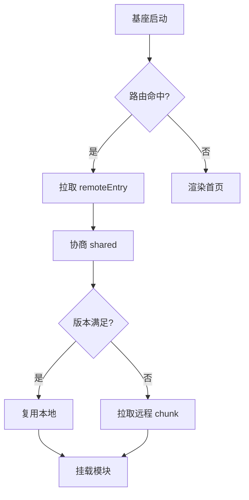
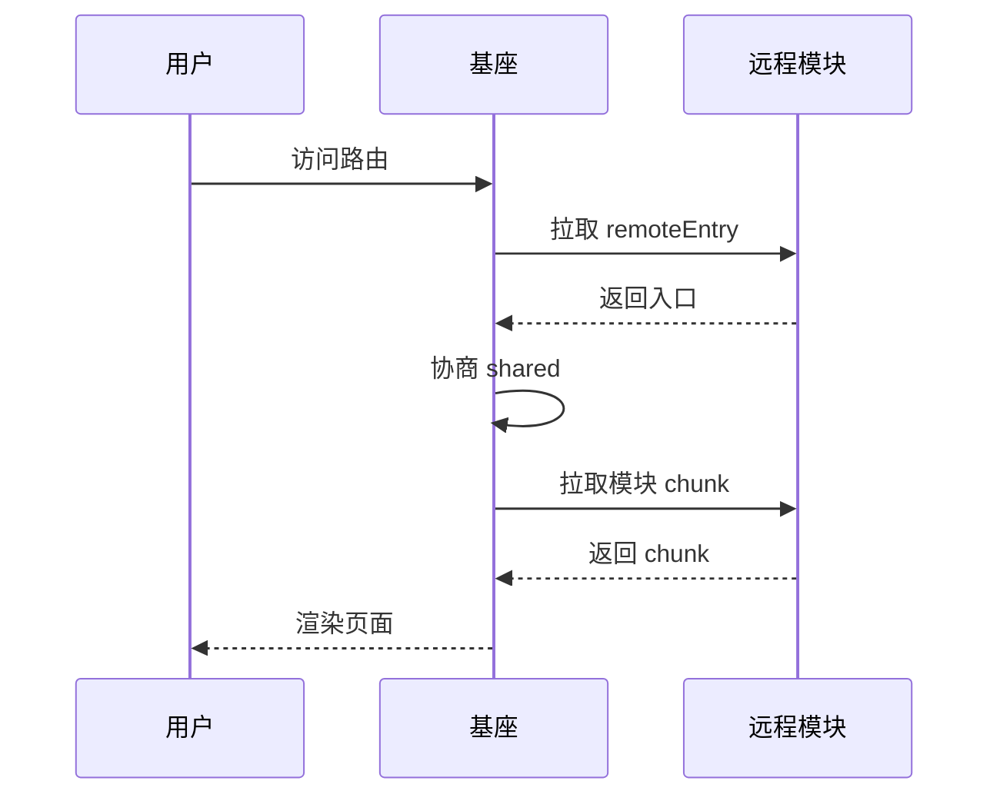

# 数学公式速查

> 本节汇集各类数学公式，用于测试 KaTeX 数学渲染能力（行内公式与块级公式）。

## 1. 基础代数

行内公式：二次方程求根 $x = \frac{-b \pm \sqrt{b^2 - 4ac}}{2a}$。

$$
(a + b)^2 = a^2 + 2ab + b^2
$$

$$
(a - b)^2 = a^2 - 2ab + b^2
$$

## 2. 微积分

导数定义：

$$
f'(x) = \lim\_{h \to 0} \frac{f(x+h) - f(x)}{h}
$$

不定积分：

$$
\int x^n , dx = \frac{x^{n+1}}{n+1} + C, \quad n \ne -1
$$

定积分（高斯积分）：

$$
\int\_{-\infty}^{\infty} e^{-x^2} , dx = \sqrt{\pi}
$$

## 3. 级数

等比数列求和（$|r| < 1$）：

$$
\sum\_{n=0}^{\infty} ar^n = \frac{a}{1 - r}
$$

泰勒展开：

$$
e^x = \sum\_{n=0}^{\infty} \frac{x^n}{n!} = 1 + x + \frac{x^2}{2!} + \frac{x^3}{3!} + \cdots
$$

## 4. 线性代数

矩阵乘法：

$$
\begin{bmatrix} a & b \ c & d \end{bmatrix} \begin{bmatrix} x \ y \end{bmatrix} = \begin{bmatrix} ax + by \ cx + dy \end{bmatrix}
$$

二阶矩阵求逆：

$$
\begin{bmatrix} a & b \ c & d \end{bmatrix}^{-1} = \frac{1}{ad - bc} \begin{bmatrix} d & -b \ -c & a \end{bmatrix}, \quad ad - bc \ne 0
$$

行列式：

$$
\det \begin{bmatrix} a & b \ c & d \end{bmatrix} = ad - bc
$$

## 5. 概率与统计

正态分布概率密度：

$$
f(x) = \frac{1}{\sigma \sqrt{2\pi}} , e^{-\frac{(x - \mu)^2}{2\sigma^2}}
$$

贝叶斯定理：

$$
P(A \mid B) = \frac{P(B \mid A), P(A)}{P(B)}
$$

期望与方差：

$$
\mathbb{E}\[X] = \sum\_i x\_i , p\_i, \qquad \mathrm{Var}(X) = \mathbb{E}\[X^2] - \mathbb{E}\[X]^2
$$

## 6. 复数与欧拉公式

$$
e^{i\theta} = \cos\theta + i\sin\theta
$$

欧拉恒等式：

$$
e^{i\pi} + 1 = 0
$$

## 7. 三角恒等式

$$
\sin^2\theta + \cos^2\theta = 1
$$

$$
\sin(A \pm B) = \sin A \cos B \pm \cos A \sin B
$$

$$
\cos(A \pm B) = \cos A \cos B \mp \sin A \sin B
$$

## 8. 物理公式

牛顿第二定律：$F = ma$。

动能定理：

$$
E\_k = \frac{1}{2} m v^2
$$

质能方程：$E = mc^2$。

麦克斯韦方程组（微分形式）：

$$
\nabla \cdot \mathbf{E} = \frac{\rho}{\varepsilon\_0}, \quad \nabla \cdot \mathbf{B} = 0
$$

$$
\nabla \times \mathbf{E} = -\frac{\partial \mathbf{B}}{\partial t}, \quad \nabla \times \mathbf{B} = \mu\_0 \mathbf{J} + \mu\_0 \varepsilon\_0 \frac{\partial \mathbf{E}}{\partial t}
$$

## 9. 组合与数论

排列组合：

$$
P(n, k) = \frac{n!}{(n-k)!}, \qquad C(n, k) = \binom{n}{k} = \frac{n!}{k!(n-k)!}
$$

二项式定理：

$$
(x + y)^n = \sum\_{k=0}^{n} \binom{n}{k} x^{n-k} y^k
$$

## 10. 分段与条件

绝对值函数：

$$
|x| = \begin{cases} x, & x \ge 0 \ -x, & x < 0 \end{cases}
$$

符号函数：

$$
\mathrm{sgn}(x) = \begin{cases} 1, & x > 0 \ 0, & x = 0 \ -1, & x < 0 \end{cases}
$$

## 11. 极限与连续

$$
\lim\_{x \to 0} \frac{\sin x}{x} = 1, \qquad \lim\_{x \to \infty} \left(1 + \frac{1}{x}\right)^x = e
$$

## 12. 构建效率相关公式

并行加速比（Amdahl）：

$$
S\_{\max} = \frac{1}{f + \frac{1-f}{P}}
$$

缓存期望时间：

$$
\mathbb{E}\[T] = T\_b \cdot \left\[(1-h)(1-r) + K(h + r - hr)\right]
$$

微前端首屏体积：

$$
\text{Payload} = B + (1-\alpha)\sum\_{j=1}^{M} V\_j + (1-\alpha)C
$$

***

# Euler Thrift Service

基于字节跳动 Euler 框架的 Thrift 服务示例。

## 项目简介1

本项目是一个使用 Python +  框架构建的 Thrift 服务，提供 `ExampleService` 服务。

* 服务框架: Euler

* 通信协议: Thrift

* 监听地址: `tcp://[::]:1234`

* 并发模型: gevent

## 本地开发

### 创建虚拟环境

```sh
$ python3 -m venv venv
```

### 激活虚拟环境

```sh
$ source venv/bin/activate
```

如果你使用 VSCode 或 PyCharm 等 IDE 进行开发，需要在选择解释器（Interpreter）时选择 `venv/bin/python`，否则代码补全和跳转功能会不正常。

### 安装依赖

首先参考 <https://python.byted.org/pip-setup.html> 设置 pip 私有源，如果已经设置过则可以跳过此步。

```sh
$ pip install -r requirements.txt
```

### 启动项目

```sh
$ ./bootstrap.sh
```

或者直接执行：

```sh
$ python server.py
```

## 项目结构

```
.
├── server.py          # 服务入口
├── client.py          # 客户端示例
├── bootstrap.sh       # 启动脚本
├── requirements.txt   # Python 依赖
├── logging_config.py  # 日志配置
└── idls/              # Thrift IDL 生成代码
```

## 常见问题

### ConnectionRefusedError: \[Errno 61] Connection refused

如果在 macOS 系统中进行开发，访问远端服务（数据库、下游服务）时需要通过 consul 进行服务发现，但 macOS 上没有公司内的服务发现系统，因此连接会失败。

这时可以设置 `CONSUL_HTTP_HOST` 环境变量来指定使用远端的 consul 做服务发现。例如：

```sh
$ export CONSUL_HTTP_HOST=10.6.131.78
```

目前推荐使用 devbox 上的 consul 为本地开发环境提供服务发现功能。

## 更多

* <br />

# Euler Thrift Service

基于字节跳动 Euler 框架的 Thrift 服务示例。

## 项目简介

本项目是一个使用 Python +  框架构建的 Thrift 服务，提供 `ExampleService` 服务。

* 服务框架: Euler

* 通信协议: Thrift

* 监听地址: `tcp://[::]:1234`

* 并发模型: gevent

## 本地开发

### 创建虚拟环境

```sh
$ python3 -m venv venv
```

### 激活虚拟环境

```sh
$ source venv/bin/activate
```

如果你使用 VSCode 或 PyCharm 等 IDE 进行开发，需要在选择解释器（Interpreter）时选择 `venv/bin/python`，否则代码补全和跳转功能会不正常。

### 安装依赖

首先参考 <https://python.byted.org/pip-setup.html> 设置 pip 私有源，如果已经设置过则可以跳过此步。

```sh
$ pip install -r requirements.txt
```

### 启动项目

```sh
$ ./bootstrap.sh
```

或者直接执行：

```sh
$ python server.py
```

## 项目结构

```
.
├── server.py          # 服务入口
├── client.py          # 客户端示例
├── bootstrap.sh       # 启动脚本
├── requirements.txt   # Python 依赖
├── logging_config.py  # 日志配置
└── idls/              # Thrift IDL 生成代码
```

## 常见问题

### ConnectionRefusedError: \[Errno 61] Connection refused

如果在 macOS 系统中进行开发，访问远端服务（数据库、下游服务）时需要通过 consul 进行服务发现，但 macOS 上没有公司内的服务发现系统，因此连接会失败。

这时可以设置 `CONSUL_HTTP_HOST` 环境变量来指定使用远端的 consul 做服务发现。例如：

```sh
$ export CONSUL_HTTP_HOST=10.6.131.78
```

目前推荐使用 devbox 上的 consul 为本地开发环境提供服务发现功能。

## 更多

* <br />

# Euler Thrift Service

基于字节跳动 Euler 框架的 Thrift 服务示例。

## 项目简介

本项目是一个使用 Python +  框架构建的 Thrift 服务，提供 `ExampleService` 服务。

* 服务框架: Euler

* 通信协议: Thrift

* 监听地址: `tcp://[::]:1234`

* 并发模型: gevent

## 本地开发

### 创建虚拟环境

```sh
$ python3 -m venv venv
```

### 激活虚拟环境

```sh
$ source venv/bin/activate
```

如果你使用 VSCode 或 PyCharm 等 IDE 进行开发，需要在选择解释器（Interpreter）时选择 `venv/bin/python`，否则代码补全和跳转功能会不正常。

### 安装依赖

首先参考 <https://python.byted.org/pip-setup.html> 设置 pip 私有源，如果已经设置过则可以跳过此步。

```sh
$ pip install -r requirements.txt
```

### 启动项目

```sh
$ ./bootstrap.sh
```

或者直接执行：

```sh
$ python server.py
```

## 项目结构

```
.
├── server.py          # 服务入口
├── client.py          # 客户端示例
├── bootstrap.sh       # 启动脚本
├── requirements.txt   # Python 依赖
├── logging_config.py  # 日志配置
└── idls/              # Thrift IDL 生成代码
```

## 常见问题

### ConnectionRefusedError: \[Errno 61] Connection refused

如果在 macOS 系统中进行开发，访问远端服务（数据库、下游服务）时需要通过 consul 进行服务发现，但 macOS 上没有公司内的服务发现系统，因此连接会失败。

这时可以设置 `CONSUL_HTTP_HOST` 环境变量来指定使用远端的 consul 做服务发现。例如：

```sh
$ export CONSUL_HTTP_HOST=10.6.131.78
```

目前推荐使用 devbox 上的 consul 为本地开发环境提供服务发现功能。

## 更多

* <br />

# Euler Thrift Service

基于字节跳动 Euler 框架的 Thrift 服务示例。

## 项目简介

本项目是一个使用 Python +  框架构建的 Thrift 服务，提供 `ExampleService` 服务。

* 服务框架: Euler

* 通信协议: Thrift

* 监听地址: `tcp://[::]:1234`

* 并发模型: gevent

## 本地开发

### 创建虚拟环境

```sh
$ python3 -m venv venv
```

### 激活虚拟环境

```sh
$ source venv/bin/activate
```

如果你使用 VSCode 或 PyCharm 等 IDE 进行开发，需要在选择解释器（Interpreter）时选择 `venv/bin/python`，否则代码补全和跳转功能会不正常。

### 安装依赖

首先参考 <https://python.byted.org/pip-setup.html> 设置 pip 私有源，如果已经设置过则可以跳过此步。

```sh
$ pip install -r requirements.txt
```

### 启动项目

```sh
$ ./bootstrap.sh
```

或者直接执行：

```sh
$ python server.py
```

## 项目结构

```
.
├── server.py          # 服务入口
├── client.py          # 客户端示例
├── bootstrap.sh       # 启动脚本
├── requirements.txt   # Python 依赖
├── logging_config.py  # 日志配置
└── idls/              # Thrift IDL 生成代码
```


## 常见问题

### ConnectionRefusedError: \[Errno 61] Connection refused

如果在 macOS 系统中进行开发，访问远端服务（数据库、下游服务）时需要通过 consul 进行服务发现，但 macOS 上没有公司内的服务发现系统，因此连接会失败。

这时可以设置 `CONSUL_HTTP_HOST` 环境变量来指定使用远端的 consul 做服务发现。例如：

```sh
$ export CONSUL_HTTP_HOST=10.6.131.78
```

目前推荐使用 devbox 上的 consul 为本地开发环境提供服务发现功能。

## 更多

* <br />

# Euler Thrift Service

基于字节跳动 Euler 框架的 Thrift 服务示例。

## 项目简介

本项目是一个使用 Python +  框架构建的 Thrift 服务，提供 `ExampleService` 服务。

* 服务框架: Euler

* 通信协议: Thrift

* 监听地址: `tcp://[::]:1234`

* 并发模型: gevent

## 本地开发

### 创建虚拟环境

```sh
$ python3 -m venv venv
```

### 激活虚拟环境

```sh
$ source venv/bin/activate
```

如果你使用 VSCode 或 PyCharm 等 IDE 进行开发，需要在选择解释器（Interpreter）时选择 `venv/bin/python`，否则代码补全和跳转功能会不正常。

### 安装依赖

首先参考 <https://python.byted.org/pip-setup.html> 设置 pip 私有源，如果已经设置过则可以跳过此步。

```sh
$ pip install -r requirements.txt
```

### 启动项目

```sh
$ ./bootstrap.sh
```

或者直接执行：

```sh
$ python server.py
```

## 项目结构

```
.
├── server.py          # 服务入口
├── client.py          # 客户端示例
├── bootstrap.sh       # 启动脚本
├── requirements.txt   # Python 依赖
├── logging_config.py  # 日志配置
└── idls/              # Thrift IDL 生成代码
```

## 常见问题

### ConnectionRefusedError: \[Errno 61] Connection refused

如果在 macOS 系统中进行开发，访问远端服务（数据库、下游服务）时需要通过 consul 进行服务发现，但 macOS 上没有公司内的服务发现系统，因此连接会失败。

这时可以设置 `CONSUL_HTTP_HOST` 环境变量来指定使用远端的 consul 做服务发现。例如：

```sh
$ export CONSUL_HTTP_HOST=10.6.131.78
```

目前推荐使用 devbox 上的 consul 为本地开发环境提供服务发现功能。

## 更多

* <br />

# Euler Thrift Service

基于字节跳动 Euler 框架的 Thrift 服务示例。

## 项目简介

本项目是一个使用 Python +  框架构建的 Thrift 服务，提供 `ExampleService` 服务。

* 服务框架: Euler

* 通信协议: Thrift

* 监听地址: `tcp://[::]:1234`

* 并发模型: gevent

## 本地开发

### 创建虚拟环境

```sh
$ python3 -m venv venv
```

### 激活虚拟环境

```sh
$ source venv/bin/activate
```

如果你使用 VSCode 或 PyCharm 等 IDE 进行开发，需要在选择解释器（Interpreter）时选择 `venv/bin/python`，否则代码补全和跳转功能会不正常。

### 安装依赖

首先参考 <https://python.byted.org/pip-setup.html> 设置 pip 私有源，如果已经设置过则可以跳过此步。

```sh
$ pip install -r requirements.txt
```

### 启动项目

```sh
$ ./bootstrap.sh
```

或者直接执行：

```sh
$ python server.py
```

## 项目结构

```
.
├── server.py          # 服务入口
├── client.py          # 客户端示例
├── bootstrap.sh       # 启动脚本
├── requirements.txt   # Python 依赖
├── logging_config.py  # 日志配置
└── idls/              # Thrift IDL 生成代码
```

## 常见问题

### ConnectionRefusedError: \[Errno 61] Connection refused

如果在 macOS 系统中进行开发，访问远端服务（数据库、下游服务）时需要通过 consul 进行服务发现，但 macOS 上没有公司内的服务发现系统，因此连接会失败。

这时可以设置 `CONSUL_HTTP_HOST` 环境变量来指定使用远端的 consul 做服务发现。例如：

```sh
$ export CONSUL_HTTP_HOST=10.6.131.78
```

目前推荐使用 devbox 上的 consul 为本地开发环境提供服务发现功能。

## 更多

* <br />

# Euler Thrift Service

基于字节跳动 Euler 框架的 Thrift 服务示例。

## 项目简介

本项目是一个使用 Python +  框架构建的 Thrift 服务，提供 `ExampleService` 服务。

* 服务框架: Euler

* 通信协议: Thrift

* 监听地址: `tcp://[::]:1234`

* 并发模型: gevent

## 本地开发

### 创建虚拟环境

```sh
$ python3 -m venv venv
```

### 激活虚拟环境

```sh
$ source venv/bin/activate
```

如果你使用 VSCode 或 PyCharm 等 IDE 进行开发，需要在选择解释器（Interpreter）时选择 `venv/bin/python`，否则代码补全和跳转功能会不正常。

### 安装依赖

首先参考 <https://python.byted.org/pip-setup.html> 设置 pip 私有源，如果已经设置过则可以跳过此步。

```sh
$ pip install -r requirements.txt
```

### 启动项目

```sh
$ ./bootstrap.sh
```

或者直接执行：

```sh
$ python server.py
```

## 项目结构

```
.
├── server.py          # 服务入口
├── client.py          # 客户端示例
├── bootstrap.sh       # 启动脚本
├── requirements.txt   # Python 依赖
├── logging_config.py  # 日志配置
└── idls/              # Thrift IDL 生成代码
```

## 常见问题

### ConnectionRefusedError: \[Errno 61] Connection refused

如果在 macOS 系统中进行开发，访问远端服务（数据库、下游服务）时需要通过 consul 进行服务发现，但 macOS 上没有公司内的服务发现系统，因此连接会失败。

这时可以设置 `CONSUL_HTTP_HOST` 环境变量来指定使用远端的 consul 做服务发现。例如：

```sh
$ export CONSUL_HTTP_HOST=10.6.131.78
```

目前推荐使用 devbox 上的 consul 为本地开发环境提供服务发现功能。

## 更多

* <br />

# Euler Thrift Service

基于字节跳动 Euler 框架的 Thrift 服务示例。

## 项目简介

本项目是一个使用 Python +  框架构建的 Thrift 服务，提供 `ExampleService` 服务。

* 服务框架: Euler

* 通信协议: Thrift

* 监听地址: `tcp://[::]:1234`

* 并发模型: gevent

## 本地开发

### 创建虚拟环境

```sh
$ python3 -m venv venv
```

### 激活虚拟环境

```sh
$ source venv/bin/activate
```

如果你使用 VSCode 或 PyCharm 等 IDE 进行开发，需要在选择解释器（Interpreter）时选择 `venv/bin/python`，否则代码补全和跳转功能会不正常。

### 安装依赖

首先参考 <https://python.byted.org/pip-setup.html> 设置 pip 私有源，如果已经设置过则可以跳过此步。

```sh
$ pip install -r requirements.txt
```

### 启动项目

```sh
$ ./bootstrap.sh
```

或者直接执行：

```sh
$ python server.py
```

## 项目结构

```
.
├── server.py          # 服务入口
├── client.py          # 客户端示例
├── bootstrap.sh       # 启动脚本
├── requirements.txt   # Python 依赖
├── logging_config.py  # 日志配置
└── idls/              # Thrift IDL 生成代码
```

## 常见问题

### ConnectionRefusedError: \[Errno 61] Connection refused

如果在 macOS 系统中进行开发，访问远端服务（数据库、下游服务）时需要通过 consul 进行服务发现，但 macOS 上没有公司内的服务发现系统，因此连接会失败。

这时可以设置 `CONSUL_HTTP_HOST` 环境变量来指定使用远端的 consul 做服务发现。例如：

```sh
$ export CONSUL_HTTP_HOST=10.6.131.78
```

目前推荐使用 devbox 上的 consul 为本地开发环境提供服务发现功能。

## 更多

* <br />

# Euler Thrift Service

基于字节跳动 Euler 框架的 Thrift 服务示例。

## 项目简介

本项目是一个使用 Python +  框架构建的 Thrift 服务，提供 `ExampleService` 服务。

* 服务框架: Euler

* 通信协议: Thrift

* 监听地址: `tcp://[::]:1234`

* 并发模型: gevent

## 本地开发

### 创建虚拟环境

```sh
$ python3 -m venv venv
```

### 激活虚拟环境

```sh
$ source venv/bin/activate
```

如果你使用 VSCode 或 PyCharm 等 IDE 进行开发，需要在选择解释器（Interpreter）时选择 `venv/bin/python`，否则代码补全和跳转功能会不正常。

### 安装依赖

首先参考 <https://python.byted.org/pip-setup.html> 设置 pip 私有源，如果已经设置过则可以跳过此步。

```sh
$ pip install -r requirements.txt
```

### 启动项目

```sh
$ ./bootstrap.sh
```

或者直接执行：

```sh
$ python server.py
```

## 项目结构

```
.
├── server.py          # 服务入口
├── client.py          # 客户端示例
├── bootstrap.sh       # 启动脚本
├── requirements.txt   # Python 依赖
├── logging_config.py  # 日志配置
└── idls/              # Thrift IDL 生成代码
```

## 常见问题

### ConnectionRefusedError: \[Errno 61] Connection refused

如果在 macOS 系统中进行开发，访问远端服务（数据库、下游服务）时需要通过 consul 进行服务发现，但 macOS 上没有公司内的服务发现系统，因此连接会失败。

这时可以设置 `CONSUL_HTTP_HOST` 环境变量来指定使用远端的 consul 做服务发现。例如：

```sh
$ export CONSUL_HTTP_HOST=10.6.131.78
```

目前推荐使用 devbox 上的 consul 为本地开发环境提供服务发现功能。

## 更多

* <br />

# Euler Thrift Service

基于字节跳动 Euler 框架的 Thrift 服务示例。

## 项目简介

本项目是一个使用 Python +  框架构建的 Thrift 服务，提供 `ExampleService` 服务。

* 服务框架: Euler

* 通信协议: Thrift

* 监听地址: `tcp://[::]:1234`

* 并发模型: gevent

## 本地开发

### 创建虚拟环境

```sh
$ python3 -m venv venv
```

### 激活虚拟环境

```sh
$ source venv/bin/activate
```

如果你使用 VSCode 或 PyCharm 等 IDE 进行开发，需要在选择解释器（Interpreter）时选择 `venv/bin/python`，否则代码补全和跳转功能会不正常。

### 安装依赖

首先参考 <https://python.byted.org/pip-setup.html> 设置 pip 私有源，如果已经设置过则可以跳过此步。

```sh
$ pip install -r requirements.txt
```

### 启动项目

```sh
$ ./bootstrap.sh
```

或者直接执行：

```sh
$ python server.py
```

## 项目结构

```
.
├── server.py          # 服务入口
├── client.py          # 客户端示例
├── bootstrap.sh       # 启动脚本
├── requirements.txt   # Python 依赖
├── logging_config.py  # 日志配置
└── idls/              # Thrift IDL 生成代码
```


## 常见问题

### ConnectionRefusedError: \[Errno 61] Connection refused

如果在 macOS 系统中进行开发，访问远端服务（数据库、下游服务）时需要通过 consul 进行服务发现，但 macOS 上没有公司内的服务发现系统，因此连接会失败。

这时可以设置 `CONSUL_HTTP_HOST` 环境变量来指定使用远端的 consul 做服务发现。例如：

```sh
$ export CONSUL_HTTP_HOST=10.6.131.78
```

目前推荐使用 devbox 上的 consul 为本地开发环境提供服务发现功能。

## 更多

* <br />

# Euler Thrift Service

基于字节跳动 Euler 框架的 Thrift 服务示例。

## 项目简介

本项目是一个使用 Python +  框架构建的 Thrift 服务，提供 `ExampleService` 服务。

* 服务框架: Euler

* 通信协议: Thrift

* 监听地址: `tcp://[::]:1234`

* 并发模型: gevent

## 本地开发

### 创建虚拟环境

```sh
$ python3 -m venv venv
```

### 激活虚拟环境

```sh
$ source venv/bin/activate
```

如果你使用 VSCode 或 PyCharm 等 IDE 进行开发，需要在选择解释器（Interpreter）时选择 `venv/bin/python`，否则代码补全和跳转功能会不正常。

### 安装依赖

首先参考 <https://python.byted.org/pip-setup.html> 设置 pip 私有源，如果已经设置过则可以跳过此步。

```sh
$ pip install -r requirements.txt
```

### 启动项目

```sh
$ ./bootstrap.sh
```

或者直接执行：

```sh
$ python server.py
```

## 项目结构

```
.
├── server.py          # 服务入口
├── client.py          # 客户端示例
├── bootstrap.sh       # 启动脚本
├── requirements.txt   # Python 依赖
├── logging_config.py  # 日志配置
└── idls/              # Thrift IDL 生成代码
```

## 常见问题

### ConnectionRefusedError: \[Errno 61] Connection refused

如果在 macOS 系统中进行开发，访问远端服务（数据库、下游服务）时需要通过 consul 进行服务发现，但 macOS 上没有公司内的服务发现系统，因此连接会失败。

这时可以设置 `CONSUL_HTTP_HOST` 环境变量来指定使用远端的 consul 做服务发现。例如：

```sh
$ export CONSUL_HTTP_HOST=10.6.131.78
```

目前推荐使用 devbox 上的 consul 为本地开发环境提供服务发现功能。

## 更多

* <br />

# Euler Thrift Service

基于字节跳动 Euler 框架的 Thrift 服务示例。

## 项目简介

本项目是一个使用 Python +  框架构建的 Thrift 服务，提供 `ExampleService` 服务。

* 服务框架: Euler

* 通信协议: Thrift

* 监听地址: `tcp://[::]:1234`

* 并发模型: gevent

## 本地开发

### 创建虚拟环境

```sh
$ python3 -m venv venv
```

### 激活虚拟环境

```sh
$ source venv/bin/activate
```

如果你使用 VSCode 或 PyCharm 等 IDE 进行开发，需要在选择解释器（Interpreter）时选择 `venv/bin/python`，否则代码补全和跳转功能会不正常。

### 安装依赖

首先参考 <https://python.byted.org/pip-setup.html> 设置 pip 私有源，如果已经设置过则可以跳过此步。

```sh
$ pip install -r requirements.txt
```

### 启动项目

```sh
$ ./bootstrap.sh
```

或者直接执行：

```sh
$ python server.py
```

## 项目结构

```
.
├── server.py          # 服务入口
├── client.py          # 客户端示例
├── bootstrap.sh       # 启动脚本
├── requirements.txt   # Python 依赖
├── logging_config.py  # 日志配置
└── idls/              # Thrift IDL 生成代码
```

## 常见问题

### ConnectionRefusedError: \[Errno 61] Connection refused

如果在 macOS 系统中进行开发，访问远端服务（数据库、下游服务）时需要通过 consul 进行服务发现，但 macOS 上没有公司内的服务发现系统，因此连接会失败。

这时可以设置 `CONSUL_HTTP_HOST` 环境变量来指定使用远端的 consul 做服务发现。例如：

```sh
$ export CONSUL_HTTP_HOST=10.6.131.78
```

目前推荐使用 devbox 上的 consul 为本地开发环境提供服务发现功能。

## 更多

* <br />

# Euler Thrift Service

基于字节跳动 Euler 框架的 Thrift 服务示例。

## 项目简介

本项目是一个使用 Python +  框架构建的 Thrift 服务，提供 `ExampleService` 服务。

* 服务框架: Euler

* 通信协议: Thrift

* 监听地址: `tcp://[::]:1234`

* 并发模型: gevent


## 本地开发

### 创建虚拟环境

```sh
$ python3 -m venv venv
```

### 激活虚拟环境

```sh
$ source venv/bin/activate
```

如果你使用 VSCode 或 PyCharm 等 IDE 进行开发，需要在选择解释器（Interpreter）时选择 `venv/bin/python`，否则代码补全和跳转功能会不正常。

### 安装依赖

首先参考 <https://python.byted.org/pip-setup.html> 设置 pip 私有源，如果已经设置过则可以跳过此步。

```sh
$ pip install -r requirements.txt
```

### 启动项目

```sh
$ ./bootstrap.sh
```

或者直接执行：

```sh
$ python server.py
```

## 项目结构

```
.
├── server.py          # 服务入口
├── client.py          # 客户端示例
├── bootstrap.sh       # 启动脚本
├── requirements.txt   # Python 依赖
├── logging_config.py  # 日志配置
└── idls/              # Thrift IDL 生成代码
```

## 常见问题

### ConnectionRefusedError: \[Errno 61] Connection refused

如果在 macOS 系统中进行开发，访问远端服务（数据库、下游服务）时需要通过 consul 进行服务发现，但 macOS 上没有公司内的服务发现系统，因此连接会失败。

这时可以设置 `CONSUL_HTTP_HOST` 环境变量来指定使用远端的 consul 做服务发现。例如：

```sh
$ export CONSUL_HTTP_HOST=10.6.131.78
```

目前推荐使用 devbox 上的 consul 为本地开发环境提供服务发现功能。

## 更多

* <br />

# Euler Thrift Service

基于字节跳动 Euler 框架的 Thrift 服务示例。

## 项目简介

本项目是一个使用 Python +  框架构建的 Thrift 服务，提供 `ExampleService` 服务。

* 服务框架: Euler

* 通信协议: Thrift

* 监听地址: `tcp://[::]:1234`

* 并发模型: gevent

## 本地开发

### 创建虚拟环境

```sh
$ python3 -m venv venv
```

### 激活虚拟环境

```sh
$ source venv/bin/activate
```

如果你使用 VSCode 或 PyCharm 等 IDE 进行开发，需要在选择解释器（Interpreter）时选择 `venv/bin/python`，否则代码补全和跳转功能会不正常。

### 安装依赖

首先参考 <https://python.byted.org/pip-setup.html> 设置 pip 私有源，如果已经设置过则可以跳过此步。

```sh
$ pip install -r requirements.txt
```

### 启动项目

```sh
$ ./bootstrap.sh
```

或者直接执行：

```sh
$ python server.py
```

## 项目结构

```
.
├── server.py          # 服务入口
├── client.py          # 客户端示例
├── bootstrap.sh       # 启动脚本
├── requirements.txt   # Python 依赖
├── logging_config.py  # 日志配置
└── idls/              # Thrift IDL 生成代码
```

## 常见问题

### ConnectionRefusedError: \[Errno 61] Connection refused

如果在 macOS 系统中进行开发，访问远端服务（数据库、下游服务）时需要通过 consul 进行服务发现，但 macOS 上没有公司内的服务发现系统，因此连接会失败。

这时可以设置 `CONSUL_HTTP_HOST` 环境变量来指定使用远端的 consul 做服务发现。例如：

```sh
$ export CONSUL_HTTP_HOST=10.6.131.78
```

目前推荐使用 devbox 上的 consul 为本地开发环境提供服务发现功能。

## 更多

* <br />

# Euler Thrift Service

基于字节跳动 Euler 框架的 Thrift 服务示例。

## 项目简介

本项目是一个使用 Python +  框架构建的 Thrift 服务，提供 `ExampleService` 服务。

* 服务框架: Euler

* 通信协议: Thrift

* 监听地址: `tcp://[::]:1234`

* 并发模型: gevent

## 本地开发

### 创建虚拟环境

```sh
$ python3 -m venv venv
```

### 激活虚拟环境

```sh
$ source venv/bin/activate
```

如果你使用 VSCode 或 PyCharm 等 IDE 进行开发，需要在选择解释器（Interpreter）时选择 `venv/bin/python`，否则代码补全和跳转功能会不正常。

### 安装依赖

首先参考 <https://python.byted.org/pip-setup.html> 设置 pip 私有源，如果已经设置过则可以跳过此步。

```sh
$ pip install -r requirements.txt
```

### 启动项目

```sh
$ ./bootstrap.sh
```

或者直接执行：

```sh
$ python server.py
```

## 项目结构

```
.
├── server.py          # 服务入口
├── client.py          # 客户端示例
├── bootstrap.sh       # 启动脚本
├── requirements.txt   # Python 依赖
├── logging_config.py  # 日志配置
└── idls/              # Thrift IDL 生成代码
```

## 常见问题

### ConnectionRefusedError: \[Errno 61] Connection refused

如果在 macOS 系统中进行开发，访问远端服务（数据库、下游服务）时需要通过 consul 进行服务发现，但 macOS 上没有公司内的服务发现系统，因此连接会失败。

这时可以设置 `CONSUL_HTTP_HOST` 环境变量来指定使用远端的 consul 做服务发现。例如：

```sh
$ export CONSUL_HTTP_HOST=10.6.131.78
```

目前推荐使用 devbox 上的 consul 为本地开发环境提供服务发现功能。

## 更多

* <br />

# Euler Thrift Service

基于字节跳动 Euler 框架的 Thrift 服务示例。

## 项目简介

本项目是一个使用 Python +  框架构建的 Thrift 服务，提供 `ExampleService` 服务。

* 服务框架: Euler

* 通信协议: Thrift

* 监听地址: `tcp://[::]:1234`

* 并发模型: gevent

## 本地开发

### 创建虚拟环境

```sh
$ python3 -m venv venv
```

### 激活虚拟环境

```sh
$ source venv/bin/activate
```

如果你使用 VSCode 或 PyCharm 等 IDE 进行开发，需要在选择解释器（Interpreter）时选择 `venv/bin/python`，否则代码补全和跳转功能会不正常。

### 安装依赖

首先参考 <https://python.byted.org/pip-setup.html> 设置 pip 私有源，如果已经设置过则可以跳过此步。

```sh
$ pip install -r requirements.txt
```

### 启动项目

```sh
$ ./bootstrap.sh
```

或者直接执行：

```sh
$ python server.py
```

## 项目结构

```
.
├── server.py          # 服务入口
├── client.py          # 客户端示例
├── bootstrap.sh       # 启动脚本
├── requirements.txt   # Python 依赖
├── logging_config.py  # 日志配置
└── idls/              # Thrift IDL 生成代码
```

## 常见问题

### ConnectionRefusedError: \[Errno 61] Connection refused

如果在 macOS 系统中进行开发，访问远端服务（数据库、下游服务）时需要通过 consul 进行服务发现，但 macOS 上没有公司内的服务发现系统，因此连接会失败。

这时可以设置 `CONSUL_HTTP_HOST` 环境变量来指定使用远端的 consul 做服务发现。例如：

```sh
$ export CONSUL_HTTP_HOST=10.6.131.78
```

目前推荐使用 devbox 上的 consul 为本地开发环境提供服务发现功能。

## 更多

* <br />

# Euler Thrift Service

基于字节跳动 Euler 框架的 Thrift 服务示例。

## 项目简介

本项目是一个使用 Python +  框架构建的 Thrift 服务，提供 `ExampleService` 服务。

* 服务框架: Euler

* 通信协议: Thrift

* 监听地址: `tcp://[::]:1234`

* 并发模型: gevent

## 本地开发

### 创建虚拟环境

```sh
$ python3 -m venv venv
```

### 激活虚拟环境

```sh
$ source venv/bin/activate
```

如果你使用 VSCode 或 PyCharm 等 IDE 进行开发，需要在选择解释器（Interpreter）时选择 `venv/bin/python`，否则代码补全和跳转功能会不正常。

### 安装依赖

首先参考 <https://python.byted.org/pip-setup.html> 设置 pip 私有源，如果已经设置过则可以跳过此步。

```sh
$ pip install -r requirements.txt
```

### 启动项目

```sh
$ ./bootstrap.sh
```

或者直接执行：

```sh
$ python server.py
```

## 项目结构

```
.
├── server.py          # 服务入口
├── client.py          # 客户端示例
├── bootstrap.sh       # 启动脚本
├── requirements.txt   # Python 依赖
├── logging_config.py  # 日志配置
└── idls/              # Thrift IDL 生成代码
```

## 常见问题

### ConnectionRefusedError: \[Errno 61] Connection refused

如果在 macOS 系统中进行开发，访问远端服务（数据库、下游服务）时需要通过 consul 进行服务发现，但 macOS 上没有公司内的服务发现系统，因此连接会失败。

这时可以设置 `CONSUL_HTTP_HOST` 环境变量来指定使用远端的 consul 做服务发现。例如：

```sh
$ export CONSUL_HTTP_HOST=10.6.131.78
```

目前推荐使用 devbox 上的 consul 为本地开发环境提供服务发现功能。

## 更多

* <br />

# Euler Thrift Service

基于字节跳动 Euler 框架的 Thrift 服务示例。

## 项目简介

本项目是一个使用 Python +  框架构建的 Thrift 服务，提供 `ExampleService` 服务。

* 服务框架: Euler

* 通信协议: Thrift

* 监听地址: `tcp://[::]:1234`

* 并发模型: gevent

## 本地开发

### 创建虚拟环境

```sh
$ python3 -m venv venv
```

### 激活虚拟环境

```sh
$ source venv/bin/activate
```

如果你使用 VSCode 或 PyCharm 等 IDE 进行开发，需要在选择解释器（Interpreter）时选择 `venv/bin/python`，否则代码补全和跳转功能会不正常。

### 安装依赖

首先参考 <https://python.byted.org/pip-setup.html> 设置 pip 私有源，如果已经设置过则可以跳过此步。

```sh
$ pip install -r requirements.txt
```

### 启动项目

```sh
$ ./bootstrap.sh
```

或者直接执行：

```sh
$ python server.py
```

## 项目结构

````
.
├── server.py          # 服务入口
├── client.py          # 客户端示例
├── boo# Euler Thrift Service

基于字节跳动 Euler 框架的 Thrift 服务示例。

## 项目简介

本项目是一个使用 Python +  框架构建的 Thrift 服务，提供 `ExampleService` 服务。

* 服务框架: Euler

* 通信协议: Thrift

* 监听地址: `tcp://[::]:1234`

* 并发模型: gevent

## 本地开发

### 创建虚拟环境

```sh
$ python3 -m venv venv
````

### 激活虚拟环境

```sh
$ source venv/bin/activate
```

如果你使用 VSCode 或 PyCharm 等 IDE 进行开发，需要在选择解释器（Interpreter）时选择 `venv/bin/python`，否则代码补全和跳转功能会不正常。

### 安装依赖

首先参考 <https://python.byted.org/pip-setup.html> 设置 pip 私有源，如果已经设置过则可以跳过此步。

```sh
$ pip install -r requirements.txt
```

### 启动项目

```sh
$ ./bootstrap.sh
```

或者直接执行：

```sh
$ python server.py
```


## 项目结构

```
.
├── server.py          # 服务入口
├── client.py          # 客户端示例
├── bootstrap.sh       # 启动脚本
├── requirements.txt   # Python 依赖
├── logging_config.py  # 日志配置
└── idls/              # Thrift IDL 生成代码
```

## 常见问题

### ConnectionRefusedError: \[Errno 61] Connection refused

如果在 macOS 系统中进行开发，访问远端服务（数据库、下游服务）时需要通过 consul 进行服务发现，但 macOS 上没有公司内的服务发现系统，因此连接会失败。

这时可以设置 `CONSUL_HTTP_HOST` 环境变量来指定使用远端的 consul 做服务发现。例如：

```sh
$ export CONSUL_HTTP_HOST=10.6.131.78
```

目前推荐使用 devbox 上的 consul 为本地开发环境提供服务发现功能。

## 更多

* <br />

# Euler Thrift Service

基于字节跳动 Euler 框架的 Thrift 服务示例。

## 项目简介

本项目是一个使用 Python +  框架构建的 Thrift 服务，提供 `ExampleService` 服务。

* 服务框架: Euler

* 通信协议: Thrift

* 监听地址: `tcp://[::]:1234`

* 并发模型: gevent

## 本地开发

### 创建虚拟环境

```sh
$ python3 -m venv venv
```

### 激活虚拟环境

```sh
$ source venv/bin/activate
```

如果你使用 VSCode 或 PyCharm 等 IDE 进行开发，需要在选择解释器（Interpreter）时选择 `venv/bin/python`，否则代码补全和跳转功能会不正常。

### 安装依赖

首先参考 <https://python.byted.org/pip-setup.html> 设置 pip 私有源，如果已经设置过则可以跳过此步。

```sh
$ pip install -r requirements.txt
```

### 启动项目

```sh
$ ./bootstrap.sh
```

或者直接执行：

```sh
$ python server.py
```

## 项目结构

```
.
├── server.py          # 服务入口
├── client.py          # 客户端示例
├── bootstrap.sh       # 启动脚本
├── requirements.txt   # Python 依赖
├── logging_config.py  # 日志配置
└── idls/              # Thrift IDL 生成代码
```

## 常见问题

### ConnectionRefusedError: \[Errno 61] Connection refused

如果在 macOS 系统中进行开发，访问远端服务（数据库、下游服务）时需要通过 consul 进行服务发现，但 macOS 上没有公司内的服务发现系统，因此连接会失败。

这时可以设置 `CONSUL_HTTP_HOST` 环境变量来指定使用远端的 consul 做服务发现。例如：

```sh
$ export CONSUL_HTTP_HOST=10.6.131.78
```

目前推荐使用 devbox 上的 consul 为本地开发环境提供服务发现功能。

## 更多

* <br />

# Euler Thrift Service

基于字节跳动 Euler 框架的 Thrift 服务示例。

## 项目简介

本项目是一个使用 Python +  框架构建的 Thrift 服务，提供 `ExampleService` 服务。

* 服务框架: Euler

* 通信协议: Thrift

* 监听地址: `tcp://[::]:1234`

* 并发模型: gevent

## 本地开发

### 创建虚拟环境

```sh
$ python3 -m venv venv
```

### 激活虚拟环境

```sh
$ source venv/bin/activate
```

如果你使用 VSCode 或 PyCharm 等 IDE 进行开发，需要在选择解释器（Interpreter）时选择 `venv/bin/python`，否则代码补全和跳转功能会不正常。

### 安装依赖

首先参考 <https://python.byted.org/pip-setup.html> 设置 pip 私有源，如果已经设置过则可以跳过此步。

```sh
$ pip install -r requirements.txt
```

### 启动项目

```sh
$ ./bootstrap.sh
```

或者直接执行：

```sh
$ python server.py
```

## 项目结构

```
.
├── server.py          # 服务入口
├── client.py          # 客户端示例
├── bootstrap.sh       # 启动脚本
├── requirements.txt   # Python 依赖
├── logging_config.py  # 日志配置
└── idls/              # Thrift IDL 生成代码
```

## 常见问题

### ConnectionRefusedError: \[Errno 61] Connection refused

如果在 macOS 系统中进行开发，访问远端服务（数据库、下游服务）时需要通过 consul 进行服务发现，但 macOS 上没有公司内的服务发现系统，因此连接会失败。

这时可以设置 `CONSUL_HTTP_HOST` 环境变量来指定使用远端的 consul 做服务发现。例如：

```sh
$ export CONSUL_HTTP_HOST=10.6.131.78
```

目前推荐使用 devbox 上的 consul 为本地开发环境提供服务发现功能。

## 更多

* <br />

# Euler Thrift Service

基于字节跳动 Euler 框架的 Thrift 服务示例。

## 项目简介

本项目是一个使用 Python +  框架构建的 Thrift 服务，提供 `ExampleService` 服务。

* 服务框架: Euler

* 通信协议: Thrift

* 监听地址: `tcp://[::]:1234`

* 并发模型: gevent

## 本地开发

### 创建虚拟环境

```sh
$ python3 -m venv venv
```

### 激活虚拟环境

```sh
$ source venv/bin/activate
```

如果你使用 VSCode 或 PyCharm 等 IDE 进行开发，需要在选择解释器（Interpreter）时选择 `venv/bin/python`，否则代码补全和跳转功能会不正常。

### 安装依赖

首先参考 <https://python.byted.org/pip-setup.html> 设置 pip 私有源，如果已经设置过则可以跳过此步。

```sh
$ pip install -r requirements.txt
```

### 启动项目

```sh
$ ./bootstrap.sh
```

或者直接执行：

```sh
$ python server.py
```

## 项目结构

```
.
├── server.py          # 服务入口
├── client.py 1        # 客户端示例
├── bootstrap.sh       # 启动脚本
├── requirements.txt   # Python 依赖
├── logging_config.py  # 日志配置
└── idls/              # Thrift IDL 生成代码
```

## 常见问题

### ConnectionRefusedError: \[Errno 61] Connection refused

如果在 macOS 系统中进行开发，访问远端服务（数据库、下游服务）时需要通过 consul 进行服务发现，但 macOS 上没有公司内的服务发现系统，因此连接会失败。

这时可以设置 `CONSUL_HTTP_HOST` 环境变量来指定使用远端的 consul 做服务发现。例如：

```sh
$ export CONSUL_HTTP_HOST=10.6.131.78
```

目前推荐使用 devbox 上的 consul 为本地开发环境提供服务发现功能。

## 更多

* <br />

# Euler Thrift Service

基于字节跳动 Euler 框架的 Thrift 服务示例。

## 项目简介

本项目是一个使用 Python +  框架构建的 Thrift 服务，提供 `ExampleService` 服务。

* 服务框架: Euler

* 通信协议: Thrift

* 监听地址: `tcp://[::]:1234`

* 并发模型: gevent

## 本地开发

### 创建虚拟环境

```sh
$ python3 -m venv venv
```

### 激活虚拟环境

```sh
$ source venv/bin/activate
```

如果你使用 VSCode 或 PyCharm 等 IDE 进1行开发，需要在选择解释器（Interpreter）时选择 `venv/bin/python`，否则代码补全和跳转功能会不正常。

### 安装依赖

首先参考 <https://python.byted.org/pip-setup.html> 设置 pip 私有源，如果已经设置过则可以跳过此步。

```sh
$ pip install -r requirements.txt
```

### 启动项目

```sh
$ ./bootstrap.sh
```

或者直接执行：

```sh
$ python server.py
```

## 项目结构

```
.
├── server.py          # 服务入口
├── client.py          # 客户端示例
├── bootstrap.sh       # 启动脚本
├── requirements.txt   # Python 依赖
├── logging_config.py  # 日志配置
└── idls/              # Thrift IDL 生成代码
```

## 常见问题

### ConnectionRefusedError: \[Errno 61] Connection refused

如果在 macOS 系统中进行开发，访问远端服务（数据库、下游服务）时需要通过 consul 进行服务发现，但 macOS 上没有公司内的服务发现系统，因此连接会失败。

这时可以设置 `CONSUL_HTTP_HOST` 环境变量来指定使用远端的 consul 做服务发现。例如：

```sh
$ export CONSUL_HTTP_HOST=10.6.131.78
```

目前推荐使用 devbox 上的 consul 为本地开发环境提供服务发现功能。

## 更多

* <br />

# Euler Thrift Service

基于字节跳动 Euler 框架的 Thrift 服务示例。

## 项目简介

本项目是一个使用 Python +  框架构建的 Thrift 服务，提供 `ExampleService` 服务。

* 服务框架: Euler

* 通信协议: Thrift

* 监听地址: `tcp://[::]:1234`

* 并发模型: gevent

## 本地开发

### 创建虚拟环境

```sh
$ python3 -m venv venv
```

### 激活虚拟环境

```sh
$ source venv/bin/activate
```

如果你使用 VSCode 或 PyCharm 等 IDE 进行开发，需要在选择解释器（Interpreter）时选择 `venv/bin/python`，否则代码补全和跳转功能会不正常。

### 安装依赖

首先参考 <https://python.byted.org/pip-setup.html> 设置 pip 私有源，如果已经设置过则可以跳过此步。

```sh
$ pip install -r requirements.txt
```

### 启动项目

```sh
$ ./bootstrap.sh
```

或者直接执行：

```sh
$ python server.py
```

## 项目结构

```
.
├── server.py          # 服务入口
├── client.py          # 客户端示例
├── bootstrap.sh       # 启动脚本
├── requirements.txt   # Python 依赖
├── logging_config.py  # 日志配置
└── idls/              # Thrift IDL 生成代码
```

## 常见问题

### ConnectionRefusedError: \[Errno 61] Connection refused

如果在 macOS 系统中进行开发，访问远端服务（数据库、下游服务）时需要通过 consul 进行服务发现，但 macOS 上没有公司内的服务发现系统，因此连接会失败。

这时可以设置 `CONSUL_HTTP_HOST` 环境变量来指定使用远端的 consul 做服务发现。例如：

```sh
$ export CONSUL_HTTP_HOST=10.6.131.78
```

目前推荐使用 devbox 上的 consul 为本地开发环境提供服务发现功能。

## 更多

* <br />

# Euler Thrift Service

基于字节跳动 Euler 框架的 Thrift 服务示例。

## 项目简介

本项目是一个使用 Python +  框架构建的 Thrift 服务，提供 `ExampleService` 服务。

* 服务框架: Euler

* 通信协议: Thrift

* 监听地址: `tcp://[::]:1234`

* 并发模型: gevent

## 本地开发

### 创建虚拟环境

```sh
$ python3 -m venv venv
```

### 激活虚拟环境

```sh
$ source venv/bin/activate
```

如果你使用 VSCode 或 PyCharm 等 IDE 进行开发，需要在选择解释器（Interpreter）时选择 `venv/bin/python`，否则代码补全和跳转功能会不正常。

### 安装依赖

首先参考 <https://python.byted.org/pip-setup.html> 设置 pip 私有源，如果已经设置过则可以跳过此步。

```sh
$ pip install -r requirements.txt
```

### 启动项目

```sh
$ ./bootstrap.sh
```

或者直接执行：

```sh
$ python server.py
```

## 项目结构

```
.
├── server.py          # 服务入口
├── client.py          # 客户端示例
├── bootstrap.sh       # 启动脚本
├── requirements.txt   # Python 依赖
├── logging_config.py  # 日志配置
└── idls/              # Thrift IDL 生成代码
```

## 常见问题

### ConnectionRefusedError: \[Errno 61] Connection refused

如果在 macOS 系统中进行开发，访问远端服务（数据库、下游服务）时需要通过 consul 进行服务发现，但 macOS 上没有公司内的服务发现系统，因此连接会失败。

这时可以设置 `CONSUL_HTTP_HOST` 环境变量来指定使用远端的 consul 做服务发现。例如：

```sh
$ export CONSUL_HTTP_HOST=10.6.131.78
```

目前推荐使用 devbox 上的 consul 为本地开发环境提供服务发现功能。

## 更多

* <br />

# Euler Thrift Service

基于字节跳动 Euler 框架的 Thrift 服务示例。

## 项目简介

本项目是一个使用 Python +  框架构建的 Thrift 服务，提供 `ExampleService` 服务。

* 服务框架: Euler

* 通信协议: Thrift

* 监听地址: `tcp://[::]:1234`

* 并发模型: gevent

## 本地开发

### 创建虚拟环境

```sh
$ python3 -m venv venv
```

### 激活虚拟环境

```sh
$ source venv/bin/activate
```

如果你使用 VSCode 或 PyCharm 等 IDE 进行开发，需要在选择解释器（Interpreter）时选择 `venv/bin/python`，否则代码补全和跳转功能会不正常。

### 安装依赖

首先参考 <https://python.byted.org/pip-setup.html> 设置 pip 私有源，如果已经设置过则可以跳过此步。

```sh
$ pip install -r requirements.txt
```

### 启动项目

```sh
$ ./bootstrap.sh
```

或者直接执行：

```sh
$ python server.py
```

## 项目结构

```
.
├── server.py          # 服务入口
├── client.py          # 客户端示例
├── bootstrap.sh       # 启动脚本
├── requirements.txt   # Python 依赖
├── logging_config.py  # 日志配置
└── idls/              # Thrift IDL 生成代码
```

## 常见问题

### ConnectionRefusedError: \[Errno 61] Connection refused

如果在 macOS 系统中进行开发，访问远端服务（数据库、下游服务）时需要通过 consul 进行服务发现，但 macOS 上没有公司内的服务发现系统，因此连接会失败。

这时可以设置 `CONSUL_HTTP_HOST` 环境变量来指定使用远端的 consul 做服务发现。例如：

```sh
$ export CONSUL_HTTP_HOST=10.6.131.78
```

目前推荐使用 devbox 上的 consul 为本地开发环境提供服务发现功能。

## 更多

* <br />

# Euler Thrift Service

基于字节跳动 Euler 框架的 Thrift 服务示例。

## 项目简介

本项目是一个使用 Python +  框架构建的 Thrift 服务，提供 `ExampleService` 服务。

* 服务框架: Euler

* 通信协议: Thrift

* 监听地址: `tcp://[::]:1234`

* 并发模型: gevent

## 本地开发

### 创建虚拟环境

```sh
$ python3 -m venv venv
```

### 激活虚拟环境

```sh
$ source venv/bin/activate
```

如果你使用 VSCode 或 PyCharm 等 IDE 进行开发，需要在选择解释器（Interpreter）时选择 `venv/bin/python`，否则代码补全和跳转功能会不正常。

### 安装依赖

首先参考 <https://python.byted.org/pip-setup.html> 设置 pip 私有源，如果已经设置过则可以跳过此步。

```sh
$ pip install -r requirements.txt
```

### 启动项目

```sh
$ ./bootstrap.sh
```

或者直接执行：

```sh
$ python server.py
```

## 项目结构

```
.
├── server.py          # 服务入口
├── client.py          # 客户端示例
├── bootstrap.sh       # 启动脚本
├── requirements.txt   # Python 依赖
├── logging_config.py  # 日志配置
└── idls/              # Thrift IDL 生成代码
```

## 常见问题

### ConnectionRefusedError: \[Errno 61] Connection refused

如果在 macOS 系统中进行开发，访问远端服务（数据库、下游服务）时需要通过 consul 进行服务发现，但 macOS 上没有公司内的服务发现系统，因此连接会失败。

这时可以设置 `CONSUL_HTTP_HOST` 环境变量来指定使用远端的 consul 做服务发现。例如：

```sh
$ export CONSUL_HTTP_HOST=10.6.131.78
```

目前推荐使用 devbox 上的 consul 为本地开发环境提供服务发现功能。

## 更多

* <br />

# Euler Thrift Service

基于字节跳动 Euler 框架的 Thrift 服务示例。

## 项目简介

本项目是一个使用 Python +  框架构建的 Thrift 服务，提供 `ExampleService` 服务。

* 服务框架: Euler

* 通信协议: Thrift

* 监听地址: `tcp://[::]:1234`

* 并发模型: gevent

## 本地开发

### 创建虚拟环境

```sh
$ python3 -m venv venv
```

### 激活虚拟环境

```sh
$ source venv/bin/activate
```

如果你使用 VSCode 或 PyCharm 等 IDE 进行开发，需要在选择解释器（Interpreter）时选择 `venv/bin/python`，否则代码补全和跳转功能会不正常。

### 安装依赖

首先参考 <https://python.byted.org/pip-setup.html> 设置 pip 私有源，如果已经设置过则可以跳过此步。

```sh
$ pip install -r requirements.txt
```

### 启动项目

```sh
$ ./bootstrap.sh
```

或者直接执行：

```sh
$ python server.py
```

## 项目结构

```
.
├── server.py          # 服务入口
├── client.py          # 客户端示例
├── bootstrap.sh       # 启动脚本
├── requirements.txt   # Python 依赖
├── logging_config.py  # 日志配置
└── idls/              # Thrift IDL 生成代码
```

## 常见问题

### ConnectionRefusedError: \[Errno 61] Connection refused

如果在 macOS 系统中进行开发，访问远端服务（数据库、下游服务）时需要通过 consul 进行服务发现，但 macOS 上没有公司内的服务发现系统，因此连接会失败。

这时可以设置 `CONSUL_HTTP_HOST` 环境变量来指定使用远端的 consul 做服务发现。例如：

```sh
$ export CONSUL_HTTP_HOST=10.6.131.78
```

目前推荐使用 devbox 上的 consul 为本地开发环境提供服务发现功能。

## 更多

* <br />

# Euler Thrift Service

基于字节跳动 Euler 框架的 Thrift 服务示例。

## 项目简介

本项目是一个使用 Python +  框架构建的 Thrift 服务，提供 `ExampleService` 服务。

* 服务框架: Euler

* 通信协议: Thrift

* 监听地址: `tcp://[::]:1234`

* 并发模型: gevent

## 本地开发

### 创建虚拟环境

```sh
$ python3 -m venv venv
```

### 激活虚拟环境

```sh
$ source venv/bin/activate
```

如果你使用 VSCode 或 PyCharm 等 IDE 进行开发，需要在选择解释器（Interpreter）时选择 `venv/bin/python`，否则代码补全和跳转功能会不正常。

### 安装依赖

首先参考 <https://python.byted.org/pip-setup.html> 设置 pip 私有源，如果已经设置过则可以跳过此步。

```sh
$ pip install -r requirements.txt
```

### 启动项目

```sh
$ ./bootstrap.sh
```

或者直接执行：

```sh
$ python server.py
```

## 项目结构

```
.
├── server.py          # 服务入口
├── client.py          # 客户端示例
├── bootstrap.sh       # 启动脚本
├── requirements.txt   # Python 依赖
├── logging_config.py  # 日志配置
└── idls/              # Thrift IDL 生成代码
```

## 常见问题

### ConnectionRefusedError: \[Errno 61] Connection refused

如果在 macOS 系统中进行开发，访问远端服务（数据库、下游服务）时需要通过 consul 进行服务发现，但 macOS 上没有公司内的服务发现系统，因此连接会失败。

这时可以设置 `CONSUL_HTTP_HOST` 环境变量来指定使用远端的 consul 做服务发现。例如：

```sh
$ export CONSUL_HTTP_HOST=10.6.131.78
```

目前推荐使用 devbox 上的 consul 为本地开发环境提供服务发现功能。

## 更多

* <br />

# Euler Thrift Service

基于字节跳动 Euler 框架的 Thrift 服务示例。

## 项目简介

本项目是一个使用 Python +  框架构建的 Thrift 服务，提供 `ExampleService` 服务。

* 服务框架: Euler

* 通信协议: Thrift

* 监听地址: `tcp://[::]:1234`

* 并发模型: gevent

## 本地开发

### 创建虚拟环境

```sh
$ python3 -m venv venv
```

### 激活虚拟环境

```sh
$ source venv/bin/activate
```

如果你使用 VSCode 或 PyCharm 等 IDE 进行开发，需要在选择解释器（Interpreter）时选择 `venv/bin/python`，否则代码补全和跳转功能会不正常。

### 安装依赖

首先参考 <https://python.byted.org/pip-setup.html> 设置 pip 私有源，如果已经设置过则可以跳过此步。

```sh
$ pip install -r requirements.txt
```

### 启动项目

```sh
$ ./bootstrap.sh
```

或者直接执行：

```sh
$ python server.py
```

## 项目结构

```
.
├── server.py          # 服务入口
├── client.py          # 客户端示例
├── bootstrap.sh       # 启动脚本
├── requirements.txt   # Python 依赖
├── logging_config.py  # 日志配置
└── idls/              # Thrift IDL 生成代码
```

## 常见问题

### ConnectionRefusedError: \[Errno 61] Connection refused

如果在 macOS 系统中进行开发，访问远端服务（数据库、下游服务）时需要通过 consul 进行服务发现，但 macOS 上没有公司内的服务发现系统，因此连接会失败。

这时可以设置 `CONSUL_HTTP_HOST` 环境变量来指定使用远端的 consul 做服务发现。例如：

```sh
$ export CONSUL_HTTP_HOST=10.6.131.78
```

目前推荐使用 devbox 上的 consul 为本地开发环境提供服务发现功能。

## 更多

* <br />

# Euler Thrift Service

基于字节跳动 Euler 框架的 Thrift 服务示例。

## 项目简介

本项目是一个使用 Python +  框架构建的 Thrift 服务，提供 `ExampleService` 服务。

* 服务框架: Euler

* 通信协议: Thrift

* 监听地址: `tcp://[::]:1234`

* 并发模型: gevent

## 本地开发

### 创建虚拟环境

```sh
$ python3 -m venv venv
```

### 激活虚拟环境

```sh
$ source venv/bin/activate
```

如果你使用 VSCode 或 PyCharm 等 IDE 进行开发，需要在选择解释器（Interpreter）时选择 `venv/bin/python`，否则代码补全和跳转功能会不正常。

### 安装依赖

首先参考 <https://python.byted.org/pip-setup.html> 设置 pip 私有源，如果已经设置过则可以跳过此步。

```sh
$ pip install -r requirements.txt
```

### 启动项目

```sh
$ ./bootstrap.sh
```

或者直接执行：

```sh
$ python server.py
```

## 项目结构

```
.
├── server.py          # 服务入口
├── client.py          # 客户端示例
├── bootstrap.sh       # 启动脚本
├── requirements.txt   # Python 依赖
├── logging_config.py  # 日志配置
└── idls/              # Thrift IDL 生成代码
```

## 常见问题

### ConnectionRefusedError: \[Errno 61] Connection refused

如果在 macOS 系统中进行开发，访问远端服务（数据库、下游服务）时需要通过 consul 进行服务发现，但 macOS 上没有公司内的服务发现系统，因此连接会失败。

这时可以设置 `CONSUL_HTTP_HOST` 环境变量来指定使用远端的 consul 做服务发现。例如：

```sh
$ export CONSUL_HTTP_HOST=10.6.131.78
```

目前推荐使用 devbox 上的 consul 为本地开发环境提供服务发现功能。

## 更多

* <br />

# Euler Thrift Service

基于字节跳动 Euler 框架的 Thrift 服务示例。

## 项目简介

本项目是一个使用 Python +  框架构建的 Thrift 服务，提供 `ExampleService` 服务。

* 服务框架: Euler

* 通信协议: Thrift

* 监听地址: `tcp://[::]:1234`

* 并发模型: gevent

## 本地开发

### 创建虚拟环境

```sh
$ python3 -m venv venv
```

### 激活虚拟环境

```sh
$ source venv/bin/activate
```

如果你使用 VSCode 或 PyCharm 等 IDE 进行开发，需要在选择解释器（Interpreter）时选择 `venv/bin/python`，否则代码补全和跳转功能会不正常。

### 安装依赖

首先参考 <https://python.byted.org/pip-setup.html> 设置 pip 私有源，如果已经设置过则可以跳过此步。

```sh
$ pip install -r requirements.txt
```

### 启动项目

```sh
$ ./bootstrap.sh
```

或者直接执行：

```sh
$ python server.py
```

## 项目结构

```
.
├── server.py          # 服务入口
├── client.py          # 客户端示例
├── bootstrap.sh       # 启动脚本
├── requirements.txt   # Python 依赖
├── logging_config.py  # 日志配置
└── idls/              # Thrift IDL 生成代码
```

## 常见问题

### ConnectionRefusedError: \[Errno 61] Connection refused

如果在 macOS 系统中进行开发，访问远端服务（数据库、下游服务）时需要通过 consul 进行服务发现，但 macOS 上没有公司内的服务发现系统，因此连接会失败。

这时可以设置 `CONSUL_HTTP_HOST` 环境变量来指定使用远端的 consul 做服务发现。例如：

```sh
$ export CONSUL_HTTP_HOST=10.6.131.78
```

目前推荐使用 devbox 上的 consul 为本地开发环境提供服务发现功能。

## 更多

* <br />

# Euler Thrift Service

基于字节跳动 Euler 框架的 Thrift 服务示例。

## 项目简介

本项目是一个使用 Python +  框架构建的 Thrift 服务，提供 `ExampleService` 服务。

* 服务框架: Euler

* 通信协议: Thrift

* 监听地址: `tcp://[::]:1234`

* 并发模型: gevent

## 本地开发

### 创建虚拟环境

```sh
$ python3 -m venv venv
```

### 激活虚拟环境

```sh
$ source venv/bin/activate
```

如果你使用 VSCode 或 PyCharm 等 IDE 进行开发，需要在选择解释器（Interpreter）时选择 `venv/bin/python`，否则代码补全和跳转功能会不正常。

### 安装依赖

首先参考 <https://python.byted.org/pip-setup.html> 设置 pip 私有源，如果已经设置过则可以跳过此步。

```sh
$ pip install -r requirements.txt
```

### 启动项目

```sh
$ ./bootstrap.sh
```

或者直接执行：

```sh
$ python server.py
```

## 项目结构

```
.
├── server.py          # 服务入口
├── client.py          # 客户端示例
├── bootstrap.sh       # 启动脚本
├── requirements.txt   # Python 依赖
├── logging_config.py  # 日志配置
└── idls/              # Thrift IDL 生成代码
```

## 常见问题

### ConnectionRefusedError: \[Errno 61] Connection refused

如果在 macOS 系统中进行开发，访问远端服务（数据库、下游服务）时需要通过 consul 进行服务发现，但 macOS 上没有公司内的服务发现系统，因此连接会失败。

这时可以设置 `CONSUL_HTTP_HOST` 环境变量来指定使用远端的 consul 做服务发现。例如：

```sh
$ export CONSUL_HTTP_HOST=10.6.131.78
```

目前推荐使用 devbox 上的 consul 为本地开发环境提供服务发现功能。

## 更多

* <br />

# Euler Thrift Service

基于字节跳动 Euler 框架的 Thrift 服务示例。

## 项目简介

本项目是一个使用 Python +  框架构建的 Thrift 服务，提供 `ExampleService` 服务。

* 服务框架: Euler

* 通信协议: Thrift

* 监听地址: `tcp://[::]:1234`

* 并发模型: gevent

## 本地开发

### 创建虚拟环境

```sh
$ python3 -m venv venv
```

### 激活虚拟环境

```sh
$ source venv/bin/activate
```

如果你使用 VSCode 或 PyCharm 等 IDE 进行开发，需要在选择解释器（Interpreter）时选择 `venv/bin/python`，否则代码补全和跳转功能会不正常。

### 安装依赖

首先参考 <https://python.byted.org/pip-setup.html> 设置 pip 私有源，如果已经设置过则可以跳过此步。

```sh
$ pip install -r requirements.txt
```

### 启动项目

```sh
$ ./bootstrap.sh
```

或者直接执行：

```sh
$ python server.py
```

## 项目结构

```
.
├── server.py          # 服务入口
├── client.py          # 客户端示例
├── bootstrap.sh       # 启动脚本
├── requirements.txt   # Python 依赖
├── logging_config.py  # 日志配置
└── idls/              # Thrift IDL 生成代码
```

## 常见问题

### ConnectionRefusedError: \[Errno 61] Connection refused

如果在 macOS 系统中进行开发，访问远端服务（数据库、下游服务）时需要通过 consul 进行服务发现，但 macOS 上没有公司内的服务发现系统，因此连接会失败。

这时可以设置 `CONSUL_HTTP_HOST` 环境变量来指定使用远端的 consul 做服务发现。例如：

```sh
$ export CONSUL_HTTP_HOST=10.6.131.78
```

目前推荐使用 devbox 上的 consul 为本地开发环境提供服务发现功能。

## 更多

* <br />

# Euler Thrift Service

基于字节跳动 Euler 框架的 Thrift 服务示例。

## 项目简介

本项目是一个使用 Python +  框架构建的 Thrift 服务，提供 `ExampleService` 服务。

* 服务框架: Euler

* 通信协议: Thrift

* 监听地址: `tcp://[::]:1234`

* 并发模型: gevent

## 本地开发

### 创建虚拟环境

```sh
$ python3 -m venv venv
```

### 激活虚拟环境

```sh
$ source venv/bin/activate
```

如果你使用 VSCode 或 PyCharm 等 IDE 进行开发，需要在选择解释器（Interpreter）时选择 `venv/bin/python`，否则代码补全和跳转功能会不正常。

### 安装依赖

首先参考 <https://python.byted.org/pip-setup.html> 设置 pip 私有源，如果已经设置过则可以跳过此步。

```sh
$ pip install -r requirements.txt
```

### 启动项目

```sh
$ ./bootstrap.sh
```

或者直接执行：

```sh
$ python server.py
```

## 项目结构

```
.
├── server.py          # 服务入口
├── client.py          # 客户端示例
├── bootstrap.sh       # 启动脚本
├── requirements.txt   # Python 依赖
├── logging_config.py  # 日志配置
└── idls/              # Thrift IDL 生成代码
```

## 常见问题

### ConnectionRefusedError: \[Errno 61] Connection refused

如果在 macOS 系统中进行开发，访问远端服务（数据库、下游服务）时需要通过 consul 进行服务发现，但 macOS 上没有公司内的服务发现系统，因此连接会失败。

这时可以设置 `CONSUL_HTTP_HOST` 环境变量来指定使用远端的 consul 做服务发现。例如：

```sh
$ export CONSUL_HTTP_HOST=10.6.131.78
```

目前推荐使用 devbox 上的 consul 为本地开发环境提供服务发现功能。

## 更多

* <br />

# Euler Thrift Service

基于字节跳动 Euler 框架的 Thrift 服务示例。

## 项目简介

本项目是一个使用 Python +  框架构建的 Thrift 服务，提供 `ExampleService` 服务。

* 服务框架: Euler

* 通信协议: Thrift

* 监听地址: `tcp://[::]:1234`

* 并发模型: gevent

## 本地开发

### 创建虚拟环境

```sh
$ python3 -m venv venv
```

### 激活虚拟环境

```sh
$ source venv/bin/activate
```

如果你使用 VSCode 或 PyCharm 等 IDE 进行开发，需要在选择解释器（Interpreter）时选择 `venv/bin/python`，否则代码补全和跳转功能会不正常。

### 安装依赖

首先参考 <https://python.byted.org/pip-setup.html> 设置 pip 私有源，如果已经设置过则可以跳过此步。

```sh
$ pip install -r requirements.txt
```

### 启动项目

```sh
$ ./bootstrap.sh
```

或者直接执行：

```sh
$ python server.py
```

## 项目结构

```
.
├── server.py          # 服务入口
├── client.py          # 客户端示例
├── boo# Euler Thrift Service
```

基于字节跳动 Euler 框架的 Thrift 服务示例。

## 项目简介

本项目是一个使用 Python +  框架构建的 Thrift 服务，提供 `ExampleService` 服务。

* 服务框架: Euler

* 通信协议: Thrift

* 监听地址: `tcp://[::]:1234`

* 并发模型: gevent

## 本地开发

### 创建虚拟环境

```sh
$ python3 -m venv venv
```

### 激活虚拟环境

```sh
$ source venv/bin/activate
```

如果你使用 VSCode 或 PyCharm 等 IDE 进行开发，需要在选择解释器（Interpreter）时选择 `venv/bin/python`，否则代码补全和跳转功能会不正常。

### 安装依赖

首先参考 <https://python.byted.org/pip-setup.html> 设置 pip 私有源，如果已经设置过则可以跳过此步。

```sh
$ pip install -r requirements.txt
```

### 启动项目

```sh
$ ./bootstrap.sh
```

或者直接执行：

```sh
$ python server.py
```

## 项目结构

```
.
├── server.py          # 服务入口
├── client.py          # 客户端示例
├── bootstrap.sh       # 启动脚本
├── requirements.txt   # Python 依赖
├── logging_config.py  # 日志配置
└── idls/              # Thrift IDL 生成代码
```

## 常见问题

### ConnectionRefusedError: \[Errno 61] Connection refused

如果在 macOS 系统中进行开发，访问远端服务（数据库、下游服务）时需要通过 consul 进行服务发现，但 macOS 上没有公司内的服务发现系统，因此连接会失败。

这时可以设置 `CONSUL_HTTP_HOST` 环境变量来指定使用远端的 consul 做服务发现。例如：

```sh
$ export CONSUL_HTTP_HOST=10.6.131.78
```

目前推荐使用 devbox 上的 consul 为本地开发环境提供服务发现功能。

## 更多

* <br />

# Euler Thrift Service

基于字节跳动 Euler 框架的 Thrift 服务示例。

## 项目简介

本项目是一个使用 Python +  框架构建的 Thrift 服务，提供 `ExampleService` 服务。

* 服务框架: Euler

* 通信协议: Thrift

* 监听地址: `tcp://[::]:1234`

* 并发模型: gevent

## 本地开发

### 创建虚拟环境

```sh
$ python3 -m venv venv
```

### 激活虚拟环境

```sh
$ source venv/bin/activate
```

如果你使用 VSCode 或 PyCharm 等 IDE 进行开发，需要在选择解释器（Interpreter）时选择 `venv/bin/python`，否则代码补全和跳转功能会不正常。

### 安装依赖

首先参考 <https://python.byted.org/pip-setup.html> 设置 pip 私有源，如果已经设置过则可以跳过此步。

```sh
$ pip install -r requirements.txt
```

### 启动项目

```sh
$ ./bootstrap.sh
```

或者直接执行：

```sh
$ python server.py
```

## 项目结构

```
.
├── server.py          # 服务入口
├── client.py          # 客户端示例
├── bootstrap.sh       # 启动脚本
├── requirements.txt   # Python 依赖
├── logging_config.py  # 日志配置
└── idls/              # Thrift IDL 生成代码
```

## 常见问题

### ConnectionRefusedError: \[Errno 61] Connection refused

如果在 macOS 系统中进行开发，访问远端服务（数据库、下游服务）时需要通过 consul 进行服务发现，但 macOS 上没有公司内的服务发现系统，因此连接会失败。

这时可以设置 `CONSUL_HTTP_HOST` 环境变量来指定使用远端的 consul 做服务发现。例如：

```sh
$ export CONSUL_HTTP_HOST=10.6.131.78
```

目前推荐使用 devbox 上的 consul 为本地开发环境提供服务发现功能。

## 更多

* <br />

# Euler Thrift Service

基于字节跳动 Euler 框架的 Thrift 服务示例。

## 项目简介

本项目是一个使用 Python +  框架构建的 Thrift 服务，提供 `ExampleService` 服务。

* 服务框架: Euler

* 通信协议: Thrift

* 监听地址: `tcp://[::]:1234`

* 并发模型: gevent

## 本地开发

### 创建虚拟环境

```sh
$ python3 -m venv venv
```

### 激活虚拟环境

```sh
$ source venv/bin/activate
```

如果你使用 VSCode 或 PyCharm 等 IDE 进行开发，需要在选择解释器（Interpreter）时选择 `venv/bin/python`，否则代码补全和跳转功能会不正常。

### 安装依赖

首先参考 <https://python.byted.org/pip-setup.html> 设置 pip 私有源，如果已经设置过则可以跳过此步。

```sh
$ pip install -r requirements.txt
```

### 启动项目

```sh
$ ./bootstrap.sh
```

或者直接执行：

```sh
$ python server.py
```

## 项目结构

```
.
├── server.py          # 服务入口
├── client.py          # 客户端示例
├── bootstrap.sh       # 启动脚本
├── requirements.txt   # Python 依赖
├── logging_config.py  # 日志配置
└── idls/              # Thrift IDL 生成代码
```

## 常见问题

### ConnectionRefusedError: \[Errno 61] Connection refused

如果在 macOS 系统中进行开发，访问远端服务（数据库、下游服务）时需要通过 consul 进行服务发现，但 macOS 上没有公司内的服务发现系统，因此连接会失败。

这时可以设置 `CONSUL_HTTP_HOST` 环境变量来指定使用远端的 consul 做服务发现。例如：

```sh
$ export CONSUL_HTTP_HOST=10.6.131.78
```

目前推荐使用 devbox 上的 consul 为本地开发环境提供服务发现功能。

## 更多

* <br />

# Euler Thrift Service

基于字节跳动 Euler 框架的 Thrift 服务示例。

## 项目简介

本项目是一个使用 Python +  框架构建的 Thrift 服务，提供 `ExampleService` 服务。

* 服务框架: Euler

* 通信协议: Thrift

* 监听地址: `tcp://[::]:1234`

* 并发模型: gevent

## 本地开发

### 创建虚拟环境

```sh
$ python3 -m venv venv
```

### 激活虚拟环境

```sh
$ source venv/bin/activate
```

如果你使用 VSCode 或 PyCharm 等 IDE 进行开发，需要在选择解释器（Interpreter）时选择 `venv/bin/python`，否则代码补全和跳转功能会不正常。

### 安装依赖

首先参考 <https://python.byted.org/pip-setup.html> 设置 pip 私有源，如果已经设置过则可以跳过此步。

```sh
$ pip install -r requirements.txt
```

### 启动项目

```sh
$ ./bootstrap.sh
```

或者直接执行：

```sh
$ python server.py
```

## 项目结构

```
.
├── server.py          # 服务入口
├── client.py          # 客户端示例
├── bootstrap.sh       # 启动脚本
├── requirements.txt   # Python 依赖
├── logging_config.py  # 日志配置
└── idls/              # Thrift IDL 生成代码
```

## 常见问题

### ConnectionRefusedError: \[Errno 61] Connection refused

如果在 macOS 系统中进行开发，访问远端服务（数据库、下游服务）时需要通过 consul 进行服务发现，但 macOS 上没有公司内的服务发现系统，因此连接会失败。

这时可以设置 `CONSUL_HTTP_HOST` 环境变量来指定使用远端的 consul 做服务发现。例如：

```sh
$ export CONSUL_HTTP_HOST=10.6.131.78
```

目前推荐使用 devbox 上的 consul 为本地开发环境提供服务发现功能。

## 更多

* <br />

# Euler Thrift Service

基于字节跳动 Euler 框架的 Thrift 服务示例。

## 项目简介

本项目是一个使用 Python +  框架构建的 Thrift 服务，提供 `ExampleService` 服务。

* 服务框架: Euler

* 通信协议: Thrift

* 监听地址: `tcp://[::]:1234`

* 并发模型: gevent

## 本地开发

### 创建虚拟环境

```sh
$ python3 -m venv venv
```

### 激活虚拟环境

```sh
$ source venv/bin/activate
```

如果你使用 VSCode 或 PyCharm 等 IDE 进行开发，需要在选择解释器（Interpreter）时选择 `venv/bin/python`，否则代码补全和跳转功能会不正常。

### 安装依赖

首先参考 <https://python.byted.org/pip-setup.html> 设置 pip 私有源，如果已经设置过则可以跳过此步。

```sh
$ pip install -r requirements.txt
```

### 启动项目

```sh
$ ./bootstrap.sh
```

或者直接执行：

```sh
$ python server.py
```

## 项目结构

```
.
├── server.py          # 服务入口
├── client.py          # 客户端示例
├── bootstrap.sh       # 启动脚本
├── requirements.txt   # Python 依赖
├── logging_config.py  # 日志配置
└── idls/              # Thrift IDL 生成代码
```

## 常见问题

### ConnectionRefusedError: \[Errno 61] Connection refused

如果在 macOS 系统中进行开发，访问远端服务（数据库、下游服务）时需要通过 consul 进行服务发现，但 macOS 上没有公司内的服务发现系统，因此连接会失败。

这时可以设置 `CONSUL_HTTP_HOST` 环境变量来指定使用远端的 consul 做服务发现。例如：

```sh
$ export CONSUL_HTTP_HOST=10.6.131.78
```

目前推荐使用 devbox 上的 consul 为本地开发环境提供服务发现功能。

## 更多

* <br />

# Euler Thrift Service

基于字节跳动 Euler 框架的 Thrift 服务示例。

## 项目简介

本项目是一个使用 Python +  框架构建的 Thrift 服务，提供 `ExampleService` 服务。

* 服务框架: Euler

* 通信协议: Thrift

* 监听地址: `tcp://[::]:1234`

* 并发模型: gevent

## 本地开发

### 创建虚拟环境

```sh
$ python3 -m venv venv
```

### 激活虚拟环境

```sh
$ source venv/bin/activate
```

如果你使用 VSCode 或 PyCharm 等 IDE 进行开发，需要在选择解释器（Interpreter）时选择 `venv/bin/python`，否则代码补全和跳转功能会不正常。

### 安装依赖

首先参考 <https://python.byted.org/pip-setup.html> 设置 pip 私有源，如果已经设置过则可以跳过此步。

```sh
$ pip install -r requirements.txt
```

### 启动项目

```sh
$ ./bootstrap.sh
```

或者直接执行：

```sh
$ python server.py
```

## 项目结构

```
.
├── server.py          # 服务入口
├── client.py          # 客户端示例
├── bootstrap.sh       # 启动脚本
├── requirements.txt   # Python 依赖
├── logging_config.py  # 日志配置
└── idls/              # Thrift IDL 生成代码
```

## 常见问题

### ConnectionRefusedError: \[Errno 61] Connection refused

如果在 macOS 系统中进行开发，访问远端服务（数据库、下游服务）时需要通过 consul 进行服务发现，但 macOS 上没有公司内的服务发现系统，因此连接会失败。

这时可以设置 `CONSUL_HTTP_HOST` 环境变量来指定使用远端的 consul 做服务发现。例如：

```sh
$ export CONSUL_HTTP_HOST=10.6.131.78
```

目前推荐使用 devbox 上的 consul 为本地开发环境提供服务发现功能。

## 更多

* <br />

# Euler Thrift Service

基于字节跳动 Euler 框架的 Thrift 服务示例。

## 项目简介

本项目是一个使用 Python +  框架构建的 Thrift 服务，提供 `ExampleService` 服务。

* 服务框架: Euler

* 通信协议: Thrift

* 监听地址: `tcp://[::]:1234`

* 并发模型: gevent

## 本地开发

### 创建虚拟环境

```sh
$ python3 -m venv venv
```

### 激活虚拟环境

```sh
$ source venv/bin/activate
```

如果你使用 VSCode 或 PyCharm 等 IDE 进行开发，需要在选择解释器（Interpreter）时选择 `venv/bin/python`，否则代码补全和跳转功能会不正常。

### 安装依赖

首先参考 <https://python.byted.org/pip-setup.html> 设置 pip 私有源，如果已经设置过则可以跳过此步。

```sh
$ pip install -r requirements.txt
```

### 启动项目

```sh
$ ./bootstrap.sh
```

或者直接执行：

```sh
$ python server.py
```

## 项目结构

```
.
├── server.py          # 服务入口
├── client.py          # 客户端示例
├── bootstrap.sh       # 启动脚本
├── requirements.txt   # Python 依赖
├── logging_config.py  # 日志配置
└── idls/              # Thrift IDL 生成代码
```

## 常见问题

### ConnectionRefusedError: \[Errno 61] Connection refused

如果在 macOS 系统中进行开发，访问远端服务（数据库、下游服务）时需要通过 consul 进行服务发现，但 macOS 上没有公司内的服务发现系统，因此连接会失败。

这时可以设置 `CONSUL_HTTP_HOST` 环境变量来指定使用远端的 consul 做服务发现。例如：

```sh
$ export CONSUL_HTTP_HOST=10.6.131.78
```

目前推荐使用 devbox 上的 consul 为本地开发环境提供服务发现功能。

## 更多

* <br />

# Euler Thrift Service

基于字节跳动 Euler 框架的 Thrift 服务示例。

## 项目简介

本项目是一个使用 Python +  框架构建的 Thrift 服务，提供 `ExampleService` 服务。

* 服务框架: Euler

* 通信协议: Thrift

* 监听地址: `tcp://[::]:1234`

* 并发模型: gevent

## 本地开发

### 创建虚拟环境

```sh
$ python3 -m venv venv
```

### 激活虚拟环境

```sh
$ source venv/bin/activate
```

如果你使用 VSCode 或 PyCharm 等 IDE 进行开发，需要在选择解释器（Interpreter）时选择 `venv/bin/python`，否则代码补全和跳转功能会不正常。

### 安装依赖

首先参考 <https://python.byted.org/pip-setup.html> 设置 pip 私有源，如果已经设置过则可以跳过此步。

```sh
$ pip install -r requirements.txt
```

### 启动项目

```sh
$ ./bootstrap.sh
```

或者直接执行：

```sh
$ python server.py
```

## 项目结构

```
.
├── server.py          # 服务入口
├── client.py          # 客户端示例
├── bootstrap.sh       # 启动脚本
├── requirements.txt   # Python 依赖
├── logging_config.py  # 日志配置
└── idls/              # Thrift IDL 生成代码
```

## 常见问题

### ConnectionRefusedError: \[Errno 61] Connection refused

如果在 macOS 系统中进行开发，访问远端服务（数据库、下游服务）时需要通过 consul 进行服务发现，但 macOS 上没有公司内的服务发现系统，因此连接会失败。

这时可以设置 `CONSUL_HTTP_HOST` 环境变量来指定使用远端的 consul 做服务发现。例如：

```sh
$ export CONSUL_HTTP_HOST=10.6.131.78
```

目前推荐使用 devbox 上的 consul 为本地开发环境提供服务发现功能。

## 更多

* <br />

# Euler Thrift Service

基于字节跳动 Euler 框架的 Thrift 服务示例。

## 项目简介

本项目是一个使用 Python +  框架构建的 Thrift 服务，提供 `ExampleService` 服务。

* 服务框架: Euler

* 通信协议: Thrift

* 监听地址: `tcp://[::]:1234`

* 并发模型: gevent

## 本地开发

### 创建虚拟环境

```sh
$ python3 -m venv venv
```

### 激活虚拟环境

```sh
$ source venv/bin/activate
```

如果你使用 VSCode 或 PyCharm 等 IDE 进行开发，需要在选择解释器（Interpreter）时选择 `venv/bin/python`，否则代码补全和跳转功能会不正常。

### 安装依赖

首先参考 <https://python.byted.org/pip-setup.html> 设置 pip 私有源，如果已经设置过则可以跳过此步。

```sh
$ pip install -r requirements.txt
```

### 启动项目

```sh
$ ./bootstrap.sh
```

或者直接执行：

```sh
$ python server.py
```

## 项目结构

```
.
├── server.py          # 服务入口
├── client.py          # 客户端示例
├── bootstrap.sh       # 启动脚本
├── requirements.txt   # Python 依赖
├── logging_config.py  # 日志配置
└── idls/              # Thrift IDL 生成代码
```

## 常见问题

### ConnectionRefusedError: \[Errno 61] Connection refused

如果在 macOS 系统中进行开发，访问远端服务（数据库、下游服务）时需要通过 consul 进行服务发现，但 macOS 上没有公司内的服务发现系统，因此连接会失败。

这时可以设置 `CONSUL_HTTP_HOST` 环境变量来指定使用远端的 consul 做服务发现。例如：

```sh
$ export CONSUL_HTTP_HOST=10.6.131.78
```

目前推荐使用 devbox 上的 consul 为本地开发环境提供服务发现功能。

## 更多

* <br />

# Euler Thrift Service

基于字节跳动 Euler 框架的 Thrift 服务示例。

## 项目简介

本项目是一个使用 Python +  框架构建的 Thrift 服务，提供 `ExampleService` 服务。

* 服务框架: Euler

* 通信协议: Thrift

* 监听地址: `tcp://[::]:1234`

* 并发模型: gevent

## 本地开发

### 创建虚拟环境

```sh
$ python3 -m venv venv
```

### 激活虚拟环境

```sh
$ source venv/bin/activate
```

如果你使用 VSCode 或 PyCharm 等 IDE 进行开发，需要在选择解释器（Interpreter）时选择 `venv/bin/python`，否则代码补全和跳转功能会不正常。

### 安装依赖

首先参考 <https://python.byted.org/pip-setup.html> 设置 pip 私有源，如果已经设置过则可以跳过此步。

```sh
$ pip install -r requirements.txt
```

### 启动项目

```sh
$ ./bootstrap.sh
```

或者直接执行：

```sh
$ python server.py
```

## 项目结构

```
.
├── server.py          # 服务入口
├── client.py          # 客户端示例
├── bootstrap.sh       # 启动脚本
├── requirements.txt   # Python 依赖
├── logging_config.py  # 日志配置
└── idls/              # Thrift IDL 生成代码
```

## 常见问题

### ConnectionRefusedError: \[Errno 61] Connection refused

如果在 macOS 系统中进行开发，访问远端服务（数据库、下游服务）时需要通过 consul 进行服务发现，但 macOS 上没有公司内的服务发现系统，因此连接会失败。

这时可以设置 `CONSUL_HTTP_HOST` 环境变量来指定使用远端的 consul 做服务发现。例如：

```sh
$ export CONSUL_HTTP_HOST=10.6.131.78
```

目前推荐使用 devbox 上的 consul 为本地开发环境提供服务发现功能。

## 更多

* <br />

# Euler Thrift Service

基于字节跳动 Euler 框架的 Thrift 服务示例。

## 项目简介

本项目是一个使用 Python +  框架构建的 Thrift 服务，提供 `ExampleService` 服务。

* 服务框架: Euler

* 通信协议: Thrift

* 监听地址: `tcp://[::]:1234`

* 并发模型: gevent

## 本地开发

### 创建虚拟环境

```sh
$ python3 -m venv venv
```

### 激活虚拟环境

```sh
$ source venv/bin/activate
```

如果你使用 VSCode 或 PyCharm 等 IDE 进行开发，需要在选择解释器（Interpreter）时选择 `venv/bin/python`，否则代码补全和跳转功能会不正常。

### 安装依赖

首先参考 <https://python.byted.org/pip-setup.html> 设置 pip 私有源，如果已经设置过则可以跳过此步。

```sh
$ pip install -r requirements.txt
```

### 启动项目

```sh
$ ./bootstrap.sh
```

或者直接执行：

```sh
$ python server.py
```

## 项目结构

```
.
├── server.py          # 服务入口
├── client.py          # 客户端示例
├── bootstrap.sh       # 启动脚本
├── requirements.txt   # Python 依赖
├── logging_config.py  # 日志配置
└── idls/              # Thrift IDL 生成代码
```

## 常见问题

### ConnectionRefusedError: \[Errno 61] Connection refused

如果在 macOS 系统中进行开发，访问远端服务（数据库、下游服务）时需要通过 consul 进行服务发现，但 macOS 上没有公司内的服务发现系统，因此连接会失败。

这时可以设置 `CONSUL_HTTP_HOST` 环境变量来指定使用远端的 consul 做服务发现。例如：

```sh
$ export CONSUL_HTTP_HOST=10.6.131.78
```

目前推荐使用 devbox 上的 consul 为本地开发环境提供服务发现功能。

## 更多

* <br />

# Euler Thrift Service

基于字节跳动 Euler 框架的 Thrift 服务示例。

## 项目简介

本项目是一个使用 Python +  框架构建的 Thrift 服务，提供 `ExampleService` 服务。

* 服务框架: Euler

* 通信协议: Thrift

* 监听地址: `tcp://[::]:1234`

* 并发模型: gevent

## 本地开发

### 创建虚拟环境

```sh
$ python3 -m venv venv
```

### 激活虚拟环境

```sh
$ source venv/bin/activate
```

如果你使用 VSCode 或 PyCharm 等 IDE 进行开发，需要在选择解释器（Interpreter）时选择 `venv/bin/python`，否则代码补全和跳转功能会不正常。

### 安装依赖

首先参考 <https://python.byted.org/pip-setup.html> 设置 pip 私有源，如果已经设置过则可以跳过此步。

```sh
$ pip install -r requirements.txt
```

### 启动项目

```sh
$ ./bootstrap.sh
```

或者直接执行：

```sh
$ python server.py
```

## 项目结构

```
.
├── server.py          # 服务入口
├── client.py          # 客户端示例
├── bootstrap.sh       # 启动脚本
├── requirements.txt   # Python 依赖
├── logging_config.py  # 日志配置
└── idls/              # Thrift IDL 生成代码
```

## 常见问题

### ConnectionRefusedError: \[Errno 61] Connection refused

如果在 macOS 系统中进行开发，访问远端服务（数据库、下游服务）时需要通过 consul 进行服务发现，但 macOS 上没有公司内的服务发现系统，因此连接会失败。

这时可以设置 `CONSUL_HTTP_HOST` 环境变量来指定使用远端的 consul 做服务发现。例如：

```sh
$ export CONSUL_HTTP_HOST=10.6.131.78
```

目前推荐使用 devbox 上的 consul 为本地开发环境提供服务发现功能。

## 更多

* <br />

# Euler Thrift Service

基于字节跳动 Euler 框架的 Thrift 服务示例。

## 项目简介

本项目是一个使用 Python +  框架构建的 Thrift 服务，提供 `ExampleService` 服务。

* 服务框架: Euler

* 通信协议: Thrift

* 监听地址: `tcp://[::]:1234`

* 并发模型: gevent

## 本地开发

### 创建虚拟环境

```sh
$ python3 -m venv venv
```

### 激活虚拟环境

```sh
$ source venv/bin/activate
```

如果你使用 VSCode 或 PyCharm 等 IDE 进行开发，需要在选择解释器（Interpreter）时选择 `venv/bin/python`，否则代码补全和跳转功能会不正常。

### 安装依赖

首先参考 <https://python.byted.org/pip-setup.html> 设置 pip 私有源，如果已经设置过则可以跳过此步。

```sh
$ pip install -r requirements.txt
```

### 启动项目

```sh
$ ./bootstrap.sh
```

或者直接执行：

```sh
$ python server.py
```

## 项目结构

```
.
├── server.py          # 服务入口
├── client.py          # 客户端示例
├── bootstrap.sh       # 启动脚本
├── requirements.txt   # Python 依赖
├── logging_config.py  # 日志配置
└── idls/              # Thrift IDL 生成代码
```

## 常见问题

### ConnectionRefusedError: \[Errno 61] Connection refused

如果在 macOS 系统中进行开发，访问远端服务（数据库、下游服务）时需要通过 consul 进行服务发现，但 macOS 上没有公司内的服务发现系统，因此连接会失败。

这时可以设置 `CONSUL_HTTP_HOST` 环境变量来指定使用远端的 consul 做服务发现。例如：

```sh
$ export CONSUL_HTTP_HOST=10.6.131.78
```

目前推荐使用 devbox 上的 consul 为本地开发环境提供服务发现功能。

## 更多

* <br />

# Euler Thrift Service

基于字节跳动 Euler 框架的 Thrift 服务示例。

## 项目简介

本项目是一个使用 Python +  框架构建的 Thrift 服务，提供 `ExampleService` 服务。

* 服务框架: Euler

* 通信协议: Thrift

* 监听地址: `tcp://[::]:1234`

* 并发模型: gevent

## 本地开发

### 创建虚拟环境

```sh
$ python3 -m venv venv
```

### 激活虚拟环境

```sh
$ source venv/bin/activate
```

如果你使用 VSCode 或 PyCharm 等 IDE 进行开发，需要在选择解释器（Interpreter）时选择 `venv/bin/python`，否则代码补全和跳转功能会不正常。

### 安装依赖

首先参考 <https://python.byted.org/pip-setup.html> 设置 pip 私有源，如果已经设置过则可以跳过此步。

```sh
$ pip install -r requirements.txt
```

### 启动项目

```sh
$ ./bootstrap.sh
```

或者直接执行：

```sh
$ python server.py
```

## 项目结构

```
.
├── server.py          # 服务入口
├── client.py          # 客户端示例
├── bootstrap.sh       # 启动脚本
├── requirements.txt   # Python 依赖
├── logging_config.py  # 日志配置
└── idls/              # Thrift IDL 生成代码
```

## 常见问题

### ConnectionRefusedError: \[Errno 61] Connection refused

如果在 macOS 系统中进行开发，访问远端服务（数据库、下游服务）时需要通过 consul 进行服务发现，但 macOS 上没有公司内的服务发现系统，因此连接会失败。

这时可以设置 `CONSUL_HTTP_HOST` 环境变量来指定使用远端的 consul 做服务发现。例如：

```sh
$ export CONSUL_HTTP_HOST=10.6.131.78
```

目前推荐使用 devbox 上的 consul 为本地开发环境提供服务发现功能。

## 更多

* <br />

# Euler Thrift Service

基于字节跳动 Euler 框架的 Thrift 服务示例。

## 项目简介

本项目是一个使用 Python +  框架构建的 Thrift 服务，提供 `ExampleService` 服务。

* 服务框架: Euler

* 通信协议: Thrift

* 监听地址: `tcp://[::]:1234`

* 并发模型: gevent

## 本地开发

### 创建虚拟环境

```sh
$ python3 -m venv venv
```

### 激活虚拟环境

```sh
$ source venv/bin/activate
```

如果你使用 VSCode 或 PyCharm 等 IDE 进行开发，需要在选择解释器（Interpreter）时选择 `venv/bin/python`，否则代码补全和跳转功能会不正常。

### 安装依赖

首先参考 <https://python.byted.org/pip-setup.html> 设置 pip 私有源，如果已经设置过则可以跳过此步。

```sh
$ pip install -r requirements.txt
```

### 启动项目

```sh
$ ./bootstrap.sh
```

或者直接执行：

```sh
$ python server.py
```

## 项目结构

```
.
├── server.py          # 服务入口
├── client.py          # 客户端示例
├── bootstrap.sh       # 启动脚本
├── requirements.txt   # Python 依赖
├── logging_config.py  # 日志配置
└── idls/              # Thrift IDL 生成代码
```

## 常见问题

### ConnectionRefusedError: \[Errno 61] Connection refused

如果在 macOS 系统中进行开发，访问远端服务（数据库、下游服务）时需要通过 consul 进行服务发现，但 macOS 上没有公司内的服务发现系统，因此连接会失败。

这时可以设置 `CONSUL_HTTP_HOST` 环境变量来指定使用远端的 consul 做服务发现。例如：

```sh
$ export CONSUL_HTTP_HOST=10.6.131.78
```

目前推荐使用 devbox 上的 consul 为本地开发环境提供服务发现功能。

## 更多

* <br />

# Euler Thrift Service

基于字节跳动 Euler 框架的 Thrift 服务示例。

## 项目简介

本项目是一个使用 Python +  框架构建的 Thrift 服务，提供 `ExampleService` 服务。

* 服务框架: Euler

* 通信协议: Thrift

* 监听地址: `tcp://[::]:1234`

* 并发模型: gevent

## 本地开发

### 创建虚拟环境

```sh
$ python3 -m venv venv
```

### 激活虚拟环境

```sh
$ source venv/bin/activate
```

如果你使用 VSCode 或 PyCharm 等 IDE 进行开发，需要在选择解释器（Interpreter）时选择 `venv/bin/python`，否则代码补全和跳转功能会不正常。

### 安装依赖

首先参考 <https://python.byted.org/pip-setup.html> 设置 pip 私有源，如果已经设置过则可以跳过此步。

```sh
$ pip install -r requirements.txt
```

### 启动项目

```sh
$ ./bootstrap.sh
```

或者直接执行：

```sh
$ python server.py
```

## 项目结构

```
.
├── server.py          # 服务入口
├── client.py          # 客户端示例
├── bootstrap.sh       # 启动脚本
├── requirements.txt   # Python 依赖
├── logging_config.py  # 日志配置
└── idls/              # Thrift IDL 生成代码
```

## 常见问题

### ConnectionRefusedError: \[Errno 61] Connection refused

如果在 macOS 系统中进行开发，访问远端服务（数据库、下游服务）时需要通过 consul 进行服务发现，但 macOS 上没有公司内的服务发现系统，因此连接会失败。

这时可以设置 `CONSUL_HTTP_HOST` 环境变量来指定使用远端的 consul 做服务发现。例如：

```sh
$ export CONSUL_HTTP_HOST=10.6.131.78
```

目前推荐使用 devbox 上的 consul 为本地开发环境提供服务发现功能。

## 更多

* <br />

# Euler Thrift Service

基于字节跳动 Euler 框架的 Thrift 服务示例。

## 项目简介

本项目是一个使用 Python +  框架构建的 Thrift 服务，提供 `ExampleService` 服务。

* 服务框架: Euler

* 通信协议: Thrift

* 监听地址: `tcp://[::]:1234`

* 并发模型: gevent

## 本地开发

### 创建虚拟环境

```sh
$ python3 -m venv venv
```

### 激活虚拟环境

```sh
$ source venv/bin/activate
```

如果你使用 VSCode 或 PyCharm 等 IDE 进行开发，需要在选择解释器（Interpreter）时选择 `venv/bin/python`，否则代码补全和跳转功能会不正常。

### 安装依赖

首先参考 <https://python.byted.org/pip-setup.html> 设置 pip 私有源，如果已经设置过则可以跳过此步。

```sh
$ pip install -r requirements.txt
```

### 启动项目

```sh
$ ./bootstrap.sh
```

或者直接执行：

```sh
$ python server.py
```

## 项目结构

```
.
├── server.py          # 服务入口
├── client.py          # 客户端示例
├── bootstrap.sh       # 启动脚本
├── requirements.txt   # Python 依赖
├── logging_config.py  # 日志配置
└── idls/              # Thrift IDL 生成代码
```

## 常见问题

### ConnectionRefusedError: \[Errno 61] Connection refused

如果在 macOS 系统中进行开发，访问远端服务（数据库、下游服务）时需要通过 consul 进行服务发现，但 macOS 上没有公司内的服务发现系统，因此连接会失败。

这时可以设置 `CONSUL_HTTP_HOST` 环境变量来指定使用远端的 consul 做服务发现。例如：

```sh
$ export CONSUL_HTTP_HOST=10.6.131.78
```

目前推荐使用 devbox 上的 consul 为本地开发环境提供服务发现功能。

## 更多

* <br />

# Euler Thrift Service

基于字节跳动 Euler 框架的 Thrift 服务示例。

## 项目简介

本项目是一个使用 Python +  框架构建的 Thrift 服务，提供 `ExampleService` 服务。

* 服务框架: Euler

* 通信协议: Thrift

* 监听地址: `tcp://[::]:1234`

* 并发模型: gevent

## 本地开发

### 创建虚拟环境

```sh
$ python3 -m venv venv
```

### 激活虚拟环境

```sh
$ source venv/bin/activate
```

如果你使用 VSCode 或 PyCharm 等 IDE 进行开发，需要在选择解释器（Interpreter）时选择 `venv/bin/python`，否则代码补全和跳转功能会不正常。

### 安装依赖

首先参考 <https://python.byted.org/pip-setup.html> 设置 pip 私有源，如果已经设置过则可以跳过此步。

```sh
$ pip install -r requirements.txt
```

### 启动项目

```sh
$ ./bootstrap.sh
```

或者直接执行：

```sh
$ python server.py
```

## 项目结构

```
.
├── server.py          # 服务入口
├── client.py          # 客户端示例
├── boo# Euler Thrift Service
```

基于字节跳动 Euler 框架的 Thrift 服务示例。

## 项目简介

本项目是一个使用 Python +  框架构建的 Thrift 服务，提供 `ExampleService` 服务。

* 服务框架: Euler

* 通信协议: Thrift

* 监听地址: `tcp://[::]:1234`

* 并发模型: gevent

## 本地开发

### 创建虚拟环境

```sh
$ python3 -m venv venv
```

### 激活虚拟环境

```sh
$ source venv/bin/activate
```

如果你使用 VSCode 或 PyCharm 等 IDE 进行开发，需要在选择解释器（Interpreter）时选择 `venv/bin/python`，否则代码补全和跳转功能会不正常。

### 安装依赖

首先参考 <https://python.byted.org/pip-setup.html> 设置 pip 私有源，如果已经设置过则可以跳过此步。

```sh
$ pip install -r requirements.txt
```

### 启动项目

```sh
$ ./bootstrap.sh
```

或者直接执行：

```sh
$ python server.py
```

## 项目结构

```
.
├── server.py          # 服务入口
├── client.py          # 客户端示例
├── bootstrap.sh       # 启动脚本
├── requirements.txt   # Python 依赖
├── logging_config.py  # 日志配置
└── idls/              # Thrift IDL 生成代码
```

## 常见问题

### ConnectionRefusedError: \[Errno 61] Connection refused

如果在 macOS 系统中进行开发，访问远端服务（数据库、下游服务）时需要通过 consul 进行服务发现，但 macOS 上没有公司内的服务发现系统，因此连接会失败。

这时可以设置 `CONSUL_HTTP_HOST` 环境变量来指定使用远端的 consul 做服务发现。例如：

```sh
$ export CONSUL_HTTP_HOST=10.6.131.78
```

目前推荐使用 devbox 上的 consul 为本地开发环境提供服务发现功能。

## 更多

* <br />

# Euler Thrift Service

基于字节跳动 Euler 框架的 Thrift 服务示例。

## 项目简介

本项目是一个使用 Python +  框架构建的 Thrift 服务，提供 `ExampleService` 服务。

* 服务框架: Euler

* 通信协议: Thrift

* 监听地址: `tcp://[::]:1234`

* 并发模型: gevent

## 本地开发

### 创建虚拟环境

```sh
$ python3 -m venv venv
```

### 激活虚拟环境

```sh
$ source venv/bin/activate
```

如果你使用 VSCode 或 PyCharm 等 IDE 进行开发，需要在选择解释器（Interpreter）时选择 `venv/bin/python`，否则代码补全和跳转功能会不正常。

### 安装依赖

首先参考 <https://python.byted.org/pip-setup.html> 设置 pip 私有源，如果已经设置过则可以跳过此步。

```sh
$ pip install -r requirements.txt
```

### 启动项目

```sh
$ ./bootstrap.sh
```

或者直接执行：

```sh
$ python server.py
```

## 项目结构

```
.
├── server.py          # 服务入口
├── client.py          # 客户端示例
├── bootstrap.sh       # 启动脚本
├── requirements.txt   # Python 依赖
├── logging_config.py  # 日志配置
└── idls/              # Thrift IDL 生成代码
```

## 常见问题

### ConnectionRefusedError: \[Errno 61] Connection refused

如果在 macOS 系统中进行开发，访问远端服务（数据库、下游服务）时需要通过 consul 进行服务发现，但 macOS 上没有公司内的服务发现系统，因此连接会失败。

这时可以设置 `CONSUL_HTTP_HOST` 环境变量来指定使用远端的 consul 做服务发现。例如：

```sh
$ export CONSUL_HTTP_HOST=10.6.131.78
```

目前推荐使用 devbox 上的 consul 为本地开发环境提供服务发现功能。

## 更多

* <br />

# Euler Thrift Service

基于字节跳动 Euler 框架的 Thrift 服务示例。

## 项目简介

本项目是一个使用 Python +  框架构建的 Thrift 服务，提供 `ExampleService` 服务。

* 服务框架: Euler

* 通信协议: Thrift

* 监听地址: `tcp://[::]:1234`

* 并发模型: gevent

## 本地开发

### 创建虚拟环境

```sh
$ python3 -m venv venv
```

### 激活虚拟环境

```sh
$ source venv/bin/activate
```

如果你使用 VSCode 或 PyCharm 等 IDE 进行开发，需要在选择解释器（Interpreter）时选择 `venv/bin/python`，否则代码补全和跳转功能会不正常。

### 安装依赖

首先参考 <https://python.byted.org/pip-setup.html> 设置 pip 私有源，如果已经设置过则可以跳过此步。

```sh
$ pip install -r requirements.txt
```

### 启动项目

```sh
$ ./bootstrap.sh
```

或者直接执行：

```sh
$ python server.py
```

## 项目结构

```
.
├── server.py          # 服务入口
├── client.py          # 客户端示例
├── bootstrap.sh       # 启动脚本
├── requirements.txt   # Python 依赖
├── logging_config.py  # 日志配置
└── idls/              # Thrift IDL 生成代码
```

## 常见问题

### ConnectionRefusedError: \[Errno 61] Connection refused

如果在 macOS 系统中进行开发，访问远端服务（数据库、下游服务）时需要通过 consul 进行服务发现，但 macOS 上没有公司内的服务发现系统，因此连接会失败。

这时可以设置 `CONSUL_HTTP_HOST` 环境变量来指定使用远端的 consul 做服务发现。例如：

```sh
$ export CONSUL_HTTP_HOST=10.6.131.78
```

目前推荐使用 devbox 上的 consul 为本地开发环境提供服务发现功能。

## 更多

* <br />

# Euler Thrift Service

基于字节跳动 Euler 框架的 Thrift 服务示例。

## 项目简介

本项目是一个使用 Python +  框架构建的 Thrift 服务，提供 `ExampleService` 服务。

* 服务框架: Euler

* 通信协议: Thrift

* 监听地址: `tcp://[::]:1234`

* 并发模型: gevent

## 本地开发

### 创建虚拟环境

```sh
$ python3 -m venv venv
```

### 激活虚拟环境

```sh
$ source venv/bin/activate
```

如果你使用 VSCode 或 PyCharm 等 IDE 进行开发，需要在选择解释器（Interpreter）时选择 `venv/bin/python`，否则代码补全和跳转功能会不正常。

### 安装依赖

首先参考 <https://python.byted.org/pip-setup.html> 设置 pip 私有源，如果已经设置过则可以跳过此步。

```sh
$ pip install -r requirements.txt
```

### 启动项目

```sh
$ ./bootstrap.sh
```

或者直接执行：

```sh
$ python server.py
```

## 项目结构

```
.
├── server.py          # 服务入口
├── client.py          # 客户端示例
├── bootstrap.sh       # 启动脚本
├── requirements.txt   # Python 依赖
├── logging_config.py  # 日志配置
└── idls/              # Thrift IDL 生成代码
```

## 常见问题

### ConnectionRefusedError: \[Errno 61] Connection refused

如果在 macOS 系统中进行开发，访问远端服务（数据库、下游服务）时需要通过 consul 进行服务发现，但 macOS 上没有公司内的服务发现系统，因此连接会失败。

这时可以设置 `CONSUL_HTTP_HOST` 环境变量来指定使用远端的 consul 做服务发现。例如：

```sh
$ export CONSUL_HTTP_HOST=10.6.131.78
```

目前推荐使用 devbox 上的 consul 为本地开发环境提供服务发现功能。

## 更多

* <br />

# Euler Thrift Service

基于字节跳动 Euler 框架的 Thrift 服务示例。

## 项目简介

本项目是一个使用 Python +  框架构建的 Thrift 服务，提供 `ExampleService` 服务。

* 服务框架: Euler

* 通信协议: Thrift

* 监听地址: `tcp://[::]:1234`

* 并发模型: gevent

## 本地开发

### 创建虚拟环境

```sh
$ python3 -m venv venv
```

### 激活虚拟环境

```sh
$ source venv/bin/activate
```

如果你使用 VSCode 或 PyCharm 等 IDE 进行开发，需要在选择解释器（Interpreter）时选择 `venv/bin/python`，否则代码补全和跳转功能会不正常。

### 安装依赖

首先参考 <https://python.byted.org/pip-setup.html> 设置 pip 私有源，如果已经设置过则可以跳过此步。

```sh
$ pip install -r requirements.txt
```

### 启动项目

```sh
$ ./bootstrap.sh
```

或者直接执行：

```sh
$ python server.py
```

## 项目结构

```
.
├── server.py          # 服务入口
├── client.py          # 客户端示例
├── bootstrap.sh       # 启动脚本
├── requirements.txt   # Python 依赖
├── logging_config.py  # 日志配置
└── idls/              # Thrift IDL 生成代码
```

## 常见问题

### ConnectionRefusedError: \[Errno 61] Connection refused

如果在 macOS 系统中进行开发，访问远端服务（数据库、下游服务）时需要通过 consul 进行服务发现，但 macOS 上没有公司内的服务发现系统，因此连接会失败。

这时可以设置 `CONSUL_HTTP_HOST` 环境变量来指定使用远端的 consul 做服务发现。例如：

```sh
$ export CONSUL_HTTP_HOST=10.6.131.78
```

目前推荐使用 devbox 上的 consul 为本地开发环境提供服务发现功能。

## 更多

* <br />

# Euler Thrift Service

基于字节跳动 Euler 框架的 Thrift 服务示例。

## 项目简介

本项目是一个使用 Python +  框架构建的 Thrift 服务，提供 `ExampleService` 服务。

* 服务框架: Euler

* 通信协议: Thrift

* 监听地址: `tcp://[::]:1234`

* 并发模型: gevent

## 本地开发

### 创建虚拟环境

```sh
$ python3 -m venv venv
```

### 激活虚拟环境

```sh
$ source venv/bin/activate
```

如果你使用 VSCode 或 PyCharm 等 IDE 进行开发，需要在选择解释器（Interpreter）时选择 `venv/bin/python`，否则代码补全和跳转功能会不正常。

### 安装依赖

首先参考 <https://python.byted.org/pip-setup.html> 设置 pip 私有源，如果已经设置过则可以跳过此步。

```sh
$ pip install -r requirements.txt
```

### 启动项目

```sh
$ ./bootstrap.sh
```

或者直接执行：

```sh
$ python server.py
```

## 项目结构

```
.
├── server.py          # 服务入口
├── client.py          # 客户端示例
├── bootstrap.sh       # 启动脚本
├── requirements.txt   # Python 依赖
├── logging_config.py  # 日志配置
└── idls/              # Thrift IDL 生成代码
```

## 常见问题

### ConnectionRefusedError: \[Errno 61] Connection refused

如果在 macOS 系统中进行开发，访问远端服务（数据库、下游服务）时需要通过 consul 进行服务发现，但 macOS 上没有公司内的服务发现系统，因此连接会失败。

这时可以设置 `CONSUL_HTTP_HOST` 环境变量来指定使用远端的 consul 做服务发现。例如：

```sh
$ export CONSUL_HTTP_HOST=10.6.131.78
```

目前推荐使用 devbox 上的 consul 为本地开发环境提供服务发现功能。

## 更多

* <br />

# Euler Thrift Service

基于字节跳动 Euler 框架的 Thrift 服务示例。

## 项目简介

本项目是一个使用 Python +  框架构建的 Thrift 服务，提供 `ExampleService` 服务。

* 服务框架: Euler

* 通信协议: Thrift

* 监听地址: `tcp://[::]:1234`

* 并发模型: gevent

## 本地开发

### 创建虚拟环境

```sh
$ python3 -m venv venv
```

### 激活虚拟环境

```sh
$ source venv/bin/activate
```

如果你使用 VSCode 或 PyCharm 等 IDE 进行开发，需要在选择解释器（Interpreter）时选择 `venv/bin/python`，否则代码补全和跳转功能会不正常。

### 安装依赖

首先参考 <https://python.byted.org/pip-setup.html> 设置 pip 私有源，如果已经设置过则可以跳过此步。

```sh
$ pip install -r requirements.txt
```

### 启动项目

```sh
$ ./bootstrap.sh
```

或者直接执行：

```sh
$ python server.py
```

## 项目结构

```
.
├── server.py          # 服务入口
├── client.py          # 客户端示例
├── bootstrap.sh       # 启动脚本
├── requirements.txt   # Python 依赖
├── logging_config.py  # 日志配置
└── idls/              # Thrift IDL 生成代码
```

## 常见问题

### ConnectionRefusedError: \[Errno 61] Connection refused

如果在 macOS 系统中进行开发，访问远端服务（数据库、下游服务）时需要通过 consul 进行服务发现，但 macOS 上没有公司内的服务发现系统，因此连接会失败。

这时可以设置 `CONSUL_HTTP_HOST` 环境变量来指定使用远端的 consul 做服务发现。例如：

```sh
$ export CONSUL_HTTP_HOST=10.6.131.78
```

目前推荐使用 devbox 上的 consul 为本地开发环境提供服务发现功能。

## 更多

* <br />

# Euler Thrift Service

基于字节跳动 Euler 框架的 Thrift 服务示例。

## 项目简介

本项目是一个使用 Python +  框架构建的 Thrift 服务，提供 `ExampleService` 服务。

* 服务框架: Euler

* 通信协议: Thrift

* 监听地址: `tcp://[::]:1234`

* 并发模型: gevent

## 本地开发

### 创建虚拟环境

```sh
$ python3 -m venv venv
```

### 激活虚拟环境

```sh
$ source venv/bin/activate
```

如果你使用 VSCode 或 PyCharm 等 IDE 进行开发，需要在选择解释器（Interpreter）时选择 `venv/bin/python`，否则代码补全和跳转功能会不正常。

### 安装依赖

首先参考 <https://python.byted.org/pip-setup.html> 设置 pip 私有源，如果已经设置过则可以跳过此步。

```sh
$ pip install -r requirements.txt
```

### 启动项目

```sh
$ ./bootstrap.sh
```

或者直接执行：

```sh
$ python server.py
```

## 项目结构

```
.
├── server.py          # 服务入口
├── client.py          # 客户端示例
├── bootstrap.sh       # 启动脚本
├── requirements.txt   # Python 依赖
├── logging_config.py  # 日志配置
└── idls/              # Thrift IDL 生成代码
```

## 常见问题

### ConnectionRefusedError: \[Errno 61] Connection refused

如果在 macOS 系统中进行开发，访问远端服务（数据库、下游服务）时需要通过 consul 进行服务发现，但 macOS 上没有公司内的服务发现系统，因此连接会失败。

这时可以设置 `CONSUL_HTTP_HOST` 环境变量来指定使用远端的 consul 做服务发现。例如：

```sh
$ export CONSUL_HTTP_HOST=10.6.131.78
```

目前推荐使用 devbox 上的 consul 为本地开发环境提供服务发现功能。

## 更多

* <br />

# Euler Thrift Service

基于字节跳动 Euler 框架的 Thrift 服务示例。

## 项目简介

本项目是一个使用 Python +  框架构建的 Thrift 服务，提供 `ExampleService` 服务。

* 服务框架: Euler

* 通信协议: Thrift

* 监听地址: `tcp://[::]:1234`

* 并发模型: gevent

## 本地开发

### 创建虚拟环境

```sh
$ python3 -m venv venv
```

### 激活虚拟环境

```sh
$ source venv/bin/activate
```

如果你使用 VSCode 或 PyCharm 等 IDE 进行开发，需要在选择解释器（Interpreter）时选择 `venv/bin/python`，否则代码补全和跳转功能会不正常。

### 安装依赖

首先参考 <https://python.byted.org/pip-setup.html> 设置 pip 私有源，如果已经设置过则可以跳过此步。

```sh
$ pip install -r requirements.txt
```

### 启动项目

```sh
$ ./bootstrap.sh
```

或者直接执行：

```sh
$ python server.py
```

## 项目结构

```
.
├── server.py          # 服务入口
├── client.py          # 客户端示例
├── bootstrap.sh       # 启动脚本
├── requirements.txt   # Python 依赖
├── logging_config.py  # 日志配置
└── idls/              # Thrift IDL 生成代码
```

## 常见问题

### ConnectionRefusedError: \[Errno 61] Connection refused

如果在 macOS 系统中进行开发，访问远端服务（数据库、下游服务）时需要通过 consul 进行服务发现，但 macOS 上没有公司内的服务发现系统，因此连接会失败。

这时可以设置 `CONSUL_HTTP_HOST` 环境变量来指定使用远端的 consul 做服务发现。例如：

```sh
$ export CONSUL_HTTP_HOST=10.6.131.78
```

目前推荐使用 devbox 上的 consul 为本地开发环境提供服务发现功能。

## 更多

* <br />

# Euler Thrift Service

基于字节跳动 Euler 框架的 Thrift 服务示例。

## 项目简介

本项目是一个使用 Python +  框架构建的 Thrift 服务，提供 `ExampleService` 服务。

* 服务框架: Euler

* 通信协议: Thrift

* 监听地址: `tcp://[::]:1234`

* 并发模型: gevent

## 本地开发

### 创建虚拟环境

```sh
$ python3 -m venv venv
```

### 激活虚拟环境

```sh
$ source venv/bin/activate
```

如果你使用 VSCode 或 PyCharm 等 IDE 进行开发，需要在选择解释器（Interpreter）时选择 `venv/bin/python`，否则代码补全和跳转功能会不正常。

### 安装依赖

首先参考 <https://python.byted.org/pip-setup.html> 设置 pip 私有源，如果已经设置过则可以跳过此步。

```sh
$ pip install -r requirements.txt
```

### 启动项目

```sh
$ ./bootstrap.sh
```

或者直接执行：

```sh
$ python server.py
```

## 项目结构

```
.
├── server.py          # 服务入口
├── client.py          # 客户端示例
├── bootstrap.sh       # 启动脚本
├── requirements.txt   # Python 依赖
├── logging_config.py  # 日志配置
└── idls/              # Thrift IDL 生成代码
```

## 常见问题

### ConnectionRefusedError: \[Errno 61] Connection refused

如果在 macOS 系统中进行开发，访问远端服务（数据库、下游服务）时需要通过 consul 进行服务发现，但 macOS 上没有公司内的服务发现系统，因此连接会失败。

这时可以设置 `CONSUL_HTTP_HOST` 环境变量来指定使用远端的 consul 做服务发现。例如：

```sh
$ export CONSUL_HTTP_HOST=10.6.131.78
```

目前推荐使用 devbox 上的 consul 为本地开发环境提供服务发现功能。

## 更多

* <br />

# Euler Thrift Service

基于字节跳动 Euler 框架的 Thrift 服务示例。

## 项目简介

本项目是一个使用 Python +  框架构建的 Thrift 服务，提供 `ExampleService` 服务。

* 服务框架: Euler

* 通信协议: Thrift

* 监听地址: `tcp://[::]:1234`

* 并发模型: gevent

## 本地开发

### 创建虚拟环境

```sh
$ python3 -m venv venv
```

### 激活虚拟环境

```sh
$ source venv/bin/activate
```

如果你使用 VSCode 或 PyCharm 等 IDE 进行开发，需要在选择解释器（Interpreter）时选择 `venv/bin/python`，否则代码补全和跳转功能会不正常。

### 安装依赖

首先参考 <https://python.byted.org/pip-setup.html> 设置 pip 私有源，如果已经设置过则可以跳过此步。

```sh
$ pip install -r requirements.txt
```

### 启动项目

```sh
$ ./bootstrap.sh
```

或者直接执行：

```sh
$ python server.py
```

## 项目结构

```
.
├── server.py          # 服务入口
├── client.py          # 客户端示例
├── bootstrap.sh       # 启动脚本
├── requirements.txt   # Python 依赖
├── logging_config.py  # 日志配置
└── idls/              # Thrift IDL 生成代码
```

## 常见问题

### ConnectionRefusedError: \[Errno 61] Connection refused

如果在 macOS 系统中进行开发，访问远端服务（数据库、下游服务）时需要通过 consul 进行服务发现，但 macOS 上没有公司内的服务发现系统，因此连接会失败。

这时可以设置 `CONSUL_HTTP_HOST` 环境变量来指定使用远端的 consul 做服务发现。例如：

```sh
$ export CONSUL_HTTP_HOST=10.6.131.78
```

目前推荐使用 devbox 上的 consul 为本地开发环境提供服务发现功能。

## 更多

* <br />

# Euler Thrift Service

基于字节跳动 Euler 框架的 Thrift 服务示例。

## 项目简介

本项目是一个使用 Python +  框架构建的 Thrift 服务，提供 `ExampleService` 服务。

* 服务框架: Euler

* 通信协议: Thrift

* 监听地址: `tcp://[::]:1234`

* 并发模型: gevent

## 本地开发

### 创建虚拟环境

```sh
$ python3 -m venv venv
```

### 激活虚拟环境

```sh
$ source venv/bin/activate
```

如果你使用 VSCode 或 PyCharm 等 IDE 进行开发，需要在选择解释器（Interpreter）时选择 `venv/bin/python`，否则代码补全和跳转功能会不正常。

### 安装依赖

首先参考 <https://python.byted.org/pip-setup.html> 设置 pip 私有源，如果已经设置过则可以跳过此步。

```sh
$ pip install -r requirements.txt
```

### 启动项目

```sh
$ ./bootstrap.sh
```

或者直接执行：

```sh
$ python server.py
```

## 项目结构

```
.
├── server.py          # 服务入口
├── client.py          # 客户端示例
├── bootstrap.sh       # 启动脚本
├── requirements.txt   # Python 依赖
├── logging_config.py  # 日志配置
└── idls/              # Thrift IDL 生成代码
```

## 常见问题

### ConnectionRefusedError: \[Errno 61] Connection refused

如果在 macOS 系统中进行开发，访问远端服务（数据库、下游服务）时需要通过 consul 进行服务发现，但 macOS 上没有公司内的服务发现系统，因此连接会失败。

这时可以设置 `CONSUL_HTTP_HOST` 环境变量来指定使用远端的 consul 做服务发现。例如：

```sh
$ export CONSUL_HTTP_HOST=10.6.131.78
```

目前推荐使用 devbox 上的 consul 为本地开发环境提供服务发现功能。

## 更多

* <br />

# Euler Thrift Service

基于字节跳动 Euler 框架的 Thrift 服务示例。

## 项目简介

本项目是一个使用 Python +  框架构建的 Thrift 服务，提供 `ExampleService` 服务。

* 服务框架: Euler

* 通信协议: Thrift

* 监听地址: `tcp://[::]:1234`

* 并发模型: gevent

## 本地开发

### 创建虚拟环境

```sh
$ python3 -m venv venv
```

### 激活虚拟环境

```sh
$ source venv/bin/activate
```

如果你使用 VSCode 或 PyCharm 等 IDE 进行开发，需要在选择解释器（Interpreter）时选择 `venv/bin/python`，否则代码补全和跳转功能会不正常。

### 安装依赖

首先参考 <https://python.byted.org/pip-setup.html> 设置 pip 私有源，如果已经设置过则可以跳过此步。

```sh
$ pip install -r requirements.txt
```

### 启动项目

```sh
$ ./bootstrap.sh
```

或者直接执行：

```sh
$ python server.py
```

## 项目结构

```
.
├── server.py          # 服务入口
├── client.py          # 客户端示例
├── bootstrap.sh       # 启动脚本
├── requirements.txt   # Python 依赖
├── logging_config.py  # 日志配置
└── idls/              # Thrift IDL 生成代码
```

## 常见问题

### ConnectionRefusedError: \[Errno 61] Connection refused

如果在 macOS 系统中进行开发，访问远端服务（数据库、下游服务）时需要通过 consul 进行服务发现，但 macOS 上没有公司内的服务发现系统，因此连接会失败。

这时可以设置 `CONSUL_HTTP_HOST` 环境变量来指定使用远端的 consul 做服务发现。例如：

```sh
$ export CONSUL_HTTP_HOST=10.6.131.78
```

目前推荐使用 devbox 上的 consul 为本地开发环境提供服务发现功能。

## 更多

* <br />

# Euler Thrift Service

基于字节跳动 Euler 框架的 Thrift 服务示例。

## 项目简介

本项目是一个使用 Python +  框架构建的 Thrift 服务，提供 `ExampleService` 服务。

* 服务框架: Euler

* 通信协议: Thrift

* 监听地址: `tcp://[::]:1234`

* 并发模型: gevent

## 本地开发

### 创建虚拟环境

```sh
$ python3 -m venv venv
```

### 激活虚拟环境

```sh
$ source venv/bin/activate
```

如果你使用 VSCode 或 PyCharm 等 IDE 进行开发，需要在选择解释器（Interpreter）时选择 `venv/bin/python`，否则代码补全和跳转功能会不正常。

### 安装依赖

首先参考 <https://python.byted.org/pip-setup.html> 设置 pip 私有源，如果已经设置过则可以跳过此步。

```sh
$ pip install -r requirements.txt
```

### 启动项目

```sh
$ ./bootstrap.sh
```

或者直接执行：

```sh
$ python server.py
```

## 项目结构

```
.
├── server.py          # 服务入口
├── client.py          # 客户端示例
├── bootstrap.sh       # 启动脚本
├── requirements.txt   # Python 依赖
├── logging_config.py  # 日志配置
└── idls/              # Thrift IDL 生成代码
```

## 常见问题

### ConnectionRefusedError: \[Errno 61] Connection refused

如果在 macOS 系统中进行开发，访问远端服务（数据库、下游服务）时需要通过 consul 进行服务发现，但 macOS 上没有公司内的服务发现系统，因此连接会失败。

这时可以设置 `CONSUL_HTTP_HOST` 环境变量来指定使用远端的 consul 做服务发现。例如：

```sh
$ export CONSUL_HTTP_HOST=10.6.131.78
```

目前推荐使用 devbox 上的 consul 为本地开发环境提供服务发现功能。

## 更多

* <br />

# Euler Thrift Service

基于字节跳动 Euler 框架的 Thrift 服务示例。

## 项目简介

本项目是一个使用 Python +  框架构建的 Thrift 服务，提供 `ExampleService` 服务。

* 服务框架: Euler

* 通信协议: Thrift

* 监听地址: `tcp://[::]:1234`

* 并发模型: gevent

## 本地开发

### 创建虚拟环境

```sh
$ python3 -m venv venv
```

### 激活虚拟环境

```sh
$ source venv/bin/activate
```

如果你使用 VSCode 或 PyCharm 等 IDE 进行开发，需要在选择解释器（Interpreter）时选择 `venv/bin/python`，否则代码补全和跳转功能会不正常。

### 安装依赖

首先参考 <https://python.byted.org/pip-setup.html> 设置 pip 私有源，如果已经设置过则可以跳过此步。

```sh
$ pip install -r requirements.txt
```

### 启动项目

```sh
$ ./bootstrap.sh
```

或者直接执行：

```sh
$ python server.py
```

## 项目结构

```
.
├── server.py          # 服务入口
├── client.py          # 客户端示例
├── bootstrap.sh       # 启动脚本
├── requirements.txt   # Python 依赖
├── logging_config.py  # 日志配置
└── idls/              # Thrift IDL 生成代码
```

## 常见问题

### ConnectionRefusedError: \[Errno 61] Connection refused

如果在 macOS 系统中进行开发，访问远端服务（数据库、下游服务）时需要通过 consul 进行服务发现，但 macOS 上没有公司内的服务发现系统，因此连接会失败。

这时可以设置 `CONSUL_HTTP_HOST` 环境变量来指定使用远端的 consul 做服务发现。例如：

```sh
$ export CONSUL_HTTP_HOST=10.6.131.78
```

目前推荐使用 devbox 上的 consul 为本地开发环境提供服务发现功能。

## 更多

* <br />

# Euler Thrift Service

基于字节跳动 Euler 框架的 Thrift 服务示例。

## 项目简介

本项目是一个使用 Python +  框架构建的 Thrift 服务，提供 `ExampleService` 服务。

* 服务框架: Euler

* 通信协议: Thrift

* 监听地址: `tcp://[::]:1234`

* 并发模型: gevent

## 本地开发

### 创建虚拟环境

```sh
$ python3 -m venv venv
```

### 激活虚拟环境

```sh
$ source venv/bin/activate
```

如果你使用 VSCode 或 PyCharm 等 IDE 进行开发，需要在选择解释器（Interpreter）时选择 `venv/bin/python`，否则代码补全和跳转功能会不正常。

### 安装依赖

首先参考 <https://python.byted.org/pip-setup.html> 设置 pip 私有源，如果已经设置过则可以跳过此步。

```sh
$ pip install -r requirements.txt
```

### 启动项目

```sh
$ ./bootstrap.sh
```

或者直接执行：

```sh
$ python server.py
```

## 项目结构

```
.
├── server.py          # 服务入口
├── client.py          # 客户端示例
├── bootstrap.sh       # 启动脚本
├── requirements.txt   # Python 依赖
├── logging_config.py  # 日志配置
└── idls/              # Thrift IDL 生成代码
```

## 常见问题

### ConnectionRefusedError: \[Errno 61] Connection refused

如果在 macOS 系统中进行开发，访问远端服务（数据库、下游服务）时需要通过 consul 进行服务发现，但 macOS 上没有公司内的服务发现系统，因此连接会失败。

这时可以设置 `CONSUL_HTTP_HOST` 环境变量来指定使用远端的 consul 做服务发现。例如：

```sh
$ export CONSUL_HTTP_HOST=10.6.131.78
```

目前推荐使用 devbox 上的 consul 为本地开发环境提供服务发现功能。

## 更多

* <br />

# Euler Thrift Service

基于字节跳动 Euler 框架的 Thrift 服务示例。

## 项目简介

本项目是一个使用 Python +  框架构建的 Thrift 服务，提供 `ExampleService` 服务。

* 服务框架: Euler

* 通信协议: Thrift

* 监听地址: `tcp://[::]:1234`

* 并发模型: gevent

## 本地开发

### 创建虚拟环境

```sh
$ python3 -m venv venv
```

### 激活虚拟环境

```sh
$ source venv/bin/activate
```

如果你使用 VSCode 或 PyCharm 等 IDE 进行开发，需要在选择解释器（Interpreter）时选择 `venv/bin/python`，否则代码补全和跳转功能会不正常。

### 安装依赖

首先参考 <https://python.byted.org/pip-setup.html> 设置 pip 私有源，如果已经设置过则可以跳过此步。

```sh
$ pip install -r requirements.txt
```

### 启动项目

```sh
$ ./bootstrap.sh
```

或者直接执行：

```sh
$ python server.py
```

## 项目结构

```
.
├── server.py          # 服务入口
├── client.py          # 客户端示例
├── bootstrap.sh       # 启动脚本
├── requirements.txt   # Python 依赖
├── logging_config.py  # 日志配置
└── idls/              # Thrift IDL 生成代码
```

## 常见问题

### ConnectionRefusedError: \[Errno 61] Connection refused

如果在 macOS 系统中进行开发，访问远端服务（数据库、下游服务）时需要通过 consul 进行服务发现，但 macOS 上没有公司内的服务发现系统，因此连接会失败。

这时可以设置 `CONSUL_HTTP_HOST` 环境变量来指定使用远端的 consul 做服务发现。例如：

```sh
$ export CONSUL_HTTP_HOST=10.6.131.78
```

目前推荐使用 devbox 上的 consul 为本地开发环境提供服务发现功能。

## 更多

* <br />

# Euler Thrift Service

基于字节跳动 Euler 框架的 Thrift 服务示例。

## 项目简介

本项目是一个使用 Python +  框架构建的 Thrift 服务，提供 `ExampleService` 服务。

* 服务框架: Euler

* 通信协议: Thrift

* 监听地址: `tcp://[::]:1234`

* 并发模型: gevent

## 本地开发

### 创建虚拟环境

```sh
$ python3 -m venv venv
```

### 激活虚拟环境

```sh
$ source venv/bin/activate
```

如果你使用 VSCode 或 PyCharm 等 IDE 进行开发，需要在选择解释器（Interpreter）时选择 `venv/bin/python`，否则代码补全和跳转功能会不正常。

### 安装依赖

首先参考 <https://python.byted.org/pip-setup.html> 设置 pip 私有源，如果已经设置过则可以跳过此步。

```sh
$ pip install -r requirements.txt
```

### 启动项目

```sh
$ ./bootstrap.sh
```

或者直接执行：

```sh
$ python server.py
```

## 项目结构

```
.
├── server.py          # 服务入口
├── client.py          # 客户端示例
├── boo# Euler Thrift Service
```

基于字节跳动 Euler 框架的 Thrift 服务示例。

## 项目简介

本项目是一个使用 Python +  框架构建的 Thrift 服务，提供 `ExampleService` 服务。

* 服务框架: Euler

* 通信协议: Thrift

* 监听地址: `tcp://[::]:1234`

* 并发模型: gevent

## 本地开发

### 创建虚拟环境

```sh
$ python3 -m venv venv
```

### 激活虚拟环境

```sh
$ source venv/bin/activate
```

如果你使用 VSCode 或 PyCharm 等 IDE 进行开发，需要在选择解释器（Interpreter）时选择 `venv/bin/python`，否则代码补全和跳转功能会不正常。

### 安装依赖

首先参考 <https://python.byted.org/pip-setup.html> 设置 pip 私有源，如果已经设置过则可以跳过此步。

```sh
$ pip install -r requirements.txt
```

### 启动项目

```sh
$ ./bootstrap.sh
```

或者直接执行：

```sh
$ python server.py
```

## 项目结构

```
.
├── server.py          # 服务入口
├── client.py          # 客户端示例
├── bootstrap.sh       # 启动脚本
├── requirements.txt   # Python 依赖
├── logging_config.py  # 日志配置
└── idls/              # Thrift IDL 生成代码
```

## 常见问题

### ConnectionRefusedError: \[Errno 61] Connection refused

如果在 macOS 系统中进行开发，访问远端服务（数据库、下游服务）时需要通过 consul 进行服务发现，但 macOS 上没有公司内的服务发现系统，因此连接会失败。

这时可以设置 `CONSUL_HTTP_HOST` 环境变量来指定使用远端的 consul 做服务发现。例如：

```sh
$ export CONSUL_HTTP_HOST=10.6.131.78
```

目前推荐使用 devbox 上的 consul 为本地开发环境提供服务发现功能。

## 更多

* <br />

# Euler Thrift Service

基于字节跳动 Euler 框架的 Thrift 服务示例。

## 项目简介

本项目是一个使用 Python +  框架构建的 Thrift 服务，提供 `ExampleService` 服务。

* 服务框架: Euler

* 通信协议: Thrift

* 监听地址: `tcp://[::]:1234`

* 并发模型: gevent

## 本地开发

### 创建虚拟环境

```sh
$ python3 -m venv venv
```

### 激活虚拟环境

```sh
$ source venv/bin/activate
```

如果你使用 VSCode 或 PyCharm 等 IDE 进行开发，需要在选择解释器（Interpreter）时选择 `venv/bin/python`，否则代码补全和跳转功能会不正常。

### 安装依赖

首先参考 <https://python.byted.org/pip-setup.html> 设置 pip 私有源，如果已经设置过则可以跳过此步。

```sh
$ pip install -r requirements.txt
```

### 启动项目

```sh
$ ./bootstrap.sh
```

或者直接执行：

```sh
$ python server.py
```

## 项目结构

```
.
├── server.py          # 服务入口
├── client.py          # 客户端示例
├── bootstrap.sh       # 启动脚本
├── requirements.txt   # Python 依赖
├── logging_config.py  # 日志配置
└── idls/              # Thrift IDL 生成代码
```

## 常见问题

### ConnectionRefusedError: \[Errno 61] Connection refused

如果在 macOS 系统中进行开发，访问远端服务（数据库、下游服务）时需要通过 consul 进行服务发现，但 macOS 上没有公司内的服务发现系统，因此连接会失败。

这时可以设置 `CONSUL_HTTP_HOST` 环境变量来指定使用远端的 consul 做服务发现。例如：

```sh
$ export CONSUL_HTTP_HOST=10.6.131.78
```

目前推荐使用 devbox 上的 consul 为本地开发环境提供服务发现功能。

## 更多

* <br />

# Euler Thrift Service

基于字节跳动 Euler 框架的 Thrift 服务示例。

## 项目简介

本项目是一个使用 Python +  框架构建的 Thrift 服务，提供 `ExampleService` 服务。

* 服务框架: Euler

* 通信协议: Thrift

* 监听地址: `tcp://[::]:1234`

* 并发模型: gevent

## 本地开发

### 创建虚拟环境

```sh
$ python3 -m venv venv
```

### 激活虚拟环境

```sh
$ source venv/bin/activate
```

如果你使用 VSCode 或 PyCharm 等 IDE 进行开发，需要在选择解释器（Interpreter）时选择 `venv/bin/python`，否则代码补全和跳转功能会不正常。

### 安装依赖

首先参考 <https://python.byted.org/pip-setup.html> 设置 pip 私有源，如果已经设置过则可以跳过此步。

```sh
$ pip install -r requirements.txt
```

### 启动项目

```sh
$ ./bootstrap.sh
```

或者直接执行：

```sh
$ python server.py
```

## 项目结构

```
.
├── server.py          # 服务入口
├── client.py          # 客户端示例
├── bootstrap.sh       # 启动脚本
├── requirements.txt   # Python 依赖
├── logging_config.py  # 日志配置
└── idls/              # Thrift IDL 生成代码
```

## 常见问题

### ConnectionRefusedError: \[Errno 61] Connection refused

如果在 macOS 系统中进行开发，访问远端服务（数据库、下游服务）时需要通过 consul 进行服务发现，但 macOS 上没有公司内的服务发现系统，因此连接会失败。

这时可以设置 `CONSUL_HTTP_HOST` 环境变量来指定使用远端的 consul 做服务发现。例如：

```sh
$ export CONSUL_HTTP_HOST=10.6.131.78
```

目前推荐使用 devbox 上的 consul 为本地开发环境提供服务发现功能。

## 更多

* <br />

# Euler Thrift Service

基于字节跳动 Euler 框架的 Thrift 服务示例。

## 项目简介

本项目是一个使用 Python +  框架构建的 Thrift 服务，提供 `ExampleService` 服务。

* 服务框架: Euler

* 通信协议: Thrift

* 监听地址: `tcp://[::]:1234`

* 并发模型: gevent

## 本地开发

### 创建虚拟环境

```sh
$ python3 -m venv venv
```

### 激活虚拟环境

```sh
$ source venv/bin/activate
```

如果你使用 VSCode 或 PyCharm 等 IDE 进行开发，需要在选择解释器（Interpreter）时选择 `venv/bin/python`，否则代码补全和跳转功能会不正常。

### 安装依赖

首先参考 <https://python.byted.org/pip-setup.html> 设置 pip 私有源，如果已经设置过则可以跳过此步。

```sh
$ pip install -r requirements.txt
```

### 启动项目

```sh
$ ./bootstrap.sh
```

或者直接执行：

```sh
$ python server.py
```

## 项目结构

```
.
├── server.py          # 服务入口
├── client.py          # 客户端示例
├── bootstrap.sh       # 启动脚本
├── requirements.txt   # Python 依赖
├── logging_config.py  # 日志配置
└── idls/              # Thrift IDL 生成代码
```

## 常见问题

### ConnectionRefusedError: \[Errno 61] Connection refused

如果在 macOS 系统中进行开发，访问远端服务（数据库、下游服务）时需要通过 consul 进行服务发现，但 macOS 上没有公司内的服务发现系统，因此连接会失败。

这时可以设置 `CONSUL_HTTP_HOST` 环境变量来指定使用远端的 consul 做服务发现。例如：

```sh
$ export CONSUL_HTTP_HOST=10.6.131.78
```

目前推荐使用 devbox 上的 consul 为本地开发环境提供服务发现功能。

## 更多

* <br />

# Euler Thrift Service

基于字节跳动 Euler 框架的 Thrift 服务示例。

## 项目简介

本项目是一个使用 Python +  框架构建的 Thrift 服务，提供 `ExampleService` 服务。

* 服务框架: Euler

* 通信协议: Thrift

* 监听地址: `tcp://[::]:1234`

* 并发模型: gevent

## 本地开发

### 创建虚拟环境

```sh
$ python3 -m venv venv
```

### 激活虚拟环境

```sh
$ source venv/bin/activate
```

如果你使用 VSCode 或 PyCharm 等 IDE 进行开发，需要在选择解释器（Interpreter）时选择 `venv/bin/python`，否则代码补全和跳转功能会不正常。

### 安装依赖

首先参考 <https://python.byted.org/pip-setup.html> 设置 pip 私有源，如果已经设置过则可以跳过此步。

```sh
$ pip install -r requirements.txt
```

### 启动项目

```sh
$ ./bootstrap.sh
```

或者直接执行：

```sh
$ python server.py
```

## 项目结构

```
.
├── server.py          # 服务入口
├── client.py          # 客户端示例
├── bootstrap.sh       # 启动脚本
├── requirements.txt   # Python 依赖
├── logging_config.py  # 日志配置
└── idls/              # Thrift IDL 生成代码
```

## 常见问题

### ConnectionRefusedError: \[Errno 61] Connection refused

如果在 macOS 系统中进行开发，访问远端服务（数据库、下游服务）时需要通过 consul 进行服务发现，但 macOS 上没有公司内的服务发现系统，因此连接会失败。

这时可以设置 `CONSUL_HTTP_HOST` 环境变量来指定使用远端的 consul 做服务发现。例如：

```sh
$ export CONSUL_HTTP_HOST=10.6.131.78
```

目前推荐使用 devbox 上的 consul 为本地开发环境提供服务发现功能。

## 更多

* <br />

# Euler Thrift Service

基于字节跳动 Euler 框架的 Thrift 服务示例。

## 项目简介

本项目是一个使用 Python +  框架构建的 Thrift 服务，提供 `ExampleService` 服务。

* 服务框架: Euler

* 通信协议: Thrift

* 监听地址: `tcp://[::]:1234`

* 并发模型: gevent

## 本地开发

### 创建虚拟环境

```sh
$ python3 -m venv venv
```

### 激活虚拟环境

```sh
$ source venv/bin/activate
```

如果你使用 VSCode 或 PyCharm 等 IDE 进行开发，需要在选择解释器（Interpreter）时选择 `venv/bin/python`，否则代码补全和跳转功能会不正常。

### 安装依赖

首先参考 <https://python.byted.org/pip-setup.html> 设置 pip 私有源，如果已经设置过则可以跳过此步。

```sh
$ pip install -r requirements.txt
```

### 启动项目

```sh
$ ./bootstrap.sh
```

或者直接执行：

```sh
$ python server.py
```

## 项目结构

```
.
├── server.py          # 服务入口
├── client.py          # 客户端示例
├── bootstrap.sh       # 启动脚本
├── requirements.txt   # Python 依赖
├── logging_config.py  # 日志配置
└── idls/              # Thrift IDL 生成代码
```

## 常见问题

### ConnectionRefusedError: \[Errno 61] Connection refused

如果在 macOS 系统中进行开发，访问远端服务（数据库、下游服务）时需要通过 consul 进行服务发现，但 macOS 上没有公司内的服务发现系统，因此连接会失败。

这时可以设置 `CONSUL_HTTP_HOST` 环境变量来指定使用远端的 consul 做服务发现。例如：

```sh
$ export CONSUL_HTTP_HOST=10.6.131.78
```

目前推荐使用 devbox 上的 consul 为本地开发环境提供服务发现功能。

## 更多

* <br />

# Euler Thrift Service

基于字节跳动 Euler 框架的 Thrift 服务示例。

## 项目简介

本项目是一个使用 Python +  框架构建的 Thrift 服务，提供 `ExampleService` 服务。

* 服务框架: Euler

* 通信协议: Thrift

* 监听地址: `tcp://[::]:1234`

* 并发模型: gevent

## 本地开发

### 创建虚拟环境

```sh
$ python3 -m venv venv
```

### 激活虚拟环境

```sh
$ source venv/bin/activate
```

如果你使用 VSCode 或 PyCharm 等 IDE 进行开发，需要在选择解释器（Interpreter）时选择 `venv/bin/python`，否则代码补全和跳转功能会不正常。

### 安装依赖

首先参考 <https://python.byted.org/pip-setup.html> 设置 pip 私有源，如果已经设置过则可以跳过此步。

```sh
$ pip install -r requirements.txt
```

### 启动项目

```sh
$ ./bootstrap.sh
```

或者直接执行：

```sh
$ python server.py
```

## 项目结构

```
.
├── server.py          # 服务入口
├── client.py          # 客户端示例
├── bootstrap.sh       # 启动脚本
├── requirements.txt   # Python 依赖
├── logging_config.py  # 日志配置
└── idls/              # Thrift IDL 生成代码
```

## 常见问题

### ConnectionRefusedError: \[Errno 61] Connection refused

如果在 macOS 系统中进行开发，访问远端服务（数据库、下游服务）时需要通过 consul 进行服务发现，但 macOS 上没有公司内的服务发现系统，因此连接会失败。

这时可以设置 `CONSUL_HTTP_HOST` 环境变量来指定使用远端的 consul 做服务发现。例如：

```sh
$ export CONSUL_HTTP_HOST=10.6.131.78
```

目前推荐使用 devbox 上的 consul 为本地开发环境提供服务发现功能。

## 更多

* <br />

# Euler Thrift Service

基于字节跳动 Euler 框架的 Thrift 服务示例。

## 项目简介

本项目是一个使用 Python +  框架构建的 Thrift 服务，提供 `ExampleService` 服务。

* 服务框架: Euler

* 通信协议: Thrift

* 监听地址: `tcp://[::]:1234`

* 并发模型: gevent

## 本地开发

### 创建虚拟环境

```sh
$ python3 -m venv venv
```

### 激活虚拟环境

```sh
$ source venv/bin/activate
```

如果你使用 VSCode 或 PyCharm 等 IDE 进行开发，需要在选择解释器（Interpreter）时选择 `venv/bin/python`，否则代码补全和跳转功能会不正常。

### 安装依赖

首先参考 <https://python.byted.org/pip-setup.html> 设置 pip 私有源，如果已经设置过则可以跳过此步。

```sh
$ pip install -r requirements.txt
```

### 启动项目

```sh
$ ./bootstrap.sh
```

或者直接执行：

```sh
$ python server.py
```

## 项目结构

```
.
├── server.py          # 服务入口
├── client.py          # 客户端示例
├── bootstrap.sh       # 启动脚本
├── requirements.txt   # Python 依赖
├── logging_config.py  # 日志配置
└── idls/              # Thrift IDL 生成代码
```

## 常见问题

### ConnectionRefusedError: \[Errno 61] Connection refused

如果在 macOS 系统中进行开发，访问远端服务（数据库、下游服务）时需要通过 consul 进行服务发现，但 macOS 上没有公司内的服务发现系统，因此连接会失败。

这时可以设置 `CONSUL_HTTP_HOST` 环境变量来指定使用远端的 consul 做服务发现。例如：

```sh
$ export CONSUL_HTTP_HOST=10.6.131.78
```

目前推荐使用 devbox 上的 consul 为本地开发环境提供服务发现功能。

## 更多

* <br />

# Euler Thrift Service

基于字节跳动 Euler 框架的 Thrift 服务示例。

## 项目简介

本项目是一个使用 Python +  框架构建的 Thrift 服务，提供 `ExampleService` 服务。

* 服务框架: Euler

* 通信协议: Thrift

* 监听地址: `tcp://[::]:1234`

* 并发模型: gevent

## 本地开发

### 创建虚拟环境

```sh
$ python3 -m venv venv
```

### 激活虚拟环境

```sh
$ source venv/bin/activate
```

如果你使用 VSCode 或 PyCharm 等 IDE 进行开发，需要在选择解释器（Interpreter）时选择 `venv/bin/python`，否则代码补全和跳转功能会不正常。

### 安装依赖

首先参考 <https://python.byted.org/pip-setup.html> 设置 pip 私有源，如果已经设置过则可以跳过此步。

```sh
$ pip install -r requirements.txt
```

### 启动项目

```sh
$ ./bootstrap.sh
```

或者直接执行：

```sh
$ python server.py
```

## 项目结构

```
.
├── server.py          # 服务入口
├── client.py          # 客户端示例
├── bootstrap.sh       # 启动脚本
├── requirements.txt   # Python 依赖
├── logging_config.py  # 日志配置
└── idls/              # Thrift IDL 生成代码
```

## 常见问题

### ConnectionRefusedError: \[Errno 61] Connection refused

如果在 macOS 系统中进行开发，访问远端服务（数据库、下游服务）时需要通过 consul 进行服务发现，但 macOS 上没有公司内的服务发现系统，因此连接会失败。

这时可以设置 `CONSUL_HTTP_HOST` 环境变量来指定使用远端的 consul 做服务发现。例如：

```sh
$ export CONSUL_HTTP_HOST=10.6.131.78
```

目前推荐使用 devbox 上的 consul 为本地开发环境提供服务发现功能。

## 更多

* <br />

# Euler Thrift Service

基于字节跳动 Euler 框架的 Thrift 服务示例。

## 项目简介

本项目是一个使用 Python +  框架构建的 Thrift 服务，提供 `ExampleService` 服务。

* 服务框架: Euler

* 通信协议: Thrift

* 监听地址: `tcp://[::]:1234`

* 并发模型: gevent

## 本地开发

### 创建虚拟环境

```sh
$ python3 -m venv venv
```

### 激活虚拟环境

```sh
$ source venv/bin/activate
```

如果你使用 VSCode 或 PyCharm 等 IDE 进行开发，需要在选择解释器（Interpreter）时选择 `venv/bin/python`，否则代码补全和跳转功能会不正常。

### 安装依赖

首先参考 <https://python.byted.org/pip-setup.html> 设置 pip 私有源，如果已经设置过则可以跳过此步。

```sh
$ pip install -r requirements.txt
```

### 启动项目

```sh
$ ./bootstrap.sh
```

或者直接执行：

```sh
$ python server.py
```

## 项目结构

```
.
├── server.py          # 服务入口
├── client.py          # 客户端示例
├── bootstrap.sh       # 启动脚本
├── requirements.txt   # Python 依赖
├── logging_config.py  # 日志配置
└── idls/              # Thrift IDL 生成代码
```

## 常见问题

### ConnectionRefusedError: \[Errno 61] Connection refused

如果在 macOS 系统中进行开发，访问远端服务（数据库、下游服务）时需要通过 consul 进行服务发现，但 macOS 上没有公司内的服务发现系统，因此连接会失败。

这时可以设置 `CONSUL_HTTP_HOST` 环境变量来指定使用远端的 consul 做服务发现。例如：

```sh
$ export CONSUL_HTTP_HOST=10.6.131.78
```

目前推荐使用 devbox 上的 consul 为本地开发环境提供服务发现功能。

## 更多

* <br />

# Euler Thrift Service

基于字节跳动 Euler 框架的 Thrift 服务示例。

## 项目简介

本项目是一个使用 Python +  框架构建的 Thrift 服务，提供 `ExampleService` 服务。

* 服务框架: Euler

* 通信协议: Thrift

* 监听地址: `tcp://[::]:1234`

* 并发模型: gevent

## 本地开发

### 创建虚拟环境

```sh
$ python3 -m venv venv
```

### 激活虚拟环境

```sh
$ source venv/bin/activate
```

如果你使用 VSCode 或 PyCharm 等 IDE 进行开发，需要在选择解释器（Interpreter）时选择 `venv/bin/python`，否则代码补全和跳转功能会不正常。

### 安装依赖

首先参考 <https://python.byted.org/pip-setup.html> 设置 pip 私有源，如果已经设置过则可以跳过此步。

```sh
$ pip install -r requirements.txt
```

### 启动项目

```sh
$ ./bootstrap.sh
```

或者直接执行：

```sh
$ python server.py
```

## 项目结构

```
.
├── server.py          # 服务入口
├── client.py          # 客户端示例
├── bootstrap.sh       # 启动脚本
├── requirements.txt   # Python 依赖
├── logging_config.py  # 日志配置
└── idls/              # Thrift IDL 生成代码
```

## 常见问题

### ConnectionRefusedError: \[Errno 61] Connection refused

如果在 macOS 系统中进行开发，访问远端服务（数据库、下游服务）时需要通过 consul 进行服务发现，但 macOS 上没有公司内的服务发现系统，因此连接会失败。

这时可以设置 `CONSUL_HTTP_HOST` 环境变量来指定使用远端的 consul 做服务发现。例如：

```sh
$ export CONSUL_HTTP_HOST=10.6.131.78
```

目前推荐使用 devbox 上的 consul 为本地开发环境提供服务发现功能。

## 更多

* <br />

# Euler Thrift Service

基于字节跳动 Euler 框架的 Thrift 服务示例。

## 项目简介

本项目是一个使用 Python +  框架构建的 Thrift 服务，提供 `ExampleService` 服务。

* 服务框架: Euler

* 通信协议: Thrift

* 监听地址: `tcp://[::]:1234`

* 并发模型: gevent

## 本地开发

### 创建虚拟环境

```sh
$ python3 -m venv venv
```

### 激活虚拟环境

```sh
$ source venv/bin/activate
```

如果你使用 VSCode 或 PyCharm 等 IDE 进行开发，需要在选择解释器（Interpreter）时选择 `venv/bin/python`，否则代码补全和跳转功能会不正常。

### 安装依赖

首先参考 <https://python.byted.org/pip-setup.html> 设置 pip 私有源，如果已经设置过则可以跳过此步。

```sh
$ pip install -r requirements.txt
```

### 启动项目

```sh
$ ./bootstrap.sh
```

或者直接执行：

```sh
$ python server.py
```

## 项目结构

```
.
├── server.py          # 服务入口
├── client.py          # 客户端示例
├── bootstrap.sh       # 启动脚本
├── requirements.txt   # Python 依赖
├── logging_config.py  # 日志配置
└── idls/              # Thrift IDL 生成代码
```

## 常见问题

### ConnectionRefusedError: \[Errno 61] Connection refused

如果在 macOS 系统中进行开发，访问远端服务（数据库、下游服务）时需要通过 consul 进行服务发现，但 macOS 上没有公司内的服务发现系统，因此连接会失败。

这时可以设置 `CONSUL_HTTP_HOST` 环境变量来指定使用远端的 consul 做服务发现。例如：

```sh
$ export CONSUL_HTTP_HOST=10.6.131.78
```

目前推荐使用 devbox 上的 consul 为本地开发环境提供服务发现功能。

## 更多

* <br />

# Euler Thrift Service

基于字节跳动 Euler 框架的 Thrift 服务示例。

## 项目简介

本项目是一个使用 Python +  框架构建的 Thrift 服务，提供 `ExampleService` 服务。

* 服务框架: Euler

* 通信协议: Thrift

* 监听地址: `tcp://[::]:1234`

* 并发模型: gevent

## 本地开发

### 创建虚拟环境

```sh
$ python3 -m venv venv
```

### 激活虚拟环境

```sh
$ source venv/bin/activate
```

如果你使用 VSCode 或 PyCharm 等 IDE 进行开发，需要在选择解释器（Interpreter）时选择 `venv/bin/python`，否则代码补全和跳转功能会不正常。

### 安装依赖

首先参考 <https://python.byted.org/pip-setup.html> 设置 pip 私有源，如果已经设置过则可以跳过此步。

```sh
$ pip install -r requirements.txt
```

### 启动项目

```sh
$ ./bootstrap.sh
```

或者直接执行：

```sh
$ python server.py
```

## 项目结构

```
.
├── server.py          # 服务入口
├── client.py          # 客户端示例
├── bootstrap.sh       # 启动脚本
├── requirements.txt   # Python 依赖
├── logging_config.py  # 日志配置
└── idls/              # Thrift IDL 生成代码
```

## 常见问题

### ConnectionRefusedError: \[Errno 61] Connection refused

如果在 macOS 系统中进行开发，访问远端服务（数据库、下游服务）时需要通过 consul 进行服务发现，但 macOS 上没有公司内的服务发现系统，因此连接会失败。

这时可以设置 `CONSUL_HTTP_HOST` 环境变量来指定使用远端的 consul 做服务发现。例如：

```sh
$ export CONSUL_HTTP_HOST=10.6.131.78
```

目前推荐使用 devbox 上的 consul 为本地开发环境提供服务发现功能。

## 更多

* <br />

# Euler Thrift Service

基于字节跳动 Euler 框架的 Thrift 服务示例。

## 项目简介

本项目是一个使用 Python +  框架构建的 Thrift 服务，提供 `ExampleService` 服务。

* 服务框架: Euler

* 通信协议: Thrift

* 监听地址: `tcp://[::]:1234`

* 并发模型: gevent

## 本地开发

### 创建虚拟环境

```sh
$ python3 -m venv venv
```

### 激活虚拟环境

```sh
$ source venv/bin/activate
```

如果你使用 VSCode 或 PyCharm 等 IDE 进行开发，需要在选择解释器（Interpreter）时选择 `venv/bin/python`，否则代码补全和跳转功能会不正常。

### 安装依赖

首先参考 <https://python.byted.org/pip-setup.html> 设置 pip 私有源，如果已经设置过则可以跳过此步。

```sh
$ pip install -r requirements.txt
```

### 启动项目

```sh
$ ./bootstrap.sh
```

或者直接执行：

```sh
$ python server.py
```

## 项目结构

```
.
├── server.py          # 服务入口
├── client.py          # 客户端示例
├── bootstrap.sh       # 启动脚本
├── requirements.txt   # Python 依赖
├── logging_config.py  # 日志配置
└── idls/              # Thrift IDL 生成代码
```

## 常见问题

### ConnectionRefusedError: \[Errno 61] Connection refused

如果在 macOS 系统中进行开发，访问远端服务（数据库、下游服务）时需要通过 consul 进行服务发现，但 macOS 上没有公司内的服务发现系统，因此连接会失败。

这时可以设置 `CONSUL_HTTP_HOST` 环境变量来指定使用远端的 consul 做服务发现。例如：

```sh
$ export CONSUL_HTTP_HOST=10.6.131.78
```

目前推荐使用 devbox 上的 consul 为本地开发环境提供服务发现功能。

## 更多

* <br />

# Euler Thrift Service

基于字节跳动 Euler 框架的 Thrift 服务示例。

## 项目简介

本项目是一个使用 Python +  框架构建的 Thrift 服务，提供 `ExampleService` 服务。

* 服务框架: Euler

* 通信协议: Thrift

* 监听地址: `tcp://[::]:1234`

* 并发模型: gevent

## 本地开发

### 创建虚拟环境

```sh
$ python3 -m venv venv
```

### 激活虚拟环境

```sh
$ source venv/bin/activate
```

如果你使用 VSCode 或 PyCharm 等 IDE 进行开发，需要在选择解释器（Interpreter）时选择 `venv/bin/python`，否则代码补全和跳转功能会不正常。

### 安装依赖

首先参考 <https://python.byted.org/pip-setup.html> 设置 pip 私有源，如果已经设置过则可以跳过此步。

```sh
$ pip install -r requirements.txt
```

### 启动项目

```sh
$ ./bootstrap.sh
```

或者直接执行：

```sh
$ python server.py
```

## 项目结构

```
.
├── server.py          # 服务入口
├── client.py          # 客户端示例
├── bootstrap.sh       # 启动脚本
├── requirements.txt   # Python 依赖
├── logging_config.py  # 日志配置
└── idls/              # Thrift IDL 生成代码
```

## 常见问题

### ConnectionRefusedError: \[Errno 61] Connection refused

如果在 macOS 系统中进行开发，访问远端服务（数据库、下游服务）时需要通过 consul 进行服务发现，但 macOS 上没有公司内的服务发现系统，因此连接会失败。

这时可以设置 `CONSUL_HTTP_HOST` 环境变量来指定使用远端的 consul 做服务发现。例如：

```sh
$ export CONSUL_HTTP_HOST=10.6.131.78
```

目前推荐使用 devbox 上的 consul 为本地开发环境提供服务发现功能。

## 更多

* <br />

# Euler Thrift Service

基于字节跳动 Euler 框架的 Thrift 服务示例。

## 项目简介

本项目是一个使用 Python +  框架构建的 Thrift 服务，提供 `ExampleService` 服务。

* 服务框架: Euler

* 通信协议: Thrift

* 监听地址: `tcp://[::]:1234`

* 并发模型: gevent

## 本地开发

### 创建虚拟环境

```sh
$ python3 -m venv venv
```

### 激活虚拟环境

```sh
$ source venv/bin/activate
```

如果你使用 VSCode 或 PyCharm 等 IDE 进行开发，需要在选择解释器（Interpreter）时选择 `venv/bin/python`，否则代码补全和跳转功能会不正常。

### 安装依赖

首先参考 <https://python.byted.org/pip-setup.html> 设置 pip 私有源，如果已经设置过则可以跳过此步。

```sh
$ pip install -r requirements.txt
```

### 启动项目

```sh
$ ./bootstrap.sh
```

或者直接执行：

```sh
$ python server.py
```

## 项目结构

```
.
├── server.py          # 服务入口
├── client.py          # 客户端示例
├── bootstrap.sh       # 启动脚本
├── requirements.txt   # Python 依赖
├── logging_config.py  # 日志配置
└── idls/              # Thrift IDL 生成代码
```

## 常见问题

### ConnectionRefusedError: \[Errno 61] Connection refused

如果在 macOS 系统中进行开发，访问远端服务（数据库、下游服务）时需要通过 consul 进行服务发现，但 macOS 上没有公司内的服务发现系统，因此连接会失败。

这时可以设置 `CONSUL_HTTP_HOST` 环境变量来指定使用远端的 consul 做服务发现。例如：

```sh
$ export CONSUL_HTTP_HOST=10.6.131.78
```

目前推荐使用 devbox 上的 consul 为本地开发环境提供服务发现功能。

## 更多

* <br />

# Euler Thrift Service

基于字节跳动 Euler 框架的 Thrift 服务示例。

## 项目简介

本项目是一个使用 Python +  框架构建的 Thrift 服务，提供 `ExampleService` 服务。

* 服务框架: Euler

* 通信协议: Thrift

* 监听地址: `tcp://[::]:1234`

* 并发模型: gevent

## 本地开发

### 创建虚拟环境

```sh
$ python3 -m venv venv
```

### 激活虚拟环境

```sh
$ source venv/bin/activate
```

如果你使用 VSCode 或 PyCharm 等 IDE 进行开发，需要在选择解释器（Interpreter）时选择 `venv/bin/python`，否则代码补全和跳转功能会不正常。

### 安装依赖

首先参考 <https://python.byted.org/pip-setup.html> 设置 pip 私有源，如果已经设置过则可以跳过此步。

```sh
$ pip install -r requirements.txt
```

### 启动项目

```sh
$ ./bootstrap.sh
```

或者直接执行：

```sh
$ python server.py
```

## 项目结构

```
.
├── server.py          # 服务入口
├── client.py          # 客户端示例
├── bootstrap.sh       # 启动脚本
├── requirements.txt   # Python 依赖
├── logging_config.py  # 日志配置
└── idls/              # Thrift IDL 生成代码
```

## 常见问题

### ConnectionRefusedError: \[Errno 61] Connection refused

如果在 macOS 系统中进行开发，访问远端服务（数据库、下游服务）时需要通过 consul 进行服务发现，但 macOS 上没有公司内的服务发现系统，因此连接会失败。

这时可以设置 `CONSUL_HTTP_HOST` 环境变量来指定使用远端的 consul 做服务发现。例如：

```sh
$ export CONSUL_HTTP_HOST=10.6.131.78
```

目前推荐使用 devbox 上的 consul 为本地开发环境提供服务发现功能。

## 更多

* <br />

# Euler Thrift Service

基于字节跳动 Euler 框架的 Thrift 服务示例。

## 项目简介

本项目是一个使用 Python +  框架构建的 Thrift 服务，提供 `ExampleService` 服务。

* 服务框架: Euler

* 通信协议: Thrift

* 监听地址: `tcp://[::]:1234`

* 并发模型: gevent

## 本地开发

### 创建虚拟环境

```sh
$ python3 -m venv venv
```

### 激活虚拟环境

```sh
$ source venv/bin/activate
```

如果你使用 VSCode 或 PyCharm 等 IDE 进行开发，需要在选择解释器（Interpreter）时选择 `venv/bin/python`，否则代码补全和跳转功能会不正常。

### 安装依赖

首先参考 <https://python.byted.org/pip-setup.html> 设置 pip 私有源，如果已经设置过则可以跳过此步。

```sh
$ pip install -r requirements.txt
```

### 启动项目

```sh
$ ./bootstrap.sh
```

或者直接执行：

```sh
$ python server.py
```

## 项目结构

```
.
├── server.py          # 服务入口
├── client.py          # 客户端示例
├── boo# Euler Thrift Service
```


基于字节跳动 Euler 框架的 Thrift 服务示例。

## 项目简介

本项目是一个使用 Python +  框架构建的 Thrift 服务，提供 `ExampleService` 服务。

* 服务框架: Euler

* 通信协议: Thrift

* 监听地址: `tcp://[::]:1234`

* 并发模型: gevent

## 本地开发

### 创建虚拟环境

```sh
$ python3 -m venv venv
````

### 激活虚拟环境

```sh
$ source venv/bin/activate
```

如果你使用 VSCode 或 PyCharm 等 IDE 进行开发，需要在选择解释器（Interpreter）时选择 `venv/bin/python`，否则代码补全和跳转功能会不正常。

### 安装依赖

首先参考 <https://python.byted.org/pip-setup.html> 设置 pip 私有源，如果已经设置过则可以跳过此步。

```sh
$ pip install -r requirements.txt
```

### 启动项目

```sh
$ ./bootstrap.sh
```

或者直接执行：

```sh
$ python server.py
```

## 项目结构

```
.
├── server.py          # 服务入口
├── client.py          # 客户端示例
├── bootstrap.sh       # 启动脚本
├── requirements.txt   # Python 依赖
├── logging_config.py  # 日志配置
└── idls/              # Thrift IDL 生成代码
```

## 常见问题

### ConnectionRefusedError: \[Errno 61] Connection refused

如果在 macOS 系统中进行开发，访问远端服务（数据库、下游服务）时需要通过 consul 进行服务发现，但 macOS 上没有公司内的服务发现系统，因此连接会失败。

这时可以设置 `CONSUL_HTTP_HOST` 环境变量来指定使用远端的 consul 做服务发现。例如：

```sh
$ export CONSUL_HTTP_HOST=10.6.131.78
```

目前推荐使用 devbox 上的 consul 为本地开发环境提供服务发现功能。

## 更多

* <br />

# Euler Thrift Service

基于字节跳动 Euler 框架的 Thrift 服务示例。

## 项目简介

本项目是一个使用 Python +  框架构建的 Thrift 服务，提供 `ExampleService` 服务。

* 服务框架: Euler

* 通信协议: Thrift

* 监听地址: `tcp://[::]:1234`

* 并发模型: gevent

## 本地开发

### 创建虚拟环境

```sh
$ python3 -m venv venv
```

### 激活虚拟环境

```sh
$ source venv/bin/activate
```

如果你使用 VSCode 或 PyCharm 等 IDE 进行开发，需要在选择解释器（Interpreter）时选择 `venv/bin/python`，否则代码补全和跳转功能会不正常。

### 安装依赖

首先参考 <https://python.byted.org/pip-setup.html> 设置 pip 私有源，如果已经设置过则可以跳过此步。

```sh
$ pip install -r requirements.txt
```

### 启动项目

```sh
$ ./bootstrap.sh
```

或者直接执行：

```sh
$ python server.py
```

## 项目结构

```
.
├── server.py          # 服务入口
├── client.py          # 客户端示例
├── bootstrap.sh       # 启动脚本
├── requirements.txt   # Python 依赖
├── logging_config.py  # 日志配置
└── idls/              # Thrift IDL 生成代码
```

## 常见问题

### ConnectionRefusedError: \[Errno 61] Connection refused

如果在 macOS 系统中进行开发，访问远端服务（数据库、下游服务）时需要通过 consul 进行服务发现，但 macOS 上没有公司内的服务发现系统，因此连接会失败。

这时可以设置 `CONSUL_HTTP_HOST` 环境变量来指定使用远端的 consul 做服务发现。例如：

```sh
$ export CONSUL_HTTP_HOST=10.6.131.78
```

目前推荐使用 devbox 上的 consul 为本地开发环境提供服务发现功能。

## 更多

* <br />

# Euler Thrift Service

基于字节跳动 Euler 框架的 Thrift 服务示例。

## 项目简介

本项目是一个使用 Python +  框架构建的 Thrift 服务，提供 `ExampleService` 服务。

* 服务框架: Euler

* 通信协议: Thrift

* 监听地址: `tcp://[::]:1234`

* 并发模型: gevent

## 本地开发

### 创建虚拟环境

```sh
$ python3 -m venv venv
```

### 激活虚拟环境

```sh
$ source venv/bin/activate
```

如果你使用 VSCode 或 PyCharm 等 IDE 进行开发，需要在选择解释器（Interpreter）时选择 `venv/bin/python`，否则代码补全和跳转功能会不正常。

### 安装依赖

首先参考 <https://python.byted.org/pip-setup.html> 设置 pip 私有源，如果已经设置过则可以跳过此步。

```sh
$ pip install -r requirements.txt
```

### 启动项目

```sh
$ ./bootstrap.sh
```

或者直接执行：

```sh
$ python server.py
```

## 项目结构

```
.
├── server.py          # 服务入口
├── client.py          # 客户端示例
├── bootstrap.sh       # 启动脚本
├── requirements.txt   # Python 依赖
├── logging_config.py  # 日志配置
└── idls/              # Thrift IDL 生成代码
```

## 常见问题

### ConnectionRefusedError: \[Errno 61] Connection refused

如果在 macOS 系统中进行开发，访问远端服务（数据库、下游服务）时需要通过 consul 进行服务发现，但 macOS 上没有公司内的服务发现系统，因此连接会失败。

这时可以设置 `CONSUL_HTTP_HOST` 环境变量来指定使用远端的 consul 做服务发现。例如：

```sh
$ export CONSUL_HTTP_HOST=10.6.131.78
```

目前推荐使用 devbox 上的 consul 为本地开发环境提供服务发现功能。

## 更多

* <br />

# Euler Thrift Service

基于字节跳动 Euler 框架的 Thrift 服务示例。

## 项目简介

本项目是一个使用 Python +  框架构建的 Thrift 服务，提供 `ExampleService` 服务。

* 服务框架: Euler

* 通信协议: Thrift

* 监听地址: `tcp://[::]:1234`

* 并发模型: gevent

## 本地开发

### 创建虚拟环境

```sh
$ python3 -m venv venv
```

### 激活虚拟环境

```sh
$ source venv/bin/activate
```

如果你使用 VSCode 或 PyCharm 等 IDE 进行开发，需要在选择解释器（Interpreter）时选择 `venv/bin/python`，否则代码补全和跳转功能会不正常。

### 安装依赖

首先参考 <https://python.byted.org/pip-setup.html> 设置 pip 私有源，如果已经设置过则可以跳过此步。

```sh
$ pip install -r requirements.txt
```

### 启动项目

```sh
$ ./bootstrap.sh
```

或者直接执行：

```sh
$ python server.py
```

## 项目结构

```
.
├── server.py          # 服务入口
├── client.py          # 客户端示例
├── bootstrap.sh       # 启动脚本
├── requirements.txt   # Python 依赖
├── logging_config.py  # 日志配置
└── idls/              # Thrift IDL 生成代码
```

## 常见问题

### ConnectionRefusedError: \[Errno 61] Connection refused

如果在 macOS 系统中进行开发，访问远端服务（数据库、下游服务）时需要通过 consul 进行服务发现，但 macOS 上没有公司内的服务发现系统，因此连接会失败。

这时可以设置 `CONSUL_HTTP_HOST` 环境变量来指定使用远端的 consul 做服务发现。例如：

```sh
$ export CONSUL_HTTP_HOST=10.6.131.78
```

目前推荐使用 devbox 上的 consul 为本地开发环境提供服务发现功能。

## 更多

* <br />

# Euler Thrift Service

基于字节跳动 Euler 框架的 Thrift 服务示例。

## 项目简介

本项目是一个使用 Python +  框架构建的 Thrift 服务，提供 `ExampleService` 服务。

* 服务框架: Euler

* 通信协议: Thrift

* 监听地址: `tcp://[::]:1234`

* 并发模型: gevent

## 本地开发

### 创建虚拟环境

```sh
$ python3 -m venv venv
```

### 激活虚拟环境

```sh
$ source venv/bin/activate
```

如果你使用 VSCode 或 PyCharm 等 IDE 进行开发，需要在选择解释器（Interpreter）时选择 `venv/bin/python`，否则代码补全和跳转功能会不正常。

### 安装依赖

首先参考 <https://python.byted.org/pip-setup.html> 设置 pip 私有源，如果已经设置过则可以跳过此步。

```sh
$ pip install -r requirements.txt
```

### 启动项目

```sh
$ ./bootstrap.sh
```

或者直接执行：

```sh
$ python server.py
```

## 项目结构

```
.
├── server.py          # 服务入口
├── client.py          # 客户端示例
├── bootstrap.sh       # 启动脚本
├── requirements.txt   # Python 依赖
├── logging_config.py  # 日志配置
└── idls/              # Thrift IDL 生成代码
```

## 常见问题

### ConnectionRefusedError: \[Errno 61] Connection refused

如果在 macOS 系统中进行开发，访问远端服务（数据库、下游服务）时需要通过 consul 进行服务发现，但 macOS 上没有公司内的服务发现系统，因此连接会失败。

这时可以设置 `CONSUL_HTTP_HOST` 环境变量来指定使用远端的 consul 做服务发现。例如：

```sh
$ export CONSUL_HTTP_HOST=10.6.131.78
```

目前推荐使用 devbox 上的 consul 为本地开发环境提供服务发现功能。

## 更多

* <br />

# Euler Thrift Service

基于字节跳动 Euler 框架的 Thrift 服务示例。

## 项目简介

本项目是一个使用 Python +  框架构建的 Thrift 服务，提供 `ExampleService` 服务。

* 服务框架: Euler

* 通信协议: Thrift

* 监听地址: `tcp://[::]:1234`

* 并发模型: gevent

## 本地开发

### 创建虚拟环境

```sh
$ python3 -m venv venv
```

### 激活虚拟环境

```sh
$ source venv/bin/activate
```

如果你使用 VSCode 或 PyCharm 等 IDE 进行开发，需要在选择解释器（Interpreter）时选择 `venv/bin/python`，否则代码补全和跳转功能会不正常。

### 安装依赖

首先参考 <https://python.byted.org/pip-setup.html> 设置 pip 私有源，如果已经设置过则可以跳过此步。

```sh
$ pip install -r requirements.txt
```

### 启动项目

```sh
$ ./bootstrap.sh
```

或者直接执行：

```sh
$ python server.py
```

## 项目结构

```
.
├── server.py          # 服务入口
├── client.py          # 客户端示例
├── bootstrap.sh       # 启动脚本
├── requirements.txt   # Python 依赖
├── logging_config.py  # 日志配置
└── idls/              # Thrift IDL 生成代码
```

## 常见问题

### ConnectionRefusedError: \[Errno 61] Connection refused

如果在 macOS 系统中进行开发，访问远端服务（数据库、下游服务）时需要通过 consul 进行服务发现，但 macOS 上没有公司内的服务发现系统，因此连接会失败。

这时可以设置 `CONSUL_HTTP_HOST` 环境变量来指定使用远端的 consul 做服务发现。例如：

```sh
$ export CONSUL_HTTP_HOST=10.6.131.78
```

目前推荐使用 devbox 上的 consul 为本地开发环境提供服务发现功能。

## 更多

* <br />

# Euler Thrift Service

基于字节跳动 Euler 框架的 Thrift 服务示例。

## 项目简介

本项目是一个使用 Python +  框架构建的 Thrift 服务，提供 `ExampleService` 服务。

* 服务框架: Euler

* 通信协议: Thrift

* 监听地址: `tcp://[::]:1234`

* 并发模型: gevent

## 本地开发

### 创建虚拟环境

```sh
$ python3 -m venv venv
```

### 激活虚拟环境

```sh
$ source venv/bin/activate
```

如果你使用 VSCode 或 PyCharm 等 IDE 进行开发，需要在选择解释器（Interpreter）时选择 `venv/bin/python`，否则代码补全和跳转功能会不正常。

### 安装依赖

首先参考 <https://python.byted.org/pip-setup.html> 设置 pip 私有源，如果已经设置过则可以跳过此步。

```sh
$ pip install -r requirements.txt
```

### 启动项目

```sh
$ ./bootstrap.sh
```

或者直接执行：

```sh
$ python server.py
```

## 项目结构

```
.
├── server.py          # 服务入口
├── client.py          # 客户端示例
├── bootstrap.sh       # 启动脚本
├── requirements.txt   # Python 依赖
├── logging_config.py  # 日志配置
└── idls/              # Thrift IDL 生成代码
```

## 常见问题

### ConnectionRefusedError: \[Errno 61] Connection refused

如果在 macOS 系统中进行开发，访问远端服务（数据库、下游服务）时需要通过 consul 进行服务发现，但 macOS 上没有公司内的服务发现系统，因此连接会失败。

这时可以设置 `CONSUL_HTTP_HOST` 环境变量来指定使用远端的 consul 做服务发现。例如：

```sh
$ export CONSUL_HTTP_HOST=10.6.131.78
```

目前推荐使用 devbox 上的 consul 为本地开发环境提供服务发现功能。

## 更多

* <br />

# Euler Thrift Service

基于字节跳动 Euler 框架的 Thrift 服务示例。

## 项目简介

本项目是一个使用 Python +  框架构建的 Thrift 服务，提供 `ExampleService` 服务。

* 服务框架: Euler

* 通信协议: Thrift

* 监听地址: `tcp://[::]:1234`

* 并发模型: gevent

## 本地开发

### 创建虚拟环境

```sh
$ python3 -m venv venv
```

### 激活虚拟环境

```sh
$ source venv/bin/activate
```

如果你使用 VSCode 或 PyCharm 等 IDE 进行开发，需要在选择解释器（Interpreter）时选择 `venv/bin/python`，否则代码补全和跳转功能会不正常。

### 安装依赖

首先参考 <https://python.byted.org/pip-setup.html> 设置 pip 私有源，如果已经设置过则可以跳过此步。

```sh
$ pip install -r requirements.txt
```

### 启动项目

```sh
$ ./bootstrap.sh
```

或者直接执行：

```sh
$ python server.py
```

## 项目结构

```
.
├── server.py          # 服务入口
├── client.py          # 客户端示例
├── bootstrap.sh       # 启动脚本
├── requirements.txt   # Python 依赖
├── logging_config.py  # 日志配置
└── idls/              # Thrift IDL 生成代码
```

## 常见问题

### ConnectionRefusedError: \[Errno 61] Connection refused

如果在 macOS 系统中进行开发，访问远端服务（数据库、下游服务）时需要通过 consul 进行服务发现，但 macOS 上没有公司内的服务发现系统，因此连接会失败。

这时可以设置 `CONSUL_HTTP_HOST` 环境变量来指定使用远端的 consul 做服务发现。例如：

```sh
$ export CONSUL_HTTP_HOST=10.6.131.78
```

目前推荐使用 devbox 上的 consul 为本地开发环境提供服务发现功能。

## 更多

* <br />

# Euler Thrift Service

基于字节跳动 Euler 框架的 Thrift 服务示例。

## 项目简介

本项目是一个使用 Python +  框架构建的 Thrift 服务，提供 `ExampleService` 服务。

* 服务框架: Euler

* 通信协议: Thrift

* 监听地址: `tcp://[::]:1234`

* 并发模型: gevent

## 本地开发

### 创建虚拟环境

```sh
$ python3 -m venv venv
```

### 激活虚拟环境

```sh
$ source venv/bin/activate
```

如果你使用 VSCode 或 PyCharm 等 IDE 进行开发，需要在选择解释器（Interpreter）时选择 `venv/bin/python`，否则代码补全和跳转功能会不正常。

### 安装依赖

首先参考 <https://python.byted.org/pip-setup.html> 设置 pip 私有源，如果已经设置过则可以跳过此步。

```sh
$ pip install -r requirements.txt
```

### 启动项目

```sh
$ ./bootstrap.sh
```

或者直接执行：

```sh
$ python server.py
```

## 项目结构

```
.
├── server.py          # 服务入口
├── client.py          # 客户端示例
├── bootstrap.sh       # 启动脚本
├── requirements.txt   # Python 依赖
├── logging_config.py  # 日志配置
└── idls/              # Thrift IDL 生成代码
```

## 常见问题

### ConnectionRefusedError: \[Errno 61] Connection refused

如果在 macOS 系统中进行开发，访问远端服务（数据库、下游服务）时需要通过 consul 进行服务发现，但 macOS 上没有公司内的服务发现系统，因此连接会失败。

这时可以设置 `CONSUL_HTTP_HOST` 环境变量来指定使用远端的 consul 做服务发现。例如：

```sh
$ export CONSUL_HTTP_HOST=10.6.131.78
```

目前推荐使用 devbox 上的 consul 为本地开发环境提供服务发现功能。

## 更多

* <br />

# Euler Thrift Service

基于字节跳动 Euler 框架的 Thrift 服务示例。

## 项目简介

本项目是一个使用 Python +  框架构建的 Thrift 服务，提供 `ExampleService` 服务。

* 服务框架: Euler

* 通信协议: Thrift

* 监听地址: `tcp://[::]:1234`

* 并发模型: gevent

## 本地开发

### 创建虚拟环境

```sh
$ python3 -m venv venv
```

### 激活虚拟环境

```sh
$ source venv/bin/activate
```

如果你使用 VSCode 或 PyCharm 等 IDE 进行开发，需要在选择解释器（Interpreter）时选择 `venv/bin/python`，否则代码补全和跳转功能会不正常。

### 安装依赖

首先参考 <https://python.byted.org/pip-setup.html> 设置 pip 私有源，如果已经设置过则可以跳过此步。

```sh
$ pip install -r requirements.txt
```

### 启动项目

```sh
$ ./bootstrap.sh
```

或者直接执行：

```sh
$ python server.py
```

## 项目结构

```
.
├── server.py          # 服务入口
├── client.py          # 客户端示例
├── bootstrap.sh       # 启动脚本
├── requirements.txt   # Python 依赖
├── logging_config.py  # 日志配置
└── idls/              # Thrift IDL 生成代码
```

## 常见问题

### ConnectionRefusedError: \[Errno 61] Connection refused

如果在 macOS 系统中进行开发，访问远端服务（数据库、下游服务）时需要通过 consul 进行服务发现，但 macOS 上没有公司内的服务发现系统，因此连接会失败。

这时可以设置 `CONSUL_HTTP_HOST` 环境变量来指定使用远端的 consul 做服务发现。例如：

```sh
$ export CONSUL_HTTP_HOST=10.6.131.78
```

目前推荐使用 devbox 上的 consul 为本地开发环境提供服务发现功能。

## 更多

* <br />

# Euler Thrift Service

基于字节跳动 Euler 框架的 Thrift 服务示例。

## 项目简介

本项目是一个使用 Python +  框架构建的 Thrift 服务，提供 `ExampleService` 服务。

* 服务框架: Euler

* 通信协议: Thrift

* 监听地址: `tcp://[::]:1234`

* 并发模型: gevent

## 本地开发

### 创建虚拟环境

```sh
$ python3 -m venv venv
```

### 激活虚拟环境

```sh
$ source venv/bin/activate
```

如果你使用 VSCode 或 PyCharm 等 IDE 进行开发，需要在选择解释器（Interpreter）时选择 `venv/bin/python`，否则代码补全和跳转功能会不正常。

### 安装依赖

首先参考 <https://python.byted.org/pip-setup.html> 设置 pip 私有源，如果已经设置过则可以跳过此步。

```sh
$ pip install -r requirements.txt
```

### 启动项目

```sh
$ ./bootstrap.sh
```

或者直接执行：

```sh
$ python server.py
```

## 项目结构

```
.
├── server.py          # 服务入口
├── client.py          # 客户端示例
├── bootstrap.sh       # 启动脚本
├── requirements.txt   # Python 依赖
├── logging_config.py  # 日志配置
└── idls/              # Thrift IDL 生成代码
```

## 常见问题

### ConnectionRefusedError: \[Errno 61] Connection refused

如果在 macOS 系统中进行开发，访问远端服务（数据库、下游服务）时需要通过 consul 进行服务发现，但 macOS 上没有公司内的服务发现系统，因此连接会失败。

这时可以设置 `CONSUL_HTTP_HOST` 环境变量来指定使用远端的 consul 做服务发现。例如：

```sh
$ export CONSUL_HTTP_HOST=10.6.131.78
```

目前推荐使用 devbox 上的 consul 为本地开发环境提供服务发现功能。

## 更多

* <br />

# Euler Thrift Service

基于字节跳动 Euler 框架的 Thrift 服务示例。

## 项目简介

本项目是一个使用 Python +  框架构建的 Thrift 服务，提供 `ExampleService` 服务。

* 服务框架: Euler

* 通信协议: Thrift

* 监听地址: `tcp://[::]:1234`

* 并发模型: gevent

## 本地开发

### 创建虚拟环境

```sh
$ python3 -m venv venv
```

### 激活虚拟环境

```sh
$ source venv/bin/activate
```

如果你使用 VSCode 或 PyCharm 等 IDE 进行开发，需要在选择解释器（Interpreter）时选择 `venv/bin/python`，否则代码补全和跳转功能会不正常。

### 安装依赖

首先参考 <https://python.byted.org/pip-setup.html> 设置 pip 私有源，如果已经设置过则可以跳过此步。

```sh
$ pip install -r requirements.txt
```

### 启动项目

```sh
$ ./bootstrap.sh
```

或者直接执行：

```sh
$ python server.py
```

## 项目结构

```
.
├── server.py          # 服务入口
├── client.py          # 客户端示例
├── bootstrap.sh       # 启动脚本
├── requirements.txt   # Python 依赖
├── logging_config.py  # 日志配置
└── idls/              # Thrift IDL 生成代码
```

## 常见问题

### ConnectionRefusedError: \[Errno 61] Connection refused

如果在 macOS 系统中进行开发，访问远端服务（数据库、下游服务）时需要通过 consul 进行服务发现，但 macOS 上没有公司内的服务发现系统，因此连接会失败。

这时可以设置 `CONSUL_HTTP_HOST` 环境变量来指定使用远端的 consul 做服务发现。例如：

```sh
$ export CONSUL_HTTP_HOST=10.6.131.78
```

目前推荐使用 devbox 上的 consul 为本地开发环境提供服务发现功能。

## 更多

* <br />

# Euler Thrift Service

基于字节跳动 Euler 框架的 Thrift 服务示例。

## 项目简介

本项目是一个使用 Python +  框架构建的 Thrift 服务，提供 `ExampleService` 服务。

* 服务框架: Euler

* 通信协议: Thrift

* 监听地址: `tcp://[::]:1234`

* 并发模型: gevent

## 本地开发

### 创建虚拟环境

```sh
$ python3 -m venv venv
```

### 激活虚拟环境

```sh
$ source venv/bin/activate
```

如果你使用 VSCode 或 PyCharm 等 IDE 进行开发，需要在选择解释器（Interpreter）时选择 `venv/bin/python`，否则代码补全和跳转功能会不正常。

### 安装依赖

首先参考 <https://python.byted.org/pip-setup.html> 设置 pip 私有源，如果已经设置过则可以跳过此步。

```sh
$ pip install -r requirements.txt
```

### 启动项目

```sh
$ ./bootstrap.sh
```

或者直接执行：

```sh
$ python server.py
```

## 项目结构

```
.
├── server.py          # 服务入口
├── client.py          # 客户端示例
├── bootstrap.sh       # 启动脚本
├── requirements.txt   # Python 依赖
├── logging_config.py  # 日志配置
└── idls/              # Thrift IDL 生成代码
```

## 常见问题

### ConnectionRefusedError: \[Errno 61] Connection refused

如果在 macOS 系统中进行开发，访问远端服务（数据库、下游服务）时需要通过 consul 进行服务发现，但 macOS 上没有公司内的服务发现系统，因此连接会失败。

这时可以设置 `CONSUL_HTTP_HOST` 环境变量来指定使用远端的 consul 做服务发现。例如：

```sh
$ export CONSUL_HTTP_HOST=10.6.131.78
```

目前推荐使用 devbox 上的 consul 为本地开发环境提供服务发现功能。

## 更多

* <br />

# Euler Thrift Service

基于字节跳动 Euler 框架的 Thrift 服务示例。

## 项目简介

本项目是一个使用 Python +  框架构建的 Thrift 服务，提供 `ExampleService` 服务。

* 服务框架: Euler

* 通信协议: Thrift

* 监听地址: `tcp://[::]:1234`

* 并发模型: gevent

## 本地开发

### 创建虚拟环境

```sh
$ python3 -m venv venv
```

### 激活虚拟环境

```sh
$ source venv/bin/activate
```

如果你使用 VSCode 或 PyCharm 等 IDE 进行开发，需要在选择解释器（Interpreter）时选择 `venv/bin/python`，否则代码补全和跳转功能会不正常。

### 安装依赖

首先参考 <https://python.byted.org/pip-setup.html> 设置 pip 私有源，如果已经设置过则可以跳过此步。

```sh
$ pip install -r requirements.txt
```

### 启动项目

```sh
$ ./bootstrap.sh
```

或者直接执行：

```sh
$ python server.py
```

## 项目结构

```
.
├── server.py          # 服务入口
├── client.py          # 客户端示例
├── bootstrap.sh       # 启动脚本
├── requirements.txt   # Python 依赖
├── logging_config.py  # 日志配置
└── idls/              # Thrift IDL 生成代码
```

## 常见问题

### ConnectionRefusedError: \[Errno 61] Connection refused

如果在 macOS 系统中进行开发，访问远端服务（数据库、下游服务）时需要通过 consul 进行服务发现，但 macOS 上没有公司内的服务发现系统，因此连接会失败。

这时可以设置 `CONSUL_HTTP_HOST` 环境变量来指定使用远端的 consul 做服务发现。例如：

```sh
$ export CONSUL_HTTP_HOST=10.6.131.78
```

目前推荐使用 devbox 上的 consul 为本地开发环境提供服务发现功能。

## 更多

* <br />

# Euler Thrift Service

基于字节跳动 Euler 框架的 Thrift 服务示例。

## 项目简介

本项目是一个使用 Python +  框架构建的 Thrift 服务，提供 `ExampleService` 服务。

* 服务框架: Euler

* 通信协议: Thrift

* 监听地址: `tcp://[::]:1234`

* 并发模型: gevent

## 本地开发

### 创建虚拟环境

```sh
$ python3 -m venv venv
```

### 激活虚拟环境

```sh
$ source venv/bin/activate
```

如果你使用 VSCode 或 PyCharm 等 IDE 进行开发，需要在选择解释器（Interpreter）时选择 `venv/bin/python`，否则代码补全和跳转功能会不正常。

### 安装依赖

首先参考 <https://python.byted.org/pip-setup.html> 设置 pip 私有源，如果已经设置过则可以跳过此步。

```sh
$ pip install -r requirements.txt
```

### 启动项目

```sh
$ ./bootstrap.sh
```

或者直接执行：

```sh
$ python server.py
```

## 项目结构

```
.
├── server.py          # 服务入口
├── client.py          # 客户端示例
├── bootstrap.sh       # 启动脚本
├── requirements.txt   # Python 依赖
├── logging_config.py  # 日志配置
└── idls/              # Thrift IDL 生成代码
```

## 常见问题

### ConnectionRefusedError: \[Errno 61] Connection refused

如果在 macOS 系统中进行开发，访问远端服务（数据库、下游服务）时需要通过 consul 进行服务发现，但 macOS 上没有公司内的服务发现系统，因此连接会失败。

这时可以设置 `CONSUL_HTTP_HOST` 环境变量来指定使用远端的 consul 做服务发现。例如：

```sh
$ export CONSUL_HTTP_HOST=10.6.131.78
```

目前推荐使用 devbox 上的 consul 为本地开发环境提供服务发现功能。

## 更多

* <br />

# Euler Thrift Service

基于字节跳动 Euler 框架的 Thrift 服务示例。

## 项目简介

本项目是一个使用 Python +  框架构建的 Thrift 服务，提供 `ExampleService` 服务。

* 服务框架: Euler

* 通信协议: Thrift

* 监听地址: `tcp://[::]:1234`

* 并发模型: gevent

## 本地开发

### 创建虚拟环境

```sh
$ python3 -m venv venv
```

### 激活虚拟环境

```sh
$ source venv/bin/activate
```

如果你使用 VSCode 或 PyCharm 等 IDE 进行开发，需要在选择解释器（Interpreter）时选择 `venv/bin/python`，否则代码补全和跳转功能会不正常。

### 安装依赖

首先参考 <https://python.byted.org/pip-setup.html> 设置 pip 私有源，如果已经设置过则可以跳过此步。

```sh
$ pip install -r requirements.txt
```

### 启动项目

```sh
$ ./bootstrap.sh
```

或者直接执行：

```sh
$ python server.py
```

## 项目结构

```
.
├── server.py          # 服务入口
├── client.py          # 客户端示例
├── bootstrap.sh       # 启动脚本
├── requirements.txt   # Python 依赖
├── logging_config.py  # 日志配置
└── idls/              # Thrift IDL 生成代码
```

## 常见问题

### ConnectionRefusedError: \[Errno 61] Connection refused

如果在 macOS 系统中进行开发，访问远端服务（数据库、下游服务）时需要通过 consul 进行服务发现，但 macOS 上没有公司内的服务发现系统，因此连接会失败。

这时可以设置 `CONSUL_HTTP_HOST` 环境变量来指定使用远端的 consul 做服务发现。例如：

```sh
$ export CONSUL_HTTP_HOST=10.6.131.78
```

目前推荐使用 devbox 上的 consul 为本地开发环境提供服务发现功能。

## 更多

* <br />

# Euler Thrift Service

基于字节跳动 Euler 框架的 Thrift 服务示例。

## 项目简介

本项目是一个使用 Python +  框架构建的 Thrift 服务，提供 `ExampleService` 服务。

* 服务框架: Euler

* 通信协议: Thrift

* 监听地址: `tcp://[::]:1234`

* 并发模型: gevent

## 本地开发

### 创建虚拟环境

```sh
$ python3 -m venv venv
```

### 激活虚拟环境

```sh
$ source venv/bin/activate
```

如果你使用 VSCode 或 PyCharm 等 IDE 进行开发，需要在选择解释器（Interpreter）时选择 `venv/bin/python`，否则代码补全和跳转功能会不正常。

### 安装依赖

首先参考 <https://python.byted.org/pip-setup.html> 设置 pip 私有源，如果已经设置过则可以跳过此步。

```sh
$ pip install -r requirements.txt
```

### 启动项目

```sh
$ ./bootstrap.sh
```

或者直接执行：

```sh
$ python server.py
```

## 项目结构

```
.
├── server.py          # 服务入口
├── client.py          # 客户端示例
├── bootstrap.sh       # 启动脚本
├── requirements.txt   # Python 依赖
├── logging_config.py  # 日志配置
└── idls/              # Thrift IDL 生成代码
```

## 常见问题

### ConnectionRefusedError: \[Errno 61] Connection refused

如果在 macOS 系统中进行开发，访问远端服务（数据库、下游服务）时需要通过 consul 进行服务发现，但 macOS 上没有公司内的服务发现系统，因此连接会失败。

这时可以设置 `CONSUL_HTTP_HOST` 环境变量来指定使用远端的 consul 做服务发现。例如：

```sh
$ export CONSUL_HTTP_HOST=10.6.131.78
```

目前推荐使用 devbox 上的 consul 为本地开发环境提供服务发现功能。

## 更多

* <br />

# Euler Thrift Service

基于字节跳动 Euler 框架的 Thrift 服务示例。

## 项目简介

本项目是一个使用 Python +  框架构建的 Thrift 服务，提供 `ExampleService` 服务。

* 服务框架: Euler

* 通信协议: Thrift

* 监听地址: `tcp://[::]:1234`

* 并发模型: gevent

## 本地开发

### 创建虚拟环境

```sh
$ python3 -m venv venv
```

### 激活虚拟环境

```sh
$ source venv/bin/activate
```

如果你使用 VSCode 或 PyCharm 等 IDE 进行开发，需要在选择解释器（Interpreter）时选择 `venv/bin/python`，否则代码补全和跳转功能会不正常。

### 安装依赖

首先参考 <https://python.byted.org/pip-setup.html> 设置 pip 私有源，如果已经设置过则可以跳过此步。

```sh
$ pip install -r requirements.txt
```

### 启动项目

```sh
$ ./bootstrap.sh
```

或者直接执行：

```sh
$ python server.py
```

## 项目结构

```
.
├── server.py          # 服务入口
├── client.py          # 客户端示例
├── boo# Euler Thrift Service
```


基于字节跳动 Euler 框架的 Thrift 服务示例。

## 项目简介

本项目是一个使用 Python +  框架构建的 Thrift 服务，提供 `ExampleService` 服务。

* 服务框架: Euler

* 通信协议: Thrift

* 监听地址: `tcp://[::]:1234`

* 并发模型: gevent

## 本地开发

### 创建虚拟环境

```sh
$ python3 -m venv venv
```

### 激活虚拟环境

```sh
$ source venv/bin/activate
```

如果你使用 VSCode 或 PyCharm 等 IDE 进行开发，需要在选择解释器（Interpreter）时选择 `venv/bin/python`，否则代码补全和跳转功能会不正常。

### 安装依赖

首先参考 <https://python.byted.org/pip-setup.html> 设置 pip 私有源，如果已经设置过则可以跳过此步。

```sh
$ pip install -r requirements.txt
```

### 启动项目

```sh
$ ./bootstrap.sh
```

或者直接执行：

```sh
$ python server.py
```

## 项目结构

```
.
├── server.py          # 服务入口
├── client.py          # 客户端示例
├── bootstrap.sh       # 启动脚本
├── requirements.txt   # Python 依赖
├── logging_config.py  # 日志配置
└── idls/              # Thrift IDL 生成代码
```

## 常见问题

### ConnectionRefusedError: \[Errno 61] Connection refused

如果在 macOS 系统中进行开发，访问远端服务（数据库、下游服务）时需要通过 consul 进行服务发现，但 macOS 上没有公司内的服务发现系统，因此连接会失败。

这时可以设置 `CONSUL_HTTP_HOST` 环境变量来指定使用远端的 consul 做服务发现。例如：

```sh
$ export CONSUL_HTTP_HOST=10.6.131.78
```

目前推荐使用 devbox 上的 consul 为本地开发环境提供服务发现功能。

## 更多

* <br />

# Euler Thrift Service

基于字节跳动 Euler 框架的 Thrift 服务示例。

## 项目简介

本项目是一个使用 Python +  框架构建的 Thrift 服务，提供 `ExampleService` 服务。

* 服务框架: Euler

* 通信协议: Thrift

* 监听地址: `tcp://[::]:1234`

* 并发模型: gevent

## 本地开发

### 创建虚拟环境

```sh
$ python3 -m venv venv
```

### 激活虚拟环境

```sh
$ source venv/bin/activate
```

如果你使用 VSCode 或 PyCharm 等 IDE 进行开发，需要在选择解释器（Interpreter）时选择 `venv/bin/python`，否则代码补全和跳转功能会不正常。

### 安装依赖

首先参考 <https://python.byted.org/pip-setup.html> 设置 pip 私有源，如果已经设置过则可以跳过此步。

```sh
$ pip install -r requirements.txt
```

### 启动项目

```sh
$ ./bootstrap.sh
```

或者直接执行：

```sh
$ python server.py
```

## 项目结构

```
.
├── server.py          # 服务入口
├── client.py          # 客户端示例
├── bootstrap.sh       # 启动脚本
├── requirements.txt   # Python 依赖
├── logging_config.py  # 日志配置
└── idls/              # Thrift IDL 生成代码
```

## 常见问题

### ConnectionRefusedError: \[Errno 61] Connection refused

如果在 macOS 系统中进行开发，访问远端服务（数据库、下游服务）时需要通过 consul 进行服务发现，但 macOS 上没有公司内的服务发现系统，因此连接会失败。

这时可以设置 `CONSUL_HTTP_HOST` 环境变量来指定使用远端的 consul 做服务发现。例如：

```sh
$ export CONSUL_HTTP_HOST=10.6.131.78
```

目前推荐使用 devbox 上的 consul 为本地开发环境提供服务发现功能。

## 更多

* <br />

# Euler Thrift Service

基于字节跳动 Euler 框架的 Thrift 服务示例。

## 项目简介

本项目是一个使用 Python +  框架构建的 Thrift 服务，提供 `ExampleService` 服务。

* 服务框架: Euler

* 通信协议: Thrift

* 监听地址: `tcp://[::]:1234`

* 并发模型: gevent

## 本地开发

### 创建虚拟环境

```sh
$ python3 -m venv venv
```

### 激活虚拟环境

```sh
$ source venv/bin/activate
```

如果你使用 VSCode 或 PyCharm 等 IDE 进行开发，需要在选择解释器（Interpreter）时选择 `venv/bin/python`，否则代码补全和跳转功能会不正常。

### 安装依赖

首先参考 <https://python.byted.org/pip-setup.html> 设置 pip 私有源，如果已经设置过则可以跳过此步。

```sh
$ pip install -r requirements.txt
```

### 启动项目

```sh
$ ./bootstrap.sh
```

或者直接执行：

```sh
$ python server.py
```

## 项目结构

```
.
├── server.py          # 服务入口
├── client.py          # 客户端示例
├── bootstrap.sh       # 启动脚本
├── requirements.txt   # Python 依赖
├── logging_config.py  # 日志配置
└── idls/              # Thrift IDL 生成代码
```

## 常见问题

### ConnectionRefusedError: \[Errno 61] Connection refused

如果在 macOS 系统中进行开发，访问远端服务（数据库、下游服务）时需要通过 consul 进行服务发现，但 macOS 上没有公司内的服务发现系统，因此连接会失败。

这时可以设置 `CONSUL_HTTP_HOST` 环境变量来指定使用远端的 consul 做服务发现。例如：

```sh
$ export CONSUL_HTTP_HOST=10.6.131.78
```

目前推荐使用 devbox 上的 consul 为本地开发环境提供服务发现功能。

## 更多

* <br />

# Euler Thrift Service

基于字节跳动 Euler 框架的 Thrift 服务示例。

## 项目简介

本项目是一个使用 Python +  框架构建的 Thrift 服务，提供 `ExampleService` 服务。

* 服务框架: Euler

* 通信协议: Thrift

* 监听地址: `tcp://[::]:1234`

* 并发模型: gevent

## 本地开发

### 创建虚拟环境

```sh
$ python3 -m venv venv
```

### 激活虚拟环境

```sh
$ source venv/bin/activate
```

如果你使用 VSCode 或 PyCharm 等 IDE 进行开发，需要在选择解释器（Interpreter）时选择 `venv/bin/python`，否则代码补全和跳转功能会不正常。

### 安装依赖

首先参考 <https://python.byted.org/pip-setup.html> 设置 pip 私有源，如果已经设置过则可以跳过此步。

```sh
$ pip install -r requirements.txt
```

### 启动项目

```sh
$ ./bootstrap.sh
```

或者直接执行：

```sh
$ python server.py
```

## 项目结构

```
.
├── server.py          # 服务入口
├── client.py          # 客户端示例
├── bootstrap.sh       # 启动脚本
├── requirements.txt   # Python 依赖
├── logging_config.py  # 日志配置
└── idls/              # Thrift IDL 生成代码
```

## 常见问题

### ConnectionRefusedError: \[Errno 61] Connection refused

如果在 macOS 系统中进行开发，访问远端服务（数据库、下游服务）时需要通过 consul 进行服务发现，但 macOS 上没有公司内的服务发现系统，因此连接会失败。

这时可以设置 `CONSUL_HTTP_HOST` 环境变量来指定使用远端的 consul 做服务发现。例如：

```sh
$ export CONSUL_HTTP_HOST=10.6.131.78
```

目前推荐使用 devbox 上的 consul 为本地开发环境提供服务发现功能。

## 更多

* <br />

# Euler Thrift Service

基于字节跳动 Euler 框架的 Thrift 服务示例。

## 项目简介

本项目是一个使用 Python +  框架构建的 Thrift 服务，提供 `ExampleService` 服务。

* 服务框架: Euler

* 通信协议: Thrift

* 监听地址: `tcp://[::]:1234`

* 并发模型: gevent

## 本地开发

### 创建虚拟环境

```sh
$ python3 -m venv venv
```

### 激活虚拟环境

```sh
$ source venv/bin/activate
```

如果你使用 VSCode 或 PyCharm 等 IDE 进行开发，需要在选择解释器（Interpreter）时选择 `venv/bin/python`，否则代码补全和跳转功能会不正常。

### 安装依赖

首先参考 <https://python.byted.org/pip-setup.html> 设置 pip 私有源，如果已经设置过则可以跳过此步。

```sh
$ pip install -r requirements.txt
```

### 启动项目

```sh
$ ./bootstrap.sh
```

或者直接执行：

```sh
$ python server.py
```

## 项目结构

```
.
├── server.py          # 服务入口
├── client.py          # 客户端示例
├── bootstrap.sh       # 启动脚本
├── requirements.txt   # Python 依赖
├── logging_config.py  # 日志配置
└── idls/              # Thrift IDL 生成代码
```

## 常见问题

### ConnectionRefusedError: \[Errno 61] Connection refused

如果在 macOS 系统中进行开发，访问远端服务（数据库、下游服务）时需要通过 consul 进行服务发现，但 macOS 上没有公司内的服务发现系统，因此连接会失败。

这时可以设置 `CONSUL_HTTP_HOST` 环境变量来指定使用远端的 consul 做服务发现。例如：

```sh
$ export CONSUL_HTTP_HOST=10.6.131.78
```

目前推荐使用 devbox 上的 consul 为本地开发环境提供服务发现功能。

## 更多

* <br />

# Euler Thrift Service

基于字节跳动 Euler 框架的 Thrift 服务示例。

## 项目简介

本项目是一个使用 Python +  框架构建的 Thrift 服务，提供 `ExampleService` 服务。

* 服务框架: Euler

* 通信协议: Thrift

* 监听地址: `tcp://[::]:1234`

* 并发模型: gevent

## 本地开发

### 创建虚拟环境

```sh
$ python3 -m venv venv
```

### 激活虚拟环境

```sh
$ source venv/bin/activate
```

如果你使用 VSCode 或 PyCharm 等 IDE 进行开发，需要在选择解释器（Interpreter）时选择 `venv/bin/python`，否则代码补全和跳转功能会不正常。

### 安装依赖

首先参考 <https://python.byted.org/pip-setup.html> 设置 pip 私有源，如果已经设置过则可以跳过此步。

```sh
$ pip install -r requirements.txt
```

### 启动项目

```sh
$ ./bootstrap.sh
```

或者直接执行：

```sh
$ python server.py
```

## 项目结构

```
.
├── server.py          # 服务入口
├── client.py          # 客户端示例
├── bootstrap.sh       # 启动脚本
├── requirements.txt   # Python 依赖
├── logging_config.py  # 日志配置
└── idls/              # Thrift IDL 生成代码
```

## 常见问题

### ConnectionRefusedError: \[Errno 61] Connection refused

如果在 macOS 系统中进行开发，访问远端服务（数据库、下游服务）时需要通过 consul 进行服务发现，但 macOS 上没有公司内的服务发现系统，因此连接会失败。

这时可以设置 `CONSUL_HTTP_HOST` 环境变量来指定使用远端的 consul 做服务发现。例如：

```sh
$ export CONSUL_HTTP_HOST=10.6.131.78
```

目前推荐使用 devbox 上的 consul 为本地开发环境提供服务发现功能。

## 更多

* <br />

# Euler Thrift Service

基于字节跳动 Euler 框架的 Thrift 服务示例。

## 项目简介

本项目是一个使用 Python +  框架构建的 Thrift 服务，提供 `ExampleService` 服务。

* 服务框架: Euler


* 通信协议: Thrift

* 监听地址: `tcp://[::]:1234`

* 并发模型: gevent

## 本地开发

### 创建虚拟环境

```sh
$ python3 -m venv venv
```

### 激活虚拟环境

```sh
$ source venv/bin/activate
```

如果你使用 VSCode 或 PyCharm 等 IDE 进行开发，需要在选择解释器（Interpreter）时选择 `venv/bin/python`，否则代码补全和跳转功能会不正常。

### 安装依赖

首先参考 <https://python.byted.org/pip-setup.html> 设置 pip 私有源，如果已经设置过则可以跳过此步。

```sh
$ pip install -r requirements.txt
```

### 启动项目

```sh
$ ./bootstrap.sh
```

或者直接执行：

```sh
$ python server.py
```

## 项目结构

```
.
├── server.py          # 服务入口
├── client.py          # 客户端示例
├── bootstrap.sh       # 启动脚本
├── requirements.txt   # Python 依赖
├── logging_config.py  # 日志配置
└── idls/              # Thrift IDL 生成代码
```

## 常见问题

### ConnectionRefusedError: \[Errno 61] Connection refused

如果在 macOS 系统中进行开发，访问远端服务（数据库、下游服务）时需要通过 consul 进行服务发现，但 macOS 上没有公司内的服务发现系统，因此连接会失败。

这时可以设置 `CONSUL_HTTP_HOST` 环境变量来指定使用远端的 consul 做服务发现。例如：

```sh
$ export CONSUL_HTTP_HOST=10.6.131.78
```

目前推荐使用 devbox 上的 consul 为本地开发环境提供服务发现功能。

## 更多

* <br />

# Euler Thrift Service

基于字节跳动 Euler 框架的 Thrift 服务示例。

## 项目简介

本项目是一个使用 Python +  框架构建的 Thrift 服务，提供 `ExampleService` 服务。

* 服务框架: Euler

* 通信协议: Thrift

* 监听地址: `tcp://[::]:1234`

* 并发模型: gevent

## 本地开发

### 创建虚拟环境

```sh
$ python3 -m venv venv
```

### 激活虚拟环境

```sh
$ source venv/bin/activate
```

如果你使用 VSCode 或 PyCharm 等 IDE 进行开发，需要在选择解释器（Interpreter）时选择 `venv/bin/python`，否则代码补全和跳转功能会不正常。

### 安装依赖

首先参考 <https://python.byted.org/pip-setup.html> 设置 pip 私有源，如果已经设置过则可以跳过此步。

```sh
$ pip install -r requirements.txt
```

### 启动项目

```sh
$ ./bootstrap.sh
```

或者直接执行：

```sh
$ python server.py
```

## 项目结构

```
.
├── server.py          # 服务入口
├── client.py          # 客户端示例
├── bootstrap.sh       # 启动脚本
├── requirements.txt   # Python 依赖
├── logging_config.py  # 日志配置
└── idls/              # Thrift IDL 生成代码
```

## 常见问题

### ConnectionRefusedError: \[Errno 61] Connection refused

如果在 macOS 系统中进行开发，访问远端服务（数据库、下游服务）时需要通过 consul 进行服务发现，但 macOS 上没有公司内的服务发现系统，因此连接会失败。

这时可以设置 `CONSUL_HTTP_HOST` 环境变量来指定使用远端的 consul 做服务发现。例如：

```sh
$ export CONSUL_HTTP_HOST=10.6.131.78
```

目前推荐使用 devbox 上的 consul 为本地开发环境提供服务发现功能。

## 更多

* <br />

# Euler Thrift Service

基于字节跳动 Euler 框架的 Thrift 服务示例。

## 项目简介

本项目是一个使用 Python +  框架构建的 Thrift 服务，提供 `ExampleService` 服务。

* 服务框架: Euler

* 通信协议: Thrift

* 监听地址: `tcp://[::]:1234`

* 并发模型: gevent

## 本地开发

### 创建虚拟环境

```sh
$ python3 -m venv venv
```

### 激活虚拟环境

```sh
$ source venv/bin/activate
```

如果你使用 VSCode 或 PyCharm 等 IDE 进行开发，需要在选择解释器（Interpreter）时选择 `venv/bin/python`，否则代码补全和跳转功能会不正常。

### 安装依赖

首先参考 <https://python.byted.org/pip-setup.html> 设置 pip 私有源，如果已经设置过则可以跳过此步。

```sh
$ pip install -r requirements.txt
```

### 启动项目

```sh
$ ./bootstrap.sh
```

或者直接执行：

```sh
$ python server.py
```

## 项目结构

```
.
├── server.py          # 服务入口
├── client.py          # 客户端示例
├── bootstrap.sh       # 启动脚本
├── requirements.txt   # Python 依赖
├── logging_config.py  # 日志配置
└── idls/              # Thrift IDL 生成代码
```

## 常见问题

### ConnectionRefusedError: \[Errno 61] Connection refused

如果在 macOS 系统中进行开发，访问远端服务（数据库、下游服务）时需要通过 consul 进行服务发现，但 macOS 上没有公司内的服务发现系统，因此连接会失败。

这时可以设置 `CONSUL_HTTP_HOST` 环境变量来指定使用远端的 consul 做服务发现。例如：

```sh
$ export CONSUL_HTTP_HOST=10.6.131.78
```

目前推荐使用 devbox 上的 consul 为本地开发环境提供服务发现功能。

## 更多

* <br />

# Euler Thrift Service

基于字节跳动 Euler 框架的 Thrift 服务示例。

## 项目简介

本项目是一个使用 Python +  框架构建的 Thrift 服务，提供 `ExampleService` 服务。

* 服务框架: Euler

* 通信协议: Thrift

* 监听地址: `tcp://[::]:1234`

* 并发模型: gevent

## 本地开发

### 创建虚拟环境

```sh
$ python3 -m venv venv
```

### 激活虚拟环境

```sh
$ source venv/bin/activate
```

如果你使用 VSCode 或 PyCharm 等 IDE 进行开发，需要在选择解释器（Interpreter）时选择 `venv/bin/python`，否则代码补全和跳转功能会不正常。

### 安装依赖

首先参考 <https://python.byted.org/pip-setup.html> 设置 pip 私有源，如果已经设置过则可以跳过此步。

```sh
$ pip install -r requirements.txt
```

### 启动项目

```sh
$ ./bootstrap.sh
```

或者直接执行：

```sh
$ python server.py
```

## 项目结构

```
.
├── server.py          # 服务入口
├── client.py          # 客户端示例
├── bootstrap.sh       # 启动脚本
├── requirements.txt   # Python 依赖
├── logging_config.py  # 日志配置
└── idls/              # Thrift IDL 生成代码
```

## 常见问题

### ConnectionRefusedError: \[Errno 61] Connection refused

如果在 macOS 系统中进行开发，访问远端服务（数据库、下游服务）时需要通过 consul 进行服务发现，但 macOS 上没有公司内的服务发现系统，因此连接会失败。

这时可以设置 `CONSUL_HTTP_HOST` 环境变量来指定使用远端的 consul 做服务发现。例如：

```sh
$ export CONSUL_HTTP_HOST=10.6.131.78
```

目前推荐使用 devbox 上的 consul 为本地开发环境提供服务发现功能。

## 更多

* <br />

# Euler Thrift Service

基于字节跳动 Euler 框架的 Thrift 服务示例。

## 项目简介

本项目是一个使用 Python +  框架构建的 Thrift 服务，提供 `ExampleService` 服务。

* 服务框架: Euler

* 通信协议: Thrift

* 监听地址: `tcp://[::]:1234`

* 并发模型: gevent

## 本地开发

### 创建虚拟环境

```sh
$ python3 -m venv venv
```

### 激活虚拟环境

```sh
$ source venv/bin/activate
```

如果你使用 VSCode 或 PyCharm 等 IDE 进行开发，需要在选择解释器（Interpreter）时选择 `venv/bin/python`，否则代码补全和跳转功能会不正常。

### 安装依赖

首先参考 <https://python.byted.org/pip-setup.html> 设置 pip 私有源，如果已经设置过则可以跳过此步。

```sh
$ pip install -r requirements.txt
```

### 启动项目

```sh
$ ./bootstrap.sh
```

或者直接执行：

```sh
$ python server.py
```

## 项目结构

```
.
├── server.py          # 服务入口
├── client.py          # 客户端示例
├── bootstrap.sh       # 启动脚本
├── requirements.txt   # Python 依赖
├── logging_config.py  # 日志配置
└── idls/              # Thrift IDL 生成代码
```

## 常见问题

### ConnectionRefusedError: \[Errno 61] Connection refused

如果在 macOS 系统中进行开发，访问远端服务（数据库、下游服务）时需要通过 consul 进行服务发现，但 macOS 上没有公司内的服务发现系统，因此连接会失败。

这时可以设置 `CONSUL_HTTP_HOST` 环境变量来指定使用远端的 consul 做服务发现。例如：

```sh
$ export CONSUL_HTTP_HOST=10.6.131.78
```

目前推荐使用 devbox 上的 consul 为本地开发环境提供服务发现功能。

## 更多

* <br />

# Euler Thrift Service

基于字节跳动 Euler 框架的 Thrift 服务示例。

## 项目简介

本项目是一个使用 Python +  框架构建的 Thrift 服务，提供 `ExampleService` 服务。

* 服务框架: Euler

* 通信协议: Thrift

* 监听地址: `tcp://[::]:1234`

* 并发模型: gevent

## 本地开发

### 创建虚拟环境

```sh
$ python3 -m venv venv
```

### 激活虚拟环境

```sh
$ source venv/bin/activate
```

如果你使用 VSCode 或 PyCharm 等 IDE 进行开发，需要在选择解释器（Interpreter）时选择 `venv/bin/python`，否则代码补全和跳转功能会不正常。

### 安装依赖

首先参考 <https://python.byted.org/pip-setup.html> 设置 pip 私有源，如果已经设置过则可以跳过此步。

```sh
$ pip install -r requirements.txt
```

### 启动项目

```sh
$ ./bootstrap.sh
```

或者直接执行：

```sh
$ python server.py
```

## 项目结构

```
.
├── server.py          # 服务入口
├── client.py          # 客户端示例
├── bootstrap.sh       # 启动脚本
├── requirements.txt   # Python 依赖
├── logging_config.py  # 日志配置
└── idls/              # Thrift IDL 生成代码
```

## 常见问题

### ConnectionRefusedError: \[Errno 61] Connection refused

如果在 macOS 系统中进行开发，访问远端服务（数据库、下游服务）时需要通过 consul 进行服务发现，但 macOS 上没有公司内的服务发现系统，因此连接会失败。

这时可以设置 `CONSUL_HTTP_HOST` 环境变量来指定使用远端的 consul 做服务发现。例如：

```sh
$ export CONSUL_HTTP_HOST=10.6.131.78
```

目前推荐使用 devbox 上的 consul 为本地开发环境提供服务发现功能。

## 更多

* <br />

# Euler Thrift Service

基于字节跳动 Euler 框架的 Thrift 服务示例。

## 项目简介

本项目是一个使用 Python +  框架构建的 Thrift 服务，提供 `ExampleService` 服务。

* 服务框架: Euler

* 通信协议: Thrift

* 监听地址: `tcp://[::]:1234`

* 并发模型: gevent

## 本地开发

### 创建虚拟环境

```sh
$ python3 -m venv venv
```

### 激活虚拟环境

```sh
$ source venv/bin/activate
```

如果你使用 VSCode 或 PyCharm 等 IDE 进行开发，需要在选择解释器（Interpreter）时选择 `venv/bin/python`，否则代码补全和跳转功能会不正常。

### 安装依赖

首先参考 <https://python.byted.org/pip-setup.html> 设置 pip 私有源，如果已经设置过则可以跳过此步。

```sh
$ pip install -r requirements.txt
```

### 启动项目

```sh
$ ./bootstrap.sh
```

或者直接执行：

```sh
$ python server.py
```

## 项目结构

```
.
├── server.py          # 服务入口
├── client.py          # 客户端示例
├── bootstrap.sh       # 启动脚本
├── requirements.txt   # Python 依赖
├── logging_config.py  # 日志配置
└── idls/              # Thrift IDL 生成代码
```

## 常见问题

### ConnectionRefusedError: \[Errno 61] Connection refused

如果在 macOS 系统中进行开发，访问远端服务（数据库、下游服务）时需要通过 consul 进行服务发现，但 macOS 上没有公司内的服务发现系统，因此连接会失败。

这时可以设置 `CONSUL_HTTP_HOST` 环境变量来指定使用远端的 consul 做服务发现。例如：

```sh
$ export CONSUL_HTTP_HOST=10.6.131.78
```

目前推荐使用 devbox 上的 consul 为本地开发环境提供服务发现功能。

## 更多

* <br />

# Euler Thrift Service

基于字节跳动 Euler 框架的 Thrift 服务示例。

## 项目简介

本项目是一个使用 Python +  框架构建的 Thrift 服务，提供 `ExampleService` 服务。

* 服务框架: Euler

* 通信协议: Thrift

* 监听地址: `tcp://[::]:1234`

* 并发模型: gevent

## 本地开发

### 创建虚拟环境

```sh
$ python3 -m venv venv
```

### 激活虚拟环境

```sh
$ source venv/bin/activate
```

如果你使用 VSCode 或 PyCharm 等 IDE 进行开发，需要在选择解释器（Interpreter）时选择 `venv/bin/python`，否则代码补全和跳转功能会不正常。

### 安装依赖

首先参考 <https://python.byted.org/pip-setup.html> 设置 pip 私有源，如果已经设置过则可以跳过此步。

```sh
$ pip install -r requirements.txt
```

### 启动项目

```sh
$ ./bootstrap.sh
```

或者直接执行：

```sh
$ python server.py
```

## 项目结构

```
.
├── server.py          # 服务入口
├── client.py          # 客户端示例
├── bootstrap.sh       # 启动脚本
├── requirements.txt   # Python 依赖
├── logging_config.py  # 日志配置
└── idls/              # Thrift IDL 生成代码
```

## 常见问题

### ConnectionRefusedError: \[Errno 61] Connection refused

如果在 macOS 系统中进行开发，访问远端服务（数据库、下游服务）时需要通过 consul 进行服务发现，但 macOS 上没有公司内的服务发现系统，因此连接会失败。

这时可以设置 `CONSUL_HTTP_HOST` 环境变量来指定使用远端的 consul 做服务发现。例如：

```sh
$ export CONSUL_HTTP_HOST=10.6.131.78
```

目前推荐使用 devbox 上的 consul 为本地开发环境提供服务发现功能。

## 更多

* <br />

# Euler Thrift Service

基于字节跳动 Euler 框架的 Thrift 服务示例。

## 项目简介

本项目是一个使用 Python +  框架构建的 Thrift 服务，提供 `ExampleService` 服务。

* 服务框架: Euler

* 通信协议: Thrift

* 监听地址: `tcp://[::]:1234`

* 并发模型: gevent

## 本地开发

### 创建虚拟环境

```sh
$ python3 -m venv venv
```

### 激活虚拟环境

```sh
$ source venv/bin/activate
```

如果你使用 VSCode 或 PyCharm 等 IDE 进行开发，需要在选择解释器（Interpreter）时选择 `venv/bin/python`，否则代码补全和跳转功能会不正常。

### 安装依赖

首先参考 <https://python.byted.org/pip-setup.html> 设置 pip 私有源，如果已经设置过则可以跳过此步。

```sh
$ pip install -r requirements.txt
```

### 启动项目

```sh
$ ./bootstrap.sh
```

或者直接执行：

```sh
$ python server.py
```

## 项目结构

```
.
├── server.py          # 服务入口
├── client.py          # 客户端示例
├── bootstrap.sh       # 启动脚本
├── requirements.txt   # Python 依赖
├── logging_config.py  # 日志配置
└── idls/              # Thrift IDL 生成代码
```

## 常见问题

### ConnectionRefusedError: \[Errno 61] Connection refused

如果在 macOS 系统中进行开发，访问远端服务（数据库、下游服务）时需要通过 consul 进行服务发现，但 macOS 上没有公司内的服务发现系统，因此连接会失败。

这时可以设置 `CONSUL_HTTP_HOST` 环境变量来指定使用远端的 consul 做服务发现。例如：

```sh
$ export CONSUL_HTTP_HOST=10.6.131.78
```

目前推荐使用 devbox 上的 consul 为本地开发环境提供服务发现功能。

## 更多

* <br />

# Euler Thrift Service

基于字节跳动 Euler 框架的 Thrift 服务示例。

## 项目简介

本项目是一个使用 Python +  框架构建的 Thrift 服务，提供 `ExampleService` 服务。

* 服务框架: Euler

* 通信协议: Thrift

* 监听地址: `tcp://[::]:1234`

* 并发模型: gevent

## 本地开发

### 创建虚拟环境

```sh
$ python3 -m venv venv
```

### 激活虚拟环境

```sh
$ source venv/bin/activate
```

如果你使用 VSCode 或 PyCharm 等 IDE 进行开发，需要在选择解释器（Interpreter）时选择 `venv/bin/python`，否则代码补全和跳转功能会不正常。

### 安装依赖

首先参考 <https://python.byted.org/pip-setup.html> 设置 pip 私有源，如果已经设置过则可以跳过此步。

```sh
$ pip install -r requirements.txt
```

### 启动项目

```sh
$ ./bootstrap.sh
```

或者直接执行：

```sh
$ python server.py
```

## 项目结构

```
.
├── server.py          # 服务入口
├── client.py          # 客户端示例
├── bootstrap.sh       # 启动脚本
├── requirements.txt   # Python 依赖
├── logging_config.py  # 日志配置
└── idls/              # Thrift IDL 生成代码
```

## 常见问题

### ConnectionRefusedError: \[Errno 61] Connection refused

如果在 macOS 系统中进行开发，访问远端服务（数据库、下游服务）时需要通过 consul 进行服务发现，但 macOS 上没有公司内的服务发现系统，因此连接会失败。

这时可以设置 `CONSUL_HTTP_HOST` 环境变量来指定使用远端的 consul 做服务发现。例如：

```sh
$ export CONSUL_HTTP_HOST=10.6.131.78
```

目前推荐使用 devbox 上的 consul 为本地开发环境提供服务发现功能。

## 更多

* <br />

# Euler Thrift Service

基于字节跳动 Euler 框架的 Thrift 服务示例。

## 项目简介

本项目是一个使用 Python +  框架构建的 Thrift 服务，提供 `ExampleService` 服务。

* 服务框架: Euler

* 通信协议: Thrift

* 监听地址: `tcp://[::]:1234`

* 并发模型: gevent

## 本地开发

### 创建虚拟环境

```sh
$ python3 -m venv venv
```

### 激活虚拟环境

```sh
$ source venv/bin/activate
```

如果你使用 VSCode 或 PyCharm 等 IDE 进行开发，需要在选择解释器（Interpreter）时选择 `venv/bin/python`，否则代码补全和跳转功能会不正常。

### 安装依赖

首先参考 <https://python.byted.org/pip-setup.html> 设置 pip 私有源，如果已经设置过则可以跳过此步。

```sh
$ pip install -r requirements.txt
```

### 启动项目

```sh
$ ./bootstrap.sh
```

或者直接执行：

```sh
$ python server.py
```

## 项目结构

```
.
├── server.py          # 服务入口
├── client.py          # 客户端示例
├── bootstrap.sh       # 启动脚本
├── requirements.txt   # Python 依赖
├── logging_config.py  # 日志配置
└── idls/              # Thrift IDL 生成代码
```

## 常见问题

### ConnectionRefusedError: \[Errno 61] Connection refused

如果在 macOS 系统中进行开发，访问远端服务（数据库、下游服务）时需要通过 consul 进行服务发现，但 macOS 上没有公司内的服务发现系统，因此连接会失败。

这时可以设置 `CONSUL_HTTP_HOST` 环境变量来指定使用远端的 consul 做服务发现。例如：

```sh
$ export CONSUL_HTTP_HOST=10.6.131.78
```

目前推荐使用 devbox 上的 consul 为本地开发环境提供服务发现功能。

## 更多

* <br />

# Euler Thrift Service

基于字节跳动 Euler 框架的 Thrift 服务示例。

## 项目简介

本项目是一个使用 Python +  框架构建的 Thrift 服务，提供 `ExampleService` 服务。

* 服务框架: Euler

* 通信协议: Thrift

* 监听地址: `tcp://[::]:1234`

* 并发模型: gevent

## 本地开发

### 创建虚拟环境

```sh
$ python3 -m venv venv
```

### 激活虚拟环境

```sh
$ source venv/bin/activate
```

如果你使用 VSCode 或 PyCharm 等 IDE 进行开发，需要在选择解释器（Interpreter）时选择 `venv/bin/python`，否则代码补全和跳转功能会不正常。

### 安装依赖

首先参考 <https://python.byted.org/pip-setup.html> 设置 pip 私有源，如果已经设置过则可以跳过此步。

```sh
$ pip install -r requirements.txt
```

### 启动项目

```sh
$ ./bootstrap.sh
```

或者直接执行：

```sh
$ python server.py
```

## 项目结构

````
.
├── server.py          # 服务入口
├── client.py          # 客户端示例
├── boo# Euler Thrift Service

基于字节跳动 Euler 框架的 Thrift 服务示例。

## 项目简介

本项目是一个使用 Python +  框架构建的 Thrift 服务，提供 `ExampleService` 服务。

* 服务框架: Euler

* 通信协议: Thrift

* 监听地址: `tcp://[::]:1234`

* 并发模型: gevent

## 本地开发

### 创建虚拟环境

```sh
$ python3 -m venv venv
````

### 激活虚拟环境

```sh
$ source venv/bin/activate
```

如果你使用 VSCode 或 PyCharm 等 IDE 进行开发，需要在选择解释器（Interpreter）时选择 `venv/bin/python`，否则代码补全和跳转功能会不正常。

### 安装依赖

首先参考 <https://python.byted.org/pip-setup.html> 设置 pip 私有源，如果已经设置过则可以跳过此步。

```sh
$ pip install -r requirements.txt
```

### 启动项目

```sh
$ ./bootstrap.sh
```

或者直接执行：

```sh
$ python server.py
```

## 项目结构

```
.
├── server.py          # 服务入口
├── client.py          # 客户端示例
├── bootstrap.sh       # 启动脚本
├── requirements.txt   # Python 依赖
├── logging_config.py  # 日志配置
└── idls/              # Thrift IDL 生成代码
```

## 常见问题

### ConnectionRefusedError: \[Errno 61] Connection refused

如果在 macOS 系统中进行开发，访问远端服务（数据库、下游服务）时需要通过 consul 进行服务发现，但 macOS 上没有公司内的服务发现系统，因此连接会失败。

这时可以设置 `CONSUL_HTTP_HOST` 环境变量来指定使用远端的 consul 做服务发现。例如：

```sh
$ export CONSUL_HTTP_HOST=10.6.131.78
```

目前推荐使用 devbox 上的 consul 为本地开发环境提供服务发现功能。

## 更多

* <br />

# Euler Thrift Service

基于字节跳动 Euler 框架的 Thrift 服务示例。

## 项目简介

本项目是一个使用 Python +  框架构建的 Thrift 服务，提供 `ExampleService` 服务。

* 服务框架: Euler

* 通信协议: Thrift

* 监听地址: `tcp://[::]:1234`

* 并发模型: gevent

## 本地开发

### 创建虚拟环境

```sh
$ python3 -m venv venv
```

### 激活虚拟环境

```sh
$ source venv/bin/activate
```

如果你使用 VSCode 或 PyCharm 等 IDE 进行开发，需要在选择解释器（Interpreter）时选择 `venv/bin/python`，否则代码补全和跳转功能会不正常。

### 安装依赖

首先参考 <https://python.byted.org/pip-setup.html> 设置 pip 私有源，如果已经设置过则可以跳过此步。

```sh
$ pip install -r requirements.txt
```

### 启动项目

```sh
$ ./bootstrap.sh
```

或者直接执行：

```sh
$ python server.py
```

## 项目结构

```
.
├── server.py          # 服务入口
├── client.py          # 客户端示例
├── bootstrap.sh       # 启动脚本
├── requirements.txt   # Python 依赖
├── logging_config.py  # 日志配置
└── idls/              # Thrift IDL 生成代码
```

## 常见问题

### ConnectionRefusedError: \[Errno 61] Connection refused

如果在 macOS 系统中进行开发，访问远端服务（数据库、下游服务）时需要通过 consul 进行服务发现，但 macOS 上没有公司内的服务发现系统，因此连接会失败。

这时可以设置 `CONSUL_HTTP_HOST` 环境变量来指定使用远端的 consul 做服务发现。例如：

```sh
$ export CONSUL_HTTP_HOST=10.6.131.78
```

目前推荐使用 devbox 上的 consul 为本地开发环境提供服务发现功能。

## 更多

* <br />

# Euler Thrift Service

基于字节跳动 Euler 框架的 Thrift 服务示例。

## 项目简介

本项目是一个使用 Python +  框架构建的 Thrift 服务，提供 `ExampleService` 服务。

* 服务框架: Euler

* 通信协议: Thrift

* 监听地址: `tcp://[::]:1234`

* 并发模型: gevent

## 本地开发

### 创建虚拟环境

```sh
$ python3 -m venv venv
```

### 激活虚拟环境

```sh
$ source venv/bin/activate
```

如果你使用 VSCode 或 PyCharm 等 IDE 进行开发，需要在选择解释器（Interpreter）时选择 `venv/bin/python`，否则代码补全和跳转功能会不正常。

### 安装依赖

首先参考 <https://python.byted.org/pip-setup.html> 设置 pip 私有源，如果已经设置过则可以跳过此步。

```sh
$ pip install -r requirements.txt
```

### 启动项目

```sh
$ ./bootstrap.sh
```

或者直接执行：

```sh
$ python server.py
```

## 项目结构

```
.
├── server.py          # 服务入口
├── client.py          # 客户端示例
├── bootstrap.sh       # 启动脚本
├── requirements.txt   # Python 依赖
├── logging_config.py  # 日志配置
└── idls/              # Thrift IDL 生成代码
```

## 常见问题

### ConnectionRefusedError: \[Errno 61] Connection refused

如果在 macOS 系统中进行开发，访问远端服务（数据库、下游服务）时需要通过 consul 进行服务发现，但 macOS 上没有公司内的服务发现系统，因此连接会失败。

这时可以设置 `CONSUL_HTTP_HOST` 环境变量来指定使用远端的 consul 做服务发现。例如：

```sh
$ export CONSUL_HTTP_HOST=10.6.131.78
```

目前推荐使用 devbox 上的 consul 为本地开发环境提供服务发现功能。

## 更多

* <br />

# Euler Thrift Service

基于字节跳动 Euler 框架的 Thrift 服务示例。

## 项目简介

本项目是一个使用 Python +  框架构建的 Thrift 服务，提供 `ExampleService` 服务。

* 服务框架: Euler

* 通信协议: Thrift

* 监听地址: `tcp://[::]:1234`

* 并发模型: gevent

## 本地开发

### 创建虚拟环境

```sh
$ python3 -m venv venv
```

### 激活虚拟环境

```sh
$ source venv/bin/activate
```

如果你使用 VSCode 或 PyCharm 等 IDE 进行开发，需要在选择解释器（Interpreter）时选择 `venv/bin/python`，否则代码补全和跳转功能会不正常。

### 安装依赖

首先参考 <https://python.byted.org/pip-setup.html> 设置 pip 私有源，如果已经设置过则可以跳过此步。

```sh
$ pip install -r requirements.txt
```

### 启动项目

```sh
$ ./bootstrap.sh
```

或者直接执行：

```sh
$ python server.py
```

## 项目结构

```
.
├── server.py          # 服务入口
├── client.py          # 客户端示例
├── bootstrap.sh       # 启动脚本
├── requirements.txt   # Python 依赖
├── logging_config.py  # 日志配置
└── idls/              # Thrift IDL 生成代码
```

## 常见问题

### ConnectionRefusedError: \[Errno 61] Connection refused

如果在 macOS 系统中进行开发，访问远端服务（数据库、下游服务）时需要通过 consul 进行服务发现，但 macOS 上没有公司内的服务发现系统，因此连接会失败。

这时可以设置 `CONSUL_HTTP_HOST` 环境变量来指定使用远端的 consul 做服务发现。例如：

```sh
$ export CONSUL_HTTP_HOST=10.6.131.78
```

目前推荐使用 devbox 上的 consul 为本地开发环境提供服务发现功能。

## 更多

* <br />

# Euler Thrift Service

基于字节跳动 Euler 框架的 Thrift 服务示例。

## 项目简介

本项目是一个使用 Python +  框架构建的 Thrift 服务，提供 `ExampleService` 服务。

* 服务框架: Euler

* 通信协议: Thrift

* 监听地址: `tcp://[::]:1234`

* 并发模型: gevent

## 本地开发

### 创建虚拟环境

```sh
$ python3 -m venv venv
```

### 激活虚拟环境

```sh
$ source venv/bin/activate
```

如果你使用 VSCode 或 PyCharm 等 IDE 进行开发，需要在选择解释器（Interpreter）时选择 `venv/bin/python`，否则代码补全和跳转功能会不正常。

### 安装依赖

首先参考 <https://python.byted.org/pip-setup.html> 设置 pip 私有源，如果已经设置过则可以跳过此步。

```sh
$ pip install -r requirements.txt
```

### 启动项目

```sh
$ ./bootstrap.sh
```

或者直接执行：

```sh
$ python server.py
```

## 项目结构

```
.
├── server.py          # 服务入口
├── client.py          # 客户端示例
├── bootstrap.sh       # 启动脚本
├── requirements.txt   # Python 依赖
├── logging_config.py  # 日志配置
└── idls/              # Thrift IDL 生成代码
```

## 常见问题

### ConnectionRefusedError: \[Errno 61] Connection refused

如果在 macOS 系统中进行开发，访问远端服务（数据库、下游服务）时需要通过 consul 进行服务发现，但 macOS 上没有公司内的服务发现系统，因此连接会失败。

这时可以设置 `CONSUL_HTTP_HOST` 环境变量来指定使用远端的 consul 做服务发现。例如：

```sh
$ export CONSUL_HTTP_HOST=10.6.131.78
```

目前推荐使用 devbox 上的 consul 为本地开发环境提供服务发现功能。

## 更多

* <br />

# Euler Thrift Service

基于字节跳动 Euler 框架的 Thrift 服务示例。

## 项目简介

本项目是一个使用 Python +  框架构建的 Thrift 服务，提供 `ExampleService` 服务。

* 服务框架: Euler

* 通信协议: Thrift

* 监听地址: `tcp://[::]:1234`

* 并发模型: gevent

## 本地开发

### 创建虚拟环境

```sh
$ python3 -m venv venv
```

### 激活虚拟环境

```sh
$ source venv/bin/activate
```

如果你使用 VSCode 或 PyCharm 等 IDE 进行开发，需要在选择解释器（Interpreter）时选择 `venv/bin/python`，否则代码补全和跳转功能会不正常。

### 安装依赖

首先参考 <https://python.byted.org/pip-setup.html> 设置 pip 私有源，如果已经设置过则可以跳过此步。

```sh
$ pip install -r requirements.txt
```

### 启动项目

```sh
$ ./bootstrap.sh
```

或者直接执行：

```sh
$ python server.py
```

## 项目结构

```
.
├── server.py          # 服务入口
├── client.py          # 客户端示例
├── bootstrap.sh       # 启动脚本
├── requirements.txt   # Python 依赖
├── logging_config.py  # 日志配置
└── idls/              # Thrift IDL 生成代码
```

## 常见问题

### ConnectionRefusedError: \[Errno 61] Connection refused

如果在 macOS 系统中进行开发，访问远端服务（数据库、下游服务）时需要通过 consul 进行服务发现，但 macOS 上没有公司内的服务发现系统，因此连接会失败。

这时可以设置 `CONSUL_HTTP_HOST` 环境变量来指定使用远端的 consul 做服务发现。例如：

```sh
$ export CONSUL_HTTP_HOST=10.6.131.78
```

目前推荐使用 devbox 上的 consul 为本地开发环境提供服务发现功能。

## 更多

* <br />

# Euler Thrift Service

基于字节跳动 Euler 框架的 Thrift 服务示例。

## 项目简介

本项目是一个使用 Python +  框架构建的 Thrift 服务，提供 `ExampleService` 服务。

* 服务框架: Euler

* 通信协议: Thrift

* 监听地址: `tcp://[::]:1234`

* 并发模型: gevent

## 本地开发

### 创建虚拟环境

```sh
$ python3 -m venv venv
```

### 激活虚拟环境

```sh
$ source venv/bin/activate
```

如果你使用 VSCode 或 PyCharm 等 IDE 进行开发，需要在选择解释器（Interpreter）时选择 `venv/bin/python`，否则代码补全和跳转功能会不正常。

### 安装依赖

首先参考 <https://python.byted.org/pip-setup.html> 设置 pip 私有源，如果已经设置过则可以跳过此步。

```sh
$ pip install -r requirements.txt
```

### 启动项目

```sh
$ ./bootstrap.sh
```

或者直接执行：

```sh
$ python server.py
```

## 项目结构

```
.
├── server.py          # 服务入口
├── client.py          # 客户端示例
├── bootstrap.sh       # 启动脚本
├── requirements.txt   # Python 依赖
├── logging_config.py  # 日志配置
└── idls/              # Thrift IDL 生成代码
```

## 常见问题

### ConnectionRefusedError: \[Errno 61] Connection refused

如果在 macOS 系统中进行开发，访问远端服务（数据库、下游服务）时需要通过 consul 进行服务发现，但 macOS 上没有公司内的服务发现系统，因此连接会失败。

这时可以设置 `CONSUL_HTTP_HOST` 环境变量来指定使用远端的 consul 做服务发现。例如：

```sh
$ export CONSUL_HTTP_HOST=10.6.131.78
```

目前推荐使用 devbox 上的 consul 为本地开发环境提供服务发现功能。

## 更多

* <br />

# Euler Thrift Service

基于字节跳动 Euler 框架的 Thrift 服务示例。

## 项目简介

本项目是一个使用 Python +  框架构建的 Thrift 服务，提供 `ExampleService` 服务。

* 服务框架: Euler

* 通信协议: Thrift

* 监听地址: `tcp://[::]:1234`

* 并发模型: gevent

## 本地开发

### 创建虚拟环境

```sh
$ python3 -m venv venv
```

### 激活虚拟环境

```sh
$ source venv/bin/activate
```

如果你使用 VSCode 或 PyCharm 等 IDE 进行开发，需要在选择解释器（Interpreter）时选择 `venv/bin/python`，否则代码补全和跳转功能会不正常。

### 安装依赖

首先参考 <https://python.byted.org/pip-setup.html> 设置 pip 私有源，如果已经设置过则可以跳过此步。

```sh
$ pip install -r requirements.txt
```

### 启动项目

```sh
$ ./bootstrap.sh
```

或者直接执行：

```sh
$ python server.py
```

## 项目结构

```
.
├── server.py          # 服务入口
├── client.py          # 客户端示例
├── bootstrap.sh       # 启动脚本
├── requirements.txt   # Python 依赖
├── logging_config.py  # 日志配置
└── idls/              # Thrift IDL 生成代码
```

## 常见问题

### ConnectionRefusedError: \[Errno 61] Connection refused

如果在 macOS 系统中进行开发，访问远端服务（数据库、下游服务）时需要通过 consul 进行服务发现，但 macOS 上没有公司内的服务发现系统，因此连接会失败。

这时可以设置 `CONSUL_HTTP_HOST` 环境变量来指定使用远端的 consul 做服务发现。例如：

```sh
$ export CONSUL_HTTP_HOST=10.6.131.78
```

目前推荐使用 devbox 上的 consul 为本地开发环境提供服务发现功能。

## 更多

* <br />

# Euler Thrift Service

基于字节跳动 Euler 框架的 Thrift 服务示例。

## 项目简介

本项目是一个使用 Python +  框架构建的 Thrift 服务，提供 `ExampleService` 服务。

* 服务框架: Euler

* 通信协议: Thrift

* 监听地址: `tcp://[::]:1234`

* 并发模型: gevent

## 本地开发

### 创建虚拟环境

```sh
$ python3 -m venv venv
```

### 激活虚拟环境

```sh
$ source venv/bin/activate
```

如果你使用 VSCode 或 PyCharm 等 IDE 进行开发，需要在选择解释器（Interpreter）时选择 `venv/bin/python`，否则代码补全和跳转功能会不正常。

### 安装依赖

首先参考 <https://python.byted.org/pip-setup.html> 设置 pip 私有源，如果已经设置过则可以跳过此步。

```sh
$ pip install -r requirements.txt
```

### 启动项目

```sh
$ ./bootstrap.sh
```

或者直接执行：

```sh
$ python server.py
```

## 项目结构

```
.
├── server.py          # 服务入口
├── client.py          # 客户端示例
├── bootstrap.sh       # 启动脚本
├── requirements.txt   # Python 依赖
├── logging_config.py  # 日志配置
└── idls/              # Thrift IDL 生成代码
```

## 常见问题

### ConnectionRefusedError: \[Errno 61] Connection refused

如果在 macOS 系统中进行开发，访问远端服务（数据库、下游服务）时需要通过 consul 进行服务发现，但 macOS 上没有公司内的服务发现系统，因此连接会失败。

这时可以设置 `CONSUL_HTTP_HOST` 环境变量来指定使用远端的 consul 做服务发现。例如：

```sh
$ export CONSUL_HTTP_HOST=10.6.131.78
```

目前推荐使用 devbox 上的 consul 为本地开发环境提供服务发现功能。

## 更多

* <br />

# Euler Thrift Service

基于字节跳动 Euler 框架的 Thrift 服务示例。

## 项目简介

本项目是一个使用 Python +  框架构建的 Thrift 服务，提供 `ExampleService` 服务。

* 服务框架: Euler

* 通信协议: Thrift

* 监听地址: `tcp://[::]:1234`

* 并发模型: gevent

## 本地开发

### 创建虚拟环境

```sh
$ python3 -m venv venv
```

### 激活虚拟环境

```sh
$ source venv/bin/activate
```

如果你使用 VSCode 或 PyCharm 等 IDE 进行开发，需要在选择解释器（Interpreter）时选择 `venv/bin/python`，否则代码补全和跳转功能会不正常。

### 安装依赖

首先参考 <https://python.byted.org/pip-setup.html> 设置 pip 私有源，如果已经设置过则可以跳过此步。

```sh
$ pip install -r requirements.txt
```

### 启动项目

```sh
$ ./bootstrap.sh
```

或者直接执行：

```sh
$ python server.py
```

## 项目结构

```
.
├── server.py          # 服务入口
├── client.py          # 客户端示例
├── bootstrap.sh       # 启动脚本
├── requirements.txt   # Python 依赖
├── logging_config.py  # 日志配置
└── idls/              # Thrift IDL 生成代码
```

## 常见问题

### ConnectionRefusedError: \[Errno 61] Connection refused

如果在 macOS 系统中进行开发，访问远端服务（数据库、下游服务）时需要通过 consul 进行服务发现，但 macOS 上没有公司内的服务发现系统，因此连接会失败。

这时可以设置 `CONSUL_HTTP_HOST` 环境变量来指定使用远端的 consul 做服务发现。例如：

```sh
$ export CONSUL_HTTP_HOST=10.6.131.78
```

目前推荐使用 devbox 上的 consul 为本地开发环境提供服务发现功能。

## 更多

* <br />

# Euler Thrift Service

基于字节跳动 Euler 框架的 Thrift 服务示例。

## 项目简介

本项目是一个使用 Python +  框架构建的 Thrift 服务，提供 `ExampleService` 服务。

* 服务框架: Euler

* 通信协议: Thrift

* 监听地址: `tcp://[::]:1234`

* 并发模型: gevent

## 本地开发

### 创建虚拟环境

```sh
$ python3 -m venv venv
```

### 激活虚拟环境

```sh
$ source venv/bin/activate
```

如果你使用 VSCode 或 PyCharm 等 IDE 进行开发，需要在选择解释器（Interpreter）时选择 `venv/bin/python`，否则代码补全和跳转功能会不正常。

### 安装依赖

首先参考 <https://python.byted.org/pip-setup.html> 设置 pip 私有源，如果已经设置过则可以跳过此步。

```sh
$ pip install -r requirements.txt
```

### 启动项目

```sh
$ ./bootstrap.sh
```

或者直接执行：

```sh
$ python server.py
```

## 项目结构

```
.
├── server.py          # 服务入口
├── client.py          # 客户端示例
├── bootstrap.sh       # 启动脚本
├── requirements.txt   # Python 依赖
├── logging_config.py  # 日志配置
└── idls/              # Thrift IDL 生成代码
```

## 常见问题

### ConnectionRefusedError: \[Errno 61] Connection refused

如果在 macOS 系统中进行开发，访问远端服务（数据库、下游服务）时需要通过 consul 进行服务发现，但 macOS 上没有公司内的服务发现系统，因此连接会失败。

这时可以设置 `CONSUL_HTTP_HOST` 环境变量来指定使用远端的 consul 做服务发现。例如：

```sh
$ export CONSUL_HTTP_HOST=10.6.131.78
```

目前推荐使用 devbox 上的 consul 为本地开发环境提供服务发现功能。

## 更多

* <br />

# Euler Thrift Service

基于字节跳动 Euler 框架的 Thrift 服务示例。

## 项目简介

本项目是一个使用 Python +  框架构建的 Thrift 服务，提供 `ExampleService` 服务。

* 服务框架: Euler

* 通信协议: Thrift

* 监听地址: `tcp://[::]:1234`

* 并发模型: gevent

## 本地开发

### 创建虚拟环境

```sh
$ python3 -m venv venv
```

### 激活虚拟环境

```sh
$ source venv/bin/activate
```

如果你使用 VSCode 或 PyCharm 等 IDE 进行开发，需要在选择解释器（Interpreter）时选择 `venv/bin/python`，否则代码补全和跳转功能会不正常。

### 安装依赖

首先参考 <https://python.byted.org/pip-setup.html> 设置 pip 私有源，如果已经设置过则可以跳过此步。

```sh
$ pip install -r requirements.txt
```

### 启动项目

```sh
$ ./bootstrap.sh
```

或者直接执行：

```sh
$ python server.py
```

## 项目结构

```
.
├── server.py          # 服务入口
├── client.py          # 客户端示例
├── bootstrap.sh       # 启动脚本
├── requirements.txt   # Python 依赖
├── logging_config.py  # 日志配置
└── idls/              # Thrift IDL 生成代码
```

## 常见问题

### ConnectionRefusedError: \[Errno 61] Connection refused

如果在 macOS 系统中进行开发，访问远端服务（数据库、下游服务）时需要通过 consul 进行服务发现，但 macOS 上没有公司内的服务发现系统，因此连接会失败。

这时可以设置 `CONSUL_HTTP_HOST` 环境变量来指定使用远端的 consul 做服务发现。例如：

```sh
$ export CONSUL_HTTP_HOST=10.6.131.78
```

目前推荐使用 devbox 上的 consul 为本地开发环境提供服务发现功能。

## 更多

* <br />

# Euler Thrift Service

基于字节跳动 Euler 框架的 Thrift 服务示例。

## 项目简介

本项目是一个使用 Python +  框架构建的 Thrift 服务，提供 `ExampleService` 服务。

* 服务框架: Euler

* 通信协议: Thrift

* 监听地址: `tcp://[::]:1234`

* 并发模型: gevent

## 本地开发

### 创建虚拟环境

```sh
$ python3 -m venv venv
```

### 激活虚拟环境

```sh
$ source venv/bin/activate
```

如果你使用 VSCode 或 PyCharm 等 IDE 进行开发，需要在选择解释器（Interpreter）时选择 `venv/bin/python`，否则代码补全和跳转功能会不正常。

### 安装依赖

首先参考 <https://python.byted.org/pip-setup.html> 设置 pip 私有源，如果已经设置过则可以跳过此步。

```sh
$ pip install -r requirements.txt
```

### 启动项目

```sh
$ ./bootstrap.sh
```

或者直接执行：

```sh
$ python server.py
```

## 项目结构

```
.
├── server.py          # 服务入口
├── client.py          # 客户端示例
├── bootstrap.sh       # 启动脚本
├── requirements.txt   # Python 依赖
├── logging_config.py  # 日志配置
└── idls/              # Thrift IDL 生成代码
```

## 常见问题

### ConnectionRefusedError: \[Errno 61] Connection refused

如果在 macOS 系统中进行开发，访问远端服务（数据库、下游服务）时需要通过 consul 进行服务发现，但 macOS 上没有公司内的服务发现系统，因此连接会失败。

这时可以设置 `CONSUL_HTTP_HOST` 环境变量来指定使用远端的 consul 做服务发现。例如：

```sh
$ export CONSUL_HTTP_HOST=10.6.131.78
```

目前推荐使用 devbox 上的 consul 为本地开发环境提供服务发现功能。

## 更多

* <br />

# Euler Thrift Service

基于字节跳动 Euler 框架的 Thrift 服务示例。

## 项目简介

本项目是一个使用 Python +  框架构建的 Thrift 服务，提供 `ExampleService` 服务。

* 服务框架: Euler

* 通信协议: Thrift

* 监听地址: `tcp://[::]:1234`

* 并发模型: gevent

## 本地开发

### 创建虚拟环境

```sh
$ python3 -m venv venv
```

### 激活虚拟环境

```sh
$ source venv/bin/activate
```

如果你使用 VSCode 或 PyCharm 等 IDE 进行开发，需要在选择解释器（Interpreter）时选择 `venv/bin/python`，否则代码补全和跳转功能会不正常。

### 安装依赖

首先参考 <https://python.byted.org/pip-setup.html> 设置 pip 私有源，如果已经设置过则可以跳过此步。

```sh
$ pip install -r requirements.txt
```

### 启动项目

```sh
$ ./bootstrap.sh
```

或者直接执行：

```sh
$ python server.py
```

## 项目结构

```
.
├── server.py          # 服务入口
├── client.py          # 客户端示例
├── bootstrap.sh       # 启动脚本
├── requirements.txt   # Python 依赖
├── logging_config.py  # 日志配置
└── idls/              # Thrift IDL 生成代码
```

## 常见问题

### ConnectionRefusedError: \[Errno 61] Connection refused

如果在 macOS 系统中进行开发，访问远端服务（数据库、下游服务）时需要通过 consul 进行服务发现，但 macOS 上没有公司内的服务发现系统，因此连接会失败。

这时可以设置 `CONSUL_HTTP_HOST` 环境变量来指定使用远端的 consul 做服务发现。例如：

```sh
$ export CONSUL_HTTP_HOST=10.6.131.78
```

目前推荐使用 devbox 上的 consul 为本地开发环境提供服务发现功能。

## 更多

* <br />

# Euler Thrift Service

基于字节跳动 Euler 框架的 Thrift 服务示例。

## 项目简介

本项目是一个使用 Python +  框架构建的 Thrift 服务，提供 `ExampleService` 服务。

* 服务框架: Euler

* 通信协议: Thrift

* 监听地址: `tcp://[::]:1234`

* 并发模型: gevent

## 本地开发

### 创建虚拟环境

```sh
$ python3 -m venv venv
```

### 激活虚拟环境

```sh
$ source venv/bin/activate
```

如果你使用 VSCode 或 PyCharm 等 IDE 进行开发，需要在选择解释器（Interpreter）时选择 `venv/bin/python`，否则代码补全和跳转功能会不正常。

### 安装依赖

首先参考 <https://python.byted.org/pip-setup.html> 设置 pip 私有源，如果已经设置过则可以跳过此步。

```sh
$ pip install -r requirements.txt
```

### 启动项目

```sh
$ ./bootstrap.sh
```

或者直接执行：

```sh
$ python server.py
```

## 项目结构

```
.
├── server.py          # 服务入口
├── client.py          # 客户端示例
├── bootstrap.sh       # 启动脚本
├── requirements.txt   # Python 依赖
├── logging_config.py  # 日志配置
└── idls/              # Thrift IDL 生成代码
```

## 常见问题

### ConnectionRefusedError: \[Errno 61] Connection refused

如果在 macOS 系统中进行开发，访问远端服务（数据库、下游服务）时需要通过 consul 进行服务发现，但 macOS 上没有公司内的服务发现系统，因此连接会失败。

这时可以设置 `CONSUL_HTTP_HOST` 环境变量来指定使用远端的 consul 做服务发现。例如：

```sh
$ export CONSUL_HTTP_HOST=10.6.131.78
```

目前推荐使用 devbox 上的 consul 为本地开发环境提供服务发现功能。

## 更多

* <br />

# Euler Thrift Service

基于字节跳动 Euler 框架的 Thrift 服务示例。

## 项目简介

本项目是一个使用 Python +  框架构建的 Thrift 服务，提供 `ExampleService` 服务。

* 服务框架: Euler

* 通信协议: Thrift

* 监听地址: `tcp://[::]:1234`

* 并发模型: gevent

## 本地开发

### 创建虚拟环境

```sh
$ python3 -m venv venv
```

### 激活虚拟环境

```sh
$ source venv/bin/activate
```

如果你使用 VSCode 或 PyCharm 等 IDE 进行开发，需要在选择解释器（Interpreter）时选择 `venv/bin/python`，否则代码补全和跳转功能会不正常。

### 安装依赖

首先参考 <https://python.byted.org/pip-setup.html> 设置 pip 私有源，如果已经设置过则可以跳过此步。

```sh
$ pip install -r requirements.txt
```

### 启动项目

```sh
$ ./bootstrap.sh
```

或者直接执行：

```sh
$ python server.py
```

## 项目结构

```
.
├── server.py          # 服务入口
├── client.py          # 客户端示例
├── bootstrap.sh       # 启动脚本
├── requirements.txt   # Python 依赖
├── logging_config.py  # 日志配置
└── idls/              # Thrift IDL 生成代码
```

## 常见问题

### ConnectionRefusedError: \[Errno 61] Connection refused

如果在 macOS 系统中进行开发，访问远端服务（数据库、下游服务）时需要通过 consul 进行服务发现，但 macOS 上没有公司内的服务发现系统，因此连接会失败。

这时可以设置 `CONSUL_HTTP_HOST` 环境变量来指定使用远端的 consul 做服务发现。例如：

```sh
$ export CONSUL_HTTP_HOST=10.6.131.78
```

目前推荐使用 devbox 上的 consul 为本地开发环境提供服务发现功能。

## 更多

* <br />

# Euler Thrift Service

基于字节跳动 Euler 框架的 Thrift 服务示例。

## 项目简介

本项目是一个使用 Python +  框架构建的 Thrift 服务，提供 `ExampleService` 服务。

* 服务框架: Euler

* 通信协议: Thrift

* 监听地址: `tcp://[::]:1234`

* 并发模型: gevent

## 本地开发

### 创建虚拟环境

```sh
$ python3 -m venv venv
```

### 激活虚拟环境

```sh
$ source venv/bin/activate
```

如果你使用 VSCode 或 PyCharm 等 IDE 进行开发，需要在选择解释器（Interpreter）时选择 `venv/bin/python`，否则代码补全和跳转功能会不正常。

### 安装依赖

首先参考 <https://python.byted.org/pip-setup.html> 设置 pip 私有源，如果已经设置过则可以跳过此步。

```sh
$ pip install -r requirements.txt
```

### 启动项目

```sh
$ ./bootstrap.sh
```

或者直接执行：

```sh
$ python server.py
```

## 项目结构

```
.
├── server.py          # 服务入口
├── client.py          # 客户端示例
├── bootstrap.sh       # 启动脚本
├── requirements.txt   # Python 依赖
├── logging_config.py  # 日志配置
└── idls/              # Thrift IDL 生成代码
```

## 常见问题

### ConnectionRefusedError: \[Errno 61] Connection refused

如果在 macOS 系统中进行开发，访问远端服务（数据库、下游服务）时需要通过 consul 进行服务发现，但 macOS 上没有公司内的服务发现系统，因此连接会失败。

这时可以设置 `CONSUL_HTTP_HOST` 环境变量来指定使用远端的 consul 做服务发现。例如：

```sh
$ export CONSUL_HTTP_HOST=10.6.131.78
```

目前推荐使用 devbox 上的 consul 为本地开发环境提供服务发现功能。

## 更多

* <br />

# Euler Thrift Service

基于字节跳动 Euler 框架的 Thrift 服务示例。

## 项目简介

本项目是一个使用 Python +  框架构建的 Thrift 服务，提供 `ExampleService` 服务。

* 服务框架: Euler

* 通信协议: Thrift

* 监听地址: `tcp://[::]:1234`

* 并发模型: gevent

## 本地开发

### 创建虚拟环境

```sh
$ python3 -m venv venv
```

### 激活虚拟环境

```sh
$ source venv/bin/activate
```

如果你使用 VSCode 或 PyCharm 等 IDE 进行开发，需要在选择解释器（Interpreter）时选择 `venv/bin/python`，否则代码补全和跳转功能会不正常。

### 安装依赖

首先参考 <https://python.byted.org/pip-setup.html> 设置 pip 私有源，如果已经设置过则可以跳过此步。

```sh
$ pip install -r requirements.txt
```

### 启动项目

```sh
$ ./bootstrap.sh
```

或者直接执行：

```sh
$ python server.py
```

## 项目结构

```
.
├── server.py          # 服务入口
├── client.py          # 客户端示例
├── boo# Euler Thrift Service
```

基于字节跳动 Euler 框架的 Thrift 服务示例。

## 项目简介

本项目是一个使用 Python +  框架构建的 Thrift 服务，提供 `ExampleService` 服务。

* 服务框架: Euler

* 通信协议: Thrift

* 监听地址: `tcp://[::]:1234`

* 并发模型: gevent

## 本地开发

### 创建虚拟环境

```sh
$ python3 -m venv venv
```

### 激活虚拟环境

```sh
$ source venv/bin/activate
```

如果你使用 VSCode 或 PyCharm 等 IDE 进行开发，需要在选择解释器（Interpreter）时选择 `venv/bin/python`，否则代码补全和跳转功能会不正常。

### 安装依赖

首先参考 <https://python.byted.org/pip-setup.html> 设置 pip 私有源，如果已经设置过则可以跳过此步。

```sh
$ pip install -r requirements.txt
```

### 启动项目

```sh
$ ./bootstrap.sh
```

或者直接执行：

```sh
$ python server.py
```

## 项目结构

```
.
├── server.py          # 服务入口
├── client.py          # 客户端示例
├── bootstrap.sh       # 启动脚本
├── requirements.txt   # Python 依赖
├── logging_config.py  # 日志配置
└── idls/              # Thrift IDL 生成代码
```

## 常见问题

### ConnectionRefusedError: \[Errno 61] Connection refused

如果在 macOS 系统中进行开发，访问远端服务（数据库、下游服务）时需要通过 consul 进行服务发现，但 macOS 上没有公司内的服务发现系统，因此连接会失败。

这时可以设置 `CONSUL_HTTP_HOST` 环境变量来指定使用远端的 consul 做服务发现。例如：

```sh
$ export CONSUL_HTTP_HOST=10.6.131.78
```

目前推荐使用 devbox 上的 consul 为本地开发环境提供服务发现功能。

## 更多

* <br />

# Euler Thrift Service

基于字节跳动 Euler 框架的 Thrift 服务示例。

## 项目简介

本项目是一个使用 Python +  框架构建的 Thrift 服务，提供 `ExampleService` 服务。

* 服务框架: Euler

* 通信协议: Thrift

* 监听地址: `tcp://[::]:1234`

* 并发模型: gevent

## 本地开发

### 创建虚拟环境

```sh
$ python3 -m venv venv
```

### 激活虚拟环境

```sh
$ source venv/bin/activate
```

如果你使用 VSCode 或 PyCharm 等 IDE 进行开发，需要在选择解释器（Interpreter）时选择 `venv/bin/python`，否则代码补全和跳转功能会不正常。

### 安装依赖

首先参考 <https://python.byted.org/pip-setup.html> 设置 pip 私有源，如果已经设置过则可以跳过此步。

```sh
$ pip install -r requirements.txt
```

### 启动项目

```sh
$ ./bootstrap.sh
```

或者直接执行：

```sh
$ python server.py
```

## 项目结构

```
.
├── server.py          # 服务入口
├── client.py          # 客户端示例
├── bootstrap.sh       # 启动脚本
├── requirements.txt   # Python 依赖
├── logging_config.py  # 日志配置
└── idls/              # Thrift IDL 生成代码
```

## 常见问题

### ConnectionRefusedError: \[Errno 61] Connection refused

如果在 macOS 系统中进行开发，访问远端服务（数据库、下游服务）时需要通过 consul 进行服务发现，但 macOS 上没有公司内的服务发现系统，因此连接会失败。

这时可以设置 `CONSUL_HTTP_HOST` 环境变量来指定使用远端的 consul 做服务发现。例如：

```sh
$ export CONSUL_HTTP_HOST=10.6.131.78
```

目前推荐使用 devbox 上的 consul 为本地开发环境提供服务发现功能。

## 更多

* <br />

# Euler Thrift Service

基于字节跳动 Euler 框架的 Thrift 服务示例。

## 项目简介

本项目是一个使用 Python +  框架构建的 Thrift 服务，提供 `ExampleService` 服务。

* 服务框架: Euler

* 通信协议: Thrift

* 监听地址: `tcp://[::]:1234`

* 并发模型: gevent

## 本地开发

### 创建虚拟环境

```sh
$ python3 -m venv venv
```

### 激活虚拟环境

```sh
$ source venv/bin/activate
```

如果你使用 VSCode 或 PyCharm 等 IDE 进行开发，需要在选择解释器（Interpreter）时选择 `venv/bin/python`，否则代码补全和跳转功能会不正常。

### 安装依赖

首先参考 <https://python.byted.org/pip-setup.html> 设置 pip 私有源，如果已经设置过则可以跳过此步。

```sh
$ pip install -r requirements.txt
```

### 启动项目

```sh
$ ./bootstrap.sh
```

或者直接执行：

```sh
$ python server.py
```

## 项目结构

```
.
├── server.py          # 服务入口
├── client.py          # 客户端示例
├── bootstrap.sh       # 启动脚本
├── requirements.txt   # Python 依赖
├── logging_config.py  # 日志配置
└── idls/              # Thrift IDL 生成代码
```

## 常见问题

### ConnectionRefusedError: \[Errno 61] Connection refused

如果在 macOS 系统中进行开发，访问远端服务（数据库、下游服务）时需要通过 consul 进行服务发现，但 macOS 上没有公司内的服务发现系统，因此连接会失败。

这时可以设置 `CONSUL_HTTP_HOST` 环境变量来指定使用远端的 consul 做服务发现。例如：

```sh
$ export CONSUL_HTTP_HOST=10.6.131.78
```

目前推荐使用 devbox 上的 consul 为本地开发环境提供服务发现功能。

## 更多

* <br />

# Euler Thrift Service

基于字节跳动 Euler 框架的 Thrift 服务示例。

## 项目简介

本项目是一个使用 Python +  框架构建的 Thrift 服务，提供 `ExampleService` 服务。

* 服务框架: Euler

* 通信协议: Thrift

* 监听地址: `tcp://[::]:1234`

* 并发模型: gevent

## 本地开发

### 创建虚拟环境

```sh
$ python3 -m venv venv
```

### 激活虚拟环境

```sh
$ source venv/bin/activate
```

如果你使用 VSCode 或 PyCharm 等 IDE 进行开发，需要在选择解释器（Interpreter）时选择 `venv/bin/python`，否则代码补全和跳转功能会不正常。

### 安装依赖

首先参考 <https://python.byted.org/pip-setup.html> 设置 pip 私有源，如果已经设置过则可以跳过此步。

```sh
$ pip install -r requirements.txt
```

### 启动项目

```sh
$ ./bootstrap.sh
```

或者直接执行：

```sh
$ python server.py
```

## 项目结构

```
.
├── server.py          # 服务入口
├── client.py          # 客户端示例
├── bootstrap.sh       # 启动脚本
├── requirements.txt   # Python 依赖
├── logging_config.py  # 日志配置
└── idls/              # Thrift IDL 生成代码
```

## 常见问题

### ConnectionRefusedError: \[Errno 61] Connection refused

如果在 macOS 系统中进行开发，访问远端服务（数据库、下游服务）时需要通过 consul 进行服务发现，但 macOS 上没有公司内的服务发现系统，因此连接会失败。

这时可以设置 `CONSUL_HTTP_HOST` 环境变量来指定使用远端的 consul 做服务发现。例如：

```sh
$ export CONSUL_HTTP_HOST=10.6.131.78
```

目前推荐使用 devbox 上的 consul 为本地开发环境提供服务发现功能。

## 更多

* <br />

# Euler Thrift Service

基于字节跳动 Euler 框架的 Thrift 服务示例。

## 项目简介

本项目是一个使用 Python +  框架构建的 Thrift 服务，提供 `ExampleService` 服务。

* 服务框架: Euler

* 通信协议: Thrift

* 监听地址: `tcp://[::]:1234`

* 并发模型: gevent

## 本地开发

### 创建虚拟环境

```sh
$ python3 -m venv venv
```

### 激活虚拟环境

```sh
$ source venv/bin/activate
```

如果你使用 VSCode 或 PyCharm 等 IDE 进行开发，需要在选择解释器（Interpreter）时选择 `venv/bin/python`，否则代码补全和跳转功能会不正常。

### 安装依赖

首先参考 <https://python.byted.org/pip-setup.html> 设置 pip 私有源，如果已经设置过则可以跳过此步。

```sh
$ pip install -r requirements.txt
```

### 启动项目

```sh
$ ./bootstrap.sh
```

或者直接执行：

```sh
$ python server.py
```

## 项目结构

```
.
├── server.py          # 服务入口
├── client.py          # 客户端示例
├── bootstrap.sh       # 启动脚本
├── requirements.txt   # Python 依赖
├── logging_config.py  # 日志配置
└── idls/              # Thrift IDL 生成代码
```

## 常见问题

### ConnectionRefusedError: \[Errno 61] Connection refused

如果在 macOS 系统中进行开发，访问远端服务（数据库、下游服务）时需要通过 consul 进行服务发现，但 macOS 上没有公司内的服务发现系统，因此连接会失败。

这时可以设置 `CONSUL_HTTP_HOST` 环境变量来指定使用远端的 consul 做服务发现。例如：

```sh
$ export CONSUL_HTTP_HOST=10.6.131.78
```

目前推荐使用 devbox 上的 consul 为本地开发环境提供服务发现功能。

## 更多

* <br />

# Euler Thrift Service

基于字节跳动 Euler 框架的 Thrift 服务示例。

## 项目简介

本项目是一个使用 Python +  框架构建的 Thrift 服务，提供 `ExampleService` 服务。

* 服务框架: Euler

* 通信协议: Thrift

* 监听地址: `tcp://[::]:1234`

* 并发模型: gevent

## 本地开发

### 创建虚拟环境

```sh
$ python3 -m venv venv
```

### 激活虚拟环境

```sh
$ source venv/bin/activate
```

如果你使用 VSCode 或 PyCharm 等 IDE 进行开发，需要在选择解释器（Interpreter）时选择 `venv/bin/python`，否则代码补全和跳转功能会不正常。

### 安装依赖

首先参考 <https://python.byted.org/pip-setup.html> 设置 pip 私有源，如果已经设置过则可以跳过此步。

```sh
$ pip install -r requirements.txt
```

### 启动项目

```sh
$ ./bootstrap.sh
```

或者直接执行：

```sh
$ python server.py
```

## 项目结构

```
.
├── server.py          # 服务入口
├── client.py          # 客户端示例
├── bootstrap.sh       # 启动脚本
├── requirements.txt   # Python 依赖
├── logging_config.py  # 日志配置
└── idls/              # Thrift IDL 生成代码
```

## 常见问题

### ConnectionRefusedError: \[Errno 61] Connection refused

如果在 macOS 系统中进行开发，访问远端服务（数据库、下游服务）时需要通过 consul 进行服务发现，但 macOS 上没有公司内的服务发现系统，因此连接会失败。

这时可以设置 `CONSUL_HTTP_HOST` 环境变量来指定使用远端的 consul 做服务发现。例如：

```sh
$ export CONSUL_HTTP_HOST=10.6.131.78
```

目前推荐使用 devbox 上的 consul 为本地开发环境提供服务发现功能。

## 更多

* <br />

# Euler Thrift Service

基于字节跳动 Euler 框架的 Thrift 服务示例。

## 项目简介

本项目是一个使用 Python +  框架构建的 Thrift 服务，提供 `ExampleService` 服务。

* 服务框架: Euler

* 通信协议: Thrift

* 监听地址: `tcp://[::]:1234`

* 并发模型: gevent

## 本地开发

### 创建虚拟环境

```sh
$ python3 -m venv venv
```

### 激活虚拟环境

```sh
$ source venv/bin/activate
```

如果你使用 VSCode 或 PyCharm 等 IDE 进行开发，需要在选择解释器（Interpreter）时选择 `venv/bin/python`，否则代码补全和跳转功能会不正常。

### 安装依赖

首先参考 <https://python.byted.org/pip-setup.html> 设置 pip 私有源，如果已经设置过则可以跳过此步。

```sh
$ pip install -r requirements.txt
```

### 启动项目

```sh
$ ./bootstrap.sh
```

或者直接执行：

```sh
$ python server.py
```

## 项目结构

```
.
├── server.py          # 服务入口
├── client.py          # 客户端示例
├── bootstrap.sh       # 启动脚本
├── requirements.txt   # Python 依赖
├── logging_config.py  # 日志配置
└── idls/              # Thrift IDL 生成代码
```

## 常见问题

### ConnectionRefusedError: \[Errno 61] Connection refused

如果在 macOS 系统中进行开发，访问远端服务（数据库、下游服务）时需要通过 consul 进行服务发现，但 macOS 上没有公司内的服务发现系统，因此连接会失败。

这时可以设置 `CONSUL_HTTP_HOST` 环境变量来指定使用远端的 consul 做服务发现。例如：

```sh
$ export CONSUL_HTTP_HOST=10.6.131.78
```

目前推荐使用 devbox 上的 consul 为本地开发环境提供服务发现功能。

## 更多

* <br />

# Euler Thrift Service

基于字节跳动 Euler 框架的 Thrift 服务示例。

## 项目简介

本项目是一个使用 Python +  框架构建的 Thrift 服务，提供 `ExampleService` 服务。

* 服务框架: Euler

* 通信协议: Thrift

* 监听地址: `tcp://[::]:1234`

* 并发模型: gevent

## 本地开发

### 创建虚拟环境

```sh
$ python3 -m venv venv
```

### 激活虚拟环境

```sh
$ source venv/bin/activate
```

如果你使用 VSCode 或 PyCharm 等 IDE 进行开发，需要在选择解释器（Interpreter）时选择 `venv/bin/python`，否则代码补全和跳转功能会不正常。

### 安装依赖

首先参考 <https://python.byted.org/pip-setup.html> 设置 pip 私有源，如果已经设置过则可以跳过此步。

```sh
$ pip install -r requirements.txt
```

### 启动项目

```sh
$ ./bootstrap.sh
```

或者直接执行：

```sh
$ python server.py
```

## 项目结构

```
.
├── server.py          # 服务入口
├── client.py          # 客户端示例
├── bootstrap.sh       # 启动脚本
├── requirements.txt   # Python 依赖
├── logging_config.py  # 日志配置
└── idls/              # Thrift IDL 生成代码
```

## 常见问题

### ConnectionRefusedError: \[Errno 61] Connection refused

如果在 macOS 系统中进行开发，访问远端服务（数据库、下游服务）时需要通过 consul 进行服务发现，但 macOS 上没有公司内的服务发现系统，因此连接会失败。

这时可以设置 `CONSUL_HTTP_HOST` 环境变量来指定使用远端的 consul 做服务发现。例如：

```sh
$ export CONSUL_HTTP_HOST=10.6.131.78
```

目前推荐使用 devbox 上的 consul 为本地开发环境提供服务发现功能。

## 更多

* <br />

# Euler Thrift Service

基于字节跳动 Euler 框架的 Thrift 服务示例。

## 项目简介

本项目是一个使用 Python +  框架构建的 Thrift 服务，提供 `ExampleService` 服务。

* 服务框架: Euler

* 通信协议: Thrift

* 监听地址: `tcp://[::]:1234`

* 并发模型: gevent

## 本地开发

### 创建虚拟环境

```sh
$ python3 -m venv venv
```

### 激活虚拟环境

```sh
$ source venv/bin/activate
```

如果你使用 VSCode 或 PyCharm 等 IDE 进行开发，需要在选择解释器（Interpreter）时选择 `venv/bin/python`，否则代码补全和跳转功能会不正常。

### 安装依赖

首先参考 <https://python.byted.org/pip-setup.html> 设置 pip 私有源，如果已经设置过则可以跳过此步。

```sh
$ pip install -r requirements.txt
```

### 启动项目

```sh
$ ./bootstrap.sh
```

或者直接执行：

```sh
$ python server.py
```

## 项目结构

```
.
├── server.py          # 服务入口
├── client.py          # 客户端示例
├── bootstrap.sh       # 启动脚本
├── requirements.txt   # Python 依赖
├── logging_config.py  # 日志配置
└── idls/              # Thrift IDL 生成代码
```

## 常见问题

### ConnectionRefusedError: \[Errno 61] Connection refused

如果在 macOS 系统中进行开发，访问远端服务（数据库、下游服务）时需要通过 consul 进行服务发现，但 macOS 上没有公司内的服务发现系统，因此连接会失败。

这时可以设置 `CONSUL_HTTP_HOST` 环境变量来指定使用远端的 consul 做服务发现。例如：

```sh
$ export CONSUL_HTTP_HOST=10.6.131.78
```

目前推荐使用 devbox 上的 consul 为本地开发环境提供服务发现功能。

## 更多

* <br />

# Euler Thrift Service

基于字节跳动 Euler 框架的 Thrift 服务示例。

## 项目简介

本项目是一个使用 Python +  框架构建的 Thrift 服务，提供 `ExampleService` 服务。

* 服务框架: Euler

* 通信协议: Thrift

* 监听地址: `tcp://[::]:1234`

* 并发模型: gevent

## 本地开发

### 创建虚拟环境

```sh
$ python3 -m venv venv
```

### 激活虚拟环境

```sh
$ source venv/bin/activate
```

如果你使用 VSCode 或 PyCharm 等 IDE 进行开发，需要在选择解释器（Interpreter）时选择 `venv/bin/python`，否则代码补全和跳转功能会不正常。

### 安装依赖

首先参考 <https://python.byted.org/pip-setup.html> 设置 pip 私有源，如果已经设置过则可以跳过此步。

```sh
$ pip install -r requirements.txt
```

### 启动项目

```sh
$ ./bootstrap.sh
```

或者直接执行：

```sh
$ python server.py
```

## 项目结构

```
.
├── server.py          # 服务入口
├── client.py          # 客户端示例
├── bootstrap.sh       # 启动脚本
├── requirements.txt   # Python 依赖
├── logging_config.py  # 日志配置
└── idls/              # Thrift IDL 生成代码
```

## 常见问题

### ConnectionRefusedError: \[Errno 61] Connection refused

如果在 macOS 系统中进行开发，访问远端服务（数据库、下游服务）时需要通过 consul 进行服务发现，但 macOS 上没有公司内的服务发现系统，因此连接会失败。

这时可以设置 `CONSUL_HTTP_HOST` 环境变量来指定使用远端的 consul 做服务发现。例如：

```sh
$ export CONSUL_HTTP_HOST=10.6.131.78
```

目前推荐使用 devbox 上的 consul 为本地开发环境提供服务发现功能。

## 更多

* <br />

# Euler Thrift Service

基于字节跳动 Euler 框架的 Thrift 服务示例。

## 项目简介

本项目是一个使用 Python +  框架构建的 Thrift 服务，提供 `ExampleService` 服务。

* 服务框架: Euler

* 通信协议: Thrift

* 监听地址: `tcp://[::]:1234`

* 并发模型: gevent

## 本地开发

### 创建虚拟环境

```sh
$ python3 -m venv venv
```

### 激活虚拟环境

```sh
$ source venv/bin/activate
```

如果你使用 VSCode 或 PyCharm 等 IDE 进行开发，需要在选择解释器（Interpreter）时选择 `venv/bin/python`，否则代码补全和跳转功能会不正常。

### 安装依赖

首先参考 <https://python.byted.org/pip-setup.html> 设置 pip 私有源，如果已经设置过则可以跳过此步。

```sh
$ pip install -r requirements.txt
```

### 启动项目

```sh
$ ./bootstrap.sh
```

或者直接执行：

```sh
$ python server.py
```

## 项目结构

```
.
├── server.py          # 服务入口
├── client.py          # 客户端示例
├── bootstrap.sh       # 启动脚本
├── requirements.txt   # Python 依赖
├── logging_config.py  # 日志配置
└── idls/              # Thrift IDL 生成代码
```

## 常见问题

### ConnectionRefusedError: \[Errno 61] Connection refused

如果在 macOS 系统中进行开发，访问远端服务（数据库、下游服务）时需要通过 consul 进行服务发现，但 macOS 上没有公司内的服务发现系统，因此连接会失败。

这时可以设置 `CONSUL_HTTP_HOST` 环境变量来指定使用远端的 consul 做服务发现。例如：

```sh
$ export CONSUL_HTTP_HOST=10.6.131.78
```

目前推荐使用 devbox 上的 consul 为本地开发环境提供服务发现功能。

## 更多

* <br />

# Euler Thrift Service

基于字节跳动 Euler 框架的 Thrift 服务示例。

## 项目简介

本项目是一个使用 Python +  框架构建的 Thrift 服务，提供 `ExampleService` 服务。

* 服务框架: Euler

* 通信协议: Thrift

* 监听地址: `tcp://[::]:1234`

* 并发模型: gevent

## 本地开发

### 创建虚拟环境

```sh
$ python3 -m venv venv
```

### 激活虚拟环境

```sh
$ source venv/bin/activate
```

如果你使用 VSCode 或 PyCharm 等 IDE 进行开发，需要在选择解释器（Interpreter）时选择 `venv/bin/python`，否则代码补全和跳转功能会不正常。

### 安装依赖

首先参考 <https://python.byted.org/pip-setup.html> 设置 pip 私有源，如果已经设置过则可以跳过此步。

```sh
$ pip install -r requirements.txt
```

### 启动项目

```sh
$ ./bootstrap.sh
```

或者直接执行：

```sh
$ python server.py
```

## 项目结构

```
.
├── server.py          # 服务入口
├── client.py          # 客户端示例
├── bootstrap.sh       # 启动脚本
├── requirements.txt   # Python 依赖
├── logging_config.py  # 日志配置
└── idls/              # Thrift IDL 生成代码
```

## 常见问题

### ConnectionRefusedError: \[Errno 61] Connection refused

如果在 macOS 系统中进行开发，访问远端服务（数据库、下游服务）时需要通过 consul 进行服务发现，但 macOS 上没有公司内的服务发现系统，因此连接会失败。

这时可以设置 `CONSUL_HTTP_HOST` 环境变量来指定使用远端的 consul 做服务发现。例如：

```sh
$ export CONSUL_HTTP_HOST=10.6.131.78
```

目前推荐使用 devbox 上的 consul 为本地开发环境提供服务发现功能。

## 更多

* <br />

# Euler Thrift Service

基于字节跳动 Euler 框架的 Thrift 服务示例。

## 项目简介

本项目是一个使用 Python +  框架构建的 Thrift 服务，提供 `ExampleService` 服务。

* 服务框架: Euler

* 通信协议: Thrift

* 监听地址: `tcp://[::]:1234`

* 并发模型: gevent

## 本地开发

### 创建虚拟环境

```sh
$ python3 -m venv venv
```

### 激活虚拟环境

```sh
$ source venv/bin/activate
```

如果你使用 VSCode 或 PyCharm 等 IDE 进行开发，需要在选择解释器（Interpreter）时选择 `venv/bin/python`，否则代码补全和跳转功能会不正常。

### 安装依赖

首先参考 <https://python.byted.org/pip-setup.html> 设置 pip 私有源，如果已经设置过则可以跳过此步。

```sh
$ pip install -r requirements.txt
```

### 启动项目

```sh
$ ./bootstrap.sh
```

或者直接执行：

```sh
$ python server.py
```

## 项目结构

```
.
├── server.py          # 服务入口
├── client.py          # 客户端示例
├── bootstrap.sh       # 启动脚本
├── requirements.txt   # Python 依赖
├── logging_config.py  # 日志配置
└── idls/              # Thrift IDL 生成代码
```

## 常见问题

### ConnectionRefusedError: \[Errno 61] Connection refused

如果在 macOS 系统中进行开发，访问远端服务（数据库、下游服务）时需要通过 consul 进行服务发现，但 macOS 上没有公司内的服务发现系统，因此连接会失败。

这时可以设置 `CONSUL_HTTP_HOST` 环境变量来指定使用远端的 consul 做服务发现。例如：

```sh
$ export CONSUL_HTTP_HOST=10.6.131.78
```

目前推荐使用 devbox 上的 consul 为本地开发环境提供服务发现功能。

## 更多

* <br />

# Euler Thrift Service

基于字节跳动 Euler 框架的 Thrift 服务示例。

## 项目简介

本项目是一个使用 Python +  框架构建的 Thrift 服务，提供 `ExampleService` 服务。

* 服务框架: Euler

* 通信协议: Thrift

* 监听地址: `tcp://[::]:1234`

* 并发模型: gevent

## 本地开发

### 创建虚拟环境

```sh
$ python3 -m venv venv
```

### 激活虚拟环境

```sh
$ source venv/bin/activate
```

如果你使用 VSCode 或 PyCharm 等 IDE 进行开发，需要在选择解释器（Interpreter）时选择 `venv/bin/python`，否则代码补全和跳转功能会不正常。

### 安装依赖

首先参考 <https://python.byted.org/pip-setup.html> 设置 pip 私有源，如果已经设置过则可以跳过此步。

```sh
$ pip install -r requirements.txt
```

### 启动项目

```sh
$ ./bootstrap.sh
```

或者直接执行：

```sh
$ python server.py
```

## 项目结构

```
.
├── server.py          # 服务入口
├── client.py          # 客户端示例
├── bootstrap.sh       # 启动脚本
├── requirements.txt   # Python 依赖
├── logging_config.py  # 日志配置
└── idls/              # Thrift IDL 生成代码
```

## 常见问题

### ConnectionRefusedError: \[Errno 61] Connection refused

如果在 macOS 系统中进行开发，访问远端服务（数据库、下游服务）时需要通过 consul 进行服务发现，但 macOS 上没有公司内的服务发现系统，因此连接会失败。

这时可以设置 `CONSUL_HTTP_HOST` 环境变量来指定使用远端的 consul 做服务发现。例如：

```sh
$ export CONSUL_HTTP_HOST=10.6.131.78
```

目前推荐使用 devbox 上的 consul 为本地开发环境提供服务发现功能。

## 更多

* <br />

# Euler Thrift Service

基于字节跳动 Euler 框架的 Thrift 服务示例。

## 项目简介

本项目是一个使用 Python +  框架构建的 Thrift 服务，提供 `ExampleService` 服务。

* 服务框架: Euler

* 通信协议: Thrift

* 监听地址: `tcp://[::]:1234`

* 并发模型: gevent

## 本地开发

### 创建虚拟环境

```sh
$ python3 -m venv venv
```

### 激活虚拟环境

```sh
$ source venv/bin/activate
```

如果你使用 VSCode 或 PyCharm 等 IDE 进行开发，需要在选择解释器（Interpreter）时选择 `venv/bin/python`，否则代码补全和跳转功能会不正常。

### 安装依赖

首先参考 <https://python.byted.org/pip-setup.html> 设置 pip 私有源，如果已经设置过则可以跳过此步。

```sh
$ pip install -r requirements.txt
```

### 启动项目

```sh
$ ./bootstrap.sh
```

或者直接执行：

```sh
$ python server.py
```

## 项目结构

```
.
├── server.py          # 服务入口
├── client.py          # 客户端示例
├── bootstrap.sh       # 启动脚本
├── requirements.txt   # Python 依赖
├── logging_config.py  # 日志配置
└── idls/              # Thrift IDL 生成代码
```

## 常见问题

### ConnectionRefusedError: \[Errno 61] Connection refused

如果在 macOS 系统中进行开发，访问远端服务（数据库、下游服务）时需要通过 consul 进行服务发现，但 macOS 上没有公司内的服务发现系统，因此连接会失败。

这时可以设置 `CONSUL_HTTP_HOST` 环境变量来指定使用远端的 consul 做服务发现。例如：

```sh
$ export CONSUL_HTTP_HOST=10.6.131.78
```

目前推荐使用 devbox 上的 consul 为本地开发环境提供服务发现功能。

## 更多

* <br />

# Euler Thrift Service

基于字节跳动 Euler 框架的 Thrift 服务示例。

## 项目简介

本项目是一个使用 Python +  框架构建的 Thrift 服务，提供 `ExampleService` 服务。

* 服务框架: Euler

* 通信协议: Thrift

* 监听地址: `tcp://[::]:1234`

* 并发模型: gevent

## 本地开发

### 创建虚拟环境

```sh
$ python3 -m venv venv
```

### 激活虚拟环境

```sh
$ source venv/bin/activate
```

如果你使用 VSCode 或 PyCharm 等 IDE 进行开发，需要在选择解释器（Interpreter）时选择 `venv/bin/python`，否则代码补全和跳转功能会不正常。

### 安装依赖

首先参考 <https://python.byted.org/pip-setup.html> 设置 pip 私有源，如果已经设置过则可以跳过此步。

```sh
$ pip install -r requirements.txt
```

### 启动项目

```sh
$ ./bootstrap.sh
```

或者直接执行：

```sh
$ python server.py
```

## 项目结构

```
.
├── server.py          # 服务入口
├── client.py          # 客户端示例
├── bootstrap.sh       # 启动脚本
├── requirements.txt   # Python 依赖
├── logging_config.py  # 日志配置
└── idls/              # Thrift IDL 生成代码
```

## 常见问题

### ConnectionRefusedError: \[Errno 61] Connection refused

如果在 macOS 系统中进行开发，访问远端服务（数据库、下游服务）时需要通过 consul 进行服务发现，但 macOS 上没有公司内的服务发现系统，因此连接会失败。

这时可以设置 `CONSUL_HTTP_HOST` 环境变量来指定使用远端的 consul 做服务发现。例如：

```sh
$ export CONSUL_HTTP_HOST=10.6.131.78
```

目前推荐使用 devbox 上的 consul 为本地开发环境提供服务发现功能。

## 更多

* <br />

# Euler Thrift Service

基于字节跳动 Euler 框架的 Thrift 服务示例。

## 项目简介

本项目是一个使用 Python +  框架构建的 Thrift 服务，提供 `ExampleService` 服务。

* 服务框架: Euler

* 通信协议: Thrift

* 监听地址: `tcp://[::]:1234`

* 并发模型: gevent

## 本地开发

### 创建虚拟环境

```sh
$ python3 -m venv venv
```

### 激活虚拟环境

```sh
$ source venv/bin/activate
```

如果你使用 VSCode 或 PyCharm 等 IDE 进行开发，需要在选择解释器（Interpreter）时选择 `venv/bin/python`，否则代码补全和跳转功能会不正常。

### 安装依赖

首先参考 <https://python.byted.org/pip-setup.html> 设置 pip 私有源，如果已经设置过则可以跳过此步。

```sh
$ pip install -r requirements.txt
```

### 启动项目

```sh
$ ./bootstrap.sh
```

或者直接执行：

```sh
$ python server.py
```

## 项目结构

```
.
├── server.py          # 服务入口
├── client.py          # 客户端示例
├── bootstrap.sh       # 启动脚本
├── requirements.txt   # Python 依赖
├── logging_config.py  # 日志配置
└── idls/              # Thrift IDL 生成代码
```

## 常见问题

### ConnectionRefusedError: \[Errno 61] Connection refused

如果在 macOS 系统中进行开发，访问远端服务（数据库、下游服务）时需要通过 consul 进行服务发现，但 macOS 上没有公司内的服务发现系统，因此连接会失败。

这时可以设置 `CONSUL_HTTP_HOST` 环境变量来指定使用远端的 consul 做服务发现。例如：

```sh
$ export CONSUL_HTTP_HOST=10.6.131.78
```

目前推荐使用 devbox 上的 consul 为本地开发环境提供服务发现功能。

## 更多

* <br />

# Euler Thrift Service

基于字节跳动 Euler 框架的 Thrift 服务示例。

## 项目简介

本项目是一个使用 Python +  框架构建的 Thrift 服务，提供 `ExampleService` 服务。

* 服务框架: Euler

* 通信协议: Thrift

* 监听地址: `tcp://[::]:1234`

* 并发模型: gevent

## 本地开发

### 创建虚拟环境

```sh
$ python3 -m venv venv
```

### 激活虚拟环境

```sh
$ source venv/bin/activate
```

如果你使用 VSCode 或 PyCharm 等 IDE 进行开发，需要在选择解释器（Interpreter）时选择 `venv/bin/python`，否则代码补全和跳转功能会不正常。

### 安装依赖

首先参考 <https://python.byted.org/pip-setup.html> 设置 pip 私有源，如果已经设置过则可以跳过此步。

```sh
$ pip install -r requirements.txt
```

### 启动项目

```sh
$ ./bootstrap.sh
```

或者直接执行：

```sh
$ python server.py
```

## 项目结构

```
.
├── server.py          # 服务入口
├── client.py          # 客户端示例
├── boo# Euler Thrift Service
```


基于字节跳动 Euler 框架的 Thrift 服务示例。

## 项目简介

本项目是一个使用 Python +  框架构建的 Thrift 服务，提供 `ExampleService` 服务。

* 服务框架: Euler

* 通信协议: Thrift

* 监听地址: `tcp://[::]:1234`

* 并发模型: gevent

## 本地开发

### 创建虚拟环境

```sh
$ python3 -m venv venv
````

### 激活虚拟环境

```sh
$ source venv/bin/activate
```

如果你使用 VSCode 或 PyCharm 等 IDE 进行开发，需要在选择解释器（Interpreter）时选择 `venv/bin/python`，否则代码补全和跳转功能会不正常。

### 安装依赖

首先参考 <https://python.byted.org/pip-setup.html> 设置 pip 私有源，如果已经设置过则可以跳过此步。

```sh
$ pip install -r requirements.txt
```

### 启动项目

```sh
$ ./bootstrap.sh
```

或者直接执行：

```sh
$ python server.py
```

## 项目结构

```
.
├── server.py          # 服务入口
├── client.py          # 客户端示例
├── bootstrap.sh       # 启动脚本
├── requirements.txt   # Python 依赖
├── logging_config.py  # 日志配置
└── idls/              # Thrift IDL 生成代码
```

## 常见问题

### ConnectionRefusedError: \[Errno 61] Connection refused

如果在 macOS 系统中进行开发，访问远端服务（数据库、下游服务）时需要通过 consul 进行服务发现，但 macOS 上没有公司内的服务发现系统，因此连接会失败。

这时可以设置 `CONSUL_HTTP_HOST` 环境变量来指定使用远端的 consul 做服务发现。例如：

```sh
$ export CONSUL_HTTP_HOST=10.6.131.78
```

目前推荐使用 devbox 上的 consul 为本地开发环境提供服务发现功能。

## 更多

* <br />

# Euler Thrift Service

基于字节跳动 Euler 框架的 Thrift 服务示例。

## 项目简介

本项目是一个使用 Python +  框架构建的 Thrift 服务，提供 `ExampleService` 服务。

* 服务框架: Euler

* 通信协议: Thrift

* 监听地址: `tcp://[::]:1234`

* 并发模型: gevent

## 本地开发

### 创建虚拟环境

```sh
$ python3 -m venv venv
```

### 激活虚拟环境

```sh
$ source venv/bin/activate
```

如果你使用 VSCode 或 PyCharm 等 IDE 进行开发，需要在选择解释器（Interpreter）时选择 `venv/bin/python`，否则代码补全和跳转功能会不正常。

### 安装依赖

首先参考 <https://python.byted.org/pip-setup.html> 设置 pip 私有源，如果已经设置过则可以跳过此步。

```sh
$ pip install -r requirements.txt
```

### 启动项目

```sh
$ ./bootstrap.sh
```

或者直接执行：

```sh
$ python server.py
```

## 项目结构

```
.
├── server.py          # 服务入口
├── client.py          # 客户端示例
├── bootstrap.sh       # 启动脚本
├── requirements.txt   # Python 依赖
├── logging_config.py  # 日志配置
└── idls/              # Thrift IDL 生成代码
```

## 常见问题

### ConnectionRefusedError: \[Errno 61] Connection refused

如果在 macOS 系统中进行开发，访问远端服务（数据库、下游服务）时需要通过 consul 进行服务发现，但 macOS 上没有公司内的服务发现系统，因此连接会失败。

这时可以设置 `CONSUL_HTTP_HOST` 环境变量来指定使用远端的 consul 做服务发现。例如：

```sh
$ export CONSUL_HTTP_HOST=10.6.131.78
```

目前推荐使用 devbox 上的 consul 为本地开发环境提供服务发现功能。

## 更多

* <br />

# Euler Thrift Service

基于字节跳动 Euler 框架的 Thrift 服务示例。

## 项目简介

本项目是一个使用 Python +  框架构建的 Thrift 服务，提供 `ExampleService` 服务。

* 服务框架: Euler

* 通信协议: Thrift

* 监听地址: `tcp://[::]:1234`

* 并发模型: gevent

## 本地开发

### 创建虚拟环境

```sh
$ python3 -m venv venv
```

### 激活虚拟环境

```sh
$ source venv/bin/activate
```

如果你使用 VSCode 或 PyCharm 等 IDE 进行开发，需要在选择解释器（Interpreter）时选择 `venv/bin/python`，否则代码补全和跳转功能会不正常。

### 安装依赖

首先参考 <https://python.byted.org/pip-setup.html> 设置 pip 私有源，如果已经设置过则可以跳过此步。

```sh
$ pip install -r requirements.txt
```

### 启动项目

```sh
$ ./bootstrap.sh
```

或者直接执行：

```sh
$ python server.py
```

## 项目结构

```
.
├── server.py          # 服务入口
├── client.py          # 客户端示例
├── bootstrap.sh       # 启动脚本
├── requirements.txt   # Python 依赖
├── logging_config.py  # 日志配置
└── idls/              # Thrift IDL 生成代码
```

## 常见问题

### ConnectionRefusedError: \[Errno 61] Connection refused

如果在 macOS 系统中进行开发，访问远端服务（数据库、下游服务）时需要通过 consul 进行服务发现，但 macOS 上没有公司内的服务发现系统，因此连接会失败。

这时可以设置 `CONSUL_HTTP_HOST` 环境变量来指定使用远端的 consul 做服务发现。例如：

```sh
$ export CONSUL_HTTP_HOST=10.6.131.78
```

目前推荐使用 devbox 上的 consul 为本地开发环境提供服务发现功能。

## 更多

* <br />

# Euler Thrift Service

基于字节跳动 Euler 框架的 Thrift 服务示例。

## 项目简介

本项目是一个使用 Python +  框架构建的 Thrift 服务，提供 `ExampleService` 服务。

* 服务框架: Euler

* 通信协议: Thrift

* 监听地址: `tcp://[::]:1234`

* 并发模型: gevent

## 本地开发

### 创建虚拟环境

```sh
$ python3 -m venv venv
```

### 激活虚拟环境

```sh
$ source venv/bin/activate
```

如果你使用 VSCode 或 PyCharm 等 IDE 进行开发，需要在选择解释器（Interpreter）时选择 `venv/bin/python`，否则代码补全和跳转功能会不正常。

### 安装依赖

首先参考 <https://python.byted.org/pip-setup.html> 设置 pip 私有源，如果已经设置过则可以跳过此步。

```sh
$ pip install -r requirements.txt
```

### 启动项目

```sh
$ ./bootstrap.sh
```

或者直接执行：

```sh
$ python server.py
```

## 项目结构

```
.
├── server.py          # 服务入口
├── client.py          # 客户端示例
├── bootstrap.sh       # 启动脚本
├── requirements.txt   # Python 依赖
├── logging_config.py  # 日志配置
└── idls/              # Thrift IDL 生成代码
```

## 常见问题

### ConnectionRefusedError: \[Errno 61] Connection refused

如果在 macOS 系统中进行开发，访问远端服务（数据库、下游服务）时需要通过 consul 进行服务发现，但 macOS 上没有公司内的服务发现系统，因此连接会失败。

这时可以设置 `CONSUL_HTTP_HOST` 环境变量来指定使用远端的 consul 做服务发现。例如：

```sh
$ export CONSUL_HTTP_HOST=10.6.131.78
```

目前推荐使用 devbox 上的 consul 为本地开发环境提供服务发现功能。

## 更多

* <br />

# Euler Thrift Service

基于字节跳动 Euler 框架的 Thrift 服务示例。

## 项目简介

本项目是一个使用 Python +  框架构建的 Thrift 服务，提供 `ExampleService` 服务。

* 服务框架: Euler

* 通信协议: Thrift

* 监听地址: `tcp://[::]:1234`

* 并发模型: gevent

## 本地开发

### 创建虚拟环境

```sh
$ python3 -m venv venv
```

### 激活虚拟环境

```sh
$ source venv/bin/activate
```

如果你使用 VSCode 或 PyCharm 等 IDE 进行开发，需要在选择解释器（Interpreter）时选择 `venv/bin/python`，否则代码补全和跳转功能会不正常。

### 安装依赖

首先参考 <https://python.byted.org/pip-setup.html> 设置 pip 私有源，如果已经设置过则可以跳过此步。

```sh
$ pip install -r requirements.txt
```

### 启动项目

```sh
$ ./bootstrap.sh
```

或者直接执行：

```sh
$ python server.py
```

## 项目结构

```
.
├── server.py          # 服务入口
├── client.py          # 客户端示例
├── bootstrap.sh       # 启动脚本
├── requirements.txt   # Python 依赖
├── logging_config.py  # 日志配置
└── idls/              # Thrift IDL 生成代码
```

## 常见问题

### ConnectionRefusedError: \[Errno 61] Connection refused

如果在 macOS 系统中进行开发，访问远端服务（数据库、下游服务）时需要通过 consul 进行服务发现，但 macOS 上没有公司内的服务发现系统，因此连接会失败。

这时可以设置 `CONSUL_HTTP_HOST` 环境变量来指定使用远端的 consul 做服务发现。例如：

```sh
$ export CONSUL_HTTP_HOST=10.6.131.78
```

目前推荐使用 devbox 上的 consul 为本地开发环境提供服务发现功能。

## 更多

* <br />

# Euler Thrift Service

基于字节跳动 Euler 框架的 Thrift 服务示例。

## 项目简介

本项目是一个使用 Python +  框架构建的 Thrift 服务，提供 `ExampleService` 服务。

* 服务框架: Euler

* 通信协议: Thrift

* 监听地址: `tcp://[::]:1234`

* 并发模型: gevent

## 本地开发

### 创建虚拟环境

```sh
$ python3 -m venv venv
```

### 激活虚拟环境

```sh
$ source venv/bin/activate
```

如果你使用 VSCode 或 PyCharm 等 IDE 进行开发，需要在选择解释器（Interpreter）时选择 `venv/bin/python`，否则代码补全和跳转功能会不正常。

### 安装依赖

首先参考 <https://python.byted.org/pip-setup.html> 设置 pip 私有源，如果已经设置过则可以跳过此步。

```sh
$ pip install -r requirements.txt
```

### 启动项目

```sh
$ ./bootstrap.sh
```

或者直接执行：

```sh
$ python server.py
```

## 项目结构

```
.
├── server.py          # 服务入口
├── client.py          # 客户端示例
├── bootstrap.sh       # 启动脚本
├── requirements.txt   # Python 依赖
├── logging_config.py  # 日志配置
└── idls/              # Thrift IDL 生成代码
```

## 常见问题

### ConnectionRefusedError: \[Errno 61] Connection refused

如果在 macOS 系统中进行开发，访问远端服务（数据库、下游服务）时需要通过 consul 进行服务发现，但 macOS 上没有公司内的服务发现系统，因此连接会失败。

这时可以设置 `CONSUL_HTTP_HOST` 环境变量来指定使用远端的 consul 做服务发现。例如：

```sh
$ export CONSUL_HTTP_HOST=10.6.131.78
```

目前推荐使用 devbox 上的 consul 为本地开发环境提供服务发现功能。

## 更多

* <br />

# Euler Thrift Service

基于字节跳动 Euler 框架的 Thrift 服务示例。

## 项目简介

本项目是一个使用 Python +  框架构建的 Thrift 服务，提供 `ExampleService` 服务。

* 服务框架: Euler

* 通信协议: Thrift

* 监听地址: `tcp://[::]:1234`

* 并发模型: gevent

## 本地开发

### 创建虚拟环境

```sh
$ python3 -m venv venv
```

### 激活虚拟环境

```sh
$ source venv/bin/activate
```

如果你使用 VSCode 或 PyCharm 等 IDE 进行开发，需要在选择解释器（Interpreter）时选择 `venv/bin/python`，否则代码补全和跳转功能会不正常。

### 安装依赖

首先参考 <https://python.byted.org/pip-setup.html> 设置 pip 私有源，如果已经设置过则可以跳过此步。

```sh
$ pip install -r requirements.txt
```

### 启动项目

```sh
$ ./bootstrap.sh
```

或者直接执行：

```sh
$ python server.py
```

## 项目结构

```
.
├── server.py          # 服务入口
├── client.py          # 客户端示例
├── bootstrap.sh       # 启动脚本
├── requirements.txt   # Python 依赖
├── logging_config.py  # 日志配置
└── idls/              # Thrift IDL 生成代码
```

## 常见问题

### ConnectionRefusedError: \[Errno 61] Connection refused

如果在 macOS 系统中进行开发，访问远端服务（数据库、下游服务）时需要通过 consul 进行服务发现，但 macOS 上没有公司内的服务发现系统，因此连接会失败。

这时可以设置 `CONSUL_HTTP_HOST` 环境变量来指定使用远端的 consul 做服务发现。例如：

```sh
$ export CONSUL_HTTP_HOST=10.6.131.78
```

目前推荐使用 devbox 上的 consul 为本地开发环境提供服务发现功能。

## 更多

* <br />

# Euler Thrift Service

基于字节跳动 Euler 框架的 Thrift 服务示例。

## 项目简介

本项目是一个使用 Python +  框架构建的 Thrift 服务，提供 `ExampleService` 服务。

* 服务框架: Euler

* 通信协议: Thrift

* 监听地址: `tcp://[::]:1234`

* 并发模型: gevent

## 本地开发

### 创建虚拟环境

```sh
$ python3 -m venv venv
```

### 激活虚拟环境

```sh
$ source venv/bin/activate
```

如果你使用 VSCode 或 PyCharm 等 IDE 进行开发，需要在选择解释器（Interpreter）时选择 `venv/bin/python`，否则代码补全和跳转功能会不正常。

### 安装依赖

首先参考 <https://python.byted.org/pip-setup.html> 设置 pip 私有源，如果已经设置过则可以跳过此步。

```sh
$ pip install -r requirements.txt
```

### 启动项目

```sh
$ ./bootstrap.sh
```

或者直接执行：

```sh
$ python server.py
```

## 项目结构

```
.
├── server.py          # 服务入口
├── client.py          # 客户端示例
├── bootstrap.sh       # 启动脚本
├── requirements.txt   # Python 依赖
├── logging_config.py  # 日志配置
└── idls/              # Thrift IDL 生成代码
```

## 常见问题

### ConnectionRefusedError: \[Errno 61] Connection refused

如果在 macOS 系统中进行开发，访问远端服务（数据库、下游服务）时需要通过 consul 进行服务发现，但 macOS 上没有公司内的服务发现系统，因此连接会失败。

这时可以设置 `CONSUL_HTTP_HOST` 环境变量来指定使用远端的 consul 做服务发现。例如：

```sh
$ export CONSUL_HTTP_HOST=10.6.131.78
```

目前推荐使用 devbox 上的 consul 为本地开发环境提供服务发现功能。

## 更多

* <br />

# Euler Thrift Service

基于字节跳动 Euler 框架的 Thrift 服务示例。

## 项目简介

本项目是一个使用 Python +  框架构建的 Thrift 服务，提供 `ExampleService` 服务。

* 服务框架: Euler

* 通信协议: Thrift

* 监听地址: `tcp://[::]:1234`

* 并发模型: gevent

## 本地开发

### 创建虚拟环境

```sh
$ python3 -m venv venv
```

### 激活虚拟环境

```sh
$ source venv/bin/activate
```

如果你使用 VSCode 或 PyCharm 等 IDE 进行开发，需要在选择解释器（Interpreter）时选择 `venv/bin/python`，否则代码补全和跳转功能会不正常。

### 安装依赖

首先参考 <https://python.byted.org/pip-setup.html> 设置 pip 私有源，如果已经设置过则可以跳过此步。

```sh
$ pip install -r requirements.txt
```

### 启动项目

```sh
$ ./bootstrap.sh
```

或者直接执行：

```sh
$ python server.py
```

## 项目结构

```
.
├── server.py          # 服务入口
├── client.py          # 客户端示例
├── bootstrap.sh       # 启动脚本
├── requirements.txt   # Python 依赖
├── logging_config.py  # 日志配置
└── idls/              # Thrift IDL 生成代码
```

## 常见问题

### ConnectionRefusedError: \[Errno 61] Connection refused

如果在 macOS 系统中进行开发，访问远端服务（数据库、下游服务）时需要通过 consul 进行服务发现，但 macOS 上没有公司内的服务发现系统，因此连接会失败。

这时可以设置 `CONSUL_HTTP_HOST` 环境变量来指定使用远端的 consul 做服务发现。例如：

```sh
$ export CONSUL_HTTP_HOST=10.6.131.78
```

目前推荐使用 devbox 上的 consul 为本地开发环境提供服务发现功能。

## 更多

* <br />

# Euler Thrift Service

基于字节跳动 Euler 框架的 Thrift 服务示例。

## 项目简介

本项目是一个使用 Python +  框架构建的 Thrift 服务，提供 `ExampleService` 服务。

* 服务框架: Euler

* 通信协议: Thrift

* 监听地址: `tcp://[::]:1234`

* 并发模型: gevent

## 本地开发

### 创建虚拟环境

```sh
$ python3 -m venv venv
```

### 激活虚拟环境

```sh
$ source venv/bin/activate
```

如果你使用 VSCode 或 PyCharm 等 IDE 进行开发，需要在选择解释器（Interpreter）时选择 `venv/bin/python`，否则代码补全和跳转功能会不正常。

### 安装依赖

首先参考 <https://python.byted.org/pip-setup.html> 设置 pip 私有源，如果已经设置过则可以跳过此步。

```sh
$ pip install -r requirements.txt
```

### 启动项目

```sh
$ ./bootstrap.sh
```

或者直接执行：

```sh
$ python server.py
```

## 项目结构

```
.
├── server.py          # 服务入口
├── client.py          # 客户端示例
├── bootstrap.sh       # 启动脚本
├── requirements.txt   # Python 依赖
├── logging_config.py  # 日志配置
└── idls/              # Thrift IDL 生成代码
```

## 常见问题

### ConnectionRefusedError: \[Errno 61] Connection refused

如果在 macOS 系统中进行开发，访问远端服务（数据库、下游服务）时需要通过 consul 进行服务发现，但 macOS 上没有公司内的服务发现系统，因此连接会失败。

这时可以设置 `CONSUL_HTTP_HOST` 环境变量来指定使用远端的 consul 做服务发现。例如：

```sh
$ export CONSUL_HTTP_HOST=10.6.131.78
```

目前推荐使用 devbox 上的 consul 为本地开发环境提供服务发现功能。

## 更多

* <br />

# Euler Thrift Service

基于字节跳动 Euler 框架的 Thrift 服务示例。

## 项目简介

本项目是一个使用 Python +  框架构建的 Thrift 服务，提供 `ExampleService` 服务。

* 服务框架: Euler

* 通信协议: Thrift

* 监听地址: `tcp://[::]:1234`

* 并发模型: gevent

## 本地开发

### 创建虚拟环境

```sh
$ python3 -m venv venv
```

### 激活虚拟环境

```sh
$ source venv/bin/activate
```

如果你使用 VSCode 或 PyCharm 等 IDE 进行开发，需要在选择解释器（Interpreter）时选择 `venv/bin/python`，否则代码补全和跳转功能会不正常。

### 安装依赖

首先参考 <https://python.byted.org/pip-setup.html> 设置 pip 私有源，如果已经设置过则可以跳过此步。

```sh
$ pip install -r requirements.txt
```

### 启动项目

```sh
$ ./bootstrap.sh
```

或者直接执行：

```sh
$ python server.py
```

## 项目结构

```
.
├── server.py          # 服务入口
├── client.py          # 客户端示例
├── bootstrap.sh       # 启动脚本
├── requirements.txt   # Python 依赖
├── logging_config.py  # 日志配置
└── idls/              # Thrift IDL 生成代码
```

## 常见问题

### ConnectionRefusedError: \[Errno 61] Connection refused

如果在 macOS 系统中进行开发，访问远端服务（数据库、下游服务）时需要通过 consul 进行服务发现，但 macOS 上没有公司内的服务发现系统，因此连接会失败。

这时可以设置 `CONSUL_HTTP_HOST` 环境变量来指定使用远端的 consul 做服务发现。例如：

```sh
$ export CONSUL_HTTP_HOST=10.6.131.78
```

目前推荐使用 devbox 上的 consul 为本地开发环境提供服务发现功能。

## 更多

* <br />

# Euler Thrift Service

基于字节跳动 Euler 框架的 Thrift 服务示例。

## 项目简介

本项目是一个使用 Python +  框架构建的 Thrift 服务，提供 `ExampleService` 服务。

* 服务框架: Euler

* 通信协议: Thrift

* 监听地址: `tcp://[::]:1234`

* 并发模型: gevent

## 本地开发

### 创建虚拟环境

```sh
$ python3 -m venv venv
```

### 激活虚拟环境

```sh
$ source venv/bin/activate
```

如果你使用 VSCode 或 PyCharm 等 IDE 进行开发，需要在选择解释器（Interpreter）时选择 `venv/bin/python`，否则代码补全和跳转功能会不正常。

### 安装依赖

首先参考 <https://python.byted.org/pip-setup.html> 设置 pip 私有源，如果已经设置过则可以跳过此步。

```sh
$ pip install -r requirements.txt
```

### 启动项目

```sh
$ ./bootstrap.sh
```

或者直接执行：

```sh
$ python server.py
```

## 项目结构

```
.
├── server.py          # 服务入口
├── client.py          # 客户端示例
├── bootstrap.sh       # 启动脚本
├── requirements.txt   # Python 依赖
├── logging_config.py  # 日志配置
└── idls/              # Thrift IDL 生成代码
```

## 常见问题

### ConnectionRefusedError: \[Errno 61] Connection refused

如果在 macOS 系统中进行开发，访问远端服务（数据库、下游服务）时需要通过 consul 进行服务发现，但 macOS 上没有公司内的服务发现系统，因此连接会失败。

这时可以设置 `CONSUL_HTTP_HOST` 环境变量来指定使用远端的 consul 做服务发现。例如：

```sh
$ export CONSUL_HTTP_HOST=10.6.131.78
```

目前推荐使用 devbox 上的 consul 为本地开发环境提供服务发现功能。

## 更多

* <br />

# Euler Thrift Service

基于字节跳动 Euler 框架的 Thrift 服务示例。

## 项目简介

本项目是一个使用 Python +  框架构建的 Thrift 服务，提供 `ExampleService` 服务。

* 服务框架: Euler

* 通信协议: Thrift

* 监听地址: `tcp://[::]:1234`

* 并发模型: gevent

## 本地开发

### 创建虚拟环境

```sh
$ python3 -m venv venv
```

### 激活虚拟环境

```sh
$ source venv/bin/activate
```

如果你使用 VSCode 或 PyCharm 等 IDE 进行开发，需要在选择解释器（Interpreter）时选择 `venv/bin/python`，否则代码补全和跳转功能会不正常。

### 安装依赖

首先参考 <https://python.byted.org/pip-setup.html> 设置 pip 私有源，如果已经设置过则可以跳过此步。

```sh
$ pip install -r requirements.txt
```

### 启动项目

```sh
$ ./bootstrap.sh
```

或者直接执行：

```sh
$ python server.py
```

## 项目结构

```
.
├── server.py          # 服务入口
├── client.py          # 客户端示例
├── bootstrap.sh       # 启动脚本
├── requirements.txt   # Python 依赖
├── logging_config.py  # 日志配置
└── idls/              # Thrift IDL 生成代码
```

## 常见问题

### ConnectionRefusedError: \[Errno 61] Connection refused

如果在 macOS 系统中进行开发，访问远端服务（数据库、下游服务）时需要通过 consul 进行服务发现，但 macOS 上没有公司内的服务发现系统，因此连接会失败。

这时可以设置 `CONSUL_HTTP_HOST` 环境变量来指定使用远端的 consul 做服务发现。例如：

```sh
$ export CONSUL_HTTP_HOST=10.6.131.78
```

目前推荐使用 devbox 上的 consul 为本地开发环境提供服务发现功能。

## 更多

* <br />

# Euler Thrift Service

基于字节跳动 Euler 框架的 Thrift 服务示例。

## 项目简介

本项目是一个使用 Python +  框架构建的 Thrift 服务，提供 `ExampleService` 服务。

* 服务框架: Euler

* 通信协议: Thrift

* 监听地址: `tcp://[::]:1234`

* 并发模型: gevent

## 本地开发

### 创建虚拟环境

```sh
$ python3 -m venv venv
```

### 激活虚拟环境

```sh
$ source venv/bin/activate
```

如果你使用 VSCode 或 PyCharm 等 IDE 进行开发，需要在选择解释器（Interpreter）时选择 `venv/bin/python`，否则代码补全和跳转功能会不正常。

### 安装依赖

首先参考 <https://python.byted.org/pip-setup.html> 设置 pip 私有源，如果已经设置过则可以跳过此步。

```sh
$ pip install -r requirements.txt
```

### 启动项目

```sh
$ ./bootstrap.sh
```

或者直接执行：

```sh
$ python server.py
```

## 项目结构

```
.
├── server.py          # 服务入口
├── client.py          # 客户端示例
├── bootstrap.sh       # 启动脚本
├── requirements.txt   # Python 依赖
├── logging_config.py  # 日志配置
└── idls/              # Thrift IDL 生成代码
```

## 常见问题

### ConnectionRefusedError: \[Errno 61] Connection refused

如果在 macOS 系统中进行开发，访问远端服务（数据库、下游服务）时需要通过 consul 进行服务发现，但 macOS 上没有公司内的服务发现系统，因此连接会失败。

这时可以设置 `CONSUL_HTTP_HOST` 环境变量来指定使用远端的 consul 做服务发现。例如：

```sh
$ export CONSUL_HTTP_HOST=10.6.131.78
```

目前推荐使用 devbox 上的 consul 为本地开发环境提供服务发现功能。

## 更多

* <br />

# Euler Thrift Service

基于字节跳动 Euler 框架的 Thrift 服务示例。

## 项目简介

本项目是一个使用 Python +  框架构建的 Thrift 服务，提供 `ExampleService` 服务。

* 服务框架: Euler

* 通信协议: Thrift

* 监听地址: `tcp://[::]:1234`

* 并发模型: gevent

## 本地开发

### 创建虚拟环境

```sh
$ python3 -m venv venv
```

### 激活虚拟环境

```sh
$ source venv/bin/activate
```

如果你使用 VSCode 或 PyCharm 等 IDE 进行开发，需要在选择解释器（Interpreter）时选择 `venv/bin/python`，否则代码补全和跳转功能会不正常。

### 安装依赖

首先参考 <https://python.byted.org/pip-setup.html> 设置 pip 私有源，如果已经设置过则可以跳过此步。

```sh
$ pip install -r requirements.txt
```

### 启动项目

```sh
$ ./bootstrap.sh
```

或者直接执行：

```sh
$ python server.py
```

## 项目结构

```
.
├── server.py          # 服务入口
├── client.py          # 客户端示例
├── bootstrap.sh       # 启动脚本
├── requirements.txt   # Python 依赖
├── logging_config.py  # 日志配置
└── idls/              # Thrift IDL 生成代码
```

## 常见问题

### ConnectionRefusedError: \[Errno 61] Connection refused

如果在 macOS 系统中进行开发，访问远端服务（数据库、下游服务）时需要通过 consul 进行服务发现，但 macOS 上没有公司内的服务发现系统，因此连接会失败。

这时可以设置 `CONSUL_HTTP_HOST` 环境变量来指定使用远端的 consul 做服务发现。例如：

```sh
$ export CONSUL_HTTP_HOST=10.6.131.78
```

目前推荐使用 devbox 上的 consul 为本地开发环境提供服务发现功能。

## 更多

* <br />

# Euler Thrift Service

基于字节跳动 Euler 框架的 Thrift 服务示例。

## 项目简介

本项目是一个使用 Python +  框架构建的 Thrift 服务，提供 `ExampleService` 服务。

* 服务框架: Euler

* 通信协议: Thrift

* 监听地址: `tcp://[::]:1234`

* 并发模型: gevent

## 本地开发

### 创建虚拟环境

```sh
$ python3 -m venv venv
```

### 激活虚拟环境

```sh
$ source venv/bin/activate
```

如果你使用 VSCode 或 PyCharm 等 IDE 进行开发，需要在选择解释器（Interpreter）时选择 `venv/bin/python`，否则代码补全和跳转功能会不正常。

### 安装依赖

首先参考 <https://python.byted.org/pip-setup.html> 设置 pip 私有源，如果已经设置过则可以跳过此步。

```sh
$ pip install -r requirements.txt
```

### 启动项目

```sh
$ ./bootstrap.sh
```

或者直接执行：

```sh
$ python server.py
```

## 项目结构

```
.
├── server.py          # 服务入口
├── client.py          # 客户端示例
├── bootstrap.sh       # 启动脚本
├── requirements.txt   # Python 依赖
├── logging_config.py  # 日志配置
└── idls/              # Thrift IDL 生成代码
```

## 常见问题

### ConnectionRefusedError: \[Errno 61] Connection refused

如果在 macOS 系统中进行开发，访问远端服务（数据库、下游服务）时需要通过 consul 进行服务发现，但 macOS 上没有公司内的服务发现系统，因此连接会失败。

这时可以设置 `CONSUL_HTTP_HOST` 环境变量来指定使用远端的 consul 做服务发现。例如：

```sh
$ export CONSUL_HTTP_HOST=10.6.131.78
```

目前推荐使用 devbox 上的 consul 为本地开发环境提供服务发现功能。

## 更多

* <br />

# Euler Thrift Service

基于字节跳动 Euler 框架的 Thrift 服务示例。

## 项目简介

本项目是一个使用 Python +  框架构建的 Thrift 服务，提供 `ExampleService` 服务。

* 服务框架: Euler

* 通信协议: Thrift

* 监听地址: `tcp://[::]:1234`

* 并发模型: gevent

## 本地开发

### 创建虚拟环境

```sh
$ python3 -m venv venv
```

### 激活虚拟环境

```sh
$ source venv/bin/activate
```

如果你使用 VSCode 或 PyCharm 等 IDE 进行开发，需要在选择解释器（Interpreter）时选择 `venv/bin/python`，否则代码补全和跳转功能会不正常。

### 安装依赖

首先参考 <https://python.byted.org/pip-setup.html> 设置 pip 私有源，如果已经设置过则可以跳过此步。

```sh
$ pip install -r requirements.txt
```

### 启动项目

```sh
$ ./bootstrap.sh
```

或者直接执行：

```sh
$ python server.py
```

## 项目结构

```
.
├── server.py          # 服务入口
├── client.py          # 客户端示例
├── bootstrap.sh       # 启动脚本
├── requirements.txt   # Python 依赖
├── logging_config.py  # 日志配置
└── idls/              # Thrift IDL 生成代码
```

## 常见问题

### ConnectionRefusedError: \[Errno 61] Connection refused

如果在 macOS 系统中进行开发，访问远端服务（数据库、下游服务）时需要通过 consul 进行服务发现，但 macOS 上没有公司内的服务发现系统，因此连接会失败。

这时可以设置 `CONSUL_HTTP_HOST` 环境变量来指定使用远端的 consul 做服务发现。例如：

```sh
$ export CONSUL_HTTP_HOST=10.6.131.78
```

目前推荐使用 devbox 上的 consul 为本地开发环境提供服务发现功能。

## 更多

* <br />

# Euler Thrift Service

基于字节跳动 Euler 框架的 Thrift 服务示例。

## 项目简介

本项目是一个使用 Python +  框架构建的 Thrift 服务，提供 `ExampleService` 服务。

* 服务框架: Euler

* 通信协议: Thrift

* 监听地址: `tcp://[::]:1234`

* 并发模型: gevent

## 本地开发

### 创建虚拟环境

```sh
$ python3 -m venv venv
```

### 激活虚拟环境

```sh
$ source venv/bin/activate
```

如果你使用 VSCode 或 PyCharm 等 IDE 进行开发，需要在选择解释器（Interpreter）时选择 `venv/bin/python`，否则代码补全和跳转功能会不正常。

### 安装依赖

首先参考 <https://python.byted.org/pip-setup.html> 设置 pip 私有源，如果已经设置过则可以跳过此步。

```sh
$ pip install -r requirements.txt
```

### 启动项目

```sh
$ ./bootstrap.sh
```

或者直接执行：

```sh
$ python server.py
```

## 项目结构

```
.
├── server.py          # 服务入口
├── client.py          # 客户端示例
├── boo# Euler Thrift Service
```

基于字节跳动 Euler 框架的 Thrift 服务示例。

## 项目简介

本项目是一个使用 Python +  框架构建的 Thrift 服务，提供 `ExampleService` 服务。

* 服务框架: Euler

* 通信协议: Thrift

* 监听地址: `tcp://[::]:1234`

* 并发模型: gevent

## 本地开发

### 创建虚拟环境

```sh
$ python3 -m venv venv
```

### 激活虚拟环境

```sh
$ source venv/bin/activate
```

如果你使用 VSCode 或 PyCharm 等 IDE 进行开发，需要在选择解释器（Interpreter）时选择 `venv/bin/python`，否则代码补全和跳转功能会不正常。

### 安装依赖

首先参考 <https://python.byted.org/pip-setup.html> 设置 pip 私有源，如果已经设置过则可以跳过此步。

```sh
$ pip install -r requirements.txt
```

### 启动项目

```sh
$ ./bootstrap.sh
```

或者直接执行：

```sh
$ python server.py
```

## 项目结构

```
.
├── server.py          # 服务入口
├── client.py          # 客户端示例
├── bootstrap.sh       # 启动脚本
├── requirements.txt   # Python 依赖
├── logging_config.py  # 日志配置
└── idls/              # Thrift IDL 生成代码
```

## 常见问题

### ConnectionRefusedError: \[Errno 61] Connection refused

如果在 macOS 系统中进行开发，访问远端服务（数据库、下游服务）时需要通过 consul 进行服务发现，但 macOS 上没有公司内的服务发现系统，因此连接会失败。

这时可以设置 `CONSUL_HTTP_HOST` 环境变量来指定使用远端的 consul 做服务发现。例如：

```sh
$ export CONSUL_HTTP_HOST=10.6.131.78
```

目前推荐使用 devbox 上的 consul 为本地开发环境提供服务发现功能。

## 更多

* <br />

# Euler Thrift Service

基于字节跳动 Euler 框架的 Thrift 服务示例。

## 项目简介

本项目是一个使用 Python +  框架构建的 Thrift 服务，提供 `ExampleService` 服务。

* 服务框架: Euler

* 通信协议: Thrift

* 监听地址: `tcp://[::]:1234`

* 并发模型: gevent

## 本地开发

### 创建虚拟环境

```sh
$ python3 -m venv venv
```

### 激活虚拟环境

```sh
$ source venv/bin/activate
```

如果你使用 VSCode 或 PyCharm 等 IDE 进行开发，需要在选择解释器（Interpreter）时选择 `venv/bin/python`，否则代码补全和跳转功能会不正常。

### 安装依赖

首先参考 <https://python.byted.org/pip-setup.html> 设置 pip 私有源，如果已经设置过则可以跳过此步。

```sh
$ pip install -r requirements.txt
```

### 启动项目

```sh
$ ./bootstrap.sh
```

或者直接执行：

```sh
$ python server.py
```

## 项目结构

```
.
├── server.py          # 服务入口
├── client.py          # 客户端示例
├── bootstrap.sh       # 启动脚本
├── requirements.txt   # Python 依赖
├── logging_config.py  # 日志配置
└── idls/              # Thrift IDL 生成代码
```

## 常见问题

### ConnectionRefusedError: \[Errno 61] Connection refused

如果在 macOS 系统中进行开发，访问远端服务（数据库、下游服务）时需要通过 consul 进行服务发现，但 macOS 上没有公司内的服务发现系统，因此连接会失败。

这时可以设置 `CONSUL_HTTP_HOST` 环境变量来指定使用远端的 consul 做服务发现。例如：

```sh
$ export CONSUL_HTTP_HOST=10.6.131.78
```

目前推荐使用 devbox 上的 consul 为本地开发环境提供服务发现功能。

## 更多

* <br />

# Euler Thrift Service

基于字节跳动 Euler 框架的 Thrift 服务示例。

## 项目简介

本项目是一个使用 Python +  框架构建的 Thrift 服务，提供 `ExampleService` 服务。

* 服务框架: Euler

* 通信协议: Thrift

* 监听地址: `tcp://[::]:1234`

* 并发模型: gevent

## 本地开发

### 创建虚拟环境

```sh
$ python3 -m venv venv
```

### 激活虚拟环境

```sh
$ source venv/bin/activate
```

如果你使用 VSCode 或 PyCharm 等 IDE 进行开发，需要在选择解释器（Interpreter）时选择 `venv/bin/python`，否则代码补全和跳转功能会不正常。

### 安装依赖

首先参考 <https://python.byted.org/pip-setup.html> 设置 pip 私有源，如果已经设置过则可以跳过此步。

```sh
$ pip install -r requirements.txt
```

### 启动项目

```sh
$ ./bootstrap.sh
```

或者直接执行：

```sh
$ python server.py
```

## 项目结构

```
.
├── server.py          # 服务入口
├── client.py          # 客户端示例
├── bootstrap.sh       # 启动脚本
├── requirements.txt   # Python 依赖
├── logging_config.py  # 日志配置
└── idls/              # Thrift IDL 生成代码
```

## 常见问题

### ConnectionRefusedError: \[Errno 61] Connection refused

如果在 macOS 系统中进行开发，访问远端服务（数据库、下游服务）时需要通过 consul 进行服务发现，但 macOS 上没有公司内的服务发现系统，因此连接会失败。

这时可以设置 `CONSUL_HTTP_HOST` 环境变量来指定使用远端的 consul 做服务发现。例如：

```sh
$ export CONSUL_HTTP_HOST=10.6.131.78
```

目前推荐使用 devbox 上的 consul 为本地开发环境提供服务发现功能。

## 更多

* <br />

# Euler Thrift Service

基于字节跳动 Euler 框架的 Thrift 服务示例。

## 项目简介

本项目是一个使用 Python +  框架构建的 Thrift 服务，提供 `ExampleService` 服务。

* 服务框架: Euler

* 通信协议: Thrift

* 监听地址: `tcp://[::]:1234`

* 并发模型: gevent

## 本地开发

### 创建虚拟环境

```sh
$ python3 -m venv venv
```

### 激活虚拟环境

```sh
$ source venv/bin/activate
```

如果你使用 VSCode 或 PyCharm 等 IDE 进行开发，需要在选择解释器（Interpreter）时选择 `venv/bin/python`，否则代码补全和跳转功能会不正常。

### 安装依赖

首先参考 <https://python.byted.org/pip-setup.html> 设置 pip 私有源，如果已经设置过则可以跳过此步。

```sh
$ pip install -r requirements.txt
```

### 启动项目

```sh
$ ./bootstrap.sh
```

或者直接执行：

```sh
$ python server.py
```

## 项目结构

```
.
├── server.py          # 服务入口
├── client.py          # 客户端示例
├── bootstrap.sh       # 启动脚本
├── requirements.txt   # Python 依赖
├── logging_config.py  # 日志配置
└── idls/              # Thrift IDL 生成代码
```

## 常见问题

### ConnectionRefusedError: \[Errno 61] Connection refused

如果在 macOS 系统中进行开发，访问远端服务（数据库、下游服务）时需要通过 consul 进行服务发现，但 macOS 上没有公司内的服务发现系统，因此连接会失败。

这时可以设置 `CONSUL_HTTP_HOST` 环境变量来指定使用远端的 consul 做服务发现。例如：

```sh
$ export CONSUL_HTTP_HOST=10.6.131.78
```

目前推荐使用 devbox 上的 consul 为本地开发环境提供服务发现功能。

## 更多

* <br />

# Euler Thrift Service

基于字节跳动 Euler 框架的 Thrift 服务示例。

## 项目简介

本项目是一个使用 Python +  框架构建的 Thrift 服务，提供 `ExampleService` 服务。

* 服务框架: Euler

* 通信协议: Thrift

* 监听地址: `tcp://[::]:1234`

* 并发模型: gevent

## 本地开发

### 创建虚拟环境

```sh
$ python3 -m venv venv
```

### 激活虚拟环境

```sh
$ source venv/bin/activate
```

如果你使用 VSCode 或 PyCharm 等 IDE 进行开发，需要在选择解释器（Interpreter）时选择 `venv/bin/python`，否则代码补全和跳转功能会不正常。

### 安装依赖

首先参考 <https://python.byted.org/pip-setup.html> 设置 pip 私有源，如果已经设置过则可以跳过此步。

```sh
$ pip install -r requirements.txt
```

### 启动项目

```sh
$ ./bootstrap.sh
```

或者直接执行：

```sh
$ python server.py
```

## 项目结构

```
.
├── server.py          # 服务入口
├── client.py          # 客户端示例
├── bootstrap.sh       # 启动脚本
├── requirements.txt   # Python 依赖
├── logging_config.py  # 日志配置
└── idls/              # Thrift IDL 生成代码
```

## 常见问题

### ConnectionRefusedError: \[Errno 61] Connection refused

如果在 macOS 系统中进行开发，访问远端服务（数据库、下游服务）时需要通过 consul 进行服务发现，但 macOS 上没有公司内的服务发现系统，因此连接会失败。

这时可以设置 `CONSUL_HTTP_HOST` 环境变量来指定使用远端的 consul 做服务发现。例如：

```sh
$ export CONSUL_HTTP_HOST=10.6.131.78
```

目前推荐使用 devbox 上的 consul 为本地开发环境提供服务发现功能。

## 更多

* <br />

# Euler Thrift Service

基于字节跳动 Euler 框架的 Thrift 服务示例。

## 项目简介

本项目是一个使用 Python +  框架构建的 Thrift 服务，提供 `ExampleService` 服务。

* 服务框架: Euler

* 通信协议: Thrift

* 监听地址: `tcp://[::]:1234`

* 并发模型: gevent

## 本地开发

### 创建虚拟环境

```sh
$ python3 -m venv venv
```

### 激活虚拟环境

```sh
$ source venv/bin/activate
```

如果你使用 VSCode 或 PyCharm 等 IDE 进行开发，需要在选择解释器（Interpreter）时选择 `venv/bin/python`，否则代码补全和跳转功能会不正常。

### 安装依赖

首先参考 <https://python.byted.org/pip-setup.html> 设置 pip 私有源，如果已经设置过则可以跳过此步。

```sh
$ pip install -r requirements.txt
```

### 启动项目

```sh
$ ./bootstrap.sh
```

或者直接执行：

```sh
$ python server.py
```

## 项目结构

```
.
├── server.py          # 服务入口
├── client.py          # 客户端示例
├── bootstrap.sh       # 启动脚本
├── requirements.txt   # Python 依赖
├── logging_config.py  # 日志配置
└── idls/              # Thrift IDL 生成代码
```

## 常见问题

### ConnectionRefusedError: \[Errno 61] Connection refused

如果在 macOS 系统中进行开发，访问远端服务（数据库、下游服务）时需要通过 consul 进行服务发现，但 macOS 上没有公司内的服务发现系统，因此连接会失败。

这时可以设置 `CONSUL_HTTP_HOST` 环境变量来指定使用远端的 consul 做服务发现。例如：

```sh
$ export CONSUL_HTTP_HOST=10.6.131.78
```

目前推荐使用 devbox 上的 consul 为本地开发环境提供服务发现功能。

## 更多

* <br />

# Euler Thrift Service

基于字节跳动 Euler 框架的 Thrift 服务示例。

## 项目简介

本项目是一个使用 Python +  框架构建的 Thrift 服务，提供 `ExampleService` 服务。

* 服务框架: Euler

* 通信协议: Thrift

* 监听地址: `tcp://[::]:1234`

* 并发模型: gevent

## 本地开发

### 创建虚拟环境

```sh
$ python3 -m venv venv
```

### 激活虚拟环境

```sh
$ source venv/bin/activate
```

如果你使用 VSCode 或 PyCharm 等 IDE 进行开发，需要在选择解释器（Interpreter）时选择 `venv/bin/python`，否则代码补全和跳转功能会不正常。

### 安装依赖

首先参考 <https://python.byted.org/pip-setup.html> 设置 pip 私有源，如果已经设置过则可以跳过此步。

```sh
$ pip install -r requirements.txt
```

### 启动项目

```sh
$ ./bootstrap.sh
```

或者直接执行：

```sh
$ python server.py
```

## 项目结构

```
.
├── server.py          # 服务入口
├── client.py          # 客户端示例
├── bootstrap.sh       # 启动脚本
├── requirements.txt   # Python 依赖
├── logging_config.py  # 日志配置
└── idls/              # Thrift IDL 生成代码
```

## 常见问题

### ConnectionRefusedError: \[Errno 61] Connection refused

如果在 macOS 系统中进行开发，访问远端服务（数据库、下游服务）时需要通过 consul 进行服务发现，但 macOS 上没有公司内的服务发现系统，因此连接会失败。

这时可以设置 `CONSUL_HTTP_HOST` 环境变量来指定使用远端的 consul 做服务发现。例如：

```sh
$ export CONSUL_HTTP_HOST=10.6.131.78
```

目前推荐使用 devbox 上的 consul 为本地开发环境提供服务发现功能。

## 更多

* <br />

# Euler Thrift Service

基于字节跳动 Euler 框架的 Thrift 服务示例。

## 项目简介

本项目是一个使用 Python +  框架构建的 Thrift 服务，提供 `ExampleService` 服务。

* 服务框架: Euler

* 通信协议: Thrift

* 监听地址: `tcp://[::]:1234`

* 并发模型: gevent

## 本地开发

### 创建虚拟环境

```sh
$ python3 -m venv venv
```

### 激活虚拟环境

```sh
$ source venv/bin/activate
```

如果你使用 VSCode 或 PyCharm 等 IDE 进行开发，需要在选择解释器（Interpreter）时选择 `venv/bin/python`，否则代码补全和跳转功能会不正常。

### 安装依赖

首先参考 <https://python.byted.org/pip-setup.html> 设置 pip 私有源，如果已经设置过则可以跳过此步。

```sh
$ pip install -r requirements.txt
```

### 启动项目

```sh
$ ./bootstrap.sh
```

或者直接执行：

```sh
$ python server.py
```

## 项目结构

```
.
├── server.py          # 服务入口
├── client.py          # 客户端示例
├── bootstrap.sh       # 启动脚本
├── requirements.txt   # Python 依赖
├── logging_config.py  # 日志配置
└── idls/              # Thrift IDL 生成代码
```

## 常见问题

### ConnectionRefusedError: \[Errno 61] Connection refused

如果在 macOS 系统中进行开发，访问远端服务（数据库、下游服务）时需要通过 consul 进行服务发现，但 macOS 上没有公司内的服务发现系统，因此连接会失败。

这时可以设置 `CONSUL_HTTP_HOST` 环境变量来指定使用远端的 consul 做服务发现。例如：

```sh
$ export CONSUL_HTTP_HOST=10.6.131.78
```

目前推荐使用 devbox 上的 consul 为本地开发环境提供服务发现功能。

## 更多

* <br />

# Euler Thrift Service

基于字节跳动 Euler 框架的 Thrift 服务示例。

## 项目简介

本项目是一个使用 Python +  框架构建的 Thrift 服务，提供 `ExampleService` 服务。

* 服务框架: Euler

* 通信协议: Thrift

* 监听地址: `tcp://[::]:1234`

* 并发模型: gevent

## 本地开发

### 创建虚拟环境

```sh
$ python3 -m venv venv
```

### 激活虚拟环境

```sh
$ source venv/bin/activate
```

如果你使用 VSCode 或 PyCharm 等 IDE 进行开发，需要在选择解释器（Interpreter）时选择 `venv/bin/python`，否则代码补全和跳转功能会不正常。

### 安装依赖

首先参考 <https://python.byted.org/pip-setup.html> 设置 pip 私有源，如果已经设置过则可以跳过此步。

```sh
$ pip install -r requirements.txt
```

### 启动项目

```sh
$ ./bootstrap.sh
```

或者直接执行：

```sh
$ python server.py
```

## 项目结构

```
.
├── server.py          # 服务入口
├── client.py          # 客户端示例
├── bootstrap.sh       # 启动脚本
├── requirements.txt   # Python 依赖
├── logging_config.py  # 日志配置
└── idls/              # Thrift IDL 生成代码
```

## 常见问题

### ConnectionRefusedError: \[Errno 61] Connection refused

如果在 macOS 系统中进行开发，访问远端服务（数据库、下游服务）时需要通过 consul 进行服务发现，但 macOS 上没有公司内的服务发现系统，因此连接会失败。

这时可以设置 `CONSUL_HTTP_HOST` 环境变量来指定使用远端的 consul 做服务发现。例如：

```sh
$ export CONSUL_HTTP_HOST=10.6.131.78
```

目前推荐使用 devbox 上的 consul 为本地开发环境提供服务发现功能。

## 更多

* <br />

# Euler Thrift Service

基于字节跳动 Euler 框架的 Thrift 服务示例。

## 项目简介

本项目是一个使用 Python +  框架构建的 Thrift 服务，提供 `ExampleService` 服务。

* 服务框架: Euler

* 通信协议: Thrift

* 监听地址: `tcp://[::]:1234`

* 并发模型: gevent

## 本地开发

### 创建虚拟环境

```sh
$ python3 -m venv venv
```

### 激活虚拟环境

```sh
$ source venv/bin/activate
```

如果你使用 VSCode 或 PyCharm 等 IDE 进行开发，需要在选择解释器（Interpreter）时选择 `venv/bin/python`，否则代码补全和跳转功能会不正常。

### 安装依赖

首先参考 <https://python.byted.org/pip-setup.html> 设置 pip 私有源，如果已经设置过则可以跳过此步。

```sh
$ pip install -r requirements.txt
```

### 启动项目

```sh
$ ./bootstrap.sh
```

或者直接执行：

```sh
$ python server.py
```

## 项目结构

```
.
├── server.py          # 服务入口
├── client.py          # 客户端示例
├── bootstrap.sh       # 启动脚本
├── requirements.txt   # Python 依赖
├── logging_config.py  # 日志配置
└── idls/              # Thrift IDL 生成代码
```

## 常见问题

### ConnectionRefusedError: \[Errno 61] Connection refused

如果在 macOS 系统中进行开发，访问远端服务（数据库、下游服务）时需要通过 consul 进行服务发现，但 macOS 上没有公司内的服务发现系统，因此连接会失败。

这时可以设置 `CONSUL_HTTP_HOST` 环境变量来指定使用远端的 consul 做服务发现。例如：

```sh
$ export CONSUL_HTTP_HOST=10.6.131.78
```

目前推荐使用 devbox 上的 consul 为本地开发环境提供服务发现功能。

## 更多

* <br />

# Euler Thrift Service

基于字节跳动 Euler 框架的 Thrift 服务示例。

## 项目简介

本项目是一个使用 Python +  框架构建的 Thrift 服务，提供 `ExampleService` 服务。

* 服务框架: Euler

* 通信协议: Thrift

* 监听地址: `tcp://[::]:1234`

* 并发模型: gevent

## 本地开发

### 创建虚拟环境

```sh
$ python3 -m venv venv
```

### 激活虚拟环境

```sh
$ source venv/bin/activate
```

如果你使用 VSCode 或 PyCharm 等 IDE 进行开发，需要在选择解释器（Interpreter）时选择 `venv/bin/python`，否则代码补全和跳转功能会不正常。

### 安装依赖

首先参考 <https://python.byted.org/pip-setup.html> 设置 pip 私有源，如果已经设置过则可以跳过此步。

```sh
$ pip install -r requirements.txt
```

### 启动项目

```sh
$ ./bootstrap.sh
```

或者直接执行：

```sh
$ python server.py
```

## 项目结构

```
.
├── server.py          # 服务入口
├── client.py          # 客户端示例
├── bootstrap.sh       # 启动脚本
├── requirements.txt   # Python 依赖
├── logging_config.py  # 日志配置
└── idls/              # Thrift IDL 生成代码
```

## 常见问题

### ConnectionRefusedError: \[Errno 61] Connection refused

如果在 macOS 系统中进行开发，访问远端服务（数据库、下游服务）时需要通过 consul 进行服务发现，但 macOS 上没有公司内的服务发现系统，因此连接会失败。

这时可以设置 `CONSUL_HTTP_HOST` 环境变量来指定使用远端的 consul 做服务发现。例如：

```sh
$ export CONSUL_HTTP_HOST=10.6.131.78
```

目前推荐使用 devbox 上的 consul 为本地开发环境提供服务发现功能。

## 更多

* <br />

# Euler Thrift Service

基于字节跳动 Euler 框架的 Thrift 服务示例。

## 项目简介

本项目是一个使用 Python +  框架构建的 Thrift 服务，提供 `ExampleService` 服务。

* 服务框架: Euler

* 通信协议: Thrift

* 监听地址: `tcp://[::]:1234`

* 并发模型: gevent

## 本地开发

### 创建虚拟环境

```sh
$ python3 -m venv venv
```

### 激活虚拟环境

```sh
$ source venv/bin/activate
```

如果你使用 VSCode 或 PyCharm 等 IDE 进行开发，需要在选择解释器（Interpreter）时选择 `venv/bin/python`，否则代码补全和跳转功能会不正常。

### 安装依赖

首先参考 <https://python.byted.org/pip-setup.html> 设置 pip 私有源，如果已经设置过则可以跳过此步。

```sh
$ pip install -r requirements.txt
```

### 启动项目

```sh
$ ./bootstrap.sh
```

或者直接执行：

```sh
$ python server.py
```

## 项目结构

```
.
├── server.py          # 服务入口
├── client.py          # 客户端示例
├── bootstrap.sh       # 启动脚本
├── requirements.txt   # Python 依赖
├── logging_config.py  # 日志配置
└── idls/              # Thrift IDL 生成代码
```

## 常见问题

### ConnectionRefusedError: \[Errno 61] Connection refused

如果在 macOS 系统中进行开发，访问远端服务（数据库、下游服务）时需要通过 consul 进行服务发现，但 macOS 上没有公司内的服务发现系统，因此连接会失败。

这时可以设置 `CONSUL_HTTP_HOST` 环境变量来指定使用远端的 consul 做服务发现。例如：

```sh
$ export CONSUL_HTTP_HOST=10.6.131.78
```

目前推荐使用 devbox 上的 consul 为本地开发环境提供服务发现功能。

## 更多

* <br />

# Euler Thrift Service

基于字节跳动 Euler 框架的 Thrift 服务示例。

## 项目简介

本项目是一个使用 Python +  框架构建的 Thrift 服务，提供 `ExampleService` 服务。

* 服务框架: Euler

* 通信协议: Thrift

* 监听地址: `tcp://[::]:1234`

* 并发模型: gevent

## 本地开发

### 创建虚拟环境

```sh
$ python3 -m venv venv
```

### 激活虚拟环境

```sh
$ source venv/bin/activate
```

如果你使用 VSCode 或 PyCharm 等 IDE 进行开发，需要在选择解释器（Interpreter）时选择 `venv/bin/python`，否则代码补全和跳转功能会不正常。

### 安装依赖

首先参考 <https://python.byted.org/pip-setup.html> 设置 pip 私有源，如果已经设置过则可以跳过此步。

```sh
$ pip install -r requirements.txt
```

### 启动项目

```sh
$ ./bootstrap.sh
```

或者直接执行：

```sh
$ python server.py
```

## 项目结构

```
.
├── server.py          # 服务入口
├── client.py          # 客户端示例
├── bootstrap.sh       # 启动脚本
├── requirements.txt   # Python 依赖
├── logging_config.py  # 日志配置
└── idls/              # Thrift IDL 生成代码
```

## 常见问题

### ConnectionRefusedError: \[Errno 61] Connection refused

如果在 macOS 系统中进行开发，访问远端服务（数据库、下游服务）时需要通过 consul 进行服务发现，但 macOS 上没有公司内的服务发现系统，因此连接会失败。

这时可以设置 `CONSUL_HTTP_HOST` 环境变量来指定使用远端的 consul 做服务发现。例如：

```sh
$ export CONSUL_HTTP_HOST=10.6.131.78
```

目前推荐使用 devbox 上的 consul 为本地开发环境提供服务发现功能。

## 更多

* <br />

# Euler Thrift Service

基于字节跳动 Euler 框架的 Thrift 服务示例。

## 项目简介

本项目是一个使用 Python +  框架构建的 Thrift 服务，提供 `ExampleService` 服务。

* 服务框架: Euler

* 通信协议: Thrift

* 监听地址: `tcp://[::]:1234`

* 并发模型: gevent

## 本地开发

### 创建虚拟环境

```sh
$ python3 -m venv venv
```

### 激活虚拟环境

```sh
$ source venv/bin/activate
```

如果你使用 VSCode 或 PyCharm 等 IDE 进行开发，需要在选择解释器（Interpreter）时选择 `venv/bin/python`，否则代码补全和跳转功能会不正常。

### 安装依赖

首先参考 <https://python.byted.org/pip-setup.html> 设置 pip 私有源，如果已经设置过则可以跳过此步。

```sh
$ pip install -r requirements.txt
```

### 启动项目

```sh
$ ./bootstrap.sh
```

或者直接执行：

```sh
$ python server.py
```

## 项目结构

```
.
├── server.py          # 服务入口
├── client.py          # 客户端示例
├── bootstrap.sh       # 启动脚本
├── requirements.txt   # Python 依赖
├── logging_config.py  # 日志配置
└── idls/              # Thrift IDL 生成代码
```

## 常见问题

### ConnectionRefusedError: \[Errno 61] Connection refused

如果在 macOS 系统中进行开发，访问远端服务（数据库、下游服务）时需要通过 consul 进行服务发现，但 macOS 上没有公司内的服务发现系统，因此连接会失败。

这时可以设置 `CONSUL_HTTP_HOST` 环境变量来指定使用远端的 consul 做服务发现。例如：

```sh
$ export CONSUL_HTTP_HOST=10.6.131.78
```

目前推荐使用 devbox 上的 consul 为本地开发环境提供服务发现功能。

## 更多

* <br />

# Euler Thrift Service

基于字节跳动 Euler 框架的 Thrift 服务示例。

## 项目简介

本项目是一个使用 Python +  框架构建的 Thrift 服务，提供 `ExampleService` 服务。

* 服务框架: Euler

* 通信协议: Thrift

* 监听地址: `tcp://[::]:1234`

* 并发模型: gevent

## 本地开发

### 创建虚拟环境

```sh
$ python3 -m venv venv
```

### 激活虚拟环境

```sh
$ source venv/bin/activate
```

如果你使用 VSCode 或 PyCharm 等 IDE 进行开发，需要在选择解释器（Interpreter）时选择 `venv/bin/python`，否则代码补全和跳转功能会不正常。

### 安装依赖

首先参考 <https://python.byted.org/pip-setup.html> 设置 pip 私有源，如果已经设置过则可以跳过此步。

```sh
$ pip install -r requirements.txt
```

### 启动项目

```sh
$ ./bootstrap.sh
```

或者直接执行：

```sh
$ python server.py
```

## 项目结构

```
.
├── server.py          # 服务入口
├── client.py          # 客户端示例
├── bootstrap.sh       # 启动脚本
├── requirements.txt   # Python 依赖
├── logging_config.py  # 日志配置
└── idls/              # Thrift IDL 生成代码
```

## 常见问题

### ConnectionRefusedError: \[Errno 61] Connection refused

如果在 macOS 系统中进行开发，访问远端服务（数据库、下游服务）时需要通过 consul 进行服务发现，但 macOS 上没有公司内的服务发现系统，因此连接会失败。

这时可以设置 `CONSUL_HTTP_HOST` 环境变量来指定使用远端的 consul 做服务发现。例如：

```sh
$ export CONSUL_HTTP_HOST=10.6.131.78
```

目前推荐使用 devbox 上的 consul 为本地开发环境提供服务发现功能。

## 更多

* <br />

# Euler Thrift Service

基于字节跳动 Euler 框架的 Thrift 服务示例。

## 项目简介

本项目是一个使用 Python +  框架构建的 Thrift 服务，提供 `ExampleService` 服务。

* 服务框架: Euler

* 通信协议: Thrift

* 监听地址: `tcp://[::]:1234`

* 并发模型: gevent

## 本地开发

### 创建虚拟环境

```sh
$ python3 -m venv venv
```

### 激活虚拟环境

```sh
$ source venv/bin/activate
```

如果你使用 VSCode 或 PyCharm 等 IDE 进行开发，需要在选择解释器（Interpreter）时选择 `venv/bin/python`，否则代码补全和跳转功能会不正常。

### 安装依赖

首先参考 <https://python.byted.org/pip-setup.html> 设置 pip 私有源，如果已经设置过则可以跳过此步。

```sh
$ pip install -r requirements.txt
```

### 启动项目

```sh
$ ./bootstrap.sh
```

或者直接执行：

```sh
$ python server.py
```

## 项目结构

```
.
├── server.py          # 服务入口
├── client.py          # 客户端示例
├── bootstrap.sh       # 启动脚本
├── requirements.txt   # Python 依赖
├── logging_config.py  # 日志配置
└── idls/              # Thrift IDL 生成代码
```

## 常见问题

### ConnectionRefusedError: \[Errno 61] Connection refused

如果在 macOS 系统中进行开发，访问远端服务（数据库、下游服务）时需要通过 consul 进行服务发现，但 macOS 上没有公司内的服务发现系统，因此连接会失败。

这时可以设置 `CONSUL_HTTP_HOST` 环境变量来指定使用远端的 consul 做服务发现。例如：

```sh
$ export CONSUL_HTTP_HOST=10.6.131.78
```

目前推荐使用 devbox 上的 consul 为本地开发环境提供服务发现功能。

## 更多

* <br />

# Euler Thrift Service

基于字节跳动 Euler 框架的 Thrift 服务示例。

## 项目简介

本项目是一个使用 Python +  框架构建的 Thrift 服务，提供 `ExampleService` 服务。

* 服务框架: Euler

* 通信协议: Thrift

* 监听地址: `tcp://[::]:1234`

* 并发模型: gevent

## 本地开发

### 创建虚拟环境

```sh
$ python3 -m venv venv
```

### 激活虚拟环境

```sh
$ source venv/bin/activate
```

如果你使用 VSCode 或 PyCharm 等 IDE 进行开发，需要在选择解释器（Interpreter）时选择 `venv/bin/python`，否则代码补全和跳转功能会不正常。

### 安装依赖

首先参考 <https://python.byted.org/pip-setup.html> 设置 pip 私有源，如果已经设置过则可以跳过此步。

```sh
$ pip install -r requirements.txt
```

### 启动项目

```sh
$ ./bootstrap.sh
```

或者直接执行：

```sh
$ python server.py
```

## 项目结构

```
.
├── server.py          # 服务入口
├── client.py          # 客户端示例
├── bootstrap.sh       # 启动脚本
├── requirements.txt   # Python 依赖
├── logging_config.py  # 日志配置
└── idls/              # Thrift IDL 生成代码
```

## 常见问题

### ConnectionRefusedError: \[Errno 61] Connection refused

如果在 macOS 系统中进行开发，访问远端服务（数据库、下游服务）时需要通过 consul 进行服务发现，但 macOS 上没有公司内的服务发现系统，因此连接会失败。

这时可以设置 `CONSUL_HTTP_HOST` 环境变量来指定使用远端的 consul 做服务发现。例如：

```sh
$ export CONSUL_HTTP_HOST=10.6.131.78
```

目前推荐使用 devbox 上的 consul 为本地开发环境提供服务发现功能。

## 更多

* <br />

# Euler Thrift Service

基于字节跳动 Euler 框架的 Thrift 服务示例。

## 项目简介

本项目是一个使用 Python +  框架构建的 Thrift 服务，提供 `ExampleService` 服务。

* 服务框架: Euler

* 通信协议: Thrift

* 监听地址: `tcp://[::]:1234`

* 并发模型: gevent

## 本地开发

### 创建虚拟环境

```sh
$ python3 -m venv venv
```

### 激活虚拟环境

```sh
$ source venv/bin/activate
```

如果你使用 VSCode 或 PyCharm 等 IDE 进行开发，需要在选择解释器（Interpreter）时选择 `venv/bin/python`，否则代码补全和跳转功能会不正常。

### 安装依赖

首先参考 <https://python.byted.org/pip-setup.html> 设置 pip 私有源，如果已经设置过则可以跳过此步。

```sh
$ pip install -r requirements.txt
```

### 启动项目

```sh
$ ./bootstrap.sh
```

或者直接执行：

```sh
$ python server.py
```

## 项目结构

```
.
├── server.py          # 服务入口
├── client.py          # 客户端示例
├── boo# Euler Thrift Service
```


基于字节跳动 Euler 框架的 Thrift 服务示例。

## 项目简介

本项目是一个使用 Python +  框架构建的 Thrift 服务，提供 `ExampleService` 服务。

* 服务框架: Euler

* 通信协议: Thrift

* 监听地址: `tcp://[::]:1234`

* 并发模型: gevent

## 本地开发

### 创建虚拟环境

```sh
$ python3 -m venv venv
````

### 激活虚拟环境

```sh
$ source venv/bin/activate
```

如果你使用 VSCode 或 PyCharm 等 IDE 进行开发，需要在选择解释器（Interpreter）时选择 `venv/bin/python`，否则代码补全和跳转功能会不正常。

### 安装依赖

首先参考 <https://python.byted.org/pip-setup.html> 设置 pip 私有源，如果已经设置过则可以跳过此步。

```sh
$ pip install -r requirements.txt
```

### 启动项目

```sh
$ ./bootstrap.sh
```

或者直接执行：

```sh
$ python server.py
```

## 项目结构

```
.
├── server.py          # 服务入口
├── client.py          # 客户端示例
├── bootstrap.sh       # 启动脚本
├── requirements.txt   # Python 依赖
├── logging_config.py  # 日志配置
└── idls/              # Thrift IDL 生成代码
```

## 常见问题

### ConnectionRefusedError: \[Errno 61] Connection refused

如果在 macOS 系统中进行开发，访问远端服务（数据库、下游服务）时需要通过 consul 进行服务发现，但 macOS 上没有公司内的服务发现系统，因此连接会失败。

这时可以设置 `CONSUL_HTTP_HOST` 环境变量来指定使用远端的 consul 做服务发现。例如：

```sh
$ export CONSUL_HTTP_HOST=10.6.131.78
```

目前推荐使用 devbox 上的 consul 为本地开发环境提供服务发现功能。

## 更多

* <br />

# Euler Thrift Service

基于字节跳动 Euler 框架的 Thrift 服务示例。

## 项目简介

本项目是一个使用 Python +  框架构建的 Thrift 服务，提供 `ExampleService` 服务。

* 服务框架: Euler

* 通信协议: Thrift

* 监听地址: `tcp://[::]:1234`

* 并发模型: gevent

## 本地开发

### 创建虚拟环境

```sh
$ python3 -m venv venv
```

### 激活虚拟环境

```sh
$ source venv/bin/activate
```

如果你使用 VSCode 或 PyCharm 等 IDE 进行开发，需要在选择解释器（Interpreter）时选择 `venv/bin/python`，否则代码补全和跳转功能会不正常。

### 安装依赖

首先参考 <https://python.byted.org/pip-setup.html> 设置 pip 私有源，如果已经设置过则可以跳过此步。

```sh
$ pip install -r requirements.txt
```

### 启动项目

```sh
$ ./bootstrap.sh
```

或者直接执行：

```sh
$ python server.py
```

## 项目结构

```
.
├── server.py          # 服务入口
├── client.py          # 客户端示例
├── bootstrap.sh       # 启动脚本
├── requirements.txt   # Python 依赖
├── logging_config.py  # 日志配置
└── idls/              # Thrift IDL 生成代码
```

## 常见问题

### ConnectionRefusedError: \[Errno 61] Connection refused

如果在 macOS 系统中进行开发，访问远端服务（数据库、下游服务）时需要通过 consul 进行服务发现，但 macOS 上没有公司内的服务发现系统，因此连接会失败。

这时可以设置 `CONSUL_HTTP_HOST` 环境变量来指定使用远端的 consul 做服务发现。例如：

```sh
$ export CONSUL_HTTP_HOST=10.6.131.78
```

目前推荐使用 devbox 上的 consul 为本地开发环境提供服务发现功能。

## 更多

* <br />

# Euler Thrift Service

基于字节跳动 Euler 框架的 Thrift 服务示例。

## 项目简介

本项目是一个使用 Python +  框架构建的 Thrift 服务，提供 `ExampleService` 服务。

* 服务框架: Euler

* 通信协议: Thrift

* 监听地址: `tcp://[::]:1234`

* 并发模型: gevent

## 本地开发

### 创建虚拟环境

```sh
$ python3 -m venv venv
```

### 激活虚拟环境

```sh
$ source venv/bin/activate
```

如果你使用 VSCode 或 PyCharm 等 IDE 进行开发，需要在选择解释器（Interpreter）时选择 `venv/bin/python`，否则代码补全和跳转功能会不正常。

### 安装依赖

首先参考 <https://python.byted.org/pip-setup.html> 设置 pip 私有源，如果已经设置过则可以跳过此步。

```sh
$ pip install -r requirements.txt
```

### 启动项目

```sh
$ ./bootstrap.sh
```

或者直接执行：

```sh
$ python server.py
```

## 项目结构

```
.
├── server.py          # 服务入口
├── client.py          # 客户端示例
├── bootstrap.sh       # 启动脚本
├── requirements.txt   # Python 依赖
├── logging_config.py  # 日志配置
└── idls/              # Thrift IDL 生成代码
```

## 常见问题

### ConnectionRefusedError: \[Errno 61] Connection refused

如果在 macOS 系统中进行开发，访问远端服务（数据库、下游服务）时需要通过 consul 进行服务发现，但 macOS 上没有公司内的服务发现系统，因此连接会失败。

这时可以设置 `CONSUL_HTTP_HOST` 环境变量来指定使用远端的 consul 做服务发现。例如：

```sh
$ export CONSUL_HTTP_HOST=10.6.131.78
```

目前推荐使用 devbox 上的 consul 为本地开发环境提供服务发现功能。

## 更多

* <br />

# Euler Thrift Service

基于字节跳动 Euler 框架的 Thrift 服务示例。

## 项目简介

本项目是一个使用 Python +  框架构建的 Thrift 服务，提供 `ExampleService` 服务。

* 服务框架: Euler

* 通信协议: Thrift

* 监听地址: `tcp://[::]:1234`

* 并发模型: gevent

## 本地开发

### 创建虚拟环境

```sh
$ python3 -m venv venv
```

### 激活虚拟环境

```sh
$ source venv/bin/activate
```

如果你使用 VSCode 或 PyCharm 等 IDE 进行开发，需要在选择解释器（Interpreter）时选择 `venv/bin/python`，否则代码补全和跳转功能会不正常。

### 安装依赖

首先参考 <https://python.byted.org/pip-setup.html> 设置 pip 私有源，如果已经设置过则可以跳过此步。

```sh
$ pip install -r requirements.txt
```

### 启动项目

```sh
$ ./bootstrap.sh
```

或者直接执行：

```sh
$ python server.py
```

## 项目结构

```
.
├── server.py          # 服务入口
├── client.py          # 客户端示例
├── bootstrap.sh       # 启动脚本
├── requirements.txt   # Python 依赖
├── logging_config.py  # 日志配置
└── idls/              # Thrift IDL 生成代码
```

## 常见问题

### ConnectionRefusedError: \[Errno 61] Connection refused

如果在 macOS 系统中进行开发，访问远端服务（数据库、下游服务）时需要通过 consul 进行服务发现，但 macOS 上没有公司内的服务发现系统，因此连接会失败。

这时可以设置 `CONSUL_HTTP_HOST` 环境变量来指定使用远端的 consul 做服务发现。例如：

```sh
$ export CONSUL_HTTP_HOST=10.6.131.78
```

目前推荐使用 devbox 上的 consul 为本地开发环境提供服务发现功能。

## 更多

* <br />

# Euler Thrift Service

基于字节跳动 Euler 框架的 Thrift 服务示例。

## 项目简介

本项目是一个使用 Python +  框架构建的 Thrift 服务，提供 `ExampleService` 服务。

* 服务框架: Euler

* 通信协议: Thrift

* 监听地址: `tcp://[::]:1234`

* 并发模型: gevent

## 本地开发

### 创建虚拟环境

```sh
$ python3 -m venv venv
```

### 激活虚拟环境

```sh
$ source venv/bin/activate
```

如果你使用 VSCode 或 PyCharm 等 IDE 进行开发，需要在选择解释器（Interpreter）时选择 `venv/bin/python`，否则代码补全和跳转功能会不正常。

### 安装依赖

首先参考 <https://python.byted.org/pip-setup.html> 设置 pip 私有源，如果已经设置过则可以跳过此步。

```sh
$ pip install -r requirements.txt
```

### 启动项目

```sh
$ ./bootstrap.sh
```

或者直接执行：

```sh
$ python server.py
```

## 项目结构

```
.
├── server.py          # 服务入口
├── client.py          # 客户端示例
├── bootstrap.sh       # 启动脚本
├── requirements.txt   # Python 依赖
├── logging_config.py  # 日志配置
└── idls/              # Thrift IDL 生成代码
```

## 常见问题

### ConnectionRefusedError: \[Errno 61] Connection refused

如果在 macOS 系统中进行开发，访问远端服务（数据库、下游服务）时需要通过 consul 进行服务发现，但 macOS 上没有公司内的服务发现系统，因此连接会失败。

这时可以设置 `CONSUL_HTTP_HOST` 环境变量来指定使用远端的 consul 做服务发现。例如：

```sh
$ export CONSUL_HTTP_HOST=10.6.131.78
```

目前推荐使用 devbox 上的 consul 为本地开发环境提供服务发现功能。

## 更多

* <br />

# Euler Thrift Service

基于字节跳动 Euler 框架的 Thrift 服务示例。

## 项目简介

本项目是一个使用 Python +  框架构建的 Thrift 服务，提供 `ExampleService` 服务。

* 服务框架: Euler

* 通信协议: Thrift

* 监听地址: `tcp://[::]:1234`

* 并发模型: gevent

## 本地开发

### 创建虚拟环境

```sh
$ python3 -m venv venv
```

### 激活虚拟环境

```sh
$ source venv/bin/activate
```

如果你使用 VSCode 或 PyCharm 等 IDE 进行开发，需要在选择解释器（Interpreter）时选择 `venv/bin/python`，否则代码补全和跳转功能会不正常。

### 安装依赖

首先参考 <https://python.byted.org/pip-setup.html> 设置 pip 私有源，如果已经设置过则可以跳过此步。

```sh
$ pip install -r requirements.txt
```

### 启动项目

```sh
$ ./bootstrap.sh
```

或者直接执行：

```sh
$ python server.py
```

## 项目结构

```
.
├── server.py          # 服务入口
├── client.py          # 客户端示例
├── bootstrap.sh       # 启动脚本
├── requirements.txt   # Python 依赖
├── logging_config.py  # 日志配置
└── idls/              # Thrift IDL 生成代码
```

## 常见问题

### ConnectionRefusedError: \[Errno 61] Connection refused

如果在 macOS 系统中进行开发，访问远端服务（数据库、下游服务）时需要通过 consul 进行服务发现，但 macOS 上没有公司内的服务发现系统，因此连接会失败。

这时可以设置 `CONSUL_HTTP_HOST` 环境变量来指定使用远端的 consul 做服务发现。例如：

```sh
$ export CONSUL_HTTP_HOST=10.6.131.78
```

目前推荐使用 devbox 上的 consul 为本地开发环境提供服务发现功能。

## 更多

* <br />

# Euler Thrift Service

基于字节跳动 Euler 框架的 Thrift 服务示例。

## 项目简介

本项目是一个使用 Python +  框架构建的 Thrift 服务，提供 `ExampleService` 服务。

* 服务框架: Euler

* 通信协议: Thrift

* 监听地址: `tcp://[::]:1234`

* 并发模型: gevent

## 本地开发

### 创建虚拟环境

```sh
$ python3 -m venv venv
```

### 激活虚拟环境

```sh
$ source venv/bin/activate
```

如果你使用 VSCode 或 PyCharm 等 IDE 进行开发，需要在选择解释器（Interpreter）时选择 `venv/bin/python`，否则代码补全和跳转功能会不正常。

### 安装依赖

首先参考 <https://python.byted.org/pip-setup.html> 设置 pip 私有源，如果已经设置过则可以跳过此步。

```sh
$ pip install -r requirements.txt
```

### 启动项目

```sh
$ ./bootstrap.sh
```

或者直接执行：

```sh
$ python server.py
```

## 项目结构

```
.
├── server.py          # 服务入口
├── client.py          # 客户端示例
├── bootstrap.sh       # 启动脚本
├── requirements.txt   # Python 依赖
├── logging_config.py  # 日志配置
└── idls/              # Thrift IDL 生成代码
```

## 常见问题

### ConnectionRefusedError: \[Errno 61] Connection refused

如果在 macOS 系统中进行开发，访问远端服务（数据库、下游服务）时需要通过 consul 进行服务发现，但 macOS 上没有公司内的服务发现系统，因此连接会失败。

这时可以设置 `CONSUL_HTTP_HOST` 环境变量来指定使用远端的 consul 做服务发现。例如：

```sh
$ export CONSUL_HTTP_HOST=10.6.131.78
```

目前推荐使用 devbox 上的 consul 为本地开发环境提供服务发现功能。

## 更多

* <br />

# Euler Thrift Service

基于字节跳动 Euler 框架的 Thrift 服务示例。

## 项目简介

本项目是一个使用 Python +  框架构建的 Thrift 服务，提供 `ExampleService` 服务。

* 服务框架: Euler

* 通信协议: Thrift

* 监听地址: `tcp://[::]:1234`

* 并发模型: gevent

## 本地开发

### 创建虚拟环境

```sh
$ python3 -m venv venv
```

### 激活虚拟环境

```sh
$ source venv/bin/activate
```

如果你使用 VSCode 或 PyCharm 等 IDE 进行开发，需要在选择解释器（Interpreter）时选择 `venv/bin/python`，否则代码补全和跳转功能会不正常。

### 安装依赖

首先参考 <https://python.byted.org/pip-setup.html> 设置 pip 私有源，如果已经设置过则可以跳过此步。

```sh
$ pip install -r requirements.txt
```

### 启动项目

```sh
$ ./bootstrap.sh
```

或者直接执行：

```sh
$ python server.py
```

## 项目结构

```
.
├── server.py          # 服务入口
├── client.py          # 客户端示例
├── bootstrap.sh       # 启动脚本
├── requirements.txt   # Python 依赖
├── logging_config.py  # 日志配置
└── idls/              # Thrift IDL 生成代码
```

## 常见问题

### ConnectionRefusedError: \[Errno 61] Connection refused

如果在 macOS 系统中进行开发，访问远端服务（数据库、下游服务）时需要通过 consul 进行服务发现，但 macOS 上没有公司内的服务发现系统，因此连接会失败。

这时可以设置 `CONSUL_HTTP_HOST` 环境变量来指定使用远端的 consul 做服务发现。例如：

```sh
$ export CONSUL_HTTP_HOST=10.6.131.78
```

目前推荐使用 devbox 上的 consul 为本地开发环境提供服务发现功能。

## 更多

* <br />

# Euler Thrift Service

基于字节跳动 Euler 框架的 Thrift 服务示例。

## 项目简介

本项目是一个使用 Python +  框架构建的 Thrift 服务，提供 `ExampleService` 服务。

* 服务框架: Euler

* 通信协议: Thrift

* 监听地址: `tcp://[::]:1234`

* 并发模型: gevent

## 本地开发

### 创建虚拟环境

```sh
$ python3 -m venv venv
```

### 激活虚拟环境

```sh
$ source venv/bin/activate
```

如果你使用 VSCode 或 PyCharm 等 IDE 进行开发，需要在选择解释器（Interpreter）时选择 `venv/bin/python`，否则代码补全和跳转功能会不正常。

### 安装依赖

首先参考 <https://python.byted.org/pip-setup.html> 设置 pip 私有源，如果已经设置过则可以跳过此步。

```sh
$ pip install -r requirements.txt
```

### 启动项目

```sh
$ ./bootstrap.sh
```

或者直接执行：

```sh
$ python server.py
```

## 项目结构

```
.
├── server.py          # 服务入口
├── client.py          # 客户端示例
├── bootstrap.sh       # 启动脚本
├── requirements.txt   # Python 依赖
├── logging_config.py  # 日志配置
└── idls/              # Thrift IDL 生成代码
```

## 常见问题

### ConnectionRefusedError: \[Errno 61] Connection refused

如果在 macOS 系统中进行开发，访问远端服务（数据库、下游服务）时需要通过 consul 进行服务发现，但 macOS 上没有公司内的服务发现系统，因此连接会失败。

这时可以设置 `CONSUL_HTTP_HOST` 环境变量来指定使用远端的 consul 做服务发现。例如：

```sh
$ export CONSUL_HTTP_HOST=10.6.131.78
```

目前推荐使用 devbox 上的 consul 为本地开发环境提供服务发现功能。

## 更多

* <br />

# Euler Thrift Service

基于字节跳动 Euler 框架的 Thrift 服务示例。

## 项目简介

本项目是一个使用 Python +  框架构建的 Thrift 服务，提供 `ExampleService` 服务。

* 服务框架: Euler

* 通信协议: Thrift

* 监听地址: `tcp://[::]:1234`

* 并发模型: gevent

## 本地开发

### 创建虚拟环境

```sh
$ python3 -m venv venv
```

### 激活虚拟环境

```sh
$ source venv/bin/activate
```

如果你使用 VSCode 或 PyCharm 等 IDE 进行开发，需要在选择解释器（Interpreter）时选择 `venv/bin/python`，否则代码补全和跳转功能会不正常。

### 安装依赖

首先参考 <https://python.byted.org/pip-setup.html> 设置 pip 私有源，如果已经设置过则可以跳过此步。

```sh
$ pip install -r requirements.txt
```

### 启动项目

```sh
$ ./bootstrap.sh
```

或者直接执行：

```sh
$ python server.py
```

## 项目结构

```
.
├── server.py          # 服务入口
├── client.py          # 客户端示例
├── bootstrap.sh       # 启动脚本
├── requirements.txt   # Python 依赖
├── logging_config.py  # 日志配置
└── idls/              # Thrift IDL 生成代码
```

## 常见问题

### ConnectionRefusedError: \[Errno 61] Connection refused

如果在 macOS 系统中进行开发，访问远端服务（数据库、下游服务）时需要通过 consul 进行服务发现，但 macOS 上没有公司内的服务发现系统，因此连接会失败。

这时可以设置 `CONSUL_HTTP_HOST` 环境变量来指定使用远端的 consul 做服务发现。例如：

```sh
$ export CONSUL_HTTP_HOST=10.6.131.78
```

目前推荐使用 devbox 上的 consul 为本地开发环境提供服务发现功能。

## 更多

* <br />

# Euler Thrift Service

基于字节跳动 Euler 框架的 Thrift 服务示例。

## 项目简介

本项目是一个使用 Python +  框架构建的 Thrift 服务，提供 `ExampleService` 服务。

* 服务框架: Euler

* 通信协议: Thrift

* 监听地址: `tcp://[::]:1234`

* 并发模型: gevent

## 本地开发

### 创建虚拟环境

```sh
$ python3 -m venv venv
```

### 激活虚拟环境

```sh
$ source venv/bin/activate
```

如果你使用 VSCode 或 PyCharm 等 IDE 进行开发，需要在选择解释器（Interpreter）时选择 `venv/bin/python`，否则代码补全和跳转功能会不正常。

### 安装依赖

首先参考 <https://python.byted.org/pip-setup.html> 设置 pip 私有源，如果已经设置过则可以跳过此步。

```sh
$ pip install -r requirements.txt
```

### 启动项目

```sh
$ ./bootstrap.sh
```

或者直接执行：

```sh
$ python server.py
```

## 项目结构

```
.
├── server.py          # 服务入口
├── client.py          # 客户端示例
├── bootstrap.sh       # 启动脚本
├── requirements.txt   # Python 依赖
├── logging_config.py  # 日志配置
└── idls/              # Thrift IDL 生成代码
```

## 常见问题

### ConnectionRefusedError: \[Errno 61] Connection refused

如果在 macOS 系统中进行开发，访问远端服务（数据库、下游服务）时需要通过 consul 进行服务发现，但 macOS 上没有公司内的服务发现系统，因此连接会失败。

这时可以设置 `CONSUL_HTTP_HOST` 环境变量来指定使用远端的 consul 做服务发现。例如：

```sh
$ export CONSUL_HTTP_HOST=10.6.131.78
```

目前推荐使用 devbox 上的 consul 为本地开发环境提供服务发现功能。

## 更多

* <br />

# Euler Thrift Service

基于字节跳动 Euler 框架的 Thrift 服务示例。

## 项目简介

本项目是一个使用 Python +  框架构建的 Thrift 服务，提供 `ExampleService` 服务。

* 服务框架: Euler

* 通信协议: Thrift

* 监听地址: `tcp://[::]:1234`

* 并发模型: gevent

## 本地开发

### 创建虚拟环境

```sh
$ python3 -m venv venv
```

### 激活虚拟环境

```sh
$ source venv/bin/activate
```

如果你使用 VSCode 或 PyCharm 等 IDE 进行开发，需要在选择解释器（Interpreter）时选择 `venv/bin/python`，否则代码补全和跳转功能会不正常。

### 安装依赖

首先参考 <https://python.byted.org/pip-setup.html> 设置 pip 私有源，如果已经设置过则可以跳过此步。

```sh
$ pip install -r requirements.txt
```

### 启动项目

```sh
$ ./bootstrap.sh
```

或者直接执行：

```sh
$ python server.py
```

## 项目结构

```
.
├── server.py          # 服务入口
├── client.py          # 客户端示例
├── bootstrap.sh       # 启动脚本
├── requirements.txt   # Python 依赖
├── logging_config.py  # 日志配置
└── idls/              # Thrift IDL 生成代码
```

## 常见问题

### ConnectionRefusedError: \[Errno 61] Connection refused

如果在 macOS 系统中进行开发，访问远端服务（数据库、下游服务）时需要通过 consul 进行服务发现，但 macOS 上没有公司内的服务发现系统，因此连接会失败。

这时可以设置 `CONSUL_HTTP_HOST` 环境变量来指定使用远端的 consul 做服务发现。例如：

```sh
$ export CONSUL_HTTP_HOST=10.6.131.78
```

目前推荐使用 devbox 上的 consul 为本地开发环境提供服务发现功能。

## 更多

* <br />

# Euler Thrift Service

基于字节跳动 Euler 框架的 Thrift 服务示例。

## 项目简介

本项目是一个使用 Python +  框架构建的 Thrift 服务，提供 `ExampleService` 服务。

* 服务框架: Euler

* 通信协议: Thrift

* 监听地址: `tcp://[::]:1234`

* 并发模型: gevent

## 本地开发

### 创建虚拟环境

```sh
$ python3 -m venv venv
```

### 激活虚拟环境

```sh
$ source venv/bin/activate
```

如果你使用 VSCode 或 PyCharm 等 IDE 进行开发，需要在选择解释器（Interpreter）时选择 `venv/bin/python`，否则代码补全和跳转功能会不正常。

### 安装依赖

首先参考 <https://python.byted.org/pip-setup.html> 设置 pip 私有源，如果已经设置过则可以跳过此步。

```sh
$ pip install -r requirements.txt
```

### 启动项目

```sh
$ ./bootstrap.sh
```

或者直接执行：

```sh
$ python server.py
```

## 项目结构

```
.
├── server.py          # 服务入口
├── client.py          # 客户端示例
├── bootstrap.sh       # 启动脚本
├── requirements.txt   # Python 依赖
├── logging_config.py  # 日志配置
└── idls/              # Thrift IDL 生成代码
```

## 常见问题

### ConnectionRefusedError: \[Errno 61] Connection refused

如果在 macOS 系统中进行开发，访问远端服务（数据库、下游服务）时需要通过 consul 进行服务发现，但 macOS 上没有公司内的服务发现系统，因此连接会失败。

这时可以设置 `CONSUL_HTTP_HOST` 环境变量来指定使用远端的 consul 做服务发现。例如：

```sh
$ export CONSUL_HTTP_HOST=10.6.131.78
```

目前推荐使用 devbox 上的 consul 为本地开发环境提供服务发现功能。

## 更多

* <br />

# Euler Thrift Service

基于字节跳动 Euler 框架的 Thrift 服务示例。

## 项目简介

本项目是一个使用 Python +  框架构建的 Thrift 服务，提供 `ExampleService` 服务。

* 服务框架: Euler

* 通信协议: Thrift

* 监听地址: `tcp://[::]:1234`

* 并发模型: gevent

## 本地开发

### 创建虚拟环境

```sh
$ python3 -m venv venv
```

### 激活虚拟环境

```sh
$ source venv/bin/activate
```

如果你使用 VSCode 或 PyCharm 等 IDE 进行开发，需要在选择解释器（Interpreter）时选择 `venv/bin/python`，否则代码补全和跳转功能会不正常。

### 安装依赖

首先参考 <https://python.byted.org/pip-setup.html> 设置 pip 私有源，如果已经设置过则可以跳过此步。

```sh
$ pip install -r requirements.txt
```

### 启动项目

```sh
$ ./bootstrap.sh
```

或者直接执行：

```sh
$ python server.py
```

## 项目结构

```
.
├── server.py          # 服务入口
├── client.py          # 客户端示例
├── bootstrap.sh       # 启动脚本
├── requirements.txt   # Python 依赖
├── logging_config.py  # 日志配置
└── idls/              # Thrift IDL 生成代码
```

## 常见问题

### ConnectionRefusedError: \[Errno 61] Connection refused

如果在 macOS 系统中进行开发，访问远端服务（数据库、下游服务）时需要通过 consul 进行服务发现，但 macOS 上没有公司内的服务发现系统，因此连接会失败。

这时可以设置 `CONSUL_HTTP_HOST` 环境变量来指定使用远端的 consul 做服务发现。例如：

```sh
$ export CONSUL_HTTP_HOST=10.6.131.78
```

目前推荐使用 devbox 上的 consul 为本地开发环境提供服务发现功能。

## 更多

* <br />

# Euler Thrift Service

基于字节跳动 Euler 框架的 Thrift 服务示例。

## 项目简介

本项目是一个使用 Python +  框架构建的 Thrift 服务，提供 `ExampleService` 服务。

* 服务框架: Euler

* 通信协议: Thrift

* 监听地址: `tcp://[::]:1234`

* 并发模型: gevent

## 本地开发

### 创建虚拟环境

```sh
$ python3 -m venv venv
```

### 激活虚拟环境

```sh
$ source venv/bin/activate
```

如果你使用 VSCode 或 PyCharm 等 IDE 进行开发，需要在选择解释器（Interpreter）时选择 `venv/bin/python`，否则代码补全和跳转功能会不正常。

### 安装依赖

首先参考 <https://python.byted.org/pip-setup.html> 设置 pip 私有源，如果已经设置过则可以跳过此步。

```sh
$ pip install -r requirements.txt
```

### 启动项目

```sh
$ ./bootstrap.sh
```

或者直接执行：

```sh
$ python server.py
```

## 项目结构

```
.
├── server.py          # 服务入口
├── client.py          # 客户端示例
├── bootstrap.sh       # 启动脚本
├── requirements.txt   # Python 依赖
├── logging_config.py  # 日志配置
└── idls/              # Thrift IDL 生成代码
```

## 常见问题

### ConnectionRefusedError: \[Errno 61] Connection refused

如果在 macOS 系统中进行开发，访问远端服务（数据库、下游服务）时需要通过 consul 进行服务发现，但 macOS 上没有公司内的服务发现系统，因此连接会失败。

这时可以设置 `CONSUL_HTTP_HOST` 环境变量来指定使用远端的 consul 做服务发现。例如：

```sh
$ export CONSUL_HTTP_HOST=10.6.131.78
```

目前推荐使用 devbox 上的 consul 为本地开发环境提供服务发现功能。

## 更多

* <br />

# Euler Thrift Service

基于字节跳动 Euler 框架的 Thrift 服务示例。

## 项目简介

本项目是一个使用 Python +  框架构建的 Thrift 服务，提供 `ExampleService` 服务。

* 服务框架: Euler

* 通信协议: Thrift

* 监听地址: `tcp://[::]:1234`

* 并发模型: gevent

## 本地开发

### 创建虚拟环境

```sh
$ python3 -m venv venv
```

### 激活虚拟环境

```sh
$ source venv/bin/activate
```

如果你使用 VSCode 或 PyCharm 等 IDE 进行开发，需要在选择解释器（Interpreter）时选择 `venv/bin/python`，否则代码补全和跳转功能会不正常。

### 安装依赖

首先参考 <https://python.byted.org/pip-setup.html> 设置 pip 私有源，如果已经设置过则可以跳过此步。

```sh
$ pip install -r requirements.txt
```

### 启动项目

```sh
$ ./bootstrap.sh
```

或者直接执行：

```sh
$ python server.py
```

## 项目结构

```
.
├── server.py          # 服务入口
├── client.py          # 客户端示例
├── bootstrap.sh       # 启动脚本
├── requirements.txt   # Python 依赖
├── logging_config.py  # 日志配置
└── idls/              # Thrift IDL 生成代码
```

## 常见问题

### ConnectionRefusedError: \[Errno 61] Connection refused

如果在 macOS 系统中进行开发，访问远端服务（数据库、下游服务）时需要通过 consul 进行服务发现，但 macOS 上没有公司内的服务发现系统，因此连接会失败。

这时可以设置 `CONSUL_HTTP_HOST` 环境变量来指定使用远端的 consul 做服务发现。例如：

```sh
$ export CONSUL_HTTP_HOST=10.6.131.78
```

目前推荐使用 devbox 上的 consul 为本地开发环境提供服务发现功能。

## 更多

* <br />

# Euler Thrift Service

基于字节跳动 Euler 框架的 Thrift 服务示例。

## 项目简介

本项目是一个使用 Python +  框架构建的 Thrift 服务，提供 `ExampleService` 服务。

* 服务框架: Euler

* 通信协议: Thrift

* 监听地址: `tcp://[::]:1234`

* 并发模型: gevent

## 本地开发

### 创建虚拟环境

```sh
$ python3 -m venv venv
```

### 激活虚拟环境

```sh
$ source venv/bin/activate
```

如果你使用 VSCode 或 PyCharm 等 IDE 进行开发，需要在选择解释器（Interpreter）时选择 `venv/bin/python`，否则代码补全和跳转功能会不正常。

### 安装依赖

首先参考 <https://python.byted.org/pip-setup.html> 设置 pip 私有源，如果已经设置过则可以跳过此步。

```sh
$ pip install -r requirements.txt
```

### 启动项目

```sh
$ ./bootstrap.sh
```

或者直接执行：

```sh
$ python server.py
```

## 项目结构

```
.
├── server.py          # 服务入口
├── client.py          # 客户端示例
├── bootstrap.sh       # 启动脚本
├── requirements.txt   # Python 依赖
├── logging_config.py  # 日志配置
└── idls/              # Thrift IDL 生成代码
```

## 常见问题

### ConnectionRefusedError: \[Errno 61] Connection refused

如果在 macOS 系统中进行开发，访问远端服务（数据库、下游服务）时需要通过 consul 进行服务发现，但 macOS 上没有公司内的服务发现系统，因此连接会失败。

这时可以设置 `CONSUL_HTTP_HOST` 环境变量来指定使用远端的 consul 做服务发现。例如：

```sh
$ export CONSUL_HTTP_HOST=10.6.131.78
```

目前推荐使用 devbox 上的 consul 为本地开发环境提供服务发现功能。

## 更多

* <br />

# Euler Thrift Service

基于字节跳动 Euler 框架的 Thrift 服务示例。

## 项目简介

本项目是一个使用 Python +  框架构建的 Thrift 服务，提供 `ExampleService` 服务。

* 服务框架: Euler

* 通信协议: Thrift

* 监听地址: `tcp://[::]:1234`

* 并发模型: gevent

## 本地开发

### 创建虚拟环境

```sh
$ python3 -m venv venv
```

### 激活虚拟环境

```sh
$ source venv/bin/activate
```

如果你使用 VSCode 或 PyCharm 等 IDE 进行开发，需要在选择解释器（Interpreter）时选择 `venv/bin/python`，否则代码补全和跳转功能会不正常。

### 安装依赖

首先参考 <https://python.byted.org/pip-setup.html> 设置 pip 私有源，如果已经设置过则可以跳过此步。

```sh
$ pip install -r requirements.txt
```

### 启动项目

```sh
$ ./bootstrap.sh
```

或者直接执行：

```sh
$ python server.py
```

## 项目结构

```
.
├── server.py          # 服务入口
├── client.py          # 客户端示例
├── boo# Euler Thrift Service
```


基于字节跳动 Euler 框架的 Thrift 服务示例。

## 项目简介

本项目是一个使用 Python +  框架构建的 Thrift 服务，提供 `ExampleService` 服务。

* 服务框架: Euler

* 通信协议: Thrift

* 监听地址: `tcp://[::]:1234`

* 并发模型: gevent

## 本地开发

### 创建虚拟环境

```sh
$ python3 -m venv venv
```

### 激活虚拟环境

```sh
$ source venv/bin/activate
```

如果你使用 VSCode 或 PyCharm 等 IDE 进行开发，需要在选择解释器（Interpreter）时选择 `venv/bin/python`，否则代码补全和跳转功能会不正常。

### 安装依赖

首先参考 <https://python.byted.org/pip-setup.html> 设置 pip 私有源，如果已经设置过则可以跳过此步。

```sh
$ pip install -r requirements.txt
```

### 启动项目

```sh
$ ./bootstrap.sh
```

或者直接执行：

```sh
$ python server.py
```

## 项目结构

```
.
├── server.py          # 服务入口
├── client.py          # 客户端示例
├── bootstrap.sh       # 启动脚本
├── requirements.txt   # Python 依赖
├── logging_config.py  # 日志配置
└── idls/              # Thrift IDL 生成代码
```

## 常见问题

### ConnectionRefusedError: \[Errno 61] Connection refused

如果在 macOS 系统中进行开发，访问远端服务（数据库、下游服务）时需要通过 consul 进行服务发现，但 macOS 上没有公司内的服务发现系统，因此连接会失败。

这时可以设置 `CONSUL_HTTP_HOST` 环境变量来指定使用远端的 consul 做服务发现。例如：

```sh
$ export CONSUL_HTTP_HOST=10.6.131.78
```

目前推荐使用 devbox 上的 consul 为本地开发环境提供服务发现功能。

## 更多

* <br />

# Euler Thrift Service

基于字节跳动 Euler 框架的 Thrift 服务示例。

## 项目简介

本项目是一个使用 Python +  框架构建的 Thrift 服务，提供 `ExampleService` 服务。

* 服务框架: Euler

* 通信协议: Thrift

* 监听地址: `tcp://[::]:1234`

* 并发模型: gevent

## 本地开发

### 创建虚拟环境

```sh
$ python3 -m venv venv
```

### 激活虚拟环境

```sh
$ source venv/bin/activate
```

如果你使用 VSCode 或 PyCharm 等 IDE 进行开发，需要在选择解释器（Interpreter）时选择 `venv/bin/python`，否则代码补全和跳转功能会不正常。

### 安装依赖

首先参考 <https://python.byted.org/pip-setup.html> 设置 pip 私有源，如果已经设置过则可以跳过此步。

```sh
$ pip install -r requirements.txt
```

### 启动项目

```sh
$ ./bootstrap.sh
```

或者直接执行：

```sh
$ python server.py
```

## 项目结构

```
.
├── server.py          # 服务入口
├── client.py          # 客户端示例
├── bootstrap.sh       # 启动脚本
├── requirements.txt   # Python 依赖
├── logging_config.py  # 日志配置
└── idls/              # Thrift IDL 生成代码
```

## 常见问题

### ConnectionRefusedError: \[Errno 61] Connection refused

如果在 macOS 系统中进行开发，访问远端服务（数据库、下游服务）时需要通过 consul 进行服务发现，但 macOS 上没有公司内的服务发现系统，因此连接会失败。

这时可以设置 `CONSUL_HTTP_HOST` 环境变量来指定使用远端的 consul 做服务发现。例如：

```sh
$ export CONSUL_HTTP_HOST=10.6.131.78
```

目前推荐使用 devbox 上的 consul 为本地开发环境提供服务发现功能。

## 更多

* <br />

# Euler Thrift Service

基于字节跳动 Euler 框架的 Thrift 服务示例。

## 项目简介

本项目是一个使用 Python +  框架构建的 Thrift 服务，提供 `ExampleService` 服务。

* 服务框架: Euler

* 通信协议: Thrift

* 监听地址: `tcp://[::]:1234`

* 并发模型: gevent

## 本地开发

### 创建虚拟环境

```sh
$ python3 -m venv venv
```

### 激活虚拟环境

```sh
$ source venv/bin/activate
```

如果你使用 VSCode 或 PyCharm 等 IDE 进行开发，需要在选择解释器（Interpreter）时选择 `venv/bin/python`，否则代码补全和跳转功能会不正常。

### 安装依赖

首先参考 <https://python.byted.org/pip-setup.html> 设置 pip 私有源，如果已经设置过则可以跳过此步。

```sh
$ pip install -r requirements.txt
```

### 启动项目

```sh
$ ./bootstrap.sh
```

或者直接执行：

```sh
$ python server.py
```

## 项目结构

```
.
├── server.py          # 服务入口
├── client.py          # 客户端示例
├── bootstrap.sh       # 启动脚本
├── requirements.txt   # Python 依赖
├── logging_config.py  # 日志配置
└── idls/              # Thrift IDL 生成代码
```

## 常见问题

### ConnectionRefusedError: \[Errno 61] Connection refused

如果在 macOS 系统中进行开发，访问远端服务（数据库、下游服务）时需要通过 consul 进行服务发现，但 macOS 上没有公司内的服务发现系统，因此连接会失败。

这时可以设置 `CONSUL_HTTP_HOST` 环境变量来指定使用远端的 consul 做服务发现。例如：

```sh
$ export CONSUL_HTTP_HOST=10.6.131.78
```

目前推荐使用 devbox 上的 consul 为本地开发环境提供服务发现功能。

## 更多

* <br />

# Euler Thrift Service

基于字节跳动 Euler 框架的 Thrift 服务示例。

## 项目简介

本项目是一个使用 Python +  框架构建的 Thrift 服务，提供 `ExampleService` 服务。

* 服务框架: Euler

* 通信协议: Thrift

* 监听地址: `tcp://[::]:1234`

* 并发模型: gevent

## 本地开发

### 创建虚拟环境

```sh
$ python3 -m venv venv
```

### 激活虚拟环境

```sh
$ source venv/bin/activate
```

如果你使用 VSCode 或 PyCharm 等 IDE 进行开发，需要在选择解释器（Interpreter）时选择 `venv/bin/python`，否则代码补全和跳转功能会不正常。

### 安装依赖

首先参考 <https://python.byted.org/pip-setup.html> 设置 pip 私有源，如果已经设置过则可以跳过此步。

```sh
$ pip install -r requirements.txt
```

### 启动项目

```sh
$ ./bootstrap.sh
```

或者直接执行：

```sh
$ python server.py
```

## 项目结构

```
.
├── server.py          # 服务入口
├── client.py          # 客户端示例
├── bootstrap.sh       # 启动脚本
├── requirements.txt   # Python 依赖
├── logging_config.py  # 日志配置
└── idls/              # Thrift IDL 生成代码
```

## 常见问题

### ConnectionRefusedError: \[Errno 61] Connection refused

如果在 macOS 系统中进行开发，访问远端服务（数据库、下游服务）时需要通过 consul 进行服务发现，但 macOS 上没有公司内的服务发现系统，因此连接会失败。

这时可以设置 `CONSUL_HTTP_HOST` 环境变量来指定使用远端的 consul 做服务发现。例如：

```sh
$ export CONSUL_HTTP_HOST=10.6.131.78
```

目前推荐使用 devbox 上的 consul 为本地开发环境提供服务发现功能。

## 更多

* <br />

# Euler Thrift Service

基于字节跳动 Euler 框架的 Thrift 服务示例。

## 项目简介

本项目是一个使用 Python +  框架构建的 Thrift 服务，提供 `ExampleService` 服务。

* 服务框架: Euler

* 通信协议: Thrift

* 监听地址: `tcp://[::]:1234`

* 并发模型: gevent

## 本地开发

### 创建虚拟环境

```sh
$ python3 -m venv venv
```

### 激活虚拟环境

```sh
$ source venv/bin/activate
```

如果你使用 VSCode 或 PyCharm 等 IDE 进行开发，需要在选择解释器（Interpreter）时选择 `venv/bin/python`，否则代码补全和跳转功能会不正常。

### 安装依赖

首先参考 <https://python.byted.org/pip-setup.html> 设置 pip 私有源，如果已经设置过则可以跳过此步。

```sh
$ pip install -r requirements.txt
```

### 启动项目

```sh
$ ./bootstrap.sh
```

或者直接执行：

```sh
$ python server.py
```

## 项目结构

```
.
├── server.py          # 服务入口
├── client.py          # 客户端示例
├── bootstrap.sh       # 启动脚本
├── requirements.txt   # Python 依赖
├── logging_config.py  # 日志配置
└── idls/              # Thrift IDL 生成代码
```

## 常见问题

### ConnectionRefusedError: \[Errno 61] Connection refused

如果在 macOS 系统中进行开发，访问远端服务（数据库、下游服务）时需要通过 consul 进行服务发现，但 macOS 上没有公司内的服务发现系统，因此连接会失败。

这时可以设置 `CONSUL_HTTP_HOST` 环境变量来指定使用远端的 consul 做服务发现。例如：

```sh
$ export CONSUL_HTTP_HOST=10.6.131.78
```

目前推荐使用 devbox 上的 consul 为本地开发环境提供服务发现功能。

## 更多

* <br />

# Euler Thrift Service

基于字节跳动 Euler 框架的 Thrift 服务示例。

## 项目简介

本项目是一个使用 Python +  框架构建的 Thrift 服务，提供 `ExampleService` 服务。

* 服务框架: Euler

* 通信协议: Thrift

* 监听地址: `tcp://[::]:1234`

* 并发模型: gevent

## 本地开发

### 创建虚拟环境

```sh
$ python3 -m venv venv
```

### 激活虚拟环境

```sh
$ source venv/bin/activate
```

如果你使用 VSCode 或 PyCharm 等 IDE 进行开发，需要在选择解释器（Interpreter）时选择 `venv/bin/python`，否则代码补全和跳转功能会不正常。

### 安装依赖

首先参考 <https://python.byted.org/pip-setup.html> 设置 pip 私有源，如果已经设置过则可以跳过此步。

```sh
$ pip install -r requirements.txt
```

### 启动项目

```sh
$ ./bootstrap.sh
```

或者直接执行：

```sh
$ python server.py
```

## 项目结构

```
.
├── server.py          # 服务入口
├── client.py          # 客户端示例
├── bootstrap.sh       # 启动脚本
├── requirements.txt   # Python 依赖
├── logging_config.py  # 日志配置
└── idls/              # Thrift IDL 生成代码
```

## 常见问题

### ConnectionRefusedError: \[Errno 61] Connection refused

如果在 macOS 系统中进行开发，访问远端服务（数据库、下游服务）时需要通过 consul 进行服务发现，但 macOS 上没有公司内的服务发现系统，因此连接会失败。

这时可以设置 `CONSUL_HTTP_HOST` 环境变量来指定使用远端的 consul 做服务发现。例如：

```sh
$ export CONSUL_HTTP_HOST=10.6.131.78
```

目前推荐使用 devbox 上的 consul 为本地开发环境提供服务发现功能。

## 更多

* <br />

# Euler Thrift Service

基于字节跳动 Euler 框架的 Thrift 服务示例。

## 项目简介

本项目是一个使用 Python +  框架构建的 Thrift 服务，提供 `ExampleService` 服务。

* 服务框架: Euler

* 通信协议: Thrift

* 监听地址: `tcp://[::]:1234`

* 并发模型: gevent

## 本地开发

### 创建虚拟环境

```sh
$ python3 -m venv venv
```

### 激活虚拟环境

```sh
$ source venv/bin/activate
```

如果你使用 VSCode 或 PyCharm 等 IDE 进行开发，需要在选择解释器（Interpreter）时选择 `venv/bin/python`，否则代码补全和跳转功能会不正常。

### 安装依赖

首先参考 <https://python.byted.org/pip-setup.html> 设置 pip 私有源，如果已经设置过则可以跳过此步。

```sh
$ pip install -r requirements.txt
```

### 启动项目

```sh
$ ./bootstrap.sh
```

或者直接执行：

```sh
$ python server.py
```


## 项目结构

```
.
├── server.py          # 服务入口
├── client.py          # 客户端示例
├── bootstrap.sh       # 启动脚本
├── requirements.txt   # Python 依赖
├── logging_config.py  # 日志配置
└── idls/              # Thrift IDL 生成代码
```

## 常见问题

### ConnectionRefusedError: \[Errno 61] Connection refused

如果在 macOS 系统中进行开发，访问远端服务（数据库、下游服务）时需要通过 consul 进行服务发现，但 macOS 上没有公司内的服务发现系统，因此连接会失败。

这时可以设置 `CONSUL_HTTP_HOST` 环境变量来指定使用远端的 consul 做服务发现。例如：

```sh
$ export CONSUL_HTTP_HOST=10.6.131.78
```

目前推荐使用 devbox 上的 consul 为本地开发环境提供服务发现功能。

## 更多

* <br />

# Euler Thrift Service

基于字节跳动 Euler 框架的 Thrift 服务示例。

## 项目简介

本项目是一个使用 Python +  框架构建的 Thrift 服务，提供 `ExampleService` 服务。

* 服务框架: Euler

* 通信协议: Thrift

* 监听地址: `tcp://[::]:1234`

* 并发模型: gevent

## 本地开发

### 创建虚拟环境

```sh
$ python3 -m venv venv
```

### 激活虚拟环境

```sh
$ source venv/bin/activate
```

如果你使用 VSCode 或 PyCharm 等 IDE 进行开发，需要在选择解释器（Interpreter）时选择 `venv/bin/python`，否则代码补全和跳转功能会不正常。

### 安装依赖

首先参考 <https://python.byted.org/pip-setup.html> 设置 pip 私有源，如果已经设置过则可以跳过此步。

```sh
$ pip install -r requirements.txt
```

### 启动项目

```sh
$ ./bootstrap.sh
```

或者直接执行：

```sh
$ python server.py
```

## 项目结构

```
.
├── server.py          # 服务入口
├── client.py          # 客户端示例
├── bootstrap.sh       # 启动脚本
├── requirements.txt   # Python 依赖
├── logging_config.py  # 日志配置
└── idls/              # Thrift IDL 生成代码
```

## 常见问题

### ConnectionRefusedError: \[Errno 61] Connection refused

如果在 macOS 系统中进行开发，访问远端服务（数据库、下游服务）时需要通过 consul 进行服务发现，但 macOS 上没有公司内的服务发现系统，因此连接会失败。

这时可以设置 `CONSUL_HTTP_HOST` 环境变量来指定使用远端的 consul 做服务发现。例如：

```sh
$ export CONSUL_HTTP_HOST=10.6.131.78
```

目前推荐使用 devbox 上的 consul 为本地开发环境提供服务发现功能。

## 更多

* <br />

# Euler Thrift Service

基于字节跳动 Euler 框架的 Thrift 服务示例。

## 项目简介

本项目是一个使用 Python +  框架构建的 Thrift 服务，提供 `ExampleService` 服务。

* 服务框架: Euler

* 通信协议: Thrift

* 监听地址: `tcp://[::]:1234`

* 并发模型: gevent

## 本地开发

### 创建虚拟环境

```sh
$ python3 -m venv venv
```

### 激活虚拟环境

```sh
$ source venv/bin/activate
```

如果你使用 VSCode 或 PyCharm 等 IDE 进行开发，需要在选择解释器（Interpreter）时选择 `venv/bin/python`，否则代码补全和跳转功能会不正常。

### 安装依赖

首先参考 <https://python.byted.org/pip-setup.html> 设置 pip 私有源，如果已经设置过则可以跳过此步。

```sh
$ pip install -r requirements.txt
```

### 启动项目

```sh
$ ./bootstrap.sh
```

或者直接执行：

```sh
$ python server.py
```

## 项目结构

```
.
├── server.py          # 服务入口
├── client.py          # 客户端示例
├── bootstrap.sh       # 启动脚本
├── requirements.txt   # Python 依赖
├── logging_config.py  # 日志配置
└── idls/              # Thrift IDL 生成代码
```

## 常见问题

### ConnectionRefusedError: \[Errno 61] Connection refused

如果在 macOS 系统中进行开发，访问远端服务（数据库、下游服务）时需要通过 consul 进行服务发现，但 macOS 上没有公司内的服务发现系统，因此连接会失败。

这时可以设置 `CONSUL_HTTP_HOST` 环境变量来指定使用远端的 consul 做服务发现。例如：

```sh
$ export CONSUL_HTTP_HOST=10.6.131.78
```

目前推荐使用 devbox 上的 consul 为本地开发环境提供服务发现功能。

## 更多

* <br />

# Euler Thrift Service

基于字节跳动 Euler 框架的 Thrift 服务示例。

## 项目简介

本项目是一个使用 Python +  框架构建的 Thrift 服务，提供 `ExampleService` 服务。

* 服务框架: Euler

* 通信协议: Thrift

* 监听地址: `tcp://[::]:1234`

* 并发模型: gevent

## 本地开发

### 创建虚拟环境

```sh
$ python3 -m venv venv
```

### 激活虚拟环境

```sh
$ source venv/bin/activate
```

如果你使用 VSCode 或 PyCharm 等 IDE 进行开发，需要在选择解释器（Interpreter）时选择 `venv/bin/python`，否则代码补全和跳转功能会不正常。

### 安装依赖

首先参考 <https://python.byted.org/pip-setup.html> 设置 pip 私有源，如果已经设置过则可以跳过此步。

```sh
$ pip install -r requirements.txt
```

### 启动项目

```sh
$ ./bootstrap.sh
```

或者直接执行：

```sh
$ python server.py
```

## 项目结构

```
.
├── server.py          # 服务入口
├── client.py          # 客户端示例
├── bootstrap.sh       # 启动脚本
├── requirements.txt   # Python 依赖
├── logging_config.py  # 日志配置
└── idls/              # Thrift IDL 生成代码
```

## 常见问题

### ConnectionRefusedError: \[Errno 61] Connection refused

如果在 macOS 系统中进行开发，访问远端服务（数据库、下游服务）时需要通过 consul 进行服务发现，但 macOS 上没有公司内的服务发现系统，因此连接会失败。

这时可以设置 `CONSUL_HTTP_HOST` 环境变量来指定使用远端的 consul 做服务发现。例如：

```sh
$ export CONSUL_HTTP_HOST=10.6.131.78
```

目前推荐使用 devbox 上的 consul 为本地开发环境提供服务发现功能。

## 更多

* <br />

# Euler Thrift Service

基于字节跳动 Euler 框架的 Thrift 服务示例。

## 项目简介

本项目是一个使用 Python +  框架构建的 Thrift 服务，提供 `ExampleService` 服务。

* 服务框架: Euler

* 通信协议: Thrift

* 监听地址: `tcp://[::]:1234`

* 并发模型: gevent

## 本地开发

### 创建虚拟环境

```sh
$ python3 -m venv venv
```

### 激活虚拟环境

```sh
$ source venv/bin/activate
```

如果你使用 VSCode 或 PyCharm 等 IDE 进行开发，需要在选择解释器（Interpreter）时选择 `venv/bin/python`，否则代码补全和跳转功能会不正常。

### 安装依赖

首先参考 <https://python.byted.org/pip-setup.html> 设置 pip 私有源，如果已经设置过则可以跳过此步。

```sh
$ pip install -r requirements.txt
```

### 启动项目

```sh
$ ./bootstrap.sh
```

或者直接执行：

```sh
$ python server.py
```

## 项目结构

```
.
├── server.py          # 服务入口
├── client.py          # 客户端示例
├── bootstrap.sh       # 启动脚本
├── requirements.txt   # Python 依赖
├── logging_config.py  # 日志配置
└── idls/              # Thrift IDL 生成代码
```

## 常见问题

### ConnectionRefusedError: \[Errno 61] Connection refused

如果在 macOS 系统中进行开发，访问远端服务（数据库、下游服务）时需要通过 consul 进行服务发现，但 macOS 上没有公司内的服务发现系统，因此连接会失败。

这时可以设置 `CONSUL_HTTP_HOST` 环境变量来指定使用远端的 consul 做服务发现。例如：

```sh
$ export CONSUL_HTTP_HOST=10.6.131.78
```

目前推荐使用 devbox 上的 consul 为本地开发环境提供服务发现功能。

## 更多

* <br />

# Euler Thrift Service

基于字节跳动 Euler 框架的 Thrift 服务示例。

## 项目简介

本项目是一个使用 Python +  框架构建的 Thrift 服务，提供 `ExampleService` 服务。

* 服务框架: Euler

* 通信协议: Thrift

* 监听地址: `tcp://[::]:1234`

* 并发模型: gevent

## 本地开发

### 创建虚拟环境

```sh
$ python3 -m venv venv
```

### 激活虚拟环境

```sh
$ source venv/bin/activate
```

如果你使用 VSCode 或 PyCharm 等 IDE 进行开发，需要在选择解释器（Interpreter）时选择 `venv/bin/python`，否则代码补全和跳转功能会不正常。

### 安装依赖

首先参考 <https://python.byted.org/pip-setup.html> 设置 pip 私有源，如果已经设置过则可以跳过此步。

```sh
$ pip install -r requirements.txt
```

### 启动项目

```sh
$ ./bootstrap.sh
```

或者直接执行：

```sh
$ python server.py
```

## 项目结构

```
.
├── server.py          # 服务入口
├── client.py          # 客户端示例
├── bootstrap.sh       # 启动脚本
├── requirements.txt   # Python 依赖
├── logging_config.py  # 日志配置
└── idls/              # Thrift IDL 生成代码
```

## 常见问题

### ConnectionRefusedError: \[Errno 61] Connection refused

如果在 macOS 系统中进行开发，访问远端服务（数据库、下游服务）时需要通过 consul 进行服务发现，但 macOS 上没有公司内的服务发现系统，因此连接会失败。

这时可以设置 `CONSUL_HTTP_HOST` 环境变量来指定使用远端的 consul 做服务发现。例如：

```sh
$ export CONSUL_HTTP_HOST=10.6.131.78
```

目前推荐使用 devbox 上的 consul 为本地开发环境提供服务发现功能。

## 更多

* <br />

# Euler Thrift Service

基于字节跳动 Euler 框架的 Thrift 服务示例。

## 项目简介

本项目是一个使用 Python +  框架构建的 Thrift 服务，提供 `ExampleService` 服务。

* 服务框架: Euler

* 通信协议: Thrift

* 监听地址: `tcp://[::]:1234`

* 并发模型: gevent

## 本地开发

### 创建虚拟环境

```sh
$ python3 -m venv venv
```

### 激活虚拟环境

```sh
$ source venv/bin/activate
```

如果你使用 VSCode 或 PyCharm 等 IDE 进行开发，需要在选择解释器（Interpreter）时选择 `venv/bin/python`，否则代码补全和跳转功能会不正常。

### 安装依赖

首先参考 <https://python.byted.org/pip-setup.html> 设置 pip 私有源，如果已经设置过则可以跳过此步。

```sh
$ pip install -r requirements.txt
```

### 启动项目

```sh
$ ./bootstrap.sh
```

或者直接执行：

```sh
$ python server.py
```

## 项目结构

```
.
├── server.py          # 服务入口
├── client.py          # 客户端示例
├── bootstrap.sh       # 启动脚本
├── requirements.txt   # Python 依赖
├── logging_config.py  # 日志配置
└── idls/              # Thrift IDL 生成代码
```

## 常见问题

### ConnectionRefusedError: \[Errno 61] Connection refused

如果在 macOS 系统中进行开发，访问远端服务（数据库、下游服务）时需要通过 consul 进行服务发现，但 macOS 上没有公司内的服务发现系统，因此连接会失败。

这时可以设置 `CONSUL_HTTP_HOST` 环境变量来指定使用远端的 consul 做服务发现。例如：

```sh
$ export CONSUL_HTTP_HOST=10.6.131.78
```

目前推荐使用 devbox 上的 consul 为本地开发环境提供服务发现功能。

## 更多

* <br />

# Euler Thrift Service

基于字节跳动 Euler 框架的 Thrift 服务示例。

## 项目简介

本项目是一个使用 Python +  框架构建的 Thrift 服务，提供 `ExampleService` 服务。

* 服务框架: Euler

* 通信协议: Thrift

* 监听地址: `tcp://[::]:1234`

* 并发模型: gevent

## 本地开发

### 创建虚拟环境

```sh
$ python3 -m venv venv
```

### 激活虚拟环境

```sh
$ source venv/bin/activate
```

如果你使用 VSCode 或 PyCharm 等 IDE 进行开发，需要在选择解释器（Interpreter）时选择 `venv/bin/python`，否则代码补全和跳转功能会不正常。

### 安装依赖

首先参考 <https://python.byted.org/pip-setup.html> 设置 pip 私有源，如果已经设置过则可以跳过此步。

```sh
$ pip install -r requirements.txt
```

### 启动项目

```sh
$ ./bootstrap.sh
```

或者直接执行：

```sh
$ python server.py
```

## 项目结构

```
.
├── server.py          # 服务入口
├── client.py          # 客户端示例
├── bootstrap.sh       # 启动脚本
├── requirements.txt   # Python 依赖
├── logging_config.py  # 日志配置
└── idls/              # Thrift IDL 生成代码
```

## 常见问题

### ConnectionRefusedError: \[Errno 61] Connection refused

如果在 macOS 系统中进行开发，访问远端服务（数据库、下游服务）时需要通过 consul 进行服务发现，但 macOS 上没有公司内的服务发现系统，因此连接会失败。

这时可以设置 `CONSUL_HTTP_HOST` 环境变量来指定使用远端的 consul 做服务发现。例如：

```sh
$ export CONSUL_HTTP_HOST=10.6.131.78
```

目前推荐使用 devbox 上的 consul 为本地开发环境提供服务发现功能。

## 更多

* <br />

# Euler Thrift Service

基于字节跳动 Euler 框架的 Thrift 服务示例。

## 项目简介

本项目是一个使用 Python +  框架构建的 Thrift 服务，提供 `ExampleService` 服务。

* 服务框架: Euler

* 通信协议: Thrift

* 监听地址: `tcp://[::]:1234`

* 并发模型: gevent

## 本地开发

### 创建虚拟环境

```sh
$ python3 -m venv venv
```

### 激活虚拟环境

```sh
$ source venv/bin/activate
```

如果你使用 VSCode 或 PyCharm 等 IDE 进行开发，需要在选择解释器（Interpreter）时选择 `venv/bin/python`，否则代码补全和跳转功能会不正常。

### 安装依赖

首先参考 <https://python.byted.org/pip-setup.html> 设置 pip 私有源，如果已经设置过则可以跳过此步。

```sh
$ pip install -r requirements.txt
```

### 启动项目

```sh
$ ./bootstrap.sh
```

或者直接执行：

```sh
$ python server.py
```

## 项目结构

```
.
├── server.py          # 服务入口
├── client.py          # 客户端示例
├── bootstrap.sh       # 启动脚本
├── requirements.txt   # Python 依赖
├── logging_config.py  # 日志配置
└── idls/              # Thrift IDL 生成代码
```

## 常见问题

### ConnectionRefusedError: \[Errno 61] Connection refused

如果在 macOS 系统中进行开发，访问远端服务（数据库、下游服务）时需要通过 consul 进行服务发现，但 macOS 上没有公司内的服务发现系统，因此连接会失败。

这时可以设置 `CONSUL_HTTP_HOST` 环境变量来指定使用远端的 consul 做服务发现。例如：

```sh
$ export CONSUL_HTTP_HOST=10.6.131.78
```

目前推荐使用 devbox 上的 consul 为本地开发环境提供服务发现功能。

## 更多

* <br />

# Euler Thrift Service

基于字节跳动 Euler 框架的 Thrift 服务示例。

## 项目简介

本项目是一个使用 Python +  框架构建的 Thrift 服务，提供 `ExampleService` 服务。

* 服务框架: Euler

* 通信协议: Thrift

* 监听地址: `tcp://[::]:1234`

* 并发模型: gevent

## 本地开发

### 创建虚拟环境

```sh
$ python3 -m venv venv
```

### 激活虚拟环境

```sh
$ source venv/bin/activate
```

如果你使用 VSCode 或 PyCharm 等 IDE 进行开发，需要在选择解释器（Interpreter）时选择 `venv/bin/python`，否则代码补全和跳转功能会不正常。

### 安装依赖

首先参考 <https://python.byted.org/pip-setup.html> 设置 pip 私有源，如果已经设置过则可以跳过此步。

```sh
$ pip install -r requirements.txt
```

### 启动项目

```sh
$ ./bootstrap.sh
```

或者直接执行：

```sh
$ python server.py
```

## 项目结构

```
.
├── server.py          # 服务入口
├── client.py          # 客户端示例
├── bootstrap.sh       # 启动脚本
├── requirements.txt   # Python 依赖
├── logging_config.py  # 日志配置
└── idls/              # Thrift IDL 生成代码
```

## 常见问题

### ConnectionRefusedError: \[Errno 61] Connection refused

如果在 macOS 系统中进行开发，访问远端服务（数据库、下游服务）时需要通过 consul 进行服务发现，但 macOS 上没有公司内的服务发现系统，因此连接会失败。

这时可以设置 `CONSUL_HTTP_HOST` 环境变量来指定使用远端的 consul 做服务发现。例如：

```sh
$ export CONSUL_HTTP_HOST=10.6.131.78
```

目前推荐使用 devbox 上的 consul 为本地开发环境提供服务发现功能。

## 更多

* <br />

# Euler Thrift Service

基于字节跳动 Euler 框架的 Thrift 服务示例。

## 项目简介

本项目是一个使用 Python +  框架构建的 Thrift 服务，提供 `ExampleService` 服务。

* 服务框架: Euler

* 通信协议: Thrift

* 监听地址: `tcp://[::]:1234`

* 并发模型: gevent

## 本地开发

### 创建虚拟环境

```sh
$ python3 -m venv venv
```

### 激活虚拟环境

```sh
$ source venv/bin/activate
```

如果你使用 VSCode 或 PyCharm 等 IDE 进行开发，需要在选择解释器（Interpreter）时选择 `venv/bin/python`，否则代码补全和跳转功能会不正常。

### 安装依赖

首先参考 <https://python.byted.org/pip-setup.html> 设置 pip 私有源，如果已经设置过则可以跳过此步。

```sh
$ pip install -r requirements.txt
```

### 启动项目

```sh
$ ./bootstrap.sh
```

或者直接执行：

```sh
$ python server.py
```

## 项目结构

```
.
├── server.py          # 服务入口
├── client.py          # 客户端示例
├── bootstrap.sh       # 启动脚本
├── requirements.txt   # Python 依赖
├── logging_config.py  # 日志配置
└── idls/              # Thrift IDL 生成代码
```

## 常见问题

### ConnectionRefusedError: \[Errno 61] Connection refused

如果在 macOS 系统中进行开发，访问远端服务（数据库、下游服务）时需要通过 consul 进行服务发现，但 macOS 上没有公司内的服务发现系统，因此连接会失败。

这时可以设置 `CONSUL_HTTP_HOST` 环境变量来指定使用远端的 consul 做服务发现。例如：

```sh
$ export CONSUL_HTTP_HOST=10.6.131.78
```

目前推荐使用 devbox 上的 consul 为本地开发环境提供服务发现功能。

## 更多

* <br />

# Euler Thrift Service

基于字节跳动 Euler 框架的 Thrift 服务示例。

## 项目简介

本项目是一个使用 Python +  框架构建的 Thrift 服务，提供 `ExampleService` 服务。

* 服务框架: Euler

* 通信协议: Thrift

* 监听地址: `tcp://[::]:1234`

* 并发模型: gevent

## 本地开发

### 创建虚拟环境

```sh
$ python3 -m venv venv
```

### 激活虚拟环境

```sh
$ source venv/bin/activate
```

如果你使用 VSCode 或 PyCharm 等 IDE 进行开发，需要在选择解释器（Interpreter）时选择 `venv/bin/python`，否则代码补全和跳转功能会不正常。

### 安装依赖

首先参考 <https://python.byted.org/pip-setup.html> 设置 pip 私有源，如果已经设置过则可以跳过此步。

```sh
$ pip install -r requirements.txt
```

### 启动项目

```sh
$ ./bootstrap.sh
```

或者直接执行：

```sh
$ python server.py
```

## 项目结构

````
.
├── server.py          # 服务入口
├── client.py          # 客户端示例
├── boo# Euler Thrift Service

基于字节跳动 Euler 框架的 Thrift 服务示例。

## 项目简介

本项目是一个使用 Python +  框架构建的 Thrift 服务，提供 `ExampleService` 服务。

* 服务框架: Euler

* 通信协议: Thrift

* 监听地址: `tcp://[::]:1234`

* 并发模型: gevent

## 本地开发

### 创建虚拟环境

```sh
$ python3 -m venv venv
````

### 激活虚拟环境

```sh
$ source venv/bin/activate
```

如果你使用 VSCode 或 PyCharm 等 IDE 进行开发，需要在选择解释器（Interpreter）时选择 `venv/bin/python`，否则代码补全和跳转功能会不正常。

### 安装依赖

首先参考 <https://python.byted.org/pip-setup.html> 设置 pip 私有源，如果已经设置过则可以跳过此步。

```sh
$ pip install -r requirements.txt
```

### 启动项目

```sh
$ ./bootstrap.sh
```

或者直接执行：

```sh
$ python server.py
```

## 项目结构

```
.
├── server.py          # 服务入口
├── client.py          # 客户端示例
├── bootstrap.sh       # 启动脚本
├── requirements.txt   # Python 依赖
├── logging_config.py  # 日志配置
└── idls/              # Thrift IDL 生成代码
```

## 常见问题

### ConnectionRefusedError: \[Errno 61] Connection refused

如果在 macOS 系统中进行开发，访问远端服务（数据库、下游服务）时需要通过 consul 进行服务发现，但 macOS 上没有公司内的服务发现系统，因此连接会失败。

这时可以设置 `CONSUL_HTTP_HOST` 环境变量来指定使用远端的 consul 做服务发现。例如：

```sh
$ export CONSUL_HTTP_HOST=10.6.131.78
```

目前推荐使用 devbox 上的 consul 为本地开发环境提供服务发现功能。

## 更多

* <br />

# Euler Thrift Service

基于字节跳动 Euler 框架的 Thrift 服务示例。

## 项目简介

本项目是一个使用 Python +  框架构建的 Thrift 服务，提供 `ExampleService` 服务。

* 服务框架: Euler

* 通信协议: Thrift

* 监听地址: `tcp://[::]:1234`

* 并发模型: gevent

## 本地开发

### 创建虚拟环境

```sh
$ python3 -m venv venv
```

### 激活虚拟环境

```sh
$ source venv/bin/activate
```

如果你使用 VSCode 或 PyCharm 等 IDE 进行开发，需要在选择解释器（Interpreter）时选择 `venv/bin/python`，否则代码补全和跳转功能会不正常。

### 安装依赖

首先参考 <https://python.byted.org/pip-setup.html> 设置 pip 私有源，如果已经设置过则可以跳过此步。

```sh
$ pip install -r requirements.txt
```

### 启动项目

```sh
$ ./bootstrap.sh
```

或者直接执行：

```sh
$ python server.py
```

## 项目结构

```
.
├── server.py          # 服务入口
├── client.py          # 客户端示例
├── bootstrap.sh       # 启动脚本
├── requirements.txt   # Python 依赖
├── logging_config.py  # 日志配置
└── idls/              # Thrift IDL 生成代码
```

## 常见问题

### ConnectionRefusedError: \[Errno 61] Connection refused

如果在 macOS 系统中进行开发，访问远端服务（数据库、下游服务）时需要通过 consul 进行服务发现，但 macOS 上没有公司内的服务发现系统，因此连接会失败。

这时可以设置 `CONSUL_HTTP_HOST` 环境变量来指定使用远端的 consul 做服务发现。例如：

```sh
$ export CONSUL_HTTP_HOST=10.6.131.78
```

目前推荐使用 devbox 上的 consul 为本地开发环境提供服务发现功能。

## 更多

* <br />

# Euler Thrift Service

基于字节跳动 Euler 框架的 Thrift 服务示例。

## 项目简介

本项目是一个使用 Python +  框架构建的 Thrift 服务，提供 `ExampleService` 服务。

* 服务框架: Euler

* 通信协议: Thrift

* 监听地址: `tcp://[::]:1234`

* 并发模型: gevent

## 本地开发

### 创建虚拟环境

```sh
$ python3 -m venv venv
```

### 激活虚拟环境

```sh
$ source venv/bin/activate
```

如果你使用 VSCode 或 PyCharm 等 IDE 进行开发，需要在选择解释器（Interpreter）时选择 `venv/bin/python`，否则代码补全和跳转功能会不正常。

### 安装依赖

首先参考 <https://python.byted.org/pip-setup.html> 设置 pip 私有源，如果已经设置过则可以跳过此步。

```sh
$ pip install -r requirements.txt
```

### 启动项目

```sh
$ ./bootstrap.sh
```

或者直接执行：

```sh
$ python server.py
```

## 项目结构

```
.
├── server.py          # 服务入口
├── client.py          # 客户端示例
├── bootstrap.sh       # 启动脚本
├── requirements.txt   # Python 依赖
├── logging_config.py  # 日志配置
└── idls/              # Thrift IDL 生成代码
```

## 常见问题

### ConnectionRefusedError: \[Errno 61] Connection refused

如果在 macOS 系统中进行开发，访问远端服务（数据库、下游服务）时需要通过 consul 进行服务发现，但 macOS 上没有公司内的服务发现系统，因此连接会失败。

这时可以设置 `CONSUL_HTTP_HOST` 环境变量来指定使用远端的 consul 做服务发现。例如：

```sh
$ export CONSUL_HTTP_HOST=10.6.131.78
```

目前推荐使用 devbox 上的 consul 为本地开发环境提供服务发现功能。

## 更多

* <br />

# Euler Thrift Service

基于字节跳动 Euler 框架的 Thrift 服务示例。

## 项目简介

本项目是一个使用 Python +  框架构建的 Thrift 服务，提供 `ExampleService` 服务。

* 服务框架: Euler

* 通信协议: Thrift

* 监听地址: `tcp://[::]:1234`

* 并发模型: gevent

## 本地开发

### 创建虚拟环境

```sh
$ python3 -m venv venv
```

### 激活虚拟环境

```sh
$ source venv/bin/activate
```

如果你使用 VSCode 或 PyCharm 等 IDE 进行开发，需要在选择解释器（Interpreter）时选择 `venv/bin/python`，否则代码补全和跳转功能会不正常。

### 安装依赖

首先参考 <https://python.byted.org/pip-setup.html> 设置 pip 私有源，如果已经设置过则可以跳过此步。

```sh
$ pip install -r requirements.txt
```

### 启动项目

```sh
$ ./bootstrap.sh
```

或者直接执行：

```sh
$ python server.py
```

## 项目结构

```
.
├── server.py          # 服务入口
├── client.py          # 客户端示例
├── bootstrap.sh       # 启动脚本
├── requirements.txt   # Python 依赖
├── logging_config.py  # 日志配置
└── idls/              # Thrift IDL 生成代码
```

## 常见问题

### ConnectionRefusedError: \[Errno 61] Connection refused

如果在 macOS 系统中进行开发，访问远端服务（数据库、下游服务）时需要通过 consul 进行服务发现，但 macOS 上没有公司内的服务发现系统，因此连接会失败。

这时可以设置 `CONSUL_HTTP_HOST` 环境变量来指定使用远端的 consul 做服务发现。例如：

```sh
$ export CONSUL_HTTP_HOST=10.6.131.78
```

目前推荐使用 devbox 上的 consul 为本地开发环境提供服务发现功能。

## 更多

* <br />

# Euler Thrift Service

基于字节跳动 Euler 框架的 Thrift 服务示例。

## 项目简介

本项目是一个使用 Python +  框架构建的 Thrift 服务，提供 `ExampleService` 服务。

* 服务框架: Euler

* 通信协议: Thrift

* 监听地址: `tcp://[::]:1234`

* 并发模型: gevent

## 本地开发

### 创建虚拟环境

```sh
$ python3 -m venv venv
```

### 激活虚拟环境

```sh
$ source venv/bin/activate
```

如果你使用 VSCode 或 PyCharm 等 IDE 进行开发，需要在选择解释器（Interpreter）时选择 `venv/bin/python`，否则代码补全和跳转功能会不正常。

### 安装依赖

首先参考 <https://python.byted.org/pip-setup.html> 设置 pip 私有源，如果已经设置过则可以跳过此步。

```sh
$ pip install -r requirements.txt
```

### 启动项目

```sh
$ ./bootstrap.sh
```

或者直接执行：

```sh
$ python server.py
```

## 项目结构

```
.
├── server.py          # 服务入口
├── client.py          # 客户端示例
├── bootstrap.sh       # 启动脚本
├── requirements.txt   # Python 依赖
├── logging_config.py  # 日志配置
└── idls/              # Thrift IDL 生成代码
```

## 常见问题

### ConnectionRefusedError: \[Errno 61] Connection refused

如果在 macOS 系统中进行开发，访问远端服务（数据库、下游服务）时需要通过 consul 进行服务发现，但 macOS 上没有公司内的服务发现系统，因此连接会失败。

这时可以设置 `CONSUL_HTTP_HOST` 环境变量来指定使用远端的 consul 做服务发现。例如：

```sh
$ export CONSUL_HTTP_HOST=10.6.131.78
```

目前推荐使用 devbox 上的 consul 为本地开发环境提供服务发现功能。

## 更多

* <br />

# Euler Thrift Service

基于字节跳动 Euler 框架的 Thrift 服务示例。

## 项目简介

本项目是一个使用 Python +  框架构建的 Thrift 服务，提供 `ExampleService` 服务。

* 服务框架: Euler

* 通信协议: Thrift

* 监听地址: `tcp://[::]:1234`

* 并发模型: gevent

## 本地开发

### 创建虚拟环境

```sh
$ python3 -m venv venv
```

### 激活虚拟环境

```sh
$ source venv/bin/activate
```

如果你使用 VSCode 或 PyCharm 等 IDE 进行开发，需要在选择解释器（Interpreter）时选择 `venv/bin/python`，否则代码补全和跳转功能会不正常。

### 安装依赖

首先参考 <https://python.byted.org/pip-setup.html> 设置 pip 私有源，如果已经设置过则可以跳过此步。

```sh
$ pip install -r requirements.txt
```

### 启动项目

```sh
$ ./bootstrap.sh
```

或者直接执行：

```sh
$ python server.py
```

## 项目结构

```
.
├── server.py          # 服务入口
├── client.py          # 客户端示例
├── bootstrap.sh       # 启动脚本
├── requirements.txt   # Python 依赖
├── logging_config.py  # 日志配置
└── idls/              # Thrift IDL 生成代码
```

## 常见问题

### ConnectionRefusedError: \[Errno 61] Connection refused

如果在 macOS 系统中进行开发，访问远端服务（数据库、下游服务）时需要通过 consul 进行服务发现，但 macOS 上没有公司内的服务发现系统，因此连接会失败。

这时可以设置 `CONSUL_HTTP_HOST` 环境变量来指定使用远端的 consul 做服务发现。例如：

```sh
$ export CONSUL_HTTP_HOST=10.6.131.78
```

目前推荐使用 devbox 上的 consul 为本地开发环境提供服务发现功能。

## 更多

* <br />

# Euler Thrift Service

基于字节跳动 Euler 框架的 Thrift 服务示例。

## 项目简介

本项目是一个使用 Python +  框架构建的 Thrift 服务，提供 `ExampleService` 服务。

* 服务框架: Euler

* 通信协议: Thrift

* 监听地址: `tcp://[::]:1234`

* 并发模型: gevent

## 本地开发

### 创建虚拟环境

```sh
$ python3 -m venv venv
```

### 激活虚拟环境

```sh
$ source venv/bin/activate
```

如果你使用 VSCode 或 PyCharm 等 IDE 进行开发，需要在选择解释器（Interpreter）时选择 `venv/bin/python`，否则代码补全和跳转功能会不正常。

### 安装依赖

首先参考 <https://python.byted.org/pip-setup.html> 设置 pip 私有源，如果已经设置过则可以跳过此步。

```sh
$ pip install -r requirements.txt
```

### 启动项目

```sh
$ ./bootstrap.sh
```

或者直接执行：

```sh
$ python server.py
```

## 项目结构

```
.
├── server.py          # 服务入口
├── client.py          # 客户端示例
├── bootstrap.sh       # 启动脚本
├── requirements.txt   # Python 依赖
├── logging_config.py  # 日志配置
└── idls/              # Thrift IDL 生成代码
```

## 常见问题

### ConnectionRefusedError: \[Errno 61] Connection refused

如果在 macOS 系统中进行开发，访问远端服务（数据库、下游服务）时需要通过 consul 进行服务发现，但 macOS 上没有公司内的服务发现系统，因此连接会失败。

这时可以设置 `CONSUL_HTTP_HOST` 环境变量来指定使用远端的 consul 做服务发现。例如：

```sh
$ export CONSUL_HTTP_HOST=10.6.131.78
```

目前推荐使用 devbox 上的 consul 为本地开发环境提供服务发现功能。

## 更多

* <br />

# Euler Thrift Service

基于字节跳动 Euler 框架的 Thrift 服务示例。

## 项目简介

本项目是一个使用 Python +  框架构建的 Thrift 服务，提供 `ExampleService` 服务。

* 服务框架: Euler

* 通信协议: Thrift

* 监听地址: `tcp://[::]:1234`

* 并发模型: gevent

## 本地开发

### 创建虚拟环境

```sh
$ python3 -m venv venv
```

### 激活虚拟环境

```sh
$ source venv/bin/activate
```

如果你使用 VSCode 或 PyCharm 等 IDE 进行开发，需要在选择解释器（Interpreter）时选择 `venv/bin/python`，否则代码补全和跳转功能会不正常。

### 安装依赖

首先参考 <https://python.byted.org/pip-setup.html> 设置 pip 私有源，如果已经设置过则可以跳过此步。

```sh
$ pip install -r requirements.txt
```

### 启动项目

```sh
$ ./bootstrap.sh
```

或者直接执行：

```sh
$ python server.py
```

## 项目结构

```
.
├── server.py          # 服务入口
├── client.py          # 客户端示例
├── bootstrap.sh       # 启动脚本
├── requirements.txt   # Python 依赖
├── logging_config.py  # 日志配置
└── idls/              # Thrift IDL 生成代码
```

## 常见问题

### ConnectionRefusedError: \[Errno 61] Connection refused

如果在 macOS 系统中进行开发，访问远端服务（数据库、下游服务）时需要通过 consul 进行服务发现，但 macOS 上没有公司内的服务发现系统，因此连接会失败。

这时可以设置 `CONSUL_HTTP_HOST` 环境变量来指定使用远端的 consul 做服务发现。例如：

```sh
$ export CONSUL_HTTP_HOST=10.6.131.78
```

目前推荐使用 devbox 上的 consul 为本地开发环境提供服务发现功能。

## 更多

* <br />

# Euler Thrift Service

基于字节跳动 Euler 框架的 Thrift 服务示例。

## 项目简介

本项目是一个使用 Python +  框架构建的 Thrift 服务，提供 `ExampleService` 服务。

* 服务框架: Euler

* 通信协议: Thrift

* 监听地址: `tcp://[::]:1234`

* 并发模型: gevent

## 本地开发

### 创建虚拟环境

```sh
$ python3 -m venv venv
```

### 激活虚拟环境

```sh
$ source venv/bin/activate
```

如果你使用 VSCode 或 PyCharm 等 IDE 进行开发，需要在选择解释器（Interpreter）时选择 `venv/bin/python`，否则代码补全和跳转功能会不正常。

### 安装依赖

首先参考 <https://python.byted.org/pip-setup.html> 设置 pip 私有源，如果已经设置过则可以跳过此步。

```sh
$ pip install -r requirements.txt
```

### 启动项目

```sh
$ ./bootstrap.sh
```

或者直接执行：

```sh
$ python server.py
```

## 项目结构

```
.
├── server.py          # 服务入口
├── client.py          # 客户端示例
├── bootstrap.sh       # 启动脚本
├── requirements.txt   # Python 依赖
├── logging_config.py  # 日志配置
└── idls/              # Thrift IDL 生成代码
```

## 常见问题

### ConnectionRefusedError: \[Errno 61] Connection refused

如果在 macOS 系统中进行开发，访问远端服务（数据库、下游服务）时需要通过 consul 进行服务发现，但 macOS 上没有公司内的服务发现系统，因此连接会失败。

这时可以设置 `CONSUL_HTTP_HOST` 环境变量来指定使用远端的 consul 做服务发现。例如：

```sh
$ export CONSUL_HTTP_HOST=10.6.131.78
```

目前推荐使用 devbox 上的 consul 为本地开发环境提供服务发现功能。

## 更多

* <br />

# Euler Thrift Service

基于字节跳动 Euler 框架的 Thrift 服务示例。

## 项目简介

本项目是一个使用 Python +  框架构建的 Thrift 服务，提供 `ExampleService` 服务。

* 服务框架: Euler

* 通信协议: Thrift

* 监听地址: `tcp://[::]:1234`

* 并发模型: gevent

## 本地开发

### 创建虚拟环境

```sh
$ python3 -m venv venv
```

### 激活虚拟环境

```sh
$ source venv/bin/activate
```

如果你使用 VSCode 或 PyCharm 等 IDE 进行开发，需要在选择解释器（Interpreter）时选择 `venv/bin/python`，否则代码补全和跳转功能会不正常。

### 安装依赖

首先参考 <https://python.byted.org/pip-setup.html> 设置 pip 私有源，如果已经设置过则可以跳过此步。

```sh
$ pip install -r requirements.txt
```

### 启动项目

```sh
$ ./bootstrap.sh
```

或者直接执行：

```sh
$ python server.py
```

## 项目结构

```
.
├── server.py          # 服务入口
├── client.py          # 客户端示例
├── bootstrap.sh       # 启动脚本
├── requirements.txt   # Python 依赖
├── logging_config.py  # 日志配置
└── idls/              # Thrift IDL 生成代码
```

## 常见问题

### ConnectionRefusedError: \[Errno 61] Connection refused

如果在 macOS 系统中进行开发，访问远端服务（数据库、下游服务）时需要通过 consul 进行服务发现，但 macOS 上没有公司内的服务发现系统，因此连接会失败。

这时可以设置 `CONSUL_HTTP_HOST` 环境变量来指定使用远端的 consul 做服务发现。例如：

```sh
$ export CONSUL_HTTP_HOST=10.6.131.78
```

目前推荐使用 devbox 上的 consul 为本地开发环境提供服务发现功能。

## 更多

* <br />

# Euler Thrift Service

基于字节跳动 Euler 框架的 Thrift 服务示例。

## 项目简介

本项目是一个使用 Python +  框架构建的 Thrift 服务，提供 `ExampleService` 服务。

* 服务框架: Euler

* 通信协议: Thrift

* 监听地址: `tcp://[::]:1234`

* 并发模型: gevent

## 本地开发

### 创建虚拟环境

```sh
$ python3 -m venv venv
```

### 激活虚拟环境

```sh
$ source venv/bin/activate
```

如果你使用 VSCode 或 PyCharm 等 IDE 进行开发，需要在选择解释器（Interpreter）时选择 `venv/bin/python`，否则代码补全和跳转功能会不正常。

### 安装依赖

首先参考 <https://python.byted.org/pip-setup.html> 设置 pip 私有源，如果已经设置过则可以跳过此步。

```sh
$ pip install -r requirements.txt
```

### 启动项目

```sh
$ ./bootstrap.sh
```

或者直接执行：

```sh
$ python server.py
```

## 项目结构

```
.
├── server.py          # 服务入口
├── client.py          # 客户端示例
├── bootstrap.sh       # 启动脚本
├── requirements.txt   # Python 依赖
├── logging_config.py  # 日志配置
└── idls/              # Thrift IDL 生成代码
```

## 常见问题

### ConnectionRefusedError: \[Errno 61] Connection refused

如果在 macOS 系统中进行开发，访问远端服务（数据库、下游服务）时需要通过 consul 进行服务发现，但 macOS 上没有公司内的服务发现系统，因此连接会失败。

这时可以设置 `CONSUL_HTTP_HOST` 环境变量来指定使用远端的 consul 做服务发现。例如：

```sh
$ export CONSUL_HTTP_HOST=10.6.131.78
```

目前推荐使用 devbox 上的 consul 为本地开发环境提供服务发现功能。

## 更多

* <br />

# Euler Thrift Service

基于字节跳动 Euler 框架的 Thrift 服务示例。

## 项目简介

本项目是一个使用 Python +  框架构建的 Thrift 服务，提供 `ExampleService` 服务。

* 服务框架: Euler

* 通信协议: Thrift

* 监听地址: `tcp://[::]:1234`

* 并发模型: gevent

## 本地开发

### 创建虚拟环境

```sh
$ python3 -m venv venv
```

### 激活虚拟环境

```sh
$ source venv/bin/activate
```

如果你使用 VSCode 或 PyCharm 等 IDE 进行开发，需要在选择解释器（Interpreter）时选择 `venv/bin/python`，否则代码补全和跳转功能会不正常。

### 安装依赖

首先参考 <https://python.byted.org/pip-setup.html> 设置 pip 私有源，如果已经设置过则可以跳过此步。

```sh
$ pip install -r requirements.txt
```

### 启动项目

```sh
$ ./bootstrap.sh
```

或者直接执行：

```sh
$ python server.py
```

## 项目结构

```
.
├── server.py          # 服务入口
├── client.py          # 客户端示例
├── bootstrap.sh       # 启动脚本
├── requirements.txt   # Python 依赖
├── logging_config.py  # 日志配置
└── idls/              # Thrift IDL 生成代码
```

## 常见问题

### ConnectionRefusedError: \[Errno 61] Connection refused

如果在 macOS 系统中进行开发，访问远端服务（数据库、下游服务）时需要通过 consul 进行服务发现，但 macOS 上没有公司内的服务发现系统，因此连接会失败。

这时可以设置 `CONSUL_HTTP_HOST` 环境变量来指定使用远端的 consul 做服务发现。例如：

```sh
$ export CONSUL_HTTP_HOST=10.6.131.78
```

目前推荐使用 devbox 上的 consul 为本地开发环境提供服务发现功能。

## 更多

* <br />

# Euler Thrift Service

基于字节跳动 Euler 框架的 Thrift 服务示例。

## 项目简介

本项目是一个使用 Python +  框架构建的 Thrift 服务，提供 `ExampleService` 服务。

* 服务框架: Euler

* 通信协议: Thrift

* 监听地址: `tcp://[::]:1234`

* 并发模型: gevent

## 本地开发

### 创建虚拟环境

```sh
$ python3 -m venv venv
```

### 激活虚拟环境

```sh
$ source venv/bin/activate
```

如果你使用 VSCode 或 PyCharm 等 IDE 进行开发，需要在选择解释器（Interpreter）时选择 `venv/bin/python`，否则代码补全和跳转功能会不正常。

### 安装依赖

首先参考 <https://python.byted.org/pip-setup.html> 设置 pip 私有源，如果已经设置过则可以跳过此步。

```sh
$ pip install -r requirements.txt
```

### 启动项目

```sh
$ ./bootstrap.sh
```

或者直接执行：

```sh
$ python server.py
```

## 项目结构

```
.
├── server.py          # 服务入口
├── client.py          # 客户端示例
├── bootstrap.sh       # 启动脚本
├── requirements.txt   # Python 依赖
├── logging_config.py  # 日志配置
└── idls/              # Thrift IDL 生成代码
```

## 常见问题

### ConnectionRefusedError: \[Errno 61] Connection refused

如果在 macOS 系统中进行开发，访问远端服务（数据库、下游服务）时需要通过 consul 进行服务发现，但 macOS 上没有公司内的服务发现系统，因此连接会失败。

这时可以设置 `CONSUL_HTTP_HOST` 环境变量来指定使用远端的 consul 做服务发现。例如：

```sh
$ export CONSUL_HTTP_HOST=10.6.131.78
```

目前推荐使用 devbox 上的 consul 为本地开发环境提供服务发现功能。

## 更多

* <br />

# Euler Thrift Service

基于字节跳动 Euler 框架的 Thrift 服务示例。

## 项目简介

本项目是一个使用 Python +  框架构建的 Thrift 服务，提供 `ExampleService` 服务。

* 服务框架: Euler

* 通信协议: Thrift

* 监听地址: `tcp://[::]:1234`

* 并发模型: gevent

## 本地开发

### 创建虚拟环境

```sh
$ python3 -m venv venv
```

### 激活虚拟环境

```sh
$ source venv/bin/activate
```

如果你使用 VSCode 或 PyCharm 等 IDE 进行开发，需要在选择解释器（Interpreter）时选择 `venv/bin/python`，否则代码补全和跳转功能会不正常。

### 安装依赖

首先参考 <https://python.byted.org/pip-setup.html> 设置 pip 私有源，如果已经设置过则可以跳过此步。

```sh
$ pip install -r requirements.txt
```

### 启动项目

```sh
$ ./bootstrap.sh
```

或者直接执行：

```sh
$ python server.py
```

## 项目结构

```
.
├── server.py          # 服务入口
├── client.py          # 客户端示例
├── bootstrap.sh       # 启动脚本
├── requirements.txt   # Python 依赖
├── logging_config.py  # 日志配置
└── idls/              # Thrift IDL 生成代码
```

## 常见问题

### ConnectionRefusedError: \[Errno 61] Connection refused

如果在 macOS 系统中进行开发，访问远端服务（数据库、下游服务）时需要通过 consul 进行服务发现，但 macOS 上没有公司内的服务发现系统，因此连接会失败。

这时可以设置 `CONSUL_HTTP_HOST` 环境变量来指定使用远端的 consul 做服务发现。例如：

```sh
$ export CONSUL_HTTP_HOST=10.6.131.78
```

目前推荐使用 devbox 上的 consul 为本地开发环境提供服务发现功能。

## 更多

* <br />

# Euler Thrift Service

基于字节跳动 Euler 框架的 Thrift 服务示例。

## 项目简介

本项目是一个使用 Python +  框架构建的 Thrift 服务，提供 `ExampleService` 服务。

* 服务框架: Euler

* 通信协议: Thrift

* 监听地址: `tcp://[::]:1234`

* 并发模型: gevent

## 本地开发

### 创建虚拟环境

```sh
$ python3 -m venv venv
```

### 激活虚拟环境

```sh
$ source venv/bin/activate
```

如果你使用 VSCode 或 PyCharm 等 IDE 进行开发，需要在选择解释器（Interpreter）时选择 `venv/bin/python`，否则代码补全和跳转功能会不正常。

### 安装依赖

首先参考 <https://python.byted.org/pip-setup.html> 设置 pip 私有源，如果已经设置过则可以跳过此步。

```sh
$ pip install -r requirements.txt
```

### 启动项目

```sh
$ ./bootstrap.sh
```

或者直接执行：

```sh
$ python server.py
```

## 项目结构

```
.
├── server.py          # 服务入口
├── client.py          # 客户端示例
├── bootstrap.sh       # 启动脚本
├── requirements.txt   # Python 依赖
├── logging_config.py  # 日志配置
└── idls/              # Thrift IDL 生成代码
```

## 常见问题

### ConnectionRefusedError: \[Errno 61] Connection refused

如果在 macOS 系统中进行开发，访问远端服务（数据库、下游服务）时需要通过 consul 进行服务发现，但 macOS 上没有公司内的服务发现系统，因此连接会失败。

这时可以设置 `CONSUL_HTTP_HOST` 环境变量来指定使用远端的 consul 做服务发现。例如：

```sh
$ export CONSUL_HTTP_HOST=10.6.131.78
```

目前推荐使用 devbox 上的 consul 为本地开发环境提供服务发现功能。

## 更多

* <br />

# Euler Thrift Service

基于字节跳动 Euler 框架的 Thrift 服务示例。

## 项目简介

本项目是一个使用 Python +  框架构建的 Thrift 服务，提供 `ExampleService` 服务。

* 服务框架: Euler

* 通信协议: Thrift

* 监听地址: `tcp://[::]:1234`

* 并发模型: gevent

## 本地开发

### 创建虚拟环境

```sh
$ python3 -m venv venv
```

### 激活虚拟环境

```sh
$ source venv/bin/activate
```

如果你使用 VSCode 或 PyCharm 等 IDE 进行开发，需要在选择解释器（Interpreter）时选择 `venv/bin/python`，否则代码补全和跳转功能会不正常。

### 安装依赖

首先参考 <https://python.byted.org/pip-setup.html> 设置 pip 私有源，如果已经设置过则可以跳过此步。

```sh
$ pip install -r requirements.txt
```

### 启动项目

```sh
$ ./bootstrap.sh
```

或者直接执行：

```sh
$ python server.py
```

## 项目结构

```
.
├── server.py          # 服务入口
├── client.py          # 客户端示例
├── bootstrap.sh       # 启动脚本
├── requirements.txt   # Python 依赖
├── logging_config.py  # 日志配置
└── idls/              # Thrift IDL 生成代码
```

## 常见问题

### ConnectionRefusedError: \[Errno 61] Connection refused

如果在 macOS 系统中进行开发，访问远端服务（数据库、下游服务）时需要通过 consul 进行服务发现，但 macOS 上没有公司内的服务发现系统，因此连接会失败。

这时可以设置 `CONSUL_HTTP_HOST` 环境变量来指定使用远端的 consul 做服务发现。例如：

```sh
$ export CONSUL_HTTP_HOST=10.6.131.78
```

目前推荐使用 devbox 上的 consul 为本地开发环境提供服务发现功能。

## 更多

* <br />

# Euler Thrift Service

基于字节跳动 Euler 框架的 Thrift 服务示例。

## 项目简介

本项目是一个使用 Python +  框架构建的 Thrift 服务，提供 `ExampleService` 服务。

* 服务框架: Euler

* 通信协议: Thrift

* 监听地址: `tcp://[::]:1234`

* 并发模型: gevent

## 本地开发

### 创建虚拟环境

```sh
$ python3 -m venv venv
```

### 激活虚拟环境

```sh
$ source venv/bin/activate
```

如果你使用 VSCode 或 PyCharm 等 IDE 进行开发，需要在选择解释器（Interpreter）时选择 `venv/bin/python`，否则代码补全和跳转功能会不正常。

### 安装依赖

首先参考 <https://python.byted.org/pip-setup.html> 设置 pip 私有源，如果已经设置过则可以跳过此步。

```sh
$ pip install -r requirements.txt
```

### 启动项目

```sh
$ ./bootstrap.sh
```

或者直接执行：

```sh
$ python server.py
```

## 项目结构

```
.
├── server.py          # 服务入口
├── client.py          # 客户端示例
├── bootstrap.sh       # 启动脚本
├── requirements.txt   # Python 依赖
├── logging_config.py  # 日志配置
└── idls/              # Thrift IDL 生成代码
```

## 常见问题

### ConnectionRefusedError: \[Errno 61] Connection refused

如果在 macOS 系统中进行开发，访问远端服务（数据库、下游服务）时需要通过 consul 进行服务发现，但 macOS 上没有公司内的服务发现系统，因此连接会失败。

这时可以设置 `CONSUL_HTTP_HOST` 环境变量来指定使用远端的 consul 做服务发现。例如：

```sh
$ export CONSUL_HTTP_HOST=10.6.131.78
```

目前推荐使用 devbox 上的 consul 为本地开发环境提供服务发现功能。

## 更多

* <br />

# Euler Thrift Service

基于字节跳动 Euler 框架的 Thrift 服务示例。

## 项目简介

本项目是一个使用 Python +  框架构建的 Thrift 服务，提供 `ExampleService` 服务。

* 服务框架: Euler

* 通信协议: Thrift

* 监听地址: `tcp://[::]:1234`

* 并发模型: gevent

## 本地开发

### 创建虚拟环境

```sh
$ python3 -m venv venv
```

### 激活虚拟环境

```sh
$ source venv/bin/activate
```

如果你使用 VSCode 或 PyCharm 等 IDE 进行开发，需要在选择解释器（Interpreter）时选择 `venv/bin/python`，否则代码补全和跳转功能会不正常。

### 安装依赖

首先参考 <https://python.byted.org/pip-setup.html> 设置 pip 私有源，如果已经设置过则可以跳过此步。

```sh
$ pip install -r requirements.txt
```

### 启动项目

```sh
$ ./bootstrap.sh
```

或者直接执行：

```sh
$ python server.py
```

## 项目结构

```
.
├── server.py          # 服务入口
├── client.py          # 客户端示例
├── boo# Euler Thrift Service
```

基于字节跳动 Euler 框架的 Thrift 服务示例。

## 项目简介

本项目是一个使用 Python +  框架构建的 Thrift 服务，提供 `ExampleService` 服务。

* 服务框架: Euler

* 通信协议: Thrift

* 监听地址: `tcp://[::]:1234`

* 并发模型: gevent

## 本地开发

### 创建虚拟环境

```sh
$ python3 -m venv venv
```

### 激活虚拟环境

```sh
$ source venv/bin/activate
```

如果你使用 VSCode 或 PyCharm 等 IDE 进行开发，需要在选择解释器（Interpreter）时选择 `venv/bin/python`，否则代码补全和跳转功能会不正常。

### 安装依赖

首先参考 <https://python.byted.org/pip-setup.html> 设置 pip 私有源，如果已经设置过则可以跳过此步。

```sh
$ pip install -r requirements.txt
```

### 启动项目

```sh
$ ./bootstrap.sh
```

或者直接执行：

```sh
$ python server.py
```

## 项目结构

```
.
├── server.py          # 服务入口
├── client.py          # 客户端示例
├── bootstrap.sh       # 启动脚本
├── requirements.txt   # Python 依赖
├── logging_config.py  # 日志配置
└── idls/              # Thrift IDL 生成代码
```

## 常见问题

### ConnectionRefusedError: \[Errno 61] Connection refused

如果在 macOS 系统中进行开发，访问远端服务（数据库、下游服务）时需要通过 consul 进行服务发现，但 macOS 上没有公司内的服务发现系统，因此连接会失败。

这时可以设置 `CONSUL_HTTP_HOST` 环境变量来指定使用远端的 consul 做服务发现。例如：

```sh
$ export CONSUL_HTTP_HOST=10.6.131.78
```

目前推荐使用 devbox 上的 consul 为本地开发环境提供服务发现功能。

## 更多

* <br />

# Euler Thrift Service

基于字节跳动 Euler 框架的 Thrift 服务示例。

## 项目简介

本项目是一个使用 Python +  框架构建的 Thrift 服务，提供 `ExampleService` 服务。

* 服务框架: Euler

* 通信协议: Thrift

* 监听地址: `tcp://[::]:1234`

* 并发模型: gevent

## 本地开发

### 创建虚拟环境

```sh
$ python3 -m venv venv
```

### 激活虚拟环境

```sh
$ source venv/bin/activate
```

如果你使用 VSCode 或 PyCharm 等 IDE 进行开发，需要在选择解释器（Interpreter）时选择 `venv/bin/python`，否则代码补全和跳转功能会不正常。

### 安装依赖

首先参考 <https://python.byted.org/pip-setup.html> 设置 pip 私有源，如果已经设置过则可以跳过此步。

```sh
$ pip install -r requirements.txt
```

### 启动项目

```sh
$ ./bootstrap.sh
```

或者直接执行：

```sh
$ python server.py
```

## 项目结构

```
.
├── server.py          # 服务入口
├── client.py          # 客户端示例
├── bootstrap.sh       # 启动脚本
├── requirements.txt   # Python 依赖
├── logging_config.py  # 日志配置
└── idls/              # Thrift IDL 生成代码
```

## 常见问题

### ConnectionRefusedError: \[Errno 61] Connection refused

如果在 macOS 系统中进行开发，访问远端服务（数据库、下游服务）时需要通过 consul 进行服务发现，但 macOS 上没有公司内的服务发现系统，因此连接会失败。

这时可以设置 `CONSUL_HTTP_HOST` 环境变量来指定使用远端的 consul 做服务发现。例如：

```sh
$ export CONSUL_HTTP_HOST=10.6.131.78
```

目前推荐使用 devbox 上的 consul 为本地开发环境提供服务发现功能。

## 更多

* <br />

# Euler Thrift Service

基于字节跳动 Euler 框架的 Thrift 服务示例。

## 项目简介

本项目是一个使用 Python +  框架构建的 Thrift 服务，提供 `ExampleService` 服务。

* 服务框架: Euler

* 通信协议: Thrift

* 监听地址: `tcp://[::]:1234`

* 并发模型: gevent

## 本地开发

### 创建虚拟环境

```sh
$ python3 -m venv venv
```

### 激活虚拟环境

```sh
$ source venv/bin/activate
```

如果你使用 VSCode 或 PyCharm 等 IDE 进行开发，需要在选择解释器（Interpreter）时选择 `venv/bin/python`，否则代码补全和跳转功能会不正常。

### 安装依赖

首先参考 <https://python.byted.org/pip-setup.html> 设置 pip 私有源，如果已经设置过则可以跳过此步。

```sh
$ pip install -r requirements.txt
```

### 启动项目

```sh
$ ./bootstrap.sh
```

或者直接执行：

```sh
$ python server.py
```

## 项目结构

```
.
├── server.py          # 服务入口
├── client.py          # 客户端示例
├── bootstrap.sh       # 启动脚本
├── requirements.txt   # Python 依赖
├── logging_config.py  # 日志配置
└── idls/              # Thrift IDL 生成代码
```

## 常见问题

### ConnectionRefusedError: \[Errno 61] Connection refused

如果在 macOS 系统中进行开发，访问远端服务（数据库、下游服务）时需要通过 consul 进行服务发现，但 macOS 上没有公司内的服务发现系统，因此连接会失败。

这时可以设置 `CONSUL_HTTP_HOST` 环境变量来指定使用远端的 consul 做服务发现。例如：

```sh
$ export CONSUL_HTTP_HOST=10.6.131.78
```

目前推荐使用 devbox 上的 consul 为本地开发环境提供服务发现功能。

## 更多

* <br />

# Euler Thrift Service

基于字节跳动 Euler 框架的 Thrift 服务示例。

## 项目简介

本项目是一个使用 Python +  框架构建的 Thrift 服务，提供 `ExampleService` 服务。

* 服务框架: Euler

* 通信协议: Thrift

* 监听地址: `tcp://[::]:1234`

* 并发模型: gevent

## 本地开发

### 创建虚拟环境

```sh
$ python3 -m venv venv
```

### 激活虚拟环境

```sh
$ source venv/bin/activate
```

如果你使用 VSCode 或 PyCharm 等 IDE 进行开发，需要在选择解释器（Interpreter）时选择 `venv/bin/python`，否则代码补全和跳转功能会不正常。

### 安装依赖

首先参考 <https://python.byted.org/pip-setup.html> 设置 pip 私有源，如果已经设置过则可以跳过此步。

```sh
$ pip install -r requirements.txt
```

### 启动项目

```sh
$ ./bootstrap.sh
```

或者直接执行：

```sh
$ python server.py
```

## 项目结构

```
.
├── server.py          # 服务入口
├── client.py          # 客户端示例
├── bootstrap.sh       # 启动脚本
├── requirements.txt   # Python 依赖
├── logging_config.py  # 日志配置
└── idls/              # Thrift IDL 生成代码
```

## 常见问题

### ConnectionRefusedError: \[Errno 61] Connection refused

如果在 macOS 系统中进行开发，访问远端服务（数据库、下游服务）时需要通过 consul 进行服务发现，但 macOS 上没有公司内的服务发现系统，因此连接会失败。

这时可以设置 `CONSUL_HTTP_HOST` 环境变量来指定使用远端的 consul 做服务发现。例如：

```sh
$ export CONSUL_HTTP_HOST=10.6.131.78
```

目前推荐使用 devbox 上的 consul 为本地开发环境提供服务发现功能。

## 更多

* <br />

# Euler Thrift Service

基于字节跳动 Euler 框架的 Thrift 服务示例。

## 项目简介

本项目是一个使用 Python +  框架构建的 Thrift 服务，提供 `ExampleService` 服务。

* 服务框架: Euler

* 通信协议: Thrift

* 监听地址: `tcp://[::]:1234`

* 并发模型: gevent

## 本地开发

### 创建虚拟环境

```sh
$ python3 -m venv venv
```

### 激活虚拟环境

```sh
$ source venv/bin/activate
```

如果你使用 VSCode 或 PyCharm 等 IDE 进行开发，需要在选择解释器（Interpreter）时选择 `venv/bin/python`，否则代码补全和跳转功能会不正常。

### 安装依赖

首先参考 <https://python.byted.org/pip-setup.html> 设置 pip 私有源，如果已经设置过则可以跳过此步。

```sh
$ pip install -r requirements.txt
```

### 启动项目

```sh
$ ./bootstrap.sh
```

或者直接执行：

```sh
$ python server.py
```

## 项目结构

```
.
├── server.py          # 服务入口
├── client.py          # 客户端示例
├── bootstrap.sh       # 启动脚本
├── requirements.txt   # Python 依赖
├── logging_config.py  # 日志配置
└── idls/              # Thrift IDL 生成代码
```

## 常见问题

### ConnectionRefusedError: \[Errno 61] Connection refused

如果在 macOS 系统中进行开发，访问远端服务（数据库、下游服务）时需要通过 consul 进行服务发现，但 macOS 上没有公司内的服务发现系统，因此连接会失败。

这时可以设置 `CONSUL_HTTP_HOST` 环境变量来指定使用远端的 consul 做服务发现。例如：

```sh
$ export CONSUL_HTTP_HOST=10.6.131.78
```

目前推荐使用 devbox 上的 consul 为本地开发环境提供服务发现功能。

## 更多

* <br />

# Euler Thrift Service

基于字节跳动 Euler 框架的 Thrift 服务示例。

## 项目简介

本项目是一个使用 Python +  框架构建的 Thrift 服务，提供 `ExampleService` 服务。

* 服务框架: Euler

* 通信协议: Thrift

* 监听地址: `tcp://[::]:1234`

* 并发模型: gevent

## 本地开发

### 创建虚拟环境

```sh
$ python3 -m venv venv
```

### 激活虚拟环境

```sh
$ source venv/bin/activate
```

如果你使用 VSCode 或 PyCharm 等 IDE 进行开发，需要在选择解释器（Interpreter）时选择 `venv/bin/python`，否则代码补全和跳转功能会不正常。

### 安装依赖

首先参考 <https://python.byted.org/pip-setup.html> 设置 pip 私有源，如果已经设置过则可以跳过此步。

```sh
$ pip install -r requirements.txt
```

### 启动项目

```sh
$ ./bootstrap.sh
```

或者直接执行：

```sh
$ python server.py
```

## 项目结构

```
.
├── server.py          # 服务入口
├── client.py          # 客户端示例
├── bootstrap.sh       # 启动脚本
├── requirements.txt   # Python 依赖
├── logging_config.py  # 日志配置
└── idls/              # Thrift IDL 生成代码
```

## 常见问题

### ConnectionRefusedError: \[Errno 61] Connection refused

如果在 macOS 系统中进行开发，访问远端服务（数据库、下游服务）时需要通过 consul 进行服务发现，但 macOS 上没有公司内的服务发现系统，因此连接会失败。

这时可以设置 `CONSUL_HTTP_HOST` 环境变量来指定使用远端的 consul 做服务发现。例如：

```sh
$ export CONSUL_HTTP_HOST=10.6.131.78
```

目前推荐使用 devbox 上的 consul 为本地开发环境提供服务发现功能。

## 更多

* <br />

# Euler Thrift Service

基于字节跳动 Euler 框架的 Thrift 服务示例。

## 项目简介

本项目是一个使用 Python +  框架构建的 Thrift 服务，提供 `ExampleService` 服务。

* 服务框架: Euler

* 通信协议: Thrift

* 监听地址: `tcp://[::]:1234`

* 并发模型: gevent

## 本地开发

### 创建虚拟环境

```sh
$ python3 -m venv venv
```

### 激活虚拟环境

```sh
$ source venv/bin/activate
```

如果你使用 VSCode 或 PyCharm 等 IDE 进行开发，需要在选择解释器（Interpreter）时选择 `venv/bin/python`，否则代码补全和跳转功能会不正常。

### 安装依赖

首先参考 <https://python.byted.org/pip-setup.html> 设置 pip 私有源，如果已经设置过则可以跳过此步。

```sh
$ pip install -r requirements.txt
```

### 启动项目

```sh
$ ./bootstrap.sh
```

或者直接执行：

```sh
$ python server.py
```

## 项目结构

```
.
├── server.py          # 服务入口
├── client.py          # 客户端示例
├── bootstrap.sh       # 启动脚本
├── requirements.txt   # Python 依赖
├── logging_config.py  # 日志配置
└── idls/              # Thrift IDL 生成代码
```

## 常见问题

### ConnectionRefusedError: \[Errno 61] Connection refused

如果在 macOS 系统中进行开发，访问远端服务（数据库、下游服务）时需要通过 consul 进行服务发现，但 macOS 上没有公司内的服务发现系统，因此连接会失败。

这时可以设置 `CONSUL_HTTP_HOST` 环境变量来指定使用远端的 consul 做服务发现。例如：

```sh
$ export CONSUL_HTTP_HOST=10.6.131.78
```

目前推荐使用 devbox 上的 consul 为本地开发环境提供服务发现功能。

## 更多

* <br />

# Euler Thrift Service

基于字节跳动 Euler 框架的 Thrift 服务示例。

## 项目简介

本项目是一个使用 Python +  框架构建的 Thrift 服务，提供 `ExampleService` 服务。

* 服务框架: Euler

* 通信协议: Thrift

* 监听地址: `tcp://[::]:1234`

* 并发模型: gevent

## 本地开发

### 创建虚拟环境

```sh
$ python3 -m venv venv
```

### 激活虚拟环境

```sh
$ source venv/bin/activate
```

如果你使用 VSCode 或 PyCharm 等 IDE 进行开发，需要在选择解释器（Interpreter）时选择 `venv/bin/python`，否则代码补全和跳转功能会不正常。

### 安装依赖

首先参考 <https://python.byted.org/pip-setup.html> 设置 pip 私有源，如果已经设置过则可以跳过此步。

```sh
$ pip install -r requirements.txt
```

### 启动项目

```sh
$ ./bootstrap.sh
```

或者直接执行：

```sh
$ python server.py
```

## 项目结构

```
.
├── server.py          # 服务入口
├── client.py          # 客户端示例
├── bootstrap.sh       # 启动脚本
├── requirements.txt   # Python 依赖
├── logging_config.py  # 日志配置
└── idls/              # Thrift IDL 生成代码
```

## 常见问题

### ConnectionRefusedError: \[Errno 61] Connection refused

如果在 macOS 系统中进行开发，访问远端服务（数据库、下游服务）时需要通过 consul 进行服务发现，但 macOS 上没有公司内的服务发现系统，因此连接会失败。

这时可以设置 `CONSUL_HTTP_HOST` 环境变量来指定使用远端的 consul 做服务发现。例如：

```sh
$ export CONSUL_HTTP_HOST=10.6.131.78
```

目前推荐使用 devbox 上的 consul 为本地开发环境提供服务发现功能。

## 更多

* <br />

# Euler Thrift Service

基于字节跳动 Euler 框架的 Thrift 服务示例。

## 项目简介

本项目是一个使用 Python +  框架构建的 Thrift 服务，提供 `ExampleService` 服务。

* 服务框架: Euler

* 通信协议: Thrift

* 监听地址: `tcp://[::]:1234`

* 并发模型: gevent

## 本地开发

### 创建虚拟环境

```sh
$ python3 -m venv venv
```

### 激活虚拟环境

```sh
$ source venv/bin/activate
```

如果你使用 VSCode 或 PyCharm 等 IDE 进行开发，需要在选择解释器（Interpreter）时选择 `venv/bin/python`，否则代码补全和跳转功能会不正常。

### 安装依赖

首先参考 <https://python.byted.org/pip-setup.html> 设置 pip 私有源，如果已经设置过则可以跳过此步。

```sh
$ pip install -r requirements.txt
```

### 启动项目

```sh
$ ./bootstrap.sh
```

或者直接执行：

```sh
$ python server.py
```

## 项目结构

```
.
├── server.py          # 服务入口
├── client.py          # 客户端示例
├── bootstrap.sh       # 启动脚本
├── requirements.txt   # Python 依赖
├── logging_config.py  # 日志配置
└── idls/              # Thrift IDL 生成代码
```

## 常见问题

### ConnectionRefusedError: \[Errno 61] Connection refused

如果在 macOS 系统中进行开发，访问远端服务（数据库、下游服务）时需要通过 consul 进行服务发现，但 macOS 上没有公司内的服务发现系统，因此连接会失败。

这时可以设置 `CONSUL_HTTP_HOST` 环境变量来指定使用远端的 consul 做服务发现。例如：

```sh
$ export CONSUL_HTTP_HOST=10.6.131.78
```

目前推荐使用 devbox 上的 consul 为本地开发环境提供服务发现功能。

## 更多

* <br />

# Euler Thrift Service

基于字节跳动 Euler 框架的 Thrift 服务示例。

## 项目简介

本项目是一个使用 Python +  框架构建的 Thrift 服务，提供 `ExampleService` 服务。

* 服务框架: Euler

* 通信协议: Thrift

* 监听地址: `tcp://[::]:1234`

* 并发模型: gevent

## 本地开发

### 创建虚拟环境

```sh
$ python3 -m venv venv
```

### 激活虚拟环境

```sh
$ source venv/bin/activate
```

如果你使用 VSCode 或 PyCharm 等 IDE 进行开发，需要在选择解释器（Interpreter）时选择 `venv/bin/python`，否则代码补全和跳转功能会不正常。

### 安装依赖

首先参考 <https://python.byted.org/pip-setup.html> 设置 pip 私有源，如果已经设置过则可以跳过此步。

```sh
$ pip install -r requirements.txt
```

### 启动项目

```sh
$ ./bootstrap.sh
```

或者直接执行：

```sh
$ python server.py
```

## 项目结构

```
.
├── server.py          # 服务入口
├── client.py          # 客户端示例
├── bootstrap.sh       # 启动脚本
├── requirements.txt   # Python 依赖
├── logging_config.py  # 日志配置
└── idls/              # Thrift IDL 生成代码
```

## 常见问题

### ConnectionRefusedError: \[Errno 61] Connection refused

如果在 macOS 系统中进行开发，访问远端服务（数据库、下游服务）时需要通过 consul 进行服务发现，但 macOS 上没有公司内的服务发现系统，因此连接会失败。

这时可以设置 `CONSUL_HTTP_HOST` 环境变量来指定使用远端的 consul 做服务发现。例如：

```sh
$ export CONSUL_HTTP_HOST=10.6.131.78
```

目前推荐使用 devbox 上的 consul 为本地开发环境提供服务发现功能。

## 更多

* <br />

# Euler Thrift Service

基于字节跳动 Euler 框架的 Thrift 服务示例。

## 项目简介

本项目是一个使用 Python +  框架构建的 Thrift 服务，提供 `ExampleService` 服务。

* 服务框架: Euler

* 通信协议: Thrift

* 监听地址: `tcp://[::]:1234`

* 并发模型: gevent

## 本地开发

### 创建虚拟环境

```sh
$ python3 -m venv venv
```

### 激活虚拟环境

```sh
$ source venv/bin/activate
```

如果你使用 VSCode 或 PyCharm 等 IDE 进行开发，需要在选择解释器（Interpreter）时选择 `venv/bin/python`，否则代码补全和跳转功能会不正常。

### 安装依赖

首先参考 <https://python.byted.org/pip-setup.html> 设置 pip 私有源，如果已经设置过则可以跳过此步。

```sh
$ pip install -r requirements.txt
```

### 启动项目

```sh
$ ./bootstrap.sh
```

或者直接执行：

```sh
$ python server.py
```

## 项目结构

```
.
├── server.py          # 服务入口
├── client.py          # 客户端示例
├── bootstrap.sh       # 启动脚本
├── requirements.txt   # Python 依赖
├── logging_config.py  # 日志配置
└── idls/              # Thrift IDL 生成代码
```

## 常见问题

### ConnectionRefusedError: \[Errno 61] Connection refused

如果在 macOS 系统中进行开发，访问远端服务（数据库、下游服务）时需要通过 consul 进行服务发现，但 macOS 上没有公司内的服务发现系统，因此连接会失败。

这时可以设置 `CONSUL_HTTP_HOST` 环境变量来指定使用远端的 consul 做服务发现。例如：

```sh
$ export CONSUL_HTTP_HOST=10.6.131.78
```

目前推荐使用 devbox 上的 consul 为本地开发环境提供服务发现功能。

## 更多

* <br />

# Euler Thrift Service

基于字节跳动 Euler 框架的 Thrift 服务示例。

## 项目简介

本项目是一个使用 Python +  框架构建的 Thrift 服务，提供 `ExampleService` 服务。

* 服务框架: Euler

* 通信协议: Thrift

* 监听地址: `tcp://[::]:1234`

* 并发模型: gevent

## 本地开发

### 创建虚拟环境

```sh
$ python3 -m venv venv
```

### 激活虚拟环境

```sh
$ source venv/bin/activate
```

如果你使用 VSCode 或 PyCharm 等 IDE 进行开发，需要在选择解释器（Interpreter）时选择 `venv/bin/python`，否则代码补全和跳转功能会不正常。

### 安装依赖

首先参考 <https://python.byted.org/pip-setup.html> 设置 pip 私有源，如果已经设置过则可以跳过此步。

```sh
$ pip install -r requirements.txt
```

### 启动项目

```sh
$ ./bootstrap.sh
```

或者直接执行：

```sh
$ python server.py
```

## 项目结构

```
.
├── server.py          # 服务入口
├── client.py          # 客户端示例
├── bootstrap.sh       # 启动脚本
├── requirements.txt   # Python 依赖
├── logging_config.py  # 日志配置
└── idls/              # Thrift IDL 生成代码
```

## 常见问题

### ConnectionRefusedError: \[Errno 61] Connection refused

如果在 macOS 系统中进行开发，访问远端服务（数据库、下游服务）时需要通过 consul 进行服务发现，但 macOS 上没有公司内的服务发现系统，因此连接会失败。

这时可以设置 `CONSUL_HTTP_HOST` 环境变量来指定使用远端的 consul 做服务发现。例如：

```sh
$ export CONSUL_HTTP_HOST=10.6.131.78
```

目前推荐使用 devbox 上的 consul 为本地开发环境提供服务发现功能。

## 更多

* <br />

# Euler Thrift Service

基于字节跳动 Euler 框架的 Thrift 服务示例。

## 项目简介

本项目是一个使用 Python +  框架构建的 Thrift 服务，提供 `ExampleService` 服务。

* 服务框架: Euler

* 通信协议: Thrift

* 监听地址: `tcp://[::]:1234`

* 并发模型: gevent

## 本地开发

### 创建虚拟环境

```sh
$ python3 -m venv venv
```

### 激活虚拟环境

```sh
$ source venv/bin/activate
```

如果你使用 VSCode 或 PyCharm 等 IDE 进行开发，需要在选择解释器（Interpreter）时选择 `venv/bin/python`，否则代码补全和跳转功能会不正常。

### 安装依赖

首先参考 <https://python.byted.org/pip-setup.html> 设置 pip 私有源，如果已经设置过则可以跳过此步。

```sh
$ pip install -r requirements.txt
```

### 启动项目

```sh
$ ./bootstrap.sh
```

或者直接执行：

```sh
$ python server.py
```

## 项目结构

```
.
├── server.py          # 服务入口
├── client.py          # 客户端示例
├── bootstrap.sh       # 启动脚本
├── requirements.txt   # Python 依赖
├── logging_config.py  # 日志配置
└── idls/              # Thrift IDL 生成代码
```

## 常见问题

### ConnectionRefusedError: \[Errno 61] Connection refused

如果在 macOS 系统中进行开发，访问远端服务（数据库、下游服务）时需要通过 consul 进行服务发现，但 macOS 上没有公司内的服务发现系统，因此连接会失败。

这时可以设置 `CONSUL_HTTP_HOST` 环境变量来指定使用远端的 consul 做服务发现。例如：

```sh
$ export CONSUL_HTTP_HOST=10.6.131.78
```

目前推荐使用 devbox 上的 consul 为本地开发环境提供服务发现功能。

## 更多

* <br />

# Euler Thrift Service

基于字节跳动 Euler 框架的 Thrift 服务示例。

## 项目简介

本项目是一个使用 Python +  框架构建的 Thrift 服务，提供 `ExampleService` 服务。

* 服务框架: Euler

* 通信协议: Thrift

* 监听地址: `tcp://[::]:1234`

* 并发模型: gevent

## 本地开发

### 创建虚拟环境

```sh
$ python3 -m venv venv
```

### 激活虚拟环境

```sh
$ source venv/bin/activate
```

如果你使用 VSCode 或 PyCharm 等 IDE 进行开发，需要在选择解释器（Interpreter）时选择 `venv/bin/python`，否则代码补全和跳转功能会不正常。

### 安装依赖

首先参考 <https://python.byted.org/pip-setup.html> 设置 pip 私有源，如果已经设置过则可以跳过此步。

```sh
$ pip install -r requirements.txt
```

### 启动项目

```sh
$ ./bootstrap.sh
```

或者直接执行：

```sh
$ python server.py
```

## 项目结构

```
.
├── server.py          # 服务入口
├── client.py          # 客户端示例
├── bootstrap.sh       # 启动脚本
├── requirements.txt   # Python 依赖
├── logging_config.py  # 日志配置
└── idls/              # Thrift IDL 生成代码
```

## 常见问题

### ConnectionRefusedError: \[Errno 61] Connection refused

如果在 macOS 系统中进行开发，访问远端服务（数据库、下游服务）时需要通过 consul 进行服务发现，但 macOS 上没有公司内的服务发现系统，因此连接会失败。

这时可以设置 `CONSUL_HTTP_HOST` 环境变量来指定使用远端的 consul 做服务发现。例如：

```sh
$ export CONSUL_HTTP_HOST=10.6.131.78
```

目前推荐使用 devbox 上的 consul 为本地开发环境提供服务发现功能。

## 更多

* <br />

# Euler Thrift Service

基于字节跳动 Euler 框架的 Thrift 服务示例。

## 项目简介

本项目是一个使用 Python +  框架构建的 Thrift 服务，提供 `ExampleService` 服务。

* 服务框架: Euler

* 通信协议: Thrift

* 监听地址: `tcp://[::]:1234`

* 并发模型: gevent

## 本地开发

### 创建虚拟环境

```sh
$ python3 -m venv venv
```

### 激活虚拟环境

```sh
$ source venv/bin/activate
```

如果你使用 VSCode 或 PyCharm 等 IDE 进行开发，需要在选择解释器（Interpreter）时选择 `venv/bin/python`，否则代码补全和跳转功能会不正常。

### 安装依赖

首先参考 <https://python.byted.org/pip-setup.html> 设置 pip 私有源，如果已经设置过则可以跳过此步。

```sh
$ pip install -r requirements.txt
```

### 启动项目

```sh
$ ./bootstrap.sh
```

或者直接执行：

```sh
$ python server.py
```

## 项目结构

```
.
├── server.py          # 服务入口
├── client.py          # 客户端示例
├── bootstrap.sh       # 启动脚本
├── requirements.txt   # Python 依赖
├── logging_config.py  # 日志配置
└── idls/              # Thrift IDL 生成代码
```

## 常见问题

### ConnectionRefusedError: \[Errno 61] Connection refused

如果在 macOS 系统中进行开发，访问远端服务（数据库、下游服务）时需要通过 consul 进行服务发现，但 macOS 上没有公司内的服务发现系统，因此连接会失败。

这时可以设置 `CONSUL_HTTP_HOST` 环境变量来指定使用远端的 consul 做服务发现。例如：

```sh
$ export CONSUL_HTTP_HOST=10.6.131.78
```

目前推荐使用 devbox 上的 consul 为本地开发环境提供服务发现功能。

## 更多

* <br />

# Euler Thrift Service

基于字节跳动 Euler 框架的 Thrift 服务示例。

## 项目简介

本项目是一个使用 Python +  框架构建的 Thrift 服务，提供 `ExampleService` 服务。

* 服务框架: Euler

* 通信协议: Thrift

* 监听地址: `tcp://[::]:1234`

* 并发模型: gevent

## 本地开发

### 创建虚拟环境

```sh
$ python3 -m venv venv
```

### 激活虚拟环境

```sh
$ source venv/bin/activate
```

如果你使用 VSCode 或 PyCharm 等 IDE 进行开发，需要在选择解释器（Interpreter）时选择 `venv/bin/python`，否则代码补全和跳转功能会不正常。

### 安装依赖

首先参考 <https://python.byted.org/pip-setup.html> 设置 pip 私有源，如果已经设置过则可以跳过此步。

```sh
$ pip install -r requirements.txt
```

### 启动项目

```sh
$ ./bootstrap.sh
```

或者直接执行：

```sh
$ python server.py
```

## 项目结构

```
.
├── server.py          # 服务入口
├── client.py          # 客户端示例
├── bootstrap.sh       # 启动脚本
├── requirements.txt   # Python 依赖
├── logging_config.py  # 日志配置
└── idls/              # Thrift IDL 生成代码
```

## 常见问题

### ConnectionRefusedError: \[Errno 61] Connection refused

如果在 macOS 系统中进行开发，访问远端服务（数据库、下游服务）时需要通过 consul 进行服务发现，但 macOS 上没有公司内的服务发现系统，因此连接会失败。

这时可以设置 `CONSUL_HTTP_HOST` 环境变量来指定使用远端的 consul 做服务发现。例如：

```sh
$ export CONSUL_HTTP_HOST=10.6.131.78
```

目前推荐使用 devbox 上的 consul 为本地开发环境提供服务发现功能。

## 更多

* <br />

# Euler Thrift Service

基于字节跳动 Euler 框架的 Thrift 服务示例。

## 项目简介

本项目是一个使用 Python +  框架构建的 Thrift 服务，提供 `ExampleService` 服务。

* 服务框架: Euler

* 通信协议: Thrift

* 监听地址: `tcp://[::]:1234`

* 并发模型: gevent

## 本地开发

### 创建虚拟环境

```sh
$ python3 -m venv venv
```

### 激活虚拟环境

```sh
$ source venv/bin/activate
```

如果你使用 VSCode 或 PyCharm 等 IDE 进行开发，需要在选择解释器（Interpreter）时选择 `venv/bin/python`，否则代码补全和跳转功能会不正常。

### 安装依赖

首先参考 <https://python.byted.org/pip-setup.html> 设置 pip 私有源，如果已经设置过则可以跳过此步。

```sh
$ pip install -r requirements.txt
```

### 启动项目

```sh
$ ./bootstrap.sh
```

或者直接执行：

```sh
$ python server.py
```

## 项目结构

```
.
├── server.py          # 服务入口
├── client.py          # 客户端示例
├── bootstrap.sh       # 启动脚本
├── requirements.txt   # Python 依赖
├── logging_config.py  # 日志配置
└── idls/              # Thrift IDL 生成代码
```

## 常见问题

### ConnectionRefusedError: \[Errno 61] Connection refused

如果在 macOS 系统中进行开发，访问远端服务（数据库、下游服务）时需要通过 consul 进行服务发现，但 macOS 上没有公司内的服务发现系统，因此连接会失败。

这时可以设置 `CONSUL_HTTP_HOST` 环境变量来指定使用远端的 consul 做服务发现。例如：

```sh
$ export CONSUL_HTTP_HOST=10.6.131.78
```

目前推荐使用 devbox 上的 consul 为本地开发环境提供服务发现功能。

## 更多

* <br />

# Euler Thrift Service

基于字节跳动 Euler 框架的 Thrift 服务示例。

## 项目简介

本项目是一个使用 Python +  框架构建的 Thrift 服务，提供 `ExampleService` 服务。

* 服务框架: Euler

* 通信协议: Thrift

* 监听地址: `tcp://[::]:1234`

* 并发模型: gevent

## 本地开发

### 创建虚拟环境

```sh
$ python3 -m venv venv
```

### 激活虚拟环境

```sh
$ source venv/bin/activate
```

如果你使用 VSCode 或 PyCharm 等 IDE 进行开发，需要在选择解释器（Interpreter）时选择 `venv/bin/python`，否则代码补全和跳转功能会不正常。

### 安装依赖

首先参考 <https://python.byted.org/pip-setup.html> 设置 pip 私有源，如果已经设置过则可以跳过此步。

```sh
$ pip install -r requirements.txt
```

### 启动项目

```sh
$ ./bootstrap.sh
```

或者直接执行：

```sh
$ python server.py
```

## 项目结构

```
.
├── server.py          # 服务入口
├── client.py          # 客户端示例
├── boo# Euler Thrift Service
```


基于字节跳动 Euler 框架的 Thrift 服务示例。

## 项目简介

本项目是一个使用 Python +  框架构建的 Thrift 服务，提供 `ExampleService` 服务。

* 服务框架: Euler

* 通信协议: Thrift

* 监听地址: `tcp://[::]:1234`

* 并发模型: gevent

## 本地开发

### 创建虚拟环境

```sh
$ python3 -m venv venv
````

### 激活虚拟环境

```sh
$ source venv/bin/activate
```

如果你使用 VSCode 或 PyCharm 等 IDE 进行开发，需要在选择解释器（Interpreter）时选择 `venv/bin/python`，否则代码补全和跳转功能会不正常。

### 安装依赖

首先参考 <https://python.byted.org/pip-setup.html> 设置 pip 私有源，如果已经设置过则可以跳过此步。

```sh
$ pip install -r requirements.txt
```

### 启动项目

```sh
$ ./bootstrap.sh
```

或者直接执行：

```sh
$ python server.py
```

## 项目结构

```
.
├── server.py          # 服务入口
├── client.py          # 客户端示例
├── bootstrap.sh       # 启动脚本
├── requirements.txt   # Python 依赖
├── logging_config.py  # 日志配置
└── idls/              # Thrift IDL 生成代码
```

## 常见问题

### ConnectionRefusedError: \[Errno 61] Connection refused

如果在 macOS 系统中进行开发，访问远端服务（数据库、下游服务）时需要通过 consul 进行服务发现，但 macOS 上没有公司内的服务发现系统，因此连接会失败。

这时可以设置 `CONSUL_HTTP_HOST` 环境变量来指定使用远端的 consul 做服务发现。例如：

```sh
$ export CONSUL_HTTP_HOST=10.6.131.78
```

目前推荐使用 devbox 上的 consul 为本地开发环境提供服务发现功能。

## 更多

* <br />

# Euler Thrift Service

基于字节跳动 Euler 框架的 Thrift 服务示例。

## 项目简介

本项目是一个使用 Python +  框架构建的 Thrift 服务，提供 `ExampleService` 服务。

* 服务框架: Euler

* 通信协议: Thrift

* 监听地址: `tcp://[::]:1234`

* 并发模型: gevent

## 本地开发

### 创建虚拟环境

```sh
$ python3 -m venv venv
```

### 激活虚拟环境

```sh
$ source venv/bin/activate
```

如果你使用 VSCode 或 PyCharm 等 IDE 进行开发，需要在选择解释器（Interpreter）时选择 `venv/bin/python`，否则代码补全和跳转功能会不正常。

### 安装依赖

首先参考 <https://python.byted.org/pip-setup.html> 设置 pip 私有源，如果已经设置过则可以跳过此步。

```sh
$ pip install -r requirements.txt
```

### 启动项目

```sh
$ ./bootstrap.sh
```

或者直接执行：

```sh
$ python server.py
```

## 项目结构

```
.
├── server.py          # 服务入口
├── client.py          # 客户端示例
├── bootstrap.sh       # 启动脚本
├── requirements.txt   # Python 依赖
├── logging_config.py  # 日志配置
└── idls/              # Thrift IDL 生成代码
```

## 常见问题

### ConnectionRefusedError: \[Errno 61] Connection refused

如果在 macOS 系统中进行开发，访问远端服务（数据库、下游服务）时需要通过 consul 进行服务发现，但 macOS 上没有公司内的服务发现系统，因此连接会失败。

这时可以设置 `CONSUL_HTTP_HOST` 环境变量来指定使用远端的 consul 做服务发现。例如：

```sh
$ export CONSUL_HTTP_HOST=10.6.131.78
```

目前推荐使用 devbox 上的 consul 为本地开发环境提供服务发现功能。

## 更多

* <br />

# Euler Thrift Service

基于字节跳动 Euler 框架的 Thrift 服务示例。

## 项目简介

本项目是一个使用 Python +  框架构建的 Thrift 服务，提供 `ExampleService` 服务。

* 服务框架: Euler

* 通信协议: Thrift

* 监听地址: `tcp://[::]:1234`

* 并发模型: gevent

## 本地开发

### 创建虚拟环境

```sh
$ python3 -m venv venv
```

### 激活虚拟环境

```sh
$ source venv/bin/activate
```

如果你使用 VSCode 或 PyCharm 等 IDE 进行开发，需要在选择解释器（Interpreter）时选择 `venv/bin/python`，否则代码补全和跳转功能会不正常。

### 安装依赖

首先参考 <https://python.byted.org/pip-setup.html> 设置 pip 私有源，如果已经设置过则可以跳过此步。

```sh
$ pip install -r requirements.txt
```

### 启动项目

```sh
$ ./bootstrap.sh
```

或者直接执行：

```sh
$ python server.py
```

## 项目结构

```
.
├── server.py          # 服务入口
├── client.py          # 客户端示例
├── bootstrap.sh       # 启动脚本
├── requirements.txt   # Python 依赖
├── logging_config.py  # 日志配置
└── idls/              # Thrift IDL 生成代码
```

## 常见问题

### ConnectionRefusedError: \[Errno 61] Connection refused

如果在 macOS 系统中进行开发，访问远端服务（数据库、下游服务）时需要通过 consul 进行服务发现，但 macOS 上没有公司内的服务发现系统，因此连接会失败。

这时可以设置 `CONSUL_HTTP_HOST` 环境变量来指定使用远端的 consul 做服务发现。例如：

```sh
$ export CONSUL_HTTP_HOST=10.6.131.78
```

目前推荐使用 devbox 上的 consul 为本地开发环境提供服务发现功能。

## 更多

* <br />

# Euler Thrift Service

基于字节跳动 Euler 框架的 Thrift 服务示例。

## 项目简介

本项目是一个使用 Python +  框架构建的 Thrift 服务，提供 `ExampleService` 服务。

* 服务框架: Euler

* 通信协议: Thrift

* 监听地址: `tcp://[::]:1234`

* 并发模型: gevent

## 本地开发

### 创建虚拟环境

```sh
$ python3 -m venv venv
```

### 激活虚拟环境

```sh
$ source venv/bin/activate
```

如果你使用 VSCode 或 PyCharm 等 IDE 进行开发，需要在选择解释器（Interpreter）时选择 `venv/bin/python`，否则代码补全和跳转功能会不正常。

### 安装依赖

首先参考 <https://python.byted.org/pip-setup.html> 设置 pip 私有源，如果已经设置过则可以跳过此步。

```sh
$ pip install -r requirements.txt
```

### 启动项目

```sh
$ ./bootstrap.sh
```

或者直接执行：

```sh
$ python server.py
```

## 项目结构

```
.
├── server.py          # 服务入口
├── client.py          # 客户端示例
├── bootstrap.sh       # 启动脚本
├── requirements.txt   # Python 依赖
├── logging_config.py  # 日志配置
└── idls/              # Thrift IDL 生成代码
```

## 常见问题

### ConnectionRefusedError: \[Errno 61] Connection refused

如果在 macOS 系统中进行开发，访问远端服务（数据库、下游服务）时需要通过 consul 进行服务发现，但 macOS 上没有公司内的服务发现系统，因此连接会失败。

这时可以设置 `CONSUL_HTTP_HOST` 环境变量来指定使用远端的 consul 做服务发现。例如：

```sh
$ export CONSUL_HTTP_HOST=10.6.131.78
```

目前推荐使用 devbox 上的 consul 为本地开发环境提供服务发现功能。

## 更多

* <br />

# Euler Thrift Service

基于字节跳动 Euler 框架的 Thrift 服务示例。

## 项目简介

本项目是一个使用 Python +  框架构建的 Thrift 服务，提供 `ExampleService` 服务。

* 服务框架: Euler

* 通信协议: Thrift

* 监听地址: `tcp://[::]:1234`

* 并发模型: gevent

## 本地开发

### 创建虚拟环境

```sh
$ python3 -m venv venv
```

### 激活虚拟环境

```sh
$ source venv/bin/activate
```

如果你使用 VSCode 或 PyCharm 等 IDE 进行开发，需要在选择解释器（Interpreter）时选择 `venv/bin/python`，否则代码补全和跳转功能会不正常。

### 安装依赖

首先参考 <https://python.byted.org/pip-setup.html> 设置 pip 私有源，如果已经设置过则可以跳过此步。

```sh
$ pip install -r requirements.txt
```

### 启动项目

```sh
$ ./bootstrap.sh
```

或者直接执行：

```sh
$ python server.py
```

## 项目结构

```
.
├── server.py          # 服务入口
├── client.py          # 客户端示例
├── bootstrap.sh       # 启动脚本
├── requirements.txt   # Python 依赖
├── logging_config.py  # 日志配置
└── idls/              # Thrift IDL 生成代码
```

## 常见问题

### ConnectionRefusedError: \[Errno 61] Connection refused

如果在 macOS 系统中进行开发，访问远端服务（数据库、下游服务）时需要通过 consul 进行服务发现，但 macOS 上没有公司内的服务发现系统，因此连接会失败。

这时可以设置 `CONSUL_HTTP_HOST` 环境变量来指定使用远端的 consul 做服务发现。例如：

```sh
$ export CONSUL_HTTP_HOST=10.6.131.78
```

目前推荐使用 devbox 上的 consul 为本地开发环境提供服务发现功能。

## 更多

* <br />

# Euler Thrift Service

基于字节跳动 Euler 框架的 Thrift 服务示例。

## 项目简介

本项目是一个使用 Python +  框架构建的 Thrift 服务，提供 `ExampleService` 服务。

* 服务框架: Euler

* 通信协议: Thrift

* 监听地址: `tcp://[::]:1234`

* 并发模型: gevent

## 本地开发

### 创建虚拟环境

```sh
$ python3 -m venv venv
```

### 激活虚拟环境

```sh
$ source venv/bin/activate
```

如果你使用 VSCode 或 PyCharm 等 IDE 进行开发，需要在选择解释器（Interpreter）时选择 `venv/bin/python`，否则代码补全和跳转功能会不正常。

### 安装依赖

首先参考 <https://python.byted.org/pip-setup.html> 设置 pip 私有源，如果已经设置过则可以跳过此步。

```sh
$ pip install -r requirements.txt
```

### 启动项目

```sh
$ ./bootstrap.sh
```

或者直接执行：

```sh
$ python server.py
```

## 项目结构

```
.
├── server.py          # 服务入口
├── client.py          # 客户端示例
├── bootstrap.sh       # 启动脚本
├── requirements.txt   # Python 依赖
├── logging_config.py  # 日志配置
└── idls/              # Thrift IDL 生成代码
```

## 常见问题

### ConnectionRefusedError: \[Errno 61] Connection refused

如果在 macOS 系统中进行开发，访问远端服务（数据库、下游服务）时需要通过 consul 进行服务发现，但 macOS 上没有公司内的服务发现系统，因此连接会失败。

这时可以设置 `CONSUL_HTTP_HOST` 环境变量来指定使用远端的 consul 做服务发现。例如：

```sh
$ export CONSUL_HTTP_HOST=10.6.131.78
```

目前推荐使用 devbox 上的 consul 为本地开发环境提供服务发现功能。

## 更多

* <br />

# Euler Thrift Service

基于字节跳动 Euler 框架的 Thrift 服务示例。

## 项目简介

本项目是一个使用 Python +  框架构建的 Thrift 服务，提供 `ExampleService` 服务。

* 服务框架: Euler

* 通信协议: Thrift

* 监听地址: `tcp://[::]:1234`

* 并发模型: gevent

## 本地开发

### 创建虚拟环境

```sh
$ python3 -m venv venv
```

### 激活虚拟环境

```sh
$ source venv/bin/activate
```

如果你使用 VSCode 或 PyCharm 等 IDE 进行开发，需要在选择解释器（Interpreter）时选择 `venv/bin/python`，否则代码补全和跳转功能会不正常。

### 安装依赖

首先参考 <https://python.byted.org/pip-setup.html> 设置 pip 私有源，如果已经设置过则可以跳过此步。

```sh
$ pip install -r requirements.txt
```

### 启动项目

```sh
$ ./bootstrap.sh
```

或者直接执行：

```sh
$ python server.py
```

## 项目结构

```
.
├── server.py          # 服务入口
├── client.py          # 客户端示例
├── bootstrap.sh       # 启动脚本
├── requirements.txt   # Python 依赖
├── logging_config.py  # 日志配置
└── idls/              # Thrift IDL 生成代码
```

## 常见问题

### ConnectionRefusedError: \[Errno 61] Connection refused

如果在 macOS 系统中进行开发，访问远端服务（数据库、下游服务）时需要通过 consul 进行服务发现，但 macOS 上没有公司内的服务发现系统，因此连接会失败。

这时可以设置 `CONSUL_HTTP_HOST` 环境变量来指定使用远端的 consul 做服务发现。例如：

```sh
$ export CONSUL_HTTP_HOST=10.6.131.78
```

目前推荐使用 devbox 上的 consul 为本地开发环境提供服务发现功能。

## 更多

* <br />

# Euler Thrift Service

基于字节跳动 Euler 框架的 Thrift 服务示例。

## 项目简介

本项目是一个使用 Python +  框架构建的 Thrift 服务，提供 `ExampleService` 服务。

* 服务框架: Euler

* 通信协议: Thrift

* 监听地址: `tcp://[::]:1234`

* 并发模型: gevent

## 本地开发

### 创建虚拟环境

```sh
$ python3 -m venv venv
```

### 激活虚拟环境

```sh
$ source venv/bin/activate
```

如果你使用 VSCode 或 PyCharm 等 IDE 进行开发，需要在选择解释器（Interpreter）时选择 `venv/bin/python`，否则代码补全和跳转功能会不正常。

### 安装依赖

首先参考 <https://python.byted.org/pip-setup.html> 设置 pip 私有源，如果已经设置过则可以跳过此步。

```sh
$ pip install -r requirements.txt
```

### 启动项目

```sh
$ ./bootstrap.sh
```

或者直接执行：

```sh
$ python server.py
```

## 项目结构

```
.
├── server.py          # 服务入口
├── client.py          # 客户端示例
├── bootstrap.sh       # 启动脚本
├── requirements.txt   # Python 依赖
├── logging_config.py  # 日志配置
└── idls/              # Thrift IDL 生成代码
```

## 常见问题

### ConnectionRefusedError: \[Errno 61] Connection refused

如果在 macOS 系统中进行开发，访问远端服务（数据库、下游服务）时需要通过 consul 进行服务发现，但 macOS 上没有公司内的服务发现系统，因此连接会失败。

这时可以设置 `CONSUL_HTTP_HOST` 环境变量来指定使用远端的 consul 做服务发现。例如：

```sh
$ export CONSUL_HTTP_HOST=10.6.131.78
```

目前推荐使用 devbox 上的 consul 为本地开发环境提供服务发现功能。

## 更多

* <br />

# Euler Thrift Service

基于字节跳动 Euler 框架的 Thrift 服务示例。

## 项目简介

本项目是一个使用 Python +  框架构建的 Thrift 服务，提供 `ExampleService` 服务。

* 服务框架: Euler

* 通信协议: Thrift

* 监听地址: `tcp://[::]:1234`

* 并发模型: gevent

## 本地开发

### 创建虚拟环境

```sh
$ python3 -m venv venv
```

### 激活虚拟环境

```sh
$ source venv/bin/activate
```

如果你使用 VSCode 或 PyCharm 等 IDE 进行开发，需要在选择解释器（Interpreter）时选择 `venv/bin/python`，否则代码补全和跳转功能会不正常。

### 安装依赖

首先参考 <https://python.byted.org/pip-setup.html> 设置 pip 私有源，如果已经设置过则可以跳过此步。

```sh
$ pip install -r requirements.txt
```

### 启动项目

```sh
$ ./bootstrap.sh
```

或者直接执行：

```sh
$ python server.py
```

## 项目结构

```
.
├── server.py          # 服务入口
├── client.py          # 客户端示例
├── bootstrap.sh       # 启动脚本
├── requirements.txt   # Python 依赖
├── logging_config.py  # 日志配置
└── idls/              # Thrift IDL 生成代码
```

## 常见问题

### ConnectionRefusedError: \[Errno 61] Connection refused

如果在 macOS 系统中进行开发，访问远端服务（数据库、下游服务）时需要通过 consul 进行服务发现，但 macOS 上没有公司内的服务发现系统，因此连接会失败。

这时可以设置 `CONSUL_HTTP_HOST` 环境变量来指定使用远端的 consul 做服务发现。例如：

```sh
$ export CONSUL_HTTP_HOST=10.6.131.78
```

目前推荐使用 devbox 上的 consul 为本地开发环境提供服务发现功能。

## 更多

* <br />

# Euler Thrift Service

基于字节跳动 Euler 框架的 Thrift 服务示例。

## 项目简介

本项目是一个使用 Python +  框架构建的 Thrift 服务，提供 `ExampleService` 服务。

* 服务框架: Euler

* 通信协议: Thrift

* 监听地址: `tcp://[::]:1234`

* 并发模型: gevent

## 本地开发

### 创建虚拟环境

```sh
$ python3 -m venv venv
```

### 激活虚拟环境

```sh
$ source venv/bin/activate
```

如果你使用 VSCode 或 PyCharm 等 IDE 进行开发，需要在选择解释器（Interpreter）时选择 `venv/bin/python`，否则代码补全和跳转功能会不正常。

### 安装依赖

首先参考 <https://python.byted.org/pip-setup.html> 设置 pip 私有源，如果已经设置过则可以跳过此步。

```sh
$ pip install -r requirements.txt
```

### 启动项目

```sh
$ ./bootstrap.sh
```

或者直接执行：

```sh
$ python server.py
```

## 项目结构

```
.
├── server.py          # 服务入口
├── client.py          # 客户端示例
├── bootstrap.sh       # 启动脚本
├── requirements.txt   # Python 依赖
├── logging_config.py  # 日志配置
└── idls/              # Thrift IDL 生成代码
```

## 常见问题

### ConnectionRefusedError: \[Errno 61] Connection refused

如果在 macOS 系统中进行开发，访问远端服务（数据库、下游服务）时需要通过 consul 进行服务发现，但 macOS 上没有公司内的服务发现系统，因此连接会失败。

这时可以设置 `CONSUL_HTTP_HOST` 环境变量来指定使用远端的 consul 做服务发现。例如：

```sh
$ export CONSUL_HTTP_HOST=10.6.131.78
```

目前推荐使用 devbox 上的 consul 为本地开发环境提供服务发现功能。

## 更多

* <br />

# Euler Thrift Service

基于字节跳动 Euler 框架的 Thrift 服务示例。

## 项目简介

本项目是一个使用 Python +  框架构建的 Thrift 服务，提供 `ExampleService` 服务。

* 服务框架: Euler

* 通信协议: Thrift

* 监听地址: `tcp://[::]:1234`

* 并发模型: gevent

## 本地开发

### 创建虚拟环境

```sh
$ python3 -m venv venv
```

### 激活虚拟环境

```sh
$ source venv/bin/activate
```

如果你使用 VSCode 或 PyCharm 等 IDE 进行开发，需要在选择解释器（Interpreter）时选择 `venv/bin/python`，否则代码补全和跳转功能会不正常。

### 安装依赖

首先参考 <https://python.byted.org/pip-setup.html> 设置 pip 私有源，如果已经设置过则可以跳过此步。

```sh
$ pip install -r requirements.txt
```

### 启动项目

```sh
$ ./bootstrap.sh
```

或者直接执行：

```sh
$ python server.py
```

## 项目结构

```
.
├── server.py          # 服务入口
├── client.py          # 客户端示例
├── bootstrap.sh       # 启动脚本
├── requirements.txt   # Python 依赖
├── logging_config.py  # 日志配置
└── idls/              # Thrift IDL 生成代码
```

## 常见问题

### ConnectionRefusedError: \[Errno 61] Connection refused

如果在 macOS 系统中进行开发，访问远端服务（数据库、下游服务）时需要通过 consul 进行服务发现，但 macOS 上没有公司内的服务发现系统，因此连接会失败。

这时可以设置 `CONSUL_HTTP_HOST` 环境变量来指定使用远端的 consul 做服务发现。例如：

```sh
$ export CONSUL_HTTP_HOST=10.6.131.78
```

目前推荐使用 devbox 上的 consul 为本地开发环境提供服务发现功能。

## 更多

* <br />

# Euler Thrift Service

基于字节跳动 Euler 框架的 Thrift 服务示例。

## 项目简介

本项目是一个使用 Python +  框架构建的 Thrift 服务，提供 `ExampleService` 服务。

* 服务框架: Euler

* 通信协议: Thrift

* 监听地址: `tcp://[::]:1234`

* 并发模型: gevent

## 本地开发

### 创建虚拟环境

```sh
$ python3 -m venv venv
```

### 激活虚拟环境

```sh
$ source venv/bin/activate
```

如果你使用 VSCode 或 PyCharm 等 IDE 进行开发，需要在选择解释器（Interpreter）时选择 `venv/bin/python`，否则代码补全和跳转功能会不正常。

### 安装依赖

首先参考 <https://python.byted.org/pip-setup.html> 设置 pip 私有源，如果已经设置过则可以跳过此步。

```sh
$ pip install -r requirements.txt
```

### 启动项目

```sh
$ ./bootstrap.sh
```

或者直接执行：

```sh
$ python server.py
```

## 项目结构

```
.
├── server.py          # 服务入口
├── client.py          # 客户端示例
├── bootstrap.sh       # 启动脚本
├── requirements.txt   # Python 依赖
├── logging_config.py  # 日志配置
└── idls/              # Thrift IDL 生成代码
```

## 常见问题

### ConnectionRefusedError: \[Errno 61] Connection refused

如果在 macOS 系统中进行开发，访问远端服务（数据库、下游服务）时需要通过 consul 进行服务发现，但 macOS 上没有公司内的服务发现系统，因此连接会失败。

这时可以设置 `CONSUL_HTTP_HOST` 环境变量来指定使用远端的 consul 做服务发现。例如：

```sh
$ export CONSUL_HTTP_HOST=10.6.131.78
```

目前推荐使用 devbox 上的 consul 为本地开发环境提供服务发现功能。

## 更多

* <br />

# Euler Thrift Service

基于字节跳动 Euler 框架的 Thrift 服务示例。

## 项目简介

本项目是一个使用 Python +  框架构建的 Thrift 服务，提供 `ExampleService` 服务。

* 服务框架: Euler

* 通信协议: Thrift

* 监听地址: `tcp://[::]:1234`

* 并发模型: gevent

## 本地开发

### 创建虚拟环境

```sh
$ python3 -m venv venv
```

### 激活虚拟环境

```sh
$ source venv/bin/activate
```

如果你使用 VSCode 或 PyCharm 等 IDE 进行开发，需要在选择解释器（Interpreter）时选择 `venv/bin/python`，否则代码补全和跳转功能会不正常。

### 安装依赖

首先参考 <https://python.byted.org/pip-setup.html> 设置 pip 私有源，如果已经设置过则可以跳过此步。

```sh
$ pip install -r requirements.txt
```

### 启动项目

```sh
$ ./bootstrap.sh
```

或者直接执行：

```sh
$ python server.py
```

## 项目结构

```
.
├── server.py          # 服务入口
├── client.py          # 客户端示例
├── bootstrap.sh       # 启动脚本
├── requirements.txt   # Python 依赖
├── logging_config.py  # 日志配置
└── idls/              # Thrift IDL 生成代码
```

## 常见问题

### ConnectionRefusedError: \[Errno 61] Connection refused

如果在 macOS 系统中进行开发，访问远端服务（数据库、下游服务）时需要通过 consul 进行服务发现，但 macOS 上没有公司内的服务发现系统，因此连接会失败。

这时可以设置 `CONSUL_HTTP_HOST` 环境变量来指定使用远端的 consul 做服务发现。例如：

```sh
$ export CONSUL_HTTP_HOST=10.6.131.78
```

目前推荐使用 devbox 上的 consul 为本地开发环境提供服务发现功能。

## 更多

* <br />

# Euler Thrift Service

基于字节跳动 Euler 框架的 Thrift 服务示例。

## 项目简介

本项目是一个使用 Python +  框架构建的 Thrift 服务，提供 `ExampleService` 服务。

* 服务框架: Euler

* 通信协议: Thrift

* 监听地址: `tcp://[::]:1234`

* 并发模型: gevent

## 本地开发

### 创建虚拟环境

```sh
$ python3 -m venv venv
```

### 激活虚拟环境

```sh
$ source venv/bin/activate
```

如果你使用 VSCode 或 PyCharm 等 IDE 进行开发，需要在选择解释器（Interpreter）时选择 `venv/bin/python`，否则代码补全和跳转功能会不正常。

### 安装依赖

首先参考 <https://python.byted.org/pip-setup.html> 设置 pip 私有源，如果已经设置过则可以跳过此步。

```sh
$ pip install -r requirements.txt
```

### 启动项目

```sh
$ ./bootstrap.sh
```

或者直接执行：

```sh
$ python server.py
```

## 项目结构

```
.
├── server.py          # 服务入口
├── client.py          # 客户端示例
├── bootstrap.sh       # 启动脚本
├── requirements.txt   # Python 依赖
├── logging_config.py  # 日志配置
└── idls/              # Thrift IDL 生成代码
```

## 常见问题

### ConnectionRefusedError: \[Errno 61] Connection refused

如果在 macOS 系统中进行开发，访问远端服务（数据库、下游服务）时需要通过 consul 进行服务发现，但 macOS 上没有公司内的服务发现系统，因此连接会失败。

这时可以设置 `CONSUL_HTTP_HOST` 环境变量来指定使用远端的 consul 做服务发现。例如：

```sh
$ export CONSUL_HTTP_HOST=10.6.131.78
```

目前推荐使用 devbox 上的 consul 为本地开发环境提供服务发现功能。

## 更多

* <br />

# Euler Thrift Service

基于字节跳动 Euler 框架的 Thrift 服务示例。

## 项目简介

本项目是一个使用 Python +  框架构建的 Thrift 服务，提供 `ExampleService` 服务。

* 服务框架: Euler

* 通信协议: Thrift

* 监听地址: `tcp://[::]:1234`

* 并发模型: gevent

## 本地开发

### 创建虚拟环境

```sh
$ python3 -m venv venv
```

### 激活虚拟环境

```sh
$ source venv/bin/activate
```

如果你使用 VSCode 或 PyCharm 等 IDE 进行开发，需要在选择解释器（Interpreter）时选择 `venv/bin/python`，否则代码补全和跳转功能会不正常。

### 安装依赖

首先参考 <https://python.byted.org/pip-setup.html> 设置 pip 私有源，如果已经设置过则可以跳过此步。

```sh
$ pip install -r requirements.txt
```

### 启动项目

```sh
$ ./bootstrap.sh
```

或者直接执行：

```sh
$ python server.py
```

## 项目结构

```
.
├── server.py          # 服务入口
├── client.py          # 客户端示例
├── bootstrap.sh       # 启动脚本
├── requirements.txt   # Python 依赖
├── logging_config.py  # 日志配置
└── idls/              # Thrift IDL 生成代码
```

## 常见问题

### ConnectionRefusedError: \[Errno 61] Connection refused

如果在 macOS 系统中进行开发，访问远端服务（数据库、下游服务）时需要通过 consul 进行服务发现，但 macOS 上没有公司内的服务发现系统，因此连接会失败。

这时可以设置 `CONSUL_HTTP_HOST` 环境变量来指定使用远端的 consul 做服务发现。例如：

```sh
$ export CONSUL_HTTP_HOST=10.6.131.78
```

目前推荐使用 devbox 上的 consul 为本地开发环境提供服务发现功能。

## 更多

* <br />

# Euler Thrift Service

基于字节跳动 Euler 框架的 Thrift 服务示例。

## 项目简介

本项目是一个使用 Python +  框架构建的 Thrift 服务，提供 `ExampleService` 服务。

* 服务框架: Euler

* 通信协议: Thrift

* 监听地址: `tcp://[::]:1234`

* 并发模型: gevent

## 本地开发

### 创建虚拟环境

```sh
$ python3 -m venv venv
```

### 激活虚拟环境

```sh
$ source venv/bin/activate
```

如果你使用 VSCode 或 PyCharm 等 IDE 进行开发，需要在选择解释器（Interpreter）时选择 `venv/bin/python`，否则代码补全和跳转功能会不正常。

### 安装依赖

首先参考 <https://python.byted.org/pip-setup.html> 设置 pip 私有源，如果已经设置过则可以跳过此步。

```sh
$ pip install -r requirements.txt
```

### 启动项目

```sh
$ ./bootstrap.sh
```

或者直接执行：

```sh
$ python server.py
```

## 项目结构

```
.
├── server.py          # 服务入口
├── client.py          # 客户端示例
├── bootstrap.sh       # 启动脚本
├── requirements.txt   # Python 依赖
├── logging_config.py  # 日志配置
└── idls/              # Thrift IDL 生成代码
```

## 常见问题

### ConnectionRefusedError: \[Errno 61] Connection refused

如果在 macOS 系统中进行开发，访问远端服务（数据库、下游服务）时需要通过 consul 进行服务发现，但 macOS 上没有公司内的服务发现系统，因此连接会失败。

这时可以设置 `CONSUL_HTTP_HOST` 环境变量来指定使用远端的 consul 做服务发现。例如：

```sh
$ export CONSUL_HTTP_HOST=10.6.131.78
```

目前推荐使用 devbox 上的 consul 为本地开发环境提供服务发现功能。

## 更多

* <br />

# Euler Thrift Service

基于字节跳动 Euler 框架的 Thrift 服务示例。

## 项目简介

本项目是一个使用 Python +  框架构建的 Thrift 服务，提供 `ExampleService` 服务。

* 服务框架: Euler

* 通信协议: Thrift

* 监听地址: `tcp://[::]:1234`

* 并发模型: gevent

## 本地开发

### 创建虚拟环境

```sh
$ python3 -m venv venv
```

### 激活虚拟环境

```sh
$ source venv/bin/activate
```

如果你使用 VSCode 或 PyCharm 等 IDE 进行开发，需要在选择解释器（Interpreter）时选择 `venv/bin/python`，否则代码补全和跳转功能会不正常。

### 安装依赖

首先参考 <https://python.byted.org/pip-setup.html> 设置 pip 私有源，如果已经设置过则可以跳过此步。

```sh
$ pip install -r requirements.txt
```

### 启动项目

```sh
$ ./bootstrap.sh
```

或者直接执行：

```sh
$ python server.py
```

## 项目结构

```
.
├── server.py          # 服务入口
├── client.py          # 客户端示例
├── bootstrap.sh       # 启动脚本
├── requirements.txt   # Python 依赖
├── logging_config.py  # 日志配置
└── idls/              # Thrift IDL 生成代码
```

## 常见问题

### ConnectionRefusedError: \[Errno 61] Connection refused

如果在 macOS 系统中进行开发，访问远端服务（数据库、下游服务）时需要通过 consul 进行服务发现，但 macOS 上没有公司内的服务发现系统，因此连接会失败。

这时可以设置 `CONSUL_HTTP_HOST` 环境变量来指定使用远端的 consul 做服务发现。例如：

```sh
$ export CONSUL_HTTP_HOST=10.6.131.78
```

目前推荐使用 devbox 上的 consul 为本地开发环境提供服务发现功能。

## 更多

* <br />

# Euler Thrift Service

基于字节跳动 Euler 框架的 Thrift 服务示例。

## 项目简介

本项目是一个使用 Python +  框架构建的 Thrift 服务，提供 `ExampleService` 服务。

* 服务框架: Euler

* 通信协议: Thrift

* 监听地址: `tcp://[::]:1234`

* 并发模型: gevent

## 本地开发

### 创建虚拟环境

```sh
$ python3 -m venv venv
```

### 激活虚拟环境

```sh
$ source venv/bin/activate
```

如果你使用 VSCode 或 PyCharm 等 IDE 进行开发，需要在选择解释器（Interpreter）时选择 `venv/bin/python`，否则代码补全和跳转功能会不正常。

### 安装依赖

首先参考 <https://python.byted.org/pip-setup.html> 设置 pip 私有源，如果已经设置过则可以跳过此步。

```sh
$ pip install -r requirements.txt
```

### 启动项目

```sh
$ ./bootstrap.sh
```

或者直接执行：

```sh
$ python server.py
```

## 项目结构

```
.
├── server.py          # 服务入口
├── client.py          # 客户端示例
├── boo# Euler Thrift Service
```


基于字节跳动 Euler 框架的 Thrift 服务示例。

## 项目简介

本项目是一个使用 Python +  框架构建的 Thrift 服务，提供 `ExampleService` 服务。

* 服务框架: Euler

* 通信协议: Thrift

* 监听地址: `tcp://[::]:1234`

* 并发模型: gevent

## 本地开发

### 创建虚拟环境

```sh
$ python3 -m venv venv
```

### 激活虚拟环境

```sh
$ source venv/bin/activate
```

如果你使用 VSCode 或 PyCharm 等 IDE 进行开发，需要在选择解释器（Interpreter）时选择 `venv/bin/python`，否则代码补全和跳转功能会不正常。

### 安装依赖

首先参考 <https://python.byted.org/pip-setup.html> 设置 pip 私有源，如果已经设置过则可以跳过此步。

```sh
$ pip install -r requirements.txt
```

### 启动项目

```sh
$ ./bootstrap.sh
```

或者直接执行：

```sh
$ python server.py
```

## 项目结构

```
.
├── server.py          # 服务入口
├── client.py          # 客户端示例
├── bootstrap.sh       # 启动脚本
├── requirements.txt   # Python 依赖
├── logging_config.py  # 日志配置
└── idls/              # Thrift IDL 生成代码
```

## 常见问题

### ConnectionRefusedError: \[Errno 61] Connection refused

如果在 macOS 系统中进行开发，访问远端服务（数据库、下游服务）时需要通过 consul 进行服务发现，但 macOS 上没有公司内的服务发现系统，因此连接会失败。

这时可以设置 `CONSUL_HTTP_HOST` 环境变量来指定使用远端的 consul 做服务发现。例如：

```sh
$ export CONSUL_HTTP_HOST=10.6.131.78
```

目前推荐使用 devbox 上的 consul 为本地开发环境提供服务发现功能。

## 更多

* <br />

# Euler Thrift Service

基于字节跳动 Euler 框架的 Thrift 服务示例。

## 项目简介

本项目是一个使用 Python +  框架构建的 Thrift 服务，提供 `ExampleService` 服务。

* 服务框架: Euler

* 通信协议: Thrift

* 监听地址: `tcp://[::]:1234`

* 并发模型: gevent

## 本地开发

### 创建虚拟环境

```sh
$ python3 -m venv venv
```

### 激活虚拟环境

```sh
$ source venv/bin/activate
```

如果你使用 VSCode 或 PyCharm 等 IDE 进行开发，需要在选择解释器（Interpreter）时选择 `venv/bin/python`，否则代码补全和跳转功能会不正常。

### 安装依赖

首先参考 <https://python.byted.org/pip-setup.html> 设置 pip 私有源，如果已经设置过则可以跳过此步。

```sh
$ pip install -r requirements.txt
```

### 启动项目

```sh
$ ./bootstrap.sh
```

或者直接执行：

```sh
$ python server.py
```

## 项目结构

```
.
├── server.py          # 服务入口
├── client.py          # 客户端示例
├── bootstrap.sh       # 启动脚本
├── requirements.txt   # Python 依赖
├── logging_config.py  # 日志配置
└── idls/              # Thrift IDL 生成代码
```

## 常见问题

### ConnectionRefusedError: \[Errno 61] Connection refused

如果在 macOS 系统中进行开发，访问远端服务（数据库、下游服务）时需要通过 consul 进行服务发现，但 macOS 上没有公司内的服务发现系统，因此连接会失败。

这时可以设置 `CONSUL_HTTP_HOST` 环境变量来指定使用远端的 consul 做服务发现。例如：

```sh
$ export CONSUL_HTTP_HOST=10.6.131.78
```

目前推荐使用 devbox 上的 consul 为本地开发环境提供服务发现功能。

## 更多

* <br />

# Euler Thrift Service

基于字节跳动 Euler 框架的 Thrift 服务示例。

## 项目简介

本项目是一个使用 Python +  框架构建的 Thrift 服务，提供 `ExampleService` 服务。

* 服务框架: Euler

* 通信协议: Thrift

* 监听地址: `tcp://[::]:1234`

* 并发模型: gevent

## 本地开发

### 创建虚拟环境

```sh
$ python3 -m venv venv
```

### 激活虚拟环境

```sh
$ source venv/bin/activate
```

如果你使用 VSCode 或 PyCharm 等 IDE 进行开发，需要在选择解释器（Interpreter）时选择 `venv/bin/python`，否则代码补全和跳转功能会不正常。

### 安装依赖

首先参考 <https://python.byted.org/pip-setup.html> 设置 pip 私有源，如果已经设置过则可以跳过此步。

```sh
$ pip install -r requirements.txt
```

### 启动项目

```sh
$ ./bootstrap.sh
```

或者直接执行：

```sh
$ python server.py
```

## 项目结构

```
.
├── server.py          # 服务入口
├── client.py          # 客户端示例
├── bootstrap.sh       # 启动脚本
├── requirements.txt   # Python 依赖
├── logging_config.py  # 日志配置
└── idls/              # Thrift IDL 生成代码
```

## 常见问题

### ConnectionRefusedError: \[Errno 61] Connection refused

如果在 macOS 系统中进行开发，访问远端服务（数据库、下游服务）时需要通过 consul 进行服务发现，但 macOS 上没有公司内的服务发现系统，因此连接会失败。

这时可以设置 `CONSUL_HTTP_HOST` 环境变量来指定使用远端的 consul 做服务发现。例如：

```sh
$ export CONSUL_HTTP_HOST=10.6.131.78
```

目前推荐使用 devbox 上的 consul 为本地开发环境提供服务发现功能。

## 更多

* <br />

# Euler Thrift Service

基于字节跳动 Euler 框架的 Thrift 服务示例。

## 项目简介

本项目是一个使用 Python +  框架构建的 Thrift 服务，提供 `ExampleService` 服务。

* 服务框架: Euler

* 通信协议: Thrift

* 监听地址: `tcp://[::]:1234`

* 并发模型: gevent

## 本地开发

### 创建虚拟环境

```sh
$ python3 -m venv venv
```

### 激活虚拟环境

```sh
$ source venv/bin/activate
```

如果你使用 VSCode 或 PyCharm 等 IDE 进行开发，需要在选择解释器（Interpreter）时选择 `venv/bin/python`，否则代码补全和跳转功能会不正常。

### 安装依赖

首先参考 <https://python.byted.org/pip-setup.html> 设置 pip 私有源，如果已经设置过则可以跳过此步。

```sh
$ pip install -r requirements.txt
```

### 启动项目

```sh
$ ./bootstrap.sh
```

或者直接执行：

```sh
$ python server.py
```

## 项目结构

```
.
├── server.py          # 服务入口
├── client.py          # 客户端示例
├── bootstrap.sh       # 启动脚本
├── requirements.txt   # Python 依赖
├── logging_config.py  # 日志配置
└── idls/              # Thrift IDL 生成代码
```

## 常见问题

### ConnectionRefusedError: \[Errno 61] Connection refused

如果在 macOS 系统中进行开发，访问远端服务（数据库、下游服务）时需要通过 consul 进行服务发现，但 macOS 上没有公司内的服务发现系统，因此连接会失败。

这时可以设置 `CONSUL_HTTP_HOST` 环境变量来指定使用远端的 consul 做服务发现。例如：

```sh
$ export CONSUL_HTTP_HOST=10.6.131.78
```

目前推荐使用 devbox 上的 consul 为本地开发环境提供服务发现功能。

## 更多

* <br />

# Euler Thrift Service

基于字节跳动 Euler 框架的 Thrift 服务示例。

## 项目简介

本项目是一个使用 Python +  框架构建的 Thrift 服务，提供 `ExampleService` 服务。

* 服务框架: Euler

* 通信协议: Thrift

* 监听地址: `tcp://[::]:1234`

* 并发模型: gevent

## 本地开发

### 创建虚拟环境

```sh
$ python3 -m venv venv
```

### 激活虚拟环境

```sh
$ source venv/bin/activate
```

如果你使用 VSCode 或 PyCharm 等 IDE 进行开发，需要在选择解释器（Interpreter）时选择 `venv/bin/python`，否则代码补全和跳转功能会不正常。

### 安装依赖

首先参考 <https://python.byted.org/pip-setup.html> 设置 pip 私有源，如果已经设置过则可以跳过此步。

```sh
$ pip install -r requirements.txt
```

### 启动项目

```sh
$ ./bootstrap.sh
```

或者直接执行：

```sh
$ python server.py
```

## 项目结构

```
.
├── server.py          # 服务入口
├── client.py          # 客户端示例
├── bootstrap.sh       # 启动脚本
├── requirements.txt   # Python 依赖
├── logging_config.py  # 日志配置
└── idls/              # Thrift IDL 生成代码
```

## 常见问题

### ConnectionRefusedError: \[Errno 61] Connection refused

如果在 macOS 系统中进行开发，访问远端服务（数据库、下游服务）时需要通过 consul 进行服务发现，但 macOS 上没有公司内的服务发现系统，因此连接会失败。

这时可以设置 `CONSUL_HTTP_HOST` 环境变量来指定使用远端的 consul 做服务发现。例如：

```sh
$ export CONSUL_HTTP_HOST=10.6.131.78
```

目前推荐使用 devbox 上的 consul 为本地开发环境提供服务发现功能。

## 更多

* <br />

# Euler Thrift Service

基于字节跳动 Euler 框架的 Thrift 服务示例。

## 项目简介

本项目是一个使用 Python +  框架构建的 Thrift 服务，提供 `ExampleService` 服务。

* 服务框架: Euler

* 通信协议: Thrift

* 监听地址: `tcp://[::]:1234`

* 并发模型: gevent

## 本地开发

### 创建虚拟环境

```sh
$ python3 -m venv venv
```

### 激活虚拟环境

```sh
$ source venv/bin/activate
```

如果你使用 VSCode 或 PyCharm 等 IDE 进行开发，需要在选择解释器（Interpreter）时选择 `venv/bin/python`，否则代码补全和跳转功能会不正常。

### 安装依赖

首先参考 <https://python.byted.org/pip-setup.html> 设置 pip 私有源，如果已经设置过则可以跳过此步。

```sh
$ pip install -r requirements.txt
```

### 启动项目

```sh
$ ./bootstrap.sh
```

或者直接执行：

```sh
$ python server.py
```

## 项目结构

```
.
├── server.py          # 服务入口
├── client.py          # 客户端示例
├── bootstrap.sh       # 启动脚本
├── requirements.txt   # Python 依赖
├── logging_config.py  # 日志配置
└── idls/              # Thrift IDL 生成代码
```

## 常见问题

### ConnectionRefusedError: \[Errno 61] Connection refused

如果在 macOS 系统中进行开发，访问远端服务（数据库、下游服务）时需要通过 consul 进行服务发现，但 macOS 上没有公司内的服务发现系统，因此连接会失败。

这时可以设置 `CONSUL_HTTP_HOST` 环境变量来指定使用远端的 consul 做服务发现。例如：

```sh
$ export CONSUL_HTTP_HOST=10.6.131.78
```

目前推荐使用 devbox 上的 consul 为本地开发环境提供服务发现功能。

## 更多

* <br />

# Euler Thrift Service

基于字节跳动 Euler 框架的 Thrift 服务示例。

## 项目简介

本项目是一个使用 Python +  框架构建的 Thrift 服务，提供 `ExampleService` 服务。

* 服务框架: Euler


* 通信协议: Thrift

* 监听地址: `tcp://[::]:1234`

* 并发模型: gevent

## 本地开发

### 创建虚拟环境

```sh
$ python3 -m venv venv
```

### 激活虚拟环境

```sh
$ source venv/bin/activate
```

如果你使用 VSCode 或 PyCharm 等 IDE 进行开发，需要在选择解释器（Interpreter）时选择 `venv/bin/python`，否则代码补全和跳转功能会不正常。

### 安装依赖

首先参考 <https://python.byted.org/pip-setup.html> 设置 pip 私有源，如果已经设置过则可以跳过此步。

```sh
$ pip install -r requirements.txt
```

### 启动项目

```sh
$ ./bootstrap.sh
```

或者直接执行：

```sh
$ python server.py
```

## 项目结构

```
.
├── server.py          # 服务入口
├── client.py          # 客户端示例
├── bootstrap.sh       # 启动脚本
├── requirements.txt   # Python 依赖
├── logging_config.py  # 日志配置
└── idls/              # Thrift IDL 生成代码
```

## 常见问题

### ConnectionRefusedError: \[Errno 61] Connection refused

如果在 macOS 系统中进行开发，访问远端服务（数据库、下游服务）时需要通过 consul 进行服务发现，但 macOS 上没有公司内的服务发现系统，因此连接会失败。

这时可以设置 `CONSUL_HTTP_HOST` 环境变量来指定使用远端的 consul 做服务发现。例如：

```sh
$ export CONSUL_HTTP_HOST=10.6.131.78
```

目前推荐使用 devbox 上的 consul 为本地开发环境提供服务发现功能。

## 更多

* <br />

# Euler Thrift Service

基于字节跳动 Euler 框架的 Thrift 服务示例。

## 项目简介

本项目是一个使用 Python +  框架构建的 Thrift 服务，提供 `ExampleService` 服务。

* 服务框架: Euler

* 通信协议: Thrift

* 监听地址: `tcp://[::]:1234`

* 并发模型: gevent

## 本地开发

### 创建虚拟环境

```sh
$ python3 -m venv venv
```

### 激活虚拟环境

```sh
$ source venv/bin/activate
```

如果你使用 VSCode 或 PyCharm 等 IDE 进行开发，需要在选择解释器（Interpreter）时选择 `venv/bin/python`，否则代码补全和跳转功能会不正常。

### 安装依赖

首先参考 <https://python.byted.org/pip-setup.html> 设置 pip 私有源，如果已经设置过则可以跳过此步。

```sh
$ pip install -r requirements.txt
```

### 启动项目

```sh
$ ./bootstrap.sh
```

或者直接执行：

```sh
$ python server.py
```

## 项目结构

```
.
├── server.py          # 服务入口
├── client.py          # 客户端示例
├── bootstrap.sh       # 启动脚本
├── requirements.txt   # Python 依赖
├── logging_config.py  # 日志配置
└── idls/              # Thrift IDL 生成代码
```

## 常见问题

### ConnectionRefusedError: \[Errno 61] Connection refused

如果在 macOS 系统中进行开发，访问远端服务（数据库、下游服务）时需要通过 consul 进行服务发现，但 macOS 上没有公司内的服务发现系统，因此连接会失败。

这时可以设置 `CONSUL_HTTP_HOST` 环境变量来指定使用远端的 consul 做服务发现。例如：

```sh
$ export CONSUL_HTTP_HOST=10.6.131.78
```

目前推荐使用 devbox 上的 consul 为本地开发环境提供服务发现功能。

## 更多

* <br />

# Euler Thrift Service

基于字节跳动 Euler 框架的 Thrift 服务示例。

## 项目简介

本项目是一个使用 Python +  框架构建的 Thrift 服务，提供 `ExampleService` 服务。

* 服务框架: Euler

* 通信协议: Thrift

* 监听地址: `tcp://[::]:1234`

* 并发模型: gevent

## 本地开发

### 创建虚拟环境

```sh
$ python3 -m venv venv
```

### 激活虚拟环境

```sh
$ source venv/bin/activate
```

如果你使用 VSCode 或 PyCharm 等 IDE 进行开发，需要在选择解释器（Interpreter）时选择 `venv/bin/python`，否则代码补全和跳转功能会不正常。

### 安装依赖

首先参考 <https://python.byted.org/pip-setup.html> 设置 pip 私有源，如果已经设置过则可以跳过此步。

```sh
$ pip install -r requirements.txt
```

### 启动项目

```sh
$ ./bootstrap.sh
```

或者直接执行：

```sh
$ python server.py
```

## 项目结构

```
.
├── server.py          # 服务入口
├── client.py          # 客户端示例
├── bootstrap.sh       # 启动脚本
├── requirements.txt   # Python 依赖
├── logging_config.py  # 日志配置
└── idls/              # Thrift IDL 生成代码
```

## 常见问题

### ConnectionRefusedError: \[Errno 61] Connection refused

如果在 macOS 系统中进行开发，访问远端服务（数据库、下游服务）时需要通过 consul 进行服务发现，但 macOS 上没有公司内的服务发现系统，因此连接会失败。

这时可以设置 `CONSUL_HTTP_HOST` 环境变量来指定使用远端的 consul 做服务发现。例如：

```sh
$ export CONSUL_HTTP_HOST=10.6.131.78
```

目前推荐使用 devbox 上的 consul 为本地开发环境提供服务发现功能。

## 更多

* <br />

# Euler Thrift Service

基于字节跳动 Euler 框架的 Thrift 服务示例。

## 项目简介

本项目是一个使用 Python +  框架构建的 Thrift 服务，提供 `ExampleService` 服务。

* 服务框架: Euler

* 通信协议: Thrift

* 监听地址: `tcp://[::]:1234`

* 并发模型: gevent

## 本地开发

### 创建虚拟环境

```sh
$ python3 -m venv venv
```

### 激活虚拟环境

```sh
$ source venv/bin/activate
```

如果你使用 VSCode 或 PyCharm 等 IDE 进行开发，需要在选择解释器（Interpreter）时选择 `venv/bin/python`，否则代码补全和跳转功能会不正常。

### 安装依赖

首先参考 <https://python.byted.org/pip-setup.html> 设置 pip 私有源，如果已经设置过则可以跳过此步。

```sh
$ pip install -r requirements.txt
```

### 启动项目

```sh
$ ./bootstrap.sh
```

或者直接执行：

```sh
$ python server.py
```

## 项目结构

```
.
├── server.py          # 服务入口
├── client.py          # 客户端示例
├── bootstrap.sh       # 启动脚本
├── requirements.txt   # Python 依赖
├── logging_config.py  # 日志配置
└── idls/              # Thrift IDL 生成代码
```

## 常见问题

### ConnectionRefusedError: \[Errno 61] Connection refused

如果在 macOS 系统中进行开发，访问远端服务（数据库、下游服务）时需要通过 consul 进行服务发现，但 macOS 上没有公司内的服务发现系统，因此连接会失败。

这时可以设置 `CONSUL_HTTP_HOST` 环境变量来指定使用远端的 consul 做服务发现。例如：

```sh
$ export CONSUL_HTTP_HOST=10.6.131.78
```

目前推荐使用 devbox 上的 consul 为本地开发环境提供服务发现功能。

## 更多

* <br />

# Euler Thrift Service

基于字节跳动 Euler 框架的 Thrift 服务示例。

## 项目简介

本项目是一个使用 Python +  框架构建的 Thrift 服务，提供 `ExampleService` 服务。

* 服务框架: Euler

* 通信协议: Thrift

* 监听地址: `tcp://[::]:1234`

* 并发模型: gevent

## 本地开发

### 创建虚拟环境

```sh
$ python3 -m venv venv
```

### 激活虚拟环境

```sh
$ source venv/bin/activate
```

如果你使用 VSCode 或 PyCharm 等 IDE 进行开发，需要在选择解释器（Interpreter）时选择 `venv/bin/python`，否则代码补全和跳转功能会不正常。

### 安装依赖

首先参考 <https://python.byted.org/pip-setup.html> 设置 pip 私有源，如果已经设置过则可以跳过此步。

```sh
$ pip install -r requirements.txt
```

### 启动项目

```sh
$ ./bootstrap.sh
```

或者直接执行：

```sh
$ python server.py
```

## 项目结构

```
.
├── server.py          # 服务入口
├── client.py          # 客户端示例
├── bootstrap.sh       # 启动脚本
├── requirements.txt   # Python 依赖
├── logging_config.py  # 日志配置
└── idls/              # Thrift IDL 生成代码
```

## 常见问题

### ConnectionRefusedError: \[Errno 61] Connection refused

如果在 macOS 系统中进行开发，访问远端服务（数据库、下游服务）时需要通过 consul 进行服务发现，但 macOS 上没有公司内的服务发现系统，因此连接会失败。

这时可以设置 `CONSUL_HTTP_HOST` 环境变量来指定使用远端的 consul 做服务发现。例如：

```sh
$ export CONSUL_HTTP_HOST=10.6.131.78
```

目前推荐使用 devbox 上的 consul 为本地开发环境提供服务发现功能。

## 更多

* <br />

# Euler Thrift Service

基于字节跳动 Euler 框架的 Thrift 服务示例。

## 项目简介

本项目是一个使用 Python +  框架构建的 Thrift 服务，提供 `ExampleService` 服务。

* 服务框架: Euler

* 通信协议: Thrift

* 监听地址: `tcp://[::]:1234`

* 并发模型: gevent

## 本地开发

### 创建虚拟环境

```sh
$ python3 -m venv venv
```

### 激活虚拟环境

```sh
$ source venv/bin/activate
```

如果你使用 VSCode 或 PyCharm 等 IDE 进行开发，需要在选择解释器（Interpreter）时选择 `venv/bin/python`，否则代码补全和跳转功能会不正常。

### 安装依赖

首先参考 <https://python.byted.org/pip-setup.html> 设置 pip 私有源，如果已经设置过则可以跳过此步。

```sh
$ pip install -r requirements.txt
```

### 启动项目

```sh
$ ./bootstrap.sh
```

或者直接执行：

```sh
$ python server.py
```

## 项目结构

```
.
├── server.py          # 服务入口
├── client.py          # 客户端示例
├── bootstrap.sh       # 启动脚本
├── requirements.txt   # Python 依赖
├── logging_config.py  # 日志配置
└── idls/              # Thrift IDL 生成代码
```

## 常见问题

### ConnectionRefusedError: \[Errno 61] Connection refused

如果在 macOS 系统中进行开发，访问远端服务（数据库、下游服务）时需要通过 consul 进行服务发现，但 macOS 上没有公司内的服务发现系统，因此连接会失败。

这时可以设置 `CONSUL_HTTP_HOST` 环境变量来指定使用远端的 consul 做服务发现。例如：

```sh
$ export CONSUL_HTTP_HOST=10.6.131.78
```

目前推荐使用 devbox 上的 consul 为本地开发环境提供服务发现功能。

## 更多

* <br />

# Euler Thrift Service

基于字节跳动 Euler 框架的 Thrift 服务示例。

## 项目简介

本项目是一个使用 Python +  框架构建的 Thrift 服务，提供 `ExampleService` 服务。

* 服务框架: Euler

* 通信协议: Thrift

* 监听地址: `tcp://[::]:1234`

* 并发模型: gevent

## 本地开发

### 创建虚拟环境

```sh
$ python3 -m venv venv
```

### 激活虚拟环境

```sh
$ source venv/bin/activate
```

如果你使用 VSCode 或 PyCharm 等 IDE 进行开发，需要在选择解释器（Interpreter）时选择 `venv/bin/python`，否则代码补全和跳转功能会不正常。

### 安装依赖

首先参考 <https://python.byted.org/pip-setup.html> 设置 pip 私有源，如果已经设置过则可以跳过此步。

```sh
$ pip install -r requirements.txt
```

### 启动项目

```sh
$ ./bootstrap.sh
```

或者直接执行：

```sh
$ python server.py
```

## 项目结构

```
.
├── server.py          # 服务入口
├── client.py          # 客户端示例
├── bootstrap.sh       # 启动脚本
├── requirements.txt   # Python 依赖
├── logging_config.py  # 日志配置
└── idls/              # Thrift IDL 生成代码
```

## 常见问题

### ConnectionRefusedError: \[Errno 61] Connection refused

如果在 macOS 系统中进行开发，访问远端服务（数据库、下游服务）时需要通过 consul 进行服务发现，但 macOS 上没有公司内的服务发现系统，因此连接会失败。

这时可以设置 `CONSUL_HTTP_HOST` 环境变量来指定使用远端的 consul 做服务发现。例如：

```sh
$ export CONSUL_HTTP_HOST=10.6.131.78
```

目前推荐使用 devbox 上的 consul 为本地开发环境提供服务发现功能。

## 更多

* <br />

# Euler Thrift Service

基于字节跳动 Euler 框架的 Thrift 服务示例。

## 项目简介

本项目是一个使用 Python +  框架构建的 Thrift 服务，提供 `ExampleService` 服务。

* 服务框架: Euler

* 通信协议: Thrift

* 监听地址: `tcp://[::]:1234`

* 并发模型: gevent

## 本地开发

### 创建虚拟环境

```sh
$ python3 -m venv venv
```

### 激活虚拟环境

```sh
$ source venv/bin/activate
```

如果你使用 VSCode 或 PyCharm 等 IDE 进行开发，需要在选择解释器（Interpreter）时选择 `venv/bin/python`，否则代码补全和跳转功能会不正常。

### 安装依赖

首先参考 <https://python.byted.org/pip-setup.html> 设置 pip 私有源，如果已经设置过则可以跳过此步。

```sh
$ pip install -r requirements.txt
```

### 启动项目

```sh
$ ./bootstrap.sh
```

或者直接执行：

```sh
$ python server.py
```

## 项目结构

```
.
├── server.py          # 服务入口
├── client.py          # 客户端示例
├── bootstrap.sh       # 启动脚本
├── requirements.txt   # Python 依赖
├── logging_config.py  # 日志配置
└── idls/              # Thrift IDL 生成代码
```

## 常见问题

### ConnectionRefusedError: \[Errno 61] Connection refused

如果在 macOS 系统中进行开发，访问远端服务（数据库、下游服务）时需要通过 consul 进行服务发现，但 macOS 上没有公司内的服务发现系统，因此连接会失败。

这时可以设置 `CONSUL_HTTP_HOST` 环境变量来指定使用远端的 consul 做服务发现。例如：

```sh
$ export CONSUL_HTTP_HOST=10.6.131.78
```

目前推荐使用 devbox 上的 consul 为本地开发环境提供服务发现功能。

## 更多

* <br />

# Euler Thrift Service

基于字节跳动 Euler 框架的 Thrift 服务示例。

## 项目简介

本项目是一个使用 Python +  框架构建的 Thrift 服务，提供 `ExampleService` 服务。

* 服务框架: Euler

* 通信协议: Thrift

* 监听地址: `tcp://[::]:1234`

* 并发模型: gevent

## 本地开发

### 创建虚拟环境

```sh
$ python3 -m venv venv
```

### 激活虚拟环境

```sh
$ source venv/bin/activate
```

如果你使用 VSCode 或 PyCharm 等 IDE 进行开发，需要在选择解释器（Interpreter）时选择 `venv/bin/python`，否则代码补全和跳转功能会不正常。

### 安装依赖

首先参考 <https://python.byted.org/pip-setup.html> 设置 pip 私有源，如果已经设置过则可以跳过此步。

```sh
$ pip install -r requirements.txt
```

### 启动项目

```sh
$ ./bootstrap.sh
```

或者直接执行：

```sh
$ python server.py
```

## 项目结构

```
.
├── server.py          # 服务入口
├── client.py          # 客户端示例
├── bootstrap.sh       # 启动脚本
├── requirements.txt   # Python 依赖
├── logging_config.py  # 日志配置
└── idls/              # Thrift IDL 生成代码
```

## 常见问题

### ConnectionRefusedError: \[Errno 61] Connection refused

如果在 macOS 系统中进行开发，访问远端服务（数据库、下游服务）时需要通过 consul 进行服务发现，但 macOS 上没有公司内的服务发现系统，因此连接会失败。

这时可以设置 `CONSUL_HTTP_HOST` 环境变量来指定使用远端的 consul 做服务发现。例如：

```sh
$ export CONSUL_HTTP_HOST=10.6.131.78
```

目前推荐使用 devbox 上的 consul 为本地开发环境提供服务发现功能。

## 更多

* <br />

# Euler Thrift Service

基于字节跳动 Euler 框架的 Thrift 服务示例。

## 项目简介

本项目是一个使用 Python +  框架构建的 Thrift 服务，提供 `ExampleService` 服务。

* 服务框架: Euler

* 通信协议: Thrift

* 监听地址: `tcp://[::]:1234`

* 并发模型: gevent

## 本地开发

### 创建虚拟环境

```sh
$ python3 -m venv venv
```

### 激活虚拟环境

```sh
$ source venv/bin/activate
```

如果你使用 VSCode 或 PyCharm 等 IDE 进行开发，需要在选择解释器（Interpreter）时选择 `venv/bin/python`，否则代码补全和跳转功能会不正常。

### 安装依赖

首先参考 <https://python.byted.org/pip-setup.html> 设置 pip 私有源，如果已经设置过则可以跳过此步。

```sh
$ pip install -r requirements.txt
```

### 启动项目

```sh
$ ./bootstrap.sh
```

或者直接执行：

```sh
$ python server.py
```

## 项目结构

```
.
├── server.py          # 服务入口
├── client.py          # 客户端示例
├── bootstrap.sh       # 启动脚本
├── requirements.txt   # Python 依赖
├── logging_config.py  # 日志配置
└── idls/              # Thrift IDL 生成代码
```

## 常见问题

### ConnectionRefusedError: \[Errno 61] Connection refused

如果在 macOS 系统中进行开发，访问远端服务（数据库、下游服务）时需要通过 consul 进行服务发现，但 macOS 上没有公司内的服务发现系统，因此连接会失败。

这时可以设置 `CONSUL_HTTP_HOST` 环境变量来指定使用远端的 consul 做服务发现。例如：

```sh
$ export CONSUL_HTTP_HOST=10.6.131.78
```

目前推荐使用 devbox 上的 consul 为本地开发环境提供服务发现功能。

## 更多

* <br />

# Euler Thrift Service

基于字节跳动 Euler 框架的 Thrift 服务示例。

## 项目简介

本项目是一个使用 Python +  框架构建的 Thrift 服务，提供 `ExampleService` 服务。

* 服务框架: Euler

* 通信协议: Thrift

* 监听地址: `tcp://[::]:1234`

* 并发模型: gevent

## 本地开发

### 创建虚拟环境

```sh
$ python3 -m venv venv
```

### 激活虚拟环境

```sh
$ source venv/bin/activate
```

如果你使用 VSCode 或 PyCharm 等 IDE 进行开发，需要在选择解释器（Interpreter）时选择 `venv/bin/python`，否则代码补全和跳转功能会不正常。

### 安装依赖

首先参考 <https://python.byted.org/pip-setup.html> 设置 pip 私有源，如果已经设置过则可以跳过此步。

```sh
$ pip install -r requirements.txt
```

### 启动项目

```sh
$ ./bootstrap.sh
```

或者直接执行：

```sh
$ python server.py
```

## 项目结构

```
.
├── server.py          # 服务入口
├── client.py          # 客户端示例
├── bootstrap.sh       # 启动脚本
├── requirements.txt   # Python 依赖
├── logging_config.py  # 日志配置
└── idls/              # Thrift IDL 生成代码
```

## 常见问题

### ConnectionRefusedError: \[Errno 61] Connection refused

如果在 macOS 系统中进行开发，访问远端服务（数据库、下游服务）时需要通过 consul 进行服务发现，但 macOS 上没有公司内的服务发现系统，因此连接会失败。

这时可以设置 `CONSUL_HTTP_HOST` 环境变量来指定使用远端的 consul 做服务发现。例如：

```sh
$ export CONSUL_HTTP_HOST=10.6.131.78
```

目前推荐使用 devbox 上的 consul 为本地开发环境提供服务发现功能。

## 更多

* <br />

# Euler Thrift Service

基于字节跳动 Euler 框架的 Thrift 服务示例。

## 项目简介

本项目是一个使用 Python +  框架构建的 Thrift 服务，提供 `ExampleService` 服务。

* 服务框架: Euler

* 通信协议: Thrift

* 监听地址: `tcp://[::]:1234`

* 并发模型: gevent

## 本地开发

### 创建虚拟环境

```sh
$ python3 -m venv venv
```

### 激活虚拟环境

```sh
$ source venv/bin/activate
```

如果你使用 VSCode 或 PyCharm 等 IDE 进行开发，需要在选择解释器（Interpreter）时选择 `venv/bin/python`，否则代码补全和跳转功能会不正常。

### 安装依赖

首先参考 <https://python.byted.org/pip-setup.html> 设置 pip 私有源，如果已经设置过则可以跳过此步。

```sh
$ pip install -r requirements.txt
```

### 启动项目

```sh
$ ./bootstrap.sh
```

或者直接执行：

```sh
$ python server.py
```

## 项目结构

````
.
├── server.py          # 服务入口
├── client.py          # 客户端示例
├── boo# Euler Thrift Service

基于字节跳动 Euler 框架的 Thrift 服务示例。

## 项目简介

本项目是一个使用 Python +  框架构建的 Thrift 服务，提供 `ExampleService` 服务。

* 服务框架: Euler

* 通信协议: Thrift

* 监听地址: `tcp://[::]:1234`

* 并发模型: gevent

## 本地开发

### 创建虚拟环境

```sh
$ python3 -m venv venv
````

### 激活虚拟环境

```sh
$ source venv/bin/activate
```

如果你使用 VSCode 或 PyCharm 等 IDE 进行开发，需要在选择解释器（Interpreter）时选择 `venv/bin/python`，否则代码补全和跳转功能会不正常。

### 安装依赖

首先参考 <https://python.byted.org/pip-setup.html> 设置 pip 私有源，如果已经设置过则可以跳过此步。

```sh
$ pip install -r requirements.txt
```

### 启动项目

```sh
$ ./bootstrap.sh
```

或者直接执行：

```sh
$ python server.py
```

## 项目结构

```
.
├── server.py          # 服务入口
├── client.py          # 客户端示例
├── bootstrap.sh       # 启动脚本
├── requirements.txt   # Python 依赖
├── logging_config.py  # 日志配置
└── idls/              # Thrift IDL 生成代码
```

## 常见问题

### ConnectionRefusedError: \[Errno 61] Connection refused

如果在 macOS 系统中进行开发，访问远端服务（数据库、下游服务）时需要通过 consul 进行服务发现，但 macOS 上没有公司内的服务发现系统，因此连接会失败。

这时可以设置 `CONSUL_HTTP_HOST` 环境变量来指定使用远端的 consul 做服务发现。例如：

```sh
$ export CONSUL_HTTP_HOST=10.6.131.78
```

目前推荐使用 devbox 上的 consul 为本地开发环境提供服务发现功能。

## 更多

* <br />

# Euler Thrift Service

基于字节跳动 Euler 框架的 Thrift 服务示例。

## 项目简介

本项目是一个使用 Python +  框架构建的 Thrift 服务，提供 `ExampleService` 服务。

* 服务框架: Euler

* 通信协议: Thrift

* 监听地址: `tcp://[::]:1234`

* 并发模型: gevent

## 本地开发

### 创建虚拟环境

```sh
$ python3 -m venv venv
```

### 激活虚拟环境

```sh
$ source venv/bin/activate
```

如果你使用 VSCode 或 PyCharm 等 IDE 进行开发，需要在选择解释器（Interpreter）时选择 `venv/bin/python`，否则代码补全和跳转功能会不正常。

### 安装依赖

首先参考 <https://python.byted.org/pip-setup.html> 设置 pip 私有源，如果已经设置过则可以跳过此步。

```sh
$ pip install -r requirements.txt
```

### 启动项目

```sh
$ ./bootstrap.sh
```

或者直接执行：

```sh
$ python server.py
```

## 项目结构

```
.
├── server.py          # 服务入口
├── client.py          # 客户端示例
├── bootstrap.sh       # 启动脚本
├── requirements.txt   # Python 依赖
├── logging_config.py  # 日志配置
└── idls/              # Thrift IDL 生成代码
```

## 常见问题

### ConnectionRefusedError: \[Errno 61] Connection refused

如果在 macOS 系统中进行开发，访问远端服务（数据库、下游服务）时需要通过 consul 进行服务发现，但 macOS 上没有公司内的服务发现系统，因此连接会失败。

这时可以设置 `CONSUL_HTTP_HOST` 环境变量来指定使用远端的 consul 做服务发现。例如：

```sh
$ export CONSUL_HTTP_HOST=10.6.131.78
```

目前推荐使用 devbox 上的 consul 为本地开发环境提供服务发现功能。

## 更多

* <br />

# Euler Thrift Service

基于字节跳动 Euler 框架的 Thrift 服务示例。

## 项目简介

本项目是一个使用 Python +  框架构建的 Thrift 服务，提供 `ExampleService` 服务。

* 服务框架: Euler

* 通信协议: Thrift

* 监听地址: `tcp://[::]:1234`

* 并发模型: gevent

## 本地开发

### 创建虚拟环境

```sh
$ python3 -m venv venv
```

### 激活虚拟环境

```sh
$ source venv/bin/activate
```

如果你使用 VSCode 或 PyCharm 等 IDE 进行开发，需要在选择解释器（Interpreter）时选择 `venv/bin/python`，否则代码补全和跳转功能会不正常。

### 安装依赖

首先参考 <https://python.byted.org/pip-setup.html> 设置 pip 私有源，如果已经设置过则可以跳过此步。

```sh
$ pip install -r requirements.txt
```

### 启动项目

```sh
$ ./bootstrap.sh
```

或者直接执行：

```sh
$ python server.py
```

## 项目结构

```
.
├── server.py          # 服务入口
├── client.py          # 客户端示例
├── bootstrap.sh       # 启动脚本
├── requirements.txt   # Python 依赖
├── logging_config.py  # 日志配置
└── idls/              # Thrift IDL 生成代码
```

## 常见问题

### ConnectionRefusedError: \[Errno 61] Connection refused

如果在 macOS 系统中进行开发，访问远端服务（数据库、下游服务）时需要通过 consul 进行服务发现，但 macOS 上没有公司内的服务发现系统，因此连接会失败。

这时可以设置 `CONSUL_HTTP_HOST` 环境变量来指定使用远端的 consul 做服务发现。例如：

```sh
$ export CONSUL_HTTP_HOST=10.6.131.78
```

目前推荐使用 devbox 上的 consul 为本地开发环境提供服务发现功能。

## 更多

* <br />

# Euler Thrift Service

基于字节跳动 Euler 框架的 Thrift 服务示例。

## 项目简介

本项目是一个使用 Python +  框架构建的 Thrift 服务，提供 `ExampleService` 服务。

* 服务框架: Euler

* 通信协议: Thrift

* 监听地址: `tcp://[::]:1234`

* 并发模型: gevent

## 本地开发

### 创建虚拟环境

```sh
$ python3 -m venv venv
```

### 激活虚拟环境

```sh
$ source venv/bin/activate
```

如果你使用 VSCode 或 PyCharm 等 IDE 进行开发，需要在选择解释器（Interpreter）时选择 `venv/bin/python`，否则代码补全和跳转功能会不正常。

### 安装依赖

首先参考 <https://python.byted.org/pip-setup.html> 设置 pip 私有源，如果已经设置过则可以跳过此步。

```sh
$ pip install -r requirements.txt
```

### 启动项目

```sh
$ ./bootstrap.sh
```

或者直接执行：

```sh
$ python server.py
```

## 项目结构

```
.
├── server.py          # 服务入口
├── client.py          # 客户端示例
├── bootstrap.sh       # 启动脚本
├── requirements.txt   # Python 依赖
├── logging_config.py  # 日志配置
└── idls/              # Thrift IDL 生成代码
```

## 常见问题

### ConnectionRefusedError: \[Errno 61] Connection refused

如果在 macOS 系统中进行开发，访问远端服务（数据库、下游服务）时需要通过 consul 进行服务发现，但 macOS 上没有公司内的服务发现系统，因此连接会失败。

这时可以设置 `CONSUL_HTTP_HOST` 环境变量来指定使用远端的 consul 做服务发现。例如：

```sh
$ export CONSUL_HTTP_HOST=10.6.131.78
```

目前推荐使用 devbox 上的 consul 为本地开发环境提供服务发现功能。

## 更多

* <br />

# Euler Thrift Service

基于字节跳动 Euler 框架的 Thrift 服务示例。

## 项目简介

本项目是一个使用 Python +  框架构建的 Thrift 服务，提供 `ExampleService` 服务。

* 服务框架: Euler

* 通信协议: Thrift

* 监听地址: `tcp://[::]:1234`

* 并发模型: gevent

## 本地开发

### 创建虚拟环境

```sh
$ python3 -m venv venv
```

### 激活虚拟环境

```sh
$ source venv/bin/activate
```

如果你使用 VSCode 或 PyCharm 等 IDE 进行开发，需要在选择解释器（Interpreter）时选择 `venv/bin/python`，否则代码补全和跳转功能会不正常。

### 安装依赖

首先参考 <https://python.byted.org/pip-setup.html> 设置 pip 私有源，如果已经设置过则可以跳过此步。

```sh
$ pip install -r requirements.txt
```

### 启动项目

```sh
$ ./bootstrap.sh
```

或者直接执行：

```sh
$ python server.py
```

## 项目结构

```
.
├── server.py          # 服务入口
├── client.py          # 客户端示例
├── bootstrap.sh       # 启动脚本
├── requirements.txt   # Python 依赖
├── logging_config.py  # 日志配置
└── idls/              # Thrift IDL 生成代码
```

## 常见问题

### ConnectionRefusedError: \[Errno 61] Connection refused

如果在 macOS 系统中进行开发，访问远端服务（数据库、下游服务）时需要通过 consul 进行服务发现，但 macOS 上没有公司内的服务发现系统，因此连接会失败。

这时可以设置 `CONSUL_HTTP_HOST` 环境变量来指定使用远端的 consul 做服务发现。例如：

```sh
$ export CONSUL_HTTP_HOST=10.6.131.78
```

目前推荐使用 devbox 上的 consul 为本地开发环境提供服务发现功能。

## 更多

* <br />

# Euler Thrift Service

基于字节跳动 Euler 框架的 Thrift 服务示例。

## 项目简介

本项目是一个使用 Python +  框架构建的 Thrift 服务，提供 `ExampleService` 服务。

* 服务框架: Euler

* 通信协议: Thrift

* 监听地址: `tcp://[::]:1234`

* 并发模型: gevent

## 本地开发

### 创建虚拟环境

```sh
$ python3 -m venv venv
```

### 激活虚拟环境

```sh
$ source venv/bin/activate
```

如果你使用 VSCode 或 PyCharm 等 IDE 进行开发，需要在选择解释器（Interpreter）时选择 `venv/bin/python`，否则代码补全和跳转功能会不正常。

### 安装依赖

首先参考 <https://python.byted.org/pip-setup.html> 设置 pip 私有源，如果已经设置过则可以跳过此步。

```sh
$ pip install -r requirements.txt
```

### 启动项目

```sh
$ ./bootstrap.sh
```

或者直接执行：

```sh
$ python server.py
```

## 项目结构

```
.
├── server.py          # 服务入口
├── client.py          # 客户端示例
├── bootstrap.sh       # 启动脚本
├── requirements.txt   # Python 依赖
├── logging_config.py  # 日志配置
└── idls/              # Thrift IDL 生成代码
```

## 常见问题

### ConnectionRefusedError: \[Errno 61] Connection refused

如果在 macOS 系统中进行开发，访问远端服务（数据库、下游服务）时需要通过 consul 进行服务发现，但 macOS 上没有公司内的服务发现系统，因此连接会失败。

这时可以设置 `CONSUL_HTTP_HOST` 环境变量来指定使用远端的 consul 做服务发现。例如：

```sh
$ export CONSUL_HTTP_HOST=10.6.131.78
```

目前推荐使用 devbox 上的 consul 为本地开发环境提供服务发现功能。

## 更多

* <br />

# Euler Thrift Service

基于字节跳动 Euler 框架的 Thrift 服务示例。

## 项目简介

本项目是一个使用 Python +  框架构建的 Thrift 服务，提供 `ExampleService` 服务。

* 服务框架: Euler

* 通信协议: Thrift

* 监听地址: `tcp://[::]:1234`

* 并发模型: gevent

## 本地开发

### 创建虚拟环境

```sh
$ python3 -m venv venv
```

### 激活虚拟环境

```sh
$ source venv/bin/activate
```

如果你使用 VSCode 或 PyCharm 等 IDE 进行开发，需要在选择解释器（Interpreter）时选择 `venv/bin/python`，否则代码补全和跳转功能会不正常。

### 安装依赖

首先参考 <https://python.byted.org/pip-setup.html> 设置 pip 私有源，如果已经设置过则可以跳过此步。

```sh
$ pip install -r requirements.txt
```

### 启动项目

```sh
$ ./bootstrap.sh
```

或者直接执行：

```sh
$ python server.py
```

## 项目结构

```
.
├── server.py          # 服务入口
├── client.py          # 客户端示例
├── bootstrap.sh       # 启动脚本
├── requirements.txt   # Python 依赖
├── logging_config.py  # 日志配置
└── idls/              # Thrift IDL 生成代码
```

## 常见问题

### ConnectionRefusedError: \[Errno 61] Connection refused

如果在 macOS 系统中进行开发，访问远端服务（数据库、下游服务）时需要通过 consul 进行服务发现，但 macOS 上没有公司内的服务发现系统，因此连接会失败。

这时可以设置 `CONSUL_HTTP_HOST` 环境变量来指定使用远端的 consul 做服务发现。例如：

```sh
$ export CONSUL_HTTP_HOST=10.6.131.78
```

目前推荐使用 devbox 上的 consul 为本地开发环境提供服务发现功能。

## 更多

* <br />

# Euler Thrift Service

基于字节跳动 Euler 框架的 Thrift 服务示例。

## 项目简介

本项目是一个使用 Python +  框架构建的 Thrift 服务，提供 `ExampleService` 服务。

* 服务框架: Euler

* 通信协议: Thrift

* 监听地址: `tcp://[::]:1234`

* 并发模型: gevent

## 本地开发

### 创建虚拟环境

```sh
$ python3 -m venv venv
```

### 激活虚拟环境

```sh
$ source venv/bin/activate
```

如果你使用 VSCode 或 PyCharm 等 IDE 进行开发，需要在选择解释器（Interpreter）时选择 `venv/bin/python`，否则代码补全和跳转功能会不正常。

### 安装依赖

首先参考 <https://python.byted.org/pip-setup.html> 设置 pip 私有源，如果已经设置过则可以跳过此步。

```sh
$ pip install -r requirements.txt
```

### 启动项目

```sh
$ ./bootstrap.sh
```

或者直接执行：

```sh
$ python server.py
```

## 项目结构

```
.
├── server.py          # 服务入口
├── client.py          # 客户端示例
├── bootstrap.sh       # 启动脚本
├── requirements.txt   # Python 依赖
├── logging_config.py  # 日志配置
└── idls/              # Thrift IDL 生成代码
```

## 常见问题

### ConnectionRefusedError: \[Errno 61] Connection refused

如果在 macOS 系统中进行开发，访问远端服务（数据库、下游服务）时需要通过 consul 进行服务发现，但 macOS 上没有公司内的服务发现系统，因此连接会失败。

这时可以设置 `CONSUL_HTTP_HOST` 环境变量来指定使用远端的 consul 做服务发现。例如：

```sh
$ export CONSUL_HTTP_HOST=10.6.131.78
```

目前推荐使用 devbox 上的 consul 为本地开发环境提供服务发现功能。

## 更多

* <br />

# Euler Thrift Service

基于字节跳动 Euler 框架的 Thrift 服务示例。

## 项目简介

本项目是一个使用 Python +  框架构建的 Thrift 服务，提供 `ExampleService` 服务。

* 服务框架: Euler

* 通信协议: Thrift

* 监听地址: `tcp://[::]:1234`

* 并发模型: gevent

## 本地开发

### 创建虚拟环境

```sh
$ python3 -m venv venv
```

### 激活虚拟环境

```sh
$ source venv/bin/activate
```

如果你使用 VSCode 或 PyCharm 等 IDE 进行开发，需要在选择解释器（Interpreter）时选择 `venv/bin/python`，否则代码补全和跳转功能会不正常。

### 安装依赖

首先参考 <https://python.byted.org/pip-setup.html> 设置 pip 私有源，如果已经设置过则可以跳过此步。

```sh
$ pip install -r requirements.txt
```

### 启动项目

```sh
$ ./bootstrap.sh
```

或者直接执行：

```sh
$ python server.py
```

## 项目结构

```
.
├── server.py          # 服务入口
├── client.py          # 客户端示例
├── bootstrap.sh       # 启动脚本
├── requirements.txt   # Python 依赖
├── logging_config.py  # 日志配置
└── idls/              # Thrift IDL 生成代码
```

## 常见问题

### ConnectionRefusedError: \[Errno 61] Connection refused

如果在 macOS 系统中进行开发，访问远端服务（数据库、下游服务）时需要通过 consul 进行服务发现，但 macOS 上没有公司内的服务发现系统，因此连接会失败。

这时可以设置 `CONSUL_HTTP_HOST` 环境变量来指定使用远端的 consul 做服务发现。例如：

```sh
$ export CONSUL_HTTP_HOST=10.6.131.78
```

目前推荐使用 devbox 上的 consul 为本地开发环境提供服务发现功能。

## 更多

* <br />

# Euler Thrift Service

基于字节跳动 Euler 框架的 Thrift 服务示例。

## 项目简介

本项目是一个使用 Python +  框架构建的 Thrift 服务，提供 `ExampleService` 服务。

* 服务框架: Euler

* 通信协议: Thrift

* 监听地址: `tcp://[::]:1234`

* 并发模型: gevent

## 本地开发

### 创建虚拟环境

```sh
$ python3 -m venv venv
```

### 激活虚拟环境

```sh
$ source venv/bin/activate
```

如果你使用 VSCode 或 PyCharm 等 IDE 进行开发，需要在选择解释器（Interpreter）时选择 `venv/bin/python`，否则代码补全和跳转功能会不正常。

### 安装依赖

首先参考 <https://python.byted.org/pip-setup.html> 设置 pip 私有源，如果已经设置过则可以跳过此步。

```sh
$ pip install -r requirements.txt
```

### 启动项目

```sh
$ ./bootstrap.sh
```

或者直接执行：

```sh
$ python server.py
```

## 项目结构

```
.
├── server.py          # 服务入口
├── client.py          # 客户端示例
├── bootstrap.sh       # 启动脚本
├── requirements.txt   # Python 依赖
├── logging_config.py  # 日志配置
└── idls/              # Thrift IDL 生成代码
```

## 常见问题

### ConnectionRefusedError: \[Errno 61] Connection refused

如果在 macOS 系统中进行开发，访问远端服务（数据库、下游服务）时需要通过 consul 进行服务发现，但 macOS 上没有公司内的服务发现系统，因此连接会失败。

这时可以设置 `CONSUL_HTTP_HOST` 环境变量来指定使用远端的 consul 做服务发现。例如：

```sh
$ export CONSUL_HTTP_HOST=10.6.131.78
```

目前推荐使用 devbox 上的 consul 为本地开发环境提供服务发现功能。

## 更多

* <br />

# Euler Thrift Service

基于字节跳动 Euler 框架的 Thrift 服务示例。

## 项目简介

本项目是一个使用 Python +  框架构建的 Thrift 服务，提供 `ExampleService` 服务。

* 服务框架: Euler

* 通信协议: Thrift

* 监听地址: `tcp://[::]:1234`

* 并发模型: gevent

## 本地开发

### 创建虚拟环境

```sh
$ python3 -m venv venv
```

### 激活虚拟环境

```sh
$ source venv/bin/activate
```

如果你使用 VSCode 或 PyCharm 等 IDE 进行开发，需要在选择解释器（Interpreter）时选择 `venv/bin/python`，否则代码补全和跳转功能会不正常。

### 安装依赖

首先参考 <https://python.byted.org/pip-setup.html> 设置 pip 私有源，如果已经设置过则可以跳过此步。

```sh
$ pip install -r requirements.txt
```

### 启动项目

```sh
$ ./bootstrap.sh
```

或者直接执行：

```sh
$ python server.py
```

## 项目结构

```
.
├── server.py          # 服务入口
├── client.py          # 客户端示例
├── bootstrap.sh       # 启动脚本
├── requirements.txt   # Python 依赖
├── logging_config.py  # 日志配置
└── idls/              # Thrift IDL 生成代码
```

## 常见问题

### ConnectionRefusedError: \[Errno 61] Connection refused

如果在 macOS 系统中进行开发，访问远端服务（数据库、下游服务）时需要通过 consul 进行服务发现，但 macOS 上没有公司内的服务发现系统，因此连接会失败。

这时可以设置 `CONSUL_HTTP_HOST` 环境变量来指定使用远端的 consul 做服务发现。例如：

```sh
$ export CONSUL_HTTP_HOST=10.6.131.78
```

目前推荐使用 devbox 上的 consul 为本地开发环境提供服务发现功能。

## 更多

* <br />

# Euler Thrift Service

基于字节跳动 Euler 框架的 Thrift 服务示例。

## 项目简介

本项目是一个使用 Python +  框架构建的 Thrift 服务，提供 `ExampleService` 服务。

* 服务框架: Euler

* 通信协议: Thrift

* 监听地址: `tcp://[::]:1234`

* 并发模型: gevent

## 本地开发

### 创建虚拟环境

```sh
$ python3 -m venv venv
```

### 激活虚拟环境

```sh
$ source venv/bin/activate
```

如果你使用 VSCode 或 PyCharm 等 IDE 进行开发，需要在选择解释器（Interpreter）时选择 `venv/bin/python`，否则代码补全和跳转功能会不正常。

### 安装依赖

首先参考 <https://python.byted.org/pip-setup.html> 设置 pip 私有源，如果已经设置过则可以跳过此步。

```sh
$ pip install -r requirements.txt
```

### 启动项目

```sh
$ ./bootstrap.sh
```

或者直接执行：

```sh
$ python server.py
```

## 项目结构

```
.
├── server.py          # 服务入口
├── client.py          # 客户端示例
├── bootstrap.sh       # 启动脚本
├── requirements.txt   # Python 依赖
├── logging_config.py  # 日志配置
└── idls/              # Thrift IDL 生成代码
```

## 常见问题

### ConnectionRefusedError: \[Errno 61] Connection refused

如果在 macOS 系统中进行开发，访问远端服务（数据库、下游服务）时需要通过 consul 进行服务发现，但 macOS 上没有公司内的服务发现系统，因此连接会失败。

这时可以设置 `CONSUL_HTTP_HOST` 环境变量来指定使用远端的 consul 做服务发现。例如：

```sh
$ export CONSUL_HTTP_HOST=10.6.131.78
```

目前推荐使用 devbox 上的 consul 为本地开发环境提供服务发现功能。

## 更多

* <br />

# Euler Thrift Service

基于字节跳动 Euler 框架的 Thrift 服务示例。

## 项目简介

本项目是一个使用 Python +  框架构建的 Thrift 服务，提供 `ExampleService` 服务。

* 服务框架: Euler

* 通信协议: Thrift

* 监听地址: `tcp://[::]:1234`

* 并发模型: gevent

## 本地开发

### 创建虚拟环境

```sh
$ python3 -m venv venv
```

### 激活虚拟环境

```sh
$ source venv/bin/activate
```

如果你使用 VSCode 或 PyCharm 等 IDE 进行开发，需要在选择解释器（Interpreter）时选择 `venv/bin/python`，否则代码补全和跳转功能会不正常。

### 安装依赖

首先参考 <https://python.byted.org/pip-setup.html> 设置 pip 私有源，如果已经设置过则可以跳过此步。

```sh
$ pip install -r requirements.txt
```

### 启动项目

```sh
$ ./bootstrap.sh
```

或者直接执行：

```sh
$ python server.py
```

## 项目结构

```
.
├── server.py          # 服务入口
├── client.py          # 客户端示例
├── bootstrap.sh       # 启动脚本
├── requirements.txt   # Python 依赖
├── logging_config.py  # 日志配置
└── idls/              # Thrift IDL 生成代码
```

## 常见问题

### ConnectionRefusedError: \[Errno 61] Connection refused

如果在 macOS 系统中进行开发，访问远端服务（数据库、下游服务）时需要通过 consul 进行服务发现，但 macOS 上没有公司内的服务发现系统，因此连接会失败。

这时可以设置 `CONSUL_HTTP_HOST` 环境变量来指定使用远端的 consul 做服务发现。例如：

```sh
$ export CONSUL_HTTP_HOST=10.6.131.78
```

目前推荐使用 devbox 上的 consul 为本地开发环境提供服务发现功能。

## 更多

* <br />

# Euler Thrift Service

基于字节跳动 Euler 框架的 Thrift 服务示例。

## 项目简介

本项目是一个使用 Python +  框架构建的 Thrift 服务，提供 `ExampleService` 服务。

* 服务框架: Euler

* 通信协议: Thrift

* 监听地址: `tcp://[::]:1234`

* 并发模型: gevent

## 本地开发

### 创建虚拟环境

```sh
$ python3 -m venv venv
```

### 激活虚拟环境

```sh
$ source venv/bin/activate
```

如果你使用 VSCode 或 PyCharm 等 IDE 进行开发，需要在选择解释器（Interpreter）时选择 `venv/bin/python`，否则代码补全和跳转功能会不正常。

### 安装依赖

首先参考 <https://python.byted.org/pip-setup.html> 设置 pip 私有源，如果已经设置过则可以跳过此步。

```sh
$ pip install -r requirements.txt
```

### 启动项目

```sh
$ ./bootstrap.sh
```

或者直接执行：

```sh
$ python server.py
```

## 项目结构

```
.
├── server.py          # 服务入口
├── client.py          # 客户端示例
├── bootstrap.sh       # 启动脚本
├── requirements.txt   # Python 依赖
├── logging_config.py  # 日志配置
└── idls/              # Thrift IDL 生成代码
```

## 常见问题

### ConnectionRefusedError: \[Errno 61] Connection refused

如果在 macOS 系统中进行开发，访问远端服务（数据库、下游服务）时需要通过 consul 进行服务发现，但 macOS 上没有公司内的服务发现系统，因此连接会失败。

这时可以设置 `CONSUL_HTTP_HOST` 环境变量来指定使用远端的 consul 做服务发现。例如：

```sh
$ export CONSUL_HTTP_HOST=10.6.131.78
```

目前推荐使用 devbox 上的 consul 为本地开发环境提供服务发现功能。

## 更多

* <br />

# Euler Thrift Service

基于字节跳动 Euler 框架的 Thrift 服务示例。

## 项目简介

本项目是一个使用 Python +  框架构建的 Thrift 服务，提供 `ExampleService` 服务。

* 服务框架: Euler

* 通信协议: Thrift

* 监听地址: `tcp://[::]:1234`

* 并发模型: gevent

## 本地开发

### 创建虚拟环境

```sh
$ python3 -m venv venv
```

### 激活虚拟环境

```sh
$ source venv/bin/activate
```

如果你使用 VSCode 或 PyCharm 等 IDE 进行开发，需要在选择解释器（Interpreter）时选择 `venv/bin/python`，否则代码补全和跳转功能会不正常。

### 安装依赖

首先参考 <https://python.byted.org/pip-setup.html> 设置 pip 私有源，如果已经设置过则可以跳过此步。

```sh
$ pip install -r requirements.txt
```

### 启动项目

```sh
$ ./bootstrap.sh
```

或者直接执行：

```sh
$ python server.py
```

## 项目结构

```
.
├── server.py          # 服务入口
├── client.py          # 客户端示例
├── bootstrap.sh       # 启动脚本
├── requirements.txt   # Python 依赖
├── logging_config.py  # 日志配置
└── idls/              # Thrift IDL 生成代码
```

## 常见问题

### ConnectionRefusedError: \[Errno 61] Connection refused

如果在 macOS 系统中进行开发，访问远端服务（数据库、下游服务）时需要通过 consul 进行服务发现，但 macOS 上没有公司内的服务发现系统，因此连接会失败。

这时可以设置 `CONSUL_HTTP_HOST` 环境变量来指定使用远端的 consul 做服务发现。例如：

```sh
$ export CONSUL_HTTP_HOST=10.6.131.78
```

目前推荐使用 devbox 上的 consul 为本地开发环境提供服务发现功能。

## 更多

* <br />

# Euler Thrift Service

基于字节跳动 Euler 框架的 Thrift 服务示例。

## 项目简介

本项目是一个使用 Python +  框架构建的 Thrift 服务，提供 `ExampleService` 服务。

* 服务框架: Euler

* 通信协议: Thrift

* 监听地址: `tcp://[::]:1234`

* 并发模型: gevent

## 本地开发

### 创建虚拟环境

```sh
$ python3 -m venv venv
```

### 激活虚拟环境

```sh
$ source venv/bin/activate
```

如果你使用 VSCode 或 PyCharm 等 IDE 进行开发，需要在选择解释器（Interpreter）时选择 `venv/bin/python`，否则代码补全和跳转功能会不正常。

### 安装依赖

首先参考 <https://python.byted.org/pip-setup.html> 设置 pip 私有源，如果已经设置过则可以跳过此步。

```sh
$ pip install -r requirements.txt
```

### 启动项目

```sh
$ ./bootstrap.sh
```

或者直接执行：

```sh
$ python server.py
```

## 项目结构

```
.
├── server.py          # 服务入口
├── client.py          # 客户端示例
├── bootstrap.sh       # 启动脚本
├── requirements.txt   # Python 依赖
├── logging_config.py  # 日志配置
└── idls/              # Thrift IDL 生成代码
```

## 常见问题

### ConnectionRefusedError: \[Errno 61] Connection refused

如果在 macOS 系统中进行开发，访问远端服务（数据库、下游服务）时需要通过 consul 进行服务发现，但 macOS 上没有公司内的服务发现系统，因此连接会失败。

这时可以设置 `CONSUL_HTTP_HOST` 环境变量来指定使用远端的 consul 做服务发现。例如：

```sh
$ export CONSUL_HTTP_HOST=10.6.131.78
```

目前推荐使用 devbox 上的 consul 为本地开发环境提供服务发现功能。

## 更多

* <br />

# Euler Thrift Service

基于字节跳动 Euler 框架的 Thrift 服务示例。

## 项目简介

本项目是一个使用 Python +  框架构建的 Thrift 服务，提供 `ExampleService` 服务。

* 服务框架: Euler

* 通信协议: Thrift

* 监听地址: `tcp://[::]:1234`

* 并发模型: gevent

## 本地开发

### 创建虚拟环境

```sh
$ python3 -m venv venv
```

### 激活虚拟环境

```sh
$ source venv/bin/activate
```

如果你使用 VSCode 或 PyCharm 等 IDE 进行开发，需要在选择解释器（Interpreter）时选择 `venv/bin/python`，否则代码补全和跳转功能会不正常。

### 安装依赖

首先参考 <https://python.byted.org/pip-setup.html> 设置 pip 私有源，如果已经设置过则可以跳过此步。

```sh
$ pip install -r requirements.txt
```

### 启动项目

```sh
$ ./bootstrap.sh
```

或者直接执行：

```sh
$ python server.py
```

## 项目结构

```
.
├── server.py          # 服务入口
├── client.py          # 客户端示例
├── bootstrap.sh       # 启动脚本
├── requirements.txt   # Python 依赖
├── logging_config.py  # 日志配置
└── idls/              # Thrift IDL 生成代码
```

## 常见问题

### ConnectionRefusedError: \[Errno 61] Connection refused

如果在 macOS 系统中进行开发，访问远端服务（数据库、下游服务）时需要通过 consul 进行服务发现，但 macOS 上没有公司内的服务发现系统，因此连接会失败。

这时可以设置 `CONSUL_HTTP_HOST` 环境变量来指定使用远端的 consul 做服务发现。例如：

```sh
$ export CONSUL_HTTP_HOST=10.6.131.78
```

目前推荐使用 devbox 上的 consul 为本地开发环境提供服务发现功能。

## 更多

* <br />

# Euler Thrift Service

基于字节跳动 Euler 框架的 Thrift 服务示例。

## 项目简介

本项目是一个使用 Python +  框架构建的 Thrift 服务，提供 `ExampleService` 服务。

* 服务框架: Euler

* 通信协议: Thrift

* 监听地址: `tcp://[::]:1234`

* 并发模型: gevent

## 本地开发

### 创建虚拟环境

```sh
$ python3 -m venv venv
```

### 激活虚拟环境

```sh
$ source venv/bin/activate
```

如果你使用 VSCode 或 PyCharm 等 IDE 进行开发，需要在选择解释器（Interpreter）时选择 `venv/bin/python`，否则代码补全和跳转功能会不正常。

### 安装依赖

首先参考 <https://python.byted.org/pip-setup.html> 设置 pip 私有源，如果已经设置过则可以跳过此步。

```sh
$ pip install -r requirements.txt
```

### 启动项目

```sh
$ ./bootstrap.sh
```

或者直接执行：

```sh
$ python server.py
```

## 项目结构

```
.
├── server.py          # 服务入口
├── client.py          # 客户端示例
├── boo# Euler Thrift Service
```

基于字节跳动 Euler 框架的 Thrift 服务示例。

## 项目简介

本项目是一个使用 Python +  框架构建的 Thrift 服务，提供 `ExampleService` 服务。

* 服务框架: Euler

* 通信协议: Thrift

* 监听地址: `tcp://[::]:1234`

* 并发模型: gevent

## 本地开发

### 创建虚拟环境

```sh
$ python3 -m venv venv
```

### 激活虚拟环境

```sh
$ source venv/bin/activate
```

如果你使用 VSCode 或 PyCharm 等 IDE 进行开发，需要在选择解释器（Interpreter）时选择 `venv/bin/python`，否则代码补全和跳转功能会不正常。

### 安装依赖

首先参考 <https://python.byted.org/pip-setup.html> 设置 pip 私有源，如果已经设置过则可以跳过此步。

```sh
$ pip install -r requirements.txt
```

### 启动项目

```sh
$ ./bootstrap.sh
```

或者直接执行：

```sh
$ python server.py
```

## 项目结构

```
.
├── server.py          # 服务入口
├── client.py          # 客户端示例
├── bootstrap.sh       # 启动脚本
├── requirements.txt   # Python 依赖
├── logging_config.py  # 日志配置
└── idls/              # Thrift IDL 生成代码
```

## 常见问题

### ConnectionRefusedError: \[Errno 61] Connection refused

如果在 macOS 系统中进行开发，访问远端服务（数据库、下游服务）时需要通过 consul 进行服务发现，但 macOS 上没有公司内的服务发现系统，因此连接会失败。

这时可以设置 `CONSUL_HTTP_HOST` 环境变量来指定使用远端的 consul 做服务发现。例如：

```sh
$ export CONSUL_HTTP_HOST=10.6.131.78
```

目前推荐使用 devbox 上的 consul 为本地开发环境提供服务发现功能。

## 更多

* <br />

# Euler Thrift Service

基于字节跳动 Euler 框架的 Thrift 服务示例。

## 项目简介

本项目是一个使用 Python +  框架构建的 Thrift 服务，提供 `ExampleService` 服务。

* 服务框架: Euler

* 通信协议: Thrift

* 监听地址: `tcp://[::]:1234`

* 并发模型: gevent

## 本地开发

### 创建虚拟环境

```sh
$ python3 -m venv venv
```

### 激活虚拟环境

```sh
$ source venv/bin/activate
```

如果你使用 VSCode 或 PyCharm 等 IDE 进行开发，需要在选择解释器（Interpreter）时选择 `venv/bin/python`，否则代码补全和跳转功能会不正常。

### 安装依赖

首先参考 <https://python.byted.org/pip-setup.html> 设置 pip 私有源，如果已经设置过则可以跳过此步。

```sh
$ pip install -r requirements.txt
```

### 启动项目

```sh
$ ./bootstrap.sh
```

或者直接执行：

```sh
$ python server.py
```

## 项目结构

```
.
├── server.py          # 服务入口
├── client.py          # 客户端示例
├── bootstrap.sh       # 启动脚本
├── requirements.txt   # Python 依赖
├── logging_config.py  # 日志配置
└── idls/              # Thrift IDL 生成代码
```

## 常见问题

### ConnectionRefusedError: \[Errno 61] Connection refused

如果在 macOS 系统中进行开发，访问远端服务（数据库、下游服务）时需要通过 consul 进行服务发现，但 macOS 上没有公司内的服务发现系统，因此连接会失败。

这时可以设置 `CONSUL_HTTP_HOST` 环境变量来指定使用远端的 consul 做服务发现。例如：

```sh
$ export CONSUL_HTTP_HOST=10.6.131.78
```

目前推荐使用 devbox 上的 consul 为本地开发环境提供服务发现功能。

## 更多

* <br />

# Euler Thrift Service

基于字节跳动 Euler 框架的 Thrift 服务示例。

## 项目简介

本项目是一个使用 Python +  框架构建的 Thrift 服务，提供 `ExampleService` 服务。

* 服务框架: Euler

* 通信协议: Thrift

* 监听地址: `tcp://[::]:1234`

* 并发模型: gevent

## 本地开发

### 创建虚拟环境

```sh
$ python3 -m venv venv
```

### 激活虚拟环境

```sh
$ source venv/bin/activate
```

如果你使用 VSCode 或 PyCharm 等 IDE 进行开发，需要在选择解释器（Interpreter）时选择 `venv/bin/python`，否则代码补全和跳转功能会不正常。

### 安装依赖

首先参考 <https://python.byted.org/pip-setup.html> 设置 pip 私有源，如果已经设置过则可以跳过此步。

```sh
$ pip install -r requirements.txt
```

### 启动项目

```sh
$ ./bootstrap.sh
```

或者直接执行：

```sh
$ python server.py
```

## 项目结构

```
.
├── server.py          # 服务入口
├── client.py          # 客户端示例
├── bootstrap.sh       # 启动脚本
├── requirements.txt   # Python 依赖
├── logging_config.py  # 日志配置
└── idls/              # Thrift IDL 生成代码
```

## 常见问题

### ConnectionRefusedError: \[Errno 61] Connection refused

如果在 macOS 系统中进行开发，访问远端服务（数据库、下游服务）时需要通过 consul 进行服务发现，但 macOS 上没有公司内的服务发现系统，因此连接会失败。

这时可以设置 `CONSUL_HTTP_HOST` 环境变量来指定使用远端的 consul 做服务发现。例如：

```sh
$ export CONSUL_HTTP_HOST=10.6.131.78
```

目前推荐使用 devbox 上的 consul 为本地开发环境提供服务发现功能。

## 更多

* <br />

# Euler Thrift Service

基于字节跳动 Euler 框架的 Thrift 服务示例。

## 项目简介

本项目是一个使用 Python +  框架构建的 Thrift 服务，提供 `ExampleService` 服务。

* 服务框架: Euler

* 通信协议: Thrift

* 监听地址: `tcp://[::]:1234`

* 并发模型: gevent

## 本地开发

### 创建虚拟环境

```sh
$ python3 -m venv venv
```

### 激活虚拟环境

```sh
$ source venv/bin/activate
```

如果你使用 VSCode 或 PyCharm 等 IDE 进行开发，需要在选择解释器（Interpreter）时选择 `venv/bin/python`，否则代码补全和跳转功能会不正常。

### 安装依赖

首先参考 <https://python.byted.org/pip-setup.html> 设置 pip 私有源，如果已经设置过则可以跳过此步。

```sh
$ pip install -r requirements.txt
```

### 启动项目

```sh
$ ./bootstrap.sh
```

或者直接执行：

```sh
$ python server.py
```

## 项目结构

```
.
├── server.py          # 服务入口
├── client.py          # 客户端示例
├── bootstrap.sh       # 启动脚本
├── requirements.txt   # Python 依赖
├── logging_config.py  # 日志配置
└── idls/              # Thrift IDL 生成代码
```

## 常见问题

### ConnectionRefusedError: \[Errno 61] Connection refused

如果在 macOS 系统中进行开发，访问远端服务（数据库、下游服务）时需要通过 consul 进行服务发现，但 macOS 上没有公司内的服务发现系统，因此连接会失败。

这时可以设置 `CONSUL_HTTP_HOST` 环境变量来指定使用远端的 consul 做服务发现。例如：

```sh
$ export CONSUL_HTTP_HOST=10.6.131.78
```

目前推荐使用 devbox 上的 consul 为本地开发环境提供服务发现功能。

## 更多

* <br />

# Euler Thrift Service

基于字节跳动 Euler 框架的 Thrift 服务示例。

## 项目简介

本项目是一个使用 Python +  框架构建的 Thrift 服务，提供 `ExampleService` 服务。

* 服务框架: Euler

* 通信协议: Thrift

* 监听地址: `tcp://[::]:1234`

* 并发模型: gevent

## 本地开发

### 创建虚拟环境

```sh
$ python3 -m venv venv
```

### 激活虚拟环境

```sh
$ source venv/bin/activate
```

如果你使用 VSCode 或 PyCharm 等 IDE 进行开发，需要在选择解释器（Interpreter）时选择 `venv/bin/python`，否则代码补全和跳转功能会不正常。

### 安装依赖

首先参考 <https://python.byted.org/pip-setup.html> 设置 pip 私有源，如果已经设置过则可以跳过此步。

```sh
$ pip install -r requirements.txt
```

### 启动项目

```sh
$ ./bootstrap.sh
```

或者直接执行：

```sh
$ python server.py
```

## 项目结构

```
.
├── server.py          # 服务入口
├── client.py          # 客户端示例
├── bootstrap.sh       # 启动脚本
├── requirements.txt   # Python 依赖
├── logging_config.py  # 日志配置
└── idls/              # Thrift IDL 生成代码
```

## 常见问题

### ConnectionRefusedError: \[Errno 61] Connection refused

如果在 macOS 系统中进行开发，访问远端服务（数据库、下游服务）时需要通过 consul 进行服务发现，但 macOS 上没有公司内的服务发现系统，因此连接会失败。

这时可以设置 `CONSUL_HTTP_HOST` 环境变量来指定使用远端的 consul 做服务发现。例如：

```sh
$ export CONSUL_HTTP_HOST=10.6.131.78
```

目前推荐使用 devbox 上的 consul 为本地开发环境提供服务发现功能。

## 更多

* <br />

# Euler Thrift Service

基于字节跳动 Euler 框架的 Thrift 服务示例。

## 项目简介

本项目是一个使用 Python +  框架构建的 Thrift 服务，提供 `ExampleService` 服务。

* 服务框架: Euler

* 通信协议: Thrift

* 监听地址: `tcp://[::]:1234`

* 并发模型: gevent

## 本地开发

### 创建虚拟环境

```sh
$ python3 -m venv venv
```

### 激活虚拟环境

```sh
$ source venv/bin/activate
```

如果你使用 VSCode 或 PyCharm 等 IDE 进行开发，需要在选择解释器（Interpreter）时选择 `venv/bin/python`，否则代码补全和跳转功能会不正常。

### 安装依赖

首先参考 <https://python.byted.org/pip-setup.html> 设置 pip 私有源，如果已经设置过则可以跳过此步。

```sh
$ pip install -r requirements.txt
```

### 启动项目

```sh
$ ./bootstrap.sh
```

或者直接执行：

```sh
$ python server.py
```

## 项目结构

```
.
├── server.py          # 服务入口
├── client.py          # 客户端示例
├── bootstrap.sh       # 启动脚本
├── requirements.txt   # Python 依赖
├── logging_config.py  # 日志配置
└── idls/              # Thrift IDL 生成代码
```

## 常见问题

### ConnectionRefusedError: \[Errno 61] Connection refused

如果在 macOS 系统中进行开发，访问远端服务（数据库、下游服务）时需要通过 consul 进行服务发现，但 macOS 上没有公司内的服务发现系统，因此连接会失败。

这时可以设置 `CONSUL_HTTP_HOST` 环境变量来指定使用远端的 consul 做服务发现。例如：

```sh
$ export CONSUL_HTTP_HOST=10.6.131.78
```

目前推荐使用 devbox 上的 consul 为本地开发环境提供服务发现功能。

## 更多

* <br />

# Euler Thrift Service

基于字节跳动 Euler 框架的 Thrift 服务示例。

## 项目简介

本项目是一个使用 Python +  框架构建的 Thrift 服务，提供 `ExampleService` 服务。

* 服务框架: Euler

* 通信协议: Thrift

* 监听地址: `tcp://[::]:1234`

* 并发模型: gevent

## 本地开发

### 创建虚拟环境

```sh
$ python3 -m venv venv
```

### 激活虚拟环境

```sh
$ source venv/bin/activate
```

如果你使用 VSCode 或 PyCharm 等 IDE 进行开发，需要在选择解释器（Interpreter）时选择 `venv/bin/python`，否则代码补全和跳转功能会不正常。

### 安装依赖

首先参考 <https://python.byted.org/pip-setup.html> 设置 pip 私有源，如果已经设置过则可以跳过此步。

```sh
$ pip install -r requirements.txt
```

### 启动项目

```sh
$ ./bootstrap.sh
```

或者直接执行：

```sh
$ python server.py
```

## 项目结构

```
.
├── server.py          # 服务入口
├── client.py          # 客户端示例
├── bootstrap.sh       # 启动脚本
├── requirements.txt   # Python 依赖
├── logging_config.py  # 日志配置
└── idls/              # Thrift IDL 生成代码
```

## 常见问题

### ConnectionRefusedError: \[Errno 61] Connection refused

如果在 macOS 系统中进行开发，访问远端服务（数据库、下游服务）时需要通过 consul 进行服务发现，但 macOS 上没有公司内的服务发现系统，因此连接会失败。

这时可以设置 `CONSUL_HTTP_HOST` 环境变量来指定使用远端的 consul 做服务发现。例如：

```sh
$ export CONSUL_HTTP_HOST=10.6.131.78
```

目前推荐使用 devbox 上的 consul 为本地开发环境提供服务发现功能。

## 更多

* <br />

# Euler Thrift Service

基于字节跳动 Euler 框架的 Thrift 服务示例。

## 项目简介

本项目是一个使用 Python +  框架构建的 Thrift 服务，提供 `ExampleService` 服务。

* 服务框架: Euler

* 通信协议: Thrift

* 监听地址: `tcp://[::]:1234`

* 并发模型: gevent

## 本地开发

### 创建虚拟环境

```sh
$ python3 -m venv venv
```

### 激活虚拟环境

```sh
$ source venv/bin/activate
```

如果你使用 VSCode 或 PyCharm 等 IDE 进行开发，需要在选择解释器（Interpreter）时选择 `venv/bin/python`，否则代码补全和跳转功能会不正常。

### 安装依赖

首先参考 <https://python.byted.org/pip-setup.html> 设置 pip 私有源，如果已经设置过则可以跳过此步。

```sh
$ pip install -r requirements.txt
```

### 启动项目

```sh
$ ./bootstrap.sh
```

或者直接执行：

```sh
$ python server.py
```

## 项目结构

```
.
├── server.py          # 服务入口
├── client.py          # 客户端示例
├── bootstrap.sh       # 启动脚本
├── requirements.txt   # Python 依赖
├── logging_config.py  # 日志配置
└── idls/              # Thrift IDL 生成代码
```

## 常见问题

### ConnectionRefusedError: \[Errno 61] Connection refused

如果在 macOS 系统中进行开发，访问远端服务（数据库、下游服务）时需要通过 consul 进行服务发现，但 macOS 上没有公司内的服务发现系统，因此连接会失败。

这时可以设置 `CONSUL_HTTP_HOST` 环境变量来指定使用远端的 consul 做服务发现。例如：

```sh
$ export CONSUL_HTTP_HOST=10.6.131.78
```

目前推荐使用 devbox 上的 consul 为本地开发环境提供服务发现功能。

## 更多

* <br />

# Euler Thrift Service

基于字节跳动 Euler 框架的 Thrift 服务示例。

## 项目简介

本项目是一个使用 Python +  框架构建的 Thrift 服务，提供 `ExampleService` 服务。

* 服务框架: Euler

* 通信协议: Thrift

* 监听地址: `tcp://[::]:1234`

* 并发模型: gevent

## 本地开发

### 创建虚拟环境

```sh
$ python3 -m venv venv
```

### 激活虚拟环境

```sh
$ source venv/bin/activate
```

如果你使用 VSCode 或 PyCharm 等 IDE 进行开发，需要在选择解释器（Interpreter）时选择 `venv/bin/python`，否则代码补全和跳转功能会不正常。

### 安装依赖

首先参考 <https://python.byted.org/pip-setup.html> 设置 pip 私有源，如果已经设置过则可以跳过此步。

```sh
$ pip install -r requirements.txt
```

### 启动项目

```sh
$ ./bootstrap.sh
```

或者直接执行：

```sh
$ python server.py
```

## 项目结构

```
.
├── server.py          # 服务入口
├── client.py          # 客户端示例
├── bootstrap.sh       # 启动脚本
├── requirements.txt   # Python 依赖
├── logging_config.py  # 日志配置
└── idls/              # Thrift IDL 生成代码
```

## 常见问题

### ConnectionRefusedError: \[Errno 61] Connection refused

如果在 macOS 系统中进行开发，访问远端服务（数据库、下游服务）时需要通过 consul 进行服务发现，但 macOS 上没有公司内的服务发现系统，因此连接会失败。

这时可以设置 `CONSUL_HTTP_HOST` 环境变量来指定使用远端的 consul 做服务发现。例如：

```sh
$ export CONSUL_HTTP_HOST=10.6.131.78
```

目前推荐使用 devbox 上的 consul 为本地开发环境提供服务发现功能。

## 更多

* <br />

# Euler Thrift Service

基于字节跳动 Euler 框架的 Thrift 服务示例。

## 项目简介

本项目是一个使用 Python +  框架构建的 Thrift 服务，提供 `ExampleService` 服务。

* 服务框架: Euler

* 通信协议: Thrift

* 监听地址: `tcp://[::]:1234`

* 并发模型: gevent

## 本地开发

### 创建虚拟环境

```sh
$ python3 -m venv venv
```

### 激活虚拟环境

```sh
$ source venv/bin/activate
```

如果你使用 VSCode 或 PyCharm 等 IDE 进行开发，需要在选择解释器（Interpreter）时选择 `venv/bin/python`，否则代码补全和跳转功能会不正常。

### 安装依赖

首先参考 <https://python.byted.org/pip-setup.html> 设置 pip 私有源，如果已经设置过则可以跳过此步。

```sh
$ pip install -r requirements.txt
```

### 启动项目

```sh
$ ./bootstrap.sh
```

或者直接执行：

```sh
$ python server.py
```

## 项目结构

```
.
├── server.py          # 服务入口
├── client.py          # 客户端示例
├── bootstrap.sh       # 启动脚本
├── requirements.txt   # Python 依赖
├── logging_config.py  # 日志配置
└── idls/              # Thrift IDL 生成代码
```

## 常见问题

### ConnectionRefusedError: \[Errno 61] Connection refused

如果在 macOS 系统中进行开发，访问远端服务（数据库、下游服务）时需要通过 consul 进行服务发现，但 macOS 上没有公司内的服务发现系统，因此连接会失败。

这时可以设置 `CONSUL_HTTP_HOST` 环境变量来指定使用远端的 consul 做服务发现。例如：

```sh
$ export CONSUL_HTTP_HOST=10.6.131.78
```

目前推荐使用 devbox 上的 consul 为本地开发环境提供服务发现功能。

## 更多

* <br />

# Euler Thrift Service

基于字节跳动 Euler 框架的 Thrift 服务示例。

## 项目简介

本项目是一个使用 Python +  框架构建的 Thrift 服务，提供 `ExampleService` 服务。

* 服务框架: Euler

* 通信协议: Thrift

* 监听地址: `tcp://[::]:1234`

* 并发模型: gevent

## 本地开发

### 创建虚拟环境

```sh
$ python3 -m venv venv
```

### 激活虚拟环境

```sh
$ source venv/bin/activate
```

如果你使用 VSCode 或 PyCharm 等 IDE 进行开发，需要在选择解释器（Interpreter）时选择 `venv/bin/python`，否则代码补全和跳转功能会不正常。

### 安装依赖

首先参考 <https://python.byted.org/pip-setup.html> 设置 pip 私有源，如果已经设置过则可以跳过此步。

```sh
$ pip install -r requirements.txt
```

### 启动项目

```sh
$ ./bootstrap.sh
```

或者直接执行：

```sh
$ python server.py
```

## 项目结构

```
.
├── server.py          # 服务入口
├── client.py          # 客户端示例
├── bootstrap.sh       # 启动脚本
├── requirements.txt   # Python 依赖
├── logging_config.py  # 日志配置
└── idls/              # Thrift IDL 生成代码
```

## 常见问题

### ConnectionRefusedError: \[Errno 61] Connection refused

如果在 macOS 系统中进行开发，访问远端服务（数据库、下游服务）时需要通过 consul 进行服务发现，但 macOS 上没有公司内的服务发现系统，因此连接会失败。

这时可以设置 `CONSUL_HTTP_HOST` 环境变量来指定使用远端的 consul 做服务发现。例如：

```sh
$ export CONSUL_HTTP_HOST=10.6.131.78
```

目前推荐使用 devbox 上的 consul 为本地开发环境提供服务发现功能。

## 更多

* <br />

# Euler Thrift Service

基于字节跳动 Euler 框架的 Thrift 服务示例。

## 项目简介

本项目是一个使用 Python +  框架构建的 Thrift 服务，提供 `ExampleService` 服务。

* 服务框架: Euler

* 通信协议: Thrift

* 监听地址: `tcp://[::]:1234`

* 并发模型: gevent

## 本地开发

### 创建虚拟环境

```sh
$ python3 -m venv venv
```

### 激活虚拟环境

```sh
$ source venv/bin/activate
```

如果你使用 VSCode 或 PyCharm 等 IDE 进行开发，需要在选择解释器（Interpreter）时选择 `venv/bin/python`，否则代码补全和跳转功能会不正常。

### 安装依赖

首先参考 <https://python.byted.org/pip-setup.html> 设置 pip 私有源，如果已经设置过则可以跳过此步。

```sh
$ pip install -r requirements.txt
```

### 启动项目

```sh
$ ./bootstrap.sh
```

或者直接执行：

```sh
$ python server.py
```

## 项目结构

```
.
├── server.py          # 服务入口
├── client.py          # 客户端示例
├── bootstrap.sh       # 启动脚本
├── requirements.txt   # Python 依赖
├── logging_config.py  # 日志配置
└── idls/              # Thrift IDL 生成代码
```

## 常见问题

### ConnectionRefusedError: \[Errno 61] Connection refused

如果在 macOS 系统中进行开发，访问远端服务（数据库、下游服务）时需要通过 consul 进行服务发现，但 macOS 上没有公司内的服务发现系统，因此连接会失败。

这时可以设置 `CONSUL_HTTP_HOST` 环境变量来指定使用远端的 consul 做服务发现。例如：

```sh
$ export CONSUL_HTTP_HOST=10.6.131.78
```

目前推荐使用 devbox 上的 consul 为本地开发环境提供服务发现功能。

## 更多

* <br />

# Euler Thrift Service

基于字节跳动 Euler 框架的 Thrift 服务示例。

## 项目简介

本项目是一个使用 Python +  框架构建的 Thrift 服务，提供 `ExampleService` 服务。

* 服务框架: Euler

* 通信协议: Thrift

* 监听地址: `tcp://[::]:1234`

* 并发模型: gevent

## 本地开发

### 创建虚拟环境

```sh
$ python3 -m venv venv
```

### 激活虚拟环境

```sh
$ source venv/bin/activate
```

如果你使用 VSCode 或 PyCharm 等 IDE 进行开发，需要在选择解释器（Interpreter）时选择 `venv/bin/python`，否则代码补全和跳转功能会不正常。

### 安装依赖

首先参考 <https://python.byted.org/pip-setup.html> 设置 pip 私有源，如果已经设置过则可以跳过此步。

```sh
$ pip install -r requirements.txt
```

### 启动项目

```sh
$ ./bootstrap.sh
```

或者直接执行：

```sh
$ python server.py
```

## 项目结构

```
.
├── server.py          # 服务入口
├── client.py          # 客户端示例
├── bootstrap.sh       # 启动脚本
├── requirements.txt   # Python 依赖
├── logging_config.py  # 日志配置
└── idls/              # Thrift IDL 生成代码
```

## 常见问题

### ConnectionRefusedError: \[Errno 61] Connection refused

如果在 macOS 系统中进行开发，访问远端服务（数据库、下游服务）时需要通过 consul 进行服务发现，但 macOS 上没有公司内的服务发现系统，因此连接会失败。

这时可以设置 `CONSUL_HTTP_HOST` 环境变量来指定使用远端的 consul 做服务发现。例如：

```sh
$ export CONSUL_HTTP_HOST=10.6.131.78
```

目前推荐使用 devbox 上的 consul 为本地开发环境提供服务发现功能。

## 更多

* <br />

# Euler Thrift Service

基于字节跳动 Euler 框架的 Thrift 服务示例。

## 项目简介

本项目是一个使用 Python +  框架构建的 Thrift 服务，提供 `ExampleService` 服务。

* 服务框架: Euler

* 通信协议: Thrift

* 监听地址: `tcp://[::]:1234`

* 并发模型: gevent

## 本地开发

### 创建虚拟环境

```sh
$ python3 -m venv venv
```

### 激活虚拟环境

```sh
$ source venv/bin/activate
```

如果你使用 VSCode 或 PyCharm 等 IDE 进行开发，需要在选择解释器（Interpreter）时选择 `venv/bin/python`，否则代码补全和跳转功能会不正常。

### 安装依赖

首先参考 <https://python.byted.org/pip-setup.html> 设置 pip 私有源，如果已经设置过则可以跳过此步。

```sh
$ pip install -r requirements.txt
```

### 启动项目

```sh
$ ./bootstrap.sh
```

或者直接执行：

```sh
$ python server.py
```

## 项目结构

```
.
├── server.py          # 服务入口
├── client.py          # 客户端示例
├── bootstrap.sh       # 启动脚本
├── requirements.txt   # Python 依赖
├── logging_config.py  # 日志配置
└── idls/              # Thrift IDL 生成代码
```

## 常见问题

### ConnectionRefusedError: \[Errno 61] Connection refused

如果在 macOS 系统中进行开发，访问远端服务（数据库、下游服务）时需要通过 consul 进行服务发现，但 macOS 上没有公司内的服务发现系统，因此连接会失败。

这时可以设置 `CONSUL_HTTP_HOST` 环境变量来指定使用远端的 consul 做服务发现。例如：

```sh
$ export CONSUL_HTTP_HOST=10.6.131.78
```

目前推荐使用 devbox 上的 consul 为本地开发环境提供服务发现功能。

## 更多

* <br />

# Euler Thrift Service

基于字节跳动 Euler 框架的 Thrift 服务示例。

## 项目简介

本项目是一个使用 Python +  框架构建的 Thrift 服务，提供 `ExampleService` 服务。

* 服务框架: Euler

* 通信协议: Thrift

* 监听地址: `tcp://[::]:1234`

* 并发模型: gevent

## 本地开发

### 创建虚拟环境

```sh
$ python3 -m venv venv
```

### 激活虚拟环境

```sh
$ source venv/bin/activate
```

如果你使用 VSCode 或 PyCharm 等 IDE 进行开发，需要在选择解释器（Interpreter）时选择 `venv/bin/python`，否则代码补全和跳转功能会不正常。

### 安装依赖

首先参考 <https://python.byted.org/pip-setup.html> 设置 pip 私有源，如果已经设置过则可以跳过此步。

```sh
$ pip install -r requirements.txt
```

### 启动项目

```sh
$ ./bootstrap.sh
```

或者直接执行：

```sh
$ python server.py
```

## 项目结构

```
.
├── server.py          # 服务入口
├── client.py          # 客户端示例
├── bootstrap.sh       # 启动脚本
├── requirements.txt   # Python 依赖
├── logging_config.py  # 日志配置
└── idls/              # Thrift IDL 生成代码
```

## 常见问题

### ConnectionRefusedError: \[Errno 61] Connection refused

如果在 macOS 系统中进行开发，访问远端服务（数据库、下游服务）时需要通过 consul 进行服务发现，但 macOS 上没有公司内的服务发现系统，因此连接会失败。

这时可以设置 `CONSUL_HTTP_HOST` 环境变量来指定使用远端的 consul 做服务发现。例如：

```sh
$ export CONSUL_HTTP_HOST=10.6.131.78
```

目前推荐使用 devbox 上的 consul 为本地开发环境提供服务发现功能。

## 更多

* <br />

# Euler Thrift Service

基于字节跳动 Euler 框架的 Thrift 服务示例。

## 项目简介

本项目是一个使用 Python +  框架构建的 Thrift 服务，提供 `ExampleService` 服务。

* 服务框架: Euler

* 通信协议: Thrift

* 监听地址: `tcp://[::]:1234`

* 并发模型: gevent

## 本地开发

### 创建虚拟环境

```sh
$ python3 -m venv venv
```

### 激活虚拟环境

```sh
$ source venv/bin/activate
```

如果你使用 VSCode 或 PyCharm 等 IDE 进行开发，需要在选择解释器（Interpreter）时选择 `venv/bin/python`，否则代码补全和跳转功能会不正常。

### 安装依赖

首先参考 <https://python.byted.org/pip-setup.html> 设置 pip 私有源，如果已经设置过则可以跳过此步。

```sh
$ pip install -r requirements.txt
```

### 启动项目

```sh
$ ./bootstrap.sh
```

或者直接执行：

```sh
$ python server.py
```

## 项目结构

```
.
├── server.py          # 服务入口
├── client.py          # 客户端示例
├── bootstrap.sh       # 启动脚本
├── requirements.txt   # Python 依赖
├── logging_config.py  # 日志配置
└── idls/              # Thrift IDL 生成代码
```

## 常见问题

### ConnectionRefusedError: \[Errno 61] Connection refused

如果在 macOS 系统中进行开发，访问远端服务（数据库、下游服务）时需要通过 consul 进行服务发现，但 macOS 上没有公司内的服务发现系统，因此连接会失败。

这时可以设置 `CONSUL_HTTP_HOST` 环境变量来指定使用远端的 consul 做服务发现。例如：

```sh
$ export CONSUL_HTTP_HOST=10.6.131.78
```

目前推荐使用 devbox 上的 consul 为本地开发环境提供服务发现功能。

## 更多

* <br />

# Euler Thrift Service

基于字节跳动 Euler 框架的 Thrift 服务示例。

## 项目简介

本项目是一个使用 Python +  框架构建的 Thrift 服务，提供 `ExampleService` 服务。

* 服务框架: Euler

* 通信协议: Thrift

* 监听地址: `tcp://[::]:1234`

* 并发模型: gevent

## 本地开发

### 创建虚拟环境

```sh
$ python3 -m venv venv
```

### 激活虚拟环境

```sh
$ source venv/bin/activate
```

如果你使用 VSCode 或 PyCharm 等 IDE 进行开发，需要在选择解释器（Interpreter）时选择 `venv/bin/python`，否则代码补全和跳转功能会不正常。

### 安装依赖

首先参考 <https://python.byted.org/pip-setup.html> 设置 pip 私有源，如果已经设置过则可以跳过此步。

```sh
$ pip install -r requirements.txt
```

### 启动项目

```sh
$ ./bootstrap.sh
```

或者直接执行：

```sh
$ python server.py
```

## 项目结构

```
.
├── server.py          # 服务入口
├── client.py          # 客户端示例
├── bootstrap.sh       # 启动脚本
├── requirements.txt   # Python 依赖
├── logging_config.py  # 日志配置
└── idls/              # Thrift IDL 生成代码
```

## 常见问题

### ConnectionRefusedError: \[Errno 61] Connection refused

如果在 macOS 系统中进行开发，访问远端服务（数据库、下游服务）时需要通过 consul 进行服务发现，但 macOS 上没有公司内的服务发现系统，因此连接会失败。

这时可以设置 `CONSUL_HTTP_HOST` 环境变量来指定使用远端的 consul 做服务发现。例如：

```sh
$ export CONSUL_HTTP_HOST=10.6.131.78
```

目前推荐使用 devbox 上的 consul 为本地开发环境提供服务发现功能。

## 更多

* <br />

# Euler Thrift Service

基于字节跳动 Euler 框架的 Thrift 服务示例。

## 项目简介

本项目是一个使用 Python +  框架构建的 Thrift 服务，提供 `ExampleService` 服务。

* 服务框架: Euler

* 通信协议: Thrift

* 监听地址: `tcp://[::]:1234`

* 并发模型: gevent

## 本地开发

### 创建虚拟环境

```sh
$ python3 -m venv venv
```

### 激活虚拟环境

```sh
$ source venv/bin/activate
```

如果你使用 VSCode 或 PyCharm 等 IDE 进行开发，需要在选择解释器（Interpreter）时选择 `venv/bin/python`，否则代码补全和跳转功能会不正常。

### 安装依赖

首先参考 <https://python.byted.org/pip-setup.html> 设置 pip 私有源，如果已经设置过则可以跳过此步。

```sh
$ pip install -r requirements.txt
```

### 启动项目

```sh
$ ./bootstrap.sh
```

或者直接执行：

```sh
$ python server.py
```

## 项目结构

```
.
├── server.py          # 服务入口
├── client.py          # 客户端示例
├── boo# Euler Thrift Service
```


基于字节跳动 Euler 框架的 Thrift 服务示例。

## 项目简介

本项目是一个使用 Python +  框架构建的 Thrift 服务，提供 `ExampleService` 服务。

* 服务框架: Euler

* 通信协议: Thrift

* 监听地址: `tcp://[::]:1234`

* 并发模型: gevent

## 本地开发

### 创建虚拟环境

```sh
$ python3 -m venv venv
````

### 激活虚拟环境

```sh
$ source venv/bin/activate
```

如果你使用 VSCode 或 PyCharm 等 IDE 进行开发，需要在选择解释器（Interpreter）时选择 `venv/bin/python`，否则代码补全和跳转功能会不正常。

### 安装依赖

首先参考 <https://python.byted.org/pip-setup.html> 设置 pip 私有源，如果已经设置过则可以跳过此步。

```sh
$ pip install -r requirements.txt
```

### 启动项目

```sh
$ ./bootstrap.sh
```

或者直接执行：

```sh
$ python server.py
```

## 项目结构

```
.
├── server.py          # 服务入口
├── client.py          # 客户端示例
├── bootstrap.sh       # 启动脚本
├── requirements.txt   # Python 依赖
├── logging_config.py  # 日志配置
└── idls/              # Thrift IDL 生成代码
```

## 常见问题

### ConnectionRefusedError: \[Errno 61] Connection refused

如果在 macOS 系统中进行开发，访问远端服务（数据库、下游服务）时需要通过 consul 进行服务发现，但 macOS 上没有公司内的服务发现系统，因此连接会失败。

这时可以设置 `CONSUL_HTTP_HOST` 环境变量来指定使用远端的 consul 做服务发现。例如：

```sh
$ export CONSUL_HTTP_HOST=10.6.131.78
```

目前推荐使用 devbox 上的 consul 为本地开发环境提供服务发现功能。

## 更多

* <br />

# Euler Thrift Service

基于字节跳动 Euler 框架的 Thrift 服务示例。

## 项目简介

本项目是一个使用 Python +  框架构建的 Thrift 服务，提供 `ExampleService` 服务。

* 服务框架: Euler

* 通信协议: Thrift

* 监听地址: `tcp://[::]:1234`

* 并发模型: gevent

## 本地开发

### 创建虚拟环境

```sh
$ python3 -m venv venv
```

### 激活虚拟环境

```sh
$ source venv/bin/activate
```

如果你使用 VSCode 或 PyCharm 等 IDE 进行开发，需要在选择解释器（Interpreter）时选择 `venv/bin/python`，否则代码补全和跳转功能会不正常。

### 安装依赖

首先参考 <https://python.byted.org/pip-setup.html> 设置 pip 私有源，如果已经设置过则可以跳过此步。

```sh
$ pip install -r requirements.txt
```

### 启动项目

```sh
$ ./bootstrap.sh
```

或者直接执行：

```sh
$ python server.py
```

## 项目结构

```
.
├── server.py          # 服务入口
├── client.py          # 客户端示例
├── bootstrap.sh       # 启动脚本
├── requirements.txt   # Python 依赖
├── logging_config.py  # 日志配置
└── idls/              # Thrift IDL 生成代码
```

## 常见问题

### ConnectionRefusedError: \[Errno 61] Connection refused

如果在 macOS 系统中进行开发，访问远端服务（数据库、下游服务）时需要通过 consul 进行服务发现，但 macOS 上没有公司内的服务发现系统，因此连接会失败。

这时可以设置 `CONSUL_HTTP_HOST` 环境变量来指定使用远端的 consul 做服务发现。例如：

```sh
$ export CONSUL_HTTP_HOST=10.6.131.78
```

目前推荐使用 devbox 上的 consul 为本地开发环境提供服务发现功能。

## 更多

* <br />

# Euler Thrift Service

基于字节跳动 Euler 框架的 Thrift 服务示例。

## 项目简介

本项目是一个使用 Python +  框架构建的 Thrift 服务，提供 `ExampleService` 服务。

* 服务框架: Euler

* 通信协议: Thrift

* 监听地址: `tcp://[::]:1234`

* 并发模型: gevent

## 本地开发

### 创建虚拟环境

```sh
$ python3 -m venv venv
```

### 激活虚拟环境

```sh
$ source venv/bin/activate
```

如果你使用 VSCode 或 PyCharm 等 IDE 进行开发，需要在选择解释器（Interpreter）时选择 `venv/bin/python`，否则代码补全和跳转功能会不正常。

### 安装依赖

首先参考 <https://python.byted.org/pip-setup.html> 设置 pip 私有源，如果已经设置过则可以跳过此步。

```sh
$ pip install -r requirements.txt
```

### 启动项目

```sh
$ ./bootstrap.sh
```

或者直接执行：

```sh
$ python server.py
```

## 项目结构

```
.
├── server.py          # 服务入口
├── client.py          # 客户端示例
├── bootstrap.sh       # 启动脚本
├── requirements.txt   # Python 依赖
├── logging_config.py  # 日志配置
└── idls/              # Thrift IDL 生成代码
```

## 常见问题

### ConnectionRefusedError: \[Errno 61] Connection refused

如果在 macOS 系统中进行开发，访问远端服务（数据库、下游服务）时需要通过 consul 进行服务发现，但 macOS 上没有公司内的服务发现系统，因此连接会失败。

这时可以设置 `CONSUL_HTTP_HOST` 环境变量来指定使用远端的 consul 做服务发现。例如：

```sh
$ export CONSUL_HTTP_HOST=10.6.131.78
```

目前推荐使用 devbox 上的 consul 为本地开发环境提供服务发现功能。

## 更多

* <br />

# Euler Thrift Service

基于字节跳动 Euler 框架的 Thrift 服务示例。

## 项目简介

本项目是一个使用 Python +  框架构建的 Thrift 服务，提供 `ExampleService` 服务。

* 服务框架: Euler

* 通信协议: Thrift

* 监听地址: `tcp://[::]:1234`

* 并发模型: gevent

## 本地开发

### 创建虚拟环境

```sh
$ python3 -m venv venv
```

### 激活虚拟环境

```sh
$ source venv/bin/activate
```

如果你使用 VSCode 或 PyCharm 等 IDE 进行开发，需要在选择解释器（Interpreter）时选择 `venv/bin/python`，否则代码补全和跳转功能会不正常。

### 安装依赖

首先参考 <https://python.byted.org/pip-setup.html> 设置 pip 私有源，如果已经设置过则可以跳过此步。

```sh
$ pip install -r requirements.txt
```

### 启动项目

```sh
$ ./bootstrap.sh
```

或者直接执行：

```sh
$ python server.py
```

## 项目结构

```
.
├── server.py          # 服务入口
├── client.py          # 客户端示例
├── bootstrap.sh       # 启动脚本
├── requirements.txt   # Python 依赖
├── logging_config.py  # 日志配置
└── idls/              # Thrift IDL 生成代码
```

## 常见问题

### ConnectionRefusedError: \[Errno 61] Connection refused

如果在 macOS 系统中进行开发，访问远端服务（数据库、下游服务）时需要通过 consul 进行服务发现，但 macOS 上没有公司内的服务发现系统，因此连接会失败。

这时可以设置 `CONSUL_HTTP_HOST` 环境变量来指定使用远端的 consul 做服务发现。例如：

```sh
$ export CONSUL_HTTP_HOST=10.6.131.78
```

目前推荐使用 devbox 上的 consul 为本地开发环境提供服务发现功能。

## 更多

* <br />

# Euler Thrift Service

基于字节跳动 Euler 框架的 Thrift 服务示例。

## 项目简介

本项目是一个使用 Python +  框架构建的 Thrift 服务，提供 `ExampleService` 服务。

* 服务框架: Euler

* 通信协议: Thrift

* 监听地址: `tcp://[::]:1234`

* 并发模型: gevent

## 本地开发

### 创建虚拟环境

```sh
$ python3 -m venv venv
```

### 激活虚拟环境

```sh
$ source venv/bin/activate
```

如果你使用 VSCode 或 PyCharm 等 IDE 进行开发，需要在选择解释器（Interpreter）时选择 `venv/bin/python`，否则代码补全和跳转功能会不正常。

### 安装依赖

首先参考 <https://python.byted.org/pip-setup.html> 设置 pip 私有源，如果已经设置过则可以跳过此步。

```sh
$ pip install -r requirements.txt
```

### 启动项目

```sh
$ ./bootstrap.sh
```

或者直接执行：

```sh
$ python server.py
```

## 项目结构

```
.
├── server.py          # 服务入口
├── client.py          # 客户端示例
├── bootstrap.sh       # 启动脚本
├── requirements.txt   # Python 依赖
├── logging_config.py  # 日志配置
└── idls/              # Thrift IDL 生成代码
```

## 常见问题

### ConnectionRefusedError: \[Errno 61] Connection refused

如果在 macOS 系统中进行开发，访问远端服务（数据库、下游服务）时需要通过 consul 进行服务发现，但 macOS 上没有公司内的服务发现系统，因此连接会失败。

这时可以设置 `CONSUL_HTTP_HOST` 环境变量来指定使用远端的 consul 做服务发现。例如：

```sh
$ export CONSUL_HTTP_HOST=10.6.131.78
```

目前推荐使用 devbox 上的 consul 为本地开发环境提供服务发现功能。

## 更多

* <br />

# Euler Thrift Service

基于字节跳动 Euler 框架的 Thrift 服务示例。

## 项目简介

本项目是一个使用 Python +  框架构建的 Thrift 服务，提供 `ExampleService` 服务。

* 服务框架: Euler

* 通信协议: Thrift

* 监听地址: `tcp://[::]:1234`

* 并发模型: gevent

## 本地开发

### 创建虚拟环境

```sh
$ python3 -m venv venv
```

### 激活虚拟环境

```sh
$ source venv/bin/activate
```

如果你使用 VSCode 或 PyCharm 等 IDE 进行开发，需要在选择解释器（Interpreter）时选择 `venv/bin/python`，否则代码补全和跳转功能会不正常。

### 安装依赖

首先参考 <https://python.byted.org/pip-setup.html> 设置 pip 私有源，如果已经设置过则可以跳过此步。

```sh
$ pip install -r requirements.txt
```

### 启动项目

```sh
$ ./bootstrap.sh
```

或者直接执行：

```sh
$ python server.py
```

## 项目结构

```
.
├── server.py          # 服务入口
├── client.py          # 客户端示例
├── bootstrap.sh       # 启动脚本
├── requirements.txt   # Python 依赖
├── logging_config.py  # 日志配置
└── idls/              # Thrift IDL 生成代码
```

## 常见问题

### ConnectionRefusedError: \[Errno 61] Connection refused

如果在 macOS 系统中进行开发，访问远端服务（数据库、下游服务）时需要通过 consul 进行服务发现，但 macOS 上没有公司内的服务发现系统，因此连接会失败。

这时可以设置 `CONSUL_HTTP_HOST` 环境变量来指定使用远端的 consul 做服务发现。例如：

```sh
$ export CONSUL_HTTP_HOST=10.6.131.78
```

目前推荐使用 devbox 上的 consul 为本地开发环境提供服务发现功能。

## 更多

* <br />

# Euler Thrift Service

基于字节跳动 Euler 框架的 Thrift 服务示例。

## 项目简介

本项目是一个使用 Python +  框架构建的 Thrift 服务，提供 `ExampleService` 服务。

* 服务框架: Euler

* 通信协议: Thrift

* 监听地址: `tcp://[::]:1234`

* 并发模型: gevent

## 本地开发

### 创建虚拟环境

```sh
$ python3 -m venv venv
```

### 激活虚拟环境

```sh
$ source venv/bin/activate
```

如果你使用 VSCode 或 PyCharm 等 IDE 进行开发，需要在选择解释器（Interpreter）时选择 `venv/bin/python`，否则代码补全和跳转功能会不正常。

### 安装依赖

首先参考 <https://python.byted.org/pip-setup.html> 设置 pip 私有源，如果已经设置过则可以跳过此步。

```sh
$ pip install -r requirements.txt
```

### 启动项目

```sh
$ ./bootstrap.sh
```

或者直接执行：

```sh
$ python server.py
```

## 项目结构

```
.
├── server.py          # 服务入口
├── client.py          # 客户端示例
├── bootstrap.sh       # 启动脚本
├── requirements.txt   # Python 依赖
├── logging_config.py  # 日志配置
└── idls/              # Thrift IDL 生成代码
```

## 常见问题

### ConnectionRefusedError: \[Errno 61] Connection refused

如果在 macOS 系统中进行开发，访问远端服务（数据库、下游服务）时需要通过 consul 进行服务发现，但 macOS 上没有公司内的服务发现系统，因此连接会失败。

这时可以设置 `CONSUL_HTTP_HOST` 环境变量来指定使用远端的 consul 做服务发现。例如：

```sh
$ export CONSUL_HTTP_HOST=10.6.131.78
```

目前推荐使用 devbox 上的 consul 为本地开发环境提供服务发现功能。

## 更多

* <br />

# Euler Thrift Service

基于字节跳动 Euler 框架的 Thrift 服务示例。

## 项目简介

本项目是一个使用 Python +  框架构建的 Thrift 服务，提供 `ExampleService` 服务。

* 服务框架: Euler

* 通信协议: Thrift

* 监听地址: `tcp://[::]:1234`

* 并发模型: gevent

## 本地开发

### 创建虚拟环境

```sh
$ python3 -m venv venv
```

### 激活虚拟环境

```sh
$ source venv/bin/activate
```

如果你使用 VSCode 或 PyCharm 等 IDE 进行开发，需要在选择解释器（Interpreter）时选择 `venv/bin/python`，否则代码补全和跳转功能会不正常。

### 安装依赖

首先参考 <https://python.byted.org/pip-setup.html> 设置 pip 私有源，如果已经设置过则可以跳过此步。

```sh
$ pip install -r requirements.txt
```

### 启动项目

```sh
$ ./bootstrap.sh
```

或者直接执行：

```sh
$ python server.py
```

## 项目结构

```
.
├── server.py          # 服务入口
├── client.py          # 客户端示例
├── bootstrap.sh       # 启动脚本
├── requirements.txt   # Python 依赖
├── logging_config.py  # 日志配置
└── idls/              # Thrift IDL 生成代码
```

## 常见问题

### ConnectionRefusedError: \[Errno 61] Connection refused

如果在 macOS 系统中进行开发，访问远端服务（数据库、下游服务）时需要通过 consul 进行服务发现，但 macOS 上没有公司内的服务发现系统，因此连接会失败。

这时可以设置 `CONSUL_HTTP_HOST` 环境变量来指定使用远端的 consul 做服务发现。例如：

```sh
$ export CONSUL_HTTP_HOST=10.6.131.78
```

目前推荐使用 devbox 上的 consul 为本地开发环境提供服务发现功能。

## 更多

* <br />

# Euler Thrift Service

基于字节跳动 Euler 框架的 Thrift 服务示例。

## 项目简介

本项目是一个使用 Python +  框架构建的 Thrift 服务，提供 `ExampleService` 服务。

* 服务框架: Euler

* 通信协议: Thrift

* 监听地址: `tcp://[::]:1234`

* 并发模型: gevent

## 本地开发

### 创建虚拟环境

```sh
$ python3 -m venv venv
```

### 激活虚拟环境

```sh
$ source venv/bin/activate
```

如果你使用 VSCode 或 PyCharm 等 IDE 进行开发，需要在选择解释器（Interpreter）时选择 `venv/bin/python`，否则代码补全和跳转功能会不正常。

### 安装依赖

首先参考 <https://python.byted.org/pip-setup.html> 设置 pip 私有源，如果已经设置过则可以跳过此步。

```sh
$ pip install -r requirements.txt
```

### 启动项目

```sh
$ ./bootstrap.sh
```

或者直接执行：

```sh
$ python server.py
```

## 项目结构

```
.
├── server.py          # 服务入口
├── client.py          # 客户端示例
├── bootstrap.sh       # 启动脚本
├── requirements.txt   # Python 依赖
├── logging_config.py  # 日志配置
└── idls/              # Thrift IDL 生成代码
```

## 常见问题

### ConnectionRefusedError: \[Errno 61] Connection refused

如果在 macOS 系统中进行开发，访问远端服务（数据库、下游服务）时需要通过 consul 进行服务发现，但 macOS 上没有公司内的服务发现系统，因此连接会失败。

这时可以设置 `CONSUL_HTTP_HOST` 环境变量来指定使用远端的 consul 做服务发现。例如：

```sh
$ export CONSUL_HTTP_HOST=10.6.131.78
```

目前推荐使用 devbox 上的 consul 为本地开发环境提供服务发现功能。

## 更多

* <br />

# Euler Thrift Service

基于字节跳动 Euler 框架的 Thrift 服务示例。

## 项目简介

本项目是一个使用 Python +  框架构建的 Thrift 服务，提供 `ExampleService` 服务。

* 服务框架: Euler

* 通信协议: Thrift

* 监听地址: `tcp://[::]:1234`

* 并发模型: gevent

## 本地开发

### 创建虚拟环境

```sh
$ python3 -m venv venv
```

### 激活虚拟环境

```sh
$ source venv/bin/activate
```

如果你使用 VSCode 或 PyCharm 等 IDE 进行开发，需要在选择解释器（Interpreter）时选择 `venv/bin/python`，否则代码补全和跳转功能会不正常。

### 安装依赖

首先参考 <https://python.byted.org/pip-setup.html> 设置 pip 私有源，如果已经设置过则可以跳过此步。

```sh
$ pip install -r requirements.txt
```

### 启动项目

```sh
$ ./bootstrap.sh
```

或者直接执行：

```sh
$ python server.py
```

## 项目结构

```
.
├── server.py          # 服务入口
├── client.py          # 客户端示例
├── bootstrap.sh       # 启动脚本
├── requirements.txt   # Python 依赖
├── logging_config.py  # 日志配置
└── idls/              # Thrift IDL 生成代码
```

## 常见问题

### ConnectionRefusedError: \[Errno 61] Connection refused

如果在 macOS 系统中进行开发，访问远端服务（数据库、下游服务）时需要通过 consul 进行服务发现，但 macOS 上没有公司内的服务发现系统，因此连接会失败。

这时可以设置 `CONSUL_HTTP_HOST` 环境变量来指定使用远端的 consul 做服务发现。例如：

```sh
$ export CONSUL_HTTP_HOST=10.6.131.78
```

目前推荐使用 devbox 上的 consul 为本地开发环境提供服务发现功能。

## 更多

* <br />

# Euler Thrift Service

基于字节跳动 Euler 框架的 Thrift 服务示例。

## 项目简介

本项目是一个使用 Python +  框架构建的 Thrift 服务，提供 `ExampleService` 服务。

* 服务框架: Euler

* 通信协议: Thrift

* 监听地址: `tcp://[::]:1234`

* 并发模型: gevent

## 本地开发

### 创建虚拟环境

```sh
$ python3 -m venv venv
```

### 激活虚拟环境

```sh
$ source venv/bin/activate
```

如果你使用 VSCode 或 PyCharm 等 IDE 进行开发，需要在选择解释器（Interpreter）时选择 `venv/bin/python`，否则代码补全和跳转功能会不正常。

### 安装依赖

首先参考 <https://python.byted.org/pip-setup.html> 设置 pip 私有源，如果已经设置过则可以跳过此步。

```sh
$ pip install -r requirements.txt
```

### 启动项目

```sh
$ ./bootstrap.sh
```

或者直接执行：

```sh
$ python server.py
```

## 项目结构

```
.
├── server.py          # 服务入口
├── client.py          # 客户端示例
├── bootstrap.sh       # 启动脚本
├── requirements.txt   # Python 依赖
├── logging_config.py  # 日志配置
└── idls/              # Thrift IDL 生成代码
```

## 常见问题

### ConnectionRefusedError: \[Errno 61] Connection refused

如果在 macOS 系统中进行开发，访问远端服务（数据库、下游服务）时需要通过 consul 进行服务发现，但 macOS 上没有公司内的服务发现系统，因此连接会失败。

这时可以设置 `CONSUL_HTTP_HOST` 环境变量来指定使用远端的 consul 做服务发现。例如：

```sh
$ export CONSUL_HTTP_HOST=10.6.131.78
```

目前推荐使用 devbox 上的 consul 为本地开发环境提供服务发现功能。

## 更多

* <br />

# Euler Thrift Service

基于字节跳动 Euler 框架的 Thrift 服务示例。

## 项目简介

本项目是一个使用 Python +  框架构建的 Thrift 服务，提供 `ExampleService` 服务。

* 服务框架: Euler

* 通信协议: Thrift

* 监听地址: `tcp://[::]:1234`

* 并发模型: gevent

## 本地开发

### 创建虚拟环境

```sh
$ python3 -m venv venv
```

### 激活虚拟环境

```sh
$ source venv/bin/activate
```

如果你使用 VSCode 或 PyCharm 等 IDE 进行开发，需要在选择解释器（Interpreter）时选择 `venv/bin/python`，否则代码补全和跳转功能会不正常。

### 安装依赖

首先参考 <https://python.byted.org/pip-setup.html> 设置 pip 私有源，如果已经设置过则可以跳过此步。

```sh
$ pip install -r requirements.txt
```

### 启动项目

```sh
$ ./bootstrap.sh
```

或者直接执行：

```sh
$ python server.py
```

## 项目结构

```
.
├── server.py          # 服务入口
├── client.py          # 客户端示例
├── bootstrap.sh       # 启动脚本
├── requirements.txt   # Python 依赖
├── logging_config.py  # 日志配置
└── idls/              # Thrift IDL 生成代码
```

## 常见问题

### ConnectionRefusedError: \[Errno 61] Connection refused

如果在 macOS 系统中进行开发，访问远端服务（数据库、下游服务）时需要通过 consul 进行服务发现，但 macOS 上没有公司内的服务发现系统，因此连接会失败。

这时可以设置 `CONSUL_HTTP_HOST` 环境变量来指定使用远端的 consul 做服务发现。例如：

```sh
$ export CONSUL_HTTP_HOST=10.6.131.78
```

目前推荐使用 devbox 上的 consul 为本地开发环境提供服务发现功能。

## 更多

* <br />

# Euler Thrift Service

基于字节跳动 Euler 框架的 Thrift 服务示例。

## 项目简介

本项目是一个使用 Python +  框架构建的 Thrift 服务，提供 `ExampleService` 服务。

* 服务框架: Euler

* 通信协议: Thrift

* 监听地址: `tcp://[::]:1234`

* 并发模型: gevent

## 本地开发

### 创建虚拟环境

```sh
$ python3 -m venv venv
```

### 激活虚拟环境

```sh
$ source venv/bin/activate
```

如果你使用 VSCode 或 PyCharm 等 IDE 进行开发，需要在选择解释器（Interpreter）时选择 `venv/bin/python`，否则代码补全和跳转功能会不正常。

### 安装依赖

首先参考 <https://python.byted.org/pip-setup.html> 设置 pip 私有源，如果已经设置过则可以跳过此步。

```sh
$ pip install -r requirements.txt
```

### 启动项目

```sh
$ ./bootstrap.sh
```

或者直接执行：

```sh
$ python server.py
```

## 项目结构

```
.
├── server.py          # 服务入口
├── client.py          # 客户端示例
├── bootstrap.sh       # 启动脚本
├── requirements.txt   # Python 依赖
├── logging_config.py  # 日志配置
└── idls/              # Thrift IDL 生成代码
```

## 常见问题

### ConnectionRefusedError: \[Errno 61] Connection refused

如果在 macOS 系统中进行开发，访问远端服务（数据库、下游服务）时需要通过 consul 进行服务发现，但 macOS 上没有公司内的服务发现系统，因此连接会失败。

这时可以设置 `CONSUL_HTTP_HOST` 环境变量来指定使用远端的 consul 做服务发现。例如：

```sh
$ export CONSUL_HTTP_HOST=10.6.131.78
```

目前推荐使用 devbox 上的 consul 为本地开发环境提供服务发现功能。

## 更多

* <br />

# Euler Thrift Service

基于字节跳动 Euler 框架的 Thrift 服务示例。

## 项目简介

本项目是一个使用 Python +  框架构建的 Thrift 服务，提供 `ExampleService` 服务。

* 服务框架: Euler

* 通信协议: Thrift

* 监听地址: `tcp://[::]:1234`

* 并发模型: gevent

## 本地开发

### 创建虚拟环境

```sh
$ python3 -m venv venv
```

### 激活虚拟环境

```sh
$ source venv/bin/activate
```

如果你使用 VSCode 或 PyCharm 等 IDE 进行开发，需要在选择解释器（Interpreter）时选择 `venv/bin/python`，否则代码补全和跳转功能会不正常。

### 安装依赖

首先参考 <https://python.byted.org/pip-setup.html> 设置 pip 私有源，如果已经设置过则可以跳过此步。

```sh
$ pip install -r requirements.txt
```

### 启动项目

```sh
$ ./bootstrap.sh
```

或者直接执行：

```sh
$ python server.py
```

## 项目结构

```
.
├── server.py          # 服务入口
├── client.py          # 客户端示例
├── bootstrap.sh       # 启动脚本
├── requirements.txt   # Python 依赖
├── logging_config.py  # 日志配置
└── idls/              # Thrift IDL 生成代码
```

## 常见问题

### ConnectionRefusedError: \[Errno 61] Connection refused

如果在 macOS 系统中进行开发，访问远端服务（数据库、下游服务）时需要通过 consul 进行服务发现，但 macOS 上没有公司内的服务发现系统，因此连接会失败。

这时可以设置 `CONSUL_HTTP_HOST` 环境变量来指定使用远端的 consul 做服务发现。例如：

```sh
$ export CONSUL_HTTP_HOST=10.6.131.78
```

目前推荐使用 devbox 上的 consul 为本地开发环境提供服务发现功能。

## 更多

* <br />

# Euler Thrift Service

基于字节跳动 Euler 框架的 Thrift 服务示例。

## 项目简介

本项目是一个使用 Python +  框架构建的 Thrift 服务，提供 `ExampleService` 服务。

* 服务框架: Euler

* 通信协议: Thrift

* 监听地址: `tcp://[::]:1234`

* 并发模型: gevent

## 本地开发

### 创建虚拟环境

```sh
$ python3 -m venv venv
```

### 激活虚拟环境

```sh
$ source venv/bin/activate
```

如果你使用 VSCode 或 PyCharm 等 IDE 进行开发，需要在选择解释器（Interpreter）时选择 `venv/bin/python`，否则代码补全和跳转功能会不正常。

### 安装依赖

首先参考 <https://python.byted.org/pip-setup.html> 设置 pip 私有源，如果已经设置过则可以跳过此步。

```sh
$ pip install -r requirements.txt
```

### 启动项目

```sh
$ ./bootstrap.sh
```

或者直接执行：

```sh
$ python server.py
```

## 项目结构

```
.
├── server.py          # 服务入口
├── client.py          # 客户端示例
├── bootstrap.sh       # 启动脚本
├── requirements.txt   # Python 依赖
├── logging_config.py  # 日志配置
└── idls/              # Thrift IDL 生成代码
```

## 常见问题

### ConnectionRefusedError: \[Errno 61] Connection refused

如果在 macOS 系统中进行开发，访问远端服务（数据库、下游服务）时需要通过 consul 进行服务发现，但 macOS 上没有公司内的服务发现系统，因此连接会失败。

这时可以设置 `CONSUL_HTTP_HOST` 环境变量来指定使用远端的 consul 做服务发现。例如：

```sh
$ export CONSUL_HTTP_HOST=10.6.131.78
```

目前推荐使用 devbox 上的 consul 为本地开发环境提供服务发现功能。

## 更多

* <br />

# Euler Thrift Service

基于字节跳动 Euler 框架的 Thrift 服务示例。

## 项目简介

本项目是一个使用 Python +  框架构建的 Thrift 服务，提供 `ExampleService` 服务。

* 服务框架: Euler

* 通信协议: Thrift

* 监听地址: `tcp://[::]:1234`

* 并发模型: gevent

## 本地开发

### 创建虚拟环境

```sh
$ python3 -m venv venv
```

### 激活虚拟环境

```sh
$ source venv/bin/activate
```

如果你使用 VSCode 或 PyCharm 等 IDE 进行开发，需要在选择解释器（Interpreter）时选择 `venv/bin/python`，否则代码补全和跳转功能会不正常。

### 安装依赖

首先参考 <https://python.byted.org/pip-setup.html> 设置 pip 私有源，如果已经设置过则可以跳过此步。

```sh
$ pip install -r requirements.txt
```

### 启动项目

```sh
$ ./bootstrap.sh
```

或者直接执行：

```sh
$ python server.py
```

## 项目结构

```
.
├── server.py          # 服务入口
├── client.py          # 客户端示例
├── bootstrap.sh       # 启动脚本
├── requirements.txt   # Python 依赖
├── logging_config.py  # 日志配置
└── idls/              # Thrift IDL 生成代码
```

## 常见问题

### ConnectionRefusedError: \[Errno 61] Connection refused

如果在 macOS 系统中进行开发，访问远端服务（数据库、下游服务）时需要通过 consul 进行服务发现，但 macOS 上没有公司内的服务发现系统，因此连接会失败。

这时可以设置 `CONSUL_HTTP_HOST` 环境变量来指定使用远端的 consul 做服务发现。例如：

```sh
$ export CONSUL_HTTP_HOST=10.6.131.78
```

目前推荐使用 devbox 上的 consul 为本地开发环境提供服务发现功能。

## 更多

* <br />

# Euler Thrift Service

基于字节跳动 Euler 框架的 Thrift 服务示例。

## 项目简介

本项目是一个使用 Python +  框架构建的 Thrift 服务，提供 `ExampleService` 服务。

* 服务框架: Euler

* 通信协议: Thrift

* 监听地址: `tcp://[::]:1234`

* 并发模型: gevent

## 本地开发

### 创建虚拟环境

```sh
$ python3 -m venv venv
```

### 激活虚拟环境

```sh
$ source venv/bin/activate
```

如果你使用 VSCode 或 PyCharm 等 IDE 进行开发，需要在选择解释器（Interpreter）时选择 `venv/bin/python`，否则代码补全和跳转功能会不正常。

### 安装依赖

首先参考 <https://python.byted.org/pip-setup.html> 设置 pip 私有源，如果已经设置过则可以跳过此步。

```sh
$ pip install -r requirements.txt
```

### 启动项目

```sh
$ ./bootstrap.sh
```

或者直接执行：

```sh
$ python server.py
```

## 项目结构

```
.
├── server.py          # 服务入口
├── client.py          # 客户端示例
├── bootstrap.sh       # 启动脚本
├── requirements.txt   # Python 依赖
├── logging_config.py  # 日志配置
└── idls/              # Thrift IDL 生成代码
```

## 常见问题

### ConnectionRefusedError: \[Errno 61] Connection refused

如果在 macOS 系统中进行开发，访问远端服务（数据库、下游服务）时需要通过 consul 进行服务发现，但 macOS 上没有公司内的服务发现系统，因此连接会失败。

这时可以设置 `CONSUL_HTTP_HOST` 环境变量来指定使用远端的 consul 做服务发现。例如：

```sh
$ export CONSUL_HTTP_HOST=10.6.131.78
```

目前推荐使用 devbox 上的 consul 为本地开发环境提供服务发现功能。

## 更多

* <br />

# Euler Thrift Service

基于字节跳动 Euler 框架的 Thrift 服务示例。

## 项目简介

本项目是一个使用 Python +  框架构建的 Thrift 服务，提供 `ExampleService` 服务。

* 服务框架: Euler

* 通信协议: Thrift

* 监听地址: `tcp://[::]:1234`

* 并发模型: gevent

## 本地开发

### 创建虚拟环境

```sh
$ python3 -m venv venv
```

### 激活虚拟环境

```sh
$ source venv/bin/activate
```

如果你使用 VSCode 或 PyCharm 等 IDE 进行开发，需要在选择解释器（Interpreter）时选择 `venv/bin/python`，否则代码补全和跳转功能会不正常。

### 安装依赖

首先参考 <https://python.byted.org/pip-setup.html> 设置 pip 私有源，如果已经设置过则可以跳过此步。

```sh
$ pip install -r requirements.txt
```

### 启动项目

```sh
$ ./bootstrap.sh
```

或者直接执行：

```sh
$ python server.py
```

## 项目结构

```
.
├── server.py          # 服务入口
├── client.py          # 客户端示例
├── boo# Euler Thrift Service
```


基于字节跳动 Euler 框架的 Thrift 服务示例。

## 项目简介

本项目是一个使用 Python +  框架构建的 Thrift 服务，提供 `ExampleService` 服务。

* 服务框架: Euler

* 通信协议: Thrift

* 监听地址: `tcp://[::]:1234`

* 并发模型: gevent

## 本地开发

### 创建虚拟环境

```sh
$ python3 -m venv venv
```

### 激活虚拟环境

```sh
$ source venv/bin/activate
```

如果你使用 VSCode 或 PyCharm 等 IDE 进行开发，需要在选择解释器（Interpreter）时选择 `venv/bin/python`，否则代码补全和跳转功能会不正常。

### 安装依赖

首先参考 <https://python.byted.org/pip-setup.html> 设置 pip 私有源，如果已经设置过则可以跳过此步。

```sh
$ pip install -r requirements.txt
```

### 启动项目

```sh
$ ./bootstrap.sh
```

或者直接执行：

```sh
$ python server.py
```

## 项目结构

```
.
├── server.py          # 服务入口
├── client.py          # 客户端示例
├── bootstrap.sh       # 启动脚本
├── requirements.txt   # Python 依赖
├── logging_config.py  # 日志配置
└── idls/              # Thrift IDL 生成代码
```

## 常见问题

### ConnectionRefusedError: \[Errno 61] Connection refused

如果在 macOS 系统中进行开发，访问远端服务（数据库、下游服务）时需要通过 consul 进行服务发现，但 macOS 上没有公司内的服务发现系统，因此连接会失败。

这时可以设置 `CONSUL_HTTP_HOST` 环境变量来指定使用远端的 consul 做服务发现。例如：

```sh
$ export CONSUL_HTTP_HOST=10.6.131.78
```

目前推荐使用 devbox 上的 consul 为本地开发环境提供服务发现功能。

## 更多

* <br />

# Euler Thrift Service

基于字节跳动 Euler 框架的 Thrift 服务示例。

## 项目简介

本项目是一个使用 Python +  框架构建的 Thrift 服务，提供 `ExampleService` 服务。

* 服务框架: Euler

* 通信协议: Thrift

* 监听地址: `tcp://[::]:1234`

* 并发模型: gevent

## 本地开发

### 创建虚拟环境

```sh
$ python3 -m venv venv
```

### 激活虚拟环境

```sh
$ source venv/bin/activate
```

如果你使用 VSCode 或 PyCharm 等 IDE 进行开发，需要在选择解释器（Interpreter）时选择 `venv/bin/python`，否则代码补全和跳转功能会不正常。

### 安装依赖

首先参考 <https://python.byted.org/pip-setup.html> 设置 pip 私有源，如果已经设置过则可以跳过此步。

```sh
$ pip install -r requirements.txt
```

### 启动项目

```sh
$ ./bootstrap.sh
```

或者直接执行：

```sh
$ python server.py
```

## 项目结构

```
.
├── server.py          # 服务入口
├── client.py          # 客户端示例
├── bootstrap.sh       # 启动脚本
├── requirements.txt   # Python 依赖
├── logging_config.py  # 日志配置
└── idls/              # Thrift IDL 生成代码
```

## 常见问题

### ConnectionRefusedError: \[Errno 61] Connection refused

如果在 macOS 系统中进行开发，访问远端服务（数据库、下游服务）时需要通过 consul 进行服务发现，但 macOS 上没有公司内的服务发现系统，因此连接会失败。

这时可以设置 `CONSUL_HTTP_HOST` 环境变量来指定使用远端的 consul 做服务发现。例如：

```sh
$ export CONSUL_HTTP_HOST=10.6.131.78
```

目前推荐使用 devbox 上的 consul 为本地开发环境提供服务发现功能。

## 更多

* <br />

# Euler Thrift Service

基于字节跳动 Euler 框架的 Thrift 服务示例。

## 项目简介

本项目是一个使用 Python +  框架构建的 Thrift 服务，提供 `ExampleService` 服务。

* 服务框架: Euler

* 通信协议: Thrift

* 监听地址: `tcp://[::]:1234`

* 并发模型: gevent

## 本地开发

### 创建虚拟环境

```sh
$ python3 -m venv venv
```

### 激活虚拟环境

```sh
$ source venv/bin/activate
```

如果你使用 VSCode 或 PyCharm 等 IDE 进行开发，需要在选择解释器（Interpreter）时选择 `venv/bin/python`，否则代码补全和跳转功能会不正常。

### 安装依赖

首先参考 <https://python.byted.org/pip-setup.html> 设置 pip 私有源，如果已经设置过则可以跳过此步。

```sh
$ pip install -r requirements.txt
```

### 启动项目

```sh
$ ./bootstrap.sh
```

或者直接执行：

```sh
$ python server.py
```

## 项目结构

```
.
├── server.py          # 服务入口
├── client.py          # 客户端示例
├── bootstrap.sh       # 启动脚本
├── requirements.txt   # Python 依赖
├── logging_config.py  # 日志配置
└── idls/              # Thrift IDL 生成代码
```

## 常见问题

### ConnectionRefusedError: \[Errno 61] Connection refused

如果在 macOS 系统中进行开发，访问远端服务（数据库、下游服务）时需要通过 consul 进行服务发现，但 macOS 上没有公司内的服务发现系统，因此连接会失败。

这时可以设置 `CONSUL_HTTP_HOST` 环境变量来指定使用远端的 consul 做服务发现。例如：

```sh
$ export CONSUL_HTTP_HOST=10.6.131.78
```

目前推荐使用 devbox 上的 consul 为本地开发环境提供服务发现功能。

## 更多

* <br />

# Euler Thrift Service

基于字节跳动 Euler 框架的 Thrift 服务示例。

## 项目简介

本项目是一个使用 Python +  框架构建的 Thrift 服务，提供 `ExampleService` 服务。

* 服务框架: Euler

* 通信协议: Thrift

* 监听地址: `tcp://[::]:1234`

* 并发模型: gevent

## 本地开发

### 创建虚拟环境

```sh
$ python3 -m venv venv
```

### 激活虚拟环境

```sh
$ source venv/bin/activate
```

如果你使用 VSCode 或 PyCharm 等 IDE 进行开发，需要在选择解释器（Interpreter）时选择 `venv/bin/python`，否则代码补全和跳转功能会不正常。

### 安装依赖

首先参考 <https://python.byted.org/pip-setup.html> 设置 pip 私有源，如果已经设置过则可以跳过此步。

```sh
$ pip install -r requirements.txt
```

### 启动项目

```sh
$ ./bootstrap.sh
```

或者直接执行：

```sh
$ python server.py
```

## 项目结构

```
.
├── server.py          # 服务入口
├── client.py          # 客户端示例
├── bootstrap.sh       # 启动脚本
├── requirements.txt   # Python 依赖
├── logging_config.py  # 日志配置
└── idls/              # Thrift IDL 生成代码
```

## 常见问题

### ConnectionRefusedError: \[Errno 61] Connection refused

如果在 macOS 系统中进行开发，访问远端服务（数据库、下游服务）时需要通过 consul 进行服务发现，但 macOS 上没有公司内的服务发现系统，因此连接会失败。

这时可以设置 `CONSUL_HTTP_HOST` 环境变量来指定使用远端的 consul 做服务发现。例如：

```sh
$ export CONSUL_HTTP_HOST=10.6.131.78
```

目前推荐使用 devbox 上的 consul 为本地开发环境提供服务发现功能。

## 更多

* <br />

# Euler Thrift Service

基于字节跳动 Euler 框架的 Thrift 服务示例。

## 项目简介

本项目是一个使用 Python +  框架构建的 Thrift 服务，提供 `ExampleService` 服务。

* 服务框架: Euler

* 通信协议: Thrift

* 监听地址: `tcp://[::]:1234`

* 并发模型: gevent

## 本地开发

### 创建虚拟环境

```sh
$ python3 -m venv venv
```

### 激活虚拟环境

```sh
$ source venv/bin/activate
```

如果你使用 VSCode 或 PyCharm 等 IDE 进行开发，需要在选择解释器（Interpreter）时选择 `venv/bin/python`，否则代码补全和跳转功能会不正常。

### 安装依赖

首先参考 <https://python.byted.org/pip-setup.html> 设置 pip 私有源，如果已经设置过则可以跳过此步。

```sh
$ pip install -r requirements.txt
```

### 启动项目

```sh
$ ./bootstrap.sh
```

或者直接执行：

```sh
$ python server.py
```

## 项目结构

```
.
├── server.py          # 服务入口
├── client.py          # 客户端示例
├── bootstrap.sh       # 启动脚本
├── requirements.txt   # Python 依赖
├── logging_config.py  # 日志配置
└── idls/              # Thrift IDL 生成代码
```

## 常见问题

### ConnectionRefusedError: \[Errno 61] Connection refused

如果在 macOS 系统中进行开发，访问远端服务（数据库、下游服务）时需要通过 consul 进行服务发现，但 macOS 上没有公司内的服务发现系统，因此连接会失败。

这时可以设置 `CONSUL_HTTP_HOST` 环境变量来指定使用远端的 consul 做服务发现。例如：

```sh
$ export CONSUL_HTTP_HOST=10.6.131.78
```

目前推荐使用 devbox 上的 consul 为本地开发环境提供服务发现功能。

## 更多

* <br />

# Euler Thrift Service

基于字节跳动 Euler 框架的 Thrift 服务示例。

## 项目简介

本项目是一个使用 Python +  框架构建的 Thrift 服务，提供 `ExampleService` 服务。

* 服务框架: Euler

* 通信协议: Thrift

* 监听地址: `tcp://[::]:1234`

* 并发模型: gevent

## 本地开发

### 创建虚拟环境

```sh
$ python3 -m venv venv
```

### 激活虚拟环境

```sh
$ source venv/bin/activate
```

如果你使用 VSCode 或 PyCharm 等 IDE 进行开发，需要在选择解释器（Interpreter）时选择 `venv/bin/python`，否则代码补全和跳转功能会不正常。

### 安装依赖

首先参考 <https://python.byted.org/pip-setup.html> 设置 pip 私有源，如果已经设置过则可以跳过此步。

```sh
$ pip install -r requirements.txt
```

### 启动项目

```sh
$ ./bootstrap.sh
```

或者直接执行：

```sh
$ python server.py
```

## 项目结构

```
.
├── server.py          # 服务入口
├── client.py          # 客户端示例
├── bootstrap.sh       # 启动脚本
├── requirements.txt   # Python 依赖
├── logging_config.py  # 日志配置
└── idls/              # Thrift IDL 生成代码
```

## 常见问题1

### ConnectionRefusedError: \[Errno 61] Connection refused

如果在 macOS 系统中进行开发，访问远端服务（数据库、下游服务）时需要通过 consul 进行服务发现，但 macOS 上没有公司内的服务发现系统，因此连接会失败。

这时可以设置 `CONSUL_HTTP_HOST` 环境变量来指定使用远端的 consul 做服务发现。例如：

```sh
$ export CONSUL_HTTP_HOST=10.6.131.78
```

目前推荐使用 devbox 上的 consul 为本地开发环境提供服务发现功能。

## 更多

* <br />

# Euler Thrift Service

基于字节跳动 Euler 框架的 Thrift 服务示例。

## 项目简介

本项目是一个使用 Python +  框架构建的 Thrift 服务，提供 `ExampleService` 服务。

* 服务框架: Euler

* 通信协议: Thrift

* 监听地址: `tcp://[::]:1234`

* 并发模型: gevent

## 本地开发

### 创建虚拟环境

```sh
$ python3 -m venv venv
```

### 激活虚拟环境

```sh
$ source venv/bin/activate
```

如果你使用 VSCode 或 PyCharm 等 IDE 进行开发，需要在选择解释器（Interpreter）时选择 `venv/bin/python`，否则代码补全和跳转功能会不正常。

### 安装依赖

首先参考 <https://python.byted.org/pip-setup.html> 设置 pip 私有源，如果已经设置过则可以跳过此步。

```sh
$ pip install -r requirements.txt
```

### 启动项目

```sh
$ ./bootstrap.sh
```

或者直接执行：

```sh
$ python server.py
```

## 项目结构

```
.
├── server.py          # 服务入口
├── client.py          # 客户端示例
├── bootstrap.sh       # 启动脚本
├── requirements.txt   # Python 依赖
├── logging_config.py  # 日志配置
└── idls/              # Thrift IDL 生成代码
```

## 常见问题

### ConnectionRefusedError: \[Errno 61] Connection refused

如果在 macOS 系统中进行开发，访问远端服务（数据库、下游服务）时需要通过 consul 进行服务发现，但 macOS 上没有公司内的服务发现系统，因此连接会失败。

这时可以设置 `CONSUL_HTTP_HOST` 环境变量来指定使用远端的 consul 做服务发现。例如：

```sh
$ export CONSUL_HTTP_HOST=10.6.131.78
```

目前推荐使用 devbox 上的 consul 为本地开发环境提供服务发现功能。

## 更多

* <br />

# Euler Thrift Service

基于字节跳动 Euler 框架的 Thrift 服务示例。

## 项目简介

本项目是一个使用 Python +  框架构建的 Thrift 服务，提供 `ExampleService` 服务。

* 服务框架: Euler

* 通信协议: Thrift

* 监听地址: `tcp://[::]:1234`

* 并发模型: gevent

## 本地开发

### 创建虚拟环境

```sh
$ python3 -m venv venv
```

### 激活虚拟环境

```sh
$ source venv/bin/activate
```

如果你使用 VSCode 或 PyCharm 等 IDE 进行开发，需要在选择解释器（Interpreter）时选择 `venv/bin/python`，否则代码补全和跳转功能会不正常。

### 安装依赖

首先参考 <https://python.byted.org/pip-setup.html> 设置 pip 私有源，如果已经设置过则可以跳过此步。

```sh
$ pip install -r requirements.txt
```

### 启动项目

```sh
$ ./bootstrap.sh
```

或者直接执行：


```sh
$ python server.py
```

## 项目结构

```
.
├── server.py          # 服务入口
├── client.py          # 客户端示例
├── bootstrap.sh       # 启动脚本
├── requirements.txt   # Python 依赖
├── logging_config.py  # 日志配置
└── idls/              # Thrift IDL 生成代码
```

## 常见问题

### ConnectionRefusedError: \[Errno 61] Connection refused

如果在 macOS 系统中进行开发，访问远端服务（数据库、下游服务）时需要通过 consul 进行服务发现，但 macOS 上没有公司内的服务发现系统，因此连接会失败。

这时可以设置 `CONSUL_HTTP_HOST` 环境变量来指定使用远端的 consul 做服务发现。例如：

```sh
$ export CONSUL_HTTP_HOST=10.6.131.78
```

目前推荐使用 devbox 上的 consul 为本地开发环境提供服务发现功能。

## 更多

* <br />

# Euler Thrift Service

基于字节跳动 Euler 框架的 Thrift 服务示例。

## 项目简介

本项目是一个使用 Python +  框架构建的 Thrift 服务，提供 `ExampleService` 服务。

* 服务框架: Euler

* 通信协议: Thrift

* 监听地址: `tcp://[::]:1234`

* 并发模型: gevent

## 本地开发

### 创建虚拟环境

```sh
$ python3 -m venv venv
```

### 激活虚拟环境

```sh
$ source venv/bin/activate
```

如果你使用 VSCode 或 PyCharm 等 IDE 进行开发，需要在选择解释器（Interpreter）时选择 `venv/bin/python`，否则代码补全和跳转功能会不正常。

### 安装依赖

首先参考 <https://python.byted.org/pip-setup.html> 设置 pip 私有源，如果已经设置过则可以跳过此步。

```sh
$ pip install -r requirements.txt
```

### 启动项目

```sh
$ ./bootstrap.sh
```

或者直接执行：

```sh
$ python server.py
```

## 项目结构

```
.
├── server.py          # 服务入口
├── client.py          # 客户端示例
├── bootstrap.sh       # 启动脚本
├── requirements.txt   # Python 依赖
├── logging_config.py  # 日志配置
└── idls/              # Thrift IDL 生成代码
```

## 常见问题

### ConnectionRefusedError: \[Errno 61] Connection refused

如果在 macOS 系统中进行开发，访问远端服务（数据库、下游服务）时需要通过 consul 进行服务发现，但 macOS 上没有公司内的服务发现系统，因此连接会失败。

这时可以设置 `CONSUL_HTTP_HOST` 环境变量来指定使用远端的 consul 做服务发现。例如：

```sh
$ export CONSUL_HTTP_HOST=10.6.131.78
```

目前推荐使用 devbox 上的 consul 为本地开发环境提供服务发现功能。

## 更多

* <br />

# Euler Thrift Service

基于字节跳动 Euler 框架的 Thrift 服务示例。

## 项目简介

本项目是一个使用 Python +  框架构建的 Thrift 服务，提供 `ExampleService` 服务。

* 服务框架: Euler

* 通信协议: Thrift

* 监听地址: `tcp://[::]:1234`

* 并发模型: gevent

## 本地开发

### 创建虚拟环境

```sh
$ python3 -m venv venv
```

### 激活虚拟环境

```sh
$ source venv/bin/activate
```

如果你使用 VSCode 或 PyCharm 等 IDE 进行开发，需要在选择解释器（Interpreter）时选择 `venv/bin/python`，否则代码补全和跳转功能会不正常。

### 安装依赖

首先参考 <https://python.byted.org/pip-setup.html> 设置 pip 私有源，如果已经设置过则可以跳过此步。

```sh
$ pip install -r requirements.txt
```

### 启动项目

```sh
$ ./bootstrap.sh
```

或者直接执行：

```sh
$ python server.py
```

## 项目结构

```
.
├── server.py          # 服务入口
├── client.py          # 客户端示例
├── bootstrap.sh       # 启动脚本
├── requirements.txt   # Python 依赖
├── logging_config.py  # 日志配置
└── idls/              # Thrift IDL 生成代码
```

## 常见问题

### ConnectionRefusedError: \[Errno 61] Connection refused

如果在 macOS 系统中进行开发，访问远端服务（数据库、下游服务）时需要通过 consul 进行服务发现，但 macOS 上没有公司内的服务发现系统，因此连接会失败。

这时可以设置 `CONSUL_HTTP_HOST` 环境变量来指定使用远端的 consul 做服务发现。例如：

```sh
$ export CONSUL_HTTP_HOST=10.6.131.78
```

目前推荐使用 devbox 上的 consul 为本地开发环境提供服务发现功能。

## 更多

* <br />

# Euler Thrift Service

基于字节跳动 Euler 框架的 Thrift 服务示例。

## 项目简介

本项目是一个使用 Python +  框架构建的 Thrift 服务，提供 `ExampleService` 服务。

* 服务框架: Euler

* 通信协议: Thrift

* 监听地址: `tcp://[::]:1234`

* 并发模型: gevent

## 本地开发

### 创建虚拟环境

```sh
$ python3 -m venv venv
```

### 激活虚拟环境

```sh
$ source venv/bin/activate
```

如果你使用 VSCode 或 PyCharm 等 IDE 进行开发，需要在选择解释器（Interpreter）时选择 `venv/bin/python`，否则代码补全和跳转功能会不正常。

### 安装依赖

首先参考 <https://python.byted.org/pip-setup.html> 设置 pip 私有源，如果已经设置过则可以跳过此步。

```sh
$ pip install -r requirements.txt
```

### 启动项目

```sh
$ ./bootstrap.sh
```

或者直接执行：

```sh
$ python server.py
```

## 项目结构

```
.
├── server.py          # 服务入口
├── client.py          # 客户端示例
├── bootstrap.sh       # 启动脚本
├── requirements.txt   # Python 依赖
├── logging_config.py  # 日志配置
└── idls/              # Thrift IDL 生成代码
```

## 常见问题

### ConnectionRefusedError: \[Errno 61] Connection refused

如果在 macOS 系统中进行开发，访问远端服务（数据库、下游服务）时需要通过 consul 进行服务发现，但 macOS 上没有公司内的服务发现系统，因此连接会失败。

这时可以设置 `CONSUL_HTTP_HOST` 环境变量来指定使用远端的 consul 做服务发现。例如：

```sh
$ export CONSUL_HTTP_HOST=10.6.131.78
```

目前推荐使用 devbox 上的 consul 为本地开发环境提供服务发现功能。

## 更多

* <br />

# Euler Thrift Service

基于字节跳动 Euler 框架的 Thrift 服务示例。

## 项目简介

本项目是一个使用 Python +  框架构建的 Thrift 服务，提供 `ExampleService` 服务。

* 服务框架: Euler

* 通信协议: Thrift

* 监听地址: `tcp://[::]:1234`

* 并发模型: gevent

## 本地开发

### 创建虚拟环境

```sh
$ python3 -m venv venv
```

### 激活虚拟环境

```sh
$ source venv/bin/activate
```

如果你使用 VSCode 或 PyCharm 等 IDE 进行开发，需要在选择解释器（Interpreter）时选择 `venv/bin/python`，否则代码补全和跳转功能会不正常。

### 安装依赖

首先参考 <https://python.byted.org/pip-setup.html> 设置 pip 私有源，如果已经设置过则可以跳过此步。

```sh
$ pip install -r requirements.txt
```

### 启动项目

```sh
$ ./bootstrap.sh
```

或者直接执行：

```sh
$ python server.py
```

## 项目结构

```
.
├── server.py          # 服务入口
├── client.py          # 客户端示例
├── bootstrap.sh       # 启动脚本
├── requirements.txt   # Python 依赖
├── logging_config.py  # 日志配置
└── idls/              # Thrift IDL 生成代码
```

## 常见问题

### ConnectionRefusedError: \[Errno 61] Connection refused

如果在 macOS 系统中进行开发，访问远端服务（数据库、下游服务）时需要通过 consul 进行服务发现，但 macOS 上没有公司内的服务发现系统，因此连接会失败。

这时可以设置 `CONSUL_HTTP_HOST` 环境变量来指定使用远端的 consul 做服务发现。例如：

```sh
$ export CONSUL_HTTP_HOST=10.6.131.78
```

目前推荐使用 devbox 上的 consul 为本地开发环境提供服务发现功能。

## 更多

* <br />

# Euler Thrift Service

基于字节跳动 Euler 框架的 Thrift 服务示例。

## 项目简介

本项目是一个使用 Python +  框架构建的 Thrift 服务，提供 `ExampleService` 服务。

* 服务框架: Euler

* 通信协议: Thrift

* 监听地址: `tcp://[::]:1234`

* 并发模型: gevent

## 本地开发

### 创建虚拟环境

```sh
$ python3 -m venv venv
```

### 激活虚拟环境

```sh
$ source venv/bin/activate
```

如果你使用 VSCode 或 PyCharm 等 IDE 进行开发，需要在选择解释器（Interpreter）时选择 `venv/bin/python`，否则代码补全和跳转功能会不正常。

### 安装依赖

首先参考 <https://python.byted.org/pip-setup.html> 设置 pip 私有源，如果已经设置过则可以跳过此步。

```sh
$ pip install -r requirements.txt
```

### 启动项目

```sh
$ ./bootstrap.sh
```

或者直接执行：

```sh
$ python server.py
```

## 项目结构

```
.
├── server.py          # 服务入口
├── client.py          # 客户端示例
├── bootstrap.sh       # 启动脚本
├── requirements.txt   # Python 依赖
├── logging_config.py  # 日志配置
└── idls/              # Thrift IDL 生成代码
```

## 常见问题

### ConnectionRefusedError: \[Errno 61] Connection refused

如果在 macOS 系统中进行开发，访问远端服务（数据库、下游服务）时需要通过 consul 进行服务发现，但 macOS 上没有公司内的服务发现系统，因此连接会失败。

这时可以设置 `CONSUL_HTTP_HOST` 环境变量来指定使用远端的 consul 做服务发现。例如：

```sh
$ export CONSUL_HTTP_HOST=10.6.131.78
```

目前推荐使用 devbox 上的 consul 为本地开发环境提供服务发现功能。

## 更多

* <br />

# Euler Thrift Service

基于字节跳动 Euler 框架的 Thrift 服务示例。

## 项目简介

本项目是一个使用 Python +  框架构建的 Thrift 服务，提供 `ExampleService` 服务。

* 服务框架: Euler

* 通信协议: Thrift

* 监听地址: `tcp://[::]:1234`

* 并发模型: gevent

## 本地开发

### 创建虚拟环境

```sh
$ python3 -m venv venv
```

### 激活虚拟环境

```sh
$ source venv/bin/activate
```

如果你使用 VSCode 或 PyCharm 等 IDE 进行开发，需要在选择解释器（Interpreter）时选择 `venv/bin/python`，否则代码补全和跳转功能会不正常。

### 安装依赖

首先参考 <https://python.byted.org/pip-setup.html> 设置 pip 私有源，如果已经设置过则可以跳过此步。

```sh
$ pip install -r requirements.txt
```

### 启动项目

```sh
$ ./bootstrap.sh
```

或者直接执行：

```sh
$ python server.py
```

## 项目结构

```
.
├── server.py          # 服务入口
├── client.py          # 客户端示例
├── bootstrap.sh       # 启动脚本
├── requirements.txt   # Python 依赖
├── logging_config.py  # 日志配置
└── idls/              # Thrift IDL 生成代码
```

## 常见问题

### ConnectionRefusedError: \[Errno 61] Connection refused

如果在 macOS 系统中进行开发，访问远端服务（数据库、下游服务）时需要通过 consul 进行服务发现，但 macOS 上没有公司内的服务发现系统，因此连接会失败。

这时可以设置 `CONSUL_HTTP_HOST` 环境变量来指定使用远端的 consul 做服务发现。例如：

```sh
$ export CONSUL_HTTP_HOST=10.6.131.78
```

目前推荐使用 devbox 上的 consul 为本地开发环境提供服务发现功能。

## 更多

* <br />

# Euler Thrift Service

基于字节跳动 Euler 框架的 Thrift 服务示例。

## 项目简介

本项目是一个使用 Python +  框架构建的 Thrift 服务，提供 `ExampleService` 服务。

* 服务框架: Euler

* 通信协议: Thrift

* 监听地址: `tcp://[::]:1234`

* 并发模型: gevent

## 本地开发

### 创建虚拟环境

```sh
$ python3 -m venv venv
```

### 激活虚拟环境

```sh
$ source venv/bin/activate
```

如果你使用 VSCode 或 PyCharm 等 IDE 进行开发，需要在选择解释器（Interpreter）时选择 `venv/bin/python`，否则代码补全和跳转功能会不正常。

### 安装依赖

首先参考 <https://python.byted.org/pip-setup.html> 设置 pip 私有源，如果已经设置过则可以跳过此步。

```sh
$ pip install -r requirements.txt
```

### 启动项目

```sh
$ ./bootstrap.sh
```

或者直接执行：

```sh
$ python server.py
```

## 项目结构

```
.
├── server.py          # 服务入口
├── client.py          # 客户端示例
├── bootstrap.sh       # 启动脚本
├── requirements.txt   # Python 依赖
├── logging_config.py  # 日志配置
└── idls/              # Thrift IDL 生成代码
```

## 常见问题

### ConnectionRefusedError: \[Errno 61] Connection refused

如果在 macOS 系统中进行开发，访问远端服务（数据库、下游服务）时需要通过 consul 进行服务发现，但 macOS 上没有公司内的服务发现系统，因此连接会失败。

这时可以设置 `CONSUL_HTTP_HOST` 环境变量来指定使用远端的 consul 做服务发现。例如：

```sh
$ export CONSUL_HTTP_HOST=10.6.131.78
```

目前推荐使用 devbox 上的 consul 为本地开发环境提供服务发现功能。

## 更多

* <br />

# Euler Thrift Service

基于字节跳动 Euler 框架的 Thrift 服务示例。

## 项目简介

本项目是一个使用 Python +  框架构建的 Thrift 服务，提供 `ExampleService` 服务。

* 服务框架: Euler

* 通信协议: Thrift

* 监听地址: `tcp://[::]:1234`

* 并发模型: gevent

## 本地开发

### 创建虚拟环境

```sh
$ python3 -m venv venv
```

### 激活虚拟环境

```sh
$ source venv/bin/activate
```

如果你使用 VSCode 或 PyCharm 等 IDE 进行开发，需要在选择解释器（Interpreter）时选择 `venv/bin/python`，否则代码补全和跳转功能会不正常。

### 安装依赖

首先参考 <https://python.byted.org/pip-setup.html> 设置 pip 私有源，如果已经设置过则可以跳过此步。

```sh
$ pip install -r requirements.txt
```

### 启动项目

```sh
$ ./bootstrap.sh
```

或者直接执行：

```sh
$ python server.py
```

## 项目结构

```
.
├── server.py          # 服务入口
├── client.py          # 客户端示例
├── bootstrap.sh       # 启动脚本
├── requirements.txt   # Python 依赖
├── logging_config.py  # 日志配置
└── idls/              # Thrift IDL 生成代码
```

## 常见问题

### ConnectionRefusedError: \[Errno 61] Connection refused

如果在 macOS 系统中进行开发，访问远端服务（数据库、下游服务）时需要通过 consul 进行服务发现，但 macOS 上没有公司内的服务发现系统，因此连接会失败。

这时可以设置 `CONSUL_HTTP_HOST` 环境变量来指定使用远端的 consul 做服务发现。例如：

```sh
$ export CONSUL_HTTP_HOST=10.6.131.78
```

目前推荐使用 devbox 上的 consul 为本地开发环境提供服务发现功能。

## 更多

* <br />

# Euler Thrift Service

基于字节跳动 Euler 框架的 Thrift 服务示例。

## 项目简介

本项目是一个使用 Python +  框架构建的 Thrift 服务，提供 `ExampleService` 服务。

* 服务框架: Euler

* 通信协议: Thrift

* 监听地址: `tcp://[::]:1234`

* 并发模型: gevent

## 本地开发

### 创建虚拟环境

```sh
$ python3 -m venv venv
```

### 激活虚拟环境

```sh
$ source venv/bin/activate
```

如果你使用 VSCode 或 PyCharm 等 IDE 进行开发，需要在选择解释器（Interpreter）时选择 `venv/bin/python`，否则代码补全和跳转功能会不正常。

### 安装依赖

首先参考 <https://python.byted.org/pip-setup.html> 设置 pip 私有源，如果已经设置过则可以跳过此步。

```sh
$ pip install -r requirements.txt
```

### 启动项目

```sh
$ ./bootstrap.sh
```

或者直接执行：

```sh
$ python server.py
```

## 项目结构

```
.
├── server.py          # 服务入口
├── client.py          # 客户端示例
├── bootstrap.sh       # 启动脚本
├── requirements.txt   # Python 依赖
├── logging_config.py  # 日志配置
└── idls/              # Thrift IDL 生成代码
```

## 常见问题

### ConnectionRefusedError: \[Errno 61] Connection refused

如果在 macOS 系统中进行开发，访问远端服务（数据库、下游服务）时需要通过 consul 进行服务发现，但 macOS 上没有公司内的服务发现系统，因此连接会失败。

这时可以设置 `CONSUL_HTTP_HOST` 环境变量来指定使用远端的 consul 做服务发现。例如：

```sh
$ export CONSUL_HTTP_HOST=10.6.131.78
```

目前推荐使用 devbox 上的 consul 为本地开发环境提供服务发现功能。

## 更多

* <br />

# Euler Thrift Service

基于字节跳动 Euler 框架的 Thrift 服务示例。

## 项目简介

本项目是一个使用 Python +  框架构建的 Thrift 服务，提供 `ExampleService` 服务。

* 服务框架: Euler

* 通信协议: Thrift

* 监听地址: `tcp://[::]:1234`

* 并发模型: gevent

## 本地开发

### 创建虚拟环境

```sh
$ python3 -m venv venv
```

### 激活虚拟环境

```sh
$ source venv/bin/activate
```

如果你使用 VSCode 或 PyCharm 等 IDE 进行开发，需要在选择解释器（Interpreter）时选择 `venv/bin/python`，否则代码补全和跳转功能会不正常。

### 安装依赖

首先参考 <https://python.byted.org/pip-setup.html> 设置 pip 私有源，如果已经设置过则可以跳过此步。

```sh
$ pip install -r requirements.txt
```

### 启动项目

```sh
$ ./bootstrap.sh
```

或者直接执行：

```sh
$ python server.py
```

## 项目结构

````
.
├── server.py          # 服务入口
├── client.py          # 客户端示例
├── boo# Euler Thrift Service

基于字节跳动 Euler 框架的 Thrift 服务示例。

## 项目简介

本项目是一个使用 Python +  框架构建的 Thrift 服务，提供 `ExampleService` 服务。

* 服务框架: Euler

* 通信协议: Thrift

* 监听地址: `tcp://[::]:1234`

* 并发模型: gevent

## 本地开发

### 创建虚拟环境

```sh
$ python3 -m venv venv
````

### 激活虚拟环境

```sh
$ source venv/bin/activate
```

如果你使用 VSCode 或 PyCharm 等 IDE 进行开发，需要在选择解释器（Interpreter）时选择 `venv/bin/python`，否则代码补全和跳转功能会不正常。

### 安装依赖

首先参考 <https://python.byted.org/pip-setup.html> 设置 pip 私有源，如果已经设置过则可以跳过此步。

```sh
$ pip install -r requirements.txt
```

### 启动项目

```sh
$ ./bootstrap.sh
```

或者直接执行：

```sh
$ python server.py
```

## 项目结构

```
.
├── server.py          # 服务入口
├── client.py          # 客户端示例
├── bootstrap.sh       # 启动脚本
├── requirements.txt   # Python 依赖
├── logging_config.py  # 日志配置
└── idls/              # Thrift IDL 生成代码
```

## 常见问题

### ConnectionRefusedError: \[Errno 61] Connection refused

如果在 macOS 系统中进行开发，访问远端服务（数据库、下游服务）时需要通过 consul 进行服务发现，但 macOS 上没有公司内的服务发现系统，因此连接会失败。

这时可以设置 `CONSUL_HTTP_HOST` 环境变量来指定使用远端的 consul 做服务发现。例如：

```sh
$ export CONSUL_HTTP_HOST=10.6.131.78
```

目前推荐使用 devbox 上的 consul 为本地开发环境提供服务发现功能。

## 更多

* <br />

# Euler Thrift Service

基于字节跳动 Euler 框架的 Thrift 服务示例。

## 项目简介

本项目是一个使用 Python +  框架构建的 Thrift 服务，提供 `ExampleService` 服务。

* 服务框架: Euler

* 通信协议: Thrift

* 监听地址: `tcp://[::]:1234`

* 并发模型: gevent

## 本地开发

### 创建虚拟环境

```sh
$ python3 -m venv venv
```

### 激活虚拟环境

```sh
$ source venv/bin/activate
```

如果你使用 VSCode 或 PyCharm 等 IDE 进行开发，需要在选择解释器（Interpreter）时选择 `venv/bin/python`，否则代码补全和跳转功能会不正常。

### 安装依赖

首先参考 <https://python.byted.org/pip-setup.html> 设置 pip 私有源，如果已经设置过则可以跳过此步。

```sh
$ pip install -r requirements.txt
```

### 启动项目

```sh
$ ./bootstrap.sh
```

或者直接执行：

```sh
$ python server.py
```

## 项目结构

```
.
├── server.py          # 服务入口
├── client.py          # 客户端示例
├── bootstrap.sh       # 启动脚本
├── requirements.txt   # Python 依赖
├── logging_config.py  # 日志配置
└── idls/              # Thrift IDL 生成代码
```

## 常见问题

### ConnectionRefusedError: \[Errno 61] Connection refused

如果在 macOS 系统中进行开发，访问远端服务（数据库、下游服务）时需要通过 consul 进行服务发现，但 macOS 上没有公司内的服务发现系统，因此连接会失败。

这时可以设置 `CONSUL_HTTP_HOST` 环境变量来指定使用远端的 consul 做服务发现。例如：

```sh
$ export CONSUL_HTTP_HOST=10.6.131.78
```

目前推荐使用 devbox 上的 consul 为本地开发环境提供服务发现功能。

## 更多

* <br />

# Euler Thrift Service

基于字节跳动 Euler 框架的 Thrift 服务示例。

## 项目简介

本项目是一个使用 Python +  框架构建的 Thrift 服务，提供 `ExampleService` 服务。

* 服务框架: Euler

* 通信协议: Thrift

* 监听地址: `tcp://[::]:1234`

* 并发模型: gevent

## 本地开发

### 创建虚拟环境

```sh
$ python3 -m venv venv
```

### 激活虚拟环境

```sh
$ source venv/bin/activate
```

如果你使用 VSCode 或 PyCharm 等 IDE 进行开发，需要在选择解释器（Interpreter）时选择 `venv/bin/python`，否则代码补全和跳转功能会不正常。

### 安装依赖

首先参考 <https://python.byted.org/pip-setup.html> 设置 pip 私有源，如果已经设置过则可以跳过此步。

```sh
$ pip install -r requirements.txt
```

### 启动项目

```sh
$ ./bootstrap.sh
```

或者直接执行：

```sh
$ python server.py
```

## 项目结构

```
.
├── server.py          # 服务入口
├── client.py          # 客户端示例
├── bootstrap.sh       # 启动脚本
├── requirements.txt   # Python 依赖
├── logging_config.py  # 日志配置
└── idls/              # Thrift IDL 生成代码
```

## 常见问题

### ConnectionRefusedError: \[Errno 61] Connection refused

如果在 macOS 系统中进行开发，访问远端服务（数据库、下游服务）时需要通过 consul 进行服务发现，但 macOS 上没有公司内的服务发现系统，因此连接会失败。

这时可以设置 `CONSUL_HTTP_HOST` 环境变量来指定使用远端的 consul 做服务发现。例如：

```sh
$ export CONSUL_HTTP_HOST=10.6.131.78
```

目前推荐使用 devbox 上的 consul 为本地开发环境提供服务发现功能。

## 更多

* <br />

# Euler Thrift Service

基于字节跳动 Euler 框架的 Thrift 服务示例。

## 项目简介

本项目是一个使用 Python +  框架构建的 Thrift 服务，提供 `ExampleService` 服务。

* 服务框架: Euler

* 通信协议: Thrift

* 监听地址: `tcp://[::]:1234`

* 并发模型: gevent

## 本地开发

### 创建虚拟环境

```sh
$ python3 -m venv venv
```

### 激活虚拟环境

```sh
$ source venv/bin/activate
```

如果你使用 VSCode 或 PyCharm 等 IDE 进行开发，需要在选择解释器（Interpreter）时选择 `venv/bin/python`，否则代码补全和跳转功能会不正常。

### 安装依赖

首先参考 <https://python.byted.org/pip-setup.html> 设置 pip 私有源，如果已经设置过则可以跳过此步。

```sh
$ pip install -r requirements.txt
```

### 启动项目

```sh
$ ./bootstrap.sh
```

或者直接执行：

```sh
$ python server.py
```

## 项目结构

```
.
├── server.py          # 服务入口
├── client.py          # 客户端示例
├── bootstrap.sh       # 启动脚本
├── requirements.txt   # Python 依赖
├── logging_config.py  # 日志配置
└── idls/              # Thrift IDL 生成代码
```

## 常见问题

### ConnectionRefusedError: \[Errno 61] Connection refused

如果在 macOS 系统中进行开发，访问远端服务（数据库、下游服务）时需要通过 consul 进行服务发现，但 macOS 上没有公司内的服务发现系统，因此连接会失败。

这时可以设置 `CONSUL_HTTP_HOST` 环境变量来指定使用远端的 consul 做服务发现。例如：

```sh
$ export CONSUL_HTTP_HOST=10.6.131.78
```

目前推荐使用 devbox 上的 consul 为本地开发环境提供服务发现功能。

## 更多

* <br />

# Euler Thrift Service

基于字节跳动 Euler 框架的 Thrift 服务示例。

## 项目简介

本项目是一个使用 Python +  框架构建的 Thrift 服务，提供 `ExampleService` 服务。

* 服务框架: Euler

* 通信协议: Thrift

* 监听地址: `tcp://[::]:1234`

* 并发模型: gevent

## 本地开发

### 创建虚拟环境

```sh
$ python3 -m venv venv
```

### 激活虚拟环境

```sh
$ source venv/bin/activate
```

如果你使用 VSCode 或 PyCharm 等 IDE 进行开发，需要在选择解释器（Interpreter）时选择 `venv/bin/python`，否则代码补全和跳转功能会不正常。

### 安装依赖

首先参考 <https://python.byted.org/pip-setup.html> 设置 pip 私有源，如果已经设置过则可以跳过此步。

```sh
$ pip install -r requirements.txt
```

### 启动项目

```sh
$ ./bootstrap.sh
```

或者直接执行：

```sh
$ python server.py
```

## 项目结构

```
.
├── server.py          # 服务入口
├── client.py          # 客户端示例
├── bootstrap.sh       # 启动脚本
├── requirements.txt   # Python 依赖
├── logging_config.py  # 日志配置
└── idls/              # Thrift IDL 生成代码
```

## 常见问题

### ConnectionRefusedError: \[Errno 61] Connection refused

如果在 macOS 系统中进行开发，访问远端服务（数据库、下游服务）时需要通过 consul 进行服务发现，但 macOS 上没有公司内的服务发现系统，因此连接会失败。

这时可以设置 `CONSUL_HTTP_HOST` 环境变量来指定使用远端的 consul 做服务发现。例如：

```sh
$ export CONSUL_HTTP_HOST=10.6.131.78
```

目前推荐使用 devbox 上的 consul 为本地开发环境提供服务发现功能。

## 更多

* <br />

# Euler Thrift Service

基于字节跳动 Euler 框架的 Thrift 服务示例。

## 项目简介

本项目是一个使用 Python +  框架构建的 Thrift 服务，提供 `ExampleService` 服务。

* 服务框架: Euler

* 通信协议: Thrift

* 监听地址: `tcp://[::]:1234`

* 并发模型: gevent

## 本地开发

### 创建虚拟环境

```sh
$ python3 -m venv venv
```

### 激活虚拟环境

```sh
$ source venv/bin/activate
```

如果你使用 VSCode 或 PyCharm 等 IDE 进行开发，需要在选择解释器（Interpreter）时选择 `venv/bin/python`，否则代码补全和跳转功能会不正常。

### 安装依赖

首先参考 <https://python.byted.org/pip-setup.html> 设置 pip 私有源，如果已经设置过则可以跳过此步。

```sh
$ pip install -r requirements.txt
```

### 启动项目

```sh
$ ./bootstrap.sh
```

或者直接执行：

```sh
$ python server.py
```

## 项目结构

```
.
├── server.py          # 服务入口
├── client.py          # 客户端示例
├── bootstrap.sh       # 启动脚本
├── requirements.txt   # Python 依赖
├── logging_config.py  # 日志配置
└── idls/              # Thrift IDL 生成代码
```

## 常见问题

### ConnectionRefusedError: \[Errno 61] Connection refused

如果在 macOS 系统中进行开发，访问远端服务（数据库、下游服务）时需要通过 consul 进行服务发现，但 macOS 上没有公司内的服务发现系统，因此连接会失败。

这时可以设置 `CONSUL_HTTP_HOST` 环境变量来指定使用远端的 consul 做服务发现。例如：

```sh
$ export CONSUL_HTTP_HOST=10.6.131.78
```

目前推荐使用 devbox 上的 consul 为本地开发环境提供服务发现功能。

## 更多

* <br />

# Euler Thrift Service

基于字节跳动 Euler 框架的 Thrift 服务示例。

## 项目简介

本项目是一个使用 Python +  框架构建的 Thrift 服务，提供 `ExampleService` 服务。

* 服务框架: Euler

* 通信协议: Thrift

* 监听地址: `tcp://[::]:1234`

* 并发模型: gevent

## 本地开发

### 创建虚拟环境

```sh
$ python3 -m venv venv
```

### 激活虚拟环境

```sh
$ source venv/bin/activate
```

如果你使用 VSCode 或 PyCharm 等 IDE 进行开发，需要在选择解释器（Interpreter）时选择 `venv/bin/python`，否则代码补全和跳转功能会不正常。

### 安装依赖

首先参考 <https://python.byted.org/pip-setup.html> 设置 pip 私有源，如果已经设置过则可以跳过此步。

```sh
$ pip install -r requirements.txt
```

### 启动项目

```sh
$ ./bootstrap.sh
```

或者直接执行：

```sh
$ python server.py
```

## 项目结构

```
.
├── server.py          # 服务入口
├── client.py          # 客户端示例
├── bootstrap.sh       # 启动脚本
├── requirements.txt   # Python 依赖
├── logging_config.py  # 日志配置
└── idls/              # Thrift IDL 生成代码
```

## 常见问题

### ConnectionRefusedError: \[Errno 61] Connection refused

如果在 macOS 系统中进行开发，访问远端服务（数据库、下游服务）时需要通过 consul 进行服务发现，但 macOS 上没有公司内的服务发现系统，因此连接会失败。

这时可以设置 `CONSUL_HTTP_HOST` 环境变量来指定使用远端的 consul 做服务发现。例如：

```sh
$ export CONSUL_HTTP_HOST=10.6.131.78
```

目前推荐使用 devbox 上的 consul 为本地开发环境提供服务发现功能。

## 更多

* <br />

# Euler Thrift Service

基于字节跳动 Euler 框架的 Thrift 服务示例。

## 项目简介

本项目是一个使用 Python +  框架构建的 Thrift 服务，提供 `ExampleService` 服务。

* 服务框架: Euler

* 通信协议: Thrift

* 监听地址: `tcp://[::]:1234`

* 并发模型: gevent

## 本地开发

### 创建虚拟环境

```sh
$ python3 -m venv venv
```

### 激活虚拟环境

```sh
$ source venv/bin/activate
```

如果你使用 VSCode 或 PyCharm 等 IDE 进行开发，需要在选择解释器（Interpreter）时选择 `venv/bin/python`，否则代码补全和跳转功能会不正常。

### 安装依赖

首先参考 <https://python.byted.org/pip-setup.html> 设置 pip 私有源，如果已经设置过则可以跳过此步。

```sh
$ pip install -r requirements.txt
```

### 启动项目

```sh
$ ./bootstrap.sh
```

或者直接执行：

```sh
$ python server.py
```

## 项目结构

```
.
├── server.py          # 服务入口
├── client.py          # 客户端示例
├── bootstrap.sh       # 启动脚本
├── requirements.txt   # Python 依赖
├── logging_config.py  # 日志配置
└── idls/              # Thrift IDL 生成代码
```

## 常见问题

### ConnectionRefusedError: \[Errno 61] Connection refused

如果在 macOS 系统中进行开发，访问远端服务（数据库、下游服务）时需要通过 consul 进行服务发现，但 macOS 上没有公司内的服务发现系统，因此连接会失败。

这时可以设置 `CONSUL_HTTP_HOST` 环境变量来指定使用远端的 consul 做服务发现。例如：

```sh
$ export CONSUL_HTTP_HOST=10.6.131.78
```

目前推荐使用 devbox 上的 consul 为本地开发环境提供服务发现功能。

## 更多

* <br />

# Euler Thrift Service

基于字节跳动 Euler 框架的 Thrift 服务示例。

## 项目简介

本项目是一个使用 Python +  框架构建的 Thrift 服务，提供 `ExampleService` 服务。

* 服务框架: Euler

* 通信协议: Thrift

* 监听地址: `tcp://[::]:1234`

* 并发模型: gevent

## 本地开发

### 创建虚拟环境

```sh
$ python3 -m venv venv
```

### 激活虚拟环境

```sh
$ source venv/bin/activate
```

如果你使用 VSCode 或 PyCharm 等 IDE 进行开发，需要在选择解释器（Interpreter）时选择 `venv/bin/python`，否则代码补全和跳转功能会不正常。

### 安装依赖

首先参考 <https://python.byted.org/pip-setup.html> 设置 pip 私有源，如果已经设置过则可以跳过此步。

```sh
$ pip install -r requirements.txt
```

### 启动项目

```sh
$ ./bootstrap.sh
```

或者直接执行：

```sh
$ python server.py
```

## 项目结构

```
.
├── server.py          # 服务入口
├── client.py          # 客户端示例
├── bootstrap.sh       # 启动脚本
├── requirements.txt   # Python 依赖
├── logging_config.py  # 日志配置
└── idls/              # Thrift IDL 生成代码
```

## 常见问题

### ConnectionRefusedError: \[Errno 61] Connection refused

如果在 macOS 系统中进行开发，访问远端服务（数据库、下游服务）时需要通过 consul 进行服务发现，但 macOS 上没有公司内的服务发现系统，因此连接会失败。

这时可以设置 `CONSUL_HTTP_HOST` 环境变量来指定使用远端的 consul 做服务发现。例如：

```sh
$ export CONSUL_HTTP_HOST=10.6.131.78
```

目前推荐使用 devbox 上的 consul 为本地开发环境提供服务发现功能。

## 更多

* <br />

# Euler Thrift Service

基于字节跳动 Euler 框架的 Thrift 服务示例。

## 项目简介

本项目是一个使用 Python +  框架构建的 Thrift 服务，提供 `ExampleService` 服务。

* 服务框架: Euler

* 通信协议: Thrift

* 监听地址: `tcp://[::]:1234`

* 并发模型: gevent

## 本地开发

### 创建虚拟环境

```sh
$ python3 -m venv venv
```

### 激活虚拟环境

```sh
$ source venv/bin/activate
```

如果你使用 VSCode 或 PyCharm 等 IDE 进行开发，需要在选择解释器（Interpreter）时选择 `venv/bin/python`，否则代码补全和跳转功能会不正常。

### 安装依赖

首先参考 <https://python.byted.org/pip-setup.html> 设置 pip 私有源，如果已经设置过则可以跳过此步。

```sh
$ pip install -r requirements.txt
```

### 启动项目

```sh
$ ./bootstrap.sh
```

或者直接执行：

```sh
$ python server.py
```

## 项目结构

```
.
├── server.py          # 服务入口
├── client.py          # 客户端示例
├── bootstrap.sh       # 启动脚本
├── requirements.txt   # Python 依赖
├── logging_config.py  # 日志配置
└── idls/              # Thrift IDL 生成代码
```

## 常见问题

### ConnectionRefusedError: \[Errno 61] Connection refused

如果在 macOS 系统中进行开发，访问远端服务（数据库、下游服务）时需要通过 consul 进行服务发现，但 macOS 上没有公司内的服务发现系统，因此连接会失败。

这时可以设置 `CONSUL_HTTP_HOST` 环境变量来指定使用远端的 consul 做服务发现。例如：

```sh
$ export CONSUL_HTTP_HOST=10.6.131.78
```

目前推荐使用 devbox 上的 consul 为本地开发环境提供服务发现功能。

## 更多

* <br />

# Euler Thrift Service

基于字节跳动 Euler 框架的 Thrift 服务示例。

## 项目简介

本项目是一个使用 Python +  框架构建的 Thrift 服务，提供 `ExampleService` 服务。

* 服务框架: Euler

* 通信协议: Thrift

* 监听地址: `tcp://[::]:1234`

* 并发模型: gevent

## 本地开发

### 创建虚拟环境

```sh
$ python3 -m venv venv
```

### 激活虚拟环境

```sh
$ source venv/bin/activate
```

如果你使用 VSCode 或 PyCharm 等 IDE 进行开发，需要在选择解释器（Interpreter）时选择 `venv/bin/python`，否则代码补全和跳转功能会不正常。

### 安装依赖

首先参考 <https://python.byted.org/pip-setup.html> 设置 pip 私有源，如果已经设置过则可以跳过此步。

```sh
$ pip install -r requirements.txt
```

### 启动项目

```sh
$ ./bootstrap.sh
```

或者直接执行：

```sh
$ python server.py
```

## 项目结构

```
.
├── server.py          # 服务入口
├── client.py          # 客户端示例
├── bootstrap.sh       # 启动脚本
├── requirements.txt   # Python 依赖
├── logging_config.py  # 日志配置
└── idls/              # Thrift IDL 生成代码
```

## 常见问题

### ConnectionRefusedError: \[Errno 61] Connection refused

如果在 macOS 系统中进行开发，访问远端服务（数据库、下游服务）时需要通过 consul 进行服务发现，但 macOS 上没有公司内的服务发现系统，因此连接会失败。

这时可以设置 `CONSUL_HTTP_HOST` 环境变量来指定使用远端的 consul 做服务发现。例如：

```sh
$ export CONSUL_HTTP_HOST=10.6.131.78
```

目前推荐使用 devbox 上的 consul 为本地开发环境提供服务发现功能。

## 更多

* <br />

# Euler Thrift Service

基于字节跳动 Euler 框架的 Thrift 服务示例。

## 项目简介

本项目是一个使用 Python +  框架构建的 Thrift 服务，提供 `ExampleService` 服务。

* 服务框架: Euler

* 通信协议: Thrift

* 监听地址: `tcp://[::]:1234`

* 并发模型: gevent

## 本地开发

### 创建虚拟环境

```sh
$ python3 -m venv venv
```

### 激活虚拟环境

```sh
$ source venv/bin/activate
```

如果你使用 VSCode 或 PyCharm 等 IDE 进行开发，需要在选择解释器（Interpreter）时选择 `venv/bin/python`，否则代码补全和跳转功能会不正常。

### 安装依赖

首先参考 <https://python.byted.org/pip-setup.html> 设置 pip 私有源，如果已经设置过则可以跳过此步。

```sh
$ pip install -r requirements.txt
```

### 启动项目

```sh
$ ./bootstrap.sh
```

或者直接执行：

```sh
$ python server.py
```

## 项目结构

```
.
├── server.py          # 服务入口
├── client.py          # 客户端示例
├── bootstrap.sh       # 启动脚本
├── requirements.txt   # Python 依赖
├── logging_config.py  # 日志配置
└── idls/              # Thrift IDL 生成代码
```

## 常见问题

### ConnectionRefusedError: \[Errno 61] Connection refused

如果在 macOS 系统中进行开发，访问远端服务（数据库、下游服务）时需要通过 consul 进行服务发现，但 macOS 上没有公司内的服务发现系统，因此连接会失败。

这时可以设置 `CONSUL_HTTP_HOST` 环境变量来指定使用远端的 consul 做服务发现。例如：

```sh
$ export CONSUL_HTTP_HOST=10.6.131.78
```

目前推荐使用 devbox 上的 consul 为本地开发环境提供服务发现功能。

## 更多

* <br />

# Euler Thrift Service

基于字节跳动 Euler 框架的 Thrift 服务示例。

## 项目简介

本项目是一个使用 Python +  框架构建的 Thrift 服务，提供 `ExampleService` 服务。

* 服务框架: Euler

* 通信协议: Thrift

* 监听地址: `tcp://[::]:1234`

* 并发模型: gevent

## 本地开发

### 创建虚拟环境

```sh
$ python3 -m venv venv
```

### 激活虚拟环境

```sh
$ source venv/bin/activate
```

如果你使用 VSCode 或 PyCharm 等 IDE 进行开发，需要在选择解释器（Interpreter）时选择 `venv/bin/python`，否则代码补全和跳转功能会不正常。

### 安装依赖

首先参考 <https://python.byted.org/pip-setup.html> 设置 pip 私有源，如果已经设置过则可以跳过此步。

```sh
$ pip install -r requirements.txt
```

### 启动项目

```sh
$ ./bootstrap.sh
```

或者直接执行：

```sh
$ python server.py
```

## 项目结构

```
.
├── server.py          # 服务入口
├── client.py          # 客户端示例
├── bootstrap.sh       # 启动脚本
├── requirements.txt   # Python 依赖
├── logging_config.py  # 日志配置
└── idls/              # Thrift IDL 生成代码
```

## 常见问题

### ConnectionRefusedError: \[Errno 61] Connection refused

如果在 macOS 系统中进行开发，访问远端服务（数据库、下游服务）时需要通过 consul 进行服务发现，但 macOS 上没有公司内的服务发现系统，因此连接会失败。

这时可以设置 `CONSUL_HTTP_HOST` 环境变量来指定使用远端的 consul 做服务发现。例如：

```sh
$ export CONSUL_HTTP_HOST=10.6.131.78
```

目前推荐使用 devbox 上的 consul 为本地开发环境提供服务发现功能。

## 更多

* <br />

# Euler Thrift Service

基于字节跳动 Euler 框架的 Thrift 服务示例。

## 项目简介

本项目是一个使用 Python +  框架构建的 Thrift 服务，提供 `ExampleService` 服务。

* 服务框架: Euler

* 通信协议: Thrift

* 监听地址: `tcp://[::]:1234`

* 并发模型: gevent

## 本地开发

### 创建虚拟环境

```sh
$ python3 -m venv venv
```

### 激活虚拟环境

```sh
$ source venv/bin/activate
```

如果你使用 VSCode 或 PyCharm 等 IDE 进行开发，需要在选择解释器（Interpreter）时选择 `venv/bin/python`，否则代码补全和跳转功能会不正常。

### 安装依赖

首先参考 <https://python.byted.org/pip-setup.html> 设置 pip 私有源，如果已经设置过则可以跳过此步。

```sh
$ pip install -r requirements.txt
```

### 启动项目

```sh
$ ./bootstrap.sh
```

或者直接执行：

```sh
$ python server.py
```

## 项目结构

```
.
├── server.py          # 服务入口
├── client.py          # 客户端示例
├── bootstrap.sh       # 启动脚本
├── requirements.txt   # Python 依赖
├── logging_config.py  # 日志配置
└── idls/              # Thrift IDL 生成代码
```

## 常见问题

### ConnectionRefusedError: \[Errno 61] Connection refused

如果在 macOS 系统中进行开发，访问远端服务（数据库、下游服务）时需要通过 consul 进行服务发现，但 macOS 上没有公司内的服务发现系统，因此连接会失败。

这时可以设置 `CONSUL_HTTP_HOST` 环境变量来指定使用远端的 consul 做服务发现。例如：

```sh
$ export CONSUL_HTTP_HOST=10.6.131.78
```

目前推荐使用 devbox 上的 consul 为本地开发环境提供服务发现功能。

## 更多

* <br />

# Euler Thrift Service

基于字节跳动 Euler 框架的 Thrift 服务示例。

## 项目简介

本项目是一个使用 Python +  框架构建的 Thrift 服务，提供 `ExampleService` 服务。

* 服务框架: Euler

* 通信协议: Thrift

* 监听地址: `tcp://[::]:1234`

* 并发模型: gevent

## 本地开发

### 创建虚拟环境

```sh
$ python3 -m venv venv
```

### 激活虚拟环境

```sh
$ source venv/bin/activate
```

如果你使用 VSCode 或 PyCharm 等 IDE 进行开发，需要在选择解释器（Interpreter）时选择 `venv/bin/python`，否则代码补全和跳转功能会不正常。

### 安装依赖

首先参考 <https://python.byted.org/pip-setup.html> 设置 pip 私有源，如果已经设置过则可以跳过此步。

```sh
$ pip install -r requirements.txt
```

### 启动项目

```sh
$ ./bootstrap.sh
```

或者直接执行：

```sh
$ python server.py
```

## 项目结构

```
.
├── server.py          # 服务入口
├── client.py          # 客户端示例
├── bootstrap.sh       # 启动脚本
├── requirements.txt   # Python 依赖
├── logging_config.py  # 日志配置
└── idls/              # Thrift IDL 生成代码
```

## 常见问题

### ConnectionRefusedError: \[Errno 61] Connection refused

如果在 macOS 系统中进行开发，访问远端服务（数据库、下游服务）时需要通过 consul 进行服务发现，但 macOS 上没有公司内的服务发现系统，因此连接会失败。

这时可以设置 `CONSUL_HTTP_HOST` 环境变量来指定使用远端的 consul 做服务发现。例如：

```sh
$ export CONSUL_HTTP_HOST=10.6.131.78
```

目前推荐使用 devbox 上的 consul 为本地开发环境提供服务发现功能。

## 更多

* <br />

# Euler Thrift Service

基于字节跳动 Euler 框架的 Thrift 服务示例。

## 项目简介

本项目是一个使用 Python +  框架构建的 Thrift 服务，提供 `ExampleService` 服务。

* 服务框架: Euler

* 通信协议: Thrift

* 监听地址: `tcp://[::]:1234`

* 并发模型: gevent

## 本地开发

### 创建虚拟环境

```sh
$ python3 -m venv venv
```

### 激活虚拟环境

```sh
$ source venv/bin/activate
```

如果你使用 VSCode 或 PyCharm 等 IDE 进行开发，需要在选择解释器（Interpreter）时选择 `venv/bin/python`，否则代码补全和跳转功能会不正常。

### 安装依赖

首先参考 <https://python.byted.org/pip-setup.html> 设置 pip 私有源，如果已经设置过则可以跳过此步。

```sh
$ pip install -r requirements.txt
```

### 启动项目

```sh
$ ./bootstrap.sh
```

或者直接执行：

```sh
$ python server.py
```

## 项目结构

```
.
├── server.py          # 服务入口
├── client.py          # 客户端示例
├── bootstrap.sh       # 启动脚本
├── requirements.txt   # Python 依赖
├── logging_config.py  # 日志配置
└── idls/              # Thrift IDL 生成代码
```

## 常见问题

### ConnectionRefusedError: \[Errno 61] Connection refused

如果在 macOS 系统中进行开发，访问远端服务（数据库、下游服务）时需要通过 consul 进行服务发现，但 macOS 上没有公司内的服务发现系统，因此连接会失败。

这时可以设置 `CONSUL_HTTP_HOST` 环境变量来指定使用远端的 consul 做服务发现。例如：

```sh
$ export CONSUL_HTTP_HOST=10.6.131.78
```

目前推荐使用 devbox 上的 consul 为本地开发环境提供服务发现功能。

## 更多

* <br />

# Euler Thrift Service

基于字节跳动 Euler 框架的 Thrift 服务示例。

## 项目简介

本项目是一个使用 Python +  框架构建的 Thrift 服务，提供 `ExampleService` 服务。

* 服务框架: Euler

* 通信协议: Thrift

* 监听地址: `tcp://[::]:1234`

* 并发模型: gevent

## 本地开发

### 创建虚拟环境

```sh
$ python3 -m venv venv
```

### 激活虚拟环境

```sh
$ source venv/bin/activate
```

如果你使用 VSCode 或 PyCharm 等 IDE 进行开发，需要在选择解释器（Interpreter）时选择 `venv/bin/python`，否则代码补全和跳转功能会不正常。

### 安装依赖

首先参考 <https://python.byted.org/pip-setup.html> 设置 pip 私有源，如果已经设置过则可以跳过此步。

```sh
$ pip install -r requirements.txt
```

### 启动项目

```sh
$ ./bootstrap.sh
```

或者直接执行：

```sh
$ python server.py
```

## 项目结构

```
.
├── server.py          # 服务入口
├── client.py          # 客户端示例
├── bootstrap.sh       # 启动脚本
├── requirements.txt   # Python 依赖
├── logging_config.py  # 日志配置
└── idls/              # Thrift IDL 生成代码
```

## 常见问题

### ConnectionRefusedError: \[Errno 61] Connection refused

如果在 macOS 系统中进行开发，访问远端服务（数据库、下游服务）时需要通过 consul 进行服务发现，但 macOS 上没有公司内的服务发现系统，因此连接会失败。

这时可以设置 `CONSUL_HTTP_HOST` 环境变量来指定使用远端的 consul 做服务发现。例如：

```sh
$ export CONSUL_HTTP_HOST=10.6.131.78
```

目前推荐使用 devbox 上的 consul 为本地开发环境提供服务发现功能。

## 更多

* <br />

# Euler Thrift Service

基于字节跳动 Euler 框架的 Thrift 服务示例。

## 项目简介

本项目是一个使用 Python +  框架构建的 Thrift 服务，提供 `ExampleService` 服务。

* 服务框架: Euler

* 通信协议: Thrift

* 监听地址: `tcp://[::]:1234`

* 并发模型: gevent

## 本地开发

### 创建虚拟环境

```sh
$ python3 -m venv venv
```

### 激活虚拟环境

```sh
$ source venv/bin/activate
```

如果你使用 VSCode 或 PyCharm 等 IDE 进行开发，需要在选择解释器（Interpreter）时选择 `venv/bin/python`，否则代码补全和跳转功能会不正常。

### 安装依赖

首先参考 <https://python.byted.org/pip-setup.html> 设置 pip 私有源，如果已经设置过则可以跳过此步。

```sh
$ pip install -r requirements.txt
```

### 启动项目

```sh
$ ./bootstrap.sh
```

或者直接执行：

```sh
$ python server.py
```

## 项目结构

```
.
├── server.py          # 服务入口
├── client.py          # 客户端示例
├── boo# Euler Thrift Service
```


基于字节跳动 Euler 框架的 Thrift 服务示例。

## 项目简介

本项目是一个使用 Python +  框架构建的 Thrift 服务，提供 `ExampleService` 服务。

* 服务框架: Euler

* 通信协议: Thrift

* 监听地址: `tcp://[::]:1234`

* 并发模型: gevent

## 本地开发

### 创建虚拟环境

```sh
$ python3 -m venv venv
```

### 激活虚拟环境

```sh
$ source venv/bin/activate
```

如果你使用 VSCode 或 PyCharm 等 IDE 进行开发，需要在选择解释器（Interpreter）时选择 `venv/bin/python`，否则代码补全和跳转功能会不正常。

### 安装依赖

首先参考 <https://python.byted.org/pip-setup.html> 设置 pip 私有源，如果已经设置过则可以跳过此步。

```sh
$ pip install -r requirements.txt
```

### 启动项目

```sh
$ ./bootstrap.sh
```

或者直接执行：

```sh
$ python server.py
```

## 项目结构

```
.
├── server.py          # 服务入口
├── client.py          # 客户端示例
├── bootstrap.sh       # 启动脚本
├── requirements.txt   # Python 依赖
├── logging_config.py  # 日志配置
└── idls/              # Thrift IDL 生成代码
```

## 常见问题

### ConnectionRefusedError: \[Errno 61] Connection refused

如果在 macOS 系统中进行开发，访问远端服务（数据库、下游服务）时需要通过 consul 进行服务发现，但 macOS 上没有公司内的服务发现系统，因此连接会失败。

这时可以设置 `CONSUL_HTTP_HOST` 环境变量来指定使用远端的 consul 做服务发现。例如：

```sh
$ export CONSUL_HTTP_HOST=10.6.131.78
```

目前推荐使用 devbox 上的 consul 为本地开发环境提供服务发现功能。

## 更多

* <br />

# Euler Thrift Service

基于字节跳动 Euler 框架的 Thrift 服务示例。

## 项目简介

本项目是一个使用 Python +  框架构建的 Thrift 服务，提供 `ExampleService` 服务。

* 服务框架: Euler

* 通信协议: Thrift

* 监听地址: `tcp://[::]:1234`

* 并发模型: gevent

## 本地开发

### 创建虚拟环境

```sh
$ python3 -m venv venv
```

### 激活虚拟环境

```sh
$ source venv/bin/activate
```

如果你使用 VSCode 或 PyCharm 等 IDE 进行开发，需要在选择解释器（Interpreter）时选择 `venv/bin/python`，否则代码补全和跳转功能会不正常。

### 安装依赖

首先参考 <https://python.byted.org/pip-setup.html> 设置 pip 私有源，如果已经设置过则可以跳过此步。

```sh
$ pip install -r requirements.txt
```

### 启动项目

```sh
$ ./bootstrap.sh
```

或者直接执行：

```sh
$ python server.py
```

## 项目结构

```
.
├── server.py          # 服务入口
├── client.py          # 客户端示例
├── bootstrap.sh       # 启动脚本
├── requirements.txt   # Python 依赖
├── logging_config.py  # 日志配置
└── idls/              # Thrift IDL 生成代码
```

## 常见问题

### ConnectionRefusedError: \[Errno 61] Connection refused

如果在 macOS 系统中进行开发，访问远端服务（数据库、下游服务）时需要通过 consul 进行服务发现，但 macOS 上没有公司内的服务发现系统，因此连接会失败。

这时可以设置 `CONSUL_HTTP_HOST` 环境变量来指定使用远端的 consul 做服务发现。例如：

```sh
$ export CONSUL_HTTP_HOST=10.6.131.78
```

目前推荐使用 devbox 上的 consul 为本地开发环境提供服务发现功能。

## 更多

* <br />

# Euler Thrift Service

基于字节跳动 Euler 框架的 Thrift 服务示例。

## 项目简介

本项目是一个使用 Python +  框架构建的 Thrift 服务，提供 `ExampleService` 服务。

* 服务框架: Euler

* 通信协议: Thrift

* 监听地址: `tcp://[::]:1234`

* 并发模型: gevent

## 本地开发

### 创建虚拟环境

```sh
$ python3 -m venv venv
```

### 激活虚拟环境

```sh
$ source venv/bin/activate
```

如果你使用 VSCode 或 PyCharm 等 IDE 进行开发，需要在选择解释器（Interpreter）时选择 `venv/bin/python`，否则代码补全和跳转功能会不正常。

### 安装依赖

首先参考 <https://python.byted.org/pip-setup.html> 设置 pip 私有源，如果已经设置过则可以跳过此步。

```sh
$ pip install -r requirements.txt
```

### 启动项目

```sh
$ ./bootstrap.sh
```

或者直接执行：

```sh
$ python server.py
```

## 项目结构

```
.
├── server.py          # 服务入口
├── client.py          # 客户端示例
├── bootstrap.sh       # 启动脚本
├── requirements.txt   # Python 依赖
├── logging_config.py  # 日志配置
└── idls/              # Thrift IDL 生成代码
```

## 常见问题

### ConnectionRefusedError: \[Errno 61] Connection refused

如果在 macOS 系统中进行开发，访问远端服务（数据库、下游服务）时需要通过 consul 进行服务发现，但 macOS 上没有公司内的服务发现系统，因此连接会失败。

这时可以设置 `CONSUL_HTTP_HOST` 环境变量来指定使用远端的 consul 做服务发现。例如：

```sh
$ export CONSUL_HTTP_HOST=10.6.131.78
```

目前推荐使用 devbox 上的 consul 为本地开发环境提供服务发现功能。

## 更多

* <br />

# Euler Thrift Service

基于字节跳动 Euler 框架的 Thrift 服务示例。

## 项目简介

本项目是一个使用 Python +  框架构建的 Thrift 服务，提供 `ExampleService` 服务。

* 服务框架: Euler

* 通信协议: Thrift

* 监听地址: `tcp://[::]:1234`

* 并发模型: gevent

## 本地开发

### 创建虚拟环境

```sh
$ python3 -m venv venv
```

### 激活虚拟环境

```sh
$ source venv/bin/activate
```

如果你使用 VSCode 或 PyCharm 等 IDE 进行开发，需要在选择解释器（Interpreter）时选择 `venv/bin/python`，否则代码补全和跳转功能会不正常。

### 安装依赖

首先参考 <https://python.byted.org/pip-setup.html> 设置 pip 私有源，如果已经设置过则可以跳过此步。

```sh
$ pip install -r requirements.txt
```

### 启动项目

```sh
$ ./bootstrap.sh
```

或者直接执行：

```sh
$ python server.py
```

## 项目结构

```
.
├── server.py          # 服务入口
├── client.py          # 客户端示例
├── bootstrap.sh       # 启动脚本
├── requirements.txt   # Python 依赖
├── logging_config.py  # 日志配置
└── idls/              # Thrift IDL 生成代码
```

## 常见问题

### ConnectionRefusedError: \[Errno 61] Connection refused

如果在 macOS 系统中进行开发，访问远端服务（数据库、下游服务）时需要通过 consul 进行服务发现，但 macOS 上没有公司内的服务发现系统，因此连接会失败。

这时可以设置 `CONSUL_HTTP_HOST` 环境变量来指定使用远端的 consul 做服务发现。例如：

```sh
$ export CONSUL_HTTP_HOST=10.6.131.78
```

目前推荐使用 devbox 上的 consul 为本地开发环境提供服务发现功能。

## 更多

* <br />

# Euler Thrift Service

基于字节跳动 Euler 框架的 Thrift 服务示例。

## 项目简介

本项目是一个使用 Python +  框架构建的 Thrift 服务，提供 `ExampleService` 服务。

* 服务框架: Euler

* 通信协议: Thrift

* 监听地址: `tcp://[::]:1234`

* 并发模型: gevent

## 本地开发

### 创建虚拟环境

```sh
$ python3 -m venv venv
```

### 激活虚拟环境

```sh
$ source venv/bin/activate
```

如果你使用 VSCode 或 PyCharm 等 IDE 进行开发，需要在选择解释器（Interpreter）时选择 `venv/bin/python`，否则代码补全和跳转功能会不正常。

### 安装依赖

首先参考 <https://python.byted.org/pip-setup.html> 设置 pip 私有源，如果已经设置过则可以跳过此步。

```sh
$ pip install -r requirements.txt
```

### 启动项目

```sh
$ ./bootstrap.sh
```

或者直接执行：

```sh
$ python server.py
```

## 项目结构

```
.
├── server.py          # 服务入口
├── client.py          # 客户端示例
├── bootstrap.sh       # 启动脚本
├── requirements.txt   # Python 依赖
├── logging_config.py  # 日志配置
└── idls/              # Thrift IDL 生成代码
```

## 常见问题

### ConnectionRefusedError: \[Errno 61] Connection refused

如果在 macOS 系统中进行开发，访问远端服务（数据库、下游服务）时需要通过 consul 进行服务发现，但 macOS 上没有公司内的服务发现系统，因此连接会失败。

这时可以设置 `CONSUL_HTTP_HOST` 环境变量来指定使用远端的 consul 做服务发现。例如：

```sh
$ export CONSUL_HTTP_HOST=10.6.131.78
```

目前推荐使用 devbox 上的 consul 为本地开发环境提供服务发现功能。

## 更多

* <br />

# Euler Thrift Service

基于字节跳动 Euler 框架的 Thrift 服务示例。

## 项目简介

本项目是一个使用 Python +  框架构建的 Thrift 服务，提供 `ExampleService` 服务。

* 服务框架: Euler

* 通信协议: Thrift

* 监听地址: `tcp://[::]:1234`

* 并发模型: gevent

## 本地开发

### 创建虚拟环境

```sh
$ python3 -m venv venv
```

### 激活虚拟环境

```sh
$ source venv/bin/activate
```

如果你使用 VSCode 或 PyCharm 等 IDE 进行开发，需要在选择解释器（Interpreter）时选择 `venv/bin/python`，否则代码补全和跳转功能会不正常。

### 安装依赖

首先参考 <https://python.byted.org/pip-setup.html> 设置 pip 私有源，如果已经设置过则可以跳过此步。

```sh
$ pip install -r requirements.txt
```

### 启动项目

```sh
$ ./bootstrap.sh
```

或者直接执行：

```sh
$ python server.py
```

## 项目结构

```
.
├── server.py          # 服务入口
├── client.py          # 客户端示例
├── bootstrap.sh       # 启动脚本
├── requirements.txt   # Python 依赖
├── logging_config.py  # 日志配置
└── idls/              # Thrift IDL 生成代码
```

## 常见问题

### ConnectionRefusedError: \[Errno 61] Connection refused

如果在 macOS 系统中进行开发，访问远端服务（数据库、下游服务）时需要通过 consul 进行服务发现，但 macOS 上没有公司内的服务发现系统，因此连接会失败。

这时可以设置 `CONSUL_HTTP_HOST` 环境变量来指定使用远端的 consul 做服务发现。例如：

```sh
$ export CONSUL_HTTP_HOST=10.6.131.78
```

目前推荐使用 devbox 上的 consul 为本地开发环境提供服务发现功能。

## 更多

* <br />

# Euler Thrift Service

基于字节跳动 Euler 框架的 Thrift 服务示例。

## 项目简介

本项目是一个使用 Python +  框架构建的 Thrift 服务，提供 `ExampleService` 服务。

* 服务框架: Euler


* 通信协议: Thrift

* 监听地址: `tcp://[::]:1234`

* 并发模型: gevent

## 本地开发

### 创建虚拟环境

```sh
$ python3 -m venv venv
```

### 激活虚拟环境

```sh
$ source venv/bin/activate
```

如果你使用 VSCode 或 PyCharm 等 IDE 进行开发，需要在选择解释器（Interpreter）时选择 `venv/bin/python`，否则代码补全和跳转功能会不正常。

### 安装依赖

首先参考 <https://python.byted.org/pip-setup.html> 设置 pip 私有源，如果已经设置过则可以跳过此步。

```sh
$ pip install -r requirements.txt
```

### 启动项目

```sh
$ ./bootstrap.sh
```

或者直接执行：

```sh
$ python server.py
```

## 项目结构

```
.
├── server.py          # 服务入口
├── client.py          # 客户端示例
├── bootstrap.sh       # 启动脚本
├── requirements.txt   # Python 依赖
├── logging_config.py  # 日志配置
└── idls/              # Thrift IDL 生成代码
```

## 常见问题

### ConnectionRefusedError: \[Errno 61] Connection refused

如果在 macOS 系统中进行开发，访问远端服务（数据库、下游服务）时需要通过 consul 进行服务发现，但 macOS 上没有公司内的服务发现系统，因此连接会失败。

这时可以设置 `CONSUL_HTTP_HOST` 环境变量来指定使用远端的 consul 做服务发现。例如：

```sh
$ export CONSUL_HTTP_HOST=10.6.131.78
```

目前推荐使用 devbox 上的 consul 为本地开发环境提供服务发现功能。

## 更多

* <br />

# Euler Thrift Service

基于字节跳动 Euler 框架的 Thrift 服务示例。

## 项目简介

本项目是一个使用 Python +  框架构建的 Thrift 服务，提供 `ExampleService` 服务。

* 服务框架: Euler

* 通信协议: Thrift

* 监听地址: `tcp://[::]:1234`

* 并发模型: gevent

## 本地开发

### 创建虚拟环境

```sh
$ python3 -m venv venv
```

### 激活虚拟环境

```sh
$ source venv/bin/activate
```

如果你使用 VSCode 或 PyCharm 等 IDE 进行开发，需要在选择解释器（Interpreter）时选择 `venv/bin/python`，否则代码补全和跳转功能会不正常。

### 安装依赖

首先参考 <https://python.byted.org/pip-setup.html> 设置 pip 私有源，如果已经设置过则可以跳过此步。

```sh
$ pip install -r requirements.txt
```

### 启动项目

```sh
$ ./bootstrap.sh
```

或者直接执行：

```sh
$ python server.py
```

## 项目结构

```
.
├── server.py          # 服务入口
├── client.py          # 客户端示例
├── bootstrap.sh       # 启动脚本
├── requirements.txt   # Python 依赖
├── logging_config.py  # 日志配置
└── idls/              # Thrift IDL 生成代码
```

## 常见问题

### ConnectionRefusedError: \[Errno 61] Connection refused

如果在 macOS 系统中进行开发，访问远端服务（数据库、下游服务）时需要通过 consul 进行服务发现，但 macOS 上没有公司内的服务发现系统，因此连接会失败。

这时可以设置 `CONSUL_HTTP_HOST` 环境变量来指定使用远端的 consul 做服务发现。例如：

```sh
$ export CONSUL_HTTP_HOST=10.6.131.78
```

目前推荐使用 devbox 上的 consul 为本地开发环境提供服务发现功能。

## 更多

* <br />

# Euler Thrift Service

基于字节跳动 Euler 框架的 Thrift 服务示例。

## 项目简介

本项目是一个使用 Python +  框架构建的 Thrift 服务，提供 `ExampleService` 服务。

* 服务框架: Euler

* 通信协议: Thrift

* 监听地址: `tcp://[::]:1234`

* 并发模型: gevent

## 本地开发

### 创建虚拟环境

```sh
$ python3 -m venv venv
```

### 激活虚拟环境

```sh
$ source venv/bin/activate
```

如果你使用 VSCode 或 PyCharm 等 IDE 进行开发，需要在选择解释器（Interpreter）时选择 `venv/bin/python`，否则代码补全和跳转功能会不正常。

### 安装依赖

首先参考 <https://python.byted.org/pip-setup.html> 设置 pip 私有源，如果已经设置过则可以跳过此步。

```sh
$ pip install -r requirements.txt
```

### 启动项目

```sh
$ ./bootstrap.sh
```

或者直接执行：

```sh
$ python server.py
```

## 项目结构

```
.
├── server.py          # 服务入口
├── client.py          # 客户端示例
├── bootstrap.sh       # 启动脚本
├── requirements.txt   # Python 依赖
├── logging_config.py  # 日志配置
└── idls/              # Thrift IDL 生成代码
```

## 常见问题

### ConnectionRefusedError: \[Errno 61] Connection refused

如果在 macOS 系统中进行开发，访问远端服务（数据库、下游服务）时需要通过 consul 进行服务发现，但 macOS 上没有公司内的服务发现系统，因此连接会失败。

这时可以设置 `CONSUL_HTTP_HOST` 环境变量来指定使用远端的 consul 做服务发现。例如：

```sh
$ export CONSUL_HTTP_HOST=10.6.131.78
```

目前推荐使用 devbox 上的 consul 为本地开发环境提供服务发现功能。

## 更多

* <br />

# Euler Thrift Service

基于字节跳动 Euler 框架的 Thrift 服务示例。

## 项目简介

本项目是一个使用 Python +  框架构建的 Thrift 服务，提供 `ExampleService` 服务。

* 服务框架: Euler

* 通信协议: Thrift

* 监听地址: `tcp://[::]:1234`

* 并发模型: gevent

## 本地开发

### 创建虚拟环境

```sh
$ python3 -m venv venv
```

### 激活虚拟环境

```sh
$ source venv/bin/activate
```

如果你使用 VSCode 或 PyCharm 等 IDE 进行开发，需要在选择解释器（Interpreter）时选择 `venv/bin/python`，否则代码补全和跳转功能会不正常。

### 安装依赖

首先参考 <https://python.byted.org/pip-setup.html> 设置 pip 私有源，如果已经设置过则可以跳过此步。

```sh
$ pip install -r requirements.txt
```

### 启动项目

```sh
$ ./bootstrap.sh
```

或者直接执行：

```sh
$ python server.py
```

## 项目结构

```
.
├── server.py          # 服务入口
├── client.py          # 客户端示例
├── bootstrap.sh       # 启动脚本
├── requirements.txt   # Python 依赖
├── logging_config.py  # 日志配置
└── idls/              # Thrift IDL 生成代码
```

## 常见问题

### ConnectionRefusedError: \[Errno 61] Connection refused

如果在 macOS 系统中进行开发，访问远端服务（数据库、下游服务）时需要通过 consul 进行服务发现，但 macOS 上没有公司内的服务发现系统，因此连接会失败。

这时可以设置 `CONSUL_HTTP_HOST` 环境变量来指定使用远端的 consul 做服务发现。例如：

```sh
$ export CONSUL_HTTP_HOST=10.6.131.78
```

目前推荐使用 devbox 上的 consul 为本地开发环境提供服务发现功能。

## 更多

* <br />

# Euler Thrift Service

基于字节跳动 Euler 框架的 Thrift 服务示例。

## 项目简介

本项目是一个使用 Python +  框架构建的 Thrift 服务，提供 `ExampleService` 服务。

* 服务框架: Euler

* 通信协议: Thrift

* 监听地址: `tcp://[::]:1234`

* 并发模型: gevent

## 本地开发

### 创建虚拟环境

```sh
$ python3 -m venv venv
```

### 激活虚拟环境

```sh
$ source venv/bin/activate
```

如果你使用 VSCode 或 PyCharm 等 IDE 进行开发，需要在选择解释器（Interpreter）时选择 `venv/bin/python`，否则代码补全和跳转功能会不正常。

### 安装依赖

首先参考 <https://python.byted.org/pip-setup.html> 设置 pip 私有源，如果已经设置过则可以跳过此步。

```sh
$ pip install -r requirements.txt
```

### 启动项目

```sh
$ ./bootstrap.sh
```

或者直接执行：

```sh
$ python server.py
```

## 项目结构

```
.
├── server.py          # 服务入口
├── client.py          # 客户端示例
├── bootstrap.sh       # 启动脚本
├── requirements.txt   # Python 依赖
├── logging_config.py  # 日志配置
└── idls/              # Thrift IDL 生成代码
```

## 常见问题

### ConnectionRefusedError: \[Errno 61] Connection refused

如果在 macOS 系统中进行开发，访问远端服务（数据库、下游服务）时需要通过 consul 进行服务发现，但 macOS 上没有公司内的服务发现系统，因此连接会失败。

这时可以设置 `CONSUL_HTTP_HOST` 环境变量来指定使用远端的 consul 做服务发现。例如：

```sh
$ export CONSUL_HTTP_HOST=10.6.131.78
```

目前推荐使用 devbox 上的 consul 为本地开发环境提供服务发现功能。

## 更多

* <br />

# Euler Thrift Service

基于字节跳动 Euler 框架的 Thrift 服务示例。

## 项目简介

本项目是一个使用 Python +  框架构建的 Thrift 服务，提供 `ExampleService` 服务。

* 服务框架: Euler

* 通信协议: Thrift

* 监听地址: `tcp://[::]:1234`

* 并发模型: gevent

## 本地开发

### 创建虚拟环境

```sh
$ python3 -m venv venv
```

### 激活虚拟环境

```sh
$ source venv/bin/activate
```

如果你使用 VSCode 或 PyCharm 等 IDE 进行开发，需要在选择解释器（Interpreter）时选择 `venv/bin/python`，否则代码补全和跳转功能会不正常。

### 安装依赖

首先参考 <https://python.byted.org/pip-setup.html> 设置 pip 私有源，如果已经设置过则可以跳过此步。

```sh
$ pip install -r requirements.txt
```

### 启动项目

```sh
$ ./bootstrap.sh
```

或者直接执行：

```sh
$ python server.py
```

## 项目结构

```
.
├── server.py          # 服务入口
├── client.py          # 客户端示例
├── bootstrap.sh       # 启动脚本
├── requirements.txt   # Python 依赖
├── logging_config.py  # 日志配置
└── idls/              # Thrift IDL 生成代码
```

## 常见问题

### ConnectionRefusedError: \[Errno 61] Connection refused

如果在 macOS 系统中进行开发，访问远端服务（数据库、下游服务）时需要通过 consul 进行服务发现，但 macOS 上没有公司内的服务发现系统，因此连接会失败。

这时可以设置 `CONSUL_HTTP_HOST` 环境变量来指定使用远端的 consul 做服务发现。例如：

```sh
$ export CONSUL_HTTP_HOST=10.6.131.78
```

目前推荐使用 devbox 上的 consul 为本地开发环境提供服务发现功能。

## 更多

* <br />

# Euler Thrift Service

基于字节跳动 Euler 框架的 Thrift 服务示例。

## 项目简介

本项目是一个使用 Python +  框架构建的 Thrift 服务，提供 `ExampleService` 服务。

* 服务框架: Euler

* 通信协议: Thrift

* 监听地址: `tcp://[::]:1234`

* 并发模型: gevent

## 本地开发

### 创建虚拟环境

```sh
$ python3 -m venv venv
```

### 激活虚拟环境

```sh
$ source venv/bin/activate
```

如果你使用 VSCode 或 PyCharm 等 IDE 进行开发，需要在选择解释器（Interpreter）时选择 `venv/bin/python`，否则代码补全和跳转功能会不正常。

### 安装依赖

首先参考 <https://python.byted.org/pip-setup.html> 设置 pip 私有源，如果已经设置过则可以跳过此步。

```sh
$ pip install -r requirements.txt
```

### 启动项目

```sh
$ ./bootstrap.sh
```

或者直接执行：

```sh
$ python server.py
```

## 项目结构

```
.
├── server.py          # 服务入口
├── client.py          # 客户端示例
├── bootstrap.sh       # 启动脚本
├── requirements.txt   # Python 依赖
├── logging_config.py  # 日志配置
└── idls/              # Thrift IDL 生成代码
```

## 常见问题

### ConnectionRefusedError: \[Errno 61] Connection refused

如果在 macOS 系统中进行开发，访问远端服务（数据库、下游服务）时需要通过 consul 进行服务发现，但 macOS 上没有公司内的服务发现系统，因此连接会失败。

这时可以设置 `CONSUL_HTTP_HOST` 环境变量来指定使用远端的 consul 做服务发现。例如：

```sh
$ export CONSUL_HTTP_HOST=10.6.131.78
```

目前推荐使用 devbox 上的 consul 为本地开发环境提供服务发现功能。

## 更多

* <br />

# Euler Thrift Service

基于字节跳动 Euler 框架的 Thrift 服务示例。

## 项目简介

本项目是一个使用 Python +  框架构建的 Thrift 服务，提供 `ExampleService` 服务。

* 服务框架: Euler

* 通信协议: Thrift

* 监听地址: `tcp://[::]:1234`

* 并发模型: gevent

## 本地开发

### 创建虚拟环境

```sh
$ python3 -m venv venv
```

### 激活虚拟环境

```sh
$ source venv/bin/activate
```

如果你使用 VSCode 或 PyCharm 等 IDE 进行开发，需要在选择解释器（Interpreter）时选择 `venv/bin/python`，否则代码补全和跳转功能会不正常。

### 安装依赖

首先参考 <https://python.byted.org/pip-setup.html> 设置 pip 私有源，如果已经设置过则可以跳过此步。

```sh
$ pip install -r requirements.txt
```

### 启动项目

```sh
$ ./bootstrap.sh
```

或者直接执行：

```sh
$ python server.py
```

## 项目结构

```
.
├── server.py          # 服务入口
├── client.py          # 客户端示例
├── bootstrap.sh       # 启动脚本
├── requirements.txt   # Python 依赖
├── logging_config.py  # 日志配置
└── idls/              # Thrift IDL 生成代码
```

## 常见问题

### ConnectionRefusedError: \[Errno 61] Connection refused

如果在 macOS 系统中进行开发，访问远端服务（数据库、下游服务）时需要通过 consul 进行服务发现，但 macOS 上没有公司内的服务发现系统，因此连接会失败。

这时可以设置 `CONSUL_HTTP_HOST` 环境变量来指定使用远端的 consul 做服务发现。例如：

```sh
$ export CONSUL_HTTP_HOST=10.6.131.78
```

目前推荐使用 devbox 上的 consul 为本地开发环境提供服务发现功能。

## 更多

* <br />

# Euler Thrift Service

基于字节跳动 Euler 框架的 Thrift 服务示例。

## 项目简介

本项目是一个使用 Python +  框架构建的 Thrift 服务，提供 `ExampleService` 服务。

* 服务框架: Euler

* 通信协议: Thrift

* 监听地址: `tcp://[::]:1234`

* 并发模型: gevent

## 本地开发

### 创建虚拟环境

```sh
$ python3 -m venv venv
```

### 激活虚拟环境

```sh
$ source venv/bin/activate
```

如果你使用 VSCode 或 PyCharm 等 IDE 进行开发，需要在选择解释器（Interpreter）时选择 `venv/bin/python`，否则代码补全和跳转功能会不正常。

### 安装依赖

首先参考 <https://python.byted.org/pip-setup.html> 设置 pip 私有源，如果已经设置过则可以跳过此步。

```sh
$ pip install -r requirements.txt
```

### 启动项目

```sh
$ ./bootstrap.sh
```

或者直接执行：

```sh
$ python server.py
```

## 项目结构

```
.
├── server.py          # 服务入口
├── client.py          # 客户端示例
├── bootstrap.sh       # 启动脚本
├── requirements.txt   # Python 依赖
├── logging_config.py  # 日志配置
└── idls/              # Thrift IDL 生成代码
```

## 常见问题

### ConnectionRefusedError: \[Errno 61] Connection refused

如果在 macOS 系统中进行开发，访问远端服务（数据库、下游服务）时需要通过 consul 进行服务发现，但 macOS 上没有公司内的服务发现系统，因此连接会失败。

这时可以设置 `CONSUL_HTTP_HOST` 环境变量来指定使用远端的 consul 做服务发现。例如：

```sh
$ export CONSUL_HTTP_HOST=10.6.131.78
```

目前推荐使用 devbox 上的 consul 为本地开发环境提供服务发现功能。

## 更多

* <br />

# Euler Thrift Service

基于字节跳动 Euler 框架的 Thrift 服务示例。

## 项目简介

本项目是一个使用 Python +  框架构建的 Thrift 服务，提供 `ExampleService` 服务。

* 服务框架: Euler

* 通信协议: Thrift

* 监听地址: `tcp://[::]:1234`

* 并发模型: gevent

## 本地开发

### 创建虚拟环境

```sh
$ python3 -m venv venv
```

### 激活虚拟环境

```sh
$ source venv/bin/activate
```

如果你使用 VSCode 或 PyCharm 等 IDE 进行开发，需要在选择解释器（Interpreter）时选择 `venv/bin/python`，否则代码补全和跳转功能会不正常。

### 安装依赖

首先参考 <https://python.byted.org/pip-setup.html> 设置 pip 私有源，如果已经设置过则可以跳过此步。

```sh
$ pip install -r requirements.txt
```

### 启动项目

```sh
$ ./bootstrap.sh
```

或者直接执行：

```sh
$ python server.py
```

## 项目结构

```
.
├── server.py          # 服务入口
├── client.py          # 客户端示例
├── bootstrap.sh       # 启动脚本
├── requirements.txt   # Python 依赖
├── logging_config.py  # 日志配置
└── idls/              # Thrift IDL 生成代码
```

## 常见问题

### ConnectionRefusedError: \[Errno 61] Connection refused

如果在 macOS 系统中进行开发，访问远端服务（数据库、下游服务）时需要通过 consul 进行服务发现，但 macOS 上没有公司内的服务发现系统，因此连接会失败。

这时可以设置 `CONSUL_HTTP_HOST` 环境变量来指定使用远端的 consul 做服务发现。例如：

```sh
$ export CONSUL_HTTP_HOST=10.6.131.78
```

目前推荐使用 devbox 上的 consul 为本地开发环境提供服务发现功能。

## 更多

* <br />

# Euler Thrift Service

基于字节跳动 Euler 框架的 Thrift 服务示例。

## 项目简介

本项目是一个使用 Python +  框架构建的 Thrift 服务，提供 `ExampleService` 服务。

* 服务框架: Euler

* 通信协议: Thrift

* 监听地址: `tcp://[::]:1234`

* 并发模型: gevent

## 本地开发

### 创建虚拟环境

```sh
$ python3 -m venv venv
```

### 激活虚拟环境

```sh
$ source venv/bin/activate
```

如果你使用 VSCode 或 PyCharm 等 IDE 进行开发，需要在选择解释器（Interpreter）时选择 `venv/bin/python`，否则代码补全和跳转功能会不正常。

### 安装依赖

首先参考 <https://python.byted.org/pip-setup.html> 设置 pip 私有源，如果已经设置过则可以跳过此步。

```sh
$ pip install -r requirements.txt
```

### 启动项目

```sh
$ ./bootstrap.sh
```

或者直接执行：

```sh
$ python server.py
```

## 项目结构

```
.
├── server.py          # 服务入口
├── client.py          # 客户端示例
├── bootstrap.sh       # 启动脚本
├── requirements.txt   # Python 依赖
├── logging_config.py  # 日志配置
└── idls/              # Thrift IDL 生成代码
```

## 常见问题

### ConnectionRefusedError: \[Errno 61] Connection refused

如果在 macOS 系统中进行开发，访问远端服务（数据库、下游服务）时需要通过 consul 进行服务发现，但 macOS 上没有公司内的服务发现系统，因此连接会失败。

这时可以设置 `CONSUL_HTTP_HOST` 环境变量来指定使用远端的 consul 做服务发现。例如：

```sh
$ export CONSUL_HTTP_HOST=10.6.131.78
```

目前推荐使用 devbox 上的 consul 为本地开发环境提供服务发现功能。

## 更多

* <br />

# Euler Thrift Service

基于字节跳动 Euler 框架的 Thrift 服务示例。

## 项目简介

本项目是一个使用 Python +  框架构建的 Thrift 服务，提供 `ExampleService` 服务。

* 服务框架: Euler

* 通信协议: Thrift

* 监听地址: `tcp://[::]:1234`

* 并发模型: gevent

## 本地开发

### 创建虚拟环境

```sh
$ python3 -m venv venv
```

### 激活虚拟环境

```sh
$ source venv/bin/activate
```

如果你使用 VSCode 或 PyCharm 等 IDE 进行开发，需要在选择解释器（Interpreter）时选择 `venv/bin/python`，否则代码补全和跳转功能会不正常。

### 安装依赖

首先参考 <https://python.byted.org/pip-setup.html> 设置 pip 私有源，如果已经设置过则可以跳过此步。

```sh
$ pip install -r requirements.txt
```

### 启动项目

```sh
$ ./bootstrap.sh
```

或者直接执行：

```sh
$ python server.py
```

## 项目结构

````
.
├── server.py          # 服务入口
├── client.py          # 客户端示例
├── boo# Euler Thrift Service

基于字节跳动 Euler 框架的 Thrift 服务示例。

## 项目简介

本项目是一个使用 Python +  框架构建的 Thrift 服务，提供 `ExampleService` 服务。

* 服务框架: Euler

* 通信协议: Thrift

* 监听地址: `tcp://[::]:1234`

* 并发模型: gevent

## 本地开发

### 创建虚拟环境

```sh
$ python3 -m venv venv
````

### 激活虚拟环境

```sh
$ source venv/bin/activate
```

如果你使用 VSCode 或 PyCharm 等 IDE 进行开发，需要在选择解释器（Interpreter）时选择 `venv/bin/python`，否则代码补全和跳转功能会不正常。

### 安装依赖

首先参考 <https://python.byted.org/pip-setup.html> 设置 pip 私有源，如果已经设置过则可以跳过此步。

```sh
$ pip install -r requirements.txt
```

### 启动项目

```sh
$ ./bootstrap.sh
```

或者直接执行：

```sh
$ python server.py
```

## 项目结构

```
.
├── server.py          # 服务入口
├── client.py          # 客户端示例
├── bootstrap.sh       # 启动脚本
├── requirements.txt   # Python 依赖
├── logging_config.py  # 日志配置
└── idls/              # Thrift IDL 生成代码
```

## 常见问题

### ConnectionRefusedError: \[Errno 61] Connection refused

如果在 macOS 系统中进行开发，访问远端服务（数据库、下游服务）时需要通过 consul 进行服务发现，但 macOS 上没有公司内的服务发现系统，因此连接会失败。

这时可以设置 `CONSUL_HTTP_HOST` 环境变量来指定使用远端的 consul 做服务发现。例如：

```sh
$ export CONSUL_HTTP_HOST=10.6.131.78
```

目前推荐使用 devbox 上的 consul 为本地开发环境提供服务发现功能。

## 更多

* <br />

# Euler Thrift Service

基于字节跳动 Euler 框架的 Thrift 服务示例。

## 项目简介

本项目是一个使用 Python +  框架构建的 Thrift 服务，提供 `ExampleService` 服务。

* 服务框架: Euler

* 通信协议: Thrift

* 监听地址: `tcp://[::]:1234`

* 并发模型: gevent

## 本地开发

### 创建虚拟环境

```sh
$ python3 -m venv venv
```

### 激活虚拟环境

```sh
$ source venv/bin/activate
```

如果你使用 VSCode 或 PyCharm 等 IDE 进行开发，需要在选择解释器（Interpreter）时选择 `venv/bin/python`，否则代码补全和跳转功能会不正常。

### 安装依赖

首先参考 <https://python.byted.org/pip-setup.html> 设置 pip 私有源，如果已经设置过则可以跳过此步。

```sh
$ pip install -r requirements.txt
```

### 启动项目

```sh
$ ./bootstrap.sh
```

或者直接执行：

```sh
$ python server.py
```

## 项目结构

```
.
├── server.py          # 服务入口
├── client.py          # 客户端示例
├── bootstrap.sh       # 启动脚本
├── requirements.txt   # Python 依赖
├── logging_config.py  # 日志配置
└── idls/              # Thrift IDL 生成代码
```

## 常见问题

### ConnectionRefusedError: \[Errno 61] Connection refused

如果在 macOS 系统中进行开发，访问远端服务（数据库、下游服务）时需要通过 consul 进行服务发现，但 macOS 上没有公司内的服务发现系统，因此连接会失败。

这时可以设置 `CONSUL_HTTP_HOST` 环境变量来指定使用远端的 consul 做服务发现。例如：

```sh
$ export CONSUL_HTTP_HOST=10.6.131.78
```

目前推荐使用 devbox 上的 consul 为本地开发环境提供服务发现功能。

## 更多

* <br />

# Euler Thrift Service

基于字节跳动 Euler 框架的 Thrift 服务示例。

## 项目简介

本项目是一个使用 Python +  框架构建的 Thrift 服务，提供 `ExampleService` 服务。

* 服务框架: Euler

* 通信协议: Thrift

* 监听地址: `tcp://[::]:1234`

* 并发模型: gevent

## 本地开发

### 创建虚拟环境

```sh
$ python3 -m venv venv
```

### 激活虚拟环境

```sh
$ source venv/bin/activate
```

如果你使用 VSCode 或 PyCharm 等 IDE 进行开发，需要在选择解释器（Interpreter）时选择 `venv/bin/python`，否则代码补全和跳转功能会不正常。

### 安装依赖

首先参考 <https://python.byted.org/pip-setup.html> 设置 pip 私有源，如果已经设置过则可以跳过此步。

```sh
$ pip install -r requirements.txt
```

### 启动项目

```sh
$ ./bootstrap.sh
```

或者直接执行：

```sh
$ python server.py
```

## 项目结构

```
.
├── server.py          # 服务入口
├── client.py          # 客户端示例
├── bootstrap.sh       # 启动脚本
├── requirements.txt   # Python 依赖
├── logging_config.py  # 日志配置
└── idls/              # Thrift IDL 生成代码
```

## 常见问题

### ConnectionRefusedError: \[Errno 61] Connection refused

如果在 macOS 系统中进行开发，访问远端服务（数据库、下游服务）时需要通过 consul 进行服务发现，但 macOS 上没有公司内的服务发现系统，因此连接会失败。

这时可以设置 `CONSUL_HTTP_HOST` 环境变量来指定使用远端的 consul 做服务发现。例如：

```sh
$ export CONSUL_HTTP_HOST=10.6.131.78
```

目前推荐使用 devbox 上的 consul 为本地开发环境提供服务发现功能。

## 更多

* <br />

# Euler Thrift Service

基于字节跳动 Euler 框架的 Thrift 服务示例。

## 项目简介

本项目是一个使用 Python +  框架构建的 Thrift 服务，提供 `ExampleService` 服务。

* 服务框架: Euler

* 通信协议: Thrift

* 监听地址: `tcp://[::]:1234`

* 并发模型: gevent

## 本地开发

### 创建虚拟环境

```sh
$ python3 -m venv venv
```

### 激活虚拟环境

```sh
$ source venv/bin/activate
```

如果你使用 VSCode 或 PyCharm 等 IDE 进行开发，需要在选择解释器（Interpreter）时选择 `venv/bin/python`，否则代码补全和跳转功能会不正常。

### 安装依赖

首先参考 <https://python.byted.org/pip-setup.html> 设置 pip 私有源，如果已经设置过则可以跳过此步。

```sh
$ pip install -r requirements.txt
```

### 启动项目

```sh
$ ./bootstrap.sh
```

或者直接执行：

```sh
$ python server.py
```

## 项目结构

```
.
├── server.py          # 服务入口
├── client.py          # 客户端示例
├── bootstrap.sh       # 启动脚本
├── requirements.txt   # Python 依赖
├── logging_config.py  # 日志配置
└── idls/              # Thrift IDL 生成代码
```

## 常见问题

### ConnectionRefusedError: \[Errno 61] Connection refused

如果在 macOS 系统中进行开发，访问远端服务（数据库、下游服务）时需要通过 consul 进行服务发现，但 macOS 上没有公司内的服务发现系统，因此连接会失败。

这时可以设置 `CONSUL_HTTP_HOST` 环境变量来指定使用远端的 consul 做服务发现。例如：

```sh
$ export CONSUL_HTTP_HOST=10.6.131.78
```

目前推荐使用 devbox 上的 consul 为本地开发环境提供服务发现功能。

## 更多

* <br />

# Euler Thrift Service

基于字节跳动 Euler 框架的 Thrift 服务示例。

## 项目简介

本项目是一个使用 Python +  框架构建的 Thrift 服务，提供 `ExampleService` 服务。

* 服务框架: Euler

* 通信协议: Thrift

* 监听地址: `tcp://[::]:1234`

* 并发模型: gevent

## 本地开发

### 创建虚拟环境

```sh
$ python3 -m venv venv
```

### 激活虚拟环境

```sh
$ source venv/bin/activate
```

如果你使用 VSCode 或 PyCharm 等 IDE 进行开发，需要在选择解释器（Interpreter）时选择 `venv/bin/python`，否则代码补全和跳转功能会不正常。

### 安装依赖

首先参考 <https://python.byted.org/pip-setup.html> 设置 pip 私有源，如果已经设置过则可以跳过此步。

```sh
$ pip install -r requirements.txt
```

### 启动项目

```sh
$ ./bootstrap.sh
```

或者直接执行：

```sh
$ python server.py
```

## 项目结构

```
.
├── server.py          # 服务入口
├── client.py          # 客户端示例
├── bootstrap.sh       # 启动脚本
├── requirements.txt   # Python 依赖
├── logging_config.py  # 日志配置
└── idls/              # Thrift IDL 生成代码
```

## 常见问题

### ConnectionRefusedError: \[Errno 61] Connection refused

如果在 macOS 系统中进行开发，访问远端服务（数据库、下游服务）时需要通过 consul 进行服务发现，但 macOS 上没有公司内的服务发现系统，因此连接会失败。

这时可以设置 `CONSUL_HTTP_HOST` 环境变量来指定使用远端的 consul 做服务发现。例如：

```sh
$ export CONSUL_HTTP_HOST=10.6.131.78
```

目前推荐使用 devbox 上的 consul 为本地开发环境提供服务发现功能。

## 更多

* <br />

# Euler Thrift Service

基于字节跳动 Euler 框架的 Thrift 服务示例。

## 项目简介

本项目是一个使用 Python +  框架构建的 Thrift 服务，提供 `ExampleService` 服务。

* 服务框架: Euler

* 通信协议: Thrift

* 监听地址: `tcp://[::]:1234`

* 并发模型: gevent

## 本地开发

### 创建虚拟环境

```sh
$ python3 -m venv venv
```

### 激活虚拟环境

```sh
$ source venv/bin/activate
```

如果你使用 VSCode 或 PyCharm 等 IDE 进行开发，需要在选择解释器（Interpreter）时选择 `venv/bin/python`，否则代码补全和跳转功能会不正常。

### 安装依赖

首先参考 <https://python.byted.org/pip-setup.html> 设置 pip 私有源，如果已经设置过则可以跳过此步。

```sh
$ pip install -r requirements.txt
```

### 启动项目

```sh
$ ./bootstrap.sh
```

或者直接执行：

```sh
$ python server.py
```

## 项目结构

```
.
├── server.py          # 服务入口
├── client.py          # 客户端示例
├── bootstrap.sh       # 启动脚本
├── requirements.txt   # Python 依赖
├── logging_config.py  # 日志配置
└── idls/              # Thrift IDL 生成代码
```

## 常见问题

### ConnectionRefusedError: \[Errno 61] Connection refused

如果在 macOS 系统中进行开发，访问远端服务（数据库、下游服务）时需要通过 consul 进行服务发现，但 macOS 上没有公司内的服务发现系统，因此连接会失败。

这时可以设置 `CONSUL_HTTP_HOST` 环境变量来指定使用远端的 consul 做服务发现。例如：

```sh
$ export CONSUL_HTTP_HOST=10.6.131.78
```

目前推荐使用 devbox 上的 consul 为本地开发环境提供服务发现功能。

## 更多

* <br />

# Euler Thrift Service

基于字节跳动 Euler 框架的 Thrift 服务示例。

## 项目简介

本项目是一个使用 Python +  框架构建的 Thrift 服务，提供 `ExampleService` 服务。

* 服务框架: Euler

* 通信协议: Thrift

* 监听地址: `tcp://[::]:1234`

* 并发模型: gevent

## 本地开发

### 创建虚拟环境

```sh
$ python3 -m venv venv
```

### 激活虚拟环境

```sh
$ source venv/bin/activate
```

如果你使用 VSCode 或 PyCharm 等 IDE 进行开发，需要在选择解释器（Interpreter）时选择 `venv/bin/python`，否则代码补全和跳转功能会不正常。

### 安装依赖

首先参考 <https://python.byted.org/pip-setup.html> 设置 pip 私有源，如果已经设置过则可以跳过此步。

```sh
$ pip install -r requirements.txt
```

### 启动项目

```sh
$ ./bootstrap.sh
```

或者直接执行：

```sh
$ python server.py
```

## 项目结构

```
.
├── server.py          # 服务入口
├── client.py          # 客户端示例
├── bootstrap.sh       # 启动脚本
├── requirements.txt   # Python 依赖
├── logging_config.py  # 日志配置
└── idls/              # Thrift IDL 生成代码
```

## 常见问题

### ConnectionRefusedError: \[Errno 61] Connection refused

如果在 macOS 系统中进行开发，访问远端服务（数据库、下游服务）时需要通过 consul 进行服务发现，但 macOS 上没有公司内的服务发现系统，因此连接会失败。

这时可以设置 `CONSUL_HTTP_HOST` 环境变量来指定使用远端的 consul 做服务发现。例如：

```sh
$ export CONSUL_HTTP_HOST=10.6.131.78
```

目前推荐使用 devbox 上的 consul 为本地开发环境提供服务发现功能。

## 更多

* <br />

# Euler Thrift Service

基于字节跳动 Euler 框架的 Thrift 服务示例。

## 项目简介

本项目是一个使用 Python +  框架构建的 Thrift 服务，提供 `ExampleService` 服务。

* 服务框架: Euler

* 通信协议: Thrift

* 监听地址: `tcp://[::]:1234`

* 并发模型: gevent

## 本地开发

### 创建虚拟环境

```sh
$ python3 -m venv venv
```

### 激活虚拟环境

```sh
$ source venv/bin/activate
```

如果你使用 VSCode 或 PyCharm 等 IDE 进行开发，需要在选择解释器（Interpreter）时选择 `venv/bin/python`，否则代码补全和跳转功能会不正常。

### 安装依赖

首先参考 <https://python.byted.org/pip-setup.html> 设置 pip 私有源，如果已经设置过则可以跳过此步。

```sh
$ pip install -r requirements.txt
```

### 启动项目

```sh
$ ./bootstrap.sh
```

或者直接执行：

```sh
$ python server.py
```

## 项目结构

```
.
├── server.py          # 服务入口
├── client.py          # 客户端示例
├── bootstrap.sh       # 启动脚本
├── requirements.txt   # Python 依赖
├── logging_config.py  # 日志配置
└── idls/              # Thrift IDL 生成代码
```

## 常见问题

### ConnectionRefusedError: \[Errno 61] Connection refused

如果在 macOS 系统中进行开发，访问远端服务（数据库、下游服务）时需要通过 consul 进行服务发现，但 macOS 上没有公司内的服务发现系统，因此连接会失败。

这时可以设置 `CONSUL_HTTP_HOST` 环境变量来指定使用远端的 consul 做服务发现。例如：

```sh
$ export CONSUL_HTTP_HOST=10.6.131.78
```

目前推荐使用 devbox 上的 consul 为本地开发环境提供服务发现功能。

## 更多

* <br />

# Euler Thrift Service

基于字节跳动 Euler 框架的 Thrift 服务示例。

## 项目简介

本项目是一个使用 Python +  框架构建的 Thrift 服务，提供 `ExampleService` 服务。

* 服务框架: Euler

* 通信协议: Thrift

* 监听地址: `tcp://[::]:1234`

* 并发模型: gevent

## 本地开发

### 创建虚拟环境

```sh
$ python3 -m venv venv
```

### 激活虚拟环境

```sh
$ source venv/bin/activate
```

如果你使用 VSCode 或 PyCharm 等 IDE 进行开发，需要在选择解释器（Interpreter）时选择 `venv/bin/python`，否则代码补全和跳转功能会不正常。

### 安装依赖

首先参考 <https://python.byted.org/pip-setup.html> 设置 pip 私有源，如果已经设置过则可以跳过此步。

```sh
$ pip install -r requirements.txt
```

### 启动项目

```sh
$ ./bootstrap.sh
```

或者直接执行：

```sh
$ python server.py
```

## 项目结构

```
.
├── server.py          # 服务入口
├── client.py          # 客户端示例
├── bootstrap.sh       # 启动脚本
├── requirements.txt   # Python 依赖
├── logging_config.py  # 日志配置
└── idls/              # Thrift IDL 生成代码
```

## 常见问题

### ConnectionRefusedError: \[Errno 61] Connection refused

如果在 macOS 系统中进行开发，访问远端服务（数据库、下游服务）时需要通过 consul 进行服务发现，但 macOS 上没有公司内的服务发现系统，因此连接会失败。

这时可以设置 `CONSUL_HTTP_HOST` 环境变量来指定使用远端的 consul 做服务发现。例如：

```sh
$ export CONSUL_HTTP_HOST=10.6.131.78
```

目前推荐使用 devbox 上的 consul 为本地开发环境提供服务发现功能。

## 更多

* <br />

# Euler Thrift Service

基于字节跳动 Euler 框架的 Thrift 服务示例。

## 项目简介

本项目是一个使用 Python +  框架构建的 Thrift 服务，提供 `ExampleService` 服务。

* 服务框架: Euler

* 通信协议: Thrift

* 监听地址: `tcp://[::]:1234`

* 并发模型: gevent

## 本地开发

### 创建虚拟环境

```sh
$ python3 -m venv venv
```

### 激活虚拟环境

```sh
$ source venv/bin/activate
```

如果你使用 VSCode 或 PyCharm 等 IDE 进行开发，需要在选择解释器（Interpreter）时选择 `venv/bin/python`，否则代码补全和跳转功能会不正常。

### 安装依赖

首先参考 <https://python.byted.org/pip-setup.html> 设置 pip 私有源，如果已经设置过则可以跳过此步。

```sh
$ pip install -r requirements.txt
```

### 启动项目

```sh
$ ./bootstrap.sh
```

或者直接执行：

```sh
$ python server.py
```

## 项目结构

```
.
├── server.py          # 服务入口
├── client.py          # 客户端示例
├── bootstrap.sh       # 启动脚本
├── requirements.txt   # Python 依赖
├── logging_config.py  # 日志配置
└── idls/              # Thrift IDL 生成代码
```

## 常见问题

### ConnectionRefusedError: \[Errno 61] Connection refused

如果在 macOS 系统中进行开发，访问远端服务（数据库、下游服务）时需要通过 consul 进行服务发现，但 macOS 上没有公司内的服务发现系统，因此连接会失败。

这时可以设置 `CONSUL_HTTP_HOST` 环境变量来指定使用远端的 consul 做服务发现。例如：

```sh
$ export CONSUL_HTTP_HOST=10.6.131.78
```

目前推荐使用 devbox 上的 consul 为本地开发环境提供服务发现功能。

## 更多

* <br />

# Euler Thrift Service

基于字节跳动 Euler 框架的 Thrift 服务示例。

## 项目简介

本项目是一个使用 Python +  框架构建的 Thrift 服务，提供 `ExampleService` 服务。

* 服务框架: Euler

* 通信协议: Thrift

* 监听地址: `tcp://[::]:1234`

* 并发模型: gevent

## 本地开发

### 创建虚拟环境

```sh
$ python3 -m venv venv
```

### 激活虚拟环境

```sh
$ source venv/bin/activate
```

如果你使用 VSCode 或 PyCharm 等 IDE 进行开发，需要在选择解释器（Interpreter）时选择 `venv/bin/python`，否则代码补全和跳转功能会不正常。

### 安装依赖

首先参考 <https://python.byted.org/pip-setup.html> 设置 pip 私有源，如果已经设置过则可以跳过此步。

```sh
$ pip install -r requirements.txt
```

### 启动项目

```sh
$ ./bootstrap.sh
```

或者直接执行：

```sh
$ python server.py
```

## 项目结构

```
.
├── server.py          # 服务入口
├── client.py          # 客户端示例
├── bootstrap.sh       # 启动脚本
├── requirements.txt   # Python 依赖
├── logging_config.py  # 日志配置
└── idls/              # Thrift IDL 生成代码
```

## 常见问题

### ConnectionRefusedError: \[Errno 61] Connection refused

如果在 macOS 系统中进行开发，访问远端服务（数据库、下游服务）时需要通过 consul 进行服务发现，但 macOS 上没有公司内的服务发现系统，因此连接会失败。

这时可以设置 `CONSUL_HTTP_HOST` 环境变量来指定使用远端的 consul 做服务发现。例如：

```sh
$ export CONSUL_HTTP_HOST=10.6.131.78
```

目前推荐使用 devbox 上的 consul 为本地开发环境提供服务发现功能。

## 更多

* <br />

# Euler Thrift Service

基于字节跳动 Euler 框架的 Thrift 服务示例。

## 项目简介

本项目是一个使用 Python +  框架构建的 Thrift 服务，提供 `ExampleService` 服务。

* 服务框架: Euler

* 通信协议: Thrift

* 监听地址: `tcp://[::]:1234`

* 并发模型: gevent

## 本地开发

### 创建虚拟环境

```sh
$ python3 -m venv venv
```

### 激活虚拟环境

```sh
$ source venv/bin/activate
```

如果你使用 VSCode 或 PyCharm 等 IDE 进行开发，需要在选择解释器（Interpreter）时选择 `venv/bin/python`，否则代码补全和跳转功能会不正常。

### 安装依赖

首先参考 <https://python.byted.org/pip-setup.html> 设置 pip 私有源，如果已经设置过则可以跳过此步。

```sh
$ pip install -r requirements.txt
```

### 启动项目

```sh
$ ./bootstrap.sh
```

或者直接执行：

```sh
$ python server.py
```

## 项目结构

```
.
├── server.py          # 服务入口
├── client.py          # 客户端示例
├── bootstrap.sh       # 启动脚本
├── requirements.txt   # Python 依赖
├── logging_config.py  # 日志配置
└── idls/              # Thrift IDL 生成代码
```

## 常见问题

### ConnectionRefusedError: \[Errno 61] Connection refused

如果在 macOS 系统中进行开发，访问远端服务（数据库、下游服务）时需要通过 consul 进行服务发现，但 macOS 上没有公司内的服务发现系统，因此连接会失败。

这时可以设置 `CONSUL_HTTP_HOST` 环境变量来指定使用远端的 consul 做服务发现。例如：

```sh
$ export CONSUL_HTTP_HOST=10.6.131.78
```

目前推荐使用 devbox 上的 consul 为本地开发环境提供服务发现功能。

## 更多

* <br />

# Euler Thrift Service

基于字节跳动 Euler 框架的 Thrift 服务示例。

## 项目简介

本项目是一个使用 Python +  框架构建的 Thrift 服务，提供 `ExampleService` 服务。

* 服务框架: Euler

* 通信协议: Thrift

* 监听地址: `tcp://[::]:1234`

* 并发模型: gevent

## 本地开发

### 创建虚拟环境

```sh
$ python3 -m venv venv
```

### 激活虚拟环境

```sh
$ source venv/bin/activate
```

如果你使用 VSCode 或 PyCharm 等 IDE 进行开发，需要在选择解释器（Interpreter）时选择 `venv/bin/python`，否则代码补全和跳转功能会不正常。

### 安装依赖

首先参考 <https://python.byted.org/pip-setup.html> 设置 pip 私有源，如果已经设置过则可以跳过此步。

```sh
$ pip install -r requirements.txt
```

### 启动项目

```sh
$ ./bootstrap.sh
```

或者直接执行：

```sh
$ python server.py
```

## 项目结构

```
.
├── server.py          # 服务入口
├── client.py          # 客户端示例
├── bootstrap.sh       # 启动脚本
├── requirements.txt   # Python 依赖
├── logging_config.py  # 日志配置
└── idls/              # Thrift IDL 生成代码
```

## 常见问题

### ConnectionRefusedError: \[Errno 61] Connection refused

如果在 macOS 系统中进行开发，访问远端服务（数据库、下游服务）时需要通过 consul 进行服务发现，但 macOS 上没有公司内的服务发现系统，因此连接会失败。

这时可以设置 `CONSUL_HTTP_HOST` 环境变量来指定使用远端的 consul 做服务发现。例如：

```sh
$ export CONSUL_HTTP_HOST=10.6.131.78
```

目前推荐使用 devbox 上的 consul 为本地开发环境提供服务发现功能。

## 更多

* <br />

# Euler Thrift Service

基于字节跳动 Euler 框架的 Thrift 服务示例。

## 项目简介

本项目是一个使用 Python +  框架构建的 Thrift 服务，提供 `ExampleService` 服务。

* 服务框架: Euler

* 通信协议: Thrift

* 监听地址: `tcp://[::]:1234`

* 并发模型: gevent

## 本地开发

### 创建虚拟环境

```sh
$ python3 -m venv venv
```

### 激活虚拟环境

```sh
$ source venv/bin/activate
```

如果你使用 VSCode 或 PyCharm 等 IDE 进行开发，需要在选择解释器（Interpreter）时选择 `venv/bin/python`，否则代码补全和跳转功能会不正常。

### 安装依赖

首先参考 <https://python.byted.org/pip-setup.html> 设置 pip 私有源，如果已经设置过则可以跳过此步。

```sh
$ pip install -r requirements.txt
```

### 启动项目

```sh
$ ./bootstrap.sh
```

或者直接执行：

```sh
$ python server.py
```

## 项目结构

```
.
├── server.py          # 服务入口
├── client.py          # 客户端示例
├── bootstrap.sh       # 启动脚本
├── requirements.txt   # Python 依赖
├── logging_config.py  # 日志配置
└── idls/              # Thrift IDL 生成代码
```

## 常见问题

### ConnectionRefusedError: \[Errno 61] Connection refused

如果在 macOS 系统中进行开发，访问远端服务（数据库、下游服务）时需要通过 consul 进行服务发现，但 macOS 上没有公司内的服务发现系统，因此连接会失败。

这时可以设置 `CONSUL_HTTP_HOST` 环境变量来指定使用远端的 consul 做服务发现。例如：

```sh
$ export CONSUL_HTTP_HOST=10.6.131.78
```

目前推荐使用 devbox 上的 consul 为本地开发环境提供服务发现功能。

## 更多

* <br />

# Euler Thrift Service

基于字节跳动 Euler 框架的 Thrift 服务示例。

## 项目简介

本项目是一个使用 Python +  框架构建的 Thrift 服务，提供 `ExampleService` 服务。

* 服务框架: Euler

* 通信协议: Thrift

* 监听地址: `tcp://[::]:1234`

* 并发模型: gevent

## 本地开发

### 创建虚拟环境

```sh
$ python3 -m venv venv
```

### 激活虚拟环境

```sh
$ source venv/bin/activate
```

如果你使用 VSCode 或 PyCharm 等 IDE 进行开发，需要在选择解释器（Interpreter）时选择 `venv/bin/python`，否则代码补全和跳转功能会不正常。

### 安装依赖

首先参考 <https://python.byted.org/pip-setup.html> 设置 pip 私有源，如果已经设置过则可以跳过此步。

```sh
$ pip install -r requirements.txt
```

### 启动项目

```sh
$ ./bootstrap.sh
```

或者直接执行：

```sh
$ python server.py
```

## 项目结构

```
.
├── server.py          # 服务入口
├── client.py          # 客户端示例
├── bootstrap.sh       # 启动脚本
├── requirements.txt   # Python 依赖
├── logging_config.py  # 日志配置
└── idls/              # Thrift IDL 生成代码
```

## 常见问题

### ConnectionRefusedError: \[Errno 61] Connection refused

如果在 macOS 系统中进行开发，访问远端服务（数据库、下游服务）时需要通过 consul 进行服务发现，但 macOS 上没有公司内的服务发现系统，因此连接会失败。

这时可以设置 `CONSUL_HTTP_HOST` 环境变量来指定使用远端的 consul 做服务发现。例如：

```sh
$ export CONSUL_HTTP_HOST=10.6.131.78
```

目前推荐使用 devbox 上的 consul 为本地开发环境提供服务发现功能。

## 更多

* <br />

# Euler Thrift Service

基于字节跳动 Euler 框架的 Thrift 服务示例。

## 项目简介

本项目是一个使用 Python +  框架构建的 Thrift 服务，提供 `ExampleService` 服务。

* 服务框架: Euler

* 通信协议: Thrift

* 监听地址: `tcp://[::]:1234`

* 并发模型: gevent

## 本地开发

### 创建虚拟环境

```sh
$ python3 -m venv venv
```

### 激活虚拟环境

```sh
$ source venv/bin/activate
```

如果你使用 VSCode 或 PyCharm 等 IDE 进行开发，需要在选择解释器（Interpreter）时选择 `venv/bin/python`，否则代码补全和跳转功能会不正常。

### 安装依赖

首先参考 <https://python.byted.org/pip-setup.html> 设置 pip 私有源，如果已经设置过则可以跳过此步。

```sh
$ pip install -r requirements.txt
```

### 启动项目

```sh
$ ./bootstrap.sh
```

或者直接执行：

```sh
$ python server.py
```

## 项目结构

```
.
├── server.py          # 服务入口
├── client.py          # 客户端示例
├── bootstrap.sh       # 启动脚本
├── requirements.txt   # Python 依赖
├── logging_config.py  # 日志配置
└── idls/              # Thrift IDL 生成代码
```

## 常见问题

### ConnectionRefusedError: \[Errno 61] Connection refused

如果在 macOS 系统中进行开发，访问远端服务（数据库、下游服务）时需要通过 consul 进行服务发现，但 macOS 上没有公司内的服务发现系统，因此连接会失败。

这时可以设置 `CONSUL_HTTP_HOST` 环境变量来指定使用远端的 consul 做服务发现。例如：

```sh
$ export CONSUL_HTTP_HOST=10.6.131.78
```

目前推荐使用 devbox 上的 consul 为本地开发环境提供服务发现功能。

## 更多

* <br />

# Euler Thrift Service

基于字节跳动 Euler 框架的 Thrift 服务示例。

## 项目简介

本项目是一个使用 Python +  框架构建的 Thrift 服务，提供 `ExampleService` 服务。

* 服务框架: Euler

* 通信协议: Thrift

* 监听地址: `tcp://[::]:1234`

* 并发模型: gevent

## 本地开发

### 创建虚拟环境

```sh
$ python3 -m venv venv
```

### 激活虚拟环境

```sh
$ source venv/bin/activate
```

如果你使用 VSCode 或 PyCharm 等 IDE 进行开发，需要在选择解释器（Interpreter）时选择 `venv/bin/python`，否则代码补全和跳转功能会不正常。

### 安装依赖

首先参考 <https://python.byted.org/pip-setup.html> 设置 pip 私有源，如果已经设置过则可以跳过此步。

```sh
$ pip install -r requirements.txt
```

### 启动项目

```sh
$ ./bootstrap.sh
```

或者直接执行：

```sh
$ python server.py
```

## 项目结构

```
.
├── server.py          # 服务入口
├── client.py          # 客户端示例
├── bootstrap.sh       # 启动脚本
├── requirements.txt   # Python 依赖
├── logging_config.py  # 日志配置
└── idls/              # Thrift IDL 生成代码
```

## 常见问题

### ConnectionRefusedError: \[Errno 61] Connection refused

如果在 macOS 系统中进行开发，访问远端服务（数据库、下游服务）时需要通过 consul 进行服务发现，但 macOS 上没有公司内的服务发现系统，因此连接会失败。

这时可以设置 `CONSUL_HTTP_HOST` 环境变量来指定使用远端的 consul 做服务发现。例如：

```sh
$ export CONSUL_HTTP_HOST=10.6.131.78
```

目前推荐使用 devbox 上的 consul 为本地开发环境提供服务发现功能。

## 更多

* <br />

# Euler Thrift Service

基于字节跳动 Euler 框架的 Thrift 服务示例。

## 项目简介

本项目是一个使用 Python +  框架构建的 Thrift 服务，提供 `ExampleService` 服务。

* 服务框架: Euler

* 通信协议: Thrift

* 监听地址: `tcp://[::]:1234`

* 并发模型: gevent

## 本地开发

### 创建虚拟环境

```sh
$ python3 -m venv venv
```

### 激活虚拟环境

```sh
$ source venv/bin/activate
```

如果你使用 VSCode 或 PyCharm 等 IDE 进行开发，需要在选择解释器（Interpreter）时选择 `venv/bin/python`，否则代码补全和跳转功能会不正常。

### 安装依赖

首先参考 <https://python.byted.org/pip-setup.html> 设置 pip 私有源，如果已经设置过则可以跳过此步。

```sh
$ pip install -r requirements.txt
```

### 启动项目

```sh
$ ./bootstrap.sh
```

或者直接执行：

```sh
$ python server.py
```

## 项目结构

```
.
├── server.py          # 服务入口
├── client.py          # 客户端示例
├── boo# Euler Thrift Service
```


基于字节跳动 Euler 框架的 Thrift 服务示例。

## 项目简介

本项目是一个使用 Python +  框架构建的 Thrift 服务，提供 `ExampleService` 服务。

* 服务框架: Euler

* 通信协议: Thrift

* 监听地址: `tcp://[::]:1234`

* 并发模型: gevent

## 本地开发

### 创建虚拟环境

```sh
$ python3 -m venv venv
```

### 激活虚拟环境

```sh
$ source venv/bin/activate
```

如果你使用 VSCode 或 PyCharm 等 IDE 进行开发，需要在选择解释器（Interpreter）时选择 `venv/bin/python`，否则代码补全和跳转功能会不正常。

### 安装依赖

首先参考 <https://python.byted.org/pip-setup.html> 设置 pip 私有源，如果已经设置过则可以跳过此步。

```sh
$ pip install -r requirements.txt
```

### 启动项目

```sh
$ ./bootstrap.sh
```

或者直接执行：

```sh
$ python server.py
```

## 项目结构

```
.
├── server.py          # 服务入口
├── client.py          # 客户端示例
├── bootstrap.sh       # 启动脚本
├── requirements.txt   # Python 依赖
├── logging_config.py  # 日志配置
└── idls/              # Thrift IDL 生成代码
```

## 常见问题

### ConnectionRefusedError: \[Errno 61] Connection refused

如果在 macOS 系统中进行开发，访问远端服务（数据库、下游服务）时需要通过 consul 进行服务发现，但 macOS 上没有公司内的服务发现系统，因此连接会失败。

这时可以设置 `CONSUL_HTTP_HOST` 环境变量来指定使用远端的 consul 做服务发现。例如：

```sh
$ export CONSUL_HTTP_HOST=10.6.131.78
```

目前推荐使用 devbox 上的 consul 为本地开发环境提供服务发现功能。

## 更多

* <br />

# Euler Thrift Service

基于字节跳动 Euler 框架的 Thrift 服务示例。

## 项目简介

本项目是一个使用 Python +  框架构建的 Thrift 服务，提供 `ExampleService` 服务。

* 服务框架: Euler

* 通信协议: Thrift

* 监听地址: `tcp://[::]:1234`

* 并发模型: gevent

## 本地开发

### 创建虚拟环境

```sh
$ python3 -m venv venv
```

### 激活虚拟环境

```sh
$ source venv/bin/activate
```

如果你使用 VSCode 或 PyCharm 等 IDE 进行开发，需要在选择解释器（Interpreter）时选择 `venv/bin/python`，否则代码补全和跳转功能会不正常。

### 安装依赖

首先参考 <https://python.byted.org/pip-setup.html> 设置 pip 私有源，如果已经设置过则可以跳过此步。

```sh
$ pip install -r requirements.txt
```

### 启动项目

```sh
$ ./bootstrap.sh
```

或者直接执行：

```sh
$ python server.py
```

## 项目结构

```
.
├── server.py          # 服务入口
├── client.py          # 客户端示例
├── bootstrap.sh       # 启动脚本
├── requirements.txt   # Python 依赖
├── logging_config.py  # 日志配置
└── idls/              # Thrift IDL 生成代码
```

## 常见问题

### ConnectionRefusedError: \[Errno 61] Connection refused

如果在 macOS 系统中进行开发，访问远端服务（数据库、下游服务）时需要通过 consul 进行服务发现，但 macOS 上没有公司内的服务发现系统，因此连接会失败。

这时可以设置 `CONSUL_HTTP_HOST` 环境变量来指定使用远端的 consul 做服务发现。例如：

```sh
$ export CONSUL_HTTP_HOST=10.6.131.78
```

目前推荐使用 devbox 上的 consul 为本地开发环境提供服务发现功能。

## 更多

* <br />

# Euler Thrift Service

基于字节跳动 Euler 框架的 Thrift 服务示例。

## 项目简介

本项目是一个使用 Python +  框架构建的 Thrift 服务，提供 `ExampleService` 服务。

* 服务框架: Euler

* 通信协议: Thrift

* 监听地址: `tcp://[::]:1234`

* 并发模型: gevent

## 本地开发

### 创建虚拟环境

```sh
$ python3 -m venv venv
```

### 激活虚拟环境

```sh
$ source venv/bin/activate
```

如果你使用 VSCode 或 PyCharm 等 IDE 进行开发，需要在选择解释器（Interpreter）时选择 `venv/bin/python`，否则代码补全和跳转功能会不正常。

### 安装依赖

首先参考 <https://python.byted.org/pip-setup.html> 设置 pip 私有源，如果已经设置过则可以跳过此步。

```sh
$ pip install -r requirements.txt
```

### 启动项目

```sh
$ ./bootstrap.sh
```

或者直接执行：

```sh
$ python server.py
```

## 项目结构

```
.
├── server.py          # 服务入口
├── client.py          # 客户端示例
├── bootstrap.sh       # 启动脚本
├── requirements.txt   # Python 依赖
├── logging_config.py  # 日志配置
└── idls/              # Thrift IDL 生成代码
```

## 常见问题

### ConnectionRefusedError: \[Errno 61] Connection refused

如果在 macOS 系统中进行开发，访问远端服务（数据库、下游服务）时需要通过 consul 进行服务发现，但 macOS 上没有公司内的服务发现系统，因此连接会失败。

这时可以设置 `CONSUL_HTTP_HOST` 环境变量来指定使用远端的 consul 做服务发现。例如：

```sh
$ export CONSUL_HTTP_HOST=10.6.131.78
```

目前推荐使用 devbox 上的 consul 为本地开发环境提供服务发现功能。

## 更多

* <br />

# Euler Thrift Service

基于字节跳动 Euler 框架的 Thrift 服务示例。

## 项目简介

本项目是一个使用 Python +  框架构建的 Thrift 服务，提供 `ExampleService` 服务。

* 服务框架: Euler

* 通信协议: Thrift

* 监听地址: `tcp://[::]:1234`

* 并发模型: gevent

## 本地开发

### 创建虚拟环境

```sh
$ python3 -m venv venv
```

### 激活虚拟环境

```sh
$ source venv/bin/activate
```

如果你使用 VSCode 或 PyCharm 等 IDE 进行开发，需要在选择解释器（Interpreter）时选择 `venv/bin/python`，否则代码补全和跳转功能会不正常。

### 安装依赖

首先参考 <https://python.byted.org/pip-setup.html> 设置 pip 私有源，如果已经设置过则可以跳过此步。

```sh
$ pip install -r requirements.txt
```

### 启动项目

```sh
$ ./bootstrap.sh
```

或者直接执行：

```sh
$ python server.py
```

## 项目结构

```
.
├── server.py          # 服务入口
├── client.py          # 客户端示例
├── bootstrap.sh       # 启动脚本
├── requirements.txt   # Python 依赖
├── logging_config.py  # 日志配置
└── idls/              # Thrift IDL 生成代码
```

## 常见问题

### ConnectionRefusedError: \[Errno 61] Connection refused

如果在 macOS 系统中进行开发，访问远端服务（数据库、下游服务）时需要通过 consul 进行服务发现，但 macOS 上没有公司内的服务发现系统，因此连接会失败。

这时可以设置 `CONSUL_HTTP_HOST` 环境变量来指定使用远端的 consul 做服务发现。例如：

```sh
$ export CONSUL_HTTP_HOST=10.6.131.78
```

目前推荐使用 devbox 上的 consul 为本地开发环境提供服务发现功能。

## 更多

* <br />

# Euler Thrift Service

基于字节跳动 Euler 框架的 Thrift 服务示例。

## 项目简介

本项目是一个使用 Python +  框架构建的 Thrift 服务，提供 `ExampleService` 服务。

* 服务框架: Euler

* 通信协议: Thrift

* 监听地址: `tcp://[::]:1234`

* 并发模型: gevent

## 本地开发

### 创建虚拟环境

```sh
$ python3 -m venv venv
```

### 激活虚拟环境

```sh
$ source venv/bin/activate
```

如果你使用 VSCode 或 PyCharm 等 IDE 进行开发，需要在选择解释器（Interpreter）时选择 `venv/bin/python`，否则代码补全和跳转功能会不正常。

### 安装依赖

首先参考 <https://python.byted.org/pip-setup.html> 设置 pip 私有源，如果已经设置过则可以跳过此步。

```sh
$ pip install -r requirements.txt
```

### 启动项目

```sh
$ ./bootstrap.sh
```

或者直接执行：

```sh
$ python server.py
```

## 项目结构

```
.
├── server.py          # 服务入口
├── client.py          # 客户端示例
├── bootstrap.sh       # 启动脚本
├── requirements.txt   # Python 依赖
├── logging_config.py  # 日志配置
└── idls/              # Thrift IDL 生成代码
```

## 常见问题

### ConnectionRefusedError: \[Errno 61] Connection refused

如果在 macOS 系统中进行开发，访问远端服务（数据库、下游服务）时需要通过 consul 进行服务发现，但 macOS 上没有公司内的服务发现系统，因此连接会失败。

这时可以设置 `CONSUL_HTTP_HOST` 环境变量来指定使用远端的 consul 做服务发现。例如：

```sh
$ export CONSUL_HTTP_HOST=10.6.131.78
```

目前推荐使用 devbox 上的 consul 为本地开发环境提供服务发现功能。

## 更多

* <br />

# Euler Thrift Service

基于字节跳动 Euler 框架的 Thrift 服务示例。

## 项目简介

本项目是一个使用 Python +  框架构建的 Thrift 服务，提供 `ExampleService` 服务。

* 服务框架: Euler

* 通信协议: Thrift

* 监听地址: `tcp://[::]:1234`

* 并发模型: gevent

## 本地开发

### 创建虚拟环境

```sh
$ python3 -m venv venv
```

### 激活虚拟环境

```sh
$ source venv/bin/activate
```

如果你使用 VSCode 或 PyCharm 等 IDE 进行开发，需要在选择解释器（Interpreter）时选择 `venv/bin/python`，否则代码补全和跳转功能会不正常。

### 安装依赖

首先参考 <https://python.byted.org/pip-setup.html> 设置 pip 私有源，如果已经设置过则可以跳过此步。

```sh
$ pip install -r requirements.txt
```

### 启动项目

```sh
$ ./bootstrap.sh
```

或者直接执行：

```sh
$ python server.py
```

## 项目结构

```
.
├── server.py          # 服务入口
├── client.py          # 客户端示例
├── bootstrap.sh       # 启动脚本
├── requirements.txt   # Python 依赖
├── logging_config.py  # 日志配置
└── idls/              # Thrift IDL 生成代码
```

## 常见问题

### ConnectionRefusedError: \[Errno 61] Connection refused

如果在 macOS 系统中进行开发，访问远端服务（数据库、下游服务）时需要通过 consul 进行服务发现，但 macOS 上没有公司内的服务发现系统，因此连接会失败。

这时可以设置 `CONSUL_HTTP_HOST` 环境变量来指定使用远端的 consul 做服务发现。例如：

```sh
$ export CONSUL_HTTP_HOST=10.6.131.78
```

目前推荐使用 devbox 上的 consul 为本地开发环境提供服务发现功能。

## 更多

* <br />

# Euler Thrift Service

基于字节跳动 Euler 框架的 Thrift 服务示例。

## 项目简介

本项目是一个使用 Python +  框架构建的 Thrift 服务，提供 `ExampleService` 服务。

* 服务框架: Euler


* 通信协议: Thrift

* 监听地址: `tcp://[::]:1234`

* 并发模型: gevent

## 本地开发

### 创建虚拟环境

```sh
$ python3 -m venv venv
```

### 激活虚拟环境

```sh
$ source venv/bin/activate
```

如果你使用 VSCode 或 PyCharm 等 IDE 进行开发，需要在选择解释器（Interpreter）时选择 `venv/bin/python`，否则代码补全和跳转功能会不正常。

### 安装依赖

首先参考 <https://python.byted.org/pip-setup.html> 设置 pip 私有源，如果已经设置过则可以跳过此步。

```sh
$ pip install -r requirements.txt
```

### 启动项目

```sh
$ ./bootstrap.sh
```

或者直接执行：

```sh
$ python server.py
```

## 项目结构

```
.
├── server.py          # 服务入口
├── client.py          # 客户端示例
├── bootstrap.sh       # 启动脚本
├── requirements.txt   # Python 依赖
├── logging_config.py  # 日志配置
└── idls/              # Thrift IDL 生成代码
```

## 常见问题

### ConnectionRefusedError: \[Errno 61] Connection refused

如果在 macOS 系统中进行开发，访问远端服务（数据库、下游服务）时需要通过 consul 进行服务发现，但 macOS 上没有公司内的服务发现系统，因此连接会失败。

这时可以设置 `CONSUL_HTTP_HOST` 环境变量来指定使用远端的 consul 做服务发现。例如：

```sh
$ export CONSUL_HTTP_HOST=10.6.131.78
```

目前推荐使用 devbox 上的 consul 为本地开发环境提供服务发现功能。

## 更多

* <br />

# Euler Thrift Service

基于字节跳动 Euler 框架的 Thrift 服务示例。

## 项目简介

本项目是一个使用 Python +  框架构建的 Thrift 服务，提供 `ExampleService` 服务。

* 服务框架: Euler

* 通信协议: Thrift

* 监听地址: `tcp://[::]:1234`

* 并发模型: gevent

## 本地开发

### 创建虚拟环境

```sh
$ python3 -m venv venv
```

### 激活虚拟环境

```sh
$ source venv/bin/activate
```

如果你使用 VSCode 或 PyCharm 等 IDE 进行开发，需要在选择解释器（Interpreter）时选择 `venv/bin/python`，否则代码补全和跳转功能会不正常。

### 安装依赖

首先参考 <https://python.byted.org/pip-setup.html> 设置 pip 私有源，如果已经设置过则可以跳过此步。

```sh
$ pip install -r requirements.txt
```

### 启动项目

```sh
$ ./bootstrap.sh
```

或者直接执行：

```sh
$ python server.py
```

## 项目结构

```
.
├── server.py          # 服务入口
├── client.py          # 客户端示例
├── bootstrap.sh       # 启动脚本
├── requirements.txt   # Python 依赖
├── logging_config.py  # 日志配置
└── idls/              # Thrift IDL 生成代码
```

## 常见问题

### ConnectionRefusedError: \[Errno 61] Connection refused

如果在 macOS 系统中进行开发，访问远端服务（数据库、下游服务）时需要通过 consul 进行服务发现，但 macOS 上没有公司内的服务发现系统，因此连接会失败。

这时可以设置 `CONSUL_HTTP_HOST` 环境变量来指定使用远端的 consul 做服务发现。例如：

```sh
$ export CONSUL_HTTP_HOST=10.6.131.78
```

目前推荐使用 devbox 上的 consul 为本地开发环境提供服务发现功能。

## 更多

* <br />

# Euler Thrift Service

基于字节跳动 Euler 框架的 Thrift 服务示例。

## 项目简介

本项目是一个使用 Python +  框架构建的 Thrift 服务，提供 `ExampleService` 服务。

* 服务框架: Euler

* 通信协议: Thrift

* 监听地址: `tcp://[::]:1234`

* 并发模型: gevent

## 本地开发

### 创建虚拟环境

```sh
$ python3 -m venv venv
```

### 激活虚拟环境

```sh
$ source venv/bin/activate
```

如果你使用 VSCode 或 PyCharm 等 IDE 进行开发，需要在选择解释器（Interpreter）时选择 `venv/bin/python`，否则代码补全和跳转功能会不正常。

### 安装依赖

首先参考 <https://python.byted.org/pip-setup.html> 设置 pip 私有源，如果已经设置过则可以跳过此步。

```sh
$ pip install -r requirements.txt
```

### 启动项目

```sh
$ ./bootstrap.sh
```

或者直接执行：

```sh
$ python server.py
```

## 项目结构

```
.
├── server.py          # 服务入口
├── client.py          # 客户端示例
├── bootstrap.sh       # 启动脚本
├── requirements.txt   # Python 依赖
├── logging_config.py  # 日志配置
└── idls/              # Thrift IDL 生成代码
```

## 常见问题

### ConnectionRefusedError: \[Errno 61] Connection refused

如果在 macOS 系统中进行开发，访问远端服务（数据库、下游服务）时需要通过 consul 进行服务发现，但 macOS 上没有公司内的服务发现系统，因此连接会失败。

这时可以设置 `CONSUL_HTTP_HOST` 环境变量来指定使用远端的 consul 做服务发现。例如：

```sh
$ export CONSUL_HTTP_HOST=10.6.131.78
```

目前推荐使用 devbox 上的 consul 为本地开发环境提供服务发现功能。

## 更多

* <br />

# Euler Thrift Service

基于字节跳动 Euler 框架的 Thrift 服务示例。

## 项目简介

本项目是一个使用 Python +  框架构建的 Thrift 服务，提供 `ExampleService` 服务。

* 服务框架: Euler

* 通信协议: Thrift

* 监听地址: `tcp://[::]:1234`

* 并发模型: gevent

## 本地开发

### 创建虚拟环境

```sh
$ python3 -m venv venv
```

### 激活虚拟环境

```sh
$ source venv/bin/activate
```

如果你使用 VSCode 或 PyCharm 等 IDE 进行开发，需要在选择解释器（Interpreter）时选择 `venv/bin/python`，否则代码补全和跳转功能会不正常。

### 安装依赖

首先参考 <https://python.byted.org/pip-setup.html> 设置 pip 私有源，如果已经设置过则可以跳过此步。

```sh
$ pip install -r requirements.txt
```

### 启动项目

```sh
$ ./bootstrap.sh
```

或者直接执行：

```sh
$ python server.py
```

## 项目结构

```
.
├── server.py          # 服务入口
├── client.py          # 客户端示例
├── bootstrap.sh       # 启动脚本
├── requirements.txt   # Python 依赖
├── logging_config.py  # 日志配置
└── idls/              # Thrift IDL 生成代码
```

## 常见问题

### ConnectionRefusedError: \[Errno 61] Connection refused

如果在 macOS 系统中进行开发，访问远端服务（数据库、下游服务）时需要通过 consul 进行服务发现，但 macOS 上没有公司内的服务发现系统，因此连接会失败。

这时可以设置 `CONSUL_HTTP_HOST` 环境变量来指定使用远端的 consul 做服务发现。例如：

```sh
$ export CONSUL_HTTP_HOST=10.6.131.78
```

目前推荐使用 devbox 上的 consul 为本地开发环境提供服务发现功能。

## 更多

* <br />

# Euler Thrift Service

基于字节跳动 Euler 框架的 Thrift 服务示例。

## 项目简介

本项目是一个使用 Python +  框架构建的 Thrift 服务，提供 `ExampleService` 服务。

* 服务框架: Euler

* 通信协议: Thrift

* 监听地址: `tcp://[::]:1234`

* 并发模型: gevent

## 本地开发

### 创建虚拟环境

```sh
$ python3 -m venv venv
```

### 激活虚拟环境

```sh
$ source venv/bin/activate
```

如果你使用 VSCode 或 PyCharm 等 IDE 进行开发，需要在选择解释器（Interpreter）时选择 `venv/bin/python`，否则代码补全和跳转功能会不正常。

### 安装依赖

首先参考 <https://python.byted.org/pip-setup.html> 设置 pip 私有源，如果已经设置过则可以跳过此步。

```sh
$ pip install -r requirements.txt
```

### 启动项目

```sh
$ ./bootstrap.sh
```

或者直接执行：

```sh
$ python server.py
```

## 项目结构

```
.
├── server.py          # 服务入口
├── client.py          # 客户端示例
├── bootstrap.sh       # 启动脚本
├── requirements.txt   # Python 依赖
├── logging_config.py  # 日志配置
└── idls/              # Thrift IDL 生成代码
```

## 常见问题

### ConnectionRefusedError: \[Errno 61] Connection refused

如果在 macOS 系统中进行开发，访问远端服务（数据库、下游服务）时需要通过 consul 进行服务发现，但 macOS 上没有公司内的服务发现系统，因此连接会失败。

这时可以设置 `CONSUL_HTTP_HOST` 环境变量来指定使用远端的 consul 做服务发现。例如：

```sh
$ export CONSUL_HTTP_HOST=10.6.131.78
```

目前推荐使用 devbox 上的 consul 为本地开发环境提供服务发现功能。

## 更多

* <br />

# Euler Thrift Service

基于字节跳动 Euler 框架的 Thrift 服务示例。

## 项目简介

本项目是一个使用 Python +  框架构建的 Thrift 服务，提供 `ExampleService` 服务。

* 服务框架: Euler

* 通信协议: Thrift

* 监听地址: `tcp://[::]:1234`

* 并发模型: gevent

## 本地开发

### 创建虚拟环境

```sh
$ python3 -m venv venv
```

### 激活虚拟环境

```sh
$ source venv/bin/activate
```

如果你使用 VSCode 或 PyCharm 等 IDE 进行开发，需要在选择解释器（Interpreter）时选择 `venv/bin/python`，否则代码补全和跳转功能会不正常。

### 安装依赖

首先参考 <https://python.byted.org/pip-setup.html> 设置 pip 私有源，如果已经设置过则可以跳过此步。

```sh
$ pip install -r requirements.txt
```

### 启动项目

```sh
$ ./bootstrap.sh
```

或者直接执行：

```sh
$ python server.py
```

## 项目结构

```
.
├── server.py          # 服务入口
├── client.py          # 客户端示例
├── bootstrap.sh       # 启动脚本
├── requirements.txt   # Python 依赖
├── logging_config.py  # 日志配置
└── idls/              # Thrift IDL 生成代码
```

## 常见问题

### ConnectionRefusedError: \[Errno 61] Connection refused

如果在 macOS 系统中进行开发，访问远端服务（数据库、下游服务）时需要通过 consul 进行服务发现，但 macOS 上没有公司内的服务发现系统，因此连接会失败。

这时可以设置 `CONSUL_HTTP_HOST` 环境变量来指定使用远端的 consul 做服务发现。例如：

```sh
$ export CONSUL_HTTP_HOST=10.6.131.78
```

目前推荐使用 devbox 上的 consul 为本地开发环境提供服务发现功能。

## 更多

* <br />

# Euler Thrift Service

基于字节跳动 Euler 框架的 Thrift 服务示例。

## 项目简介

本项目是一个使用 Python +  框架构建的 Thrift 服务，提供 `ExampleService` 服务。

* 服务框架: Euler

* 通信协议: Thrift

* 监听地址: `tcp://[::]:1234`

* 并发模型: gevent

## 本地开发

### 创建虚拟环境

```sh
$ python3 -m venv venv
```

### 激活虚拟环境

```sh
$ source venv/bin/activate
```

如果你使用 VSCode 或 PyCharm 等 IDE 进行开发，需要在选择解释器（Interpreter）时选择 `venv/bin/python`，否则代码补全和跳转功能会不正常。

### 安装依赖

首先参考 <https://python.byted.org/pip-setup.html> 设置 pip 私有源，如果已经设置过则可以跳过此步。

```sh
$ pip install -r requirements.txt
```

### 启动项目

```sh
$ ./bootstrap.sh
```

或者直接执行：

```sh
$ python server.py
```

## 项目结构

```
.
├── server.py          # 服务入口
├── client.py          # 客户端示例
├── bootstrap.sh       # 启动脚本
├── requirements.txt   # Python 依赖
├── logging_config.py  # 日志配置
└── idls/              # Thrift IDL 生成代码
```

## 常见问题

### ConnectionRefusedError: \[Errno 61] Connection refused

如果在 macOS 系统中进行开发，访问远端服务（数据库、下游服务）时需要通过 consul 进行服务发现，但 macOS 上没有公司内的服务发现系统，因此连接会失败。

这时可以设置 `CONSUL_HTTP_HOST` 环境变量来指定使用远端的 consul 做服务发现。例如：

```sh
$ export CONSUL_HTTP_HOST=10.6.131.78
```

目前推荐使用 devbox 上的 consul 为本地开发环境提供服务发现功能。

## 更多

* <br />

# Euler Thrift Service

基于字节跳动 Euler 框架的 Thrift 服务示例。

## 项目简介

本项目是一个使用 Python +  框架构建的 Thrift 服务，提供 `ExampleService` 服务。

* 服务框架: Euler

* 通信协议: Thrift

* 监听地址: `tcp://[::]:1234`

* 并发模型: gevent

## 本地开发

### 创建虚拟环境

```sh
$ python3 -m venv venv
```

### 激活虚拟环境

```sh
$ source venv/bin/activate
```

如果你使用 VSCode 或 PyCharm 等 IDE 进行开发，需要在选择解释器（Interpreter）时选择 `venv/bin/python`，否则代码补全和跳转功能会不正常。

### 安装依赖

首先参考 <https://python.byted.org/pip-setup.html> 设置 pip 私有源，如果已经设置过则可以跳过此步。

```sh
$ pip install -r requirements.txt
```

### 启动项目

```sh
$ ./bootstrap.sh
```

或者直接执行：

```sh
$ python server.py
```

## 项目结构

```
.
├── server.py          # 服务入口
├── client.py          # 客户端示例
├── bootstrap.sh       # 启动脚本
├── requirements.txt   # Python 依赖
├── logging_config.py  # 日志配置
└── idls/              # Thrift IDL 生成代码
```

## 常见问题

### ConnectionRefusedError: \[Errno 61] Connection refused

如果在 macOS 系统中进行开发，访问远端服务（数据库、下游服务）时需要通过 consul 进行服务发现，但 macOS 上没有公司内的服务发现系统，因此连接会失败。

这时可以设置 `CONSUL_HTTP_HOST` 环境变量来指定使用远端的 consul 做服务发现。例如：

```sh
$ export CONSUL_HTTP_HOST=10.6.131.78
```

目前推荐使用 devbox 上的 consul 为本地开发环境提供服务发现功能。

## 更多

* <br />

# Euler Thrift Service

基于字节跳动 Euler 框架的 Thrift 服务示例。

## 项目简介

本项目是一个使用 Python +  框架构建的 Thrift 服务，提供 `ExampleService` 服务。

* 服务框架: Euler

* 通信协议: Thrift

* 监听地址: `tcp://[::]:1234`

* 并发模型: gevent

## 本地开发

### 创建虚拟环境

```sh
$ python3 -m venv venv
```

### 激活虚拟环境

```sh
$ source venv/bin/activate
```

如果你使用 VSCode 或 PyCharm 等 IDE 进行开发，需要在选择解释器（Interpreter）时选择 `venv/bin/python`，否则代码补全和跳转功能会不正常。

### 安装依赖

首先参考 <https://python.byted.org/pip-setup.html> 设置 pip 私有源，如果已经设置过则可以跳过此步。

```sh
$ pip install -r requirements.txt
```

### 启动项目

```sh
$ ./bootstrap.sh
```

或者直接执行：

```sh
$ python server.py
```

## 项目结构

```
.
├── server.py          # 服务入口
├── client.py          # 客户端示例
├── bootstrap.sh       # 启动脚本
├── requirements.txt   # Python 依赖
├── logging_config.py  # 日志配置
└── idls/              # Thrift IDL 生成代码
```

## 常见问题

### ConnectionRefusedError: \[Errno 61] Connection refused

如果在 macOS 系统中进行开发，访问远端服务（数据库、下游服务）时需要通过 consul 进行服务发现，但 macOS 上没有公司内的服务发现系统，因此连接会失败。

这时可以设置 `CONSUL_HTTP_HOST` 环境变量来指定使用远端的 consul 做服务发现。例如：

```sh
$ export CONSUL_HTTP_HOST=10.6.131.78
```

目前推荐使用 devbox 上的 consul 为本地开发环境提供服务发现功能。

## 更多

* <br />

# Euler Thrift Service

基于字节跳动 Euler 框架的 Thrift 服务示例。

## 项目简介

本项目是一个使用 Python +  框架构建的 Thrift 服务，提供 `ExampleService` 服务。

* 服务框架: Euler

* 通信协议: Thrift

* 监听地址: `tcp://[::]:1234`

* 并发模型: gevent

## 本地开发

### 创建虚拟环境

```sh
$ python3 -m venv venv
```

### 激活虚拟环境

```sh
$ source venv/bin/activate
```

如果你使用 VSCode 或 PyCharm 等 IDE 进行开发，需要在选择解释器（Interpreter）时选择 `venv/bin/python`，否则代码补全和跳转功能会不正常。

### 安装依赖

首先参考 <https://python.byted.org/pip-setup.html> 设置 pip 私有源，如果已经设置过则可以跳过此步。

```sh
$ pip install -r requirements.txt
```

### 启动项目

```sh
$ ./bootstrap.sh
```

或者直接执行：

```sh
$ python server.py
```

## 项目结构

```
.
├── server.py          # 服务入口
├── client.py          # 客户端示例
├── bootstrap.sh       # 启动脚本
├── requirements.txt   # Python 依赖
├── logging_config.py  # 日志配置
└── idls/              # Thrift IDL 生成代码
```

## 常见问题

### ConnectionRefusedError: \[Errno 61] Connection refused

如果在 macOS 系统中进行开发，访问远端服务（数据库、下游服务）时需要通过 consul 进行服务发现，但 macOS 上没有公司内的服务发现系统，因此连接会失败。

这时可以设置 `CONSUL_HTTP_HOST` 环境变量来指定使用远端的 consul 做服务发现。例如：

```sh
$ export CONSUL_HTTP_HOST=10.6.131.78
```

目前推荐使用 devbox 上的 consul 为本地开发环境提供服务发现功能。

## 更多

* <br />

# Euler Thrift Service

基于字节跳动 Euler 框架的 Thrift 服务示例。

## 项目简介

本项目是一个使用 Python +  框架构建的 Thrift 服务，提供 `ExampleService` 服务。

* 服务框架: Euler

* 通信协议: Thrift

* 监听地址: `tcp://[::]:1234`

* 并发模型: gevent

## 本地开发

### 创建虚拟环境

```sh
$ python3 -m venv venv
```

### 激活虚拟环境

```sh
$ source venv/bin/activate
```

如果你使用 VSCode 或 PyCharm 等 IDE 进行开发，需要在选择解释器（Interpreter）时选择 `venv/bin/python`，否则代码补全和跳转功能会不正常。

### 安装依赖

首先参考 <https://python.byted.org/pip-setup.html> 设置 pip 私有源，如果已经设置过则可以跳过此步。

```sh
$ pip install -r requirements.txt
```

### 启动项目

```sh
$ ./bootstrap.sh
```

或者直接执行：

```sh
$ python server.py
```

## 项目结构

```
.
├── server.py          # 服务入口
├── client.py          # 客户端示例
├── bootstrap.sh       # 启动脚本
├── requirements.txt   # Python 依赖
├── logging_config.py  # 日志配置
└── idls/              # Thrift IDL 生成代码
```

## 常见问题

### ConnectionRefusedError: \[Errno 61] Connection refused

如果在 macOS 系统中进行开发，访问远端服务（数据库、下游服务）时需要通过 consul 进行服务发现，但 macOS 上没有公司内的服务发现系统，因此连接会失败。

这时可以设置 `CONSUL_HTTP_HOST` 环境变量来指定使用远端的 consul 做服务发现。例如：

```sh
$ export CONSUL_HTTP_HOST=10.6.131.78
```

目前推荐使用 devbox 上的 consul 为本地开发环境提供服务发现功能。

## 更多

* <br />

# Euler Thrift Service

基于字节跳动 Euler 框架的 Thrift 服务示例。

## 项目简介

本项目是一个使用 Python +  框架构建的 Thrift 服务，提供 `ExampleService` 服务。

* 服务框架: Euler

* 通信协议: Thrift

* 监听地址: `tcp://[::]:1234`

* 并发模型: gevent

## 本地开发

### 创建虚拟环境

```sh
$ python3 -m venv venv
```

### 激活虚拟环境

```sh
$ source venv/bin/activate
```

如果你使用 VSCode 或 PyCharm 等 IDE 进行开发，需要在选择解释器（Interpreter）时选择 `venv/bin/python`，否则代码补全和跳转功能会不正常。

### 安装依赖

首先参考 <https://python.byted.org/pip-setup.html> 设置 pip 私有源，如果已经设置过则可以跳过此步。

```sh
$ pip install -r requirements.txt
```

### 启动项目

```sh
$ ./bootstrap.sh
```

或者直接执行：

```sh
$ python server.py
```

## 项目结构

````
.
├── server.py          # 服务入口
├── client.py          # 客户端示例
├── boo# Euler Thrift Service

基于字节跳动 Euler 框架的 Thrift 服务示例。

## 项目简介

本项目是一个使用 Python +  框架构建的 Thrift 服务，提供 `ExampleService` 服务。

* 服务框架: Euler

* 通信协议: Thrift

* 监听地址: `tcp://[::]:1234`

* 并发模型: gevent

## 本地开发

### 创建虚拟环境

```sh
$ python3 -m venv venv
````

### 激活虚拟环境

```sh
$ source venv/bin/activate
```

如果你使用 VSCode 或 PyCharm 等 IDE 进行开发，需要在选择解释器（Interpreter）时选择 `venv/bin/python`，否则代码补全和跳转功能会不正常。

### 安装依赖

首先参考 <https://python.byted.org/pip-setup.html> 设置 pip 私有源，如果已经设置过则可以跳过此步。

```sh
$ pip install -r requirements.txt
```

### 启动项目

```sh
$ ./bootstrap.sh
```

或者直接执行：

```sh
$ python server.py
```

## 项目结构

```
.
├── server.py          # 服务入口
├── client.py          # 客户端示例
├── bootstrap.sh       # 启动脚本
├── requirements.txt   # Python 依赖
├── logging_config.py  # 日志配置
└── idls/              # Thrift IDL 生成代码
```

## 常见问题

### ConnectionRefusedError: \[Errno 61] Connection refused

如果在 macOS 系统中进行开发，访问远端服务（数据库、下游服务）时需要通过 consul 进行服务发现，但 macOS 上没有公司内的服务发现系统，因此连接会失败。

这时可以设置 `CONSUL_HTTP_HOST` 环境变量来指定使用远端的 consul 做服务发现。例如：

```sh
$ export CONSUL_HTTP_HOST=10.6.131.78
```

目前推荐使用 devbox 上的 consul 为本地开发环境提供服务发现功能。

## 更多

* <br />

# Euler Thrift Service

基于字节跳动 Euler 框架的 Thrift 服务示例。

## 项目简介

本项目是一个使用 Python +  框架构建的 Thrift 服务，提供 `ExampleService` 服务。

* 服务框架: Euler

* 通信协议: Thrift

* 监听地址: `tcp://[::]:1234`

* 并发模型: gevent

## 本地开发

### 创建虚拟环境

```sh
$ python3 -m venv venv
```

### 激活虚拟环境

```sh
$ source venv/bin/activate
```

如果你使用 VSCode 或 PyCharm 等 IDE 进行开发，需要在选择解释器（Interpreter）时选择 `venv/bin/python`，否则代码补全和跳转功能会不正常。

### 安装依赖

首先参考 <https://python.byted.org/pip-setup.html> 设置 pip 私有源，如果已经设置过则可以跳过此步。

```sh
$ pip install -r requirements.txt
```

### 启动项目

```sh
$ ./bootstrap.sh
```

或者直接执行：

```sh
$ python server.py
```

## 项目结构

```
.
├── server.py          # 服务入口
├── client.py          # 客户端示例
├── bootstrap.sh       # 启动脚本
├── requirements.txt   # Python 依赖
├── logging_config.py  # 日志配置
└── idls/              # Thrift IDL 生成代码
```

## 常见问题

### ConnectionRefusedError: \[Errno 61] Connection refused

如果在 macOS 系统中进行开发，访问远端服务（数据库、下游服务）时需要通过 consul 进行服务发现，但 macOS 上没有公司内的服务发现系统，因此连接会失败。

这时可以设置 `CONSUL_HTTP_HOST` 环境变量来指定使用远端的 consul 做服务发现。例如：

```sh
$ export CONSUL_HTTP_HOST=10.6.131.78
```

目前推荐使用 devbox 上的 consul 为本地开发环境提供服务发现功能。

## 更多

* <br />

# Euler Thrift Service

基于字节跳动 Euler 框架的 Thrift 服务示例。

## 项目简介

本项目是一个使用 Python +  框架构建的 Thrift 服务，提供 `ExampleService` 服务。

* 服务框架: Euler

* 通信协议: Thrift

* 监听地址: `tcp://[::]:1234`

* 并发模型: gevent

## 本地开发

### 创建虚拟环境

```sh
$ python3 -m venv venv
```

### 激活虚拟环境

```sh
$ source venv/bin/activate
```

如果你使用 VSCode 或 PyCharm 等 IDE 进行开发，需要在选择解释器（Interpreter）时选择 `venv/bin/python`，否则代码补全和跳转功能会不正常。

### 安装依赖

首先参考 <https://python.byted.org/pip-setup.html> 设置 pip 私有源，如果已经设置过则可以跳过此步。

```sh
$ pip install -r requirements.txt
```

### 启动项目

```sh
$ ./bootstrap.sh
```

或者直接执行：

```sh
$ python server.py
```

## 项目结构

```
.
├── server.py          # 服务入口
├── client.py          # 客户端示例
├── bootstrap.sh       # 启动脚本
├── requirements.txt   # Python 依赖
├── logging_config.py  # 日志配置
└── idls/              # Thrift IDL 生成代码
```

## 常见问题

### ConnectionRefusedError: \[Errno 61] Connection refused

如果在 macOS 系统中进行开发，访问远端服务（数据库、下游服务）时需要通过 consul 进行服务发现，但 macOS 上没有公司内的服务发现系统，因此连接会失败。

这时可以设置 `CONSUL_HTTP_HOST` 环境变量来指定使用远端的 consul 做服务发现。例如：

```sh
$ export CONSUL_HTTP_HOST=10.6.131.78
```

目前推荐使用 devbox 上的 consul 为本地开发环境提供服务发现功能。

## 更多

* <br />

# Euler Thrift Service

基于字节跳动 Euler 框架的 Thrift 服务示例。

## 项目简介

本项目是一个使用 Python +  框架构建的 Thrift 服务，提供 `ExampleService` 服务。

* 服务框架: Euler

* 通信协议: Thrift

* 监听地址: `tcp://[::]:1234`

* 并发模型: gevent

## 本地开发

### 创建虚拟环境

```sh
$ python3 -m venv venv
```

### 激活虚拟环境

```sh
$ source venv/bin/activate
```

如果你使用 VSCode 或 PyCharm 等 IDE 进行开发，需要在选择解释器（Interpreter）时选择 `venv/bin/python`，否则代码补全和跳转功能会不正常。

### 安装依赖

首先参考 <https://python.byted.org/pip-setup.html> 设置 pip 私有源，如果已经设置过则可以跳过此步。

```sh
$ pip install -r requirements.txt
```

### 启动项目

```sh
$ ./bootstrap.sh
```

或者直接执行：

```sh
$ python server.py
```

## 项目结构

```
.
├── server.py          # 服务入口
├── client.py          # 客户端示例
├── bootstrap.sh       # 启动脚本
├── requirements.txt   # Python 依赖
├── logging_config.py  # 日志配置
└── idls/              # Thrift IDL 生成代码
```

## 常见问题

### ConnectionRefusedError: \[Errno 61] Connection refused

如果在 macOS 系统中进行开发，访问远端服务（数据库、下游服务）时需要通过 consul 进行服务发现，但 macOS 上没有公司内的服务发现系统，因此连接会失败。

这时可以设置 `CONSUL_HTTP_HOST` 环境变量来指定使用远端的 consul 做服务发现。例如：

```sh
$ export CONSUL_HTTP_HOST=10.6.131.78
```

目前推荐使用 devbox 上的 consul 为本地开发环境提供服务发现功能。

## 更多

* <br />

# Euler Thrift Service

基于字节跳动 Euler 框架的 Thrift 服务示例。

## 项目简介

本项目是一个使用 Python +  框架构建的 Thrift 服务，提供 `ExampleService` 服务。

* 服务框架: Euler

* 通信协议: Thrift

* 监听地址: `tcp://[::]:1234`

* 并发模型: gevent

## 本地开发

### 创建虚拟环境

```sh
$ python3 -m venv venv
```

### 激活虚拟环境

```sh
$ source venv/bin/activate
```

如果你使用 VSCode 或 PyCharm 等 IDE 进行开发，需要在选择解释器（Interpreter）时选择 `venv/bin/python`，否则代码补全和跳转功能会不正常。

### 安装依赖

首先参考 <https://python.byted.org/pip-setup.html> 设置 pip 私有源，如果已经设置过则可以跳过此步。

```sh
$ pip install -r requirements.txt
```

### 启动项目

```sh
$ ./bootstrap.sh
```

或者直接执行：

```sh
$ python server.py
```

## 项目结构

```
.
├── server.py          # 服务入口
├── client.py          # 客户端示例
├── bootstrap.sh       # 启动脚本
├── requirements.txt   # Python 依赖
├── logging_config.py  # 日志配置
└── idls/              # Thrift IDL 生成代码
```

## 常见问题

### ConnectionRefusedError: \[Errno 61] Connection refused

如果在 macOS 系统中进行开发，访问远端服务（数据库、下游服务）时需要通过 consul 进行服务发现，但 macOS 上没有公司内的服务发现系统，因此连接会失败。

这时可以设置 `CONSUL_HTTP_HOST` 环境变量来指定使用远端的 consul 做服务发现。例如：

```sh
$ export CONSUL_HTTP_HOST=10.6.131.78
```

目前推荐使用 devbox 上的 consul 为本地开发环境提供服务发现功能。

## 更多

* <br />

# Euler Thrift Service

基于字节跳动 Euler 框架的 Thrift 服务示例。

## 项目简介

本项目是一个使用 Python +  框架构建的 Thrift 服务，提供 `ExampleService` 服务。

* 服务框架: Euler

* 通信协议: Thrift

* 监听地址: `tcp://[::]:1234`

* 并发模型: gevent

## 本地开发

### 创建虚拟环境

```sh
$ python3 -m venv venv
```

### 激活虚拟环境

```sh
$ source venv/bin/activate
```

如果你使用 VSCode 或 PyCharm 等 IDE 进行开发，需要在选择解释器（Interpreter）时选择 `venv/bin/python`，否则代码补全和跳转功能会不正常。

### 安装依赖

首先参考 <https://python.byted.org/pip-setup.html> 设置 pip 私有源，如果已经设置过则可以跳过此步。

```sh
$ pip install -r requirements.txt
```

### 启动项目

```sh
$ ./bootstrap.sh
```

或者直接执行：

```sh
$ python server.py
```

## 项目结构

```
.
├── server.py          # 服务入口
├── client.py          # 客户端示例
├── bootstrap.sh       # 启动脚本
├── requirements.txt   # Python 依赖
├── logging_config.py  # 日志配置
└── idls/              # Thrift IDL 生成代码
```

## 常见问题

### ConnectionRefusedError: \[Errno 61] Connection refused

如果在 macOS 系统中进行开发，访问远端服务（数据库、下游服务）时需要通过 consul 进行服务发现，但 macOS 上没有公司内的服务发现系统，因此连接会失败。

这时可以设置 `CONSUL_HTTP_HOST` 环境变量来指定使用远端的 consul 做服务发现。例如：

```sh
$ export CONSUL_HTTP_HOST=10.6.131.78
```

目前推荐使用 devbox 上的 consul 为本地开发环境提供服务发现功能。

## 更多

* <br />

# Euler Thrift Service

基于字节跳动 Euler 框架的 Thrift 服务示例。

## 项目简介

本项目是一个使用 Python +  框架构建的 Thrift 服务，提供 `ExampleService` 服务。

* 服务框架: Euler

* 通信协议: Thrift

* 监听地址: `tcp://[::]:1234`

* 并发模型: gevent

## 本地开发

### 创建虚拟环境

```sh
$ python3 -m venv venv
```

### 激活虚拟环境

```sh
$ source venv/bin/activate
```

如果你使用 VSCode 或 PyCharm 等 IDE 进行开发，需要在选择解释器（Interpreter）时选择 `venv/bin/python`，否则代码补全和跳转功能会不正常。

### 安装依赖

首先参考 <https://python.byted.org/pip-setup.html> 设置 pip 私有源，如果已经设置过则可以跳过此步。

```sh
$ pip install -r requirements.txt
```

### 启动项目

```sh
$ ./bootstrap.sh
```

或者直接执行：

```sh
$ python server.py
```

## 项目结构

```
.
├── server.py          # 服务入口
├── client.py          # 客户端示例
├── bootstrap.sh       # 启动脚本
├── requirements.txt   # Python 依赖
├── logging_config.py  # 日志配置
└── idls/              # Thrift IDL 生成代码
```

## 常见问题

### ConnectionRefusedError: \[Errno 61] Connection refused

如果在 macOS 系统中进行开发，访问远端服务（数据库、下游服务）时需要通过 consul 进行服务发现，但 macOS 上没有公司内的服务发现系统，因此连接会失败。

这时可以设置 `CONSUL_HTTP_HOST` 环境变量来指定使用远端的 consul 做服务发现。例如：

```sh
$ export CONSUL_HTTP_HOST=10.6.131.78
```

目前推荐使用 devbox 上的 consul 为本地开发环境提供服务发现功能。

## 更多

* <br />

# Euler Thrift Service

基于字节跳动 Euler 框架的 Thrift 服务示例。

## 项目简介

本项目是一个使用 Python +  框架构建的 Thrift 服务，提供 `ExampleService` 服务。

* 服务框架: Euler

* 通信协议: Thrift

* 监听地址: `tcp://[::]:1234`

* 并发模型: gevent

## 本地开发

### 创建虚拟环境

```sh
$ python3 -m venv venv
```

### 激活虚拟环境

```sh
$ source venv/bin/activate
```

如果你使用 VSCode 或 PyCharm 等 IDE 进行开发，需要在选择解释器（Interpreter）时选择 `venv/bin/python`，否则代码补全和跳转功能会不正常。

### 安装依赖

首先参考 <https://python.byted.org/pip-setup.html> 设置 pip 私有源，如果已经设置过则可以跳过此步。

```sh
$ pip install -r requirements.txt
```

### 启动项目

```sh
$ ./bootstrap.sh
```

或者直接执行：

```sh
$ python server.py
```

## 项目结构

```
.
├── server.py          # 服务入口
├── client.py          # 客户端示例
├── bootstrap.sh       # 启动脚本
├── requirements.txt   # Python 依赖
├── logging_config.py  # 日志配置
└── idls/              # Thrift IDL 生成代码
```

## 常见问题

### ConnectionRefusedError: \[Errno 61] Connection refused

如果在 macOS 系统中进行开发，访问远端服务（数据库、下游服务）时需要通过 consul 进行服务发现，但 macOS 上没有公司内的服务发现系统，因此连接会失败。

这时可以设置 `CONSUL_HTTP_HOST` 环境变量来指定使用远端的 consul 做服务发现。例如：

```sh
$ export CONSUL_HTTP_HOST=10.6.131.78
```

目前推荐使用 devbox 上的 consul 为本地开发环境提供服务发现功能。

## 更多

* <br />

# Euler Thrift Service

基于字节跳动 Euler 框架的 Thrift 服务示例。

## 项目简介

本项目是一个使用 Python +  框架构建的 Thrift 服务，提供 `ExampleService` 服务。

* 服务框架: Euler

* 通信协议: Thrift

* 监听地址: `tcp://[::]:1234`

* 并发模型: gevent

## 本地开发

### 创建虚拟环境

```sh
$ python3 -m venv venv
```

### 激活虚拟环境

```sh
$ source venv/bin/activate
```

如果你使用 VSCode 或 PyCharm 等 IDE 进行开发，需要在选择解释器（Interpreter）时选择 `venv/bin/python`，否则代码补全和跳转功能会不正常。

### 安装依赖

首先参考 <https://python.byted.org/pip-setup.html> 设置 pip 私有源，如果已经设置过则可以跳过此步。

```sh
$ pip install -r requirements.txt
```

### 启动项目

```sh
$ ./bootstrap.sh
```

或者直接执行：

```sh
$ python server.py
```

## 项目结构

```
.
├── server.py          # 服务入口
├── client.py          # 客户端示例
├── bootstrap.sh       # 启动脚本
├── requirements.txt   # Python 依赖
├── logging_config.py  # 日志配置
└── idls/              # Thrift IDL 生成代码
```

## 常见问题

### ConnectionRefusedError: \[Errno 61] Connection refused

如果在 macOS 系统中进行开发，访问远端服务（数据库、下游服务）时需要通过 consul 进行服务发现，但 macOS 上没有公司内的服务发现系统，因此连接会失败。

这时可以设置 `CONSUL_HTTP_HOST` 环境变量来指定使用远端的 consul 做服务发现。例如：

```sh
$ export CONSUL_HTTP_HOST=10.6.131.78
```

目前推荐使用 devbox 上的 consul 为本地开发环境提供服务发现功能。

## 更多

* <br />

# Euler Thrift Service

基于字节跳动 Euler 框架的 Thrift 服务示例。

## 项目简介

本项目是一个使用 Python +  框架构建的 Thrift 服务，提供 `ExampleService` 服务。

* 服务框架: Euler

* 通信协议: Thrift

* 监听地址: `tcp://[::]:1234`

* 并发模型: gevent

## 本地开发

### 创建虚拟环境

```sh
$ python3 -m venv venv
```

### 激活虚拟环境

```sh
$ source venv/bin/activate
```

如果你使用 VSCode 或 PyCharm 等 IDE 进行开发，需要在选择解释器（Interpreter）时选择 `venv/bin/python`，否则代码补全和跳转功能会不正常。

### 安装依赖

首先参考 <https://python.byted.org/pip-setup.html> 设置 pip 私有源，如果已经设置过则可以跳过此步。

```sh
$ pip install -r requirements.txt
```

### 启动项目

```sh
$ ./bootstrap.sh
```

或者直接执行：

```sh
$ python server.py
```

## 项目结构

```
.
├── server.py          # 服务入口
├── client.py          # 客户端示例
├── bootstrap.sh       # 启动脚本
├── requirements.txt   # Python 依赖
├── logging_config.py  # 日志配置
└── idls/              # Thrift IDL 生成代码
```

## 常见问题

### ConnectionRefusedError: \[Errno 61] Connection refused

如果在 macOS 系统中进行开发，访问远端服务（数据库、下游服务）时需要通过 consul 进行服务发现，但 macOS 上没有公司内的服务发现系统，因此连接会失败。

这时可以设置 `CONSUL_HTTP_HOST` 环境变量来指定使用远端的 consul 做服务发现。例如：

```sh
$ export CONSUL_HTTP_HOST=10.6.131.78
```

目前推荐使用 devbox 上的 consul 为本地开发环境提供服务发现功能。

## 更多

* <br />

# Euler Thrift Service

基于字节跳动 Euler 框架的 Thrift 服务示例。

## 项目简介

本项目是一个使用 Python +  框架构建的 Thrift 服务，提供 `ExampleService` 服务。

* 服务框架: Euler

* 通信协议: Thrift

* 监听地址: `tcp://[::]:1234`

* 并发模型: gevent

## 本地开发

### 创建虚拟环境

```sh
$ python3 -m venv venv
```

### 激活虚拟环境

```sh
$ source venv/bin/activate
```

如果你使用 VSCode 或 PyCharm 等 IDE 进行开发，需要在选择解释器（Interpreter）时选择 `venv/bin/python`，否则代码补全和跳转功能会不正常。

### 安装依赖

首先参考 <https://python.byted.org/pip-setup.html> 设置 pip 私有源，如果已经设置过则可以跳过此步。

```sh
$ pip install -r requirements.txt
```

### 启动项目

```sh
$ ./bootstrap.sh
```

或者直接执行：

```sh
$ python server.py
```

## 项目结构

```
.
├── server.py          # 服务入口
├── client.py          # 客户端示例
├── bootstrap.sh       # 启动脚本
├── requirements.txt   # Python 依赖
├── logging_config.py  # 日志配置
└── idls/              # Thrift IDL 生成代码
```

## 常见问题

### ConnectionRefusedError: \[Errno 61] Connection refused

如果在 macOS 系统中进行开发，访问远端服务（数据库、下游服务）时需要通过 consul 进行服务发现，但 macOS 上没有公司内的服务发现系统，因此连接会失败。

这时可以设置 `CONSUL_HTTP_HOST` 环境变量来指定使用远端的 consul 做服务发现。例如：

```sh
$ export CONSUL_HTTP_HOST=10.6.131.78
```

目前推荐使用 devbox 上的 consul 为本地开发环境提供服务发现功能。

## 更多

* <br />

# Euler Thrift Service

基于字节跳动 Euler 框架的 Thrift 服务示例。

## 项目简介

本项目是一个使用 Python +  框架构建的 Thrift 服务，提供 `ExampleService` 服务。

* 服务框架: Euler

* 通信协议: Thrift

* 监听地址: `tcp://[::]:1234`

* 并发模型: gevent

## 本地开发

### 创建虚拟环境

```sh
$ python3 -m venv venv
```

### 激活虚拟环境

```sh
$ source venv/bin/activate
```

如果你使用 VSCode 或 PyCharm 等 IDE 进行开发，需要在选择解释器（Interpreter）时选择 `venv/bin/python`，否则代码补全和跳转功能会不正常。

### 安装依赖

首先参考 <https://python.byted.org/pip-setup.html> 设置 pip 私有源，如果已经设置过则可以跳过此步。

```sh
$ pip install -r requirements.txt
```

### 启动项目

```sh
$ ./bootstrap.sh
```

或者直接执行：

```sh
$ python server.py
```

## 项目结构

```
.
├── server.py          # 服务入口
├── client.py          # 客户端示例
├── bootstrap.sh       # 启动脚本
├── requirements.txt   # Python 依赖
├── logging_config.py  # 日志配置
└── idls/              # Thrift IDL 生成代码
```

## 常见问题

### ConnectionRefusedError: \[Errno 61] Connection refused

如果在 macOS 系统中进行开发，访问远端服务（数据库、下游服务）时需要通过 consul 进行服务发现，但 macOS 上没有公司内的服务发现系统，因此连接会失败。

这时可以设置 `CONSUL_HTTP_HOST` 环境变量来指定使用远端的 consul 做服务发现。例如：

```sh
$ export CONSUL_HTTP_HOST=10.6.131.78
```

目前推荐使用 devbox 上的 consul 为本地开发环境提供服务发现功能。

## 更多

* <br />

# Euler Thrift Service

基于字节跳动 Euler 框架的 Thrift 服务示例。

## 项目简介

本项目是一个使用 Python +  框架构建的 Thrift 服务，提供 `ExampleService` 服务。

* 服务框架: Euler

* 通信协议: Thrift

* 监听地址: `tcp://[::]:1234`

* 并发模型: gevent

## 本地开发

### 创建虚拟环境

```sh
$ python3 -m venv venv
```

### 激活虚拟环境

```sh
$ source venv/bin/activate
```

如果你使用 VSCode 或 PyCharm 等 IDE 进行开发，需要在选择解释器（Interpreter）时选择 `venv/bin/python`，否则代码补全和跳转功能会不正常。

### 安装依赖

首先参考 <https://python.byted.org/pip-setup.html> 设置 pip 私有源，如果已经设置过则可以跳过此步。

```sh
$ pip install -r requirements.txt
```

### 启动项目

```sh
$ ./bootstrap.sh
```

或者直接执行：

```sh
$ python server.py
```

## 项目结构

```
.
├── server.py          # 服务入口
├── client.py          # 客户端示例
├── bootstrap.sh       # 启动脚本
├── requirements.txt   # Python 依赖
├── logging_config.py  # 日志配置
└── idls/              # Thrift IDL 生成代码
```

## 常见问题

### ConnectionRefusedError: \[Errno 61] Connection refused

如果在 macOS 系统中进行开发，访问远端服务（数据库、下游服务）时需要通过 consul 进行服务发现，但 macOS 上没有公司内的服务发现系统，因此连接会失败。

这时可以设置 `CONSUL_HTTP_HOST` 环境变量来指定使用远端的 consul 做服务发现。例如：

```sh
$ export CONSUL_HTTP_HOST=10.6.131.78
```

目前推荐使用 devbox 上的 consul 为本地开发环境提供服务发现功能。

## 更多

* <br />

# Euler Thrift Service

基于字节跳动 Euler 框架的 Thrift 服务示例。

## 项目简介

本项目是一个使用 Python +  框架构建的 Thrift 服务，提供 `ExampleService` 服务。

* 服务框架: Euler

* 通信协议: Thrift

* 监听地址: `tcp://[::]:1234`

* 并发模型: gevent

## 本地开发

### 创建虚拟环境

```sh
$ python3 -m venv venv
```

### 激活虚拟环境

```sh
$ source venv/bin/activate
```

如果你使用 VSCode 或 PyCharm 等 IDE 进行开发，需要在选择解释器（Interpreter）时选择 `venv/bin/python`，否则代码补全和跳转功能会不正常。

### 安装依赖

首先参考 <https://python.byted.org/pip-setup.html> 设置 pip 私有源，如果已经设置过则可以跳过此步。

```sh
$ pip install -r requirements.txt
```

### 启动项目

```sh
$ ./bootstrap.sh
```

或者直接执行：

```sh
$ python server.py
```

## 项目结构

```
.
├── server.py          # 服务入口
├── client.py          # 客户端示例
├── bootstrap.sh       # 启动脚本
├── requirements.txt   # Python 依赖
├── logging_config.py  # 日志配置
└── idls/              # Thrift IDL 生成代码
```

## 常见问题

### ConnectionRefusedError: \[Errno 61] Connection refused

如果在 macOS 系统中进行开发，访问远端服务（数据库、下游服务）时需要通过 consul 进行服务发现，但 macOS 上没有公司内的服务发现系统，因此连接会失败。

这时可以设置 `CONSUL_HTTP_HOST` 环境变量来指定使用远端的 consul 做服务发现。例如：

```sh
$ export CONSUL_HTTP_HOST=10.6.131.78
```

目前推荐使用 devbox 上的 consul 为本地开发环境提供服务发现功能。

## 更多

* <br />

# Euler Thrift Service

基于字节跳动 Euler 框架的 Thrift 服务示例。

## 项目简介

本项目是一个使用 Python +  框架构建的 Thrift 服务，提供 `ExampleService` 服务。

* 服务框架: Euler

* 通信协议: Thrift

* 监听地址: `tcp://[::]:1234`

* 并发模型: gevent

## 本地开发

### 创建虚拟环境

```sh
$ python3 -m venv venv
```

### 激活虚拟环境

```sh
$ source venv/bin/activate
```

如果你使用 VSCode 或 PyCharm 等 IDE 进行开发，需要在选择解释器（Interpreter）时选择 `venv/bin/python`，否则代码补全和跳转功能会不正常。

### 安装依赖

首先参考 <https://python.byted.org/pip-setup.html> 设置 pip 私有源，如果已经设置过则可以跳过此步。

```sh
$ pip install -r requirements.txt
```

### 启动项目

```sh
$ ./bootstrap.sh
```

或者直接执行：

```sh
$ python server.py
```

## 项目结构

```
.
├── server.py          # 服务入口
├── client.py          # 客户端示例
├── bootstrap.sh       # 启动脚本
├── requirements.txt   # Python 依赖
├── logging_config.py  # 日志配置
└── idls/              # Thrift IDL 生成代码
```

## 常见问题

### ConnectionRefusedError: \[Errno 61] Connection refused

如果在 macOS 系统中进行开发，访问远端服务（数据库、下游服务）时需要通过 consul 进行服务发现，但 macOS 上没有公司内的服务发现系统，因此连接会失败。

这时可以设置 `CONSUL_HTTP_HOST` 环境变量来指定使用远端的 consul 做服务发现。例如：

```sh
$ export CONSUL_HTTP_HOST=10.6.131.78
```

目前推荐使用 devbox 上的 consul 为本地开发环境提供服务发现功能。

## 更多

* <br />

# Euler Thrift Service

基于字节跳动 Euler 框架的 Thrift 服务示例。

## 项目简介

本项目是一个使用 Python +  框架构建的 Thrift 服务，提供 `ExampleService` 服务。

* 服务框架: Euler

* 通信协议: Thrift

* 监听地址: `tcp://[::]:1234`

* 并发模型: gevent

## 本地开发

### 创建虚拟环境

```sh
$ python3 -m venv venv
```

### 激活虚拟环境

```sh
$ source venv/bin/activate
```

如果你使用 VSCode 或 PyCharm 等 IDE 进行开发，需要在选择解释器（Interpreter）时选择 `venv/bin/python`，否则代码补全和跳转功能会不正常。

### 安装依赖

首先参考 <https://python.byted.org/pip-setup.html> 设置 pip 私有源，如果已经设置过则可以跳过此步。

```sh
$ pip install -r requirements.txt
```

### 启动项目

```sh
$ ./bootstrap.sh
```

或者直接执行：

```sh
$ python server.py
```

## 项目结构

```
.
├── server.py          # 服务入口
├── client.py          # 客户端示例
├── bootstrap.sh       # 启动脚本
├── requirements.txt   # Python 依赖
├── logging_config.py  # 日志配置
└── idls/              # Thrift IDL 生成代码
```

## 常见问题

### ConnectionRefusedError: \[Errno 61] Connection refused

如果在 macOS 系统中进行开发，访问远端服务（数据库、下游服务）时需要通过 consul 进行服务发现，但 macOS 上没有公司内的服务发现系统，因此连接会失败。

这时可以设置 `CONSUL_HTTP_HOST` 环境变量来指定使用远端的 consul 做服务发现。例如：

```sh
$ export CONSUL_HTTP_HOST=10.6.131.78
```

目前推荐使用 devbox 上的 consul 为本地开发环境提供服务发现功能。

## 更多

* <br />

# Euler Thrift Service

基于字节跳动 Euler 框架的 Thrift 服务示例。

## 项目简介

本项目是一个使用 Python +  框架构建的 Thrift 服务，提供 `ExampleService` 服务。

* 服务框架: Euler

* 通信协议: Thrift

* 监听地址: `tcp://[::]:1234`

* 并发模型: gevent

## 本地开发

### 创建虚拟环境

```sh
$ python3 -m venv venv
```

### 激活虚拟环境

```sh
$ source venv/bin/activate
```

如果你使用 VSCode 或 PyCharm 等 IDE 进行开发，需要在选择解释器（Interpreter）时选择 `venv/bin/python`，否则代码补全和跳转功能会不正常。

### 安装依赖

首先参考 <https://python.byted.org/pip-setup.html> 设置 pip 私有源，如果已经设置过则可以跳过此步。

```sh
$ pip install -r requirements.txt
```

### 启动项目

```sh
$ ./bootstrap.sh
```

或者直接执行：

```sh
$ python server.py
```

## 项目结构

```
.
├── server.py          # 服务入口
├── client.py          # 客户端示例
├── bootstrap.sh       # 启动脚本
├── requirements.txt   # Python 依赖
├── logging_config.py  # 日志配置
└── idls/              # Thrift IDL 生成代码
```

## 常见问题

### ConnectionRefusedError: \[Errno 61] Connection refused

如果在 macOS 系统中进行开发，访问远端服务（数据库、下游服务）时需要通过 consul 进行服务发现，但 macOS 上没有公司内的服务发现系统，因此连接会失败。

这时可以设置 `CONSUL_HTTP_HOST` 环境变量来指定使用远端的 consul 做服务发现。例如：

```sh
$ export CONSUL_HTTP_HOST=10.6.131.78
```

目前推荐使用 devbox 上的 consul 为本地开发环境提供服务发现功能。

## 更多

* <br />

# Euler Thrift Service

基于字节跳动 Euler 框架的 Thrift 服务示例。

## 项目简介

本项目是一个使用 Python +  框架构建的 Thrift 服务，提供 `ExampleService` 服务。

* 服务框架: Euler

* 通信协议: Thrift

* 监听地址: `tcp://[::]:1234`

* 并发模型: gevent

## 本地开发

### 创建虚拟环境

```sh
$ python3 -m venv venv
```

### 激活虚拟环境

```sh
$ source venv/bin/activate
```

如果你使用 VSCode 或 PyCharm 等 IDE 进行开发，需要在选择解释器（Interpreter）时选择 `venv/bin/python`，否则代码补全和跳转功能会不正常。

### 安装依赖

首先参考 <https://python.byted.org/pip-setup.html> 设置 pip 私有源，如果已经设置过则可以跳过此步。

```sh
$ pip install -r requirements.txt
```

### 启动项目

```sh
$ ./bootstrap.sh
```

或者直接执行：

```sh
$ python server.py
```

## 项目结构

```
.
├── server.py          # 服务入口
├── client.py          # 客户端示例
├── boo# Euler Thrift Service
```


基于字节跳动 Euler 框架的 Thrift 服务示例。

## 项目简介

本项目是一个使用 Python +  框架构建的 Thrift 服务，提供 `ExampleService` 服务。

* 服务框架: Euler

* 通信协议: Thrift

* 监听地址: `tcp://[::]:1234`

* 并发模型: gevent

## 本地开发

### 创建虚拟环境

```sh
$ python3 -m venv venv
```

### 激活虚拟环境

```sh
$ source venv/bin/activate
```

如果你使用 VSCode 或 PyCharm 等 IDE 进行开发，需要在选择解释器（Interpreter）时选择 `venv/bin/python`，否则代码补全和跳转功能会不正常。

### 安装依赖

首先参考 <https://python.byted.org/pip-setup.html> 设置 pip 私有源，如果已经设置过则可以跳过此步。

```sh
$ pip install -r requirements.txt
```

### 启动项目

```sh
$ ./bootstrap.sh
```

或者直接执行：

```sh
$ python server.py
```

## 项目结构

```
.
├── server.py          # 服务入口
├── client.py          # 客户端示例
├── bootstrap.sh       # 启动脚本
├── requirements.txt   # Python 依赖
├── logging_config.py  # 日志配置
└── idls/              # Thrift IDL 生成代码
```

## 常见问题

### ConnectionRefusedError: \[Errno 61] Connection refused

如果在 macOS 系统中进行开发，访问远端服务（数据库、下游服务）时需要通过 consul 进行服务发现，但 macOS 上没有公司内的服务发现系统，因此连接会失败。

这时可以设置 `CONSUL_HTTP_HOST` 环境变量来指定使用远端的 consul 做服务发现。例如：

```sh
$ export CONSUL_HTTP_HOST=10.6.131.78
```

目前推荐使用 devbox 上的 consul 为本地开发环境提供服务发现功能。

## 更多

* <br />

# Euler Thrift Service

基于字节跳动 Euler 框架的 Thrift 服务示例。

## 项目简介

本项目是一个使用 Python +  框架构建的 Thrift 服务，提供 `ExampleService` 服务。

* 服务框架: Euler

* 通信协议: Thrift

* 监听地址: `tcp://[::]:1234`

* 并发模型: gevent

## 本地开发

### 创建虚拟环境

```sh
$ python3 -m venv venv
```

### 激活虚拟环境

```sh
$ source venv/bin/activate
```

如果你使用 VSCode 或 PyCharm 等 IDE 进行开发，需要在选择解释器（Interpreter）时选择 `venv/bin/python`，否则代码补全和跳转功能会不正常。

### 安装依赖

首先参考 <https://python.byted.org/pip-setup.html> 设置 pip 私有源，如果已经设置过则可以跳过此步。

```sh
$ pip install -r requirements.txt
```

### 启动项目

```sh
$ ./bootstrap.sh
```

或者直接执行：

```sh
$ python server.py
```

## 项目结构

```
.
├── server.py          # 服务入口
├── client.py          # 客户端示例
├── bootstrap.sh       # 启动脚本
├── requirements.txt   # Python 依赖
├── logging_config.py  # 日志配置
└── idls/              # Thrift IDL 生成代码
```

## 常见问题

### ConnectionRefusedError: \[Errno 61] Connection refused

如果在 macOS 系统中进行开发，访问远端服务（数据库、下游服务）时需要通过 consul 进行服务发现，但 macOS 上没有公司内的服务发现系统，因此连接会失败。

这时可以设置 `CONSUL_HTTP_HOST` 环境变量来指定使用远端的 consul 做服务发现。例如：

```sh
$ export CONSUL_HTTP_HOST=10.6.131.78
```

目前推荐使用 devbox 上的 consul 为本地开发环境提供服务发现功能。

## 更多

* <br />

# Euler Thrift Service

基于字节跳动 Euler 框架的 Thrift 服务示例。

## 项目简介

本项目是一个使用 Python +  框架构建的 Thrift 服务，提供 `ExampleService` 服务。

* 服务框架: Euler

* 通信协议: Thrift

* 监听地址: `tcp://[::]:1234`

* 并发模型: gevent

## 本地开发

### 创建虚拟环境

```sh
$ python3 -m venv venv
```

### 激活虚拟环境

```sh
$ source venv/bin/activate
```

如果你使用 VSCode 或 PyCharm 等 IDE 进行开发，需要在选择解释器（Interpreter）时选择 `venv/bin/python`，否则代码补全和跳转功能会不正常。

### 安装依赖

首先参考 <https://python.byted.org/pip-setup.html> 设置 pip 私有源，如果已经设置过则可以跳过此步。

```sh
$ pip install -r requirements.txt
```

### 启动项目

```sh
$ ./bootstrap.sh
```

或者直接执行：

```sh
$ python server.py
```

## 项目结构

```
.
├── server.py          # 服务入口
├── client.py          # 客户端示例
├── bootstrap.sh       # 启动脚本
├── requirements.txt   # Python 依赖
├── logging_config.py  # 日志配置
└── idls/              # Thrift IDL 生成代码
```

## 常见问题

### ConnectionRefusedError: \[Errno 61] Connection refused

如果在 macOS 系统中进行开发，访问远端服务（数据库、下游服务）时需要通过 consul 进行服务发现，但 macOS 上没有公司内的服务发现系统，因此连接会失败。

这时可以设置 `CONSUL_HTTP_HOST` 环境变量来指定使用远端的 consul 做服务发现。例如：

```sh
$ export CONSUL_HTTP_HOST=10.6.131.78
```

目前推荐使用 devbox 上的 consul 为本地开发环境提供服务发现功能。

## 更多

* <br />

# Euler Thrift Service

基于字节跳动 Euler 框架的 Thrift 服务示例。

## 项目简介

本项目是一个使用 Python +  框架构建的 Thrift 服务，提供 `ExampleService` 服务。

* 服务框架: Euler

* 通信协议: Thrift

* 监听地址: `tcp://[::]:1234`

* 并发模型: gevent

## 本地开发

### 创建虚拟环境

```sh
$ python3 -m venv venv
```

### 激活虚拟环境

```sh
$ source venv/bin/activate
```

如果你使用 VSCode 或 PyCharm 等 IDE 进行开发，需要在选择解释器（Interpreter）时选择 `venv/bin/python`，否则代码补全和跳转功能会不正常。

### 安装依赖

首先参考 <https://python.byted.org/pip-setup.html> 设置 pip 私有源，如果已经设置过则可以跳过此步。

```sh
$ pip install -r requirements.txt
```

### 启动项目

```sh
$ ./bootstrap.sh
```

或者直接执行：

```sh
$ python server.py
```

## 项目结构

```
.
├── server.py          # 服务入口
├── client.py          # 客户端示例
├── bootstrap.sh       # 启动脚本
├── requirements.txt   # Python 依赖
├── logging_config.py  # 日志配置
└── idls/              # Thrift IDL 生成代码
```

## 常见问题

### ConnectionRefusedError: \[Errno 61] Connection refused

如果在 macOS 系统中进行开发，访问远端服务（数据库、下游服务）时需要通过 consul 进行服务发现，但 macOS 上没有公司内的服务发现系统，因此连接会失败。

这时可以设置 `CONSUL_HTTP_HOST` 环境变量来指定使用远端的 consul 做服务发现。例如：

```sh
$ export CONSUL_HTTP_HOST=10.6.131.78
```

目前推荐使用 devbox 上的 consul 为本地开发环境提供服务发现功能。

## 更多

* <br />

# Euler Thrift Service

基于字节跳动 Euler 框架的 Thrift 服务示例。

## 项目简介

本项目是一个使用 Python +  框架构建的 Thrift 服务，提供 `ExampleService` 服务。

* 服务框架: Euler

* 通信协议: Thrift

* 监听地址: `tcp://[::]:1234`

* 并发模型: gevent

## 本地开发

### 创建虚拟环境

```sh
$ python3 -m venv venv
```

### 激活虚拟环境

```sh
$ source venv/bin/activate
```

如果你使用 VSCode 或 PyCharm 等 IDE 进行开发，需要在选择解释器（Interpreter）时选择 `venv/bin/python`，否则代码补全和跳转功能会不正常。

### 安装依赖

首先参考 <https://python.byted.org/pip-setup.html> 设置 pip 私有源，如果已经设置过则可以跳过此步。

```sh
$ pip install -r requirements.txt
```

### 启动项目

```sh
$ ./bootstrap.sh
```

或者直接执行：

```sh
$ python server.py
```

## 项目结构

```
.
├── server.py          # 服务入口
├── client.py          # 客户端示例
├── bootstrap.sh       # 启动脚本
├── requirements.txt   # Python 依赖
├── logging_config.py  # 日志配置
└── idls/              # Thrift IDL 生成代码
```

## 常见问题

### ConnectionRefusedError: \[Errno 61] Connection refused

如果在 macOS 系统中进行开发，访问远端服务（数据库、下游服务）时需要通过 consul 进行服务发现，但 macOS 上没有公司内的服务发现系统，因此连接会失败。

这时可以设置 `CONSUL_HTTP_HOST` 环境变量来指定使用远端的 consul 做服务发现。例如：

```sh
$ export CONSUL_HTTP_HOST=10.6.131.78
```

目前推荐使用 devbox 上的 consul 为本地开发环境提供服务发现功能。

## 更多

* <br />

# Euler Thrift Service

基于字节跳动 Euler 框架的 Thrift 服务示例。

## 项目简介

本项目是一个使用 Python +  框架构建的 Thrift 服务，提供 `ExampleService` 服务。

* 服务框架: Euler

* 通信协议: Thrift

* 监听地址: `tcp://[::]:1234`

* 并发模型: gevent

## 本地开发

### 创建虚拟环境

```sh
$ python3 -m venv venv
```

### 激活虚拟环境

```sh
$ source venv/bin/activate
```

如果你使用 VSCode 或 PyCharm 等 IDE 进行开发，需要在选择解释器（Interpreter）时选择 `venv/bin/python`，否则代码补全和跳转功能会不正常。

### 安装依赖

首先参考 <https://python.byted.org/pip-setup.html> 设置 pip 私有源，如果已经设置过则可以跳过此步。

```sh
$ pip install -r requirements.txt
```

### 启动项目

```sh
$ ./bootstrap.sh
```

或者直接执行：

```sh
$ python server.py
```

## 项目结构

```
.
├── server.py          # 服务入口
├── client.py          # 客户端示例
├── bootstrap.sh       # 启动脚本
├── requirements.txt   # Python 依赖
├── logging_config.py  # 日志配置
└── idls/              # Thrift IDL 生成代码
```

## 常见问题

### ConnectionRefusedError: \[Errno 61] Connection refused

如果在 macOS 系统中进行开发，访问远端服务（数据库、下游服务）时需要通过 consul 进行服务发现，但 macOS 上没有公司内的服务发现系统，因此连接会失败。

这时可以设置 `CONSUL_HTTP_HOST` 环境变量来指定使用远端的 consul 做服务发现。例如：

```sh
$ export CONSUL_HTTP_HOST=10.6.131.78
```

目前推荐使用 devbox 上的 consul 为本地开发环境提供服务发现功能。

## 更多

* <br />

# Euler Thrift Service

基于字节跳动 Euler 框架的 Thrift 服务示例。

## 项目简介

本项目是一个使用 Python +  框架构建的 Thrift 服务，提供 `ExampleService` 服务。

* 服务框架: Euler


* 通信协议: Thrift

* 监听地址: `tcp://[::]:1234`

* 并发模型: gevent

## 本地开发

### 创建虚拟环境

```sh
$ python3 -m venv venv
```

### 激活虚拟环境

```sh
$ source venv/bin/activate
```

如果你使用 VSCode 或 PyCharm 等 IDE 进行开发，需要在选择解释器（Interpreter）时选择 `venv/bin/python`，否则代码补全和跳转功能会不正常。

### 安装依赖

首先参考 <https://python.byted.org/pip-setup.html> 设置 pip 私有源，如果已经设置过则可以跳过此步。

```sh
$ pip install -r requirements.txt
```

### 启动项目

```sh
$ ./bootstrap.sh
```

或者直接执行：

```sh
$ python server.py
```

## 项目结构

```
.
├── server.py          # 服务入口
├── client.py          # 客户端示例
├── bootstrap.sh       # 启动脚本
├── requirements.txt   # Python 依赖
├── logging_config.py  # 日志配置
└── idls/              # Thrift IDL 生成代码
```

## 常见问题

### ConnectionRefusedError: \[Errno 61] Connection refused

如果在 macOS 系统中进行开发，访问远端服务（数据库、下游服务）时需要通过 consul 进行服务发现，但 macOS 上没有公司内的服务发现系统，因此连接会失败。

这时可以设置 `CONSUL_HTTP_HOST` 环境变量来指定使用远端的 consul 做服务发现。例如：

```sh
$ export CONSUL_HTTP_HOST=10.6.131.78
```

目前推荐使用 devbox 上的 consul 为本地开发环境提供服务发现功能。

## 更多

* <br />

# Euler Thrift Service

基于字节跳动 Euler 框架的 Thrift 服务示例。

## 项目简介

本项目是一个使用 Python +  框架构建的 Thrift 服务，提供 `ExampleService` 服务。

* 服务框架: Euler

* 通信协议: Thrift

* 监听地址: `tcp://[::]:1234`

* 并发模型: gevent

## 本地开发

### 创建虚拟环境

```sh
$ python3 -m venv venv
```

### 激活虚拟环境

```sh
$ source venv/bin/activate
```

如果你使用 VSCode 或 PyCharm 等 IDE 进行开发，需要在选择解释器（Interpreter）时选择 `venv/bin/python`，否则代码补全和跳转功能会不正常。

### 安装依赖

首先参考 <https://python.byted.org/pip-setup.html> 设置 pip 私有源，如果已经设置过则可以跳过此步。

```sh
$ pip install -r requirements.txt
```

### 启动项目

```sh
$ ./bootstrap.sh
```

或者直接执行：

```sh
$ python server.py
```

## 项目结构

```
.
├── server.py          # 服务入口
├── client.py          # 客户端示例
├── bootstrap.sh       # 启动脚本
├── requirements.txt   # Python 依赖
├── logging_config.py  # 日志配置
└── idls/              # Thrift IDL 生成代码
```

## 常见问题

### ConnectionRefusedError: \[Errno 61] Connection refused

如果在 macOS 系统中进行开发，访问远端服务（数据库、下游服务）时需要通过 consul 进行服务发现，但 macOS 上没有公司内的服务发现系统，因此连接会失败。

这时可以设置 `CONSUL_HTTP_HOST` 环境变量来指定使用远端的 consul 做服务发现。例如：

```sh
$ export CONSUL_HTTP_HOST=10.6.131.78
```

目前推荐使用 devbox 上的 consul 为本地开发环境提供服务发现功能。

## 更多

* <br />

# Euler Thrift Service

基于字节跳动 Euler 框架的 Thrift 服务示例。

## 项目简介

本项目是一个使用 Python +  框架构建的 Thrift 服务，提供 `ExampleService` 服务。

* 服务框架: Euler

* 通信协议: Thrift

* 监听地址: `tcp://[::]:1234`

* 并发模型: gevent

## 本地开发

### 创建虚拟环境

```sh
$ python3 -m venv venv
```

### 激活虚拟环境

```sh
$ source venv/bin/activate
```

如果你使用 VSCode 或 PyCharm 等 IDE 进行开发，需要在选择解释器（Interpreter）时选择 `venv/bin/python`，否则代码补全和跳转功能会不正常。

### 安装依赖

首先参考 <https://python.byted.org/pip-setup.html> 设置 pip 私有源，如果已经设置过则可以跳过此步。

```sh
$ pip install -r requirements.txt
```

### 启动项目

```sh
$ ./bootstrap.sh
```

或者直接执行：

```sh
$ python server.py
```

## 项目结构

```
.
├── server.py          # 服务入口
├── client.py          # 客户端示例
├── bootstrap.sh       # 启动脚本
├── requirements.txt   # Python 依赖
├── logging_config.py  # 日志配置
└── idls/              # Thrift IDL 生成代码
```

## 常见问题

### ConnectionRefusedError: \[Errno 61] Connection refused

如果在 macOS 系统中进行开发，访问远端服务（数据库、下游服务）时需要通过 consul 进行服务发现，但 macOS 上没有公司内的服务发现系统，因此连接会失败。

这时可以设置 `CONSUL_HTTP_HOST` 环境变量来指定使用远端的 consul 做服务发现。例如：

```sh
$ export CONSUL_HTTP_HOST=10.6.131.78
```

目前推荐使用 devbox 上的 consul 为本地开发环境提供服务发现功能。

## 更多

* <br />

# Euler Thrift Service

基于字节跳动 Euler 框架的 Thrift 服务示例。

## 项目简介

本项目是一个使用 Python +  框架构建的 Thrift 服务，提供 `ExampleService` 服务。

* 服务框架: Euler

* 通信协议: Thrift

* 监听地址: `tcp://[::]:1234`

* 并发模型: gevent

## 本地开发

### 创建虚拟环境

```sh
$ python3 -m venv venv
```

### 激活虚拟环境

```sh
$ source venv/bin/activate
```

如果你使用 VSCode 或 PyCharm 等 IDE 进行开发，需要在选择解释器（Interpreter）时选择 `venv/bin/python`，否则代码补全和跳转功能会不正常。

### 安装依赖

首先参考 <https://python.byted.org/pip-setup.html> 设置 pip 私有源，如果已经设置过则可以跳过此步。

```sh
$ pip install -r requirements.txt
```

### 启动项目

```sh
$ ./bootstrap.sh
```

或者直接执行：

```sh
$ python server.py
```

## 项目结构

```
.
├── server.py          # 服务入口
├── client.py          # 客户端示例
├── bootstrap.sh       # 启动脚本
├── requirements.txt   # Python 依赖
├── logging_config.py  # 日志配置
└── idls/              # Thrift IDL 生成代码
```

## 常见问题

### ConnectionRefusedError: \[Errno 61] Connection refused

如果在 macOS 系统中进行开发，访问远端服务（数据库、下游服务）时需要通过 consul 进行服务发现，但 macOS 上没有公司内的服务发现系统，因此连接会失败。

这时可以设置 `CONSUL_HTTP_HOST` 环境变量来指定使用远端的 consul 做服务发现。例如：

```sh
$ export CONSUL_HTTP_HOST=10.6.131.78
```

目前推荐使用 devbox 上的 consul 为本地开发环境提供服务发现功能。

## 更多

* <br />

# Euler Thrift Service

基于字节跳动 Euler 框架的 Thrift 服务示例。

## 项目简介

本项目是一个使用 Python +  框架构建的 Thrift 服务，提供 `ExampleService` 服务。

* 服务框架: Euler

* 通信协议: Thrift

* 监听地址: `tcp://[::]:1234`

* 并发模型: gevent

## 本地开发

### 创建虚拟环境

```sh
$ python3 -m venv venv
```

### 激活虚拟环境

```sh
$ source venv/bin/activate
```

如果你使用 VSCode 或 PyCharm 等 IDE 进行开发，需要在选择解释器（Interpreter）时选择 `venv/bin/python`，否则代码补全和跳转功能会不正常。

### 安装依赖

首先参考 <https://python.byted.org/pip-setup.html> 设置 pip 私有源，如果已经设置过则可以跳过此步。

```sh
$ pip install -r requirements.txt
```

### 启动项目

```sh
$ ./bootstrap.sh
```

或者直接执行：

```sh
$ python server.py
```

## 项目结构

```
.
├── server.py          # 服务入口
├── client.py          # 客户端示例
├── bootstrap.sh       # 启动脚本
├── requirements.txt   # Python 依赖
├── logging_config.py  # 日志配置
└── idls/              # Thrift IDL 生成代码
```

## 常见问题

### ConnectionRefusedError: \[Errno 61] Connection refused

如果在 macOS 系统中进行开发，访问远端服务（数据库、下游服务）时需要通过 consul 进行服务发现，但 macOS 上没有公司内的服务发现系统，因此连接会失败。

这时可以设置 `CONSUL_HTTP_HOST` 环境变量来指定使用远端的 consul 做服务发现。例如：

```sh
$ export CONSUL_HTTP_HOST=10.6.131.78
```

目前推荐使用 devbox 上的 consul 为本地开发环境提供服务发现功能。

## 更多

* <br />

# Euler Thrift Service

基于字节跳动 Euler 框架的 Thrift 服务示例。

## 项目简介

本项目是一个使用 Python +  框架构建的 Thrift 服务，提供 `ExampleService` 服务。

* 服务框架: Euler

* 通信协议: Thrift

* 监听地址: `tcp://[::]:1234`

* 并发模型: gevent

## 本地开发

### 创建虚拟环境

```sh
$ python3 -m venv venv
```

### 激活虚拟环境

```sh
$ source venv/bin/activate
```

如果你使用 VSCode 或 PyCharm 等 IDE 进行开发，需要在选择解释器（Interpreter）时选择 `venv/bin/python`，否则代码补全和跳转功能会不正常。

### 安装依赖

首先参考 <https://python.byted.org/pip-setup.html> 设置 pip 私有源，如果已经设置过则可以跳过此步。

```sh
$ pip install -r requirements.txt
```

### 启动项目

```sh
$ ./bootstrap.sh
```

或者直接执行：

```sh
$ python server.py
```

## 项目结构

```
.
├── server.py          # 服务入口
├── client.py          # 客户端示例
├── bootstrap.sh       # 启动脚本
├── requirements.txt   # Python 依赖
├── logging_config.py  # 日志配置
└── idls/              # Thrift IDL 生成代码
```

## 常见问题

### ConnectionRefusedError: \[Errno 61] Connection refused

如果在 macOS 系统中进行开发，访问远端服务（数据库、下游服务）时需要通过 consul 进行服务发现，但 macOS 上没有公司内的服务发现系统，因此连接会失败。

这时可以设置 `CONSUL_HTTP_HOST` 环境变量来指定使用远端的 consul 做服务发现。例如：

```sh
$ export CONSUL_HTTP_HOST=10.6.131.78
```

目前推荐使用 devbox 上的 consul 为本地开发环境提供服务发现功能。

## 更多

* <br />

# Euler Thrift Service

基于字节跳动 Euler 框架的 Thrift 服务示例。

## 项目简介

本项目是一个使用 Python +  框架构建的 Thrift 服务，提供 `ExampleService` 服务。

* 服务框架: Euler

* 通信协议: Thrift

* 监听地址: `tcp://[::]:1234`

* 并发模型: gevent

## 本地开发

### 创建虚拟环境

```sh
$ python3 -m venv venv
```

### 激活虚拟环境

```sh
$ source venv/bin/activate
```

如果你使用 VSCode 或 PyCharm 等 IDE 进行开发，需要在选择解释器（Interpreter）时选择 `venv/bin/python`，否则代码补全和跳转功能会不正常。

### 安装依赖

首先参考 <https://python.byted.org/pip-setup.html> 设置 pip 私有源，如果已经设置过则可以跳过此步。

```sh
$ pip install -r requirements.txt
```

### 启动项目

```sh
$ ./bootstrap.sh
```

或者直接执行：

```sh
$ python server.py
```

## 项目结构

```
.
├── server.py          # 服务入口
├── client.py          # 客户端示例
├── bootstrap.sh       # 启动脚本
├── requirements.txt   # Python 依赖
├── logging_config.py  # 日志配置
└── idls/              # Thrift IDL 生成代码
```

## 常见问题

### ConnectionRefusedError: \[Errno 61] Connection refused

如果在 macOS 系统中进行开发，访问远端服务（数据库、下游服务）时需要通过 consul 进行服务发现，但 macOS 上没有公司内的服务发现系统，因此连接会失败。

这时可以设置 `CONSUL_HTTP_HOST` 环境变量来指定使用远端的 consul 做服务发现。例如：

```sh
$ export CONSUL_HTTP_HOST=10.6.131.78
```

目前推荐使用 devbox 上的 consul 为本地开发环境提供服务发现功能。

## 更多

* <br />

# Euler Thrift Service

基于字节跳动 Euler 框架的 Thrift 服务示例。

## 项目简介

本项目是一个使用 Python +  框架构建的 Thrift 服务，提供 `ExampleService` 服务。

* 服务框架: Euler

* 通信协议: Thrift

* 监听地址: `tcp://[::]:1234`

* 并发模型: gevent

## 本地开发

### 创建虚拟环境

```sh
$ python3 -m venv venv
```

### 激活虚拟环境

```sh
$ source venv/bin/activate
```

如果你使用 VSCode 或 PyCharm 等 IDE 进行开发，需要在选择解释器（Interpreter）时选择 `venv/bin/python`，否则代码补全和跳转功能会不正常。

### 安装依赖

首先参考 <https://python.byted.org/pip-setup.html> 设置 pip 私有源，如果已经设置过则可以跳过此步。

```sh
$ pip install -r requirements.txt
```

### 启动项目

```sh
$ ./bootstrap.sh
```

或者直接执行：

```sh
$ python server.py
```

## 项目结构

```
.
├── server.py          # 服务入口
├── client.py          # 客户端示例
├── bootstrap.sh       # 启动脚本
├── requirements.txt   # Python 依赖
├── logging_config.py  # 日志配置
└── idls/              # Thrift IDL 生成代码
```

## 常见问题

### ConnectionRefusedError: \[Errno 61] Connection refused

如果在 macOS 系统中进行开发，访问远端服务（数据库、下游服务）时需要通过 consul 进行服务发现，但 macOS 上没有公司内的服务发现系统，因此连接会失败。

这时可以设置 `CONSUL_HTTP_HOST` 环境变量来指定使用远端的 consul 做服务发现。例如：

```sh
$ export CONSUL_HTTP_HOST=10.6.131.78
```

目前推荐使用 devbox 上的 consul 为本地开发环境提供服务发现功能。

## 更多

* <br />

# Euler Thrift Service

基于字节跳动 Euler 框架的 Thrift 服务示例。

## 项目简介

本项目是一个使用 Python +  框架构建的 Thrift 服务，提供 `ExampleService` 服务。

* 服务框架: Euler

* 通信协议: Thrift

* 监听地址: `tcp://[::]:1234`

* 并发模型: gevent

## 本地开发

### 创建虚拟环境

```sh
$ python3 -m venv venv
```

### 激活虚拟环境

```sh
$ source venv/bin/activate
```

如果你使用 VSCode 或 PyCharm 等 IDE 进行开发，需要在选择解释器（Interpreter）时选择 `venv/bin/python`，否则代码补全和跳转功能会不正常。

### 安装依赖

首先参考 <https://python.byted.org/pip-setup.html> 设置 pip 私有源，如果已经设置过则可以跳过此步。

```sh
$ pip install -r requirements.txt
```

### 启动项目

```sh
$ ./bootstrap.sh
```

或者直接执行：

```sh
$ python server.py
```

## 项目结构

```
.
├── server.py          # 服务入口
├── client.py          # 客户端示例
├── bootstrap.sh       # 启动脚本
├── requirements.txt   # Python 依赖
├── logging_config.py  # 日志配置
└── idls/              # Thrift IDL 生成代码
```

## 常见问题

### ConnectionRefusedError: \[Errno 61] Connection refused

如果在 macOS 系统中进行开发，访问远端服务（数据库、下游服务）时需要通过 consul 进行服务发现，但 macOS 上没有公司内的服务发现系统，因此连接会失败。

这时可以设置 `CONSUL_HTTP_HOST` 环境变量来指定使用远端的 consul 做服务发现。例如：

```sh
$ export CONSUL_HTTP_HOST=10.6.131.78
```

目前推荐使用 devbox 上的 consul 为本地开发环境提供服务发现功能。

## 更多

* <br />

# Euler Thrift Service

基于字节跳动 Euler 框架的 Thrift 服务示例。

## 项目简介

本项目是一个使用 Python +  框架构建的 Thrift 服务，提供 `ExampleService` 服务。

* 服务框架: Euler

* 通信协议: Thrift

* 监听地址: `tcp://[::]:1234`

* 并发模型: gevent

## 本地开发

### 创建虚拟环境

```sh
$ python3 -m venv venv
```

### 激活虚拟环境

```sh
$ source venv/bin/activate
```

如果你使用 VSCode 或 PyCharm 等 IDE 进行开发，需要在选择解释器（Interpreter）时选择 `venv/bin/python`，否则代码补全和跳转功能会不正常。

### 安装依赖

首先参考 <https://python.byted.org/pip-setup.html> 设置 pip 私有源，如果已经设置过则可以跳过此步。

```sh
$ pip install -r requirements.txt
```

### 启动项目

```sh
$ ./bootstrap.sh
```

或者直接执行：

```sh
$ python server.py
```

## 项目结构

```
.
├── server.py          # 服务入口
├── client.py          # 客户端示例
├── bootstrap.sh       # 启动脚本
├── requirements.txt   # Python 依赖
├── logging_config.py  # 日志配置
└── idls/              # Thrift IDL 生成代码
```

## 常见问题

### ConnectionRefusedError: \[Errno 61] Connection refused

如果在 macOS 系统中进行开发，访问远端服务（数据库、下游服务）时需要通过 consul 进行服务发现，但 macOS 上没有公司内的服务发现系统，因此连接会失败。

这时可以设置 `CONSUL_HTTP_HOST` 环境变量来指定使用远端的 consul 做服务发现。例如：

```sh
$ export CONSUL_HTTP_HOST=10.6.131.78
```

目前推荐使用 devbox 上的 consul 为本地开发环境提供服务发现功能。

## 更多

* <br />

# Euler Thrift Service

基于字节跳动 Euler 框架的 Thrift 服务示例。

## 项目简介

本项目是一个使用 Python +  框架构建的 Thrift 服务，提供 `ExampleService` 服务。

* 服务框架: Euler

* 通信协议: Thrift

* 监听地址: `tcp://[::]:1234`

* 并发模型: gevent

## 本地开发

### 创建虚拟环境

```sh
$ python3 -m venv venv
```

### 激活虚拟环境

```sh
$ source venv/bin/activate
```

如果你使用 VSCode 或 PyCharm 等 IDE 进行开发，需要在选择解释器（Interpreter）时选择 `venv/bin/python`，否则代码补全和跳转功能会不正常。

### 安装依赖

首先参考 <https://python.byted.org/pip-setup.html> 设置 pip 私有源，如果已经设置过则可以跳过此步。

```sh
$ pip install -r requirements.txt
```

### 启动项目

```sh
$ ./bootstrap.sh
```

或者直接执行：

```sh
$ python server.py
```

## 项目结构

```
.
├── server.py          # 服务入口
├── client.py          # 客户端示例
├── bootstrap.sh       # 启动脚本
├── requirements.txt   # Python 依赖
├── logging_config.py  # 日志配置
└── idls/              # Thrift IDL 生成代码
```

## 常见问题

### ConnectionRefusedError: \[Errno 61] Connection refused

如果在 macOS 系统中进行开发，访问远端服务（数据库、下游服务）时需要通过 consul 进行服务发现，但 macOS 上没有公司内的服务发现系统，因此连接会失败。

这时可以设置 `CONSUL_HTTP_HOST` 环境变量来指定使用远端的 consul 做服务发现。例如：

```sh
$ export CONSUL_HTTP_HOST=10.6.131.78
```

目前推荐使用 devbox 上的 consul 为本地开发环境提供服务发现功能。

## 更多

* <br />

# Euler Thrift Service

基于字节跳动 Euler 框架的 Thrift 服务示例。

## 项目简介

本项目是一个使用 Python +  框架构建的 Thrift 服务，提供 `ExampleService` 服务。

* 服务框架: Euler

* 通信协议: Thrift

* 监听地址: `tcp://[::]:1234`

* 并发模型: gevent

## 本地开发

### 创建虚拟环境

```sh
$ python3 -m venv venv
```

### 激活虚拟环境

```sh
$ source venv/bin/activate
```

如果你使用 VSCode 或 PyCharm 等 IDE 进行开发，需要在选择解释器（Interpreter）时选择 `venv/bin/python`，否则代码补全和跳转功能会不正常。

### 安装依赖

首先参考 <https://python.byted.org/pip-setup.html> 设置 pip 私有源，如果已经设置过则可以跳过此步。

```sh
$ pip install -r requirements.txt
```

### 启动项目

```sh
$ ./bootstrap.sh
```

或者直接执行：

```sh
$ python server.py
```

## 项目结构

````
.
├── server.py          # 服务入口
├── client.py          # 客户端示例
├── boo# Euler Thrift Service

基于字节跳动 Euler 框架的 Thrift 服务示例。

## 项目简介

本项目是一个使用 Python +  框架构建的 Thrift 服务，提供 `ExampleService` 服务。

* 服务框架: Euler

* 通信协议: Thrift

* 监听地址: `tcp://[::]:1234`

* 并发模型: gevent

## 本地开发

### 创建虚拟环境

```sh
$ python3 -m venv venv
````

### 激活虚拟环境

```sh
$ source venv/bin/activate
```

如果你使用 VSCode 或 PyCharm 等 IDE 进行开发，需要在选择解释器（Interpreter）时选择 `venv/bin/python`，否则代码补全和跳转功能会不正常。

### 安装依赖

首先参考 <https://python.byted.org/pip-setup.html> 设置 pip 私有源，如果已经设置过则可以跳过此步。

```sh
$ pip install -r requirements.txt
```

### 启动项目

```sh
$ ./bootstrap.sh
```

或者直接执行：

```sh
$ python server.py
```

## 项目结构

```
.
├── server.py          # 服务入口
├── client.py          # 客户端示例
├── bootstrap.sh       # 启动脚本
├── requirements.txt   # Python 依赖
├── logging_config.py  # 日志配置
└── idls/              # Thrift IDL 生成代码
```

## 常见问题

### ConnectionRefusedError: \[Errno 61] Connection refused

如果在 macOS 系统中进行开发，访问远端服务（数据库、下游服务）时需要通过 consul 进行服务发现，但 macOS 上没有公司内的服务发现系统，因此连接会失败。

这时可以设置 `CONSUL_HTTP_HOST` 环境变量来指定使用远端的 consul 做服务发现。例如：

```sh
$ export CONSUL_HTTP_HOST=10.6.131.78
```

目前推荐使用 devbox 上的 consul 为本地开发环境提供服务发现功能。

## 更多

* <br />

# Euler Thrift Service

基于字节跳动 Euler 框架的 Thrift 服务示例。

## 项目简介

本项目是一个使用 Python +  框架构建的 Thrift 服务，提供 `ExampleService` 服务。

* 服务框架: Euler

* 通信协议: Thrift

* 监听地址: `tcp://[::]:1234`

* 并发模型: gevent

## 本地开发

### 创建虚拟环境

```sh
$ python3 -m venv venv
```

### 激活虚拟环境

```sh
$ source venv/bin/activate
```

如果你使用 VSCode 或 PyCharm 等 IDE 进行开发，需要在选择解释器（Interpreter）时选择 `venv/bin/python`，否则代码补全和跳转功能会不正常。

### 安装依赖

首先参考 <https://python.byted.org/pip-setup.html> 设置 pip 私有源，如果已经设置过则可以跳过此步。

```sh
$ pip install -r requirements.txt
```

### 启动项目

```sh
$ ./bootstrap.sh
```

或者直接执行：

```sh
$ python server.py
```

## 项目结构

```
.
├── server.py          # 服务入口
├── client.py          # 客户端示例
├── bootstrap.sh       # 启动脚本
├── requirements.txt   # Python 依赖
├── logging_config.py  # 日志配置
└── idls/              # Thrift IDL 生成代码
```

## 常见问题

### ConnectionRefusedError: \[Errno 61] Connection refused

如果在 macOS 系统中进行开发，访问远端服务（数据库、下游服务）时需要通过 consul 进行服务发现，但 macOS 上没有公司内的服务发现系统，因此连接会失败。

这时可以设置 `CONSUL_HTTP_HOST` 环境变量来指定使用远端的 consul 做服务发现。例如：

```sh
$ export CONSUL_HTTP_HOST=10.6.131.78
```

目前推荐使用 devbox 上的 consul 为本地开发环境提供服务发现功能。

## 更多

* <br />

# Euler Thrift Service

基于字节跳动 Euler 框架的 Thrift 服务示例。

## 项目简介

本项目是一个使用 Python +  框架构建的 Thrift 服务，提供 `ExampleService` 服务。

* 服务框架: Euler

* 通信协议: Thrift

* 监听地址: `tcp://[::]:1234`

* 并发模型: gevent

## 本地开发

### 创建虚拟环境

```sh
$ python3 -m venv venv
```

### 激活虚拟环境

```sh
$ source venv/bin/activate
```

如果你使用 VSCode 或 PyCharm 等 IDE 进行开发，需要在选择解释器（Interpreter）时选择 `venv/bin/python`，否则代码补全和跳转功能会不正常。

### 安装依赖

首先参考 <https://python.byted.org/pip-setup.html> 设置 pip 私有源，如果已经设置过则可以跳过此步。

```sh
$ pip install -r requirements.txt
```

### 启动项目

```sh
$ ./bootstrap.sh
```

或者直接执行：

```sh
$ python server.py
```

## 项目结构

```
.
├── server.py          # 服务入口
├── client.py          # 客户端示例
├── bootstrap.sh       # 启动脚本
├── requirements.txt   # Python 依赖
├── logging_config.py  # 日志配置
└── idls/              # Thrift IDL 生成代码
```

## 常见问题

### ConnectionRefusedError: \[Errno 61] Connection refused

如果在 macOS 系统中进行开发，访问远端服务（数据库、下游服务）时需要通过 consul 进行服务发现，但 macOS 上没有公司内的服务发现系统，因此连接会失败。

这时可以设置 `CONSUL_HTTP_HOST` 环境变量来指定使用远端的 consul 做服务发现。例如：

```sh
$ export CONSUL_HTTP_HOST=10.6.131.78
```

目前推荐使用 devbox 上的 consul 为本地开发环境提供服务发现功能。

## 更多

* <br />

# Euler Thrift Service

基于字节跳动 Euler 框架的 Thrift 服务示例。

## 项目简介

本项目是一个使用 Python +  框架构建的 Thrift 服务，提供 `ExampleService` 服务。

* 服务框架: Euler

* 通信协议: Thrift

* 监听地址: `tcp://[::]:1234`

* 并发模型: gevent

## 本地开发

### 创建虚拟环境

```sh
$ python3 -m venv venv
```

### 激活虚拟环境

```sh
$ source venv/bin/activate
```

如果你使用 VSCode 或 PyCharm 等 IDE 进行开发，需要在选择解释器（Interpreter）时选择 `venv/bin/python`，否则代码补全和跳转功能会不正常。

### 安装依赖

首先参考 <https://python.byted.org/pip-setup.html> 设置 pip 私有源，如果已经设置过则可以跳过此步。

```sh
$ pip install -r requirements.txt
```

### 启动项目

```sh
$ ./bootstrap.sh
```

或者直接执行：

```sh
$ python server.py
```

## 项目结构

```
.
├── server.py          # 服务入口
├── client.py          # 客户端示例
├── bootstrap.sh       # 启动脚本
├── requirements.txt   # Python 依赖
├── logging_config.py  # 日志配置
└── idls/              # Thrift IDL 生成代码
```

## 常见问题

### ConnectionRefusedError: \[Errno 61] Connection refused

如果在 macOS 系统中进行开发，访问远端服务（数据库、下游服务）时需要通过 consul 进行服务发现，但 macOS 上没有公司内的服务发现系统，因此连接会失败。

这时可以设置 `CONSUL_HTTP_HOST` 环境变量来指定使用远端的 consul 做服务发现。例如：

```sh
$ export CONSUL_HTTP_HOST=10.6.131.78
```

目前推荐使用 devbox 上的 consul 为本地开发环境提供服务发现功能。

## 更多

* <br />

# Euler Thrift Service

基于字节跳动 Euler 框架的 Thrift 服务示例。

## 项目简介

本项目是一个使用 Python +  框架构建的 Thrift 服务，提供 `ExampleService` 服务。

* 服务框架: Euler

* 通信协议: Thrift

* 监听地址: `tcp://[::]:1234`

* 并发模型: gevent

## 本地开发

### 创建虚拟环境

```sh
$ python3 -m venv venv
```

### 激活虚拟环境

```sh
$ source venv/bin/activate
```

如果你使用 VSCode 或 PyCharm 等 IDE 进行开发，需要在选择解释器（Interpreter）时选择 `venv/bin/python`，否则代码补全和跳转功能会不正常。

### 安装依赖

首先参考 <https://python.byted.org/pip-setup.html> 设置 pip 私有源，如果已经设置过则可以跳过此步。

```sh
$ pip install -r requirements.txt
```

### 启动项目

```sh
$ ./bootstrap.sh
```

或者直接执行：

```sh
$ python server.py
```

## 项目结构

```
.
├── server.py          # 服务入口
├── client.py          # 客户端示例
├── bootstrap.sh       # 启动脚本
├── requirements.txt   # Python 依赖
├── logging_config.py  # 日志配置
└── idls/              # Thrift IDL 生成代码
```

## 常见问题

### ConnectionRefusedError: \[Errno 61] Connection refused

如果在 macOS 系统中进行开发，访问远端服务（数据库、下游服务）时需要通过 consul 进行服务发现，但 macOS 上没有公司内的服务发现系统，因此连接会失败。

这时可以设置 `CONSUL_HTTP_HOST` 环境变量来指定使用远端的 consul 做服务发现。例如：

```sh
$ export CONSUL_HTTP_HOST=10.6.131.78
```

目前推荐使用 devbox 上的 consul 为本地开发环境提供服务发现功能。

## 更多

* <br />

# Euler Thrift Service

基于字节跳动 Euler 框架的 Thrift 服务示例。

## 项目简介

本项目是一个使用 Python +  框架构建的 Thrift 服务，提供 `ExampleService` 服务。

* 服务框架: Euler

* 通信协议: Thrift

* 监听地址: `tcp://[::]:1234`

* 并发模型: gevent

## 本地开发

### 创建虚拟环境

```sh
$ python3 -m venv venv
```

### 激活虚拟环境

```sh
$ source venv/bin/activate
```

如果你使用 VSCode 或 PyCharm 等 IDE 进行开发，需要在选择解释器（Interpreter）时选择 `venv/bin/python`，否则代码补全和跳转功能会不正常。

### 安装依赖

首先参考 <https://python.byted.org/pip-setup.html> 设置 pip 私有源，如果已经设置过则可以跳过此步。

```sh
$ pip install -r requirements.txt
```

### 启动项目

```sh
$ ./bootstrap.sh
```

或者直接执行：

```sh
$ python server.py
```

## 项目结构

```
.
├── server.py          # 服务入口
├── client.py          # 客户端示例
├── bootstrap.sh       # 启动脚本
├── requirements.txt   # Python 依赖
├── logging_config.py  # 日志配置
└── idls/              # Thrift IDL 生成代码
```

## 常见问题

### ConnectionRefusedError: \[Errno 61] Connection refused

如果在 macOS 系统中进行开发，访问远端服务（数据库、下游服务）时需要通过 consul 进行服务发现，但 macOS 上没有公司内的服务发现系统，因此连接会失败。

这时可以设置 `CONSUL_HTTP_HOST` 环境变量来指定使用远端的 consul 做服务发现。例如：

```sh
$ export CONSUL_HTTP_HOST=10.6.131.78
```

目前推荐使用 devbox 上的 consul 为本地开发环境提供服务发现功能。

## 更多

* <br />

# Euler Thrift Service

基于字节跳动 Euler 框架的 Thrift 服务示例。

## 项目简介

本项目是一个使用 Python +  框架构建的 Thrift 服务，提供 `ExampleService` 服务。

* 服务框架: Euler

* 通信协议: Thrift

* 监听地址: `tcp://[::]:1234`

* 并发模型: gevent

## 本地开发

### 创建虚拟环境

```sh
$ python3 -m venv venv
```

### 激活虚拟环境

```sh
$ source venv/bin/activate
```

如果你使用 VSCode 或 PyCharm 等 IDE 进行开发，需要在选择解释器（Interpreter）时选择 `venv/bin/python`，否则代码补全和跳转功能会不正常。

### 安装依赖

首先参考 <https://python.byted.org/pip-setup.html> 设置 pip 私有源，如果已经设置过则可以跳过此步。

```sh
$ pip install -r requirements.txt
```

### 启动项目

```sh
$ ./bootstrap.sh
```

或者直接执行：

```sh
$ python server.py
```

## 项目结构

```
.
├── server.py          # 服务入口
├── client.py          # 客户端示例
├── bootstrap.sh       # 启动脚本
├── requirements.txt   # Python 依赖
├── logging_config.py  # 日志配置
└── idls/              # Thrift IDL 生成代码
```

## 常见问题

### ConnectionRefusedError: \[Errno 61] Connection refused

如果在 macOS 系统中进行开发，访问远端服务（数据库、下游服务）时需要通过 consul 进行服务发现，但 macOS 上没有公司内的服务发现系统，因此连接会失败。

这时可以设置 `CONSUL_HTTP_HOST` 环境变量来指定使用远端的 consul 做服务发现。例如：

```sh
$ export CONSUL_HTTP_HOST=10.6.131.78
```

目前推荐使用 devbox 上的 consul 为本地开发环境提供服务发现功能。

## 更多

* <br />

# Euler Thrift Service

基于字节跳动 Euler 框架的 Thrift 服务示例。

## 项目简介

本项目是一个使用 Python +  框架构建的 Thrift 服务，提供 `ExampleService` 服务。

* 服务框架: Euler

* 通信协议: Thrift

* 监听地址: `tcp://[::]:1234`

* 并发模型: gevent

## 本地开发

### 创建虚拟环境

```sh
$ python3 -m venv venv
```

### 激活虚拟环境

```sh
$ source venv/bin/activate
```

如果你使用 VSCode 或 PyCharm 等 IDE 进行开发，需要在选择解释器（Interpreter）时选择 `venv/bin/python`，否则代码补全和跳转功能会不正常。

### 安装依赖

首先参考 <https://python.byted.org/pip-setup.html> 设置 pip 私有源，如果已经设置过则可以跳过此步。

```sh
$ pip install -r requirements.txt
```

### 启动项目

```sh
$ ./bootstrap.sh
```

或者直接执行：

```sh
$ python server.py
```

## 项目结构

```
.
├── server.py          # 服务入口
├── client.py          # 客户端示例
├── bootstrap.sh       # 启动脚本
├── requirements.txt   # Python 依赖
├── logging_config.py  # 日志配置
└── idls/              # Thrift IDL 生成代码
```

## 常见问题

### ConnectionRefusedError: \[Errno 61] Connection refused

如果在 macOS 系统中进行开发，访问远端服务（数据库、下游服务）时需要通过 consul 进行服务发现，但 macOS 上没有公司内的服务发现系统，因此连接会失败。

这时可以设置 `CONSUL_HTTP_HOST` 环境变量来指定使用远端的 consul 做服务发现。例如：

```sh
$ export CONSUL_HTTP_HOST=10.6.131.78
```

目前推荐使用 devbox 上的 consul 为本地开发环境提供服务发现功能。

## 更多

* <br />

# Euler Thrift Service

基于字节跳动 Euler 框架的 Thrift 服务示例。

## 项目简介

本项目是一个使用 Python +  框架构建的 Thrift 服务，提供 `ExampleService` 服务。

* 服务框架: Euler

* 通信协议: Thrift

* 监听地址: `tcp://[::]:1234`

* 并发模型: gevent

## 本地开发

### 创建虚拟环境

```sh
$ python3 -m venv venv
```

### 激活虚拟环境

```sh
$ source venv/bin/activate
```

如果你使用 VSCode 或 PyCharm 等 IDE 进行开发，需要在选择解释器（Interpreter）时选择 `venv/bin/python`，否则代码补全和跳转功能会不正常。

### 安装依赖

首先参考 <https://python.byted.org/pip-setup.html> 设置 pip 私有源，如果已经设置过则可以跳过此步。

```sh
$ pip install -r requirements.txt
```

### 启动项目

```sh
$ ./bootstrap.sh
```

或者直接执行：

```sh
$ python server.py
```

## 项目结构

```
.
├── server.py          # 服务入口
├── client.py          # 客户端示例
├── bootstrap.sh       # 启动脚本
├── requirements.txt   # Python 依赖
├── logging_config.py  # 日志配置
└── idls/              # Thrift IDL 生成代码
```

## 常见问题

### ConnectionRefusedError: \[Errno 61] Connection refused

如果在 macOS 系统中进行开发，访问远端服务（数据库、下游服务）时需要通过 consul 进行服务发现，但 macOS 上没有公司内的服务发现系统，因此连接会失败。

这时可以设置 `CONSUL_HTTP_HOST` 环境变量来指定使用远端的 consul 做服务发现。例如：

```sh
$ export CONSUL_HTTP_HOST=10.6.131.78
```

目前推荐使用 devbox 上的 consul 为本地开发环境提供服务发现功能。

## 更多

* <br />

# Euler Thrift Service

基于字节跳动 Euler 框架的 Thrift 服务示例。

## 项目简介

本项目是一个使用 Python +  框架构建的 Thrift 服务，提供 `ExampleService` 服务。

* 服务框架: Euler

* 通信协议: Thrift

* 监听地址: `tcp://[::]:1234`

* 并发模型: gevent

## 本地开发

### 创建虚拟环境

```sh
$ python3 -m venv venv
```

### 激活虚拟环境

```sh
$ source venv/bin/activate
```

如果你使用 VSCode 或 PyCharm 等 IDE 进行开发，需要在选择解释器（Interpreter）时选择 `venv/bin/python`，否则代码补全和跳转功能会不正常。

### 安装依赖

首先参考 <https://python.byted.org/pip-setup.html> 设置 pip 私有源，如果已经设置过则可以跳过此步。

```sh
$ pip install -r requirements.txt
```

### 启动项目

```sh
$ ./bootstrap.sh
```

或者直接执行：

```sh
$ python server.py
```

## 项目结构

```
.
├── server.py          # 服务入口
├── client.py          # 客户端示例
├── bootstrap.sh       # 启动脚本
├── requirements.txt   # Python 依赖
├── logging_config.py  # 日志配置
└── idls/              # Thrift IDL 生成代码
```

## 常见问题

### ConnectionRefusedError: \[Errno 61] Connection refused

如果在 macOS 系统中进行开发，访问远端服务（数据库、下游服务）时需要通过 consul 进行服务发现，但 macOS 上没有公司内的服务发现系统，因此连接会失败。

这时可以设置 `CONSUL_HTTP_HOST` 环境变量来指定使用远端的 consul 做服务发现。例如：

```sh
$ export CONSUL_HTTP_HOST=10.6.131.78
```

目前推荐使用 devbox 上的 consul 为本地开发环境提供服务发现功能。

## 更多

* <br />

# Euler Thrift Service

基于字节跳动 Euler 框架的 Thrift 服务示例。

## 项目简介

本项目是一个使用 Python +  框架构建的 Thrift 服务，提供 `ExampleService` 服务。

* 服务框架: Euler

* 通信协议: Thrift

* 监听地址: `tcp://[::]:1234`

* 并发模型: gevent

## 本地开发

### 创建虚拟环境

```sh
$ python3 -m venv venv
```

### 激活虚拟环境

```sh
$ source venv/bin/activate
```

如果你使用 VSCode 或 PyCharm 等 IDE 进行开发，需要在选择解释器（Interpreter）时选择 `venv/bin/python`，否则代码补全和跳转功能会不正常。

### 安装依赖

首先参考 <https://python.byted.org/pip-setup.html> 设置 pip 私有源，如果已经设置过则可以跳过此步。

```sh
$ pip install -r requirements.txt
```

### 启动项目

```sh
$ ./bootstrap.sh
```

或者直接执行：

```sh
$ python server.py
```

## 项目结构

```
.
├── server.py          # 服务入口
├── client.py          # 客户端示例
├── bootstrap.sh       # 启动脚本
├── requirements.txt   # Python 依赖
├── logging_config.py  # 日志配置
└── idls/              # Thrift IDL 生成代码
```

## 常见问题

### ConnectionRefusedError: \[Errno 61] Connection refused

如果在 macOS 系统中进行开发，访问远端服务（数据库、下游服务）时需要通过 consul 进行服务发现，但 macOS 上没有公司内的服务发现系统，因此连接会失败。

这时可以设置 `CONSUL_HTTP_HOST` 环境变量来指定使用远端的 consul 做服务发现。例如：

```sh
$ export CONSUL_HTTP_HOST=10.6.131.78
```

目前推荐使用 devbox 上的 consul 为本地开发环境提供服务发现功能。

## 更多

* <br />

# Euler Thrift Service

基于字节跳动 Euler 框架的 Thrift 服务示例。

## 项目简介

本项目是一个使用 Python +  框架构建的 Thrift 服务，提供 `ExampleService` 服务。

* 服务框架: Euler

* 通信协议: Thrift

* 监听地址: `tcp://[::]:1234`

* 并发模型: gevent

## 本地开发

### 创建虚拟环境

```sh
$ python3 -m venv venv
```

### 激活虚拟环境

```sh
$ source venv/bin/activate
```

如果你使用 VSCode 或 PyCharm 等 IDE 进行开发，需要在选择解释器（Interpreter）时选择 `venv/bin/python`，否则代码补全和跳转功能会不正常。

### 安装依赖

首先参考 <https://python.byted.org/pip-setup.html> 设置 pip 私有源，如果已经设置过则可以跳过此步。

```sh
$ pip install -r requirements.txt
```

### 启动项目

```sh
$ ./bootstrap.sh
```

或者直接执行：

```sh
$ python server.py
```

## 项目结构

```
.
├── server.py          # 服务入口
├── client.py          # 客户端示例
├── bootstrap.sh       # 启动脚本
├── requirements.txt   # Python 依赖
├── logging_config.py  # 日志配置
└── idls/              # Thrift IDL 生成代码
```

## 常见问题

### ConnectionRefusedError: \[Errno 61] Connection refused

如果在 macOS 系统中进行开发，访问远端服务（数据库、下游服务）时需要通过 consul 进行服务发现，但 macOS 上没有公司内的服务发现系统，因此连接会失败。

这时可以设置 `CONSUL_HTTP_HOST` 环境变量来指定使用远端的 consul 做服务发现。例如：

```sh
$ export CONSUL_HTTP_HOST=10.6.131.78
```

目前推荐使用 devbox 上的 consul 为本地开发环境提供服务发现功能。

## 更多

* <br />

# Euler Thrift Service

基于字节跳动 Euler 框架的 Thrift 服务示例。

## 项目简介

本项目是一个使用 Python +  框架构建的 Thrift 服务，提供 `ExampleService` 服务。

* 服务框架: Euler

* 通信协议: Thrift

* 监听地址: `tcp://[::]:1234`

* 并发模型: gevent

## 本地开发

### 创建虚拟环境

```sh
$ python3 -m venv venv
```

### 激活虚拟环境

```sh
$ source venv/bin/activate
```

如果你使用 VSCode 或 PyCharm 等 IDE 进行开发，需要在选择解释器（Interpreter）时选择 `venv/bin/python`，否则代码补全和跳转功能会不正常。

### 安装依赖

首先参考 <https://python.byted.org/pip-setup.html> 设置 pip 私有源，如果已经设置过则可以跳过此步。

```sh
$ pip install -r requirements.txt
```

### 启动项目

```sh
$ ./bootstrap.sh
```

或者直接执行：

```sh
$ python server.py
```

## 项目结构

```
.
├── server.py          # 服务入口
├── client.py          # 客户端示例
├── bootstrap.sh       # 启动脚本
├── requirements.txt   # Python 依赖
├── logging_config.py  # 日志配置
└── idls/              # Thrift IDL 生成代码
```

## 常见问题

### ConnectionRefusedError: \[Errno 61] Connection refused

如果在 macOS 系统中进行开发，访问远端服务（数据库、下游服务）时需要通过 consul 进行服务发现，但 macOS 上没有公司内的服务发现系统，因此连接会失败。

这时可以设置 `CONSUL_HTTP_HOST` 环境变量来指定使用远端的 consul 做服务发现。例如：

```sh
$ export CONSUL_HTTP_HOST=10.6.131.78
```

目前推荐使用 devbox 上的 consul 为本地开发环境提供服务发现功能。

## 更多

* <br />

# Euler Thrift Service

基于字节跳动 Euler 框架的 Thrift 服务示例。

## 项目简介

本项目是一个使用 Python +  框架构建的 Thrift 服务，提供 `ExampleService` 服务。

* 服务框架: Euler

* 通信协议: Thrift

* 监听地址: `tcp://[::]:1234`

* 并发模型: gevent

## 本地开发

### 创建虚拟环境

```sh
$ python3 -m venv venv
```

### 激活虚拟环境

```sh
$ source venv/bin/activate
```

如果你使用 VSCode 或 PyCharm 等 IDE 进行开发，需要在选择解释器（Interpreter）时选择 `venv/bin/python`，否则代码补全和跳转功能会不正常。

### 安装依赖

首先参考 <https://python.byted.org/pip-setup.html> 设置 pip 私有源，如果已经设置过则可以跳过此步。

```sh
$ pip install -r requirements.txt
```

### 启动项目

```sh
$ ./bootstrap.sh
```

或者直接执行：

```sh
$ python server.py
```

## 项目结构

```
.
├── server.py          # 服务入口
├── client.py          # 客户端示例
├── bootstrap.sh       # 启动脚本
├── requirements.txt   # Python 依赖
├── logging_config.py  # 日志配置
└── idls/              # Thrift IDL 生成代码
```

## 常见问题

### ConnectionRefusedError: \[Errno 61] Connection refused

如果在 macOS 系统中进行开发，访问远端服务（数据库、下游服务）时需要通过 consul 进行服务发现，但 macOS 上没有公司内的服务发现系统，因此连接会失败。

这时可以设置 `CONSUL_HTTP_HOST` 环境变量来指定使用远端的 consul 做服务发现。例如：

```sh
$ export CONSUL_HTTP_HOST=10.6.131.78
```

目前推荐使用 devbox 上的 consul 为本地开发环境提供服务发现功能。

## 更多

* <br />

# Euler Thrift Service

基于字节跳动 Euler 框架的 Thrift 服务示例。

## 项目简介

本项目是一个使用 Python +  框架构建的 Thrift 服务，提供 `ExampleService` 服务。

* 服务框架: Euler

* 通信协议: Thrift

* 监听地址: `tcp://[::]:1234`

* 并发模型: gevent

## 本地开发

### 创建虚拟环境

```sh
$ python3 -m venv venv
```

### 激活虚拟环境

```sh
$ source venv/bin/activate
```

如果你使用 VSCode 或 PyCharm 等 IDE 进行开发，需要在选择解释器（Interpreter）时选择 `venv/bin/python`，否则代码补全和跳转功能会不正常。

### 安装依赖

首先参考 <https://python.byted.org/pip-setup.html> 设置 pip 私有源，如果已经设置过则可以跳过此步。

```sh
$ pip install -r requirements.txt
```

### 启动项目

```sh
$ ./bootstrap.sh
```

或者直接执行：

```sh
$ python server.py
```

## 项目结构

```
.
├── server.py          # 服务入口
├── client.py          # 客户端示例
├── bootstrap.sh       # 启动脚本
├── requirements.txt   # Python 依赖
├── logging_config.py  # 日志配置
└── idls/              # Thrift IDL 生成代码
```

## 常见问题

### ConnectionRefusedError: \[Errno 61] Connection refused

如果在 macOS 系统中进行开发，访问远端服务（数据库、下游服务）时需要通过 consul 进行服务发现，但 macOS 上没有公司内的服务发现系统，因此连接会失败。

这时可以设置 `CONSUL_HTTP_HOST` 环境变量来指定使用远端的 consul 做服务发现。例如：

```sh
$ export CONSUL_HTTP_HOST=10.6.131.78
```

目前推荐使用 devbox 上的 consul 为本地开发环境提供服务发现功能。

## 更多

* <br />

# Euler Thrift Service

基于字节跳动 Euler 框架的 Thrift 服务示例。

## 项目简介

本项目是一个使用 Python +  框架构建的 Thrift 服务，提供 `ExampleService` 服务。

* 服务框架: Euler

* 通信协议: Thrift

* 监听地址: `tcp://[::]:1234`

* 并发模型: gevent

## 本地开发

### 创建虚拟环境

```sh
$ python3 -m venv venv
```

### 激活虚拟环境

```sh
$ source venv/bin/activate
```

如果你使用 VSCode 或 PyCharm 等 IDE 进行开发，需要在选择解释器（Interpreter）时选择 `venv/bin/python`，否则代码补全和跳转功能会不正常。

### 安装依赖

首先参考 <https://python.byted.org/pip-setup.html> 设置 pip 私有源，如果已经设置过则可以跳过此步。

```sh
$ pip install -r requirements.txt
```

### 启动项目

```sh
$ ./bootstrap.sh
```

或者直接执行：

```sh
$ python server.py
```

## 项目结构

```
.
├── server.py          # 服务入口
├── client.py          # 客户端示例
├── bootstrap.sh       # 启动脚本
├── requirements.txt   # Python 依赖
├── logging_config.py  # 日志配置
└── idls/              # Thrift IDL 生成代码
```

## 常见问题

### ConnectionRefusedError: \[Errno 61] Connection refused

如果在 macOS 系统中进行开发，访问远端服务（数据库、下游服务）时需要通过 consul 进行服务发现，但 macOS 上没有公司内的服务发现系统，因此连接会失败。

这时可以设置 `CONSUL_HTTP_HOST` 环境变量来指定使用远端的 consul 做服务发现。例如：

```sh
$ export CONSUL_HTTP_HOST=10.6.131.78
```

目前推荐使用 devbox 上的 consul 为本地开发环境提供服务发现功能。

## 更多

* <br />

# Euler Thrift Service

基于字节跳动 Euler 框架的 Thrift 服务示例。

## 项目简介

本项目是一个使用 Python +  框架构建的 Thrift 服务，提供 `ExampleService` 服务。

* 服务框架: Euler

* 通信协议: Thrift

* 监听地址: `tcp://[::]:1234`

* 并发模型: gevent

## 本地开发

### 创建虚拟环境

```sh
$ python3 -m venv venv
```

### 激活虚拟环境

```sh
$ source venv/bin/activate
```

如果你使用 VSCode 或 PyCharm 等 IDE 进行开发，需要在选择解释器（Interpreter）时选择 `venv/bin/python`，否则代码补全和跳转功能会不正常。

### 安装依赖

首先参考 <https://python.byted.org/pip-setup.html> 设置 pip 私有源，如果已经设置过则可以跳过此步。

```sh
$ pip install -r requirements.txt
```

### 启动项目

```sh
$ ./bootstrap.sh
```

或者直接执行：

```sh
$ python server.py
```

## 项目结构

```
.
├── server.py          # 服务入口
├── client.py          # 客户端示例
├── bootstrap.sh       # 启动脚本
├── requirements.txt   # Python 依赖
├── logging_config.py  # 日志配置
└── idls/              # Thrift IDL 生成代码
```

## 常见问题

### ConnectionRefusedError: \[Errno 61] Connection refused

如果在 macOS 系统中进行开发，访问远端服务（数据库、下游服务）时需要通过 consul 进行服务发现，但 macOS 上没有公司内的服务发现系统，因此连接会失败。

这时可以设置 `CONSUL_HTTP_HOST` 环境变量来指定使用远端的 consul 做服务发现。例如：

```sh
$ export CONSUL_HTTP_HOST=10.6.131.78
```

目前推荐使用 devbox 上的 consul 为本地开发环境提供服务发现功能。

## 更多

* <br />

# Euler Thrift Service

基于字节跳动 Euler 框架的 Thrift 服务示例。

## 项目简介

本项目是一个使用 Python +  框架构建的 Thrift 服务，提供 `ExampleService` 服务。

* 服务框架: Euler

* 通信协议: Thrift

* 监听地址: `tcp://[::]:1234`

* 并发模型: gevent

## 本地开发

### 创建虚拟环境

```sh
$ python3 -m venv venv
```

### 激活虚拟环境

```sh
$ source venv/bin/activate
```

如果你使用 VSCode 或 PyCharm 等 IDE 进行开发，需要在选择解释器（Interpreter）时选择 `venv/bin/python`，否则代码补全和跳转功能会不正常。

### 安装依赖

首先参考 <https://python.byted.org/pip-setup.html> 设置 pip 私有源，如果已经设置过则可以跳过此步。

```sh
$ pip install -r requirements.txt
```

### 启动项目

```sh
$ ./bootstrap.sh
```

或者直接执行：

```sh
$ python server.py
```

## 项目结构

```
.
├── server.py          # 服务入口
├── client.py          # 客户端示例
├── boo# Euler Thrift Service
```


基于字节跳动 Euler 框架的 Thrift 服务示例。

## 项目简介

本项目是一个使用 Python +  框架构建的 Thrift 服务，提供 `ExampleService` 服务。

* 服务框架: Euler

* 通信协议: Thrift

* 监听地址: `tcp://[::]:1234`

* 并发模型: gevent

## 本地开发

### 创建虚拟环境

```sh
$ python3 -m venv venv
```

### 激活虚拟环境

```sh
$ source venv/bin/activate
```

如果你使用 VSCode 或 PyCharm 等 IDE 进行开发，需要在选择解释器（Interpreter）时选择 `venv/bin/python`，否则代码补全和跳转功能会不正常。

### 安装依赖

首先参考 <https://python.byted.org/pip-setup.html> 设置 pip 私有源，如果已经设置过则可以跳过此步。

```sh
$ pip install -r requirements.txt
```

### 启动项目

```sh
$ ./bootstrap.sh
```

或者直接执行：

```sh
$ python server.py
```

## 项目结构

```
.
├── server.py          # 服务入口
├── client.py          # 客户端示例
├── bootstrap.sh       # 启动脚本
├── requirements.txt   # Python 依赖
├── logging_config.py  # 日志配置
└── idls/              # Thrift IDL 生成代码
```

## 常见问题

### ConnectionRefusedError: \[Errno 61] Connection refused

如果在 macOS 系统中进行开发，访问远端服务（数据库、下游服务）时需要通过 consul 进行服务发现，但 macOS 上没有公司内的服务发现系统，因此连接会失败。

这时可以设置 `CONSUL_HTTP_HOST` 环境变量来指定使用远端的 consul 做服务发现。例如：

```sh
$ export CONSUL_HTTP_HOST=10.6.131.78
```

目前推荐使用 devbox 上的 consul 为本地开发环境提供服务发现功能。

## 更多

* <br />

# Euler Thrift Service

基于字节跳动 Euler 框架的 Thrift 服务示例。

## 项目简介

本项目是一个使用 Python +  框架构建的 Thrift 服务，提供 `ExampleService` 服务。

* 服务框架: Euler

* 通信协议: Thrift

* 监听地址: `tcp://[::]:1234`

* 并发模型: gevent

## 本地开发

### 创建虚拟环境

```sh
$ python3 -m venv venv
```

### 激活虚拟环境

```sh
$ source venv/bin/activate
```

如果你使用 VSCode 或 PyCharm 等 IDE 进行开发，需要在选择解释器（Interpreter）时选择 `venv/bin/python`，否则代码补全和跳转功能会不正常。

### 安装依赖

首先参考 <https://python.byted.org/pip-setup.html> 设置 pip 私有源，如果已经设置过则可以跳过此步。

```sh
$ pip install -r requirements.txt
```

### 启动项目

```sh
$ ./bootstrap.sh
```

或者直接执行：

```sh
$ python server.py
```

## 项目结构

```
.
├── server.py          # 服务入口
├── client.py          # 客户端示例
├── bootstrap.sh       # 启动脚本
├── requirements.txt   # Python 依赖
├── logging_config.py  # 日志配置
└── idls/              # Thrift IDL 生成代码
```

## 常见问题

### ConnectionRefusedError: \[Errno 61] Connection refused

如果在 macOS 系统中进行开发，访问远端服务（数据库、下游服务）时需要通过 consul 进行服务发现，但 macOS 上没有公司内的服务发现系统，因此连接会失败。

这时可以设置 `CONSUL_HTTP_HOST` 环境变量来指定使用远端的 consul 做服务发现。例如：

```sh
$ export CONSUL_HTTP_HOST=10.6.131.78
```

目前推荐使用 devbox 上的 consul 为本地开发环境提供服务发现功能。

## 更多

* <br />

# Euler Thrift Service

基于字节跳动 Euler 框架的 Thrift 服务示例。

## 项目简介

本项目是一个使用 Python +  框架构建的 Thrift 服务，提供 `ExampleService` 服务。

* 服务框架: Euler

* 通信协议: Thrift

* 监听地址: `tcp://[::]:1234`

* 并发模型: gevent

## 本地开发

### 创建虚拟环境

```sh
$ python3 -m venv venv
```

### 激活虚拟环境

```sh
$ source venv/bin/activate
```

如果你使用 VSCode 或 PyCharm 等 IDE 进行开发，需要在选择解释器（Interpreter）时选择 `venv/bin/python`，否则代码补全和跳转功能会不正常。

### 安装依赖

首先参考 <https://python.byted.org/pip-setup.html> 设置 pip 私有源，如果已经设置过则可以跳过此步。

```sh
$ pip install -r requirements.txt
```

### 启动项目

```sh
$ ./bootstrap.sh
```

或者直接执行：

```sh
$ python server.py
```

## 项目结构

```
.
├── server.py          # 服务入口
├── client.py          # 客户端示例
├── bootstrap.sh       # 启动脚本
├── requirements.txt   # Python 依赖
├── logging_config.py  # 日志配置
└── idls/              # Thrift IDL 生成代码
```

## 常见问题

### ConnectionRefusedError: \[Errno 61] Connection refused

如果在 macOS 系统中进行开发，访问远端服务（数据库、下游服务）时需要通过 consul 进行服务发现，但 macOS 上没有公司内的服务发现系统，因此连接会失败。

这时可以设置 `CONSUL_HTTP_HOST` 环境变量来指定使用远端的 consul 做服务发现。例如：

```sh
$ export CONSUL_HTTP_HOST=10.6.131.78
```

目前推荐使用 devbox 上的 consul 为本地开发环境提供服务发现功能。

## 更多

* <br />

# Euler Thrift Service

基于字节跳动 Euler 框架的 Thrift 服务示例。

## 项目简介

本项目是一个使用 Python +  框架构建的 Thrift 服务，提供 `ExampleService` 服务。

* 服务框架: Euler

* 通信协议: Thrift

* 监听地址: `tcp://[::]:1234`

* 并发模型: gevent

## 本地开发

### 创建虚拟环境

```sh
$ python3 -m venv venv
```

### 激活虚拟环境

```sh
$ source venv/bin/activate
```

如果你使用 VSCode 或 PyCharm 等 IDE 进行开发，需要在选择解释器（Interpreter）时选择 `venv/bin/python`，否则代码补全和跳转功能会不正常。

### 安装依赖

首先参考 <https://python.byted.org/pip-setup.html> 设置 pip 私有源，如果已经设置过则可以跳过此步。

```sh
$ pip install -r requirements.txt
```

### 启动项目

```sh
$ ./bootstrap.sh
```

或者直接执行：

```sh
$ python server.py
```

## 项目结构

```
.
├── server.py          # 服务入口
├── client.py          # 客户端示例
├── bootstrap.sh       # 启动脚本
├── requirements.txt   # Python 依赖
├── logging_config.py  # 日志配置
└── idls/              # Thrift IDL 生成代码
```

## 常见问题

### ConnectionRefusedError: \[Errno 61] Connection refused

如果在 macOS 系统中进行开发，访问远端服务（数据库、下游服务）时需要通过 consul 进行服务发现，但 macOS 上没有公司内的服务发现系统，因此连接会失败。

这时可以设置 `CONSUL_HTTP_HOST` 环境变量来指定使用远端的 consul 做服务发现。例如：

```sh
$ export CONSUL_HTTP_HOST=10.6.131.78
```

目前推荐使用 devbox 上的 consul 为本地开发环境提供服务发现功能。

## 更多

* <br />

# Euler Thrift Service

基于字节跳动 Euler 框架的 Thrift 服务示例。

## 项目简介

本项目是一个使用 Python +  框架构建的 Thrift 服务，提供 `ExampleService` 服务。

* 服务框架: Euler

* 通信协议: Thrift

* 监听地址: `tcp://[::]:1234`

* 并发模型: gevent

## 本地开发

### 创建虚拟环境

```sh
$ python3 -m venv venv
```

### 激活虚拟环境

```sh
$ source venv/bin/activate
```

如果你使用 VSCode 或 PyCharm 等 IDE 进行开发，需要在选择解释器（Interpreter）时选择 `venv/bin/python`，否则代码补全和跳转功能会不正常。

### 安装依赖

首先参考 <https://python.byted.org/pip-setup.html> 设置 pip 私有源，如果已经设置过则可以跳过此步。

```sh
$ pip install -r requirements.txt
```

### 启动项目

```sh
$ ./bootstrap.sh
```

或者直接执行：

```sh
$ python server.py
```

## 项目结构

```
.
├── server.py          # 服务入口
├── client.py          # 客户端示例
├── bootstrap.sh       # 启动脚本
├── requirements.txt   # Python 依赖
├── logging_config.py  # 日志配置
└── idls/              # Thrift IDL 生成代码
```

## 常见问题

### ConnectionRefusedError: \[Errno 61] Connection refused

如果在 macOS 系统中进行开发，访问远端服务（数据库、下游服务）时需要通过 consul 进行服务发现，但 macOS 上没有公司内的服务发现系统，因此连接会失败。

这时可以设置 `CONSUL_HTTP_HOST` 环境变量来指定使用远端的 consul 做服务发现。例如：

```sh
$ export CONSUL_HTTP_HOST=10.6.131.78
```

目前推荐使用 devbox 上的 consul 为本地开发环境提供服务发现功能。

## 更多

* <br />

# Euler Thrift Service

基于字节跳动 Euler 框架的 Thrift 服务示例。

## 项目简介

本项目是一个使用 Python +  框架构建的 Thrift 服务，提供 `ExampleService` 服务。

* 服务框架: Euler

* 通信协议: Thrift

* 监听地址: `tcp://[::]:1234`

* 并发模型: gevent

## 本地开发

### 创建虚拟环境

```sh
$ python3 -m venv venv
```

### 激活虚拟环境

```sh
$ source venv/bin/activate
```

如果你使用 VSCode 或 PyCharm 等 IDE 进行开发，需要在选择解释器（Interpreter）时选择 `venv/bin/python`，否则代码补全和跳转功能会不正常。

### 安装依赖

首先参考 <https://python.byted.org/pip-setup.html> 设置 pip 私有源，如果已经设置过则可以跳过此步。

```sh
$ pip install -r requirements.txt
```

### 启动项目

```sh
$ ./bootstrap.sh
```

或者直接执行：

```sh
$ python server.py
```

## 项目结构

```
.
├── server.py          # 服务入口
├── client.py          # 客户端示例
├── bootstrap.sh       # 启动脚本
├── requirements.txt   # Python 依赖
├── logging_config.py  # 日志配置
└── idls/              # Thrift IDL 生成代码
```

## 常见问题

### ConnectionRefusedError: \[Errno 61] Connection refused

如果在 macOS 系统中进行开发，访问远端服务（数据库、下游服务）时需要通过 consul 进行服务发现，但 macOS 上没有公司内的服务发现系统，因此连接会失败。

这时可以设置 `CONSUL_HTTP_HOST` 环境变量来指定使用远端的 consul 做服务发现。例如：

```sh
$ export CONSUL_HTTP_HOST=10.6.131.78
```

目前推荐使用 devbox 上的 consul 为本地开发环境提供服务发现功能。

## 更多

* <br />

# Euler Thrift Service

基于字节跳动 Euler 框架的 Thrift 服务示例。

## 项目简介

本项目是一个使用 Python +  框架构建的 Thrift 服务，提供 `ExampleService` 服务。

* 服务框架: Euler


* 通信协议: Thrift

* 监听地址: `tcp://[::]:1234`

* 并发模型: gevent

## 本地开发

### 创建虚拟环境

```sh
$ python3 -m venv venv
```

### 激活虚拟环境

```sh
$ source venv/bin/activate
```

如果你使用 VSCode 或 PyCharm 等 IDE 进行开发，需要在选择解释器（Interpreter）时选择 `venv/bin/python`，否则代码补全和跳转功能会不正常。

### 安装依赖

首先参考 <https://python.byted.org/pip-setup.html> 设置 pip 私有源，如果已经设置过则可以跳过此步。

```sh
$ pip install -r requirements.txt
```

### 启动项目

```sh
$ ./bootstrap.sh
```

或者直接执行：

```sh
$ python server.py
```

## 项目结构

```
.
├── server.py          # 服务入口
├── client.py          # 客户端示例
├── bootstrap.sh       # 启动脚本
├── requirements.txt   # Python 依赖
├── logging_config.py  # 日志配置
└── idls/              # Thrift IDL 生成代码
```

## 常见问题

### ConnectionRefusedError: \[Errno 61] Connection refused

如果在 macOS 系统中进行开发，访问远端服务（数据库、下游服务）时需要通过 consul 进行服务发现，但 macOS 上没有公司内的服务发现系统，因此连接会失败。

这时可以设置 `CONSUL_HTTP_HOST` 环境变量来指定使用远端的 consul 做服务发现。例如：

```sh
$ export CONSUL_HTTP_HOST=10.6.131.78
```

目前推荐使用 devbox 上的 consul 为本地开发环境提供服务发现功能。

## 更多

* <br />

# Euler Thrift Service

基于字节跳动 Euler 框架的 Thrift 服务示例。

## 项目简介

本项目是一个使用 Python +  框架构建的 Thrift 服务，提供 `ExampleService` 服务。

* 服务框架: Euler

* 通信协议: Thrift

* 监听地址: `tcp://[::]:1234`

* 并发模型: gevent

## 本地开发

### 创建虚拟环境

```sh
$ python3 -m venv venv
```

### 激活虚拟环境

```sh
$ source venv/bin/activate
```

如果你使用 VSCode 或 PyCharm 等 IDE 进行开发，需要在选择解释器（Interpreter）时选择 `venv/bin/python`，否则代码补全和跳转功能会不正常。

### 安装依赖

首先参考 <https://python.byted.org/pip-setup.html> 设置 pip 私有源，如果已经设置过则可以跳过此步。

```sh
$ pip install -r requirements.txt
```

### 启动项目

```sh
$ ./bootstrap.sh
```

或者直接执行：

```sh
$ python server.py
```

## 项目结构

```
.
├── server.py          # 服务入口
├── client.py          # 客户端示例
├── bootstrap.sh       # 启动脚本
├── requirements.txt   # Python 依赖
├── logging_config.py  # 日志配置
└── idls/              # Thrift IDL 生成代码
```

## 常见问题

### ConnectionRefusedError: \[Errno 61] Connection refused

如果在 macOS 系统中进行开发，访问远端服务（数据库、下游服务）时需要通过 consul 进行服务发现，但 macOS 上没有公司内的服务发现系统，因此连接会失败。

这时可以设置 `CONSUL_HTTP_HOST` 环境变量来指定使用远端的 consul 做服务发现。例如：

```sh
$ export CONSUL_HTTP_HOST=10.6.131.78
```

目前推荐使用 devbox 上的 consul 为本地开发环境提供服务发现功能。

## 更多

* <br />

# Euler Thrift Service

基于字节跳动 Euler 框架的 Thrift 服务示例。

## 项目简介

本项目是一个使用 Python +  框架构建的 Thrift 服务，提供 `ExampleService` 服务。

* 服务框架: Euler

* 通信协议: Thrift

* 监听地址: `tcp://[::]:1234`

* 并发模型: gevent

## 本地开发

### 创建虚拟环境

```sh
$ python3 -m venv venv
```

### 激活虚拟环境

```sh
$ source venv/bin/activate
```

如果你使用 VSCode 或 PyCharm 等 IDE 进行开发，需要在选择解释器（Interpreter）时选择 `venv/bin/python`，否则代码补全和跳转功能会不正常。

### 安装依赖

首先参考 <https://python.byted.org/pip-setup.html> 设置 pip 私有源，如果已经设置过则可以跳过此步。

```sh
$ pip install -r requirements.txt
```

### 启动项目

```sh
$ ./bootstrap.sh
```

或者直接执行：

```sh
$ python server.py
```

## 项目结构

```
.
├── server.py          # 服务入口
├── client.py          # 客户端示例
├── bootstrap.sh       # 启动脚本
├── requirements.txt   # Python 依赖
├── logging_config.py  # 日志配置
└── idls/              # Thrift IDL 生成代码
```

## 常见问题

### ConnectionRefusedError: \[Errno 61] Connection refused

如果在 macOS 系统中进行开发，访问远端服务（数据库、下游服务）时需要通过 consul 进行服务发现，但 macOS 上没有公司内的服务发现系统，因此连接会失败。

这时可以设置 `CONSUL_HTTP_HOST` 环境变量来指定使用远端的 consul 做服务发现。例如：

```sh
$ export CONSUL_HTTP_HOST=10.6.131.78
```

目前推荐使用 devbox 上的 consul 为本地开发环境提供服务发现功能。

## 更多

* <br />

# Euler Thrift Service

基于字节跳动 Euler 框架的 Thrift 服务示例。

## 项目简介

本项目是一个使用 Python +  框架构建的 Thrift 服务，提供 `ExampleService` 服务。

* 服务框架: Euler

* 通信协议: Thrift

* 监听地址: `tcp://[::]:1234`

* 并发模型: gevent

## 本地开发

### 创建虚拟环境

```sh
$ python3 -m venv venv
```

### 激活虚拟环境

```sh
$ source venv/bin/activate
```

如果你使用 VSCode 或 PyCharm 等 IDE 进行开发，需要在选择解释器（Interpreter）时选择 `venv/bin/python`，否则代码补全和跳转功能会不正常。

### 安装依赖

首先参考 <https://python.byted.org/pip-setup.html> 设置 pip 私有源，如果已经设置过则可以跳过此步。

```sh
$ pip install -r requirements.txt
```

### 启动项目

```sh
$ ./bootstrap.sh
```

或者直接执行：

```sh
$ python server.py
```

## 项目结构

```
.
├── server.py          # 服务入口
├── client.py          # 客户端示例
├── bootstrap.sh       # 启动脚本
├── requirements.txt   # Python 依赖
├── logging_config.py  # 日志配置
└── idls/              # Thrift IDL 生成代码
```

## 常见问题

### ConnectionRefusedError: \[Errno 61] Connection refused

如果在 macOS 系统中进行开发，访问远端服务（数据库、下游服务）时需要通过 consul 进行服务发现，但 macOS 上没有公司内的服务发现系统，因此连接会失败。

这时可以设置 `CONSUL_HTTP_HOST` 环境变量来指定使用远端的 consul 做服务发现。例如：

```sh
$ export CONSUL_HTTP_HOST=10.6.131.78
```

目前推荐使用 devbox 上的 consul 为本地开发环境提供服务发现功能。

## 更多

* <br />

# Euler Thrift Service

基于字节跳动 Euler 框架的 Thrift 服务示例。

## 项目简介

本项目是一个使用 Python +  框架构建的 Thrift 服务，提供 `ExampleService` 服务。

* 服务框架: Euler

* 通信协议: Thrift

* 监听地址: `tcp://[::]:1234`

* 并发模型: gevent

## 本地开发

### 创建虚拟环境

```sh
$ python3 -m venv venv
```

### 激活虚拟环境

```sh
$ source venv/bin/activate
```

如果你使用 VSCode 或 PyCharm 等 IDE 进行开发，需要在选择解释器（Interpreter）时选择 `venv/bin/python`，否则代码补全和跳转功能会不正常。

### 安装依赖

首先参考 <https://python.byted.org/pip-setup.html> 设置 pip 私有源，如果已经设置过则可以跳过此步。

```sh
$ pip install -r requirements.txt
```

### 启动项目

```sh
$ ./bootstrap.sh
```

或者直接执行：

```sh
$ python server.py
```

## 项目结构

```
.
├── server.py          # 服务入口
├── client.py          # 客户端示例
├── bootstrap.sh       # 启动脚本
├── requirements.txt   # Python 依赖
├── logging_config.py  # 日志配置
└── idls/              # Thrift IDL 生成代码
```

## 常见问题

### ConnectionRefusedError: \[Errno 61] Connection refused

如果在 macOS 系统中进行开发，访问远端服务（数据库、下游服务）时需要通过 consul 进行服务发现，但 macOS 上没有公司内的服务发现系统，因此连接会失败。

这时可以设置 `CONSUL_HTTP_HOST` 环境变量来指定使用远端的 consul 做服务发现。例如：

```sh
$ export CONSUL_HTTP_HOST=10.6.131.78
```

目前推荐使用 devbox 上的 consul 为本地开发环境提供服务发现功能。

## 更多

* <br />

# Euler Thrift Service

基于字节跳动 Euler 框架的 Thrift 服务示例。

## 项目简介

本项目是一个使用 Python +  框架构建的 Thrift 服务，提供 `ExampleService` 服务。

* 服务框架: Euler

* 通信协议: Thrift

* 监听地址: `tcp://[::]:1234`

* 并发模型: gevent

## 本地开发

### 创建虚拟环境

```sh
$ python3 -m venv venv
```

### 激活虚拟环境

```sh
$ source venv/bin/activate
```

如果你使用 VSCode 或 PyCharm 等 IDE 进行开发，需要在选择解释器（Interpreter）时选择 `venv/bin/python`，否则代码补全和跳转功能会不正常。

### 安装依赖

首先参考 <https://python.byted.org/pip-setup.html> 设置 pip 私有源，如果已经设置过则可以跳过此步。

```sh
$ pip install -r requirements.txt
```

### 启动项目

```sh
$ ./bootstrap.sh
```

或者直接执行：

```sh
$ python server.py
```

## 项目结构

```
.
├── server.py          # 服务入口
├── client.py          # 客户端示例
├── bootstrap.sh       # 启动脚本
├── requirements.txt   # Python 依赖
├── logging_config.py  # 日志配置
└── idls/              # Thrift IDL 生成代码
```

## 常见问题

### ConnectionRefusedError: \[Errno 61] Connection refused

如果在 macOS 系统中进行开发，访问远端服务（数据库、下游服务）时需要通过 consul 进行服务发现，但 macOS 上没有公司内的服务发现系统，因此连接会失败。

这时可以设置 `CONSUL_HTTP_HOST` 环境变量来指定使用远端的 consul 做服务发现。例如：

```sh
$ export CONSUL_HTTP_HOST=10.6.131.78
```

目前推荐使用 devbox 上的 consul 为本地开发环境提供服务发现功能。

## 更多

* <br />

# Euler Thrift Service

基于字节跳动 Euler 框架的 Thrift 服务示例。

## 项目简介

本项目是一个使用 Python +  框架构建的 Thrift 服务，提供 `ExampleService` 服务。

* 服务框架: Euler

* 通信协议: Thrift

* 监听地址: `tcp://[::]:1234`

* 并发模型: gevent

## 本地开发

### 创建虚拟环境

```sh
$ python3 -m venv venv
```

### 激活虚拟环境

```sh
$ source venv/bin/activate
```

如果你使用 VSCode 或 PyCharm 等 IDE 进行开发，需要在选择解释器（Interpreter）时选择 `venv/bin/python`，否则代码补全和跳转功能会不正常。

### 安装依赖

首先参考 <https://python.byted.org/pip-setup.html> 设置 pip 私有源，如果已经设置过则可以跳过此步。

```sh
$ pip install -r requirements.txt
```

### 启动项目

```sh
$ ./bootstrap.sh
```

或者直接执行：

```sh
$ python server.py
```

## 项目结构

```
.
├── server.py          # 服务入口
├── client.py          # 客户端示例
├── bootstrap.sh       # 启动脚本
├── requirements.txt   # Python 依赖
├── logging_config.py  # 日志配置
└── idls/              # Thrift IDL 生成代码
```

## 常见问题

### ConnectionRefusedError: \[Errno 61] Connection refused

如果在 macOS 系统中进行开发，访问远端服务（数据库、下游服务）时需要通过 consul 进行服务发现，但 macOS 上没有公司内的服务发现系统，因此连接会失败。

这时可以设置 `CONSUL_HTTP_HOST` 环境变量来指定使用远端的 consul 做服务发现。例如：

```sh
$ export CONSUL_HTTP_HOST=10.6.131.78
```

目前推荐使用 devbox 上的 consul 为本地开发环境提供服务发现功能。

## 更多

* <br />

# Euler Thrift Service

基于字节跳动 Euler 框架的 Thrift 服务示例。

## 项目简介

本项目是一个使用 Python +  框架构建的 Thrift 服务，提供 `ExampleService` 服务。

* 服务框架: Euler

* 通信协议: Thrift

* 监听地址: `tcp://[::]:1234`

* 并发模型: gevent

## 本地开发

### 创建虚拟环境

```sh
$ python3 -m venv venv
```

### 激活虚拟环境

```sh
$ source venv/bin/activate
```

如果你使用 VSCode 或 PyCharm 等 IDE 进行开发，需要在选择解释器（Interpreter）时选择 `venv/bin/python`，否则代码补全和跳转功能会不正常。

### 安装依赖

首先参考 <https://python.byted.org/pip-setup.html> 设置 pip 私有源，如果已经设置过则可以跳过此步。

```sh
$ pip install -r requirements.txt
```

### 启动项目

```sh
$ ./bootstrap.sh
```

或者直接执行：

```sh
$ python server.py
```

## 项目结构

```
.
├── server.py          # 服务入口
├── client.py          # 客户端示例
├── bootstrap.sh       # 启动脚本
├── requirements.txt   # Python 依赖
├── logging_config.py  # 日志配置
└── idls/              # Thrift IDL 生成代码
```

## 常见问题

### ConnectionRefusedError: \[Errno 61] Connection refused

如果在 macOS 系统中进行开发，访问远端服务（数据库、下游服务）时需要通过 consul 进行服务发现，但 macOS 上没有公司内的服务发现系统，因此连接会失败。

这时可以设置 `CONSUL_HTTP_HOST` 环境变量来指定使用远端的 consul 做服务发现。例如：

```sh
$ export CONSUL_HTTP_HOST=10.6.131.78
```

目前推荐使用 devbox 上的 consul 为本地开发环境提供服务发现功能。

## 更多

* <br />

# Euler Thrift Service

基于字节跳动 Euler 框架的 Thrift 服务示例。

## 项目简介

本项目是一个使用 Python +  框架构建的 Thrift 服务，提供 `ExampleService` 服务。

* 服务框架: Euler

* 通信协议: Thrift

* 监听地址: `tcp://[::]:1234`

* 并发模型: gevent

## 本地开发

### 创建虚拟环境

```sh
$ python3 -m venv venv
```

### 激活虚拟环境

```sh
$ source venv/bin/activate
```

如果你使用 VSCode 或 PyCharm 等 IDE 进行开发，需要在选择解释器（Interpreter）时选择 `venv/bin/python`，否则代码补全和跳转功能会不正常。

### 安装依赖

首先参考 <https://python.byted.org/pip-setup.html> 设置 pip 私有源，如果已经设置过则可以跳过此步。

```sh
$ pip install -r requirements.txt
```

### 启动项目

```sh
$ ./bootstrap.sh
```

或者直接执行：

```sh
$ python server.py
```

## 项目结构

```
.
├── server.py          # 服务入口
├── client.py          # 客户端示例
├── bootstrap.sh       # 启动脚本
├── requirements.txt   # Python 依赖
├── logging_config.py  # 日志配置
└── idls/              # Thrift IDL 生成代码
```

## 常见问题

### ConnectionRefusedError: \[Errno 61] Connection refused

如果在 macOS 系统中进行开发，访问远端服务（数据库、下游服务）时需要通过 consul 进行服务发现，但 macOS 上没有公司内的服务发现系统，因此连接会失败。

这时可以设置 `CONSUL_HTTP_HOST` 环境变量来指定使用远端的 consul 做服务发现。例如：

```sh
$ export CONSUL_HTTP_HOST=10.6.131.78
```

目前推荐使用 devbox 上的 consul 为本地开发环境提供服务发现功能。

## 更多

* <br />

# Euler Thrift Service

基于字节跳动 Euler 框架的 Thrift 服务示例。

## 项目简介

本项目是一个使用 Python +  框架构建的 Thrift 服务，提供 `ExampleService` 服务。

* 服务框架: Euler

* 通信协议: Thrift

* 监听地址: `tcp://[::]:1234`

* 并发模型: gevent

## 本地开发

### 创建虚拟环境

```sh
$ python3 -m venv venv
```

### 激活虚拟环境

```sh
$ source venv/bin/activate
```

如果你使用 VSCode 或 PyCharm 等 IDE 进行开发，需要在选择解释器（Interpreter）时选择 `venv/bin/python`，否则代码补全和跳转功能会不正常。

### 安装依赖

首先参考 <https://python.byted.org/pip-setup.html> 设置 pip 私有源，如果已经设置过则可以跳过此步。

```sh
$ pip install -r requirements.txt
```

### 启动项目

```sh
$ ./bootstrap.sh
```

或者直接执行：

```sh
$ python server.py
```

## 项目结构

```
.
├── server.py          # 服务入口
├── client.py          # 客户端示例
├── bootstrap.sh       # 启动脚本
├── requirements.txt   # Python 依赖
├── logging_config.py  # 日志配置
└── idls/              # Thrift IDL 生成代码
```

## 常见问题

### ConnectionRefusedError: \[Errno 61] Connection refused

如果在 macOS 系统中进行开发，访问远端服务（数据库、下游服务）时需要通过 consul 进行服务发现，但 macOS 上没有公司内的服务发现系统，因此连接会失败。

这时可以设置 `CONSUL_HTTP_HOST` 环境变量来指定使用远端的 consul 做服务发现。例如：

```sh
$ export CONSUL_HTTP_HOST=10.6.131.78
```

目前推荐使用 devbox 上的 consul 为本地开发环境提供服务发现功能。

## 更多

* <br />

# Euler Thrift Service

基于字节跳动 Euler 框架的 Thrift 服务示例。

## 项目简介

本项目是一个使用 Python +  框架构建的 Thrift 服务，提供 `ExampleService` 服务。

* 服务框架: Euler

* 通信协议: Thrift

* 监听地址: `tcp://[::]:1234`

* 并发模型: gevent

## 本地开发

### 创建虚拟环境

```sh
$ python3 -m venv venv
```

### 激活虚拟环境

```sh
$ source venv/bin/activate
```

如果你使用 VSCode 或 PyCharm 等 IDE 进行开发，需要在选择解释器（Interpreter）时选择 `venv/bin/python`，否则代码补全和跳转功能会不正常。

### 安装依赖

首先参考 <https://python.byted.org/pip-setup.html> 设置 pip 私有源，如果已经设置过则可以跳过此步。

```sh
$ pip install -r requirements.txt
```

### 启动项目

```sh
$ ./bootstrap.sh
```

或者直接执行：

```sh
$ python server.py
```

## 项目结构

```
.
├── server.py          # 服务入口
├── client.py          # 客户端示例
├── bootstrap.sh       # 启动脚本
├── requirements.txt   # Python 依赖
├── logging_config.py  # 日志配置
└── idls/              # Thrift IDL 生成代码
```

## 常见问题

### ConnectionRefusedError: \[Errno 61] Connection refused

如果在 macOS 系统中进行开发，访问远端服务（数据库、下游服务）时需要通过 consul 进行服务发现，但 macOS 上没有公司内的服务发现系统，因此连接会失败。

这时可以设置 `CONSUL_HTTP_HOST` 环境变量来指定使用远端的 consul 做服务发现。例如：

```sh
$ export CONSUL_HTTP_HOST=10.6.131.78
```

目前推荐使用 devbox 上的 consul 为本地开发环境提供服务发现功能。

## 更多

* <br />

# Euler Thrift Service

基于字节跳动 Euler 框架的 Thrift 服务示例。

## 项目简介

本项目是一个使用 Python +  框架构建的 Thrift 服务，提供 `ExampleService` 服务。

* 服务框架: Euler

* 通信协议: Thrift

* 监听地址: `tcp://[::]:1234`

* 并发模型: gevent

## 本地开发

### 创建虚拟环境

```sh
$ python3 -m venv venv
```

### 激活虚拟环境

```sh
$ source venv/bin/activate
```

如果你使用 VSCode 或 PyCharm 等 IDE 进行开发，需要在选择解释器（Interpreter）时选择 `venv/bin/python`，否则代码补全和跳转功能会不正常。

### 安装依赖

首先参考 <https://python.byted.org/pip-setup.html> 设置 pip 私有源，如果已经设置过则可以跳过此步。

```sh
$ pip install -r requirements.txt
```

### 启动项目

```sh
$ ./bootstrap.sh
```

或者直接执行：

```sh
$ python server.py
```

## 项目结构

````
.
├── server.py          # 服务入口
├── client.py          # 客户端示例
├── boo# Euler Thrift Service

基于字节跳动 Euler 框架的 Thrift 服务示例。

## 项目简介

本项目是一个使用 Python +  框架构建的 Thrift 服务，提供 `ExampleService` 服务。

* 服务框架: Euler

* 通信协议: Thrift

* 监听地址: `tcp://[::]:1234`

* 并发模型: gevent

## 本地开发

### 创建虚拟环境

```sh
$ python3 -m venv venv
````

### 激活虚拟环境

```sh
$ source venv/bin/activate
```

如果你使用 VSCode 或 PyCharm 等 IDE 进行开发，需要在选择解释器（Interpreter）时选择 `venv/bin/python`，否则代码补全和跳转功能会不正常。

### 安装依赖

首先参考 <https://python.byted.org/pip-setup.html> 设置 pip 私有源，如果已经设置过则可以跳过此步。

```sh
$ pip install -r requirements.txt
```

### 启动项目

```sh
$ ./bootstrap.sh
```

或者直接执行：

```sh
$ python server.py
```

## 项目结构

```
.
├── server.py          # 服务入口
├── client.py          # 客户端示例
├── bootstrap.sh       # 启动脚本
├── requirements.txt   # Python 依赖
├── logging_config.py  # 日志配置
└── idls/              # Thrift IDL 生成代码
```

## 常见问题

### ConnectionRefusedError: \[Errno 61] Connection refused

如果在 macOS 系统中进行开发，访问远端服务（数据库、下游服务）时需要通过 consul 进行服务发现，但 macOS 上没有公司内的服务发现系统，因此连接会失败。

这时可以设置 `CONSUL_HTTP_HOST` 环境变量来指定使用远端的 consul 做服务发现。例如：

```sh
$ export CONSUL_HTTP_HOST=10.6.131.78
```

目前推荐使用 devbox 上的 consul 为本地开发环境提供服务发现功能。

## 更多

* <br />

# Euler Thrift Service

基于字节跳动 Euler 框架的 Thrift 服务示例。

## 项目简介

本项目是一个使用 Python +  框架构建的 Thrift 服务，提供 `ExampleService` 服务。

* 服务框架: Euler

* 通信协议: Thrift

* 监听地址: `tcp://[::]:1234`

* 并发模型: gevent

## 本地开发

### 创建虚拟环境

```sh
$ python3 -m venv venv
```

### 激活虚拟环境

```sh
$ source venv/bin/activate
```

如果你使用 VSCode 或 PyCharm 等 IDE 进行开发，需要在选择解释器（Interpreter）时选择 `venv/bin/python`，否则代码补全和跳转功能会不正常。

### 安装依赖

首先参考 <https://python.byted.org/pip-setup.html> 设置 pip 私有源，如果已经设置过则可以跳过此步。

```sh
$ pip install -r requirements.txt
```

### 启动项目

```sh
$ ./bootstrap.sh
```

或者直接执行：

```sh
$ python server.py
```

## 项目结构

```
.
├── server.py          # 服务入口
├── client.py          # 客户端示例
├── bootstrap.sh       # 启动脚本
├── requirements.txt   # Python 依赖
├── logging_config.py  # 日志配置
└── idls/              # Thrift IDL 生成代码
```

## 常见问题

### ConnectionRefusedError: \[Errno 61] Connection refused

如果在 macOS 系统中进行开发，访问远端服务（数据库、下游服务）时需要通过 consul 进行服务发现，但 macOS 上没有公司内的服务发现系统，因此连接会失败。

这时可以设置 `CONSUL_HTTP_HOST` 环境变量来指定使用远端的 consul 做服务发现。例如：

```sh
$ export CONSUL_HTTP_HOST=10.6.131.78
```

目前推荐使用 devbox 上的 consul 为本地开发环境提供服务发现功能。

## 更多

* <br />

# Euler Thrift Service

基于字节跳动 Euler 框架的 Thrift 服务示例。

## 项目简介

本项目是一个使用 Python +  框架构建的 Thrift 服务，提供 `ExampleService` 服务。

* 服务框架: Euler

* 通信协议: Thrift

* 监听地址: `tcp://[::]:1234`

* 并发模型: gevent

## 本地开发

### 创建虚拟环境

```sh
$ python3 -m venv venv
```

### 激活虚拟环境

```sh
$ source venv/bin/activate
```

如果你使用 VSCode 或 PyCharm 等 IDE 进行开发，需要在选择解释器（Interpreter）时选择 `venv/bin/python`，否则代码补全和跳转功能会不正常。

### 安装依赖

首先参考 <https://python.byted.org/pip-setup.html> 设置 pip 私有源，如果已经设置过则可以跳过此步。

```sh
$ pip install -r requirements.txt
```

### 启动项目

```sh
$ ./bootstrap.sh
```

或者直接执行：

```sh
$ python server.py
```

## 项目结构

```
.
├── server.py          # 服务入口
├── client.py          # 客户端示例
├── bootstrap.sh       # 启动脚本
├── requirements.txt   # Python 依赖
├── logging_config.py  # 日志配置
└── idls/              # Thrift IDL 生成代码
```

## 常见问题

### ConnectionRefusedError: \[Errno 61] Connection refused

如果在 macOS 系统中进行开发，访问远端服务（数据库、下游服务）时需要通过 consul 进行服务发现，但 macOS 上没有公司内的服务发现系统，因此连接会失败。

这时可以设置 `CONSUL_HTTP_HOST` 环境变量来指定使用远端的 consul 做服务发现。例如：

```sh
$ export CONSUL_HTTP_HOST=10.6.131.78
```

目前推荐使用 devbox 上的 consul 为本地开发环境提供服务发现功能。

## 更多

* <br />

# Euler Thrift Service

基于字节跳动 Euler 框架的 Thrift 服务示例。

## 项目简介

本项目是一个使用 Python +  框架构建的 Thrift 服务，提供 `ExampleService` 服务。

* 服务框架: Euler

* 通信协议: Thrift

* 监听地址: `tcp://[::]:1234`

* 并发模型: gevent

## 本地开发

### 创建虚拟环境

```sh
$ python3 -m venv venv
```

### 激活虚拟环境

```sh
$ source venv/bin/activate
```

如果你使用 VSCode 或 PyCharm 等 IDE 进行开发，需要在选择解释器（Interpreter）时选择 `venv/bin/python`，否则代码补全和跳转功能会不正常。

### 安装依赖

首先参考 <https://python.byted.org/pip-setup.html> 设置 pip 私有源，如果已经设置过则可以跳过此步。

```sh
$ pip install -r requirements.txt
```

### 启动项目

```sh
$ ./bootstrap.sh
```

或者直接执行：

```sh
$ python server.py
```

## 项目结构

```
.
├── server.py          # 服务入口
├── client.py          # 客户端示例
├── bootstrap.sh       # 启动脚本
├── requirements.txt   # Python 依赖
├── logging_config.py  # 日志配置
└── idls/              # Thrift IDL 生成代码
```

## 常见问题

### ConnectionRefusedError: \[Errno 61] Connection refused

如果在 macOS 系统中进行开发，访问远端服务（数据库、下游服务）时需要通过 consul 进行服务发现，但 macOS 上没有公司内的服务发现系统，因此连接会失败。

这时可以设置 `CONSUL_HTTP_HOST` 环境变量来指定使用远端的 consul 做服务发现。例如：

```sh
$ export CONSUL_HTTP_HOST=10.6.131.78
```

目前推荐使用 devbox 上的 consul 为本地开发环境提供服务发现功能。

## 更多

* <br />

# Euler Thrift Service

基于字节跳动 Euler 框架的 Thrift 服务示例。

## 项目简介

本项目是一个使用 Python +  框架构建的 Thrift 服务，提供 `ExampleService` 服务。

* 服务框架: Euler

* 通信协议: Thrift

* 监听地址: `tcp://[::]:1234`

* 并发模型: gevent

## 本地开发

### 创建虚拟环境

```sh
$ python3 -m venv venv
```

### 激活虚拟环境

```sh
$ source venv/bin/activate
```

如果你使用 VSCode 或 PyCharm 等 IDE 进行开发，需要在选择解释器（Interpreter）时选择 `venv/bin/python`，否则代码补全和跳转功能会不正常。

### 安装依赖

首先参考 <https://python.byted.org/pip-setup.html> 设置 pip 私有源，如果已经设置过则可以跳过此步。

```sh
$ pip install -r requirements.txt
```

### 启动项目

```sh
$ ./bootstrap.sh
```

或者直接执行：

```sh
$ python server.py
```

## 项目结构

```
.
├── server.py          # 服务入口
├── client.py          # 客户端示例
├── bootstrap.sh       # 启动脚本
├── requirements.txt   # Python 依赖
├── logging_config.py  # 日志配置
└── idls/              # Thrift IDL 生成代码
```

## 常见问题

### ConnectionRefusedError: \[Errno 61] Connection refused

如果在 macOS 系统中进行开发，访问远端服务（数据库、下游服务）时需要通过 consul 进行服务发现，但 macOS 上没有公司内的服务发现系统，因此连接会失败。

这时可以设置 `CONSUL_HTTP_HOST` 环境变量来指定使用远端的 consul 做服务发现。例如：

```sh
$ export CONSUL_HTTP_HOST=10.6.131.78
```

目前推荐使用 devbox 上的 consul 为本地开发环境提供服务发现功能。

## 更多

* <br />

# Euler Thrift Service

基于字节跳动 Euler 框架的 Thrift 服务示例。

## 项目简介

本项目是一个使用 Python +  框架构建的 Thrift 服务，提供 `ExampleService` 服务。

* 服务框架: Euler

* 通信协议: Thrift

* 监听地址: `tcp://[::]:1234`

* 并发模型: gevent

## 本地开发

### 创建虚拟环境

```sh
$ python3 -m venv venv
```

### 激活虚拟环境

```sh
$ source venv/bin/activate
```

如果你使用 VSCode 或 PyCharm 等 IDE 进行开发，需要在选择解释器（Interpreter）时选择 `venv/bin/python`，否则代码补全和跳转功能会不正常。

### 安装依赖

首先参考 <https://python.byted.org/pip-setup.html> 设置 pip 私有源，如果已经设置过则可以跳过此步。

```sh
$ pip install -r requirements.txt
```

### 启动项目

```sh
$ ./bootstrap.sh
```

或者直接执行：

```sh
$ python server.py
```

## 项目结构

```
.
├── server.py          # 服务入口
├── client.py          # 客户端示例
├── bootstrap.sh       # 启动脚本
├── requirements.txt   # Python 依赖
├── logging_config.py  # 日志配置
└── idls/              # Thrift IDL 生成代码
```

## 常见问题

### ConnectionRefusedError: \[Errno 61] Connection refused

如果在 macOS 系统中进行开发，访问远端服务（数据库、下游服务）时需要通过 consul 进行服务发现，但 macOS 上没有公司内的服务发现系统，因此连接会失败。

这时可以设置 `CONSUL_HTTP_HOST` 环境变量来指定使用远端的 consul 做服务发现。例如：

```sh
$ export CONSUL_HTTP_HOST=10.6.131.78
```

目前推荐使用 devbox 上的 consul 为本地开发环境提供服务发现功能。

## 更多

* <br />

# Euler Thrift Service

基于字节跳动 Euler 框架的 Thrift 服务示例。

## 项目简介

本项目是一个使用 Python +  框架构建的 Thrift 服务，提供 `ExampleService` 服务。

* 服务框架: Euler

* 通信协议: Thrift

* 监听地址: `tcp://[::]:1234`

* 并发模型: gevent

## 本地开发

### 创建虚拟环境

```sh
$ python3 -m venv venv
```

### 激活虚拟环境

```sh
$ source venv/bin/activate
```

如果你使用 VSCode 或 PyCharm 等 IDE 进行开发，需要在选择解释器（Interpreter）时选择 `venv/bin/python`，否则代码补全和跳转功能会不正常。

### 安装依赖

首先参考 <https://python.byted.org/pip-setup.html> 设置 pip 私有源，如果已经设置过则可以跳过此步。

```sh
$ pip install -r requirements.txt
```

### 启动项目

```sh
$ ./bootstrap.sh
```

或者直接执行：

```sh
$ python server.py
```

## 项目结构

```
.
├── server.py          # 服务入口
├── client.py          # 客户端示例
├── bootstrap.sh       # 启动脚本
├── requirements.txt   # Python 依赖
├── logging_config.py  # 日志配置
└── idls/              # Thrift IDL 生成代码
```

## 常见问题

### ConnectionRefusedError: \[Errno 61] Connection refused

如果在 macOS 系统中进行开发，访问远端服务（数据库、下游服务）时需要通过 consul 进行服务发现，但 macOS 上没有公司内的服务发现系统，因此连接会失败。

这时可以设置 `CONSUL_HTTP_HOST` 环境变量来指定使用远端的 consul 做服务发现。例如：

```sh
$ export CONSUL_HTTP_HOST=10.6.131.78
```

目前推荐使用 devbox 上的 consul 为本地开发环境提供服务发现功能。

## 更多

* <br />

# Euler Thrift Service

基于字节跳动 Euler 框架的 Thrift 服务示例。

## 项目简介

本项目是一个使用 Python +  框架构建的 Thrift 服务，提供 `ExampleService` 服务。

* 服务框架: Euler

* 通信协议: Thrift

* 监听地址: `tcp://[::]:1234`

* 并发模型: gevent

## 本地开发

### 创建虚拟环境

```sh
$ python3 -m venv venv
```

### 激活虚拟环境

```sh
$ source venv/bin/activate
```

如果你使用 VSCode 或 PyCharm 等 IDE 进行开发，需要在选择解释器（Interpreter）时选择 `venv/bin/python`，否则代码补全和跳转功能会不正常。

### 安装依赖

首先参考 <https://python.byted.org/pip-setup.html> 设置 pip 私有源，如果已经设置过则可以跳过此步。

```sh
$ pip install -r requirements.txt
```

### 启动项目

```sh
$ ./bootstrap.sh
```

或者直接执行：

```sh
$ python server.py
```

## 项目结构

```
.
├── server.py          # 服务入口
├── client.py          # 客户端示例
├── bootstrap.sh       # 启动脚本
├── requirements.txt   # Python 依赖
├── logging_config.py  # 日志配置
└── idls/              # Thrift IDL 生成代码
```

## 常见问题

### ConnectionRefusedError: \[Errno 61] Connection refused

如果在 macOS 系统中进行开发，访问远端服务（数据库、下游服务）时需要通过 consul 进行服务发现，但 macOS 上没有公司内的服务发现系统，因此连接会失败。

这时可以设置 `CONSUL_HTTP_HOST` 环境变量来指定使用远端的 consul 做服务发现。例如：

```sh
$ export CONSUL_HTTP_HOST=10.6.131.78
```

目前推荐使用 devbox 上的 consul 为本地开发环境提供服务发现功能。

## 更多

* <br />

# Euler Thrift Service

基于字节跳动 Euler 框架的 Thrift 服务示例。

## 项目简介

本项目是一个使用 Python +  框架构建的 Thrift 服务，提供 `ExampleService` 服务。

* 服务框架: Euler

* 通信协议: Thrift

* 监听地址: `tcp://[::]:1234`

* 并发模型: gevent

## 本地开发

### 创建虚拟环境

```sh
$ python3 -m venv venv
```

### 激活虚拟环境

```sh
$ source venv/bin/activate
```

如果你使用 VSCode 或 PyCharm 等 IDE 进行开发，需要在选择解释器（Interpreter）时选择 `venv/bin/python`，否则代码补全和跳转功能会不正常。

### 安装依赖

首先参考 <https://python.byted.org/pip-setup.html> 设置 pip 私有源，如果已经设置过则可以跳过此步。

```sh
$ pip install -r requirements.txt
```

### 启动项目

```sh
$ ./bootstrap.sh
```

或者直接执行：

```sh
$ python server.py
```

## 项目结构

```
.
├── server.py          # 服务入口
├── client.py          # 客户端示例
├── bootstrap.sh       # 启动脚本
├── requirements.txt   # Python 依赖
├── logging_config.py  # 日志配置
└── idls/              # Thrift IDL 生成代码
```

## 常见问题

### ConnectionRefusedError: \[Errno 61] Connection refused

如果在 macOS 系统中进行开发，访问远端服务（数据库、下游服务）时需要通过 consul 进行服务发现，但 macOS 上没有公司内的服务发现系统，因此连接会失败。

这时可以设置 `CONSUL_HTTP_HOST` 环境变量来指定使用远端的 consul 做服务发现。例如：

```sh
$ export CONSUL_HTTP_HOST=10.6.131.78
```

目前推荐使用 devbox 上的 consul 为本地开发环境提供服务发现功能。

## 更多

* <br />

# Euler Thrift Service

基于字节跳动 Euler 框架的 Thrift 服务示例。

## 项目简介

本项目是一个使用 Python +  框架构建的 Thrift 服务，提供 `ExampleService` 服务。

* 服务框架: Euler

* 通信协议: Thrift

* 监听地址: `tcp://[::]:1234`

* 并发模型: gevent

## 本地开发

### 创建虚拟环境

```sh
$ python3 -m venv venv
```

### 激活虚拟环境

```sh
$ source venv/bin/activate
```

如果你使用 VSCode 或 PyCharm 等 IDE 进行开发，需要在选择解释器（Interpreter）时选择 `venv/bin/python`，否则代码补全和跳转功能会不正常。

### 安装依赖

首先参考 <https://python.byted.org/pip-setup.html> 设置 pip 私有源，如果已经设置过则可以跳过此步。

```sh
$ pip install -r requirements.txt
```

### 启动项目

```sh
$ ./bootstrap.sh
```

或者直接执行：

```sh
$ python server.py
```

## 项目结构

```
.
├── server.py          # 服务入口
├── client.py          # 客户端示例
├── bootstrap.sh       # 启动脚本
├── requirements.txt   # Python 依赖
├── logging_config.py  # 日志配置
└── idls/              # Thrift IDL 生成代码
```

## 常见问题

### ConnectionRefusedError: \[Errno 61] Connection refused

如果在 macOS 系统中进行开发，访问远端服务（数据库、下游服务）时需要通过 consul 进行服务发现，但 macOS 上没有公司内的服务发现系统，因此连接会失败。

这时可以设置 `CONSUL_HTTP_HOST` 环境变量来指定使用远端的 consul 做服务发现。例如：

```sh
$ export CONSUL_HTTP_HOST=10.6.131.78
```

目前推荐使用 devbox 上的 consul 为本地开发环境提供服务发现功能。

## 更多

* <br />

# Euler Thrift Service

基于字节跳动 Euler 框架的 Thrift 服务示例。

## 项目简介

本项目是一个使用 Python +  框架构建的 Thrift 服务，提供 `ExampleService` 服务。

* 服务框架: Euler

* 通信协议: Thrift

* 监听地址: `tcp://[::]:1234`

* 并发模型: gevent

## 本地开发

### 创建虚拟环境

```sh
$ python3 -m venv venv
```

### 激活虚拟环境

```sh
$ source venv/bin/activate
```

如果你使用 VSCode 或 PyCharm 等 IDE 进行开发，需要在选择解释器（Interpreter）时选择 `venv/bin/python`，否则代码补全和跳转功能会不正常。

### 安装依赖

首先参考 <https://python.byted.org/pip-setup.html> 设置 pip 私有源，如果已经设置过则可以跳过此步。

```sh
$ pip install -r requirements.txt
```

### 启动项目

```sh
$ ./bootstrap.sh
```

或者直接执行：

```sh
$ python server.py
```

## 项目结构

```
.
├── server.py          # 服务入口
├── client.py          # 客户端示例
├── bootstrap.sh       # 启动脚本
├── requirements.txt   # Python 依赖
├── logging_config.py  # 日志配置
└── idls/              # Thrift IDL 生成代码
```

## 常见问题

### ConnectionRefusedError: \[Errno 61] Connection refused

如果在 macOS 系统中进行开发，访问远端服务（数据库、下游服务）时需要通过 consul 进行服务发现，但 macOS 上没有公司内的服务发现系统，因此连接会失败。

这时可以设置 `CONSUL_HTTP_HOST` 环境变量来指定使用远端的 consul 做服务发现。例如：

```sh
$ export CONSUL_HTTP_HOST=10.6.131.78
```

目前推荐使用 devbox 上的 consul 为本地开发环境提供服务发现功能。

## 更多

* <br />

# Euler Thrift Service

基于字节跳动 Euler 框架的 Thrift 服务示例。

## 项目简介

本项目是一个使用 Python +  框架构建的 Thrift 服务，提供 `ExampleService` 服务。

* 服务框架: Euler

* 通信协议: Thrift

* 监听地址: `tcp://[::]:1234`

* 并发模型: gevent

## 本地开发

### 创建虚拟环境

```sh
$ python3 -m venv venv
```

### 激活虚拟环境

```sh
$ source venv/bin/activate
```

如果你使用 VSCode 或 PyCharm 等 IDE 进行开发，需要在选择解释器（Interpreter）时选择 `venv/bin/python`，否则代码补全和跳转功能会不正常。

### 安装依赖

首先参考 <https://python.byted.org/pip-setup.html> 设置 pip 私有源，如果已经设置过则可以跳过此步。

```sh
$ pip install -r requirements.txt
```

### 启动项目

```sh
$ ./bootstrap.sh
```

或者直接执行：

```sh
$ python server.py
```

## 项目结构

```
.
├── server.py          # 服务入口
├── client.py          # 客户端示例
├── bootstrap.sh       # 启动脚本
├── requirements.txt   # Python 依赖
├── logging_config.py  # 日志配置
└── idls/              # Thrift IDL 生成代码
```

## 常见问题

### ConnectionRefusedError: \[Errno 61] Connection refused

如果在 macOS 系统中进行开发，访问远端服务（数据库、下游服务）时需要通过 consul 进行服务发现，但 macOS 上没有公司内的服务发现系统，因此连接会失败。

这时可以设置 `CONSUL_HTTP_HOST` 环境变量来指定使用远端的 consul 做服务发现。例如：

```sh
$ export CONSUL_HTTP_HOST=10.6.131.78
```

目前推荐使用 devbox 上的 consul 为本地开发环境提供服务发现功能。

## 更多

* <br />

# Euler Thrift Service

基于字节跳动 Euler 框架的 Thrift 服务示例。

## 项目简介

本项目是一个使用 Python +  框架构建的 Thrift 服务，提供 `ExampleService` 服务。

* 服务框架: Euler

* 通信协议: Thrift

* 监听地址: `tcp://[::]:1234`

* 并发模型: gevent

## 本地开发

### 创建虚拟环境

```sh
$ python3 -m venv venv
```

### 激活虚拟环境

```sh
$ source venv/bin/activate
```

如果你使用 VSCode 或 PyCharm 等 IDE 进行开发，需要在选择解释器（Interpreter）时选择 `venv/bin/python`，否则代码补全和跳转功能会不正常。

### 安装依赖

首先参考 <https://python.byted.org/pip-setup.html> 设置 pip 私有源，如果已经设置过则可以跳过此步。

```sh
$ pip install -r requirements.txt
```

### 启动项目

```sh
$ ./bootstrap.sh
```

或者直接执行：

```sh
$ python server.py
```

## 项目结构

```
.
├── server.py          # 服务入口
├── client.py          # 客户端示例
├── bootstrap.sh       # 启动脚本
├── requirements.txt   # Python 依赖
├── logging_config.py  # 日志配置
└── idls/              # Thrift IDL 生成代码
```

## 常见问题

### ConnectionRefusedError: \[Errno 61] Connection refused

如果在 macOS 系统中进行开发，访问远端服务（数据库、下游服务）时需要通过 consul 进行服务发现，但 macOS 上没有公司内的服务发现系统，因此连接会失败。

这时可以设置 `CONSUL_HTTP_HOST` 环境变量来指定使用远端的 consul 做服务发现。例如：

```sh
$ export CONSUL_HTTP_HOST=10.6.131.78
```

目前推荐使用 devbox 上的 consul 为本地开发环境提供服务发现功能。

## 更多

* <br />

# Euler Thrift Service

基于字节跳动 Euler 框架的 Thrift 服务示例。

## 项目简介

本项目是一个使用 Python +  框架构建的 Thrift 服务，提供 `ExampleService` 服务。

* 服务框架: Euler

* 通信协议: Thrift

* 监听地址: `tcp://[::]:1234`

* 并发模型: gevent

## 本地开发

### 创建虚拟环境

```sh
$ python3 -m venv venv
```

### 激活虚拟环境

```sh
$ source venv/bin/activate
```

如果你使用 VSCode 或 PyCharm 等 IDE 进行开发，需要在选择解释器（Interpreter）时选择 `venv/bin/python`，否则代码补全和跳转功能会不正常。

### 安装依赖

首先参考 <https://python.byted.org/pip-setup.html> 设置 pip 私有源，如果已经设置过则可以跳过此步。

```sh
$ pip install -r requirements.txt
```

### 启动项目

```sh
$ ./bootstrap.sh
```

或者直接执行：

```sh
$ python server.py
```

## 项目结构

```
.
├── server.py          # 服务入口
├── client.py          # 客户端示例
├── bootstrap.sh       # 启动脚本
├── requirements.txt   # Python 依赖
├── logging_config.py  # 日志配置
└── idls/              # Thrift IDL 生成代码
```

## 常见问题

### ConnectionRefusedError: \[Errno 61] Connection refused

如果在 macOS 系统中进行开发，访问远端服务（数据库、下游服务）时需要通过 consul 进行服务发现，但 macOS 上没有公司内的服务发现系统，因此连接会失败。

这时可以设置 `CONSUL_HTTP_HOST` 环境变量来指定使用远端的 consul 做服务发现。例如：

```sh
$ export CONSUL_HTTP_HOST=10.6.131.78
```

目前推荐使用 devbox 上的 consul 为本地开发环境提供服务发现功能。

## 更多

* <br />

# Euler Thrift Service

基于字节跳动 Euler 框架的 Thrift 服务示例。

## 项目简介

本项目是一个使用 Python +  框架构建的 Thrift 服务，提供 `ExampleService` 服务。

* 服务框架: Euler

* 通信协议: Thrift

* 监听地址: `tcp://[::]:1234`

* 并发模型: gevent

## 本地开发

### 创建虚拟环境

```sh
$ python3 -m venv venv
```

### 激活虚拟环境

```sh
$ source venv/bin/activate
```

如果你使用 VSCode 或 PyCharm 等 IDE 进行开发，需要在选择解释器（Interpreter）时选择 `venv/bin/python`，否则代码补全和跳转功能会不正常。

### 安装依赖

首先参考 <https://python.byted.org/pip-setup.html> 设置 pip 私有源，如果已经设置过则可以跳过此步。

```sh
$ pip install -r requirements.txt
```

### 启动项目

```sh
$ ./bootstrap.sh
```

或者直接执行：

```sh
$ python server.py
```

## 项目结构

```
.
├── server.py          # 服务入口
├── client.py          # 客户端示例
├── bootstrap.sh       # 启动脚本
├── requirements.txt   # Python 依赖
├── logging_config.py  # 日志配置
└── idls/              # Thrift IDL 生成代码
```

## 常见问题

### ConnectionRefusedError: \[Errno 61] Connection refused

如果在 macOS 系统中进行开发，访问远端服务（数据库、下游服务）时需要通过 consul 进行服务发现，但 macOS 上没有公司内的服务发现系统，因此连接会失败。

这时可以设置 `CONSUL_HTTP_HOST` 环境变量来指定使用远端的 consul 做服务发现。例如：

```sh
$ export CONSUL_HTTP_HOST=10.6.131.78
```

目前推荐使用 devbox 上的 consul 为本地开发环境提供服务发现功能。

## 更多

* <br />

# Euler Thrift Service

基于字节跳动 Euler 框架的 Thrift 服务示例。

## 项目简介

本项目是一个使用 Python +  框架构建的 Thrift 服务，提供 `ExampleService` 服务。

* 服务框架: Euler

* 通信协议: Thrift

* 监听地址: `tcp://[::]:1234`

* 并发模型: gevent

## 本地开发

### 创建虚拟环境

```sh
$ python3 -m venv venv
```

### 激活虚拟环境

```sh
$ source venv/bin/activate
```

如果你使用 VSCode 或 PyCharm 等 IDE 进行开发，需要在选择解释器（Interpreter）时选择 `venv/bin/python`，否则代码补全和跳转功能会不正常。

### 安装依赖

首先参考 <https://python.byted.org/pip-setup.html> 设置 pip 私有源，如果已经设置过则可以跳过此步。

```sh
$ pip install -r requirements.txt
```

### 启动项目

```sh
$ ./bootstrap.sh
```

或者直接执行：

```sh
$ python server.py
```

## 项目结构

```
.
├── server.py          # 服务入口
├── client.py          # 客户端示例
├── bootstrap.sh       # 启动脚本
├── requirements.txt   # Python 依赖
├── logging_config.py  # 日志配置
└── idls/              # Thrift IDL 生成代码
```

## 常见问题

### ConnectionRefusedError: \[Errno 61] Connection refused

如果在 macOS 系统中进行开发，访问远端服务（数据库、下游服务）时需要通过 consul 进行服务发现，但 macOS 上没有公司内的服务发现系统，因此连接会失败。

这时可以设置 `CONSUL_HTTP_HOST` 环境变量来指定使用远端的 consul 做服务发现。例如：

```sh
$ export CONSUL_HTTP_HOST=10.6.131.78
```

目前推荐使用 devbox 上的 consul 为本地开发环境提供服务发现功能。

## 更多

* <br />

# Euler Thrift Service

基于字节跳动 Euler 框架的 Thrift 服务示例。

## 项目简介

本项目是一个使用 Python +  框架构建的 Thrift 服务，提供 `ExampleService` 服务。

* 服务框架: Euler

* 通信协议: Thrift

* 监听地址: `tcp://[::]:1234`

* 并发模型: gevent

## 本地开发

### 创建虚拟环境

```sh
$ python3 -m venv venv
```

### 激活虚拟环境

```sh
$ source venv/bin/activate
```

如果你使用 VSCode 或 PyCharm 等 IDE 进行开发，需要在选择解释器（Interpreter）时选择 `venv/bin/python`，否则代码补全和跳转功能会不正常。

### 安装依赖

首先参考 <https://python.byted.org/pip-setup.html> 设置 pip 私有源，如果已经设置过则可以跳过此步。

```sh
$ pip install -r requirements.txt
```

### 启动项目

```sh
$ ./bootstrap.sh
```

或者直接执行：

```sh
$ python server.py
```

## 项目结构

```
.
├── server.py          # 服务入口
├── client.py          # 客户端示例
├── bootstrap.sh       # 启动脚本
├── requirements.txt   # Python 依赖
├── logging_config.py  # 日志配置
└── idls/              # Thrift IDL 生成代码
```

## 常见问题

### ConnectionRefusedError: \[Errno 61] Connection refused

如果在 macOS 系统中进行开发，访问远端服务（数据库、下游服务）时需要通过 consul 进行服务发现，但 macOS 上没有公司内的服务发现系统，因此连接会失败。

这时可以设置 `CONSUL_HTTP_HOST` 环境变量来指定使用远端的 consul 做服务发现。例如：

```sh
$ export CONSUL_HTTP_HOST=10.6.131.78
```

目前推荐使用 devbox 上的 consul 为本地开发环境提供服务发现功能。

## 更多

* <br />

# Euler Thrift Service

基于字节跳动 Euler 框架的 Thrift 服务示例。

## 项目简介

本项目是一个使用 Python +  框架构建的 Thrift 服务，提供 `ExampleService` 服务。

* 服务框架: Euler

* 通信协议: Thrift

* 监听地址: `tcp://[::]:1234`

* 并发模型: gevent

## 本地开发

### 创建虚拟环境

```sh
$ python3 -m venv venv
```

### 激活虚拟环境

```sh
$ source venv/bin/activate
```

如果你使用 VSCode 或 PyCharm 等 IDE 进行开发，需要在选择解释器（Interpreter）时选择 `venv/bin/python`，否则代码补全和跳转功能会不正常。

### 安装依赖

首先参考 <https://python.byted.org/pip-setup.html> 设置 pip 私有源，如果已经设置过则可以跳过此步。

```sh
$ pip install -r requirements.txt
```

### 启动项目

```sh
$ ./bootstrap.sh
```

或者直接执行：

```sh
$ python server.py
```

## 项目结构

```
.
├── server.py          # 服务入口
├── client.py          # 客户端示例
├── boo# Euler Thrift Service
```


基于字节跳动 Euler 框架的 Thrift 服务示例。

## 项目简介

本项目是一个使用 Python +  框架构建的 Thrift 服务，提供 `ExampleService` 服务。

* 服务框架: Euler

* 通信协议: Thrift

* 监听地址: `tcp://[::]:1234`

* 并发模型: gevent

## 本地开发

### 创建虚拟环境

```sh
$ python3 -m venv venv
```

### 激活虚拟环境

```sh
$ source venv/bin/activate
```

如果你使用 VSCode 或 PyCharm 等 IDE 进行开发，需要在选择解释器（Interpreter）时选择 `venv/bin/python`，否则代码补全和跳转功能会不正常。

### 安装依赖

首先参考 <https://python.byted.org/pip-setup.html> 设置 pip 私有源，如果已经设置过则可以跳过此步。

```sh
$ pip install -r requirements.txt
```

### 启动项目

```sh
$ ./bootstrap.sh
```

或者直接执行：

```sh
$ python server.py
```

## 项目结构

```
.
├── server.py          # 服务入口
├── client.py          # 客户端示例
├── bootstrap.sh       # 启动脚本
├── requirements.txt   # Python 依赖
├── logging_config.py  # 日志配置
└── idls/              # Thrift IDL 生成代码
```

## 常见问题

### ConnectionRefusedError: \[Errno 61] Connection refused

如果在 macOS 系统中进行开发，访问远端服务（数据库、下游服务）时需要通过 consul 进行服务发现，但 macOS 上没有公司内的服务发现系统，因此连接会失败。

这时可以设置 `CONSUL_HTTP_HOST` 环境变量来指定使用远端的 consul 做服务发现。例如：

```sh
$ export CONSUL_HTTP_HOST=10.6.131.78
```

目前推荐使用 devbox 上的 consul 为本地开发环境提供服务发现功能。

## 更多

* <br />

# Euler Thrift Service

基于字节跳动 Euler 框架的 Thrift 服务示例。

## 项目简介

本项目是一个使用 Python +  框架构建的 Thrift 服务，提供 `ExampleService` 服务。

* 服务框架: Euler

* 通信协议: Thrift

* 监听地址: `tcp://[::]:1234`

* 并发模型: gevent

## 本地开发

### 创建虚拟环境

```sh
$ python3 -m venv venv
```

### 激活虚拟环境

```sh
$ source venv/bin/activate
```

如果你使用 VSCode 或 PyCharm 等 IDE 进行开发，需要在选择解释器（Interpreter）时选择 `venv/bin/python`，否则代码补全和跳转功能会不正常。

### 安装依赖

首先参考 <https://python.byted.org/pip-setup.html> 设置 pip 私有源，如果已经设置过则可以跳过此步。

```sh
$ pip install -r requirements.txt
```

### 启动项目

```sh
$ ./bootstrap.sh
```

或者直接执行：

```sh
$ python server.py
```

## 项目结构

```
.
├── server.py          # 服务入口
├── client.py          # 客户端示例
├── bootstrap.sh       # 启动脚本
├── requirements.txt   # Python 依赖
├── logging_config.py  # 日志配置
└── idls/              # Thrift IDL 生成代码
```

## 常见问题

### ConnectionRefusedError: \[Errno 61] Connection refused

如果在 macOS 系统中进行开发，访问远端服务（数据库、下游服务）时需要通过 consul 进行服务发现，但 macOS 上没有公司内的服务发现系统，因此连接会失败。

这时可以设置 `CONSUL_HTTP_HOST` 环境变量来指定使用远端的 consul 做服务发现。例如：

```sh
$ export CONSUL_HTTP_HOST=10.6.131.78
```

目前推荐使用 devbox 上的 consul 为本地开发环境提供服务发现功能。

## 更多

* <br />

# Euler Thrift Service

基于字节跳动 Euler 框架的 Thrift 服务示例。

## 项目简介

本项目是一个使用 Python +  框架构建的 Thrift 服务，提供 `ExampleService` 服务。

* 服务框架: Euler

* 通信协议: Thrift

* 监听地址: `tcp://[::]:1234`

* 并发模型: gevent

## 本地开发

### 创建虚拟环境

```sh
$ python3 -m venv venv
```

### 激活虚拟环境

```sh
$ source venv/bin/activate
```

如果你使用 VSCode 或 PyCharm 等 IDE 进行开发，需要在选择解释器（Interpreter）时选择 `venv/bin/python`，否则代码补全和跳转功能会不正常。

### 安装依赖

首先参考 <https://python.byted.org/pip-setup.html> 设置 pip 私有源，如果已经设置过则可以跳过此步。

```sh
$ pip install -r requirements.txt
```

### 启动项目

```sh
$ ./bootstrap.sh
```

或者直接执行：

```sh
$ python server.py
```

## 项目结构

```
.
├── server.py          # 服务入口
├── client.py          # 客户端示例
├── bootstrap.sh       # 启动脚本
├── requirements.txt   # Python 依赖
├── logging_config.py  # 日志配置
└── idls/              # Thrift IDL 生成代码
```

## 常见问题

### ConnectionRefusedError: \[Errno 61] Connection refused

如果在 macOS 系统中进行开发，访问远端服务（数据库、下游服务）时需要通过 consul 进行服务发现，但 macOS 上没有公司内的服务发现系统，因此连接会失败。

这时可以设置 `CONSUL_HTTP_HOST` 环境变量来指定使用远端的 consul 做服务发现。例如：

```sh
$ export CONSUL_HTTP_HOST=10.6.131.78
```

目前推荐使用 devbox 上的 consul 为本地开发环境提供服务发现功能。

## 更多

* <br />

# Euler Thrift Service

基于字节跳动 Euler 框架的 Thrift 服务示例。

## 项目简介

本项目是一个使用 Python +  框架构建的 Thrift 服务，提供 `ExampleService` 服务。

* 服务框架: Euler

* 通信协议: Thrift

* 监听地址: `tcp://[::]:1234`

* 并发模型: gevent

## 本地开发

### 创建虚拟环境

```sh
$ python3 -m venv venv
```

### 激活虚拟环境

```sh
$ source venv/bin/activate
```

如果你使用 VSCode 或 PyCharm 等 IDE 进行开发，需要在选择解释器（Interpreter）时选择 `venv/bin/python`，否则代码补全和跳转功能会不正常。

### 安装依赖

首先参考 <https://python.byted.org/pip-setup.html> 设置 pip 私有源，如果已经设置过则可以跳过此步。

```sh
$ pip install -r requirements.txt
```

### 启动项目

```sh
$ ./bootstrap.sh
```

或者直接执行：

```sh
$ python server.py
```

## 项目结构

```
.
├── server.py          # 服务入口
├── client.py          # 客户端示例
├── bootstrap.sh       # 启动脚本
├── requirements.txt   # Python 依赖
├── logging_config.py  # 日志配置
└── idls/              # Thrift IDL 生成代码
```

## 常见问题

### ConnectionRefusedError: \[Errno 61] Connection refused

如果在 macOS 系统中进行开发，访问远端服务（数据库、下游服务）时需要通过 consul 进行服务发现，但 macOS 上没有公司内的服务发现系统，因此连接会失败。

这时可以设置 `CONSUL_HTTP_HOST` 环境变量来指定使用远端的 consul 做服务发现。例如：

```sh
$ export CONSUL_HTTP_HOST=10.6.131.78
```

目前推荐使用 devbox 上的 consul 为本地开发环境提供服务发现功能。

## 更多

* <br />

# Euler Thrift Service

基于字节跳动 Euler 框架的 Thrift 服务示例。

## 项目简介

本项目是一个使用 Python +  框架构建的 Thrift 服务，提供 `ExampleService` 服务。

* 服务框架: Euler

* 通信协议: Thrift

* 监听地址: `tcp://[::]:1234`

* 并发模型: gevent

## 本地开发

### 创建虚拟环境

```sh
$ python3 -m venv venv
```

### 激活虚拟环境

```sh
$ source venv/bin/activate
```

如果你使用 VSCode 或 PyCharm 等 IDE 进行开发，需要在选择解释器（Interpreter）时选择 `venv/bin/python`，否则代码补全和跳转功能会不正常。

### 安装依赖

首先参考 <https://python.byted.org/pip-setup.html> 设置 pip 私有源，如果已经设置过则可以跳过此步。

```sh
$ pip install -r requirements.txt
```

### 启动项目

```sh
$ ./bootstrap.sh
```

或者直接执行：

```sh
$ python server.py
```

## 项目结构

```
.
├── server.py          # 服务入口
├── client.py          # 客户端示例
├── bootstrap.sh       # 启动脚本
├── requirements.txt   # Python 依赖
├── logging_config.py  # 日志配置
└── idls/              # Thrift IDL 生成代码
```

## 常见问题

### ConnectionRefusedError: \[Errno 61] Connection refused

如果在 macOS 系统中进行开发，访问远端服务（数据库、下游服务）时需要通过 consul 进行服务发现，但 macOS 上没有公司内的服务发现系统，因此连接会失败。

这时可以设置 `CONSUL_HTTP_HOST` 环境变量来指定使用远端的 consul 做服务发现。例如：

```sh
$ export CONSUL_HTTP_HOST=10.6.131.78
```

目前推荐使用 devbox 上的 consul 为本地开发环境提供服务发现功能。

## 更多

* <br />

# Euler Thrift Service

基于字节跳动 Euler 框架的 Thrift 服务示例。

## 项目简介

本项目是一个使用 Python +  框架构建的 Thrift 服务，提供 `ExampleService` 服务。

* 服务框架: Euler

* 通信协议: Thrift

* 监听地址: `tcp://[::]:1234`

* 并发模型: gevent

## 本地开发

### 创建虚拟环境

```sh
$ python3 -m venv venv
```

### 激活虚拟环境

```sh
$ source venv/bin/activate
```

如果你使用 VSCode 或 PyCharm 等 IDE 进行开发，需要在选择解释器（Interpreter）时选择 `venv/bin/python`，否则代码补全和跳转功能会不正常。

### 安装依赖

首先参考 <https://python.byted.org/pip-setup.html> 设置 pip 私有源，如果已经设置过则可以跳过此步。

```sh
$ pip install -r requirements.txt
```

### 启动项目

```sh
$ ./bootstrap.sh
```

或者直接执行：

```sh
$ python server.py
```

## 项目结构

```
.
├── server.py          # 服务入口
├── client.py          # 客户端示例
├── bootstrap.sh       # 启动脚本
├── requirements.txt   # Python 依赖
├── logging_config.py  # 日志配置
└── idls/              # Thrift IDL 生成代码
```

## 常见问题

### ConnectionRefusedError: \[Errno 61] Connection refused

如果在 macOS 系统中进行开发，访问远端服务（数据库、下游服务）时需要通过 consul 进行服务发现，但 macOS 上没有公司内的服务发现系统，因此连接会失败。

这时可以设置 `CONSUL_HTTP_HOST` 环境变量来指定使用远端的 consul 做服务发现。例如：

```sh
$ export CONSUL_HTTP_HOST=10.6.131.78
```

目前推荐使用 devbox 上的 consul 为本地开发环境提供服务发现功能。

## 更多

* <br />

# Euler Thrift Service

基于字节跳动 Euler 框架的 Thrift 服务示例。

## 项目简介

本项目是一个使用 Python +  框架构建的 Thrift 服务，提供 `ExampleService` 服务。

* 服务框架: Euler


* 通信协议: Thrift

* 监听地址: `tcp://[::]:1234`

* 并发模型: gevent

## 本地开发

### 创建虚拟环境

```sh
$ python3 -m venv venv
```

### 激活虚拟环境

```sh
$ source venv/bin/activate
```

如果你使用 VSCode 或 PyCharm 等 IDE 进行开发，需要在选择解释器（Interpreter）时选择 `venv/bin/python`，否则代码补全和跳转功能会不正常。

### 安装依赖

首先参考 <https://python.byted.org/pip-setup.html> 设置 pip 私有源，如果已经设置过则可以跳过此步。

```sh
$ pip install -r requirements.txt
```

### 启动项目

```sh
$ ./bootstrap.sh
```

或者直接执行：

```sh
$ python server.py
```

## 项目结构

```
.
├── server.py          # 服务入口
├── client.py          # 客户端示例
├── bootstrap.sh       # 启动脚本
├── requirements.txt   # Python 依赖
├── logging_config.py  # 日志配置
└── idls/              # Thrift IDL 生成代码
```

## 常见问题

### ConnectionRefusedError: \[Errno 61] Connection refused

如果在 macOS 系统中进行开发，访问远端服务（数据库、下游服务）时需要通过 consul 进行服务发现，但 macOS 上没有公司内的服务发现系统，因此连接会失败。

这时可以设置 `CONSUL_HTTP_HOST` 环境变量来指定使用远端的 consul 做服务发现。例如：

```sh
$ export CONSUL_HTTP_HOST=10.6.131.78
```

目前推荐使用 devbox 上的 consul 为本地开发环境提供服务发现功能。

## 更多

* <br />

# Euler Thrift Service

基于字节跳动 Euler 框架的 Thrift 服务示例。

## 项目简介

本项目是一个使用 Python +  框架构建的 Thrift 服务，提供 `ExampleService` 服务。

* 服务框架: Euler

* 通信协议: Thrift

* 监听地址: `tcp://[::]:1234`

* 并发模型: gevent

## 本地开发

### 创建虚拟环境

```sh
$ python3 -m venv venv
```

### 激活虚拟环境

```sh
$ source venv/bin/activate
```

如果你使用 VSCode 或 PyCharm 等 IDE 进行开发，需要在选择解释器（Interpreter）时选择 `venv/bin/python`，否则代码补全和跳转功能会不正常。

### 安装依赖

首先参考 <https://python.byted.org/pip-setup.html> 设置 pip 私有源，如果已经设置过则可以跳过此步。

```sh
$ pip install -r requirements.txt
```

### 启动项目

```sh
$ ./bootstrap.sh
```

或者直接执行：

```sh
$ python server.py
```

## 项目结构

```
.
├── server.py          # 服务入口
├── client.py          # 客户端示例
├── bootstrap.sh       # 启动脚本
├── requirements.txt   # Python 依赖
├── logging_config.py  # 日志配置
└── idls/              # Thrift IDL 生成代码
```

## 常见问题

### ConnectionRefusedError: \[Errno 61] Connection refused

如果在 macOS 系统中进行开发，访问远端服务（数据库、下游服务）时需要通过 consul 进行服务发现，但 macOS 上没有公司内的服务发现系统，因此连接会失败。

这时可以设置 `CONSUL_HTTP_HOST` 环境变量来指定使用远端的 consul 做服务发现。例如：

```sh
$ export CONSUL_HTTP_HOST=10.6.131.78
```

目前推荐使用 devbox 上的 consul 为本地开发环境提供服务发现功能。

## 更多

* <br />

# Euler Thrift Service

基于字节跳动 Euler 框架的 Thrift 服务示例。

## 项目简介

本项目是一个使用 Python +  框架构建的 Thrift 服务，提供 `ExampleService` 服务。

* 服务框架: Euler

* 通信协议: Thrift

* 监听地址: `tcp://[::]:1234`

* 并发模型: gevent

## 本地开发

### 创建虚拟环境

```sh
$ python3 -m venv venv
```

### 激活虚拟环境

```sh
$ source venv/bin/activate
```

如果你使用 VSCode 或 PyCharm 等 IDE 进行开发，需要在选择解释器（Interpreter）时选择 `venv/bin/python`，否则代码补全和跳转功能会不正常。

### 安装依赖

首先参考 <https://python.byted.org/pip-setup.html> 设置 pip 私有源，如果已经设置过则可以跳过此步。

```sh
$ pip install -r requirements.txt
```

### 启动项目

```sh
$ ./bootstrap.sh
```

或者直接执行：

```sh
$ python server.py
```

## 项目结构

```
.
├── server.py          # 服务入口
├── client.py          # 客户端示例
├── bootstrap.sh       # 启动脚本
├── requirements.txt   # Python 依赖
├── logging_config.py  # 日志配置
└── idls/              # Thrift IDL 生成代码
```

## 常见问题

### ConnectionRefusedError: \[Errno 61] Connection refused

如果在 macOS 系统中进行开发，访问远端服务（数据库、下游服务）时需要通过 consul 进行服务发现，但 macOS 上没有公司内的服务发现系统，因此连接会失败。

这时可以设置 `CONSUL_HTTP_HOST` 环境变量来指定使用远端的 consul 做服务发现。例如：

```sh
$ export CONSUL_HTTP_HOST=10.6.131.78
```

目前推荐使用 devbox 上的 consul 为本地开发环境提供服务发现功能。

## 更多

* <br />

# Euler Thrift Service

基于字节跳动 Euler 框架的 Thrift 服务示例。

## 项目简介

本项目是一个使用 Python +  框架构建的 Thrift 服务，提供 `ExampleService` 服务。

* 服务框架: Euler

* 通信协议: Thrift

* 监听地址: `tcp://[::]:1234`

* 并发模型: gevent

## 本地开发

### 创建虚拟环境

```sh
$ python3 -m venv venv
```

### 激活虚拟环境

```sh
$ source venv/bin/activate
```

如果你使用 VSCode 或 PyCharm 等 IDE 进行开发，需要在选择解释器（Interpreter）时选择 `venv/bin/python`，否则代码补全和跳转功能会不正常。

### 安装依赖

首先参考 <https://python.byted.org/pip-setup.html> 设置 pip 私有源，如果已经设置过则可以跳过此步。

```sh
$ pip install -r requirements.txt
```

### 启动项目

```sh
$ ./bootstrap.sh
```

或者直接执行：

```sh
$ python server.py
```

## 项目结构

```
.
├── server.py          # 服务入口
├── client.py          # 客户端示例
├── bootstrap.sh       # 启动脚本
├── requirements.txt   # Python 依赖
├── logging_config.py  # 日志配置
└── idls/              # Thrift IDL 生成代码
```

## 常见问题

### ConnectionRefusedError: \[Errno 61] Connection refused

如果在 macOS 系统中进行开发，访问远端服务（数据库、下游服务）时需要通过 consul 进行服务发现，但 macOS 上没有公司内的服务发现系统，因此连接会失败。

这时可以设置 `CONSUL_HTTP_HOST` 环境变量来指定使用远端的 consul 做服务发现。例如：

```sh
$ export CONSUL_HTTP_HOST=10.6.131.78
```

目前推荐使用 devbox 上的 consul 为本地开发环境提供服务发现功能。

## 更多

* <br />

# Euler Thrift Service

基于字节跳动 Euler 框架的 Thrift 服务示例。

## 项目简介

本项目是一个使用 Python +  框架构建的 Thrift 服务，提供 `ExampleService` 服务。

* 服务框架: Euler

* 通信协议: Thrift

* 监听地址: `tcp://[::]:1234`

* 并发模型: gevent

## 本地开发

### 创建虚拟环境

```sh
$ python3 -m venv venv
```

### 激活虚拟环境

```sh
$ source venv/bin/activate
```

如果你使用 VSCode 或 PyCharm 等 IDE 进行开发，需要在选择解释器（Interpreter）时选择 `venv/bin/python`，否则代码补全和跳转功能会不正常。

### 安装依赖

首先参考 <https://python.byted.org/pip-setup.html> 设置 pip 私有源，如果已经设置过则可以跳过此步。

```sh
$ pip install -r requirements.txt
```

### 启动项目

```sh
$ ./bootstrap.sh
```

或者直接执行：

```sh
$ python server.py
```

## 项目结构

```
.
├── server.py          # 服务入口
├── client.py          # 客户端示例
├── bootstrap.sh       # 启动脚本
├── requirements.txt   # Python 依赖
├── logging_config.py  # 日志配置
└── idls/              # Thrift IDL 生成代码
```

## 常见问题

### ConnectionRefusedError: \[Errno 61] Connection refused

如果在 macOS 系统中进行开发，访问远端服务（数据库、下游服务）时需要通过 consul 进行服务发现，但 macOS 上没有公司内的服务发现系统，因此连接会失败。

这时可以设置 `CONSUL_HTTP_HOST` 环境变量来指定使用远端的 consul 做服务发现。例如：

```sh
$ export CONSUL_HTTP_HOST=10.6.131.78
```

目前推荐使用 devbox 上的 consul 为本地开发环境提供服务发现功能。

## 更多

* <br />

# Euler Thrift Service

基于字节跳动 Euler 框架的 Thrift 服务示例。

## 项目简介

本项目是一个使用 Python +  框架构建的 Thrift 服务，提供 `ExampleService` 服务。

* 服务框架: Euler

* 通信协议: Thrift

* 监听地址: `tcp://[::]:1234`

* 并发模型: gevent

## 本地开发

### 创建虚拟环境

```sh
$ python3 -m venv venv
```

### 激活虚拟环境

```sh
$ source venv/bin/activate
```

如果你使用 VSCode 或 PyCharm 等 IDE 进行开发，需要在选择解释器（Interpreter）时选择 `venv/bin/python`，否则代码补全和跳转功能会不正常。

### 安装依赖

首先参考 <https://python.byted.org/pip-setup.html> 设置 pip 私有源，如果已经设置过则可以跳过此步。

```sh
$ pip install -r requirements.txt
```

### 启动项目

```sh
$ ./bootstrap.sh
```

或者直接执行：

```sh
$ python server.py
```

## 项目结构

```
.
├── server.py          # 服务入口
├── client.py          # 客户端示例
├── bootstrap.sh       # 启动脚本
├── requirements.txt   # Python 依赖
├── logging_config.py  # 日志配置
└── idls/              # Thrift IDL 生成代码
```

## 常见问题

### ConnectionRefusedError: \[Errno 61] Connection refused

如果在 macOS 系统中进行开发，访问远端服务（数据库、下游服务）时需要通过 consul 进行服务发现，但 macOS 上没有公司内的服务发现系统，因此连接会失败。

这时可以设置 `CONSUL_HTTP_HOST` 环境变量来指定使用远端的 consul 做服务发现。例如：

```sh
$ export CONSUL_HTTP_HOST=10.6.131.78
```

目前推荐使用 devbox 上的 consul 为本地开发环境提供服务发现功能。

## 更多

* <br />

# Euler Thrift Service

基于字节跳动 Euler 框架的 Thrift 服务示例。

## 项目简介

本项目是一个使用 Python +  框架构建的 Thrift 服务，提供 `ExampleService` 服务。

* 服务框架: Euler

* 通信协议: Thrift

* 监听地址: `tcp://[::]:1234`

* 并发模型: gevent

## 本地开发

### 创建虚拟环境

```sh
$ python3 -m venv venv
```

### 激活虚拟环境

```sh
$ source venv/bin/activate
```

如果你使用 VSCode 或 PyCharm 等 IDE 进行开发，需要在选择解释器（Interpreter）时选择 `venv/bin/python`，否则代码补全和跳转功能会不正常。

### 安装依赖

首先参考 <https://python.byted.org/pip-setup.html> 设置 pip 私有源，如果已经设置过则可以跳过此步。

```sh
$ pip install -r requirements.txt
```

### 启动项目

```sh
$ ./bootstrap.sh
```

或者直接执行：

```sh
$ python server.py
```

## 项目结构

```
.
├── server.py          # 服务入口
├── client.py          # 客户端示例
├── bootstrap.sh       # 启动脚本
├── requirements.txt   # Python 依赖
├── logging_config.py  # 日志配置
└── idls/              # Thrift IDL 生成代码
```

## 常见问题

### ConnectionRefusedError: \[Errno 61] Connection refused

如果在 macOS 系统中进行开发，访问远端服务（数据库、下游服务）时需要通过 consul 进行服务发现，但 macOS 上没有公司内的服务发现系统，因此连接会失败。

这时可以设置 `CONSUL_HTTP_HOST` 环境变量来指定使用远端的 consul 做服务发现。例如：

```sh
$ export CONSUL_HTTP_HOST=10.6.131.78
```

目前推荐使用 devbox 上的 consul 为本地开发环境提供服务发现功能。

## 更多

* <br />

# Euler Thrift Service

基于字节跳动 Euler 框架的 Thrift 服务示例。

## 项目简介

本项目是一个使用 Python +  框架构建的 Thrift 服务，提供 `ExampleService` 服务。

* 服务框架: Euler

* 通信协议: Thrift

* 监听地址: `tcp://[::]:1234`

* 并发模型: gevent

## 本地开发

### 创建虚拟环境

```sh
$ python3 -m venv venv
```

### 激活虚拟环境

```sh
$ source venv/bin/activate
```

如果你使用 VSCode 或 PyCharm 等 IDE 进行开发，需要在选择解释器（Interpreter）时选择 `venv/bin/python`，否则代码补全和跳转功能会不正常。

### 安装依赖

首先参考 <https://python.byted.org/pip-setup.html> 设置 pip 私有源，如果已经设置过则可以跳过此步。

```sh
$ pip install -r requirements.txt
```

### 启动项目

```sh
$ ./bootstrap.sh
```

或者直接执行：

```sh
$ python server.py
```

## 项目结构

```
.
├── server.py          # 服务入口
├── client.py          # 客户端示例
├── bootstrap.sh       # 启动脚本
├── requirements.txt   # Python 依赖
├── logging_config.py  # 日志配置
└── idls/              # Thrift IDL 生成代码
```

## 常见问题

### ConnectionRefusedError: \[Errno 61] Connection refused

如果在 macOS 系统中进行开发，访问远端服务（数据库、下游服务）时需要通过 consul 进行服务发现，但 macOS 上没有公司内的服务发现系统，因此连接会失败。

这时可以设置 `CONSUL_HTTP_HOST` 环境变量来指定使用远端的 consul 做服务发现。例如：

```sh
$ export CONSUL_HTTP_HOST=10.6.131.78
```

目前推荐使用 devbox 上的 consul 为本地开发环境提供服务发现功能。

## 更多

* <br />

# Euler Thrift Service

基于字节跳动 Euler 框架的 Thrift 服务示例。

## 项目简介

本项目是一个使用 Python +  框架构建的 Thrift 服务，提供 `ExampleService` 服务。

* 服务框架: Euler

* 通信协议: Thrift

* 监听地址: `tcp://[::]:1234`

* 并发模型: gevent

## 本地开发

### 创建虚拟环境

```sh
$ python3 -m venv venv
```

### 激活虚拟环境

```sh
$ source venv/bin/activate
```

如果你使用 VSCode 或 PyCharm 等 IDE 进行开发，需要在选择解释器（Interpreter）时选择 `venv/bin/python`，否则代码补全和跳转功能会不正常。

### 安装依赖

首先参考 <https://python.byted.org/pip-setup.html> 设置 pip 私有源，如果已经设置过则可以跳过此步。

```sh
$ pip install -r requirements.txt
```

### 启动项目

```sh
$ ./bootstrap.sh
```

或者直接执行：

```sh
$ python server.py
```

## 项目结构

```
.
├── server.py          # 服务入口
├── client.py          # 客户端示例
├── bootstrap.sh       # 启动脚本
├── requirements.txt   # Python 依赖
├── logging_config.py  # 日志配置
└── idls/              # Thrift IDL 生成代码
```

## 常见问题

### ConnectionRefusedError: \[Errno 61] Connection refused

如果在 macOS 系统中进行开发，访问远端服务（数据库、下游服务）时需要通过 consul 进行服务发现，但 macOS 上没有公司内的服务发现系统，因此连接会失败。

这时可以设置 `CONSUL_HTTP_HOST` 环境变量来指定使用远端的 consul 做服务发现。例如：

```sh
$ export CONSUL_HTTP_HOST=10.6.131.78
```

目前推荐使用 devbox 上的 consul 为本地开发环境提供服务发现功能。

## 更多

* <br />

# Euler Thrift Service

基于字节跳动 Euler 框架的 Thrift 服务示例。

## 项目简介

本项目是一个使用 Python +  框架构建的 Thrift 服务，提供 `ExampleService` 服务。

* 服务框架: Euler

* 通信协议: Thrift

* 监听地址: `tcp://[::]:1234`

* 并发模型: gevent

## 本地开发

### 创建虚拟环境

```sh
$ python3 -m venv venv
```

### 激活虚拟环境

```sh
$ source venv/bin/activate
```

如果你使用 VSCode 或 PyCharm 等 IDE 进行开发，需要在选择解释器（Interpreter）时选择 `venv/bin/python`，否则代码补全和跳转功能会不正常。

### 安装依赖

首先参考 <https://python.byted.org/pip-setup.html> 设置 pip 私有源，如果已经设置过则可以跳过此步。

```sh
$ pip install -r requirements.txt
```

### 启动项目

```sh
$ ./bootstrap.sh
```

或者直接执行：

```sh
$ python server.py
```

## 项目结构

```
.
├── server.py          # 服务入口
├── client.py          # 客户端示例
├── bootstrap.sh       # 启动脚本
├── requirements.txt   # Python 依赖
├── logging_config.py  # 日志配置
└── idls/              # Thrift IDL 生成代码
```

## 常见问题

### ConnectionRefusedError: \[Errno 61] Connection refused

如果在 macOS 系统中进行开发，访问远端服务（数据库、下游服务）时需要通过 consul 进行服务发现，但 macOS 上没有公司内的服务发现系统，因此连接会失败。

这时可以设置 `CONSUL_HTTP_HOST` 环境变量来指定使用远端的 consul 做服务发现。例如：

```sh
$ export CONSUL_HTTP_HOST=10.6.131.78
```

目前推荐使用 devbox 上的 consul 为本地开发环境提供服务发现功能。

## 更多

* <br />

# Euler Thrift Service

基于字节跳动 Euler 框架的 Thrift 服务示例。

## 项目简介

本项目是一个使用 Python +  框架构建的 Thrift 服务，提供 `ExampleService` 服务。

* 服务框架: Euler

* 通信协议: Thrift

* 监听地址: `tcp://[::]:1234`

* 并发模型: gevent

## 本地开发

### 创建虚拟环境

```sh
$ python3 -m venv venv
```

### 激活虚拟环境

```sh
$ source venv/bin/activate
```

如果你使用 VSCode 或 PyCharm 等 IDE 进行开发，需要在选择解释器（Interpreter）时选择 `venv/bin/python`，否则代码补全和跳转功能会不正常。

### 安装依赖

首先参考 <https://python.byted.org/pip-setup.html> 设置 pip 私有源，如果已经设置过则可以跳过此步。

```sh
$ pip install -r requirements.txt
```

### 启动项目

```sh
$ ./bootstrap.sh
```

或者直接执行：

```sh
$ python server.py
```

## 项目结构

```
.
├── server.py          # 服务入口
├── client.py          # 客户端示例
├── bootstrap.sh       # 启动脚本
├── requirements.txt   # Python 依赖
├── logging_config.py  # 日志配置
└── idls/              # Thrift IDL 生成代码
```

## 常见问题

### ConnectionRefusedError: \[Errno 61] Connection refused

如果在 macOS 系统中进行开发，访问远端服务（数据库、下游服务）时需要通过 consul 进行服务发现，但 macOS 上没有公司内的服务发现系统，因此连接会失败。

这时可以设置 `CONSUL_HTTP_HOST` 环境变量来指定使用远端的 consul 做服务发现。例如：

```sh
$ export CONSUL_HTTP_HOST=10.6.131.78
```

目前推荐使用 devbox 上的 consul 为本地开发环境提供服务发现功能。

## 更多

* <br />

# Euler Thrift Service

基于字节跳动 Euler 框架的 Thrift 服务示例。

## 项目简介

本项目是一个使用 Python +  框架构建的 Thrift 服务，提供 `ExampleService` 服务。

* 服务框架: Euler

* 通信协议: Thrift

* 监听地址: `tcp://[::]:1234`

* 并发模型: gevent

## 本地开发

### 创建虚拟环境

```sh
$ python3 -m venv venv
```

### 激活虚拟环境

```sh
$ source venv/bin/activate
```

如果你使用 VSCode 或 PyCharm 等 IDE 进行开发，需要在选择解释器（Interpreter）时选择 `venv/bin/python`，否则代码补全和跳转功能会不正常。

### 安装依赖

首先参考 <https://python.byted.org/pip-setup.html> 设置 pip 私有源，如果已经设置过则可以跳过此步。

```sh
$ pip install -r requirements.txt
```

### 启动项目

```sh
$ ./bootstrap.sh
```

或者直接执行：

```sh
$ python server.py
```

## 项目结构

````
.
├── server.py          # 服务入口
├── client.py          # 客户端示例
├── boo# Euler Thrift Service

基于字节跳动 Euler 框架的 Thrift 服务示例。

## 项目简介

本项目是一个使用 Python +  框架构建的 Thrift 服务，提供 `ExampleService` 服务。

* 服务框架: Euler

* 通信协议: Thrift

* 监听地址: `tcp://[::]:1234`

* 并发模型: gevent

## 本地开发

### 创建虚拟环境

```sh
$ python3 -m venv venv
````

### 激活虚拟环境

```sh
$ source venv/bin/activate
```

如果你使用 VSCode 或 PyCharm 等 IDE 进行开发，需要在选择解释器（Interpreter）时选择 `venv/bin/python`，否则代码补全和跳转功能会不正常。

### 安装依赖

首先参考 <https://python.byted.org/pip-setup.html> 设置 pip 私有源，如果已经设置过则可以跳过此步。

```sh
$ pip install -r requirements.txt
```

### 启动项目

```sh
$ ./bootstrap.sh
```

或者直接执行：

```sh
$ python server.py
```

## 项目结构

```
.
├── server.py          # 服务入口
├── client.py          # 客户端示例
├── bootstrap.sh       # 启动脚本
├── requirements.txt   # Python 依赖
├── logging_config.py  # 日志配置
└── idls/              # Thrift IDL 生成代码
```

## 常见问题

### ConnectionRefusedError: \[Errno 61] Connection refused

如果在 macOS 系统中进行开发，访问远端服务（数据库、下游服务）时需要通过 consul 进行服务发现，但 macOS 上没有公司内的服务发现系统，因此连接会失败。

这时可以设置 `CONSUL_HTTP_HOST` 环境变量来指定使用远端的 consul 做服务发现。例如：

```sh
$ export CONSUL_HTTP_HOST=10.6.131.78
```

目前推荐使用 devbox 上的 consul 为本地开发环境提供服务发现功能。

## 更多

* <br />

# Euler Thrift Service

基于字节跳动 Euler 框架的 Thrift 服务示例。

## 项目简介

本项目是一个使用 Python +  框架构建的 Thrift 服务，提供 `ExampleService` 服务。

* 服务框架: Euler

* 通信协议: Thrift

* 监听地址: `tcp://[::]:1234`

* 并发模型: gevent

## 本地开发

### 创建虚拟环境

```sh
$ python3 -m venv venv
```

### 激活虚拟环境

```sh
$ source venv/bin/activate
```

如果你使用 VSCode 或 PyCharm 等 IDE 进行开发，需要在选择解释器（Interpreter）时选择 `venv/bin/python`，否则代码补全和跳转功能会不正常。

### 安装依赖

首先参考 <https://python.byted.org/pip-setup.html> 设置 pip 私有源，如果已经设置过则可以跳过此步。

```sh
$ pip install -r requirements.txt
```

### 启动项目

```sh
$ ./bootstrap.sh
```

或者直接执行：

```sh
$ python server.py
```

## 项目结构

```
.
├── server.py          # 服务入口
├── client.py          # 客户端示例
├── bootstrap.sh       # 启动脚本
├── requirements.txt   # Python 依赖
├── logging_config.py  # 日志配置
└── idls/              # Thrift IDL 生成代码
```

## 常见问题

### ConnectionRefusedError: \[Errno 61] Connection refused

如果在 macOS 系统中进行开发，访问远端服务（数据库、下游服务）时需要通过 consul 进行服务发现，但 macOS 上没有公司内的服务发现系统，因此连接会失败。

这时可以设置 `CONSUL_HTTP_HOST` 环境变量来指定使用远端的 consul 做服务发现。例如：

```sh
$ export CONSUL_HTTP_HOST=10.6.131.78
```

目前推荐使用 devbox 上的 consul 为本地开发环境提供服务发现功能。

## 更多

* <br />

# Euler Thrift Service

基于字节跳动 Euler 框架的 Thrift 服务示例。

## 项目简介

本项目是一个使用 Python +  框架构建的 Thrift 服务，提供 `ExampleService` 服务。

* 服务框架: Euler

* 通信协议: Thrift

* 监听地址: `tcp://[::]:1234`

* 并发模型: gevent

## 本地开发

### 创建虚拟环境

```sh
$ python3 -m venv venv
```

### 激活虚拟环境

```sh
$ source venv/bin/activate
```

如果你使用 VSCode 或 PyCharm 等 IDE 进行开发，需要在选择解释器（Interpreter）时选择 `venv/bin/python`，否则代码补全和跳转功能会不正常。

### 安装依赖

首先参考 <https://python.byted.org/pip-setup.html> 设置 pip 私有源，如果已经设置过则可以跳过此步。

```sh
$ pip install -r requirements.txt
```

### 启动项目

```sh
$ ./bootstrap.sh
```

或者直接执行：

```sh
$ python server.py
```

## 项目结构

```
.
├── server.py          # 服务入口
├── client.py          # 客户端示例
├── bootstrap.sh       # 启动脚本
├── requirements.txt   # Python 依赖
├── logging_config.py  # 日志配置
└── idls/              # Thrift IDL 生成代码
```

## 常见问题

### ConnectionRefusedError: \[Errno 61] Connection refused

如果在 macOS 系统中进行开发，访问远端服务（数据库、下游服务）时需要通过 consul 进行服务发现，但 macOS 上没有公司内的服务发现系统，因此连接会失败。

这时可以设置 `CONSUL_HTTP_HOST` 环境变量来指定使用远端的 consul 做服务发现。例如：

```sh
$ export CONSUL_HTTP_HOST=10.6.131.78
```

目前推荐使用 devbox 上的 consul 为本地开发环境提供服务发现功能。

## 更多

* <br />

# Euler Thrift Service

基于字节跳动 Euler 框架的 Thrift 服务示例。

## 项目简介

本项目是一个使用 Python +  框架构建的 Thrift 服务，提供 `ExampleService` 服务。

* 服务框架: Euler

* 通信协议: Thrift

* 监听地址: `tcp://[::]:1234`

* 并发模型: gevent

## 本地开发

### 创建虚拟环境

```sh
$ python3 -m venv venv
```

### 激活虚拟环境

```sh
$ source venv/bin/activate
```

如果你使用 VSCode 或 PyCharm 等 IDE 进行开发，需要在选择解释器（Interpreter）时选择 `venv/bin/python`，否则代码补全和跳转功能会不正常。

### 安装依赖

首先参考 <https://python.byted.org/pip-setup.html> 设置 pip 私有源，如果已经设置过则可以跳过此步。

```sh
$ pip install -r requirements.txt
```

### 启动项目

```sh
$ ./bootstrap.sh
```

或者直接执行：

```sh
$ python server.py
```

## 项目结构

```
.
├── server.py          # 服务入口
├── client.py          # 客户端示例
├── bootstrap.sh       # 启动脚本
├── requirements.txt   # Python 依赖
├── logging_config.py  # 日志配置
└── idls/              # Thrift IDL 生成代码
```

## 常见问题

### ConnectionRefusedError: \[Errno 61] Connection refused

如果在 macOS 系统中进行开发，访问远端服务（数据库、下游服务）时需要通过 consul 进行服务发现，但 macOS 上没有公司内的服务发现系统，因此连接会失败。

这时可以设置 `CONSUL_HTTP_HOST` 环境变量来指定使用远端的 consul 做服务发现。例如：

```sh
$ export CONSUL_HTTP_HOST=10.6.131.78
```

目前推荐使用 devbox 上的 consul 为本地开发环境提供服务发现功能。

## 更多

* <br />

# Euler Thrift Service

基于字节跳动 Euler 框架的 Thrift 服务示例。

## 项目简介

本项目是一个使用 Python +  框架构建的 Thrift 服务，提供 `ExampleService` 服务。

* 服务框架: Euler

* 通信协议: Thrift

* 监听地址: `tcp://[::]:1234`

* 并发模型: gevent

## 本地开发

### 创建虚拟环境

```sh
$ python3 -m venv venv
```

### 激活虚拟环境

```sh
$ source venv/bin/activate
```

如果你使用 VSCode 或 PyCharm 等 IDE 进行开发，需要在选择解释器（Interpreter）时选择 `venv/bin/python`，否则代码补全和跳转功能会不正常。

### 安装依赖

首先参考 <https://python.byted.org/pip-setup.html> 设置 pip 私有源，如果已经设置过则可以跳过此步。

```sh
$ pip install -r requirements.txt
```

### 启动项目

```sh
$ ./bootstrap.sh
```

或者直接执行：

```sh
$ python server.py
```

## 项目结构

```
.
├── server.py          # 服务入口
├── client.py          # 客户端示例
├── bootstrap.sh       # 启动脚本
├── requirements.txt   # Python 依赖
├── logging_config.py  # 日志配置
└── idls/              # Thrift IDL 生成代码
```

## 常见问题

### ConnectionRefusedError: \[Errno 61] Connection refused

如果在 macOS 系统中进行开发，访问远端服务（数据库、下游服务）时需要通过 consul 进行服务发现，但 macOS 上没有公司内的服务发现系统，因此连接会失败。

这时可以设置 `CONSUL_HTTP_HOST` 环境变量来指定使用远端的 consul 做服务发现。例如：

```sh
$ export CONSUL_HTTP_HOST=10.6.131.78
```

目前推荐使用 devbox 上的 consul 为本地开发环境提供服务发现功能。

## 更多

* <br />

# Euler Thrift Service

基于字节跳动 Euler 框架的 Thrift 服务示例。

## 项目简介

本项目是一个使用 Python +  框架构建的 Thrift 服务，提供 `ExampleService` 服务。

* 服务框架: Euler

* 通信协议: Thrift

* 监听地址: `tcp://[::]:1234`

* 并发模型: gevent

## 本地开发

### 创建虚拟环境

```sh
$ python3 -m venv venv
```

### 激活虚拟环境

```sh
$ source venv/bin/activate
```

如果你使用 VSCode 或 PyCharm 等 IDE 进行开发，需要在选择解释器（Interpreter）时选择 `venv/bin/python`，否则代码补全和跳转功能会不正常。

### 安装依赖

首先参考 <https://python.byted.org/pip-setup.html> 设置 pip 私有源，如果已经设置过则可以跳过此步。

```sh
$ pip install -r requirements.txt
```

### 启动项目

```sh
$ ./bootstrap.sh
```

或者直接执行：

```sh
$ python server.py
```

## 项目结构

```
.
├── server.py          # 服务入口
├── client.py          # 客户端示例
├── bootstrap.sh       # 启动脚本
├── requirements.txt   # Python 依赖
├── logging_config.py  # 日志配置
└── idls/              # Thrift IDL 生成代码
```

## 常见问题

### ConnectionRefusedError: \[Errno 61] Connection refused

如果在 macOS 系统中进行开发，访问远端服务（数据库、下游服务）时需要通过 consul 进行服务发现，但 macOS 上没有公司内的服务发现系统，因此连接会失败。

这时可以设置 `CONSUL_HTTP_HOST` 环境变量来指定使用远端的 consul 做服务发现。例如：

```sh
$ export CONSUL_HTTP_HOST=10.6.131.78
```

目前推荐使用 devbox 上的 consul 为本地开发环境提供服务发现功能。

## 更多

* <br />

# Euler Thrift Service

基于字节跳动 Euler 框架的 Thrift 服务示例。

## 项目简介

本项目是一个使用 Python +  框架构建的 Thrift 服务，提供 `ExampleService` 服务。

* 服务框架: Euler

* 通信协议: Thrift

* 监听地址: `tcp://[::]:1234`

* 并发模型: gevent

## 本地开发

### 创建虚拟环境

```sh
$ python3 -m venv venv
```

### 激活虚拟环境

```sh
$ source venv/bin/activate
```

如果你使用 VSCode 或 PyCharm 等 IDE 进行开发，需要在选择解释器（Interpreter）时选择 `venv/bin/python`，否则代码补全和跳转功能会不正常。

### 安装依赖

首先参考 <https://python.byted.org/pip-setup.html> 设置 pip 私有源，如果已经设置过则可以跳过此步。

```sh
$ pip install -r requirements.txt
```

### 启动项目

```sh
$ ./bootstrap.sh
```

或者直接执行：

```sh
$ python server.py
```

## 项目结构

```
.
├── server.py          # 服务入口
├── client.py          # 客户端示例
├── bootstrap.sh       # 启动脚本
├── requirements.txt   # Python 依赖
├── logging_config.py  # 日志配置
└── idls/              # Thrift IDL 生成代码
```

## 常见问题

### ConnectionRefusedError: \[Errno 61] Connection refused

如果在 macOS 系统中进行开发，访问远端服务（数据库、下游服务）时需要通过 consul 进行服务发现，但 macOS 上没有公司内的服务发现系统，因此连接会失败。

这时可以设置 `CONSUL_HTTP_HOST` 环境变量来指定使用远端的 consul 做服务发现。例如：

```sh
$ export CONSUL_HTTP_HOST=10.6.131.78
```

目前推荐使用 devbox 上的 consul 为本地开发环境提供服务发现功能。

## 更多

* <br />

# Euler Thrift Service

基于字节跳动 Euler 框架的 Thrift 服务示例。

## 项目简介

本项目是一个使用 Python +  框架构建的 Thrift 服务，提供 `ExampleService` 服务。

* 服务框架: Euler

* 通信协议: Thrift

* 监听地址: `tcp://[::]:1234`

* 并发模型: gevent

## 本地开发

### 创建虚拟环境

```sh
$ python3 -m venv venv
```

### 激活虚拟环境

```sh
$ source venv/bin/activate
```

如果你使用 VSCode 或 PyCharm 等 IDE 进行开发，需要在选择解释器（Interpreter）时选择 `venv/bin/python`，否则代码补全和跳转功能会不正常。

### 安装依赖

首先参考 <https://python.byted.org/pip-setup.html> 设置 pip 私有源，如果已经设置过则可以跳过此步。

```sh
$ pip install -r requirements.txt
```

### 启动项目

```sh
$ ./bootstrap.sh
```

或者直接执行：

```sh
$ python server.py
```

## 项目结构

```
.
├── server.py          # 服务入口
├── client.py          # 客户端示例
├── bootstrap.sh       # 启动脚本
├── requirements.txt   # Python 依赖
├── logging_config.py  # 日志配置
└── idls/              # Thrift IDL 生成代码
```

## 常见问题

### ConnectionRefusedError: \[Errno 61] Connection refused

如果在 macOS 系统中进行开发，访问远端服务（数据库、下游服务）时需要通过 consul 进行服务发现，但 macOS 上没有公司内的服务发现系统，因此连接会失败。

这时可以设置 `CONSUL_HTTP_HOST` 环境变量来指定使用远端的 consul 做服务发现。例如：

```sh
$ export CONSUL_HTTP_HOST=10.6.131.78
```

目前推荐使用 devbox 上的 consul 为本地开发环境提供服务发现功能。

## 更多

* <br />

# Euler Thrift Service

基于字节跳动 Euler 框架的 Thrift 服务示例。

## 项目简介

本项目是一个使用 Python +  框架构建的 Thrift 服务，提供 `ExampleService` 服务。

* 服务框架: Euler

* 通信协议: Thrift

* 监听地址: `tcp://[::]:1234`

* 并发模型: gevent

## 本地开发

### 创建虚拟环境

```sh
$ python3 -m venv venv
```

### 激活虚拟环境

```sh
$ source venv/bin/activate
```

如果你使用 VSCode 或 PyCharm 等 IDE 进行开发，需要在选择解释器（Interpreter）时选择 `venv/bin/python`，否则代码补全和跳转功能会不正常。

### 安装依赖

首先参考 <https://python.byted.org/pip-setup.html> 设置 pip 私有源，如果已经设置过则可以跳过此步。

```sh
$ pip install -r requirements.txt
```

### 启动项目

```sh
$ ./bootstrap.sh
```

或者直接执行：

```sh
$ python server.py
```

## 项目结构

```
.
├── server.py          # 服务入口
├── client.py          # 客户端示例
├── bootstrap.sh       # 启动脚本
├── requirements.txt   # Python 依赖
├── logging_config.py  # 日志配置
└── idls/              # Thrift IDL 生成代码
```

## 常见问题

### ConnectionRefusedError: \[Errno 61] Connection refused

如果在 macOS 系统中进行开发，访问远端服务（数据库、下游服务）时需要通过 consul 进行服务发现，但 macOS 上没有公司内的服务发现系统，因此连接会失败。

这时可以设置 `CONSUL_HTTP_HOST` 环境变量来指定使用远端的 consul 做服务发现。例如：

```sh
$ export CONSUL_HTTP_HOST=10.6.131.78
```

目前推荐使用 devbox 上的 consul 为本地开发环境提供服务发现功能。

## 更多

* <br />

# Euler Thrift Service

基于字节跳动 Euler 框架的 Thrift 服务示例。

## 项目简介

本项目是一个使用 Python +  框架构建的 Thrift 服务，提供 `ExampleService` 服务。

* 服务框架: Euler

* 通信协议: Thrift

* 监听地址: `tcp://[::]:1234`

* 并发模型: gevent

## 本地开发

### 创建虚拟环境

```sh
$ python3 -m venv venv
```

### 激活虚拟环境

```sh
$ source venv/bin/activate
```

如果你使用 VSCode 或 PyCharm 等 IDE 进行开发，需要在选择解释器（Interpreter）时选择 `venv/bin/python`，否则代码补全和跳转功能会不正常。

### 安装依赖

首先参考 <https://python.byted.org/pip-setup.html> 设置 pip 私有源，如果已经设置过则可以跳过此步。

```sh
$ pip install -r requirements.txt
```

### 启动项目

```sh
$ ./bootstrap.sh
```

或者直接执行：

```sh
$ python server.py
```

## 项目结构

```
.
├── server.py          # 服务入口
├── client.py          # 客户端示例
├── bootstrap.sh       # 启动脚本
├── requirements.txt   # Python 依赖
├── logging_config.py  # 日志配置
└── idls/              # Thrift IDL 生成代码
```

## 常见问题

### ConnectionRefusedError: \[Errno 61] Connection refused

如果在 macOS 系统中进行开发，访问远端服务（数据库、下游服务）时需要通过 consul 进行服务发现，但 macOS 上没有公司内的服务发现系统，因此连接会失败。

这时可以设置 `CONSUL_HTTP_HOST` 环境变量来指定使用远端的 consul 做服务发现。例如：

```sh
$ export CONSUL_HTTP_HOST=10.6.131.78
```

目前推荐使用 devbox 上的 consul 为本地开发环境提供服务发现功能。

## 更多

* <br />

# Euler Thrift Service

基于字节跳动 Euler 框架的 Thrift 服务示例。

## 项目简介

本项目是一个使用 Python +  框架构建的 Thrift 服务，提供 `ExampleService` 服务。

* 服务框架: Euler

* 通信协议: Thrift

* 监听地址: `tcp://[::]:1234`

* 并发模型: gevent

## 本地开发

### 创建虚拟环境

```sh
$ python3 -m venv venv
```

### 激活虚拟环境

```sh
$ source venv/bin/activate
```

如果你使用 VSCode 或 PyCharm 等 IDE 进行开发，需要在选择解释器（Interpreter）时选择 `venv/bin/python`，否则代码补全和跳转功能会不正常。

### 安装依赖

首先参考 <https://python.byted.org/pip-setup.html> 设置 pip 私有源，如果已经设置过则可以跳过此步。

```sh
$ pip install -r requirements.txt
```

### 启动项目

```sh
$ ./bootstrap.sh
```

或者直接执行：

```sh
$ python server.py
```

## 项目结构

```
.
├── server.py          # 服务入口
├── client.py          # 客户端示例
├── bootstrap.sh       # 启动脚本
├── requirements.txt   # Python 依赖
├── logging_config.py  # 日志配置
└── idls/              # Thrift IDL 生成代码
```

## 常见问题

### ConnectionRefusedError: \[Errno 61] Connection refused

如果在 macOS 系统中进行开发，访问远端服务（数据库、下游服务）时需要通过 consul 进行服务发现，但 macOS 上没有公司内的服务发现系统，因此连接会失败。

这时可以设置 `CONSUL_HTTP_HOST` 环境变量来指定使用远端的 consul 做服务发现。例如：

```sh
$ export CONSUL_HTTP_HOST=10.6.131.78
```

目前推荐使用 devbox 上的 consul 为本地开发环境提供服务发现功能。

## 更多

* <br />

# Euler Thrift Service

基于字节跳动 Euler 框架的 Thrift 服务示例。

## 项目简介

本项目是一个使用 Python +  框架构建的 Thrift 服务，提供 `ExampleService` 服务。

* 服务框架: Euler

* 通信协议: Thrift

* 监听地址: `tcp://[::]:1234`

* 并发模型: gevent

## 本地开发

### 创建虚拟环境

```sh
$ python3 -m venv venv
```

### 激活虚拟环境

```sh
$ source venv/bin/activate
```

如果你使用 VSCode 或 PyCharm 等 IDE 进行开发，需要在选择解释器（Interpreter）时选择 `venv/bin/python`，否则代码补全和跳转功能会不正常。

### 安装依赖

首先参考 <https://python.byted.org/pip-setup.html> 设置 pip 私有源，如果已经设置过则可以跳过此步。

```sh
$ pip install -r requirements.txt
```

### 启动项目

```sh
$ ./bootstrap.sh
```

或者直接执行：

```sh
$ python server.py
```

## 项目结构

```
.
├── server.py          # 服务入口
├── client.py          # 客户端示例
├── bootstrap.sh       # 启动脚本
├── requirements.txt   # Python 依赖
├── logging_config.py  # 日志配置
└── idls/              # Thrift IDL 生成代码
```

## 常见问题

### ConnectionRefusedError: \[Errno 61] Connection refused

如果在 macOS 系统中进行开发，访问远端服务（数据库、下游服务）时需要通过 consul 进行服务发现，但 macOS 上没有公司内的服务发现系统，因此连接会失败。

这时可以设置 `CONSUL_HTTP_HOST` 环境变量来指定使用远端的 consul 做服务发现。例如：

```sh
$ export CONSUL_HTTP_HOST=10.6.131.78
```

目前推荐使用 devbox 上的 consul 为本地开发环境提供服务发现功能。

## 更多

* <br />

# Euler Thrift Service

基于字节跳动 Euler 框架的 Thrift 服务示例。

## 项目简介

本项目是一个使用 Python +  框架构建的 Thrift 服务，提供 `ExampleService` 服务。

* 服务框架: Euler

* 通信协议: Thrift

* 监听地址: `tcp://[::]:1234`

* 并发模型: gevent

## 本地开发

### 创建虚拟环境

```sh
$ python3 -m venv venv
```

### 激活虚拟环境

```sh
$ source venv/bin/activate
```

如果你使用 VSCode 或 PyCharm 等 IDE 进行开发，需要在选择解释器（Interpreter）时选择 `venv/bin/python`，否则代码补全和跳转功能会不正常。

### 安装依赖

首先参考 <https://python.byted.org/pip-setup.html> 设置 pip 私有源，如果已经设置过则可以跳过此步。

```sh
$ pip install -r requirements.txt
```

### 启动项目

```sh
$ ./bootstrap.sh
```

或者直接执行：

```sh
$ python server.py
```

## 项目结构

```
.
├── server.py          # 服务入口
├── client.py          # 客户端示例
├── bootstrap.sh       # 启动脚本
├── requirements.txt   # Python 依赖
├── logging_config.py  # 日志配置
└── idls/              # Thrift IDL 生成代码
```

## 常见问题

### ConnectionRefusedError: \[Errno 61] Connection refused

如果在 macOS 系统中进行开发，访问远端服务（数据库、下游服务）时需要通过 consul 进行服务发现，但 macOS 上没有公司内的服务发现系统，因此连接会失败。

这时可以设置 `CONSUL_HTTP_HOST` 环境变量来指定使用远端的 consul 做服务发现。例如：

```sh
$ export CONSUL_HTTP_HOST=10.6.131.78
```

目前推荐使用 devbox 上的 consul 为本地开发环境提供服务发现功能。

## 更多

* <br />

# Euler Thrift Service

基于字节跳动 Euler 框架的 Thrift 服务示例。

## 项目简介

本项目是一个使用 Python +  框架构建的 Thrift 服务，提供 `ExampleService` 服务。

* 服务框架: Euler

* 通信协议: Thrift

* 监听地址: `tcp://[::]:1234`

* 并发模型: gevent

## 本地开发

### 创建虚拟环境

```sh
$ python3 -m venv venv
```

### 激活虚拟环境

```sh
$ source venv/bin/activate
```

如果你使用 VSCode 或 PyCharm 等 IDE 进行开发，需要在选择解释器（Interpreter）时选择 `venv/bin/python`，否则代码补全和跳转功能会不正常。

### 安装依赖

首先参考 <https://python.byted.org/pip-setup.html> 设置 pip 私有源，如果已经设置过则可以跳过此步。

```sh
$ pip install -r requirements.txt
```

### 启动项目

```sh
$ ./bootstrap.sh
```

或者直接执行：

```sh
$ python server.py
```

## 项目结构

```
.
├── server.py          # 服务入口
├── client.py          # 客户端示例
├── bootstrap.sh       # 启动脚本
├── requirements.txt   # Python 依赖
├── logging_config.py  # 日志配置
└── idls/              # Thrift IDL 生成代码
```

## 常见问题

### ConnectionRefusedError: \[Errno 61] Connection refused

如果在 macOS 系统中进行开发，访问远端服务（数据库、下游服务）时需要通过 consul 进行服务发现，但 macOS 上没有公司内的服务发现系统，因此连接会失败。

这时可以设置 `CONSUL_HTTP_HOST` 环境变量来指定使用远端的 consul 做服务发现。例如：

```sh
$ export CONSUL_HTTP_HOST=10.6.131.78
```

目前推荐使用 devbox 上的 consul 为本地开发环境提供服务发现功能。

## 更多

* <br />

# Euler Thrift Service

基于字节跳动 Euler 框架的 Thrift 服务示例。

## 项目简介

本项目是一个使用 Python +  框架构建的 Thrift 服务，提供 `ExampleService` 服务。

* 服务框架: Euler

* 通信协议: Thrift

* 监听地址: `tcp://[::]:1234`

* 并发模型: gevent

## 本地开发

### 创建虚拟环境

```sh
$ python3 -m venv venv
```

### 激活虚拟环境

```sh
$ source venv/bin/activate
```

如果你使用 VSCode 或 PyCharm 等 IDE 进行开发，需要在选择解释器（Interpreter）时选择 `venv/bin/python`，否则代码补全和跳转功能会不正常。

### 安装依赖

首先参考 <https://python.byted.org/pip-setup.html> 设置 pip 私有源，如果已经设置过则可以跳过此步。

```sh
$ pip install -r requirements.txt
```

### 启动项目

```sh
$ ./bootstrap.sh
```

或者直接执行：

```sh
$ python server.py
```

## 项目结构

```
.
├── server.py          # 服务入口
├── client.py          # 客户端示例
├── bootstrap.sh       # 启动脚本
├── requirements.txt   # Python 依赖
├── logging_config.py  # 日志配置
└── idls/              # Thrift IDL 生成代码
```

## 常见问题

### ConnectionRefusedError: \[Errno 61] Connection refused

如果在 macOS 系统中进行开发，访问远端服务（数据库、下游服务）时需要通过 consul 进行服务发现，但 macOS 上没有公司内的服务发现系统，因此连接会失败。

这时可以设置 `CONSUL_HTTP_HOST` 环境变量来指定使用远端的 consul 做服务发现。例如：

```sh
$ export CONSUL_HTTP_HOST=10.6.131.78
```

目前推荐使用 devbox 上的 consul 为本地开发环境提供服务发现功能。

## 更多

* <br />

# Euler Thrift Service

基于字节跳动 Euler 框架的 Thrift 服务示例。

## 项目简介

本项目是一个使用 Python +  框架构建的 Thrift 服务，提供 `ExampleService` 服务。

* 服务框架: Euler

* 通信协议: Thrift

* 监听地址: `tcp://[::]:1234`

* 并发模型: gevent

## 本地开发

### 创建虚拟环境

```sh
$ python3 -m venv venv
```

### 激活虚拟环境

```sh
$ source venv/bin/activate
```

如果你使用 VSCode 或 PyCharm 等 IDE 进行开发，需要在选择解释器（Interpreter）时选择 `venv/bin/python`，否则代码补全和跳转功能会不正常。

### 安装依赖

首先参考 <https://python.byted.org/pip-setup.html> 设置 pip 私有源，如果已经设置过则可以跳过此步。

```sh
$ pip install -r requirements.txt
```

### 启动项目

```sh
$ ./bootstrap.sh
```

或者直接执行：

```sh
$ python server.py
```

## 项目结构

```
.
├── server.py          # 服务入口
├── client.py          # 客户端示例
├── bootstrap.sh       # 启动脚本
├── requirements.txt   # Python 依赖
├── logging_config.py  # 日志配置
└── idls/              # Thrift IDL 生成代码
```

## 常见问题

### ConnectionRefusedError: \[Errno 61] Connection refused

如果在 macOS 系统中进行开发，访问远端服务（数据库、下游服务）时需要通过 consul 进行服务发现，但 macOS 上没有公司内的服务发现系统，因此连接会失败。

这时可以设置 `CONSUL_HTTP_HOST` 环境变量来指定使用远端的 consul 做服务发现。例如：

```sh
$ export CONSUL_HTTP_HOST=10.6.131.78
```

目前推荐使用 devbox 上的 consul 为本地开发环境提供服务发现功能。

## 更多

* <br />

# Euler Thrift Service

基于字节跳动 Euler 框架的 Thrift 服务示例。

## 项目简介

本项目是一个使用 Python +  框架构建的 Thrift 服务，提供 `ExampleService` 服务。

* 服务框架: Euler

* 通信协议: Thrift

* 监听地址: `tcp://[::]:1234`

* 并发模型: gevent

## 本地开发

### 创建虚拟环境

```sh
$ python3 -m venv venv
```

### 激活虚拟环境

```sh
$ source venv/bin/activate
```

如果你使用 VSCode 或 PyCharm 等 IDE 进行开发，需要在选择解释器（Interpreter）时选择 `venv/bin/python`，否则代码补全和跳转功能会不正常。

### 安装依赖

首先参考 <https://python.byted.org/pip-setup.html> 设置 pip 私有源，如果已经设置过则可以跳过此步。

```sh
$ pip install -r requirements.txt
```

### 启动项目

```sh
$ ./bootstrap.sh
```

或者直接执行：

```sh
$ python server.py
```

## 项目结构

```
.
├── server.py          # 服务入口
├── client.py          # 客户端示例
├── bootstrap.sh       # 启动脚本
├── requirements.txt   # Python 依赖
├── logging_config.py  # 日志配置
└── idls/              # Thrift IDL 生成代码
```

## 常见问题

### ConnectionRefusedError: \[Errno 61] Connection refused

如果在 macOS 系统中进行开发，访问远端服务（数据库、下游服务）时需要通过 consul 进行服务发现，但 macOS 上没有公司内的服务发现系统，因此连接会失败。

这时可以设置 `CONSUL_HTTP_HOST` 环境变量来指定使用远端的 consul 做服务发现。例如：

```sh
$ export CONSUL_HTTP_HOST=10.6.131.78
```

目前推荐使用 devbox 上的 consul 为本地开发环境提供服务发现功能。

## 更多

* <br />

# Euler Thrift Service

基于字节跳动 Euler 框架的 Thrift 服务示例。

## 项目简介

本项目是一个使用 Python +  框架构建的 Thrift 服务，提供 `ExampleService` 服务。

* 服务框架: Euler

* 通信协议: Thrift

* 监听地址: `tcp://[::]:1234`

* 并发模型: gevent

## 本地开发

### 创建虚拟环境

```sh
$ python3 -m venv venv
```

### 激活虚拟环境

```sh
$ source venv/bin/activate
```

如果你使用 VSCode 或 PyCharm 等 IDE 进行开发，需要在选择解释器（Interpreter）时选择 `venv/bin/python`，否则代码补全和跳转功能会不正常。

### 安装依赖

首先参考 <https://python.byted.org/pip-setup.html> 设置 pip 私有源，如果已经设置过则可以跳过此步。

```sh
$ pip install -r requirements.txt
```

### 启动项目

```sh
$ ./bootstrap.sh
```

或者直接执行：

```sh
$ python server.py
```

## 项目结构

```
.
├── server.py          # 服务入口
├── client.py          # 客户端示例
├── boo# Euler Thrift Service
```


基于字节跳动 Euler 框架的 Thrift 服务示例。

## 项目简介

本项目是一个使用 Python +  框架构建的 Thrift 服务，提供 `ExampleService` 服务。

* 服务框架: Euler

* 通信协议: Thrift

* 监听地址: `tcp://[::]:1234`

* 并发模型: gevent

## 本地开发

### 创建虚拟环境

```sh
$ python3 -m venv venv
```

### 激活虚拟环境

```sh
$ source venv/bin/activate
```

如果你使用 VSCode 或 PyCharm 等 IDE 进行开发，需要在选择解释器（Interpreter）时选择 `venv/bin/python`，否则代码补全和跳转功能会不正常。

### 安装依赖

首先参考 <https://python.byted.org/pip-setup.html> 设置 pip 私有源，如果已经设置过则可以跳过此步。

```sh
$ pip install -r requirements.txt
```

### 启动项目

```sh
$ ./bootstrap.sh
```

或者直接执行：

```sh
$ python server.py
```

## 项目结构

```
.
├── server.py          # 服务入口
├── client.py          # 客户端示例
├── bootstrap.sh       # 启动脚本
├── requirements.txt   # Python 依赖
├── logging_config.py  # 日志配置
└── idls/              # Thrift IDL 生成代码
```

## 常见问题

### ConnectionRefusedError: \[Errno 61] Connection refused

如果在 macOS 系统中进行开发，访问远端服务（数据库、下游服务）时需要通过 consul 进行服务发现，但 macOS 上没有公司内的服务发现系统，因此连接会失败。

这时可以设置 `CONSUL_HTTP_HOST` 环境变量来指定使用远端的 consul 做服务发现。例如：

```sh
$ export CONSUL_HTTP_HOST=10.6.131.78
```

目前推荐使用 devbox 上的 consul 为本地开发环境提供服务发现功能。

## 更多

* <br />

# Euler Thrift Service

基于字节跳动 Euler 框架的 Thrift 服务示例。

## 项目简介

本项目是一个使用 Python +  框架构建的 Thrift 服务，提供 `ExampleService` 服务。

* 服务框架: Euler

* 通信协议: Thrift

* 监听地址: `tcp://[::]:1234`

* 并发模型: gevent

## 本地开发

### 创建虚拟环境

```sh
$ python3 -m venv venv
```

### 激活虚拟环境

```sh
$ source venv/bin/activate
```

如果你使用 VSCode 或 PyCharm 等 IDE 进行开发，需要在选择解释器（Interpreter）时选择 `venv/bin/python`，否则代码补全和跳转功能会不正常。

### 安装依赖

首先参考 <https://python.byted.org/pip-setup.html> 设置 pip 私有源，如果已经设置过则可以跳过此步。

```sh
$ pip install -r requirements.txt
```

### 启动项目

```sh
$ ./bootstrap.sh
```

或者直接执行：

```sh
$ python server.py
```

## 项目结构

```
.
├── server.py          # 服务入口
├── client.py          # 客户端示例
├── bootstrap.sh       # 启动脚本
├── requirements.txt   # Python 依赖
├── logging_config.py  # 日志配置
└── idls/              # Thrift IDL 生成代码
```

## 常见问题

### ConnectionRefusedError: \[Errno 61] Connection refused

如果在 macOS 系统中进行开发，访问远端服务（数据库、下游服务）时需要通过 consul 进行服务发现，但 macOS 上没有公司内的服务发现系统，因此连接会失败。

这时可以设置 `CONSUL_HTTP_HOST` 环境变量来指定使用远端的 consul 做服务发现。例如：

```sh
$ export CONSUL_HTTP_HOST=10.6.131.78
```

目前推荐使用 devbox 上的 consul 为本地开发环境提供服务发现功能。

## 更多

* <br />

# Euler Thrift Service

基于字节跳动 Euler 框架的 Thrift 服务示例。

## 项目简介

本项目是一个使用 Python +  框架构建的 Thrift 服务，提供 `ExampleService` 服务。

* 服务框架: Euler

* 通信协议: Thrift

* 监听地址: `tcp://[::]:1234`

* 并发模型: gevent

## 本地开发

### 创建虚拟环境

```sh
$ python3 -m venv venv
```

### 激活虚拟环境

```sh
$ source venv/bin/activate
```

如果你使用 VSCode 或 PyCharm 等 IDE 进行开发，需要在选择解释器（Interpreter）时选择 `venv/bin/python`，否则代码补全和跳转功能会不正常。

### 安装依赖

首先参考 <https://python.byted.org/pip-setup.html> 设置 pip 私有源，如果已经设置过则可以跳过此步。

```sh
$ pip install -r requirements.txt
```

### 启动项目

```sh
$ ./bootstrap.sh
```

或者直接执行：

```sh
$ python server.py
```

## 项目结构

```
.
├── server.py          # 服务入口
├── client.py          # 客户端示例
├── bootstrap.sh       # 启动脚本
├── requirements.txt   # Python 依赖
├── logging_config.py  # 日志配置
└── idls/              # Thrift IDL 生成代码
```

## 常见问题

### ConnectionRefusedError: \[Errno 61] Connection refused

如果在 macOS 系统中进行开发，访问远端服务（数据库、下游服务）时需要通过 consul 进行服务发现，但 macOS 上没有公司内的服务发现系统，因此连接会失败。

这时可以设置 `CONSUL_HTTP_HOST` 环境变量来指定使用远端的 consul 做服务发现。例如：

```sh
$ export CONSUL_HTTP_HOST=10.6.131.78
```

目前推荐使用 devbox 上的 consul 为本地开发环境提供服务发现功能。

## 更多

* <br />

# Euler Thrift Service

基于字节跳动 Euler 框架的 Thrift 服务示例。

## 项目简介

本项目是一个使用 Python +  框架构建的 Thrift 服务，提供 `ExampleService` 服务。

* 服务框架: Euler

* 通信协议: Thrift

* 监听地址: `tcp://[::]:1234`

* 并发模型: gevent

## 本地开发

### 创建虚拟环境

```sh
$ python3 -m venv venv
```

### 激活虚拟环境

```sh
$ source venv/bin/activate
```

如果你使用 VSCode 或 PyCharm 等 IDE 进行开发，需要在选择解释器（Interpreter）时选择 `venv/bin/python`，否则代码补全和跳转功能会不正常。

### 安装依赖

首先参考 <https://python.byted.org/pip-setup.html> 设置 pip 私有源，如果已经设置过则可以跳过此步。

```sh
$ pip install -r requirements.txt
```

### 启动项目

```sh
$ ./bootstrap.sh
```

或者直接执行：

```sh
$ python server.py
```

## 项目结构

```
.
├── server.py          # 服务入口
├── client.py          # 客户端示例
├── bootstrap.sh       # 启动脚本
├── requirements.txt   # Python 依赖
├── logging_config.py  # 日志配置
└── idls/              # Thrift IDL 生成代码
```

## 常见问题

### ConnectionRefusedError: \[Errno 61] Connection refused

如果在 macOS 系统中进行开发，访问远端服务（数据库、下游服务）时需要通过 consul 进行服务发现，但 macOS 上没有公司内的服务发现系统，因此连接会失败。

这时可以设置 `CONSUL_HTTP_HOST` 环境变量来指定使用远端的 consul 做服务发现。例如：

```sh
$ export CONSUL_HTTP_HOST=10.6.131.78
```

目前推荐使用 devbox 上的 consul 为本地开发环境提供服务发现功能。

## 更多

* <br />

# Euler Thrift Service

基于字节跳动 Euler 框架的 Thrift 服务示例。

## 项目简介

本项目是一个使用 Python +  框架构建的 Thrift 服务，提供 `ExampleService` 服务。

* 服务框架: Euler

* 通信协议: Thrift

* 监听地址: `tcp://[::]:1234`

* 并发模型: gevent

## 本地开发

### 创建虚拟环境

```sh
$ python3 -m venv venv
```

### 激活虚拟环境

```sh
$ source venv/bin/activate
```

如果你使用 VSCode 或 PyCharm 等 IDE 进行开发，需要在选择解释器（Interpreter）时选择 `venv/bin/python`，否则代码补全和跳转功能会不正常。

### 安装依赖

首先参考 <https://python.byted.org/pip-setup.html> 设置 pip 私有源，如果已经设置过则可以跳过此步。

```sh
$ pip install -r requirements.txt
```

### 启动项目

```sh
$ ./bootstrap.sh
```

或者直接执行：

```sh
$ python server.py
```

## 项目结构

```
.
├── server.py          # 服务入口
├── client.py          # 客户端示例
├── bootstrap.sh       # 启动脚本
├── requirements.txt   # Python 依赖
├── logging_config.py  # 日志配置
└── idls/              # Thrift IDL 生成代码
```

## 常见问题

### ConnectionRefusedError: \[Errno 61] Connection refused

如果在 macOS 系统中进行开发，访问远端服务（数据库、下游服务）时需要通过 consul 进行服务发现，但 macOS 上没有公司内的服务发现系统，因此连接会失败。

这时可以设置 `CONSUL_HTTP_HOST` 环境变量来指定使用远端的 consul 做服务发现。例如：

```sh
$ export CONSUL_HTTP_HOST=10.6.131.78
```

目前推荐使用 devbox 上的 consul 为本地开发环境提供服务发现功能。

## 更多

* <br />

# Euler Thrift Service

基于字节跳动 Euler 框架的 Thrift 服务示例。

## 项目简介

本项目是一个使用 Python +  框架构建的 Thrift 服务，提供 `ExampleService` 服务。

* 服务框架: Euler

* 通信协议: Thrift

* 监听地址: `tcp://[::]:1234`

* 并发模型: gevent

## 本地开发

### 创建虚拟环境

```sh
$ python3 -m venv venv
```

### 激活虚拟环境

```sh
$ source venv/bin/activate
```

如果你使用 VSCode 或 PyCharm 等 IDE 进行开发，需要在选择解释器（Interpreter）时选择 `venv/bin/python`，否则代码补全和跳转功能会不正常。

### 安装依赖

首先参考 <https://python.byted.org/pip-setup.html> 设置 pip 私有源，如果已经设置过则可以跳过此步。

```sh
$ pip install -r requirements.txt
```

### 启动项目

```sh
$ ./bootstrap.sh
```

或者直接执行：

```sh
$ python server.py
```

## 项目结构

```
.
├── server.py          # 服务入口
├── client.py          # 客户端示例
├── bootstrap.sh       # 启动脚本
├── requirements.txt   # Python 依赖
├── logging_config.py  # 日志配置
└── idls/              # Thrift IDL 生成代码
```

## 常见问题

### ConnectionRefusedError: \[Errno 61] Connection refused

如果在 macOS 系统中进行开发，访问远端服务（数据库、下游服务）时需要通过 consul 进行服务发现，但 macOS 上没有公司内的服务发现系统，因此连接会失败。

这时可以设置 `CONSUL_HTTP_HOST` 环境变量来指定使用远端的 consul 做服务发现。例如：

```sh
$ export CONSUL_HTTP_HOST=10.6.131.78
```

目前推荐使用 devbox 上的 consul 为本地开发环境提供服务发现功能。

## 更多

* <br />

# Euler Thrift Service

基于字节跳动 Euler 框架的 Thrift 服务示例。

## 项目简介

本项目是一个使用 Python +  框架构建的 Thrift 服务，提供 `ExampleService` 服务。

* 服务框架: Euler


* 通信协议: Thrift

* 监听地址: `tcp://[::]:1234`

* 并发模型: gevent

## 本地开发

### 创建虚拟环境

```sh
$ python3 -m venv venv
```

### 激活虚拟环境

```sh
$ source venv/bin/activate
```

如果你使用 VSCode 或 PyCharm 等 IDE 进行开发，需要在选择解释器（Interpreter）时选择 `venv/bin/python`，否则代码补全和跳转功能会不正常。

### 安装依赖

首先参考 <https://python.byted.org/pip-setup.html> 设置 pip 私有源，如果已经设置过则可以跳过此步。

```sh
$ pip install -r requirements.txt
```

### 启动项目

```sh
$ ./bootstrap.sh
```

或者直接执行：

```sh
$ python server.py
```

## 项目结构

```
.
├── server.py          # 服务入口
├── client.py          # 客户端示例
├── bootstrap.sh       # 启动脚本
├── requirements.txt   # Python 依赖
├── logging_config.py  # 日志配置
└── idls/              # Thrift IDL 生成代码
```

## 常见问题

### ConnectionRefusedError: \[Errno 61] Connection refused

如果在 macOS 系统中进行开发，访问远端服务（数据库、下游服务）时需要通过 consul 进行服务发现，但 macOS 上没有公司内的服务发现系统，因此连接会失败。

这时可以设置 `CONSUL_HTTP_HOST` 环境变量来指定使用远端的 consul 做服务发现。例如：

```sh
$ export CONSUL_HTTP_HOST=10.6.131.78
```

目前推荐使用 devbox 上的 consul 为本地开发环境提供服务发现功能。

## 更多

* <br />

# Euler Thrift Service

基于字节跳动 Euler 框架的 Thrift 服务示例。

## 项目简介

本项目是一个使用 Python +  框架构建的 Thrift 服务，提供 `ExampleService` 服务。

* 服务框架: Euler

* 通信协议: Thrift

* 监听地址: `tcp://[::]:1234`

* 并发模型: gevent

## 本地开发

### 创建虚拟环境

```sh
$ python3 -m venv venv
```

### 激活虚拟环境

```sh
$ source venv/bin/activate
```

如果你使用 VSCode 或 PyCharm 等 IDE 进行开发，需要在选择解释器（Interpreter）时选择 `venv/bin/python`，否则代码补全和跳转功能会不正常。

### 安装依赖

首先参考 <https://python.byted.org/pip-setup.html> 设置 pip 私有源，如果已经设置过则可以跳过此步。

```sh
$ pip install -r requirements.txt
```

### 启动项目

```sh
$ ./bootstrap.sh
```

或者直接执行：

```sh
$ python server.py
```

## 项目结构

```
.
├── server.py          # 服务入口
├── client.py          # 客户端示例
├── bootstrap.sh       # 启动脚本
├── requirements.txt   # Python 依赖
├── logging_config.py  # 日志配置
└── idls/              # Thrift IDL 生成代码
```

## 常见问题

### ConnectionRefusedError: \[Errno 61] Connection refused

如果在 macOS 系统中进行开发，访问远端服务（数据库、下游服务）时需要通过 consul 进行服务发现，但 macOS 上没有公司内的服务发现系统，因此连接会失败。

这时可以设置 `CONSUL_HTTP_HOST` 环境变量来指定使用远端的 consul 做服务发现。例如：

```sh
$ export CONSUL_HTTP_HOST=10.6.131.78
```

目前推荐使用 devbox 上的 consul 为本地开发环境提供服务发现功能。

## 更多

* <br />

# Euler Thrift Service

基于字节跳动 Euler 框架的 Thrift 服务示例。

## 项目简介

本项目是一个使用 Python +  框架构建的 Thrift 服务，提供 `ExampleService` 服务。

* 服务框架: Euler

* 通信协议: Thrift

* 监听地址: `tcp://[::]:1234`

* 并发模型: gevent

## 本地开发

### 创建虚拟环境

```sh
$ python3 -m venv venv
```

### 激活虚拟环境

```sh
$ source venv/bin/activate
```

如果你使用 VSCode 或 PyCharm 等 IDE 进行开发，需要在选择解释器（Interpreter）时选择 `venv/bin/python`，否则代码补全和跳转功能会不正常。

### 安装依赖

首先参考 <https://python.byted.org/pip-setup.html> 设置 pip 私有源，如果已经设置过则可以跳过此步。

```sh
$ pip install -r requirements.txt
```

### 启动项目

```sh
$ ./bootstrap.sh
```

或者直接执行：

```sh
$ python server.py
```

## 项目结构

```
.
├── server.py          # 服务入口
├── client.py          # 客户端示例
├── bootstrap.sh       # 启动脚本
├── requirements.txt   # Python 依赖
├── logging_config.py  # 日志配置
└── idls/              # Thrift IDL 生成代码
```

## 常见问题

### ConnectionRefusedError: \[Errno 61] Connection refused

如果在 macOS 系统中进行开发，访问远端服务（数据库、下游服务）时需要通过 consul 进行服务发现，但 macOS 上没有公司内的服务发现系统，因此连接会失败。

这时可以设置 `CONSUL_HTTP_HOST` 环境变量来指定使用远端的 consul 做服务发现。例如：

```sh
$ export CONSUL_HTTP_HOST=10.6.131.78
```

目前推荐使用 devbox 上的 consul 为本地开发环境提供服务发现功能。

## 更多

* <br />

# Euler Thrift Service

基于字节跳动 Euler 框架的 Thrift 服务示例。

## 项目简介

本项目是一个使用 Python +  框架构建的 Thrift 服务，提供 `ExampleService` 服务。

* 服务框架: Euler

* 通信协议: Thrift

* 监听地址: `tcp://[::]:1234`

* 并发模型: gevent

## 本地开发

### 创建虚拟环境

```sh
$ python3 -m venv venv
```

### 激活虚拟环境

```sh
$ source venv/bin/activate
```

如果你使用 VSCode 或 PyCharm 等 IDE 进行开发，需要在选择解释器（Interpreter）时选择 `venv/bin/python`，否则代码补全和跳转功能会不正常。

### 安装依赖

首先参考 <https://python.byted.org/pip-setup.html> 设置 pip 私有源，如果已经设置过则可以跳过此步。

```sh
$ pip install -r requirements.txt
```

### 启动项目

```sh
$ ./bootstrap.sh
```

或者直接执行：

```sh
$ python server.py
```

## 项目结构

```
.
├── server.py          # 服务入口
├── client.py          # 客户端示例
├── bootstrap.sh       # 启动脚本
├── requirements.txt   # Python 依赖
├── logging_config.py  # 日志配置
└── idls/              # Thrift IDL 生成代码
```

## 常见问题

### ConnectionRefusedError: \[Errno 61] Connection refused

如果在 macOS 系统中进行开发，访问远端服务（数据库、下游服务）时需要通过 consul 进行服务发现，但 macOS 上没有公司内的服务发现系统，因此连接会失败。

这时可以设置 `CONSUL_HTTP_HOST` 环境变量来指定使用远端的 consul 做服务发现。例如：

```sh
$ export CONSUL_HTTP_HOST=10.6.131.78
```

目前推荐使用 devbox 上的 consul 为本地开发环境提供服务发现功能。

## 更多

* <br />

# Euler Thrift Service

基于字节跳动 Euler 框架的 Thrift 服务示例。

## 项目简介

本项目是一个使用 Python +  框架构建的 Thrift 服务，提供 `ExampleService` 服务。

* 服务框架: Euler

* 通信协议: Thrift

* 监听地址: `tcp://[::]:1234`

* 并发模型: gevent

## 本地开发

### 创建虚拟环境

```sh
$ python3 -m venv venv
```

### 激活虚拟环境

```sh
$ source venv/bin/activate
```

如果你使用 VSCode 或 PyCharm 等 IDE 进行开发，需要在选择解释器（Interpreter）时选择 `venv/bin/python`，否则代码补全和跳转功能会不正常。

### 安装依赖

首先参考 <https://python.byted.org/pip-setup.html> 设置 pip 私有源，如果已经设置过则可以跳过此步。

```sh
$ pip install -r requirements.txt
```

### 启动项目

```sh
$ ./bootstrap.sh
```

或者直接执行：

```sh
$ python server.py
```

## 项目结构

```
.
├── server.py          # 服务入口
├── client.py          # 客户端示例
├── bootstrap.sh       # 启动脚本
├── requirements.txt   # Python 依赖
├── logging_config.py  # 日志配置
└── idls/              # Thrift IDL 生成代码
```

## 常见问题

### ConnectionRefusedError: \[Errno 61] Connection refused

如果在 macOS 系统中进行开发，访问远端服务（数据库、下游服务）时需要通过 consul 进行服务发现，但 macOS 上没有公司内的服务发现系统，因此连接会失败。

这时可以设置 `CONSUL_HTTP_HOST` 环境变量来指定使用远端的 consul 做服务发现。例如：

```sh
$ export CONSUL_HTTP_HOST=10.6.131.78
```

目前推荐使用 devbox 上的 consul 为本地开发环境提供服务发现功能。

## 更多

* <br />

# Euler Thrift Service

基于字节跳动 Euler 框架的 Thrift 服务示例。

## 项目简介

本项目是一个使用 Python +  框架构建的 Thrift 服务，提供 `ExampleService` 服务。

* 服务框架: Euler

* 通信协议: Thrift

* 监听地址: `tcp://[::]:1234`

* 并发模型: gevent

## 本地开发

### 创建虚拟环境

```sh
$ python3 -m venv venv
```

### 激活虚拟环境

```sh
$ source venv/bin/activate
```

如果你使用 VSCode 或 PyCharm 等 IDE 进行开发，需要在选择解释器（Interpreter）时选择 `venv/bin/python`，否则代码补全和跳转功能会不正常。

### 安装依赖

首先参考 <https://python.byted.org/pip-setup.html> 设置 pip 私有源，如果已经设置过则可以跳过此步。

```sh
$ pip install -r requirements.txt
```

### 启动项目

```sh
$ ./bootstrap.sh
```

或者直接执行：

```sh
$ python server.py
```

## 项目结构

```
.
├── server.py          # 服务入口
├── client.py          # 客户端示例
├── bootstrap.sh       # 启动脚本
├── requirements.txt   # Python 依赖
├── logging_config.py  # 日志配置
└── idls/              # Thrift IDL 生成代码
```

## 常见问题

### ConnectionRefusedError: \[Errno 61] Connection refused

如果在 macOS 系统中进行开发，访问远端服务（数据库、下游服务）时需要通过 consul 进行服务发现，但 macOS 上没有公司内的服务发现系统，因此连接会失败。

这时可以设置 `CONSUL_HTTP_HOST` 环境变量来指定使用远端的 consul 做服务发现。例如：

```sh
$ export CONSUL_HTTP_HOST=10.6.131.78
```

目前推荐使用 devbox 上的 consul 为本地开发环境提供服务发现功能。

## 更多

* <br />

# Euler Thrift Service

基于字节跳动 Euler 框架的 Thrift 服务示例。

## 项目简介

本项目是一个使用 Python +  框架构建的 Thrift 服务，提供 `ExampleService` 服务。

* 服务框架: Euler

* 通信协议: Thrift

* 监听地址: `tcp://[::]:1234`

* 并发模型: gevent

## 本地开发

### 创建虚拟环境

```sh
$ python3 -m venv venv
```

### 激活虚拟环境

```sh
$ source venv/bin/activate
```

如果你使用 VSCode 或 PyCharm 等 IDE 进行开发，需要在选择解释器（Interpreter）时选择 `venv/bin/python`，否则代码补全和跳转功能会不正常。

### 安装依赖

首先参考 <https://python.byted.org/pip-setup.html> 设置 pip 私有源，如果已经设置过则可以跳过此步。

```sh
$ pip install -r requirements.txt
```

### 启动项目

```sh
$ ./bootstrap.sh
```

或者直接执行：

```sh
$ python server.py
```

## 项目结构

```
.
├── server.py          # 服务入口
├── client.py          # 客户端示例
├── bootstrap.sh       # 启动脚本
├── requirements.txt   # Python 依赖
├── logging_config.py  # 日志配置
└── idls/              # Thrift IDL 生成代码
```

## 常见问题

### ConnectionRefusedError: \[Errno 61] Connection refused

如果在 macOS 系统中进行开发，访问远端服务（数据库、下游服务）时需要通过 consul 进行服务发现，但 macOS 上没有公司内的服务发现系统，因此连接会失败。

这时可以设置 `CONSUL_HTTP_HOST` 环境变量来指定使用远端的 consul 做服务发现。例如：

```sh
$ export CONSUL_HTTP_HOST=10.6.131.78
```

目前推荐使用 devbox 上的 consul 为本地开发环境提供服务发现功能。

## 更多

* <br />

# Euler Thrift Service

基于字节跳动 Euler 框架的 Thrift 服务示例。

## 项目简介

本项目是一个使用 Python +  框架构建的 Thrift 服务，提供 `ExampleService` 服务。

* 服务框架: Euler

* 通信协议: Thrift

* 监听地址: `tcp://[::]:1234`

* 并发模型: gevent

## 本地开发

### 创建虚拟环境

```sh
$ python3 -m venv venv
```

### 激活虚拟环境

```sh
$ source venv/bin/activate
```

如果你使用 VSCode 或 PyCharm 等 IDE 进行开发，需要在选择解释器（Interpreter）时选择 `venv/bin/python`，否则代码补全和跳转功能会不正常。

### 安装依赖

首先参考 <https://python.byted.org/pip-setup.html> 设置 pip 私有源，如果已经设置过则可以跳过此步。

```sh
$ pip install -r requirements.txt
```

### 启动项目

```sh
$ ./bootstrap.sh
```

或者直接执行：

```sh
$ python server.py
```

## 项目结构

```
.
├── server.py          # 服务入口
├── client.py          # 客户端示例
├── bootstrap.sh       # 启动脚本
├── requirements.txt   # Python 依赖
├── logging_config.py  # 日志配置
└── idls/              # Thrift IDL 生成代码
```

## 常见问题

### ConnectionRefusedError: \[Errno 61] Connection refused

如果在 macOS 系统中进行开发，访问远端服务（数据库、下游服务）时需要通过 consul 进行服务发现，但 macOS 上没有公司内的服务发现系统，因此连接会失败。

这时可以设置 `CONSUL_HTTP_HOST` 环境变量来指定使用远端的 consul 做服务发现。例如：

```sh
$ export CONSUL_HTTP_HOST=10.6.131.78
```

目前推荐使用 devbox 上的 consul 为本地开发环境提供服务发现功能。

## 更多

* <br />

# Euler Thrift Service

基于字节跳动 Euler 框架的 Thrift 服务示例。

## 项目简介

本项目是一个使用 Python +  框架构建的 Thrift 服务，提供 `ExampleService` 服务。

* 服务框架: Euler

* 通信协议: Thrift

* 监听地址: `tcp://[::]:1234`

* 并发模型: gevent

## 本地开发

### 创建虚拟环境

```sh
$ python3 -m venv venv
```

### 激活虚拟环境

```sh
$ source venv/bin/activate
```

如果你使用 VSCode 或 PyCharm 等 IDE 进行开发，需要在选择解释器（Interpreter）时选择 `venv/bin/python`，否则代码补全和跳转功能会不正常。

### 安装依赖

首先参考 <https://python.byted.org/pip-setup.html> 设置 pip 私有源，如果已经设置过则可以跳过此步。

```sh
$ pip install -r requirements.txt
```

### 启动项目

```sh
$ ./bootstrap.sh
```

或者直接执行：

```sh
$ python server.py
```

## 项目结构

```
.
├── server.py          # 服务入口
├── client.py          # 客户端示例
├── bootstrap.sh       # 启动脚本
├── requirements.txt   # Python 依赖
├── logging_config.py  # 日志配置
└── idls/              # Thrift IDL 生成代码
```

## 常见问题

### ConnectionRefusedError: \[Errno 61] Connection refused

如果在 macOS 系统中进行开发，访问远端服务（数据库、下游服务）时需要通过 consul 进行服务发现，但 macOS 上没有公司内的服务发现系统，因此连接会失败。

这时可以设置 `CONSUL_HTTP_HOST` 环境变量来指定使用远端的 consul 做服务发现。例如：

```sh
$ export CONSUL_HTTP_HOST=10.6.131.78
```

目前推荐使用 devbox 上的 consul 为本地开发环境提供服务发现功能。

## 更多

* <br />

# Euler Thrift Service

基于字节跳动 Euler 框架的 Thrift 服务示例。

## 项目简介

本项目是一个使用 Python +  框架构建的 Thrift 服务，提供 `ExampleService` 服务。

* 服务框架: Euler

* 通信协议: Thrift

* 监听地址: `tcp://[::]:1234`

* 并发模型: gevent

## 本地开发

### 创建虚拟环境

```sh
$ python3 -m venv venv
```

### 激活虚拟环境

```sh
$ source venv/bin/activate
```

如果你使用 VSCode 或 PyCharm 等 IDE 进行开发，需要在选择解释器（Interpreter）时选择 `venv/bin/python`，否则代码补全和跳转功能会不正常。

### 安装依赖

首先参考 <https://python.byted.org/pip-setup.html> 设置 pip 私有源，如果已经设置过则可以跳过此步。

```sh
$ pip install -r requirements.txt
```

### 启动项目

```sh
$ ./bootstrap.sh
```

或者直接执行：

```sh
$ python server.py
```

## 项目结构

```
.
├── server.py          # 服务入口
├── client.py          # 客户端示例
├── bootstrap.sh       # 启动脚本
├── requirements.txt   # Python 依赖
├── logging_config.py  # 日志配置
└── idls/              # Thrift IDL 生成代码
```

## 常见问题

### ConnectionRefusedError: \[Errno 61] Connection refused

如果在 macOS 系统中进行开发，访问远端服务（数据库、下游服务）时需要通过 consul 进行服务发现，但 macOS 上没有公司内的服务发现系统，因此连接会失败。

这时可以设置 `CONSUL_HTTP_HOST` 环境变量来指定使用远端的 consul 做服务发现。例如：

```sh
$ export CONSUL_HTTP_HOST=10.6.131.78
```

目前推荐使用 devbox 上的 consul 为本地开发环境提供服务发现功能。

## 更多

* <br />

# Euler Thrift Service

基于字节跳动 Euler 框架的 Thrift 服务示例。

## 项目简介

本项目是一个使用 Python +  框架构建的 Thrift 服务，提供 `ExampleService` 服务。

* 服务框架: Euler

* 通信协议: Thrift

* 监听地址: `tcp://[::]:1234`

* 并发模型: gevent

## 本地开发

### 创建虚拟环境

```sh
$ python3 -m venv venv
```

### 激活虚拟环境

```sh
$ source venv/bin/activate
```

如果你使用 VSCode 或 PyCharm 等 IDE 进行开发，需要在选择解释器（Interpreter）时选择 `venv/bin/python`，否则代码补全和跳转功能会不正常。

### 安装依赖

首先参考 <https://python.byted.org/pip-setup.html> 设置 pip 私有源，如果已经设置过则可以跳过此步。

```sh
$ pip install -r requirements.txt
```

### 启动项目

```sh
$ ./bootstrap.sh
```

或者直接执行：

```sh
$ python server.py
```

## 项目结构

```
.
├── server.py          # 服务入口
├── client.py          # 客户端示例
├── bootstrap.sh       # 启动脚本
├── requirements.txt   # Python 依赖
├── logging_config.py  # 日志配置
└── idls/              # Thrift IDL 生成代码
```

## 常见问题

### ConnectionRefusedError: \[Errno 61] Connection refused

如果在 macOS 系统中进行开发，访问远端服务（数据库、下游服务）时需要通过 consul 进行服务发现，但 macOS 上没有公司内的服务发现系统，因此连接会失败。

这时可以设置 `CONSUL_HTTP_HOST` 环境变量来指定使用远端的 consul 做服务发现。例如：

```sh
$ export CONSUL_HTTP_HOST=10.6.131.78
```

目前推荐使用 devbox 上的 consul 为本地开发环境提供服务发现功能。

## 更多

* <br />

# Euler Thrift Service

基于字节跳动 Euler 框架的 Thrift 服务示例。

## 项目简介

本项目是一个使用 Python +  框架构建的 Thrift 服务，提供 `ExampleService` 服务。

* 服务框架: Euler

* 通信协议: Thrift

* 监听地址: `tcp://[::]:1234`

* 并发模型: gevent

## 本地开发

### 创建虚拟环境

```sh
$ python3 -m venv venv
```

### 激活虚拟环境

```sh
$ source venv/bin/activate
```

如果你使用 VSCode 或 PyCharm 等 IDE 进行开发，需要在选择解释器（Interpreter）时选择 `venv/bin/python`，否则代码补全和跳转功能会不正常。

### 安装依赖

首先参考 <https://python.byted.org/pip-setup.html> 设置 pip 私有源，如果已经设置过则可以跳过此步。

```sh
$ pip install -r requirements.txt
```

### 启动项目

```sh
$ ./bootstrap.sh
```

或者直接执行：

```sh
$ python server.py
```

## 项目结构

````
.
├── server.py          # 服务入口
├── client.py          # 客户端示例
├── boo# Euler Thrift Service

基于字节跳动 Euler 框架的 Thrift 服务示例。

## 项目简介

本项目是一个使用 Python +  框架构建的 Thrift 服务，提供 `ExampleService` 服务。

* 服务框架: Euler

* 通信协议: Thrift

* 监听地址: `tcp://[::]:1234`

* 并发模型: gevent

## 本地开发

### 创建虚拟环境

```sh
$ python3 -m venv venv
````

### 激活虚拟环境

```sh
$ source venv/bin/activate
```

如果你使用 VSCode 或 PyCharm 等 IDE 进行开发，需要在选择解释器（Interpreter）时选择 `venv/bin/python`，否则代码补全和跳转功能会不正常。

### 安装依赖

首先参考 <https://python.byted.org/pip-setup.html> 设置 pip 私有源，如果已经设置过则可以跳过此步。

```sh
$ pip install -r requirements.txt
```

### 启动项目

```sh
$ ./bootstrap.sh
```

或者直接执行：

```sh
$ python server.py
```

## 项目结构

```
.
├── server.py          # 服务入口
├── client.py          # 客户端示例
├── bootstrap.sh       # 启动脚本
├── requirements.txt   # Python 依赖
├── logging_config.py  # 日志配置
└── idls/              # Thrift IDL 生成代码
```

## 常见问题

### ConnectionRefusedError: \[Errno 61] Connection refused

如果在 macOS 系统中进行开发，访问远端服务（数据库、下游服务）时需要通过 consul 进行服务发现，但 macOS 上没有公司内的服务发现系统，因此连接会失败。

这时可以设置 `CONSUL_HTTP_HOST` 环境变量来指定使用远端的 consul 做服务发现。例如：

```sh
$ export CONSUL_HTTP_HOST=10.6.131.78
```

目前推荐使用 devbox 上的 consul 为本地开发环境提供服务发现功能。

## 更多

* <br />

# Euler Thrift Service

基于字节跳动 Euler 框架的 Thrift 服务示例。

## 项目简介

本项目是一个使用 Python +  框架构建的 Thrift 服务，提供 `ExampleService` 服务。

* 服务框架: Euler

* 通信协议: Thrift

* 监听地址: `tcp://[::]:1234`

* 并发模型: gevent

## 本地开发

### 创建虚拟环境

```sh
$ python3 -m venv venv
```

### 激活虚拟环境

```sh
$ source venv/bin/activate
```

如果你使用 VSCode 或 PyCharm 等 IDE 进行开发，需要在选择解释器（Interpreter）时选择 `venv/bin/python`，否则代码补全和跳转功能会不正常。

### 安装依赖

首先参考 <https://python.byted.org/pip-setup.html> 设置 pip 私有源，如果已经设置过则可以跳过此步。

```sh
$ pip install -r requirements.txt
```

### 启动项目

```sh
$ ./bootstrap.sh
```

或者直接执行：

```sh
$ python server.py
```

## 项目结构

```
.
├── server.py          # 服务入口
├── client.py          # 客户端示例
├── bootstrap.sh       # 启动脚本
├── requirements.txt   # Python 依赖
├── logging_config.py  # 日志配置
└── idls/              # Thrift IDL 生成代码
```

## 常见问题

### ConnectionRefusedError: \[Errno 61] Connection refused

如果在 macOS 系统中进行开发，访问远端服务（数据库、下游服务）时需要通过 consul 进行服务发现，但 macOS 上没有公司内的服务发现系统，因此连接会失败。

这时可以设置 `CONSUL_HTTP_HOST` 环境变量来指定使用远端的 consul 做服务发现。例如：

```sh
$ export CONSUL_HTTP_HOST=10.6.131.78
```

目前推荐使用 devbox 上的 consul 为本地开发环境提供服务发现功能。

## 更多

* <br />

# Euler Thrift Service

基于字节跳动 Euler 框架的 Thrift 服务示例。

## 项目简介

本项目是一个使用 Python +  框架构建的 Thrift 服务，提供 `ExampleService` 服务。

* 服务框架: Euler

* 通信协议: Thrift

* 监听地址: `tcp://[::]:1234`

* 并发模型: gevent

## 本地开发

### 创建虚拟环境

```sh
$ python3 -m venv venv
```

### 激活虚拟环境

```sh
$ source venv/bin/activate
```

如果你使用 VSCode 或 PyCharm 等 IDE 进行开发，需要在选择解释器（Interpreter）时选择 `venv/bin/python`，否则代码补全和跳转功能会不正常。

### 安装依赖

首先参考 <https://python.byted.org/pip-setup.html> 设置 pip 私有源，如果已经设置过则可以跳过此步。

```sh
$ pip install -r requirements.txt
```

### 启动项目

```sh
$ ./bootstrap.sh
```

或者直接执行：

```sh
$ python server.py
```

## 项目结构

```
.
├── server.py          # 服务入口
├── client.py          # 客户端示例
├── bootstrap.sh       # 启动脚本
├── requirements.txt   # Python 依赖
├── logging_config.py  # 日志配置
└── idls/              # Thrift IDL 生成代码
```

## 常见问题

### ConnectionRefusedError: \[Errno 61] Connection refused

如果在 macOS 系统中进行开发，访问远端服务（数据库、下游服务）时需要通过 consul 进行服务发现，但 macOS 上没有公司内的服务发现系统，因此连接会失败。

这时可以设置 `CONSUL_HTTP_HOST` 环境变量来指定使用远端的 consul 做服务发现。例如：

```sh
$ export CONSUL_HTTP_HOST=10.6.131.78
```

目前推荐使用 devbox 上的 consul 为本地开发环境提供服务发现功能。

## 更多

* <br />

# Euler Thrift Service

基于字节跳动 Euler 框架的 Thrift 服务示例。

## 项目简介

本项目是一个使用 Python +  框架构建的 Thrift 服务，提供 `ExampleService` 服务。

* 服务框架: Euler

* 通信协议: Thrift

* 监听地址: `tcp://[::]:1234`

* 并发模型: gevent

## 本地开发

### 创建虚拟环境

```sh
$ python3 -m venv venv
```

### 激活虚拟环境

```sh
$ source venv/bin/activate
```

如果你使用 VSCode 或 PyCharm 等 IDE 进行开发，需要在选择解释器（Interpreter）时选择 `venv/bin/python`，否则代码补全和跳转功能会不正常。

### 安装依赖

首先参考 <https://python.byted.org/pip-setup.html> 设置 pip 私有源，如果已经设置过则可以跳过此步。

```sh
$ pip install -r requirements.txt
```

### 启动项目

```sh
$ ./bootstrap.sh
```

或者直接执行：

```sh
$ python server.py
```

## 项目结构

```
.
├── server.py          # 服务入口
├── client.py          # 客户端示例
├── bootstrap.sh       # 启动脚本
├── requirements.txt   # Python 依赖
├── logging_config.py  # 日志配置
└── idls/              # Thrift IDL 生成代码
```

## 常见问题

### ConnectionRefusedError: \[Errno 61] Connection refused

如果在 macOS 系统中进行开发，访问远端服务（数据库、下游服务）时需要通过 consul 进行服务发现，但 macOS 上没有公司内的服务发现系统，因此连接会失败。

这时可以设置 `CONSUL_HTTP_HOST` 环境变量来指定使用远端的 consul 做服务发现。例如：

```sh
$ export CONSUL_HTTP_HOST=10.6.131.78
```

目前推荐使用 devbox 上的 consul 为本地开发环境提供服务发现功能。

## 更多

* <br />

# Euler Thrift Service

基于字节跳动 Euler 框架的 Thrift 服务示例。

## 项目简介

本项目是一个使用 Python +  框架构建的 Thrift 服务，提供 `ExampleService` 服务。

* 服务框架: Euler

* 通信协议: Thrift

* 监听地址: `tcp://[::]:1234`

* 并发模型: gevent

## 本地开发

### 创建虚拟环境

```sh
$ python3 -m venv venv
```

### 激活虚拟环境

```sh
$ source venv/bin/activate
```

如果你使用 VSCode 或 PyCharm 等 IDE 进行开发，需要在选择解释器（Interpreter）时选择 `venv/bin/python`，否则代码补全和跳转功能会不正常。

### 安装依赖

首先参考 <https://python.byted.org/pip-setup.html> 设置 pip 私有源，如果已经设置过则可以跳过此步。

```sh
$ pip install -r requirements.txt
```

### 启动项目

```sh
$ ./bootstrap.sh
```

或者直接执行：

```sh
$ python server.py
```

## 项目结构

```
.
├── server.py          # 服务入口
├── client.py          # 客户端示例
├── bootstrap.sh       # 启动脚本
├── requirements.txt   # Python 依赖
├── logging_config.py  # 日志配置
└── idls/              # Thrift IDL 生成代码
```

## 常见问题

### ConnectionRefusedError: \[Errno 61] Connection refused

如果在 macOS 系统中进行开发，访问远端服务（数据库、下游服务）时需要通过 consul 进行服务发现，但 macOS 上没有公司内的服务发现系统，因此连接会失败。

这时可以设置 `CONSUL_HTTP_HOST` 环境变量来指定使用远端的 consul 做服务发现。例如：

```sh
$ export CONSUL_HTTP_HOST=10.6.131.78
```

目前推荐使用 devbox 上的 consul 为本地开发环境提供服务发现功能。

## 更多

* <br />

# Euler Thrift Service

基于字节跳动 Euler 框架的 Thrift 服务示例。

## 项目简介

本项目是一个使用 Python +  框架构建的 Thrift 服务，提供 `ExampleService` 服务。

* 服务框架: Euler

* 通信协议: Thrift

* 监听地址: `tcp://[::]:1234`

* 并发模型: gevent

## 本地开发

### 创建虚拟环境

```sh
$ python3 -m venv venv
```

### 激活虚拟环境

```sh
$ source venv/bin/activate
```

如果你使用 VSCode 或 PyCharm 等 IDE 进行开发，需要在选择解释器（Interpreter）时选择 `venv/bin/python`，否则代码补全和跳转功能会不正常。

### 安装依赖

首先参考 <https://python.byted.org/pip-setup.html> 设置 pip 私有源，如果已经设置过则可以跳过此步。

```sh
$ pip install -r requirements.txt
```

### 启动项目

```sh
$ ./bootstrap.sh
```

或者直接执行：

```sh
$ python server.py
```

## 项目结构

```
.
├── server.py          # 服务入口
├── client.py          # 客户端示例
├── bootstrap.sh       # 启动脚本
├── requirements.txt   # Python 依赖
├── logging_config.py  # 日志配置
└── idls/              # Thrift IDL 生成代码
```

## 常见问题

### ConnectionRefusedError: \[Errno 61] Connection refused

如果在 macOS 系统中进行开发，访问远端服务（数据库、下游服务）时需要通过 consul 进行服务发现，但 macOS 上没有公司内的服务发现系统，因此连接会失败。

这时可以设置 `CONSUL_HTTP_HOST` 环境变量来指定使用远端的 consul 做服务发现。例如：

```sh
$ export CONSUL_HTTP_HOST=10.6.131.78
```

目前推荐使用 devbox 上的 consul 为本地开发环境提供服务发现功能。

## 更多

* <br />

# Euler Thrift Service

基于字节跳动 Euler 框架的 Thrift 服务示例。

## 项目简介

本项目是一个使用 Python +  框架构建的 Thrift 服务，提供 `ExampleService` 服务。

* 服务框架: Euler

* 通信协议: Thrift

* 监听地址: `tcp://[::]:1234`

* 并发模型: gevent

## 本地开发

### 创建虚拟环境

```sh
$ python3 -m venv venv
```

### 激活虚拟环境

```sh
$ source venv/bin/activate
```

如果你使用 VSCode 或 PyCharm 等 IDE 进行开发，需要在选择解释器（Interpreter）时选择 `venv/bin/python`，否则代码补全和跳转功能会不正常。

### 安装依赖

首先参考 <https://python.byted.org/pip-setup.html> 设置 pip 私有源，如果已经设置过则可以跳过此步。

```sh
$ pip install -r requirements.txt
```

### 启动项目

```sh
$ ./bootstrap.sh
```

或者直接执行：

```sh
$ python server.py
```

## 项目结构

```
.
├── server.py          # 服务入口
├── client.py          # 客户端示例
├── bootstrap.sh       # 启动脚本
├── requirements.txt   # Python 依赖
├── logging_config.py  # 日志配置
└── idls/              # Thrift IDL 生成代码
```

## 常见问题

### ConnectionRefusedError: \[Errno 61] Connection refused

如果在 macOS 系统中进行开发，访问远端服务（数据库、下游服务）时需要通过 consul 进行服务发现，但 macOS 上没有公司内的服务发现系统，因此连接会失败。

这时可以设置 `CONSUL_HTTP_HOST` 环境变量来指定使用远端的 consul 做服务发现。例如：

```sh
$ export CONSUL_HTTP_HOST=10.6.131.78
```

目前推荐使用 devbox 上的 consul 为本地开发环境提供服务发现功能。

## 更多

* <br />

# Euler Thrift Service

基于字节跳动 Euler 框架的 Thrift 服务示例。

## 项目简介

本项目是一个使用 Python +  框架构建的 Thrift 服务，提供 `ExampleService` 服务。

* 服务框架: Euler

* 通信协议: Thrift

* 监听地址: `tcp://[::]:1234`

* 并发模型: gevent

## 本地开发

### 创建虚拟环境

```sh
$ python3 -m venv venv
```

### 激活虚拟环境

```sh
$ source venv/bin/activate
```

如果你使用 VSCode 或 PyCharm 等 IDE 进行开发，需要在选择解释器（Interpreter）时选择 `venv/bin/python`，否则代码补全和跳转功能会不正常。

### 安装依赖

首先参考 <https://python.byted.org/pip-setup.html> 设置 pip 私有源，如果已经设置过则可以跳过此步。

```sh
$ pip install -r requirements.txt
```

### 启动项目

```sh
$ ./bootstrap.sh
```

或者直接执行：

```sh
$ python server.py
```

## 项目结构

```
.
├── server.py          # 服务入口
├── client.py          # 客户端示例
├── bootstrap.sh       # 启动脚本
├── requirements.txt   # Python 依赖
├── logging_config.py  # 日志配置
└── idls/              # Thrift IDL 生成代码
```

## 常见问题

### ConnectionRefusedError: \[Errno 61] Connection refused

如果在 macOS 系统中进行开发，访问远端服务（数据库、下游服务）时需要通过 consul 进行服务发现，但 macOS 上没有公司内的服务发现系统，因此连接会失败。

这时可以设置 `CONSUL_HTTP_HOST` 环境变量来指定使用远端的 consul 做服务发现。例如：

```sh
$ export CONSUL_HTTP_HOST=10.6.131.78
```

目前推荐使用 devbox 上的 consul 为本地开发环境提供服务发现功能。

## 更多

* <br />

# Euler Thrift Service

基于字节跳动 Euler 框架的 Thrift 服务示例。

## 项目简介

本项目是一个使用 Python +  框架构建的 Thrift 服务，提供 `ExampleService` 服务。

* 服务框架: Euler

* 通信协议: Thrift

* 监听地址: `tcp://[::]:1234`

* 并发模型: gevent

## 本地开发

### 创建虚拟环境

```sh
$ python3 -m venv venv
```

### 激活虚拟环境

```sh
$ source venv/bin/activate
```

如果你使用 VSCode 或 PyCharm 等 IDE 进行开发，需要在选择解释器（Interpreter）时选择 `venv/bin/python`，否则代码补全和跳转功能会不正常。

### 安装依赖

首先参考 <https://python.byted.org/pip-setup.html> 设置 pip 私有源，如果已经设置过则可以跳过此步。

```sh
$ pip install -r requirements.txt
```

### 启动项目

```sh
$ ./bootstrap.sh
```

或者直接执行：

```sh
$ python server.py
```

## 项目结构

```
.
├── server.py          # 服务入口
├── client.py          # 客户端示例
├── bootstrap.sh       # 启动脚本
├── requirements.txt   # Python 依赖
├── logging_config.py  # 日志配置
└── idls/              # Thrift IDL 生成代码
```

## 常见问题

### ConnectionRefusedError: \[Errno 61] Connection refused

如果在 macOS 系统中进行开发，访问远端服务（数据库、下游服务）时需要通过 consul 进行服务发现，但 macOS 上没有公司内的服务发现系统，因此连接会失败。

这时可以设置 `CONSUL_HTTP_HOST` 环境变量来指定使用远端的 consul 做服务发现。例如：

```sh
$ export CONSUL_HTTP_HOST=10.6.131.78
```

目前推荐使用 devbox 上的 consul 为本地开发环境提供服务发现功能。

## 更多

* <br />

# Euler Thrift Service

基于字节跳动 Euler 框架的 Thrift 服务示例。

## 项目简介

本项目是一个使用 Python +  框架构建的 Thrift 服务，提供 `ExampleService` 服务。

* 服务框架: Euler

* 通信协议: Thrift

* 监听地址: `tcp://[::]:1234`

* 并发模型: gevent

## 本地开发

### 创建虚拟环境

```sh
$ python3 -m venv venv
```

### 激活虚拟环境

```sh
$ source venv/bin/activate
```

如果你使用 VSCode 或 PyCharm 等 IDE 进行开发，需要在选择解释器（Interpreter）时选择 `venv/bin/python`，否则代码补全和跳转功能会不正常。

### 安装依赖

首先参考 <https://python.byted.org/pip-setup.html> 设置 pip 私有源，如果已经设置过则可以跳过此步。

```sh
$ pip install -r requirements.txt
```

### 启动项目

```sh
$ ./bootstrap.sh
```

或者直接执行：

```sh
$ python server.py
```

## 项目结构

```
.
├── server.py          # 服务入口
├── client.py          # 客户端示例
├── bootstrap.sh       # 启动脚本
├── requirements.txt   # Python 依赖
├── logging_config.py  # 日志配置
└── idls/              # Thrift IDL 生成代码
```

## 常见问题

### ConnectionRefusedError: \[Errno 61] Connection refused

如果在 macOS 系统中进行开发，访问远端服务（数据库、下游服务）时需要通过 consul 进行服务发现，但 macOS 上没有公司内的服务发现系统，因此连接会失败。

这时可以设置 `CONSUL_HTTP_HOST` 环境变量来指定使用远端的 consul 做服务发现。例如：

```sh
$ export CONSUL_HTTP_HOST=10.6.131.78
```

目前推荐使用 devbox 上的 consul 为本地开发环境提供服务发现功能。

## 更多

* <br />

# Euler Thrift Service

基于字节跳动 Euler 框架的 Thrift 服务示例。

## 项目简介

本项目是一个使用 Python +  框架构建的 Thrift 服务，提供 `ExampleService` 服务。

* 服务框架: Euler

* 通信协议: Thrift

* 监听地址: `tcp://[::]:1234`

* 并发模型: gevent

## 本地开发

### 创建虚拟环境

```sh
$ python3 -m venv venv
```

### 激活虚拟环境

```sh
$ source venv/bin/activate
```

如果你使用 VSCode 或 PyCharm 等 IDE 进行开发，需要在选择解释器（Interpreter）时选择 `venv/bin/python`，否则代码补全和跳转功能会不正常。

### 安装依赖

首先参考 <https://python.byted.org/pip-setup.html> 设置 pip 私有源，如果已经设置过则可以跳过此步。

```sh
$ pip install -r requirements.txt
```

### 启动项目

```sh
$ ./bootstrap.sh
```

或者直接执行：

```sh
$ python server.py
```

## 项目结构

```
.
├── server.py          # 服务入口
├── client.py          # 客户端示例
├── bootstrap.sh       # 启动脚本
├── requirements.txt   # Python 依赖
├── logging_config.py  # 日志配置
└── idls/              # Thrift IDL 生成代码
```

## 常见问题

### ConnectionRefusedError: \[Errno 61] Connection refused

如果在 macOS 系统中进行开发，访问远端服务（数据库、下游服务）时需要通过 consul 进行服务发现，但 macOS 上没有公司内的服务发现系统，因此连接会失败。

这时可以设置 `CONSUL_HTTP_HOST` 环境变量来指定使用远端的 consul 做服务发现。例如：

```sh
$ export CONSUL_HTTP_HOST=10.6.131.78
```

目前推荐使用 devbox 上的 consul 为本地开发环境提供服务发现功能。

## 更多

* <br />

# Euler Thrift Service

基于字节跳动 Euler 框架的 Thrift 服务示例。

## 项目简介

本项目是一个使用 Python +  框架构建的 Thrift 服务，提供 `ExampleService` 服务。

* 服务框架: Euler

* 通信协议: Thrift

* 监听地址: `tcp://[::]:1234`

* 并发模型: gevent

## 本地开发

### 创建虚拟环境

```sh
$ python3 -m venv venv
```

### 激活虚拟环境

```sh
$ source venv/bin/activate
```

如果你使用 VSCode 或 PyCharm 等 IDE 进行开发，需要在选择解释器（Interpreter）时选择 `venv/bin/python`，否则代码补全和跳转功能会不正常。

### 安装依赖

首先参考 <https://python.byted.org/pip-setup.html> 设置 pip 私有源，如果已经设置过则可以跳过此步。

```sh
$ pip install -r requirements.txt
```

### 启动项目

```sh
$ ./bootstrap.sh
```

或者直接执行：

```sh
$ python server.py
```

## 项目结构

```
.
├── server.py          # 服务入口
├── client.py          # 客户端示例
├── bootstrap.sh       # 启动脚本
├── requirements.txt   # Python 依赖
├── logging_config.py  # 日志配置
└── idls/              # Thrift IDL 生成代码
```

## 常见问题

### ConnectionRefusedError: \[Errno 61] Connection refused

如果在 macOS 系统中进行开发，访问远端服务（数据库、下游服务）时需要通过 consul 进行服务发现，但 macOS 上没有公司内的服务发现系统，因此连接会失败。

这时可以设置 `CONSUL_HTTP_HOST` 环境变量来指定使用远端的 consul 做服务发现。例如：

```sh
$ export CONSUL_HTTP_HOST=10.6.131.78
```

目前推荐使用 devbox 上的 consul 为本地开发环境提供服务发现功能。

## 更多

* <br />

# Euler Thrift Service

基于字节跳动 Euler 框架的 Thrift 服务示例。

## 项目简介

本项目是一个使用 Python +  框架构建的 Thrift 服务，提供 `ExampleService` 服务。

* 服务框架: Euler

* 通信协议: Thrift

* 监听地址: `tcp://[::]:1234`

* 并发模型: gevent

## 本地开发

### 创建虚拟环境

```sh
$ python3 -m venv venv
```

### 激活虚拟环境

```sh
$ source venv/bin/activate
```

如果你使用 VSCode 或 PyCharm 等 IDE 进行开发，需要在选择解释器（Interpreter）时选择 `venv/bin/python`，否则代码补全和跳转功能会不正常。

### 安装依赖

首先参考 <https://python.byted.org/pip-setup.html> 设置 pip 私有源，如果已经设置过则可以跳过此步。

```sh
$ pip install -r requirements.txt
```

### 启动项目

```sh
$ ./bootstrap.sh
```

或者直接执行：

```sh
$ python server.py
```

## 项目结构

```
.
├── server.py          # 服务入口
├── client.py          # 客户端示例
├── bootstrap.sh       # 启动脚本
├── requirements.txt   # Python 依赖
├── logging_config.py  # 日志配置
└── idls/              # Thrift IDL 生成代码
```

## 常见问题

### ConnectionRefusedError: \[Errno 61] Connection refused

如果在 macOS 系统中进行开发，访问远端服务（数据库、下游服务）时需要通过 consul 进行服务发现，但 macOS 上没有公司内的服务发现系统，因此连接会失败。

这时可以设置 `CONSUL_HTTP_HOST` 环境变量来指定使用远端的 consul 做服务发现。例如：

```sh
$ export CONSUL_HTTP_HOST=10.6.131.78
```

目前推荐使用 devbox 上的 consul 为本地开发环境提供服务发现功能。

## 更多

* <br />

# Euler Thrift Service

基于字节跳动 Euler 框架的 Thrift 服务示例。

## 项目简介

本项目是一个使用 Python +  框架构建的 Thrift 服务，提供 `ExampleService` 服务。

* 服务框架: Euler

* 通信协议: Thrift

* 监听地址: `tcp://[::]:1234`

* 并发模型: gevent

## 本地开发

### 创建虚拟环境

```sh
$ python3 -m venv venv
```

### 激活虚拟环境

```sh
$ source venv/bin/activate
```

如果你使用 VSCode 或 PyCharm 等 IDE 进行开发，需要在选择解释器（Interpreter）时选择 `venv/bin/python`，否则代码补全和跳转功能会不正常。

### 安装依赖

首先参考 <https://python.byted.org/pip-setup.html> 设置 pip 私有源，如果已经设置过则可以跳过此步。

```sh
$ pip install -r requirements.txt
```

### 启动项目

```sh
$ ./bootstrap.sh
```

或者直接执行：

```sh
$ python server.py
```

## 项目结构

```
.
├── server.py          # 服务入口
├── client.py          # 客户端示例
├── bootstrap.sh       # 启动脚本
├── requirements.txt   # Python 依赖
├── logging_config.py  # 日志配置
└── idls/              # Thrift IDL 生成代码
```

## 常见问题

### ConnectionRefusedError: \[Errno 61] Connection refused

如果在 macOS 系统中进行开发，访问远端服务（数据库、下游服务）时需要通过 consul 进行服务发现，但 macOS 上没有公司内的服务发现系统，因此连接会失败。

这时可以设置 `CONSUL_HTTP_HOST` 环境变量来指定使用远端的 consul 做服务发现。例如：

```sh
$ export CONSUL_HTTP_HOST=10.6.131.78
```

目前推荐使用 devbox 上的 consul 为本地开发环境提供服务发现功能。

## 更多

* <br />

# Euler Thrift Service

基于字节跳动 Euler 框架的 Thrift 服务示例。

## 项目简介

本项目是一个使用 Python +  框架构建的 Thrift 服务，提供 `ExampleService` 服务。

* 服务框架: Euler

* 通信协议: Thrift

* 监听地址: `tcp://[::]:1234`

* 并发模型: gevent

## 本地开发

### 创建虚拟环境

```sh
$ python3 -m venv venv
```

### 激活虚拟环境

```sh
$ source venv/bin/activate
```

如果你使用 VSCode 或 PyCharm 等 IDE 进行开发，需要在选择解释器（Interpreter）时选择 `venv/bin/python`，否则代码补全和跳转功能会不正常。

### 安装依赖

首先参考 <https://python.byted.org/pip-setup.html> 设置 pip 私有源，如果已经设置过则可以跳过此步。

```sh
$ pip install -r requirements.txt
```

### 启动项目

```sh
$ ./bootstrap.sh
```

或者直接执行：

```sh
$ python server.py
```

## 项目结构

```
.
├── server.py          # 服务入口
├── client.py          # 客户端示例
├── bootstrap.sh       # 启动脚本
├── requirements.txt   # Python 依赖
├── logging_config.py  # 日志配置
└── idls/              # Thrift IDL 生成代码
```

## 常见问题

### ConnectionRefusedError: \[Errno 61] Connection refused

如果在 macOS 系统中进行开发，访问远端服务（数据库、下游服务）时需要通过 consul 进行服务发现，但 macOS 上没有公司内的服务发现系统，因此连接会失败。

这时可以设置 `CONSUL_HTTP_HOST` 环境变量来指定使用远端的 consul 做服务发现。例如：

```sh
$ export CONSUL_HTTP_HOST=10.6.131.78
```

目前推荐使用 devbox 上的 consul 为本地开发环境提供服务发现功能。

## 更多

* <br />

# Euler Thrift Service

基于字节跳动 Euler 框架的 Thrift 服务示例。

## 项目简介

本项目是一个使用 Python +  框架构建的 Thrift 服务，提供 `ExampleService` 服务。

* 服务框架: Euler

* 通信协议: Thrift

* 监听地址: `tcp://[::]:1234`

* 并发模型: gevent

## 本地开发

### 创建虚拟环境

```sh
$ python3 -m venv venv
```

### 激活虚拟环境

```sh
$ source venv/bin/activate
```

如果你使用 VSCode 或 PyCharm 等 IDE 进行开发，需要在选择解释器（Interpreter）时选择 `venv/bin/python`，否则代码补全和跳转功能会不正常。

### 安装依赖

首先参考 <https://python.byted.org/pip-setup.html> 设置 pip 私有源，如果已经设置过则可以跳过此步。

```sh
$ pip install -r requirements.txt
```

### 启动项目

```sh
$ ./bootstrap.sh
```

或者直接执行：

```sh
$ python server.py
```

## 项目结构

```
.
├── server.py          # 服务入口
├── client.py          # 客户端示例
├── bootstrap.sh       # 启动脚本
├── requirements.txt   # Python 依赖
├── logging_config.py  # 日志配置
└── idls/              # Thrift IDL 生成代码
```

## 常见问题

### ConnectionRefusedError: \[Errno 61] Connection refused

如果在 macOS 系统中进行开发，访问远端服务（数据库、下游服务）时需要通过 consul 进行服务发现，但 macOS 上没有公司内的服务发现系统，因此连接会失败。

这时可以设置 `CONSUL_HTTP_HOST` 环境变量来指定使用远端的 consul 做服务发现。例如：

```sh
$ export CONSUL_HTTP_HOST=10.6.131.78
```

目前推荐使用 devbox 上的 consul 为本地开发环境提供服务发现功能。

## 更多

* <br />

# Euler Thrift Service

基于字节跳动 Euler 框架的 Thrift 服务示例。

## 项目简介

本项目是一个使用 Python +  框架构建的 Thrift 服务，提供 `ExampleService` 服务。

* 服务框架: Euler

* 通信协议: Thrift

* 监听地址: `tcp://[::]:1234`

* 并发模型: gevent

## 本地开发

### 创建虚拟环境

```sh
$ python3 -m venv venv
```

### 激活虚拟环境

```sh
$ source venv/bin/activate
```

如果你使用 VSCode 或 PyCharm 等 IDE 进行开发，需要在选择解释器（Interpreter）时选择 `venv/bin/python`，否则代码补全和跳转功能会不正常。

### 安装依赖

首先参考 <https://python.byted.org/pip-setup.html> 设置 pip 私有源，如果已经设置过则可以跳过此步。

```sh
$ pip install -r requirements.txt
```

### 启动项目

```sh
$ ./bootstrap.sh
```

或者直接执行：

```sh
$ python server.py
```

## 项目结构

```
.
├── server.py          # 服务入口
├── client.py          # 客户端示例
├── bootstrap.sh       # 启动脚本
├── requirements.txt   # Python 依赖
├── logging_config.py  # 日志配置
└── idls/              # Thrift IDL 生成代码
```

## 常见问题

### ConnectionRefusedError: \[Errno 61] Connection refused

如果在 macOS 系统中进行开发，访问远端服务（数据库、下游服务）时需要通过 consul 进行服务发现，但 macOS 上没有公司内的服务发现系统，因此连接会失败。

这时可以设置 `CONSUL_HTTP_HOST` 环境变量来指定使用远端的 consul 做服务发现。例如：

```sh
$ export CONSUL_HTTP_HOST=10.6.131.78
```

目前推荐使用 devbox 上的 consul 为本地开发环境提供服务发现功能。

## 更多

* <br />

# Euler Thrift Service

基于字节跳动 Euler 框架的 Thrift 服务示例。

## 项目简介

本项目是一个使用 Python +  框架构建的 Thrift 服务，提供 `ExampleService` 服务。

* 服务框架: Euler

* 通信协议: Thrift

* 监听地址: `tcp://[::]:1234`

* 并发模型: gevent

## 本地开发

### 创建虚拟环境

```sh
$ python3 -m venv venv
```

### 激活虚拟环境

```sh
$ source venv/bin/activate
```

如果你使用 VSCode 或 PyCharm 等 IDE 进行开发，需要在选择解释器（Interpreter）时选择 `venv/bin/python`，否则代码补全和跳转功能会不正常。

### 安装依赖

首先参考 <https://python.byted.org/pip-setup.html> 设置 pip 私有源，如果已经设置过则可以跳过此步。

```sh
$ pip install -r requirements.txt
```

### 启动项目

```sh
$ ./bootstrap.sh
```

或者直接执行：

```sh
$ python server.py
```

## 项目结构

```
.
├── server.py          # 服务入口
├── client.py          # 客户端示例
├── boo# Euler Thrift Service
```


基于字节跳动 Euler 框架的 Thrift 服务示例。

## 项目简介

本项目是一个使用 Python +  框架构建的 Thrift 服务，提供 `ExampleService` 服务。

* 服务框架: Euler

* 通信协议: Thrift

* 监听地址: `tcp://[::]:1234`

* 并发模型: gevent

## 本地开发

### 创建虚拟环境

```sh
$ python3 -m venv venv
```

### 激活虚拟环境

```sh
$ source venv/bin/activate
```

如果你使用 VSCode 或 PyCharm 等 IDE 进行开发，需要在选择解释器（Interpreter）时选择 `venv/bin/python`，否则代码补全和跳转功能会不正常。

### 安装依赖

首先参考 <https://python.byted.org/pip-setup.html> 设置 pip 私有源，如果已经设置过则可以跳过此步。

```sh
$ pip install -r requirements.txt
```

### 启动项目

```sh
$ ./bootstrap.sh
```

或者直接执行：

```sh
$ python server.py
```

## 项目结构

```
.
├── server.py          # 服务入口
├── client.py          # 客户端示例
├── bootstrap.sh       # 启动脚本
├── requirements.txt   # Python 依赖
├── logging_config.py  # 日志配置
└── idls/              # Thrift IDL 生成代码
```

## 常见问题

### ConnectionRefusedError: \[Errno 61] Connection refused

如果在 macOS 系统中进行开发，访问远端服务（数据库、下游服务）时需要通过 consul 进行服务发现，但 macOS 上没有公司内的服务发现系统，因此连接会失败。

这时可以设置 `CONSUL_HTTP_HOST` 环境变量来指定使用远端的 consul 做服务发现。例如：

```sh
$ export CONSUL_HTTP_HOST=10.6.131.78
```

目前推荐使用 devbox 上的 consul 为本地开发环境提供服务发现功能。

## 更多

* <br />

# Euler Thrift Service

基于字节跳动 Euler 框架的 Thrift 服务示例。

## 项目简介

本项目是一个使用 Python +  框架构建的 Thrift 服务，提供 `ExampleService` 服务。

* 服务框架: Euler

* 通信协议: Thrift

* 监听地址: `tcp://[::]:1234`

* 并发模型: gevent

## 本地开发

### 创建虚拟环境

```sh
$ python3 -m venv venv
```

### 激活虚拟环境

```sh
$ source venv/bin/activate
```

如果你使用 VSCode 或 PyCharm 等 IDE 进行开发，需要在选择解释器（Interpreter）时选择 `venv/bin/python`，否则代码补全和跳转功能会不正常。

### 安装依赖

首先参考 <https://python.byted.org/pip-setup.html> 设置 pip 私有源，如果已经设置过则可以跳过此步。

```sh
$ pip install -r requirements.txt
```

### 启动项目

```sh
$ ./bootstrap.sh
```

或者直接执行：

```sh
$ python server.py
```

## 项目结构

```
.
├── server.py          # 服务入口
├── client.py          # 客户端示例
├── bootstrap.sh       # 启动脚本
├── requirements.txt   # Python 依赖
├── logging_config.py  # 日志配置
└── idls/              # Thrift IDL 生成代码
```

## 常见问题

### ConnectionRefusedError: \[Errno 61] Connection refused

如果在 macOS 系统中进行开发，访问远端服务（数据库、下游服务）时需要通过 consul 进行服务发现，但 macOS 上没有公司内的服务发现系统，因此连接会失败。

这时可以设置 `CONSUL_HTTP_HOST` 环境变量来指定使用远端的 consul 做服务发现。例如：

```sh
$ export CONSUL_HTTP_HOST=10.6.131.78
```

目前推荐使用 devbox 上的 consul 为本地开发环境提供服务发现功能。

## 更多

* <br />

# Euler Thrift Service

基于字节跳动 Euler 框架的 Thrift 服务示例。

## 项目简介

本项目是一个使用 Python +  框架构建的 Thrift 服务，提供 `ExampleService` 服务。

* 服务框架: Euler

* 通信协议: Thrift

* 监听地址: `tcp://[::]:1234`

* 并发模型: gevent

## 本地开发

### 创建虚拟环境

```sh
$ python3 -m venv venv
```

### 激活虚拟环境

```sh
$ source venv/bin/activate
```

如果你使用 VSCode 或 PyCharm 等 IDE 进行开发，需要在选择解释器（Interpreter）时选择 `venv/bin/python`，否则代码补全和跳转功能会不正常。

### 安装依赖

首先参考 <https://python.byted.org/pip-setup.html> 设置 pip 私有源，如果已经设置过则可以跳过此步。

```sh
$ pip install -r requirements.txt
```

### 启动项目

```sh
$ ./bootstrap.sh
```

或者直接执行：

```sh
$ python server.py
```

## 项目结构

```
.
├── server.py          # 服务入口
├── client.py          # 客户端示例
├── bootstrap.sh       # 启动脚本
├── requirements.txt   # Python 依赖
├── logging_config.py  # 日志配置
└── idls/              # Thrift IDL 生成代码
```

## 常见问题

### ConnectionRefusedError: \[Errno 61] Connection refused

如果在 macOS 系统中进行开发，访问远端服务（数据库、下游服务）时需要通过 consul 进行服务发现，但 macOS 上没有公司内的服务发现系统，因此连接会失败。

这时可以设置 `CONSUL_HTTP_HOST` 环境变量来指定使用远端的 consul 做服务发现。例如：

```sh
$ export CONSUL_HTTP_HOST=10.6.131.78
```

目前推荐使用 devbox 上的 consul 为本地开发环境提供服务发现功能。

## 更多

* <br />

# Euler Thrift Service

基于字节跳动 Euler 框架的 Thrift 服务示例。

## 项目简介

本项目是一个使用 Python +  框架构建的 Thrift 服务，提供 `ExampleService` 服务。

* 服务框架: Euler

* 通信协议: Thrift

* 监听地址: `tcp://[::]:1234`

* 并发模型: gevent

## 本地开发

### 创建虚拟环境

```sh
$ python3 -m venv venv
```

### 激活虚拟环境

```sh
$ source venv/bin/activate
```

如果你使用 VSCode 或 PyCharm 等 IDE 进行开发，需要在选择解释器（Interpreter）时选择 `venv/bin/python`，否则代码补全和跳转功能会不正常。

### 安装依赖

首先参考 <https://python.byted.org/pip-setup.html> 设置 pip 私有源，如果已经设置过则可以跳过此步。

```sh
$ pip install -r requirements.txt
```

### 启动项目

```sh
$ ./bootstrap.sh
```

或者直接执行：

```sh
$ python server.py
```

## 项目结构

```
.
├── server.py          # 服务入口
├── client.py          # 客户端示例
├── bootstrap.sh       # 启动脚本
├── requirements.txt   # Python 依赖
├── logging_config.py  # 日志配置
└── idls/              # Thrift IDL 生成代码
```

## 常见问题

### ConnectionRefusedError: \[Errno 61] Connection refused

如果在 macOS 系统中进行开发，访问远端服务（数据库、下游服务）时需要通过 consul 进行服务发现，但 macOS 上没有公司内的服务发现系统，因此连接会失败。

这时可以设置 `CONSUL_HTTP_HOST` 环境变量来指定使用远端的 consul 做服务发现。例如：

```sh
$ export CONSUL_HTTP_HOST=10.6.131.78
```

目前推荐使用 devbox 上的 consul 为本地开发环境提供服务发现功能。

## 更多

* <br />

# Euler Thrift Service

基于字节跳动 Euler 框架的 Thrift 服务示例。

## 项目简介

本项目是一个使用 Python +  框架构建的 Thrift 服务，提供 `ExampleService` 服务。

* 服务框架: Euler

* 通信协议: Thrift

* 监听地址: `tcp://[::]:1234`

* 并发模型: gevent

## 本地开发

### 创建虚拟环境

```sh
$ python3 -m venv venv
```

### 激活虚拟环境

```sh
$ source venv/bin/activate
```

如果你使用 VSCode 或 PyCharm 等 IDE 进行开发，需要在选择解释器（Interpreter）时选择 `venv/bin/python`，否则代码补全和跳转功能会不正常。

### 安装依赖

首先参考 <https://python.byted.org/pip-setup.html> 设置 pip 私有源，如果已经设置过则可以跳过此步。

```sh
$ pip install -r requirements.txt
```

### 启动项目

```sh
$ ./bootstrap.sh
```

或者直接执行：

```sh
$ python server.py
```

## 项目结构

```
.
├── server.py          # 服务入口
├── client.py          # 客户端示例
├── bootstrap.sh       # 启动脚本
├── requirements.txt   # Python 依赖
├── logging_config.py  # 日志配置
└── idls/              # Thrift IDL 生成代码
```

## 常见问题

### ConnectionRefusedError: \[Errno 61] Connection refused

如果在 macOS 系统中进行开发，访问远端服务（数据库、下游服务）时需要通过 consul 进行服务发现，但 macOS 上没有公司内的服务发现系统，因此连接会失败。

这时可以设置 `CONSUL_HTTP_HOST` 环境变量来指定使用远端的 consul 做服务发现。例如：

```sh
$ export CONSUL_HTTP_HOST=10.6.131.78
```

目前推荐使用 devbox 上的 consul 为本地开发环境提供服务发现功能。

## 更多

* <br />

# Euler Thrift Service

基于字节跳动 Euler 框架的 Thrift 服务示例。

## 项目简介

本项目是一个使用 Python +  框架构建的 Thrift 服务，提供 `ExampleService` 服务。

* 服务框架: Euler

* 通信协议: Thrift

* 监听地址: `tcp://[::]:1234`

* 并发模型: gevent

## 本地开发

### 创建虚拟环境

```sh
$ python3 -m venv venv
```

### 激活虚拟环境

```sh
$ source venv/bin/activate
```

如果你使用 VSCode 或 PyCharm 等 IDE 进行开发，需要在选择解释器（Interpreter）时选择 `venv/bin/python`，否则代码补全和跳转功能会不正常。

### 安装依赖

首先参考 <https://python.byted.org/pip-setup.html> 设置 pip 私有源，如果已经设置过则可以跳过此步。

```sh
$ pip install -r requirements.txt
```

### 启动项目

```sh
$ ./bootstrap.sh
```

或者直接执行：

```sh
$ python server.py
```

## 项目结构

```
.
├── server.py          # 服务入口
├── client.py          # 客户端示例
├── bootstrap.sh       # 启动脚本
├── requirements.txt   # Python 依赖
├── logging_config.py  # 日志配置
└── idls/              # Thrift IDL 生成代码
```

## 常见问题

### ConnectionRefusedError: \[Errno 61] Connection refused

如果在 macOS 系统中进行开发，访问远端服务（数据库、下游服务）时需要通过 consul 进行服务发现，但 macOS 上没有公司内的服务发现系统，因此连接会失败。

这时可以设置 `CONSUL_HTTP_HOST` 环境变量来指定使用远端的 consul 做服务发现。例如：

```sh
$ export CONSUL_HTTP_HOST=10.6.131.78
```

目前推荐使用 devbox 上的 consul 为本地开发环境提供服务发现功能。

## 更多

* <br />

# Euler Thrift Service

基于字节跳动 Euler 框架的 Thrift 服务示例。

## 项目简介

本项目是一个使用 Python +  框架构建的 Thrift 服务，提供 `ExampleService` 服务。

* 服务框架: Euler


* 通信协议: Thrift

* 监听地址: `tcp://[::]:1234`

* 并发模型: gevent

## 本地开发

### 创建虚拟环境

```sh
$ python3 -m venv venv
```

### 激活虚拟环境

```sh
$ source venv/bin/activate
```

如果你使用 VSCode 或 PyCharm 等 IDE 进行开发，需要在选择解释器（Interpreter）时选择 `venv/bin/python`，否则代码补全和跳转功能会不正常。

### 安装依赖

首先参考 <https://python.byted.org/pip-setup.html> 设置 pip 私有源，如果已经设置过则可以跳过此步。

```sh
$ pip install -r requirements.txt
```

### 启动项目

```sh
$ ./bootstrap.sh
```

或者直接执行：

```sh
$ python server.py
```

## 项目结构

```
.
├── server.py          # 服务入口
├── client.py          # 客户端示例
├── bootstrap.sh       # 启动脚本
├── requirements.txt   # Python 依赖
├── logging_config.py  # 日志配置
└── idls/              # Thrift IDL 生成代码
```

## 常见问题

### ConnectionRefusedError: \[Errno 61] Connection refused

如果在 macOS 系统中进行开发，访问远端服务（数据库、下游服务）时需要通过 consul 进行服务发现，但 macOS 上没有公司内的服务发现系统，因此连接会失败。

这时可以设置 `CONSUL_HTTP_HOST` 环境变量来指定使用远端的 consul 做服务发现。例如：

```sh
$ export CONSUL_HTTP_HOST=10.6.131.78
```

目前推荐使用 devbox 上的 consul 为本地开发环境提供服务发现功能。

## 更多

* <br />

# Euler Thrift Service

基于字节跳动 Euler 框架的 Thrift 服务示例。

## 项目简介

本项目是一个使用 Python +  框架构建的 Thrift 服务，提供 `ExampleService` 服务。

* 服务框架: Euler

* 通信协议: Thrift

* 监听地址: `tcp://[::]:1234`

* 并发模型: gevent

## 本地开发

### 创建虚拟环境

```sh
$ python3 -m venv venv
```

### 激活虚拟环境

```sh
$ source venv/bin/activate
```

如果你使用 VSCode 或 PyCharm 等 IDE 进行开发，需要在选择解释器（Interpreter）时选择 `venv/bin/python`，否则代码补全和跳转功能会不正常。

### 安装依赖

首先参考 <https://python.byted.org/pip-setup.html> 设置 pip 私有源，如果已经设置过则可以跳过此步。

```sh
$ pip install -r requirements.txt
```

### 启动项目

```sh
$ ./bootstrap.sh
```

或者直接执行：

```sh
$ python server.py
```

## 项目结构

```
.
├── server.py          # 服务入口
├── client.py          # 客户端示例
├── bootstrap.sh       # 启动脚本
├── requirements.txt   # Python 依赖
├── logging_config.py  # 日志配置
└── idls/              # Thrift IDL 生成代码
```

## 常见问题

### ConnectionRefusedError: \[Errno 61] Connection refused

如果在 macOS 系统中进行开发，访问远端服务（数据库、下游服务）时需要通过 consul 进行服务发现，但 macOS 上没有公司内的服务发现系统，因此连接会失败。

这时可以设置 `CONSUL_HTTP_HOST` 环境变量来指定使用远端的 consul 做服务发现。例如：

```sh
$ export CONSUL_HTTP_HOST=10.6.131.78
```

目前推荐使用 devbox 上的 consul 为本地开发环境提供服务发现功能。

## 更多

* <br />

# Euler Thrift Service

基于字节跳动 Euler 框架的 Thrift 服务示例。

## 项目简介

本项目是一个使用 Python +  框架构建的 Thrift 服务，提供 `ExampleService` 服务。

* 服务框架: Euler

* 通信协议: Thrift

* 监听地址: `tcp://[::]:1234`

* 并发模型: gevent

## 本地开发

### 创建虚拟环境

```sh
$ python3 -m venv venv
```

### 激活虚拟环境

```sh
$ source venv/bin/activate
```

如果你使用 VSCode 或 PyCharm 等 IDE 进行开发，需要在选择解释器（Interpreter）时选择 `venv/bin/python`，否则代码补全和跳转功能会不正常。

### 安装依赖

首先参考 <https://python.byted.org/pip-setup.html> 设置 pip 私有源，如果已经设置过则可以跳过此步。

```sh
$ pip install -r requirements.txt
```

### 启动项目

```sh
$ ./bootstrap.sh
```

或者直接执行：

```sh
$ python server.py
```

## 项目结构

```
.
├── server.py          # 服务入口
├── client.py          # 客户端示例
├── bootstrap.sh       # 启动脚本
├── requirements.txt   # Python 依赖
├── logging_config.py  # 日志配置
└── idls/              # Thrift IDL 生成代码
```

## 常见问题

### ConnectionRefusedError: \[Errno 61] Connection refused

如果在 macOS 系统中进行开发，访问远端服务（数据库、下游服务）时需要通过 consul 进行服务发现，但 macOS 上没有公司内的服务发现系统，因此连接会失败。

这时可以设置 `CONSUL_HTTP_HOST` 环境变量来指定使用远端的 consul 做服务发现。例如：

```sh
$ export CONSUL_HTTP_HOST=10.6.131.78
```

目前推荐使用 devbox 上的 consul 为本地开发环境提供服务发现功能。

## 更多

* <br />

# Euler Thrift Service

基于字节跳动 Euler 框架的 Thrift 服务示例。

## 项目简介

本项目是一个使用 Python +  框架构建的 Thrift 服务，提供 `ExampleService` 服务。

* 服务框架: Euler

* 通信协议: Thrift

* 监听地址: `tcp://[::]:1234`

* 并发模型: gevent

## 本地开发

### 创建虚拟环境

```sh
$ python3 -m venv venv
```

### 激活虚拟环境

```sh
$ source venv/bin/activate
```

如果你使用 VSCode 或 PyCharm 等 IDE 进行开发，需要在选择解释器（Interpreter）时选择 `venv/bin/python`，否则代码补全和跳转功能会不正常。

### 安装依赖

首先参考 <https://python.byted.org/pip-setup.html> 设置 pip 私有源，如果已经设置过则可以跳过此步。

```sh
$ pip install -r requirements.txt
```

### 启动项目

```sh
$ ./bootstrap.sh
```

或者直接执行：

```sh
$ python server.py
```

## 项目结构

```
.
├── server.py          # 服务入口
├── client.py          # 客户端示例
├── bootstrap.sh       # 启动脚本
├── requirements.txt   # Python 依赖
├── logging_config.py  # 日志配置
└── idls/              # Thrift IDL 生成代码
```

## 常见问题

### ConnectionRefusedError: \[Errno 61] Connection refused

如果在 macOS 系统中进行开发，访问远端服务（数据库、下游服务）时需要通过 consul 进行服务发现，但 macOS 上没有公司内的服务发现系统，因此连接会失败。

这时可以设置 `CONSUL_HTTP_HOST` 环境变量来指定使用远端的 consul 做服务发现。例如：

```sh
$ export CONSUL_HTTP_HOST=10.6.131.78
```

目前推荐使用 devbox 上的 consul 为本地开发环境提供服务发现功能。

## 更多

* <br />

# Euler Thrift Service

基于字节跳动 Euler 框架的 Thrift 服务示例。

## 项目简介

本项目是一个使用 Python +  框架构建的 Thrift 服务，提供 `ExampleService` 服务。

* 服务框架: Euler

* 通信协议: Thrift

* 监听地址: `tcp://[::]:1234`

* 并发模型: gevent

## 本地开发

### 创建虚拟环境

```sh
$ python3 -m venv venv
```

### 激活虚拟环境

```sh
$ source venv/bin/activate
```

如果你使用 VSCode 或 PyCharm 等 IDE 进行开发，需要在选择解释器（Interpreter）时选择 `venv/bin/python`，否则代码补全和跳转功能会不正常。

### 安装依赖

首先参考 <https://python.byted.org/pip-setup.html> 设置 pip 私有源，如果已经设置过则可以跳过此步。

```sh
$ pip install -r requirements.txt
```

### 启动项目

```sh
$ ./bootstrap.sh
```

或者直接执行：

```sh
$ python server.py
```

## 项目结构

```
.
├── server.py          # 服务入口
├── client.py          # 客户端示例
├── bootstrap.sh       # 启动脚本
├── requirements.txt   # Python 依赖
├── logging_config.py  # 日志配置
└── idls/              # Thrift IDL 生成代码
```

## 常见问题

### ConnectionRefusedError: \[Errno 61] Connection refused

如果在 macOS 系统中进行开发，访问远端服务（数据库、下游服务）时需要通过 consul 进行服务发现，但 macOS 上没有公司内的服务发现系统，因此连接会失败。

这时可以设置 `CONSUL_HTTP_HOST` 环境变量来指定使用远端的 consul 做服务发现。例如：

```sh
$ export CONSUL_HTTP_HOST=10.6.131.78
```

目前推荐使用 devbox 上的 consul 为本地开发环境提供服务发现功能。

## 更多

* <br />

# Euler Thrift Service

基于字节跳动 Euler 框架的 Thrift 服务示例。

## 项目简介

本项目是一个使用 Python +  框架构建的 Thrift 服务，提供 `ExampleService` 服务。

* 服务框架: Euler

* 通信协议: Thrift

* 监听地址: `tcp://[::]:1234`

* 并发模型: gevent

## 本地开发

### 创建虚拟环境

```sh
$ python3 -m venv venv
```

### 激活虚拟环境

```sh
$ source venv/bin/activate
```

如果你使用 VSCode 或 PyCharm 等 IDE 进行开发，需要在选择解释器（Interpreter）时选择 `venv/bin/python`，否则代码补全和跳转功能会不正常。

### 安装依赖

首先参考 <https://python.byted.org/pip-setup.html> 设置 pip 私有源，如果已经设置过则可以跳过此步。

```sh
$ pip install -r requirements.txt
```

### 启动项目

```sh
$ ./bootstrap.sh
```

或者直接执行：

```sh
$ python server.py
```

## 项目结构

```
.
├── server.py          # 服务入口
├── client.py          # 客户端示例
├── bootstrap.sh       # 启动脚本
├── requirements.txt   # Python 依赖
├── logging_config.py  # 日志配置
└── idls/              # Thrift IDL 生成代码
```

## 常见问题

### ConnectionRefusedError: \[Errno 61] Connection refused

如果在 macOS 系统中进行开发，访问远端服务（数据库、下游服务）时需要通过 consul 进行服务发现，但 macOS 上没有公司内的服务发现系统，因此连接会失败。

这时可以设置 `CONSUL_HTTP_HOST` 环境变量来指定使用远端的 consul 做服务发现。例如：

```sh
$ export CONSUL_HTTP_HOST=10.6.131.78
```

目前推荐使用 devbox 上的 consul 为本地开发环境提供服务发现功能。

## 更多

* <br />

# Euler Thrift Service

基于字节跳动 Euler 框架的 Thrift 服务示例。

## 项目简介

本项目是一个使用 Python +  框架构建的 Thrift 服务，提供 `ExampleService` 服务。

* 服务框架: Euler

* 通信协议: Thrift

* 监听地址: `tcp://[::]:1234`

* 并发模型: gevent

## 本地开发

### 创建虚拟环境

```sh
$ python3 -m venv venv
```

### 激活虚拟环境

```sh
$ source venv/bin/activate
```

如果你使用 VSCode 或 PyCharm 等 IDE 进行开发，需要在选择解释器（Interpreter）时选择 `venv/bin/python`，否则代码补全和跳转功能会不正常。

### 安装依赖

首先参考 <https://python.byted.org/pip-setup.html> 设置 pip 私有源，如果已经设置过则可以跳过此步。

```sh
$ pip install -r requirements.txt
```

### 启动项目

```sh
$ ./bootstrap.sh
```

或者直接执行：

```sh
$ python server.py
```

## 项目结构

```
.
├── server.py          # 服务入口
├── client.py          # 客户端示例
├── bootstrap.sh       # 启动脚本
├── requirements.txt   # Python 依赖
├── logging_config.py  # 日志配置
└── idls/              # Thrift IDL 生成代码
```

## 常见问题

### ConnectionRefusedError: \[Errno 61] Connection refused

如果在 macOS 系统中进行开发，访问远端服务（数据库、下游服务）时需要通过 consul 进行服务发现，但 macOS 上没有公司内的服务发现系统，因此连接会失败。

这时可以设置 `CONSUL_HTTP_HOST` 环境变量来指定使用远端的 consul 做服务发现。例如：

```sh
$ export CONSUL_HTTP_HOST=10.6.131.78
```

目前推荐使用 devbox 上的 consul 为本地开发环境提供服务发现功能。

## 更多

* <br />

# Euler Thrift Service

基于字节跳动 Euler 框架的 Thrift 服务示例。

## 项目简介

本项目是一个使用 Python +  框架构建的 Thrift 服务，提供 `ExampleService` 服务。

* 服务框架: Euler

* 通信协议: Thrift

* 监听地址: `tcp://[::]:1234`

* 并发模型: gevent

## 本地开发

### 创建虚拟环境

```sh
$ python3 -m venv venv
```

### 激活虚拟环境

```sh
$ source venv/bin/activate
```

如果你使用 VSCode 或 PyCharm 等 IDE 进行开发，需要在选择解释器（Interpreter）时选择 `venv/bin/python`，否则代码补全和跳转功能会不正常。

### 安装依赖

首先参考 <https://python.byted.org/pip-setup.html> 设置 pip 私有源，如果已经设置过则可以跳过此步。

```sh
$ pip install -r requirements.txt
```

### 启动项目

```sh
$ ./bootstrap.sh
```

或者直接执行：

```sh
$ python server.py
```

## 项目结构

```
.
├── server.py          # 服务入口
├── client.py          # 客户端示例
├── bootstrap.sh       # 启动脚本
├── requirements.txt   # Python 依赖
├── logging_config.py  # 日志配置
└── idls/              # Thrift IDL 生成代码
```

## 常见问题

### ConnectionRefusedError: \[Errno 61] Connection refused

如果在 macOS 系统中进行开发，访问远端服务（数据库、下游服务）时需要通过 consul 进行服务发现，但 macOS 上没有公司内的服务发现系统，因此连接会失败。

这时可以设置 `CONSUL_HTTP_HOST` 环境变量来指定使用远端的 consul 做服务发现。例如：

```sh
$ export CONSUL_HTTP_HOST=10.6.131.78
```

目前推荐使用 devbox 上的 consul 为本地开发环境提供服务发现功能。

## 更多

* <br />

# Euler Thrift Service

基于字节跳动 Euler 框架的 Thrift 服务示例。

## 项目简介

本项目是一个使用 Python +  框架构建的 Thrift 服务，提供 `ExampleService` 服务。

* 服务框架: Euler

* 通信协议: Thrift

* 监听地址: `tcp://[::]:1234`

* 并发模型: gevent

## 本地开发

### 创建虚拟环境

```sh
$ python3 -m venv venv
```

### 激活虚拟环境

```sh
$ source venv/bin/activate
```

如果你使用 VSCode 或 PyCharm 等 IDE 进行开发，需要在选择解释器（Interpreter）时选择 `venv/bin/python`，否则代码补全和跳转功能会不正常。

### 安装依赖

首先参考 <https://python.byted.org/pip-setup.html> 设置 pip 私有源，如果已经设置过则可以跳过此步。

```sh
$ pip install -r requirements.txt
```

### 启动项目

```sh
$ ./bootstrap.sh
```

或者直接执行：

```sh
$ python server.py
```

## 项目结构

```
.
├── server.py          # 服务入口
├── client.py          # 客户端示例
├── bootstrap.sh       # 启动脚本
├── requirements.txt   # Python 依赖
├── logging_config.py  # 日志配置
└── idls/              # Thrift IDL 生成代码
```

## 常见问题

### ConnectionRefusedError: \[Errno 61] Connection refused

如果在 macOS 系统中进行开发，访问远端服务（数据库、下游服务）时需要通过 consul 进行服务发现，但 macOS 上没有公司内的服务发现系统，因此连接会失败。

这时可以设置 `CONSUL_HTTP_HOST` 环境变量来指定使用远端的 consul 做服务发现。例如：

```sh
$ export CONSUL_HTTP_HOST=10.6.131.78
```

目前推荐使用 devbox 上的 consul 为本地开发环境提供服务发现功能。

## 更多

* <br />

# Euler Thrift Service

基于字节跳动 Euler 框架的 Thrift 服务示例。

## 项目简介

本项目是一个使用 Python +  框架构建的 Thrift 服务，提供 `ExampleService` 服务。

* 服务框架: Euler

* 通信协议: Thrift

* 监听地址: `tcp://[::]:1234`

* 并发模型: gevent

## 本地开发

### 创建虚拟环境

```sh
$ python3 -m venv venv
```

### 激活虚拟环境

```sh
$ source venv/bin/activate
```

如果你使用 VSCode 或 PyCharm 等 IDE 进行开发，需要在选择解释器（Interpreter）时选择 `venv/bin/python`，否则代码补全和跳转功能会不正常。

### 安装依赖

首先参考 <https://python.byted.org/pip-setup.html> 设置 pip 私有源，如果已经设置过则可以跳过此步。

```sh
$ pip install -r requirements.txt
```

### 启动项目

```sh
$ ./bootstrap.sh
```

或者直接执行：

```sh
$ python server.py
```

## 项目结构

```
.
├── server.py          # 服务入口
├── client.py          # 客户端示例
├── bootstrap.sh       # 启动脚本
├── requirements.txt   # Python 依赖
├── logging_config.py  # 日志配置
└── idls/              # Thrift IDL 生成代码
```

## 常见问题

### ConnectionRefusedError: \[Errno 61] Connection refused

如果在 macOS 系统中进行开发，访问远端服务（数据库、下游服务）时需要通过 consul 进行服务发现，但 macOS 上没有公司内的服务发现系统，因此连接会失败。

这时可以设置 `CONSUL_HTTP_HOST` 环境变量来指定使用远端的 consul 做服务发现。例如：

```sh
$ export CONSUL_HTTP_HOST=10.6.131.78
```

目前推荐使用 devbox 上的 consul 为本地开发环境提供服务发现功能。

## 更多

* <br />

# Euler Thrift Service

基于字节跳动 Euler 框架的 Thrift 服务示例。

## 项目简介

本项目是一个使用 Python +  框架构建的 Thrift 服务，提供 `ExampleService` 服务。

* 服务框架: Euler

* 通信协议: Thrift

* 监听地址: `tcp://[::]:1234`

* 并发模型: gevent

## 本地开发

### 创建虚拟环境

```sh
$ python3 -m venv venv
```

### 激活虚拟环境

```sh
$ source venv/bin/activate
```

如果你使用 VSCode 或 PyCharm 等 IDE 进行开发，需要在选择解释器（Interpreter）时选择 `venv/bin/python`，否则代码补全和跳转功能会不正常。

### 安装依赖

首先参考 <https://python.byted.org/pip-setup.html> 设置 pip 私有源，如果已经设置过则可以跳过此步。

```sh
$ pip install -r requirements.txt
```

### 启动项目

```sh
$ ./bootstrap.sh
```

或者直接执行：

```sh
$ python server.py
```

## 项目结构

```
.
├── server.py          # 服务入口
├── client.py          # 客户端示例
├── bootstrap.sh       # 启动脚本
├── requirements.txt   # Python 依赖
├── logging_config.py  # 日志配置
└── idls/              # Thrift IDL 生成代码
```

## 常见问题

### ConnectionRefusedError: \[Errno 61] Connection refused

如果在 macOS 系统中进行开发，访问远端服务（数据库、下游服务）时需要通过 consul 进行服务发现，但 macOS 上没有公司内的服务发现系统，因此连接会失败。

这时可以设置 `CONSUL_HTTP_HOST` 环境变量来指定使用远端的 consul 做服务发现。例如：

```sh
$ export CONSUL_HTTP_HOST=10.6.131.78
```

目前推荐使用 devbox 上的 consul 为本地开发环境提供服务发现功能。

## 更多

* <br />

# Euler Thrift Service

基于字节跳动 Euler 框架的 Thrift 服务示例。

## 项目简介

本项目是一个使用 Python +  框架构建的 Thrift 服务，提供 `ExampleService` 服务。

* 服务框架: Euler

* 通信协议: Thrift

* 监听地址: `tcp://[::]:1234`

* 并发模型: gevent

## 本地开发

### 创建虚拟环境

```sh
$ python3 -m venv venv
```

### 激活虚拟环境

```sh
$ source venv/bin/activate
```

如果你使用 VSCode 或 PyCharm 等 IDE 进行开发，需要在选择解释器（Interpreter）时选择 `venv/bin/python`，否则代码补全和跳转功能会不正常。

### 安装依赖

首先参考 <https://python.byted.org/pip-setup.html> 设置 pip 私有源，如果已经设置过则可以跳过此步。

```sh
$ pip install -r requirements.txt
```

### 启动项目

```sh
$ ./bootstrap.sh
```

或者直接执行：

```sh
$ python server.py
```

## 项目结构

```
.
├── server.py          # 服务入口
├── client.py          # 客户端示例
├── boo
```


---

# Markdown 渲染健壮性测试

> 本节用于测试 README 在各类 Markdown 元素下的渲染健壮性，涵盖标题、强调、代码、引用、列表、表格、数学公式、HTML、脚注、Mermaid、特殊字符与嵌套结构等。

## 1. 标题层级测试

# 一级标题 H1
## 二级标题 H2
### 三级标题 H3
#### 四级标题 H4
##### 五级标题 H5
###### 六级标题 H6

## 2. 文本强调

- 普通：这是一段普通文本。
- **加粗**：这是 **加粗** 文本。
- *斜体*：这是 *斜体* 文本。
- ***加粗斜体***：这是 ***加粗斜体*** 文本。
- ~~删除线~~：这是 ~~删除线~~ 文本。
- `行内代码`：这是 `行内代码` 文本。
- **混合 *强调* 与 ~~删除~~ 与 `code`**：一应俱全。

## 3. 换行与段落

行内换行（两个空格结尾）  
测试软换行是否生效。

段落之间空一行才认为是新段落。
这是同一段落的第二行（无空行）。

## 4. 引用 Blockquote

> 这是单层引用。
> 第二行。

> 引用内含多段。
>
> 第二段。

> 嵌套引用第一层。
>> 嵌套引用第二层。
>>> 嵌套引用第三层。

> 引用内含列表：
> - 项目一
> - 项目二
>   - 子项

> 引用内含代码：
> ```
> const x = 1;
> ```

## 5. 列表

### 无序列表

- 项目 A
- 项目 B
  - 子项 B1
    - 孙项 B1a
  - 子项 B2
- 项目 C

### 有序列表

1. 第一项
2. 第二项
   1. 子项 2.1
   2. 子项 2.2
3. 第三项

### 任务列表

- [x] 已完成项
- [ ] 未完成项
- [ ] 另一个未完成项

### 松散与紧凑

- 紧凑列表
- 第二项

- 松散列表
- 第二项

- 混合
  1. 有序子项
  2. 有序子项
- 无序项

## 6. 表格（多种形态）

### 简单表格

| 列 A | 列 B | 列 C |
| ---- | ---- | ---- |
| 1 | 2 | 3 |
| 4 | 5 | 6 |

### 对齐方式

| 左对齐 | 居中 | 右对齐 |
| :--- | :---: | ---: |
| left | center | right |
| 靠左 | 居中 | 靠右 |

### 表格内含强调与代码

| 名称 | 说明 | 代码 |
| ---- | ---- | ---- |
| **加粗** | *斜体* | `code` |
| ~~删除~~ | [链接](https://example.com) | `const x=1` |

### 表格内含 emoji

| 状态 | 图标 | 含义 |
| ---- | ---- | ---- |
| 成功 | :white_check_mark: | 操作成功 |
| 失败 | :x: | 操作失败 |
| 警告 | :warning: | 需注意 |
| 信息 | :information_source: | 提示 |

### 大表格（10 行）

| # | 名称 | 类型 | 版本 | 状态 | 负责人 | 优先级 | 创建时间 | 更新时间 | 备注 |
| --- | --- | --- | --- | --- | --- | --- | --- | --- | --- |
| 1 | 物料 A | 组件 | 1.0.0 | 稳定 | 张三 | 高 | 2026-01-01 | 2026-02-01 | 无 |
| 2 | 物料 B | 区块 | 1.1.0 | 灰度 | 李四 | 中 | 2026-01-05 | 2026-02-05 | beta |
| 3 | 物料 C | 页面 | 2.0.0 | 稳定 | 王五 | 高 | 2026-01-10 | 2026-02-10 | 无 |
| 4 | 物料 D | 逻辑 | 0.9.0 | 测试 | 赵六 | 低 | 2026-01-15 | 2026-02-15 | 草稿 |
| 5 | 物料 E | 组件 | 1.2.3 | 稳定 | 钱七 | 中 | 2026-01-20 | 2026-02-20 | 无 |
| 6 | 物料 F | 资产 | 3.0.0 | 稳定 | 孙八 | 高 | 2026-01-25 | 2026-02-25 | 无 |
| 7 | 物料 G | 区块 | 1.0.1 | 稳定 | 周九 | 中 | 2026-02-01 | 2026-03-01 | 无 |
| 8 | 物料 H | 组件 | 0.5.0 | 测试 | 吴十 | 低 | 2026-02-05 | 2026-03-05 | 草稿 |
| 9 | 物料 I | 页面 | 1.0.0 | 灰度 | 郑一 | 高 | 2026-02-10 | 2026-03-10 | beta |
| 10 | 物料 J | 逻辑 | 2.1.0 | 稳定 | 王二 | 中 | 2026-02-15 | 2026-03-15 | 无 |

### 表格内含长文本

| 字段 | 描述 |
| ---- | ---- |
| 短文本 | 短 |
| 长文本 | 这是一段非常长的描述文本，用于测试表格单元格在内容过长时的换行与对齐表现，应当能够优雅地折行而不破坏表格结构。 |

## 7. 代码块（多语言）

### JavaScript

```javascript
function fibonacci(n) {
  if (n < 2) return n;
  let a = 0, b = 1;
  for (let i = 2; i <= n; i++) {
    [a, b] = [b, a + b];
  }
  return b;
}
console.log(fibonacci(10)); // 55
```

### TypeScript

```typescript
interface User {
  id: number;
  name: string;
  roles: ('admin' | 'user' | 'guest')[];
}

const greet = (u: User): string => `Hello, ${u.name}!`;
```

### Python

```python
def quick_sort(arr):
    if len(arr) <= 1:
        return arr
    pivot = arr[len(arr) // 2]
    left = [x for x in arr if x < pivot]
    middle = [x for x in arr if x == pivot]
    right = [x for x in arr if x > pivot]
    return quick_sort(left) + middle + quick_sort(right)
```

### Rust

```rust
fn main() {
    let mut v = vec![3, 1, 4, 1, 5, 9, 2, 6];
    v.sort();
    println!("{:?}", v);
}
```

### Go

```go
package main

import "fmt"

func main() {
    fmt.Println("Hello, 微前端!")
}
```

### JSON

```json
{
  "name": "framework",
  "version": "1.0.0",
  "shared": ["react", "react-dom"],
  "federation": { "name": "framework", "singleton": true }
}
```

### YAML

```yaml
name: pipeline
version: 1.2.0
dependsOn:
  - framework
shared:
  react: { singleton: true }
```

### Bash / Shell

```bash
#!/usr/bin/env bash
set -euo pipefail
pnpm install
pnpm run build
echo "Done: $(date)"
```

### HTML

```html
<div class="card">
  <h2>标题</h2>
  <p>段落 &amp; 转义</p>
  <button data-action="ok">确定</button>
</div>
```

### CSS

```css
.container {
  display: flex;
  gap: 16px;
  color: #1f2937;
}
.container > .item:hover { opacity: 0.8; }
```

### SQL

```sql
SELECT u.id, u.name, COUNT(o.id) AS orders
FROM users u
LEFT JOIN orders o ON o.user_id = u.id
WHERE u.active = TRUE
GROUP BY u.id, u.name
ORDER BY orders DESC
LIMIT 10;
```

### Diff

```diff
- const old = "removed";
+ const new = "added";
  const keep = "unchanged";
```

### Plaintext / 无语言

```
   _____         _     __
  / ___/____ _  (_)___/ /_
  \__ \/ __ `/ / / __  __/
 ___/ / /_/ / / / /_/ /_
/____/\__,_/_/ /\__,_/
        /___/
```

## 8. 水平线

---

***

___

## 9. 链接

- 行内链接：[示例站点](https://example.com)
- 带标题链接：[示例站点](https://example.com "悬停标题")
- 自动链接：<https://example.com>
- 邮箱链接：<mailto:hello@example.com>
- 参考式链接：[示例][ref]

[ref]: https://example.com "参考链接目标"

## 10. 图片

- 本地图片：
- 远程图片：

## 11. 数学公式（KaTeX）

### 行内公式

令 $E = mc^2$，加速比 $S = \frac{T_s}{T_p}$。

### 块级公式

$$
\int_{0}^{\infty} e^{-x^2}\, dx = \frac{\sqrt{\pi}}{2}
$$

### 复杂公式

$$
\hat{\theta} = \arg\max_{\theta} \sum_{i=1}^{n} \log p(x_i \mid \theta) - \lambda \|\theta\|_2^2
$$

### 矩阵

$$
A = \begin{bmatrix} a_{11} & a_{12} \\ a_{21} & a_{22} \end{bmatrix}, \quad A^{-1} = \frac{1}{|A|} \begin{bmatrix} a_{22} & -a_{12} \\ -a_{21} & a_{11} \end{bmatrix}
$$

### 分段函数

$$
f(x) = \begin{cases} x^2, & x \ge 0 \\ -x, & x < 0 \end{cases}
$$

## 12. HTML 内联标签

下标：H<sub>2</sub>O

上标：E = mc<sup>2</sup>

键盘键：按 <kbd>Ctrl</kbd> + <kbd>S</kbd> 保存。

标记：这是<mark>高亮</mark>文本。

换行：<br>强制换行。

## 13. 折叠块

<details>
<summary>点击展开详情</summary>

折叠内容：

- 隐藏的项目一
- 隐藏的项目二

```js
console.log('折叠代码块');
```

</details>

## 14. 脚注

这是一个带脚注的句子[^1]，还有另一个脚注[^2]。

[^1]: 脚注一的内容。
[^2]: 脚注二的内容，可以较长。

## 15. 定义列表

术语 A
: 定义 A 的解释说明。

术语 B
: 定义 B 的解释说明，可跨行。

## 16. Emoji

:smile: :rocket: :tada: :+1: :100: :fire: :sparkles: :warning: :white_check_mark: :x:

直接 emoji：😀 🚀 🎉 👍 💯 🔥 ✨ ⚠️ ✅ ❌

## 17. Mermaid 流程图



### Mermaid 时序图



## 18. 特殊字符与转义

- 星号：\* \*\* \*text\*
- 反斜杠：\\ \[ \] \{ \} \( \) \# \+ \- \. \! \`
- 尖括号：< > &amp; &lt; &gt;
- 中文标点：【】《》「」『』（）—……
- 箭头与符号：→ ← ↑ ↓ ⇒ ⇐ ± × ÷ ≠ ≤ ≥ ∞ α β γ δ π

## 19. 嵌套结构

### 列表内含表格

- 项目一
  | a | b |
  |---|---|
  | 1 | 2 |
- 项目二

### 引用内含表格

> | x | y |
> |---|---|
> | 1 | 2 |

### 列表内含代码

1. 第一步：
   ```sh
   pnpm install
   ```
2. 第二步：
   ```sh
   pnpm run dev
   ```

### 深层嵌套列表

- L1
  - L2
    - L3
      - L4
        - L5
          - L6
            - 深处

## 20. 超长行

这是一段没有换行的超长文本用于测试渲染器在遇到很长单行时的折行表现，它应当能够优雅地在容器边界换行而不会出现横向滚动条撑爆布局的情况，因此我们需要足够多的文字来模拟这种极端场景这段文字会一直延续下去包含许多中英文混排内容比如 Hello World 以及一些标点符号逗号，句号。问号？感叹号！等等用于全面测试折行健壮性所以请继续阅读这一段没有任何意义的测试文本它只是为了占满一行而已。

## 21. 空内容与边界

### 空标题后无内容

### 紧凑空段


### 连续水平线

---

---

---

## 22. 混合表情表格大集合

| 类别 | Emoji | 名称 |
| ---- | ---- | ---- |
| 表情 | 😀 | 大笑 |
| 表情 | 😎 | 酷 |
| 手势 | 👍 | 点赞 |
| 手势 | 👏 | 鼓掌 |
| 动物 | 🐶 | 狗 |
| 动物 | 🐱 | 猫 |
| 食物 | 🍎 | 苹果 |
| 食物 | 🍕 | 披萨 |
| 活动 | ⚽ | 足球 |
| 活动 | 🎮 | 手柄 |
| 旅行 | ✈️ | 飞机 |
| 旅行 | 🚗 | 汽车 |
| 物品 | 💡 | 灯泡 |
| 物品 | 🔔 | 铃铛 |
| 符号 | ❤️ | 红心 |
| 符号 | ✨ | 闪亮 |

## 23. 长代码块（用于测试滚动）

```typescript
// 类型示例：联合、字面量、泛型、条件类型
type Status = 'idle' | 'loading' | 'success' | 'error';

interface State<T> {
  status: Status;
  data?: T;
  error?: Error;
}

type Unwrap<T> = T extends Promise<infer U> ? U : T;

const create = <T,>(initial: T): State<T> => ({
  status: 'idle',
  data: initial,
});

const states: State<number>[] = [
  { status: 'idle' },
  { status: 'loading' },
  { status: 'success', data: 42 },
  { status: 'error', error: new Error('boom') },
];

for (const s of states) {
  switch (s.status) {
    case 'idle':    console.log('待命'); break;
    case 'loading': console.log('加载中'); break;
    case 'success': console.log('成功', s.data); break;
    case 'error':   console.log('失败', s.error?.message); break;
  }
}
```

## 24. HTML 块与注释

<!-- 这是一段 HTML 注释，正常不应渲染为可见内容 -->

<div style="border:1px solid #ddd;padding:8px;border-radius:4px">
  <strong>原生 HTML 块</strong>：测试是否被渲染为样式化容器。
</div>

## 25. 混合列表与强调递归

1. **第一步**：安装依赖
   - `pnpm install`
   - `pnpm run build`
2. *第二步*：启动服务
   - 开发：`pnpm run dev`
   - 生产：`pnpm run start`
3. ~~第三步~~（已废弃）：旧流程
   1. ~~`npm install`~~
   2. ~~`npm start`~~

## 26. 链接与图片混合表格

| 资源 | 链接 | 预览 |
| ---- | ---- | ---- |
| 文档 | [在线文档](https://example.com) |  |
| 仓库 | [GitHub](https://example.com) |  |

## 27. 结尾标记

> 至此，Markdown 渲染健壮性测试用例集合结束。如某元素未正确渲染，说明当前渲染器对该元素类型支持不足，可据此定位问题。
