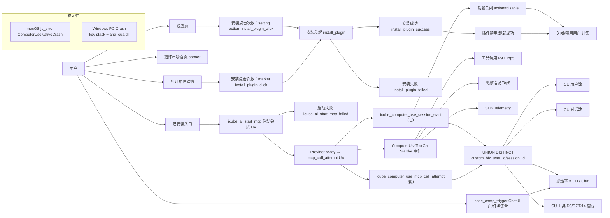

# Computer Use 指标快查手册

更新日期：2026-08-28 · 适用范围：Tea + Slardar · OS：macOS / Windows

> **一句话通用规则**：新旧兼容事件并行期间，**跨事件必须按稳定标识求并集**，禁止直接把两个事件的 UV/PV 相加。

---

## 目录

| # | 板块 | 形式 |
| -: | ---- | ---- |
| 1 | [周报指标总览表](#1-周报指标总览表) | 一张表看全周报口径 |
| 2 | [指标速查卡（按分类）](#2-指标速查卡按分类) | 每指标一张紧凑卡片 |
| 3 | [集合运算速查](#3-集合运算速查) | UNION/INTERSECT 公式合集 |
| 4 | [Slardar 度量速查](#4-slardar-度量速查) | 工具/错误/性能 measure 名 |
| 5 | [bytedcli 查询模板](#5-bytedcli-查询模板) | 直接抄的命令模板 |
| 6 | [统一筛选与禁则](#6-统一筛选与禁则) | 所有查询共同遵守 |
| 7 | [ID 与插件常量](#7-id-与插件常量) | 常量清单 |
| 8 | [一图看懂流向](#8-一图看懂流向) | Mermaid 全景图 |

---

## 1. 周报指标总览表

| 分类 | 指标 | 数据源 | 查询口径（一句话） |
| ---- | ---- | ---- | ---- |
| **使用规模** | 使用 CU 用户数 | Tea `session_start` ∪ `mcp_call_attempt` | `DISTINCT UNION(两个事件的 custom_biz_user_id)`，非空≠0 |
| **使用规模** | 使用 CU 对话数 | Tea `session_start` ∪ `mcp_call_attempt` | `DISTINCT UNION(两个事件的 session_id)`，非空 |
| **能力覆盖** | MCP 启动尝试 UV | Slardar `icube_ai_start_mcp` | `custom.user`，筛 `categories.id IN (mcp|ide_mcp).config.ext.computer-use` |
| **用户留存** | 业务留存（CU vs 未用） | Tea：`code_comp_trigger` + CU 事件集合 | D0 Chat 用户按「是否用过 CU」分组，统计 D3/D7/D14 回到 Chat 人数占比 |
| **工具留存** | CU 工具 D3/D7/D14 留存 | Tea `session_start` ∪ `mcp_call_attempt` | `CU_USERS(D0) ∩ CU_USERS(Dn) / CU_USERS(D0)` |
| **工具流失** | CU 关闭/禁用用户 | Tea `switch_toggle` ∪ `plugin_market_interactions` | `action=disable` 用户 ∪ 插件禁用/卸载成功用户 → 求并集 |
| **渗透率** | CU 用户渗透率 | Tea CU 事件 ∪ `code_comp_trigger` | `CU_USERS / CHAT_USERS`（同窗口、同 scope、同隐私过滤） |
| **渗透率** | CU 任务渗透率 | Tea CU 事件 ∪ `code_comp_trigger` | `CU_SESSIONS / CHAT_SESSIONS`（同窗口） |
| **入口触达** | CU 入口触达 UV | Tea 设置页 ∪ 插件市场首页 ∪ 插件详情入口 | 三个来源分别取 UV → `custom_biz_user_id` 求并集 |
| **安装行为** | 安装点击/发起/成功/失败次数 | Tea 设置 + 插件市场事件 | PV 计数（允许重复，来源 PV 可以相加为总点击 PV） |
| **稳定性** | macOS Native Crash 数 / 影响用户 | Slardar `js_error` | `error_name CONTAINS ComputerUseNativeCrash`，`bid=solo_pc`，`os=mac` |
| **稳定性** | Windows SDK Crash 数 / 影响用户 | Slardar PC Crash | `platform=Windows` AND `key stack CONTAINS aha_cua.dll` |
| **工具性能** | 工具调用 P90 Top 5 | Slardar `ComputerUseToolCall` | 先按调用量选 Top 5 工具 → 各算 `totalDurationMs` P90 |
| **工具质量** | 高频错误原因 Top 5 | Slardar `ComputerUseToolCall` | 筛 `result=error`，归一化 `categories.error` → 按失败调用数取 Top 5 |

---

## 2. 指标速查卡（按分类）

每张卡片 = **指标名** + **公式/集合** + **事件** + **筛选** + **⚠️禁则**。

### 2.1 使用规模

<details>
<summary>📦 使用 CU 用户数（点击展开）</summary>

- **公式**：`COUNT(DISTINCT UNION(session_start.uid, mcp_call_attempt.uid))`
- **uid**：`custom_biz_user_id`，非空、非 `"0"`
- **事件**：
  - `icube_computer_use_session_start`（旧兼容）
  - `icube_computer_use_mcp_call_attempt`（新）
- **共同筛选**：`custom_scope = bytedance | marscode`，`os_name = mac | windows`
- ⚠️ 禁止：两事件 UV 直接相加

</details>

<details>
<summary>💬 使用 CU 对话数（点击展开）</summary>

- **公式**：`COUNT(DISTINCT UNION(session_start.sid, mcp_call_attempt.sid))`
- **sid**：`session_id`，非空
- **事件**：同上
- ⚠️ 禁止：使用 `tool_call` PV、`step_count` 替代对话数；禁止两事件相加

</details>

### 2.2 能力覆盖

<details>
<summary>🚀 MCP 启动尝试 UV（点击展开）</summary>

- **公式**：`COUNT(DISTINCT custom.user)`
- **事件**（Slardar）：`icube_ai_start_mcp`
- **筛选**：
  ```text
  categories.id IN (
    mcp.config.ext.computer-use,
    ide_mcp.config.ext.computer-use
  )
  AND context.scope  = bytedance | marscode
  AND context.os_name = mac | windows
  ```
- **语义**：进入 MCP 启动流程（不保证成功、不保证有实际调用）
- ⚠️ 禁止：命名为"成功启动 UV"或"使用 CU 用户"

</details>

<details>
<summary>✅ 成功启动并实际调用 UV（可选补充）</summary>

- **公式**：`USERS(mcp_call_attempt)`
- **语义**：Provider `whenReady()` 完成后发起过 CU 调用
- ⚠️ 不包含"成功启动后没调用"的用户 → 不能当完整成功启动 UV

</details>

### 2.3 用户与工具留存

<details>
<summary>👥 业务留存（CU 用户组 vs 未用 CU 用户组）</summary>

- **Cohort 定义**（D0 都要求发生 `code_comp_trigger`）：
  - CU 用户组：D0 至少使用 CU 一次
  - 未使用 CU 用户组：埋点可观测起始日到 D0 从未使用 CU
- **回访事件**：`code_comp_trigger`
- **公式**：
  ```text
  CU 业务 Dn 留存
    = |{Cohort(CU) ∩ ChatUsers(Dn)}| / |Cohort(CU)|
  未用 CU 业务 Dn 留存
    = |{Cohort(未用CU) ∩ ChatUsers(Dn)}| / |Cohort(未用CU)|
  ```
- **Dn 对应 Tea 目标序号**：D3→4，D7→8，D14→15
- ⚠️ 必须分开展示：D3 cohort 不晚于 T-3，D7 不晚于 T-7，D14 不晚于 T-14
- ⚠️ 互斥分组严格计算用 Hive/用户明细，Tea 卡片（CU vs 全体 Chat）只能作方向性基线

</details>

<details>
<summary>🔧 CU 工具 D3/D7/D14 留存</summary>

- **日集合**：
  ```text
  CU_USERS(day)
    = DISTINCT UNION(
        session_start.custom_biz_user_id,
        mcp_call_attempt.custom_biz_user_id
      )
  ```
- **公式**：
  ```text
  CU 工具 Dn 留存
    = |CU_USERS(D0) ∩ CU_USERS(Dn)| / |CU_USERS(D0)|
  ```
- **新旧并行**：新旧集合分别取 UNION 后计算，不能加两个单事件留存率
- ⚠️ 初始 & 回访必须都是真实 CU 事件（`session_start` 或 `mcp_call_attempt`），**不能用** `icube_ai_start_mcp`

</details>

### 2.4 工具流失

<details>
<summary>🚪 CU 关闭/禁用用户</summary>

- **集合**：
  ```text
  SETTING_CLOSE_USERS
    = DISTINCT users(switch_toggle WHERE action=disable)
  PLUGIN_CLOSE_USERS
    = DISTINCT users(
        plugin_market_interactions
        WHERE plugin_id=CU_PLUGIN_ID
          AND action IN (disable_plugin_success,
                         uninstall_plugin_success)
      )
  CU_CLOSE_USERS
    = DISTINCT UNION(SETTING_CLOSE_USERS, PLUGIN_CLOSE_USERS)
  ```
- **uid**：`custom_biz_user_id`，非空≠0
- ⚠️ 禁止："设置关闭 UV + 插件禁用 UV + 插件卸载 UV" 当作总用户数展示
- **升级版（关闭后 N 天未复用）**：`CU_CLOSE_USERS - 关闭后[N天]再次进入 CU_USERS`（需等待完整观察期）

</details>

### 2.5 渗透率

<details>
<summary>📊 CU 用户渗透率</summary>

- **集合**：
  ```text
  CU_USERS    = DISTINCT UNION(session_start.uid, mcp_call_attempt.uid)
  CHAT_USERS  = DISTINCT code_comp_trigger.uid
  用户渗透率  = |CU_USERS| / |CHAT_USERS|
  ```
- **uid**：`custom_biz_user_id`，非空≠0
- **同分母隐私约束**：分子、分母都要筛 `custom_privacy_mode = off`（因为 `mcp_call_attempt` 是 P0，隐私模式下仍会上报）
- ⚠️ 周渗透率：先按完整周集合去重再除，**禁止**每日 UV/每日渗透率相加

</details>

<details>
<summary>📊 CU 任务渗透率</summary>

- **集合**：
  ```text
  CU_TASKS    = DISTINCT UNION(session_start.sid, mcp_call_attempt.sid)
  CHAT_TASKS  = DISTINCT code_comp_trigger.sid
  任务渗透率  = |CU_TASKS| / |CHAT_TASKS|
  ```
- **sid**：`session_id`，非空
- ⚠️ 不能用 `mcp_call_attempt` 原始 PV 作为 CU 任务数
- **未来升级版（Query 口径）**：`CU_QUERY_KEY = session_id + ':' + message_id` → 升级必须新开趋势，不能直接拼接 session_id 旧趋势

</details>

### 2.6 入口触达

<details>
<summary>👀 CU 入口触达 UV（3 来源 → 并集）</summary>

| 来源 | 事件 | 筛选 |
| ---- | ---- | ---- |
| 设置页 | `icube_computer_use_setting` | **`action IS NULL`**（否则混入安装点击） |
| 插件市场首页 | `plugin_market_interactions` | `scene=marketplace AND action=banner_impression AND plugin_id=CU_PLUGIN_ID` |
| 插件详情入口 | `plugin_market_interactions` | `action=open_plugin_detail AND plugin_id=CU_PLUGIN_ID` |

- 三来源分别取 `custom_biz_user_id` 集合 → **求并集** = CU 入口触达 UV
- 三来源 PV 各自独立展示（语义不同，不能合并为"统一 PV"）
- ⚠️ 插件详情 `open_plugin_detail` 只证明点击打开详情，**不等于**详情页真实渲染曝光（需详情页 show 事件）

</details>

### 2.7 插件安装行为

<details>
<summary>📦 安装点击 / 发起 / 成功 / 失败（PV 口径）</summary>

| 指标 | 计算 | 可否来源相加 |
| ---- | ---- | :---: |
| 设置页安装点击次数 | `COUNT(icube_computer_use_setting WHERE action=install_plugin_click)` | — |
| 插件详情安装点击次数 | `COUNT(plugin_market_interactions WHERE action=install_plugin_click AND plugin_id=CU_PLUGIN_ID)` | — |
| **安装点击总次数** | 设置页 PV + 插件详情 PV | ✅ 允许（允许重复行为） |
| 安装发起次数 | `COUNT(plugin_market_interactions WHERE action=install_plugin)` | — |
| 安装成功次数 | `COUNT(plugin_market_interactions WHERE action=install_plugin_success)` | — |
| 安装失败次数 | `COUNT(plugin_market_interactions WHERE action=install_plugin_failed)` | — |
| 安装执行成功率 | 成功次数 / 发起次数 | — |

- ⚠️ 本指标全部是 PV：同一用户重复点击/安装时每次行为都计数，不去重
- ⚠️ 安装成功率要等待数据稳定（窗口末尾已发起未完成的安装尚未结算）

</details>

### 2.8 稳定性

<details>
<summary>💥 macOS Native Crash 数 / 影响用户</summary>

- **事件**：Slardar `js_error`，`bid=solo_pc`
- **筛选**：
  ```text
  error_name CONTAINS ComputerUseNativeCrash
  os = mac
  context.scope = bytedance | marscode
  ```
- **同时展示两个数**：Crash 数（趋势）+ 影响用户数（影响面）
- **发生时间**：看 `extra.timestamp`，不要只看 Slardar 接收时间（上报可能滞后）
- **覆盖范围**：SIGSEGV / SIGBUS / SIGABRT / SIGFPE / Rust PANIC；**不覆盖** Windows、其他进程 Crash、runtime 正常退出
- ⚠️ 禁止：命名为"全平台工具环境崩溃次数"

</details>

<details>
<summary>💥 Windows CU SDK Crash 数 / 影响用户</summary>

- **事件**：Slardar PC Crash
- **筛选**：
  ```text
  platform = Windows
  key stack CONTAINS aha_cua.dll
  ```
- **现状**：`cu_sdk_active / method / version / task_id` 标签已写入，但 Slardar issue list 筛 `cu_sdk_active` 报字段不合法 → 暂按 `aha_cua.dll` 聚合
- ⚠️ 禁止：用标签聚合 SDK 方法/版本级 Crash（未通过验收）

</details>

### 2.9 工具性能

<details>
<summary>⏱️ 工具调用 P90 Top 5</summary>

- **事件**：Slardar `ComputerUseToolCall`
- **分平台分别算**：`darwin` 和 `win32` 各自独立 Top 5
- **步骤**：
  1. 按 `categories.tool` 分组 → 取调用量 Top 5（不是 P90 最高）
  2. 对这 5 个工具分别算 `metrics.totalDurationMs` P90
  3. 同表展示：调用量 + P90 + 成功率
- **度量名**（Slardar 已验）：
  - 调用量：`ComputerUseToolCall / custom.count`
  - P90：`ComputerUseToolCall / totalDurationMs / custom.metrics.pct90`
- **推荐表**：

  | 排名 | 工具 | 调用量 | 工具调用 P90 | 成功率 |
  | -: | ---- | -----: | -------: | -----: |
  | 1 | … | … | … | … |

- **totalDurationMs 语义**：从进入 MCP handler 串行执行起计时（安全检查 + 审批 + 权限 + 工具执行），**不包含**：
  - `serialExecute` 外排队等待
  - 客户端 ↔ MCP 传输
  - Agent 规划 / 模型耗时
- ⚠️ 禁止：先算每日 P90 再平均；主 P90 包含成功+失败，成功 P90 必须单独命名

</details>

### 2.10 工具质量

<details>
<summary>🐞 高频错误原因 Top 5</summary>

- **事件**：Slardar `ComputerUseToolCall`
- **筛选**：`categories.result = error`
- **分平台分别 Top 5**：`darwin` / `win32` 独立
- **错误来源字段**：
  - `categories.error`：MCP 层错误字符串（含动态文本 → 需归一化）
  - `categories.sdkErrorCategory`：底层 SDK 结构化分类（优先使用）
- **归一化优先级**：稳定错误码 → `sdkErrorCategory` → 版本化正则映射 → `other`（保留脱敏原文）
- **正式分类（failure_rule_version = v1）**：参数错误 / 目标状态过期 / 系统权限 / App 审批异常 / SDK 错误 / 图片获取上传 / PTC 工具实现 / MCP 封装 / 其他
- **Top 5 公式**：
  ```text
  ERROR_CALLS(reason) = COUNT(ComputerUseToolCall WHERE result=error AND normalized=reason)
  ERROR_TOP5          = TOP 5 normalized ORDER BY ERROR_CALLS DESC
  ```
- **推荐展示 7 列**：排名 / 归一化原因 / 错误次数 / 错误占比 / 受影响 Session / 最大单 Session 占比 / 主要工具
- ⚠️ 必须同时展示受影响 Session 数，避免把单个 Session 重试风暴解释为大面积故障
- ⚠️ 归一化规则必须带版本号，规则变更后不能直接拼接新旧趋势

</details>

---

## 3. 集合运算速查

把所有跨事件公式收在一张表里：

| 场景 | 公式简写 | ID 字段 |
| ---- | ---- | ---- |
| CU 用户日集合 | `U(session_start.uid) ∪ U(mcp_call_attempt.uid)` | `custom_biz_user_id` |
| CU 对话日集合 | `U(session_start.sid) ∪ U(mcp_call_attempt.sid)` | `session_id` |
| 使用 CU 对话数（周） | `|CU_SESSIONS(整周)|`，**不**∑每日 | `session_id` |
| CU 用户渗透率 | `|CU_USERS| / |ChatUsers(code_comp_trigger)|` | 同上，统一 `custom_privacy_mode=off` |
| CU 任务渗透率 | `|CU_SESSIONS| / |ChatSessions(code_comp_trigger)|` | 同上 |
| CU 关闭用户 | `U(switch_toggle.disable) ∪ U(plugin.disable|uninstall成功)` | `custom_biz_user_id` |
| CU 入口触达用户 | `U(设置页) ∪ U(市场首页) ∪ U(详情入口)` | `custom_biz_user_id` |
| CU 工具 Dn 留存 | `|CU_USERS(D0) ∩ CU_USERS(Dn)| / |CU_USERS(D0)|` | `custom_biz_user_id` |
| 关闭后 N 天未复用 | `CU_CLOSE_USERS \ (CU_CLOSE_USERS ∩ CU_USERS(D+1..D+N))` | `custom_biz_user_id` |

> **U(X) = DISTINCT 非空(字段)**，`∪ = UNION`，`∩ = INTERSECT`，`\ = 集合差`

---

## 4. Slardar 度量速查

| 指标大类 | 指标名 | `event` | 可用度量 | 分组/筛选字段（已验）|
| ---- | ---- | ---- | ---- | ---- |
| 工具性能 | 调用量 | `ComputerUseToolCall` | `custom.count` | `categories.tool`, `categories.result`, `categories.platform` |
| 工具性能 | 工具调用 P90 | `ComputerUseToolCall` | `totalDurationMs / custom.metrics.pct90` | 同上 |
| 工具性能 | 审批等待 P50/P90 | `ComputerUseToolCall` | `approvalWaitMs / custom.metrics.pct50 / pct90` | 同上 |
| 工具性能 | SDK 调用耗时 P90 | `ComputerUseToolCall` | `sdkDurationMs / custom.metrics.pct90` | 同上（有 SDK telemetry 时）|
| 工具错误 | 错误字段上报量 | `ComputerUseToolCall` (筛 `result=error`) | `error / custom.categories_count` | `categories.error`, `categories.sdkErrorCategory`, `categories.sessionId` |
| 工具错误 | 错误字段去重数 | `ComputerUseToolCall` (筛 `result=error`) | `error / custom.categories.uniq` | 同上 |
| Crash | macOS Crash 数 | `js_error` (`bid=solo_pc`) | `custom.count` | `error_name ~ ComputerUseNativeCrash`，`os=mac` |
| Crash | Windows SDK Crash 数 | PC Crash | `custom.count` | `platform=Windows`，`key stack ~ aha_cua.dll` |
| MCP 启动 | 启动尝试 UV | `icube_ai_start_mcp` | `custom.count` / `custom.user` | `categories.id ∈ {...}`，`context.scope/os` |
| MCP 启动 | 启动失败 UV | `icube_ai_start_mcp_failed` | `custom.user` | 同上 |

> 查询遵循：`metric search → metric build → metric related → metric query`，度量名必须用 search 返回的 `measure_name`，**禁止手写未经验证 measure**。

---

## 5. bytedcli 查询模板

### T1 · CU 对话数（session_start 单事件）

```bash
bytedcli --json tea analysis event \
  --project-id 31140491 \
  --event icube_computer_use_session_start \
  --indicator measure \
  --measure-property session_id:event \
  --measure-agg distinct \
  --filter "session_id:event not_equal_not_contain_null ''" \
  --filter 'custom_scope:common = <bytedance|marscode>' \
  --filter 'os_name:common = <mac|windows>' \
  --period-start-ts <start_ts> \
  --period-end-ts   <end_ts> \
  --granularity week \
  --week-start 1 \
  --auth-mode titan \
  --tea-site cn \
  --dump <run_dir>/cu-conversation-session-start.json
```

### T2 · CU 工具留存（旧版单事件，身份用 Tea users）

```bash
bytedcli --json tea analysis retention \
  --project-id 31140491 \
  --init-event   icube_computer_use_session_start \
  --return-event icube_computer_use_session_start \
  --init-filter   'custom_scope:common = <bytedance|marscode>' \
  --init-filter   'os_name:common = <mac|windows>' \
  --return-filter 'custom_scope:common = <bytedance|marscode>' \
  --return-filter 'os_name:common = <mac|windows>' \
  --retention-days 1,15 \
  --period-start-ts <cohort_start_ts> \
  --period-end-ts   <cohort_end_ts> \
  --granularity day \
  --auth-mode titan \
  --tea-site cn \
  --dump <run_dir>/cu-tool-retention-legacy.json
```

> 正式业务稳定用户留存：初始+回访事件 `relation` 设为 `custom_biz_user_id`，或直接用离线用户集合计算。

### T3 · 新旧事件并集速查

Tea 单卡不支持直接跨事件 `UNION DISTINCT` → **操作流程**：

```
1) 导出 session_start.<id> 集合
2) 导出 mcp_call_attempt.<id> 集合
3) 离线 UNION DISTINCT 得到最终集合大小
4) 同时保存：交集 / 旧独有 / 新独有 → 覆盖率验收
```

---

## 6. 统一筛选与禁则

### ✅ 每次查询都带上

| 维度 | 取值 | 备注 |
| ---- | ---- | ---- |
| Tea 项目 ID | 31140491 | |
| Tea site | cn | |
| 时区 | 北京时间（Asia/Shanghai） | |
| `custom_scope` | `bytedance \| marscode` | 外场**不能**用 `!= bytedance` |
| `os_name` | `mac \| windows` | 技术指标分平台分别算 |
| 版本集合 | 已验证的 app_version 列表 | |
| 测试流量 | 测试账号、benchmark、fixture 名单排除 | |
| 隐私模式 | `custom_privacy_mode = off`（渗透率分子分母必须一致）| mcp_call_attempt 是 P0，隐私下仍上报 |

### ❌ 绝对禁止

| 禁则 | 错误示例 |
| ---- | ---- |
| 跨事件直接相加 UV/Session | `UV(session_start) + UV(mcp_call_attempt)` ❌ |
| 日去重数相加成周去重 | `SUM(每日UV)` ≠ 周UV ❌ |
| 用 mcp_call_attempt PV 当 CU 任务数 | ❌ 一个对话多次调用仍算 1 任务 |
| Tea 平台 users 混 custom_biz_user_id | 两种身份口径分开 |
| Slardar 与 Tea 指标混算 | 技术指标 Slardar；业务规模 Tea |
| P90 每日平均再平均 | ❌ 完整窗口样本一次性算 P90 |
| 错误字符串直接 Top 5 上报 | ❌ 必须先归一化并打版本号 |
| 观察期不足留存记为 0 | ❌ 应缺失，不可填 0 |
| 把 启动尝试 UV - 失败 UV = 成功启动 UV | ❌ 无关联 ID，同一用户可先败后胜 |

---

## 7. ID 与插件常量

| 常量 | 值 |
| ---- | ---- |
| Tea 项目 ID | **31140491** |
| CU 插件 ID | `ba7138ba-ba41-43df-b71c-aefa5f2cd724` |
| MCP 启动 ComputerUse 分类 ID | `mcp.config.ext.computer-use`、`ide_mcp.config.ext.computer-use` |
| macOS SDK 动态库标识 | `aha_cua.dll`（Windows Crash key stack）|
| macOS Native Crash 自定义错误名 | `ComputerUseNativeCrash`（Slardar js_error）|
| Slardar solo_pc bid | `solo_pc` |
| 工具调用事件名 | `ComputerUseToolCall` |

---

## 8. 一图看懂流向



---

> **备忘**：本文档是"快查"，若需要每个指标背后的详细论证、可观测边界与反例，请继续保留原完整口径文档作为底层依据。
