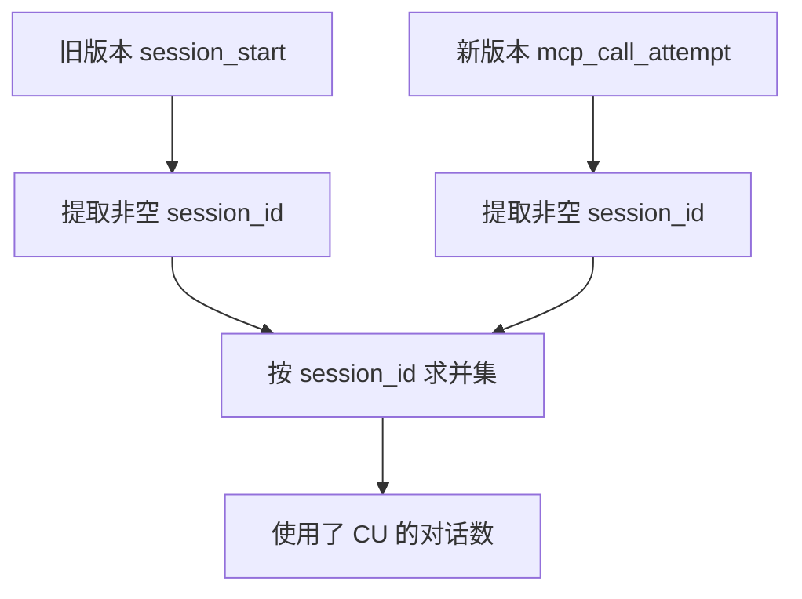
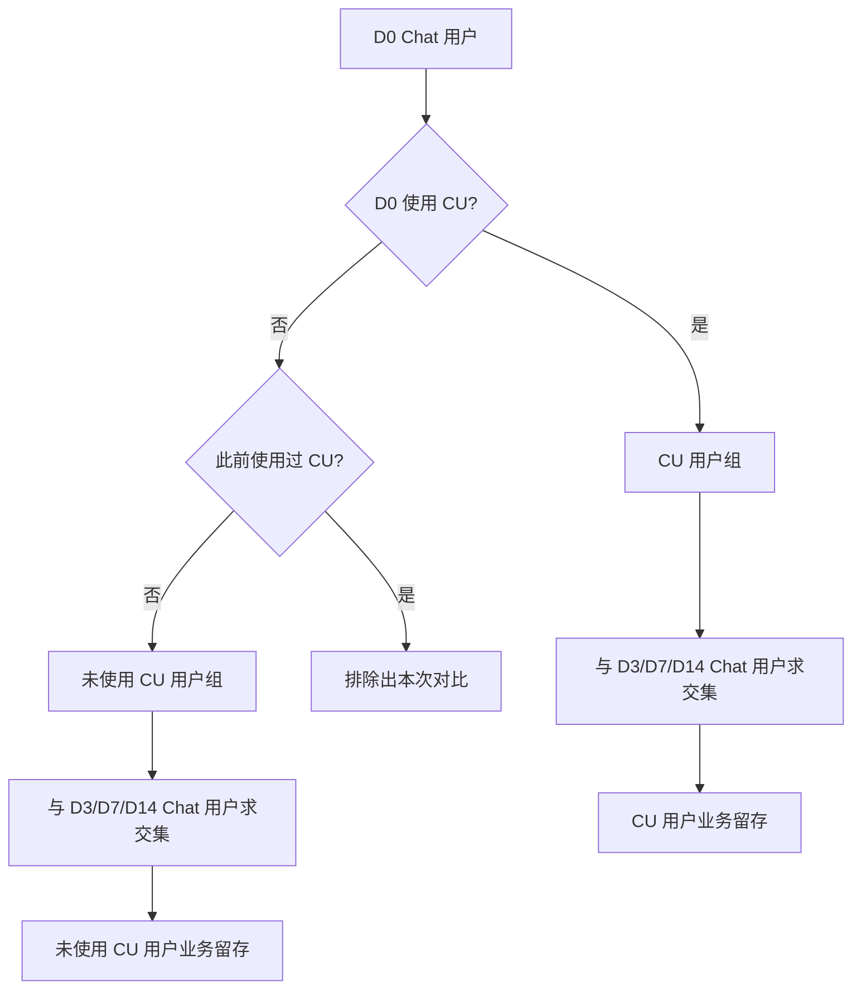
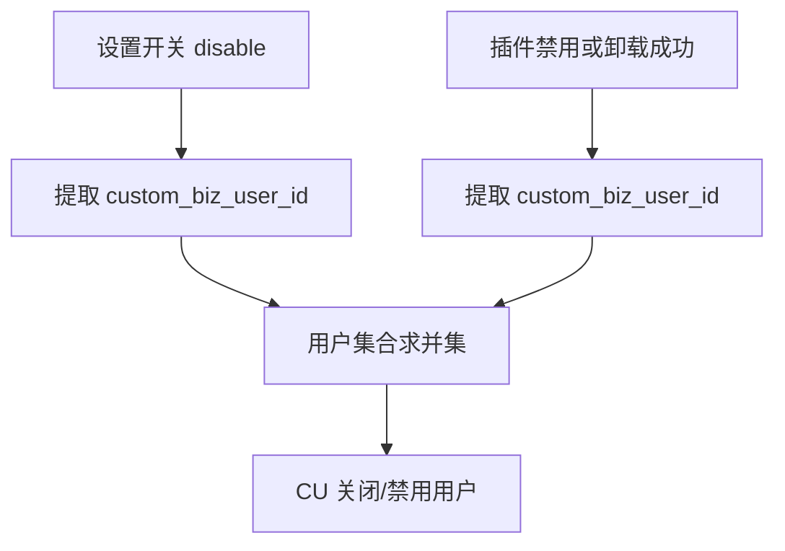
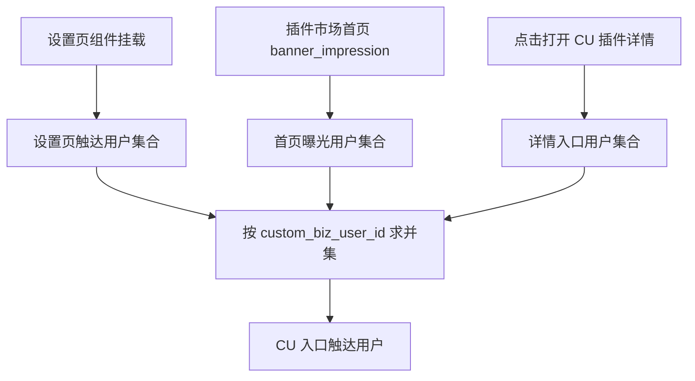

# Computer Use 指标查询口径

更新日期：2026-08-20。

本文逐项记录已确认的 Computer Use 指标查询方式。    旧版本兼容事件与新增事件并行期间，必须按稳定标识求并集，禁止直接相加聚合值。

## 周报指标速查

| 类型   | 周报关心的数据                           | 数据源                                                | 查询方法                                                                                                |
| ---- | --------------------------------- | -------------------------------------------------- | --------------------------------------------------------------------------------------------------- |
| 使用规模 | 使用 CU 用户数                         | Tea `session_start` + `mcp_call_attempt`           | 对非空、非 `0` 的 `custom_biz_user_id` 求并集去重                                                              |
| 使用规模 | 使用 CU 对话数                         | Tea `session_start` + `mcp_call_attempt`           | 对非空 `session_id` 求并集去重                                                                              |
| 能力覆盖 | MCP 启动尝试 UV                       | Slardar `icube_ai_start_mcp`                       | 筛选 Computer Use MCP，取 `custom.user`                                                                 |
| 用户留存 | 使用过 CU 和从未使用 CU 的用户，后续是否还会回来 Chat | Tea 用户行为明细；严格排除用过 CU 的用户时使用 Hive                   | 选定一天的两组用户，分别统计 3、7、14 天后再次发起 Chat 的人数占比                                                             |
| 工具留存 | D3/D7/D14 再次使用 CU 的比例             | Tea `session_start` + `mcp_call_attempt`           | `D0 CU 用户 ∩ Dn CU 用户 / D0 CU 用户`                                                                    |
| 工具流失 | CU 关闭/禁用用户                        | Tea `switch_toggle` + `plugin_market_interactions` | 设置关闭、插件禁用和卸载成功用户按 `custom_biz_user_id` 求并集                                                          |
| 渗透率  | CU 用户渗透率                          | Tea CU 事件 + `code_comp_trigger`                    | 使用 CU 用户数 / 周期 Chat 用户数                                                                             |
| 渗透率  | CU 任务渗透率                          | Tea CU 事件 + `code_comp_trigger`                    | 使用 CU 的去重 `session_id` 数 / 周期 Chat 去重 `session_id` 数                                                |
| 入口触达 | 设置页、插件市场首页、插件详情入口                 | Tea 入口事件                                           | 三个来源分别统计 UV；总触达按 `custom_biz_user_id` 求并集                                                           |
| 安装行为 | 安装点击、发起、成功、失败次数                   | Tea 安装事件                                           | 分别统计 `install_plugin_click/install_plugin/install_plugin_success/install_plugin_failed` PV，重复行为重复计数 |
| 稳定性  | Native Crash                      | macOS：Slardar `js_error`；Windows：Slardar PC Crash  | macOS 筛 `ComputerUseNativeCrash`；Windows 按 Crash key stack 中的 `aha_cua.dll` 识别                      |
| 工具性能 | 工具调用 P90 Top 5                    | Slardar `ComputerUseToolCall`                      | 先按调用量选 Top 5 工具，再计算各工具 `totalDurationMs` P90                                                        |
| 工具质量 | 高频错误原因 Top 5                      | Slardar `ComputerUseToolCall`                      | 过滤 `result=error`，归一化错误原因后按失败调用次数取 Top 5                                                            |

共同要求：

* 固定 Tea/Slardar 项目、产品、`scope`、OS、版本、北京时间窗口和测试流量排除规则。

* macOS、Windows 分开统计技术指标。

* 用户、Session 和跨事件总量先对 ID 集合求并集，不能相加各来源 UV。

* 周累计 UV、Session 和留存直接查询完整窗口，不能相加每日去重值。

## 1. 使用了 CU 的对话

### 1.1 当前正式口径

使用 Tea 事件：

`icube_computer_use_session_start`

按非空 `session_id` 去重：

```text
使用了 CU 的对话数
  = COUNT(DISTINCT session_start.session_id)
```

该口径覆盖仍未上报新增 MCP 事件的旧版本。事件原始 PV、`icube_computer_use_tool_call` PV、`step_count` 和 `status` 均不用于替代对话数。

查询示例：

```bash
bytedcli --json tea analysis event \
  --project-id 31140491 \
  --event icube_computer_use_session_start \
  --indicator measure \
  --measure-property session_id:event \
  --measure-agg distinct \
  --filter "session_id:event not_equal_not_contain_null ''" \
  --filter 'custom_scope:common = <bytedance|marscode>' \
  --filter 'os_name:common = <mac|windows>' \
  --period-start-ts <start_ts> \
  --period-end-ts <end_ts> \
  --granularity week \
  --week-start 1 \
  --auth-mode titan \
  --tea-site cn \
  --dump <run_dir>/cu-conversation-session-start.json
```

### 1.2 新旧版本并行口径

从新增埋点开始产生稳定数据的下一周起，同时查询：

* 旧兼容集合：`session_start` 的非空 `session_id`。

* 新链路集合：`mcp_call_attempt` 的非空 `session_id`。

正式对话数取两个集合的并集：

```text
使用了 CU 的对话数
  = COUNT(
      DISTINCT UNION(
        session_start.session_id,
        mcp_call_attempt.session_id
      )
    )
```



不能将两个事件的去重数直接相加，因为新版本可能同时上报两个事件。若 Tea 查询无法直接导出跨事件 ID 集合，则分别导出 `session_id` 后离线求并集，并保存交集、旧事件独有和新事件独有三个集合用于覆盖率验收。

### 1.3 使用用户

需要统计登录业务用户时，对同一批事件的非空且非 `0` 的 `custom_biz_user_id` 去重。新旧事件并行期间同样按用户 ID 求并集，不能相加两个 UV。

Tea 平台 `users` 使用平台身份去重，可用于同一 Tea 项目内的用户趋势和渗透率；它与 `custom_biz_user_id` 不是同一身份口径，必须分开展示。

## 2. MCP 启动 UV

### 2.1 当前已有事件

Slardar `icube_ai_start_mcp` 在调用 `startExtension()` 前上报，因此准确名称应为：

`MCP 启动尝试 UV`

本指标作为正式规模指标保留，用于表示具备 Computer Use 能力且进入过 MCP 启动流程的用户数，不要求 MCP 最终启动成功或实际调用 CU。

查询时使用 `custom.user`，并筛选 Computer Use MCP：

```text
categories.id IN (
  mcp.config.ext.computer-use,
  ide_mcp.config.ext.computer-use
)
```

同时按报告范围增加：

* `context.scope = bytedance | marscode`

* `context.os_name = mac | windows`

* 已验证的 `context.app_version` 集合

* 固定北京时间窗口

`categories.platform` 当前为空，不能用于 OS 筛选。

### 2.2 成功启动 UV 的可观测边界

当前无法精确统计“成功启动 MCP，包括启动后没有调用工具的用户 UV”：

* `icube_ai_start_mcp` 是启动尝试事件。

* `icube_ai_start_mcp_failed` 是失败事件。

* 两个事件没有可关联的启动尝试 ID。

* 聚合后的启动 UV 与失败 UV不能直接相减；同一用户可能先失败、后重试成功。

新增 Tea `icube_computer_use_mcp_call_attempt` 发生在 Provider `whenReady()` 完成之后，可以精确统计：

```text
成功启动并实际发起 CU 调用的用户 UV
  = USERS(mcp_call_attempt)
```

但它不包含“成功启动后没有调用 CU”的用户，因此不能命名为完整的“MCP 成功启动 UV”。

在补充独立的启动成功事件或启动尝试关联 ID 之前，报表应分开展示：

| 指标           | 数据源                                                 | 含义                             |
| ------------ | --------------------------------------------------- | ------------------------------ |
| MCP 启动尝试 UV  | Slardar `icube_ai_start_mcp.custom.user`            | 进入 MCP 启动流程的用户                 |
| MCP 启动失败 UV  | Slardar `icube_ai_start_mcp_failed.custom.user`     | 周期内至少发生一次启动失败的用户               |
| 成功启动并实际调用 UV | Tea `icube_computer_use_mcp_call_attempt` 的 `users` | Provider ready 后实际发起过 CU 调用的用户 |

三者不能通过聚合值相减得到完整成功启动 UV。

## 3. 用户留存与工具留存

### 3.1 统一约束

留存统一使用非空且非 `0` 的 `custom_biz_user_id` 关联用户，并固定：

* 相同 Tea 项目、产品、`custom_scope`、OS 和版本范围。

* 北京时间自然日。

* D3、D7、D14 均为第 3、7、14 天当天回访，不是截至当天累计回访。

* D3、D7、D14 只使用已走完对应观察期的初始 cohort；观察期不足记为缺失，不能记为 `0`。

* 测试账号、benchmark 和 fixture 使用版本化名单排除。

Tea retention 的目标序号从 1 开始，`1 = D0`，因此 D3、D7、D14 分别对应目标序号 `4`、`8`、`15`。

### 3.2 使用 CU 与观测期内从未使用 CU 的业务留存

该指标回答用户使用 CU 后，后续是否仍然回来使用产品。回访事件使用：

`code_comp_trigger`

为保证两组基数可比较，初始 cohort 都要求 D0 发生 `code_comp_trigger`：

```text
CU 用户组
  = D0 发生 code_comp_trigger
    且 D0 至少使用一次 CU 的用户

未使用 CU 用户组
  = D0 发生 code_comp_trigger
    且从 CU 埋点可观测起始日到 D0 从未使用 CU 的用户
```

留存计算：

```text
CU 用户业务 Dn 留存
  = COUNT(DISTINCT CU 用户组中 Dn 发生 code_comp_trigger 的用户)
    / COUNT(DISTINCT CU 用户组)

未使用 CU 用户业务 Dn 留存
  = COUNT(DISTINCT 未使用 CU 用户组中 Dn 发生 code_comp_trigger 的用户)
    / COUNT(DISTINCT 未使用 CU 用户组)
```

“完全没用过 CU”只能定义为“埋点可观测历史内从未使用 CU”。必须在报告中写明可观测起始日，不能外推为用户生命周期内从未使用。

#### 获取方式

严格对照需要使用 Hive 或等价的用户级明细计算：

1. 生成每日 Chat 用户集合：`code_comp_trigger` 的 `custom_biz_user_id`。
2. 生成每日 CU 用户集合：旧事件和新事件按用户求并集。
3. 对每个 D0 Chat 用户判断从可观测起始日至 D0 是否出现过 CU。
4. 形成互斥的 CU 用户组和未使用 CU 用户组。
5. 分别与 D3、D7、D14 的 Chat 用户集合求交集并除以各自 D0 cohort。

旧事件和新事件的 CU 用户集合定义为：

```text
CU_USERS(day)
  = DISTINCT UNION(
      session_start.custom_biz_user_id,
      mcp_call_attempt.custom_biz_user_id
    )
```



Tea 现有“CU 用户 vs 全体 Chat 用户”留存卡只能作为方向性基线，因为全体 Chat 用户包含 CU 用户，不能命名为“完全未使用 CU 用户”。两组留存差异是观察性相关，不能直接解释为 CU 带来的因果提升。

### 3.3 CU 工具留存

该指标回答 D0 调用过 CU 的用户，在第 3、7、14 天是否再次调用 CU。

按天构造去重用户集合：

```text
CU_USERS(day)
  = DISTINCT UNION(
      session_start.custom_biz_user_id,
      mcp_call_attempt.custom_biz_user_id
    )
```

计算公式：

```text
CU 工具 Dn 留存
  = COUNT(CU_USERS(D0) INTERSECT CU_USERS(Dn))
    / COUNT(CU_USERS(D0))
```

同一用户当天调用一次或多次只计一个用户。初始事件和回访事件都必须表示真实发生 CU 调用；不使用 MCP 启动尝试事件 `icube_ai_start_mcp`。

#### 新旧版本处理

* 旧版本历史 cohort：使用 `session_start -> session_start`。

* 新埋点全量覆盖后的 cohort：使用 `mcp_call_attempt -> mcp_call_attempt`。

* 新旧版本混合 cohort：分别提取两个事件的用户日集合后求并集，再离线计算留存。

混合期不能把两个留存率或两个留存人数相加。Tea 单事件留存无法准确完成跨事件并集去重时，以离线用户日集合为正式结果。

旧版本单事件查询示例：

```bash
bytedcli --json tea analysis retention \
  --project-id 31140491 \
  --init-event icube_computer_use_session_start \
  --return-event icube_computer_use_session_start \
  --init-filter 'custom_scope:common = <bytedance|marscode>' \
  --init-filter 'os_name:common = <mac|windows>' \
  --return-filter 'custom_scope:common = <bytedance|marscode>' \
  --return-filter 'os_name:common = <mac|windows>' \
  --retention-days 1,15 \
  --period-start-ts <cohort_start_ts> \
  --period-end-ts <cohort_end_ts> \
  --granularity day \
  --auth-mode titan \
  --tea-site cn \
  --dump <run_dir>/cu-tool-retention-legacy.json
```

上述语义化命令默认按 Tea 平台用户身份关联。正式稳定业务用户留存需要在 Tea 留存 DSL 中将初始和回访事件的 `relation` 都设置为公共属性 `custom_biz_user_id`，或直接使用离线用户日集合计算。

读取结果时按 `D3`、`D7`、`D14` 标签取值。若报告截止日为 `T`：

* D3 初始 cohort 最晚结束于 `T - 3 天`。

* D7 初始 cohort 最晚结束于 `T - 7 天`。

* D14 初始 cohort 最晚结束于 `T - 14 天`。

## 4. 工具流失：关闭或禁用 CU

### 4.1 可统计范围

当前统计两个关闭来源：

| 来源   | 事件与筛选                                                                                                          | 语义                   |
| ---- | -------------------------------------------------------------------------------------------------------------- | -------------------- |
| 设置开关 | `icube_computer_use_switch_toggle`，`action = disable`                                                          | Computer Use 配置切换为关闭 |
| 插件入口 | `plugin_market_interactions`，`action IN (disable_plugin_success, uninstall_plugin_success)`，并筛选 CU `plugin_id` | CU 插件禁用或卸载成功         |

CU 插件 ID：

`ba7138ba-ba41-43df-b71c-aefa5f2cd724`

设置开关事件由配置变更监听器上报，同时覆盖设置 UI、Solo Lite 和 API 修改。因此当前不能证明每个 `disable` 都来自用户点击。指标名称固定为：

`CU 关闭/禁用用户`

不能直接命名为“主动点击关闭用户”。插件事件表示禁用或卸载操作成功，但关闭后仍可能重新启用，因此它是流失信号，不等于最终流失。

### 4.2 去重计算

分别提取非空且非 `0` 的 `custom_biz_user_id`：

```text
SETTING_CLOSE_USERS
  = DISTINCT USERS(
      icube_computer_use_switch_toggle
      WHERE action = disable
    )

PLUGIN_CLOSE_USERS
  = DISTINCT USERS(
      plugin_market_interactions
      WHERE plugin_id = CU_PLUGIN_ID
        AND action IN (
          disable_plugin_success,
          uninstall_plugin_success
        )
    )

CU_CLOSE_USERS
  = DISTINCT UNION(
      SETTING_CLOSE_USERS,
      PLUGIN_CLOSE_USERS
    )
```

总关闭用户数必须对两个来源求并集。设置关闭 UV、插件禁用 UV和插件卸载 UV可以分别展示来源趋势，但三者不能相加后称为关闭用户数。



若要进一步判断真实工具流失，需要观察关闭事件之后的固定窗口：

```text
关闭后 N 天未复用 CU 用户
  = CU_CLOSE_USERS
    - 关闭后 N 天内再次进入 CU_USERS 的用户
```

该指标必须等待完整 N 天观察期，并单独统计期间重新开启或重新安装的用户。

### 4.3 查询筛选

两个来源查询必须使用相同的：

* Tea 项目和产品。

* `custom_scope = bytedance | marscode`，不能使用 `!= bytedance` 代替外场。

* `os_name = mac | windows`。

* 版本集合和北京时间窗口。

设置来源可继续按 `source = settings | solo_lite` 拆分。跨来源总人数需要导出稳定用户 ID 后离线求并集；Tea 卡片中的来源 UV公式相加只用于观察趋势。

## 5. CU 渗透率

### 5.1 公式方向

渗透率表示周期总量中使用 CU 的占比，公式方向固定为：

```text
CU 用户渗透率
  = 周期内使用 CU 的用户数
    / 周期内可观测 Chat 用户数

CU 任务渗透率
  = 周期内使用 CU 的任务数
    / 周期内可观测 Chat 任务数
```

不能使用“周期总用户数 / CU 用户数”或“总任务数 / CU 任务数”；这两个倒数不是渗透率。

### 5.2 用户渗透率

旧版本和新版本并行期间：

```text
CU_USERS
  = DISTINCT UNION(
      session_start.custom_biz_user_id,
      mcp_call_attempt.custom_biz_user_id
    )

CHAT_USERS
  = DISTINCT code_comp_trigger.custom_biz_user_id

CU 用户渗透率
  = COUNT(CU_USERS) / COUNT(CHAT_USERS)
```

分子和分母都排除空值和 `0`。该稳定业务用户口径适合跨旧、新 CU 事件求并集。

如果改用 Tea 平台 `users`，分子和分母必须同时使用平台身份，并通过虚拟事件或用户集合完成 `session_start OR mcp_call_attempt` 的跨事件去重；禁止相加两个事件的 UV。

### 5.3 任务渗透率

为了兼容旧版本，过渡期继续沿用已确认的 `session_id` 对话口径：

```text
CU_TASKS
  = DISTINCT UNION(
      session_start.session_id,
      mcp_call_attempt.session_id
    )

CHAT_TASKS
  = DISTINCT code_comp_trigger.session_id

CU 任务渗透率
  = COUNT(CU_TASKS) / COUNT(CHAT_TASKS)
```

分子和分母均排除空 `session_id`。一个对话中发生多次 CU 工具调用仍只计一个 CU 任务，不能使用 `mcp_call_attempt` 原始 PV作为 CU 任务数。

新增事件全量覆盖且不再需要兼容旧版本后，可升级为更精确的 Query 口径：

```text
CU_QUERY_KEY = session_id + ':' + message_id
```

升级时必须记录切换日期并新开趋势，不能与 `session_id` 旧口径直接拼接。

### 5.4 共同筛选

四个集合必须使用相同的：

* Tea 项目、产品和统计时间窗。

* `custom_scope`、`os_name` 和版本集合。

* Tea 用户身份类型。

* 北京时区及完整数据状态。

Chat 分母使用 `custom_privacy_mode = off`。新增 `mcp_call_attempt` 是 P0 事件，会在隐私模式下上报，因此过渡期计算渗透率时，CU 分子也必须显式过滤 `custom_privacy_mode = off`，确保分子和分母属于同一可观测范围。

累计周渗透率必须先对完整周的用户和任务分别去重，再执行除法。日 UV、日任务去重数或每日渗透率均不能相加得到周渗透率。

## 6. 入口曝光

### 6.1 当前可观测入口

当前有三个入口：

| 来源               | 事件与筛选                                                                                              | 可证明的事实         |
| ---------------- | -------------------------------------------------------------------------------------------------- | -------------- |
| Computer Use 设置页 | `icube_computer_use_setting`，`action IS NULL`                                                      | 设置页组件已挂载并上报    |
| 插件市场首页           | `plugin_market_interactions`，`scene = marketplace`、`action = banner_impression`，并筛选 CU `plugin_id` | CU 插件在市场首页产生曝光 |
| 插件详情入口           | `plugin_market_interactions`，`action = open_plugin_detail`，并筛选 CU `plugin_id`                      | 用户点击打开 CU 插件详情 |

设置页组件挂载事件不带 `action`；同一事件还用于上报 `install_plugin_click`。因此统计设置页曝光 PV/UV 时必须增加 `action IS NULL`，避免将安装点击重复计为一次设置页曝光。

仅使用 `scene = marketplace` 会混入安装、运行和轮播切换等首页交互，不能作为曝光口径。插件详情入口事件发生在跳转详情页之前，只能证明用户点击了打开详情，不能证明详情页最终完成渲染。当前总指标名称固定为：

`CU 入口触达用户`

不能将其描述为三个入口均已完成真实页面曝光。若后续需要严格的插件详情页曝光，必须使用详情页组件挂载后的独立 show 事件。

CU 插件 ID：

`ba7138ba-ba41-43df-b71c-aefa5f2cd724`

### 6.2 来源 UV 与总触达 UV

使用非空且非 `0` 的 `custom_biz_user_id`：

```text
SETTINGS_ENTRY_USERS
  = DISTINCT USERS(
      icube_computer_use_setting
      WHERE action IS NULL
    )

MARKETPLACE_HOME_USERS
  = DISTINCT USERS(
      plugin_market_interactions
      WHERE plugin_id = CU_PLUGIN_ID
        AND scene = marketplace
        AND action = banner_impression
    )

PLUGIN_DETAIL_USERS
  = DISTINCT USERS(
      plugin_market_interactions
      WHERE plugin_id = CU_PLUGIN_ID
        AND action = open_plugin_detail
    )

CU_ENTRY_USERS
  = DISTINCT UNION(
      SETTINGS_ENTRY_USERS,
      MARKETPLACE_HOME_USERS,
      PLUGIN_DETAIL_USERS
    )
```

正式展示四个数：

* 设置页触达 UV。

* 插件市场首页曝光 UV。

* 插件详情打开 UV。

* 三个入口去重后的总触达 UV。

三个来源 UV不能直接相加为总曝光 UV。同一用户可能在周期内访问多个入口；Tea 卡片可分别展示来源趋势，但总人数必须导出稳定用户 ID 后求并集。



### 6.3 曝光次数

入口行为量分别统计，不能跨来源合并为一种统一 PV：

```text
设置页曝光 PV
  = COUNT(icube_computer_use_setting WHERE action IS NULL)

插件市场首页曝光 PV
  = COUNT(
      plugin_market_interactions
      WHERE plugin_id = CU_PLUGIN_ID
        AND scene = marketplace
        AND action = banner_impression
    )

插件详情打开 PV
  = COUNT(
      plugin_market_interactions
      WHERE plugin_id = CU_PLUGIN_ID
        AND action = open_plugin_detail
    )
```

设置页组件一次挂载计一次；市场首页每次 `banner_impression` 计一次；插件详情入口一次点击计一次。三者触发语义不同，只能分来源展示。

### 6.4 共同筛选

三个来源使用相同的：

* Tea 项目、产品和北京时间窗口。

* `custom_scope = bytedance | marscode`；外场不能使用 `custom_scope != bytedance`。

* `os_name = mac | windows`。

* 已验证的版本集合。

跨 TraeWork、IDE 或其他 Tea App 合并时，分别导出 `custom_biz_user_id` 后离线求并集，不能相加各 App UV。入口事件均为非 P0，隐私模式下不会上报；入口触达规模只代表非隐私模式可观测用户。

## 7. 整体机制稳定性

技术稳定性指标使用 Slardar，不与 Tea 业务 UV/PV混算。

### 7.1 macOS Native Crash 上报数

当前可用指标：

```text
macOS Native Crash 上报数
  = js_error.count
    WHERE error_name CONTAINS ComputerUseNativeCrash
```

该事件来自 macOS `mac-core` 的结构化 Crash 文件，覆盖：

* `SIGSEGV`

* `SIGBUS`

* `SIGABRT`

* `SIGFPE`

* Rust `PANIC`

Crash 文件由 MCP 在 native runtime 退出或后续启动时读取并上报。因此指标表示“统计窗口内上报到 Slardar 的 Crash 数”，Crash 实际发生时间可能早于上报时间。需要按真实发生时间排查时，读取事件 `extra.timestamp`，不能只看 Slardar 接收时间。

当前 `ComputerUseNativeCrash` 不覆盖：

* Windows native Crash；Windows 使用独立的 Crashpad 归因口径。

* Extension Host、Renderer 或主进程 Crash。

* runtime 被正常退出、超时回收或用户终止。

* 未成功写出 Crash 文件的异常退出。

因此正式指标名称固定为：

`macOS Native Crash 上报数`

不能直接命名为“全平台工具环境崩溃次数”。Windows 和其他进程的 Crash 需要使用各自 Crash 数据源单列。

查询约束：

* `bid = solo_pc`

* 线上环境或明确标注的 `Slardar_All`

* 固定北京时间窗口

* 按报告范围筛选 `context.scope`

* 按标准字段 `os` 确认 macOS

* 排除测试账号、benchmark 和 fixture 流量

同时展示 Crash 数和影响用户数。Crash 数用于稳定性趋势，影响用户数用于评估影响面；两者不能互相替代。

### 7.2 Windows SDK Crash

Windows 有 Crash 归因能力，但不产生 `ComputerUseNativeCrash` 自定义事件。Windows AHA SDK 在 Extension Host 进程内运行，native crash 由 Electron Crashpad 和 Slardar PC Crash 捕获。

每次 Windows SDK 调用期间写入：

* `cu_sdk_active = 1`

* `cu_sdk_method = <method>`

* `cu_sdk_version = <version>`

* `cu_sdk_task_id = <taskId>`

当前可用查询口径：

```text
Windows CU SDK Crash 数
  = Slardar PC Crash count
    WHERE platform = Windows
      AND key stack CONTAINS aha_cua.dll
```

该口径可以确认 Crash 堆栈进入 `aha_cua.dll`，用于统计 Windows AHA SDK Crash 数和影响用户数。

2026-08-20 实际查询最近 30 天的 Solo PC Crash：

* 找到一个 key stack 明确包含 `aha_cua.dll` 的 Windows issue。

* 该 issue 有 41 次 Crash，影响 19 个用户。

* Crash reason 为 `FAST_FAIL_FATAL_APP_EXIT`。

代码虽然已在 SDK 调用期间写入 `cu_sdk_active`、`cu_sdk_method`、`cu_sdk_version` 和 `cu_sdk_task_id`，但当前 Slardar PC Crash 查询存在以下限制：

* issue list 直接筛选 `cu_sdk_active` 会返回字段不合法。

* 命中 `aha_cua.dll` 的代表事件 annotation 中未看到 `cu_sdk_*` 字段。

因此当前不能按 SDK 方法或 SDK 版本直接聚合 Crash。周报先按 `aha_cua.dll` key stack 统计；标签查询能力需继续验收，不能把标签代码已接入等同于线上字段可查。

### 7.3 MCP 工具调用事件

工具级指标使用 Slardar：

`ComputerUseToolCall`

该事件在每次 MCP 工具调用成功或失败时上报一次，核心字段：

| 字段                            | 含义                                 | <br />  | <br />  |
| ----------------------------- | ---------------------------------- | :------ | :------ |
| `categories.tool`             | MCP 工具名                            | <br />  | <br />  |
| `categories.result`           | \`success                          | error\` | <br />  |
| `categories.platform`         | \`darwin                           | win32   | linux\` |
| `metrics.totalDurationMs`     | MCP handler 内部完整耗时                 | <br />  | <br />  |
| `metrics.durationMs`          | 进入具体工具 handler 后的耗时                | <br />  | <br />  |
| `metrics.approvalWaitMs`      | App 审批等待耗时                         | <br />  | <br />  |
| `metrics.executionDurationMs` | `totalDurationMs - approvalWaitMs` | <br />  | <br />  |
| `metrics.sdkDurationMs`       | 有 SDK telemetry 时的底层 SDK 耗时        | <br />  | <br />  |

`totalDurationMs` 从请求进入串行执行后的 MCP handler 开始计时，覆盖安全检查、App 审批、系统权限检查和工具执行，但不包含：

* 请求在 `serialExecute` 外等待前序调用的排队时间。

* 客户端到 MCP 的传输时间。

* Agent 规划和模型耗时。

因此指标名称固定为：

`工具调用 P90`

该名称用于报表展示；技术上它统计 MCP handler 内部耗时，不代表端到端耗时。

### 7.4 工具调用 P90 Top 5

P90 使用：

```text
ComputerUseToolCall.metrics.totalDurationMs P90
```

Top 5 的选择顺序：

1. 在完整统计窗口内按 `categories.tool` 分组统计 `ComputerUseToolCall` 调用量。
2. 按调用量降序选取 Top 5 工具。
3. 对同一窗口、同一筛选下的这 5 个工具分别计算 `totalDurationMs` P90。
4. 表格同时展示调用量、P90 和成功率，避免脱离样本量解释耗时。

```text
TOP5_TOOLS
  = TOP 5 categories.tool
    ORDER BY COUNT(ComputerUseToolCall) DESC

TOOL_CALL_P90(tool)
  = P90(totalDurationMs)
    WHERE categories.tool = tool
```

Top 5 不是“P90 最高的 5 个工具”。直接按 P90 排名会让低频工具或单次异常样本主导结果。若某个 Top 5 工具样本量较低，必须同时标注调用数，不隐藏样本量。

推荐表格：

| 排名 | 工具     |    调用量 | 工具调用 P90 |    成功率 |
| -: | ------ | -----: | -------: | -----: |
|  1 | <br /> | <br /> |   <br /> | <br /> |
|  2 | <br /> | <br /> |   <br /> | <br /> |
|  3 | <br /> | <br /> |   <br /> | <br /> |
|  4 | <br /> | <br /> |   <br /> | <br /> |
|  5 | <br /> | <br /> |   <br /> | <br /> |

主 P90 包含成功和失败调用，用于观察完整的 MCP handler 体验。排查性能回归时可增加 `result = success` 的成功调用 P90，但必须单独命名，不能静默替换主指标。

统计完整窗口的原始调用样本 P90，不能先计算每日 P90 再取平均。

### 7.5 Slardar 度量与筛选

已通过 Slardar 元数据确认：

```text
调用量
  = ComputerUseToolCall / custom.count

工具调用 P90
  = ComputerUseToolCall / totalDurationMs / custom.metrics.pct90
```

所有工具指标统一使用：

* 外场：`context.scope = marscode`

* 内场：`context.scope = bytedance`

* macOS：`categories.platform = darwin`

* Windows：`categories.platform = win32`

* 固定版本集合、北京时间窗口和测试流量排除规则

macOS、Windows 分别选 Top 5 和计算 P90，不能先混合两端调用后统一排名。不同平台实现、SDK 和工具集合不同，合并后会掩盖平台回归。

Slardar 查询遵循：

```text
metric search
  -> metric build
  -> metric related
  -> metric query
```

度量必须使用 `metric search` 返回的 `measure_name`，再由 `metric build` 生成查询参数；分组和筛选字段通过 `metric related` 确认，不能手写未经验证的 measure。

## 8. 插件安装行为

本指标只评估安装行为，不定义“新增用户”。同一用户重复点击或重复安装时，每次行为都计数，因此主指标使用 PV，不按用户去重。

### 8.1 安装点击次数

统计两个入口：

```text
设置页安装点击次数
  = COUNT(
      icube_computer_use_setting
      WHERE action = install_plugin_click
    )

插件详情安装点击次数
  = COUNT(
      plugin_market_interactions
      WHERE plugin_id = CU_PLUGIN_ID
        AND action = install_plugin_click
    )

安装点击总次数
  = 设置页安装点击次数
    + 插件详情安装点击次数
```

两个事件分别代表两个入口中的真实点击。由于本指标允许重复行为，来源 PV可以相加，不需要跨事件用户去重。

### 8.2 安装发起与结果

使用 `plugin_market_interactions`，并固定筛选 CU 插件 ID：

```text
安装发起次数
  = COUNT(action = install_plugin)

安装成功次数
  = COUNT(action = install_plugin_success)

安装失败次数
  = COUNT(action = install_plugin_failed)
```

“有多少次安装了插件”使用 `install_plugin_success` PV。相同用户重复安装成功时，每次都计入。

如需观察安装执行成功率：

```text
安装执行成功率
  = 安装成功次数
    / 安装发起次数
```

统计窗口结束附近可能存在已发起但尚未结束的安装，因此正式成功率应等待数据稳定后查询，并同时展示发起、成功、失败三个原始量。

### 8.3 固定筛选

* CU 插件 ID：`ba7138ba-ba41-43df-b71c-aefa5f2cd724`

* `custom_scope = bytedance | marscode`

* `os_name = mac | windows`

* 产品、版本集合和北京时间窗口保持一致

正式展示：

| 指标         | 统计方式                            |
| ---------- | ------------------------------- |
| 设置页安装点击次数  | `icube_computer_use_setting` PV |
| 插件详情安装点击次数 | `plugin_market_interactions` PV |
| 安装点击总次数    | 两个入口 PV相加                       |
| 安装发起次数     | `install_plugin` PV             |
| 安装成功次数     | `install_plugin_success` PV     |
| 安装失败次数     | `install_plugin_failed` PV      |

## 9. 工具高频错误原因 Top 5

### 9.1 数据源与范围

使用 Slardar：

`ComputerUseToolCall`

固定筛选：

```text
categories.result = error
```

错误原因来自：

* `categories.error`：MCP 安全、权限、状态门禁、SDK 或其他异常信息。

* `categories.sdkErrorCategory`：底层 SDK 提供结构化错误分类时使用。

该指标只覆盖已经进入 Computer Use MCP 工具 handler 并产生 `ComputerUseToolCall` 终态的失败。Provider 未启动、MCP 未送达、工具不存在，以及 handler 前被协议层拒绝的请求不在本指标内。

### 9.2 错误原因归一化

`categories.error` 可能包含 App 名称、PID、元素索引、路径和其他动态文本。不能直接按完整错误字符串排名，必须先归一化为稳定错误原因。

归一化优先级：

1. 已有稳定错误码时直接使用错误码。
2. 存在 `sdkErrorCategory` 时保留 SDK 分类，并将原始错误作为下钻信息。
3. 其余错误按稳定前缀或规则映射到版本化分类。
4. 无法识别的错误进入 `other`，同时保留脱敏后的原始文本供人工补充规则。

当前临时分类：

* 参数错误。

* 目标状态过期或未准备。

* 系统权限错误。

* App 审批拒绝、取消或异常。

* SDK 错误。

* 图片获取或上传错误。

* PTC 或工具实现错误。

* MCP 封装错误。

* 其他错误。

归一化规则必须带版本号，例如 `failure_rule_version = v1`。规则变化后不能将新旧分类趋势直接拼接。

### 9.3 Top 5 计算

```text
ERROR_CALLS(reason)
  = COUNT(
      ComputerUseToolCall
      WHERE result = error
        AND normalized_error = reason
    )

ERROR_TOP5
  = TOP 5 normalized_error
    ORDER BY ERROR_CALLS DESC
```

Top 5 按失败调用次数排序。重复失败调用会重复计数，因为该指标衡量线上错误负载；但每个原因必须同时展示受影响 Session 数，避免将单个 Session 的重试风暴解释为大面积故障。

```text
受影响 Session 数
  = COUNT(DISTINCT categories.sessionId)

错误占比
  = ERROR_CALLS(reason)
    / COUNT(全部 result = error 的 ComputerUseToolCall)

最大单 Session 占比
  = 单个 Session 对该原因的最大错误次数
    / ERROR_CALLS(reason)
```

推荐表格：

| 排名 | 归一化错误原因 |   错误次数 |   错误占比 | 受影响 Session | 最大单 Session 占比 | 主要工具   |
| -: | ------- | -----: | -----: | ----------: | -------------: | ------ |
|  1 | <br />  | <br /> | <br /> |      <br /> |         <br /> | <br /> |
|  2 | <br />  | <br /> | <br /> |      <br /> |         <br /> | <br /> |
|  3 | <br />  | <br /> | <br /> |      <br /> |         <br /> | <br /> |
|  4 | <br />  | <br /> | <br /> |      <br /> |         <br /> | <br /> |
|  5 | <br />  | <br /> | <br /> |      <br /> |         <br /> | <br /> |

“主要工具”按 `categories.tool` 分组，展示该错误原因贡献最高的工具。若要排查单个工具，再在目标工具内按同一归一化原因查询 Top 5。

### 9.4 共同筛选

* 外场：`context.scope = marscode`

* 内场：`context.scope = bytedance`

* macOS：`categories.platform = darwin`

* Windows：`categories.platform = win32`

* 固定版本集合、北京时间窗口和测试流量排除规则

macOS、Windows 分开生成 Top 5，不能混合两端错误后统一排名。错误次数用于判断高频问题，受影响 Session 数用于判断影响面，两者必须同时发布。

Slardar 已确认可用度量：

```text
错误字段上报量
  = ComputerUseToolCall / error / custom.categories_count

错误字段去重数
  = ComputerUseToolCall / error / custom.categories.uniq
```

正式 Top 5 需要读取原始错误分组后执行归一化；Slardar 原始字符串 Top 5 仅用于下钻，不能直接作为周报错误原因 Top 5。
